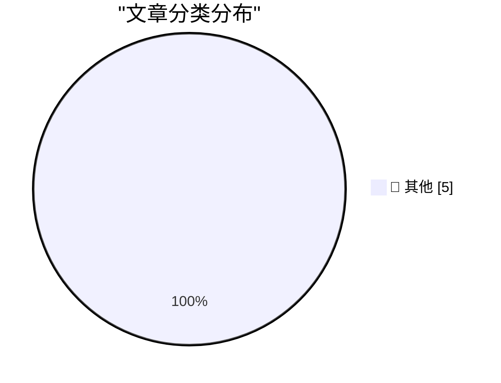

# 📰 AI 博客每日精选 — 2026-02-22

> 来自 Karpathy 推荐的 92 个顶级技术博客，AI 精选 Top 5

## 🏆 今日必读

🥇 **Nvidia was only invited to invest**

[Nvidia was only invited to invest](https://idiallo.com/byte-size/nvidia-was-only-invited-to-invest?src=feed) — idiallo.com · 8 小时前 · 📝 其他

> Nvidia was only invited to invest

🥈 **OpenBenches at FOSDEM**

[OpenBenches at FOSDEM](https://shkspr.mobi/blog/2026/02/openbenches-at-fosdem/) — shkspr.mobi · 19 小时前 · 📝 其他

> OpenBenches at FOSDEM

🥉 **10,000,000th Fibonacci number**

[10,000,000th Fibonacci number](https://www.johndcook.com/blog/2026/02/21/f10000000/) — johndcook.com · 7 小时前 · 📝 其他

> 10,000,000th Fibonacci number

---

## 📊 数据概览

| 扫描源 | 抓取文章 | 时间范围 | 精选 |
|:---:|:---:|:---:|:---:|
| 84/92 | 2414 篇 → 5 篇 | 24h | **5 篇** |

### 分类分布

---

## 📝 其他

### 1. Nvidia was only invited to invest

[Nvidia was only invited to invest](https://idiallo.com/byte-size/nvidia-was-only-invited-to-invest?src=feed) — **idiallo.com** · 8 小时前 · ⭐ 15/30

> Nvidia was only invited to invest

---

### 2. OpenBenches at FOSDEM

[OpenBenches at FOSDEM](https://shkspr.mobi/blog/2026/02/openbenches-at-fosdem/) — **shkspr.mobi** · 19 小时前 · ⭐ 15/30

> OpenBenches at FOSDEM

---

### 3. 10,000,000th Fibonacci number

[10,000,000th Fibonacci number](https://www.johndcook.com/blog/2026/02/21/f10000000/) — **johndcook.com** · 7 小时前 · ⭐ 15/30

> 10,000,000th Fibonacci number

---

### 4. Computing big, certified Fibonacci numbers

[Computing big, certified Fibonacci numbers](https://www.johndcook.com/blog/2026/02/21/big-certified-fibonacci/) — **johndcook.com** · 13 小时前 · ⭐ 15/30

> Computing big, certified Fibonacci numbers

---

### 5. Reading List 02/21/26

[Reading List 02/21/26](https://www.construction-physics.com/p/reading-list-022126) — **construction-physics.com** · 18 小时前 · ⭐ 15/30

> Reading List 02/21/26

---

*生成于 2026-02-22 08:01 | 扫描 84 源 → 获取 2414 篇 → 精选 5 篇*
*基于 [Hacker News Popularity Contest 2025](https://refactoringenglish.com/tools/hn-popularity/) RSS 源列表，由 [Andrej Karpathy](https://x.com/karpathy) 推荐*
*由「懂点儿AI」制作，欢迎关注同名微信公众号获取更多 AI 实用技巧 💡*
