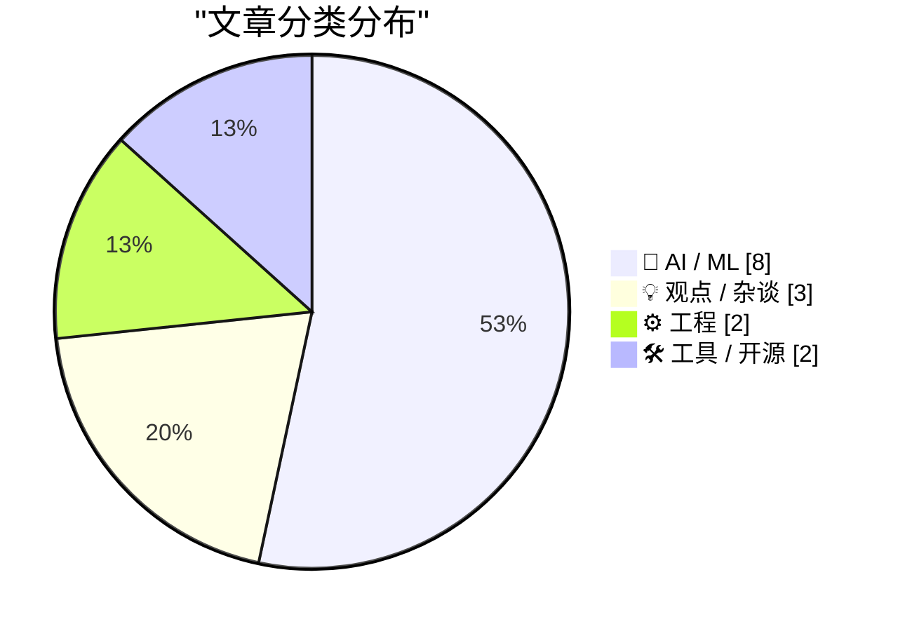
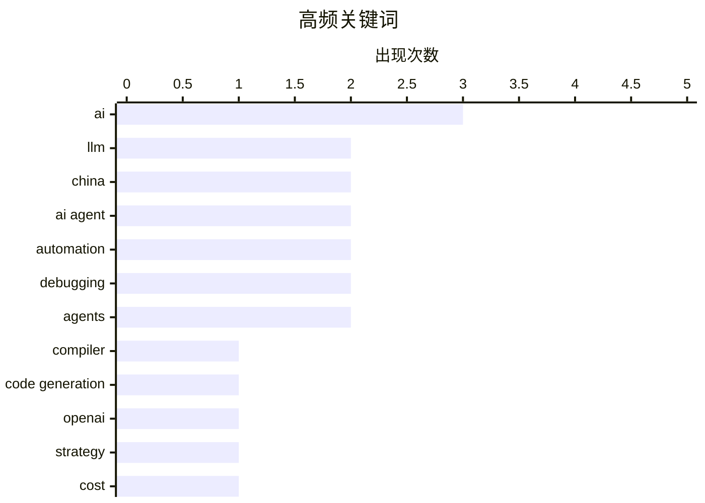

# 📰 AI 博客每日精选 — 2026-02-23

> 来自 117 个技术博客和社交媒体源，AI 精选 Top 15

## 📝 今日看点

今日技术圈聚焦于AI能力的深度进化与产业现实交汇。一方面，AI正从辅助工具迈向核心生产领域，如自主构建编译器、规模化处理复杂工程任务，展现出替代高级智力劳动的潜力。另一方面，行业进入战略调整与落地攻坚期，头部公司收缩基建投资转向商业变现，而中国则在人形机器人等硬科技量产上取得领先。同时，关于AI协作本质的讨论日益深入，业界更关注如何超越效率工具定位，实现真正的思维协同与创新突破。

---

## 🏆 今日必读

🥇 **Claude C 编译器：它揭示了软件的未来**

[The Claude C Compiler: What It Reveals About the Future of Software](https://simonwillison.net/2026/Feb/22/ccc/#atom-everything) — simonwillison.net · 42 分钟前 · 🤖 AI / ML

> Anthropic 的研究员 Nicholas Carlini 利用 Claude Opus 4.6 模型并行协作，成功构建了一个功能性的 C 编译器。该项目展示了大型语言模型（LLM）不仅能生成代码片段，还能理解并整合复杂的系统级编程概念，完成从源代码到可执行文件的完整编译流程。这标志着 AI 在软件工程中的角色正从辅助工具向核心构建者演进，预示着未来软件可能由 AI 自主设计、实现和优化。

💡 **为什么值得读**: 通过一个具体的、高难度的技术实现案例，前瞻性地揭示了 AI 如何从根本上改变软件开发和系统构建的范式。

🏷️ LLM, compiler, code generation

🥈 **OpenAI 战略转向：AI 基础设施投资计划大幅削减，并开始探索广告变现**

[OpenAI双管齐下了🙊 原计划到2030年砸1.4万亿美元搞AI基础设施，现在直接砍到6000亿美元！砍掉一半多！ Sam Altman几个月前还喊“all in”，现在谨慎多了😂 ...](https://x.com/abskoop/status/2025486517121286619) — 𝕏 @abskoop · 16 小时前 · 🤖 AI / ML

> OpenAI 将其原定到 2030 年高达 1.4 万亿美元的 AI 基础设施投资计划大幅削减至约 6000 亿美元，降幅超过一半。公司策略转向将支出与收入挂钩，2025年营收已超 131 亿美元，但因推理成本暴涨 3 倍，毛利率从 40% 降至 33%。为应对成本压力，OpenAI 已在 ChatGPT 免费版中开始测试广告投放。

💡 **为什么值得读**: 揭示了全球领先的 AI 公司在疯狂扩张后如何面对现实成本压力，进行战略收缩与商业化探索的关键转折点。

🏷️ OpenAI, strategy, cost, revenue

🥉 **2025年全球人形机器人出货量：中国厂商包揽前六，量产能力遥遥领先**

[2025全球人形机器人出货量出来了🤖 中国直接把前6全包了：智元AgiBot 5168台第一，宇树Unitree 4200台第二，优必选UBTECH 1000台第三，美国Figure、特斯拉Opti...](https://x.com/abskoop/status/2025523491240611882) — 𝕏 @abskoop · 13 小时前 · 🤖 AI / ML

> 根据 Omdia 数据，2025 年全球人形机器人出货量排名中，中国厂商包揽前六名。智元 AgiBot 以 5168 台位居第一，宇树 Unitree 以 4200 台位列第二，优必选 UBTECH 以 1000 台排名第三。相比之下，美国的 Figure、特斯拉 Optimus 和 Agility Robotics 等厂商出货量均在 150 台左右。数据表明，中国在人形机器人的量产速度和规模上已明显领先于其他国家。

💡 **为什么值得读**: 用具体数据直观展现了中国在人形机器人这一前沿硬科技领域的产业化优势与全球竞争格局。

🏷️ humanoid robot, manufacturing, China

4️⃣ **AI 降临派的局限：效率之外，真正的创新在于突破人类经验的边界**

[AI 降临派是工业革命效率至上的放大，看似很有想象力，细想却缺少想象力。 比如 EvoMap。Agents 吞下一颗颗胶囊后，经验复用的效率得到提升。然后呢，效率之外的...](https://x.com/lifesinger/status/2025391597286752611) — 𝕏 @lifesinger · 22 小时前 · 💡 观点 / 杂谈

> 文章批判了当前 AI 发展过于聚焦于“效率至上”的思维，认为这仅是工业革命逻辑的放大。作者指出，无论是 AI 编程还是视频生成，其产出都未能超越人类既有经验和想象的边界。真正的创新和“新世界”存在于语言、经验和时间被压缩后的“边界之外”与“巨大的不知”之中。效率的提升只是在优化旧世界，而非创造新世界。

💡 **为什么值得读**: 提供了一个超越技术细节的哲学视角，犀利地指出了当前 AI 热潮在想象力与创造性上的根本性瓶颈。

🏷️ AI, efficiency, limitation, imagination

5️⃣ **7 条与 AI Agent 高效协作的实用法则**

[7 条与 AI Agent 协作的法则 01: Context, not control（给背景，而不是控制欲） 别去微调AI 的每一步，给它清晰的背景和最终目标，让它自己找路。它往往比你设...](https://x.com/sodawhite_dev/status/2025481182180413477) — 𝕏 @sodawhite_dev · 16 小时前 · 🤖 AI / ML

> 作者总结了七条与 AI Agent 协作的核心法则，旨在提升协作效率与产出质量。关键法则包括：提供清晰背景而非步步控制（Context, not control）；通过不断施压测试 AI 的能力边界（Push until it breaks）；通过大量实践培养使用直觉（Put in the reps）；鼓励大胆尝试甚至“浪费”Token 以激发创意（Try everything. Waste tokens.）；以及公开构建过程以加速学习（Build in public）。

💡 **为什么值得读**: 提炼自深度实践的经验法则，极具操作性和启发性，能立刻提升你与 AI 协作的效率和深度。

🏷️ AI Agent, prompt engineering, best practices

---

## 📊 数据概览

| 扫描源 | 抓取文章 | 时间范围 | 精选 |
|:---:|:---:|:---:|:---:|
| 107/117 | 2733 篇 → 81 篇 | 24h | **15 篇** |

### 分类分布



### 高频关键词



<details>
<summary>📈 纯文本关键词图（终端友好）</summary>

```
ai              │ ████████████████████ 3
llm             │ █████████████░░░░░░░ 2
china           │ █████████████░░░░░░░ 2
ai agent        │ █████████████░░░░░░░ 2
automation      │ █████████████░░░░░░░ 2
debugging       │ █████████████░░░░░░░ 2
agents          │ █████████████░░░░░░░ 2
compiler        │ ███████░░░░░░░░░░░░░ 1
code generation │ ███████░░░░░░░░░░░░░ 1
openai          │ ███████░░░░░░░░░░░░░ 1
```

</details>

### 🏷️ 话题标签

**ai**(3) · **llm**(2) · **china**(2) · ai agent(2) · automation(2) · debugging(2) · agents(2) · compiler(1) · code generation(1) · openai(1) · strategy(1) · cost(1) · revenue(1) · humanoid robot(1) · manufacturing(1) · efficiency(1) · limitation(1) · imagination(1) · prompt engineering(1) · best practices(1)

---

## 🤖 AI / ML

### 1. Claude C 编译器：它揭示了软件的未来

[The Claude C Compiler: What It Reveals About the Future of Software](https://simonwillison.net/2026/Feb/22/ccc/#atom-everything) — **simonwillison.net** · 42 分钟前 · ⭐ 26/30

> Anthropic 的研究员 Nicholas Carlini 利用 Claude Opus 4.6 模型并行协作，成功构建了一个功能性的 C 编译器。该项目展示了大型语言模型（LLM）不仅能生成代码片段，还能理解并整合复杂的系统级编程概念，完成从源代码到可执行文件的完整编译流程。这标志着 AI 在软件工程中的角色正从辅助工具向核心构建者演进，预示着未来软件可能由 AI 自主设计、实现和优化。

🏷️ LLM, compiler, code generation

---

### 2. OpenAI 战略转向：AI 基础设施投资计划大幅削减，并开始探索广告变现

[OpenAI双管齐下了🙊 原计划到2030年砸1.4万亿美元搞AI基础设施，现在直接砍到6000亿美元！砍掉一半多！ Sam Altman几个月前还喊“all in”，现在谨慎多了😂 ...](https://x.com/abskoop/status/2025486517121286619) — **𝕏 @abskoop** · 16 小时前 · ⭐ 26/30

> OpenAI 将其原定到 2030 年高达 1.4 万亿美元的 AI 基础设施投资计划大幅削减至约 6000 亿美元，降幅超过一半。公司策略转向将支出与收入挂钩，2025年营收已超 131 亿美元，但因推理成本暴涨 3 倍，毛利率从 40% 降至 33%。为应对成本压力，OpenAI 已在 ChatGPT 免费版中开始测试广告投放。

🏷️ OpenAI, strategy, cost, revenue

---

### 3. 2025年全球人形机器人出货量：中国厂商包揽前六，量产能力遥遥领先

[2025全球人形机器人出货量出来了🤖 中国直接把前6全包了：智元AgiBot 5168台第一，宇树Unitree 4200台第二，优必选UBTECH 1000台第三，美国Figure、特斯拉Opti...](https://x.com/abskoop/status/2025523491240611882) — **𝕏 @abskoop** · 13 小时前 · ⭐ 25/30

> 根据 Omdia 数据，2025 年全球人形机器人出货量排名中，中国厂商包揽前六名。智元 AgiBot 以 5168 台位居第一，宇树 Unitree 以 4200 台位列第二，优必选 UBTECH 以 1000 台排名第三。相比之下，美国的 Figure、特斯拉 Optimus 和 Agility Robotics 等厂商出货量均在 150 台左右。数据表明，中国在人形机器人的量产速度和规模上已明显领先于其他国家。

🏷️ humanoid robot, manufacturing, China

---

### 4. 7 条与 AI Agent 高效协作的实用法则

[7 条与 AI Agent 协作的法则 01: Context, not control（给背景，而不是控制欲） 别去微调AI 的每一步，给它清晰的背景和最终目标，让它自己找路。它往往比你设...](https://x.com/sodawhite_dev/status/2025481182180413477) — **𝕏 @sodawhite_dev** · 16 小时前 · ⭐ 24/30

> 作者总结了七条与 AI Agent 协作的核心法则，旨在提升协作效率与产出质量。关键法则包括：提供清晰背景而非步步控制（Context, not control）；通过不断施压测试 AI 的能力边界（Push until it breaks）；通过大量实践培养使用直觉（Put in the reps）；鼓励大胆尝试甚至“浪费”Token 以激发创意（Try everything. Waste tokens.）；以及公开构建过程以加速学习（Build in public）。

🏷️ AI Agent, prompt engineering, best practices

---

### 5. 为 AI 助理配备互联网“万能钥匙”：突破数字身份壁垒，实现自主探索

[给我的 AI 助理配了一把互联网“万能钥匙”。🔑 刚才在读 Greg Isenberg 提的 14 个 Agent 演进阶段，意识到当下的 AI Agent 最大的短板不是大脑，而是“数字...](https://x.com/runes_leo/status/2025544802218180951) — **𝕏 @runes_leo** · 12 小时前 · ⭐ 24/30

> 作者指出当前 AI Agent 的核心短板是缺乏“数字身份”，无法跨越网站的登录/注册（Auth）壁垒。他分享了一套解决方案：集成“Login Machine”架构，让 AI 通过视觉模型（Gemini Vision）动态识别登录表单，而非依赖脆硬的编码；为 AI 配备一套可丢弃的数字化身份沙盒；并确保密码等敏感信息由本地系统安全注入，AI 不接触明文。

🏷️ AI Agent, authentication, automation

---

### 6. 国行 iPhone AI 功能准备就绪：iOS 26.4 测试版已上线设置入口

[国行 iPhone 为 AI 已经准备了整整622天！ 最新进展：有网友发现 iOS 26.4 测试版已上线 AI 设置入口！ 对 Siri 说 开启 AI 功能 ，就能跳到页面！ Apple Inte...](https://x.com/abskoop/status/2025510526072377366) — **𝕏 @abskoop** · 14 小时前 · ⭐ 24/30

> 在历经 622 天的准备后，国行 iPhone 的 AI 功能迎来实质性进展。网友发现在最新的 iOS 26.4 测试版中，已出现 AI 功能设置入口，用户可通过呼唤 Siri 并说出“开启 AI 功能”指令跳转至相关页面。这标志着苹果的 Apple Intelligence 功能可能即将在国行设备上正式推出。

🏷️ Apple Intelligence, iOS, Siri, China

---

### 7. LangChain 社区聚焦：智能体工程分析

[RT LangChain OSS: LangChain Community Spotlight: Agent Engineering Analysis 🏗️ Analysis explores how LangChain addresses production challenges for...](https://x.com/LangChain/status/2025631685405286832) — **𝕏 @LangChain** · 6 小时前 · ⭐ 23/30

> 一篇分析文章探讨了 LangChain 如何解决长周期运行智能体在生产环境中的核心挑战。文章重点分析了调试、测试和部署三大难题，并将 LangChain 定位为“智能体领域的 Datadog/GitHub”。其核心观点是，LangChain 通过提供一套标准化工具和平台，正在定义和推动智能体工程这一新兴领域。

🏷️ LangChain, agent, production, debugging

---

### 8. X平台测试新功能：发帖新增“Made with AI”开关

[X测试新功能：发帖新增 Made with AI 开关 一键开启，自动打上AI生成标签 提升透明度，防假新闻 🥸 目前功能还在测试中 #X更新 #MadeWithAI](https://x.com/abskoop/status/2025615683435012606) — **𝕏 @abskoop** · 7 小时前 · ⭐ 22/30

> X平台正在测试一项新功能，允许用户在发帖时一键开启“Made with AI”标签。该功能旨在自动为AI生成的内容打上标识，以提升平台内容的透明度，并有助于防止虚假新闻的传播。目前该功能仍处于测试阶段。

🏷️ X, AI labeling, content moderation

---

## 💡 观点 / 杂谈

### 9. AI 降临派的局限：效率之外，真正的创新在于突破人类经验的边界

[AI 降临派是工业革命效率至上的放大，看似很有想象力，细想却缺少想象力。 比如 EvoMap。Agents 吞下一颗颗胶囊后，经验复用的效率得到提升。然后呢，效率之外的...](https://x.com/lifesinger/status/2025391597286752611) — **𝕏 @lifesinger** · 22 小时前 · ⭐ 25/30

> 文章批判了当前 AI 发展过于聚焦于“效率至上”的思维，认为这仅是工业革命逻辑的放大。作者指出，无论是 AI 编程还是视频生成，其产出都未能超越人类既有经验和想象的边界。真正的创新和“新世界”存在于语言、经验和时间被压缩后的“边界之外”与“巨大的不知”之中。效率的提升只是在优化旧世界，而非创造新世界。

🏷️ AI, efficiency, limitation, imagination

---

### 10. AI 协作不等于思考退化：关键在于是否外包了“想”的过程

[同意写作训练思考，但"让 LLM 写 = 退化"这个等号画太快了。 我每天跟 AI 协作十几个小时，体感是：AI 替你写 ≠ AI 替你想。 我的工作流是语音先想清楚，说给 A...](https://x.com/runes_leo/status/2025595889545625785) — **𝕏 @runes_leo** · 9 小时前 · ⭐ 24/30

> 作者反驳了“让 LLM 写作等于思维退化”的观点，认为关键在于区分“AI 替你写”和“AI 替你想”。他分享的个人工作流是：自己先用语音想清楚核心思路，再由 AI 协助进行结构化和文字表达。真正的退化发生在将“思考”这一步也完全外包时。一个简单的判断标准是：关闭 AI 后，你能否在 5 分钟内将一件事讲明白。

🏷️ AI, workflow, thinking, writing

---

### 11. 从飞机升力原理看当前AI繁荣：工程实践领先于理论理解

[RT Benson Sun: 昨天提到，現在 AI 的繁榮，是資本+工程面大力出奇蹟的結果，LLM 在學術界眼中其實有很大的缺陷。 這種現象，還有一個更經典的案例： 其實人類並...](https://x.com/dotey/status/2025635463273304363) — **𝕏 @dotey** · 12 小时前 · ⭐ 23/30

> 文章以飞机升力原理为例，类比当前AI（尤其是大语言模型）的发展现状。作者指出，尽管工程上已能造出波音747，但人类对升力产生的经典“等时理论”解释在物理上是错误的，对称机翼和倒飞现象即可证伪。同样，当前AI的繁荣很大程度上是资本和工程实践“大力出奇迹”的结果，而非基于完全坚实的理论。其核心观点是，复杂的工程系统往往可以在理论不完备的情况下取得巨大成功。

🏷️ LLM, engineering, science, limitations

---

## ⚙️ 工程

### 12. 用 50 个并行 AI 代码分析器规模化处理海量 GitHub PR 和 Issue

[Been wrangling a lot of time how to deal with the onslaught of PRs, none of the solutions that are out there seem made for our scale. I spun up 50 cod...](https://x.com/steipete/status/2025591780595429385) — **𝕏 @steipete** · 9 小时前 · ⭐ 24/30

> 作者为了解决大规模开源项目中海量 Pull Requests (PR) 和 Issues 的处理难题，设计了一套高效的 AI 驱动工作流。他并行启动 50 个 AI 代码分析器，让每个 AI 独立分析一个 PR，并生成包含代码变更、意图、风险等多维度信号的 JSON 报告。然后，将所有报告汇总到一个会话中，进行全局查询、去重、自动关闭或合并等批量操作。此方法同样适用于处理 Issues。

🏷️ code review, AI, automation, scale

---

### 13. SpaceX 星舰实现历史性回收：275 吨超级重型助推器被发射塔臂成功“空中捕获”

[The Super Heavy catch that broke the internet 厉害啊，275吨助推器被塔臂一把抓住！🤯 马老板刚官宣：星舰下个月（3月）又要飞了！🚀 #SpaceX #Starship](https://x.com/abskoop/status/2025403163038425246) — **𝕏 @abskoop** · 21 小时前 · ⭐ 23/30

> SpaceX 实现了航天史上里程碑式的一刻：其“星舰”系统的超级重型助推器在完成发射任务后，被发射塔的机械臂在空中成功捕获。这个重达 275 吨的庞然大物被平稳回收。埃隆·马斯克已官宣，星舰将于下个月（3月）再次执行发射任务。

🏷️ SpaceX, Starship, rocket, launch

---

## 🛠 工具 / 开源

### 14. 🌟 LangSmith Insights 智能体 🌟

[🌟 LangSmith Insights Agent 🌟 Use LangSmith Insights to group traces and find emergent usage patterns of your agents 🔎 Now with the ability to...](https://x.com/LangChain/status/2025612841819025834) — **𝕏 @LangChain** · 7 小时前 · ⭐ 23/30

> LangSmith Insights 功能升级，现在能够对智能体的运行轨迹进行分组和分析，以发现其使用模式。关键更新是新增了设置定时任务的能力，支持运行周期性的分析任务。这使开发者能自动化监控智能体行为，洞察其在实际使用中的演变趋势。

🏷️ LangSmith, monitoring, agents, analytics

---

### 15. LangChain 社区聚焦：agent-debugger 终端调试器

[RT LangChain OSS: LangChain Community Spotlight: agent-debugger 🐛🔍 A terminal debugger for LangGraph and LangChain agents featuring semantic bre...](https://x.com/LangChain/status/2025601482746470592) — **𝕏 @LangChain** · 8 小时前 · ⭐ 23/30

> 社区项目 agent-debugger 是一款专为 LangGraph 和 LangChain 智能体设计的终端调试工具。其核心创新是引入了“语义断点”，允许开发者根据智能体的行为模式（而非代码行号）暂停执行。该工具统一了智能体决策逻辑和底层 Python 代码执行的可见性，极大简化了复杂智能体的调试过程。

🏷️ debugging, LangGraph, agents, development

---

*生成于 2026-02-23 00:41 | 扫描 107 源 → 获取 2733 篇 → 精选 15 篇*
*基于 [Hacker News Popularity Contest 2025](https://refactoringenglish.com/tools/hn-popularity/) RSS 源列表，由 [Andrej Karpathy](https://x.com/karpathy) 推荐*
*由「懂点儿AI」制作，欢迎关注同名微信公众号获取更多 AI 实用技巧 💡*
