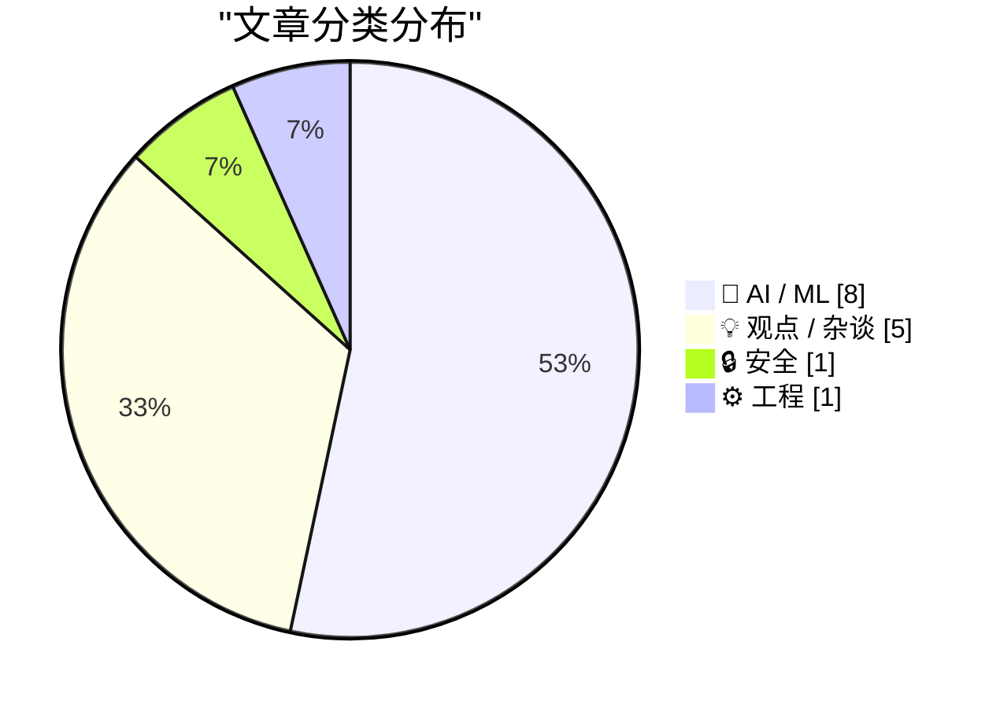
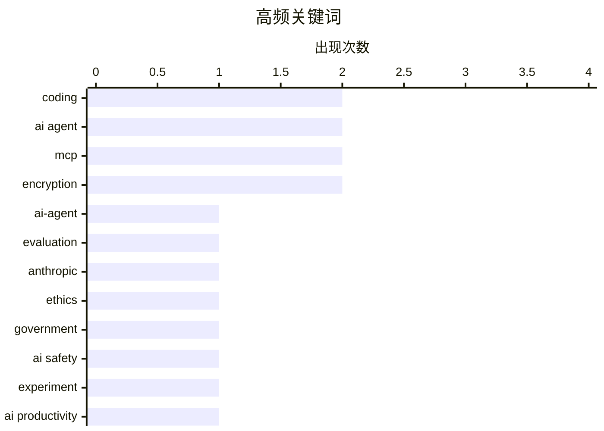

# 📰 AI 博客每日精选 — 2026-02-27

> 来自 117 个技术博客和社交媒体源，AI 精选 Top 15

## 📝 今日看点

今日技术圈聚焦于AI代理的实践浪潮与伦理边界之争。一方面，AI编码代理正从概念走向深度应用，推动开发效率向“分钟级”迈进，并引发对工作流程的重构。另一方面，行业面临严峻的伦理挑战，AI军事化应用的争议与数据安全风险凸显了技术发展的红线。效率革命与责任框架的碰撞，正定义着AI发展的新阶段。

---

## 🏆 今日必读

🥇 **一位AI编码代理怀疑论者的详尽尝试：AI代理编程实践**

[An AI agent coding skeptic tries AI agent coding, in excessive detail](https://simonwillison.net/2026/Feb/27/ai-agent-coding-in-excessive-detail/#atom-everything) — simonwillison.net · 3 小时前 · 🤖 AI / ML

> 文章记录了作者Max Woolf从怀疑到实践AI编码代理的完整过程。他从构建简单的YouTube元数据抓取工具开始，逐步挑战更复杂的项目，最终实现了一个雄心勃勃的自动化系统。整个过程展示了AI编码代理在2025年11月后的显著能力提升，以及如何通过迭代项目来测试其极限。作者的核心结论是，AI编码代理已经变得足够可靠，能够实质性改变开发工作流程。

💡 **为什么值得读**: 通过一位资深开发者的第一手实践记录，为评估AI编码代理的实际能力与局限性提供了极具参考价值的真实案例。

🏷️ AI-agent, coding, evaluation

🥈 **Anthropic与五角大楼因AI军事化应用决裂，引发行业红线之争**

[Anthropic 和五角大楼这周彻底闹翻了。五角大楼要求 Claude 向军方开放所有合法用途，不设任何限制。 Anthropic 拒绝了，坚持 AI 不能用于大规模监控美国公民，...](https://x.com/dotey/status/2027500382910615893) — 𝕏 @dotey · 2 小时前 · 💡 观点 / 杂谈

> Anthropic公司因拒绝五角大楼关于取消AI使用限制（包括大规模监控和自主致命武器）的要求，导致一份2亿美元的合同面临取消，并可能被援引《国防生产法》制裁。公司CEO Dario Amodei以良心为由公开拒绝，随后特朗普命令所有联邦机构停用Anthropic技术。OpenAI的Sam Altman发布内部备忘录，声援Anthropic并明确将大规模监控和自主致命武器定为行业红线。OpenAI和Google员工也联合签署了公开信支持Anthropic。

💡 **为什么值得读**: 此事件标志着AI伦理从理论探讨进入商业与政治的实战冲突，是理解未来AI治理与公司责任的关键案例。

🏷️ Anthropic, ethics, government, AI safety

🥉 **一位AI编码代理怀疑论者的详尽尝试：AI代理编程实践**

[An AI agent coding skeptic tries AI agent coding, in excessive detail](https://minimaxir.com/2026/02/ai-agent-coding/) — minimaxir.com · 5 小时前 · 🤖 AI / ML

> 文章记录了作者Max Woolf从怀疑到实践AI编码代理的完整过程。他从构建简单的YouTube元数据抓取工具开始，逐步挑战更复杂的项目，最终实现了一个雄心勃勃的自动化系统。整个过程展示了AI编码代理在2025年11月后的显著能力提升，以及如何通过迭代项目来测试其极限。作者的核心结论是，AI编码代理已经变得足够可靠，能够实质性改变开发工作流程。

💡 **为什么值得读**: 通过一位资深开发者的第一手实践记录，为评估AI编码代理的实际能力与局限性提供了极具参考价值的真实案例。

🏷️ AI agent, coding, experiment

4️⃣ **Karpathy：AI开发应从10小时缩至1分钟，需个人上下文、API与技能库**

[Karpathy 说他花 1 小时让 AI 写了个心跳追踪面板，以前要 10 小时。但他真正想说的是：这件事本该 1 分钟。 差什么？三样东西——AI 要有你的个人上下文，外部...](https://x.com/runes_leo/status/2027256883283997128) — 𝕏 @runes_leo · 18 小时前 · 🤖 AI / ML

> Andrej Karpathy以1小时构建心跳追踪面板（过去需10小时）为例，指出理想状态应是1分钟完成。实现这一目标缺失三个关键要素：AI需具备个人工作上下文记忆、外部服务需提供可供AI直接调用的API（如MCP协议）、以及将常用能力封装成可复用的技能模块。他认为从10小时到1小时的效率跃迁已经发生，从1小时到1分钟只是时间问题，这预示着高度定制化软件时代的到来。

💡 **为什么值得读**: 清晰地指出了当前AI辅助开发的核心瓶颈与未来演进方向，为开发者构建个人AI工作流提供了具体的技术蓝图。

🏷️ AI Productivity, Context, MCP, Skills

5️⃣ **Block裁员40%引AI效率革命，个人应尽早将AI工具深度融入工作**

[Jack 把 Block 从一万人裁到六千人，理由是 AI 让小团队就能干大团队的活。 看到这条的第一反应不是震惊，是"该来的还是来了"。 我自己全职用 AI 搞开发、跑策略...](https://x.com/runes_leo/status/2027239015515140246) — 𝕏 @runes_leo · 19 小时前 · 💡 观点 / 杂谈

> Block公司（原Square）将员工从1万人裁至6千人，理由是AI能让小团队完成大团队的工作。作者基于自身全职使用AI进行开发、策略和内容创作两个多月的体验，证实了这一趋势的真实性，并预测类似裁员新闻将频繁出现。对于普通人，作者的建议是立即开始挑选一个AI工具并认真使用，使其成为工作流程的一部分，无需一步到位，关键在于先动手实践。

💡 **为什么值得读**: 结合行业巨头决策与个人亲身体验，尖锐地指出了AI引发的生产力变革已进入实质性重组阶段，具有强烈的现实警示和行动指导意义。

🏷️ AI Impact, Workforce, Trend

---

## 📊 数据概览

| 扫描源 | 抓取文章 | 时间范围 | 精选 |
|:---:|:---:|:---:|:---:|
| 108/117 | 2724 篇 → 113 篇 | 24h | **15 篇** |

### 分类分布



### 高频关键词



<details>
<summary>📈 纯文本关键词图（终端友好）</summary>

```
coding     │ ████████████████████ 2
ai agent   │ ████████████████████ 2
mcp        │ ████████████████████ 2
encryption │ ████████████████████ 2
ai-agent   │ ██████████░░░░░░░░░░ 1
evaluation │ ██████████░░░░░░░░░░ 1
anthropic  │ ██████████░░░░░░░░░░ 1
ethics     │ ██████████░░░░░░░░░░ 1
government │ ██████████░░░░░░░░░░ 1
ai safety  │ ██████████░░░░░░░░░░ 1
```

</details>

### 🏷️ 话题标签

**coding**(2) · **ai agent**(2) · **mcp**(2) · encryption(2) · ai-agent(1) · evaluation(1) · anthropic(1) · ethics(1) · government(1) · ai safety(1) · experiment(1) · ai productivity(1) · context(1) · skills(1) · ai impact(1) · workforce(1) · trend(1) · openai(1) · investment(1) · infrastructure(1)

---

## 🤖 AI / ML

### 1. 一位AI编码代理怀疑论者的详尽尝试：AI代理编程实践

[An AI agent coding skeptic tries AI agent coding, in excessive detail](https://simonwillison.net/2026/Feb/27/ai-agent-coding-in-excessive-detail/#atom-everything) — **simonwillison.net** · 3 小时前 · ⭐ 28/30

> 文章记录了作者Max Woolf从怀疑到实践AI编码代理的完整过程。他从构建简单的YouTube元数据抓取工具开始，逐步挑战更复杂的项目，最终实现了一个雄心勃勃的自动化系统。整个过程展示了AI编码代理在2025年11月后的显著能力提升，以及如何通过迭代项目来测试其极限。作者的核心结论是，AI编码代理已经变得足够可靠，能够实质性改变开发工作流程。

🏷️ AI-agent, coding, evaluation

---

### 2. 一位AI编码代理怀疑论者的详尽尝试：AI代理编程实践

[An AI agent coding skeptic tries AI agent coding, in excessive detail](https://minimaxir.com/2026/02/ai-agent-coding/) — **minimaxir.com** · 5 小时前 · ⭐ 26/30

> 文章记录了作者Max Woolf从怀疑到实践AI编码代理的完整过程。他从构建简单的YouTube元数据抓取工具开始，逐步挑战更复杂的项目，最终实现了一个雄心勃勃的自动化系统。整个过程展示了AI编码代理在2025年11月后的显著能力提升，以及如何通过迭代项目来测试其极限。作者的核心结论是，AI编码代理已经变得足够可靠，能够实质性改变开发工作流程。

🏷️ AI agent, coding, experiment

---

### 3. Karpathy：AI开发应从10小时缩至1分钟，需个人上下文、API与技能库

[Karpathy 说他花 1 小时让 AI 写了个心跳追踪面板，以前要 10 小时。但他真正想说的是：这件事本该 1 分钟。 差什么？三样东西——AI 要有你的个人上下文，外部...](https://x.com/runes_leo/status/2027256883283997128) — **𝕏 @runes_leo** · 18 小时前 · ⭐ 26/30

> Andrej Karpathy以1小时构建心跳追踪面板（过去需10小时）为例，指出理想状态应是1分钟完成。实现这一目标缺失三个关键要素：AI需具备个人工作上下文记忆、外部服务需提供可供AI直接调用的API（如MCP协议）、以及将常用能力封装成可复用的技能模块。他认为从10小时到1小时的效率跃迁已经发生，从1小时到1分钟只是时间问题，这预示着高度定制化软件时代的到来。

🏷️ AI Productivity, Context, MCP, Skills

---

### 4. OpenAI获软银、英伟达、亚马逊支持，投资扩建AI基础设施

[Helping AI reach more people requires deep collaboration across the ecosystem. Today we’re announcing new investment, with support from @SoftBank, @N...](https://x.com/OpenAI/status/2027376050263793814) — **𝕏 @OpenAI** · 10 小时前 · ⭐ 26/30

> OpenAI宣布获得软银、英伟达和亚马逊的新投资，旨在扩展AI基础设施，以推动AI技术普及至更多人。该合作强调生态系统深度协作对于实现AI普惠的重要性。投资将直接用于建设支撑大规模AI应用所需的底层计算与网络资源。

🏷️ OpenAI, investment, infrastructure

---

### 5. 构建AI代理记忆系统：从三层架构到渐进式实践路径

[给 Agent 搭记忆系统的，这篇必读。 从"Context Window 不是记忆"讲起，手把手搭了热/温/冷三层架构，写入路由、先读再写防冲突、温度衰减、冷数据自动归档全覆...](https://x.com/runes_leo/status/2027525906034463119) — **𝕏 @runes_leo** · 31 分钟前 · ⭐ 25/30

> 文章系统阐述了AI代理记忆系统的构建，核心论点是上下文窗口并非真正的记忆。作者提出了热、温、冷三层记忆架构，并详细讲解了写入路由、先读后写防冲突、温度衰减和冷数据自动归档等关键技术。最实用的部分是提供了渐进式实施路径，阶段0仅需3个文件即可启动，无需追求完美架构。作者指出，独立实践者得出相似架构，验证了“文件即记忆”这一路径的可行性。

🏷️ AI Agent, Memory System, Architecture

---

### 6. AI 模型的"品味"是所有人的平均值。看着像那么回事，但对任何一个具体的人来说，总差那么一点。 这篇文章把这个问题讲的很清楚：品味不是客观标准，是文化共识，...

[AI 模型的"品味"是所有人的平均值。看着像那么回事，但对任何一个具体的人来说，总差那么一点。 这篇文章把这个问题讲的很清楚：品味不是客观标准，是文化共识，...](https://x.com/runes_leo/status/2027302433609625901) — **𝕏 @runes_leo** · 15 小时前 · ⭐ 24/30

> AI 模型的"品味"是所有人的平均值。看着像那么回事，但对任何一个具体的人来说，总差那么一点。<br><br>这篇文章把这个问题讲的很清楚：品味不是客观标准，是文化共识，而且一直在变。通用模型抓不住它，因为写下来的时候就已经过时了。<br><br>真正有用的路径是把你的个人品味蒸馏给 AI。怎么蒸馏？每次你改它的输出，就是一次标注。Cursor/Claude 每次接受或拒绝补全，就在训练"你觉得什

🏷️ AI Taste, Personalization, Fine-tuning

---

### 7. 用了两个月手搓版 auto-memory，现在官方出了原生版。 对普通用户是大升级——不用写任何东西，Claude 自己记住你的偏好和踩过的坑。 但用深了会发现，记住什么...

[用了两个月手搓版 auto-memory，现在官方出了原生版。 对普通用户是大升级——不用写任何东西，Claude 自己记住你的偏好和踩过的坑。 但用深了会发现，记住什么...](https://x.com/runes_leo/status/2027220184176763361) — **𝕏 @runes_leo** · 20 小时前 · ⭐ 24/30

> 用了两个月手搓版 auto-memory，现在官方出了原生版。<br><br>对普通用户是大升级——不用写任何东西，Claude 自己记住你的偏好和踩过的坑。<br><br>但用深了会发现，记住什么不是最难的部分。难的是：什么时候该忘、什么该按需加载<br>不是每次都塞进来、不同项目的记忆怎么隔离。我之前把 17KB 规则全量加载，直接撑 context 窗口。<br><br>auto-memor

🏷️ AI Memory, Claude, Context Management

---

### 8. Nano Banana 2 is seriously solid! { "subject": "before and after lip filler comparison of the same woman", "composition": { "layout": "side-by-side co...

[Nano Banana 2 is seriously solid! { "subject": "before and after lip filler comparison of the same woman", "composition": { "layout": "side-by-side co...](https://x.com/egeberkina/status/2027339496404996324) — **𝕏 @egeberkina** · 12 小时前 · ⭐ 24/30

> Nano Banana 2 is seriously solid!<br><br>{<br>  "subject": "before and after lip filler comparison of the same woman",<br>  "composition": {<br>    "layout": "side-by-side comparison",<br>    "camera_

🏷️ Nano Banana 2, image editing, AI generation

---

## 💡 观点 / 杂谈

### 9. Anthropic与五角大楼因AI军事化应用决裂，引发行业红线之争

[Anthropic 和五角大楼这周彻底闹翻了。五角大楼要求 Claude 向军方开放所有合法用途，不设任何限制。 Anthropic 拒绝了，坚持 AI 不能用于大规模监控美国公民，...](https://x.com/dotey/status/2027500382910615893) — **𝕏 @dotey** · 2 小时前 · ⭐ 27/30

> Anthropic公司因拒绝五角大楼关于取消AI使用限制（包括大规模监控和自主致命武器）的要求，导致一份2亿美元的合同面临取消，并可能被援引《国防生产法》制裁。公司CEO Dario Amodei以良心为由公开拒绝，随后特朗普命令所有联邦机构停用Anthropic技术。OpenAI的Sam Altman发布内部备忘录，声援Anthropic并明确将大规模监控和自主致命武器定为行业红线。OpenAI和Google员工也联合签署了公开信支持Anthropic。

🏷️ Anthropic, ethics, government, AI safety

---

### 10. Block裁员40%引AI效率革命，个人应尽早将AI工具深度融入工作

[Jack 把 Block 从一万人裁到六千人，理由是 AI 让小团队就能干大团队的活。 看到这条的第一反应不是震惊，是"该来的还是来了"。 我自己全职用 AI 搞开发、跑策略...](https://x.com/runes_leo/status/2027239015515140246) — **𝕏 @runes_leo** · 19 小时前 · ⭐ 26/30

> Block公司（原Square）将员工从1万人裁至6千人，理由是AI能让小团队完成大团队的工作。作者基于自身全职使用AI进行开发、策略和内容创作两个多月的体验，证实了这一趋势的真实性，并预测类似裁员新闻将频繁出现。对于普通人，作者的建议是立即开始挑选一个AI工具并认真使用，使其成为工作流程的一部分，无需一步到位，关键在于先动手实践。

🏷️ AI Impact, Workforce, Trend

---

### 11. AI时代新依附关系：提供Know-How者统治，依赖AI者被锁定

[究竟是谁在训练谁？ 能给AI提供know-how的人，他们的知识、经验和判断力就是AI的”原料”。这些人本质上是在定义AI能做什么、怎么做。他们站在食物链顶端，享受...](https://x.com/yangyi/status/2027406279011180950) — **𝕏 @yangyi** · 8 小时前 · ⭐ 25/30

> 文章提出了一个尖锐观点：在AI时代，能向AI提供专业知识与判断力（Know-How）的人处于食物链顶端，他们定义了AI的能力并享受高溢价。而仅仅依赖AI提供Know-How的人，实则在为工具付费并导致自身能力退化，形成一种难以摆脱的新型依附关系。这种结构可能大幅降低阶层流动性，使依赖者永久停留在“操作员”层面。其本质是资本逻辑的新版本，生产资料变成了AI平台与底层Know-How，且更为隐蔽。

🏷️ AI, training, knowledge, dependency

---

### 12. 西弗吉尼亚州反苹果CSAM诉讼实则可能让儿童性侵者逍遥法外

[West Virginia’s Anti-Apple CSAM Lawsuit Would Help Child Predators Walk Free](https://www.techdirt.com/2026/02/25/west-virginias-anti-apple-csam-lawsuit-would-help-child-predators-walk-free/) — **daringfireball.net** · 4 小时前 · ⭐ 24/30

> 文章分析指出，西弗吉尼亚州起诉要求苹果扫描iCloud中的儿童性虐待材料的法律行动可能产生反效果。如果法院强制苹果进行扫描，那么所有被标记的图像都将被视为无搜查令、无合理理由的政府搜查所得证据。根据美国宪法第四修正案的排除规则，辩护律师可以要求法庭排除这些证据，并很可能成功，从而导致本可定罪的儿童性侵者因证据无效而被释放。

🏷️ privacy, CSAM, encryption

---

### 13. 2月份总结：AI从‘会聊天’进化到‘会用电脑、写歌、开发软件’… 这已经不是加速了，这是光速 这才是刚刚过完春节的第一周 2026年底我们会看到什么？ AI起飞… ...

[2月份总结：AI从‘会聊天’进化到‘会用电脑、写歌、开发软件’… 这已经不是加速了，这是光速 这才是刚刚过完春节的第一周 2026年底我们会看到什么？ AI起飞… ...](https://x.com/sodawhite_dev/status/2027179190114812086) — **𝕏 @sodawhite_dev** · 23 小时前 · ⭐ 24/30

> 2月份总结：AI从‘会聊天’进化到‘会用电脑、写歌、开发软件’…<br>
这已经不是加速了，这是光速<br><br>这才是刚刚过完春节的第一周<br>
2026年底我们会看到什么？<br><br>AI起飞… 人类？<br> 文章强烈警告开发者不要使用通行密钥来加密用户数据。核心原因是用户频繁丢失通行密钥，且可能无法理解其数据已被不可逆加密，从而导致永久性数据丢失。作者Tim Cappalli向整个身份认证行业呼吁，应将通行密钥的用途严格限制在身份验证领域，而非数据加密。

🏷️ passkeys, encryption, data-loss

---

## ⚙️ 工程

### 15. 同感，但我的用法反过来：写代码的模型永远不负责审自己的代码。 我的日常开发全在 Claude Code 里跑 Opus 4.6。写完一个功能或改完一个 bug，不急着提交，先让 ...

[同感，但我的用法反过来：写代码的模型永远不负责审自己的代码。 我的日常开发全在 Claude Code 里跑 Opus 4.6。写完一个功能或改完一个 bug，不急着提交，先让 ...](https://x.com/runes_leo/status/2027269214524903892) — **𝕏 @runes_leo** · 17 小时前 · ⭐ 24/30

> 同感，但我的用法反过来：写代码的模型永远不负责审自己的代码。<br><br>我的日常开发全在 Claude Code 里跑 Opus 4.6。写完一个功能或改完一个 bug，不急着提交，先让 Codex 审一遍。<br><br>具体怎么做的：<br><br>Claude Code 支持 MCP 协议，可以在同一个终端里调用外部模型。我接了一个 Codex MCP Server。写完代码说一句" C

🏷️ AI Coding, Code Review, MCP

---

*生成于 2026-02-27 23:58 | 扫描 108 源 → 获取 2724 篇 → 精选 15 篇*
*基于 [Hacker News Popularity Contest 2025](https://refactoringenglish.com/tools/hn-popularity/) RSS 源列表，由 [Andrej Karpathy](https://x.com/karpathy) 推荐*
*由「懂点儿AI」制作，欢迎关注同名微信公众号获取更多 AI 实用技巧 💡*
