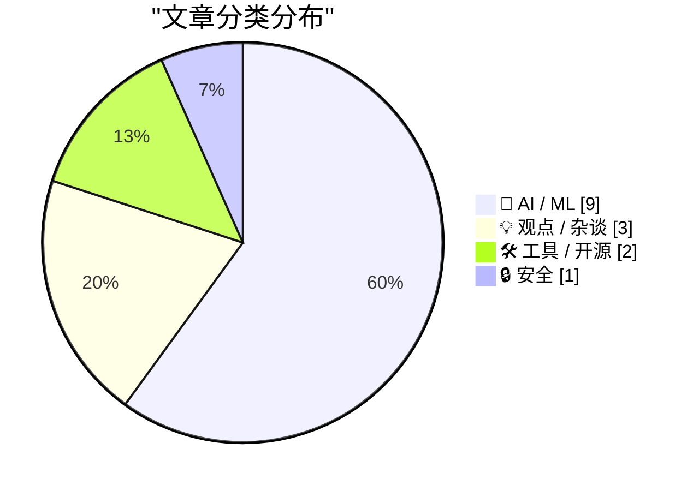
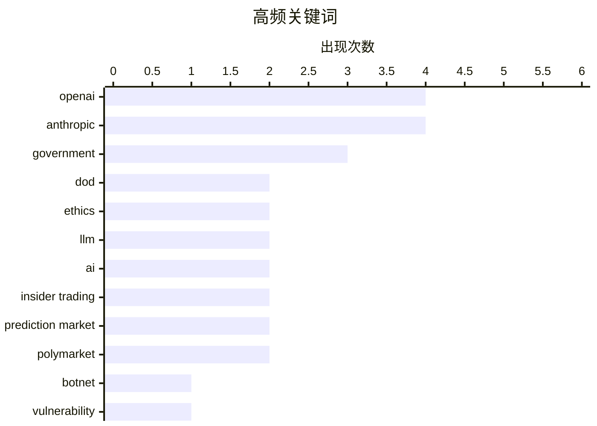

# 📰 AI 博客每日精选 — 2026-02-28

> 来自 117 个技术博客和社交媒体源，AI 精选 Top 15

## 📝 今日看点

今日技术圈聚焦于AI伦理与安全的激烈博弈，以及智能体工程范式的演进。OpenAI与Anthropic在军事AI应用上分道扬镳，凸显出行业在技术部署与道德红线间的重大分歧。同时，AI智能体设计正从堆砌工具转向强化协调与可解释性，以应对日益复杂的认知债务问题。网络安全领域则持续面临国家级黑客组织带来的高级威胁。

---

## 🏆 今日必读

🥇 **谁是“金狼”僵尸网络主控“多特”？**

[Who is the Kimwolf Botmaster “Dort”?](https://krebsonsecurity.com/2026/02/who-is-the-kimwolf-botmaster-dort/) — krebsonsecurity.com · 11 小时前 · 🔒 安全

> 文章追踪了全球最大破坏性僵尸网络 Kimwolf 的幕后操控者“Dort”。自2026年1月漏洞被披露以来，Dort 对安全研究员和本文作者发动了分布式拒绝服务攻击、人肉搜索和邮件洪水攻击，甚至导致特警队被派往研究员家中。文章深入调查了 Dort 的真实身份及其攻击活动的细节。核心结论是，这位匿名攻击者正利用其控制的庞大僵尸网络进行极具侵略性的报复行动。

💡 **为什么值得读**: 本文揭露了顶级网络犯罪分子的攻击手法与报复行为，对安全从业者和企业了解高级持续性威胁具有警示价值。

🏷️ Botnet, Vulnerability, Kimwolf

🥈 **OpenAI与美国国防部谈判AI部署合同，同日特朗普政府叫停与Anthropic合作**

[OpenAI 正在与美国国防部谈判一份 AI 部署合同，就在同一天，特朗普下令联邦政府全面停止与 Anthropic 合作。据 Fortune 报道，Sam Altman 在周五的全员会上向员...](https://x.com/dotey/status/2027564552448016446) — 𝕏 @dotey · 21 小时前 · 🤖 AI / ML

> OpenAI 正与美国国防部谈判AI部署合同，而特朗普政府在同一天下令联邦政府全面停止与 Anthropic 合作。五角大楼接受了 OpenAI 提出的与 Anthropic 几乎相同的安全红线：禁止用于自主武器、国内大规模监控和关键决策。尽管此前国防部批评 Anthropic 的条件是“意识形态化”的，但对 OpenAI 却欣然接受，政治立场被认为是关键区别。Sam Altman 内部表态强调“做正确的事”而非“看似强硬”。

💡 **为什么值得读**: 该事件揭示了AI巨头与政府合作中复杂的政治、伦理与商业博弈，是观察AI治理和产业政策风向的关键案例。

🏷️ OpenAI, Anthropic, DoD, ethics

🥉 **Anthropic声明：因拒绝将Claude用于监控与自主武器，被战争部列为供应链风险**

[Anthropic 刚发表了最新的声明，表示战争部长将其列为“供应链风险”源于双方谈判破裂。 Anthropic 坚持拒绝将 Claude 用于大规模国内监控和全自主武器，理由是...](https://x.com/dotey/status/2027559533145407662) — 𝕏 @dotey · 22 小时前 · 🤖 AI / ML

> Anthropic 发表声明，澄清其被战争部列为“供应链风险”源于谈判破裂。公司坚持拒绝将 Claude 用于大规模国内监控和全自主武器系统，理由是当前AI技术不够可靠且监控侵犯公民权利。Anthropic 称这一认定史无前例且缺乏法律依据，将诉诸法律挑战，并强调该认定仅影响战争部合同，普通用户不受影响。

💡 **为什么值得读**: 通过这份声明，可以清晰了解一家领先AI公司在国家安全与伦理底线上的坚持及其面临的现实压力。

🏷️ Anthropic, ethics, government, statement

4️⃣ **Anthropic工程师复盘Claude Code工具设计演变：AI越强，越需协调与搜索能力而非更多工具**

[Anthropic 工程师复盘了 Claude Code 一年的工具设计演变，三个细节值得细想： 1. 待办列表被砍了。早期用 TodoWrite 盯模型干活，每 5 轮插一次提醒。模型变强...](https://x.com/runes_leo/status/2027737298914160853) — 𝕏 @runes_leo · 10 小时前 · 🤖 AI / ML

> Anthropic 工程师总结了 Claude Code 一年来的工具设计演进。关键发现包括：砍掉待办列表（TodoWrite），因为模型变强后，固定提醒反而限制其灵活性，转而采用更侧重跨智能体协调的 Task Tool；将搜索从预灌知识改为提供 Grep 工具让模型自己查找，效果更好；严格控制工具数量（约20个），优先用“按需读文件”等通用能力解决新问题。核心趋势是：AI能力越强，越需要的是协调空间和搜索工具，而非更多、更细的指令或工具。

💡 **为什么值得读**: 这些来自一线实践的设计反思，为构建高效、灵活的AI智能体系统提供了极具价值的工程指导原则。

🏷️ Claude, AI agent, tool design, LLM

5️⃣ **OpenAI与美国国防部正式达成协议，在机密网络部署AI并写入安全原则**

[刚刚，Sam 宣布 OpenAI 与美国国防部正式达成协议，将在其机密网络中部署 AI 模型，称国防部对安全表现出深切尊重。 协议签署的同一天，特朗普刚下令联邦政府全...](https://x.com/dotey/status/2027579901457408492) — 𝕏 @dotey · 20 小时前 · 🤖 AI / ML

> Sam Altman 宣布 OpenAI 已与美国国防部正式达成协议，将在其机密网络中部署AI模型。协议写入了 OpenAI 的两条核心安全原则：禁止国内大规模监控，以及武力使用（包括自主武器）必须由人类负责。OpenAI 的模型将仅在云端部署，不进入无人机等边缘设备，并会派驻持有安全许可的工程师进行监控。值得注意的是，这些条件与 Anthropic 此前坚持的几乎完全相同。

💡 **为什么值得读**: 这份协议标志着主流AI模型首次大规模进入美国最高安全级别的军事网络，是AI军事化应用的一个里程碑事件。

🏷️ OpenAI, DoD, government, security

---

## 📊 数据概览

| 扫描源 | 抓取文章 | 时间范围 | 精选 |
|:---:|:---:|:---:|:---:|
| 107/117 | 2741 篇 → 90 篇 | 24h | **15 篇** |

### 分类分布



### 高频关键词



<details>
<summary>📈 纯文本关键词图（终端友好）</summary>

```
openai            │ ████████████████████ 4
anthropic         │ ████████████████████ 4
government        │ ███████████████░░░░░ 3
dod               │ ██████████░░░░░░░░░░ 2
ethics            │ ██████████░░░░░░░░░░ 2
llm               │ ██████████░░░░░░░░░░ 2
ai                │ ██████████░░░░░░░░░░ 2
insider trading   │ ██████████░░░░░░░░░░ 2
prediction market │ ██████████░░░░░░░░░░ 2
polymarket        │ ██████████░░░░░░░░░░ 2
```

</details>

### 🏷️ 话题标签

**openai**(4) · **anthropic**(4) · **government**(3) · dod(2) · ethics(2) · llm(2) · ai(2) · insider trading(2) · prediction market(2) · polymarket(2) · botnet(1) · vulnerability(1) · kimwolf(1) · statement(1) · claude(1) · ai agent(1) · tool design(1) · security(1) · ai agents(1) · agentic patterns(1)

---

## 🤖 AI / ML

### 1. OpenAI与美国国防部谈判AI部署合同，同日特朗普政府叫停与Anthropic合作

[OpenAI 正在与美国国防部谈判一份 AI 部署合同，就在同一天，特朗普下令联邦政府全面停止与 Anthropic 合作。据 Fortune 报道，Sam Altman 在周五的全员会上向员...](https://x.com/dotey/status/2027564552448016446) — **𝕏 @dotey** · 21 小时前 · ⭐ 27/30

> OpenAI 正与美国国防部谈判AI部署合同，而特朗普政府在同一天下令联邦政府全面停止与 Anthropic 合作。五角大楼接受了 OpenAI 提出的与 Anthropic 几乎相同的安全红线：禁止用于自主武器、国内大规模监控和关键决策。尽管此前国防部批评 Anthropic 的条件是“意识形态化”的，但对 OpenAI 却欣然接受，政治立场被认为是关键区别。Sam Altman 内部表态强调“做正确的事”而非“看似强硬”。

🏷️ OpenAI, Anthropic, DoD, ethics

---

### 2. Anthropic声明：因拒绝将Claude用于监控与自主武器，被战争部列为供应链风险

[Anthropic 刚发表了最新的声明，表示战争部长将其列为“供应链风险”源于双方谈判破裂。 Anthropic 坚持拒绝将 Claude 用于大规模国内监控和全自主武器，理由是...](https://x.com/dotey/status/2027559533145407662) — **𝕏 @dotey** · 22 小时前 · ⭐ 27/30

> Anthropic 发表声明，澄清其被战争部列为“供应链风险”源于谈判破裂。公司坚持拒绝将 Claude 用于大规模国内监控和全自主武器系统，理由是当前AI技术不够可靠且监控侵犯公民权利。Anthropic 称这一认定史无前例且缺乏法律依据，将诉诸法律挑战，并强调该认定仅影响战争部合同，普通用户不受影响。

🏷️ Anthropic, ethics, government, statement

---

### 3. Anthropic工程师复盘Claude Code工具设计演变：AI越强，越需协调与搜索能力而非更多工具

[Anthropic 工程师复盘了 Claude Code 一年的工具设计演变，三个细节值得细想： 1. 待办列表被砍了。早期用 TodoWrite 盯模型干活，每 5 轮插一次提醒。模型变强...](https://x.com/runes_leo/status/2027737298914160853) — **𝕏 @runes_leo** · 10 小时前 · ⭐ 26/30

> Anthropic 工程师总结了 Claude Code 一年来的工具设计演进。关键发现包括：砍掉待办列表（TodoWrite），因为模型变强后，固定提醒反而限制其灵活性，转而采用更侧重跨智能体协调的 Task Tool；将搜索从预灌知识改为提供 Grep 工具让模型自己查找，效果更好；严格控制工具数量（约20个），优先用“按需读文件”等通用能力解决新问题。核心趋势是：AI能力越强，越需要的是协调空间和搜索工具，而非更多、更细的指令或工具。

🏷️ Claude, AI agent, tool design, LLM

---

### 4. OpenAI与美国国防部正式达成协议，在机密网络部署AI并写入安全原则

[刚刚，Sam 宣布 OpenAI 与美国国防部正式达成协议，将在其机密网络中部署 AI 模型，称国防部对安全表现出深切尊重。 协议签署的同一天，特朗普刚下令联邦政府全...](https://x.com/dotey/status/2027579901457408492) — **𝕏 @dotey** · 20 小时前 · ⭐ 26/30

> Sam Altman 宣布 OpenAI 已与美国国防部正式达成协议，将在其机密网络中部署AI模型。协议写入了 OpenAI 的两条核心安全原则：禁止国内大规模监控，以及武力使用（包括自主武器）必须由人类负责。OpenAI 的模型将仅在云端部署，不进入无人机等边缘设备，并会派驻持有安全许可的工程师进行监控。值得注意的是，这些条件与 Anthropic 此前坚持的几乎完全相同。

🏷️ OpenAI, DoD, government, security

---

### 5. 交互式解释：应对智能体工程中的认知债务

[Interactive explanations](https://simonwillison.net/guides/agentic-engineering-patterns/interactive-explanations/#atom-everything) — **simonwillison.net** · 46 分钟前 · ⭐ 25/30

> 文章提出了“认知债务”的概念，指当开发者无法理解AI智能体所写代码的工作原理时产生的负担。对于简单任务（如从数据库取数据输出JSON），这不重要；但对于复杂逻辑，债务会累积并导致系统难以维护。解决方案是采用“交互式解释”模式：要求智能体在生成代码时，同时创建可交互的解释（如注释、测试、可视化），使人类能通过提问和探索来理解代码。这能有效降低认知债务，提升智能体生成代码的可维护性和可信度。

🏷️ AI Agents, Agentic Patterns, Cognitive Debt

---

### 6. “人类写，智能体读”：关于Obsidian与Claude协作的高阶玩法

["Human writes, agents read." 这是关于 Obsidian + Claude 协作最清醒的一句话。 很多人想让 AI 帮着写笔记，结果把 Vault 搞成一堆垃圾。高阶玩法的逻辑正好相...](https://x.com/runes_leo/status/2027649470431957489) — **𝕏 @runes_leo** · 16 小时前 · ⭐ 24/30

> 提出了 Obsidian 与 Claude 协作的核心原则：“Human writes, agents read”。高阶玩法并非让AI帮忙写笔记，而是由人类负责输入高质量、高信噪比的原始记录和体感。AI 的角色是进行横向关联、识别知识盲区，从人类构建的高质量知识库中提取洞察。关键在于知识库的质量而非数量，信噪比才是真正的护城河。

🏷️ AI, Obsidian, note-taking, workflow

---

### 7. 美战争部副部长公布时间线，反驳Anthropic“未收到直接沟通”声明

[这条推文来自战争部副部长 Emil Michael，他在试图反驳 Anthropic 声明中“尚未收到战争部直接沟通”的说法，并质疑 Anthropic 的诚意。 他列出的时间线大致如下...](https://x.com/dotey/status/2027577657156571153) — **𝕏 @dotey** · 21 小时前 · ⭐ 24/30

> 美国战争部副部长Emil Michael发推文，详细列出与AI公司Anthropic的沟通时间线，以反驳后者“尚未收到战争部直接沟通”的声明。时间线显示，他在前一天晚上向Anthropic CEO Dario Amodei发送了邮件，并在总统于Truth Social公开施压后，进行了电话联系等尝试。Michael质疑Anthropic的诚意，并暗示其高管在通话中可能有律师在场记录，此举可能违反加州法律。这场交锋揭示了美国政府与前沿AI公司在监管问题上的紧张关系与直接博弈。

🏷️ Anthropic, government, negotiation, timeline

---

### 8. OpenAI首次因预测市场内幕交易解雇员工，分析显示可疑交易广泛存在

[OpenAI开除了一名利用公司机密信息在预测市场Polymarket上交易获利的员工。这是大型科技公司首次因预测市场内幕交易解雇员工。 预测市场是一种让用户押注未来事...](https://x.com/dotey/status/2027556502672654594) — **𝕏 @dotey** · 22 小时前 · ⭐ 24/30

> OpenAI开除了一名利用公司内部信息在区块链预测市场Polymarket上进行交易获利的员工，这是大型科技公司首次因此类行为解雇员工。金融分析平台Unusual Whales的分析指出，问题远不止一人，他们标记了60个钱包地址的77笔高度可疑交易。例如，在OpenAI浏览器发布前40小时，13个新钱包集体下注30.9万美元押对结果；在Altman被罢免事件中，也有账户精准下注并获利1.6万美元。类似内幕交易现象已蔓延至其他平台和公司（如Kalshi、谷歌），但多数科技巨头尚未公开回应。

🏷️ OpenAI, insider trading, prediction market, Polymarket

---

### 9. OpenAI首次因预测市场内幕交易解雇员工，分析显示可疑交易广泛存在

[OpenAI开除了一名利用公司机密信息在预测市场Polymarket上交易获利的员工。这是大型科技公司首次因预测市场内幕交易解雇员工。 预测市场是一种让用户押注未来事...](https://x.com/dotey/status/2027556224825282852) — **𝕏 @dotey** · 22 小时前 · ⭐ 24/30

> OpenAI开除了一名利用公司内部信息在区块链预测市场Polymarket上进行交易获利的员工，这是大型科技公司首次因此类行为解雇员工。金融分析平台Unusual Whales的分析指出，问题远不止一人，他们标记了60个钱包地址的77笔高度可疑交易。例如，在OpenAI浏览器发布前40小时，13个新钱包集体下注30.9万美元押对结果；在Altman被罢免事件中，也有账户精准下注并获利1.6万美元。类似内幕交易现象已蔓延至其他平台和公司（如Kalshi、谷歌），但多数科技巨头尚未公开回应。

🏷️ OpenAI, insider trading, prediction market, Polymarket

---

## 💡 观点 / 杂谈

### 10. 给达里奥的一块饼干？——Anthropic与死亡交易

[A Cookie for Dario? — Anthropic and selling death](https://anildash.com/2026/02/27/a-cookie-for-dario/) — **anildash.com** · 23 小时前 · ⭐ 25/30

> 文章评论了 Anthropic 拒绝美国国防部长要求修改其平台以支持可能构成战争罪行为的事件。作者指出，政府将要求包装为“合法用途”，但其近期行为表明他们对“合法”的定义已被扭曲。Anthropic CEO Dario Amodei 的拒绝，是在科技公司普遍妥协的背景下，一次罕见的、基于原则的抵抗。核心观点是，当权力要求科技协助作恶时，说“不”不仅是伦理选择，更是维护技术本身合法性的必要之举。

🏷️ AI ethics, Anthropic, military

---

### 11. 我认识的每个使用AI的人，工作时间都变长了而不是变短了

[RT Harj Taggar: Everybody I know using AI is working more hours not less.](https://x.com/steipete/status/2027847796888317953) — **𝕏 @steipete** · 5 小时前 · ⭐ 24/30

> 一项哈佛商业评论的研究表明，AI并未减少工作量，反而加剧了工作强度。一项为期8个月、涉及约200名美国科技公司员工的实地研究发现，AI的使用导致了“任务扩张”，使员工更加忙碌。AI工具提高了效率，但也催生了更高的工作标准和更复杂的任务，从而延长了工作时间。核心结论是，AI目前主要改变了工作的性质，而非减少其总量。

🏷️ AI, productivity, work hours

---

### 12. 团队AI转型：一个“古法”成员可能使整体效率降低10-20倍

[一个team 10个人全ai first 和9个ai first 1个古法 前者效率可能是10x-20x的高于后者 这和阿姆达尔定律阐述的是类似的逻辑 那个瓶颈终成卡点，破坏着这个系统最...](https://x.com/yangyi/status/2027546992071872766) — **𝕏 @yangyi** · 23 小时前 · ⭐ 24/30

> 讨论团队完全AI化与存在非AI成员对效率的极端影响。一个10人团队若全部采用AI优先（AI-first）工作方式，其效率可能比9人AI优先、1人沿用传统（“古法”）方式的团队高出10到20倍。这符合阿姆达尔定律，即系统中的瓶颈会成为整体性能的卡点。因此，作者建议企业进行AI转型时，最好组建全新的、纯粹的AI优先组织，而非在原有组织内部分改造。

🏷️ AI transformation, team efficiency, Amdahl's law

---

## 🛠 工具 / 开源

### 13. LangChain社区聚焦：模型感知的上下文管理

[RT LangChain OSS: LangChain Community Spotlight: Model-Aware Context Management 🔧 Stop hardcoding context limits across models. LangChain's `.profi...](https://x.com/LangChain/status/2027790913913884998) — **𝕏 @LangChain** · 6 小时前 · ⭐ 25/30

> LangChain 社区 spotlight 介绍了一种模型感知的上下文管理方案。其核心是使用 `.profile` 属性来管理上下文，从而避免在不同模型间硬编码上下文长度限制。这种方法实现了与模型无关的上下文管理，能自动适应不同模型的具体能力。这解决了开发者在集成多种大模型时，需要手动调整和匹配各自上下文窗口的痛点。

🏷️ LangChain, context management, LLM, developer tools

---

### 14. 为Claude Code集成开源MCP服务器：OpenTwitter与OpenNews实战

[我的 Claude Code 接了一堆 MCP server，最新加的两个来自 6551 开源：OpenTwitter + OpenNews。 之前查 X 用户/推文走第三方 API，按量计费，免费额度用完只能...](https://x.com/runes_leo/status/2027556105321386445) — **𝕏 @runes_leo** · 22 小时前 · ⭐ 24/30

> 作者为 Claude Code 集成了两个来自6551的开源 MCP 服务器：OpenTwitter 和 OpenNews。OpenTwitter 提供了查询X用户/推文的替代方案（1万免费积分，1积分/次查询），降低了使用成本。OpenNews 则增加了加密货币新闻聚合与AI评分的新数据维度。安装流程简单，可通过 clone 仓库和命令完成。作者强调的实战原则是：在丰富的MCP生态中，不必纠结于寻找“最佳”工具，应优先组合可用工具并快速跑通流程。

🏷️ Claude Code, MCP, API, tools

---

## 🔒 安全

### 15. 谁是“金狼”僵尸网络主控“多特”？

[Who is the Kimwolf Botmaster “Dort”?](https://krebsonsecurity.com/2026/02/who-is-the-kimwolf-botmaster-dort/) — **krebsonsecurity.com** · 11 小时前 · ⭐ 27/30

> 文章追踪了全球最大破坏性僵尸网络 Kimwolf 的幕后操控者“Dort”。自2026年1月漏洞被披露以来，Dort 对安全研究员和本文作者发动了分布式拒绝服务攻击、人肉搜索和邮件洪水攻击，甚至导致特警队被派往研究员家中。文章深入调查了 Dort 的真实身份及其攻击活动的细节。核心结论是，这位匿名攻击者正利用其控制的庞大僵尸网络进行极具侵略性的报复行动。

🏷️ Botnet, Vulnerability, Kimwolf

---

*生成于 2026-02-28 23:55 | 扫描 107 源 → 获取 2741 篇 → 精选 15 篇*
*基于 [Hacker News Popularity Contest 2025](https://refactoringenglish.com/tools/hn-popularity/) RSS 源列表，由 [Andrej Karpathy](https://x.com/karpathy) 推荐*
*由「懂点儿AI」制作，欢迎关注同名微信公众号获取更多 AI 实用技巧 💡*
