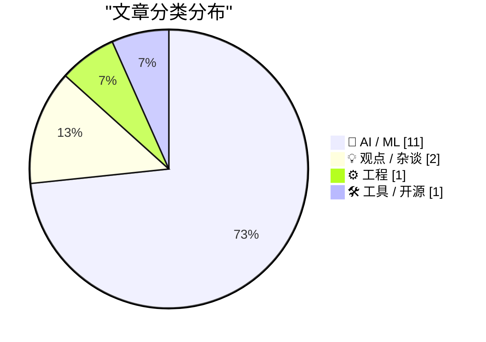
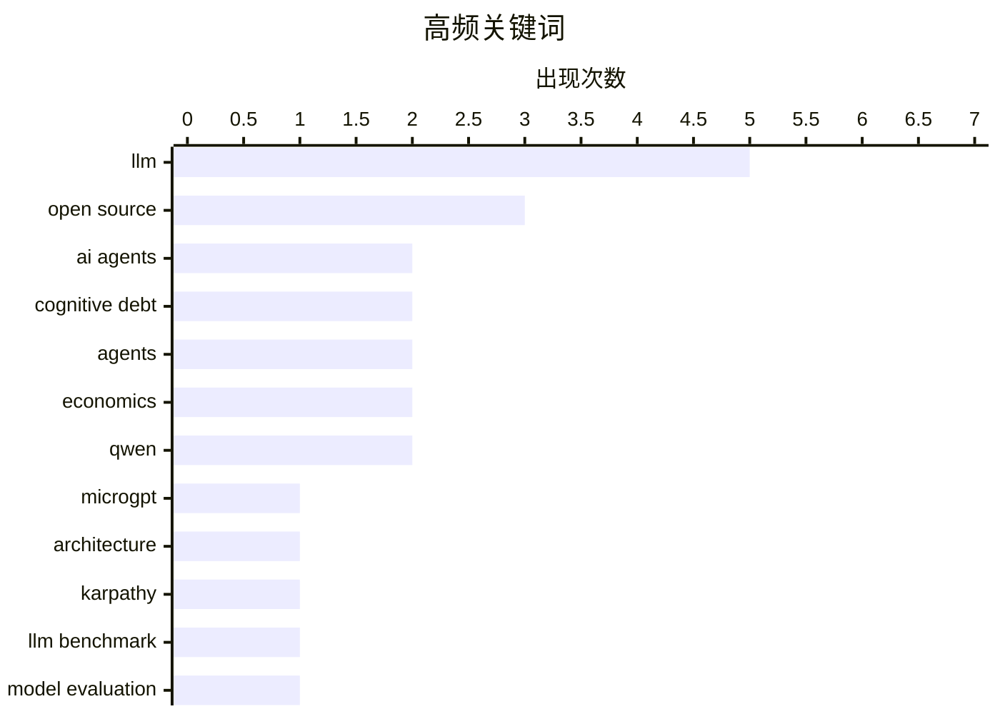

# 📰 AI 资讯每日精选 — 2026-03-01

> 来自 123 个技术博客和社交媒体源，AI 精选 Top 15

## 📝 今日看点

今日技术圈聚焦于AI领域的范式转变与效率革命。开源大模型正快速逼近顶级商业模型的性能，差距已缩小至毫厘之间。同时，业界开始反思复杂化趋势，倡导极简架构与工程实践，以应对智能体协作和AI编程中产生的“认知债务”问题。

---

## 🏆 今日必读

🥇 **MicroGPT**

[microgpt](https://www.reddit.com/r/LocalLLaMA/comments/1rhlosn/microgpt/) — r/LocalLLaMA · 11 小时前 · 🤖 AI / ML

> 文章介绍了由知名AI研究员Andrej Karpathy提出的MicroGPT概念，这是一种极简化的GPT模型实现。其核心目标是剥离现代大型语言模型的复杂性，回归到最基础的Transformer架构，以揭示模型能力的本质来源。通过极简的代码实现（可能仅有数百行），它探讨了在移除诸如注意力机制优化、大规模预训练数据、复杂工程技巧后，模型性能的下限与核心组件的作用。结论是，许多性能提升源于工程优化和数据规模，而非根本性的架构革新，这为理解LLM提供了更清晰的视角。

💡 **为什么值得读**: 通过“解剖”复杂模型回归本质，为研究者和开发者提供了理解LLM核心原理的绝佳范本，有助于去伪存真。

🏷️ LLM, microgpt, architecture

🥈 **MicroGPT**

[Microgpt](http://karpathy.github.io/2026/02/12/microgpt/) — Hacker News Best · 13 小时前 · 🤖 AI / ML

> 这是Andrej Karpathy关于MicroGPT的博客原文，详细阐述了他构建极简GPT模型的动机与设计。文章核心是挑战“越大越复杂越好”的范式，通过构建一个仅包含核心Transformer模块的微型模型，来实证研究模型性能的基线。关键发现包括，许多先进的技巧（如特定的注意力变体、复杂的初始化）对基础能力的影响可能被高估，而高质量数据和平凡但大规模的预训练才是关键驱动力。作者最终观点是，社区应更关注数据质量和基础架构的稳健性，而非盲目追求架构复杂度。

💡 **为什么值得读**: 来自一线权威研究者的深度技术随笔，其“少即是多”的哲学和实证方法对模型设计与研究思路有重要启发。

🏷️ LLM, open source, Karpathy

🥉 **[研究] 对2026年1月94个LLM端点的基准测试：开源模型与专有模型的质量差距已缩小至5分以内**

[[R] Benchmarked 94 LLM endpoints for jan 2026. open source is now within 5 quality points of proprietary](https://www.reddit.com/r/MachineLearning/comments/1rhuwyt/r_benchmarked_94_llm_endpoints_for_jan_2026_open/) — r/MachineLearning · 3 小时前 · 🤖 AI / ML

> 一份2026年初的大规模基准测试报告，评估了94个商业和开源LLM API端点的性能。核心结论是开源模型在综合质量指标上已逼近顶级专有模型（如GPT-4、Claude），差距仅在5个质量点以内。测试涵盖了推理、编码、知识问答等多个维度，显示像Qwen、Llama、DeepSeek等系列的开源模型在特定任务上已实现超越。这表明开源生态的快速发展正在迅速弥合与闭源模型之间的性能鸿沟，为开发者提供了更多高性能、可控制的选择。

💡 **为什么值得读**: 提供了截至2026年初最全面的LLM性能全景图，用数据清晰展示了开源力量逼近甚至反超的行业拐点。

🏷️ LLM Benchmark, Open Source, Model Evaluation

4️⃣ **交互式解释**

[Interactive explanations](https://simonwillison.net/guides/agentic-engineering-patterns/interactive-explanations/#atom-everything) — simonwillison.net · 15 小时前 · 🤖 AI / ML

> 文章探讨了智能体工程中的一个关键模式：交互式解释，旨在解决由AI智能体生成代码所带来的“认知债务”问题。当智能体编写的代码逻辑变得复杂或难以追溯时，开发者会承担理解与维护的额外认知负担。该模式主张，智能体不应只输出最终代码，而应能根据用户请求，动态生成对其所编写代码的解释、图示或执行步骤说明。这相当于为AI生成的代码建立了可即时查询的“文档层”。其核心价值在于将智能体从代码编写者提升为代码的解释者，确保开发速度不牺牲代码的可理解性与可维护性。

💡 **为什么值得读**: 针对AI编程时代的新痛点提出了一个切实可行的工程模式，是提升人机协作效率和代码质量的关键思路。

🏷️ AI agents, cognitive debt, code generation

5️⃣ **[项目] 开源权重LLM的春天之梦：2026年1月至2月的10大架构盘点**

[[P] A Dream of Spring for Open-Weight LLMs: 10 Architectures from Jan-Feb 2026](https://www.reddit.com/r/MachineLearning/comments/1rh5f8o/p_a_dream_of_spring_for_openweight_llms_10/) — r/MachineLearning · 23 小时前 · 🤖 AI / ML

> 文章盘点了2026年初涌现的10种具有代表性的开源大语言模型新架构。这些架构超越了单纯的规模扩展，在注意力机制、模型结构、训练范式等方面进行了创新，例如可能包括状态空间模型(SSM)、混合专家(MoE)的变体、更高效的训练方法等。盘点显示，开源社区的研究焦点从追赶性能转向了探索更高效、更专精或理论更优美的模型设计。结论指出，我们正进入一个开源LLM架构创新的“春天”，多样性竞争将推动整个领域向前发展。

💡 **为什么值得读**: 一站式了解LLM架构研究的最新前沿，是跟踪技术风向、激发创新思路的优质资源。

🏷️ Open Source LLM, Model Architecture, Survey

---

## 🌐 ClawFeed 日报精选

> 来源：[ClawFeed](https://clawfeed.kevinhe.io) — AI 驱动的多源新闻聚合

### 🔥 今日头条

1. **Anthropic 被 Trump 政府封杀，OpenAI 趁机签下五角大楼合同**
   Anthropic 因拒绝取消对自主武器和大规模监控的限制，被 Trump 下令联邦机构停用（给 6 个月过渡期）。OpenAI CEO Sam Altman 数小时内宣布与国防部签署协议，将 AI 部署到军方机密网络。硅谷多家公司员工联名声援 Anthropic，#QuitGPT 话题在 Twitter 爆发。（NYT / Guardian / CNN / NPR）

2. **Claude AI 被用于美军对伊朗军事打击 — WSJ 独家**
   WSJ 爆料：美国在中东袭击行动中使用了 Anthropic 的 Claude AI。这直接触发了 Trump 的封杀令。AI × 军事这条线正式公开化，影响深远。（WSJ / WatcherGuru，305K views）

3. **伊朗局势升级，X 创历史最高使用量**
   美以联合对伊朗发动军事打击，迪拜机场大量航班暂停，全球消息涌入 X。Elon Musk 转发确认 X 今日使用量创下历史记录。

4. **Apple Xcode 26.3 发布 — 内置 Claude + Codex + MCP**
   Agentic coding 直接进 IDE，iOS vibe coding 赛道格局骤变。@gregjoz 官宣，引发大量讨论。

5. **Anthropic 披露 AI 蒸馏攻击：中国公司用 2.4 万假账号克隆 Claude**
   约 2.4 万个假账号对 Claude 发起 1600 万次查询，企图蒸馏克隆模型，违反服务条款和地区限制。Anthropic 已检测并应对。（The Hacker News）

---

### 📰 精选 Top 10

1. **@trq212（Anthropic 工程师 Thariq）**《Lessons from Building Claude Code: Seeing like an Agent》
   Agent 工具设计一手复盘：TodoWrite 被砍（模型变强后提醒成枷锁）→ Task Tool（跨 agent 协调）。3M 阅读，8.7K 赞，今日最高质量内容。
   https://x.com/trq212/status/2027463795355095314

2. **@karpathy** — 分享 Cursor 中 Tab vs Agent 请求比例图，分析编程演变路径：None → Tab → Agent → 并行 Agent → ...每个时间点都有"当前最优配置"且在不断变化。
   https://x.com/karpathy/status/2027501331125239822

3. **@rwayne（Roland 的思考日记）** — 8000 字深度文《AI、矿产与澳洲经济：2026 能迎来新国运吗？》AI 重写全球价值链利润分配，物理资源相对价值上升。664K 阅读，1.3K 赞。
   https://x.com/rwayne/status/2027720734211248573

4. **@yiyun_dan1（Joshua.D）** — 开源 wechat-decrypt：解密微信 4.0 Windows 本地数据库，支持实时消息监听（Web UI ~100ms 延迟）+ Claude MCP 接入。261K 阅读，爆款。
   https://x.com/yiyun_dan1/status/2027629074739314985

5. **@aigclink** — 过去 30 天 128 家基于 OpenClaw 的初创公司产生 28 万美元真实营收，平均每家月收 2200 刀，第一名 5 万刀/月。
   https://x.com/aigclink/status/2027919829794251037

6. **@harjtaggar（YC 合伙人）** — "我认识的所有用 AI 的人，工作时间都变多了，而非减少"，呼应哈佛 HBR 8 个月研究结论：AI 不减少工作，反而加重。240K views，2.7K 赞。
   https://x.com/harjtaggar/status/2027817571039515103

7. **@morganlinton** — 推荐 Cursor 创始人 @mntruell《The Third Era of AI Software Development》：AI 编程从 tab 补全 → agent 协作 → 第三阶段。628K 浏览，必读。
   https://x.com/morganlinton/status/2027781154729037932

8. **@VadimStrizheus** — "这就是 2026 年的公司长相：一个文件夹 .claude/agents/，下面有 engineering/ marketing/ design/ ops/ testing/ 全部是 .md 文件，我现在有 12 个这样的 agent 在 OpenClaw 里跑"。44K views。

9. **@nash_su** — 神秘预告：类 OpenClaw 产品 + 多 Agents 协作 + 知识库 + 记忆 + Skills + 云，称本月发布，值得期待。
   https://x.com/nash_su/status/2027895390520152355

10. **@GoJun315（高军）** — GitHub Trending 榜首 WiFi-DensePose：纯用 WiFi 信号追踪室内人体姿态，无摄像头无传感器。430K 阅读，2K 赞，隐私警示。
    https://x.com/GoJun315/status/2027363875692384741

---

### 👀 今日推荐关注

（以下账号在今日 Feed 中高频出现，请确认是否已关注）

- **@mntruell**（Michael Truell，Cursor 联合创始人）— "AI 软件开发第三时代"深度文章作者，1M 阅读，原创内容高质
- **@blackanger**（AlexZ 🦀）— Rust 系 agent 框架开发者，即将开源 agent CLI，技术深度高
- **@rwayne**（Roland 的思考日记）— 高质量长文作者，AI/宏观/资源交叉视角，单篇 664K 阅读
- **@GeoffreyHuntley** — 清晰定义 Agent Harness 概念，被多位 Feed 账号引用，技术原创
- **@starzq** — 美股财报深度分析 Skill 开发者，一天 150+ Star，实操型 builder

---

### 🧹 今日建议取关

（多次出现，综合判断建议清理）

- **@Soft6161** — 高频低质 spam 号，meme coin 喊单/DeFi 推广，几乎零原创价值
- **@feibo03**（Cowboy 🔶 BNB）— Parody account，纯 crypto 喊单，与 AI/tech 无关
- **@jordymaui** — 体育营销从业者（Fulham 足球），与 AI/crypto/tech 方向无关（多次出现）
- **@vikasprogrammer** — 主要聚焦 WordPress 生态，与关注方向不匹配

---

### 📊 今日观察

今天是近期最"硬核"的一天。**Anthropic vs 美国政府**这条线从道德争议走向了真实的商业博弈——拒绝军事应用的代价是被联邦封杀，而 OpenAI 的快速接单既是机会主义，也是一个信号：AI 的"武器化"已经不是假设，是现实。

技术面同样热闹：Claude Code 在工具层持续迭代，Xcode 26.3 让 agentic coding 进了 Apple 生态，OpenClaw 生态里 128 家初创已产生近 30 万美元营收。AI 编程的"第三时代"讨论（karpathy × mntruell）正在凝聚共识。

值得长期关注的底层趋势：**Agent Harness 架构正在标准化**（@trq212 的 Claude Code 复盘、@GeoffreyHuntley 的定义、@blackanger 的 Rust 实现），以及 **Sandbox 基础设施的竞争**（Alibaba OpenSandbox、BoxLite）。WiFi-DensePose 登上 GitHub Trending 也是一个隐私提醒：家里的一切正在变得可感知。

---

## 🔥 GitHub Trending

> 今日热门开源项目（全语言 + Python）

| # | 项目 | 描述 | ⭐ 总星 | 📈 今日 | 语言 |
|---|------|------|---------|---------|------|
| 1 | [ruvnet/wifi-densepose](https://github.com/ruvnet/wifi-densepose) | WiFi DensePose turns commodity WiFi signals into real-tim... | 15.3k | +2152 | Rust |
| 2 | [alibaba/OpenSandbox](https://github.com/alibaba/OpenSandbox) 🤖 | OpenSandbox is a general-purpose sandbox platform for AI ... | 3.0k | +1186 | Python |
| 3 | [anthropics/skills](https://github.com/anthropics/skills) 🤖 | Public repository for Agent Skills | 80.0k | +1076 | Python |
| 4 | [microsoft/markitdown](https://github.com/microsoft/markitdown) | Python tool for converting files and office documents to ... | 88.8k | +798 | Python |
| 5 | [ruvnet/ruflo](https://github.com/ruvnet/ruflo) 🤖 | 🌊 The leading agent orchestration platform for Claude. D... | 17.0k | +766 | TypeScript |
| 6 | [moeru-ai/airi](https://github.com/moeru-ai/airi) 🤖 | 💖🧸 Self hosted, you-owned Grok Companion, a container o... | 19.8k | +738 | TypeScript |
| 7 | [datawhalechina/hello-agents](https://github.com/datawhalechina/hello-agents) | 📚 《从零开始构建智能体》——从零开始的智能体原理与实践教程 | 23.7k | +603 | Python |
| 8 | [jamwithai/production-agentic-rag-course](https://github.com/jamwithai/production-agentic-rag-course) 🤖 |  | 3.1k | +571 | Python |
| 9 | [Shubhamsaboo/awesome-llm-apps](https://github.com/Shubhamsaboo/awesome-llm-apps) 🤖 | Collection of awesome LLM apps with AI Agents and RAG usi... | 98.5k | +475 | Python |
| 10 | [superset-sh/superset](https://github.com/superset-sh/superset) 🤖 | IDE for the AI Agents Era - Run an army of Claude Code, C... | 2.7k | +391 | TypeScript |
| 11 | [bytedance/deer-flow](https://github.com/bytedance/deer-flow) | An open-source SuperAgent harness that researches, codes,... | 22.8k | +352 | Python |
| 12 | [NevaMind-AI/memU](https://github.com/NevaMind-AI/memU) 🤖 | Memory for 24/7 proactive agents like openclaw (moltbot, ... | 11.8k | +338 | Python |
| 13 | [GetStream/Vision-Agents](https://github.com/GetStream/Vision-Agents) | Open Vision Agents by Stream. Build Vision Agents quickly... | 7.1k | +287 | Python |
| 14 | [X-PLUG/MobileAgent](https://github.com/X-PLUG/MobileAgent) 🤖 | Mobile-Agent: The Powerful GUI Agent Family | 7.6k | +192 | Python |
| 15 | [K-Dense-AI/claude-scientific-skills](https://github.com/K-Dense-AI/claude-scientific-skills) 🤖 | A set of ready to use Agent Skills for research, science,... | 10.0k | +184 | Python |

---

## 🤖 AI / ML

### 1. MicroGPT

[microgpt](https://www.reddit.com/r/LocalLLaMA/comments/1rhlosn/microgpt/) — **r/LocalLLaMA** · 11 小时前 · ⭐ 29/30

> 文章介绍了由知名AI研究员Andrej Karpathy提出的MicroGPT概念，这是一种极简化的GPT模型实现。其核心目标是剥离现代大型语言模型的复杂性，回归到最基础的Transformer架构，以揭示模型能力的本质来源。通过极简的代码实现（可能仅有数百行），它探讨了在移除诸如注意力机制优化、大规模预训练数据、复杂工程技巧后，模型性能的下限与核心组件的作用。结论是，许多性能提升源于工程优化和数据规模，而非根本性的架构革新，这为理解LLM提供了更清晰的视角。

🏷️ LLM, microgpt, architecture

---

### 2. MicroGPT

[Microgpt](http://karpathy.github.io/2026/02/12/microgpt/) — **Hacker News Best** · 13 小时前 · ⭐ 27/30

> 这是Andrej Karpathy关于MicroGPT的博客原文，详细阐述了他构建极简GPT模型的动机与设计。文章核心是挑战“越大越复杂越好”的范式，通过构建一个仅包含核心Transformer模块的微型模型，来实证研究模型性能的基线。关键发现包括，许多先进的技巧（如特定的注意力变体、复杂的初始化）对基础能力的影响可能被高估，而高质量数据和平凡但大规模的预训练才是关键驱动力。作者最终观点是，社区应更关注数据质量和基础架构的稳健性，而非盲目追求架构复杂度。

🏷️ LLM, open source, Karpathy

---

### 3. [研究] 对2026年1月94个LLM端点的基准测试：开源模型与专有模型的质量差距已缩小至5分以内

[[R] Benchmarked 94 LLM endpoints for jan 2026. open source is now within 5 quality points of proprietary](https://www.reddit.com/r/MachineLearning/comments/1rhuwyt/r_benchmarked_94_llm_endpoints_for_jan_2026_open/) — **r/MachineLearning** · 3 小时前 · ⭐ 27/30

> 一份2026年初的大规模基准测试报告，评估了94个商业和开源LLM API端点的性能。核心结论是开源模型在综合质量指标上已逼近顶级专有模型（如GPT-4、Claude），差距仅在5个质量点以内。测试涵盖了推理、编码、知识问答等多个维度，显示像Qwen、Llama、DeepSeek等系列的开源模型在特定任务上已实现超越。这表明开源生态的快速发展正在迅速弥合与闭源模型之间的性能鸿沟，为开发者提供了更多高性能、可控制的选择。

🏷️ LLM Benchmark, Open Source, Model Evaluation

---

### 4. 交互式解释

[Interactive explanations](https://simonwillison.net/guides/agentic-engineering-patterns/interactive-explanations/#atom-everything) — **simonwillison.net** · 15 小时前 · ⭐ 26/30

> 文章探讨了智能体工程中的一个关键模式：交互式解释，旨在解决由AI智能体生成代码所带来的“认知债务”问题。当智能体编写的代码逻辑变得复杂或难以追溯时，开发者会承担理解与维护的额外认知负担。该模式主张，智能体不应只输出最终代码，而应能根据用户请求，动态生成对其所编写代码的解释、图示或执行步骤说明。这相当于为AI生成的代码建立了可即时查询的“文档层”。其核心价值在于将智能体从代码编写者提升为代码的解释者，确保开发速度不牺牲代码的可理解性与可维护性。

🏷️ AI agents, cognitive debt, code generation

---

### 5. [项目] 开源权重LLM的春天之梦：2026年1月至2月的10大架构盘点

[[P] A Dream of Spring for Open-Weight LLMs: 10 Architectures from Jan-Feb 2026](https://www.reddit.com/r/MachineLearning/comments/1rh5f8o/p_a_dream_of_spring_for_openweight_llms_10/) — **r/MachineLearning** · 23 小时前 · ⭐ 26/30

> 文章盘点了2026年初涌现的10种具有代表性的开源大语言模型新架构。这些架构超越了单纯的规模扩展，在注意力机制、模型结构、训练范式等方面进行了创新，例如可能包括状态空间模型(SSM)、混合专家(MoE)的变体、更高效的训练方法等。盘点显示，开源社区的研究焦点从追赶性能转向了探索更高效、更专精或理论更优美的模型设计。结论指出，我们正进入一个开源LLM架构创新的“春天”，多样性竞争将推动整个领域向前发展。

🏷️ Open Source LLM, Model Architecture, Survey

---

### 6. 如果LLM智能体之间传递KV缓存而非文本会怎样？我尝试了——在Qwen、Llama和DeepSeek上节省了73-78%的token

[What if LLM agents passed KV-cache to each other instead of text? I tried it -- 73-78% token savings across Qwen, Llama, and DeepSeek](https://www.reddit.com/r/LocalLLaMA/comments/1rh802w/what_if_llm_agents_passed_kvcache_to_each_other/) — **r/LocalLLaMA** · 21 小时前 · ⭐ 26/30

> 文章提出并验证了一种优化多智能体协作效率的新方法：让智能体间直接传递KV缓存（Key-Value Cache），而非重新生成和解析文本。作者指出，在传统的LangChain、CrewAI等多智能体框架中，后续智能体需要重复处理整个对话历史，导致47-53%的token计算是冗余的。提出的“Agent Vector Passing (AVP)”协议允许智能体共享已计算的中间表示，在Qwen2.5、Llama 3.2和DeepSeek-R1-Distill模型上实现了73-78%的token节省。这显著降低了计算开销和延迟，为构建高效能多智能体系统提供了新的技术路径。

🏷️ agents, optimization, KV-cache, efficiency

---

### 7. 简单成为必然：LLM时代的编程语言选择经济学

[Simple Made Inevitable: The Economics of Language Choice in the LLM Era](https://felixbarbalet.com/simple-made-inevitable-the-economics-of-language-choice-in-the-llm-era/) — **Lobste.rs** · 6 小时前 · ⭐ 26/30

> 文章从经济学角度分析了在LLM主导代码生成的背景下，编程语言选择逻辑发生的根本性变化。核心论点是，由于LLM在生成简单、主流语言（如Python、JavaScript）的代码方面拥有压倒性的数据优势和更高的可靠性，选择这些语言将大幅降低开发者的认知负担、调试成本和集成风险。这意味着小众或复杂的语言将因“生态负外部性”而面临更大的采用障碍。结论是，技术决策将更倾向于选择“LLM友好型”语言，语言的简单性和生态规模将成为比其本身技术特性更重要的选择标准。

🏷️ LLM, programming-languages, economics

---

### 8. Qwen3.5 122B和35B模型在本地计算机上提供了媲美Sonnet 4.5的性能

[Qwen3.5 122B and 35B models offer Sonnet 4.5 performance on local computers](https://venturebeat.com/technology/alibabas-new-open-source-qwen3-5-medium-models-offer-sonnet-4-5-performance) — **Hacker News Best** · 18 小时前 · ⭐ 25/30

> 文章报道了阿里巴巴开源的最新Qwen3.5系列模型，特别是122B（1220亿参数）和35B（350亿参数）版本。基准测试显示，这些模型在本地部署时，其综合性能已可对标Anthropic的顶级商业模型Claude 3.5 Sonnet。这标志着开源超大模型首次在可管理的硬件需求下（122B参数需多张高端GPU，35B参数对硬件要求更低），达到了与顶尖专有模型相近的能力水平。此举将进一步推动高性能LLM的本地化、私有化部署，降低企业对闭源API的依赖。

🏷️ Qwen, open source, model performance

---

### 9. 一个更有效的智能体（Agent）系统构建方法

[A system around Agents that works better](https://www.reddit.com/r/programming/comments/1rhs9t1/a_system_around_agents_that_works_better/) — **r/programming** · 6 小时前 · ⭐ 25/30

> 文章指出，智能体应用效果不佳的核心问题往往不在于模型本身，而在于缺乏支撑其稳定运行的周边基础设施。作者分享了一套包含六个层次的系统框架，旨在使智能体的输出变得可预测和一致。这套系统通过构建必要的工程化基础设施来解决智能体表现不稳定的痛点。其核心观点是，智能体的成功部署依赖于精心设计的系统层，而不仅仅是模型的选择。

🏷️ AI Agents, infrastructure, system design, LLM

---

### 10. 谷歌研究发现：更长的思维链（CoT）与准确性呈负相关，相关系数达-0.54

[google found that longer chain of thought actually correlates NEGATIVELY with accuracy. -0.54 correlation](https://www.reddit.com/r/LocalLLaMA/comments/1rh6pru/google_found_that_longer_chain_of_thought/) — **r/LocalLLaMA** · 22 小时前 · ⭐ 25/30

> 一项新的谷歌研究挑战了“思维链越长，模型推理越好”的普遍假设。研究在AIME2024/2025、HMMT 2025和GPQA-Diamond等数据集上测试了8个模型变体（如GPT-OSS、DeepSeek-R1、Qwen3），发现推理生成的长度（token数）与答案准确性的平均相关系数为-0.54。这表明更长的推理链往往不意味着更好的答案，反而可能是模型陷入“思维漩涡”或过度思考的标志。为此，研究提出了“深度思考比率”（DTR）这一新指标，用于衡量模型输出中真正用于核心推理的比例，以更有效地评估推理质量。

🏷️ reasoning, evaluation, chain-of-thought, accuracy

---

### 11. 重要提示：如果你的本地编程智能体在30k+上下文下表现“变傻”，请先检查KV缓存量化设置

[PSA: If your local coding agent feels "dumb" at 30k+ context, check your KV cache quantization first.](https://www.reddit.com/r/LocalLLaMA/comments/1rhvi09/psa_if_your_local_coding_agent_feels_dumb_at_30k/) — **r/LocalLLaMA** · 2 小时前 · ⭐ 25/30

> 文章指出，当本地编程智能体（如Qwen3-Coder、GLM 4.7）在处理长上下文（超过30k）时出现无限修正循环或工具调用参数幻觉，常见原因并非模型或提示词问题，而是过于激进的KV缓存量化。为了在有限显存（如24GB）中容纳大模型并保持长上下文，用户常会过度压缩KV缓存。这会导致关键的历史信息在缓存中被严重丢失或扭曲，从而破坏模型的连贯推理能力。解决方案是适当提高KV缓存的量化精度或采用分组查询注意力（GQA）等更高效的方法。其核心观点是，KV缓存的质量是长上下文性能的关键，不应为了容量而过度牺牲精度。

🏷️ KV cache, quantization, coding agent

---

## 💡 观点 / 杂谈

### 12. 认知债务：当开发速度超越理解能力时

[Cognitive Debt: When Velocity Exceeds Comprehension](https://www.rockoder.com/beyondthecode/cognitive-debt-when-velocity-exceeds-comprehension/) — **Hacker News Best** · 23 小时前 · ⭐ 25/30

> 文章提出了“认知债务”的概念，用以描述在AI辅助编程时代，由于过度依赖工具（如Copilot、ChatGPT）快速生成代码，导致开发者对系统理解深度下降而积累的潜在风险。这种债务体现在：代码看似工作但逻辑晦涩、架构决策由AI做出而非深思熟虑、团队整体对代码库的掌控力减弱。与技术债务不同，认知债务更侧重于开发者的心智模型与代码现实之间的脱节。核心观点是，必须通过有意识的代码审查、文档化、架构简化等实践来管理认知债务，否则将损害项目的长期健康。

🏷️ cognitive debt, software development, velocity, comprehension

---

### 13. 简单成为必然：LLM时代的编程语言选择经济学

[Simple Made Inevitable: The Economics of Language Choice in the LLM Era](https://www.reddit.com/r/programming/comments/1rhmyf9/simple_made_inevitable_the_economics_of_language/) — **r/programming** · 10 小时前 · ⭐ 25/30

> 此文与索引6为同一篇文章，从经济学视角探讨LLM如何改变编程语言的选择策略。核心论点是，LLM作为新的生产力要素，其在不同语言上的“熟练度”差异，将极大地影响语言的学习成本、开发效率和生态系统价值。Python等语言因其在训练数据中的主导地位，将获得更强的网络效应和正反馈循环，而小众语言则可能面临支持度下降的困境。这导致技术选型不再仅仅基于语言特性，更要考虑其与AI工具的协同效率。最终，语言的“简单性”和“AI友好性”将成为不可抗拒的选择力量。

🏷️ LLM, programming languages, economics, development

---

## ⚙️ 工程

### 14. 厌倦了边缘ML模型的“感觉流”测试？我为此构建了自动化质量门禁

[[D] got tired of "just vibes" testing for edge ML models, so I built automated quality gates](https://www.reddit.com/r/MachineLearning/comments/1rhq2qp/d_got_tired_of_just_vibes_testing_for_edge_ml/) — **r/MachineLearning** · 8 小时前 · ⭐ 25/30

> 文章揭示了边缘机器学习模型部署中普遍存在的测试不严谨问题，仅凭主观感觉（“vibes”）评估容易导致性能衰退。作者分享了一次亲身经历：一个微小的预处理改动导致在真实硬件上的延迟意外增加了40%，而这一严重问题仅因频繁的基准测试才被发现。为此，作者构建了自动化的质量门禁系统，旨在将性能回归检测流程化、自动化。结论是，边缘ML部署需要像传统软件工程一样，建立严格的、自动化的测试和质量保障体系。

🏷️ Edge ML, Testing, Deployment, Quality Assurance

---

## 🛠 工具 / 开源

### 15. Qwen3.5 35B-A3B模型在M1 64GB设备上取代了我的双模型智能体架构

[Qwen3.5 35B-A3B replaced my 2-model agentic setup on M1 64GB](https://www.reddit.com/r/LocalLLaMA/comments/1rh9k63/qwen35_35ba3b_replaced_my_2model_agentic_setup_on/) — **r/LocalLLaMA** · 20 小时前 · ⭐ 25/30

> 作者在实际的智能体工作流中测试了近期备受关注的Qwen3.5 35B-A3B模型。测试在Apple Silicon M1 Max（64GB内存）设备上进行，使用llama.cpp进行推理。结果表明，该单一模型在推理、智能体任务和编码方面的表现，足以替代原先需要两个模型协作的复杂架构。其性能被认为可与参数量大8-25倍的顶级模型（如MiniMax-M2.5 230B、DeepSeek V3.2 685B）相媲美。核心结论是，Qwen3.5 35B-A3B以其出色的能力与效率，为资源有限的本地部署提供了强大的单模型解决方案。

🏷️ Qwen, model-comparison, agents, inference

---

## 📊 数据概览

| 扫描源 | 抓取文章 | 时间范围 | 精选 |
|:---:|:---:|:---:|:---:|
| 108/123 | 2796 篇 → 144 篇 | 24h | **15 篇** |

### 分类分布



### 高频关键词



<details>
<summary>📈 纯文本关键词图（终端友好）</summary>

```
llm            │ ████████████████████ 5
open source    │ ████████████░░░░░░░░ 3
ai agents      │ ████████░░░░░░░░░░░░ 2
cognitive debt │ ████████░░░░░░░░░░░░ 2
agents         │ ████████░░░░░░░░░░░░ 2
economics      │ ████████░░░░░░░░░░░░ 2
qwen           │ ████████░░░░░░░░░░░░ 2
microgpt       │ ████░░░░░░░░░░░░░░░░ 1
architecture   │ ████░░░░░░░░░░░░░░░░ 1
karpathy       │ ████░░░░░░░░░░░░░░░░ 1
```

</details>

### 🏷️ 话题标签

**llm**(5) · **open source**(3) · **ai agents**(2) · cognitive debt(2) · agents(2) · economics(2) · qwen(2) · microgpt(1) · architecture(1) · karpathy(1) · llm benchmark(1) · model evaluation(1) · code generation(1) · open source llm(1) · model architecture(1) · survey(1) · optimization(1) · kv-cache(1) · efficiency(1) · programming-languages(1)

---

*生成于 2026-03-01 14:41 | 汇聚 123 个技术博客、X/Twitter、Hacker News、Reddit、Product Hunt、Lobste.rs、ClawFeed 日报及 GitHub Trending，经 AI 评分筛选出 Top 15 精华内容*
