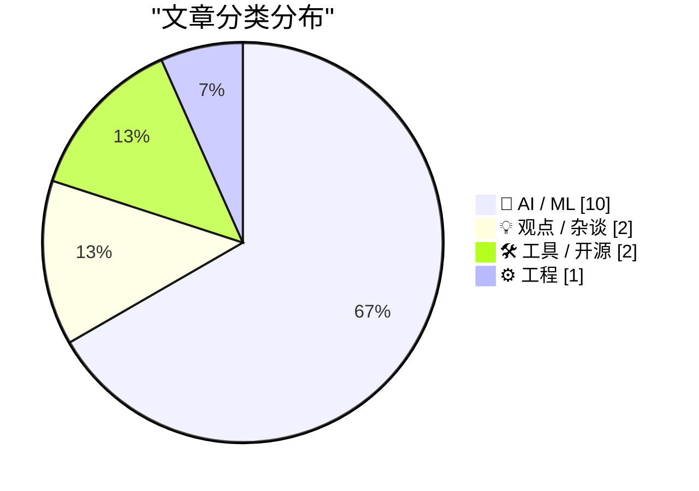
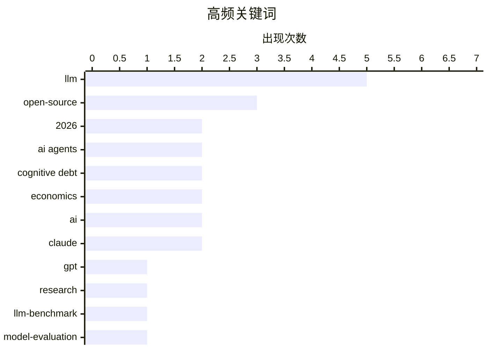

# 📰 AI 博客每日精选 — 2026-03-01

> 来自 123 个技术博客和社交媒体源，AI 精选 Top 15

## 📝 今日看点

今日技术圈的核心焦点集中于AI领域的深度演进与效率革命。一方面，开源大模型性能正急速逼近甚至比肩顶级闭源模型，技术民主化趋势显著。另一方面，业界开始深刻反思AI高速发展带来的“认知债务”等副作用，并积极探索通过优化智能体架构、传输机制来提升系统效率与可控性。同时，对模型规模与推理效果的简单线性假设也受到新研究的挑战。

---

## 🌐 ClawFeed 日报精选

> 来源：[ClawFeed](https://clawfeed.kevinhe.io) — AI 驱动的多源新闻聚合

### 🔥 今日头条

1. **Anthropic 被 Trump 政府封杀，OpenAI 趁机签下五角大楼合同**
   Anthropic 因拒绝取消对自主武器和大规模监控的限制，被 Trump 下令联邦机构停用（给 6 个月过渡期）。OpenAI CEO Sam Altman 数小时内宣布与国防部签署协议，将 AI 部署到军方机密网络。硅谷多家公司员工联名声援 Anthropic，#QuitGPT 话题在 Twitter 爆发。（NYT / Guardian / CNN / NPR）

2. **Claude AI 被用于美军对伊朗军事打击 — WSJ 独家**
   WSJ 爆料：美国在中东袭击行动中使用了 Anthropic 的 Claude AI。这直接触发了 Trump 的封杀令。AI × 军事这条线正式公开化，影响深远。（WSJ / WatcherGuru，305K views）

3. **伊朗局势升级，X 创历史最高使用量**
   美以联合对伊朗发动军事打击，迪拜机场大量航班暂停，全球消息涌入 X。Elon Musk 转发确认 X 今日使用量创下历史记录。

4. **Apple Xcode 26.3 发布 — 内置 Claude + Codex + MCP**
   Agentic coding 直接进 IDE，iOS vibe coding 赛道格局骤变。@gregjoz 官宣，引发大量讨论。

5. **Anthropic 披露 AI 蒸馏攻击：中国公司用 2.4 万假账号克隆 Claude**
   约 2.4 万个假账号对 Claude 发起 1600 万次查询，企图蒸馏克隆模型，违反服务条款和地区限制。Anthropic 已检测并应对。（The Hacker News）

---

### 📰 精选 Top 10

1. **@trq212（Anthropic 工程师 Thariq）**《Lessons from Building Claude Code: Seeing like an Agent》
   Agent 工具设计一手复盘：TodoWrite 被砍（模型变强后提醒成枷锁）→ Task Tool（跨 agent 协调）。3M 阅读，8.7K 赞，今日最高质量内容。
   https://x.com/trq212/status/2027463795355095314

2. **@karpathy** — 分享 Cursor 中 Tab vs Agent 请求比例图，分析编程演变路径：None → Tab → Agent → 并行 Agent → ...每个时间点都有"当前最优配置"且在不断变化。
   https://x.com/karpathy/status/2027501331125239822

3. **@rwayne（Roland 的思考日记）** — 8000 字深度文《AI、矿产与澳洲经济：2026 能迎来新国运吗？》AI 重写全球价值链利润分配，物理资源相对价值上升。664K 阅读，1.3K 赞。
   https://x.com/rwayne/status/2027720734211248573

4. **@yiyun_dan1（Joshua.D）** — 开源 wechat-decrypt：解密微信 4.0 Windows 本地数据库，支持实时消息监听（Web UI ~100ms 延迟）+ Claude MCP 接入。261K 阅读，爆款。
   https://x.com/yiyun_dan1/status/2027629074739314985

5. **@aigclink** — 过去 30 天 128 家基于 OpenClaw 的初创公司产生 28 万美元真实营收，平均每家月收 2200 刀，第一名 5 万刀/月。
   https://x.com/aigclink/status/2027919829794251037

6. **@harjtaggar（YC 合伙人）** — "我认识的所有用 AI 的人，工作时间都变多了，而非减少"，呼应哈佛 HBR 8 个月研究结论：AI 不减少工作，反而加重。240K views，2.7K 赞。
   https://x.com/harjtaggar/status/2027817571039515103

7. **@morganlinton** — 推荐 Cursor 创始人 @mntruell《The Third Era of AI Software Development》：AI 编程从 tab 补全 → agent 协作 → 第三阶段。628K 浏览，必读。
   https://x.com/morganlinton/status/2027781154729037932

8. **@VadimStrizheus** — "这就是 2026 年的公司长相：一个文件夹 .claude/agents/，下面有 engineering/ marketing/ design/ ops/ testing/ 全部是 .md 文件，我现在有 12 个这样的 agent 在 OpenClaw 里跑"。44K views。

9. **@nash_su** — 神秘预告：类 OpenClaw 产品 + 多 Agents 协作 + 知识库 + 记忆 + Skills + 云，称本月发布，值得期待。
   https://x.com/nash_su/status/2027895390520152355

10. **@GoJun315（高军）** — GitHub Trending 榜首 WiFi-DensePose：纯用 WiFi 信号追踪室内人体姿态，无摄像头无传感器。430K 阅读，2K 赞，隐私警示。
    https://x.com/GoJun315/status/2027363875692384741

---

### 👀 今日推荐关注

（以下账号在今日 Feed 中高频出现，请确认是否已关注）

- **@mntruell**（Michael Truell，Cursor 联合创始人）— "AI 软件开发第三时代"深度文章作者，1M 阅读，原创内容高质
- **@blackanger**（AlexZ 🦀）— Rust 系 agent 框架开发者，即将开源 agent CLI，技术深度高
- **@rwayne**（Roland 的思考日记）— 高质量长文作者，AI/宏观/资源交叉视角，单篇 664K 阅读
- **@GeoffreyHuntley** — 清晰定义 Agent Harness 概念，被多位 Feed 账号引用，技术原创
- **@starzq** — 美股财报深度分析 Skill 开发者，一天 150+ Star，实操型 builder

---

### 🧹 今日建议取关

（多次出现，综合判断建议清理）

- **@Soft6161** — 高频低质 spam 号，meme coin 喊单/DeFi 推广，几乎零原创价值
- **@feibo03**（Cowboy 🔶 BNB）— Parody account，纯 crypto 喊单，与 AI/tech 无关
- **@jordymaui** — 体育营销从业者（Fulham 足球），与 AI/crypto/tech 方向无关（多次出现）
- **@vikasprogrammer** — 主要聚焦 WordPress 生态，与关注方向不匹配

---

### 📊 今日观察

今天是近期最"硬核"的一天。**Anthropic vs 美国政府**这条线从道德争议走向了真实的商业博弈——拒绝军事应用的代价是被联邦封杀，而 OpenAI 的快速接单既是机会主义，也是一个信号：AI 的"武器化"已经不是假设，是现实。

技术面同样热闹：Claude Code 在工具层持续迭代，Xcode 26.3 让 agentic coding 进了 Apple 生态，OpenClaw 生态里 128 家初创已产生近 30 万美元营收。AI 编程的"第三时代"讨论（karpathy × mntruell）正在凝聚共识。

值得长期关注的底层趋势：**Agent Harness 架构正在标准化**（@trq212 的 Claude Code 复盘、@GeoffreyHuntley 的定义、@blackanger 的 Rust 实现），以及 **Sandbox 基础设施的竞争**（Alibaba OpenSandbox、BoxLite）。WiFi-DensePose 登上 GitHub Trending 也是一个隐私提醒：家里的一切正在变得可感知。

---

## 🔥 GitHub Trending

> 今日热门开源项目（全语言 + Python）

| # | 项目 | 描述 | ⭐ 总星 | 📈 今日 | 语言 |
|---|------|------|---------|---------|------|
| 1 | [ruvnet/wifi-densepose](https://github.com/ruvnet/wifi-densepose) | WiFi DensePose turns commodity WiFi signals into real-tim... | 15.3k | +2152 | Rust |
| 2 | [alibaba/OpenSandbox](https://github.com/alibaba/OpenSandbox) 🤖 | OpenSandbox is a general-purpose sandbox platform for AI ... | 3.0k | +1186 | Python |
| 3 | [anthropics/skills](https://github.com/anthropics/skills) 🤖 | Public repository for Agent Skills | 80.0k | +1076 | Python |
| 4 | [microsoft/markitdown](https://github.com/microsoft/markitdown) | Python tool for converting files and office documents to ... | 88.7k | +798 | Python |
| 5 | [ruvnet/ruflo](https://github.com/ruvnet/ruflo) 🤖 | 🌊 The leading agent orchestration platform for Claude. D... | 17.0k | +766 | TypeScript |
| 6 | [moeru-ai/airi](https://github.com/moeru-ai/airi) 🤖 | 💖🧸 Self hosted, you-owned Grok Companion, a container o... | 19.8k | +738 | TypeScript |
| 7 | [datawhalechina/hello-agents](https://github.com/datawhalechina/hello-agents) | 📚 《从零开始构建智能体》——从零开始的智能体原理与实践教程 | 23.7k | +603 | Python |
| 8 | [jamwithai/production-agentic-rag-course](https://github.com/jamwithai/production-agentic-rag-course) 🤖 |  | 3.1k | +571 | Python |
| 9 | [Shubhamsaboo/awesome-llm-apps](https://github.com/Shubhamsaboo/awesome-llm-apps) 🤖 | Collection of awesome LLM apps with AI Agents and RAG usi... | 98.5k | +475 | Python |
| 10 | [superset-sh/superset](https://github.com/superset-sh/superset) 🤖 | IDE for the AI Agents Era - Run an army of Claude Code, C... | 2.7k | +391 | TypeScript |
| 11 | [bytedance/deer-flow](https://github.com/bytedance/deer-flow) | An open-source SuperAgent harness that researches, codes,... | 22.8k | +352 | Python |
| 12 | [NevaMind-AI/memU](https://github.com/NevaMind-AI/memU) 🤖 | Memory for 24/7 proactive agents like openclaw (moltbot, ... | 11.8k | +338 | Python |
| 13 | [GetStream/Vision-Agents](https://github.com/GetStream/Vision-Agents) | Open Vision Agents by Stream. Build Vision Agents quickly... | 7.1k | +287 | Python |
| 14 | [X-PLUG/MobileAgent](https://github.com/X-PLUG/MobileAgent) 🤖 | Mobile-Agent: The Powerful GUI Agent Family | 7.6k | +192 | Python |
| 15 | [K-Dense-AI/claude-scientific-skills](https://github.com/K-Dense-AI/claude-scientific-skills) 🤖 | A set of ready to use Agent Skills for research, science,... | 10.0k | +184 | Python |

---

## 🏆 今日必读

🥇 **MicroGPT**

[Microgpt](http://karpathy.github.io/2026/02/12/microgpt/) — Hacker News Best · 12 小时前 · 🤖 AI / ML

> 文章介绍了由Karpathy开发的微型GPT模型MicroGPT。该模型旨在通过极简的架构（例如仅使用解码器、更小的嵌入维度）探索大型语言模型能力的下限，并验证“规模就是一切”的假设是否在极小规模下依然成立。核心发现是，即使在参数极少的情况下，模型仍能展现出某些基础的语言模式学习能力，但性能与规模呈强相关。这挑战了人们对模型能力来源的固有认知，并强调了架构与数据效率研究的重要性。

💡 **为什么值得读**: 通过极简实验揭示了模型规模与能力关系的底层逻辑，为理解LLM本质提供了独特视角。

🏷️ LLM, GPT, open-source, research

🥈 **[研究] 2026年1月基准测试94个LLM端点：开源模型与专有模型的质量差距已缩小至5分以内**

[[R] Benchmarked 94 LLM endpoints for jan 2026. open source is now within 5 quality points of proprietary](https://www.reddit.com/r/MachineLearning/comments/1rhuwyt/r_benchmarked_94_llm_endpoints_for_jan_2026_open/) — r/MachineLearning · 3 小时前 · 🤖 AI / ML

> 一项基准测试评估了2026年1月可用的94个大型语言模型API端点的性能。测试结果显示，开源模型与闭源专有模型（如GPT-4、Claude）在综合质量评分上的差距已缩小至5个百分点以内。这一接近表明开源生态在模型能力上取得了显著进展。这意味着开发者在选择模型时，成本、隐私和可控性等因素可能比微小的性能差距更具决定性。

💡 **为什么值得读**: 提供了当前LLM市场竞争格局的最新数据，为技术选型提供了关键依据。

🏷️ LLM-Benchmark, Open-Source, Model-Evaluation, 2026

🥉 **交互式解释**

[Interactive explanations](https://simonwillison.net/guides/agentic-engineering-patterns/interactive-explanations/#atom-everything) — simonwillison.net · 15 小时前 · 🤖 AI / ML

> 文章探讨了智能体工程中的一个核心模式：交互式解释，用以应对“认知债务”。认知债务是指因AI智能体生成代码的速度超过人类理解速度而积累的理解赤字。作者提出，对于复杂逻辑，应要求智能体提供交互式、可逐步执行的解释，而不仅仅是静态代码。这可以通过生成附带可运行示例、可视化或分步调试的文档来实现。该模式旨在确保人类始终能跟上并掌控AI生成的解决方案。

💡 **为什么值得读**: 为解决AI编码时代“知其然不知其所以然”的普遍困境，提供了一个切实可行的工程模式。

🏷️ AI agents, cognitive debt, code generation

4️⃣ **Qwen3.5 122B和35B模型在本地计算机上提供媲美Sonnet 4.5的性能**

[Qwen3.5 122B and 35B models offer Sonnet 4.5 performance on local computers](https://venturebeat.com/technology/alibabas-new-open-source-qwen3-5-medium-models-offer-sonnet-4-5-performance) — Hacker News Best · 18 小时前 · 🤖 AI / ML

> 阿里巴巴新发布的开源大模型Qwen3.5 Medium系列，包括122B和35B两个版本。评测显示，这两个模型在性能上已达到与Anthropic闭源模型Claude 3.5 Sonnet相当的水平。这意味着开发者现在可以在本地或私有环境中部署具有顶尖性能的大模型。此举进一步推动了高性能开源模型的普及，降低了企业使用先进AI技术的门槛。

💡 **为什么值得读**: 标志着开源大模型在性能上首次与顶级商业模型并驾齐驱，是本地部署和私有化的重要里程碑。

🏷️ LLM, open-source, Qwen, benchmark

5️⃣ **如果LLM智能体之间传递KV缓存而非文本会怎样？我尝试了——在Qwen、Llama和DeepSeek上节省了73-78%的token**

[What if LLM agents passed KV-cache to each other instead of text? I tried it -- 73-78% token savings across Qwen, Llama, and DeepSeek](https://www.reddit.com/r/LocalLLaMA/comments/1rh802w/what_if_llm_agents_passed_kvcache_to_each_other/) — r/LocalLLaMA · 21 小时前 · 🤖 AI / ML

> 文章指出，在多智能体协作场景中，传统传递文本的方式导致47-53%的token被冗余重复处理。作者提出了一种名为AVP的新方法，让智能体之间直接传递KV缓存而非文本。实验在Qwen2.5、Llama 3.2和DeepSeek-R1-Distill模型上进行，该方法实现了73-78%的token节省。这显著降低了计算开销和延迟，为构建高效的多智能体系统提供了新思路。

💡 **为什么值得读**: 提出了一种颠覆性的多智能体通信优化方案，能极大提升效率并降低成本，具有很高的工程价值。

🏷️ LLM agents, KV-cache, optimization, multi-agent

---

## 📊 数据概览

| 扫描源 | 抓取文章 | 时间范围 | 精选 |
|:---:|:---:|:---:|:---:|
| 106/123 | 2766 篇 → 146 篇 | 24h | **15 篇** |

### 分类分布



### 高频关键词



<details>
<summary>📈 纯文本关键词图（终端友好）</summary>

```
llm            │ ████████████████████ 5
open-source    │ ████████████░░░░░░░░ 3
2026           │ ████████░░░░░░░░░░░░ 2
ai agents      │ ████████░░░░░░░░░░░░ 2
cognitive debt │ ████████░░░░░░░░░░░░ 2
economics      │ ████████░░░░░░░░░░░░ 2
ai             │ ████████░░░░░░░░░░░░ 2
claude         │ ████████░░░░░░░░░░░░ 2
gpt            │ ████░░░░░░░░░░░░░░░░ 1
research       │ ████░░░░░░░░░░░░░░░░ 1
```

</details>

### 🏷️ 话题标签

**llm**(5) · **open-source**(3) · **2026**(2) · ai agents(2) · cognitive debt(2) · economics(2) · ai(2) · claude(2) · gpt(1) · research(1) · llm-benchmark(1) · model-evaluation(1) · code generation(1) · qwen(1) · benchmark(1) · llm agents(1) · kv-cache(1) · optimization(1) · multi-agent(1) · software development(1)

---

## 🤖 AI / ML

### 1. MicroGPT

[Microgpt](http://karpathy.github.io/2026/02/12/microgpt/) — **Hacker News Best** · 12 小时前 · ⭐ 27/30

> 文章介绍了由Karpathy开发的微型GPT模型MicroGPT。该模型旨在通过极简的架构（例如仅使用解码器、更小的嵌入维度）探索大型语言模型能力的下限，并验证“规模就是一切”的假设是否在极小规模下依然成立。核心发现是，即使在参数极少的情况下，模型仍能展现出某些基础的语言模式学习能力，但性能与规模呈强相关。这挑战了人们对模型能力来源的固有认知，并强调了架构与数据效率研究的重要性。

🏷️ LLM, GPT, open-source, research

---

### 2. [研究] 2026年1月基准测试94个LLM端点：开源模型与专有模型的质量差距已缩小至5分以内

[[R] Benchmarked 94 LLM endpoints for jan 2026. open source is now within 5 quality points of proprietary](https://www.reddit.com/r/MachineLearning/comments/1rhuwyt/r_benchmarked_94_llm_endpoints_for_jan_2026_open/) — **r/MachineLearning** · 3 小时前 · ⭐ 27/30

> 一项基准测试评估了2026年1月可用的94个大型语言模型API端点的性能。测试结果显示，开源模型与闭源专有模型（如GPT-4、Claude）在综合质量评分上的差距已缩小至5个百分点以内。这一接近表明开源生态在模型能力上取得了显著进展。这意味着开发者在选择模型时，成本、隐私和可控性等因素可能比微小的性能差距更具决定性。

🏷️ LLM-Benchmark, Open-Source, Model-Evaluation, 2026

---

### 3. 交互式解释

[Interactive explanations](https://simonwillison.net/guides/agentic-engineering-patterns/interactive-explanations/#atom-everything) — **simonwillison.net** · 15 小时前 · ⭐ 26/30

> 文章探讨了智能体工程中的一个核心模式：交互式解释，用以应对“认知债务”。认知债务是指因AI智能体生成代码的速度超过人类理解速度而积累的理解赤字。作者提出，对于复杂逻辑，应要求智能体提供交互式、可逐步执行的解释，而不仅仅是静态代码。这可以通过生成附带可运行示例、可视化或分步调试的文档来实现。该模式旨在确保人类始终能跟上并掌控AI生成的解决方案。

🏷️ AI agents, cognitive debt, code generation

---

### 4. Qwen3.5 122B和35B模型在本地计算机上提供媲美Sonnet 4.5的性能

[Qwen3.5 122B and 35B models offer Sonnet 4.5 performance on local computers](https://venturebeat.com/technology/alibabas-new-open-source-qwen3-5-medium-models-offer-sonnet-4-5-performance) — **Hacker News Best** · 18 小时前 · ⭐ 26/30

> 阿里巴巴新发布的开源大模型Qwen3.5 Medium系列，包括122B和35B两个版本。评测显示，这两个模型在性能上已达到与Anthropic闭源模型Claude 3.5 Sonnet相当的水平。这意味着开发者现在可以在本地或私有环境中部署具有顶尖性能的大模型。此举进一步推动了高性能开源模型的普及，降低了企业使用先进AI技术的门槛。

🏷️ LLM, open-source, Qwen, benchmark

---

### 5. 如果LLM智能体之间传递KV缓存而非文本会怎样？我尝试了——在Qwen、Llama和DeepSeek上节省了73-78%的token

[What if LLM agents passed KV-cache to each other instead of text? I tried it -- 73-78% token savings across Qwen, Llama, and DeepSeek](https://www.reddit.com/r/LocalLLaMA/comments/1rh802w/what_if_llm_agents_passed_kvcache_to_each_other/) — **r/LocalLLaMA** · 21 小时前 · ⭐ 26/30

> 文章指出，在多智能体协作场景中，传统传递文本的方式导致47-53%的token被冗余重复处理。作者提出了一种名为AVP的新方法，让智能体之间直接传递KV缓存而非文本。实验在Qwen2.5、Llama 3.2和DeepSeek-R1-Distill模型上进行，该方法实现了73-78%的token节省。这显著降低了计算开销和延迟，为构建高效的多智能体系统提供了新思路。

🏷️ LLM agents, KV-cache, optimization, multi-agent

---

### 6. 一个更有效的智能体周边系统

[A system around Agents that works better](https://www.reddit.com/r/programming/comments/1rhs9t1/a_system_around_agents_that_works_better/) — **r/programming** · 5 小时前 · ⭐ 25/30

> 作者认为当前智能体应用效果不佳的主因并非模型本身，而是缺乏支撑其稳定运行的周边基础设施。文章提出了一个确保智能体输出可预测的六层系统框架，可能包括：清晰的任务规划层、动态上下文管理、验证与回滚机制、工具调用规范、状态持久化以及监控评估层。这套系统旨在将智能体从孤立、不可靠的“黑盒”转变为可融入生产流程的可靠组件。

🏷️ AI Agents, infrastructure, reliability, systems

---

### 7. [项目] 开源权重LLM的春天之梦：2026年1-2月的10种新架构

[[P] A Dream of Spring for Open-Weight LLMs: 10 Architectures from Jan-Feb 2026](https://www.reddit.com/r/MachineLearning/comments/1rh5f8o/p_a_dream_of_spring_for_openweight_llms_10/) — **r/MachineLearning** · 22 小时前 · ⭐ 25/30

> 文章综述了2026年初涌现的10种面向开源权重LLM的创新模型架构。这些新架构旨在突破Transformer的局限，探索更高效、更强大的替代方案，可能包括混合专家系统、状态空间模型、递归架构等变体。这波创新浪潮表明，开源社区正积极推动LLM架构的下一代演进，不再仅仅跟随大公司的步伐。这些探索为未来模型在性能、效率和能力上实现跃迁奠定了基础。

🏷️ Open-Weight-LLMs, Model-Architecture, Survey, 2026

---

### 8. 谷歌研究发现，更长的思维链实际上与准确性呈负相关，相关系数为-0.54

[google found that longer chain of thought actually correlates NEGATIVELY with accuracy. -0.54 correlation](https://www.reddit.com/r/LocalLLaMA/comments/1rh6pru/google_found_that_longer_chain_of_thought/) — **r/LocalLLaMA** · 22 小时前 · ⭐ 25/30

> 一项新的谷歌研究挑战了“思维链越长，推理越好”的普遍假设。研究在AIME、HMMT和GPQA等推理数据集上测试了8个模型变体，发现生成token的长度与答案准确性的平均相关系数为-0.54。这表明过长的推理链往往意味着模型陷入“思维漩涡”或过度思考，而非有效推理。为此，论文提出了“深度思考比率”作为新指标，以区分有效推理与无效的冗余输出。

🏷️ chain of thought, reasoning, evaluation, accuracy

---

### 9. microgpt

[microgpt](https://www.reddit.com/r/LocalLLaMA/comments/1rhlosn/microgpt/) — **r/LocalLLaMA** · 11 小时前 · ⭐ 25/30

> 这是Andrej Karpathy发布的一个极简GPT模型实现项目。其核心目标是展示GPT模型最本质、最精简的构建方式，去除所有非必要的工程复杂性。项目代码量极小，旨在让学习者能够透彻理解从文本分词到自回归生成的全部核心机制。它代表了“理解优先于使用”的教学理念，是深入掌握Transformer和LLM工作原理的绝佳起点。

🏷️ microgpt, LLM, education, tutorial

---

### 10. 简单成为必然：LLM时代的编程语言选择经济学

[Simple Made Inevitable: The Economics of Language Choice in the LLM Era](https://felixbarbalet.com/simple-made-inevitable-the-economics-of-language-choice-in-the-llm-era/) — **Lobste.rs** · 6 小时前 · ⭐ 25/30

> 文章探讨在大型语言模型（LLM）主导编程辅助的新时代，如何选择编程语言。核心论点是，选择标准应从传统的“生态系统成熟度”转向“与LLM的协同效率”。像Zig这样语法简单、歧义少的语言，因其能大幅降低LLM的认知负荷和出错率，反而比C++等复杂语言更具优势。作者预测，一种语言的“LLM友好度”将成为其能否流行的关键经济因素，简单性将带来必然的采纳。

🏷️ LLM, programming-languages, economics

---

## 💡 观点 / 杂谈

### 11. 认知债务：当开发速度超过理解能力时

[Cognitive Debt: When Velocity Exceeds Comprehension](https://www.rockoder.com/beyondthecode/cognitive-debt-when-velocity-exceeds-comprehension/) — **Hacker News Best** · 22 小时前 · ⭐ 25/30

> 文章提出了“认知债务”的概念，指在AI辅助编程时代，代码生成速度远超开发者理解速度所导致的技术债新形式。与需要偿还的技术债不同，认知债务更隐蔽，表现为对AI生成代码的内部逻辑缺乏掌控。这会导致系统脆弱性增加、调试困难以及团队知识断层。作者认为，管理认知债务需要新的开发实践，如强制代码解释、增强可观测性和调整团队学习节奏。

🏷️ cognitive debt, software development, velocity, comprehension

---

### 12. 简单成为必然：LLM时代的语言选择经济学

[Simple Made Inevitable: The Economics of Language Choice in the LLM Era](https://www.reddit.com/r/programming/comments/1rhmyf9/simple_made_inevitable_the_economics_of_language/) — **r/programming** · 10 小时前 · ⭐ 25/30

> 文章从经济学角度分析了在LLM主导的编程环境下，编程语言选择趋势的变化。核心论点是，LLM在生成简单、主流语言代码时效率最高、错误率最低，这使得Python、JavaScript等语言的生态优势被进一步放大。选择小众或复杂语言会因LLM支持差、提示成本高而带来显著的经济劣势。因此，市场力量正驱使开发者和项目向少数几种“LLM友好”语言集中，简单化成为经济上的必然选择。

🏷️ LLM, programming languages, economics, trends

---

## 🛠 工具 / 开源

### 13. 我的AI外脑：Obsidian + 向量搜索 + Claude Code 构建个人全本地RAG系统

[我的 AI 外脑：Obsidian + 向量搜索 + Claude Code 上条聊了 Obsidian CLI 的搜索能力，但单 vault 关键词搜只是起点。我需要 AI 能同时搜笔记、代码文档和三个...](https://x.com/runes_leo/status/2027921261075087705) — **𝕏 @runes_leo** · 12 小时前 · ⭐ 25/30

> 作者构建了一个完全本地的个人知识AI辅助系统，将Obsidian笔记、多个代码仓库文档和历史踩坑记录统一管理。系统使用QMD为文档建立关键词和向量双重索引，并存入ChromaDB，共涵盖7个集合、1191篇文档。通过MCP协议接入Claude Code后，AI能同时检索笔记、代码和数月前的经验记录来回答问题。例如，询问历史API报错解决方案，AI可直接从向量库中召回相关记录。该系统实现了数据完全私有的个人化RAG应用。

🏷️ Obsidian, AI, vector search, Claude

---

### 14. 引用：claude.com/import-memory（Claude的记忆导出功能）

[Quoting claude.com/import-memory](https://simonwillison.net/2026/Mar/1/claude-import-memory/#atom-everything) — **simonwillison.net** · 3 小时前 · ⭐ 24/30

> 文章展示了如何通过一个特定的提示词指令，让Claude AI导出其存储的关于用户的所有记忆和从过往对话中学到的上下文信息。该指令要求Claude以代码块形式列出所有条目，并尽可能保留用户原话。这揭示了Claude具备长期、结构化的记忆能力，并且用户可以通过自然语言指令来访问和迁移这些数据。这一功能关乎用户对自身数据的主权和控制力。

🏷️ AI, data export, privacy, Claude

---

## ⚙️ 工程

### 15. 【重要提醒】如果你的本地编程智能体在30k+上下文时显得“笨”，请先检查你的KV缓存量化设置

[PSA: If your local coding agent feels "dumb" at 30k+ context, check your KV cache quantization first.](https://www.reddit.com/r/LocalLLaMA/comments/1rhvi09/psa_if_your_local_coding_agent_feels_dumb_at_30k/) — **r/LocalLLaMA** · 2 小时前 · ⭐ 25/30

> 许多用户在长上下文（如64k）下使用Qwen3-Coder或GLM 4.7等模型时，会遇到无限修正循环或工具调用参数幻觉问题。根本原因通常是为了将30B+模型塞入24GB显存而采用的激进KV缓存量化策略，而非模型本身或系统提示词问题。KV缓存量化会严重损害模型在长序列中的注意力机制，导致性能断崖式下降。解决方法是避免对KV缓存进行量化，或至少使用更高的量化精度（如Q4_K_M）。

🏷️ KV cache, quantization, coding agent

---

*生成于 2026-03-01 14:23 | 扫描 106 源 → 获取 2766 篇 → 精选 15 篇*
*基于 [Hacker News Popularity Contest 2025](https://refactoringenglish.com/tools/hn-popularity/) RSS 源列表，由 [Andrej Karpathy](https://x.com/karpathy) 推荐*
*由「懂点儿AI」制作，欢迎关注同名微信公众号获取更多 AI 实用技巧 💡*
