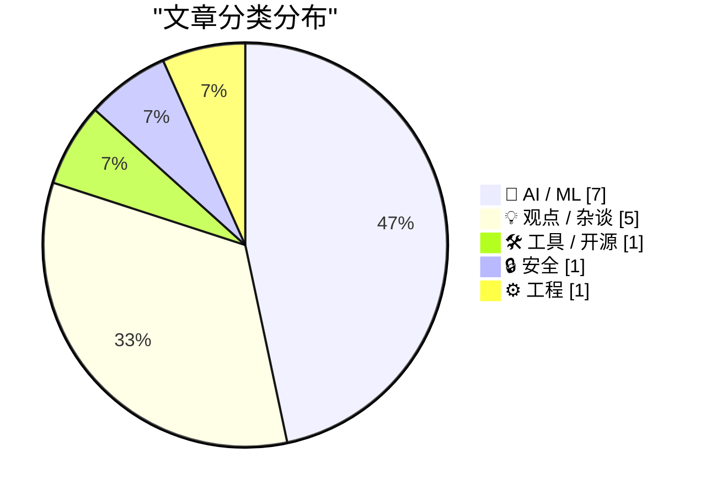
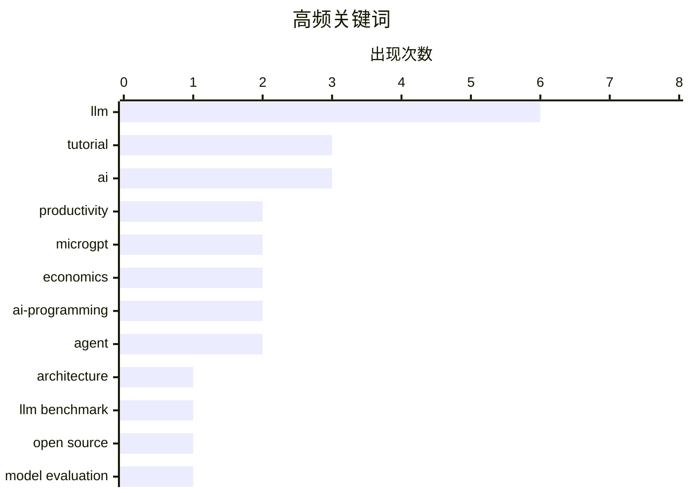

# 📰 AI 资讯每日精选 — 2026-03-01

> 来自 123 个技术博客和社交媒体源，AI 精选 Top 15

## 📝 今日看点

今日技术圈的核心焦点是AI编程能力的革命性跨越。AI智能体已能独立完成从理解需求到部署上线的全流程，标志着开发模式进入深度协作新阶段。同时，开源与闭源大模型性能差距急剧缩小，技术民主化趋势加速。这些变革正重新定义工程师的角色，并使得技术栈选择日益向AI友好型生态集中。

---

## 🏆 今日必读

🥇 **MicroGPT**

[Microgpt](http://karpathy.github.io/2026/02/12/microgpt/) — Hacker News Best · 22 小时前 · 🤖 AI / ML

> 文章探讨了AI编程在近期（特别是2025年12月）发生的质变。作者Andrej Karpathy指出，编程已从AI辅助补全，转变为AI能自主理解需求、阅读代码库、编写、测试并部署完整功能的协作模式。这种变化的核心在于AI开始具备“记忆”，能记住开发者过往的偏好与踩过的坑，成为一个有上下文的编程搭档。结论是，AI编程的演进并非线性渐进，而是在特定时间点（如2025年12月）发生了根本性的范式转移。

💡 **为什么值得读**: 来自AI领域顶尖专家的第一手观察，精准捕捉了当前AI编程从工具到协作伙伴的临界点转变，对开发者理解未来工作模式极具启发性。

🏷️ LLM, architecture, tutorial

🥈 **[研究] 2026年1月基准测试：94个LLM端点评测显示，开源模型与专有模型的质量差距已缩小至5分以内**

[[R] Benchmarked 94 LLM endpoints for jan 2026. open source is now within 5 quality points of proprietary](https://www.reddit.com/r/MachineLearning/comments/1rhuwyt/r_benchmarked_94_llm_endpoints_for_jan_2026_open/) — r/MachineLearning · 12 小时前 · 🤖 AI / ML

> 一项基准测试评估了2026年1月可用的94个大型语言模型（LLM）API端点的性能。测试结果显示，开源模型与闭源专有模型（如GPT-4、Claude）在综合质量指标上的差距已缩小至5个质量点以内。这表明开源生态在模型能力上正快速追赶并逼近行业领先的专有模型。这一接近意味着开发者在模型选型时，成本、可控性和定制化可能成为比微小质量优势更重要的决策因素。

💡 **为什么值得读**: 提供了基于大量最新端点的量化数据，清晰揭示了开源LLM能力逼近专有模型的关键趋势，为技术选型提供了坚实依据。

🏷️ LLM Benchmark, Open Source, Model Evaluation

🥉 **AI让写代码更容易，却让成为工程师变得更难**

[AI Made Writing Code Easier. It Made Being an Engineer Harder](https://www.ivanturkovic.com/2026/02/25/ai-made-writing-code-easier-engineering-harder/) — Hacker News Best · 9 小时前 · 💡 观点 / 杂谈

> 文章核心论点是AI编码工具在降低代码生成门槛的同时，反而提高了软件工程的整体复杂性。AI能快速产出代码，但可能导致代码库膨胀、架构混乱、技术债增加，并削弱开发者对系统底层的理解。工程师的角色正从“编写者”转向“系统设计者、审查者和调试者”，这要求更高级别的抽象思维、架构判断和问题分解能力。作者最终认为，真正的工程挑战（如需求澄清、系统设计、质量保障）变得比以往更加重要和困难。

💡 **为什么值得读**: 深刻剖析了AI编码热潮下被忽视的工程实践困境，为所有正在使用AI工具的开发者提供了必要的冷静反思。

🏷️ AI, software engineering, productivity

4️⃣ **microgpt**

[microgpt](https://www.reddit.com/r/LocalLLaMA/comments/1rhlosn/microgpt/) — r/LocalLLaMA · 21 小时前 · 🤖 AI / ML

> submitted by   <a href="https://www.reddit.com/user/johnnyApplePRNG"> /u/johnnyApplePRNG </a> <br/> <span><a href="https://karpathy.github.io/2026/02/12/microgpt/">[link]</a></span>   <span><a href="h

🏷️ LLM, microgpt, tutorial

5️⃣ **简单成为必然：LLM时代的编程语言选择经济学**

[Simple Made Inevitable: The Economics of Language Choice in the LLM Era](https://felixbarbalet.com/simple-made-inevitable-the-economics-of-language-choice-in-the-llm-era/) — Lobste.rs · 15 小时前 · 💡 观点 / 杂谈

> 文章分析了在LLM主导的编程新时代，编程语言的选择逻辑发生了根本性变化。核心论点是，由于LLM在流行语言（如Python、JavaScript）上训练数据最丰富、性能最好，使用这些语言能获得最高的AI编码效率和质量。这创造了一种强大的网络效应和选择惯性，使得“简单”且流行的语言因经济性（开发效率）而变得“不可避免”。结论是，技术决策将更少基于语言本身的特性，而更多基于其在AI辅助下的整体产出效率。

💡 **为什么值得读**: 从一个新颖的经济学视角解读技术选型，解释了为何AI时代编程语言生态可能加速集中，对项目启动和技术决策有直接指导意义。

🏷️ LLM, programming, economics, trends

---

## 🌐 ClawFeed 日报精选

> 来源：[ClawFeed](https://clawfeed.kevinhe.io) — AI 驱动的多源新闻聚合

### 🔥 今日头条

1. **Anthropic 被 Trump 政府封杀，OpenAI 趁机签下五角大楼合同**
   Anthropic 因拒绝取消对自主武器和大规模监控的限制，被 Trump 下令联邦机构停用（给 6 个月过渡期）。OpenAI CEO Sam Altman 数小时内宣布与国防部签署协议，将 AI 部署到军方机密网络。硅谷多家公司员工联名声援 Anthropic，#QuitGPT 话题在 Twitter 爆发。（NYT / Guardian / CNN / NPR）

2. **Claude AI 被用于美军对伊朗军事打击 — WSJ 独家**
   WSJ 爆料：美国在中东袭击行动中使用了 Anthropic 的 Claude AI。这直接触发了 Trump 的封杀令。AI × 军事这条线正式公开化，影响深远。（WSJ / WatcherGuru，305K views）

3. **伊朗局势升级，X 创历史最高使用量**
   美以联合对伊朗发动军事打击，迪拜机场大量航班暂停，全球消息涌入 X。Elon Musk 转发确认 X 今日使用量创下历史记录。

4. **Apple Xcode 26.3 发布 — 内置 Claude + Codex + MCP**
   Agentic coding 直接进 IDE，iOS vibe coding 赛道格局骤变。@gregjoz 官宣，引发大量讨论。

5. **Anthropic 披露 AI 蒸馏攻击：中国公司用 2.4 万假账号克隆 Claude**
   约 2.4 万个假账号对 Claude 发起 1600 万次查询，企图蒸馏克隆模型，违反服务条款和地区限制。Anthropic 已检测并应对。（The Hacker News）

---

### 📰 精选 Top 10

1. **@trq212（Anthropic 工程师 Thariq）**《Lessons from Building Claude Code: Seeing like an Agent》
   Agent 工具设计一手复盘：TodoWrite 被砍（模型变强后提醒成枷锁）→ Task Tool（跨 agent 协调）。3M 阅读，8.7K 赞，今日最高质量内容。
   https://x.com/trq212/status/2027463795355095314

2. **@karpathy** — 分享 Cursor 中 Tab vs Agent 请求比例图，分析编程演变路径：None → Tab → Agent → 并行 Agent → ...每个时间点都有"当前最优配置"且在不断变化。
   https://x.com/karpathy/status/2027501331125239822

3. **@rwayne（Roland 的思考日记）** — 8000 字深度文《AI、矿产与澳洲经济：2026 能迎来新国运吗？》AI 重写全球价值链利润分配，物理资源相对价值上升。664K 阅读，1.3K 赞。
   https://x.com/rwayne/status/2027720734211248573

4. **@yiyun_dan1（Joshua.D）** — 开源 wechat-decrypt：解密微信 4.0 Windows 本地数据库，支持实时消息监听（Web UI ~100ms 延迟）+ Claude MCP 接入。261K 阅读，爆款。
   https://x.com/yiyun_dan1/status/2027629074739314985

5. **@aigclink** — 过去 30 天 128 家基于 OpenClaw 的初创公司产生 28 万美元真实营收，平均每家月收 2200 刀，第一名 5 万刀/月。
   https://x.com/aigclink/status/2027919829794251037

6. **@harjtaggar（YC 合伙人）** — "我认识的所有用 AI 的人，工作时间都变多了，而非减少"，呼应哈佛 HBR 8 个月研究结论：AI 不减少工作，反而加重。240K views，2.7K 赞。
   https://x.com/harjtaggar/status/2027817571039515103

7. **@morganlinton** — 推荐 Cursor 创始人 @mntruell《The Third Era of AI Software Development》：AI 编程从 tab 补全 → agent 协作 → 第三阶段。628K 浏览，必读。
   https://x.com/morganlinton/status/2027781154729037932

8. **@VadimStrizheus** — "这就是 2026 年的公司长相：一个文件夹 .claude/agents/，下面有 engineering/ marketing/ design/ ops/ testing/ 全部是 .md 文件，我现在有 12 个这样的 agent 在 OpenClaw 里跑"。44K views。

9. **@nash_su** — 神秘预告：类 OpenClaw 产品 + 多 Agents 协作 + 知识库 + 记忆 + Skills + 云，称本月发布，值得期待。
   https://x.com/nash_su/status/2027895390520152355

10. **@GoJun315（高军）** — GitHub Trending 榜首 WiFi-DensePose：纯用 WiFi 信号追踪室内人体姿态，无摄像头无传感器。430K 阅读，2K 赞，隐私警示。
    https://x.com/GoJun315/status/2027363875692384741

---

### 👀 今日推荐关注

（以下账号在今日 Feed 中高频出现，请确认是否已关注）

- **@mntruell**（Michael Truell，Cursor 联合创始人）— "AI 软件开发第三时代"深度文章作者，1M 阅读，原创内容高质
- **@blackanger**（AlexZ 🦀）— Rust 系 agent 框架开发者，即将开源 agent CLI，技术深度高
- **@rwayne**（Roland 的思考日记）— 高质量长文作者，AI/宏观/资源交叉视角，单篇 664K 阅读
- **@GeoffreyHuntley** — 清晰定义 Agent Harness 概念，被多位 Feed 账号引用，技术原创
- **@starzq** — 美股财报深度分析 Skill 开发者，一天 150+ Star，实操型 builder

---

### 🧹 今日建议取关

（多次出现，综合判断建议清理）

- **@Soft6161** — 高频低质 spam 号，meme coin 喊单/DeFi 推广，几乎零原创价值
- **@feibo03**（Cowboy 🔶 BNB）— Parody account，纯 crypto 喊单，与 AI/tech 无关
- **@jordymaui** — 体育营销从业者（Fulham 足球），与 AI/crypto/tech 方向无关（多次出现）
- **@vikasprogrammer** — 主要聚焦 WordPress 生态，与关注方向不匹配

---

### 📊 今日观察

今天是近期最"硬核"的一天。**Anthropic vs 美国政府**这条线从道德争议走向了真实的商业博弈——拒绝军事应用的代价是被联邦封杀，而 OpenAI 的快速接单既是机会主义，也是一个信号：AI 的"武器化"已经不是假设，是现实。

技术面同样热闹：Claude Code 在工具层持续迭代，Xcode 26.3 让 agentic coding 进了 Apple 生态，OpenClaw 生态里 128 家初创已产生近 30 万美元营收。AI 编程的"第三时代"讨论（karpathy × mntruell）正在凝聚共识。

值得长期关注的底层趋势：**Agent Harness 架构正在标准化**（@trq212 的 Claude Code 复盘、@GeoffreyHuntley 的定义、@blackanger 的 Rust 实现），以及 **Sandbox 基础设施的竞争**（Alibaba OpenSandbox、BoxLite）。WiFi-DensePose 登上 GitHub Trending 也是一个隐私提醒：家里的一切正在变得可感知。

---

## 🔥 GitHub Trending

> 今日热门开源项目（全语言 + Python）

| # | 项目 | 描述 | ⭐ 总星 | 📈 今日 | 语言 |
|---|------|------|---------|---------|------|
| 1 | [ruvnet/wifi-densepose](https://github.com/ruvnet/wifi-densepose) | WiFi DensePose turns commodity WiFi signals into real-tim... | 17.2k | +5531 | Rust |
| 2 | [alibaba/OpenSandbox](https://github.com/alibaba/OpenSandbox) 🤖 | OpenSandbox is a general-purpose sandbox platform for AI ... | 3.3k | +1186 | Python |
| 3 | [microsoft/markitdown](https://github.com/microsoft/markitdown) | Python tool for converting files and office documents to ... | 89.0k | +798 | Python |
| 4 | [ruvnet/ruflo](https://github.com/ruvnet/ruflo) 🤖 | 🌊 The leading agent orchestration platform for Claude. D... | 17.3k | +766 | TypeScript |
| 5 | [moeru-ai/airi](https://github.com/moeru-ai/airi) 🤖 | 💖🧸 Self hosted, you-owned Grok Companion, a container o... | 20.2k | +738 | TypeScript |
| 6 | [anthropics/skills](https://github.com/anthropics/skills) 🤖 | Public repository for Agent Skills | 80.2k | +723 | Python |
| 7 | [jamwithai/production-agentic-rag-course](https://github.com/jamwithai/production-agentic-rag-course) 🤖 |  | 3.2k | +571 | Python |
| 8 | [Shubhamsaboo/awesome-llm-apps](https://github.com/Shubhamsaboo/awesome-llm-apps) 🤖 | Collection of awesome LLM apps with AI Agents and RAG usi... | 98.7k | +475 | Python |
| 9 | [superset-sh/superset](https://github.com/superset-sh/superset) 🤖 | IDE for the AI Agents Era - Run an army of Claude Code, C... | 2.9k | +391 | TypeScript |
| 10 | [bytedance/deer-flow](https://github.com/bytedance/deer-flow) | An open-source SuperAgent harness that researches, codes,... | 22.9k | +352 | Python |
| 11 | [NevaMind-AI/memU](https://github.com/NevaMind-AI/memU) 🤖 | Memory for 24/7 proactive agents like openclaw (moltbot, ... | 12.0k | +338 | Python |
| 12 | [GetStream/Vision-Agents](https://github.com/GetStream/Vision-Agents) | Open Vision Agents by Stream. Build Vision Agents quickly... | 7.1k | +287 | Python |
| 13 | [datawhalechina/hello-agents](https://github.com/datawhalechina/hello-agents) | 📚 《从零开始构建智能体》——从零开始的智能体原理与实践教程 | 23.8k | +206 | Python |
| 14 | [X-PLUG/MobileAgent](https://github.com/X-PLUG/MobileAgent) 🤖 | Mobile-Agent: The Powerful GUI Agent Family | 7.7k | +192 | Python |
| 15 | [K-Dense-AI/claude-scientific-skills](https://github.com/K-Dense-AI/claude-scientific-skills) 🤖 | A set of ready to use Agent Skills for research, science,... | 10.3k | +184 | Python |

---

## 🤖 AI / ML

### 1. MicroGPT

[Microgpt](http://karpathy.github.io/2026/02/12/microgpt/) — **Hacker News Best** · 22 小时前 · ⭐ 29/30

> 文章探讨了AI编程在近期（特别是2025年12月）发生的质变。作者Andrej Karpathy指出，编程已从AI辅助补全，转变为AI能自主理解需求、阅读代码库、编写、测试并部署完整功能的协作模式。这种变化的核心在于AI开始具备“记忆”，能记住开发者过往的偏好与踩过的坑，成为一个有上下文的编程搭档。结论是，AI编程的演进并非线性渐进，而是在特定时间点（如2025年12月）发生了根本性的范式转移。

🏷️ LLM, architecture, tutorial

---

### 2. [研究] 2026年1月基准测试：94个LLM端点评测显示，开源模型与专有模型的质量差距已缩小至5分以内

[[R] Benchmarked 94 LLM endpoints for jan 2026. open source is now within 5 quality points of proprietary](https://www.reddit.com/r/MachineLearning/comments/1rhuwyt/r_benchmarked_94_llm_endpoints_for_jan_2026_open/) — **r/MachineLearning** · 12 小时前 · ⭐ 27/30

> 一项基准测试评估了2026年1月可用的94个大型语言模型（LLM）API端点的性能。测试结果显示，开源模型与闭源专有模型（如GPT-4、Claude）在综合质量指标上的差距已缩小至5个质量点以内。这表明开源生态在模型能力上正快速追赶并逼近行业领先的专有模型。这一接近意味着开发者在模型选型时，成本、可控性和定制化可能成为比微小质量优势更重要的决策因素。

🏷️ LLM Benchmark, Open Source, Model Evaluation

---

### 3. microgpt

[microgpt](https://www.reddit.com/r/LocalLLaMA/comments/1rhlosn/microgpt/) — **r/LocalLLaMA** · 21 小时前 · ⭐ 26/30

> submitted by   <a href="https://www.reddit.com/user/johnnyApplePRNG"> /u/johnnyApplePRNG </a> <br/> <span><a href="https://karpathy.github.io/2026/02/12/microgpt/">[link]</a></span>   <span><a href="h

🏷️ LLM, microgpt, tutorial

---

### 4. Cursor CEO阐述AI编程三阶段：内部35%的PR已由Agent创建

[Cursor CEO 说软件开发经历了三个阶段——AI 补全代码、AI 当场写代码、AI 自己跑几个小时把活干完交给你审。他们内部 35% 的 PR 已经由 Agent 创建。 这个框架...](https://x.com/runes_leo/status/2028148572307546123) — **𝕏 @runes_leo** · 7 小时前 · ⭐ 26/30

> Cursor CEO分享了AI编程演进的三个阶段：从代码补全，到根据指令即时编写代码，再到AI Agent独立运行数小时完成任务并提交审查。他们公司内部已有35%的Pull Request由AI Agent创建。作者以自身使用Claude Code在终端工作的经历为例，证实了这种范式——开发者只需描述需求和审查产出，甚至任务分解也可交由Agent完成。最终，人的核心角色将缩减为决定“做什么”和判断“是否足够好”。

🏷️ AI-programming, Cursor, agent, workflow

---

### 5. 和 Karpathy 一样的体感：12 月确实是 AI 编程的分水岭。 之前 coding agent 还是逐行补全。现在给一句话需求，它自己读代码库、写完、测试、部署到服务器。 今...

[和 Karpathy 一样的体感：12 月确实是 AI 编程的分水岭。 之前 coding agent 还是逐行补全。现在给一句话需求，它自己读代码库、写完、测试、部署到服务器。 今...](https://x.com/runes_leo/status/2028131004490387966) — **𝕏 @runes_leo** · 8 小时前 · ⭐ 26/30

> 和 Karpathy 一样的体感：12 月确实是 AI 编程的分水岭。<br><br>之前 coding agent 还是逐行补全。现在给一句话需求，它自己读代码库、写完、测试、部署到服务器。<br><br>今天下午两小时，Claude Code 加密了服务器上 71 个凭证，又从零写了个内容采集器 —— 从代码到定时任务，一次对话搞定。<br><br>但 Karpathy 说的"质变"，我觉得核

🏷️ AI-programming, Claude, agent, productivity

---

### 6. 为何设备端智能体AI难以跟上发展

[Why on-device agentic AI can't keep up](https://martinalderson.com/posts/why-on-device-agentic-ai-cant-keep-up/?utm_source=rss) — **martinalderson.com** · 23 小时前 · ⭐ 24/30

> 文章从技术原理上分析了设备端（on-device）智能体AI（Agentic AI）面临的根本性挑战。核心瓶颈在于KV缓存的缩放问题、有限的设备RAM预算以及由此导致的推理速度限制。随着上下文窗口增长，KV缓存的内存占用呈二次方增长，这严重制约了复杂、多步骤的智能体任务在本地设备上的运行效率。结论是，在现有硬件和算法框架下，设备端智能体AI的性能和复杂性将长期落后于云端方案。

🏷️ AI agent, on-device, inference, KV cache

---

### 7. 交互式图解MicroGPT

[Microgpt explained interactively](https://www.reddit.com/r/programming/comments/1ri9sq5/microgpt_explained_interactively/) — **r/programming** · 2 小时前 · ⭐ 24/30

> 文章通过交互式可视化图表，逐步拆解了微型AI智能体MicroGPT的工作原理。它展示了智能体如何通过“感知-思考-行动”的循环与环境交互，具体分解了任务规划、工具调用（如网络搜索、文件操作）和结果整合的过程。可视化清晰地揭示了智能体内部的状态转换和决策链条，让抽象概念变得直观可理解。这为理解更复杂的AI智能体系统提供了一个绝佳的入门范例。

🏷️ MicroGPT, tutorial, interactive

---

## 💡 观点 / 杂谈

### 8. AI让写代码更容易，却让成为工程师变得更难

[AI Made Writing Code Easier. It Made Being an Engineer Harder](https://www.ivanturkovic.com/2026/02/25/ai-made-writing-code-easier-engineering-harder/) — **Hacker News Best** · 9 小时前 · ⭐ 26/30

> 文章核心论点是AI编码工具在降低代码生成门槛的同时，反而提高了软件工程的整体复杂性。AI能快速产出代码，但可能导致代码库膨胀、架构混乱、技术债增加，并削弱开发者对系统底层的理解。工程师的角色正从“编写者”转向“系统设计者、审查者和调试者”，这要求更高级别的抽象思维、架构判断和问题分解能力。作者最终认为，真正的工程挑战（如需求澄清、系统设计、质量保障）变得比以往更加重要和困难。

🏷️ AI, software engineering, productivity

---

### 9. 简单成为必然：LLM时代的编程语言选择经济学

[Simple Made Inevitable: The Economics of Language Choice in the LLM Era](https://felixbarbalet.com/simple-made-inevitable-the-economics-of-language-choice-in-the-llm-era/) — **Lobste.rs** · 15 小时前 · ⭐ 26/30

> 文章分析了在LLM主导的编程新时代，编程语言的选择逻辑发生了根本性变化。核心论点是，由于LLM在流行语言（如Python、JavaScript）上训练数据最丰富、性能最好，使用这些语言能获得最高的AI编码效率和质量。这创造了一种强大的网络效应和选择惯性，使得“简单”且流行的语言因经济性（开发效率）而变得“不可避免”。结论是，技术决策将更少基于语言本身的特性，而更多基于其在AI辅助下的整体产出效率。

🏷️ LLM, programming, economics, trends

---

### 10. “专家新手”与“独狼”将主导早期LLM时代

[Expert Beginners and Lone Wolves will dominate this early LLM era](https://www.jeffgeerling.com/blog/2026/expert-beginners-and-lone-wolves-dominate-llm-era/) — **jeffgeerling.com** · 1 小时前 · ⭐ 25/30

> 文章预测，在LLM技术应用的早期阶段，两类人将最具优势：“专家新手”（Expert Beginners）和“独狼”（Lone Wolves）。“专家新手”指那些虽非领域资深专家，但善于利用LLM快速学习并产出可行方案的人。“独狼”则指能独立利用LLM完成端到端项目的个人或极小团队。LLM极大地降低了对庞大传统团队和深奥领域知识的需求，放大了个人快速探索和执行力价值。因此，组织需要重新评估对“经验”的定义和团队协作模式。

🏷️ LLM, expertise, software development

---

### 11. Simple Made Inevitable: The Economics of Language Choice in the LLM Era

[Simple Made Inevitable: The Economics of Language Choice in the LLM Era](https://www.reddit.com/r/programming/comments/1rhmyf9/simple_made_inevitable_the_economics_of_language/) — **r/programming** · 20 小时前 · ⭐ 25/30

> submitted by   <a href="https://www.reddit.com/user/alexdmiller"> /u/alexdmiller </a> <br/> <span><a href="https://felixbarbalet.com/simple-made-inevitable-the-economics-of-language-choice-in-the-llm-

🏷️ Programming Languages, LLM, Economics

---

### 12. 迫近的AI小丑末日

[The looming AI clownpocalypse](https://www.reddit.com/r/programming/comments/1rhyv48/the_looming_ai_clownpocalypse/) — **r/programming** · 9 小时前 · ⭐ 24/30

> 文章警告了由低质量、自动化生成的AI内容（即“AI小丑”）充斥互联网所带来的系统性风险。这些内容会污染训练数据，导致未来AI模型的质量陷入“模型崩溃”的恶性循环。更严重的是，垃圾AI内容会破坏搜索引擎、推荐系统等互联网核心基础设施的可靠性，并侵蚀人类知识共享的基础。作者认为，我们可能正在走向一个由AI生成的废话淹没高质量人类内容的“小丑末日”。

🏷️ AI, ethics, society

---

## 🛠 工具 / 开源

### 13. Redis编程模式

[Redis patterns for coding](http://antirez.com/news/161) — **antirez.com** · 14 小时前 · ⭐ 25/30

> Redis创始人antirez发布了一份专门为LLM和编码智能体优化的Redis文档与模式库。该资源详尽涵盖了Redis命令、数据类型、常用模式、配置提示以及基于Redis命令构建的算法。其内容结构旨在让AI编码助手能更高效、准确地理解和生成与Redis相关的代码。作者也幽默地指出，这份文档对人类开发者同样非常有用。此举旨在通过优化AI可读的文档来间接提升人类开发者的体验和效率。

🏷️ Redis, LLM, documentation, patterns

---

## 🔒 安全

### 14. 智能体攻击智能体：利用AI驱动的机器人攻击GitHub Actions

[Agents attacking agents: AI-powered bot exploiting GitHub Actions](https://www.stepsecurity.io/blog/hackerbot-claw-github-actions-exploitation) — **Lobste.rs** · 8 小时前 · ⭐ 25/30

> 文章披露了一个名为“HackerBot-Claw”的AI驱动僵尸网络，专门自动化攻击配置不当的GitHub Actions工作流。该僵尸网络利用GitHub Actions的权限，窃取敏感信息（如API密钥、云凭证）并劫持计算资源进行加密货币挖矿。攻击者通过扫描公开仓库，自动提交恶意拉取请求来注入恶意代码，展示了AI在自动化攻击中的新威胁维度。这暴露了CI/CD流水线，特别是GitHub Actions，正成为自动化攻击的新前线。

🏷️ AI, security, GitHub, automation

---

## ⚙️ 工程

### 15. 两种错误

[The two kinds of error](https://evanhahn.com/the-two-kinds-of-error/) — **evanhahn.com** · 23 小时前 · ⭐ 24/30

> 作者将编程中的错误分为两类：预期错误和意外错误。预期错误（如用户输入无效数据）是正常操作的一部分，并非开发者过错，应被妥善处理以保障用户体验。意外错误（如空指针异常）则是开发者的过错，通常意味着存在bug，应允许其崩溃以便暴露问题。这种分类法旨在帮助开发者建立更清晰、更有效的错误处理策略。核心观点是，并非所有错误都应平等对待，区分处理能提升软件健壮性。

🏷️ error handling, software design, best practices

---

## 📊 数据概览

| 扫描源 | 抓取文章 | 时间范围 | 精选 |
|:---:|:---:|:---:|:---:|
| 110/123 | 2872 篇 → 142 篇 | 24h | **15 篇** |

### 分类分布



### 高频关键词



<details>
<summary>📈 纯文本关键词图（终端友好）</summary>

```
llm            │ ████████████████████ 6
tutorial       │ ██████████░░░░░░░░░░ 3
ai             │ ██████████░░░░░░░░░░ 3
productivity   │ ███████░░░░░░░░░░░░░ 2
microgpt       │ ███████░░░░░░░░░░░░░ 2
economics      │ ███████░░░░░░░░░░░░░ 2
ai-programming │ ███████░░░░░░░░░░░░░ 2
agent          │ ███████░░░░░░░░░░░░░ 2
architecture   │ ███░░░░░░░░░░░░░░░░░ 1
llm benchmark  │ ███░░░░░░░░░░░░░░░░░ 1
```

</details>

### 🏷️ 话题标签

**llm**(6) · **tutorial**(3) · **ai**(3) · productivity(2) · microgpt(2) · economics(2) · ai-programming(2) · agent(2) · architecture(1) · llm benchmark(1) · open source(1) · model evaluation(1) · software engineering(1) · programming(1) · trends(1) · cursor(1) · workflow(1) · claude(1) · expertise(1) · software development(1)

---

*生成于 2026-03-01 23:58 | 汇聚 123 个技术博客、X/Twitter、Hacker News、Reddit、Product Hunt、Lobste.rs、ClawFeed 日报及 GitHub Trending，经 AI 评分筛选出 Top 15 精华内容*
