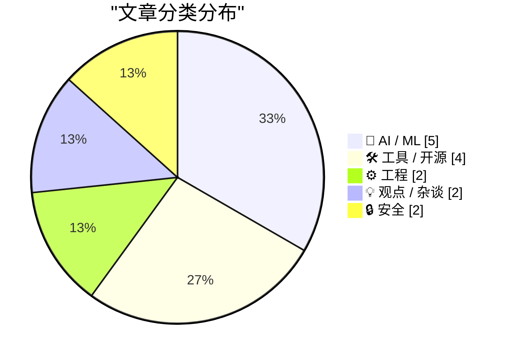
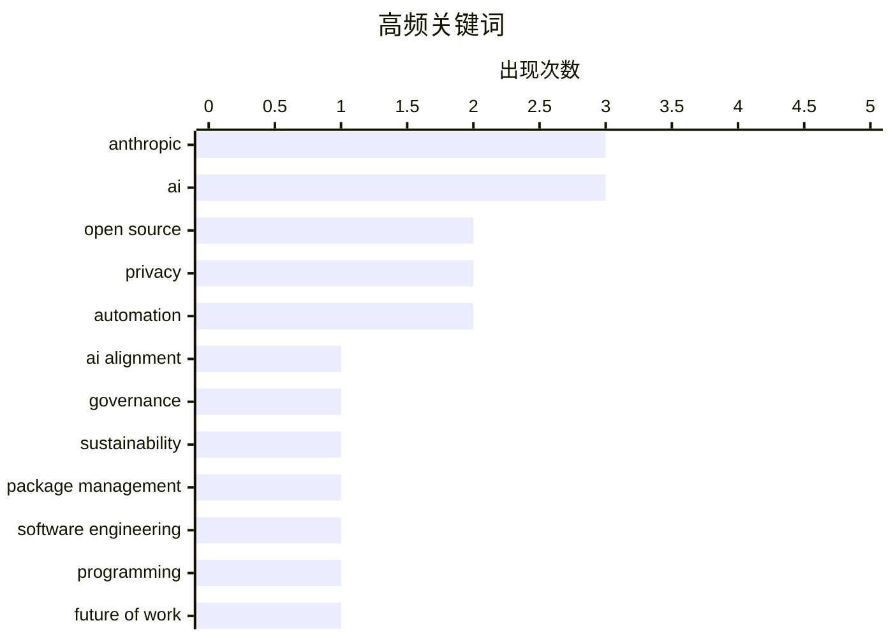

# 📰 AI 资讯每日精选 — 2026-03-03

> 来自 123 个技术博客和社交媒体源，AI 精选 Top 15

## 📝 今日看点

今日技术圈聚焦于AI权力博弈与基础设施隐忧。巨头AI公司的国家化角色与安全护栏之争凸显技术政治化趋势，而开源软件供应链的可持续性危机则威胁着数字世界的基石。与此同时，从泛滥的AI垃圾内容到隐私泄露，技术狂飙背后的质量与伦理问题正引发强烈反弹。

---

## 🏆 今日必读

🥇 **Anthropic 与对齐问题**

[‘Anthropic and Alignment’](https://stratechery.com/2026/anthropic-and-alignment/) — daringfireball.net · 5 小时前 · 🤖 AI / ML

> 文章核心探讨了当私营公司（如 Anthropic）掌握类似核武器级别的强大AI能力时，与国家权力（如美国政府）之间的根本性冲突。作者 Ben Thompson 引用 Anthropic CEO Dario Amodei 的比喻，指出如果一家私营公司开发了核武器并试图对美国军方发号施令，美国绝对有动机摧毁这家公司。其根本原因在于国际法本质上是权力的产物，即“强权即公理”。对于某些特定能力（如核武器或尖端AI），国家不可能允许其控制权旁落于非国家实体。结论是，在涉及国家安全的根本性能力上，私营科技公司与政府之间的“对齐”问题，最终会演变为权力与控制的直接较量。

💡 **为什么值得读**: 这篇文章通过一个尖锐的比喻，深刻揭示了AI治理中私营巨头与国家主权之间难以调和的根本矛盾，对理解当前AI安全与监管辩论的核心冲突极具启发性。

🏷️ Anthropic, AI alignment, governance

🥈 **开源软件包仓库面临可持续性危机**

[Open source package repositories face sustainability crisis](https://www.reddit.com/r/programming/comments/1rj2o7z/open_source_package_repositories_face/) — r/programming · 4 小时前 · ⚙️ 工程

> 开源软件包仓库（如 npm、PyPI）正面临严重的财务与运营可持续性挑战。这些为全球开发基础设施提供关键服务的平台，长期依赖志愿者维护和有限的捐赠，缺乏稳定的商业模式。随着软件供应链攻击的增加，维护安全性和完整性的成本急剧上升，而用户和大型科技公司对免费使用的期望却始终存在。文章指出，若不解决资金问题，整个开源生态系统的基础设施将面临崩溃风险。

💡 **为什么值得读**: 本文直指现代软件开发赖以生存的开源基础设施中隐藏的 systemic risk，是每一位依赖开源组件的开发者和企业都应关注的警示。

🏷️ open source, sustainability, package management

🥉 **Naval：AI时代，懂代码的人杠杆更大**

[Naval 讲出一个很关键的判断：AI 时代，懂代码的人杠杆反而更大了，因为 AI写的代码一定会有漏洞，得有人能补。这可能也是为什么程序员招聘数量不降反升。 "成为...](https://x.com/runes_leo/status/2028414008030527632) — 𝕏 @runes_leo · 13 小时前 · 💡 观点 / 杂谈

> 风险投资家 Naval 提出了一个关于AI时代软件工程价值的核心判断：传统软件工程并未消亡，懂代码的工程师杠杆反而变得更大。其核心论点是，AI生成的代码必然存在漏洞和缺陷，需要人类工程师进行审查、调试和修补，这使得他们的技能变得至关重要。这也解释了为何在AI辅助编程工具普及的背景下，程序员的招聘需求不降反升。他的结论是，工程师应致力于成为所从事领域的“世界第一”，并不断重新定义自己的工作以保持竞争力。

💡 **为什么值得读**: 这个观点为在AI浪潮中感到焦虑的程序员提供了清晰的价值定位和职业发展思路，反驳了“AI将取代程序员”的简单论调。

🏷️ AI, software engineering, programming, future of work

4️⃣ **华尔街日报：特朗普政府冷落Anthropic，拥抱OpenAI，因护栏问题发生冲突**

[WSJ: ‘Trump Administration Shuns Anthropic, Embraces OpenAI in Clash Over Guardrails’](https://www.wsj.com/tech/ai/trump-will-end-government-use-of-anthropics-ai-models-ff3550d9) — daringfireball.net · 6 小时前 · 🤖 AI / ML

> 特朗普政府宣布将停止使用Anthropic的AI模型，转而全面拥抱OpenAI，起因是双方在AI使用的“护栏”条款上发生根本冲突。美国国防部要求Anthropic同意军方在所有“合法用途”中使用其模型，但Anthropic CEO Dario Amodei以“良心”为由拒绝，划定了国内大规模监控和自主武器两条红线。这一拒绝直接导致了政府的封杀决定。事件凸显了AI公司在军事应用伦理上与政府要求之间的深刻矛盾。

💡 **为什么值得读**: 本文提供了AI巨头与政府就AI军事化应用进行博弈的一手关键案例，揭示了商业伦理、国家安全与公司生存之间的紧张关系。

🏷️ Anthropic, OpenAI, government, policy

5️⃣ **没人想读你的AI垃圾**

[Pluralistic: No one wants to read your AI slop (02 Mar 2026)](https://pluralistic.net/2026/03/02/nonconsensual-slopping/) — pluralistic.net · 14 小时前 · 💡 观点 / 杂谈

> 文章猛烈抨击了当前网络上泛滥的、由AI生成的低质量内容（被称为“AI slop”）。核心观点是，这些内容未经同意地充斥信息渠道，污染网络环境，对读者毫无价值。作者认为，如果人们坚持使用AI生成内容，至少应该私下进行，而不是公开传播。其结论是，这种以量取胜、缺乏灵魂和真实性的AI内容生产，是对读者时间和注意力的不尊重，最终会遭到用户唾弃。

💡 **为什么值得读**: 这篇文章以犀利的观点批判了AI内容生成的滥用现象，为所有内容创作者和消费者敲响了警钟，强调质量与真实性的不可替代性。

🏷️ AI, content, ethics, spam

---

## 🌐 ClawFeed 日报精选

> 来源：[ClawFeed](https://clawfeed.kevinhe.io) — AI 驱动的多源新闻聚合

### 🔥 今日头条

### 1. Trump 下令停用 Anthropic，五角大楼转向 OpenAI
Trump 签署行政令，命令全联邦机构停止使用 Claude，并以"supply chain risk"为由将 Anthropic 列入黑名单（这一级别通常保留给外国对手）。起因：Anthropic 拒绝允许 Claude 用于大规模监控和全自主武器系统，谈判破裂。Anthropic 表示将上诉法庭。OpenAI 趁机迅速与五角大楼签约（含"技术保障措施"）。事后 DoD 宣布同时与 OpenAI / Anthropic / Google / xAI 签约"all lawful purposes"军事合同，Claude 成唯一用于机密任务的 AI（借道 Palantir）。
*来源：Reuters / AP / BBC / NYT / TechCrunch*

### 2. Anthropic 放弃核心安全承诺
TechCrunch 报道，Anthropic 本周撤回了"不确定安全前不发布强大 AI 系统"的核心承诺。与五角大楼风波叠加，引发 AI 安全社区广泛讨论。Google AI 员工联名呼吁限制军事用途。

### 3. OpenClaw 超越 React 成 GitHub 历史最受欢迎项目
OpenClaw 突破 245,000 Stars，成为 GitHub 史上 Stars 最多的项目。官方评论：「Reports of our death were greatly exaggerated.」全天 Twitter 热议。

### 4. Cursor CEO 的第三时代宣言爆款
@mntruell 发文《The Third Era of AI Software Development》，全天浏览量突破 1.6M+，多个顶级账号强推。Cursor 内部宣布 35% PR 已由自主 AI Agent 完成。被认为是近年 AI coding 领域最重要的一篇文章。

### 5. Claude 上线 Memory Import
Claude 推出 Memory Import 功能，可一键把 ChatGPT、Gemini 等 AI 助手积累的用户记忆迁移至 Claude，正面对攻 ChatGPT 的记忆护城河。（171K 播放）

---

### 📰 精选 Top 10

1. **@trq212（Anthropic工程师）**《Lessons from Building Claude Code: Seeing like an Agent》
Claude Code 一年工具设计演变复盘：TodoWrite 被淘汰→Task Tool 兴起，从"盯着干"→"跨 agent 协调"，action space 设计精髓。**3.4M 浏览，9.3K 赞，近期最硬核 agent engineering 干货。**
https://x.com/trq212/status/2027463795355095314

2. **@VadimStrizheus** 爆款推文：「2026 年的公司不是人，不是办公室，是一个文件夹。.claude/agents/ 里有 engineering、marketing、design、ops，每个角色都是 .md 文件。」**541K 浏览。**
https://x.com/VadimStrizheus/status/2027953432326197508

3. **@wangray** OpenAI 内部案例：3 个工程师、5 个月、几乎不手写代码，完成约 100 万行代码的内部产品，人均每天 3.5 个 PR。标题：「工程师，开始给 Agent 打工了」
https://x.com/wangray/status/2028132386756780220

4. **@rwayne** AI 时代裁员实录：部署 OpenClaw 一个月后做了创业以来最大裁员，会用 AI 的留下加薪，不会用 AI 的是"负资产"（60K 浏览，争议巨大）
https://x.com/rwayne/status/2028310113149465001

5. **@runes_leo** 律师将 10 年执业经验编码成 6 个 Claude Skill，2 人律所干出大所的活。试过 Harvey、Spellbook 后回归通用 Claude：「垂直产品卖模板，模板没护城河」（27K 浏览）
https://x.com/runes_leo/status/2028034913442906581

6. **@imaxichuhai** 闲鱼电影票代买 AI 全自动化：用户发截图→AI 识别场次座位→自动改价出票，**12万+营收**，真实 OpenClaw 落地案例（266K 浏览）
https://x.com/imaxichuhai/status/2028114412134150156

7. **@vikingmute** 力推 Context Mode（MCP 服务器）：Claude Code 工具输出从 315KB 压缩至 5.4KB，节省 **98% 上下文 token**，HN 热门
https://x.com/vikingmute/status/2028075718299763009

8. **@kloss_xyz** Anthropic 上线免费官方 AI Academy：**13 门课程 + 官方证书**，涵盖 MCP / API / Claude Code / AI fluency，「以前报班花 $2K 学的东西，现在免费」
https://x.com/kloss_xyz/status/2028237936848994369

9. **@GoJun315** WiFi-DensePose 登 GitHub Trending 榜首：用 WiFi 信号追踪室内人体动作，无需摄像头/传感器/特殊硬件。**437K 浏览。**（隐私话题值得持续关注）
https://x.com/GoJun315/status/2027363875692384741

10. **@KevinZbtc** 总结使用 Claude 最值得维护的文档体系：Claude.md / glossary.md / toolbox.md / Skills.md / memory.md（216 赞，14K 浏览）
https://x.com/KevinZbtc/status/2028315352392966590

---

### 📊 今日观察

今天是信息密度极高的一天，两条主线交织：

**政治 × AI：** Anthropic 与 Trump 政府的正面冲突，展示了 AI 安全价值观与政府采购之间的真实张力。Anthropic 拒绝自主武器→失去五角大楼合同→OpenAI 补位，同时 Anthropic 又借道 Palantir 重新进入机密场景，局面复杂。「AI 安全」的旗帜正在快速商业化与政治化。

**Agent 时代正在加速落地：** 今天的 feed 里，不是 demo，是真实营收（闲鱼 12 万）、真实裁员（rwayne）、真实代码产出（OpenAI 100 万行 / Cursor 35% PR by Agent）。「Agent 打工」的叙事从比喻变成了数据。

**工具链快速成熟：** Context Mode 节省 98% token、Electron App 被 AI 接管、免费 Academy 降低进入门槛。下一个窗口期：为 Agent 构建基础设施（钱包、权限、编排）的人。

---

*生成时间：2026-03-02 22:00 SGT*
*数据来源：6 份 4h 简报（共覆盖全天 Feed）*

---

## 🔥 GitHub Trending

> 今日热门开源项目（全语言 + Python）

| # | 项目 | 描述 | ⭐ 总星 | 📈 今日 | 语言 |
|---|------|------|---------|---------|------|
| 1 | [ruvnet/wifi-densepose](https://github.com/ruvnet/wifi-densepose) | WiFi DensePose turns commodity WiFi signals into real-tim... | 21.8k | +5080 | Rust |
| 2 | [moeru-ai/airi](https://github.com/moeru-ai/airi) 🤖 | 💖🧸 Self hosted, you-owned Grok Companion, a container o... | 21.4k | +1425 | TypeScript |
| 3 | [alibaba/OpenSandbox](https://github.com/alibaba/OpenSandbox) 🤖 | OpenSandbox is a general-purpose sandbox platform for AI ... | 4.3k | +982 | Python |
| 4 | [public-apis/public-apis](https://github.com/public-apis/public-apis) | A collective list of free APIs | 403.0k | +935 | Python |
| 5 | [K-Dense-AI/claude-scientific-skills](https://github.com/K-Dense-AI/claude-scientific-skills) 🤖 | A set of ready to use Agent Skills for research, science,... | 11.0k | +848 | Python |
| 6 | [ruvnet/ruflo](https://github.com/ruvnet/ruflo) 🤖 | 🌊 The leading agent orchestration platform for Claude. D... | 18.0k | +821 | TypeScript |
| 7 | [anthropics/prompt-eng-interactive-tutorial](https://github.com/anthropics/prompt-eng-interactive-tutorial) 🤖 | Anthropic's Interactive Prompt Engineering Tutorial | 31.6k | +683 | Jupyter Notebook |
| 8 | [microsoft/markitdown](https://github.com/microsoft/markitdown) | Python tool for converting files and office documents to ... | 89.6k | +646 | Python |
| 9 | [superset-sh/superset](https://github.com/superset-sh/superset) 🤖 | IDE for the AI Agents Era - Run an army of Claude Code, C... | 3.5k | +592 | TypeScript |
| 10 | [X-PLUG/MobileAgent](https://github.com/X-PLUG/MobileAgent) 🤖 | Mobile-Agent: The Powerful GUI Agent Family | 7.9k | +259 | Python |
| 11 | [scrapy/scrapy](https://github.com/scrapy/scrapy) | Scrapy, a fast high-level web crawling & scraping framewo... | 60.5k | +204 | Python |
| 12 | [jamwithai/production-agentic-rag-course](https://github.com/jamwithai/production-agentic-rag-course) 🤖 |  | 3.4k | +171 | Python |
| 13 | [davila7/claude-code-templates](https://github.com/davila7/claude-code-templates) 🤖 | CLI tool for configuring and monitoring Claude Code | 21.8k | +130 | Python |
| 14 | [NanmiCoder/MediaCrawler](https://github.com/NanmiCoder/MediaCrawler) | 小红书笔记 | 评论爬虫、抖音视频 | 评论爬虫、快手视频 | 评论爬虫、B 站视频 ｜ 评论爬虫、微博帖子 ｜ ... | 44.7k | +121 | Python |
| 15 | [EbookFoundation/free-programming-books](https://github.com/EbookFoundation/free-programming-books) | 📚 Freely available programming books | 383.5k | +81 | Python |

---

## 🤖 AI / ML

### 1. Anthropic 与对齐问题

[‘Anthropic and Alignment’](https://stratechery.com/2026/anthropic-and-alignment/) — **daringfireball.net** · 5 小时前 · ⭐ 26/30

> 文章核心探讨了当私营公司（如 Anthropic）掌握类似核武器级别的强大AI能力时，与国家权力（如美国政府）之间的根本性冲突。作者 Ben Thompson 引用 Anthropic CEO Dario Amodei 的比喻，指出如果一家私营公司开发了核武器并试图对美国军方发号施令，美国绝对有动机摧毁这家公司。其根本原因在于国际法本质上是权力的产物，即“强权即公理”。对于某些特定能力（如核武器或尖端AI），国家不可能允许其控制权旁落于非国家实体。结论是，在涉及国家安全的根本性能力上，私营科技公司与政府之间的“对齐”问题，最终会演变为权力与控制的直接较量。

🏷️ Anthropic, AI alignment, governance

---

### 2. 华尔街日报：特朗普政府冷落Anthropic，拥抱OpenAI，因护栏问题发生冲突

[WSJ: ‘Trump Administration Shuns Anthropic, Embraces OpenAI in Clash Over Guardrails’](https://www.wsj.com/tech/ai/trump-will-end-government-use-of-anthropics-ai-models-ff3550d9) — **daringfireball.net** · 6 小时前 · ⭐ 25/30

> 特朗普政府宣布将停止使用Anthropic的AI模型，转而全面拥抱OpenAI，起因是双方在AI使用的“护栏”条款上发生根本冲突。美国国防部要求Anthropic同意军方在所有“合法用途”中使用其模型，但Anthropic CEO Dario Amodei以“良心”为由拒绝，划定了国内大规模监控和自主武器两条红线。这一拒绝直接导致了政府的封杀决定。事件凸显了AI公司在军事应用伦理上与政府要求之间的深刻矛盾。

🏷️ Anthropic, OpenAI, government, policy

---

### 3. 如果AI写代码，编码会话应该成为提交的一部分吗？

[If AI writes code, should the session be part of the commit?](https://github.com/mandel-macaque/memento) — **Hacker News Best** · 23 小时前 · ⭐ 25/30

> 文章围绕一个新兴的开发者工具实践问题展开：当使用AI助手（如Claude、GitHub Copilot）编写代码时，是否应该将整个交互会话（Prompt、AI回复、多次迭代）作为代码提交历史的一部分？支持者认为，这能保留完整的“创作上下文”，便于后续理解、审计和调试AI生成的代码。反对者则认为这会污染提交历史，增加存储负担。项目 `memento` 正是为了解决此问题而创建的工具。结论是，随着AI辅助编程成为常态，如何管理其产生的“元数据”已成为版本控制和软件工程实践的新挑战。

🏷️ AI coding, version control, developer tools

---

### 4. AI并未取代SRE，而是在使其技能退化

[AI Isn't Replacing SREs. It's Deskilling Them.](https://www.reddit.com/r/programming/comments/1riu7ge/ai_isnt_replacing_sres_its_deskilling_them/) — **r/programming** · 9 小时前 · ⭐ 25/30

> 文章探讨了过度依赖AI对站点可靠性工程师（SRE）技能的负面影响。核心论点是，当AI处理了95%的日常事件响应后，SRE处理剩余5%关键事件的能力会因缺乏实践而退化。作者援引了1983年Bainbridge关于工业革命的研究，指出这是一个恶性循环。最终结论是，对AI的依赖可能导致SRE在关键时刻失去关键的故障排除和决策能力。

🏷️ SRE, AI deskilling, automation

---

### 5. 与Karpathy结论一致：多智能体是完美执行者，但无法自行发现盈利优势

[和 Karpathy 的结论一致。我用多 agent 跑预测市场策略也是同样的问题——它们能精确实现你描述的交易逻辑，但不能自己发现盈利的 edge。Agent 是最强执行者，但...](https://x.com/runes_leo/status/2028325107207426095) — **𝕏 @runes_leo** · 19 小时前 · ⭐ 25/30

> 作者分享了其在预测市场策略中使用多智能体（Agent）的实践经验，结论与AI专家Andrej Karpathy的观点一致。核心发现是，多智能体系统能够精确执行预设的交易逻辑，但无法自主发现市场中具有盈利优势的策略（edge）。作者认为，智能体是最强的“执行层”，而关键的“判断层”仍然需要人类来担任。文章将这个过程比喻为“编程一个组织”，其源代码就是提示词（prompt）加流程（process）。

🏷️ AI agents, limitations, Karpathy, automation

---

## 🛠 工具 / 开源

### 6. Anthropic Claude的‘Cowork’功能在macOS上无警告创建10GB虚拟机捆绑包

[Anthropic Cowork feature creates 10GB VM bundle on macOS without warning](https://github.com/anthropics/claude-code/issues/22543) — **Hacker News Best** · 9 小时前 · ⭐ 25/30

> Anthropic 的 Claude Code 开发工具中的“Cowork”功能被曝存在严重的资源占用问题。用户在不知情的情况下，该功能会在 macOS 系统上自动下载并创建一个容量高达 10GB 的虚拟机（VM）捆绑包，且没有任何明确的事先警告或确认提示。这导致用户宝贵的磁盘空间被突然大量占用。问题在 GitHub issue 中被提出后引发了广泛关注和批评，指向了AI开发工具在追求功能集成时对用户体验和系统资源的忽视。

🏷️ Anthropic, Claude, macOS, storage

---

### 7. 新款 iPad Air，搭载 M4 芯片

[New iPad Air, powered by M4](https://www.apple.com/newsroom/2026/03/apple-introduces-the-new-ipad-air-powered-by-m4/) — **Hacker News Best** · 9 小时前 · ⭐ 25/30

> 苹果公司发布了新款 iPad Air，其最大亮点是首次在该产品线中搭载了最新的 M4 芯片。M4芯片的引入预计将带来显著的性能提升，特别是在AI相关任务和能效方面。此举进一步拉近了 iPad Air 与 iPad Pro 产品线的性能差距，同时也可能预示着苹果将更先进的芯片更快地下放到更多产品中，以推动其设备端的AI计算能力。

🏷️ Apple, iPad, M4, hardware

---

### 8. 阿里巴巴团队开源CoPaw：一个用于扩展多通道AI工作流和内存的高性能个人智能体工作站

[Alibaba Team Open-Sources CoPaw: A High-Performance Personal Agent Workstation for Developers to Scale Multi-Channel AI Workflows and Memory](https://www.reddit.com/r/LocalLLaMA/comments/1rin3ea/alibaba_team_opensources_copaw_a_highperformance/) — **r/LocalLLaMA** · 15 小时前 · ⭐ 25/30

> 阿里巴巴团队开源了一个名为CoPaw的高性能开发工具。它是一个个人智能体工作站，旨在帮助开发者扩展和管理多通道的AI工作流程与记忆系统。该工具为构建复杂的AI应用提供了集成的开发环境。开源此举有望降低开发者构建高效能AI代理系统的门槛。

🏷️ AI Agent, Workflow, Open Source

---

### 9. Dune MCP上线：在Claude Code/Cursor中直接查询链上数据并生成图表

[Dune MCP 上线了。意味着在 Claude Code / Cursor 里可以直接写 SQL 查链上数据、生成图表，不用再切到网页。 对做链上分析的人来说，工作流变了：一个 prompt ...](https://x.com/runes_leo/status/2028505553119617026) — **𝕏 @runes_leo** · 7 小时前 · ⭐ 25/30

> Dune Analytics的模型上下文协议（MCP）已正式上线，它彻底改变了链上数据分析师的工作流程。现在，用户可以在Claude Code或Cursor等IDE中直接编写SQL查询Dune的链上数据并生成图表，无需切换至网页端。整个“找表→写查询→出图”的链路可以通过一个提示词（prompt）完成。该服务每月提供2500点免费额度，足以供用户进行探索。

🏷️ MCP, blockchain, SQL, AI workflow

---

## ⚙️ 工程

### 10. 开源软件包仓库面临可持续性危机

[Open source package repositories face sustainability crisis](https://www.reddit.com/r/programming/comments/1rj2o7z/open_source_package_repositories_face/) — **r/programming** · 4 小时前 · ⭐ 26/30

> 开源软件包仓库（如 npm、PyPI）正面临严重的财务与运营可持续性挑战。这些为全球开发基础设施提供关键服务的平台，长期依赖志愿者维护和有限的捐赠，缺乏稳定的商业模式。随着软件供应链攻击的增加，维护安全性和完整性的成本急剧上升，而用户和大型科技公司对免费使用的期望却始终存在。文章指出，若不解决资金问题，整个开源生态系统的基础设施将面临崩溃风险。

🏷️ open source, sustainability, package management

---

### 11. 重要提示：Qwen 3.5模型需要bf16精度的KV缓存，而非fp16！

[PSA: Qwen 3.5 requires bf16 KV cache, NOT f16!!](https://www.reddit.com/r/LocalLLaMA/comments/1rik253/psa_qwen_35_requires_bf16_kv_cache_not_f16/) — **r/LocalLLaMA** · 18 小时前 · ⭐ 25/30

> 这是一条针对Qwen 3.5 35B A3B模型本地运行的技术提醒。关键发现是，在llama.cpp等引擎中运行该模型时，必须手动将KV缓存精度设置为bf16（使用参数`-ctk bf16 -ctv bf16`），而非默认的fp16。作者通过在wikitext-2-raw数据集上测量困惑度（PPL）证实了这一点，并指出使用错误的fp16精度会导致Unsloth基线对数出现固有缺陷。这个设置错误会直接影响模型输出的质量和准确性。

🏷️ llama.cpp, KV cache, inference

---

## 💡 观点 / 杂谈

### 12. Naval：AI时代，懂代码的人杠杆更大

[Naval 讲出一个很关键的判断：AI 时代，懂代码的人杠杆反而更大了，因为 AI写的代码一定会有漏洞，得有人能补。这可能也是为什么程序员招聘数量不降反升。 "成为...](https://x.com/runes_leo/status/2028414008030527632) — **𝕏 @runes_leo** · 13 小时前 · ⭐ 26/30

> 风险投资家 Naval 提出了一个关于AI时代软件工程价值的核心判断：传统软件工程并未消亡，懂代码的工程师杠杆反而变得更大。其核心论点是，AI生成的代码必然存在漏洞和缺陷，需要人类工程师进行审查、调试和修补，这使得他们的技能变得至关重要。这也解释了为何在AI辅助编程工具普及的背景下，程序员的招聘需求不降反升。他的结论是，工程师应致力于成为所从事领域的“世界第一”，并不断重新定义自己的工作以保持竞争力。

🏷️ AI, software engineering, programming, future of work

---

### 13. 没人想读你的AI垃圾

[Pluralistic: No one wants to read your AI slop (02 Mar 2026)](https://pluralistic.net/2026/03/02/nonconsensual-slopping/) — **pluralistic.net** · 14 小时前 · ⭐ 25/30

> 文章猛烈抨击了当前网络上泛滥的、由AI生成的低质量内容（被称为“AI slop”）。核心观点是，这些内容未经同意地充斥信息渠道，污染网络环境，对读者毫无价值。作者认为，如果人们坚持使用AI生成内容，至少应该私下进行，而不是公开传播。其结论是，这种以量取胜、缺乏灵魂和真实性的AI内容生产，是对读者时间和注意力的不尊重，最终会遭到用户唾弃。

🏷️ AI, content, ethics, spam

---

## 🔒 安全

### 14. Meta智能眼镜背后的员工能看到一切

[The workers behind Meta's smart glasses can see everything](https://www.svd.se/a/K8nrV4/metas-ai-smart-glasses-and-data-privacy-concerns-workers-say-we-see-everything) — **Hacker News Best** · 1 小时前 · ⭐ 25/30

> 报道揭露了Meta AI智能眼镜存在严重的数据隐私问题：为眼镜AI功能提供数据标注和审核的后台员工，能够看到用户眼镜摄像头拍摄的所有画面和音频。这些承包商员工表示，他们“能看到一切”，包括私人住宅内部、亲密对话等高度敏感场景。这引发了人们对始终在线、第一人称视角可穿戴设备隐私风险的极大担忧。事件表明，即使公司承诺数据安全，人类审核员的存在本身就是一个巨大的隐私漏洞。

🏷️ privacy, AI, smart glasses, Meta

---

### 15. 摩托罗拉宣布与 GrapheneOS 建立合作伙伴关系

[Motorola announces a partnership with GrapheneOS](https://motorolanews.com/motorola-three-new-b2b-solutions-at-mwc-2026/) — **Hacker News Best** · 17 小时前 · ⭐ 25/30

> 摩托罗拉在 MWC 2026 上宣布了一项重要的企业级（B2B）解决方案：与注重隐私和安全性的开源移动操作系统 GrapheneOS 建立合作伙伴关系。GrapheneOS 是 Android 的一个高度安全强化版本，以其强大的安全增强功能和去谷歌化而闻名。此次合作意味着摩托罗拉将为企业客户提供预装或支持 GrapheneOS 的硬件设备，瞄准对数据安全和隐私有极高要求的政府、金融等专业市场。

🏷️ mobile security, GrapheneOS, privacy

---

## 📊 数据概览

| 扫描源 | 抓取文章 | 时间范围 | 精选 |
|:---:|:---:|:---:|:---:|
| 109/123 | 2850 篇 → 205 篇 | 24h | **15 篇** |

### 分类分布



### 高频关键词



<details>
<summary>📈 纯文本关键词图（终端友好）</summary>

```
anthropic            │ ████████████████████ 3
ai                   │ ████████████████████ 3
open source          │ █████████████░░░░░░░ 2
privacy              │ █████████████░░░░░░░ 2
automation           │ █████████████░░░░░░░ 2
ai alignment         │ ███████░░░░░░░░░░░░░ 1
governance           │ ███████░░░░░░░░░░░░░ 1
sustainability       │ ███████░░░░░░░░░░░░░ 1
package management   │ ███████░░░░░░░░░░░░░ 1
software engineering │ ███████░░░░░░░░░░░░░ 1
```

</details>

### 🏷️ 话题标签

**anthropic**(3) · **ai**(3) · **open source**(2) · privacy(2) · automation(2) · ai alignment(1) · governance(1) · sustainability(1) · package management(1) · software engineering(1) · programming(1) · future of work(1) · openai(1) · government(1) · policy(1) · content(1) · ethics(1) · spam(1) · smart glasses(1) · meta(1)

---

*生成于 2026-03-03 00:04 | 汇聚 123 个技术博客、X/Twitter、Hacker News、Reddit、Product Hunt、Lobste.rs、ClawFeed 日报及 GitHub Trending，经 AI 评分筛选出 Top 15 精华内容*
