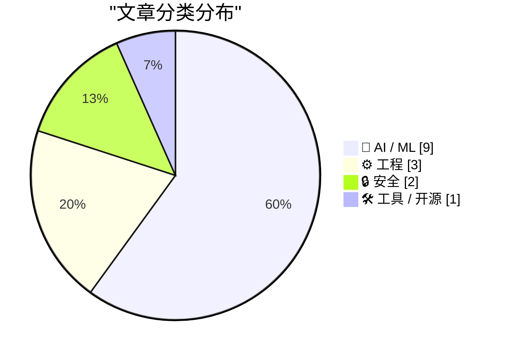
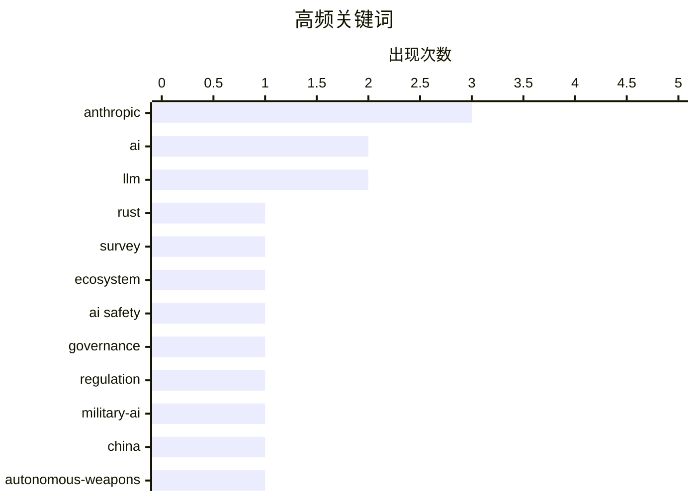

# 📰 AI 资讯每日精选 — 2026-03-03

> 汇聚 140+ 技术博客、X/Twitter、Hacker News、Reddit、Product Hunt、
> Lobste.rs、ClawFeed 日报及 GitHub Trending，经 AI 评分筛选。
>
> **本期内容**：🏆 今日必读 · 🌐 ClawFeed 日报 · 🔥 GitHub Trending · 📂 分类精选 · 🎨 设计与生成式 AI · 📊 数据概览

## 📝 今日看点

今日技术圈聚焦于两大核心议题：人工智能的军事化应用与安全治理成为激烈交锋的战场，相关报道揭示了AI武器化的国际竞赛以及科技公司与政府间在伦理与权力上的紧张关系。同时，AI技术本身正寻求突破，从提升模型推理能力到探索超越神经网络的新范式，研究前沿指向更强大、更可靠的下一代智能系统。此外，安全与隐私领域动作频频，从后量子密码的推进到企业级安全方案的强化，显示出产业应对未来威胁的积极布局。

---

## 🏆 今日必读

🥇 **2025年Rust语言现状调查结果**

[2025 State of Rust Survey Results](https://blog.rust-lang.org/2026/03/02/2025-State-Of-Rust-Survey-results/) — Lobste.rs · 11 小时前 · ⚙️ 工程

> Rust官方发布了2025年度社区调查报告，揭示了开发者生态的最新趋势。报告显示，Rust在系统编程、WebAssembly和命令行工具领域的使用率持续增长，但学习曲线和编译时间仍是主要采用障碍。超过70%的受访者表示对Rust的生产力感到满意，同时社区对异步编程和错误处理的改进需求最高。调查结论指出，Rust社区正在稳步扩大，但需要继续降低入门门槛并完善工具链。

💡 **为什么值得读**: 这份官方报告是了解Rust语言真实采用情况、社区痛点和发展方向最权威的年度指南，对考虑采用或投资Rust生态的开发者与决策者至关重要。

🏷️ Rust, survey, ecosystem

🥈 **Anthropic与对齐问题**

[‘Anthropic and Alignment’](https://stratechery.com/2026/anthropic-and-alignment/) — daringfireball.net · 8 小时前 · 🤖 AI / ML

> 文章探讨了AI公司Anthropic在AI安全（对齐）问题上的立场及其与政府权力的潜在冲突。核心论点是，像核武器一样，拥有强大AI能力的私营公司若试图向国家军队（如美军）发号施令，将面临被国家力量摧毁的风险，因为国际法本质上是权力的产物。作者以Anthropic联合创始人Dario Amodei的核武器类比为基础，分析了私营AI巨头与国家主权之间的根本张力。结论是，在涉及国家安全的根本性能力上，权力（而非法律或道德）最终决定规则。

💡 **为什么值得读**: 文章通过尖锐的权力政治视角，揭示了AI安全讨论中常被忽视的地缘政治现实，对理解AI治理的未来格局具有关键启发。

🏷️ AI safety, governance, Anthropic, regulation

🥉 **数千份采购文件揭示中国军队如何试图将AI武器化**

[Thousands of procurement documents show how China's army wants to weaponize AI](https://the-decoder.com/thousands-of-procurement-documents-show-how-chinas-army-wants-to-weaponize-ai/) — The Decoder · 11 小时前 · 🤖 AI / ML

> 乔治城大学的研究人员通过分析中国人民解放军的数千份采购请求，揭示了中方在军事AI应用上的广泛实验。文件显示，其探索范围涵盖无人机蜂群、深度伪造工具和自主决策系统等多个前沿领域。这些采购行为表明，中国正系统性地将AI技术整合到军事能力的各个层面，以实现作战效能的跨越式提升。报告指出，这些举措正在加速全球AI军备竞赛，并可能改变未来战场的规则。

💡 **为什么值得读**: 该研究基于一手采购数据，提供了关于中国军事AI发展的具体、实证性洞察，是评估全球AI战略平衡变化的重要情报来源。

🏷️ military-AI, China, autonomous-weapons

4️⃣ **Anthropic与五角大楼谈判破裂内幕：大规模监控、自主武器与伺机而动的竞争对手交易**

[Inside the Anthropic-Pentagon breakdown: mass surveillance, autonomous weapons, and a rival deal waiting in the wings](https://the-decoder.com/inside-the-anthropic-pentagon-breakdown-mass-surveillance-autonomous-weapons-and-a-rival-deal-waiting-in-the-wings/) — The Decoder · 12 小时前 · 🤖 AI / ML

> 根据《纽约时报》和《大西洋月刊》的最新报道，Anthropic与美国国防部的合作谈判在最后时刻破裂。谈判的核心分歧在于五角大楼要求进行针对美国公民的大规模数据收集，以及Anthropic拒绝了一个云服务替代方案。与此同时，OpenAI与国防部的平行交易已在推进中，这进一步加剧了Anthropic的压力。此次破裂事件凸显了AI公司与美国政府合作时，在伦理、隐私和商业竞争上面临的复杂挑战。

💡 **为什么值得读**: 报道揭露了顶级AI公司与美国政府之间机密谈判的关键细节，为了解AI军事化背后的商业博弈与伦理冲突提供了独家内幕。

🏷️ Anthropic, Pentagon, ethics, AI

5️⃣ **摩托罗拉宣布与GrapheneOS建立合作伙伴关系**

[Motorola announces a partnership with GrapheneOS](https://motorolanews.com/motorola-three-new-b2b-solutions-at-mwc-2026/) — Hacker News Best · 20 小时前 · 🔒 安全

> 摩托罗拉在MWC 2026上宣布了三项新的B2B解决方案，其中最引人注目的是与注重隐私和安全性的移动操作系统GrapheneOS建立合作伙伴关系。此举旨在为企业客户提供更安全、隐私保护更强的安卓设备选项。GrapheneOS以其强大的安全强化、隐私沙盒和去谷歌化能力而闻名。这一合作标志着主流手机制造商首次正式拥抱以安全为核心的第三方安卓分支，可能改变企业移动设备的安全格局。

💡 **为什么值得读**: 这是主流手机厂商首次与顶级安全定制ROM深度合作，对关注移动设备安全和隐私的企业IT决策者及安全专家具有里程碑意义。

🏷️ Motorola, GrapheneOS, mobile security, privacy

---

## 🌐 ClawFeed 日报精选

> 来源：[ClawFeed](https://clawfeed.kevinhe.io) — AI 驱动的多源新闻聚合

### 🔥 今日头条

### 1. Trump 下令停用 Anthropic，五角大楼转向 OpenAI
Trump 签署行政令，命令全联邦机构停止使用 Claude，并以"supply chain risk"为由将 Anthropic 列入黑名单（这一级别通常保留给外国对手）。起因：Anthropic 拒绝允许 Claude 用于大规模监控和全自主武器系统，谈判破裂。Anthropic 表示将上诉法庭。OpenAI 趁机迅速与五角大楼签约（含"技术保障措施"）。事后 DoD 宣布同时与 OpenAI / Anthropic / Google / xAI 签约"all lawful purposes"军事合同，Claude 成唯一用于机密任务的 AI（借道 Palantir）。
*来源：Reuters / AP / BBC / NYT / TechCrunch*

### 2. Anthropic 放弃核心安全承诺
TechCrunch 报道，Anthropic 本周撤回了"不确定安全前不发布强大 AI 系统"的核心承诺。与五角大楼风波叠加，引发 AI 安全社区广泛讨论。Google AI 员工联名呼吁限制军事用途。

### 3. OpenClaw 超越 React 成 GitHub 历史最受欢迎项目
OpenClaw 突破 245,000 Stars，成为 GitHub 史上 Stars 最多的项目。官方评论：「Reports of our death were greatly exaggerated.」全天 Twitter 热议。

### 4. Cursor CEO 的第三时代宣言爆款
@mntruell 发文《The Third Era of AI Software Development》，全天浏览量突破 1.6M+，多个顶级账号强推。Cursor 内部宣布 35% PR 已由自主 AI Agent 完成。被认为是近年 AI coding 领域最重要的一篇文章。

### 5. Claude 上线 Memory Import
Claude 推出 Memory Import 功能，可一键把 ChatGPT、Gemini 等 AI 助手积累的用户记忆迁移至 Claude，正面对攻 ChatGPT 的记忆护城河。（171K 播放）

---

### 📰 精选 Top 10

1. **@trq212（Anthropic工程师）**《Lessons from Building Claude Code: Seeing like an Agent》
Claude Code 一年工具设计演变复盘：TodoWrite 被淘汰→Task Tool 兴起，从"盯着干"→"跨 agent 协调"，action space 设计精髓。**3.4M 浏览，9.3K 赞，近期最硬核 agent engineering 干货。**
https://x.com/trq212/status/2027463795355095314

2. **@VadimStrizheus** 爆款推文：「2026 年的公司不是人，不是办公室，是一个文件夹。.claude/agents/ 里有 engineering、marketing、design、ops，每个角色都是 .md 文件。」**541K 浏览。**
https://x.com/VadimStrizheus/status/2027953432326197508

3. **@wangray** OpenAI 内部案例：3 个工程师、5 个月、几乎不手写代码，完成约 100 万行代码的内部产品，人均每天 3.5 个 PR。标题：「工程师，开始给 Agent 打工了」
https://x.com/wangray/status/2028132386756780220

4. **@rwayne** AI 时代裁员实录：部署 OpenClaw 一个月后做了创业以来最大裁员，会用 AI 的留下加薪，不会用 AI 的是"负资产"（60K 浏览，争议巨大）
https://x.com/rwayne/status/2028310113149465001

5. **@runes_leo** 律师将 10 年执业经验编码成 6 个 Claude Skill，2 人律所干出大所的活。试过 Harvey、Spellbook 后回归通用 Claude：「垂直产品卖模板，模板没护城河」（27K 浏览）
https://x.com/runes_leo/status/2028034913442906581

6. **@imaxichuhai** 闲鱼电影票代买 AI 全自动化：用户发截图→AI 识别场次座位→自动改价出票，**12万+营收**，真实 OpenClaw 落地案例（266K 浏览）
https://x.com/imaxichuhai/status/2028114412134150156

7. **@vikingmute** 力推 Context Mode（MCP 服务器）：Claude Code 工具输出从 315KB 压缩至 5.4KB，节省 **98% 上下文 token**，HN 热门
https://x.com/vikingmute/status/2028075718299763009

8. **@kloss_xyz** Anthropic 上线免费官方 AI Academy：**13 门课程 + 官方证书**，涵盖 MCP / API / Claude Code / AI fluency，「以前报班花 $2K 学的东西，现在免费」
https://x.com/kloss_xyz/status/2028237936848994369

9. **@GoJun315** WiFi-DensePose 登 GitHub Trending 榜首：用 WiFi 信号追踪室内人体动作，无需摄像头/传感器/特殊硬件。**437K 浏览。**（隐私话题值得持续关注）
https://x.com/GoJun315/status/2027363875692384741

10. **@KevinZbtc** 总结使用 Claude 最值得维护的文档体系：Claude.md / glossary.md / toolbox.md / Skills.md / memory.md（216 赞，14K 浏览）
https://x.com/KevinZbtc/status/2028315352392966590

---

### 📊 今日观察

今天是信息密度极高的一天，两条主线交织：

**政治 × AI：** Anthropic 与 Trump 政府的正面冲突，展示了 AI 安全价值观与政府采购之间的真实张力。Anthropic 拒绝自主武器→失去五角大楼合同→OpenAI 补位，同时 Anthropic 又借道 Palantir 重新进入机密场景，局面复杂。「AI 安全」的旗帜正在快速商业化与政治化。

**Agent 时代正在加速落地：** 今天的 feed 里，不是 demo，是真实营收（闲鱼 12 万）、真实裁员（rwayne）、真实代码产出（OpenAI 100 万行 / Cursor 35% PR by Agent）。「Agent 打工」的叙事从比喻变成了数据。

**工具链快速成熟：** Context Mode 节省 98% token、Electron App 被 AI 接管、免费 Academy 降低进入门槛。下一个窗口期：为 Agent 构建基础设施（钱包、权限、编排）的人。

---

*生成时间：2026-03-02 22:00 SGT*
*数据来源：6 份 4h 简报（共覆盖全天 Feed）*

---

## 🔥 GitHub Trending

> 今日热门开源项目（全语言 + Python）

| # | 项目 | 描述 | ⭐ 总星 | 📈 今日 | 语言 |
|---|------|------|---------|---------|------|
| 1 | [ruvnet/RuView](https://github.com/ruvnet/RuView) | π RuView: WiFi DensePose turns commodity WiFi signals int... | 22.4k | +5096 | Rust |
| 2 | [moeru-ai/airi](https://github.com/moeru-ai/airi) 🤖 | 💖🧸 Self hosted, you-owned Grok Companion, a container o... | 21.5k | +1412 | TypeScript |
| 3 | [alibaba/OpenSandbox](https://github.com/alibaba/OpenSandbox) 🤖 | OpenSandbox is a general-purpose sandbox platform for AI ... | 4.4k | +1026 | Python |
| 4 | [public-apis/public-apis](https://github.com/public-apis/public-apis) | A collective list of free APIs | 403.0k | +992 | Python |
| 5 | [ruvnet/ruflo](https://github.com/ruvnet/ruflo) 🤖 | 🌊 The leading agent orchestration platform for Claude. D... | 18.1k | +830 | TypeScript |
| 6 | [K-Dense-AI/claude-scientific-skills](https://github.com/K-Dense-AI/claude-scientific-skills) 🤖 | A set of ready to use Agent Skills for research, science,... | 11.2k | +820 | Python |
| 7 | [microsoft/markitdown](https://github.com/microsoft/markitdown) | Python tool for converting files and office documents to ... | 89.7k | +648 | Python |
| 8 | [superset-sh/superset](https://github.com/superset-sh/superset) 🤖 | IDE for the AI Agents Era - Run an army of Claude Code, C... | 3.6k | +585 | TypeScript |
| 9 | [anthropics/prompt-eng-interactive-tutorial](https://github.com/anthropics/prompt-eng-interactive-tutorial) 🤖 | Anthropic's Interactive Prompt Engineering Tutorial | 31.7k | +526 | Jupyter Notebook |
| 10 | [X-PLUG/MobileAgent](https://github.com/X-PLUG/MobileAgent) 🤖 | Mobile-Agent: The Powerful GUI Agent Family | 7.9k | +261 | Python |
| 11 | [jamwithai/production-agentic-rag-course](https://github.com/jamwithai/production-agentic-rag-course) 🤖 |  | 3.4k | +184 | Python |
| 12 | [scrapy/scrapy](https://github.com/scrapy/scrapy) | Scrapy, a fast high-level web crawling & scraping framewo... | 60.5k | +150 | Python |
| 13 | [davila7/claude-code-templates](https://github.com/davila7/claude-code-templates) 🤖 | CLI tool for configuring and monitoring Claude Code | 21.8k | +123 | Python |
| 14 | [NanmiCoder/MediaCrawler](https://github.com/NanmiCoder/MediaCrawler) | 小红书笔记 | 评论爬虫、抖音视频 | 评论爬虫、快手视频 | 评论爬虫、B 站视频 ｜ 评论爬虫、微博帖子 ｜ ... | 44.7k | +108 | Python |
| 15 | [EbookFoundation/free-programming-books](https://github.com/EbookFoundation/free-programming-books) | 📚 Freely available programming books | 383.5k | +94 | Python |

---

## 🤖 AI / ML

### 1. Anthropic与对齐问题

[‘Anthropic and Alignment’](https://stratechery.com/2026/anthropic-and-alignment/) — **daringfireball.net** · 8 小时前 · ⭐ 26/30

> 文章探讨了AI公司Anthropic在AI安全（对齐）问题上的立场及其与政府权力的潜在冲突。核心论点是，像核武器一样，拥有强大AI能力的私营公司若试图向国家军队（如美军）发号施令，将面临被国家力量摧毁的风险，因为国际法本质上是权力的产物。作者以Anthropic联合创始人Dario Amodei的核武器类比为基础，分析了私营AI巨头与国家主权之间的根本张力。结论是，在涉及国家安全的根本性能力上，权力（而非法律或道德）最终决定规则。

🏷️ AI safety, governance, Anthropic, regulation

---

### 2. 数千份采购文件揭示中国军队如何试图将AI武器化

[Thousands of procurement documents show how China's army wants to weaponize AI](https://the-decoder.com/thousands-of-procurement-documents-show-how-chinas-army-wants-to-weaponize-ai/) — **The Decoder** · 11 小时前 · ⭐ 26/30

> 乔治城大学的研究人员通过分析中国人民解放军的数千份采购请求，揭示了中方在军事AI应用上的广泛实验。文件显示，其探索范围涵盖无人机蜂群、深度伪造工具和自主决策系统等多个前沿领域。这些采购行为表明，中国正系统性地将AI技术整合到军事能力的各个层面，以实现作战效能的跨越式提升。报告指出，这些举措正在加速全球AI军备竞赛，并可能改变未来战场的规则。

🏷️ military-AI, China, autonomous-weapons

---

### 3. Anthropic与五角大楼谈判破裂内幕：大规模监控、自主武器与伺机而动的竞争对手交易

[Inside the Anthropic-Pentagon breakdown: mass surveillance, autonomous weapons, and a rival deal waiting in the wings](https://the-decoder.com/inside-the-anthropic-pentagon-breakdown-mass-surveillance-autonomous-weapons-and-a-rival-deal-waiting-in-the-wings/) — **The Decoder** · 12 小时前 · ⭐ 26/30

> 根据《纽约时报》和《大西洋月刊》的最新报道，Anthropic与美国国防部的合作谈判在最后时刻破裂。谈判的核心分歧在于五角大楼要求进行针对美国公民的大规模数据收集，以及Anthropic拒绝了一个云服务替代方案。与此同时，OpenAI与国防部的平行交易已在推进中，这进一步加剧了Anthropic的压力。此次破裂事件凸显了AI公司与美国政府合作时，在伦理、隐私和商业竞争上面临的复杂挑战。

🏷️ Anthropic, Pentagon, ethics, AI

---

### 4. ChatGPT在粒子物理学中吐出惊人见解 | 《科学》杂志

[ChatGPT spits out surprising insight in particle physics | Science](https://www.reddit.com/r/singularity/comments/1risuki/chatgpt_spits_out_surprising_insight_in_particle/) — **r/singularity** · 13 小时前 · ⭐ 26/30

> 《科学》杂志报道，研究人员发现ChatGPT能够对粒子物理学问题产生令人惊讶的深刻见解。在特定提示下，AI模型不仅复现了已知知识，还展现出类似直觉的跨概念关联能力，提出了人类物理学家可能忽略的思路。这一现象引发了关于AI是否能在基础科学研究中扮演“协作者”甚至“灵感来源”角色的讨论。案例表明，大语言模型可能具备辅助科学发现、启发新假设的潜力。

🏷️ LLM, physics, research

---

### 5. AI奥德赛，第一部分：正确性难题

[An AI Odyssey, Part 1: Correctness Conundrum](https://www.johndcook.com/blog/2026/03/02/an-ai-odyssey-part-1-correctness-conundrum/) — **johndcook.com** · 26 分钟前 · ⭐ 25/30

> 文章探讨了智能体（Agentic）AI系统在提升专业领域（如财务管理）生产率时面临的核心挑战：无法保证正确性。作者指出，尽管这些工具能极大提高效率，但它们本质上是概率性系统，其输出可能包含难以察觉的错误或幻觉。在管理关键资产时，盲目依赖AI决策可能导致严重后果。核心观点是，必须建立严格的人类监督和验证机制，不能将关键判断完全委托给AI。

🏷️ AI Agents, Correctness, Finance, Productivity

---

### 6. [研究] 神经元是建模决策系统的错误原语吗？

[[R] Are neurons the wrong primitive for modeling decision systems?](https://www.reddit.com/r/MachineLearning/comments/1rjcqzq/r_are_neurons_the_wrong_primitive_for_modeling/) — **r/MachineLearning** · 56 分钟前 · ⭐ 25/30

> 一篇ICLR论文提出“行为学习”，主张用可学习的约束优化块替代神经网络中的神经元层。该框架将决策建模为“效用 + 约束 → 最优决策”的优化过程。论文认为，既然许多现实世界系统本质上是优化驱动的，那么“优化模块”应取代神经元成为机器学习的基本构建块。这种方法可能在涉及复杂规则、约束和目标的决策任务上，比传统神经网络更具可解释性和效率。

🏷️ neural networks, optimization, ICLR

---

### 7. 原生并行推理器帮助AI更好地推理

[Native Parallel Reasoner helps AI reason better](https://www.reddit.com/r/singularity/comments/1riuz7v/native_parallel_reasoner_helps_ai_reason_better/) — **r/singularity** · 12 小时前 · ⭐ 25/30

> 研究人员提出了一种名为“原生并行推理器”的教师免费框架，旨在让大语言模型自我进化出真正的并行推理能力。该框架通过三个关键创新，将模型从顺序模拟转变为原生并行认知：自我蒸馏的渐进式训练范式、从“冷启动”格式发现到“热推理”执行的过渡，以及并行思维链的显式建模。初步实验表明，NPR能在多项复杂推理任务上显著提升模型的效率和准确性。

🏷️ LLM, reasoning, parallel, framework

---

### 8. npx workos：一个能将认证代码直接写入代码库的AI助手

[[Sponsor] npx workos: An AI Agent That Writes Auth Directly Into Your Codebase](https://workos.com/docs/authkit/cli-installer?utm_source=tldrdev&amp;utm_medium=newsletter&amp;utm_campaign=q12026) — **daringfireball.net** · 2 小时前 · ⭐ 24/30

> WorkOS发布了一个由Claude驱动的AI代理工具，旨在自动化集成身份认证功能。该工具会读取用户项目代码，自动检测技术栈框架，并生成量身定制的、可直接插入现有代码库的完整认证集成方案，而非简单的模板生成。AI代理在写入代码后，会进行类型检查和构建，并将任何错误反馈给自身进行修复。这代表了一种更智能、更贴合具体项目上下文的开发自动化新范式。

🏷️ AI agent, authentication, code generation, Claude

---

### 9. WSJ：特朗普政府冷落Anthropic，在安全护栏问题上拥抱OpenAI

[WSJ: ‘Trump Administration Shuns Anthropic, Embraces OpenAI in Clash Over Guardrails’](https://www.wsj.com/tech/ai/trump-will-end-government-use-of-anthropics-ai-models-ff3550d9) — **daringfireball.net** · 9 小时前 · ⭐ 24/30

> 报道揭示了特朗普政府因AI模型使用政策分歧，在Anthropic和OpenAI之间做出了选择。美国国防部要求Anthropic同意其模型可用于所有合法用途，包括该公司划定的红线——国内大规模监控和自主武器系统，但遭到了Anthropic CEO的基于良知的拒绝。此举直接导致政府宣布将停止使用Anthropic的AI模型。这凸显了AI公司与政府在模型应用伦理和安全边界上的核心冲突。

🏷️ AI Governance, Anthropic, OpenAI, Policy

---

## ⚙️ 工程

### 10. 2025年Rust语言现状调查结果

[2025 State of Rust Survey Results](https://blog.rust-lang.org/2026/03/02/2025-State-Of-Rust-Survey-results/) — **Lobste.rs** · 11 小时前 · ⭐ 27/30

> Rust官方发布了2025年度社区调查报告，揭示了开发者生态的最新趋势。报告显示，Rust在系统编程、WebAssembly和命令行工具领域的使用率持续增长，但学习曲线和编译时间仍是主要采用障碍。超过70%的受访者表示对Rust的生产力感到满意，同时社区对异步编程和错误处理的改进需求最高。调查结论指出，Rust社区正在稳步扩大，但需要继续降低入门门槛并完善工具链。

🏷️ Rust, survey, ecosystem

---

### 11. JSON文档性能、存储与搜索：MongoDB与PostgreSQL对比

[JSON Documents Performance, Storage and Search: MongoDB vs PostgreSQL](https://binaryigor.com/json-documents-mongodb-vs-postgresql.html) — **Lobste.rs** · 14 小时前 · ⭐ 25/30

> 文章对MongoDB和PostgreSQL在处理JSON文档时的性能、存储效率和搜索能力进行了基准测试。测试涵盖了数据插入速度、存储空间占用以及复杂查询（如嵌套字段过滤和全文搜索）的响应时间。结果显示，PostgreSQL在某些JSON查询场景下表现优于MongoDB，尤其是在涉及复杂条件过滤时。结论指出，选择数据库不应仅基于“文档数据库”的标签，PostgreSQL的JSON功能已足够成熟，是许多场景下的有力竞争者。

🏷️ database, benchmark, JSON, PostgreSQL

---

### 12. ASML计划超越芯片光刻，进军先进封装领域

[ASML plans to expand beyond chip lithography into advanced packaging](https://the-decoder.com/asml-plans-to-expand-beyond-chip-lithography-into-advanced-packaging/) — **The Decoder** · 10 小时前 · ⭐ 24/30

> 全球唯一的极紫外光刻机巨头ASML正计划将其业务范围从核心的光刻领域扩展到先进的芯片封装技术。ASML目前垄断着用于制造先进芯片的EUV光刻机市场。此次业务扩张意味着该公司意图在芯片制造的后道关键工序中扮演更重要的角色。这表明芯片行业的技术竞争焦点正从单纯的晶体管微缩向包括封装在内的系统级创新延伸。

🏷️ ASML, semiconductor, packaging

---

## 🔒 安全

### 13. 摩托罗拉宣布与GrapheneOS建立合作伙伴关系

[Motorola announces a partnership with GrapheneOS](https://motorolanews.com/motorola-three-new-b2b-solutions-at-mwc-2026/) — **Hacker News Best** · 20 小时前 · ⭐ 26/30

> 摩托罗拉在MWC 2026上宣布了三项新的B2B解决方案，其中最引人注目的是与注重隐私和安全性的移动操作系统GrapheneOS建立合作伙伴关系。此举旨在为企业客户提供更安全、隐私保护更强的安卓设备选项。GrapheneOS以其强大的安全强化、隐私沙盒和去谷歌化能力而闻名。这一合作标志着主流手机制造商首次正式拥抱以安全为核心的第三方安卓分支，可能改变企业移动设备的安全格局。

🏷️ Motorola, GrapheneOS, mobile security, privacy

---

### 14. OpenSSH增加未使用后量子密钥交换算法时的警告

[OpenSSH Adds Warning When Not Using Post-Quantum Key Exchange Algorithm](https://www.reddit.com/r/singularity/comments/1ritv6v/openssh_adds_warning_when_not_using_postquantum/) — **r/singularity** · 12 小时前 · ⭐ 25/30

> OpenSSH项目在其最新版本中引入了一项新功能：当连接未使用后量子密码（PQC）密钥交换算法时，会向用户发出警告。此举是为了推动生态系统向后量子密码学迁移，以应对未来量子计算机对现有非对称加密算法（如RSA、ECC）的威胁。OpenSSH已支持如Kyber等NIST标准化的后量子算法。这一警告是向系统管理员和开发者发出的明确信号，要求他们尽快升级配置以确保长期安全。

🏷️ OpenSSH, post-quantum, cryptography, security

---

## 🛠 工具 / 开源

### 15. 苹果发布搭载M4芯片的新款iPad Air

[Apple Introduces New iPad Air With M4](https://www.apple.com/newsroom/2026/03/apple-introduces-the-new-ipad-air-powered-by-m4/) — **daringfireball.net** · 9 小时前 · ⭐ 24/30

> 苹果推出了搭载M4芯片的新一代iPad Air，起售价保持不变。新款iPad Air的CPU和GPU性能更强，提升了视频编辑和游戏体验，其更快的神经网络引擎、更高的内存带宽以及比前代多50%的统一内存，也使其成为更强大的AI设备。性能方面，搭载M4的iPad Air比M3版本快达30%，比M1版本快达2.3倍。这次升级标志着iPad Air产品线获得了前所未有的性能飞跃。

🏷️ iPad, M4, Apple Silicon, AI

---

## 🎨 Design & Generative AI

### 🖥️ 生成式 UI

- **[ComfySketch新版即将发布：草图生成UI工具升级](https://www.reddit.com/r/comfyui/comments/1riurhv/a_new_version_of_comfysketch_coming_soon/)** — r/comfyui · 12 小时前
  > 预告ComfySketch工具的新版本即将推出，该工具可将草图转换为UI界面。

### 🖼️ 生成式图片

- **[V7身份一致性测试：跨光照与环境变化的稳定性评估](https://www.reddit.com/r/midjourney/comments/1rj6z29/how_stable_is_identity_in_v7_testing_oref_across/)** — r/midjourney · 4 小时前
  > 测试Midjourney V7模型在不同光照和环境下生成图像的身份一致性。

- **[ComfyUI资源管理终极指南](https://www.reddit.com/r/comfyui/comments/1rj1bhm/a_comprehensive_guide_to_comfy_asset_mangement/)** — r/comfyui · 8 小时前
  > 分享团队整理的ComfyUI资源管理综合指南与资源页面。

- **[RTX 50系列一键安装ComfyUI：免WSL/Docker的Windows方案](https://www.reddit.com/r/StableDiffusion/comments/1rjc58k/opensourced_a_oneclick_comfyui_setup_for_rtx/)** — r/StableDiffusion · 1 小时前
  > 为RTX 50系列显卡提供无需WSL2或Docker的Windows版ComfyUI一键安装方案。

- **[七层方法论：用结构化提示提升AI绘画效果](https://www.reddit.com/r/midjourney/comments/1rj3z8z/how_i_use_a_7layer_methodology_to_write_better_ai/)** — r/midjourney · 6 小时前
  > 介绍一种包含七个层次的系统化方法，用于编写更有效的Midjourney提示词。

- **[LTX2、AceStep 1.5与Z-Image模型实测：令人惊艳的表现](https://www.reddit.com/r/comfyui/comments/1rivog0/ltx2_acestep_15_and_zimage_are_very_surprisingly/)** — r/comfyui · 11 小时前
  > 分享对LTX2、AceStep 1.5和Z-Image等ComfyUI新模型的测试与积极评价。

- **[stable-diffusion-webui-codex v0.2.0-alpha版本发布](https://www.reddit.com/r/StableDiffusion/comments/1rj6m4h/stablediffusionwebuicodex_v020alpha/)** — r/StableDiffusion · 5 小时前
  > 正式公开分享stable-diffusion-webui-codex工具的早期alpha版本。

- **[Flux.2 Klein全景图LoRA与ComfyUI交互式贴纸编辑器](https://www.reddit.com/r/StableDiffusion/comments/1rip68d/flux2_klein_lora_for_360_panoramas_comfyui/)** — r/StableDiffusion · 16 小时前
  > 发布用于生成360°全景图的Flux.2 Klein LoRA及配套的ComfyUI交互式贴纸编辑器。

- **[Z-Image-Fun-Lora-Distill 2603多步数版本发布](https://www.reddit.com/r/StableDiffusion/comments/1rj44cb/zimagefunloradistill_2603_2_4_and_8_steps_have/)** — r/StableDiffusion · 6 小时前
  > 宣布Z-Image-Fun-Lora-Distill 2603模型的2、4、8步数版本已上线。

- **[使用Klein 4b实现自定义尺寸的图像外绘](https://www.reddit.com/r/comfyui/comments/1rinxcs/outpainting_to_a_size_that_you_choose_using_klein/)** — r/comfyui · 18 小时前
  > 介绍如何利用Klein 4b模型，通过指定宽高参数进行图像外绘至任意尺寸。

- **[FameGrid Revolution：ZIB + ZIT混合工作流革新](https://www.reddit.com/r/StableDiffusion/comments/1rio61i/famegrid_revolution_zib_zit_lora_hybrid_workflow/)** — r/StableDiffusion · 17 小时前
  > 展示结合ZIB与ZIT的LoRA及混合工作流，带来图像生成的新突破。

- **[Kinghit：专为Flux.2 Klein设计的拳击姿势LoRA](https://www.reddit.com/r/comfyui/comments/1rjbcnf/kinghit_punch_pose_lora_for_flux2_klein/)** — r/comfyui · 1 小时前
  > 发布首个个人LoRA模型“Kinghit”，用于为Flux.2 Klein生成特定的拳击姿势图像。

- **[低配置福音：2步LoRA在2GB显存机器上生成1024x1024图像](https://www.reddit.com/r/comfyui/comments/1rj6qgm/z_image_1024x1024_with_fun_2_step_lora_on_2gb/)** — r/comfyui · 5 小时前
  > 展示在仅2GB显存的机器上，使用2步LoRA高效生成1024x1024分辨率图像的工作流。

- **[Midjourney伴侣工具：高效管理海量生成图像](https://www.reddit.com/r/midjourney/comments/1rj1tps/our_companion_tool_for_midjourney/)** — r/midjourney · 8 小时前
  > 介绍一款旨在帮助用户整理和管理散落在各处的数千张Midjourney生成图像的辅助工具。

### 🎬 生成式视频

- **[ComfyUI LTX 2.0图生视频与Kling 3.0效果对比](https://www.reddit.com/r/comfyui/comments/1rimxzx/i_was_tinkering_around_with_image_to_video_in/)** — r/comfyui · 19 小时前
  > 对比使用ComfyUI的LTX 2.0进行图生视频与Kling 3.0生成视频的效果差异。

---

## 📊 数据概览

| 扫描源 | 抓取文章 | 时间范围 | 精选 |
|:---:|:---:|:---:|:---:|
| 117/140 | 4078 篇 → 290 篇 | 24h | **15 篇** |

### 分类分布



### 高频关键词



<details>
<summary>📈 纯文本关键词图（终端友好）</summary>

```
anthropic   │ ████████████████████ 3
ai          │ █████████████░░░░░░░ 2
llm         │ █████████████░░░░░░░ 2
rust        │ ███████░░░░░░░░░░░░░ 1
survey      │ ███████░░░░░░░░░░░░░ 1
ecosystem   │ ███████░░░░░░░░░░░░░ 1
ai safety   │ ███████░░░░░░░░░░░░░ 1
governance  │ ███████░░░░░░░░░░░░░ 1
regulation  │ ███████░░░░░░░░░░░░░ 1
military-ai │ ███████░░░░░░░░░░░░░ 1
```

</details>

### 🏷️ 话题标签

**anthropic**(3) · **ai**(2) · **llm**(2) · rust(1) · survey(1) · ecosystem(1) · ai safety(1) · governance(1) · regulation(1) · military-ai(1) · china(1) · autonomous-weapons(1) · pentagon(1) · ethics(1) · motorola(1) · grapheneos(1) · mobile security(1) · privacy(1) · physics(1) · research(1)

---

*生成于 2026-03-03 03:06 | 汇聚 140 个技术博客、X/Twitter、Hacker News、Reddit、Product Hunt、Lobste.rs、ClawFeed 日报及 GitHub Trending，经 AI 评分筛选出 Top 15 精华内容*
