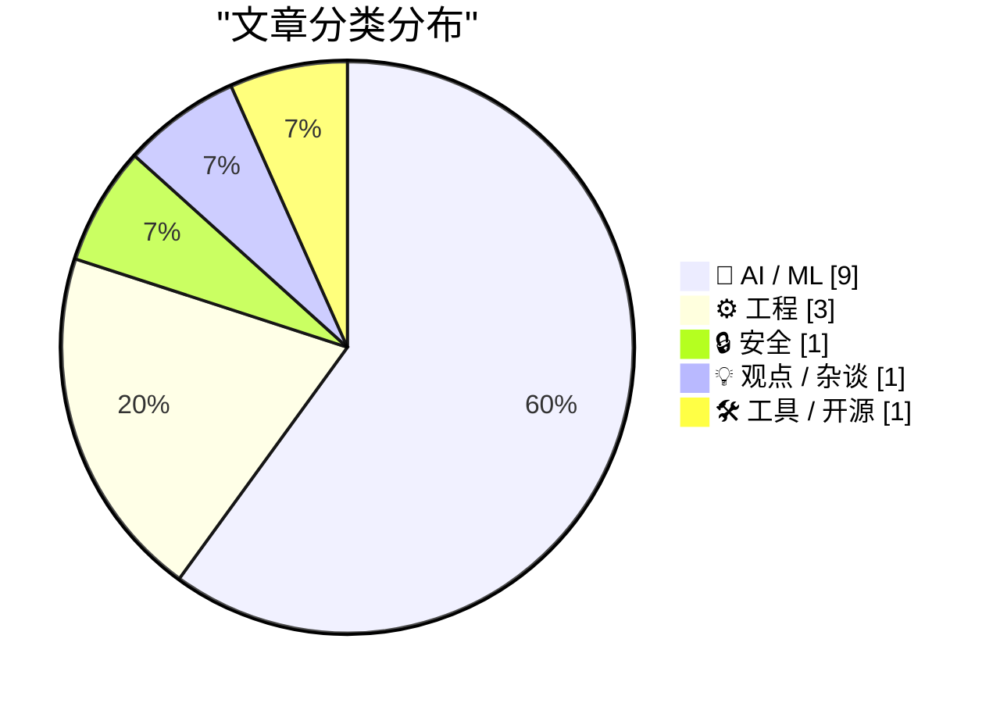
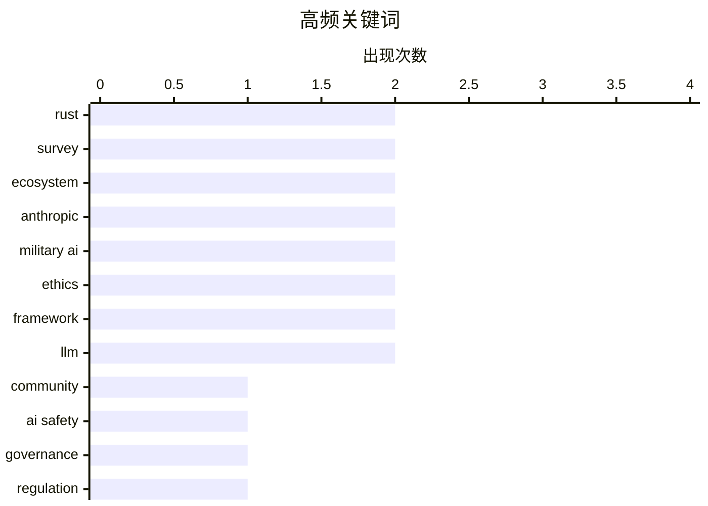

# 📰 AI 资讯每日精选 — 2026-03-03

> 汇聚 140+ 技术博客、X/Twitter、Hacker News、Reddit、Product Hunt、
> Lobste.rs、ClawFeed 日报及 GitHub Trending，经 AI 评分筛选。
>
> **本期内容**：🏆 今日必读 · 🌐 ClawFeed 日报 · 🔥 GitHub Trending · 📂 分类精选 · 🎨 设计与生成式 AI · 📊 数据概览

## 📝 今日看点

今日技术圈聚焦于两大核心议题。人工智能领域正面临严峻的安全与伦理挑战，巨头公司与军方在数据监控和自主武器化上的博弈成为焦点，同时AI生成内容的泛滥也引发对信息质量的担忧。另一方面，以Rust为代表的系统编程语言持续渗透关键基础设施，但其采用仍受制于开发体验的瓶颈。此外，从移动安全合作到数据库技术选型，业界对性能与隐私的务实追求也构成了明确趋势。

---

## 🏆 今日必读

🥇 **2025年Rust语言现状调查结果**

[2025 State of Rust Survey Results](https://www.reddit.com/r/programming/comments/1rj0hc0/2025_state_of_rust_survey_results/) — r/programming · 8 小时前 · ⚙️ 工程

> Rust官方发布了2025年度开发者调查报告，揭示了社区的最新趋势。报告显示，Rust在系统编程、WebAssembly和命令行工具等领域的使用持续增长，但学习曲线和编译时间仍是主要采用障碍。约70%的受访者表示在工作中使用Rust，其安全性（内存安全）和性能是最受推崇的特性。调查结论指出，Rust生态系统正在成熟，但需要继续改进工具链和库以降低入门门槛。

💡 **为什么值得读**: 这份官方报告是了解Rust语言实际采用情况、社区痛点及未来发展方向最权威的一手资料，对考虑采用或投资Rust的开发者与决策者至关重要。

🏷️ Rust, survey, community, ecosystem

🥈 **2025 State of Rust Survey Results**

[2025 State of Rust Survey Results](https://blog.rust-lang.org/2026/03/02/2025-State-Of-Rust-Survey-results/) — Lobste.rs · 11 小时前 · ⚙️ 工程

> <p><a href="https://lobste.rs/s/eyfjod/2025_state_rust_survey_results">Comments</a></p>

🏷️ Rust, survey, ecosystem

🥉 **Anthropic与对齐问题**

[‘Anthropic and Alignment’](https://stratechery.com/2026/anthropic-and-alignment/) — daringfireball.net · 8 小时前 · 🤖 AI / ML

> 文章探讨了AI公司Anthropic在AI安全（对齐）问题上的立场及其与政府（如美国军方）的潜在冲突。核心论点是，像核武器一样，拥有强大AI能力的私营公司若试图向国家权力机构设定条款，将面临被国家力量摧毁的风险，因为国际法本质上是权力的产物。作者以Anthropic联合创始人Dario Amodei的假设为例，说明在关键能力上，国家主权不容挑战。结论是，AI对齐不仅是技术问题，更是深刻的地缘政治和权力问题。

💡 **为什么值得读**: 本文从地缘政治和权力博弈的独特视角，犀利地剖析了AI安全争论中常被忽视的核心矛盾，超越了单纯的技术讨论。

🏷️ AI safety, governance, Anthropic, regulation

4️⃣ **数千份采购文件揭示中国军队如何试图将AI武器化**

[Thousands of procurement documents show how China's army wants to weaponize AI](https://the-decoder.com/thousands-of-procurement-documents-show-how-chinas-army-wants-to-weaponize-ai/) — The Decoder · 11 小时前 · 🤖 AI / ML

> 乔治城大学的研究人员分析了中国人民解放军的数千份采购请求，揭示了北京在军事AI应用上的广泛实验。这些文件显示，中国军方正在探索从无人机蜂群、深度伪造工具到自主决策系统在内的多种AI武器化途径。研究指出，采购活动涉及AI驱动的目标识别、情报分析以及模拟仿真等多个关键领域。这表明中国正在系统性地推进AI与军事能力的深度融合，以寻求战略优势。

💡 **为什么值得读**: 该报告基于大量一手采购数据，提供了关于中国军事AI发展的具体、实证性洞察，是评估全球AI军备竞赛态势的重要参考。

🏷️ military AI, autonomous weapons, drone swarms, China

5️⃣ **Anthropic与五角大楼谈判破裂内幕：大规模监控、自主武器与伺机而动的竞争对手交易**

[Inside the Anthropic-Pentagon breakdown: mass surveillance, autonomous weapons, and a rival deal waiting in the wings](https://the-decoder.com/inside-the-anthropic-pentagon-breakdown-mass-surveillance-autonomous-weapons-and-a-rival-deal-waiting-in-the-wings/) — The Decoder · 11 小时前 · 🤖 AI / ML

> 根据《纽约时报》和《大西洋月刊》的报道，揭示了Anthropic与美国国防部谈判最终破裂的详细情况。谈判的核心争议点包括对美国公民的大规模数据收集、一项被拒绝的云服务替代方案，以及五角大楼同时已在推进的与OpenAI的并行交易。Anthropic因伦理顾虑拒绝了涉及大规模监控和自主武器项目的合作。这一破裂事件凸显了顶尖AI公司在承担政府合同时所面临的巨大伦理与商业压力。

💡 **为什么值得读**: 本文提供了顶级AI公司与美国政府之间敏感谈判的独家内幕，清晰展现了AI伦理、商业竞争和国家安全需求之间的复杂冲突。

🏷️ Anthropic, Pentagon, AI ethics, surveillance

---

## 🌐 ClawFeed 日报精选

> 来源：[ClawFeed](https://clawfeed.kevinhe.io) — AI 驱动的多源新闻聚合

### 🔥 今日头条

### 1. Trump 下令停用 Anthropic，五角大楼转向 OpenAI
Trump 签署行政令，命令全联邦机构停止使用 Claude，并以"supply chain risk"为由将 Anthropic 列入黑名单（这一级别通常保留给外国对手）。起因：Anthropic 拒绝允许 Claude 用于大规模监控和全自主武器系统，谈判破裂。Anthropic 表示将上诉法庭。OpenAI 趁机迅速与五角大楼签约（含"技术保障措施"）。事后 DoD 宣布同时与 OpenAI / Anthropic / Google / xAI 签约"all lawful purposes"军事合同，Claude 成唯一用于机密任务的 AI（借道 Palantir）。
*来源：Reuters / AP / BBC / NYT / TechCrunch*

### 2. Anthropic 放弃核心安全承诺
TechCrunch 报道，Anthropic 本周撤回了"不确定安全前不发布强大 AI 系统"的核心承诺。与五角大楼风波叠加，引发 AI 安全社区广泛讨论。Google AI 员工联名呼吁限制军事用途。

### 3. OpenClaw 超越 React 成 GitHub 历史最受欢迎项目
OpenClaw 突破 245,000 Stars，成为 GitHub 史上 Stars 最多的项目。官方评论：「Reports of our death were greatly exaggerated.」全天 Twitter 热议。

### 4. Cursor CEO 的第三时代宣言爆款
@mntruell 发文《The Third Era of AI Software Development》，全天浏览量突破 1.6M+，多个顶级账号强推。Cursor 内部宣布 35% PR 已由自主 AI Agent 完成。被认为是近年 AI coding 领域最重要的一篇文章。

### 5. Claude 上线 Memory Import
Claude 推出 Memory Import 功能，可一键把 ChatGPT、Gemini 等 AI 助手积累的用户记忆迁移至 Claude，正面对攻 ChatGPT 的记忆护城河。（171K 播放）

---

### 📰 精选 Top 10

1. **@trq212（Anthropic工程师）**《Lessons from Building Claude Code: Seeing like an Agent》
Claude Code 一年工具设计演变复盘：TodoWrite 被淘汰→Task Tool 兴起，从"盯着干"→"跨 agent 协调"，action space 设计精髓。**3.4M 浏览，9.3K 赞，近期最硬核 agent engineering 干货。**
https://x.com/trq212/status/2027463795355095314

2. **@VadimStrizheus** 爆款推文：「2026 年的公司不是人，不是办公室，是一个文件夹。.claude/agents/ 里有 engineering、marketing、design、ops，每个角色都是 .md 文件。」**541K 浏览。**
https://x.com/VadimStrizheus/status/2027953432326197508

3. **@wangray** OpenAI 内部案例：3 个工程师、5 个月、几乎不手写代码，完成约 100 万行代码的内部产品，人均每天 3.5 个 PR。标题：「工程师，开始给 Agent 打工了」
https://x.com/wangray/status/2028132386756780220

4. **@rwayne** AI 时代裁员实录：部署 OpenClaw 一个月后做了创业以来最大裁员，会用 AI 的留下加薪，不会用 AI 的是"负资产"（60K 浏览，争议巨大）
https://x.com/rwayne/status/2028310113149465001

5. **@runes_leo** 律师将 10 年执业经验编码成 6 个 Claude Skill，2 人律所干出大所的活。试过 Harvey、Spellbook 后回归通用 Claude：「垂直产品卖模板，模板没护城河」（27K 浏览）
https://x.com/runes_leo/status/2028034913442906581

6. **@imaxichuhai** 闲鱼电影票代买 AI 全自动化：用户发截图→AI 识别场次座位→自动改价出票，**12万+营收**，真实 OpenClaw 落地案例（266K 浏览）
https://x.com/imaxichuhai/status/2028114412134150156

7. **@vikingmute** 力推 Context Mode（MCP 服务器）：Claude Code 工具输出从 315KB 压缩至 5.4KB，节省 **98% 上下文 token**，HN 热门
https://x.com/vikingmute/status/2028075718299763009

8. **@kloss_xyz** Anthropic 上线免费官方 AI Academy：**13 门课程 + 官方证书**，涵盖 MCP / API / Claude Code / AI fluency，「以前报班花 $2K 学的东西，现在免费」
https://x.com/kloss_xyz/status/2028237936848994369

9. **@GoJun315** WiFi-DensePose 登 GitHub Trending 榜首：用 WiFi 信号追踪室内人体动作，无需摄像头/传感器/特殊硬件。**437K 浏览。**（隐私话题值得持续关注）
https://x.com/GoJun315/status/2027363875692384741

10. **@KevinZbtc** 总结使用 Claude 最值得维护的文档体系：Claude.md / glossary.md / toolbox.md / Skills.md / memory.md（216 赞，14K 浏览）
https://x.com/KevinZbtc/status/2028315352392966590

---

### 📊 今日观察

今天是信息密度极高的一天，两条主线交织：

**政治 × AI：** Anthropic 与 Trump 政府的正面冲突，展示了 AI 安全价值观与政府采购之间的真实张力。Anthropic 拒绝自主武器→失去五角大楼合同→OpenAI 补位，同时 Anthropic 又借道 Palantir 重新进入机密场景，局面复杂。「AI 安全」的旗帜正在快速商业化与政治化。

**Agent 时代正在加速落地：** 今天的 feed 里，不是 demo，是真实营收（闲鱼 12 万）、真实裁员（rwayne）、真实代码产出（OpenAI 100 万行 / Cursor 35% PR by Agent）。「Agent 打工」的叙事从比喻变成了数据。

**工具链快速成熟：** Context Mode 节省 98% token、Electron App 被 AI 接管、免费 Academy 降低进入门槛。下一个窗口期：为 Agent 构建基础设施（钱包、权限、编排）的人。

---

*生成时间：2026-03-02 22:00 SGT*
*数据来源：6 份 4h 简报（共覆盖全天 Feed）*

---

## 🔥 GitHub Trending

> 今日热门开源项目（全语言 + Python）

| # | 项目 | 描述 | ⭐ 总星 | 📈 今日 | 语言 |
|---|------|------|---------|---------|------|
| 1 | [ruvnet/wifi-densepose](https://github.com/ruvnet/wifi-densepose) | WiFi DensePose turns commodity WiFi signals into real-tim... | 22.3k | +5096 | Rust |
| 2 | [moeru-ai/airi](https://github.com/moeru-ai/airi) 🤖 | 💖🧸 Self hosted, you-owned Grok Companion, a container o... | 21.5k | +1412 | TypeScript |
| 3 | [alibaba/OpenSandbox](https://github.com/alibaba/OpenSandbox) 🤖 | OpenSandbox is a general-purpose sandbox platform for AI ... | 4.4k | +1026 | Python |
| 4 | [public-apis/public-apis](https://github.com/public-apis/public-apis) | A collective list of free APIs | 403.0k | +992 | Python |
| 5 | [ruvnet/ruflo](https://github.com/ruvnet/ruflo) 🤖 | 🌊 The leading agent orchestration platform for Claude. D... | 18.1k | +830 | TypeScript |
| 6 | [K-Dense-AI/claude-scientific-skills](https://github.com/K-Dense-AI/claude-scientific-skills) 🤖 | A set of ready to use Agent Skills for research, science,... | 11.1k | +820 | Python |
| 7 | [microsoft/markitdown](https://github.com/microsoft/markitdown) | Python tool for converting files and office documents to ... | 89.7k | +648 | Python |
| 8 | [superset-sh/superset](https://github.com/superset-sh/superset) 🤖 | IDE for the AI Agents Era - Run an army of Claude Code, C... | 3.5k | +585 | TypeScript |
| 9 | [anthropics/prompt-eng-interactive-tutorial](https://github.com/anthropics/prompt-eng-interactive-tutorial) 🤖 | Anthropic's Interactive Prompt Engineering Tutorial | 31.7k | +526 | Jupyter Notebook |
| 10 | [X-PLUG/MobileAgent](https://github.com/X-PLUG/MobileAgent) 🤖 | Mobile-Agent: The Powerful GUI Agent Family | 7.9k | +261 | Python |
| 11 | [jamwithai/production-agentic-rag-course](https://github.com/jamwithai/production-agentic-rag-course) 🤖 |  | 3.4k | +184 | Python |
| 12 | [scrapy/scrapy](https://github.com/scrapy/scrapy) | Scrapy, a fast high-level web crawling & scraping framewo... | 60.5k | +150 | Python |
| 13 | [davila7/claude-code-templates](https://github.com/davila7/claude-code-templates) 🤖 | CLI tool for configuring and monitoring Claude Code | 21.8k | +123 | Python |
| 14 | [NanmiCoder/MediaCrawler](https://github.com/NanmiCoder/MediaCrawler) | 小红书笔记 | 评论爬虫、抖音视频 | 评论爬虫、快手视频 | 评论爬虫、B 站视频 ｜ 评论爬虫、微博帖子 ｜ ... | 44.7k | +108 | Python |
| 15 | [EbookFoundation/free-programming-books](https://github.com/EbookFoundation/free-programming-books) | 📚 Freely available programming books | 383.5k | +94 | Python |

---

## 🤖 AI / ML

### 1. Anthropic与对齐问题

[‘Anthropic and Alignment’](https://stratechery.com/2026/anthropic-and-alignment/) — **daringfireball.net** · 8 小时前 · ⭐ 26/30

> 文章探讨了AI公司Anthropic在AI安全（对齐）问题上的立场及其与政府（如美国军方）的潜在冲突。核心论点是，像核武器一样，拥有强大AI能力的私营公司若试图向国家权力机构设定条款，将面临被国家力量摧毁的风险，因为国际法本质上是权力的产物。作者以Anthropic联合创始人Dario Amodei的假设为例，说明在关键能力上，国家主权不容挑战。结论是，AI对齐不仅是技术问题，更是深刻的地缘政治和权力问题。

🏷️ AI safety, governance, Anthropic, regulation

---

### 2. 数千份采购文件揭示中国军队如何试图将AI武器化

[Thousands of procurement documents show how China's army wants to weaponize AI](https://the-decoder.com/thousands-of-procurement-documents-show-how-chinas-army-wants-to-weaponize-ai/) — **The Decoder** · 11 小时前 · ⭐ 26/30

> 乔治城大学的研究人员分析了中国人民解放军的数千份采购请求，揭示了北京在军事AI应用上的广泛实验。这些文件显示，中国军方正在探索从无人机蜂群、深度伪造工具到自主决策系统在内的多种AI武器化途径。研究指出，采购活动涉及AI驱动的目标识别、情报分析以及模拟仿真等多个关键领域。这表明中国正在系统性地推进AI与军事能力的深度融合，以寻求战略优势。

🏷️ military AI, autonomous weapons, drone swarms, China

---

### 3. Anthropic与五角大楼谈判破裂内幕：大规模监控、自主武器与伺机而动的竞争对手交易

[Inside the Anthropic-Pentagon breakdown: mass surveillance, autonomous weapons, and a rival deal waiting in the wings](https://the-decoder.com/inside-the-anthropic-pentagon-breakdown-mass-surveillance-autonomous-weapons-and-a-rival-deal-waiting-in-the-wings/) — **The Decoder** · 11 小时前 · ⭐ 26/30

> 根据《纽约时报》和《大西洋月刊》的报道，揭示了Anthropic与美国国防部谈判最终破裂的详细情况。谈判的核心争议点包括对美国公民的大规模数据收集、一项被拒绝的云服务替代方案，以及五角大楼同时已在推进的与OpenAI的并行交易。Anthropic因伦理顾虑拒绝了涉及大规模监控和自主武器项目的合作。这一破裂事件凸显了顶尖AI公司在承担政府合同时所面临的巨大伦理与商业压力。

🏷️ Anthropic, Pentagon, AI ethics, surveillance

---

### 4. 原生并行推理器帮助AI更好地推理

[Native Parallel Reasoner helps AI reason better](https://www.reddit.com/r/singularity/comments/1riuz7v/native_parallel_reasoner_helps_ai_reason_better/) — **r/singularity** · 11 小时前 · ⭐ 25/30

> 一篇研究论文提出了“原生并行推理器”（Native Parallel Reasoner, NPR），这是一个无需教师模型的框架，旨在使大语言模型（LLM）自我演化出真正的并行推理能力。NPR通过三个关键创新，将模型从顺序模拟转变为原生并行认知：自我蒸馏的渐进式训练范式、并行思维格式的发现与固化，以及动态并行度调度机制。该方法在多项复杂推理任务上显示出比传统链式思维（CoT）更优的性能和效率。研究表明，赋予LLM内在的并行推理结构是提升其复杂问题解决能力的一个有效途径。

🏷️ LLM, reasoning, parallel, framework

---

### 5. OpenAI完成1100亿美元融资，估值达7300亿，闪电签约五角大楼部署AI至军事网络

[OpenAI刚完成1100亿美元融资，估值冲到7300亿！ 当天就闪电签约五角大楼 把AI部署到机密军事网络🤯 理想，终究败给了利润？](https://x.com/abskoop/status/2028348796447686884) — **𝕏 @abskoop** · 20 小时前 · ⭐ 25/30

> 文章聚焦OpenAI在获得巨额融资后，其商业战略与早期“安全、有益”理想的潜在冲突。核心事件是OpenAI在完成1100亿美元融资、估值达7300亿美元的当天，迅速与美国国防部（五角大楼）签约，将AI技术部署到机密军事网络中。这一举动引发了关于公司是否从“理想主义”转向“利润驱动”的广泛争议和讨论。作者的核心观点在于质疑：在巨大的商业利益面前，AI公司的伦理承诺是否正在被妥协。

🏷️ OpenAI, military AI, funding, ethics

---

### 6. Mode Seeking meets Mean Seeking：实现快速生成长视频的新方法

[Mode Seeking meets Mean Seeking for Fast Long Video Generation paper: https://huggingface.co/papers/2602.24289](https://x.com/_akhaliq/status/2028508177558348143) — **𝕏 @_akhaliq** · 10 小时前 · ⭐ 25/30

> 该研究论文提出了一种用于快速生成长视频的新技术。其核心方案是结合“模式寻求”和“均值寻求”两种训练目标，以解决视频生成中常见的模式崩溃和多样性不足问题。这种方法旨在提升生成视频的时序一致性和内容丰富度，从而实现更高质量、更长的视频序列生成。结论表明，该混合策略能有效加速训练并改善长视频生成的性能。

🏷️ video generation, diffusion, long video

---

### 7. 通过奖励建模增强图像生成中的空间理解能力

[Enhancing Spatial Understanding in Image Generation via Reward Modeling https://huggingface.co/papers/2602.24233](https://x.com/_akhaliq/status/2028507665421254833) — **𝕏 @_akhaliq** · 10 小时前 · ⭐ 25/30

> 论文致力于解决文本到图像生成模型中物体空间关系经常出错的核心问题。关键技术方案是引入一个专门的奖励模型，该模型经过训练，能够精确评估和奖励生成图像中正确的空间布局（如“左”、“右”、“上”、“下”）。通过将这种奖励反馈融入模型训练过程，可以显著提升生成图像对空间描述指令的遵循能力。研究证明，该方法能有效改善图像生成的空间准确性。

🏷️ image generation, reward modeling, spatial understanding

---

### 8. dLLM：简单的扩散语言建模

[dLLM Simple Diffusion Language Modeling https://huggingface.co/papers/2602.22661](https://x.com/_akhaliq/status/2028507502607036834) — **𝕏 @_akhaliq** · 10 小时前 · ⭐ 25/30

> 这篇论文提出了一种名为dLLM的新型语言模型架构。其核心思想是将扩散模型的思想应用于语言建模任务，而非传统的自回归方法。dLLM旨在通过简单的去噪过程逐步生成文本，理论上可能带来更好的生成多样性和对复杂分布的建模能力。该工作探索了扩散模型在NLP领域的潜力，为语言生成提供了另一种范式选择。

🏷️ LLM, diffusion model, language modeling

---

### 9. npx workos：一个能将身份验证代码直接写入你代码库的AI智能体

[[Sponsor] npx workos: An AI Agent That Writes Auth Directly Into Your Codebase](https://workos.com/docs/authkit/cli-installer?utm_source=tldrdev&amp;utm_medium=newsletter&amp;utm_campaign=q12026) — **daringfireball.net** · 2 小时前 · ⭐ 24/30

> WorkOS推出了一款由Claude驱动的AI智能体工具，旨在自动化处理代码库中的身份验证集成。该工具的核心能力是直接读取和分析用户现有项目的代码，自动检测其技术栈和框架，然后编写出完全适配的、可直接运行的身份验证集成代码，而非仅仅生成模板。智能体会进行类型检查和构建，并将任何错误反馈给自己进行修复，实现闭环开发。这代表了一种高度定制化和智能化的开发辅助新形态。

🏷️ AI agent, authentication, code generation, Claude

---

## ⚙️ 工程

### 10. 2025年Rust语言现状调查结果

[2025 State of Rust Survey Results](https://www.reddit.com/r/programming/comments/1rj0hc0/2025_state_of_rust_survey_results/) — **r/programming** · 8 小时前 · ⭐ 27/30

> Rust官方发布了2025年度开发者调查报告，揭示了社区的最新趋势。报告显示，Rust在系统编程、WebAssembly和命令行工具等领域的使用持续增长，但学习曲线和编译时间仍是主要采用障碍。约70%的受访者表示在工作中使用Rust，其安全性（内存安全）和性能是最受推崇的特性。调查结论指出，Rust生态系统正在成熟，但需要继续改进工具链和库以降低入门门槛。

🏷️ Rust, survey, community, ecosystem

---

### 11. 2025 State of Rust Survey Results

[2025 State of Rust Survey Results](https://blog.rust-lang.org/2026/03/02/2025-State-Of-Rust-Survey-results/) — **Lobste.rs** · 11 小时前 · ⭐ 27/30

> <p><a href="https://lobste.rs/s/eyfjod/2025_state_rust_survey_results">Comments</a></p>

🏷️ Rust, survey, ecosystem

---

### 12. JSON文档的性能、存储与搜索：MongoDB与PostgreSQL对比

[JSON Documents Performance, Storage and Search: MongoDB vs PostgreSQL](https://binaryigor.com/json-documents-mongodb-vs-postgresql.html) — **Lobste.rs** · 13 小时前 · ⭐ 25/30

> 文章对MongoDB和PostgreSQL在处理JSON文档时的性能、存储效率和搜索能力进行了实证对比。测试涵盖了文档的插入速度、查询延迟、索引大小以及复杂查询（如嵌套字段过滤）的支持度。关键发现是，PostgreSQL的JSONB类型在存储压缩和许多查询场景下表现优异，甚至超越MongoDB；而MongoDB在纯文档插入速度和某些特定文档结构操作上可能有优势。结论是，选择取决于具体用例，但PostgreSQL凭借其成熟的关系型功能与强大的JSON支持，已成为JSON文档存储的一个极具竞争力的选择。

🏷️ database, benchmark, JSON, performance

---

## 🔒 安全

### 13. 摩托罗拉宣布与GrapheneOS建立合作伙伴关系

[Motorola announces a partnership with GrapheneOS](https://motorolanews.com/motorola-three-new-b2b-solutions-at-mwc-2026/) — **Hacker News Best** · 19 小时前 · ⭐ 26/30

> 摩托罗拉在MWC 2026上宣布了新的B2B解决方案，其中包括与注重隐私和安全性的开源移动操作系统GrapheneOS建立合作伙伴关系。此举旨在为企业客户提供安全性更强、隐私保护更到位的安卓设备解决方案。合作意味着摩托罗拉设备将可能预装或深度适配GrapheneOS，以应对企业对数据安全和设备管理的苛刻需求。这标志着主流手机制造商首次与GrapheneOS这类以安全为核心理念的OS进行官方合作。

🏷️ Motorola, GrapheneOS, mobile, security

---

## 💡 观点 / 杂谈

### 14. 没人想读你的AI垃圾

[Pluralistic: No one wants to read your AI slop (02 Mar 2026)](https://pluralistic.net/2026/03/02/nonconsensual-slopping/) — **pluralistic.net** · 17 小时前 · ⭐ 25/30

> 文章强烈批评了在公共空间（如博客、社交媒体）随意发布由AI生成的低质量内容（“AI slop”）的行为。核心观点是，这类内容泛滥成灾，污染了信息环境，浪费读者时间，且通常缺乏真正的洞察或价值。作者认为，如果个人出于学习或实验目的必须使用AI生成文本，也应该私下进行，而非公开传播。其结论是，对公共讨论空间的尊重要求我们停止用非自愿的AI垃圾来轰炸他人。

🏷️ AI content, ethics, spam

---

## 🛠 工具 / 开源

### 15. 提示：如果你想测试新模型，请使用llama.cpp/transformers/vLLM/SGLang

[PSA: If you want to test new models, use llama.cpp/transformers/vLLM/SGLang](https://www.reddit.com/r/LocalLLaMA/comments/1rjb7yk/psa_if_you_want_to_test_new_models_use/) — **r/LocalLLaMA** · 1 小时前 · ⭐ 25/30

> 一篇Reddit帖子指出，用户在测试如Qwen等新模型时遇到的思维链过长、工具调用问题及垃圾输出等问题，通常源于使用了Ollama、LM Studio等封装框架，而非底层推理引擎本身。作者指出Ollama存在诸多问题，而LM Studio不支持如“存在惩罚”（presence penalty）等关键参数。建议开发者直接使用llama.cpp、Transformers、vLLM或SGLang等更底层、功能更完备的框架进行模型测试和部署，以获得更准确和稳定的性能表现。

🏷️ inference, framework, bug, PSA

---

## 🎨 Design & Generative AI

### 🖼️ 生成式图片

- **[The workers behind Meta’s smart glasses can see everything](https://www.svd.se/a/K8nrV4/metas-ai-smart-glasses-and-data-privacy-concerns-workers-say-we-see-everything)** — Hacker News Best · 4 小时前
  > Article URL: https://www.svd.se/a/K8nrV4/metas-ai-smart-glasses-and-data-privacy-concerns-workers-sa

- **[How I use a 7-Layer methodology to write better AI prompts (with examples)](https://www.reddit.com/r/midjourney/comments/1rj3z8z/how_i_use_a_7layer_methodology_to_write_better_ai/)** — r/midjourney · 6 小时前
  > <table> <tr><td> <a href="https://www.reddit.com/r/midjourney/comments/1rj3z8z/how_i_use_a_7layer_me

- **[How stable is identity in V7? Testing --oref across varied lighting and environments (18 images)](https://www.reddit.com/r/midjourney/comments/1rj6z29/how_stable_is_identity_in_v7_testing_oref_across/)** — r/midjourney · 4 小时前
  > <table> <tr><td> <a href="https://www.reddit.com/r/midjourney/comments/1rj6z29/how_stable_is_identit

- **[stable-diffusion-webui-codex v0.2.0-alpha](https://www.reddit.com/r/StableDiffusion/comments/1rj6m4h/stablediffusionwebuicodex_v020alpha/)** — r/StableDiffusion · 4 小时前
  > <!-- SC_OFF --><div class="md"><p>I'm finally comfortable sharing my webui code more openly. I'd alr

- **[Single node for executing arbitrary Python code](https://www.reddit.com/r/comfyui/comments/1riuzq7/single_node_for_executing_arbitrary_python_code/)** — r/comfyui · 11 小时前
  > <table> <tr><td> <a href="https://www.reddit.com/r/comfyui/comments/1riuzq7/single_node_for_executin

- **[A comprehensive guide to Comfy asset mangement](https://www.reddit.com/r/comfyui/comments/1rj1bhm/a_comprehensive_guide_to_comfy_asset_mangement/)** — r/comfyui · 7 小时前
  > <!-- SC_OFF --><div class="md"><p>After months of disorganized notes and emails between our team, we

- **[RT Vibecoding Explained: Oh my... this shouldn't be possible Creating a full stack mobile app in 493 seconds On @vibecodeapp > Frontend > Backend with...](https://x.com/rileybrown/status/2028631195689644430)** — 𝕏 @rileybrown · 2 小时前
  > RT Vibecoding Explained<br>Oh my... this shouldn't be possible<br><br>Creating a full stack mobile a

- **[Flux.2 Klein LoRA for 360° Panoramas + ComfyUI Panorama Stickers (interactive editor)](https://www.reddit.com/r/StableDiffusion/comments/1rip68d/flux2_klein_lora_for_360_panoramas_comfyui/)** — r/StableDiffusion · 16 小时前
  > <table> <tr><td> <a href="https://www.reddit.com/r/StableDiffusion/comments/1rip68d/flux2_klein_lora

- **[Flux.2 Klein LoRA for 360° Panoramas + ComfyUI Panorama Stickers (interactive editor)](https://www.reddit.com/r/comfyui/comments/1rip661/flux2_klein_lora_for_360_panoramas_comfyui/)** — r/comfyui · 16 小时前
  > <table> <tr><td> <a href="https://www.reddit.com/r/comfyui/comments/1rip661/flux2_klein_lora_for_360

- **[ComfyLauncher - smart, fast and lightweight browser for ComfyUI](https://www.reddit.com/r/comfyui/comments/1risz0o/comfylauncher_smart_fast_and_lightweight_browser/)** — r/comfyui · 13 小时前
  > <table> <tr><td> <a href="https://www.reddit.com/r/comfyui/comments/1risz0o/comfylauncher_smart_fast

- **[OpenBlender - TXT to RIG](https://www.reddit.com/r/comfyui/comments/1rizciy/openblender_txt_to_rig/)** — r/comfyui · 9 小时前
  > <table> <tr><td> <a href="https://www.reddit.com/r/comfyui/comments/1rizciy/openblender_txt_to_rig/"

- **[ComfyUI- Breakout-Window (Use a second screen or hide the noodles for Zen Mode)](https://www.reddit.com/r/comfyui/comments/1rj3477/comfyui_breakoutwindow_use_a_second_screen_or/)** — r/comfyui · 6 小时前
  > <table> <tr><td> <a href="https://www.reddit.com/r/comfyui/comments/1rj3477/comfyui_breakoutwindow_u

- **[I got ZImage running with a Q4 quantized Qwen3-VL-instruct-abliterated GGUF encoder at 2.5GB total VRAM — would anyone want a ComfyUI custom node?](https://www.reddit.com/r/comfyui/comments/1rih4rs/i_got_zimage_running_with_a_q4_quantized/)** — r/comfyui · 23 小时前
  > submitted by   <a href="https://www.reddit.com/user/mybrianonacid"> /u/mybrianonacid </a> <br/> <spa

- **[I was tinkering around with image to video in Comfyui using LTX 2.0. Got a little curious as to how the shot would play out in Kling 3.0.](https://www.reddit.com/r/comfyui/comments/1rimxzx/i_was_tinkering_around_with_image_to_video_in/)** — r/comfyui · 18 小时前
  > <table> <tr><td> <a href="https://www.reddit.com/r/comfyui/comments/1rimxzx/i_was_tinkering_around_w

- **[FameGrid Revolution ZIB + ZIT (Lora + Hybrid Workflow)](https://www.reddit.com/r/StableDiffusion/comments/1rio61i/famegrid_revolution_zib_zit_lora_hybrid_workflow/)** — r/StableDiffusion · 17 小时前
  > <table> <tr><td> <a href="https://www.reddit.com/r/StableDiffusion/comments/1rio61i/famegrid_revolut

- **[LTX2 quality is great](https://www.reddit.com/r/StableDiffusion/comments/1rj44er/ltx2_quality_is_great/)** — r/StableDiffusion · 6 小时前
  > <table> <tr><td> <a href="https://www.reddit.com/r/StableDiffusion/comments/1rj44er/ltx2_quality_is_

- **[Z-Image-Fun-Lora-Distill 2603 2, 4 and 8 steps have been launched.](https://www.reddit.com/r/StableDiffusion/comments/1rj44cb/zimagefunloradistill_2603_2_4_and_8_steps_have/)** — r/StableDiffusion · 6 小时前
  > <table> <tr><td> <a href="https://www.reddit.com/r/StableDiffusion/comments/1rj44cb/zimagefunloradis

- **[I was tinkering around with image to video in Comfyui using LTX 2.0. Got a little curious as to how the shot would play out in Kling 3.0.](https://www.reddit.com/r/StableDiffusion/comments/1rimwh7/i_was_tinkering_around_with_image_to_video_in/)** — r/StableDiffusion · 18 小时前
  > <table> <tr><td> <a href="https://www.reddit.com/r/StableDiffusion/comments/1rimwh7/i_was_tinkering_

- **[generating 3d shapes with an autoregressive model](https://www.reddit.com/r/StableDiffusion/comments/1rj0zc8/generating_3d_shapes_with_an_autoregressive_model/)** — r/StableDiffusion · 8 小时前
  > <table> <tr><td> <a href="https://www.reddit.com/r/StableDiffusion/comments/1rj0zc8/generating_3d_sh

- **[A NEW VERSION OF COMFYSKETCH COMING SOON](https://www.reddit.com/r/comfyui/comments/1riurhv/a_new_version_of_comfysketch_coming_soon/)** — r/comfyui · 11 小时前
  > <table> <tr><td> <a href="https://www.reddit.com/r/comfyui/comments/1riurhv/a_new_version_of_comfysk

- **[Outpainting to a size that you choose using Klein 4b.](https://www.reddit.com/r/comfyui/comments/1rinxcs/outpainting_to_a_size_that_you_choose_using_klein/)** — r/comfyui · 17 小时前
  > <table> <tr><td> <a href="https://www.reddit.com/r/comfyui/comments/1rinxcs/outpainting_to_a_size_th

- **[John’s Custom Node Pack (Pre‑Release)](https://www.reddit.com/r/comfyui/comments/1rij1qj/johns_custom_node_pack_prerelease/)** — r/comfyui · 22 小时前
  > <table> <tr><td> <a href="https://www.reddit.com/r/comfyui/comments/1rij1qj/johns_custom_node_pack_p

- **[LTX-2 (8GB VRAM)](https://www.reddit.com/r/comfyui/comments/1rjbhpe/ltx2_8gb_vram/)** — r/comfyui · 1 小时前
  > <table> <tr><td> <a href="https://www.reddit.com/r/comfyui/comments/1rjbhpe/ltx2_8gb_vram/">  <table> <tr><td> <a href="https://www.reddit.com/r/comfyui/comments/1rivog0/ltx2_acestep_15_and_zima

- **[Last LTX-2 A+T2V music video, I swear!](https://www.reddit.com/r/StableDiffusion/comments/1rivtex/last_ltx2_at2v_music_video_i_swear/)** — r/StableDiffusion · 11 小时前
  > <table> <tr><td> <a href="https://www.reddit.com/r/StableDiffusion/comments/1rivtex/last_ltx2_at2v_m

- **[LTX-2 - How to STOP background music ruining dialogue?](https://www.reddit.com/r/StableDiffusion/comments/1rip846/ltx2_how_to_stop_background_music_ruining_dialogue/)** — r/StableDiffusion · 16 小时前
  > <!-- SC_OFF --><div class="md"><p><a href="https://reddit.com/link/1rip846/video/tg2gk3yaylmg1/playe

- **[The people who say "anyone can do this, there's no skill involved" have clearly never tried to get a consistent result across 10 images](https://www.reddit.com/r/midjourney/comments/1rj6wp1/the_people_who_say_anyone_can_do_this_theres_no/)** — r/midjourney · 4 小时前
  > <!-- SC_OFF --><div class="md"><p>Prompting Midjourney well is a skill. Not the same skill as tradit

- **[Our companion tool for Midjourney](https://www.reddit.com/r/midjourney/comments/1rj1tps/our_companion_tool_for_midjourney/)** — r/midjourney · 7 小时前
  > <!-- SC_OFF --><div class="md"><p>Hey everyone 👋 </p> <p>I've been using Midjourney pretty heavily 

- **[Z-Image-Fun-Lora-Distill 2603 2, 4 and 8 steps have been launched.](https://www.reddit.com/r/comfyui/comments/1rj4avk/zimagefunloradistill_2603_2_4_and_8_steps_have/)** — r/comfyui · 6 小时前
  > <table> <tr><td> <a href="https://www.reddit.com/r/comfyui/comments/1rj4avk/zimagefunloradistill_260

- **[I tested out image generation on an older laptop with a weak iGPU and it's pretty ok](https://www.reddit.com/r/StableDiffusion/comments/1rin2js/i_tested_out_image_generation_on_an_older_laptop/)** — r/StableDiffusion · 18 小时前
  > <table> <tr><td> <a href="https://www.reddit.com/r/StableDiffusion/comments/1rin2js/i_tested_out_ima

- **[Kinghit - Punch Pose LoRA for Flux.2 Klein](https://www.reddit.com/r/StableDiffusion/comments/1rjbfhv/kinghit_punch_pose_lora_for_flux2_klein/)** — r/StableDiffusion · 1 小时前
  > <table> <tr><td> <a href="https://www.reddit.com/r/StableDiffusion/comments/1rjbfhv/kinghit_punch_po

- **[Has anyone got a functioning Qwen2512 in-painting workflow?](https://www.reddit.com/r/StableDiffusion/comments/1rj7pyl/has_anyone_got_a_functioning_qwen2512_inpainting/)** — r/StableDiffusion · 3 小时前
  > <!-- SC_OFF --><div class="md"><p>not qwen edit</p> <p>the "fun" controlnet said it should work but 

- **["I found some bugs" Wan2.2 / SVI Pro / Flux custom lora](https://www.reddit.com/r/StableDiffusion/comments/1rj3fe9/i_found_some_bugs_wan22_svi_pro_flux_custom_lora/)** — r/StableDiffusion · 6 小时前
  > <table> <tr><td> <a href="https://www.reddit.com/r/StableDiffusion/comments/1rj3fe9/i_found_some_bug

- **[Kinghit - Punch Pose LoRA for Flux.2 Klein](https://www.reddit.com/r/comfyui/comments/1rjbcnf/kinghit_punch_pose_lora_for_flux2_klein/)** — r/comfyui · 1 小时前
  > <table> <tr><td> <a href="https://www.reddit.com/r/comfyui/comments/1rjbcnf/kinghit_punch_pose_lora_

- **[What's the best way to swap faces currently?](https://www.reddit.com/r/StableDiffusion/comments/1ris13i/whats_the_best_way_to_swap_faces_currently/)** — r/StableDiffusion · 13 小时前
  > <!-- SC_OFF --><div class="md"><p>I was trying to swap faces using FaceFusion and VidImage but it st

- **[Using Stable Diffusion to visualize AI companion concepts?](https://www.reddit.com/r/StableDiffusion/comments/1rj1sb1/using_stable_diffusion_to_visualize_ai_companion/)** — r/StableDiffusion · 7 小时前
  > <!-- SC_OFF --><div class="md"><p>I’ve been experimenting with SD to sketch out aesthetic concepts f

- **[Anyone know what Model Generates this style?](https://www.reddit.com/r/StableDiffusion/comments/1rjc0so/anyone_know_what_model_generates_this_style/)** — r/StableDiffusion · 58 分钟前
  > <table> <tr><td> <a href="https://www.reddit.com/r/StableDiffusion/comments/1rjc0so/anyone_know_what

- **[Best Loras for Realism: Flux.2 Klein 9B / Z-Image Base & Turbo](https://www.reddit.com/r/StableDiffusion/comments/1ritc30/best_loras_for_realism_flux2_klein_9b_zimage_base/)** — r/StableDiffusion · 12 小时前
  > <!-- SC_OFF --><div class="md"><p>Hello guys! Can anyone share best Loras for realism or realistic i

- **[Flux 2: Problem with image subjects (animals) being too close, lacking surroundings](https://www.reddit.com/r/StableDiffusion/comments/1rioyhh/flux_2_problem_with_image_subjects_animals_being/)** — r/StableDiffusion · 16 小时前
  > <!-- SC_OFF --><div class="md"><p>I do mainly animal pictures with Flux 2 klein 9B and while it does

- **[Longer videos with 8GB VRAM? (Wan2.2 endless?)](https://www.reddit.com/r/StableDiffusion/comments/1rj43mz/longer_videos_with_8gb_vram_wan22_endless/)** — r/StableDiffusion · 6 小时前
  > <!-- SC_OFF --><div class="md"><p>I've been trying to make this work but to no avail. I can make pre

- **[Generated these 2 with trellis2 and I just realized something.](https://www.reddit.com/r/comfyui/comments/1rigmwp/generated_these_2_with_trellis2_and_i_just/)** — r/comfyui · 1 天前
  > <table> <tr><td> <a href="https://www.reddit.com/r/comfyui/comments/1rigmwp/generated_these_2_with_t

- **[I've been getting some decent results with this workflow](https://www.reddit.com/r/comfyui/comments/1rj2fgo/ive_been_getting_some_decent_results_with_this/)** — r/comfyui · 7 小时前
  > <table> <tr><td> <a href="https://www.reddit.com/r/comfyui/comments/1rj2fgo/ive_been_getting_some_de

- **[Inconsistent Task Completion Times](https://www.reddit.com/r/comfyui/comments/1rihy3p/inconsistent_task_completion_times/)** — r/comfyui · 23 小时前
  > <table> <tr><td> <a href="https://www.reddit.com/r/comfyui/comments/1rihy3p/inconsistent_task_comple

- **[Can we customize/edit the “nodes suggestions”?](https://www.reddit.com/r/comfyui/comments/1rixfzl/can_we_customizeedit_the_nodes_suggestions/)** — r/comfyui · 10 小时前
  > <table> <tr><td> <a href="https://www.reddit.com/r/comfyui/comments/1rixfzl/can_we_customizeedit_the

- **[Cheesy Dicks - Made with LTX-2 I2V and help from Gemini Pro](https://www.reddit.com/r/StableDiffusion/comments/1rj2nai/cheesy_dicks_made_with_ltx2_i2v_and_help_from/)** — r/StableDiffusion · 7 小时前
  > <table> <tr><td> <a href="https://www.reddit.com/r/StableDiffusion/comments/1rj2nai/cheesy_dicks_mad

- **[Is there a way to change the image that shows at the top when you output 2 or more images at once? E.g. upscaling](https://www.reddit.com/r/comfyui/comments/1rigwfo/is_there_a_way_to_change_the_image_that_shows_at/)** — r/comfyui · 23 小时前
  > <!-- SC_OFF --><div class="md"><p>So when I'm doing upsacling(hiresfix), I'm saving both the interme

- **[Should I use Desktop ComfyUi for Windows or Portable Nvidia? what advantages does Portable have?](https://www.reddit.com/r/comfyui/comments/1riuvo1/should_i_use_desktop_comfyui_for_windows_or/)** — r/comfyui · 11 小时前
  > <!-- SC_OFF --><div class="md"><p>Guys I saw something recently </p> <p><a href="https://github.com/

- **[This keeps impressing me. So many awesome builders! https://luma.com/claw](https://x.com/steipete/status/2028649313887195530)** — 𝕏 @steipete · 44 分钟前
  > This keeps impressing me. So many awesome builders! https://luma.com/claw

- **[stay away from higgsfield ai. total predatory bs with their refunds.](https://www.reddit.com/r/StableDiffusion/comments/1rj1qxt/stay_away_from_higgsfield_ai_total_predatory_bs/)** — r/StableDiffusion · 7 小时前
  > <!-- SC_OFF --><div class="md"><p><strong>edit/fyi: i originally posted this on their official sub, 

- **[[Help] Wan 2.2 UI Sliders (Frames/FPS) Missing in Forge Neo (Stability Matrix) - 4070 Ti](https://www.reddit.com/r/StableDiffusion/comments/1rj3wrg/help_wan_22_ui_sliders_framesfps_missing_in_forge/)** — r/StableDiffusion · 6 小时前
  > <!-- SC_OFF --><div class="md"><p>Hey everyone, I’m hitting a wall with the <strong>Forge Neo</stron

- **[Whats the best setup for inpainting?](https://www.reddit.com/r/StableDiffusion/comments/1rip275/whats_the_best_setup_for_inpainting/)** — r/StableDiffusion · 16 小时前
  > <!-- SC_OFF --><div class="md"><p>I am using Auto1111 and realisticVision v6 for inpainting, however

- **[Qwen Image Edit Need More Consistent Faces](https://www.reddit.com/r/comfyui/comments/1rj994t/qwen_image_edit_need_more_consistent_faces/)** — r/comfyui · 2 小时前
  > <table> <tr><td> <a href="https://www.reddit.com/r/comfyui/comments/1rj994t/qwen_image_edit_need_mor

- **[When is the ZIMAGE OMNIBASE or EDIT releasing ,or is it not releasing at all?](https://www.reddit.com/r/StableDiffusion/comments/1rimpw5/when_is_the_zimage_omnibase_or_edit_releasing_or/)** — r/StableDiffusion · 18 小时前
  > <!-- SC_OFF --><div class="md"><p>Any news or update regarding it ,and what are the possible reasons

- **[Help with existing image variarions](https://www.reddit.com/r/midjourney/comments/1rj1rn8/help_with_existing_image_variarions/)** — r/midjourney · 7 小时前
  > <!-- SC_OFF --><div class="md"><p>I saw an image I liked in the showcase and I can't replicate the s

- **[Z Image 1024x1024, with fun 2 step Lora on 2gb vram / 16 Gb machine gen time 148.23 sec](https://www.reddit.com/r/comfyui/comments/1rj6qgm/z_image_1024x1024_with_fun_2_step_lora_on_2gb/)** — r/comfyui · 4 小时前
  > <table> <tr><td> <a href="https://www.reddit.com/r/comfyui/comments/1rj6qgm/z_image_1024x1024_with_f

- **[If only she had AI helping her...](https://www.reddit.com/r/StableDiffusion/comments/1rjazdt/if_only_she_had_ai_helping_her/)** — r/StableDiffusion · 1 小时前
  > <table> <tr><td> <a href="https://www.reddit.com/r/StableDiffusion/comments/1rjazdt/if_only_she_had_

- **[The Book of Esther trailer (all visuals from MJ)](https://www.reddit.com/r/midjourney/comments/1rj8h6j/the_book_of_esther_trailer_all_visuals_from_mj/)** — r/midjourney · 3 小时前
  > <table> <tr><td> <a href="https://www.reddit.com/r/midjourney/comments/1rj8h6j/the_book_of_esther_tr

- **[With the ‘easy install’ version of ComfyUI, how do you upgrade from Sage Attention 2 to Sage Attention 3?](https://www.reddit.com/r/comfyui/comments/1rj37pd/with_the_easy_install_version_of_comfyui_how_do/)** — r/comfyui · 6 小时前
  > <!-- SC_OFF --><div class="md"><p>I have the ‘easy install’ version of ConfyUI. I installed the norm

- **[Comfyui Manager help](https://www.reddit.com/r/comfyui/comments/1rj1tis/comfyui_manager_help/)** — r/comfyui · 7 小时前
  > <!-- SC_OFF --><div class="md"><p>Hello guys im new in this world.</p> <p>I start the pod on runpod 

- **[Need help in guessing the model](https://www.reddit.com/r/midjourney/comments/1risim0/need_help_in_guessing_the_model/)** — r/midjourney · 13 小时前
  > <table> <tr><td> <a href="https://www.reddit.com/r/midjourney/comments/1risim0/need_help_in_guessing

- **[Spaceship](https://www.reddit.com/r/midjourney/comments/1rimh0l/spaceship/)** — r/midjourney · 19 小时前
  > <table> <tr><td> <a href="https://www.reddit.com/r/midjourney/comments/1rimh0l/spaceship/">  <table> <tr><td> <a href="https://www.reddit.com/r/midjourney/comments/1rixvts/sick_puppy/">  <table> <tr><td> <a href="https://www.reddit.com/r/midjourney/comments/1ripjhm/bear/">  <table> <tr><td> <a href="https://www.reddit.com/r/midjourney/comments/1rirrsq/the_storm_outside/"> 

- **[The car outside waits.](https://www.reddit.com/r/midjourney/comments/1rj6emh/the_car_outside_waits/)** — r/midjourney · 4 小时前
  > <table> <tr><td> <a href="https://www.reddit.com/r/midjourney/comments/1rj6emh/the_car_outside_waits

- **[Giraffe](https://www.reddit.com/r/midjourney/comments/1rirxi5/giraffe/)** — r/midjourney · 13 小时前
  > <table> <tr><td> <a href="https://www.reddit.com/r/midjourney/comments/1rirxi5/giraffe/">  <table> <tr><td> <a href="https://www.reddit.com/r/midjourney/comments/1riri0g/pearl/">  <table> <tr><td> <a href="https://www.reddit.com/r/midjourney/comments/1riot99/elysium_glitch/"> <im

- **[fantasy realms](https://www.reddit.com/r/midjourney/comments/1rj2xht/fantasy_realms/)** — r/midjourney · 6 小时前
  > <table> <tr><td> <a href="https://www.reddit.com/r/midjourney/comments/1rj2xht/fantasy_realms/"> <im

- **[The Cranial Duplication Social](https://www.reddit.com/r/midjourney/comments/1riiei3/the_cranial_duplication_social/)** — r/midjourney · 22 小时前
  > submitted by   <a href="https://www.reddit.com/user/liberaitor"> /u/liberaitor </a> <br/> <span><a h

- **[().•••](https://www.reddit.com/r/midjourney/comments/1rj6vqv/_/)** — r/midjourney · 4 小时前
  > <table> <tr><td> <a href="https://www.reddit.com/r/midjourney/comments/1rj6vqv/_/">  <table> <tr><td> <a href="https://www.reddit.com/r/midjourney/comments/1riqvvb/ivory_passage/">  <table> <tr><td> <a href="https://www.reddit.com/r/midjourney/comments/1rihsnd/genetic_hybridization

- **[BUG'S EYE VIEW](https://www.reddit.com/r/midjourney/comments/1rj82pk/bugs_eye_view/)** — r/midjourney · 3 小时前
  > <table> <tr><td> <a href="https://www.reddit.com/r/midjourney/comments/1rj82pk/bugs_eye_view/">  <table> <tr><td> <a href="https://www.reddit.com/r/midjourney/comments/1rit7hw/gerbera/">  <table> <tr><td> <a href="https://www.reddit.com/r/midjourney/comments/1rivoh6/rust_monster/">  <table> <tr><td> <a href="https://www.reddit.com/r/midjourney/comments/1rirk1i/the_eye_factory/"> <i

- **[Przerażony kiciuś](https://www.reddit.com/r/midjourney/comments/1riwjy5/przerażony_kiciuś/)** — r/midjourney · 10 小时前
  > <table> <tr><td> <a href="https://www.reddit.com/r/midjourney/comments/1riwjy5/przerażony_kiciuś/"> 

---

## 📊 数据概览

| 扫描源 | 抓取文章 | 时间范围 | 精选 |
|:---:|:---:|:---:|:---:|
| 122/140 | 4113 篇 → 315 篇 | 24h | **15 篇** |

### 分类分布



### 高频关键词



<details>
<summary>📈 纯文本关键词图（终端友好）</summary>

```
rust        │ ████████████████████ 2
survey      │ ████████████████████ 2
ecosystem   │ ████████████████████ 2
anthropic   │ ████████████████████ 2
military ai │ ████████████████████ 2
ethics      │ ████████████████████ 2
framework   │ ████████████████████ 2
llm         │ ████████████████████ 2
community   │ ██████████░░░░░░░░░░ 1
ai safety   │ ██████████░░░░░░░░░░ 1
```

</details>

### 🏷️ 话题标签

**rust**(2) · **survey**(2) · **ecosystem**(2) · anthropic(2) · military ai(2) · ethics(2) · framework(2) · llm(2) · community(1) · ai safety(1) · governance(1) · regulation(1) · autonomous weapons(1) · drone swarms(1) · china(1) · pentagon(1) · ai ethics(1) · surveillance(1) · motorola(1) · grapheneos(1)

---

*生成于 2026-03-03 02:35 | 汇聚 140 个技术博客、X/Twitter、Hacker News、Reddit、Product Hunt、Lobste.rs、ClawFeed 日报及 GitHub Trending，经 AI 评分筛选出 Top 15 精华内容*
