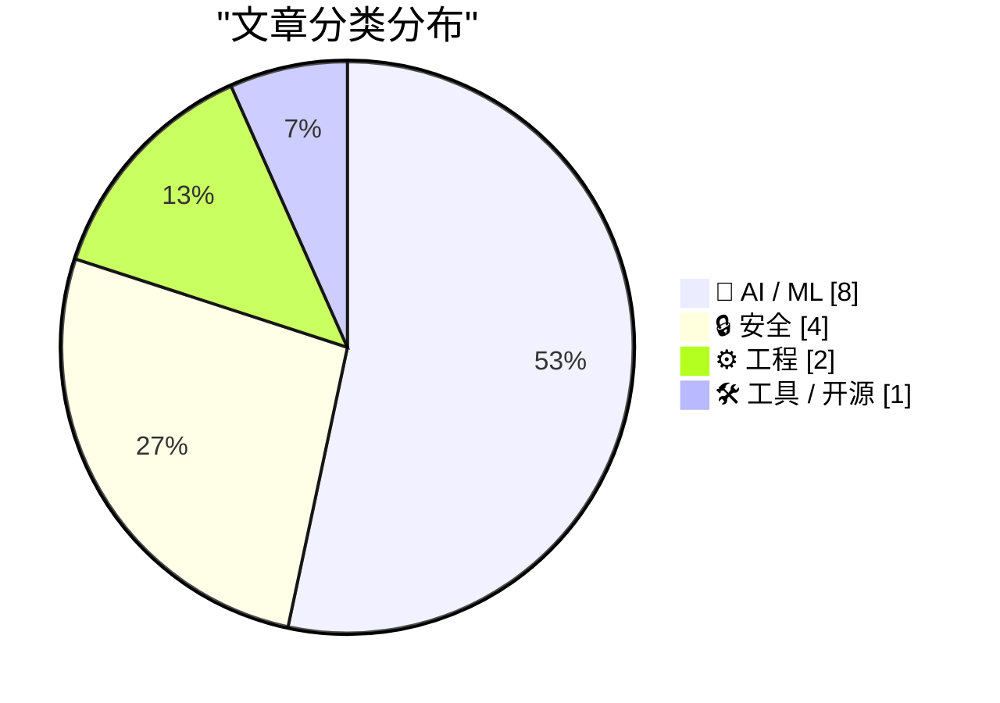
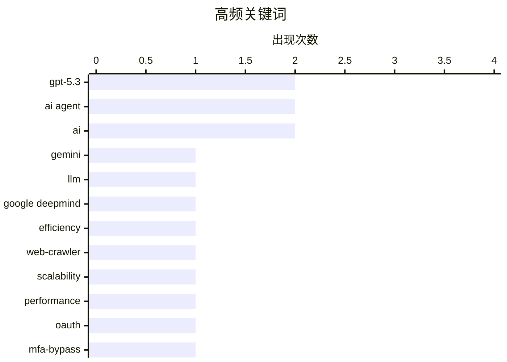

# 📰 AI 资讯每日精选 — 2026-03-04

> 汇聚 140+ 技术博客、X/Twitter、Hacker News、Reddit、Product Hunt、
> Lobste.rs、ClawFeed 日报及 GitHub Trending，经 AI 评分筛选。
>
> **本期内容**：🏆 今日必读 · 🌐 ClawFeed 日报 · 🔥 GitHub Trending · 📂 分类精选 · 🎨 设计与生成式 AI · 📊 数据概览

## 📝 今日看点

今日技术圈聚焦于AI模型的效率竞赛与安全攻防两大核心。巨头持续推出更轻、更快、更经济的生成式AI模型，旨在降低企业部署门槛并优化用户体验。与此同时，安全领域曝出新型认证绕过与客户端漏洞，凸显了在复杂系统中防护机制的脆弱性。此外，从基础理论到工程实践，对AI技术本质与极限能力的探索也在同步深化。

---

## 🏆 今日必读

🥇 **Gemini 3.1 Flash-Lite：为规模化智能而构建**

[Gemini 3.1 Flash-Lite: Built for intelligence at scale](https://deepmind.google/blog/gemini-3-1-flash-lite-built-for-intelligence-at-scale/) — Google DeepMind Blog · 7 小时前 · 🤖 AI / ML

> Google DeepMind 发布了其 Gemini 3 系列中最快、最具成本效益的模型 Gemini 3.1 Flash-Lite。该模型专为大规模、高吞吐量的智能任务设计，旨在降低企业部署 AI 的成本。它通过优化架构和推理效率，在保持核心能力的同时，显著提升了处理速度并减少了计算资源消耗。这使其成为需要处理海量请求的实时应用和服务的理想选择。

💡 **为什么值得读**: 了解当前大模型在成本与效率平衡上的最新进展，对评估和选择生产级 AI 服务有直接参考价值。

🏷️ Gemini, LLM, Google DeepMind, Efficiency

🥈 **在2025年，如何在24小时内爬取10亿个网页**

[Crawling a billion web pages in just over 24 hours, in 2025](https://www.reddit.com/r/programming/comments/1rjynii/crawling_a_billion_web_pages_in_just_over_24/) — r/programming · 4 小时前 · ⚙️ 工程

> 文章详细介绍了在2025年的技术条件下，实现24小时内爬取10亿个网页的工程挑战与解决方案。核心在于设计高度分布式、容错的爬虫架构，并优化网络 I/O、队列管理和去重算法。作者分享了具体的硬件配置、软件栈（如使用特定消息队列和数据库）以及应对反爬策略的技巧。最终通过并行化和资源高效利用，实现了这一看似不可能的性能指标。

💡 **为什么值得读**: 对于从事大数据采集、搜索引擎或分布式系统开发的工程师而言，这是一份极具实战参考价值的高性能爬虫架构指南。

🏷️ web-crawler, scalability, performance

🥉 **OAuth 重定向滥用让攻击者无需窃取令牌即可绕过 MFA**

[OAuth Redirect Abuse Lets Attackers Bypass MFA Without Stealing Tokens](https://www.reddit.com/r/programming/comments/1rjnpqk/oauth_redirect_abuse_lets_attackers_bypass_mfa/) — r/programming · 11 小时前 · 🔒 安全

> 文章揭示了一种新型的 OAuth 2.0 安全漏洞：攻击者可以滥用重定向机制，在用户完成多因素认证（MFA）后，劫持授权流程。这种攻击不需要窃取访问令牌或刷新令牌，而是利用某些 OAuth 实现中对重定向 URI 验证不严的缺陷。攻击者能够将用户的授权码或令牌重定向到自己控制的客户端，从而直接获得访问权限。这暴露了仅依赖 MFA 而忽视 OAuth 流完整性的安全风险。

💡 **为什么值得读**: 该漏洞影响广泛，帮助开发者和安全人员理解 OAuth 实施中一个容易被忽视但危害巨大的攻击面。

🏷️ OAuth, MFA-bypass, authentication

4️⃣ **OpenAI 发布 GPT-5.3 Instant，核心改进：减少说教、提升搜索质量与事实准确性**

[OpenAI 发布了 GPT-5.3 Instant，替换 ChatGPT 中使用最广的日常对话模型 GPT-5.2 Instant。 核心改进有三块： 1. 第一是减少“说教感” 之前的模型经常在回答前...](https://x.com/dotey/status/2028897907198603495) — 𝕏 @dotey · 5 小时前 · 🤖 AI / ML

> OpenAI 用 GPT-5.3 Instant 全面替换了 ChatGPT 中广泛使用的 GPT-5.2 Instant 模型。新模型主要在三方面提升用户体验：一是大幅减少冗余的安全声明和过度拒绝，回答更直接；二是联网搜索时能整合与筛选信息，而非简单罗列链接，准确性更高；三是在医学、法律等高风险领域，联网时的幻觉率降低了 26.8%，非联网时降低了 19.7%。这些改进旨在让对话更自然、信息更可靠。

💡 **为什么值得读**: 直接了解当前最强对话模型的最新迭代方向和改进细节，把握 AI 产品体验演进趋势。

🏷️ GPT-5.3, ChatGPT, model-update, alignment

5️⃣ **神经元是建模决策系统的错误原语吗？**

[[R] Are neurons the wrong primitive for modeling decision systems?](https://www.reddit.com/r/MachineLearning/comments/1rjcqzq/r_are_neurons_the_wrong_primitive_for_modeling/) — r/MachineLearning · 21 小时前 · 🤖 AI / ML

> 一篇 ICLR 论文提出“行为学习”框架，质疑将神经元作为机器学习基本构建模块的普适性。该研究建议用可学习的约束优化块替代神经层，将系统建模为“效用 + 约束 → 最优决策”的过程。论文认为，对于许多本质上是优化驱动的现实世界系统（如经济、交通），直接使用优化模块作为原语可能比通用的神经网络更高效、更可解释。这引发了对机器学习基础架构范式的重新思考。

💡 **为什么值得读**: 这篇论文挑战了深度学习的基础假设，为思考 AI 模型的设计原理提供了颠覆性的视角。

🏷️ neural networks, optimization, ICLR

---

## 🌐 ClawFeed 日报精选

> 来源：[ClawFeed](https://clawfeed.kevinhe.io) — AI 驱动的多源新闻聚合

### 🔥 今日头条

### 1. Anthropic 被 Trump 政府列入黑名单，OpenAI 趁势拿下五角大楼合同
全天最大事件。Pentagon 要求 Anthropic 将 Claude 用于全自主武器系统及大规模公民数据分析，Anthropic 拒绝并坚守两条红线（禁止自主武器、禁止国内大规模监控），谈判破裂。国防部长 Hegseth 随即将 Anthropic 列为"供应链国家安全风险"，Trump 骂其"woke"，推动联邦机构全面停用 Claude。OpenAI CEO Altman 当天快速与 DoD 签约——事后自承"definitely rushed"、"optics don't look good"。多个联邦机构（财政部、国务院）已转向 OpenAI。与此同时，美军在伊朗打击中仍在使用 Claude。
*来源：NYT / The Guardian / CNBC / NPR / TechCrunch*

### 2. AI 安全集体倒退：OpenAI 删除使命中的"safety"，Anthropic 也放弃关键承诺
OpenAI 从使命宣言中移除了"safety"字样；xAI 关闭安全团队；Anthropic 同期放弃"不发布强大 AI 系统"的承诺。三大头部公司同步后退，引发广泛讨论与忧虑。
*来源：TechCrunch*

### 3. Claude Code 推出 Voice Mode + Anthropic 收购 Vercept
Anthropic 工程师 @trq212 宣布 Voice Mode 开始向约 5% 用户灰度推送（`/voice` 开关）。同期 Anthropic 收购 computer-use 初创 Vercept，Meta 同时挖走其联创之一，computer-use 赛道争夺白热化。
*来源：X trending / TechCrunch*

### 4. 四大巨头（Microsoft、Google、OpenAI、Anthropic）联合成立 Agentic AI 联盟
四家公司共同制定 AI Agent 标准，预示 agentic 计算正式进入行业共识阶段，agent 生态基础设施建设提速。
*来源：Tom's Hardware*

### 5. 阿里 Qwen 3.5 小模型系列发布 + 开源 CoPaw
Qwen 3.5（0.8B/2B/4B/9B）原生多模态，2B 可在 iPhone 17 Pro 本地运行，整套系列可在 $600 Mac Mini 跑起来。同期阿里 Tongyi Lab 开源了 CoPaw（定位"自托管版 OpenClaw + Claude"），支持持久记忆、Skills、本地优先、多模型切换，104K 曝光。
*来源：X trending / @aisearchio*

---

### 📊 今日观察

**今天是 AI 商业与政治深度交叉的一天。**

最大主线是 Anthropic 与 OpenAI 在 Pentagon 合同上的分水岭——一家选择坚守道德红线，一家拿下合同。短期来看 OpenAI 赢了，但这个选择的长期影响值得持续观察：Anthropic 在安全性上建立的品牌价值，与它在政府市场失去的业务，究竟哪个更重要？

AI 安全集体倒退是今天的暗线：OpenAI、xAI、Anthropic 三家头部公司同步弱化安全承诺，恰好发生在同一周，令人不安。

技术层面，今天的亮点是**Agent 基础设施的快速成熟**：OpenClaw 安全问题被规模化关注、CoPaw 开源替代方案出现、x402 支付协议、agent-native 浏览器、Vercel CLI Skills——整个 agent 工具链正在从"玩具"向"可信赖基础设施"迁移。

Qwen 3.5 在端侧跑通多模态，则预示下一个关键战场：**本地 AI 的可行性正在超越理论**，隐私与离线场景的商业化窗口正在打开。

---

*生成时间：2026-03-03 22:00 SGT | 来源：6 份 4h 简报*

---

## 🔥 GitHub Trending

> 今日热门开源项目（全语言 + Python）

| # | 项目 | 描述 | ⭐ 总星 | 📈 今日 | 语言 |
|---|------|------|---------|---------|------|
| 1 | [ruvnet/RuView](https://github.com/ruvnet/RuView) | π RuView: WiFi DensePose turns commodity WiFi signals int... | 25.2k | +4557 | Rust |
| 2 | [alibaba/OpenSandbox](https://github.com/alibaba/OpenSandbox) 🤖 | OpenSandbox is a general-purpose sandbox platform for AI ... | 5.4k | +1097 | Python |
| 3 | [moeru-ai/airi](https://github.com/moeru-ai/airi) 🤖 | 💖🧸 Self hosted, you-owned Grok Companion, a container o... | 22.1k | +842 | TypeScript |
| 4 | [K-Dense-AI/claude-scientific-skills](https://github.com/K-Dense-AI/claude-scientific-skills) 🤖 | A set of ready to use Agent Skills for research, science,... | 11.9k | +790 | Python |
| 5 | [public-apis/public-apis](https://github.com/public-apis/public-apis) | A collective list of free APIs | 403.5k | +658 | Python |
| 6 | [superset-sh/superset](https://github.com/superset-sh/superset) 🤖 | IDE for the AI Agents Era - Run an army of Claude Code, C... | 4.1k | +637 | TypeScript |
| 7 | [microsoft/markitdown](https://github.com/microsoft/markitdown) | Python tool for converting files and office documents to ... | 90.0k | +611 | Python |
| 8 | [bytedance/deer-flow](https://github.com/bytedance/deer-flow) | An open-source SuperAgent harness that researches, codes,... | 24.0k | +440 | Python |
| 9 | [FujiwaraChoki/MoneyPrinterV2](https://github.com/FujiwaraChoki/MoneyPrinterV2) | Automate the process of making money online. | 13.9k | +377 | Python |
| 10 | [aquasecurity/trivy](https://github.com/aquasecurity/trivy) | Find vulnerabilities, misconfigurations, secrets, SBOM in... | 521 | +145 | Go |
| 11 | [LMCache/LMCache](https://github.com/LMCache/LMCache) 🤖 | Supercharge Your LLM with the Fastest KV Cache Layer | 7.4k | +140 | Python |
| 12 | [CodebuffAI/codebuff](https://github.com/CodebuffAI/codebuff) | Generate code from the terminal! | 3.3k | +118 | TypeScript |
| 13 | [agentscope-ai/agentscope](https://github.com/agentscope-ai/agentscope) 🤖 | Build and run agents you can see, understand and trust. | 17.0k | +83 | Python |
| 14 | [agentscope-ai/ReMe](https://github.com/agentscope-ai/ReMe) 🤖 | ReMe: Memory Management Kit for Agents - Remember Me, Ref... | 1.3k | +27 | Python |
| 15 | [CorentinJ/Real-Time-Voice-Cloning](https://github.com/CorentinJ/Real-Time-Voice-Cloning) | Clone a voice in 5 seconds to generate arbitrary speech i... | 59.5k | +21 | Python |

---

## 🤖 AI / ML

### 1. Gemini 3.1 Flash-Lite：为规模化智能而构建

[Gemini 3.1 Flash-Lite: Built for intelligence at scale](https://deepmind.google/blog/gemini-3-1-flash-lite-built-for-intelligence-at-scale/) — **Google DeepMind Blog** · 7 小时前 · ⭐ 27/30

> Google DeepMind 发布了其 Gemini 3 系列中最快、最具成本效益的模型 Gemini 3.1 Flash-Lite。该模型专为大规模、高吞吐量的智能任务设计，旨在降低企业部署 AI 的成本。它通过优化架构和推理效率，在保持核心能力的同时，显著提升了处理速度并减少了计算资源消耗。这使其成为需要处理海量请求的实时应用和服务的理想选择。

🏷️ Gemini, LLM, Google DeepMind, Efficiency

---

### 2. OpenAI 发布 GPT-5.3 Instant，核心改进：减少说教、提升搜索质量与事实准确性

[OpenAI 发布了 GPT-5.3 Instant，替换 ChatGPT 中使用最广的日常对话模型 GPT-5.2 Instant。 核心改进有三块： 1. 第一是减少“说教感” 之前的模型经常在回答前...](https://x.com/dotey/status/2028897907198603495) — **𝕏 @dotey** · 5 小时前 · ⭐ 27/30

> OpenAI 用 GPT-5.3 Instant 全面替换了 ChatGPT 中广泛使用的 GPT-5.2 Instant 模型。新模型主要在三方面提升用户体验：一是大幅减少冗余的安全声明和过度拒绝，回答更直接；二是联网搜索时能整合与筛选信息，而非简单罗列链接，准确性更高；三是在医学、法律等高风险领域，联网时的幻觉率降低了 26.8%，非联网时降低了 19.7%。这些改进旨在让对话更自然、信息更可靠。

🏷️ GPT-5.3, ChatGPT, model-update, alignment

---

### 3. 神经元是建模决策系统的错误原语吗？

[[R] Are neurons the wrong primitive for modeling decision systems?](https://www.reddit.com/r/MachineLearning/comments/1rjcqzq/r_are_neurons_the_wrong_primitive_for_modeling/) — **r/MachineLearning** · 21 小时前 · ⭐ 26/30

> 一篇 ICLR 论文提出“行为学习”框架，质疑将神经元作为机器学习基本构建模块的普适性。该研究建议用可学习的约束优化块替代神经层，将系统建模为“效用 + 约束 → 最优决策”的过程。论文认为，对于许多本质上是优化驱动的现实世界系统（如经济、交通），直接使用优化模块作为原语可能比通用的神经网络更高效、更可解释。这引发了对机器学习基础架构范式的重新思考。

🏷️ neural networks, optimization, ICLR

---

### 4. PRX 第三部分 —— 在24小时内训练一个文生图模型！

[PRX Part 3 — Training a Text-to-Image Model in 24h!](https://huggingface.co/blog/Photoroom/prx-part3) — **Hugging Face Blog** · 7 小时前 · ⭐ 25/30

> Hugging Face 的博客文章展示了如何使用其 Photoroom PRX 方法，在短短 24 小时内高效训练一个高质量的文本到图像生成模型。该方法涉及精心设计的数据集策划、高效的训练管道优化以及特定的模型架构选择。文章详细介绍了从数据准备、分布式训练配置到最终模型评估的完整技术流程。这证明了在有限计算资源和时间内训练出实用文生图模型的可行性。

🏷️ text-to-image, training, Hugging Face

---

### 5. 如何利用编码智能体最小化游戏运行时推理成本

[How to Minimize Game Runtime Inference Costs with Coding Agents](https://developer.nvidia.com/blog/how-to-minimize-game-runtime-inference-costs-with-coding-agents/) — **NVIDIA Technical Blog** · 4 小时前 · ⭐ 25/30

> NVIDIA 技术博客介绍了如何利用其 ACE（Avatar Cloud Engine）套件中的编码智能体来优化游戏中的 AI 推理成本。文章核心在于，通过让 AI 智能体动态生成和优化游戏内角色的对话、行为代码，可以将昂贵的实时大模型推理转化为预生成或轻量级的本地执行。这种方法对比了纯云端推理与智能体辅助的混合方案，能显著降低延迟和运营开销。最终实现更高效、可扩展的游戏内 AI 体验。

🏷️ AI Agent, Game Development, NVIDIA ACE, Inference

---

### 6. Ars Technica 在涉及 AI 捏造引文的争议后解雇记者

[Ars Technica fires reporter after AI controversy involving fabricated quotes](https://futurism.com/artificial-intelligence/ars-technica-fires-reporter-ai-quotes) — **Hacker News Best** · 22 小时前 · ⭐ 25/30

> 知名科技媒体 Ars Technica 解雇了一名资深记者，因其在报道中使用了 AI 工具生成的虚假引文。该记者在关于 ChatGPT 的报道中，虚构了不存在的专家言论并引用了不存在的学术研究。此事在内部审查和读者质疑后曝光，引发了关于新闻业诚信、AI 工具滥用及编辑审核流程失效的广泛讨论。这一事件凸显了 AI 生成内容对传统新闻事实核查体系的严峻挑战。

🏷️ AI, journalism, ethics, fabrication

---

### 7. GPT-5.3 Instant 版本发布

[GPT‑5.3 Instant is out](https://www.reddit.com/r/singularity/comments/1rjwlw0/gpt53_instant_is_out/) — **r/singularity** · 5 小时前 · ⭐ 25/30

> OpenAI 正式推出了 GPT-5.3 Instant 模型，并已向所有 ChatGPT 用户及 API 开发者开放。新模型通过 API 调用时的名称为 ‘gpt-5.3-chat-latest’。作为过渡，上一代的 GPT-5.2 Instant 将在付费用户的模型选择器中保留三个月，直至 2026 年 6 月 3 日退役。这表明 OpenAI 正在快速迭代其模型家族，推动用户向最新版本迁移。

🏷️ GPT-5.3, OpenAI, release, API

---

### 8. 当 AI 编写世界上的软件时，谁来验证它？

[When AI Writes the World's Software, Who Verifies It?](https://leodemoura.github.io/blog/2026/02/28/when-ai-writes-the-worlds-software.html) — **Lobste.rs** · 8 小时前 · ⭐ 25/30

> 文章探讨了 AI 代码生成工具普及后带来的核心挑战：软件验证与质量保证。作者指出，随着 AI 编写代码的比例激增，传统的代码审查、测试和验证流程可能失效。问题的关键在于，我们缺乏可扩展的、自动化的方法来确保 AI 生成代码的正确性、安全性和符合预期。结论是，整个软件工程范式需要革新，必须发展出新的、专门针对 AI 生成代码的验证理论和工具链。

🏷️ AI, code generation, verification, software engineering

---

## 🔒 安全

### 9. OAuth 重定向滥用让攻击者无需窃取令牌即可绕过 MFA

[OAuth Redirect Abuse Lets Attackers Bypass MFA Without Stealing Tokens](https://www.reddit.com/r/programming/comments/1rjnpqk/oauth_redirect_abuse_lets_attackers_bypass_mfa/) — **r/programming** · 11 小时前 · ⭐ 27/30

> 文章揭示了一种新型的 OAuth 2.0 安全漏洞：攻击者可以滥用重定向机制，在用户完成多因素认证（MFA）后，劫持授权流程。这种攻击不需要窃取访问令牌或刷新令牌，而是利用某些 OAuth 实现中对重定向 URI 验证不严的缺陷。攻击者能够将用户的授权码或令牌重定向到自己控制的客户端，从而直接获得访问权限。这暴露了仅依赖 MFA 而忽视 OAuth 流完整性的安全风险。

🏷️ OAuth, MFA-bypass, authentication

---

### 10. 一个日历邀请就足以劫持 Perplexity 的 Comet 浏览器并窃取 1Password 凭证

[A calendar invite is all it took to hijack Perplexity's Comet browser and steal 1Password credentials](https://the-decoder.com/a-calendar-invite-is-all-it-took-to-hijack-perplexitys-comet-browser-and-steal-1password-credentials/) — **The Decoder** · 10 小时前 · ⭐ 25/30

> 安全研究人员演示了如何通过一个精心构造的日历邀请，利用 Perplexity AI 的智能浏览器 Comet 的漏洞进行攻击。该漏洞允许攻击者诱导 Comet 浏览器执行恶意指令，从而窃取用户本地文件并完全接管其 1Password 账户。这暴露了 AI 智能体在理解上下文和执行操作时可能存在的严重安全风险，特别是当它们被授予过高系统权限时。这种攻击方式对日益流行的 AI 助手类应用敲响了警钟。

🏷️ vulnerability, agentic AI, Perplexity

---

### 11. 竞态中的竞态：利用 Linux 数据包套接字中的 CVE-2025-38617

[A Race Within A Race: Exploiting CVE-2025-38617 in Linux Packet Sockets](https://www.reddit.com/r/programming/comments/1rk2wr3/a_race_within_a_race_exploiting_cve202538617_in/) — **r/programming** · 2 小时前 · ⭐ 25/30

> 技术博客深入分析了 Linux 内核数据包套接字子系统中的一个高危漏洞 CVE-2025-38617。该漏洞源于 `packet_recvmsg` 函数中存在的双重竞态条件，允许本地攻击者进行内存释放后重用。文章详细剖析了漏洞的根源、利用条件，并提供了完整的漏洞利用开发过程，演示了如何通过精心构造的竞态攻击来提升权限。这反映了内核代码中并发处理的复杂性和潜在风险。

🏷️ Linux, CVE, exploit, race condition

---

### 12. 为 AI Agent 植入“思想钢印”：慢雾发布 OpenClaw 极简安全实践指南

[上一条聊了 AI agent 的攻击面，这条是防御方案。 慢雾这份指南思路很清晰：给 agent 植入一个安全规范文档（余弦老师叫它"思想钢印"），覆盖事前拦截、事中收窄...](https://x.com/runes_leo/status/2028821694735905049) — **𝕏 @runes_leo** · 10 小时前 · ⭐ 25/30

> 针对 AI Agent 的安全威胁，慢雾科技提出了一套名为“思想钢印”的防御方案。该方案通过给 Agent 植入安全规范文档，覆盖事前拦截、事中收窄权限、事后审计巡检全流程。与简单的二值化拦截不同，指南建议采用红线（需人工确认）和黄线（可执行但强制记录）的分级策略，提升了安全控制的粒度。在加密货币等敏感场景，特别强调 Agent 只构造交易，签名必须由人在独立钱包完成，私钥永不经过 Agent。最终结论是：给 Agent 设定安全规范如同员工培训，写了不一定完全遵守，但不写一定会出事，最后的兜底者仍是人类。

🏷️ AI agent, security, guidelines, defense

---

## ⚙️ 工程

### 13. 在2025年，如何在24小时内爬取10亿个网页

[Crawling a billion web pages in just over 24 hours, in 2025](https://www.reddit.com/r/programming/comments/1rjynii/crawling_a_billion_web_pages_in_just_over_24/) — **r/programming** · 4 小时前 · ⭐ 27/30

> 文章详细介绍了在2025年的技术条件下，实现24小时内爬取10亿个网页的工程挑战与解决方案。核心在于设计高度分布式、容错的爬虫架构，并优化网络 I/O、队列管理和去重算法。作者分享了具体的硬件配置、软件栈（如使用特定消息队列和数据库）以及应对反爬策略的技巧。最终通过并行化和资源高效利用，实现了这一看似不可能的性能指标。

🏷️ web-crawler, scalability, performance

---

### 14. 从日耗 2400 万 Token 到成本降低 95%：用简单脚本替代 AI 进行智能监控

[每天烧 2400 万 token 去盯没在跑的程序。Elvis 的解法：先零成本看一眼"有没有事"，有事才请 AI。成本降 95%。 看完当晚就动手了。8 个小脚本自动巡逻：策略连...](https://x.com/runes_leo/status/2028874973377712404) — **𝕏 @runes_leo** · 7 小时前 · ⭐ 25/30

> 一个实际案例展示了过度依赖大模型进行常规监控导致的巨大资源浪费。项目原本每天消耗超过 2400 万 Opus token 来监控可能并未运行的程序。解决方案是设计一个两层系统：先用零成本的 Bash 脚本进行预检查，只有发现异常时才触发 AI 处理。这一改动将 token 消耗降低了约 95%，且系统更可靠。案例的核心观点是：大部分监控场景不需要大模型，简单的判断逻辑往往比 AI 更快、更准、更经济。

🏷️ Monitoring, Cost Optimization, Automation, Scripting

---

## 🛠 工具 / 开源

### 15. 苹果发布 M5 Pro 与 M5 Max，声称其 LLM 提示处理速度比 M4 Pro/Max 快达 4 倍

[Apple unveils M5 Pro and M5 Max, citing up to 4× faster LLM prompt processing than M4 Pro and M4 Max](https://www.reddit.com/r/LocalLLaMA/comments/1rjqsv6/apple_unveils_m5_pro_and_m5_max_citing_up_to_4/) — **r/LocalLLaMA** · 9 小时前 · ⭐ 25/30

> 苹果发布了新一代 M5 Pro 和 M5 Max 芯片，重点提升了 AI 推理性能。其核心宣称是，在处理大型语言模型（LLM）提示时，速度最高可达上一代 M4 Pro 和 M4 Max 的 4 倍。这一性能飞跃主要得益于芯片架构的升级和神经网络引擎的增强。此举旨在巩固苹果设备在本地运行 AI 模型（如 LLaMA）时的性能优势，直接回应了市场对边缘 AI 计算能力日益增长的需求。

🏷️ Apple Silicon, M5, LLM inference, hardware

---

## 🎨 Design & Generative AI

### 🖥️ 生成式 UI

- **[Qwen3.5-9B模型“净化”版发布，实现零拒绝率并支持视觉](https://www.reddit.com/r/LocalLLaMA/comments/1rjwm8i/qwen359b_abliterated_0_refusals_vision/)** — r/LocalLLaMA · 5 小时前
  > 通过两阶段方法（正交投影+LoRA）改造Qwen3.5-9B模型，使其拒绝率降至0%并增加视觉能力。

### 🖼️ 生成式图片

- **[一键搞定！RTX 50系显卡Windows直装ComfyUI方案开源](https://www.reddit.com/r/StableDiffusion/comments/1rjc58k/opensourced_a_oneclick_comfyui_setup_for_rtx/)** — r/StableDiffusion · 22 小时前
  > 开源项目解决RTX 50系列显卡在Windows上直接运行ComfyUI的兼容性问题，无需WSL2或Docker。

- **[RTX 5090训练FLUX LoRA怪象：批次大小2反比1慢](https://www.reddit.com/r/StableDiffusion/comments/1rjyeqj/rtx_5090_32gb_kohya_flux_training_batch_size_2_is/)** — r/StableDiffusion · 4 小时前
  > 用户在RTX 5090上用Kohya训练FLUX LoRA时发现，批次大小为2的每步耗时几乎是批次为1的两倍。

- **[ComfyUI专用ZiT-LoRA加载器发布，解决架构兼容问题](https://www.reddit.com/r/StableDiffusion/comments/1rje8jz/comfyuizitloraloader/)** — r/StableDiffusion · 20 小时前
  > 为解决Z-Image Turbo与LoRA架构不兼容问题，开发者发布了ComfyUI专用的ZiT-LoRA加载器。

- **[用户询问：能否自行微调Klein 9B图像生成模型？](https://www.reddit.com/r/StableDiffusion/comments/1rjsnsl/can_i_finetune_klein_9b_myself/)** — r/StableDiffusion · 8 小时前
  > 用户在使用Klein 9B模型创作大量LoRA后，询问社区是否能够自行对该基础模型进行微调。

- **[AMD RX 6800XT在Linux上运行ComfyUI，用户寻求提速方案](https://www.reddit.com/r/StableDiffusion/comments/1rjist5/using_comfy_ui_on_linux_amd_rx_6800xt_can_i_get/)** — r/StableDiffusion · 16 小时前
  > 用户在Linux系统上用AMD RX 6800XT显卡运行ComfyUI，对当前速度满意但仍寻求进一步优化方案。

- **[第三次优化！ComfyUI超高清细节生成工作流最终版发布](https://www.reddit.com/r/comfyui/comments/1rk0tew/3rd_times_the_charm_here_is_the_correct_infinite/)** — r/comfyui · 3 小时前
  > 开发者发布了经过多次优化的ComfyUI工作流，可生成2K/4K高细节图像，并支持模块化调整与多次迭代。

- **[ComfyUI中实现高效图像批量处理的工作流探讨](https://www.reddit.com/r/comfyui/comments/1rjr42l/batch_processing_images_one_by_one_in_comfyui/)** — r/comfyui · 9 小时前
  > 用户寻求在ComfyUI中为Gemini/Qwen/Flux等模型构建稳定、清晰的图像批量处理工作流的最佳实践。

- **[首作发布！适用于Flux.2 Klein的“重拳出击”姿势LoRA](https://www.reddit.com/r/StableDiffusion/comments/1rjbfhv/kinghit_punch_pose_lora_for_flux2_klein/)** — r/StableDiffusion · 22 小时前
  > 创作者发布了首个LoRA模型，专门为Flux.2 Klein模型生成“出拳”姿势。

- **[成功集成！在LTX中完美运行FFlF的演员参考工作流](https://www.reddit.com/r/StableDiffusion/comments/1rje85s/never_enough_ltx_2fflf/)** — r/StableDiffusion · 20 小时前
  > 用户通过自创的演员参考工作流，成功在LTX中实现了FFlF模型的完美运行。

- **[RTX 5060Ti运行Flux 2 Klein报错：矩阵维度不匹配](https://www.reddit.com/r/StableDiffusion/comments/1rjkl0i/mat1mat2_issue_with_flux_2_klein_9b_in_comfyui_on/)** — r/StableDiffusion · 14 小时前
  > 用户在RTX 5060Ti上的ComfyUI中运行Flux 2 Klein 9b模型时，持续遇到矩阵乘法维度不匹配的错误。

- **[即将开源！专为Klein模型设计的一致性控制LoRA](https://www.reddit.com/r/comfyui/comments/1rjixiv/i_will_soon_be_opensourcing_a_new_lora_for/)** — r/comfyui · 16 小时前
  > 开发者预告将开源一个新的LoRA，旨在提升Klein系列生成模型输出的一致性控制能力。

### 🌍 世界模型 / 3D

- **[Luma Claw展示惊艳3D生成效果，引发社区赞叹](https://x.com/steipete/status/2028649313887195530)** — 𝕏 @steipete · 22 小时前
  > Luma平台的Claw功能展示了令人印象深刻的3D场景生成能力，获得开发者好评。

### 🎬 生成式视频

- **[YouTuber集体诉讼Runway AI，指控其AI训练侵犯版权](https://www.reddit.com/r/StableDiffusion/comments/1rjn5sj/youtuber_sues_runway_ai_in_latest_copyright_class/)** — r/StableDiffusion · 12 小时前
  > YouTuber对Runway AI提起最新集体诉讼，指控其AI视频模型训练侵犯版权。

- **[Wan 2.2结合SVI Pro v2，实现高质量长视频生成](https://www.reddit.com/r/comfyui/comments/1rjo0up/wan_22_is_still_incredible_huge_thanks_to/)** — r/comfyui · 11 小时前
  > 借助SVI Pro v2新增的首尾帧支持，Wan 2.2现在能够生成长时间且质量稳定的视频。

---

## 📊 数据概览

| 扫描源 | 抓取文章 | 时间范围 | 精选 |
|:---:|:---:|:---:|:---:|
| 122/140 | 4132 篇 → 318 篇 | 24h | **15 篇** |

### 分类分布



### 高频关键词



<details>
<summary>📈 纯文本关键词图（终端友好）</summary>

```
gpt-5.3         │ ████████████████████ 2
ai agent        │ ████████████████████ 2
ai              │ ████████████████████ 2
gemini          │ ██████████░░░░░░░░░░ 1
llm             │ ██████████░░░░░░░░░░ 1
google deepmind │ ██████████░░░░░░░░░░ 1
efficiency      │ ██████████░░░░░░░░░░ 1
web-crawler     │ ██████████░░░░░░░░░░ 1
scalability     │ ██████████░░░░░░░░░░ 1
performance     │ ██████████░░░░░░░░░░ 1
```

</details>

### 🏷️ 话题标签

**gpt-5.3**(2) · **ai agent**(2) · **ai**(2) · gemini(1) · llm(1) · google deepmind(1) · efficiency(1) · web-crawler(1) · scalability(1) · performance(1) · oauth(1) · mfa-bypass(1) · authentication(1) · chatgpt(1) · model-update(1) · alignment(1) · neural networks(1) · optimization(1) · iclr(1) · text-to-image(1)

---

*生成于 2026-03-04 00:05 | 汇聚 140 个技术博客、X/Twitter、Hacker News、Reddit、Product Hunt、Lobste.rs、ClawFeed 日报及 GitHub Trending，经 AI 评分筛选出 Top 15 精华内容*
