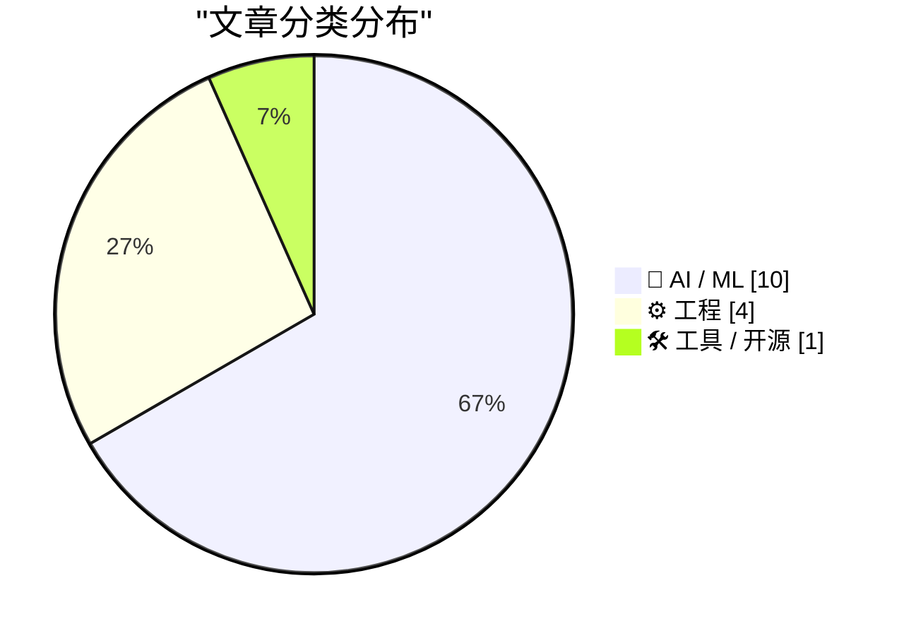
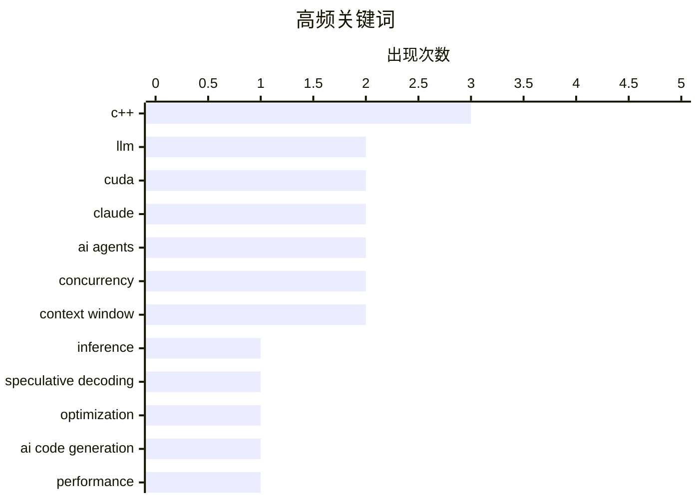

# 📰 AI 资讯每日精选 — 2026-03-05

> 汇聚 140+ 技术博客、X/Twitter、Hacker News、Reddit、Product Hunt、
> Lobste.rs、ClawFeed 日报及 GitHub Trending，经 AI 评分筛选。
>
> **本期内容**：🏆 今日必读 · 🌐 ClawFeed 日报 · 🔥 GitHub Trending · 📂 分类精选 · 🎨 设计与生成式 AI · 📊 数据概览

## 📝 今日看点

今日技术圈聚焦于AI能力的深度进化与实战化应用。大模型推理加速与代码生成能力取得突破，同时AI智能体正从理论快速走向工程化与军事级实战。另一方面，系统编程语言C++正通过新标准积极应对安全与高并发计算的现代挑战。

---

## 🏆 今日必读

🥇 **推测性推测解码（SSD）**

[Speculative Speculative Decoding (SSD)](https://www.reddit.com/r/programming/comments/1rksbqp/speculative_speculative_decoding_ssd/) — r/programming · 6 小时前 · 🤖 AI / ML

> 文章探讨了加速大语言模型推理的新方法——推测性推测解码（SSD）。该方法在传统推测解码（使用草稿模型预测并验证）的基础上，进一步引入一个“推测器”来预测草稿模型的输出，从而形成两级推测流水线。这种架构能更早地启动大模型的验证过程，理论上可以进一步减少推理延迟。核心观点是，通过将推测过程本身也进行推测，可以更高效地挖掘并行性，是推理优化领域一个有趣的前沿思路。

💡 **为什么值得读**: 该文介绍了一种突破性的推理加速思路，为追求极致性能的AI工程人员提供了新的技术视角和优化方向。

🏷️ LLM, inference, speculative decoding, optimization

🥈 **中国AI实验室构建出编写CUDA代码能力超越torch.compile的AI，在最高难度基准上比Claude Opus 4.5强40%**

[A Chinese AI lab just built an AI that writes CUDA code better than torch.compile. 40% better than Claude Opus 4.5. on the hardest benchmark.](https://www.reddit.com/r/singularity/comments/1rkkolb/a_chinese_ai_lab_just_built_an_ai_that_writes/) — r/singularity · 11 小时前 · 🤖 AI / ML

> 文章介绍了一项名为CUDA Agent的研究，旨在解决GPU内核优化高度依赖专家经验的问题。该研究采用大规模智能体强化学习框架，让AI智能体通过与环境交互（执行代码、获取性能反馈）来学习优化CUDA代码，突破了传统无训练优化或固定反馈循环方法的局限。实验表明，CUDA Agent生成的代码性能在最具挑战性的基准测试上，比现有最佳模型Claude Opus 4.5高出40%，并且优于PyTorch的torch.compile。这标志着AI在底层高性能计算代码生成领域取得了显著进展。

💡 **为什么值得读**: 它展示了AI在替代人类专家进行极致性能优化方面的巨大潜力，对深度学习框架和硬件计算领域有直接冲击。

🏷️ AI code generation, CUDA, performance, benchmark

🥉 **关于智能体的45个思考**

[推荐这篇「45 Thoughts About Agents」，Google Docs 联合创始人 Steve Newman 写的，信息密度很高。 几个印象深的点： Agent 是 AI stack 中演化最快的层 — 模...](https://x.com/runes_leo/status/2029081154066723039) — 𝕏 @runes_leo · 17 小时前 · 🤖 AI / ML

> Google Docs联合创始人Steve Newman分享了关于AI智能体发展的高密度见解。他指出，智能体层是AI技术栈中演化最快的部分，但用户工作方式的演变更快。成功应用智能体的关键在于让其具备自我验证能力，而非依赖人工检查。AI的整体影响力是预训练、后训练、推理算力、智能体脚手架等8个因子共同乘积的结果，且这些因子均在同步推进。作者认为，当前这场由AI驱动的变革进程仅完成了约三分之一。

💡 **为什么值得读**: 来自顶尖产品构建者的系统性思考，提供了超越技术细节的、关于AI如何重塑工作流的宏观框架和关键洞察。

🏷️ AI-Agent, productivity, workflow

4️⃣ **引用高德纳**

[Quoting Donald Knuth](https://simonwillison.net/2026/Mar/3/donald-knuth/#atom-everything) — simonwillison.net · 1 天前 · 🤖 AI / ML

> 计算机科学泰斗高德纳（Donald Knuth）分享了一次个人经历：他研究数周的一个开放性问题，被新发布仅三周的Claude Opus 4.6模型解决了。这一事件让他感到震惊，并促使他重新思考对“生成式AI”的看法。高德纳不仅为猜想得到优雅解答而高兴，也为AI展现出的强大推理能力而庆祝。此事例具体展示了尖端AI模型在解决复杂学术问题上的实际能力。

💡 **为什么值得读**: 传奇人物亲述的“AI震撼”时刻，极具说服力地揭示了当前大模型在专业推理领域可能达到的高度。

🏷️ Claude, AI Research, Problem Solving

5️⃣ **美军在对伊战争中使用Anthropic的Claude进行AI驱动的打击规划**

[US military uses Anthropic's Claude for AI-driven strike planning in Iran war](https://the-decoder.com/us-military-uses-anthropics-claude-for-ai-driven-strike-planning-in-iran-war/) — The Decoder · 7 小时前 · 🤖 AI / ML

> 报道披露，美军在对伊朗的战争中首次大规模使用生成式AI进行目标选择和打击规划。所使用的模型正是Anthropic公司的Claude，而该公司此前刚被美国政府列入禁令名单。这表明先进AI技术已实质性应用于现代军事行动的决策环节，形成了技术应用与政策监管之间的显著矛盾。此事件标志着生成式AI在关键国家安全领域的实战化应用进入新阶段。

💡 **为什么值得读**: 揭示了尖端AI技术的双重用途性质及其在地缘政治冲突中的现实应用，涉及技术伦理、政策与安全的深刻矛盾。

🏷️ military AI, Claude, strike planning

---

## 🌐 ClawFeed 日报精选

> 来源：[ClawFeed](https://clawfeed.kevinhe.io) — AI 驱动的多源新闻聚合

### 🔥 今日头条

**1. Anthropic vs 美国联邦政府 — 史无前例的 AI 政治风波**
五角大楼终止与 Anthropic 的 $2 亿合同，将其列为「供应链国家安全风险」。State、Treasury、HHS 相继宣布停用 Claude，全面转向 OpenAI 和 Google。起因：Anthropic 拒绝其模型被用于自主武器或国内监控。OpenAI 趁势签下 DoD 新合约，Sam Altman 承认「看起来机会主义且仓促」，事后补充三条红线。约 900 名 Google/OpenAI 员工联署公开信谴责。与此同时，Claude App Store 下载量反超 ChatGPT，Anthropic CEO Dario 透露营收路径：$0 → $1亿 → $10亿 → $40-50亿 → 预期 $150-200亿（2023→2026）。
来源：Reuters / Fortune / Axios / NPR

**2. Qwen 大地震 — 阿里巴巴 AI 核心团队集体出走**
技术负责人 Lin Junyang（@JustinLin610）在 Qwen3.5 刚发布次日宣布离职，post-training 负责人 Yu Bowen、核心研究员 Binyuan Hui（@huybery）、Kaixin Li（@kxli_2000）相继跟随。这是短期内第三波骨干出走。外界分析：内部「研究优先 vs 商业化指标驱动」路线分歧。新帅来自 Google DeepMind Gemini 团队。马斯克前一天刚夸 Qwen，今天人就走了。
来源：TechCrunch / VentureBeat / Reuters

**3. ⚠️ OpenClaw 安全漏洞曝光 — 23.49 万个实例裸奔公网**
安全研究员扫描发现全网 23.49 万个 OpenClaw 实例直接暴露在公网，默认端口 18789，无 token、无密码、无防火墙，可直接查看他人 Agent 行为、API 调用记录和钱包地址。@0xKingsKuan 形容：「相当于把家门钥匙+银行卡+电脑管理员权限全贴大门上。」SlowMist 团队同步发布 OpenClaw 安全指南。
来源：@0xKingsKuan / @Gorden_Sun

**4. Apple M4 神经引擎被破解 — 闲置算力相当于 RTX 3060 Ti**
开发者 Manjeet Singh 逆向工程 M4 Neural Engine 私有 API，成功在其上训练 109M 参数模型。等效算力约 RTX 3060 Ti，功耗仅其 1/40。苹果从未公开宣传这块芯片，一直用来跑 Siri。
来源：maderix.substack.com / @LotusDecoder

**5. AI Agent 获得经济基础设施 — 邮箱 + 钱包 + 微支付全到位**
AgentMail（YC S25）在 Base 链上线，AI Agent 可用 USDC 创建邮件收件箱，支持 x402 协议，无需账号或 API 密钥。Circle USDC Nanopayments 上线测试网，gas-free 微转账低至 $0.000001，专为 AI Agent 设计。OKX OnchainOS 正式推出，定位 AI Agent「数字操作系统」。Binance 同步上线首批 7 个 AI Agent 技能（研究/下单/风控）。
来源：@base / @hosseeb / @tmel0211 / @binancezh

---

### 👀 今日推荐关注

• **@runes_leo (Leo)** — 预测市场策略 × AI工具实战 × 独立构建。今日贡献高质量「Everything is Context」分析，14.2K followers，高活跃，216个你认识的人都在关注
  https://x.com/runes_leo

• **@kxli_2000 (Kaixin Li)** — Qwen 核心研究员，刚刚宣布从阿里离职「Signing off from @Alibaba_Qwen. Onwards and upwards!」顶级 AI 人才，接下来动向值得追踪
  https://x.com/kxli_2000

---

### 🧹 今日建议取关

• **@feibo03** — 标注 Parody account，内容：「Dream is 3M USDT」+ GMGN referral 链接，纯 crypto meme 营销噪音，五份简报均建议清理
  https://x.com/feibo03

• **@jordymaui** — 主要是 Fulham 足球话题 + 体育营销，AI/tech 相关性极低，多次出现在取关名单
  https://x.com/jordymaui

• **@YuLin807** — Bio 只写「自由，希望与爱」，无法确认是否为私人联系人，若非则建议取关
  https://x.com/YuLin807

• **@0xFelix** — Alpha Trader 标签，内容主打 Binance 钱包 referral 推广，营销噪音为主
  https://x.com/0xFelix

---

---

## 🔥 GitHub Trending

> 今日热门开源项目（全语言 + Python）

| # | 项目 | 描述 | ⭐ 总星 | 📈 今日 | 语言 |
|---|------|------|---------|---------|------|
| 1 | [msitarzewski/agency-agents](https://github.com/msitarzewski/agency-agents) 🤖 | A complete AI agency at your fingertips - From frontend w... | 5.4k | +2151 | - |
| 2 | [KeygraphHQ/shannon](https://github.com/KeygraphHQ/shannon) 🤖 | Fully autonomous AI hacker to find actual exploits in you... | 30.3k | +1847 | TypeScript |
| 3 | [moeru-ai/airi](https://github.com/moeru-ai/airi) 🤖 | 💖🧸 Self hosted, you-owned Grok Companion, a container o... | 24.6k | +1794 | TypeScript |
| 4 | [anthropics/skills](https://github.com/anthropics/skills) 🤖 | Public repository for Agent Skills | 83.7k | +1164 | Python |
| 5 | [ItzCrazyKns/Perplexica](https://github.com/ItzCrazyKns/Perplexica) 🤖 | Perplexica is an AI-powered answering engine. | 30.8k | +1096 | TypeScript |
| 6 | [K-Dense-AI/claude-scientific-skills](https://github.com/K-Dense-AI/claude-scientific-skills) 🤖 | A set of ready to use Agent Skills for research, science,... | 12.7k | +926 | Python |
| 7 | [alibaba/OpenSandbox](https://github.com/alibaba/OpenSandbox) 🤖 | OpenSandbox is a general-purpose sandbox platform for AI ... | 6.0k | +745 | Python |
| 8 | [agentscope-ai/agentscope](https://github.com/agentscope-ai/agentscope) 🤖 | Build and run agents you can see, understand and trust. | 17.4k | +419 | Python |
| 9 | [aquasecurity/trivy](https://github.com/aquasecurity/trivy) | Find vulnerabilities, misconfigurations, secrets, SBOM in... | 846 | +368 | Go |
| 10 | [agentscope-ai/ReMe](https://github.com/agentscope-ai/ReMe) 🤖 | ReMe: Memory Management Kit for Agents - Remember Me, Ref... | 1.6k | +346 | Python |
| 11 | [CodebuffAI/codebuff](https://github.com/CodebuffAI/codebuff) | Generate code from the terminal! | 3.6k | +337 | TypeScript |
| 12 | [TheCraigHewitt/seomachine](https://github.com/TheCraigHewitt/seomachine) 🤖 | A specialized Claude Code workspace for creating long-for... | 1.2k | +315 | Python |
| 13 | [FujiwaraChoki/MoneyPrinterV2](https://github.com/FujiwaraChoki/MoneyPrinterV2) | Automate the process of making money online. | 14.2k | +217 | Python |
| 14 | [LMCache/LMCache](https://github.com/LMCache/LMCache) 🤖 | Supercharge Your LLM with the Fastest KV Cache Layer | 7.5k | +209 | Python |
| 15 | [unslothai/unsloth](https://github.com/unslothai/unsloth) 🤖 | Fine-tuning & Reinforcement Learning for LLMs. 🦥 Train O... | 53.3k | +169 | Python |

---

## 🤖 AI / ML

### 1. 推测性推测解码（SSD）

[Speculative Speculative Decoding (SSD)](https://www.reddit.com/r/programming/comments/1rksbqp/speculative_speculative_decoding_ssd/) — **r/programming** · 6 小时前 · ⭐ 28/30

> 文章探讨了加速大语言模型推理的新方法——推测性推测解码（SSD）。该方法在传统推测解码（使用草稿模型预测并验证）的基础上，进一步引入一个“推测器”来预测草稿模型的输出，从而形成两级推测流水线。这种架构能更早地启动大模型的验证过程，理论上可以进一步减少推理延迟。核心观点是，通过将推测过程本身也进行推测，可以更高效地挖掘并行性，是推理优化领域一个有趣的前沿思路。

🏷️ LLM, inference, speculative decoding, optimization

---

### 2. 中国AI实验室构建出编写CUDA代码能力超越torch.compile的AI，在最高难度基准上比Claude Opus 4.5强40%

[A Chinese AI lab just built an AI that writes CUDA code better than torch.compile. 40% better than Claude Opus 4.5. on the hardest benchmark.](https://www.reddit.com/r/singularity/comments/1rkkolb/a_chinese_ai_lab_just_built_an_ai_that_writes/) — **r/singularity** · 11 小时前 · ⭐ 27/30

> 文章介绍了一项名为CUDA Agent的研究，旨在解决GPU内核优化高度依赖专家经验的问题。该研究采用大规模智能体强化学习框架，让AI智能体通过与环境交互（执行代码、获取性能反馈）来学习优化CUDA代码，突破了传统无训练优化或固定反馈循环方法的局限。实验表明，CUDA Agent生成的代码性能在最具挑战性的基准测试上，比现有最佳模型Claude Opus 4.5高出40%，并且优于PyTorch的torch.compile。这标志着AI在底层高性能计算代码生成领域取得了显著进展。

🏷️ AI code generation, CUDA, performance, benchmark

---

### 3. 关于智能体的45个思考

[推荐这篇「45 Thoughts About Agents」，Google Docs 联合创始人 Steve Newman 写的，信息密度很高。 几个印象深的点： Agent 是 AI stack 中演化最快的层 — 模...](https://x.com/runes_leo/status/2029081154066723039) — **𝕏 @runes_leo** · 17 小时前 · ⭐ 27/30

> Google Docs联合创始人Steve Newman分享了关于AI智能体发展的高密度见解。他指出，智能体层是AI技术栈中演化最快的部分，但用户工作方式的演变更快。成功应用智能体的关键在于让其具备自我验证能力，而非依赖人工检查。AI的整体影响力是预训练、后训练、推理算力、智能体脚手架等8个因子共同乘积的结果，且这些因子均在同步推进。作者认为，当前这场由AI驱动的变革进程仅完成了约三分之一。

🏷️ AI-Agent, productivity, workflow

---

### 4. 引用高德纳

[Quoting Donald Knuth](https://simonwillison.net/2026/Mar/3/donald-knuth/#atom-everything) — **simonwillison.net** · 1 天前 · ⭐ 26/30

> 计算机科学泰斗高德纳（Donald Knuth）分享了一次个人经历：他研究数周的一个开放性问题，被新发布仅三周的Claude Opus 4.6模型解决了。这一事件让他感到震惊，并促使他重新思考对“生成式AI”的看法。高德纳不仅为猜想得到优雅解答而高兴，也为AI展现出的强大推理能力而庆祝。此事例具体展示了尖端AI模型在解决复杂学术问题上的实际能力。

🏷️ Claude, AI Research, Problem Solving

---

### 5. 美军在对伊战争中使用Anthropic的Claude进行AI驱动的打击规划

[US military uses Anthropic's Claude for AI-driven strike planning in Iran war](https://the-decoder.com/us-military-uses-anthropics-claude-for-ai-driven-strike-planning-in-iran-war/) — **The Decoder** · 7 小时前 · ⭐ 26/30

> 报道披露，美军在对伊朗的战争中首次大规模使用生成式AI进行目标选择和打击规划。所使用的模型正是Anthropic公司的Claude，而该公司此前刚被美国政府列入禁令名单。这表明先进AI技术已实质性应用于现代军事行动的决策环节，形成了技术应用与政策监管之间的显著矛盾。此事件标志着生成式AI在关键国家安全领域的实战化应用进入新阶段。

🏷️ military AI, Claude, strike planning

---

### 6. 智能体工程模式

[Agentic Engineering Patterns](https://simonwillison.net/guides/agentic-engineering-patterns/) — **Hacker News Best** · 19 小时前 · ⭐ 26/30

> 文章系统梳理了构建高效、可靠AI智能体的关键工程模式。内容涵盖了智能体设计中的核心挑战，如任务分解、工具使用、记忆管理、错误处理与自我修正等。它提供了可复用的架构思路和最佳实践，帮助开发者避免常见陷阱，构建能够稳健执行复杂多步任务的智能体系统。这些模式是连接大模型能力与实际应用落地的关键脚手架。

🏷️ AI agents, LLM, patterns, engineering

---

### 7. TheInformation报道GPT-5.4，包含新的极端推理模式，100万上下文窗口

[TheInformation reports on GPT5.4, includes new extreme reasoning mode, 1M context window](https://www.reddit.com/r/singularity/comments/1rko746/theinformation_reports_on_gpt54_includes_new/) — **r/singularity** · 8 小时前 · ⭐ 26/30

> 据TheInformation报道，OpenAI可能正在开发代号为GPT-5.4的新模型。该模型预计将引入一个全新的“极端推理”模式，专门针对复杂、多步骤的逻辑推理问题进行优化。此外，模型的上下文窗口将大幅提升至100万tokens，远超当前主流模型。这些升级若属实，将显著增强模型处理长文档、进行深度分析和解决复杂任务的能力，标志着大模型在实用性和认知能力上的又一次重大飞跃。

🏷️ GPT-5, reasoning, context window, rumor

---

### 8. 反模式：需要避免的事项

[Anti-patterns: things to avoid](https://simonwillison.net/guides/agentic-engineering-patterns/anti-patterns/#atom-everything) — **simonwillison.net** · 6 小时前 · ⭐ 25/30

> 文章列出了在智能体工程（Agentic Engineering）中应避免的反模式。首要反模式是向协作者提交未经自己审查的代码，这会严重影响团队效率与代码质量。作者强调，开发者不应直接提交由AI生成的、未经人工审核的代码拉取请求。核心观点是，在利用AI辅助开发时，必须保持严谨的人工审查和责任制，避免将审查负担转嫁给他人。

🏷️ AI Agents, Engineering Patterns, Best Practices

---

### 9. 通义千问（Qwen）领域风云变幻

[Something is afoot in the land of Qwen](https://simonwillison.net/2026/Mar/4/qwen/#atom-everything) — **simonwillison.net** · 8 小时前 · ⭐ 25/30

> 文章讨论了阿里巴巴Qwen团队近期发布的卓越开源模型系列Qwen 3.5，并对其未来表示担忧。作者认为Qwen 3.5模型家族表现非凡，但担心它可能成为该团队的“天鹅之歌”（绝唱）。这种担忧源于该团队在过去24小时内发生了多名核心成员的高调离职事件。事件起因于团队负责人林俊洋（Junyang Lin）的一条推文，引发了外界对团队稳定性和项目延续性的猜测。

🏷️ Qwen, Open Source LLM, Alibaba

---

### 10. 据报道，GPT-5.4将带来百万令牌上下文窗口和极端推理模式

[GPT-5.4 reportedly brings a million-token context window and an extreme reasoning mode](https://the-decoder.com/gpt-5-4-reportedly-brings-a-million-token-context-window-and-an-extreme-reasoning-mode/) — **The Decoder** · 6 小时前 · ⭐ 25/30

> 文章报道了即将发布的GPT-5.4的关键性能升级。新版本将上下文窗口从GPT-5.2的50万令牌大幅提升至100万令牌，显著增强了处理超长文本和复杂任务的能力。此外，GPT-5.4引入了新的“极端”思维模式，旨在提供更可靠的长时任务性能。这些升级预示着模型在处理大规模文档和需要深度推理的场景上将实现质的飞跃。

🏷️ GPT-5.4, context window, reasoning mode

---

## ⚙️ 工程

### 11. 线程与协程——为何C++拥有两种并发模型 - Conor Spilsbury - CppCon 2025

[Threads vs Coroutines — Why C++ Has Two Concurrency Models - Conor Spilsbury - CppCon 2025](https://www.reddit.com/r/programming/comments/1rk72k1/threads_vs_coroutines_why_c_has_two_concurrency/) — **r/programming** · 23 小时前 · ⭐ 26/30

> 演讲深入探讨了C++标准库同时支持线程（std::thread）和协程（coroutines）两种并发模型的设计哲学与适用场景。线程基于操作系统调度，适用于CPU密集型任务和真正的并行计算；而协程是用户态协作式任务，适用于I/O密集型、高并发和异步编程场景，能极大减少上下文切换开销。两者并非替代关系，而是互补工具，开发者需根据任务特性（计算密集 vs. I/O密集，需要并行 vs. 需要高并发）进行正确选择。C++提供这两种模型是为了覆盖更广泛的并发编程需求。

🏷️ C++, concurrency, coroutines, threads

---

### 12. 迈向C++26的安全与保障 • Daniela Engert

[Towards Safety & Security in C++26 • Daniela Engert](https://www.reddit.com/r/programming/comments/1rkod9y/towards_safety_security_in_c26_daniela_engert/) — **r/programming** · 8 小时前 · ⭐ 26/30

> 演讲聚焦于C++26标准草案中为提升语言安全性与安全性而引入的新特性。这些提案旨在从语言层面帮助开发者避免内存安全、类型安全等方面的常见漏洞。内容可能涉及对现有缺陷的修复、新的安全编码原语或编译期检查机制。目标是使C++在保持高性能的同时，能更系统地支持开发可靠、安全的软件，回应业界对内存安全语言的迫切需求。

🏷️ C++, safety, security, C++26

---

### 13. 有趣的即将到来的低延迟、并发与并行特性 - CppCon 2025

[Interesting Upcoming Low-Latency, Concurrency, and Parallelism Features - CppCon 2025](https://www.reddit.com/r/programming/comments/1rk729t/interesting_upcoming_lowlatency_concurrency_and/) — **r/programming** · 23 小时前 · ⭐ 26/30

> 演讲预览了C++标准演进中针对低延迟、高并发和高并行计算场景的潜在新特性。这些特性可能包括新的执行器（executor）模型、更灵活的协程调度控制、硬件亲和性优化、以及更好的向量化支持等。目的是让C++更高效地利用现代硬件（如多核CPU、异构计算单元），满足金融交易、游戏引擎、科学计算等对性能极度敏感领域的需求。这些进展将巩固C++在系统编程和高性能计算领域的领先地位。

🏷️ C++, concurrency, low-latency, CppCon

---

### 14. 在NVIDIA CUDA Tile中为Flash Attention调整至峰值性能

[Tuning Flash Attention for Peak Performance in NVIDIA CUDA Tile](https://developer.nvidia.com/blog/tuning-flash-attention-for-peak-performance-in-nvidia-cuda-tile/) — **NVIDIA Technical Blog** · 7 小时前 · ⭐ 25/30

> 这是一篇来自NVIDIA技术博客的深度性能优化指南，专注于现代AI的核心工作负载——Flash Attention的实现与调优。文章详细讲解了如何在NVIDIA CUDA Tile架构上实现Flash Attention算法。其核心内容是提供一套具体的性能调优方法论，帮助开发者在实际硬件上榨取该算法的最大计算效能。目标是让读者掌握将理论算法转化为高性能生产代码的关键实践技巧。

🏷️ Flash Attention, CUDA, performance tuning

---

## 🛠 工具 / 开源

### 15. OpenAI正在构建一个可能挑战其最大投资者的GitHub竞争对手

[OpenAI is building a GitHub competitor that could challenge its biggest investor](https://the-decoder.com/openai-is-building-a-github-competitor-that-could-challenge-its-biggest-investor/) — **The Decoder** · 13 小时前 · ⭐ 25/30

> 根据The Information的报道，OpenAI正在开发自己的代码管理与协作平台，旨在与微软旗下的GitHub竞争。此举意味着OpenAI正将其AI能力深入集成到软件开发工作流中，可能重塑开发者工具市场格局。值得注意的是，微软既是GitHub的所有者，也是OpenAI的最大投资者，这使得该项目具有挑战内部重要合作伙伴的潜在战略冲突。

🏷️ OpenAI, GitHub competitor, code collaboration

---

## 🎨 Design & Generative AI

### 🖥️ 生成式 UI

- **[ComfyUI中的免费AI语音：Qwen3-TTS克隆与自定义](https://www.reddit.com/r/comfyui/comments/1rkpghc/free_ai_voice_in_comfy_ui_qwen3tts_clone_voice/)** — r/comfyui · 7 小时前
  > 介绍在ComfyUI中使用Qwen3-TTS进行语音克隆和自定义设计的方法。

- **[ComfyUI中的首选语音克隆工作流是什么？](https://www.reddit.com/r/comfyui/comments/1rkulhx/whats_the_goto_voice_cloning_workflow_in_comfyui/)** — r/comfyui · 4 小时前
  > 探讨ComfyUI生态系统中语音克隆的最佳工作流程和工具选择。

- **[寻求帮助：将精细化2D/3D资产生成工具集成到ComfyUI](https://www.reddit.com/r/comfyui/comments/1rkghyl/help_us_explore_ways_to_integrate_our_upcoming/)** — r/comfyui · 15 小时前
  > 开发者寻求社区帮助，以将其精细化控制2D和3D资产生成的工具集成到ComfyUI。

### 🖼️ 生成式图片

- **[任意分辨率与几何：深度图的升级版模型发布](https://www.reddit.com/r/StableDiffusion/comments/1rkel24/any_resolution_any_geometry_a_better_version_of/)** — r/StableDiffusion · 17 小时前
  > 一个改进的深度模型发布，支持任意分辨率和几何形状。

- **[CFG-Ctrl：基于控制的分类器自由扩散引导](https://www.reddit.com/r/comfyui/comments/1rkfzja/cfgctrl_controlbased_classifierfree_diffusion/)** — r/comfyui · 15 小时前
  > 一种新的扩散引导方法，无需重新训练模型即可改进生成效果。

- **[Flux.2 Klein 9B LoRA训练测试：结果喜忧参半](https://www.reddit.com/r/StableDiffusion/comments/1rks05u/i_tried_urazortapes_guide_for_flux2_klein_9b_lora/)** — r/StableDiffusion · 6 小时前
  > 对Flux.2 Klein 9B模型进行LoRA训练并测试30多个检查点，结果好坏参半。

- **[Ostris测试用于LoRA训练的Lodestones ZetaChroma](https://www.reddit.com/r/StableDiffusion/comments/1rkky97/ostris_is_testing_lodestones_zetachroma_zimage_x/)** — r/StableDiffusion · 11 小时前
  > Ostris正在测试将Z-Image与Chroma合并的ZetaChroma模型用于LoRA训练。

- **[非主流观点：SDXL仍然难以被超越？](https://www.reddit.com/r/StableDiffusion/comments/1rkb9l1/unpopular_opinion_sdxl_still_to_beat/)** — r/StableDiffusion · 20 小时前
  > 讨论SDXL是否仍优于包括Flux2在内的新图像生成模型。

- **[Z-image Base + Forge UI Neo：探索潜空间的完美组合](https://www.reddit.com/r/StableDiffusion/comments/1rkth75/zimage_base_forge_ui_neo_is_the_perfect_recipe_to/)** — r/StableDiffusion · 5 小时前
  > 结合Z-image Base和Forge UI Neo是探索图像生成潜空间的理想方案。

### 🌍 世界模型 / 3D

- **[Utonia：迈向适用于所有点云的统一编码器](https://x.com/_akhaliq/status/2029241675927662834)** — 𝕏 @_akhaliq · 7 小时前
  > 研究提出一个旨在编码所有点云的统一编码器架构。

- **[ComfyUI-HY-Motion1：文本生成3D人体运动的插件](https://www.reddit.com/r/StableDiffusion/comments/1rkof1e/comfyuihymotion1_a_comfyui_plugin_based_on/)** — r/StableDiffusion · 8 小时前
  > 基于HY-Motion 1.0的ComfyUI插件，实现从文本生成3D人体运动。

### 🎬 生成式视频

- **[MMM：突破视频世界模型的长上下文限制](https://x.com/_akhaliq/status/2029305811374080281)** — 𝕏 @_akhaliq · 19 小时前
  > 新方法MMM通过统一表示，解锁了长上下文、持久的视频世界模型。

- **[Flimmer：面向WAN的开源视频LoRA训练器](https://www.reddit.com/r/StableDiffusion/comments/1rkv1g2/flimmer_open_source_video_lora_trainer_for_wan_21/)** — r/StableDiffusion · 4 小时前
  > 开源视频LoRA训练工具Flimmer发布，支持WAN 2.1和2.2。

- **[Yedp-action-director v9.2 重大更新发布](https://www.reddit.com/r/comfyui/comments/1rkqonl/big_update_yedpactiondirector_v92/)** — r/comfyui · 7 小时前
  > Yedp-action-director视频工具发布v9.2版本重大更新。

- **[Vibe编码技巧：使用Google Veo 3.1视频作为移动应用背景](https://x.com/rileybrown/status/2029323582728491217)** — 𝕏 @rileybrown · 1 小时前
  > 介绍在移动应用开发中，使用Google Veo 3.1生成视频作为背景的实用技巧。

---

## 📊 数据概览

| 扫描源 | 抓取文章 | 时间范围 | 精选 |
|:---:|:---:|:---:|:---:|
| 124/140 | 4143 篇 → 318 篇 | 24h | **15 篇** |

### 分类分布



### 高频关键词



<details>
<summary>📈 纯文本关键词图（终端友好）</summary>

```
c++                  │ ████████████████████ 3
llm                  │ █████████████░░░░░░░ 2
cuda                 │ █████████████░░░░░░░ 2
claude               │ █████████████░░░░░░░ 2
ai agents            │ █████████████░░░░░░░ 2
concurrency          │ █████████████░░░░░░░ 2
context window       │ █████████████░░░░░░░ 2
inference            │ ███████░░░░░░░░░░░░░ 1
speculative decoding │ ███████░░░░░░░░░░░░░ 1
optimization         │ ███████░░░░░░░░░░░░░ 1
```

</details>

### 🏷️ 话题标签

**c++**(3) · **llm**(2) · **cuda**(2) · claude(2) · ai agents(2) · concurrency(2) · context window(2) · inference(1) · speculative decoding(1) · optimization(1) · ai code generation(1) · performance(1) · benchmark(1) · ai-agent(1) · productivity(1) · workflow(1) · ai research(1) · problem solving(1) · military ai(1) · strike planning(1)

---

*生成于 2026-03-05 00:07 | 汇聚 140 个技术博客、X/Twitter、Hacker News、Reddit、Product Hunt、Lobste.rs、ClawFeed 日报及 GitHub Trending，经 AI 评分筛选出 Top 15 精华内容*
