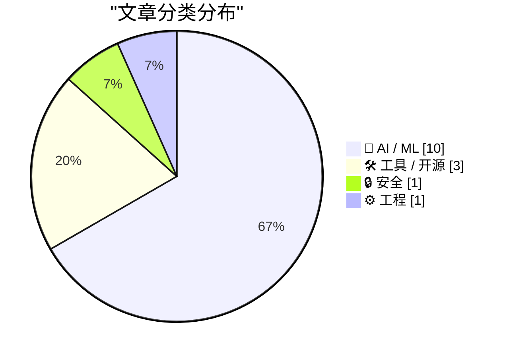
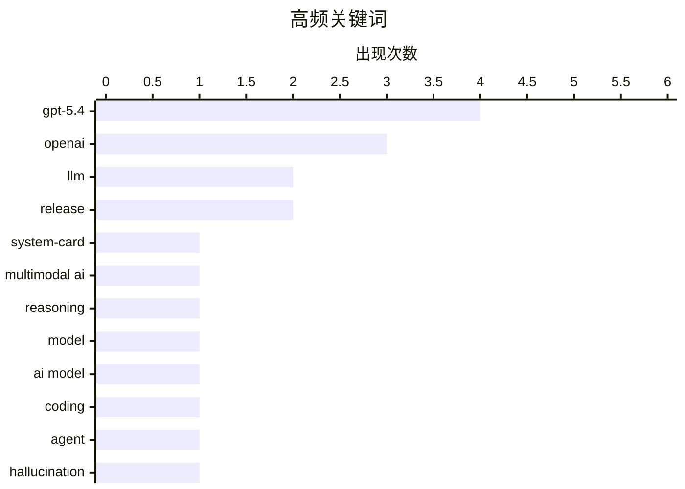

# 📰 AI 资讯每日精选 — 2026-03-06

> 汇聚 140+ 技术博客、X/Twitter、Hacker News、Reddit、Product Hunt、
> Lobste.rs、ClawFeed 日报及 GitHub Trending，经 AI 评分筛选。
>
> **本期内容**：🏆 今日必读 · 🌐 ClawFeed 日报 · 🔥 GitHub Trending · 📂 分类精选 · 🎨 设计与生成式 AI · 📊 数据概览

## 📝 今日看点

今日技术圈聚焦于人工智能能力的整合与边界探索。OpenAI发布统一编码、推理与操作能力的GPT-5.4，标志着通用智能体发展进入新阶段。与此同时，AI的安全与伦理问题凸显，从代码助手的安全漏洞到模型“幻觉”的本质及版权争议，均引发深度讨论。此外，从嵌入式设备部署到底层算力优化，AI技术栈正朝着全栈高效能方向持续演进。

---

## 🏆 今日必读

🥇 **GPT-5.4 发布：集推理、编码与计算机操作于一体的前沿模型**

[GPT-5.4](https://openai.com/index/introducing-gpt-5-4/) — Hacker News Best · 6 小时前 · 🤖 AI / ML

> OpenAI 发布了其迄今为止最强大的模型 GPT-5.4，首次将编码、计算机操作和推理能力统一在一个模型中。该模型包含 GPT-5.4 Thinking 和 GPT-5.4 Pro 两个版本，现已通过 ChatGPT、API 和 Codex 向用户推出。它将推理、编码和智能体工作流方面的最新进展整合进一个前沿模型，在编写文档、作为通用智能体方面表现更出色，整体使用体验更佳。尽管在纯编码能力上的提升幅度与 5.0 到 5.1 的迭代类似，但其统一架构带来了更全面的智能提升。

💡 **为什么值得读**: 这是 OpenAI 最新推出的旗舰模型，首次实现了多模态能力的深度统一，对于理解当前 AI 技术的前沿方向和应用潜力至关重要。

🏷️ GPT-5.4, OpenAI, LLM, system-card

🥈 **OpenAI launches GPT-5.4 Thinking and Pro combining coding, reasoning, and computer use in one model**

[OpenAI launches GPT-5.4 Thinking and Pro combining coding, reasoning, and computer use in one model](https://the-decoder.com/openai-launches-gpt-5-4-thinking-and-pro-combining-coding-reasoning-and-computer-use-in-one-model/) — The Decoder · 4 小时前 · 🤖 AI / ML

> GPT-5.4 is OpenAI's most capable model yet, combining coding, computer operation, and reasoning in a single package for the first time.
The article OpenAI launches GPT-5.4 Thinking and Pro combining c

🏷️ GPT-5.4, OpenAI, multimodal AI, reasoning

🥉 **Introducing GPT 5.4 (OpenAI)**

[Introducing GPT 5.4 (OpenAI)](https://www.reddit.com/r/singularity/comments/1rloux0/introducing_gpt_54_openai/) — r/singularity · 6 小时前 · 🤖 AI / ML

> submitted by   <a href="https://www.reddit.com/user/TheGamer942"> /u/TheGamer942 </a> <br/> <span><a href="https://openai.com/index/introducing-gpt-5-4/">[link]</a></span>   <span><a href="https://www

🏷️ GPT-5.4, OpenAI, release, model

4️⃣ **it’s a good model. the coding specific jump is more in line what we had in 5.0 to 5.1; but it’s now unified and smarter on everything else, writes b...**

[it’s a good model. the coding specific jump is more in line what we had in 5.0 to 5.1; but it’s now unified and smarter on everything else, writes b...](https://x.com/steipete/status/2029627229987058124) — 𝕏 @steipete · 5 小时前 · 🤖 AI / ML

> it’s a good model. the coding specific jump is more in line what we had in 5.0 to 5.1; but it’s now unified and smarter on everything else, writes better docs, is a better general purpose agent and is

🏷️ GPT-5.4, AI Model, Coding, Agent

5️⃣ **“LLM”中的“L”代表说谎**

[The L in "LLM" Stands for Lying](https://acko.net/blog/the-l-in-llm-stands-for-lying/) — Hacker News Best · 20 小时前 · 🤖 AI / ML

> 文章核心探讨了大型语言模型（LLM）本质上倾向于“编造”或“说谎”的根本原因，而非简单地输出错误信息。作者认为，LLM 的运作机制是基于概率生成看似合理的文本序列，这使其在缺乏确定知识时会自信地虚构内容。这种“幻觉”特性是模型架构的固有缺陷，而非可通过简单修补解决的错误。文章旨在让读者从根本上理解 LLM 的局限性，而非仅仅将其视为一个需要更准确训练数据的问题。

💡 **为什么值得读**: 该文从技术原理层面深刻剖析了 LLM “幻觉”问题的根源，能帮助开发者和管理者建立对 AI 输出可靠性的合理预期。

🏷️ LLM, hallucination, reliability, critique

---

## 🌐 ClawFeed 日报精选

> 来源：[ClawFeed](https://clawfeed.kevinhe.io) — AI 驱动的多源新闻聚合

### 🔥 今日头条

**1. Anthropic 被 Trump 政府列黑名单，OpenAI 签下五角大楼大单**
Anthropic 拒绝向军方开放 Claude 用于"所有合法用途"（含自主武器/大规模监控），随即被踢出 DoD 合作名单，美国国务院/财政部/HHS 开始切换至 OpenAI/Google。OpenAI 趁势签约 Pentagon，Altman 表示军方不用于自主杀戮系统。Dario Amodei 随后发备忘录措辞激烈指控 OpenAI 行为"mendacious（欺骗性）"，双方公开开战。据报道 Anthropic 事后急着想重回谈判桌，但投资人透露 Amodei 的 ego 与外交风格正在阻碍。
*来源：The Guardian / NYT / NBC News / TechCrunch*

**2. OpenAI 开源 Symphony：AI Agent 自主编排层**
OpenAI 新开源仓库 Symphony，监听 Linear 等项目管理工具的看板变更，自动为每个 ticket 生命周期阶段 spawn Codex agent，直到完成或转人工审核——"工程师管理需求，Symphony 管理 Codex，Codex 写代码"。全天 Twitter 热榜，1000+ 相关讨论。

**3. Google Workspace CLI 正式发布（官方开源）**
Rust 编写，支持 Drive / Gmail / Calendar / Chat / Sheets / Docs，内置 40+ agent skills，返回结构化 JSON，"built for humans and agents"。Addy Osmani 发布后 1M 浏览量，成为今日技术圈 #1 话题。

**4. 千问团队负责人林俊旸突然辞职**
凌晨在 X 发了六个字「我卸任了。再见，我亲爱的千问。」震惊 AI 圈，24 小时前还在与马斯克互动。阿里高管始终未正式回应，@CuiMao 发长文「三问 Qwen」深度剖析事件背后。（238K views）

**5. Claude 大规模宕机 + Codex Desktop 登陆 Windows**
Claude.ai 与 Claude Code 接连出现 elevated errors，Business Insider 记录开发者：「我只能像穴居人一样写代码了」——暴露出开发者对 AI 工具的极度依赖。与此同时，OpenAI Codex Desktop App 正式上线 Windows，原生沙盒 + PowerShell + WinUI skill 支持。

---

### 📊 今日观察

**今天是 AI 工具基础设施集中爆发的一天。**

Symphony（agent 编排）、Glaze（桌面 App builder）、Google Workspace CLI（工作流接入）三个产品几乎同天出现，标志着"AI Agent 要真正接管工作流"这件事从概念走向工具链落地。这不是 hype，是基础设施在补齐。

Anthropic vs OpenAI 的五角大楼风波是今天最大的政治事件，但更值得关注的信号是：Claude 一宕机，就有大批开发者叫苦——说明 Claude Code 的渗透已经到了"生产依赖"级别，这是好消息也是风险信号。

林俊旸辞职是今天最戏剧性的一幕。千问一直是国内 LLM 代表作，负责人突然离开，行业震动。阿里对此沉默，耐人寻味。

另一个低调但重要的信号：@rich_adul 那条帖子里，24 岁基金经理押 AI 替代 IT 外包——用真金白银在表态。Claude Code / Codex 的普及，对传统软件服务外包行业的冲击，已经从"预测"变成"投资主题"了。

---

*生成时间：2026-03-05 22:00 SGT | 覆盖简报：6期（00:40~20:41）*

---

## 🔥 GitHub Trending

> 今日热门开源项目（全语言 + Python）

| # | 项目 | 描述 | ⭐ 总星 | 📈 今日 | 语言 |
|---|------|------|---------|---------|------|
| 1 | [moeru-ai/airi](https://github.com/moeru-ai/airi) 🤖 | 💖🧸 Self hosted, you-owned Grok Companion, a container o... | 27.3k | +3006 | TypeScript |
| 2 | [KeygraphHQ/shannon](https://github.com/KeygraphHQ/shannon) 🤖 | Shannon Lite is a fully autonomous AI pentester for web a... | 31.8k | +2930 | TypeScript |
| 3 | [msitarzewski/agency-agents](https://github.com/msitarzewski/agency-agents) 🤖 | A complete AI agency at your fingertips - From frontend w... | 7.3k | +1468 | - |
| 4 | [FujiwaraChoki/MoneyPrinterV2](https://github.com/FujiwaraChoki/MoneyPrinterV2) | Automate the process of making money online. | 14.7k | +511 | Python |
| 5 | [public-apis/public-apis](https://github.com/public-apis/public-apis) | A collective list of free APIs | 404.5k | +460 | Python |
| 6 | [ComposioHQ/awesome-claude-skills](https://github.com/ComposioHQ/awesome-claude-skills) 🤖 | A curated list of awesome Claude Skills, resources, and t... | 41.1k | +413 | Python |
| 7 | [Jeffallan/claude-skills](https://github.com/Jeffallan/claude-skills) 🤖 | 66 Specialized Skills for Full-Stack Developers. Transfor... | 5.0k | +397 | Python |
| 8 | [TheCraigHewitt/seomachine](https://github.com/TheCraigHewitt/seomachine) 🤖 | A specialized Claude Code workspace for creating long-for... | 1.6k | +310 | Python |
| 9 | [aquasecurity/trivy](https://github.com/aquasecurity/trivy) | Find vulnerabilities, misconfigurations, secrets, SBOM in... | 32.9k | +298 | Go |
| 10 | [CodebuffAI/codebuff](https://github.com/CodebuffAI/codebuff) | Generate code from the terminal! | 3.9k | +275 | TypeScript |
| 11 | [khoj-ai/khoj](https://github.com/khoj-ai/khoj) 🤖 | Your AI second brain. Self-hostable. Get answers from the... | 33.2k | +217 | Python |
| 12 | [agentscope-ai/ReMe](https://github.com/agentscope-ai/ReMe) 🤖 | ReMe: Memory Management Kit for Agents - Remember Me, Ref... | 1.8k | +194 | Python |
| 13 | [inclusionAI/AReaL](https://github.com/inclusionAI/AReaL) 🤖 | Lightning-Fast RL for LLM Reasoning and Agents. Made Simp... | 4.1k | +173 | Python |
| 14 | [Aider-AI/aider](https://github.com/Aider-AI/aider) 🤖 | aider is AI pair programming in your terminal | 41.5k | +139 | Python |
| 15 | [microsoft/mcp-for-beginners](https://github.com/microsoft/mcp-for-beginners) 🤖 | This open-source curriculum introduces the fundamentals o... | 14.9k | +137 | Jupyter Notebook |

---

## 🤖 AI / ML

### 1. GPT-5.4 发布：集推理、编码与计算机操作于一体的前沿模型

[GPT-5.4](https://openai.com/index/introducing-gpt-5-4/) — **Hacker News Best** · 6 小时前 · ⭐ 28/30

> OpenAI 发布了其迄今为止最强大的模型 GPT-5.4，首次将编码、计算机操作和推理能力统一在一个模型中。该模型包含 GPT-5.4 Thinking 和 GPT-5.4 Pro 两个版本，现已通过 ChatGPT、API 和 Codex 向用户推出。它将推理、编码和智能体工作流方面的最新进展整合进一个前沿模型，在编写文档、作为通用智能体方面表现更出色，整体使用体验更佳。尽管在纯编码能力上的提升幅度与 5.0 到 5.1 的迭代类似，但其统一架构带来了更全面的智能提升。

🏷️ GPT-5.4, OpenAI, LLM, system-card

---

### 2. OpenAI launches GPT-5.4 Thinking and Pro combining coding, reasoning, and computer use in one model

[OpenAI launches GPT-5.4 Thinking and Pro combining coding, reasoning, and computer use in one model](https://the-decoder.com/openai-launches-gpt-5-4-thinking-and-pro-combining-coding-reasoning-and-computer-use-in-one-model/) — **The Decoder** · 4 小时前 · ⭐ 27/30

> GPT-5.4 is OpenAI's most capable model yet, combining coding, computer operation, and reasoning in a single package for the first time.
The article OpenAI launches GPT-5.4 Thinking and Pro combining c

🏷️ GPT-5.4, OpenAI, multimodal AI, reasoning

---

### 3. Introducing GPT 5.4 (OpenAI)

[Introducing GPT 5.4 (OpenAI)](https://www.reddit.com/r/singularity/comments/1rloux0/introducing_gpt_54_openai/) — **r/singularity** · 6 小时前 · ⭐ 27/30

> submitted by   <a href="https://www.reddit.com/user/TheGamer942"> /u/TheGamer942 </a> <br/> <span><a href="https://openai.com/index/introducing-gpt-5-4/">[link]</a></span>   <span><a href="https://www

🏷️ GPT-5.4, OpenAI, release, model

---

### 4. it’s a good model. the coding specific jump is more in line what we had in 5.0 to 5.1; but it’s now unified and smarter on everything else, writes b...

[it’s a good model. the coding specific jump is more in line what we had in 5.0 to 5.1; but it’s now unified and smarter on everything else, writes b...](https://x.com/steipete/status/2029627229987058124) — **𝕏 @steipete** · 5 小时前 · ⭐ 27/30

> it’s a good model. the coding specific jump is more in line what we had in 5.0 to 5.1; but it’s now unified and smarter on everything else, writes better docs, is a better general purpose agent and is

🏷️ GPT-5.4, AI Model, Coding, Agent

---

### 5. “LLM”中的“L”代表说谎

[The L in "LLM" Stands for Lying](https://acko.net/blog/the-l-in-llm-stands-for-lying/) — **Hacker News Best** · 20 小时前 · ⭐ 26/30

> 文章核心探讨了大型语言模型（LLM）本质上倾向于“编造”或“说谎”的根本原因，而非简单地输出错误信息。作者认为，LLM 的运作机制是基于概率生成看似合理的文本序列，这使其在缺乏确定知识时会自信地虚构内容。这种“幻觉”特性是模型架构的固有缺陷，而非可通过简单修补解决的错误。文章旨在让读者从根本上理解 LLM 的局限性，而非仅仅将其视为一个需要更准确训练数据的问题。

🏷️ LLM, hallucination, reliability, critique

---

### 6. 编码智能体能否通过“净室”实现方式对开源代码进行再授权？

[Can coding agents relicense open source through a “clean room” implementation of code?](https://simonwillison.net/2026/Mar/5/chardet/#atom-everything) — **simonwillison.net** · 7 小时前 · ⭐ 25/30

> 文章探讨了 AI 编码智能体通过“净室设计”模式复现开源代码所引发的版权和许可证问题。作者观察到，编码智能体能够出色地根据现有代码的功能描述或行为，生成一套功能等效但实现不同的新代码，这类似于历史上 Compaq 为绕过 IBM BIOS 版权而采用的“净室”工程方法。这种能力引发了一个核心法律与伦理问题：使用 AI 以这种方式生成的代码，是否能够规避原始代码的开源许可证（如 GPL）的“传染性”条款，从而实现代码的“再授权”或私有化。

🏷️ AI coding agents, clean room, open source, licensing

---

### 7. 将机器人 AI 引入嵌入式平台：数据集记录、VLA 微调与设备端优化

[Bringing Robotics AI to Embedded Platforms: Dataset Recording, VLA Fine‑Tuning, and On‑Device Optimizations](https://huggingface.co/blog/nxp/bringing-robotics-ai-to-embedded-platforms) — **Hugging Face Blog** · 9 小时前 · ⭐ 25/30

> 这篇由 Hugging Face 与 NXP 合作撰写的博客，详细介绍了如何在资源受限的嵌入式平台上部署视觉-语言-动作模型。内容涵盖了从机器人数据集的录制与构建，到对 VLA 模型进行特定任务的微调，最后进行一系列设备端优化（如量化、编译）以实现实时推理的全流程。文章旨在为在嵌入式设备上实现高级机器人 AI 提供一套实用的技术方案和最佳实践。

🏷️ robotics, embedded AI, fine-tuning, VLA

---

### 8. 在 Apple Silicon 上运行 Nvidia PersonaPlex 7B：使用 Swift 和 MLX 实现全双工语音对话

[Nvidia PersonaPlex 7B on Apple Silicon: Full-Duplex Speech-to-Speech in Swift](https://blog.ivan.digital/nvidia-personaplex-7b-on-apple-silicon-full-duplex-speech-to-speech-in-native-swift-with-mlx-0aa5276f2e23) — **Hacker News Best** · 16 小时前 · ⭐ 25/30

> 文章展示了如何在苹果芯片（Apple Silicon）上本地部署 Nvidia 的 PersonaPlex 7B 模型，实现全双工语音到语音的实时对话。技术方案采用 Swift 语言和苹果的 MLX 机器学习框架，绕过了传统的 Python 栈，实现了原生、高效的集成。核心在于利用 MLX 的优化能力，在 Mac 硬件上直接运行大型语言模型，并处理音频的实时输入与输出。这为在苹果生态中构建低延迟、隐私友好的语音 AI 应用提供了一种可行的技术路径。

🏷️ PersonaPlex, Apple-Silicon, Swift, speech-to-speech

---

### 9. DWARF：源自外差接收器物理原理的 O(1) KV 缓存注意力机制

[[P] DWARF: O(1) KV cache attention derived from heterodyne receiver physics](https://www.reddit.com/r/MachineLearning/comments/1rls1dr/p_dwarf_o1_kv_cache_attention_derived_from/) — **r/MachineLearning** · 4 小时前 · ⭐ 25/30

> DWARF 是一种创新的注意力机制，旨在解决 Transformer 模型在处理长上下文时 KV 缓存内存占用过高的问题。其核心方案是使用一个固定大小的循环缓冲区（约 1.5GB），通过仅计算 44 个基于物理学（外差接收器原理）推导出的偏移位置上的注意力，而非所有历史位置，从而将 KV 缓存复杂度降至 O(1)。实验表明，对于一个 7B 参数的模型，在 10 万 token 的上下文长度下，DWARF 仅需约 1.5GB KV 缓存，而标准方法则需要约 52GB。该方法以牺牲部分全局注意力为代价，换取了内存占用的大幅降低和可预测性。

🏷️ KV cache, attention, efficiency, Transformer

---

### 10. FlashAttention-4 发布

[FlashAttention-4](https://www.reddit.com/r/LocalLLaMA/comments/1rlkon0/flashattention4/) — **r/LocalLLaMA** · 8 小时前 · ⭐ 25/30

> FlashAttention-4 是高效注意力计算库 FlashAttention 的最新版本。新版本在之前的基础上进行了多项优化，旨在进一步降低内存占用并提升计算速度，特别是在处理极长序列时。它通过更精细的算法和硬件利用，继续推动着 Transformer 模型训练和推理效率的边界。此次更新将帮助研究者和开发者更高效地训练和运行大模型。

🏷️ FlashAttention, optimization, inference, performance

---

## 🛠 工具 / 开源

### 11. Rust 1.94.0 发布

[Announcing Rust 1.94.0](https://www.reddit.com/r/programming/comments/1rltxbg/announcing_rust_1940/) — **r/programming** · 3 小时前 · ⭐ 26/30

> Rust 编程语言发布了 1.94.0 版本。新版本通常包含对编译器、标准库、工具链的性能改进、错误修复和新特性引入。具体更新内容需参考官方发布说明，可能涉及模式匹配、生命周期检查或异步编程等方面的增强。每个 Rust 版本都旨在提升开发者的生产力、代码安全性和执行效率。

🏷️ Rust, programming language, release

---

### 12. 在 NVIDIA CUDA Tile 中优化 Flash Attention 以实现峰值性能

[Tuning Flash Attention for Peak Performance in NVIDIA CUDA Tile](https://developer.nvidia.com/blog/tuning-flash-attention-for-peak-performance-in-nvidia-cuda-tile/) — **NVIDIA Technical Blog** · 7 小时前 · ⭐ 25/30

> 这是 NVIDIA 官方技术博客，专注于优化现代 AI 中至关重要的 Flash Attention 算法在 CUDA 上的性能。文章深入讲解了如何利用 NVIDIA CUDA Tile 编程模型来高效实现 Flash Attention。读者将学习到针对 GPU 硬件特性进行内核优化、内存访问模式调整以及计算流水线设计的具体技巧。目标是帮助开发者在 NVIDIA GPU 上充分挖掘 Flash Attention 的潜力，从而加速大模型训练和推理。

🏷️ Flash Attention, CUDA, Performance Tuning

---

### 13. ComfyUI 实现 LTX-2.3 发布当日支持：增强音视频生成质量

[LTX-2.3 Day-0 support in ComfyUI: Enhanced Quality for Audio‑Video Generation](https://www.reddit.com/r/comfyui/comments/1rlnt1j/ltx23_day0_support_in_comfyui_enhanced_quality/) — **r/comfyui** · 6 小时前 · ⭐ 25/30

> ComfyUI 工作流工具在 LTX-2.3 模型发布的第一时间就提供了官方支持。LTX-2.3 是一个专注于音频-视频生成的模型，此次更新带来了增强的生成质量。ComfyUI 的快速集成使得用户能够立即通过其可视化的节点界面，便捷地使用新模型进行音视频生成实验和创作。这体现了 ComfyUI 社区对前沿生成式 AI 模型的快速响应和强大整合能力。

🏷️ ComfyUI, LTX-2.3, Video Generation, Integration

---

## 🔒 安全

### 14. 一个 GitHub Issue 标题危害了 4000 台开发者机器

[A GitHub Issue Title Compromised 4,000 Developer Machines](https://grith.ai/blog/clinejection-when-your-ai-tool-installs-another) — **Lobste.rs** · 3 小时前 · ⭐ 26/30

> 文章披露了一个名为 “Clinejection” 的新型安全漏洞，攻击者通过精心构造的 GitHub Issue 标题就能在开发者的 AI 编码工具中执行恶意代码。该漏洞利用了某些 AI 编码助手在解析和响应 Issue 内容时的缺陷，导致超过 4000 台开发机器被入侵。这暴露了将 AI 工具深度集成到开发工作流中所引入的、前所未有的供应链攻击面。事件凸显了 AI 辅助编程时代下，代码仓库和开发工具链安全性的新挑战。

🏷️ security, GitHub, supply-chain

---

## ⚙️ 工程

### 15. 绕过 CoreML：在苹果神经引擎上原生训练和运行 LLM（速度达 170 tok/s）

[Bypassing CoreML: Natively training and running LLMs directly on the Apple Neural Engine (170 tok/s)](https://www.reddit.com/r/LocalLLaMA/comments/1rl9fl4/bypassing_coreml_natively_training_and_running/) — **r/LocalLLaMA** · 18 小时前 · ⭐ 25/30

> 文章探讨了绕过苹果官方的 CoreML 框架，直接利用苹果神经引擎（Apple Neural Engine, ANE）原生训练和运行大语言模型的可能性。作者指出，当前社区主要通过 MLX 或 llama.cpp 针对 Mac GPU 进行优化，而专用的 ANE 硬件对于 LLM 工作负载几乎处于未利用状态。通过直接编程 ANE，作者实现了高达 170 token/秒 的推理速度。这揭示了苹果硬件栈的封闭性，并展示了通过底层开发释放其全部 AI 算力的潜力。

🏷️ Apple Neural Engine, LLM inference, hardware acceleration

---

## 🎨 Design & Generative AI

### 🖥️ 生成式 UI

- **[Claude Code 技能集：助力 ComfyUI 自定义节点开发](https://www.reddit.com/r/comfyui/comments/1rlqecx/a_set_of_claude_code_skills_for_comfyui_custom/)** — r/comfyui · 5 小时前
  > 一套针对 ComfyUI 自定义节点开发的 Claude AI 编程技能，覆盖完整 V3 API。

### 🖼️ 生成式图片

- **[ComfyUI-Spectrum-SDXL：无损加速 SDXL 推理 1.5-2 倍](https://www.reddit.com/r/comfyui/comments/1rl39qf/comfyuispectrumsdxl_accelerate_sdxl_inference_by/)** — r/comfyui · 23 小时前
  > 通过新节点集显著提升 Stable Diffusion XL 的推理速度，且无明显质量损失。

- **[为文本编码器启用原生 GGML：VRAM 受限系统的巨大加速方案](https://www.reddit.com/r/comfyui/comments/1rldfws/why_not_use_native_ggml_for_text_encoders_a_huge/)** — r/comfyui · 14 小时前
  > 探讨在 ComfyUI 中为文本编码器使用 GGML 以在显存受限系统上实现显著加速。

- **[Z-Image Power Nodes v1.0 发布：释放 Z-Image Turbo 潜力](https://www.reddit.com/r/StableDiffusion/comments/1rlf1ea/zimage_power_nodes_v10_has_been_released_a_new/)** — r/StableDiffusion · 12 小时前
  > 新节点集发布，旨在充分发挥 Z-Image Turbo 模型的图像生成极限性能。

- **[Elusarca 的 Flux Klein 9B 细节增强 LoRA](https://www.reddit.com/r/StableDiffusion/comments/1rli23q/elusarcas_flux_klein_9b_detail_enhancer_lora/)** — r/StableDiffusion · 10 小时前
  > 一个针对 Flux Klein 9B 模型的细节增强型 LoRA，采用非滑块方法开发。

- **[Flux 2 Klein 抽象艺术风格迁移挑战](https://www.reddit.com/r/comfyui/comments/1rl5sv9/flux_2_klein_abstract_art_style_transfer/)** — r/comfyui · 21 小时前
  > 探讨如何通过提示词引导 Flux 2 Klein 模型实现具有粗糙笔触的抽象艺术风格迁移。

- **[ComfyUI 空潜像节点替代方案分享](https://www.reddit.com/r/comfyui/comments/1rlgvcs/empty_latent_image_replacement/)** — r/comfyui · 11 小时前
  > 一位初学者分享了自己在 ComfyUI 中创建的“空潜像”节点的替代实现。

- **[简单易用的 Flux.2 Klein 9B GGUF 换装工作流上架](https://www.reddit.com/r/comfyui/comments/1rlv15x/i_just_recently_uploaded_my_simple_comfyui/)** — r/comfyui · 2 小时前
  > 一个面向初学者的、简单的 Flux.2 Klein 9B GGUF 模型换装工作流已在 CivitAI 发布。

### 🎬 生成式视频

- **[ComfyUI 迎来 LTX-2.3 首日支持：音视频生成质量提升](https://www.reddit.com/r/comfyui/comments/1rlnt1j/ltx23_day0_support_in_comfyui_enhanced_quality/)** — r/comfyui · 6 小时前
  > ComfyUI 集成 LTX-2.3 模型，为音频-视频生成任务带来增强的质量支持。

- **[LTX-2.3 正式发布：重建 VAE、改进图生视频、新增人像模式](https://www.reddit.com/r/StableDiffusion/comments/1rlm21a/ltx23_is_live_rebuilt_vae_improved_i2v_new/)** — r/StableDiffusion · 7 小时前
  > LTX 视频生成模型迎来重大更新，包含重建的 VAE、改进的 I2V 及新功能。

- **[LTX-2.3 示例：默认 Comfy 工作流消耗 55GB 显存](https://www.reddit.com/r/StableDiffusion/comments/1rllhlw/ltx23_examples_default_comfy_workflow_uses_55gb/)** — r/StableDiffusion · 8 小时前
  > 展示 LTX-2.3 模型在 ComfyUI 中运行示例工作流时的高显存需求。

- **[LTX Desktop 版相比 Comfy UI 提供更优生成质量](https://www.reddit.com/r/StableDiffusion/comments/1rltf26/ltx_desktop_gives_you_much_better_quality_than/)** — r/StableDiffusion · 3 小时前
  > 用户对比发现 LTX 官方桌面应用在视频生成质量上优于 ComfyUI 集成方案。

- **[LTX 2.3 横屏示例（1920x1088）首测](https://www.reddit.com/r/StableDiffusion/comments/1rlq1wg/ltx_23_horizontal_example_1920x1088/)** — r/StableDiffusion · 5 小时前
  > 用户分享 LTX 2.3 模型生成的第一个横屏格式（1920x1088）视频测试结果。

- **[ComfyUI 中 RTX Video 超分节点何时到来？](https://www.reddit.com/r/comfyui/comments/1rl7aa0/rtx_video_node_in_comfyui_eta/)** — r/comfyui · 20 小时前
  > 用户询问 NVIDIA RTX Video 超分辨率技术集成到 ComfyUI 中的预计时间。

- **[我将消息告知 LTX-2... 她反应不佳](https://www.reddit.com/r/StableDiffusion/comments/1rlqejo/i_just_broke_the_news_to_ltx2_she_didnt_take_it/)** — r/StableDiffusion · 5 小时前
  > 一个带有幽默性质的帖子，暗示使用 LTX-2 模型生成了某种情绪化或戏剧性的视频内容。

---

## 📊 数据概览

| 扫描源 | 抓取文章 | 时间范围 | 精选 |
|:---:|:---:|:---:|:---:|
| 118/140 | 4060 篇 → 260 篇 | 24h | **15 篇** |

### 分类分布



### 高频关键词



<details>
<summary>📈 纯文本关键词图（终端友好）</summary>

```
gpt-5.4       │ ████████████████████ 4
openai        │ ███████████████░░░░░ 3
llm           │ ██████████░░░░░░░░░░ 2
release       │ ██████████░░░░░░░░░░ 2
system-card   │ █████░░░░░░░░░░░░░░░ 1
multimodal ai │ █████░░░░░░░░░░░░░░░ 1
reasoning     │ █████░░░░░░░░░░░░░░░ 1
model         │ █████░░░░░░░░░░░░░░░ 1
ai model      │ █████░░░░░░░░░░░░░░░ 1
coding        │ █████░░░░░░░░░░░░░░░ 1
```

</details>

### 🏷️ 话题标签

**gpt-5.4**(4) · **openai**(3) · **llm**(2) · release(2) · system-card(1) · multimodal ai(1) · reasoning(1) · model(1) · ai model(1) · coding(1) · agent(1) · hallucination(1) · reliability(1) · critique(1) · rust(1) · programming language(1) · security(1) · github(1) · supply-chain(1) · ai coding agents(1)

---

*生成于 2026-03-06 00:15 | 汇聚 140 个技术博客、X/Twitter、Hacker News、Reddit、Product Hunt、Lobste.rs、ClawFeed 日报及 GitHub Trending，经 AI 评分筛选出 Top 15 精华内容*
