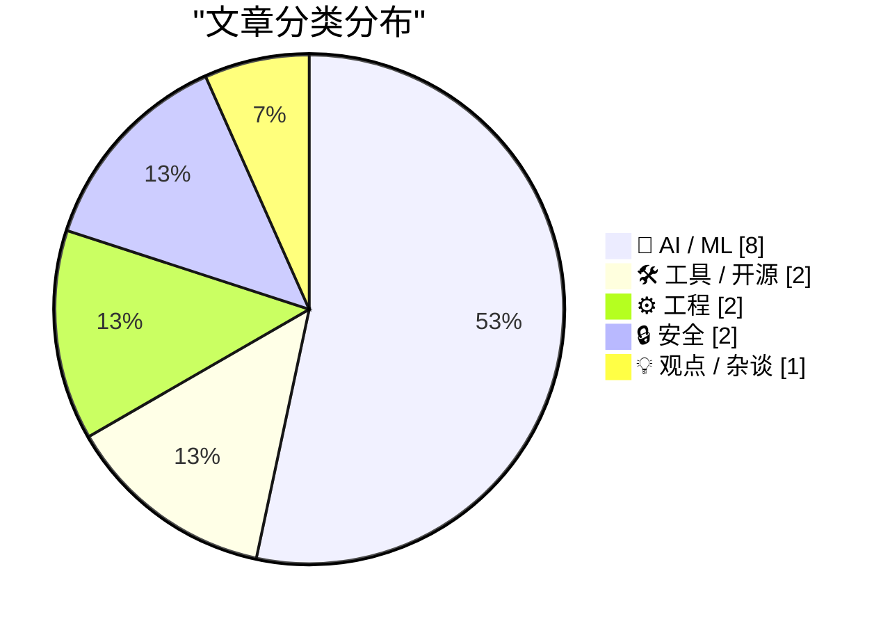
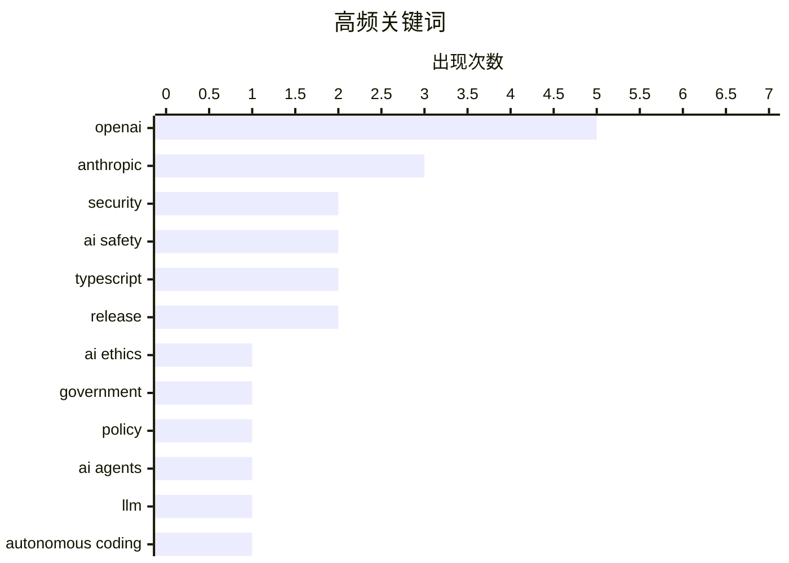

# 📰 AI 资讯每日精选 — 2026-03-07

> 汇聚 140+ 技术博客、X/Twitter、Hacker News、Reddit、Product Hunt、
> Lobste.rs、ClawFeed 日报及 GitHub Trending，经 AI 评分筛选。
>
> **本期内容**：🏆 今日必读 · 🌐 ClawFeed 日报 · 🔥 GitHub Trending · 📂 分类精选 · 🎨 设计与生成式 AI · 📊 数据概览

## 📝 今日看点

今日技术圈聚焦于AI能力的实战化与商业化浪潮。一方面，AI智能体正从代码生成迈向自主验证与安全检测，推动开发流程自动化进入新阶段。另一方面，顶尖AI公司与政府及军事部门的合作引发持续争议，凸显出技术商品化背后的地缘政治与伦理博弈。同时，主流编程语言与工具的重大版本更新，也提示着基础设施层正为迎接更智能的编程范式做准备。

---

## 🏆 今日必读

🥇 **Anthropic 与五角大楼**

[Anthropic and the Pentagon](https://simonwillison.net/2026/Mar/6/anthropic-and-the-pentagon/#atom-everything) — simonwillison.net · 6 小时前 · 💡 观点 / 杂谈

> 文章深入探讨了近期五角大楼与 OpenAI、Anthropic 等 AI 公司的合同争议。核心观点认为，顶级 AI 模型性能日益趋同，已逐渐商品化，彼此间差异甚微。作者指出，这种背景下，公司与政府合作的选择更多是基于商业策略和地缘政治考量，而非技术优势。结论是，AI 领域的竞争焦点正从纯粹的技术竞赛转向商业与政治联盟的构建。

💡 **为什么值得读**: 该文提供了对 AI 巨头与政府合作背后商业与地缘政治逻辑的深刻洞察，超越了单纯的技术讨论。

🏷️ AI ethics, government, Anthropic, policy

🥈 **智能体驱动的手动测试**

[Agentic manual testing](https://simonwillison.net/guides/agentic-engineering-patterns/agentic-manual-testing/#atom-everything) — simonwillison.net · 18 小时前 · 🤖 AI / ML

> 文章定义了编码智能体的核心特征：能够执行自己编写的代码，这使其比仅输出代码的 LLM 更有用。核心原则是永远不要假设 LLM 生成的代码能工作，必须通过执行来验证。智能体通过执行代码来确认其功能，并能根据结果进行迭代修正。这构成了‘智能体工程模式’中一种基础且关键的模式。

💡 **为什么值得读**: 为希望利用 AI 智能体提升代码可靠性的开发者提供了一个清晰、可操作的核心实践原则。

🏷️ AI agents, LLM, autonomous coding, software development

🥉 **OpenAI 推出 Codex Security，一款旨在检测软件项目漏洞的 AI 智能体**

[OpenAI launches Codex Security, an AI agent designed to detect vulnerabilities in software projects](https://the-decoder.com/openai-launches-codex-security-an-ai-agent-designed-to-detect-vulnerabilities-in-software-projects/) — The Decoder · 4 小时前 · 🤖 AI / ML

> OpenAI 发布了名为 Codex Security 的新 AI 安全智能体，用于自动搜寻代码中的漏洞。该智能体已在 OpenSSH 和 Chromium 这类知名开源项目中发现了安全缺陷。这表明 AI 驱动的自动化代码审计工具已具备在复杂、真实的代码库中发现问题的能力。

💡 **为什么值得读**: 展示了 AI 在提升软件安全实践方面的最新应用进展，对安全工程师和开发者具有直接参考价值。

🏷️ OpenAI, security, code analysis, AI agent

4️⃣ **与战争部的合作现状**

[Where things stand with the Department of War](https://www.anthropic.com/news/where-stand-department-war) — Hacker News Best · 23 小时前 · 🤖 AI / ML

> 这是 Anthropic 官方发布的一份声明，阐述了该公司与美国国防部（文中称“战争部”）合作的当前立场与情况。声明很可能涉及合作的性质、范围、遵循的伦理准则以及公司的考量。鉴于其在 Hacker News 上获得 606 分和 748 条评论的高关注度，此话题引发了技术社区的广泛讨论与争议。

💡 **为什么值得读**: 作为涉事公司的第一手声明，是理解 AI 伦理与政府合作这一热点争议的关键文件。

🏷️ AI safety, governance, Anthropic

5️⃣ **TypeScript 6.0 RC 版本发布**

[Announcing TypeScript 6.0 RC](https://www.reddit.com/r/programming/comments/1rmnpz5/announcing_typescript_60_rc/) — r/programming · 4 小时前 · 🛠 工具 / 开源

> 微软 TypeScript 团队宣布了 TypeScript 6.0 的候选发布版本。RC 版本的推出意味着主要功能已冻结，进入发布前的最终测试和修复阶段。开发者可以开始试用此版本，为正式版的升级做准备。

💡 **为什么值得读**: 对于依赖 TypeScript 的大型项目和技术团队，提前了解新版本特性对规划技术升级至关重要。

🏷️ TypeScript, release, programming language

---

## 🌐 ClawFeed 日报精选

> 来源：[ClawFeed](https://clawfeed.kevinhe.io) — AI 驱动的多源新闻聚合

### 🔥 今日头条

1. **Anthropic 被五角大楼列为"供应链风险"** — 史无前例，美国企业首获此称号。起因是 Anthropic 试图限制 Claude 在军事用途的使用条件，与 DoD 谈判破裂。OpenAI 趁机签下 Pentagon AI 合同，Altman 事后承认时机"显得机会主义且草率"。Amodei 就内部 Slack 长文措辞公开道歉。讽刺的是 DoD 仍在用 Claude 执行伊朗相关任务，且双方已回到谈判桌。Claude 下载量因此激增，ChatGPT 却遭遇卸载潮。（NYT / CNBC / TechCrunch）

2. **OpenAI 发布 GPT-5.4 + 金融服务工具套件** — 新旗舰模型含 Pro + Thinking 两版本，1M token 上下文窗口（GPT-5.3 的 2.5 倍），首次疑似使用更大预训练基础模型（非纯 RL），配套金融服务工具直接对标 Anthropic，且恰好在 Anthropic 五角大楼危机期间发布，时机微妙。（Bloomberg / TechCrunch）

3. **OKX × ICE 战略投资** — OKX 以 $250 亿估值引入纽交所母公司 Intercontinental Exchange (ICE) 战略投资，甚至让出董事会席位。Crypto × 传统金融正式联姻；同日李林（前火币联创）、杜均相继宣布回归创业，目标"合规机构交易所"。

4. **Cursor 推出 Automations（Always-On AI Agents）** — 开发任务自动持续运行，仅在需要时召唤人类接手。社区直评："Cursor 发布了自己的 OpenClaw 版本"，Twitter trending 4600+ posts。

5. **DeepSeek V4 发布** — 2026 年 3 月初上线，号称史上最激进开源权重模型，95% 性能只要 5% 成本，与 Qwen3.5（4B/9B 模型）共同宣示开源阵营对闭源前沿的持续追击。

---

### 📰 精选 Top 10

1. **@servasyy_ai** — 「呕心沥血」OpenClaw Agent System Prompt 9 层架构详解（v2.1），257K views，599 likes，本日 Feed 人气最高技术帖。龙虾社区疯传。
   https://x.com/servasyy_ai/status/2029489020208848966

2. **@addyosmani** — 发布 Google Workspace CLI（gws），为人类和 AI agents 而建，40+ agent skills，覆盖 Drive/Gmail/Calendar 所有 API，开源即用，**4.7M 浏览**🔥
   https://x.com/addyosmani/status/2029372736267805081

3. **@op7418（歸藏）** — "妈的终于搞定了"，发布 Claude Code → OpenClaw 一键配置 Skill，支持飞书/Telegram/Discord，小白也能上手。719 likes / 1105 bookmarks / 95K views。
   https://x.com/op7418/status/2029563490193875202

4. **@nbblock** — 朋友在深圳拍到的线下 OpenClaw 装机现场，AI 时代"地推"名场面。**276K views**，直观展示 OpenClaw 渗透速度。
   https://x.com/nbblock/status/2029806172287685070

5. **@turingou（郭宇）** — 第三方 LLM API 造假论文被实锤！17 个代理 API 审计，46% 指纹测试不通过，声称 GPT-5/Gemini-2.5 实际跑的是 GLM-4，医疗基准准确率从 83% 暴跌到 37%，影响 187 篇学术论文、近 6 万 GitHub Star。56K views。
   https://x.com/turingou/status/2029666079019241591

6. **@AYi_AInotes** — Anthropic 劳动力报告颠覆认知：大家以为 AI 先淘汰低收入体力活，高危的恰恰是程序员、金融分析师、客服（75% 日常任务落在"自动化窗口"内）。233K views。
   https://x.com/AYi_AInotes/status/2029782026350735761

7. **@frxiaobei（凡人小北）** — "这个仓库值一个亿"：Cursor/Claude Code/Devin/Windsurf/v0 等 30+ AI 产品 System Prompt 全被扒出，30000 行，x1xhlol/system-prompts-and-models-of-ai-tools，0 元获取。372 likes。
   https://x.com/frxiaobei/status/2029561950322168284

8. **@JulienBek** — 发表 Article《Services: The New Software》：下一个万亿美元公司是"伪装成服务公司的软件公司"。462 likes / 73K views，引发 AI 工具创始人广泛讨论。
   https://x.com/JulienBek/status/2029680516568600933

9. **@Jacobsklug** — 用 OpenClaw agents 运营整家公司只要 $400/月：核心是 Opus 4.6 的 Jarvis 大脑，自动路由任务到各 sub-agent，其余跑 GLM/Higgs 等便宜模型。967 likes / 78K views。
   https://x.com/Jacobsklug/status/2029550513747112377

10. **@paulg** — 发了新文章《The Brand Age》，一句话没说，297K 浏览，推文下几百条讨论。值得直接读原文：paulgraham.com/brandage.html
    https://x.com/paulg/status/2029612393660133547

---

### 📊 今日观察

今天是 2026 年以来信息密度最高的一天之一。核心主线有三条：

**① AI 军事化的政治博弈正式升温。** Anthropic 被五角大楼打上"供应链风险"标签，OpenAI 借势签约，这是 AI 公司价值观与国家安全利益第一次正面碰撞并产生实质后果。谁能"既保价值观又拿政府合同"将成为未来 12 个月的核心命题。

**② AI Agent 进入规模化落地阶段。** Cursor Automations、OpenClaw 深圳装机地推、$400/月多 agent 公司、Daydreams Taskmarket……这不再是 demo，是真实在跑的系统。Google Workspace CLI 4.7M 浏览说明开发者已准备好把 AI 接入日常工作流。

**③ 开源 vs 闭源的拉锯战继续。** DeepSeek V4、Qwen3.5 持续压缩性能差距，第三方 LLM API 造假丑闻进一步动摇闭源模型的可信度。"你以为在用 GPT-5，实际后台跑的是 GLM-4"——这个信任危机值得所有 AI 应用开发者重视。

---

*生成时间：2026-03-06 22:00 SGT | 来源：6 份 4h 简报*

---

## 🔥 GitHub Trending

> 今日热门开源项目（全语言 + Python）

| # | 项目 | 描述 | ⭐ 总星 | 📈 今日 | 语言 |
|---|------|------|---------|---------|------|
| 1 | [msitarzewski/agency-agents](https://github.com/msitarzewski/agency-agents) 🤖 | A complete AI agency at your fingertips - From frontend w... | 9.8k | +2857 | - |
| 2 | [moeru-ai/airi](https://github.com/moeru-ai/airi) 🤖 | 💖🧸 Self hosted, you-owned Grok Companion, a container o... | 29.5k | +2544 | TypeScript |
| 3 | [QwenLM/Qwen-Agent](https://github.com/QwenLM/Qwen-Agent) 🤖 | Agent framework and applications built upon Qwen&gt;=3.0,... | 14.6k | +684 | Python |
| 4 | [TheCraigHewitt/seomachine](https://github.com/TheCraigHewitt/seomachine) 🤖 | A specialized Claude Code workspace for creating long-for... | 2.1k | +675 | Python |
| 5 | [openai/skills](https://github.com/openai/skills) 🤖 | Skills Catalog for Codex | 11.9k | +582 | Python |
| 6 | [aidenybai/react-grab](https://github.com/aidenybai/react-grab) | Select context for coding agents directly from your website | 6.0k | +442 | TypeScript |
| 7 | [FujiwaraChoki/MoneyPrinterV2](https://github.com/FujiwaraChoki/MoneyPrinterV2) | Automate the process of making money online. | 14.9k | +412 | Python |
| 8 | [inclusionAI/AReaL](https://github.com/inclusionAI/AReaL) 🤖 | Lightning-Fast RL for LLM Reasoning and Agents. Made Simp... | 4.4k | +348 | Python |
| 9 | [p-e-w/heretic](https://github.com/p-e-w/heretic) | Fully automatic censorship removal for language models | 10.6k | +293 | Python |
| 10 | [microsoft/hve-core](https://github.com/microsoft/hve-core) | A refined collection of Hypervelocity Engineering compone... | 545 | +275 | PowerShell |
| 11 | [github/awesome-copilot](https://github.com/github/awesome-copilot) 🤖 | Community-contributed instructions, prompts, and configur... | 24.0k | +191 | Python |
| 12 | [BerriAI/litellm](https://github.com/BerriAI/litellm) 🤖 | Python SDK, Proxy Server (AI Gateway) to call 100+ LLM AP... | 38.1k | +151 | Python |
| 13 | [Ed1s0nZ/CyberStrikeAI](https://github.com/Ed1s0nZ/CyberStrikeAI) 🤖 | CyberStrikeAI is an AI-native security testing platform b... | 1.6k | +138 | Go |
| 14 | [lingfengQAQ/webnovel-writer](https://github.com/lingfengQAQ/webnovel-writer) 🤖 | 基于 Claude Code 的长篇网文辅助创作系统，解决 AI 写作中的「遗忘」和「幻觉」问题，支持 200 万... | 765 | +84 | Python |
| 15 | [virattt/ai-hedge-fund](https://github.com/virattt/ai-hedge-fund) 🤖 | An AI Hedge Fund Team | 46.3k | +82 | Python |

---

## 🤖 AI / ML

### 1. 智能体驱动的手动测试

[Agentic manual testing](https://simonwillison.net/guides/agentic-engineering-patterns/agentic-manual-testing/#atom-everything) — **simonwillison.net** · 18 小时前 · ⭐ 26/30

> 文章定义了编码智能体的核心特征：能够执行自己编写的代码，这使其比仅输出代码的 LLM 更有用。核心原则是永远不要假设 LLM 生成的代码能工作，必须通过执行来验证。智能体通过执行代码来确认其功能，并能根据结果进行迭代修正。这构成了‘智能体工程模式’中一种基础且关键的模式。

🏷️ AI agents, LLM, autonomous coding, software development

---

### 2. OpenAI 推出 Codex Security，一款旨在检测软件项目漏洞的 AI 智能体

[OpenAI launches Codex Security, an AI agent designed to detect vulnerabilities in software projects](https://the-decoder.com/openai-launches-codex-security-an-ai-agent-designed-to-detect-vulnerabilities-in-software-projects/) — **The Decoder** · 4 小时前 · ⭐ 26/30

> OpenAI 发布了名为 Codex Security 的新 AI 安全智能体，用于自动搜寻代码中的漏洞。该智能体已在 OpenSSH 和 Chromium 这类知名开源项目中发现了安全缺陷。这表明 AI 驱动的自动化代码审计工具已具备在复杂、真实的代码库中发现问题的能力。

🏷️ OpenAI, security, code analysis, AI agent

---

### 3. 与战争部的合作现状

[Where things stand with the Department of War](https://www.anthropic.com/news/where-stand-department-war) — **Hacker News Best** · 23 小时前 · ⭐ 26/30

> 这是 Anthropic 官方发布的一份声明，阐述了该公司与美国国防部（文中称“战争部”）合作的当前立场与情况。声明很可能涉及合作的性质、范围、遵循的伦理准则以及公司的考量。鉴于其在 Hacker News 上获得 606 分和 748 条评论的高关注度，此话题引发了技术社区的广泛讨论与争议。

🏷️ AI safety, governance, Anthropic

---

### 4. 2026 年春节 AI 红包大战数据：豆包日活 1.45 亿领先，文心一言表现不佳

[AI大战最大受害者出现了 2026春节AI红包大战的QuestMobile数据 字节的豆包除夕直接干到1.4455亿日活！ 阿里千问7352万，腾讯元宝4054万 然后百度文心是….. 图里...](https://x.com/abskoop/status/2029879648004587677) — **𝕏 @abskoop** · 12 小时前 · ⭐ 26/30

> QuestMobile 数据显示，2026 年春节期间的中国 AI 应用“红包大战”中，字节跳动的“豆包”以 1.4455 亿日活跃用户遥遥领先。阿里巴巴的“通义千问”和腾讯的“元宝”分别以 7352 万和 4054 万日活位列其后。百度的“文心一言”表现远逊于竞争对手，其数据在图表中近乎与坐标轴重合，引发关注。

🏷️ AI, competition, DAU, China

---

### 5. Anthropic被正式认定为供应链风险，CEO阿莫迪宣布发起法律挑战

[Anthropic officially deemed supply chain risk, CEO Amodei announces legal challenge](https://the-decoder.com/anthropic-officially-deemed-supply-chain-risk-ceo-amodei-announces-legal-challenge/) — **The Decoder** · 7 小时前 · ⭐ 25/30

> 美国国防部于3月4日正式通知AI公司Anthropic，认定该公司及其产品对美国国家安全构成供应链风险。这一官方认定将可能限制政府机构使用Anthropic的技术。作为回应，Anthropic的首席执行官达里奥·阿莫迪宣布将对这一决定发起法律挑战。此事凸显了AI前沿科技公司与国家安全审查之间日益紧张的关系。

🏷️ Anthropic, security, regulation, supply chain

---

### 6. 软银寻求创纪录的400亿美元贷款，以投资OpenAI股份

[Softbank seeks record $40 billion loan to fund OpenAI stake](https://the-decoder.com/softbank-seeks-record-40-billion-loan-to-fund-openai-stake/) — **The Decoder** · 7 小时前 · ⭐ 25/30

> 软银集团正在寻求高达400亿美元的巨额贷款，旨在为投资OpenAI的股份筹集资金。这笔针对单一目标的创纪录贷款，将AI行业依赖信贷融资推动发展的模式推向了极致。此举反映了资本市场对AI巨头OpenAI未来价值的极高预期和激烈争夺。软银的豪赌也凸显了当前AI竞赛中资本投入的惊人规模与风险。

🏷️ OpenAI, investment, finance, Softbank

---

### 7. OpenAI新GPT-5.4模型驱动“ChatGPT for Excel”，具备金融优化推理能力

[OpenAI's new GPT-5.4 model powers ChatGPT for Excel with finance-optimized reasoning](https://the-decoder.com/openais-new-gpt-5-4-model-powers-chatgpt-for-excel-with-finance-optimized-reasoning/) — **The Decoder** · 10 小时前 · ⭐ 25/30

> OpenAI推出了名为“ChatGPT for Excel”的测试版插件，允许用户通过自然语言创建、编辑和分析电子表格。该插件由新的GPT-5.4模型驱动，该模型专门针对金融领域的推理任务进行了优化。这意味着用户可以用日常对话的方式执行复杂的财务数据分析、建模和公式计算。此举标志着AI能力正深度集成到生产力工具的核心场景中。

🏷️ OpenAI, GPT-5.4, Excel, productivity

---

### 8. AI模型几乎无法控制自身推理过程，OpenAI称这是好迹象

[AI models can barely control their own reasoning, and OpenAI says that's a good sign](https://the-decoder.com/ai-models-can-barely-control-their-own-reasoning-and-openai-says-thats-a-good-sign/) — **The Decoder** · 11 小时前 · ⭐ 25/30

> OpenAI在发布GPT-5.4的“思考”功能时，首次报告了“思维链可控性”的衡量指标，即AI模型能否有意识地操纵自己的推理过程。一项伴随研究发现，当前的推理模型几乎普遍无法完成这项任务。OpenAI认为，模型缺乏对自身推理的精细控制能力，实际上是一个令人鼓舞的AI安全信号。这表明高级AI尚不能轻易地隐藏其真实推理步骤或进行有目的的欺骗，降低了某些安全风险。

🏷️ OpenAI, reasoning, AI safety, controllability

---

## 🛠 工具 / 开源

### 9. TypeScript 6.0 RC 版本发布

[Announcing TypeScript 6.0 RC](https://www.reddit.com/r/programming/comments/1rmnpz5/announcing_typescript_60_rc/) — **r/programming** · 4 小时前 · ⭐ 26/30

> 微软 TypeScript 团队宣布了 TypeScript 6.0 的候选发布版本。RC 版本的推出意味着主要功能已冻结，进入发布前的最终测试和修复阶段。开发者可以开始试用此版本，为正式版的升级做准备。

🏷️ TypeScript, release, programming language

---

### 10. TypeScript 6.0 RC 版本发布

[Announcing TypeScript 6.0 RC](https://devblogs.microsoft.com/typescript/announcing-typescript-6-0-rc/) — **Lobste.rs** · 3 小时前 · ⭐ 26/30

> 此条目与索引 4 指向同一官方公告，即 TypeScript 6.0 候选发布版已推出。RC 版旨在收集社区反馈并修复剩余问题，是正式版发布前的最后一步。

🏷️ TypeScript, release, JavaScript, compiler

---

## ⚙️ 工程

### 11. C++26 反射机制隐藏的编译时成本

[the hidden compile-time cost of C++26 reflection](https://www.reddit.com/r/programming/comments/1rmjb0f/the_hidden_compiletime_cost_of_c26_reflection/) — **r/programming** · 7 小时前 · ⭐ 26/30

> 文章深入分析了即将到来的 C++26 标准中反射功能的编译时性能开销。作者通过具体测试揭示了使用反射特性可能导致的编译时间显著增长问题。这为 C++ 开发者在评估是否采用这一新特性时提供了重要的性能权衡依据。

🏷️ C++, reflection, compile-time, performance

---

### 12. “看情况”：专家为何从不给出明确答案

[It Depends](https://idiallo.com/blog/it-depends-experts-never-give-straight-answers?src=feed) — **idiallo.com** · 12 小时前 · ⭐ 25/30

> 文章探讨了资深技术人员在面对“是否应该升级系统”等常见问题时，为何倾向于回答“看情况”而非直接给出“是”或“否”。作者以亲身经历为例，指出诸如升级MySQL、Ubuntu或PHP版本等决策，其利弊高度依赖于具体的上下文环境、业务需求和潜在风险。这种看似模糊的回答，实则反映了对技术决策复杂性的深刻理解，避免了简单化处理可能带来的隐患。核心观点是，在技术领域，没有放之四海而皆准的“最佳实践”，审慎的“看情况”比武断的“是/否”更具专业价值。

🏷️ software engineering, decision making, best practices

---

## 🔒 安全

### 13. OpenAI 宣布 Codex Security 进入研究预览阶段

[Codex Security—our application security agent—is now in research preview. https://openai.com/index/codex-security-now-in-research-preview/](https://x.com/OpenAI/status/2029985250512920743) — **𝕏 @OpenAI** · 5 小时前 · ⭐ 26/30

> OpenAI 官方宣布其应用程序安全智能体 Codex Security 现已开放研究预览。这意味着开发者和研究人员可以申请访问，在实际场景中测试和评估这款 AI 驱动的漏洞检测工具。

🏷️ OpenAI, Codex Security, Application Security

---

### 14. Clinejection：仅通过提示 Issue 分类器就危及 Cline 的生产版本

[Clinejection — Compromising Cline's Production Releases just by Prompting an Issue Triager](https://simonwillison.net/2026/Mar/6/clinejection/#atom-everything) — **simonwillison.net** · 21 小时前 · ⭐ 25/30

> 文章描述了一个针对 Cline GitHub 仓库的复杂攻击链。攻击始于在提交的 Issue 标题中进行提示词注入，利用了仓库中配置的、由 `anthropics/claude-code-action@v1` 驱动的 AI Issue 分类工作流。该攻击成功诱使 AI 自动执行恶意操作，最终可能危及生产版本。这揭示了在开发工作流中集成 AI 代理时面临的新型安全风险。

🏷️ prompt injection, supply chain attack, AI security, vulnerability

---

## 💡 观点 / 杂谈

### 15. Anthropic 与五角大楼

[Anthropic and the Pentagon](https://simonwillison.net/2026/Mar/6/anthropic-and-the-pentagon/#atom-everything) — **simonwillison.net** · 6 小时前 · ⭐ 26/30

> 文章深入探讨了近期五角大楼与 OpenAI、Anthropic 等 AI 公司的合同争议。核心观点认为，顶级 AI 模型性能日益趋同，已逐渐商品化，彼此间差异甚微。作者指出，这种背景下，公司与政府合作的选择更多是基于商业策略和地缘政治考量，而非技术优势。结论是，AI 领域的竞争焦点正从纯粹的技术竞赛转向商业与政治联盟的构建。

🏷️ AI ethics, government, Anthropic, policy

---

## 🎨 Design & Generative AI

### 🖼️ 生成式图片

- **[在消费级硬件上进行领域特定LoRA微调](https://www.reddit.com/r/MachineLearning/comments/1rmkcek/p_domain_specific_lora_fine_tuning_on_consumer/)** — r/MachineLearning · 6 小时前
  > 分享一种在本地LLM上构建领域特定模型、解决通用模型专业术语理解不足的微调模式。

- **[打造物理后处理自定义节点：景深、光晕与胶片颗粒](https://www.reddit.com/r/StableDiffusion/comments/1rm8456/i_built_a_custom_node_for_physicsbased/)** — r/StableDiffusion · 15 小时前
  > 为Stable Diffusion开发了一个自定义节点，通过物理模拟的景深、光晕和胶片颗粒效果，让AI生成图片更接近真实照片。

- **[新ComfyUI节点集旨在改善多LoRA协同工作](https://www.reddit.com/r/StableDiffusion/comments/1rmdbfm/this_comfyui_nodeset_tries_to_make_loras_play/)** — r/StableDiffusion · 11 小时前
  > 发布一个新的ComfyUI节点集合，旨在解决多个LoRA模型同时使用时可能产生的冲突，使其更和谐地协作。

- **[自制简易工具加速LoRA标签处理](https://www.reddit.com/r/StableDiffusion/comments/1rm6vop/created_a_simple_tool_to_speed_up_lora_tagging/)** — r/StableDiffusion · 17 小时前
  > 因厌倦手动处理速度慢，创建了一个基于Docker/Flask的简单工具，以加速LoRA模型的标签化流程。

### 🌍 世界模型 / 3D

- **[ComfySketch图像构图3D查看器接近完成](https://www.reddit.com/r/comfyui/comments/1rm5i3p/comfysketch_3d_viewer_for_image_composition/)** — r/comfyui · 18 小时前
  > 一款用于图像构图的3D查看器工具“ComfySketch”开发已接近尾声，将辅助视觉设计。

- **[意外创造出一个新颖的实时世界模型](https://www.reddit.com/r/StableDiffusion/comments/1rmp32s/made_a_novel_world_model_on_accident/)** — r/StableDiffusion · 3 小时前
  > 意外开发出一个新颖的世界模型，该模型可在低至3GB显存的“土豆”级硬件上实时运行。

### 🎬 生成式视频

- **[LTX 2.3初体验：优劣与复杂性](https://www.reddit.com/r/StableDiffusion/comments/1rmhznx/ltx_23_first_impressions_the_good_the_bad_the/)** — r/StableDiffusion · 7 小时前
  > 在ComfyUI中使用不同设置生成视频后，分享对LTX 2.3模型质量、速度及复杂性的第一手印象。

- **[LTX 2.3官方新工作流发布](https://www.reddit.com/r/StableDiffusion/comments/1rmifbn/new_official_ltx_23_workflows/)** — r/StableDiffusion · 7 小时前
  > LTX 2.3模型官方工作流程已发布，为用户提供标准化的视频生成指引。

- **[LTX-2.3 22B运动追踪与联合控制IC-LoRA发布](https://www.reddit.com/r/StableDiffusion/comments/1rmjir5/ltx23_22b_icloras_for_motion_track_control_and/)** — r/StableDiffusion · 7 小时前
  > Lightricks发布了用于运动轨迹控制和联合控制的新IC-LoRA模型，增强LTX-2.3的视频生成可控性。

- **[LTX-2.3蒸馏两步快速工作流（仅需8步）](https://www.reddit.com/r/comfyui/comments/1rmajss/ltx23_distilled_two_step_fast_workflow_8_steps/)** — r/comfyui · 13 小时前
  > 分享一个经过蒸馏的LTX-2.3快速工作流，仅需8步即可生成视频，大幅提升效率。

- **[突破LTX桌面版32GB显存限制：24GB以下全教程](https://www.reddit.com/r/comfyui/comments/1rmmc28/bypass_ltx_desktop_32gb_vram_lock_run_locally_on/)** — r/comfyui · 5 小时前
  > 提供完整教程，指导用户绕过LTX桌面应用32GB VRAM的硬性要求，使其在低于24GB显存的设备上本地运行。

- **[LTX2.3桌面应用为何与ComfyUI效果天差地别？](https://www.reddit.com/r/StableDiffusion/comments/1rly5vp/ltx23_desktop_app_is_another_level_completly/)** — r/StableDiffusion · 1 天前
  > 用户发现LTX2.3桌面应用与ComfyUI中的体验截然不同，效果显著提升，并探讨其背后原因。

- **[用LTX 2.3测试首个音乐提示词生成效果](https://www.reddit.com/r/comfyui/comments/1rm35th/testing_my_first_music_prompt_that_i_did_with_ltx/)** — r/comfyui · 20 小时前
  > 使用RTX 4070和64GB内存，在LTX 2.3上测试首次尝试的音乐提示词，并展示生成结果。

- **[RTX 5090上LTX2.3首视频生成耗时记录](https://www.reddit.com/r/comfyui/comments/1rm3dv8/ltx23_my_first_video_took_22253_sec_to_generate/)** — r/comfyui · 20 小时前
  > 在RTX 5090显卡上使用FFLF工作流和基础模型，生成第一个LTX2.3视频耗时约222.53秒。

- **[验证旧版LoRA在LTX 2.3上依然可用](https://www.reddit.com/r/StableDiffusion/comments/1rmllh4/old_loras_still_work_on_ltx_23/)** — r/StableDiffusion · 5 小时前
  > 在仅8GB显存的设备上使用Wan2gp蒸馏版LTX2.3 22B模型，验证了旧的LoRA模型仍然兼容有效。

---

## 📊 数据概览

| 扫描源 | 抓取文章 | 时间范围 | 精选 |
|:---:|:---:|:---:|:---:|
| 122/140 | 4115 篇 → 322 篇 | 24h | **15 篇** |

### 分类分布



### 高频关键词



<details>
<summary>📈 纯文本关键词图（终端友好）</summary>

```
openai     │ ████████████████████ 5
anthropic  │ ████████████░░░░░░░░ 3
security   │ ████████░░░░░░░░░░░░ 2
ai safety  │ ████████░░░░░░░░░░░░ 2
typescript │ ████████░░░░░░░░░░░░ 2
release    │ ████████░░░░░░░░░░░░ 2
ai ethics  │ ████░░░░░░░░░░░░░░░░ 1
government │ ████░░░░░░░░░░░░░░░░ 1
policy     │ ████░░░░░░░░░░░░░░░░ 1
ai agents  │ ████░░░░░░░░░░░░░░░░ 1
```

</details>

### 🏷️ 话题标签

**openai**(5) · **anthropic**(3) · **security**(2) · ai safety(2) · typescript(2) · release(2) · ai ethics(1) · government(1) · policy(1) · ai agents(1) · llm(1) · autonomous coding(1) · software development(1) · code analysis(1) · ai agent(1) · governance(1) · programming language(1) · c++(1) · reflection(1) · compile-time(1)

---

*生成于 2026-03-07 00:04 | 汇聚 140 个技术博客、X/Twitter、Hacker News、Reddit、Product Hunt、Lobste.rs、ClawFeed 日报及 GitHub Trending，经 AI 评分筛选出 Top 15 精华内容*
