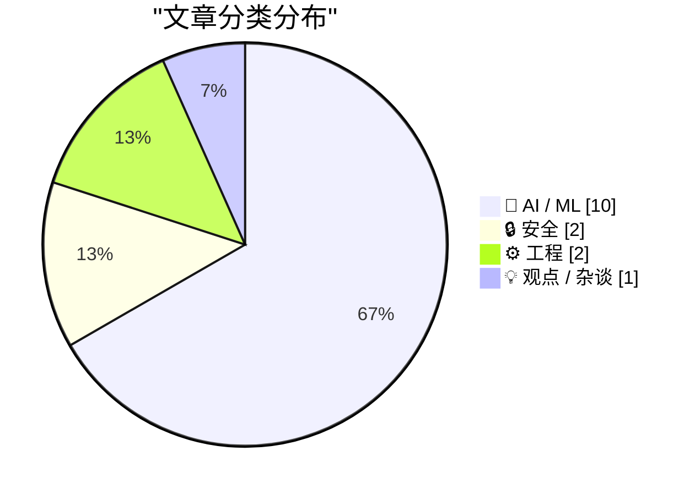
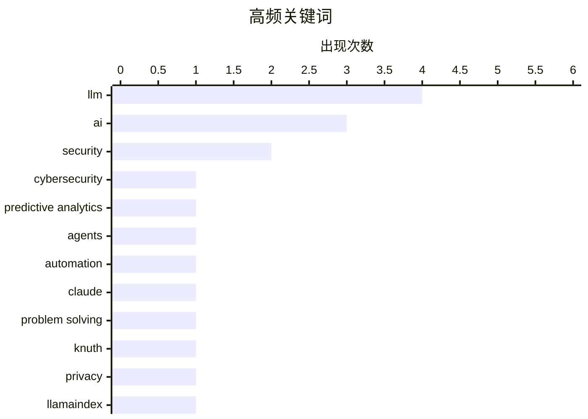

# 📰 AI 资讯每日精选 — 2026-03-09

> 汇聚 140+ 技术博客、X/Twitter、Hacker News、Reddit、Product Hunt、
> Lobste.rs、ClawFeed 日报及 GitHub Trending，经 AI 评分筛选。
>
> **本期内容**：🏆 今日必读 · 🌐 ClawFeed 日报 · 🔥 GitHub Trending · 📂 分类精选 · 🎨 设计与生成式 AI · 📊 数据概览

## 📝 今日看点

今日技术圈的核心焦点在于AI能力的深度渗透与伴随而来的安全范式重构。一方面，AI正从辅助工具演变为核心生产与创新引擎，不仅在代码生成、科学研究和多模态理解上取得突破，更开始自主解决复杂问题。另一方面，AI代理的普及和开发中的隐蔽风险正急剧放大安全挑战，迫使组织重新审视数据边界与信任模型。与此同时，行业正积极寻找下一代数据燃料，以应对高质量文本数据枯竭的瓶颈。

---

## 🏆 今日必读

🥇 **在大规模IT项目管理中集成AI驱动的预测分析以主动缓解网络安全风险**

[Integrating AI-Driven Predictive Analytics for Proactive Cybersecurity Risk Mitigation in Large-Scale IT Program Management](https://www.reddit.com/r/singularity/comments/1rnuhi2/integrating_aidriven_predictive_analytics_for/) — r/singularity · 20 小时前 · 🤖 AI / ML

> 文章罗列了一份参与讨论AI与网络安全议题的、堪称“全明星”的作者名单。名单包括Geoffrey Hinton、Yann LeCun、Yoshua Bengio、Demis Hassabis、Andrew Ng、Fei-Fei Li等十余位AI领域的顶尖学者与企业家。这暗示了该主题（AI预测性分析用于主动网络安全）在当前业界和学术界受重视的程度。如此高规格的作者阵容，旨在为该前沿交叉领域的研究与应用提供权威背书。

💡 **为什么值得读**: 通过这份重量级作者名单，可以快速了解当前关注AI与网络安全融合这一战略方向的核心人物与权威声音。

🏷️ AI, Cybersecurity, Predictive Analytics

🥈 **AI助手如何改变安全游戏规则**

[How AI Assistants are Moving the Security Goalposts](https://krebsonsecurity.com/2026/03/how-ai-assistants-are-moving-the-security-goalposts/) — krebsonsecurity.com · 26 分钟前 · 🔒 安全

> AI助手（或称智能体）正日益流行，它们能深度访问用户计算机、文件和服务，自动化几乎所有任务。这些强大而自主的工具正在迅速改变组织的安全优先级。其核心风险在于模糊了数据与代码、可信同事与内部威胁、顶级黑客与菜鸟攻击者之间的界限。近期诸多令人震惊的头条新闻已揭示了由此引发的安全事件。结论是，AI助手的普及迫使我们必须重新定义和构建安全防线。

💡 **为什么值得读**: 文章尖锐地指出了AI助手普及带来的全新、根本性的安全范式挑战，对任何部署或开发此类工具的组织都至关重要。

🏷️ AI, security, agents, automation

🥉 **高德纳谈Claude Opus解决计算机科学问题**

[Donald Knuth on Claude Opus Solving a Computer Science Problem](https://www-cs-faculty.stanford.edu/~knuth/papers/claude-cycles.pdf) — daringfireball.net · 6 小时前 · 🤖 AI / ML

> 计算机科学巨匠高德纳（Donald Knuth）分享了他被Claude Opus 4.6解决一个开放问题的经历。他为之工作数周的猜想，被三周前发布的Anthropic混合推理模型成功解决。这一事件促使高德纳表示需要重新审视自己对“生成式AI”的看法。他不仅为猜想得到优雅解答而欣喜，更将此视为AI领域的一次戏剧性进步。

💡 **为什么值得读**: 来自计算机科学泰斗高德纳的第一手体验，以具体案例生动展示了当前大模型在复杂推理上的突破性能力。

🏷️ LLM, Claude, problem solving, Knuth

4️⃣ **OpenAI静默回退：为何LlamaIndex可能泄露你“100%本地”的RAG数据**

[The Silent OpenAI Fallback: Why LlamaIndex Might Be Leaking Your "100% Local" RAG Data](https://www.reddit.com/r/LocalLLaMA/comments/1ro71ou/the_silent_openai_fallback_why_llamaindex_might/) — r/LocalLLaMA · 8 小时前 · 🔒 安全

> LlamaIndex库中存在一个静默回退机制，默认将OpenAI作为通用后备服务。如果开发者未明确配置或注入本地模型，其本意为“100%离线、隐私优先”的RAG系统可能在不经意间将敏感查询数据发送至OpenAI的API。这是一个严重的安全与隐私漏洞，尤其对强调数据本地化的LocalLLaMA社区构成威胁。开发者必须立即检查依赖注入配置，确保没有 unintended 的API调用。

💡 **为什么值得读**: 揭露了一个在流行开源框架中隐藏的、可能导致隐私数据意外泄露的重大安全隐患，对所有构建本地化AI系统的开发者是紧急预警。

🏷️ privacy, LlamaIndex, data-leak, RAG

5️⃣ **2026年云虚拟机基准测试**

[Cloud VM benchmarks 2026](https://devblog.ecuadors.net/cloud-vm-benchmarks-2026-performance-price-1i1m.html) — Hacker News Best · 23 小时前 · ⚙️ 工程

> 文章提供了2026年主流云服务商虚拟机的详细性能与价格基准测试。测试涵盖了计算、内存、存储和网络等多个维度的性能指标。通过对比不同云厂商（如AWS、GCP、Azure等）同级别实例的表现与成本，为读者提供了客观的选型依据。核心目标是帮助开发者和架构师在性能与预算之间做出最优决策。

💡 **为什么值得读**: 提供了基于最新数据的、全面的云服务性价比横向对比，是进行云端基础设施选型和成本优化的权威参考。

🏷️ cloud, benchmark, performance

---

## 🌐 ClawFeed 日报精选

> 来源：[ClawFeed](https://clawfeed.kevinhe.io) — AI 驱动的多源新闻聚合

### 🔥 今日头条

1. **OpenAI vs Anthropic 五角大楼之争全面引爆**
   Anthropic 拒绝 DoD "所有合法用途"要求（涉及大规模监控和自主武器），被国防部长 Hegseth 列为"供应链风险"，放弃约 $200M 合同。OpenAI 乘机接下合同，随即引发内部反弹——机器人部门负责人 Caitlin Kalinowski 以"原则问题"公开辞职，称"监控美国人不经司法审查、致命武器不经人类授权——这些红线本该被更多讨论"。Sam Altman 承认此举"看起来机会主义"。The Atlantic：Anthropic 的姿态可能换来"更有价值的东西"。

2. **GPT-5.4（5.3）正式发布**
   预测市场将 3 月 8 日定价为 100% 发布概率。新版融合推理、编码、agent 工作流，context window 跳至 100 万 token（前代 2.5 倍），原生支持 computer-use，整合顶级编程能力，已上线 ChatGPT、Codex 和 API。

3. **Karpathy 开源 autoresearch：单 GPU AI 研究员，过夜自主跑 100 个实验**
   630 行代码，人类写 .md 描述研究目标，AI Agent 循环迭代训练代码，每 5 分钟一个实验。X trending 第一，HN 热门，1 天内超 3,000 条讨论。[GitHub](https://github.com/karpathy/autoresearch)

4. **Anthropic 营收预期翻倍：$9B → $19B**
   NYT 深度报道，2026 年 Anthropic 全年营收预期从 $9B 升至 $19B。OpenAI vs Anthropic 竞争已进入"极度个人化"阶段，Claude 在"最佳模型"预测市场以 75% 领先。

5. **Google 为 AI Agent 开放 Gmail + Drive**
   企业 AI Agent 接入邮件与文件系统门槛大幅降低，Agent 生态向办公工具全面扩张。

---

### 📰 精选 Top 10

1. **@a16z** — Replit CEO Amjad Masad："没有编程经验正在成为优势。你需要的是韧劲和快速学习能力。未来执行成本趋近于零，瓶颈是想法。" 654K views 🔥
   https://x.com/a16z/status/2030320194900648330

2. **@AI_Jasonyu** — 《中文 X 各领域最值得关注的头部博主清单》，129 个博主，经 GPT/Claude/Gemini/Grok 四模型交叉验证 + 人工筛选，覆盖 AI/出海/创业/独开/副业。866K views，1.1K 转发
   https://x.com/AI_Jasonyu/status/2030166779096658161

3. **@LiorOnAI** — 解读 Karpathy autoresearch："It's over. You write a prompt that tells an AI agent how to think about research." 514K views，2.9K likes
   https://x.com/LiorOnAI/status/2030376700337643742

4. **@bggg_ai** — 在 Mac mini 本地跑跨境电商 AI 团队：5 个数字员工分别负责选品调研、TikTok UGC 生成、Reddit 种草、亚马逊运营，全平台矩阵打通。97K views，765 likes
   https://x.com/bggg_ai/status/2030123309594259506

5. **@aiwarts** — OpenClaw 创始人发布 32 个模型三维排名（成功率/速度/费用）。成功率前五：gemini-3-flash-preview、minimax-m2.1、kimi-k2.5、claude-sonnet-4.5；m2.5 反而垫底 35.5%。66K views
   https://x.com/aiwarts/status/2030463844188078143

6. **@axiaisacat** — 推荐开源项目 Impeccable："AI 写 UI 总有外包廉价感，因为 AI 不懂设计规范。这个项目相当于给 AI 注入顶级设计师的灵魂。" 46K views，724 likes
   https://x.com/axiaisacat/status/2030297324962857044

7. **@cnfinancewatch** — 343+ Python 量化交易/算法交易开源项目大合集（quant-learning 方向硬核干货）。87K views，456 likes
   https://x.com/cnfinancewatch/status/2030273126433783921

8. **@runes_leo** — 非程序员，43 岁咨询顾问，用 Claude Code 花 36 小时搭了"AI 幕僚长"：每天自动扫邮件、建任务、分类、派发给 6 个并行 agent。29K views
   https://x.com/runes_leo/status/2030225947203645864

9. **@lidangzzz** — OnlySpecs：导入 GitHub 项目 → 自动分析 specs 文档 → 修改 specs → 生成新代码，开发革命新范式。32K views，253 likes
   https://x.com/lidangzzz/status/2030527442167713800

10. **@chenchengpro (陈成)** — 反编译 Claude Code 的 `/loop` 命令底层实现：cron 包装器，每秒 tick 但只在 REPL 空闲时触发，含 gist 完整分析。17K views
    https://x.com/chenchengpro/status/2030291945554108720

---

### 👀 今日推荐关注

- **@LiorOnAI** (Lior Alexander) — AI 前沿进展解读，今日 autoresearch 分析获 514K views，内容高质高频，目前未关注 → 推荐
- **@kalinowski007** (Caitlin Kalinowski) — OpenAI VP of Hardware，前 Meta Reality Labs，今日因辞职声明刷屏，AI 硬件/政策一手信息来源，目前未关注 → 推荐
- **@axiaisacat** — 中文 AI 圈活跃 builder，推荐前沿开源工具，内容质量高 → 推荐
- **@jxnlco** (jason liu) — Instructor 库作者，LLM structured output 标杆，AI 工具/教育方向 → 推荐
- **@TencentAI_News** — 腾讯 AI 官方账号，QQ × OpenClaw 接入等一手动态 → 推荐

---

### 🧹 今日建议取关

- **@feibo03** (Cowboy 🔶 BNB) — Parody account，bio 全是 gmgn 返佣链接 + "抓奶工坊" Telegram 引流群，5 期简报均提及，确认建议取关。https://x.com/feibo03
- **@jordymaui** — 主聊足球 (Fulham)，AI/crypto 方向相关性低，建议核查近期推文后决定。https://x.com/jordymaui

---

### 📊 今日观察

**今天是 AI 行业政治化的标志性一天。** OpenAI 与 Anthropic 的竞争从"谁的模型更好"升级为"谁的价值观更符合国防需求"——这场博弈深刻揭示了 AI 公司在商业利益与伦理红线之间的生死抉择。Caitlin Kalinowski 的辞职声明，是这个行业良知发声的罕见时刻。

技术层面，Karpathy 的 autoresearch 和 GPT-5.4 同日出现，信号一致：**AI 自我迭代的飞轮正在加速**——不只是用 AI 写代码，而是用 AI 改进 AI 本身。"软件工程的范式已切换"不再是预言，而是现实。

OpenClaw 生态今日异常活跃：QQ 接入、深圳政府政策支持、MyClaw Backup 开源、Codex /loop 底层解析……这个生态正在从"开发者玩具"变成"新流量入口"和"个人计算新操作系统"。对于想做超级个体的人，现在入局 OpenClaw 生态恰逢其时。

量化/金融方向今日也有干货：343+ 量化开源项目合集 + BTC 宏观分析工具，值得深挖。

---

*生成时间：2026-03-08 22:00 SGT | 来源：5 期 4h 简报*

---

## 🔥 GitHub Trending

> 今日热门开源项目（全语言 + Python）

| # | 项目 | 描述 | ⭐ 总星 | 📈 今日 | 语言 |
|---|------|------|---------|---------|------|
| 1 | [openclaw/openclaw](https://github.com/openclaw/openclaw) 🤖 | Your own personal AI assistant. Any OS. Any Platform. The... | 280.3k | +4842 | TypeScript |
| 2 | [666ghj/MiroFish](https://github.com/666ghj/MiroFish) | A Simple and Universal Swarm Intelligence Engine, Predict... | 6.9k | +1168 | Python |
| 3 | [pbakaus/impeccable](https://github.com/pbakaus/impeccable) 🤖 | The design language that makes your AI harness better at ... | 1.7k | +640 | JavaScript |
| 4 | [shareAI-lab/learn-claude-code](https://github.com/shareAI-lab/learn-claude-code) 🤖 | Bash is all you need - A nano Claude Code–like agent, bui... | 23.8k | +635 | TypeScript |
| 5 | [openai/skills](https://github.com/openai/skills) 🤖 | Skills Catalog for Codex | 13.2k | +613 | Python |
| 6 | [GoogleCloudPlatform/generative-ai](https://github.com/GoogleCloudPlatform/generative-ai) 🤖 | Sample code and notebooks for Generative AI on Google Clo... | 14.3k | +563 | Jupyter Notebook |
| 7 | [toeverything/AFFiNE](https://github.com/toeverything/AFFiNE) | There can be more than Notion and Miro. AFFiNE(pronounced... | 65.2k | +529 | TypeScript |
| 8 | [shadcn-ui/ui](https://github.com/shadcn-ui/ui) | A set of beautifully-designed, accessible components and ... | 108.7k | +498 | TypeScript |
| 9 | [QwenLM/Qwen-Agent](https://github.com/QwenLM/Qwen-Agent) 🤖 | Agent framework and applications built upon Qwen&gt;=3.0,... | 15.2k | +321 | Python |
| 10 | [virattt/ai-hedge-fund](https://github.com/virattt/ai-hedge-fund) 🤖 | An AI Hedge Fund Team | 46.8k | +275 | Python |
| 11 | [Ed1s0nZ/CyberStrikeAI](https://github.com/Ed1s0nZ/CyberStrikeAI) 🤖 | CyberStrikeAI is an AI-native security testing platform b... | 2.2k | +242 | Go |
| 12 | [Jeffallan/claude-skills](https://github.com/Jeffallan/claude-skills) 🤖 | 66 Specialized Skills for Full-Stack Developers. Transfor... | 5.7k | +239 | Python |
| 13 | [teng-lin/notebooklm-py](https://github.com/teng-lin/notebooklm-py) | Unofficial Python API for Google NotebookLM | 3.7k | +217 | Python |
| 14 | [Free-TV/IPTV](https://github.com/Free-TV/IPTV) | M3U Playlist for free TV channels | 14.6k | +208 | Python |
| 15 | [p-e-w/heretic](https://github.com/p-e-w/heretic) | Fully automatic censorship removal for language models | 10.9k | +152 | Python |

---

## 🤖 AI / ML

### 1. 在大规模IT项目管理中集成AI驱动的预测分析以主动缓解网络安全风险

[Integrating AI-Driven Predictive Analytics for Proactive Cybersecurity Risk Mitigation in Large-Scale IT Program Management](https://www.reddit.com/r/singularity/comments/1rnuhi2/integrating_aidriven_predictive_analytics_for/) — **r/singularity** · 20 小时前 · ⭐ 28/30

> 文章罗列了一份参与讨论AI与网络安全议题的、堪称“全明星”的作者名单。名单包括Geoffrey Hinton、Yann LeCun、Yoshua Bengio、Demis Hassabis、Andrew Ng、Fei-Fei Li等十余位AI领域的顶尖学者与企业家。这暗示了该主题（AI预测性分析用于主动网络安全）在当前业界和学术界受重视的程度。如此高规格的作者阵容，旨在为该前沿交叉领域的研究与应用提供权威背书。

🏷️ AI, Cybersecurity, Predictive Analytics

---

### 2. 高德纳谈Claude Opus解决计算机科学问题

[Donald Knuth on Claude Opus Solving a Computer Science Problem](https://www-cs-faculty.stanford.edu/~knuth/papers/claude-cycles.pdf) — **daringfireball.net** · 6 小时前 · ⭐ 27/30

> 计算机科学巨匠高德纳（Donald Knuth）分享了他被Claude Opus 4.6解决一个开放问题的经历。他为之工作数周的猜想，被三周前发布的Anthropic混合推理模型成功解决。这一事件促使高德纳表示需要重新审视自己对“生成式AI”的看法。他不仅为猜想得到优雅解答而欣喜，更将此视为AI领域的一次戏剧性进步。

🏷️ LLM, Claude, problem solving, Knuth

---

### 3. [研究] 我们结合LLM与符号执行分析了4000份以太坊合约，发现了5783个问题

[[D] We analyzed 4,000 Ethereum contracts by combining an LLM and symbolic execution and found 5,783 issues](https://www.reddit.com/r/MachineLearning/comments/1ro8t22/d_we_analyzed_4000_ethereum_contracts_by/) — **r/MachineLearning** · 7 小时前 · ⭐ 26/30

> 研究团队提出SymGPT框架，通过结合大语言模型与符号执行来自动化审计以太坊智能合约。该方法使用LLM将ERC标准规则翻译成领域特定语言，并合成约束条件，然后利用符号执行器进行验证。在对4000份真实合约的分析中，SymGPT共发现了5783个合规性问题。这项名为“SymGPT”的研究已被OOPSLA会议接收，展示了AI与传统形式化方法结合在代码安全审计中的巨大潜力。

🏷️ LLM, smart contracts, security, symbolic execution

---

### 4. OpenAI工程师不再写代码？Harness Engineering与智能体编程范式

[OpenAI 说他们的工程师不再写代码了——设计环境、搭反馈循环、定义架构约束，然后让 agent 写。五个月一百万行，没一行手写。他们管这叫 harness engineering。...](https://x.com/runes_leo/status/2030669369089609753) — **𝕏 @runes_leo** · 8 小时前 · ⭐ 26/30

> OpenAI的工程师实践一种称为“Harness Engineering”的方法：他们不再手动编写代码，而是设计环境、搭建反馈循环、定义架构约束，然后让智能体（Agent）生成代码。据称在五个月内生成了百万行代码，无一手动编写。其哲学根源可追溯至控制论（如瓦特调速器），核心在于从“操作阀门”转变为“掌舵”。关键洞见是：智能体重复犯错往往源于人类未能将隐性的判断力明确“写下来”作为约束。因此，编写详细的行为规范、禁止清单和架构约束，本质是在为智能体“校准传感器”。

🏷️ AI agent, software engineering, harness engineering, OpenAI

---

### 5. Hugging Face发布《合成数据实战手册》：耗费10万+ GPU小时生成超1万亿令牌的实验总结

[RT Joël Niklaus: Introducing the Synthetic Data Playbook: We generated over a 1T tokens in 90 experiments with 100k+ GPUh to figure out what makes go...](https://x.com/huggingface/status/2030650468846768383) — **𝕏 @huggingface** · 15 小时前 · ⭐ 26/30

> Hugging Face团队发布了《合成数据实战手册》，分享了大规模合成数据生成的核心经验。该研究进行了90次实验，消耗超过10万GPU小时，生成了超过1万亿个令牌的合成数据。目标是系统性地探索什么构成高质量的合成数据，以及如何实现规模化生成。研究成果以交互式空间形式发布，为社区提供了宝贵的实践指南。

🏷️ Synthetic Data, LLM Training, Hugging Face, Scale

---

### 6. Luma AI新图像模型Uni-1在逻辑基准测试中超越Nano Banana 2和GPT Image 1.5

[Luma AI's new Uni-1 image model tops Nano Banana 2 and GPT Image 1.5 on logic-based benchmarks](https://the-decoder.com/luma-ais-new-uni-1-image-model-tops-nano-banana-2-and-gpt-image-1-5-on-logic-based-benchmarks/) — **The Decoder** · 6 小时前 · ⭐ 25/30

> Luma AI发布了Uni-1图像模型，直接挑战OpenAI和Google。Uni-1采用单一架构同时实现图像理解与生成，并能在创作过程中对提示进行推理。在逻辑基准测试中，其性能超越了Nano Banana 2和GPT Image 1.5等竞争对手。这表明统一架构在多模态推理任务上可能具有优势。

🏷️ Luma AI, image model, multimodal AI, benchmarks

---

### 7. LLM文本数据正在枯竭，Meta指出未标注视频是下一个大规模训练前沿

[LLM text data is drying up, but Meta points to unlabeled video as the next massive training frontier](https://the-decoder.com/llm-text-data-is-drying-up-but-meta-points-to-unlabeled-video-as-the-next-massive-training-frontier/) — **The Decoder** · 9 小时前 · ⭐ 25/30

> Meta FAIR与纽约大学的研究团队通过从头训练一个多模态AI模型，发现关于如何构建此类模型的几个常见假设并不成立。核心结论是，随着大语言模型可用高质量文本数据逐渐枯竭，海量的未标注视频数据将成为下一代AI模型训练的关键资源。这项研究挑战了现有范式，为突破数据瓶颈指明了新的方向。

🏷️ LLM, training data, video data, Meta AI

---

### 8. 顶级AI会议中幻觉引用正通过同行评审，一款新开源工具试图解决此问题

[Hallucinated references are passing peer review at top AI conferences and a new open tool wants to fix that](https://the-decoder.com/hallucinated-references-are-passing-peer-review-at-top-ai-conferences-and-a-new-open-tool-wants-to-fix-that/) — **The Decoder** · 15 小时前 · ⭐ 25/30

> 顶级AI会议的同行评审中，AI生成的虚假引用（幻觉引用）正被漏检，而GPT、Gemini和Claude等商业大语言模型无法识别它们自己生成的这些伪造内容。一款名为CiteAudit的新开源工具被开发出来，旨在解决这一问题。该工具声称能够检测出主流商业模型所遗漏的虚假引用。这暴露了当前学术出版流程中，对AI生成内容进行质量控制的迫切需求。

🏷️ AI ethics, peer review, hallucination, academic integrity

---

### 9. LLM嵌入向量详解：一份可视化与直观指南

[LLM Embeddings Explained: A Visual and Intuitive Guide](https://www.reddit.com/r/programming/comments/1rnrkiy/llm_embeddings_explained_a_visual_and_intuitive/) — **r/programming** · 22 小时前 · ⭐ 25/30

> 这是一份关于大语言模型（LLM）中嵌入向量技术的入门指南。嵌入向量是将文本、图像等数据转换为数值向量的核心技术，是语义搜索、推荐系统等应用的基础。该指南通过可视化手段，直观地解释了嵌入向量如何捕捉语义相似性，以及它们在高维空间中的分布与运算。文章旨在帮助读者建立对嵌入技术工作原理的直觉理解，而非深究复杂数学。

🏷️ LLM, embeddings, visualization, tutorial

---

### 10. 成功编译LTX 2.3蒸馏版的FP8量化缩放模型，效果惊人——无需LoRA，一次成功

[Just compiled FP8 Quant Scaled of LTX 2.3 Distilled and working amazing - no LoRA - first try. 25 second video, 601 frames, Text-to-Video - sound was 1:1 same. Uploading model right now to share with SECourses followers and tutorial and presets coming tomorrow hopefully](https://www.reddit.com/r/comfyui/comments/1rnt5zu/just_compiled_fp8_quant_scaled_of_ltx_23/) — **r/comfyui** · 21 小时前 · ⭐ 25/30

> 作者成功编译并测试了LTX 2.3蒸馏视频生成模型的FP8量化缩放版本。该模型在首次尝试中即表现出色，无需使用LoRA等技术进行微调。具体生成了一个25秒、601帧的文生视频，且音频同步完美。作者计划立即将模型上传分享，并承诺在次日发布相关教程和预设文件。

🏷️ LTX, video generation, quantization, model

---

## 🔒 安全

### 11. AI助手如何改变安全游戏规则

[How AI Assistants are Moving the Security Goalposts](https://krebsonsecurity.com/2026/03/how-ai-assistants-are-moving-the-security-goalposts/) — **krebsonsecurity.com** · 26 分钟前 · ⭐ 27/30

> AI助手（或称智能体）正日益流行，它们能深度访问用户计算机、文件和服务，自动化几乎所有任务。这些强大而自主的工具正在迅速改变组织的安全优先级。其核心风险在于模糊了数据与代码、可信同事与内部威胁、顶级黑客与菜鸟攻击者之间的界限。近期诸多令人震惊的头条新闻已揭示了由此引发的安全事件。结论是，AI助手的普及迫使我们必须重新定义和构建安全防线。

🏷️ AI, security, agents, automation

---

### 12. OpenAI静默回退：为何LlamaIndex可能泄露你“100%本地”的RAG数据

[The Silent OpenAI Fallback: Why LlamaIndex Might Be Leaking Your "100% Local" RAG Data](https://www.reddit.com/r/LocalLLaMA/comments/1ro71ou/the_silent_openai_fallback_why_llamaindex_might/) — **r/LocalLLaMA** · 8 小时前 · ⭐ 27/30

> LlamaIndex库中存在一个静默回退机制，默认将OpenAI作为通用后备服务。如果开发者未明确配置或注入本地模型，其本意为“100%离线、隐私优先”的RAG系统可能在不经意间将敏感查询数据发送至OpenAI的API。这是一个严重的安全与隐私漏洞，尤其对强调数据本地化的LocalLLaMA社区构成威胁。开发者必须立即检查依赖注入配置，确保没有 unintended 的API调用。

🏷️ privacy, LlamaIndex, data-leak, RAG

---

## ⚙️ 工程

### 13. 2026年云虚拟机基准测试

[Cloud VM benchmarks 2026](https://devblog.ecuadors.net/cloud-vm-benchmarks-2026-performance-price-1i1m.html) — **Hacker News Best** · 23 小时前 · ⭐ 26/30

> 文章提供了2026年主流云服务商虚拟机的详细性能与价格基准测试。测试涵盖了计算、内存、存储和网络等多个维度的性能指标。通过对比不同云厂商（如AWS、GCP、Azure等）同级别实例的表现与成本，为读者提供了客观的选型依据。核心目标是帮助开发者和架构师在性能与预算之间做出最优决策。

🏷️ cloud, benchmark, performance

---

### 14. 我终于做出了一个能在6GB显存上运行的真正8K工作流（无需SUPIR，无需自定义节点）

[I finally made a TRUE 8K workflow that runs on 6GB VRAM (no SUPIR, no custom nodes)](https://www.reddit.com/r/comfyui/comments/1rocoyk/i_finally_made_a_true_8k_workflow_that_runs_on/) — **r/comfyui** · 5 小时前 · ⭐ 25/30

> 作者解决了在ComfyUI中实现8K图像处理时常见的内存溢出、节点复杂和显存需求高（通常需16GB+）的难题。其方案摒弃了常用的SUPIR或RestoreFormer等复杂工具，仅使用ComfyUI原生节点构建了一个轻量级工作流。核心流程包括：加载图像 → RealESRGAN x4超分 → 智能分块放大 → 细节增强。该工作流成功将8K处理的显存需求降低至6GB。

🏷️ ComfyUI, workflow, VRAM, upscaling

---

## 💡 观点 / 杂谈

### 15. 开放之痛——论程序员如何花费数十年建立开放协作文化，又如何因此受到惩罚

[Open Sores - an essay on how programmers spent decades building a culture of open collaboration, and how they're being punished for it](https://www.reddit.com/r/programming/comments/1rocrn2/open_sores_an_essay_on_how_programmers_spent/) — **r/programming** · 5 小时前 · ⭐ 25/30

> 文章批判性地审视了开源软件运动的现状与困境。核心论点是，程序员社区数十年建立的开放、协作与共享的文化，正被商业利益所侵蚀和利用。作者指出，大公司常常无偿获取开源成果并从中获利，却未对社区做出对等的回馈与支持。这种不平衡导致了许多开源维护者陷入倦怠和资源匮乏的境地。结论是，当前的开源经济模式存在根本性缺陷，需要新的机制来保障创造者的权益与可持续性。

🏷️ open source, culture, AI

---

## 🎨 Design & Generative AI

### 🖥️ 生成式 UI

- **[WorkflowUI：将ComfyUI工作流转换为离线应用（支持Windows/Linux）](https://www.reddit.com/r/comfyui/comments/1ro6w6w/workflowui_turn_workflows_into_apps/)** — r/comfyui · 9 小时前
  > 一款新工具允许用户将ComfyUI工作流打包成可在Windows/Linux系统离线运行的应用程序。

- **[用户呼吁ComfyUI为工作流保存添加节点版本信息](https://www.reddit.com/r/comfyui/comments/1rntpvf/most_important_next_step_for_comfyui_for_real/)** — r/comfyui · 20 小时前
  > 用户指出工作流兼容性问题的根源，并建议在保存工作流时记录所用节点的版本数据。

- **[本地ComfyUI工作流定时与自动化工具发布，寻求反馈](https://www.reddit.com/r/comfyui/comments/1ro2ho0/i_built_a_tool_to_schedule_and_automate_comfyui/)** — r/comfyui · 12 小时前
  > 用户开发了一款用于在本地调度和自动化运行ComfyUI工作流的工具，并公开征集使用反馈。

### 🖼️ 生成式图片

- **[Luma AI发布Uni-1图像模型，逻辑推理基准超越GPT与谷歌](https://the-decoder.com/luma-ais-new-uni-1-image-model-tops-nano-banana-2-and-gpt-image-1-5-on-logic-based-benchmarks/)** — The Decoder · 6 小时前
  > Luma AI推出Uni-1模型，将图像理解与生成合二为一，并在逻辑基准测试中表现优异。

- **[仅需6GB显存的ComfyUI真8K图像生成工作流](https://www.reddit.com/r/comfyui/comments/1rocoyk/i_finally_made_a_true_8k_workflow_that_runs_on/)** — r/comfyui · 5 小时前
  > 用户开发出无需SUPIR等复杂节点、仅需6GB显存即可运行的ComfyUI 8K图像生成方案。

- **[开源Synthid移除工具发布，声称效果显著（仅限教育用途）](https://www.reddit.com/r/comfyui/comments/1rnz3ar/i_created_an_open_source_synthid_remover_that/)** — r/comfyui · 16 小时前
  > 用户开源了一个声称有效的Synthid（AI生成标识）移除工具，声明仅供教育用途。

- **[ComfyUI-DoRA动态LoRA加载器发布，修复Flux模型加载问题](https://www.reddit.com/r/comfyui/comments/1rnu4gk/release_comfyuidoradynamicloraloader_fixes_flux/)** — r/comfyui · 20 小时前
  > 新节点发布，解决了在ComfyUI中加载Flux/Flux.2 OneTrainer的DoRA模型时出现的问题。

- **[ComfyUI无限细节工作流升级：支持4K细节控制、图像转换与姿势编辑](https://www.reddit.com/r/comfyui/comments/1roibjv/create_4k_images_controlling_the_amount_of_detail/)** — r/comfyui · 1 小时前
  > 用户更新了其ComfyUI工作流，整合了多种工具以实现4K细节控制、风格转换和姿势编辑等功能。

- **[ComfyUI最新更新后，用户报告生成速度大幅提升](https://www.reddit.com/r/comfyui/comments/1roaiwk/huge_speed_boost_after_the_latest_round_of/)** — r/comfyui · 6 小时前
  > 用户反馈在最近更新ComfyUI后，图像生成速度获得了显著的提升。

- **[借助Claude优化ComfyUI工作流参数，获得理想生成效果](https://www.reddit.com/r/StableDiffusion/comments/1rodbeg/dialed_in_the_workflow_thanks_to_claude_30_steps/)** — r/StableDiffusion · 4 小时前
  > 用户在Claude的协助下调整了ComfyUI工作流的多项参数，最终获得了满意的图像生成结果。

### 🌍 世界模型 / 3D

- **[Luma Labs预告“Superscan”新功能，由Luma驱动](https://x.com/LumaLabsAI/status/2030725068972527676)** — 𝕏 @LumaLabsAI · 4 小时前
  > Luma Labs官方预告即将推出名为“Superscan”的新产品/功能，并展示了相关制作人员。

### 🎬 生成式视频

- **[LTX 2.3蒸馏版FP8量化模型实现25秒高质量文本生成视频](https://www.reddit.com/r/comfyui/comments/1rnt5zu/just_compiled_fp8_quant_scaled_of_ltx_23/)** — r/comfyui · 21 小时前
  > 用户成功编译LTX 2.3蒸馏模型的FP8量化版本，首次尝试即生成25秒音画同步的视频。

- **[解决ComfyUI中LTX-2.3视频生成的皮肤压缩与纹理伪影问题](https://www.reddit.com/r/StableDiffusion/comments/1rnqowr/how_i_fixed_skin_compression_and_texture/)** — r/StableDiffusion · 23 小时前
  > 用户分享了在不更换模型的情况下，修复LTX-2.3生成视频时皮肤和纹理质量问题的技巧。

- **[用户称基本解决了LTX 2.3在图生视频中的严重一致性问题](https://www.reddit.com/r/StableDiffusion/comments/1robou6/near_solved_egregious_i2v_consistency_in_ltx_23/)** — r/StableDiffusion · 5 小时前
  > 用户报告在LTX 2.3模型中，图像到视频生成的画面一致性问题已接近解决。

- **[解决RTX 5090运行LTX-Video时的显存溢出与运行卡顿问题](https://www.reddit.com/r/comfyui/comments/1roj9s3/rtx_5090_ltxvideo_how_to_stop_the_out_of_memory/)** — r/comfyui · 1 小时前
  > 用户分享了通过“释放模型”和“节点缓存”技巧，避免高配置下运行LTX视频模型时的内存错误。

---

## 📊 数据概览

| 扫描源 | 抓取文章 | 时间范围 | 精选 |
|:---:|:---:|:---:|:---:|
| 129/140 | 4194 篇 → 252 篇 | 24h | **15 篇** |

### 分类分布



### 高频关键词



<details>
<summary>📈 纯文本关键词图（终端友好）</summary>

```
llm                  │ ████████████████████ 4
ai                   │ ███████████████░░░░░ 3
security             │ ██████████░░░░░░░░░░ 2
cybersecurity        │ █████░░░░░░░░░░░░░░░ 1
predictive analytics │ █████░░░░░░░░░░░░░░░ 1
agents               │ █████░░░░░░░░░░░░░░░ 1
automation           │ █████░░░░░░░░░░░░░░░ 1
claude               │ █████░░░░░░░░░░░░░░░ 1
problem solving      │ █████░░░░░░░░░░░░░░░ 1
knuth                │ █████░░░░░░░░░░░░░░░ 1
```

</details>

### 🏷️ 话题标签

**llm**(4) · **ai**(3) · **security**(2) · cybersecurity(1) · predictive analytics(1) · agents(1) · automation(1) · claude(1) · problem solving(1) · knuth(1) · privacy(1) · llamaindex(1) · data-leak(1) · rag(1) · cloud(1) · benchmark(1) · performance(1) · smart contracts(1) · symbolic execution(1) · ai agent(1)

---

*生成于 2026-03-09 00:01 | 汇聚 140 个技术博客、X/Twitter、Hacker News、Reddit、Product Hunt、Lobste.rs、ClawFeed 日报及 GitHub Trending，经 AI 评分筛选出 Top 15 精华内容*
