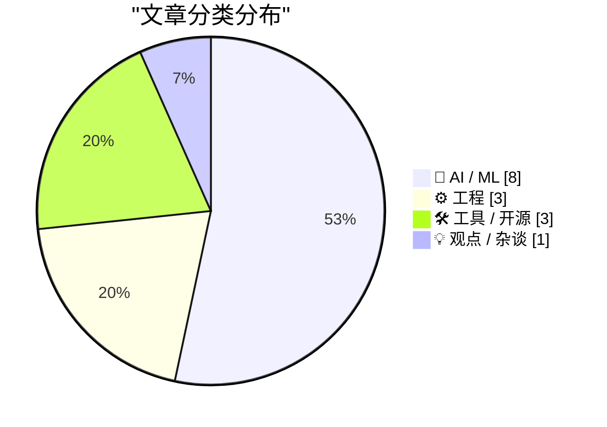
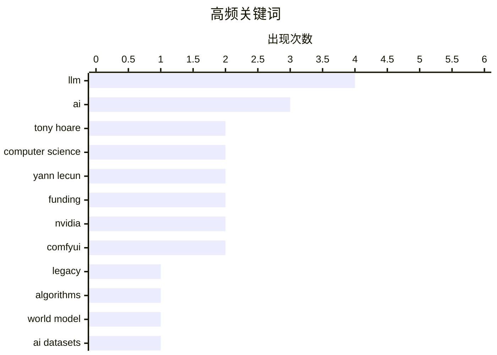

# 📰 AI 资讯每日精选 — 2026-03-11

> 汇聚 140+ 技术博客、X/Twitter、Hacker News、Reddit、Product Hunt、
> Lobste.rs、ClawFeed 日报及 GitHub Trending，经 AI 评分筛选。
>
> **本期内容**：🏆 今日必读 · 🌐 ClawFeed 日报 · 🔥 GitHub Trending · 📂 分类精选 · 🎨 设计与生成式 AI · 📊 数据概览

## 📝 今日看点

今日技术圈聚焦于AI发展的关键转折与治理挑战。一方面，顶尖学者正寻求突破大语言模型局限，如Yann LeCun巨额融资以构建理解物理世界的新AI范式；另一方面，AI应用的风险管控成为行业紧迫议题，从亚马逊严控AI生成代码到学界关注影子API破坏研究可复现性，均显示产业在加速落地中正强化安全与可靠性护栏。同时，底层工具与模型操控技术持续演进，为性能提升打开新路径。

---

## 🏆 今日必读

🥇 **托尼·霍尔逝世**

[Tony Hoare has died](https://blog.computationalcomplexity.org/2026/03/tony-hoare-1934-2026.html) — Hacker News Best · 9 小时前 · ⚙️ 工程

> 计算机科学先驱、图灵奖得主托尼·霍尔于2026年逝世，享年92岁。他最为人知的贡献是发明了快速排序算法和霍尔逻辑，并提出了“空引用是十亿美元的错误”这一著名论断。霍尔在并发计算、形式化方法以及编程语言设计等领域也做出了奠基性工作。他的思想深刻影响了现代计算机科学的发展轨迹。

💡 **为什么值得读**: 了解这位定义了现代计算核心思想的巨匠的生平与遗产，对任何技术从业者都极具启发性。

🏷️ Tony Hoare, Computer Science, Legacy, Algorithms

🥈 **Yann LeCun 融资10亿美元，旨在构建理解物理世界的人工智能**

[Yann LeCun raises $1B to build AI that understands the physical world](https://www.wired.com/story/yann-lecun-raises-dollar1-billion-to-build-ai-that-understands-the-physical-world/) — Hacker News Best · 15 小时前 · 🤖 AI / ML

> 图灵奖得主Yann LeCun离开Meta后，联合创立了新公司AMI Labs并成功融资10.3亿美元。该公司核心目标是突破当前大语言模型的幻觉瓶颈，构建能够理解物理世界的AI。他们将基于LeCun提出的JEPA架构开发世界模型，使AI能对现实进行物理推理和规划，而非仅仅处理文本。此举标志着AI研究从语言建模向物理常识和现实世界建模的重大范式转变。

💡 **为什么值得读**: 这是AI领域顶尖学者对下一代AI发展方向的重大押注，揭示了超越大语言模型的可能路径。

🏷️ AI, Yann LeCun, Funding, World Model

🥉 **英伟达如何为AI构建开放数据**

[How NVIDIA Builds Open Data for AI](https://huggingface.co/blog/nvidia/open-data-for-ai) — Hugging Face Blog · 4 小时前 · 🤖 AI / ML

> 文章揭示了英伟达为训练和评估AI模型而系统构建高质量开放数据集的策略与实践。其方法包括创建如Nemotron-4 340B模型所用的合成数据管道，以及发布用于代码、数学和推理的专项基准数据集。英伟达通过开放这些数据集（如CodeNet、MathVista）来推动社区研究，并确保其AI硬件和软件生态有可靠的数据基础。这体现了数据作为AI基础设施核心组成部分的战略重要性。

💡 **为什么值得读**: 了解行业巨头如何战略性地构建AI数据基础设施，对于从事模型训练或数据工程的专业人士至关重要。

🏷️ NVIDIA, AI datasets, open data

4️⃣ **多次故障后，亚马逊要求高级工程师签署批准AI辅助的代码变更**

[After outages, Amazon to make senior engineers sign off on AI-assisted changes](https://arstechnica.com/ai/2026/03/after-outages-amazon-to-make-senior-engineers-sign-off-on-ai-assisted-changes/) — Hacker News Best · 10 小时前 · ⚙️ 工程

> 因AI辅助编程工具（如Amazon CodeWhisperer）生成的代码导致多次服务中断后，亚马逊内部推行新政策。该政策要求所有由AI辅助完成的代码变更，必须得到高级工程师的人工审查和签署批准。此举旨在控制AI工具引入的潜在风险，平衡开发效率与系统稳定性。这反映了企业在快速部署AI编码工具时，对质量和可靠性保障机制的迫切需求。

💡 **为什么值得读**: 这是一个大型科技公司应对AI工具生产风险的真实案例，为AI辅助开发的治理提供了重要参考。

🏷️ AI, DevOps, Incident, Governance

5️⃣ **影子API正在破坏研究的可复现性**

[[R] shadow APIs breaking research reproducibility (arxiv 2603.01919)](https://www.reddit.com/r/MachineLearning/comments/1rpoi3u/r_shadow_apis_breaking_research_reproducibility/) — r/MachineLearning · 18 小时前 · 🤖 AI / ML

> 一篇arXiv论文（编号2603.01919）审计了声称提供GPT-5/Gemini访问的第三方影子API服务，发现其严重破坏了AI研究的可复现性。研究显示，有187篇学术论文使用了这些服务，其中引用量最高的服务涉及5966次引用。关键问题包括：影子API与官方模型性能差异高达47%，安全行为完全不可预测，45%的指纹测试未能通过身份验证。这意味着大量学术研究可能建立在虚假的模型输出之上。

💡 **为什么值得读**: 该研究揭露了AI学术圈一个隐蔽但影响深远的危机，所有依赖API进行实验的研究者都应警惕。

🏷️ reproducibility, shadow API, research

---

## 🌐 ClawFeed 日报精选

> 来源：[ClawFeed](https://clawfeed.kevinhe.io) — AI 驱动的多源新闻聚合

### 🔥 今日头条

1. **OpenAI vs Anthropic 五角大楼之争全面引爆**
   Anthropic 拒绝 DoD "所有合法用途"要求（涉及大规模监控和自主武器），被国防部长 Hegseth 列为"供应链风险"，放弃约 $200M 合同。OpenAI 乘机接下合同，随即引发内部反弹——机器人部门负责人 Caitlin Kalinowski 以"原则问题"公开辞职，称"监控美国人不经司法审查、致命武器不经人类授权——这些红线本该被更多讨论"。Sam Altman 承认此举"看起来机会主义"。The Atlantic：Anthropic 的姿态可能换来"更有价值的东西"。

2. **GPT-5.4（5.3）正式发布**
   预测市场将 3 月 8 日定价为 100% 发布概率。新版融合推理、编码、agent 工作流，context window 跳至 100 万 token（前代 2.5 倍），原生支持 computer-use，整合顶级编程能力，已上线 ChatGPT、Codex 和 API。

3. **Karpathy 开源 autoresearch：单 GPU AI 研究员，过夜自主跑 100 个实验**
   630 行代码，人类写 .md 描述研究目标，AI Agent 循环迭代训练代码，每 5 分钟一个实验。X trending 第一，HN 热门，1 天内超 3,000 条讨论。[GitHub](https://github.com/karpathy/autoresearch)

4. **Anthropic 营收预期翻倍：$9B → $19B**
   NYT 深度报道，2026 年 Anthropic 全年营收预期从 $9B 升至 $19B。OpenAI vs Anthropic 竞争已进入"极度个人化"阶段，Claude 在"最佳模型"预测市场以 75% 领先。

5. **Google 为 AI Agent 开放 Gmail + Drive**
   企业 AI Agent 接入邮件与文件系统门槛大幅降低，Agent 生态向办公工具全面扩张。

---

### 📰 精选 Top 10

1. **@a16z** — Replit CEO Amjad Masad："没有编程经验正在成为优势。你需要的是韧劲和快速学习能力。未来执行成本趋近于零，瓶颈是想法。" 654K views 🔥
   https://x.com/a16z/status/2030320194900648330

2. **@AI_Jasonyu** — 《中文 X 各领域最值得关注的头部博主清单》，129 个博主，经 GPT/Claude/Gemini/Grok 四模型交叉验证 + 人工筛选，覆盖 AI/出海/创业/独开/副业。866K views，1.1K 转发
   https://x.com/AI_Jasonyu/status/2030166779096658161

3. **@LiorOnAI** — 解读 Karpathy autoresearch："It's over. You write a prompt that tells an AI agent how to think about research." 514K views，2.9K likes
   https://x.com/LiorOnAI/status/2030376700337643742

4. **@bggg_ai** — 在 Mac mini 本地跑跨境电商 AI 团队：5 个数字员工分别负责选品调研、TikTok UGC 生成、Reddit 种草、亚马逊运营，全平台矩阵打通。97K views，765 likes
   https://x.com/bggg_ai/status/2030123309594259506

5. **@aiwarts** — OpenClaw 创始人发布 32 个模型三维排名（成功率/速度/费用）。成功率前五：gemini-3-flash-preview、minimax-m2.1、kimi-k2.5、claude-sonnet-4.5；m2.5 反而垫底 35.5%。66K views
   https://x.com/aiwarts/status/2030463844188078143

6. **@axiaisacat** — 推荐开源项目 Impeccable："AI 写 UI 总有外包廉价感，因为 AI 不懂设计规范。这个项目相当于给 AI 注入顶级设计师的灵魂。" 46K views，724 likes
   https://x.com/axiaisacat/status/2030297324962857044

7. **@cnfinancewatch** — 343+ Python 量化交易/算法交易开源项目大合集（quant-learning 方向硬核干货）。87K views，456 likes
   https://x.com/cnfinancewatch/status/2030273126433783921

8. **@runes_leo** — 非程序员，43 岁咨询顾问，用 Claude Code 花 36 小时搭了"AI 幕僚长"：每天自动扫邮件、建任务、分类、派发给 6 个并行 agent。29K views
   https://x.com/runes_leo/status/2030225947203645864

9. **@lidangzzz** — OnlySpecs：导入 GitHub 项目 → 自动分析 specs 文档 → 修改 specs → 生成新代码，开发革命新范式。32K views，253 likes
   https://x.com/lidangzzz/status/2030527442167713800

10. **@chenchengpro (陈成)** — 反编译 Claude Code 的 `/loop` 命令底层实现：cron 包装器，每秒 tick 但只在 REPL 空闲时触发，含 gist 完整分析。17K views
    https://x.com/chenchengpro/status/2030291945554108720

---

### 👀 今日推荐关注

- **@LiorOnAI** (Lior Alexander) — AI 前沿进展解读，今日 autoresearch 分析获 514K views，内容高质高频，目前未关注 → 推荐
- **@kalinowski007** (Caitlin Kalinowski) — OpenAI VP of Hardware，前 Meta Reality Labs，今日因辞职声明刷屏，AI 硬件/政策一手信息来源，目前未关注 → 推荐
- **@axiaisacat** — 中文 AI 圈活跃 builder，推荐前沿开源工具，内容质量高 → 推荐
- **@jxnlco** (jason liu) — Instructor 库作者，LLM structured output 标杆，AI 工具/教育方向 → 推荐
- **@TencentAI_News** — 腾讯 AI 官方账号，QQ × OpenClaw 接入等一手动态 → 推荐

---

### 🧹 今日建议取关

- **@feibo03** (Cowboy 🔶 BNB) — Parody account，bio 全是 gmgn 返佣链接 + "抓奶工坊" Telegram 引流群，5 期简报均提及，确认建议取关。https://x.com/feibo03
- **@jordymaui** — 主聊足球 (Fulham)，AI/crypto 方向相关性低，建议核查近期推文后决定。https://x.com/jordymaui

---

### 📊 今日观察

**今天是 AI 行业政治化的标志性一天。** OpenAI 与 Anthropic 的竞争从"谁的模型更好"升级为"谁的价值观更符合国防需求"——这场博弈深刻揭示了 AI 公司在商业利益与伦理红线之间的生死抉择。Caitlin Kalinowski 的辞职声明，是这个行业良知发声的罕见时刻。

技术层面，Karpathy 的 autoresearch 和 GPT-5.4 同日出现，信号一致：**AI 自我迭代的飞轮正在加速**——不只是用 AI 写代码，而是用 AI 改进 AI 本身。"软件工程的范式已切换"不再是预言，而是现实。

OpenClaw 生态今日异常活跃：QQ 接入、深圳政府政策支持、MyClaw Backup 开源、Codex /loop 底层解析……这个生态正在从"开发者玩具"变成"新流量入口"和"个人计算新操作系统"。对于想做超级个体的人，现在入局 OpenClaw 生态恰逢其时。

量化/金融方向今日也有干货：343+ 量化开源项目合集 + BTC 宏观分析工具，值得深挖。

---

*生成时间：2026-03-08 22:00 SGT | 来源：5 期 4h 简报*

---

## 🔥 GitHub Trending

> 今日热门开源项目（全语言 + Python）

| # | 项目 | 描述 | ⭐ 总星 | 📈 今日 | 语言 |
|---|------|------|---------|---------|------|
| 1 | [openclaw/openclaw](https://github.com/openclaw/openclaw) 🤖 | Your own personal AI assistant. Any OS. Any Platform. The... | 298.1k | +9074 | TypeScript |
| 2 | [msitarzewski/agency-agents](https://github.com/msitarzewski/agency-agents) 🤖 | A complete AI agency at your fingertips - From frontend w... | 25.1k | +6235 | Shell |
| 3 | [666ghj/MiroFish](https://github.com/666ghj/MiroFish) | A Simple and Universal Swarm Intelligence Engine, Predict... | 14.1k | +4469 | Python |
| 4 | [bytedance/deer-flow](https://github.com/bytedance/deer-flow) | An open-source SuperAgent harness that researches, codes,... | 28.5k | +1443 | Python |
| 5 | [obra/superpowers](https://github.com/obra/superpowers) | An agentic skills framework & software development method... | 76.5k | +1387 | Shell |
| 6 | [pbakaus/impeccable](https://github.com/pbakaus/impeccable) 🤖 | The design language that makes your AI harness better at ... | 3.6k | +932 | JavaScript |
| 7 | [alibaba/page-agent](https://github.com/alibaba/page-agent) 🤖 | JavaScript in-page GUI agent. Control web interfaces with... | 3.6k | +895 | TypeScript |
| 8 | [NousResearch/hermes-agent](https://github.com/NousResearch/hermes-agent) 🤖 | The agent that grows with you | 3.7k | +776 | Python |
| 9 | [666ghj/BettaFish](https://github.com/666ghj/BettaFish) 🤖 | 微舆：人人可用的多Agent舆情分析助手，打破信息茧房，还原舆情原貌，预测未来走向，辅助决策！从0实现，不依赖任何框架。 | 37.9k | +740 | Python |
| 10 | [karpathy/nanochat](https://github.com/karpathy/nanochat) | The best ChatGPT that $100 can buy. | 46.2k | +709 | Python |
| 11 | [promptfoo/promptfoo](https://github.com/promptfoo/promptfoo) 🤖 | Test your prompts, agents, and RAGs. AI Red teaming, pent... | 11.9k | +632 | TypeScript |
| 12 | [GoogleCloudPlatform/generative-ai](https://github.com/GoogleCloudPlatform/generative-ai) 🤖 | Sample code and notebooks for Generative AI on Google Clo... | 15.7k | +534 | Jupyter Notebook |
| 13 | [AstrBotDevs/AstrBot](https://github.com/AstrBotDevs/AstrBot) 🤖 | Agentic IM Chatbot infrastructure that integrates lots of... | 20.5k | +339 | Python |
| 14 | [volcengine/OpenViking](https://github.com/volcengine/OpenViking) 🤖 | OpenViking is an open-source context database designed sp... | 5.6k | +306 | Python |
| 15 | [virattt/ai-hedge-fund](https://github.com/virattt/ai-hedge-fund) 🤖 | An AI Hedge Fund Team | 47.6k | +293 | Python |

---

## 🤖 AI / ML

### 1. Yann LeCun 融资10亿美元，旨在构建理解物理世界的人工智能

[Yann LeCun raises $1B to build AI that understands the physical world](https://www.wired.com/story/yann-lecun-raises-dollar1-billion-to-build-ai-that-understands-the-physical-world/) — **Hacker News Best** · 15 小时前 · ⭐ 27/30

> 图灵奖得主Yann LeCun离开Meta后，联合创立了新公司AMI Labs并成功融资10.3亿美元。该公司核心目标是突破当前大语言模型的幻觉瓶颈，构建能够理解物理世界的AI。他们将基于LeCun提出的JEPA架构开发世界模型，使AI能对现实进行物理推理和规划，而非仅仅处理文本。此举标志着AI研究从语言建模向物理常识和现实世界建模的重大范式转变。

🏷️ AI, Yann LeCun, Funding, World Model

---

### 2. 英伟达如何为AI构建开放数据

[How NVIDIA Builds Open Data for AI](https://huggingface.co/blog/nvidia/open-data-for-ai) — **Hugging Face Blog** · 4 小时前 · ⭐ 26/30

> 文章揭示了英伟达为训练和评估AI模型而系统构建高质量开放数据集的策略与实践。其方法包括创建如Nemotron-4 340B模型所用的合成数据管道，以及发布用于代码、数学和推理的专项基准数据集。英伟达通过开放这些数据集（如CodeNet、MathVista）来推动社区研究，并确保其AI硬件和软件生态有可靠的数据基础。这体现了数据作为AI基础设施核心组成部分的战略重要性。

🏷️ NVIDIA, AI datasets, open data

---

### 3. 影子API正在破坏研究的可复现性

[[R] shadow APIs breaking research reproducibility (arxiv 2603.01919)](https://www.reddit.com/r/MachineLearning/comments/1rpoi3u/r_shadow_apis_breaking_research_reproducibility/) — **r/MachineLearning** · 18 小时前 · ⭐ 26/30

> 一篇arXiv论文（编号2603.01919）审计了声称提供GPT-5/Gemini访问的第三方影子API服务，发现其严重破坏了AI研究的可复现性。研究显示，有187篇学术论文使用了这些服务，其中引用量最高的服务涉及5966次引用。关键问题包括：影子API与官方模型性能差异高达47%，安全行为完全不可预测，45%的指纹测试未能通过身份验证。这意味着大量学术研究可能建立在虚假的模型输出之上。

🏷️ reproducibility, shadow API, research

---

### 4. 在生产环境中对LLM输出进行实时多维评分，如今究竟是否可行？

[[D] Real-time multi-dimensional LLM output scoring in production, what's actually feasible today?](https://www.reddit.com/r/MachineLearning/comments/1rpixo7/d_realtime_multidimensional_llm_output_scoring_in/) — **r/MachineLearning** · 22 小时前 · ⭐ 26/30

> 讨论聚焦于在金融等受监管行业的生产环境中，为LLM输出部署实时、多维评分引擎的技术可行性。核心需求是在低于200毫秒的延迟预算内，对每个输出在事实性、安全性、合规性等多个维度进行同步评分，并提供可审计的证据。挑战在于平衡评分模型的复杂性、延迟要求与计算成本。社区探讨了使用轻量级评估模型、规则引擎与模型蒸馏相结合等潜在方案。

🏷️ LLM, evaluation, production, latency

---

### 5. Yann LeCun 揭晓其新创公司Advanced Machine Intelligence（AMI Labs）并融资10.3亿美元

[Yann LeCun unveils his new startup Advanced Machine Intelligence (AMI Labs) -- and raises $1.03B](https://www.reddit.com/r/singularity/comments/1rprdy7/yann_lecun_unveils_his_new_startup_advanced/) — **r/singularity** · 15 小时前 · ⭐ 26/30

> Yann LeCun与Wit.ai创始人Alexandre LeBrun联合创立AMI Labs，旨在解决大语言模型固有的幻觉问题。公司明确表示不开发LLM，而是专注于基于LeCun的JEPA架构构建“世界模型”，使AI能够理解和模拟物理现实。此次融资高达10.3亿美元，用于进行将物理常识嵌入AI的基础研究，目标应用领域包括对可靠性要求极高的医疗保健等。这代表了一条与当前主流LLM截然不同的AI发展路径。

🏷️ Yann LeCun, startup, funding, LLM

---

### 6. 亚马逊就基于生成式AI引发的故障召开工程会议

[Amazon holds engineering meeting about GenAI based outages](https://arstechnica.com/ai/2026/03/after-outages-amazon-to-make-senior-engineers-sign-off-on-ai-assisted-changes/) — **Lobste.rs** · 9 小时前 · ⭐ 26/30

> 内容与索引3文章相同，指在AI编程助手导致多次服务中断后，亚马逊内部召开工程会议并出台新规。新政策强制要求所有由AI辅助生成的代码变更，必须经过高级工程师的人工审查与正式签署才能生效。这一举措是对AI工具在提升开发效率同时所引入的不可预测性和风险做出的直接反应。它凸显了在工程实践中，对自动化工具进行有效制衡的重要性。

🏷️ GenAI, outage, reliability, Amazon

---

### 7. LLM神经解剖学：如何在不改变任何权重的情况下登顶AI排行榜

[LLM Neuroanatomy: How I Topped the AI Leaderboard Without Changing a Single Weight](https://dnhkng.github.io/posts/rys/) — **Lobste.rs** · 3 小时前 · ⭐ 26/30

> 作者介绍了一种通过精细操控LLM内部激活值（而非训练或微调权重）来显著改变模型行为并提升基准测试成绩的方法。该技术涉及对模型前向传播过程中的特定神经元或激活向量进行干预，从而“引导”模型产生期望的输出。实验表明，这种方法可以在某些评测任务上实现排名的大幅跃升。这揭示了当前基于静态测试集的AI排行榜可能存在被“针对性优化”而非反映真实泛化能力的漏洞。

🏷️ LLM, prompt engineering, leaderboard

---

### 8. 大语言模型不擅长“凭感觉”理解规格说明

[LLMs are bad at vibing specifications](https://buttondown.com/hillelwayne/archive/llms-are-bad-at-vibing-specifications/) — **buttondown.com/hillelwayne** · 6 小时前 · ⭐ 25/30

> 文章修正了作者一年前认为AI是“规格说明（Specification）力量倍增器”的乐观看法，指出LLMs在理解非形式化、依赖“感觉”（vibes）的规格说明时存在严重缺陷。LLMs擅长处理TLA+等具有严格形式化语法的规格，但难以准确捕捉和推理依赖上下文、常识和隐含假设的模糊需求。这一局限性意味着AI目前无法可靠地替代人类在需求分析和规格制定中的关键角色。

🏷️ LLM, specification, testing

---

## ⚙️ 工程

### 9. 托尼·霍尔逝世

[Tony Hoare has died](https://blog.computationalcomplexity.org/2026/03/tony-hoare-1934-2026.html) — **Hacker News Best** · 9 小时前 · ⭐ 27/30

> 计算机科学先驱、图灵奖得主托尼·霍尔于2026年逝世，享年92岁。他最为人知的贡献是发明了快速排序算法和霍尔逻辑，并提出了“空引用是十亿美元的错误”这一著名论断。霍尔在并发计算、形式化方法以及编程语言设计等领域也做出了奠基性工作。他的思想深刻影响了现代计算机科学的发展轨迹。

🏷️ Tony Hoare, Computer Science, Legacy, Algorithms

---

### 10. 多次故障后，亚马逊要求高级工程师签署批准AI辅助的代码变更

[After outages, Amazon to make senior engineers sign off on AI-assisted changes](https://arstechnica.com/ai/2026/03/after-outages-amazon-to-make-senior-engineers-sign-off-on-ai-assisted-changes/) — **Hacker News Best** · 10 小时前 · ⭐ 26/30

> 因AI辅助编程工具（如Amazon CodeWhisperer）生成的代码导致多次服务中断后，亚马逊内部推行新政策。该政策要求所有由AI辅助完成的代码变更，必须得到高级工程师的人工审查和签署批准。此举旨在控制AI工具引入的潜在风险，平衡开发效率与系统稳定性。这反映了企业在快速部署AI编码工具时，对质量和可靠性保障机制的迫切需求。

🏷️ AI, DevOps, Incident, Governance

---

### 11. AI 应帮助我们产出更优质的代码

[AI should help us produce better code](https://simonwillison.net/guides/agentic-engineering-patterns/better-code/#atom-everything) — **simonwillison.net** · 1 小时前 · ⭐ 25/30

> 文章探讨了开发者对使用AI编码工具可能导致代码质量下降的普遍担忧。核心观点是，AI不应仅仅是快速生成代码的工具，而应被设计成能帮助开发者产出更高质量、更易维护代码的协作伙伴。作者提出了“智能体工程模式”，旨在通过AI增强而非替代人类的代码审查、架构设计和最佳实践遵循能力。最终结论是，正确的AI工具应用应直接提升代码质量，而非以牺牲质量为代价换取速度。

🏷️ AI, code quality, agentic patterns

---

## 🛠 工具 / 开源

### 12. ComfyUI现已提供RTX视频超分辨率节点（实时4K超分）+ NVFP4与FP8 FLUX及LTX模型变体

[RTX Video Super Resolution Node Available for ComfyUI (Real-Time 4K Upscaling) + NVFP4 & FP8 FLUX & LTX Model Variants](https://www.reddit.com/r/comfyui/comments/1rq6p1k/rtx_video_super_resolution_node_available_for/) — **r/comfyui** · 4 小时前 · ⭐ 26/30

> 英伟达为ComfyUI发布了新的RTX视频超分辨率节点，支持在RTX GPU上对生成视频进行实时4K超分辨率提升。用户可通过扩展管理器搜索安装‘ComfyUI_NVIDIA_RTX_Nodes’。同时发布的还有采用NVFP4和FP8精度格式的FLUX与LTX模型变体，这些量化模型旨在提升推理速度并降低显存占用。这些更新进一步将英伟达的专有AI技术与流行的开源工作流ComfyUI深度集成。

🏷️ ComfyUI, NVIDIA, Upscaling, RTX

---

### 13. 我构建了“Gloss”——一个用Rust开发的、本地优先、注重隐私的NotebookLM替代品

[I built "Gloss" -- A local-first, privacy-focused NotebookLM alternative in Rust. Features hybrid search, local model support, and explicit RAG control.](https://www.reddit.com/r/LocalLLaMA/comments/1rpmwpa/i_built_gloss_a_localfirst_privacyfocused/) — **r/LocalLLaMA** · 19 小时前 · ⭐ 25/30

> 作者开源了一个名为Gloss的本地AI知识库应用，作为Google NotebookLM的替代品。该工具采用Rust开发，核心特性包括完全的本地优先与隐私保护、支持本地大语言模型运行、混合搜索（hybrid search）以及显式的RAG（检索增强生成）流程控制。它允许用户完全掌控数据和处理流程，无需依赖云端服务。Gloss旨在为注重数据隐私和需要定制化RAG工作流的用户提供一个强大的自托管解决方案。

🏷️ Rust, RAG, privacy, notebook

---

### 14. ComfyUI 推出应用模式与 ComfyHub

[ComfyUI launches App Mode and ComfyHub](https://www.reddit.com/r/comfyui/comments/1rq3o5u/comfyui_launches_app_mode_and_comfyhub/) — **r/comfyui** · 6 小时前 · ⭐ 25/30

> ComfyUI团队正式发布了两个重要新功能：App Mode（应用模式）和ComfyHub。App模式允许用户将复杂的工作流打包成具有友好用户界面（UI）的独立应用程序，极大降低了非技术用户的使用门槛。ComfyHub则是一个在线平台，用于分享、发现和复用这些打包好的工作流应用。这些更新旨在将ComfyUI从一个面向开发者的节点式工具，转变为一个更易用、更具协作性的生态系统。

🏷️ ComfyUI, Release, AI Workflow

---

## 💡 观点 / 杂谈

### 15. 托尼·霍尔（1934-2026）

[Tony Hoare (1934-2026)](https://blog.computationalcomplexity.org/2026/03/tony-hoare-1934-2026.html) — **Lobste.rs** · 8 小时前 · ⭐ 25/30

> 这是一篇悼念计算机科学巨匠托尼·霍尔爵士的讣告。霍尔爵士因提出快速排序算法、霍尔逻辑以及通信顺序进程（CSP）模型等奠基性贡献而闻名于世。他于2026年逝世，享年91岁。其工作对算法、编程语言理论、形式化方法和并发计算产生了深远且持久的影响。文章旨在缅怀这位为计算机科学领域留下不可磨灭遗产的先驱者。

🏷️ Tony Hoare, obituary, computer science

---

## 🎨 Design & Generative AI

### 🖼️ 生成式图片

- **[ComfyUI推出RTX视频超分辨率节点，实现实时4K放大](https://www.reddit.com/r/comfyui/comments/1rq6p1k/rtx_video_super_resolution_node_available_for/)** — r/comfyui · 4 小时前
  > NVIDIA为ComfyUI发布新节点，支持实时4K视频超分辨率及新模型变体。

- **[ComfyUI推出应用模式与ComfyHub平台](https://www.reddit.com/r/comfyui/comments/1rq3o5u/comfyui_launches_app_mode_and_comfyhub/)** — r/comfyui · 6 小时前
  > ComfyUI发布新应用模式并推出工作流分享平台ComfyHub。

- **[ComfyUI新增RTX视频超分辨率节点，支持实时4K处理](https://www.reddit.com/r/StableDiffusion/comments/1rq6lq9/rtx_video_super_resolution_node_available_for/)** — r/StableDiffusion · 4 小时前
  > NVIDIA为ComfyUI图像生成工具添加实时4K视频超分辨率功能。

- **[用户为ComfyUI自训练人脸检测与分割模型](https://www.reddit.com/r/comfyui/comments/1rpwkek/i_got_tired_of_bad_face_masks_so_i_trained_my_own/)** — r/comfyui · 10 小时前
  > 为解决面部遮罩问题，用户为ComfyUI训练了自定义的检测与分割模型。

- **[ComfyUI高级工作流：4K图像生成、细节控制与全景图创作](https://www.reddit.com/r/comfyui/comments/1rpo4ug/my_workflow_again_cleaned_up_and_improved_you_can/)** — r/comfyui · 18 小时前
  > 分享一个改进的ComfyUI工作流，可实现4K图像生成、细节控制、全景图创建等多种功能。

- **[在ComfyUI中本地实现内容创作者的语音克隆](https://www.reddit.com/r/comfyui/comments/1rq80bh/02_clone_voice_for_content_creator_locally_in/)** — r/comfyui · 3 小时前
  > 分享在ComfyUI中结合Qwen TTS与ASR实现本地语音克隆的工作流。

- **[Flux Klein 9B与NB 2模型水彩画转真实感对比](https://www.reddit.com/r/StableDiffusion/comments/1rq38cx/flux_klein_9b_vs_nb_2_watercolor_painting_to/)** — r/StableDiffusion · 6 小时前
  > 对比测试Flux Klein 9B与NB 2模型将水彩画转换为真实感图像的效果。

- **[新水豚模型中的四步闪电LoRA技术](https://www.reddit.com/r/StableDiffusion/comments/1rpmqpm/4_step_lightning_lora_in_new_capybara_model/)** — r/StableDiffusion · 20 小时前
  > 分享在新发布的Capybara模型中应用四步闪电LoRA的方法与体验。

- **[Klein 9B新动漫转真实LoRA角色一致性表现出色](https://www.reddit.com/r/comfyui/comments/1rpx9ny/tried_the_new_anime2real_lora_for_klein_9b_and/)** — r/comfyui · 10 小时前
  > 测试新的Anime2Real LoRA在Klein 9B模型上实现了出色的角色一致性转换效果。

### 🌍 世界模型 / 3D

- **[杨立昆融资10亿美元，旨在构建理解物理世界的AI](https://www.wired.com/story/yann-lecun-raises-dollar1-billion-to-build-ai-that-understands-the-physical-world/)** — Hacker News Best · 15 小时前
  > AI先驱融资巨额资金，致力于开发能够理解物理世界的基础模型。

### 🎬 生成式视频

- **[LTX-2.3视频模型支持首尾帧、视频延长与无限I2V](https://www.reddit.com/r/comfyui/comments/1rq4jzx/ltx23_first_middle_last_frame_extend_video_i2v/)** — r/comfyui · 5 小时前
  > LTX-2.3视频模型提供首尾帧控制、视频延长、无限图像转视频等功能。

- **[Luma AI创作史诗级汽车碰撞序列视频](https://x.com/LumaLabsAI/status/2031164395573678142)** — 𝕏 @LumaLabsAI · 23 小时前
  > 使用Luma AI的智能体功能创作出复杂的汽车碰撞序列视频。

- **[LTX 2.3：首个令人满意的文本转视频模型](https://www.reddit.com/r/StableDiffusion/comments/1rpnusq/ltx23_is_the_first_texttovideo_that_ive_liked/)** — r/StableDiffusion · 19 小时前
  > 用户评价LTX 2.3是首个生成效果令人满意的文本转视频模型。

- **[正在为LTX 2.3制作视频延长工作流](https://www.reddit.com/r/comfyui/comments/1rpqbb7/im_making_an_ltx_23_video_extend_workflow_about/)** — r/comfyui · 16 小时前
  > 用户分享其为LTX 2.3视频模型制作视频延长功能的ComfyUI工作流进展。

- **[LTX 2.3：ComfyUI工作流与官方工作流速度差异显著](https://www.reddit.com/r/comfyui/comments/1rq5r61/ltx_23_comfyui_workflow_vs_ltx_official_workflow/)** — r/comfyui · 5 小时前
  > 用户发现LTX 2.3在ComfyUI模板工作流与官方GitHub工作流之间存在巨大速度差异。

---

## 📊 数据概览

| 扫描源 | 抓取文章 | 时间范围 | 精选 |
|:---:|:---:|:---:|:---:|
| 117/140 | 5194 篇 → 231 篇 | 24h | **15 篇** |

### 分类分布



### 高频关键词



<details>
<summary>📈 纯文本关键词图（终端友好）</summary>

```
llm              │ ████████████████████ 4
ai               │ ███████████████░░░░░ 3
tony hoare       │ ██████████░░░░░░░░░░ 2
computer science │ ██████████░░░░░░░░░░ 2
yann lecun       │ ██████████░░░░░░░░░░ 2
funding          │ ██████████░░░░░░░░░░ 2
nvidia           │ ██████████░░░░░░░░░░ 2
comfyui          │ ██████████░░░░░░░░░░ 2
legacy           │ █████░░░░░░░░░░░░░░░ 1
algorithms       │ █████░░░░░░░░░░░░░░░ 1
```

</details>

### 🏷️ 话题标签

**llm**(4) · **ai**(3) · **tony hoare**(2) · computer science(2) · yann lecun(2) · funding(2) · nvidia(2) · comfyui(2) · legacy(1) · algorithms(1) · world model(1) · ai datasets(1) · open data(1) · devops(1) · incident(1) · governance(1) · reproducibility(1) · shadow api(1) · research(1) · evaluation(1)

---

*生成于 2026-03-11 00:02 | 汇聚 140 个技术博客、X/Twitter、Hacker News、Reddit、Product Hunt、Lobste.rs、ClawFeed 日报及 GitHub Trending，经 AI 评分筛选出 Top 15 精华内容*
