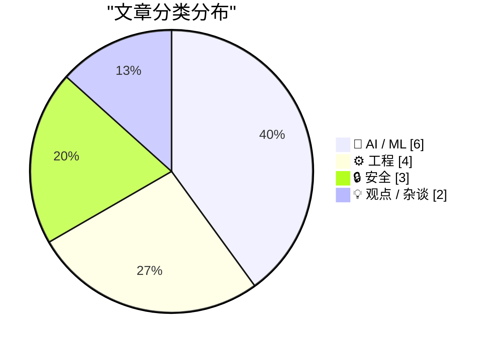
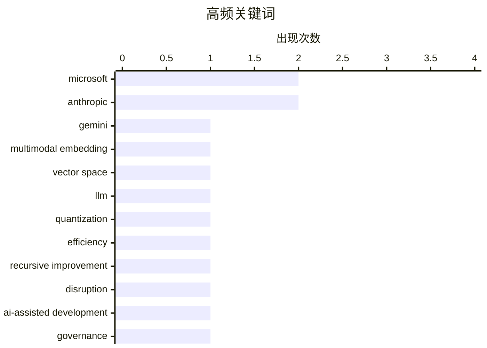

# 📰 AI 资讯每日精选 — 2026-03-12

> 汇聚 140+ 技术博客、X/Twitter、Hacker News、Reddit、Product Hunt、
> Lobste.rs、ClawFeed 日报及 GitHub Trending，经 AI 评分筛选。
>
> **本期内容**：🏆 今日必读 · 🌐 ClawFeed 日报 · 🔥 GitHub Trending · 📂 分类精选 · 🎨 设计与生成式 AI · 📊 数据概览

## 📝 今日看点

今日技术圈聚焦于AI能力的深化与伴随而来的治理挑战。多模态AI正迈向统一感知，而模型轻量化则致力于让尖端能力触手可及。与此同时，AI生成内容的可靠性问题引发行业反思，从代码审核到媒体质量，安全与责任成为关键议题。此外，重大安全漏洞与地缘网络攻击事件，持续警示着基础设施的脆弱性。

---

## 🏆 今日必读

🥇 **谷歌通过 Gemini Embedding 2 将文本、图像、视频和音频统一到单一向量空间**

[Google unifies text, image, video, and audio in a single vector space with Gemini Embedding 2](https://the-decoder.com/google-unifies-text-image-video-and-audio-in-a-single-vector-space-with-gemini-embedding-2/) — The Decoder · 5 小时前 · 🤖 AI / ML

> 谷歌发布了首个原生多模态嵌入模型 Gemini Embedding 2，旨在统一处理文本、图像、视频、音频和文档。该模型将所有模态的数据映射到同一个向量空间，从而消除了AI流程中需要多个独立模型的需求。这一技术简化了跨模态检索、搜索和理解的架构，为构建统一的多模态AI应用提供了基础。核心在于通过单一模型实现不同模态数据的语义对齐与联合表示。

💡 **为什么值得读**: 了解这一技术突破，有助于把握多模态AI从分立走向统一的核心趋势及其对应用架构的简化潜力。

🏷️ Gemini, multimodal embedding, vector space

🥈 **BitNet：适用于本地CPU的1000亿参数1比特模型**

[BitNet: 100B Param 1-Bit model for local CPUs](https://github.com/microsoft/BitNet) — Hacker News Best · 11 小时前 · 🤖 AI / ML

> 微软开源了BitNet，这是一个参数量高达1000亿但权重仅用1比特表示的创新型大语言模型。其核心方案是通过极端量化（1比特）来大幅降低模型的内存占用和计算开销。这使得如此大规模的模型有可能在消费级CPU上本地运行，为边缘部署和降低推理成本提供了新路径。该模型在Hacker News上获得286点热度，引发了关于效率与性能权衡的广泛讨论。

💡 **为什么值得读**: 对于关注大模型边缘部署、极致模型压缩和低成本推理的开发者而言，BitNet代表了一个重要的前沿探索方向。

🏷️ LLM, quantization, efficiency, Microsoft

🥉 **Anthropic：递归自我改进已至，世界上最颠覆性的公司**

[Anthropic: Recursive Self Improvement Is Here. The Most Disruptive Company In The World.](https://www.reddit.com/r/singularity/comments/1rqymbn/anthropic_recursive_self_improvement_is_here_the/) — r/singularity · 7 小时前 · 🤖 AI / ML

> 根据《时代》杂志报道，Anthropic在其Claude模型的开发中已实现了高度的递归自我改进。关键数据是，未来模型开发中70%到90%的代码由Claude自身编写。模型发布周期已从数月缩短至数周，标志着AI自我改进能力的质变。这使Anthropic在开发效率和迭代速度上获得了巨大优势，被视为当前最具颠覆性的AI公司。

💡 **为什么值得读**: 这篇文章揭示了AI自我改进已从理论步入现实，并正在以惊人速度重塑AI公司的研发模式与竞争格局。

🏷️ Anthropic, recursive improvement, disruption

4️⃣ **ArsTechnica：宕机事件后，亚马逊要求高级工程师签署批准AI辅助的代码变更**

[arstechnica: After outages, Amazon to make senior engineers sign off on AI-assisted changes](https://www.reddit.com/r/singularity/comments/1rqea30/arstechnica_after_outages_amazon_to_make_senior/) — r/singularity · 23 小时前 · ⚙️ 工程

> 在发生由AI辅助编写的代码引发的服务中断后，亚马逊出台新规，要求所有由AI辅助生成的代码变更必须经过高级工程师的审查和签署批准。这一政策直接回应了AI生成代码可能引入的不稳定性和风险。它反映了企业在积极采用AI编程工具的同时，开始建立严格的质量与责任控制机制。此举旨在平衡开发效率与系统可靠性。

💡 **为什么值得读**: 该案例为所有引入AI编程助手的团队提供了至关重要的治理范本，揭示了效率提升背后必须面对的质量与责任挑战。

🏷️ AI-assisted development, governance, incident

5️⃣ **伊朗支持的黑客宣称对医疗技术公司Stryker发起数据擦除攻击**

[Iran-Backed Hackers Claim Wiper Attack on Medtech Firm Stryker](https://krebsonsecurity.com/2026/03/iran-backed-hackers-claim-wiper-attack-on-medtech-firm-stryker/) — krebsonsecurity.com · 7 小时前 · 🔒 安全

> 一个与伊朗情报机构有关联的黑客组织宣称对全球医疗技术公司Stryker发起了一次数据擦除攻击。此次攻击影响重大，导致Stryker在其最大海外枢纽爱尔兰的5000多名员工被遣送回家。公司美国总部的语音邮件也证实其正在应对一起“建筑紧急情况”。这是一起针对关键医疗基础设施的、具有国家背景的破坏性网络攻击。

💡 **为什么值得读**: 此次攻击凸显了关键基础设施，尤其是医疗领域，面临的国家级网络威胁正在升级，安全防御刻不容缓。

🏷️ cyberattack, wiper, Iran, healthcare

---

## 🌐 ClawFeed 日报精选

> 来源：[ClawFeed](https://clawfeed.kevinhe.io) — AI 驱动的多源新闻聚合

### 🔥 今日头条

1. **OpenAI vs Anthropic 五角大楼之争全面引爆**
   Anthropic 拒绝 DoD "所有合法用途"要求（涉及大规模监控和自主武器），被国防部长 Hegseth 列为"供应链风险"，放弃约 $200M 合同。OpenAI 乘机接下合同，随即引发内部反弹——机器人部门负责人 Caitlin Kalinowski 以"原则问题"公开辞职，称"监控美国人不经司法审查、致命武器不经人类授权——这些红线本该被更多讨论"。Sam Altman 承认此举"看起来机会主义"。The Atlantic：Anthropic 的姿态可能换来"更有价值的东西"。

2. **GPT-5.4（5.3）正式发布**
   预测市场将 3 月 8 日定价为 100% 发布概率。新版融合推理、编码、agent 工作流，context window 跳至 100 万 token（前代 2.5 倍），原生支持 computer-use，整合顶级编程能力，已上线 ChatGPT、Codex 和 API。

3. **Karpathy 开源 autoresearch：单 GPU AI 研究员，过夜自主跑 100 个实验**
   630 行代码，人类写 .md 描述研究目标，AI Agent 循环迭代训练代码，每 5 分钟一个实验。X trending 第一，HN 热门，1 天内超 3,000 条讨论。[GitHub](https://github.com/karpathy/autoresearch)

4. **Anthropic 营收预期翻倍：$9B → $19B**
   NYT 深度报道，2026 年 Anthropic 全年营收预期从 $9B 升至 $19B。OpenAI vs Anthropic 竞争已进入"极度个人化"阶段，Claude 在"最佳模型"预测市场以 75% 领先。

5. **Google 为 AI Agent 开放 Gmail + Drive**
   企业 AI Agent 接入邮件与文件系统门槛大幅降低，Agent 生态向办公工具全面扩张。

---

### 📰 精选 Top 10

1. **@a16z** — Replit CEO Amjad Masad："没有编程经验正在成为优势。你需要的是韧劲和快速学习能力。未来执行成本趋近于零，瓶颈是想法。" 654K views 🔥
   https://x.com/a16z/status/2030320194900648330

2. **@AI_Jasonyu** — 《中文 X 各领域最值得关注的头部博主清单》，129 个博主，经 GPT/Claude/Gemini/Grok 四模型交叉验证 + 人工筛选，覆盖 AI/出海/创业/独开/副业。866K views，1.1K 转发
   https://x.com/AI_Jasonyu/status/2030166779096658161

3. **@LiorOnAI** — 解读 Karpathy autoresearch："It's over. You write a prompt that tells an AI agent how to think about research." 514K views，2.9K likes
   https://x.com/LiorOnAI/status/2030376700337643742

4. **@bggg_ai** — 在 Mac mini 本地跑跨境电商 AI 团队：5 个数字员工分别负责选品调研、TikTok UGC 生成、Reddit 种草、亚马逊运营，全平台矩阵打通。97K views，765 likes
   https://x.com/bggg_ai/status/2030123309594259506

5. **@aiwarts** — OpenClaw 创始人发布 32 个模型三维排名（成功率/速度/费用）。成功率前五：gemini-3-flash-preview、minimax-m2.1、kimi-k2.5、claude-sonnet-4.5；m2.5 反而垫底 35.5%。66K views
   https://x.com/aiwarts/status/2030463844188078143

6. **@axiaisacat** — 推荐开源项目 Impeccable："AI 写 UI 总有外包廉价感，因为 AI 不懂设计规范。这个项目相当于给 AI 注入顶级设计师的灵魂。" 46K views，724 likes
   https://x.com/axiaisacat/status/2030297324962857044

7. **@cnfinancewatch** — 343+ Python 量化交易/算法交易开源项目大合集（quant-learning 方向硬核干货）。87K views，456 likes
   https://x.com/cnfinancewatch/status/2030273126433783921

8. **@runes_leo** — 非程序员，43 岁咨询顾问，用 Claude Code 花 36 小时搭了"AI 幕僚长"：每天自动扫邮件、建任务、分类、派发给 6 个并行 agent。29K views
   https://x.com/runes_leo/status/2030225947203645864

9. **@lidangzzz** — OnlySpecs：导入 GitHub 项目 → 自动分析 specs 文档 → 修改 specs → 生成新代码，开发革命新范式。32K views，253 likes
   https://x.com/lidangzzz/status/2030527442167713800

10. **@chenchengpro (陈成)** — 反编译 Claude Code 的 `/loop` 命令底层实现：cron 包装器，每秒 tick 但只在 REPL 空闲时触发，含 gist 完整分析。17K views
    https://x.com/chenchengpro/status/2030291945554108720

---

### 👀 今日推荐关注

- **@LiorOnAI** (Lior Alexander) — AI 前沿进展解读，今日 autoresearch 分析获 514K views，内容高质高频，目前未关注 → 推荐
- **@kalinowski007** (Caitlin Kalinowski) — OpenAI VP of Hardware，前 Meta Reality Labs，今日因辞职声明刷屏，AI 硬件/政策一手信息来源，目前未关注 → 推荐
- **@axiaisacat** — 中文 AI 圈活跃 builder，推荐前沿开源工具，内容质量高 → 推荐
- **@jxnlco** (jason liu) — Instructor 库作者，LLM structured output 标杆，AI 工具/教育方向 → 推荐
- **@TencentAI_News** — 腾讯 AI 官方账号，QQ × OpenClaw 接入等一手动态 → 推荐

---

### 🧹 今日建议取关

- **@feibo03** (Cowboy 🔶 BNB) — Parody account，bio 全是 gmgn 返佣链接 + "抓奶工坊" Telegram 引流群，5 期简报均提及，确认建议取关。https://x.com/feibo03
- **@jordymaui** — 主聊足球 (Fulham)，AI/crypto 方向相关性低，建议核查近期推文后决定。https://x.com/jordymaui

---

### 📊 今日观察

**今天是 AI 行业政治化的标志性一天。** OpenAI 与 Anthropic 的竞争从"谁的模型更好"升级为"谁的价值观更符合国防需求"——这场博弈深刻揭示了 AI 公司在商业利益与伦理红线之间的生死抉择。Caitlin Kalinowski 的辞职声明，是这个行业良知发声的罕见时刻。

技术层面，Karpathy 的 autoresearch 和 GPT-5.4 同日出现，信号一致：**AI 自我迭代的飞轮正在加速**——不只是用 AI 写代码，而是用 AI 改进 AI 本身。"软件工程的范式已切换"不再是预言，而是现实。

OpenClaw 生态今日异常活跃：QQ 接入、深圳政府政策支持、MyClaw Backup 开源、Codex /loop 底层解析……这个生态正在从"开发者玩具"变成"新流量入口"和"个人计算新操作系统"。对于想做超级个体的人，现在入局 OpenClaw 生态恰逢其时。

量化/金融方向今日也有干货：343+ 量化开源项目合集 + BTC 宏观分析工具，值得深挖。

---

*生成时间：2026-03-08 22:00 SGT | 来源：5 期 4h 简报*

---

## 🔥 GitHub Trending

> 今日热门开源项目（全语言 + Python）

| # | 项目 | 描述 | ⭐ 总星 | 📈 今日 | 语言 |
|---|------|------|---------|---------|------|
| 1 | [msitarzewski/agency-agents](https://github.com/msitarzewski/agency-agents) 🤖 | A complete AI agency at your fingertips - From frontend w... | 29.9k | +6205 | Shell |
| 2 | [666ghj/MiroFish](https://github.com/666ghj/MiroFish) | A Simple and Universal Swarm Intelligence Engine, Predict... | 16.7k | +2909 | Python |
| 3 | [obra/superpowers](https://github.com/obra/superpowers) | An agentic skills framework & software development method... | 78.0k | +1477 | Shell |
| 4 | [alibaba/page-agent](https://github.com/alibaba/page-agent) 🤖 | JavaScript in-page GUI agent. Control web interfaces with... | 4.7k | +1206 | TypeScript |
| 5 | [NousResearch/hermes-agent](https://github.com/NousResearch/hermes-agent) 🤖 | The agent that grows with you | 5.2k | +1204 | Python |
| 6 | [bytedance/deer-flow](https://github.com/bytedance/deer-flow) | An open-source SuperAgent harness that researches, codes,... | 29.3k | +1137 | Python |
| 7 | [promptfoo/promptfoo](https://github.com/promptfoo/promptfoo) 🤖 | Test your prompts, agents, and RAGs. Red teaming/pentesti... | 12.5k | +728 | TypeScript |
| 8 | [virattt/ai-hedge-fund](https://github.com/virattt/ai-hedge-fund) 🤖 | An AI Hedge Fund Team | 48.1k | +633 | Python |
| 9 | [karpathy/nanochat](https://github.com/karpathy/nanochat) | The best ChatGPT that $100 can buy. | 46.6k | +614 | Python |
| 10 | [AstrBotDevs/AstrBot](https://github.com/AstrBotDevs/AstrBot) 🤖 | Agentic IM Chatbot infrastructure that integrates lots of... | 21.0k | +391 | Python |
| 11 | [fishaudio/fish-speech](https://github.com/fishaudio/fish-speech) | SOTA Open Source TTS | 25.8k | +277 | Python |
| 12 | [666ghj/BettaFish](https://github.com/666ghj/BettaFish) 🤖 | 微舆：人人可用的多Agent舆情分析助手，打破信息茧房，还原舆情原貌，预测未来走向，辅助决策！从0实现，不依赖任何框架。 | 38.1k | +263 | Python |
| 13 | [langflow-ai/openrag](https://github.com/langflow-ai/openrag) 🤖 | OpenRAG is a comprehensive, single package Retrieval-Augm... | 856 | +224 | Python |
| 14 | [searxng/searxng](https://github.com/searxng/searxng) | SearXNG is a free internet metasearch engine which aggreg... | 26.3k | +110 | Python |
| 15 | [vectorize-io/hindsight](https://github.com/vectorize-io/hindsight) 🤖 | Hindsight: Agent Memory That Learns | 2.7k | +87 | Python |

---

## 🤖 AI / ML

### 1. 谷歌通过 Gemini Embedding 2 将文本、图像、视频和音频统一到单一向量空间

[Google unifies text, image, video, and audio in a single vector space with Gemini Embedding 2](https://the-decoder.com/google-unifies-text-image-video-and-audio-in-a-single-vector-space-with-gemini-embedding-2/) — **The Decoder** · 5 小时前 · ⭐ 27/30

> 谷歌发布了首个原生多模态嵌入模型 Gemini Embedding 2，旨在统一处理文本、图像、视频、音频和文档。该模型将所有模态的数据映射到同一个向量空间，从而消除了AI流程中需要多个独立模型的需求。这一技术简化了跨模态检索、搜索和理解的架构，为构建统一的多模态AI应用提供了基础。核心在于通过单一模型实现不同模态数据的语义对齐与联合表示。

🏷️ Gemini, multimodal embedding, vector space

---

### 2. BitNet：适用于本地CPU的1000亿参数1比特模型

[BitNet: 100B Param 1-Bit model for local CPUs](https://github.com/microsoft/BitNet) — **Hacker News Best** · 11 小时前 · ⭐ 27/30

> 微软开源了BitNet，这是一个参数量高达1000亿但权重仅用1比特表示的创新型大语言模型。其核心方案是通过极端量化（1比特）来大幅降低模型的内存占用和计算开销。这使得如此大规模的模型有可能在消费级CPU上本地运行，为边缘部署和降低推理成本提供了新路径。该模型在Hacker News上获得286点热度，引发了关于效率与性能权衡的广泛讨论。

🏷️ LLM, quantization, efficiency, Microsoft

---

### 3. Anthropic：递归自我改进已至，世界上最颠覆性的公司

[Anthropic: Recursive Self Improvement Is Here. The Most Disruptive Company In The World.](https://www.reddit.com/r/singularity/comments/1rqymbn/anthropic_recursive_self_improvement_is_here_the/) — **r/singularity** · 7 小时前 · ⭐ 27/30

> 根据《时代》杂志报道，Anthropic在其Claude模型的开发中已实现了高度的递归自我改进。关键数据是，未来模型开发中70%到90%的代码由Claude自身编写。模型发布周期已从数月缩短至数周，标志着AI自我改进能力的质变。这使Anthropic在开发效率和迭代速度上获得了巨大优势，被视为当前最具颠覆性的AI公司。

🏷️ Anthropic, recursive improvement, disruption

---

### 4. 新研究发现：通过行业测试的AI编写代码中，一半会被真实开发者拒绝

[Half of AI-written code that passes industry test would get rejected by real developers, new study finds](https://the-decoder.com/half-of-ai-written-code-that-passes-industry-test-would-get-rejected-by-real-developers-new-study-finds/) — **The Decoder** · 6 小时前 · ⭐ 26/30

> 研究机构METR的新研究发现，在流行的SWE-bench基准测试中通过的AI代码解决方案，约有一半会被实际项目的维护者拒绝。这表明当前衡量AI编程能力的基准测试与真实世界的代码验收标准存在显著差距。AI生成的代码可能在功能上通过测试，但在代码质量、可维护性、安全性或项目规范方面不符合要求。该研究呼吁需要更贴近实践的评估体系。

🏷️ AI code generation, benchmark, developer evaluation

---

### 5. 文件显示：英伟达将投入260亿美元构建开放权重AI模型

[Nvidia Will Spend $26 Billion to Build Open-Weight AI Models, Filings Show](https://www.reddit.com/r/LocalLLaMA/comments/1rr4by8/nvidia_will_spend_26_billion_to_build_openweight/) — **r/LocalLLaMA** · 4 小时前 · ⭐ 26/30

> 英伟达计划投入巨额资金构建开放权重的AI模型。根据提交的文件，这笔高达260亿美元的投资旨在创建可公开访问权重的模型，以对抗封闭的专有模型生态系统。此举将直接挑战OpenAI、Anthropic等公司的闭源策略，并可能重塑AI基础设施的竞争格局。英伟达正从硬件供应商向AI模型创造者进行战略扩张。

🏷️ NVIDIA, open model, investment, AI strategy

---

### 6. Eon Systems科学家将果蝇大脑逐神经元复制到计算机中，并成功模拟其自主行为

[Scientists at Eon Systems just copied a fruit fly's brain into a computer. Neuron by neuron. It started walking, grooming, and feeding, doing what flies do all on its own](https://www.reddit.com/r/singularity/comments/1rqgv7y/scientists_at_eon_systems_just_copied_a_fruit/) — **r/singularity** · 22 小时前 · ⭐ 26/30

> 科学家成功实现了对果蝇大脑的完整数字化复制与模拟。Eon Systems的研究团队通过逐神经元复制，将果蝇大脑的完整连接组上传至计算机。该数字大脑在模拟环境中自发产生了行走、梳理和进食等复杂行为，且行为模式与真实果蝇相似。这项成果标志着全脑仿真技术在相对复杂生物体上取得了关键进展。

🏷️ neuroscience, simulation, AGI

---

## ⚙️ 工程

### 7. ArsTechnica：宕机事件后，亚马逊要求高级工程师签署批准AI辅助的代码变更

[arstechnica: After outages, Amazon to make senior engineers sign off on AI-assisted changes](https://www.reddit.com/r/singularity/comments/1rqea30/arstechnica_after_outages_amazon_to_make_senior/) — **r/singularity** · 23 小时前 · ⭐ 27/30

> 在发生由AI辅助编写的代码引发的服务中断后，亚马逊出台新规，要求所有由AI辅助生成的代码变更必须经过高级工程师的审查和签署批准。这一政策直接回应了AI生成代码可能引入的不稳定性和风险。它反映了企业在积极采用AI编程工具的同时，开始建立严格的质量与责任控制机制。此举旨在平衡开发效率与系统可靠性。

🏷️ AI-assisted development, governance, incident

---

### 8. Zig语言——类型解析重设计与语言变更

[Zig – Type Resolution Redesign and Language Changes](https://ziglang.org/devlog/2026/#2026-03-10) — **Hacker News Best** · 22 小时前 · ⭐ 26/30

> Zig语言开发日志公布了其类型解析系统的重大重新设计及相关语言变更。此次重构旨在解决现有类型系统的一些复杂性和边缘情况，提升语言的清晰度和一致性。变更涉及编译器内部的核心机制，可能会影响部分语言的用法和语义。该提案在Hacker News上获得388点热度，引发了社区深入讨论。

🏷️ Zig, compiler, type system, language design

---

### 9. Temporal：JavaScript中修复时间处理的9年之旅

[Temporal: The 9-Year Journey to Fix Time in JavaScript](https://www.reddit.com/r/programming/comments/1rqxh0q/temporal_the_9year_journey_to_fix_time_in/) — **r/programming** · 8 小时前 · ⭐ 26/30

> 文章回顾了为JavaScript引入新的日期时间API——Temporal的漫长标准化历程，整个过程历时约9年。Temporal旨在彻底解决现有`Date`对象在易用性、功能性和时区处理上的诸多缺陷。它提供了一个更现代、更精确且不可变的时间处理API。这一历程揭示了在广泛使用的编程语言中修复一个基础但设计糟糕的API所面临的巨大挑战与复杂性。

🏷️ JavaScript, Temporal, Date, Standard

---

### 10. SQLite WAL重置导致的数据库损坏漏洞

[SQLite WAL-reset database corruption bug](https://sqlite.org/wal.html#walresetbug) — **Lobste.rs** · 14 小时前 · ⭐ 26/30

> SQLite的WAL（预写式日志）模式存在一个可导致数据库损坏的严重漏洞。该漏洞（WAL-reset bug）在特定操作序列下，尤其是在使用`journal_mode=WAL`并执行`VACUUM`或`PRAGMA wal_checkpoint`时可能被触发。损坏表现为数据库页面混乱或索引错误，且可能不会立即被发现。SQLite官方已发布公告并建议用户检查数据库完整性。

🏷️ SQLite, database, corruption, bug

---

## 🔒 安全

### 11. 伊朗支持的黑客宣称对医疗技术公司Stryker发起数据擦除攻击

[Iran-Backed Hackers Claim Wiper Attack on Medtech Firm Stryker](https://krebsonsecurity.com/2026/03/iran-backed-hackers-claim-wiper-attack-on-medtech-firm-stryker/) — **krebsonsecurity.com** · 7 小时前 · ⭐ 26/30

> 一个与伊朗情报机构有关联的黑客组织宣称对全球医疗技术公司Stryker发起了一次数据擦除攻击。此次攻击影响重大，导致Stryker在其最大海外枢纽爱尔兰的5000多名员工被遣送回家。公司美国总部的语音邮件也证实其正在应对一起“建筑紧急情况”。这是一起针对关键医疗基础设施的、具有国家背景的破坏性网络攻击。

🏷️ cyberattack, wiper, Iran, healthcare

---

### 12. simple-git npm包存在CVSS 9.8分远程代码执行漏洞，周下载量超500万，请检查依赖锁文件

[simple-git npm package has a CVSS 9.8 RCE. 5M+ weekly downloads. check your lockfiles.](https://www.reddit.com/r/programming/comments/1rqldot/simplegit_npm_package_has_a_cvss_98_rce_5m_weekly/) — **r/programming** · 18 小时前 · ⭐ 26/30

> 流行的npm包`simple-git`被曝出存在一个CVSS评分高达9.8（严重）的远程代码执行漏洞（CVE-2026-28292）。该漏洞可通过大小写绕过的方式触发，影响范围极广，因其周下载量超过500万次，广泛存在于CI/CD管道、部署脚本和自动化工具中。由于该包常作为底层依赖被间接引入，许多项目可能并未察觉其存在。安全研究人员已发布详细分析报告。

🏷️ npm, RCE, vulnerability, supply chain

---

### 13. 微软2026年3月补丁星期二发布

[Microsoft Patch Tuesday, March 2026 Edition](https://krebsonsecurity.com/2026/03/microsoft-patch-tuesday-march-2026-edition/) — **krebsonsecurity.com** · 23 小时前 · ⭐ 25/30

> 微软发布了2026年3月“补丁星期二”安全更新，共修复至少77个漏洞。与2月份修复5个零日漏洞不同，本月没有需要紧急处理的零日漏洞。然而，部分补丁对于使用Windows的企业和组织仍值得优先关注，可能涉及权限提升或远程代码执行风险。用户应及时部署更新以缓解潜在威胁。

🏷️ Microsoft, Patch Tuesday, vulnerabilities, security

---

## 💡 观点 / 杂谈

### 14. 多元化视角：AI“记者”证明媒体老板根本不在乎（2026年3月11日）

[Pluralistic: AI "journalists" prove that media bosses don't give a shit (11 Mar 2026)](https://pluralistic.net/2026/03/11/modal-dialog-a-palooza/) — **pluralistic.net** · 4 小时前 · ⭐ 26/30

> 文章核心批判了媒体机构为削减成本而大量采用AI生成内容，却无视新闻质量与公共责任的现象。作者认为，这彻底证明了媒体所有者只关心利润，而非新闻业的本质价值。通过这一现象，文章引申出对技术被滥用于替代人类创造性工作的更广泛担忧。其核心观点是，用AI充当“记者”是媒体道德与专业标准沦丧的明证。

🏷️ AI, journalism, media, ethics

---

### 15. 我很高兴Anthropic的争斗现在发生

[I’m glad the Anthropic fight is happening now](https://www.dwarkesh.com/p/dow-anthropic) — **dwarkesh.com** · 5 小时前 · ⭐ 25/30

> 作者对当前围绕AI公司Anthropic的内部或外部争斗持积极态度。文章将这场争斗定性为“史上风险最高的谈判序幕”，暗示其关乎AI发展的控制权与未来走向。作者认为，在AI技术尚未完全成熟且监管框架形成之前暴露并解决这些冲突，比在未来危机爆发时处理更为有利。及早的冲突有助于厘清权力结构、责任归属和治理模式。

🏷️ Anthropic, AI governance, industry dynamics

---

## 🎨 Design & Generative AI

### 🖼️ 生成式图片

- **[FireRed图像编辑1.1发布：更强一致性，更优美学](https://www.reddit.com/r/comfyui/comments/1rqyn65/firered_image_edit_11_a_more_powerful_editing/)** — r/comfyui · 7 小时前
  > 介绍ComfyUI中一个在一致性和美观度上更强大的图像编辑模型更新。

- **[深入ComfyUI路线图播客](https://www.reddit.com/r/StableDiffusion/comments/1rr5ydp/inside_the_comfyui_roadmap_podcast/)** — r/StableDiffusion · 3 小时前
  > 关于ComfyUI未来发展规划的播客内容讨论。

- **[ComfyUI Anima风格探索器更新：新增提示词收藏与API支持](https://www.reddit.com/r/StableDiffusion/comments/1rr8krt/comfyui_anima_style_explorer_update_prompts/)** — r/StableDiffusion · 1 小时前
  > ComfyUI插件更新，增加了提示词管理、收藏和API集成功能。

- **[GPU升级指南：从8GB显存出发，二手卡是否可行？](https://www.reddit.com/r/StableDiffusion/comments/1rr20fx/gpu_upgrade_from_8gb_what_to_consider_used_cards/)** — r/StableDiffusion · 5 小时前
  > 讨论为运行AI图像生成模型（如Flux）而升级GPU的考虑因素。

- **[图像放大对比：Flux2.Klein 与 SeedVR2](https://www.reddit.com/r/comfyui/comments/1rqquk5/upscaling_flux2klein_vs_seedvr2/)** — r/comfyui · 12 小时前
  > 比较Flux2.Klein和SeedVR2两种AI图像放大模型的效果。

- **[ComfyUI图像处理教程：去背景、合成与调色](https://www.reddit.com/r/comfyui/comments/1rqxpgb/comfyui_for_image_manipulation_remove_bg_combine/)** — r/comfyui · 8 小时前
  > 一篇关于使用ComfyUI进行背景移除、图像合成和颜色调整的教程。

- **[图像到材质转换：wan2.2 T2i模型应用](https://www.reddit.com/r/comfyui/comments/1rqwlps/imagetomaterial_transformation_wan22_t2i/)** — r/comfyui · 8 小时前
  > 介绍使用wan2.2 T2i模型将普通图像转化为材质贴图的方法。

- **[2026年3月最佳图像修复模型探讨](https://www.reddit.com/r/StableDiffusion/comments/1rqfvrc/best_inpainting_model_march_2026/)** — r/StableDiffusion · 22 小时前
  > 社区讨论当前（2026年3月）可用的最佳AI图像修复模型。

- **[LoRA与蒸馏模型：内存占用与选择权衡](https://www.reddit.com/r/StableDiffusion/comments/1rqjbpu/loras_add_up_to_memory_and_some_are_huge_so_why/)** — r/StableDiffusion · 20 小时前
  > 探讨在LTX2等模型中，使用LoRA与使用完整蒸馏模型在内存占用和效果上的取舍。

- **[ComfyUI新节点：支持多LoRA与多提示词批量生成](https://www.reddit.com/r/comfyui/comments/1rr23ze/a_node_for_trainers_allows_nlora_x_nprompt/)** — r/comfyui · 5 小时前
  > 介绍一个为模型训练者设计的ComfyUI节点，可进行多LoRA和多提示词的组合生成。

### 🎬 生成式视频

- **[LTX 2.3机架聚焦测试：使用ComfyUI内置模板](https://www.reddit.com/r/comfyui/comments/1rqowbe/ltx_23_rack_focus_test_comfyui_builtin_template/)** — r/comfyui · 14 小时前
  > 展示在ComfyUI中使用LTX 2.3视频模型进行机架聚焦效果的测试。

- **[LTX 2.3极限测试：机架聚焦与推拉镜头](https://www.reddit.com/r/comfyui/comments/1rqtyxe/pushing_ltx_23_to_the_limit_rack_focus_dolly_out/)** — r/comfyui · 10 小时前
  > 对LTX 2.3视频生成模型进行高强度的机架聚焦和推拉镜头效果压力测试。

- **[LTX-2.3音频转视频工作流（仅需8GB显存）](https://www.reddit.com/r/comfyui/comments/1rqmt66/ltx23_audio_to_video_8gb_vram/)** — r/comfyui · 16 小时前
  > 分享一个在8GB显存限制下运行LTX-2.3进行音频到视频生成的工作流。

- **[LTX-Video 2.3双GPU工作流（3090+4060 Ti）与LoRA应用](https://www.reddit.com/r/comfyui/comments/1rr67bc/ltxvideo_23_workflow_for_dualgpu_setups_3090_4060/)** — r/comfyui · 3 小时前
  > 分享一个利用3090和4060 Ti双显卡运行LTX-Video 2.3并集成LoRA的工作流程。

- **[LTX 2.3视频到视频：能否使用潜在空间放大？](https://www.reddit.com/r/comfyui/comments/1rqp9iq/ltx_23_v2v_with_latent_upscaler_possible/)** — r/comfyui · 14 小时前
  > 探讨在LTX 2.3中进行视频到视频转换时，集成潜在空间放大技术的可能性与挑战。

---

## 📊 数据概览

| 扫描源 | 抓取文章 | 时间范围 | 精选 |
|:---:|:---:|:---:|:---:|
| 110/140 | 4602 篇 → 219 篇 | 24h | **15 篇** |

### 分类分布



### 高频关键词



<details>
<summary>📈 纯文本关键词图（终端友好）</summary>

```
microsoft             │ ████████████████████ 2
anthropic             │ ████████████████████ 2
gemini                │ ██████████░░░░░░░░░░ 1
multimodal embedding  │ ██████████░░░░░░░░░░ 1
vector space          │ ██████████░░░░░░░░░░ 1
llm                   │ ██████████░░░░░░░░░░ 1
quantization          │ ██████████░░░░░░░░░░ 1
efficiency            │ ██████████░░░░░░░░░░ 1
recursive improvement │ ██████████░░░░░░░░░░ 1
disruption            │ ██████████░░░░░░░░░░ 1
```

</details>

### 🏷️ 话题标签

**microsoft**(2) · **anthropic**(2) · **gemini**(1) · multimodal embedding(1) · vector space(1) · llm(1) · quantization(1) · efficiency(1) · recursive improvement(1) · disruption(1) · ai-assisted development(1) · governance(1) · incident(1) · cyberattack(1) · wiper(1) · iran(1) · healthcare(1) · ai(1) · journalism(1) · media(1)

---

*生成于 2026-03-12 00:02 | 汇聚 140 个技术博客、X/Twitter、Hacker News、Reddit、Product Hunt、Lobste.rs、ClawFeed 日报及 GitHub Trending，经 AI 评分筛选出 Top 15 精华内容*
