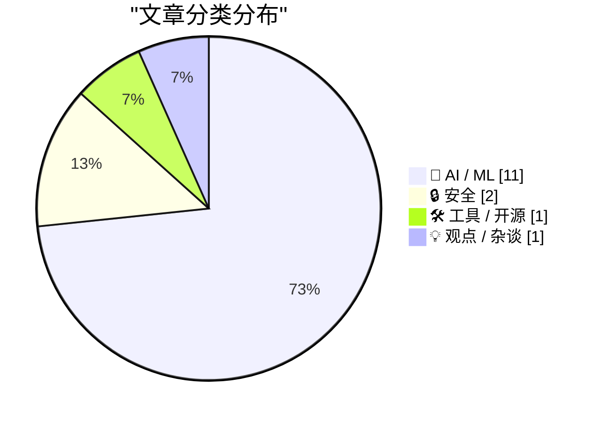
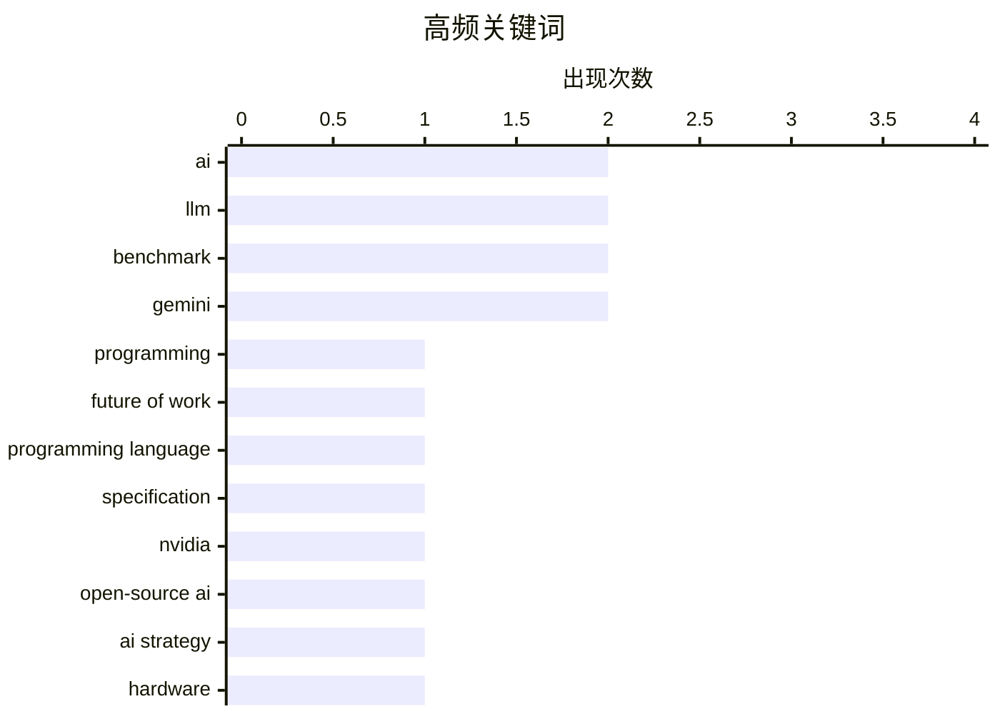

# 📰 AI 资讯每日精选 — 2026-03-13

> 汇聚 140+ 技术博客、X/Twitter、Hacker News、Reddit、Product Hunt、
> Lobste.rs、ClawFeed 日报及 GitHub Trending，经 AI 评分筛选。
>
> **本期内容**：🏆 今日必读 · 🌐 ClawFeed 日报 · 🔥 GitHub Trending · 📂 分类精选 · 🎨 设计与生成式 AI · 📊 数据概览

## 📝 今日看点

今日技术圈的核心焦点仍被人工智能的深度演进所主导。一方面，AI正从开发辅助彻底转变为软件工程的核心驱动力，重塑着从编程范式到人机协作的整个工作流。另一方面，巨头们在硬件与模型层面的战略竞争白热化，从英伟达巨资投入开源模型到Meta自研推理芯片，旨在构建更自主、高效的AI生态。同时，行业在激进的AI转型中也伴随着剧烈的结构调整与对现有技术路径的深刻反思。

---

## 🏆 今日必读

🥇 **编码者之后：我们所知的计算机编程的终结**

[Coding After Coders: The End of Computer Programming as We Know It](https://simonwillison.net/2026/Mar/12/coding-after-coders/#atom-everything) — simonwillison.net · 4 小时前 · 🤖 AI / ML

> 文章探讨了AI辅助开发如何从根本上改变软件工程行业。基于对谷歌、亚马逊、微软、苹果等公司70多名开发者的采访，揭示了AI工具（如Claude、ChatGPT）正从辅助工具转变为开发流程的核心。许多开发者表示，AI正在接管大量日常编码、调试和系统设计工作，导致编程工作的性质从“编写代码”转向“指导AI”和“定义问题”。作者认为，传统的“程序员”角色正在被重塑，软件开发的未来将更侧重于高层设计、需求沟通和对AI输出的监督与整合。

💡 **为什么值得读**: 这篇文章通过大量一线开发者的真实经历，深刻描绘了AI浪潮下程序员职业的转型阵痛与未来图景，对于任何关心技术趋势和职业发展的人都极具启发性。

🏷️ AI, programming, future of work

🥈 **Kotlin 创造者的新语言：用规范而非英语与 LLM 对话**

[Kotlin creator's new language: talk to LLMs in specs, not English](https://codespeak.dev/) — Hacker News Best · 9 小时前 · 🤖 AI / ML

> Kotlin 语言创造者推出了一款名为 CodeSpeak 的新编程语言，旨在革新人类与大型语言模型的协作方式。其核心设计理念是让开发者用精确的“规范”来表述需求，而非模糊的自然语言描述，从而生成更可靠、可预测的代码。该语言试图从根本上解决当前提示工程的不确定性问题，将编程从“用英语请求”转变为“用形式化规范定义”。

💡 **为什么值得读**: 它提出了一个颠覆性的思路，试图用工程化方法根治LLM编程的“玄学”问题，对AI时代的编程范式演进有重要参考价值。

🏷️ LLM, programming language, specification

🥉 **英伟达踏入开源AI空白区：填补OpenAI、Meta和Anthropic留下的空缺**

[Nvidia steps into the open-source AI gap that OpenAI, Meta, and Anthropic left behind](https://the-decoder.com/nvidia-steps-into-the-open-source-ai-gap-that-openai-meta-and-anthropic-left-behind/) — The Decoder · 9 小时前 · 🤖 AI / ML

> 英伟达计划在未来五年投入260亿美元用于开发“开放权重”AI模型，以填补主要AI公司在开源领域的战略空白。这一举措既是应对中国开源模型日益增长的影响力，也是一种将开发者锁定在英伟达硬件生态中的战略。通过提供强大的开源模型，英伟达旨在巩固其作为AI计算基石的地位，确保其芯片和云服务成为模型训练和推理的首选平台。

💡 **为什么值得读**: 此文揭示了AI竞赛中一个关键的战略转折点，即硬件巨头如何通过软件生态来巩固护城河，对理解行业格局至关重要。

🏷️ Nvidia, open-source AI, AI strategy, hardware

4️⃣ **单张RTX Pro 6000 Blackwell显卡上Nemotron-3-Super-120B-A12B NVFP4推理基准测试**

[Nemotron-3-Super-120B-A12B NVFP4 inference benchmark on one RTX Pro 6000 Blackwell](https://www.reddit.com/r/LocalLLaMA/comments/1rrw3g4/nemotron3super120ba12b_nvfp4_inference_benchmark/) — r/LocalLLaMA · 7 小时前 · 🤖 AI / ML

> 在单张RTX Pro 6000 Blackwell显卡上，使用vLLM对Nemotron-3-Super-120B-A12B NVFP4模型进行了全面的推理基准测试。测试采用了fp8 KV缓存，上下文长度从1K到512K，并发请求数从1到5，每个请求输出1024个令牌。测试结果为持续负载下的稳态平均值，侧重于团队协作场景而非单用户峰值性能。

💡 **为什么值得读**: 这份基准测试提供了在消费级专业显卡上运行超大规模模型的具体性能数据，对评估本地部署大模型的可行性具有直接参考价值。

🏷️ benchmark, Nemotron, vLLM, Blackwell

5️⃣ **在最便宜的MacBook上处理大数据**

[Big data on the cheapest MacBook](https://duckdb.org/2026/03/11/big-data-on-the-cheapest-macbook) — Hacker News Best · 12 小时前 · 🛠 工具 / 开源

> DuckDB团队展示了如何利用其嵌入式分析数据库，在入门款MacBook上高效处理海量数据集。通过列式存储、向量化执行和零开销管理，DuckDB能够在资源有限的硬件上执行复杂的SQL查询和分析任务。文章通过具体案例证明，强大的数据分析不再必然依赖于昂贵的服务器或云服务。

💡 **为什么值得读**: 它用实践打破了“大数据需要大硬件”的刻板印象，为个人开发者和小团队提供了极具性价比的数据处理方案。

🏷️ DuckDB, big data, performance

---

## 🌐 ClawFeed 日报精选

> 来源：[ClawFeed](https://clawfeed.kevinhe.io) — AI 驱动的多源新闻聚合

### 🔥 今日头条

1. **Cloudflare 发布 /crawl endpoint — 从反爬到帮爬**
   一个 API 调用爬完整站，返回 HTML/Markdown/JSON，支持 JS 渲染，不需要无头浏览器。做 RAG、竞品监控一把梭。8.8M views，23K bookmarks，行业震动级发布。讽刺感：Cloudflare 以前收钱帮你挡爬虫，现在收钱帮你爬别人。
   → [CloudflareDev](https://x.com/CloudflareDev)

2. **Perplexity Personal Computer — 本地 AI Agent 节点正式入场**
   Mac mini + Perplexity AI 深度整合，24/7 持续运行，跨文件/App/Session 工作，号称"开箱即用的个人 Agent 服务器"。21K likes，7.2M views，HN 激烈讨论。
   → [perplexity_ai](https://x.com/perplexity_ai/status/2031790180521427166)

3. **Vibe Coding 估值狂飙：Replit $9B / Lovable $400M ARR / 146人**
   Replit 半年从 $3B 涨到 $9B，融资 $4 亿，目标年底 $1B ARR。Lovable 上月单月新增 $1 亿 ARR，仅靠 146 人——SaaS 效率天花板被重新定义。
   → [TechCrunch Lovable](https://techcrunch.com/2026/03/11/lovable-says-it-added-100m-in-revenue-last-month-alone-with-just-146-employees/) / [Replit](https://techcrunch.com/2026/03/11/replit-snags-9b-valuation-6-months-after-hitting-3b/)

4. **腾讯 SkillHub 大规模抓取 ClawHub 数据事件**
   腾讯被爆大规模爬取 ClawHub 全部技能数据导入 SkillHub（skillhub.tencent.com），OpenClaw 创始人 @steipete 怒曝甚至收到"爬太慢"投诉，腾讯从未赞助支持原项目，回应避而不谈赞助只说"我们只拉了 1GB"。
   → [PANews](https://x.com/PANews/status/2031973921462034755)

5. **Netflix 疑似 $6 亿收购 Ben Affleck AI 初创公司**
   如属实将是 Netflix 史上最大收购之一，娱乐+AI 整合加速。同期：Atlassian 裁 1,600 人宣布转型 AI，大型软件公司 AI 替代落地加速。
   → [TechCrunch](https://techcrunch.com/2026/03/11/netflix-may-have-paid-600-million-for-ben-afflecks-ai-startup/)

---

---

## 🔥 GitHub Trending

> 今日热门开源项目（全语言 + Python）

| # | 项目 | 描述 | ⭐ 总星 | 📈 今日 | 语言 |
|---|------|------|---------|---------|------|
| 1 | [msitarzewski/agency-agents](https://github.com/msitarzewski/agency-agents) 🤖 | A complete AI agency at your fingertips - From frontend w... | 34.7k | +4086 | Shell |
| 2 | [microsoft/BitNet](https://github.com/microsoft/BitNet) | Official inference framework for 1-bit LLMs | 32.3k | +2149 | Python |
| 3 | [666ghj/MiroFish](https://github.com/666ghj/MiroFish) | A Simple and Universal Swarm Intelligence Engine, Predict... | 19.1k | +1809 | Python |
| 4 | [obra/superpowers](https://github.com/obra/superpowers) | An agentic skills framework & software development method... | 79.9k | +1708 | Shell |
| 5 | [anthropics/skills](https://github.com/anthropics/skills) 🤖 | Public repository for Agent Skills | 91.8k | +1272 | Python |
| 6 | [NousResearch/hermes-agent](https://github.com/NousResearch/hermes-agent) 🤖 | The agent that grows with you | 6.1k | +1235 | Python |
| 7 | [alibaba/page-agent](https://github.com/alibaba/page-agent) 🤖 | JavaScript in-page GUI agent. Control web interfaces with... | 5.9k | +1196 | TypeScript |
| 8 | [fishaudio/fish-speech](https://github.com/fishaudio/fish-speech) | SOTA Open Source TTS | 26.3k | +630 | Python |
| 9 | [bytedance/deer-flow](https://github.com/bytedance/deer-flow) | An open-source SuperAgent harness that researches, codes,... | 29.8k | +531 | Python |
| 10 | [virattt/ai-hedge-fund](https://github.com/virattt/ai-hedge-fund) 🤖 | An AI Hedge Fund Team | 48.5k | +523 | Python |
| 11 | [langflow-ai/openrag](https://github.com/langflow-ai/openrag) 🤖 | OpenRAG is a comprehensive, single package Retrieval-Augm... | 1.5k | +491 | Python |
| 12 | [vectorize-io/hindsight](https://github.com/vectorize-io/hindsight) 🤖 | Hindsight: Agent Memory That Learns | 3.1k | +300 | Python |
| 13 | [InsForge/InsForge](https://github.com/InsForge/InsForge) | Give agents everything they need to ship fullstack apps. ... | 3.1k | +260 | TypeScript |
| 14 | [karpathy/nanochat](https://github.com/karpathy/nanochat) | The best ChatGPT that $100 can buy. | 47.2k | +240 | Python |
| 15 | [666ghj/BettaFish](https://github.com/666ghj/BettaFish) 🤖 | 微舆：人人可用的多Agent舆情分析助手，打破信息茧房，还原舆情原貌，预测未来走向，辅助决策！从0实现，不依赖任何框架。 | 38.3k | +239 | Python |

---

## 🤖 AI / ML

### 1. 编码者之后：我们所知的计算机编程的终结

[Coding After Coders: The End of Computer Programming as We Know It](https://simonwillison.net/2026/Mar/12/coding-after-coders/#atom-everything) — **simonwillison.net** · 4 小时前 · ⭐ 27/30

> 文章探讨了AI辅助开发如何从根本上改变软件工程行业。基于对谷歌、亚马逊、微软、苹果等公司70多名开发者的采访，揭示了AI工具（如Claude、ChatGPT）正从辅助工具转变为开发流程的核心。许多开发者表示，AI正在接管大量日常编码、调试和系统设计工作，导致编程工作的性质从“编写代码”转向“指导AI”和“定义问题”。作者认为，传统的“程序员”角色正在被重塑，软件开发的未来将更侧重于高层设计、需求沟通和对AI输出的监督与整合。

🏷️ AI, programming, future of work

---

### 2. Kotlin 创造者的新语言：用规范而非英语与 LLM 对话

[Kotlin creator's new language: talk to LLMs in specs, not English](https://codespeak.dev/) — **Hacker News Best** · 9 小时前 · ⭐ 27/30

> Kotlin 语言创造者推出了一款名为 CodeSpeak 的新编程语言，旨在革新人类与大型语言模型的协作方式。其核心设计理念是让开发者用精确的“规范”来表述需求，而非模糊的自然语言描述，从而生成更可靠、可预测的代码。该语言试图从根本上解决当前提示工程的不确定性问题，将编程从“用英语请求”转变为“用形式化规范定义”。

🏷️ LLM, programming language, specification

---

### 3. 英伟达踏入开源AI空白区：填补OpenAI、Meta和Anthropic留下的空缺

[Nvidia steps into the open-source AI gap that OpenAI, Meta, and Anthropic left behind](https://the-decoder.com/nvidia-steps-into-the-open-source-ai-gap-that-openai-meta-and-anthropic-left-behind/) — **The Decoder** · 9 小时前 · ⭐ 26/30

> 英伟达计划在未来五年投入260亿美元用于开发“开放权重”AI模型，以填补主要AI公司在开源领域的战略空白。这一举措既是应对中国开源模型日益增长的影响力，也是一种将开发者锁定在英伟达硬件生态中的战略。通过提供强大的开源模型，英伟达旨在巩固其作为AI计算基石的地位，确保其芯片和云服务成为模型训练和推理的首选平台。

🏷️ Nvidia, open-source AI, AI strategy, hardware

---

### 4. 单张RTX Pro 6000 Blackwell显卡上Nemotron-3-Super-120B-A12B NVFP4推理基准测试

[Nemotron-3-Super-120B-A12B NVFP4 inference benchmark on one RTX Pro 6000 Blackwell](https://www.reddit.com/r/LocalLLaMA/comments/1rrw3g4/nemotron3super120ba12b_nvfp4_inference_benchmark/) — **r/LocalLLaMA** · 7 小时前 · ⭐ 26/30

> 在单张RTX Pro 6000 Blackwell显卡上，使用vLLM对Nemotron-3-Super-120B-A12B NVFP4模型进行了全面的推理基准测试。测试采用了fp8 KV缓存，上下文长度从1K到512K，并发请求数从1到5，每个请求输出1024个令牌。测试结果为持续负载下的稳态平均值，侧重于团队协作场景而非单用户峰值性能。

🏷️ benchmark, Nemotron, vLLM, Blackwell

---

### 5. 我曾是Manus的后端负责人：在构建智能体两年后，我完全放弃了函数调用。以下是我的替代方案。

[I was backend lead at Manus. After building agents for 2 years, I stopped using function calling entirely. Here's what I use instead.](https://www.reddit.com/r/LocalLLaMA/comments/1rrisqn/i_was_backend_lead_at_manus_after_building_agents/) — **r/LocalLLaMA** · 18 小时前 · ⭐ 25/30

> 一位前Manus后端负责人分享了其两年AI智能体开发经验，并提出了完全摒弃传统“函数调用”模式的设计理念。他认为基于严格的函数签名和参数验证的调用方式过于僵化，容易导致智能体在复杂、开放场景中失败。取而代之的是，他主张采用更灵活、基于自然语言指令和状态管理的交互范式，并已在自研的开源智能体运行时中实践了这一理念。

🏷️ agents, function calling, production

---

### 6. Meta宣布四款专注于推理的新MTIA芯片

[Meta announces four new MTIA chips, focussed on inference](https://www.reddit.com/r/LocalLLaMA/comments/1rrxx2f/meta_announces_four_new_mtia_chips_focussed_on/) — **r/LocalLLaMA** · 6 小时前 · ⭐ 25/30

> Meta公布了其四代定制AI芯片MTIA的详细信息，这些芯片主要专注于提升AI推理任务的效率。此举是Meta减少对英伟达等外部供应商依赖、降低AI运营成本战略的关键部分。自研芯片有助于优化其庞大的推荐系统、广告和AI助手等服务的推理性能与能效。

🏷️ Meta, MTIA, AI chip, inference

---

### 7. Gemini的任务自动化功能来了，而且非常强大 | The Verge

[Gemini’s task automation is here and it’s wild | The Verge](https://www.reddit.com/r/singularity/comments/1rs1r4j/geminis_task_automation_is_here_and_its_wild_the/) — **r/singularity** · 3 小时前 · ⭐ 25/30

> 谷歌Gemini推出了任务自动化功能，该功能允许AI模型直接操作用户的电脑界面以执行复杂任务。通过理解自然语言指令，Gemini可以自动完成诸如整理文件夹、编辑文档、预订行程等跨应用程序的操作。这标志着AI从内容生成向实际工作流程自动化的重大跨越，模糊了数字助手与自动化机器人的界限。

🏷️ Gemini, task automation, AI agent

---

### 8. Grok 4.20在基准测试中大幅落后于Gemini和GPT-5.4，但在避免幻觉方面创下新纪录

[Grok 4.20 trails Gemini and GPT-5.4 by a wide margin but sets a new record for not hallucinating](https://the-decoder.com/grok-4-20-trails-gemini-and-gpt-5-4-by-a-wide-margin-but-sets-a-new-record-for-not-hallucinating/) — **The Decoder** · 4 小时前 · ⭐ 24/30

> xAI发布的Grok 4.20模型在主流基准测试中表现远不及Gemini和GPT-5.4等顶级模型。然而，其突出优势在于成本低、响应速度快，并且在避免“幻觉”（生成虚假信息）方面创造了新的纪录。这表明该模型在追求极致可靠性的特定场景下可能具有独特价值，而非追求全能冠军。

🏷️ Grok, benchmark, hallucination, LLM

---

### 9. 美国战争部CTO称Anthropic的AI模型因内置伦理“污染”供应链

[US War Department CTO says Anthropic's AI models "pollute" the supply chain with built-in ethics](https://the-decoder.com/us-military-chief-says-anthropics-ai-models-pollute-the-supply-chain-with-built-in-ethics/) — **The Decoder** · 5 小时前 · ⭐ 24/30

> 美国战争部因Anthropic的Claude模型内置了过于严格的伦理准则，计划将其排除在军事供应链之外。该部门首席技术官认为，这些预设的伦理约束“污染”了供应链，限制了AI在军事场景下的潜在应用。这一立场被类比为中国对AI的政治管控模式，引发了关于AI伦理与国家安全之间平衡的争议。核心观点是，军事机构需要不受“过度伦理化”限制的AI工具，以确保其行动自由和技术优势。

🏷️ ethics, Anthropic, policy, supply chain

---

### 10. Copilot Health标志着微软携手OpenAI和Anthropic正式加入AI医疗竞赛

[Copilot Health marks Microsoft's entry into the AI health race alongside OpenAI and Anthropic](https://the-decoder.com/copilot-health-marks-microsofts-entry-into-the-ai-health-race-alongside-openai-and-anthropic/) — **The Decoder** · 6 小时前 · ⭐ 24/30

> 微软正式推出AI健康助手Copilot Health，进军由OpenAI和Anthropic参与的AI医疗赛道。该助手能整合来自可穿戴设备、电子病历和实验室结果的数据，为用户提供个性化健康建议。微软的长期目标是开发“医疗超级智能”，旨在提升医疗诊断和健康管理的智能化水平。这表明科技巨头正将生成式AI的核心竞争从通用领域转向医疗等垂直高价值行业。

🏷️ Microsoft, healthcare, Copilot, AI assistant

---

### 11. ChatGPT仍主导聊天机器人市场，但统治力下滑，谷歌Gemini正抢占份额

[ChatGPT still leads the chatbot market but its dominance is slipping as Google's Gemini gains ground](https://the-decoder.com/chatgpt-still-leads-the-chatbot-market-but-its-dominance-is-slipping-as-googles-gemini-gains-ground/) — **The Decoder** · 7 小时前 · ⭐ 24/30

> ChatGPT目前仍占据聊天机器人市场首位，但其主导地位正被谷歌Gemini快速侵蚀。Similarweb最新数据显示，在短短十二个月内，ChatGPT的市场份额已从75.7%下降至61.7%。与此同时，谷歌Gemini的市场份额从5.7%飙升至24.4%，增长了四倍。这表明聊天机器人市场正从OpenAI一家独大转向双巨头激烈竞争的格局。

🏷️ market share, ChatGPT, Gemini, competition

---

## 🔒 安全

### 12. AI人脸识别误判，无辜祖母被错误监禁数月

[Innocent woman jailed after being misidentified using AI facial recognition](https://www.grandforksherald.com/news/north-dakota/ai-error-jails-innocent-grandmother-for-months-in-north-dakota-fraud-case) — **Hacker News Best** · 3 小时前 · ⭐ 24/30

> 美国北达科他州一名无辜的祖母因AI人脸识别系统错误匹配，在一起欺诈案中被误判并监禁了数月。这起事件暴露了执法机构使用AI生物识别技术存在的严重准确性与可靠性问题。案件引发了关于AI技术司法应用缺乏监管、算法偏见以及对个人权利造成不可逆伤害的广泛讨论。它警示我们，未经充分验证的AI系统若被用于司法关键决策，可能导致灾难性后果。

🏷️ AI ethics, facial recognition, bias, legal

---

### 13. Malus – 洁净室即服务

[Malus – Clean Room as a Service](https://malus.sh) — **Hacker News Best** · 10 小时前 · ⭐ 24/30

> Malus是一项创新的“洁净室即服务”，旨在为软件开发提供高度隔离、安全、可验证的构建环境。其核心目标是解决软件供应链安全中的“信任”问题，通过确保构建过程的纯净性，从源头防御依赖污染、恶意代码注入等攻击。该项目在Hacker News上获得极高关注（965点，379评论），反映了开发者社区对构建安全性的迫切需求。它代表了一种通过工程化手段保障软件供应链完整性的前沿实践。

🏷️ clean room, security, service

---

## 🛠 工具 / 开源

### 14. 在最便宜的MacBook上处理大数据

[Big data on the cheapest MacBook](https://duckdb.org/2026/03/11/big-data-on-the-cheapest-macbook) — **Hacker News Best** · 12 小时前 · ⭐ 25/30

> DuckDB团队展示了如何利用其嵌入式分析数据库，在入门款MacBook上高效处理海量数据集。通过列式存储、向量化执行和零开销管理，DuckDB能够在资源有限的硬件上执行复杂的SQL查询和分析任务。文章通过具体案例证明，强大的数据分析不再必然依赖于昂贵的服务器或云服务。

🏷️ DuckDB, big data, performance

---

## 💡 观点 / 杂谈

### 15. ‘毁灭性打击’：Atlassian在推进AI前裁员1600人

[‘Devastating blow’: Atlassian lays off 1,600 workers ahead of AI push](https://www.reddit.com/r/programming/comments/1rrnsc3/devastating_blow_atlassian_lays_off_1600_workers/) — **r/programming** · 12 小时前 · ⭐ 25/30

> 软件公司Atlassian宣布裁员1600人，此举被描述为“毁灭性打击”，是其转向人工智能战略调整的一部分。裁员发生在公司加大对AI领域投资和产品整合的背景下，反映了技术行业在AI转型过程中面临的结构性重组和成本压力。

🏷️ layoffs, AI, industry trend

---

## 🎨 Design & Generative AI

### 🖥️ 生成式 UI

- **[求助：如何将个人电脑构建为可通过手机访问的AI应用服务器？](https://www.reddit.com/r/comfyui/comments/1rs2tbw/if_i_wanted_to_build_a_personal_app_to_run_my_pc/)** — r/comfyui · 3 小时前
  > 用户寻求指导，希望将个人电脑搭建为服务器，以便通过手机访问本地运行的Ollama等AI文本生成服务。

### 🖼️ 生成式图片

- **[警告：更新ComfyUI至1.41.15版本可能导致子图加载错误](https://www.reddit.com/r/comfyui/comments/1rrdld5/beware_of_updating_comfy_to_14115/)** — r/comfyui · 22 小时前
  > 用户报告更新ComfyUI特定前端包后，加载包含子图的工作流时出现413错误。

- **[实测：Z-Image Base模型在写实修复方面表现惊人](https://www.reddit.com/r/comfyui/comments/1rrqkkf/so_turns_out_zimage_base_is_really_good_at/)** — r/comfyui · 10 小时前
  > 用户分享发现Z-Image Base模型在写实风格修复（inpainting）方面表现优异，并附上了工作流程。

- **[ComfyUI极限测试：LTX 2.3模型实现极致Z轴深度渲染](https://www.reddit.com/r/comfyui/comments/1rrohg3/pushing_ltx_23_extreme_zaxis_depth_418s_render/)** — r/comfyui · 12 小时前
  > 展示使用ComfyUI和LTX 2.3模型进行长达418秒的深度渲染测试，结构保持完好。

- **[开源：为ComfyUI定制的专用人脸检测与分割模型节点](https://www.reddit.com/r/StableDiffusion/comments/1rrlh4o/custom_face_detection_segmentation_models_with/)** — r/StableDiffusion · 15 小时前
  > 在StableDiffusion社区分享了一个GitHub项目，提供了用于ComfyUI的定制人脸检测和分割模型节点。

- **[深入探索：Z-Image Base角色LoRA的用途与价值思考](https://www.reddit.com/r/StableDiffusion/comments/1rrw3an/my_zimage_base_character_lora_journey_has_left_me/)** — r/StableDiffusion · 7 小时前
  > 作者分享其深入研究Z-Image Base/Turbo模型LoRA训练的经历，并探讨其实际应用场景。

- **[发布：Anima-Preview2-8步加速LoRA模型](https://www.reddit.com/r/StableDiffusion/comments/1rrs5u0/animapreview28stepturbolora/)** — r/StableDiffusion · 9 小时前
  > 社区分享了一个名为Anima-Preview2-8-Step-Turbo-Lora的加速LoRA模型。

- **[技术探讨：能否将12块RTX A2000显卡算力合并用于单个ComfyUI任务？](https://www.reddit.com/r/comfyui/comments/1rrywsl/can_i_combine_the_power_of_miningrig_12_rtx_a2000/)** — r/comfyui · 5 小时前
  > 用户询问是否可能以及如何将多张专业显卡的算力聚合，以加速ComfyUI的图生图工作流。

- **[求推荐：当前用于NSFW图像生成的最佳模型有哪些？](https://www.reddit.com/r/comfyui/comments/1rs2cm0/best_models_for_nsfw_image_generation_right_now/)** — r/comfyui · 3 小时前
  > 用户在ComfyUI社区发帖，咨询目前适用于生成NSFW内容的最佳检查点、LoRA和工作流。

### 🎬 生成式视频

- **[OpenAI拟将Sora视频AI整合进ChatGPT，触及9.2亿用户](https://the-decoder.com/openai-is-reportedly-planning-to-integrate-its-video-ai-sora-into-chatgpt/)** — The Decoder · 11 小时前
  > 报道称OpenAI计划将其视频生成模型Sora集成到ChatGPT中，以扩大用户覆盖。

- **[ComfyUI节点包新增Kling 3.0运动控制支持](https://www.reddit.com/r/comfyui/comments/1rru7wh/added_kling_30_motion_control_support_to/)** — r/comfyui · 8 小时前
  > ComfyUI的一个节点包更新，添加了对Kling 3.0视频模型运动控制功能的支持。

- **[仅用3个节点！ComfyUI实现人脸替换视频工作流（含音频）](https://www.reddit.com/r/comfyui/comments/1rs4b13/i_built_a_face_swap_video_workflow_in_comfyui/)** — r/comfyui · 2 小时前
  > 用户分享了一个简洁的ComfyUI工作流，使用ReActor和VideoHelperSuite实现带音频的人脸替换视频生成。

- **[ComfyUI使用LTX2模型生成视频出现异常结果](https://www.reddit.com/r/StableDiffusion/comments/1rrfna5/weird_results_in_comfyui_using_ltx2/)** — r/StableDiffusion · 20 小时前
  > 用户反映在使用ComfyUI和LTX2模型生成视频时，出现画面停滞、内容与提示不符等奇怪问题。

- **[简易制作：使用Wan 2.2文生视频模型创造神秘探索短片](https://www.reddit.com/r/StableDiffusion/comments/1rrn3q9/visual_adventuring_mysterious_exploratory_video/)** — r/StableDiffusion · 13 小时前
  > 展示如何利用Wan 2.2文本到视频模型简单快速地生成具有神秘探索风格的视频片段。

- **[预告：WAN 2.7视频生成模型将于本月发布](https://www.reddit.com/r/comfyui/comments/1rrn5ez/wan_27_will_be_released_this_month/)** — r/comfyui · 13 小时前
  > 社区消息称，WAN文本到视频模型的2.7版本计划在本月内发布。

---

## 📊 数据概览

| 扫描源 | 抓取文章 | 时间范围 | 精选 |
|:---:|:---:|:---:|:---:|
| 118/140 | 5138 篇 → 252 篇 | 24h | **15 篇** |

### 分类分布



### 高频关键词



<details>
<summary>📈 纯文本关键词图（终端友好）</summary>

```
ai                   │ ████████████████████ 2
llm                  │ ████████████████████ 2
benchmark            │ ████████████████████ 2
gemini               │ ████████████████████ 2
programming          │ ██████████░░░░░░░░░░ 1
future of work       │ ██████████░░░░░░░░░░ 1
programming language │ ██████████░░░░░░░░░░ 1
specification        │ ██████████░░░░░░░░░░ 1
nvidia               │ ██████████░░░░░░░░░░ 1
open-source ai       │ ██████████░░░░░░░░░░ 1
```

</details>

### 🏷️ 话题标签

**ai**(2) · **llm**(2) · **benchmark**(2) · gemini(2) · programming(1) · future of work(1) · programming language(1) · specification(1) · nvidia(1) · open-source ai(1) · ai strategy(1) · hardware(1) · nemotron(1) · vllm(1) · blackwell(1) · duckdb(1) · big data(1) · performance(1) · layoffs(1) · industry trend(1)

---

*生成于 2026-03-13 00:04 | 汇聚 140 个技术博客、X/Twitter、Hacker News、Reddit、Product Hunt、Lobste.rs、ClawFeed 日报及 GitHub Trending，经 AI 评分筛选出 Top 15 精华内容*
