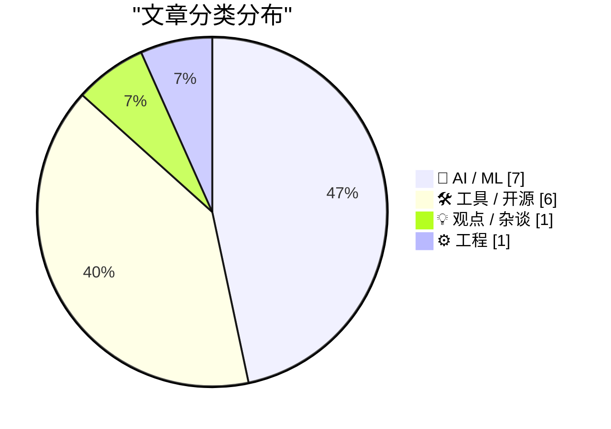
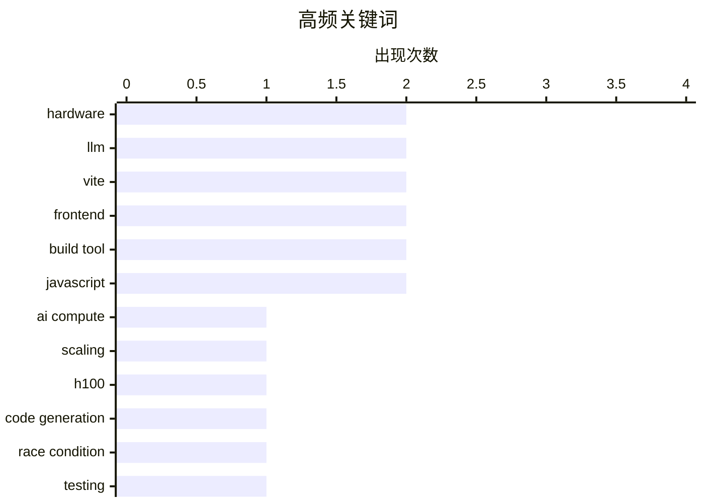

# 📰 AI 资讯每日精选 — 2026-03-14

> 汇聚 140+ 技术博客、X/Twitter、Hacker News、Reddit、Product Hunt、
> Lobste.rs、ClawFeed 日报及 GitHub Trending，经 AI 评分筛选。
>
> **本期内容**：🏆 今日必读 · 🌐 ClawFeed 日报 · 🔥 GitHub Trending · 📂 分类精选 · 🎨 设计与生成式 AI · 📊 数据概览

## 📝 今日看点

今日技术圈聚焦于AI算力竞赛与生态演变。一方面，尖端算力资源持续紧俏且地缘政治因素加剧其获取复杂性，另一方面，大模型正通过惊人的长上下文能力和针对性的小模型微调，向实用化与成本控制纵深发展。同时，AI编程智能体的进化与行业对程序员未来的思辨，共同揭示了软件开发范式正在经历的根本性重塑。

---

## 🏆 今日必读

🥇 **深入探讨扩展AI算力的三大瓶颈，以及为何今天的H100比三年前更值钱**

[Dylan Patel — Deep dive on the 3 big bottlenecks to scaling AI compute](https://www.dwarkesh.com/p/dylan-patel) — dwarkesh.com · 8 小时前 · 🤖 AI / ML

> 文章深入分析了当前扩展人工智能计算能力时面临的三个主要瓶颈。这些瓶颈限制了AI模型训练和推理的规模与效率。作者指出，由于供应链限制、技术迭代和市场需求，英伟达H100 GPU在当前的市场环境下，其实际价值甚至高于三年前发布时。核心结论是，算力已成为比算法更稀缺的战略资源，其获取和优化是AI发展的关键制约因素。

💡 **为什么值得读**: 本文提供了对AI基础设施瓶颈的稀缺内部视角，有助于理解当前AI竞赛背后的硬件现实与经济学。

🏷️ AI compute, scaling, hardware, H100

🥈 **生成代码中的竞态条件（测试涵盖10个模型，5次运行）**

[Race conditions in generated code (tested across 10 models, 5 runs)](https://www.reddit.com/r/programming/comments/1rsx3bo/race_conditions_in_generated_code_tested_across/) — r/programming · 4 小时前 · 🤖 AI / ML

> 作者发现，过去一年审查的大多数Web应用在LLM请求处理上都存在竞态条件。通过系统性测试10个最流行的编程用LLM（进行了5轮运行），发现所有模型默认都会产生相同的竞态条件问题。关键在于，所有模型都能在得到适当提示后解决该问题。文章提供了完整的分析和一个可验证的Jupyter Notebook链接。

💡 **为什么值得读**: 该研究揭示了当前AI辅助编程中一个普遍但容易被忽视的系统性风险，并提供了可复现的解决方案。

🏷️ LLM, code generation, race condition, testing

🥉 **Claude Opus 4.6与Sonnet 4.6的100万上下文窗口现已全面开放**

[1M context is now generally available for Opus 4.6 and Sonnet 4.6](https://simonwillison.net/2026/Mar/13/1m-context/#atom-everything) — simonwillison.net · 5 小时前 · 🤖 AI / ML

> Anthropic宣布，Claude Opus 4.6和Sonnet 4.6模型现已全面支持100万token的上下文窗口。最令人惊讶的是，标准定价适用于整个100万窗口，没有长上下文溢价。相比之下，OpenAI的GPT和Google的Gemini都对超过特定长度的提示收取额外费用。这标志着大模型长上下文能力进入平价实用阶段。

💡 **为什么值得读**: 了解Claude在长上下文定价上的突破性策略，有助于评估和选择高性价比的大模型API服务。

🏷️ LLM, context window, Claude, pricing

4️⃣ **AI时代之后，程序员将何去何从？**

[What do coders do after AI?](https://anildash.com/2026/03/13/coders-after-ai/) — anildash.com · 1 天前 · 💡 观点 / 杂谈

> 文章探讨了在AI（特别是能充当整个软件工厂的LLM）飞速进化的当下，程序员的未来角色与命运。AI正在从根本上改变软件创造的经济学和权力动态，目前主要被用于取代大量技术工人。但作者认为，这并非故事的终点，技术工作者需要重新定位自己的价值。核心观点是，程序员需要从代码编写者转变为AI系统的设计者、指导者和伦理守护者。

💡 **为什么值得读**: 本文超越了技术替代的焦虑，为程序员在AI主导的未来中寻找新的定位和价值提供了深刻思考。

🏷️ AI, programmers, future, career

5️⃣ **字节跳动在马来西亚获取英伟达Blackwell集群访问权，规避美国对华出口禁令**

[Bytedance secures access to Nvidia Blackwell cluster in Malaysia, circumventing US export ban on China](https://the-decoder.com/bytedance-secures-access-to-nvidia-blackwell-cluster-in-malaysia-circumventing-us-export-ban-on-china/) — The Decoder · 10 小时前 · 🤖 AI / ML

> 据《华尔街日报》报道，TikTok母公司字节跳动计划在马来西亚使用约36,000块英伟达Blackwell芯片。美国出口管制禁止这些高端芯片直接进入中国，即使特朗普政府近期的放宽政策也明确排除了此类芯片。此举被视为通过第三方地点（马来西亚）获取受限算力的典型规避策略。

💡 **为什么值得读**: 本文揭示了地缘政治如何具体影响全球AI算力竞赛，以及科技巨头如何应对日益复杂的监管环境。

🏷️ NVIDIA, export ban, Bytedance, chips

---

## 🌐 ClawFeed 日报精选

> 来源：[ClawFeed](https://clawfeed.kevinhe.io) — AI 驱动的多源新闻聚合

### 🔥 今日头条

### 1. Nvidia GTC 2026 Jensen Huang 主题演讲
今年 AI 芯片圈年度最大事件，市场预期 Blackwell Ultra 及下一代推理架构发布，可能重塑 AI 硬件格局。全球 AI 从业者屏息以待。
→ https://techcrunch.com/2026/03/12/how-to-watch-jensen-huangs-nvidia-gtc-2026-keynote/

### 2. AI 裁员潮加速：Atlassian 裁员 10%（~1,600人），明确归因 AI
继 Block 之后，Jira/Confluence 母公司 Atlassian CEO 以 4 分钟视频宣布裁员，理由直接：AI 提升了效率，不再需要这么多人。AI 替代浪潮从"趋势"变成"财报事实"。
→ https://techcrunch.com/2026/03/12/atlassian-follows-blocks-footsteps-and-cuts-staff-in-the-name-of-ai/

### 3. AI 人脸识别多起冤案同日引爆：无辜女性被捕入狱
北达科他州和田纳西州先后曝出 AI 人脸识别误判导致无辜人被捕的案例，在 HN 同日双双热榜。AI 刑事司法应用风险正式进入主流舆论焦点。
→ https://www.grandforksherald.com/news/north-dakota/ai-error-jails-innocent-grand
→ https://www.theguardian.com/us-news/2026/mar/12/tennessee-grandmother-ai-fraud

### 4. Google 正式完成 $320 亿收购 Wiz
谷歌史上最大收购落地，全现金拿下以色列云安全龙头，巩固 GCP 安全护城河。云安全+AI 的整合意图清晰。
→ https://techcrunch.com/2026/03/11/google-completes-32b-acquisition-of-wiz/

### 5. Sam Altman 国会听证：公开承认"AI 正在打破劳动力与资本的平衡，没有人知道该怎么办"
这句话从 OpenAI CEO 口中说出，意义远不同于学界讨论。AI 对就业结构冲击首次获得最高话语权的正面承认。
→ https://fortune.com/2026/03/12/sam-altman-ai-killing-labor-capital-balance/

---

### 📰 精选 Top 10

1. **美军官员首次公开谈及 LLM 用于军事打击目标决策** — MIT Tech Review 独家，战争+AI 边界持续扩大，这是最直接的官方确认。
   → https://www.technologyreview.com/2026/03/12/1134243/defense-official-military-use-ai-chatbots-targeting-decisions/

2. **Meta 旗舰新 AI 模型因性能问题内部叫停、延期上线** — 扎克伯格 All-in AI 战略以来最大公开挫折，模型竞赛内卷之下的压力可见一斑。
   → https://www.reuters.com/technology/meta-delays-rollout-new-ai-model-nyt-reports-2026-03-12/

3. **Karpathy："智能停电" + "We need bigger IDEs"** — OAuth 故障导致 autoresearch 全崩，呼吁 AI 基础设施故障切换；另提出 agentic org 可以像代码一样被 fork，思路超前。
   → https://x.com/karpathy/status/2031792523187040643

4. **Claude 新增跨 Microsoft Excel + PowerPoint 共享上下文** — 在 Excel 分析数据，直接丢进 PPT 生成演示，Anthropic × Microsoft 深度集成迈出重要一步。
   → https://venturebeat.com/orchestration/anthropic-gives-claude-shared-context-across-microsoft-excel-and-powerpoint-enabling-ai-to-work-across-office-apps/

5. **Mastercard + DBS + UOB 在新加坡率先落地 Agentic Payments** — AI Agent 自主完成支付，无需人工确认，新加坡成为全球 AI 金融基础设施测试场。（本地重点）
   → https://www.artificialintelligence-news.com/news/mastercard-agentic-payments-singapore-dbs-uob/

6. **OpenRouter 神秘 1 万亿参数免费 AI 模型出现，无人知晓来源** — 有人猜是 GPT 5.5，有人猜是 GPT 5.0，OpenAI 未确认。信息战还是真实泄露，值得追踪。
   → https://x.com/JulianGoldieSEO/status/2032376550663078062

7. **Lovable：上月单月营收 +$1 亿，员工仅 146 人** — No-code AI 应用生成平台的效率已超越传统软件公司一个数量级，这个数字今天最让人震惊。
   → https://techcrunch.com/2026/03/11/lovable-revenue/

8. **Replit 估值半年从 $30 亿飙至 $90 亿** — AI 辅助编程工具资本热度不减，3 倍涨幅说明市场对 AI coding 赛道的信心仍在加速累积。
   → https://techcrunch.com/2026/03/11/replit-snags-9b-valuation-6-months-after-hitting-3b/

9. **乌克兰宣布向 AI 公司提供无人机战场视频用于训练** — 真实战场数据直接进入下一代 AI 训练集，战争与 AI 融合进入新阶段。
   → https://www.nytimes.com/2026/03/12/technology/ukraine-drone-ai-training.html

10. **Grammarly 被作家起诉：未经授权将作者变为 AI 编辑** — 版权 vs AI 训练数据法律战扩大，Grammarly 用用户文章训练 AI 且赋予 AI 其署名，判决可能影响行业惯例。
    → https://techcrunch.com/2026/03/12/a-writer-is-suing-grammarly-for-turning-her-and-other-authors-into-ai-editors-without-consent/

---

### 📊 今日观察

今天是 2026 年 AI 叙事几条主线同时爆发的一天：

**裁员 + AI** 已从"担忧"变成"事实"——Atlassian 和 Block 这样的成熟科技公司直接点名 AI 是裁员原因，这个口子一开，后续会有更多跟风者。Sam Altman 在国会的那句"没有人知道该怎么办"是今天最诚实也最值得咀嚼的信号。

**AI 执法风险** 在同一天出现两起人脸识别冤案，不是巧合，是累积的系统性问题集中曝光。AI 在高风险领域（刑事司法、军事打击决策）的应用边界正在成为新的监管战场。

**Agent 范式** 继续深化：Mastercard 新加坡落地 Agentic Payments、Gemini 接管 Android App、Claude 跨 Office 应用——AI 从"对话工具"向"自主代理"的转型在这一周已经是密集落地而非概念了。

**Nvidia GTC** 是今天最大的悬念：Jensen 讲完，AI 硬件格局可能要重新定价。

---

*来源：5 份 4h 简报（04:38 / 08:38 / 12:38 / 16:42 / 20:38 SGT）*
*Browser/Twitter 工具本日不可用，Feed 精选基于 TechCrunch / VentureBeat / HN RSS + Twitter 部分可见内容*

---

## 🔥 GitHub Trending

> 今日热门开源项目（全语言 + Python）

| # | 项目 | 描述 | ⭐ 总星 | 📈 今日 | 语言 |
|---|------|------|---------|---------|------|
| 1 | [msitarzewski/agency-agents](https://github.com/msitarzewski/agency-agents) 🤖 | A complete AI agency at your fingertips - From frontend w... | 39.9k | +5758 | Shell |
| 2 | [666ghj/MiroFish](https://github.com/666ghj/MiroFish) | A Simple and Universal Swarm Intelligence Engine, Predict... | 21.8k | +2887 | Python |
| 3 | [microsoft/BitNet](https://github.com/microsoft/BitNet) | Official inference framework for 1-bit LLMs | 33.9k | +2223 | Python |
| 4 | [obra/superpowers](https://github.com/obra/superpowers) | An agentic skills framework & software development method... | 81.9k | +2096 | Shell |
| 5 | [lightpanda-io/browser](https://github.com/lightpanda-io/browser) 🤖 | Lightpanda: the headless browser designed for AI and auto... | 15.4k | +2085 | Zig |
| 6 | [volcengine/OpenViking](https://github.com/volcengine/OpenViking) 🤖 | OpenViking is an open-source context database designed sp... | 8.9k | +1938 | Python |
| 7 | [promptfoo/promptfoo](https://github.com/promptfoo/promptfoo) 🤖 | Test your prompts, agents, and RAGs. Red teaming/pentesti... | 15.2k | +1850 | TypeScript |
| 8 | [alibaba/page-agent](https://github.com/alibaba/page-agent) 🤖 | JavaScript in-page GUI agent. Control web interfaces with... | 7.5k | +1467 | TypeScript |
| 9 | [p-e-w/heretic](https://github.com/p-e-w/heretic) | Fully automatic censorship removal for language models | 12.9k | +1162 | Python |
| 10 | [anthropics/skills](https://github.com/anthropics/skills) 🤖 | Public repository for Agent Skills | 92.8k | +1033 | Python |
| 11 | [AstrBotDevs/AstrBot](https://github.com/AstrBotDevs/AstrBot) 🤖 | Agentic IM Chatbot infrastructure that integrates lots of... | 23.8k | +952 | Python |
| 12 | [langflow-ai/openrag](https://github.com/langflow-ai/openrag) 🤖 | OpenRAG is a comprehensive, single package Retrieval-Augm... | 2.2k | +905 | Python |
| 13 | [public-apis/public-apis](https://github.com/public-apis/public-apis) | A collective list of free APIs | 409.4k | +895 | Python |
| 14 | [InsForge/InsForge](https://github.com/InsForge/InsForge) | Give agents everything they need to ship fullstack apps. ... | 3.6k | +763 | TypeScript |
| 15 | [NousResearch/hermes-agent](https://github.com/NousResearch/hermes-agent) 🤖 | The agent that grows with you | 6.7k | +752 | Python |

---

## 🤖 AI / ML

### 1. 深入探讨扩展AI算力的三大瓶颈，以及为何今天的H100比三年前更值钱

[Dylan Patel — Deep dive on the 3 big bottlenecks to scaling AI compute](https://www.dwarkesh.com/p/dylan-patel) — **dwarkesh.com** · 8 小时前 · ⭐ 27/30

> 文章深入分析了当前扩展人工智能计算能力时面临的三个主要瓶颈。这些瓶颈限制了AI模型训练和推理的规模与效率。作者指出，由于供应链限制、技术迭代和市场需求，英伟达H100 GPU在当前的市场环境下，其实际价值甚至高于三年前发布时。核心结论是，算力已成为比算法更稀缺的战略资源，其获取和优化是AI发展的关键制约因素。

🏷️ AI compute, scaling, hardware, H100

---

### 2. 生成代码中的竞态条件（测试涵盖10个模型，5次运行）

[Race conditions in generated code (tested across 10 models, 5 runs)](https://www.reddit.com/r/programming/comments/1rsx3bo/race_conditions_in_generated_code_tested_across/) — **r/programming** · 4 小时前 · ⭐ 27/30

> 作者发现，过去一年审查的大多数Web应用在LLM请求处理上都存在竞态条件。通过系统性测试10个最流行的编程用LLM（进行了5轮运行），发现所有模型默认都会产生相同的竞态条件问题。关键在于，所有模型都能在得到适当提示后解决该问题。文章提供了完整的分析和一个可验证的Jupyter Notebook链接。

🏷️ LLM, code generation, race condition, testing

---

### 3. Claude Opus 4.6与Sonnet 4.6的100万上下文窗口现已全面开放

[1M context is now generally available for Opus 4.6 and Sonnet 4.6](https://simonwillison.net/2026/Mar/13/1m-context/#atom-everything) — **simonwillison.net** · 5 小时前 · ⭐ 26/30

> Anthropic宣布，Claude Opus 4.6和Sonnet 4.6模型现已全面支持100万token的上下文窗口。最令人惊讶的是，标准定价适用于整个100万窗口，没有长上下文溢价。相比之下，OpenAI的GPT和Google的Gemini都对超过特定长度的提示收取额外费用。这标志着大模型长上下文能力进入平价实用阶段。

🏷️ LLM, context window, Claude, pricing

---

### 4. 字节跳动在马来西亚获取英伟达Blackwell集群访问权，规避美国对华出口禁令

[Bytedance secures access to Nvidia Blackwell cluster in Malaysia, circumventing US export ban on China](https://the-decoder.com/bytedance-secures-access-to-nvidia-blackwell-cluster-in-malaysia-circumventing-us-export-ban-on-china/) — **The Decoder** · 10 小时前 · ⭐ 26/30

> 据《华尔街日报》报道，TikTok母公司字节跳动计划在马来西亚使用约36,000块英伟达Blackwell芯片。美国出口管制禁止这些高端芯片直接进入中国，即使特朗普政府近期的放宽政策也明确排除了此类芯片。此举被视为通过第三方地点（马来西亚）获取受限算力的典型规避策略。

🏷️ NVIDIA, export ban, Bytedance, chips

---

### 5. 微调Qwen 3.5 2B模型，在真实听写清理任务上击败同量化级别的4B、9B、27B和35B模型（RTX 4080 Super，计算成本低于1英镑）

[Fine-tuned Qwen 3.5 2B to beat same-quant 4B, 9B, 27B, and 35B on a real dictation cleanup task, full pipeline, code, and eval (RTX 4080 Super, under £1 compute)](https://www.reddit.com/r/LocalLLaMA/comments/1rstcy3/finetuned_qwen_35_2b_to_beat_samequant_4b_9b_27b/) — **r/LocalLLaMA** · 6 小时前 · ⭐ 26/30

> 作者针对一个真实产品任务（macOS听写应用VoiceInk的实时听写清理），对Qwen 3.5 2B参数模型进行了微调。在161个保留样本的评估中，这个微调后的2B模型击败了同模型家族同量化级别的4B、9B、27B甚至35B版本，所有性能差距均具有统计显著性（p < .0001）。整个流程在RTX 4080 Super上完成，计算成本低于1英镑。这证明了针对特定任务的小规模定向微调，可以极大超越通用大模型的性能。

🏷️ fine-tuning, model efficiency, evaluation, Qwen

---

### 6. 多元视角：另外三种AI精神错乱（2026年3月12日）

[Pluralistic: Three more AI psychoses (12 Mar 2026)](https://pluralistic.net/2026/03/12/normal-technology/) — **pluralistic.net** · 21 小时前 · ⭐ 25/30

> 科利·多克托罗在其专栏中讨论了“另外三种AI精神错乱”，批判性地审视了当前围绕AI的过度炒作和非理性恐惧。文章延续了其将AI技术“祛魅”、将其视为普通技术进行冷静分析的风格。作者旨在呼吁公众以更平常、理性的态度看待AI的进展与局限，避免陷入技术决定论或末日论的极端叙事。

🏷️ AI ethics, psychosis, critique

---

### 7. 在 Transformer 内部执行程序以实现指数级加速推理

[Executing programs inside transformers with exponentially faster inference](https://www.reddit.com/r/LocalLLaMA/comments/1rshs60/executing_programs_inside_transformers_with/) — **r/LocalLLaMA** · 15 小时前 · ⭐ 25/30

> 这项研究提出了一种创新方法，将程序执行能力直接内化到 Transformer 模型架构中，旨在实现推理速度的指数级提升。传统方法需要模型生成代码再由外部解释器执行，而该方法让模型在推理过程中内部模拟程序状态，减少了与外部环境的频繁交互开销。其核心思想是通过特定的训练机制，使 Transformer 能够学习并“运行”程序逻辑，从而在解决某些可程序化的问题时，获得远超传统自回归生成方式的效率。这为突破大语言模型推理速度瓶颈提供了一条有潜力的技术路径。

🏷️ transformer, inference speed, program execution

---

## 🛠 工具 / 开源

### 8. Y Combinator支持的Random Labs发布Slate V1，号称首个“集群原生”编程智能体

[Y Combinator-backed Random Labs launches Slate V1, claiming the first 'swarm-native' coding agent](https://www.reddit.com/r/singularity/comments/1rse5it/y_combinatorbacked_random_labs_launches_slate_v1/) — **r/singularity** · 19 小时前 · ⭐ 26/30

> 获得Y Combinator投资的Random Labs公司推出了其首款产品Slate V1。该产品自称是第一个“集群原生”的编程智能体，其核心创新在于采用“集群”架构，让多个AI智能体协同工作以完成复杂的编码任务。这代表了AI编程助手从单一智能体向多智能体协作系统演进的新趋势。

🏷️ AI coding agent, Y Combinator, developer tools

---

### 9. 我能在本地运行AI吗？

[Can I run AI locally?](https://www.canirun.ai/) — **Hacker News Best** · 11 小时前 · ⭐ 25/30

> CanIRun.ai是一个在线工具，旨在帮助用户快速评估自己的电脑硬件是否满足在本地运行各种AI模型的要求。用户可以选择特定的AI模型（如Llama、Stable Diffusion等），该工具会分析其系统的CPU、GPU、内存等配置，并给出明确的“是/否”答案以及性能预期。这解决了开发者和爱好者尝试本地部署AI时面临的首要硬件兼容性问题。

🏷️ local AI, tool, guide, hardware

---

### 10. Vite 8.0 正式发布

[Vite 8.0 Is Out](https://vite.dev/blog/announcing-vite8) — **Hacker News Best** · 19 小时前 · ⭐ 25/30

> Vite 8.0 作为下一代前端构建工具发布了重要更新。新版将 Rollup 升级至 v4，并默认启用现代浏览器构建目标，移除了对 Node.js 14/16 和旧版 Safari 的支持。性能方面，通过优化热更新路径和重构服务启动逻辑，冷启动速度提升了约 20%，并引入了实验性的 Lightning CSS 转换器。此外，开发服务器现在默认仅监听 localhost，并改进了对 Bun 包管理器的支持。Vite 8.0 标志着其生态在追求更快的开发体验和更现代的浏览器兼容性上又迈进一步。

🏷️ Vite, frontend, build tool, JavaScript

---

### 11. Vite 8.0 Is Out

[Vite 8.0 Is Out](https://www.reddit.com/r/programming/comments/1rsmz9u/vite_80_is_out/) — **r/programming** · 10 小时前 · ⭐ 25/30

> submitted by   <a href="https://www.reddit.com/user/iamkeyur"> /u/iamkeyur </a> <br/> <span><a href="https://vite.dev/blog/announcing-vite8">[link]</a></span>   <span><a href="https://www.reddit.com/r

🏷️ Vite, frontend, build tool, JavaScript

---

### 12. [项目] JudgeGPT —— 具备可配置评分标准、思维链推理和实时 GPU 遥测的开源 LLM 即评委基准测试工具

[[Project] JudgeGPT — open-source LLM-as-judge benchmarking tool with configurable scoring rubrics, CoT reasoning, and real-time GPU telemetry](https://www.reddit.com/r/MachineLearning/comments/1rsxcl3/project_judgegpt_opensource_llmasjudge/) — **r/MachineLearning** · 4 小时前 · ⭐ 25/30

> JudgeGPT 是一个旨在解决现有 LLM 即评委方法不可靠问题的开源本地评估工具。它针对位置偏差、冗长偏差、同模型家族偏差（导致分数膨胀约 5-7%）以及小模型中的宽松评分聚类等问题，提供了可配置的评分标准、思维链推理和实时 GPU 监控功能。用户可以通过 Ollama 在本地运行该工具，对任何模型进行自主评估。该工具为研究人员和开发者提供了一个更可控、透明的基准测试环境，以减少评估中的系统性偏差。

🏷️ LLM evaluation, benchmarking, open source

---

### 13. Understudy：通过 GUI 演示学习任务的本地优先桌面智能体（MIT 开源协议）

[Understudy: local-first, desktop agent that learns tasks from gui demonstrations (MIT, open source)](https://www.reddit.com/r/LocalLLaMA/comments/1rsavl4/understudy_localfirst_desktop_agent_that_learns/) — **r/LocalLLaMA** · 21 小时前 · ⭐ 25/30

> Understudy 是一个遵循本地优先原则、在桌面端运行的智能体，其核心功能是通过观察用户的图形界面操作来学习并复现任务。该项目采用 MIT 开源协议，强调隐私和数据控制，所有学习过程均在本地完成。它能够记录用户在 GUI 上的交互（如点击、输入），并生成可重复执行的任务脚本。这为自动化重复性桌面工作流提供了一种直观、无需编程的解决方案，将智能体技术应用于具体的生产力场景。

🏷️ desktop-agent, GUI-automation, open-source, MIT

---

## 💡 观点 / 杂谈

### 14. AI时代之后，程序员将何去何从？

[What do coders do after AI?](https://anildash.com/2026/03/13/coders-after-ai/) — **anildash.com** · 1 天前 · ⭐ 26/30

> 文章探讨了在AI（特别是能充当整个软件工厂的LLM）飞速进化的当下，程序员的未来角色与命运。AI正在从根本上改变软件创造的经济学和权力动态，目前主要被用于取代大量技术工人。但作者认为，这并非故事的终点，技术工作者需要重新定位自己的价值。核心观点是，程序员需要从代码编写者转变为AI系统的设计者、指导者和伦理守护者。

🏷️ AI, programmers, future, career

---

## ⚙️ 工程

### 15. 卡塔尔氦气停产使芯片供应链进入两周倒计时

[Qatar helium shutdown puts chip supply chain on a two-week clock](https://www.tomshardware.com/tech-industry/qatar-helium-shutdown-puts-chip-supply-chain-on-a-two-week-clock) — **Hacker News Best** · 11 小时前 · ⭐ 26/30

> 卡塔尔的氦气生产设施因故关闭，给全球芯片供应链带来了紧迫压力。氦气是芯片制造过程中冷却和刻蚀等关键环节的必需元素。供应链目前仅剩大约两周的氦气库存，如果停产持续，可能导致全球芯片生产中断。该事件凸显了半导体供应链中某些看似不起眼但至关重要的环节的脆弱性。

🏷️ supply chain, helium, semiconductor, manufacturing

---

## 🎨 Design & Generative AI

### 🖼️ 生成式图片

- **[Comfy节点设计器：轻松创建自定义ComfyUI节点](https://www.reddit.com/r/StableDiffusion/comments/1rswxnb/comfy_node_designer_create_your_own_custom/)** — r/StableDiffusion · 4 小时前
  > 一款简化ComfyUI自定义节点创建流程的工具。

- **[首个基于Stable Diffusion 3.5的动漫模型发布](https://www.reddit.com/r/StableDiffusion/comments/1rsqbo9/release_of_the_first_stable_diffusion_35_based/)** — r/StableDiffusion · 8 小时前
  > 发布了首个基于SD3.5的动漫风格图像生成模型。

- **[发布针对LTX2.3的新推理优化节点](https://www.reddit.com/r/StableDiffusion/comments/1rt0pta/releasing_many_new_inferencing_improvement_nodes/)** — r/StableDiffusion · 2 小时前
  > 发布了专注于LTX2.3模型推理性能改进的新ComfyUI节点。

- **[ComfySketch Pro发布：ComfyUI内的完整绘图工作室](https://www.reddit.com/r/comfyui/comments/1rsv9z7/comfysketch_pro_is_out_full_drawing_studio_inside/)** — r/comfyui · 5 小时前
  > 在ComfyUI内集成了功能齐全的绘图工作室工具。

- **[ComfyStudio发布：新增导演模式功能](https://www.reddit.com/r/comfyui/comments/1rsfsio/comfystudio_released_as_promised_but_delayed_new/)** — r/comfyui · 17 小时前
  > 发布了ComfyStudio，并解释了其新的导演模式功能。

- **[ComfyUI全景贴纸更新：绘画工具与帧缝合回归](https://www.reddit.com/r/comfyui/comments/1rs9czs/comfyui_panorama_stickers_update_paint_tools_and/)** — r/comfyui · 22 小时前
  > 更新了全景贴纸生成功能，重新加入了绘画工具和帧缝合。

- **[ComfyUI容器化与SageAttention预构建包](https://www.reddit.com/r/comfyui/comments/1rsp6yb/comfyui_containerization_and_sageattention/)** — r/comfyui · 9 小时前
  > 分享了ComfyUI的Docker容器化项目及SageAttention的预构建安装包。

- **[Z-Image Turbo LoRA修复工具](https://www.reddit.com/r/StableDiffusion/comments/1rsm731/zimage_turbo_lora_fixing_tool/)** — r/StableDiffusion · 11 小时前
  > 发布了一个用于修复Z-Image Turbo LoRA模型的工具。

- **[新工作流分享：LTX-2.3三阶段联合IC控制](https://www.reddit.com/r/StableDiffusion/comments/1rsq3w1/i_like_to_share_a_new_workflow_ltx23_3_stage_whit/)** — r/StableDiffusion · 8 小时前
  > 分享了一个使用DPose进行多阶段联合控制的LTX-2.3工作流程。

- **[模型加载是ComfyUI工作流中最慢的环节吗？](https://www.reddit.com/r/comfyui/comments/1rsqmyr/is_model_loading_the_slowest_part_of_your_comfyui/)** — r/comfyui · 8 小时前
  > 探讨通过快照恢复模型来加速ComfyUI工作流中模型加载的方法。

- **[1000欧元以下，ComfyUI和AI生成的最佳GPU选择？](https://www.reddit.com/r/comfyui/comments/1rstodg/best_gpu_for_comfyui_and_ai_generation_under_1000/)** — r/comfyui · 6 小时前
  > 寻求在预算内为ComfyUI和AI生成任务选择最佳GPU的建议。

### 🌍 世界模型 / 3D

- **[Luma发布：Tony Hou的3DxAI工作流快速创建高级特效](https://x.com/LumaLabsAI/status/2032495520242147731)** — 𝕏 @LumaLabsAI · 7 小时前
  > 展示了艺术家利用Luma的3DxAI工作流快速创建复杂特效的案例。

### 🎬 生成式视频

- **[Yedp动作导演更新：面部动作捕捉与动画序列](https://www.reddit.com/r/comfyui/comments/1rsctvz/face_mocap_and_animation_sequencing_update_for/)** — r/comfyui · 20 小时前
  > 更新了面部动作捕捉功能，可将Mixamo动画转换为ControlNet控制。

- **[LTX2.3联合控制LoRA：6GB显存的视频编辑工作流](https://www.reddit.com/r/comfyui/comments/1rshlod/ltx23_ic_union_control_lora_6gb_of_vram_workflow/)** — r/comfyui · 15 小时前
  > 分享了一个仅需6GB显存的LTX2.3视频编辑工作流程。

- **[单次生成25秒视频：对内存与算力的新需求](https://www.reddit.com/r/StableDiffusion/comments/1rsuv41/generating_25_seconds_in_a_single_go_now_i_just/)** — r/StableDiffusion · 5 小时前
  > 展示了单次生成25秒长视频的能力，但需要更高的硬件配置。

---

## 📊 数据概览

| 扫描源 | 抓取文章 | 时间范围 | 精选 |
|:---:|:---:|:---:|:---:|
| 118/140 | 5280 篇 → 216 篇 | 24h | **15 篇** |

### 分类分布



### 高频关键词



<details>
<summary>📈 纯文本关键词图（终端友好）</summary>

```
hardware        │ ████████████████████ 2
llm             │ ████████████████████ 2
vite            │ ████████████████████ 2
frontend        │ ████████████████████ 2
build tool      │ ████████████████████ 2
javascript      │ ████████████████████ 2
ai compute      │ ██████████░░░░░░░░░░ 1
scaling         │ ██████████░░░░░░░░░░ 1
h100            │ ██████████░░░░░░░░░░ 1
code generation │ ██████████░░░░░░░░░░ 1
```

</details>

### 🏷️ 话题标签

**hardware**(2) · **llm**(2) · **vite**(2) · frontend(2) · build tool(2) · javascript(2) · ai compute(1) · scaling(1) · h100(1) · code generation(1) · race condition(1) · testing(1) · context window(1) · claude(1) · pricing(1) · ai(1) · programmers(1) · future(1) · career(1) · nvidia(1)

---

*生成于 2026-03-14 00:05 | 汇聚 140 个技术博客、X/Twitter、Hacker News、Reddit、Product Hunt、Lobste.rs、ClawFeed 日报及 GitHub Trending，经 AI 评分筛选出 Top 15 精华内容*
