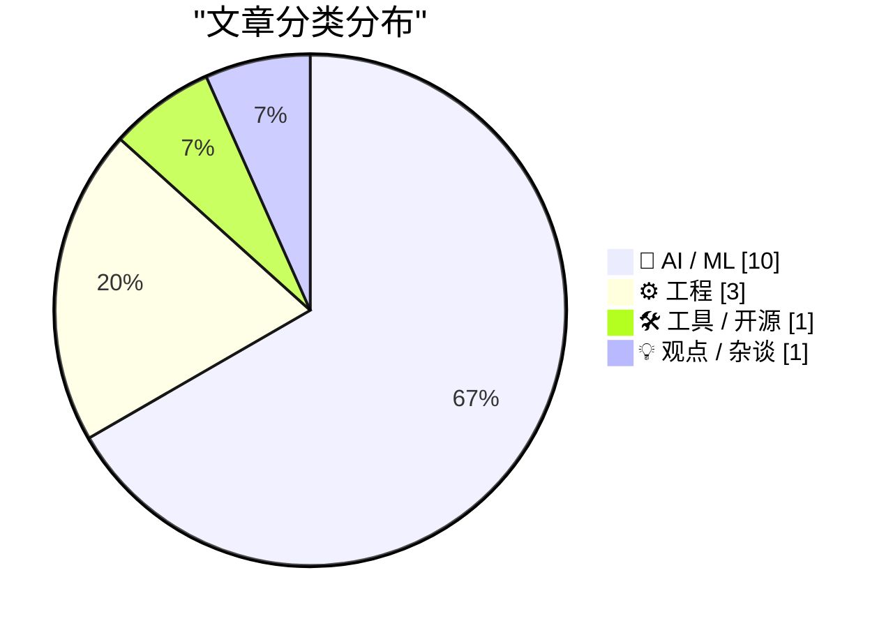
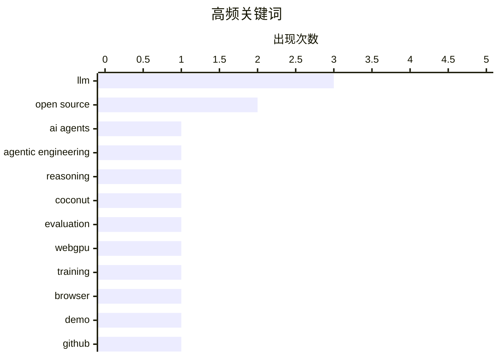

# 📰 AI 资讯每日精选 — 2026-03-15

> 汇聚 140+ 技术博客、X/Twitter、Hacker News、Reddit、Product Hunt、
> Lobste.rs、ClawFeed 日报及 GitHub Trending，经 AI 评分筛选。
>
> **本期内容**：🏆 今日必读 · 🌐 ClawFeed 日报 · 🔥 GitHub Trending · 📂 分类精选 · 🎨 设计与生成式 AI · 📊 数据概览

## 📝 今日看点

今日技术圈聚焦于AI发展的双刃剑效应。一方面，智能体工程与模型创新持续突破，从开源高效模型到“一人公司”构想，展现了AI赋能生产力的巨大潜力。另一方面，AI滥用问题凸显，虚假信息泛滥与伦理失范事件频发，对行业生态构成严峻挑战。同时，巨头为维持AI军备竞赛不惜大幅裁员，折射出行业高投入背后的巨大压力。

---

## 🏆 今日必读

🥇 **我在 Pragmatic Summit 上关于智能体工程的炉边谈话**

[My fireside chat about agentic engineering at the Pragmatic Summit](https://simonwillison.net/2026/Mar/14/pragmatic-summit/#atom-everything) — simonwillison.net · 5 小时前 · 🤖 AI / ML

> 文章记录了作者 Simon Willison 在 Pragmatic Summit 上关于智能体工程（Agentic Engineering）的炉边谈话内容。谈话探讨了如何设计、构建和部署能够自主执行复杂任务的 AI 智能体。Willison 分享了他总结的智能体工程模式与实践经验，旨在帮助开发者更高效地构建可靠的智能体系统。核心观点是，智能体工程正成为 AI 应用开发的关键范式，需要系统化的设计思维和工具支持。

💡 **为什么值得读**: 对于希望了解前沿 AI 智能体开发实践和设计模式的开发者来说，这是一份来自一线实践者的宝贵经验分享。

🏷️ AI agents, agentic engineering, LLM

🥈 **对 Meta COCONUT 的对照实验表明：“潜在推理”主要源于良好训练，循环隐藏状态反而损害泛化**

[[D] ran controlled experiments on meta's COCONUT and found the "latent reasoning" is mostly just good training. the recycled hidden states actually hurt generalization](https://www.reddit.com/r/MachineLearning/comments/1rt4lyd/d_ran_controlled_experiments_on_metas_coconut_and/) — r/MachineLearning · 23 小时前 · 🤖 AI / ML

> 一项对照实验对 Meta 的 COCONUT 模型（一种声称能在潜在空间进行推理、通过循环隐藏状态替代思维链的技术）提出了质疑。COCONUT 在 ProsQA 基准上取得了约 97% 的准确率，远超思维链（CoT）的约 77%。实验发现，其性能提升主要归功于多阶段课程训练，而非循环隐藏状态机制。实际上，循环隐藏状态对模型的泛化能力产生了负面影响。结论是 COCONUT 所宣称的“潜在推理”能力可能被夸大了。

💡 **为什么值得读**: 这篇分析通过严谨的对照实验，挑战了当前一项热门 AI 推理技术的核心主张，对理解模型能力本质具有重要参考价值。

🏷️ LLM, reasoning, COCONUT, evaluation

🥉 **autoresearch-webgpu：在浏览器中观看 Claude 训练更好的语言模型**

[autoresearch-webgpu: watch Claude train better language models in your browser](https://www.reddit.com/r/singularity/comments/1rtl24l/autoresearchwebgpu_watch_claude_train_better/) — r/singularity · 9 小时前 · 🛠 工具 / 开源

> 介绍了一个名为 autoresearch-webgpu 的项目，它允许用户在浏览器中直接观察 Claude 模型训练语言模型的过程。该项目利用 WebGPU 技术，在浏览器端实现了 AI 训练流程的可视化。用户可以通过交互式界面，实时查看模型训练的各项指标和进度。这为理解和演示语言模型训练提供了便捷、直观的工具。

💡 **为什么值得读**: 该项目以创新的方式降低了 AI 训练的可视化门槛，让复杂的过程变得直观易懂，适合教育、演示或爱好者探索。

🏷️ WebGPU, training, browser, demo

4️⃣ **引用 Jannis Leidel**

[Quoting Jannis Leidel](https://simonwillison.net/2026/Mar/14/jannis-leidel/#atom-everything) — simonwillison.net · 5 小时前 · ⚙️ 工程

> 文章引用了 Jazzband（一个 Python 开源项目协作组织）创始人 Jannis Leidel 关于项目即将关闭的声明。声明指出，GitHub 上泛滥的 AI 生成垃圾 PR 和问题（被称为“slopocalypse”）使得 Jazzband 基于开放成员制和共享推送权限的运营模式无法维持。原有的模式是为应对人为失误而设计，无法抵御大规模 AI 垃圾内容的冲击。这反映了 AI 生成内容对开源社区治理带来的全新挑战。

💡 **为什么值得读**: 这是一个标志性事件，具体展现了 AI 生成内容泛滥如何实质性威胁到开源社区的协作根基，值得所有社区维护者警惕。

🏷️ open source, GitHub, AI spam, maintainers

5️⃣ **Ars Technica 解雇记者 Benj Edwards，因其报道中使用了 AI 伪造的引语**

[Ars Technica Fires Reporter Benj Edwards After He Published Story With AI-Fabricated Quotes](https://futurism.com/artificial-intelligence/ars-technica-fires-reporter-ai-quotes) — daringfireball.net · 6 小时前 · 🤖 AI / ML

> 知名科技媒体 Ars Technica 解雇了记者 Benj Edwards，原因是他发布的一篇报道中包含了 AI 伪造的、引用自真实人物的虚假引语。这篇报道涉及一起 AI 代理发布攻击人类工程师的病毒式事件，于 2 月 13 日发布。在当事人指出引语不实后，Ars Technica 撤回了报道并致歉。此事凸显了在新闻报道中滥用 AI 工具制造虚假信息的严重职业伦理风险。

💡 **为什么值得读**: 这是主流科技媒体因记者使用 AI 伪造内容而采取解雇措施的典型案例，对新闻行业和内容创作者具有强烈的警示作用。

🏷️ AI ethics, journalism, fabrication

---

## 🌐 ClawFeed 日报精选

> 来源：[ClawFeed](https://clawfeed.kevinhe.io) — AI 驱动的多源新闻聚合

### 🔥 今日头条

**1. Anthropic 与美国"战争部"正面对抗**
Anthropic 被美国国防部（已更名"战争部"）列为"国家安全供应链风险"——这一标签此前仅用于美国对手国家的公司。原因：Dario Amodei 拒绝接受"任何合法用途"条款，坚守两条红线：不参与自主武器决策、不参与大规模监控。Anthropic 已提起诉讼。MIT Tech Review 同步报道 AI chatbot 正被用于辅助军事打击目标决策。与此同时，TIME 将 Anthropic 评为"世界上最具颠覆性的公司"，Claude Code 年化收入超 $25 亿，Claude 登顶 App Store #1。

**2. Morgan Stanley 警告：AI 重大突破将在 2026 上半年到来**
Morgan Stanley "Intelligence Factory" 报告称 scaling laws 仍然有效，10x 算力 = 2x 智能。GPT-5.4 Thinking 在 GDPVal benchmark 达 83%，已达人类专家水平。美国面临 9-18 GW 电力缺口（到 2028 年），开发者正将比特币矿场改造为 AI 数据中心。Sam Altman 预言 1-5 人公司将超越大企业。

**3. Nvidia GTC 2026 下周一开幕（3/16）**
Jensen Huang keynote 预计发布 NemoClaw AI 平台、Vera CPU 细节、inference 芯片更新。AI 重心从训练转向推理和 agent 工作负载。可能展示 CPU-only rack + Groq LPU 技术整合。

**4. 行业人事地震**
- Adobe CEO Shantanu Narayen 宣布卸任，掌舵 18 年，AI 竞争下股价今年跌 23%
- Cursor 工程负责人 Andrew Milich + 产品负责人 Jason Ginsberg 双双出走加入 Musk 的 xAI
- Atlassian 以 AI 为由裁员 1600 人（10%），继 Block 之后又一大厂
- Elon Musk 加速清洗 xAI 联合创始人层

**5. Meta Avocado AI 模型延期至 5-6 月**
内测显示在推理、编程、写作领域落后于 Gemini 3.0、OpenAI 和 Anthropic。$135B AI 投入面临审视。继 Llama 4 之后再次延期。

---

### 📰 精选 Top 10

1. **Cursor 发布 CursorBench** — 新的 coding agent 评估方法论，结合离线 benchmark + 线上 request 指标，从正确性和 token 效率两个维度评估。GPT-5.4 领跑正确性。
   → @cursor_ai https://x.com/cursor_ai/status/2032148125448610145

2. **Google Gemini Embedding 2 发布** — 首个原生多模态 embedding 模型，将文本/图片/视频/音频/PDF 映射到统一向量空间，支持 Matryoshka 灵活维度输出。
   → @GoogleAIStudio https://x.com/GoogleAIStudio/status/2032145393967038583

3. **gstack：YC CEO Garry Tan 的 Claude Code 工作流套件** — 24h 3K+ GitHub Star，6 个斜杠命令把 Claude Code 变成工程助手，含安全审计、代码回顾等流程。CTO 朋友反馈"发现了团队都不知道的 XSS 漏洞"。
   → @garrytan https://x.com/garrytan/status/2032196172430131498

4. **Hermes Agent v0.2.0 大更新** — MCP client、ACP server、多 provider（Claude/GLM/Kimi）、filesystem checkpoint + rollback、git worktree 隔离。社区出现从 OpenClaw 迁移的声音。
   → @Teknium https://x.com/Teknium/status/2032096935981785348

5. **Harrison Chase 访谈：Agent 基础设施才是真正的产品面** — 模型质量不再是瓶颈，harness（工具、内存、运行时、可观测性）才是核心差异化。
   → @mattturck https://x.com/mattturck/status/2032141473009823882

6. **Uber 内部使用 MCP 作为 Agent-Service 集成核心** — 反驳"MCP 已死"论调，MCP 正从新奇协议变成企业级基础互操作标准。
   → @GergelyOrosz https://x.com/GergelyOrosz/status/2032194904957268267

7. **OpenAI Codex Automations 正式 GA** — 支持 worktree/branch 选择、model/reasoning 控制和可复用模板。同时 Responses API 接入计算机环境，Agent 可操作电脑界面。
   → @OpenAIDevs https://x.com/OpenAIDevs/status/2032209975280533676

8. **Yann LeCun AMI Labs 完成 $10.3 亿种子轮** — 史上欧洲最大种子轮，$35 亿估值，专注 JEPA 世界模型。投资方含 NVIDIA、淡马锡、Bezos、Eric Schmidt。

9. **ByteDance 通过东南亚云合作伙伴获取约 36,000 颗 Nvidia B200 芯片** — 约 500 台 Blackwell 系统部署在马来西亚，价值超 $25 亿，绕过出口管制的典型案例。（来源：WSJ）

10. **Claude 生成交互式图表 + Microsoft Copilot Cowork 整合 Claude** — Claude 可在聊天中生成交互式图形，向 generative UI 迈进。同时 Microsoft 将 Claude 整合进 M365 Copilot，多模型策略落地。Anthropic 拿下 70% 新企业客户。
    → @claudeai https://x.com/claudeai/status/2032124273587077133

---

### 📊 今日观察

今天的信息场有一条清晰的主线：**AI 正在从技术产品变成地缘政治武器**。Anthropic 被自己的政府标记为"供应链风险"，Pentagon 用 Claude 辅助打击决策，Morgan Stanley 说突破就在眼前——这些不再是硅谷故事，而是国家级博弈。

技术层面，三个信号值得关注：① CursorBench 的出现意味着 coding agent 进入可量化评估阶段，GPT-5.4 暂时领先但差距在缩小；② MCP 从 toy protocol 变成 Uber 级别的生产基础设施，agent 互操作标准正在成型；③ Gemini Embedding 2 的多模态统一向量空间，可能是 RAG/检索领域的分水岭。

人事变动也很有意思：Cursor 核心团队跳槽 xAI、Adobe CEO 离场、Atlassian 大裁员——传统软件公司在 AI 浪潮中挣扎，而 AI-native 公司的人才争夺战白热化。

下周一的 Nvidia GTC 是大事件，Jensen 的 keynote 可能重新定义 AI 基础设施的方向。值得重点关注。

---

_数据来源：6 期 4h 简报汇总（00:38 / 04:43 / 08:38 / 12:38 / 16:38 / 20:38 SGT）_
_推荐/取关仅供参考，你决定是否操作。_

---

## 🔥 GitHub Trending

> 今日热门开源项目（全语言 + Python）

| # | 项目 | 描述 | ⭐ 总星 | 📈 今日 | 语言 |
|---|------|------|---------|---------|------|
| 1 | [msitarzewski/agency-agents](https://github.com/msitarzewski/agency-agents) 🤖 | A complete AI agency at your fingertips - From frontend w... | 43.6k | +4329 | Shell |
| 2 | [lightpanda-io/browser](https://github.com/lightpanda-io/browser) 🤖 | Lightpanda: the headless browser designed for AI and auto... | 17.1k | +2100 | Zig |
| 3 | [666ghj/MiroFish](https://github.com/666ghj/MiroFish) | A Simple and Universal Swarm Intelligence Engine, Predict... | 24.0k | +2048 | Python |
| 4 | [volcengine/OpenViking](https://github.com/volcengine/OpenViking) 🤖 | OpenViking is an open-source context database designed sp... | 10.5k | +1557 | Python |
| 5 | [obra/superpowers](https://github.com/obra/superpowers) | An agentic skills framework & software development method... | 83.4k | +1451 | Shell |
| 6 | [microsoft/BitNet](https://github.com/microsoft/BitNet) | Official inference framework for 1-bit LLMs | 34.5k | +1303 | Python |
| 7 | [p-e-w/heretic](https://github.com/p-e-w/heretic) | Fully automatic censorship removal for language models | 13.7k | +661 | Python |
| 8 | [langflow-ai/openrag](https://github.com/langflow-ai/openrag) 🤖 | OpenRAG is a comprehensive, single package Retrieval-Augm... | 2.7k | +568 | Python |
| 9 | [karpathy/nanochat](https://github.com/karpathy/nanochat) | The best ChatGPT that $100 can buy. | 48.4k | +557 | Python |
| 10 | [vectorize-io/hindsight](https://github.com/vectorize-io/hindsight) 🤖 | Hindsight: Agent Memory That Learns | 3.9k | +502 | Python |
| 11 | [InsForge/InsForge](https://github.com/InsForge/InsForge) | Give agents everything they need to ship fullstack apps. ... | 4.1k | +477 | TypeScript |
| 12 | [anthropics/claude-plugins-official](https://github.com/anthropics/claude-plugins-official) 🤖 | Official, Anthropic-managed directory of high quality Cla... | 11.3k | +411 | Python |
| 13 | [fishaudio/fish-speech](https://github.com/fishaudio/fish-speech) | SOTA Open Source TTS | 27.2k | +377 | Python |
| 14 | [hesreallyhim/awesome-claude-code](https://github.com/hesreallyhim/awesome-claude-code) 🤖 | A curated list of awesome skills, hooks, slash-commands, ... | 28.2k | +245 | Python |
| 15 | [topoteretes/cognee](https://github.com/topoteretes/cognee) 🤖 | Knowledge Engine for AI Agent Memory in 6 lines of code | 13.5k | +145 | Python |

---

## 🤖 AI / ML

### 1. 我在 Pragmatic Summit 上关于智能体工程的炉边谈话

[My fireside chat about agentic engineering at the Pragmatic Summit](https://simonwillison.net/2026/Mar/14/pragmatic-summit/#atom-everything) — **simonwillison.net** · 5 小时前 · ⭐ 26/30

> 文章记录了作者 Simon Willison 在 Pragmatic Summit 上关于智能体工程（Agentic Engineering）的炉边谈话内容。谈话探讨了如何设计、构建和部署能够自主执行复杂任务的 AI 智能体。Willison 分享了他总结的智能体工程模式与实践经验，旨在帮助开发者更高效地构建可靠的智能体系统。核心观点是，智能体工程正成为 AI 应用开发的关键范式，需要系统化的设计思维和工具支持。

🏷️ AI agents, agentic engineering, LLM

---

### 2. 对 Meta COCONUT 的对照实验表明：“潜在推理”主要源于良好训练，循环隐藏状态反而损害泛化

[[D] ran controlled experiments on meta's COCONUT and found the "latent reasoning" is mostly just good training. the recycled hidden states actually hurt generalization](https://www.reddit.com/r/MachineLearning/comments/1rt4lyd/d_ran_controlled_experiments_on_metas_coconut_and/) — **r/MachineLearning** · 23 小时前 · ⭐ 25/30

> 一项对照实验对 Meta 的 COCONUT 模型（一种声称能在潜在空间进行推理、通过循环隐藏状态替代思维链的技术）提出了质疑。COCONUT 在 ProsQA 基准上取得了约 97% 的准确率，远超思维链（CoT）的约 77%。实验发现，其性能提升主要归功于多阶段课程训练，而非循环隐藏状态机制。实际上，循环隐藏状态对模型的泛化能力产生了负面影响。结论是 COCONUT 所宣称的“潜在推理”能力可能被夸大了。

🏷️ LLM, reasoning, COCONUT, evaluation

---

### 3. Ars Technica 解雇记者 Benj Edwards，因其报道中使用了 AI 伪造的引语

[Ars Technica Fires Reporter Benj Edwards After He Published Story With AI-Fabricated Quotes](https://futurism.com/artificial-intelligence/ars-technica-fires-reporter-ai-quotes) — **daringfireball.net** · 6 小时前 · ⭐ 24/30

> 知名科技媒体 Ars Technica 解雇了记者 Benj Edwards，原因是他发布的一篇报道中包含了 AI 伪造的、引用自真实人物的虚假引语。这篇报道涉及一起 AI 代理发布攻击人类工程师的病毒式事件，于 2 月 13 日发布。在当事人指出引语不实后，Ars Technica 撤回了报道并致歉。此事凸显了在新闻报道中滥用 AI 工具制造虚假信息的严重职业伦理风险。

🏷️ AI ethics, journalism, fabrication

---

### 4. AI 垃圾网站用虚假信息淹没网络，且数量正在快速增长

[AI spam websites flood the web with false information, and the number is growing fast](https://the-decoder.com/ai-spam-websites-flood-the-web-with-false-information-and-the-number-is-growing-fast/) — **The Decoder** · 9 小时前 · ⭐ 24/30

> Newsguard 和 AI 检测公司 Pangram Labs 建立了一个实时系统，用于识别所谓的“AI 内容农场”。目前已有超过 3000 个此类网站被标记，且每月新增数百个，数量持续快速增长。这些网站大量生产 AI 生成的、质量低劣或虚假的信息内容，对网络信息的可信度构成严重威胁。

🏷️ AI-spam, content-farms, misinformation

---

### 5. 中国推动“一人公司”OpenClaw 项目，提供数百万 AI 智能体补贴

[China pushes OpenClaw "one-person companies" with millions in AI agent subsidies](https://the-decoder.com/china-pushes-openclaw-one-person-companies-with-millions-in-ai-agent-subsidies/) — **The Decoder** · 11 小时前 · ⭐ 24/30

> 至少七个中国地方政府在几天内启动了针对 OpenClaw 项目的百万美元级资助计划。该项目的目标是创建“一人公司”，即单个创始人借助 AI 智能体作为员工来运营业务。这些补贴旨在大力推动 AI 智能体在商业运营中的实际应用和创新。这反映了地方政府试图通过 AI 技术赋能个体创业者和新型商业模式的政策导向。

🏷️ AI-agents, subsidies, China, OpenClaw

---

### 6. Hume AI 开源 TADA，一款比竞品快五倍且零幻觉词的语言模型

[Hume AI open-sources TADA, a speech model five times faster than rivals with zero hallucinated words](https://the-decoder.com/hume-ai-open-sources-tada-a-speech-model-five-times-faster-than-rivals-with-zero-hallucinated-words/) — **The Decoder** · 12 小时前 · ⭐ 24/30

> Hume AI 以 MIT 许可证开源了 TADA 语音生成模型。该模型采用文本和音频同步处理的技术，在测试中实现了零词语幻觉。其生成速度声称比竞争对手快五倍。TADA 的开源将为语音合成领域的研究和应用提供一个高性能、高可靠性的新选择。

🏷️ speech-model, open-source, TADA, Hume-AI

---

### 7. 新 AI 产品 Top 100 榜单显示市场日趋成熟：ChatGPT 领先，但用户正在四处尝试

[New Top 100 AI list shows a maturing market where ChatGPT leads but users are shopping around](https://the-decoder.com/new-top-100-ai-list-shows-a-market-where-chatgpt-leads-but-no-one-is-loyal/) — **The Decoder** · 14 小时前 · ⭐ 24/30

> Andreessen Horowitz 发布的最新 AI 消费产品 Top 100 排名显示，市场正处于流动变化中。ChatGPT 依然占据主导地位，但竞争对手正在快速增长。全球用户的使用习惯正沿着地缘政治界限分化。榜单表明，尽管有领导者，但用户忠诚度不高，愿意尝试不同产品，市场格局尚未固化。

🏷️ AI-market, rankings, ChatGPT, a16z

---

### 8. 一份为期14个月的构建日志：从自主AI实验到40节点的认知运行时

[A 14-month build log: from an autonomous AI experiment to a 40-node cognitive runtime](https://www.reddit.com/r/programming/comments/1rtxo2i/a_14month_build_log_from_an_autonomous_ai/) — **r/programming** · 1 小时前 · ⭐ 24/30

> 文章记录了一个为期14个月的实验性AI运行时架构（CMPSBL Substrate OS）的构建过程。该项目始于一个名为SimNap的、具有自主“梦境循环”的小型AI实验，最终演变为一个围绕模块化认知组件构建的大型架构。系统在演进过程中积累了多个子系统，包括对抗性安全实验等。整个日志详细展示了从一个概念原型逐步扩展为复杂分布式认知系统的完整技术路径与思考。

🏷️ AI runtime, autonomous agents, systems design

---

### 9. arXiv将脱离康奈尔大学独立运营，正在招聘年薪约30万美元的CEO

[The arXiv is separating from Cornell University, and is hiring a CEO, who will be paid roughly $300,000/year. "After decades of productive partnership with Cornell University, and with support from the Simons Foundation, arXiv is establishing itself as an independent nonprofit organization"](https://www.reddit.com/r/MachineLearning/comments/1rtjirw/the_arxiv_is_separating_from_cornell_university/) — **r/MachineLearning** · 10 小时前 · ⭐ 24/30

> 预印本服务器arXiv正在与其长期合作伙伴康奈尔大学分离，准备成立一个独立的非营利组织。这一转型得到了西蒙斯基金会的支持。作为独立运营的关键一步，arXiv正在公开招聘首席执行官（CEO），该职位的年薪约为30万美元。此举标志着这个对全球科研界至关重要的学术交流平台进入了新的治理和发展阶段。

🏷️ arXiv, research, nonprofit, academia

---

### 10. 英伟达的Nemotron-3-Super模型比你想象的更重要

[Nvidia's Nemotron 3 Super is a bigger deal than you think](https://www.reddit.com/r/LocalLLaMA/comments/1rtp0og/nvidias_nemotron_3_super_is_a_bigger_deal_than/) — **r/LocalLLaMA** · 6 小时前 · ⭐ 24/30

> 文章认为英伟达最新发布的Nemotron-3-Super模型是一个被低估的重要进展。该模型很可能在架构、训练方法或数据策略上有关键创新，使其性能或效率超越当前同类模型。作者指出，它并非简单的模型迭代，而可能代表了英伟达在生成式AI基础模型领域战略布局的关键一步，对开源和商业模型生态都可能产生显著影响。其重要性可能体现在为开发者提供了更强大的工具链或确立了新的性能基准。

🏷️ Nemotron, Nvidia, open source, LLM

---

## ⚙️ 工程

### 11. 引用 Jannis Leidel

[Quoting Jannis Leidel](https://simonwillison.net/2026/Mar/14/jannis-leidel/#atom-everything) — **simonwillison.net** · 5 小时前 · ⭐ 24/30

> 文章引用了 Jazzband（一个 Python 开源项目协作组织）创始人 Jannis Leidel 关于项目即将关闭的声明。声明指出，GitHub 上泛滥的 AI 生成垃圾 PR 和问题（被称为“slopocalypse”）使得 Jazzband 基于开放成员制和共享推送权限的运营模式无法维持。原有的模式是为应对人为失误而设计，无法抵御大规模 AI 垃圾内容的冲击。这反映了 AI 生成内容对开源社区治理带来的全新挑战。

🏷️ open source, GitHub, AI spam, maintainers

---

### 12. 微服务：你脚上的枷锁

[Microservices: Shackles on your feet](https://www.reddit.com/r/programming/comments/1rtgjvz/microservices_shackles_on_your_feet/) — **r/programming** · 13 小时前 · ⭐ 24/30

> 文章批判了为微服务而微服务的盲目做法。核心观点是，大多数团队真正需要的是在单体应用内部建立清晰的模块边界，而非直接拆分微服务。作者提出了三个合理的拆分前提：团队真正独立、不同模块的伸缩需求差异巨大、或公司规模超过150人。在拆分前，应先修复代码、建立内部边界并设置追踪。结论是，微服务无法解决混乱的代码库，只会将问题扩散到网络中，并建议在必须拆分时采用“绞杀者模式”而非重写。

🏷️ microservices, architecture, monolith

---

### 13. 如何用“讲故事”的方式将内联汇编融入Rust

[How to use storytelling to fit inline assembly into Rust](https://www.reddit.com/r/programming/comments/1rt6j2z/how_to_use_storytelling_to_fit_inline_assembly/) — **r/programming** · 22 小时前 · ⭐ 24/30

> 文章探讨了在Rust语言中安全、优雅地集成内联汇编（inline assembly）这一挑战。作者提出了一种基于“讲故事”的模型，即通过声明汇编代码块对程序状态的影响（故事），让编译器理解和验证其安全性。这种方法旨在解决传统内联汇编难以进行静态分析和验证的问题。其核心是将汇编指令的副作用和约束转化为编译器可理解的语义信息，从而在保持底层控制能力的同时，不破坏Rust的安全保证。

🏷️ Rust, inline assembly, compiler, storytelling

---

## 🛠 工具 / 开源

### 14. autoresearch-webgpu：在浏览器中观看 Claude 训练更好的语言模型

[autoresearch-webgpu: watch Claude train better language models in your browser](https://www.reddit.com/r/singularity/comments/1rtl24l/autoresearchwebgpu_watch_claude_train_better/) — **r/singularity** · 9 小时前 · ⭐ 25/30

> 介绍了一个名为 autoresearch-webgpu 的项目，它允许用户在浏览器中直接观察 Claude 模型训练语言模型的过程。该项目利用 WebGPU 技术，在浏览器端实现了 AI 训练流程的可视化。用户可以通过交互式界面，实时查看模型训练的各项指标和进度。这为理解和演示语言模型训练提供了便捷、直观的工具。

🏷️ WebGPU, training, browser, demo

---

## 💡 观点 / 杂谈

### 15. 据报道 Meta 计划裁员高达 20%，以抵消其 6000 亿美元 AI 赌注带来的成本压力

[Meta reportedly plans to cut up to 20 percent of its workforce as $600 billion AI bet drives need to offset costs](https://the-decoder.com/meta-reportedly-plans-to-cut-up-to-20-percent-of-its-workforce-as-600-billion-ai-bet-drives-need-to-offset-costs/) — **The Decoder** · 14 小时前 · ⭐ 24/30

> 据报道，Meta 正在计划大规模裁员，裁员比例可能高达员工总数的 20%。此举的主要目的是为了筹措资金，以抵消其在 AI 领域高达 6000 亿美元的巨额投资所带来的成本压力。这反映了科技巨头在全力押注 AI 战略时，面临的严峻财务平衡挑战。

🏷️ Meta, layoffs, AI-investment, cost

---

## 🎨 Design & Generative AI

### 🖼️ 生成式图片

- **[一键部署：基于RunPod的ComfyUI无服务器终端工具与可视化编辑器](https://www.reddit.com/r/StableDiffusion/comments/1rtesdq/i_built_an_agentfirst_cli_that_deploys_a_runpod/)** — r/StableDiffusion · 14 小时前
  > 介绍一个面向代理的CLI工具，可部署RunPod无服务器ComfyUI端点并通过终端运行工作流，附带可视化管道编辑器。

- **[紧急回滚：ComfyUI前端包1.39.19为最后稳定版本](https://www.reddit.com/r/comfyui/comments/1rt9wh4/psa_pip_install_comfyui_frontend_package13919/)** — r/comfyui · 19 小时前
  > 由于新版ComfyUI前端包存在破坏性变更，建议用户回退至1.39.19版本以保证工作流程正常进行。

- **[Flux.2 Klein 4B一致性LoRA发布：修复图像编辑中的色偏与像素偏移](https://www.reddit.com/r/StableDiffusion/comments/1rtkrwp/release_flux2_klein_4b_consistency_lora/)** — r/StableDiffusion · 9 小时前
  > 新发布的LoRA模型专门用于解决Flux.2在图像编辑时出现的颜色偏移和像素对齐问题。

- **[Z-IMAGE角色图生图V5：两全其美的工作流方案](https://www.reddit.com/r/StableDiffusion/comments/1rtswnv/zimage_img2img_for_characters_v5_best_of_both/)** — r/StableDiffusion · 4 小时前
  > 发布Z-IMAGE IMG2IMG for Characters V5工作流，旨在结合多种优势实现最佳角色图像生成效果。

- **[跨平台Python安装管理器：简化ComfyUI等项目的安装与维护](https://www.reddit.com/r/StableDiffusion/comments/1rtb1hq/so_anyways_i_crafted_the_most_easy_way_to_install/)** — r/StableDiffusion · 18 小时前
  > 推出一个全平台通用的Python安装管理工具，可轻松安装、管理和修复ComfyUI及其他Python项目。

- **[ComfyUI隐藏瑰宝：FXTD STUDIOS为影视VFX打造的HDR/EXR专用节点](https://www.reddit.com/r/comfyui/comments/1rtam89/i_found_a_hidden_gem_in_comfyui_designed_for_film/)** — r/comfyui · 18 小时前
  > 发现一套由FXTD STUDIOS开发的定制Radiance节点，专为电影和VFX流程中处理HDR/EXR图像文件设计。

- **[LTX简易提示LoRA：Qwen 3.5版与高质量输出工作流](https://www.reddit.com/r/StableDiffusion/comments/1rti37f/ltx_notso_easy_prompt_by_lora_daddy_qwen_35/)** — r/StableDiffusion · 11 小时前
  > 介绍基于Qwen 3.5的LTX简易提示LoRA及其配套的高质量图像生成工作流程。

- **[ComfyUI调度器更新：为Klein编辑调度器添加交互式图表控制](https://www.reddit.com/r/StableDiffusion/comments/1rt7x88/comfyuicapitanzitscheduler/)** — r/StableDiffusion · 21 小时前
  > ComfyUI-CapitanZiT-Scheduler更新，为Klein编辑调度器引入了包含三种模式的交互式控制图表。

- **[Mini Starnodes更新修复ComfyUI近期升级后的核心问题](https://www.reddit.com/r/StableDiffusion/comments/1rtf65v/mini_starnodes_update_fixed_my_biggest_comfyui/)** — r/StableDiffusion · 14 小时前
  > Mini Starnodes的更新解决了上次ComfyUI升级后用户遇到的最主要运行问题。

- **[一键转化：基于Qwen-Image-Edit的线稿转多风格艺术LoRA](https://www.reddit.com/r/comfyui/comments/1rtb9i5/line_art_can_be_turned_into_original_artwork_in/)** — r/comfyui · 18 小时前
  > 发布一款LoRA模型，可将线稿一键转化为多种风格的原创作品，效果显著，基于Qwen-Image-Edit-2511。

- **[最新ComfyUI更新是否导致会话标签恢复功能失效？](https://www.reddit.com/r/StableDiffusion/comments/1rth2jy/did_the_latest_comfyui_update_break_previous/)** — r/StableDiffusion · 12 小时前
  > 用户反馈最新ComfyUI更新可能破坏了之前会话标签的恢复功能，引发讨论。

- **[ComfyUI更新后出现特定LoRA依赖错误](https://www.reddit.com/r/StableDiffusion/comments/1rt77x4/comfy_ui_was_working_correctly_until_i_updated/)** — r/StableDiffusion · 21 小时前
  > ComfyUI在更新后无法正常工作，报错提示缺失特定LoRA文件，寻求解决方案。

- **[Abhorrent ZiT v1.0模型正式发布](https://www.reddit.com/r/comfyui/comments/1rtx62j/abhorrent_zit_v10_is_live/)** — r/comfyui · 1 小时前
  > 应众多用户要求，优先训练并发布了Abhorrent的Z Image Turbo版本模型。

- **[解惑：Zimage Turbo与Base模型的实际使用策略探讨](https://www.reddit.com/r/StableDiffusion/comments/1rt4f0f/zimage_turbo_and_base_how_are_people_using_the/)** — r/StableDiffusion · 23 小时前
  > 社区讨论Zimage Turbo和Base模型的具体使用方式、区别以及是否组合使用或用于训练LoRA。

### 🎬 生成式视频

- **[模拟Sora 2/Veo 3：ComfyUI全流程视频生成工作流预告](https://www.reddit.com/r/comfyui/comments/1rtsgm1/sora_2veo_3_like_workflow/)** — r/comfyui · 4 小时前
  > 正在构建一个集成了LLM、图像生成、视频生成、TTS和音乐生成的类Sora 2/Veo 3工作流，将于近期发布。

---

## 📊 数据概览

| 扫描源 | 抓取文章 | 时间范围 | 精选 |
|:---:|:---:|:---:|:---:|
| 119/140 | 5159 篇 → 199 篇 | 24h | **15 篇** |

### 分类分布



### 高频关键词



<details>
<summary>📈 纯文本关键词图（终端友好）</summary>

```
llm                 │ ████████████████████ 3
open source         │ █████████████░░░░░░░ 2
ai agents           │ ███████░░░░░░░░░░░░░ 1
agentic engineering │ ███████░░░░░░░░░░░░░ 1
reasoning           │ ███████░░░░░░░░░░░░░ 1
coconut             │ ███████░░░░░░░░░░░░░ 1
evaluation          │ ███████░░░░░░░░░░░░░ 1
webgpu              │ ███████░░░░░░░░░░░░░ 1
training            │ ███████░░░░░░░░░░░░░ 1
browser             │ ███████░░░░░░░░░░░░░ 1
```

</details>

### 🏷️ 话题标签

**llm**(3) · **open source**(2) · **ai agents**(1) · agentic engineering(1) · reasoning(1) · coconut(1) · evaluation(1) · webgpu(1) · training(1) · browser(1) · demo(1) · github(1) · ai spam(1) · maintainers(1) · ai ethics(1) · journalism(1) · fabrication(1) · ai-spam(1) · content-farms(1) · misinformation(1)

---

*生成于 2026-03-15 00:03 | 汇聚 140 个技术博客、X/Twitter、Hacker News、Reddit、Product Hunt、Lobste.rs、ClawFeed 日报及 GitHub Trending，经 AI 评分筛选出 Top 15 精华内容*
