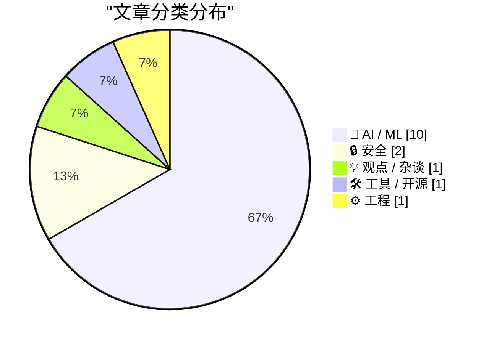
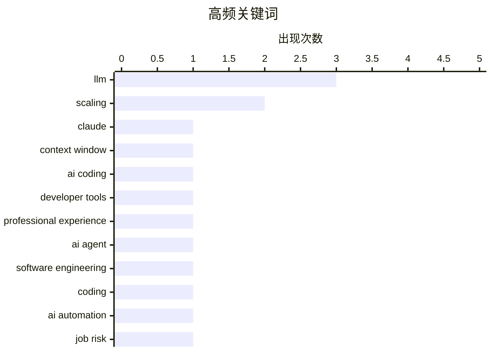

# 📰 AI 资讯每日精选 — 2026-03-16

> 汇聚 140+ 技术博客、X/Twitter、Hacker News、Reddit、Product Hunt、
> Lobste.rs、ClawFeed 日报及 GitHub Trending，经 AI 评分筛选。
>
> **本期内容**：🏆 今日必读 · 🌐 ClawFeed 日报 · 🔥 GitHub Trending · 📂 分类精选 · 🎨 设计与生成式 AI · 📊 数据概览

## 📝 今日看点

今日技术圈聚焦于AI能力的深度进化与行业冲击。大模型正突破长上下文处理等关键瓶颈，同时“智能体工程”兴起，推动AI从辅助工具向能自主编码的合作伙伴演进。另一方面，AI引发的成本压力与安全挑战凸显，企业为AI投资进行重大调整，而新型攻击与防御则在高风险对抗中同步升级。

---

## 🏆 今日必读

🥇 **为什么Claude的100万上下文长度是件大事**

[Why Claude's new 1M context length is a big deal](https://martinalderson.com/posts/why-claudes-new-1m-context-length-is-a-big-deal/?utm_source=rss&amp;utm_medium=rss&amp;utm_campaign=feed) — martinalderson.com · 1 天前 · 🤖 AI / ML

> Anthropic为Claude Opus 4.6和Sonnet 4.6模型提供了100万tokens的上下文窗口，这是一项真正的技术突破。该能力允许模型一次性处理长达70万单词的文档，远超GPT-4 Turbo的12.8万tokens。关键在于，Anthropic并未对此项重大升级额外收费，保持了原有定价。这标志着大模型在理解和处理超长、复杂文档方面迈出了关键一步，将极大拓展其在法律、科研、代码分析等领域的应用潜力。

💡 **为什么值得读**: 本文清晰地阐述了百万级上下文窗口的技术意义与商业影响，是理解当前LLM能力边界拓展的重要参考。

🏷️ Claude, context window, LLM

🥈 **HN提问：AI辅助编程对你的专业工作有何帮助？**

[Ask HN: How is AI-assisted coding going for you professionally?](https://news.ycombinator.com/item?id=47388646) — Hacker News Best · 8 小时前 · 🤖 AI / ML

> 该Hacker News帖子旨在收集开发者使用AI工具进行专业编程的具体实践经验，以超越“AI万能”或“AI无用”的极端讨论。提问者要求分享者提供使用的工具（如GitHub Copilot、Claude Code）、技术栈、项目类型、团队规模和经验水平等具体背景。核心目标是了解哪些场景下AI工具真正有效、遇到了哪些挑战以及如何解决，从而为社区提供可借鉴的真实案例。这反映了业界对AI编程工具实际落地价值的迫切求知。

💡 **为什么值得读**: 通过汇集一线开发者的真实案例，能帮助你客观评估AI编程工具在当前工作流中的实际效用与局限。

🏷️ AI coding, developer tools, professional experience

🥉 **什么是智能体工程？**

[What is agentic engineering?](https://simonwillison.net/guides/agentic-engineering-patterns/what-is-agentic-engineering/#atom-everything) — simonwillison.net · 1 小时前 · 🤖 AI / ML

> 文章定义了“智能体工程”这一概念，即借助能够编写和执行代码的“编码智能体”来开发软件的实践。编码智能体的典型代表包括Claude Code和OpenAI Codex。作者Simon Willison提出这一术语，旨在系统化地描述和探索这种新兴的软件开发范式。这标志着软件开发正从纯工具辅助向与半自主智能体协作的模式演进。

💡 **为什么值得读**: 如果你想理解“AI智能体编程”这一前沿趋势的核心概念与实践框架，这篇文章提供了清晰的定义和起点。

🏷️ AI Agent, Software Engineering, LLM, Coding

4️⃣ **Karpathy的AI自动化风险表**

[AI Automation Risk Table by Karpathy](https://www.reddit.com/r/singularity/comments/1runck6/ai_automation_risk_table_by_karpathy/) — r/singularity · 4 小时前 · 💡 观点 / 杂谈

> AI专家Andrej Karpathy创建了一个仓库/表格，系统评估了各种职业受AI自动化的风险程度。该表格基于职业的工作内容、可自动化程度等维度进行分析。它为理解AI技术对不同行业就业市场的潜在冲击提供了一个结构化的参考框架。这份资料有助于从业者评估自身职业的“未来安全性”，并思考技能转型的方向。

💡 **为什么值得读**: 来自顶尖AI研究者的职业自动化风险评估，为你提供了前瞻性思考个人职业规划与行业趋势的宝贵视角。

🏷️ AI automation, job risk, Karpathy

5️⃣ **路透社：Meta因AI成本飙升计划大规模裁员**

[Reuters: ‘Meta Planning Sweeping Layoffs as AI Costs Mount’](https://www.reuters.com/business/world-at-work/meta-planning-sweeping-layoffs-ai-costs-mount-2026-03-14/) — daringfireball.net · 8 小时前 · 🤖 AI / ML

> 据路透社报道，Meta正计划进行大规模裁员，可能影响公司20%或更多的员工。此举旨在抵消昂贵的人工智能基础设施投资，并为AI辅助员工带来的更高效率做准备。裁员的具体日期和规模尚未最终确定，但高管已向内部传达了相关计划。这揭示了巨头公司在全力投入AI军备竞赛时，所面临的巨大财务压力与组织重构的现实。

💡 **为什么值得读**: 本文揭示了AI技术浪潮背后残酷的商业逻辑与人力成本，是理解科技行业当前结构性调整的关键案例。

🏷️ Meta, Layoffs, AI Infrastructure, Cost

---

## 🌐 ClawFeed 日报精选

> 来源：[ClawFeed](https://clawfeed.kevinhe.io) — AI 驱动的多源新闻聚合

### 🔥 今日头条

**1. Anthropic 登上 TIME 封面，估值 $3800 亿，同时被五角大楼列为"供应链风险"**
Anthropic 被 TIME 称为"全球最具颠覆性公司"。Claude Code 年化收入破 $25 亿，刚融 $300 亿。但 Trump 政府将其列为"供应链安全风险"——历史上首次对美国公司使用此标签。起因是 Anthropic 拒绝允许全自主武器和大规模监控，与五角大楼谈判破裂。Anthropic 已起诉 Trump 政府。OpenAI 趁机签下军方合同。
→ [TIME](https://time.com/article/2026/03/11/anthropic-claude-disruptive-company-pentagon/) | [The Guardian](https://www.theguardian.com/technology/2026/mar/13/anthropic-pentagon-artificial-intelligence)

**2. Meta 计划裁员 20%（约 16,000 人）**
Reuters 独家报道，Meta 为 offset $600B AI 基础设施支出大幅裁员。这将是 Meta 自 2022 年以来最大规模裁员。同时 Meta 以至少 $2B 收购了中国 AI 创企 Manus，并入由前 Scale AI CEO Alexandr Wang 领导的 Meta Superintelligence Labs。
→ [Reuters](https://www.reuters.com/business/world-at-work/meta-planning-sweeping-layoffs-ai-costs-mount-2026-03-14/) | [TechCrunch](https://techcrunch.com/2026/03/14/meta-reportedly-considering-layoffs-that-could-affect-20-of-the-company/)

**3. NVIDIA GTC 2026 明天开幕**
3/16-19 San Jose，预计 39,000 人参加。Jensen Huang 主题演讲 3/16 11AM PT（3/17 凌晨 3AM SGT），将发布专为 agentic AI 设计的新芯片和 rack-level 系统。"AI is a 5 Layer Cake" 框架——能源、芯片、基础设施、模型、应用五层必须同步扩展。
→ [NVIDIA Blog](https://blogs.nvidia.com/blog/gtc-2026-news/) | [Fortune](https://fortune.com/2026/03/12/nvidia-gtc-preview-the-real-march-madness-jensen-huang/)

**4. Yann LeCun 创立 AMI Labs，融资 $10.3 亿**
前 Meta 首席 AI 科学家离开 Meta，创办 Advanced Machine Intelligence (AMI)。$35 亿估值，欧洲最大种子轮。投资方含 Nvidia、Temasek、Bezos Expeditions、Eric Schmidt。押注"世界模型"路线，认为当前 LLM 的 next-token prediction 无法实现真正推理。目标客户：制造、汽车、航空、制药。
→ [TechCrunch](https://techcrunch.com/2026/03/09/yann-lecuns-ami-labs-raises-1-03-billion-to-build-world-models/) | [WIRED](https://www.wired.com/story/yann-lecun-raises-dollar1-billion-to-build-ai-that-understands-the-physical-world/)

**5. Anthropic 取消长上下文溢价，1M token 正式 GA**
Opus 4.6 和 Sonnet 4.6 的 1M token 上下文窗口全量开放，标准定价无额外费用。OpenAI GPT-5.4 超 272K 仍收双倍，Gemini 超 200K 也有溢价。Claude 成为唯一顶级模型全线百万 token 平价。MRCR v2 benchmark 76% 远超 Gemini 3 Pro 的 26.3%。
→ [WinBuzzer](https://winbuzzer.com/2026/03/14/anthropic-drops-long-context-premium-1m-token-claude-xcxwbn/)

---

### 📰 精选 Top 10

1. **Karpathy 开源 autoresearch** — 630 行 Python，让 AI agent 在单 GPU 上自主跑 ML 实验。2 天跑 700 次实验，在已优化代码上找到 20 个改进点，benchmark 提速 11%。Shopify CEO 用 0.8B 模型打败了 1.6B 模型。
   → [VentureBeat](https://venturebeat.com/technology/andrej-karpathys-new-open-source-autoresearch-lets-you-run-hundreds-of-ai)

2. **NVIDIA 发布 Nemotron 3 Super** — 120B 参数混合 Mamba-Transformer MoE，仅 12B 活跃参数，1M context，开源。5x 吞吐提升，专为 agentic 工作流设计。NVIDIA 计划 5 年投 $260 亿建开放权重模型。
   → [NVIDIA Developer Blog](https://developer.nvidia.com/blog/introducing-nemotron-3-super-an-open-hybrid-mamba-transformer-moe-for-agentic-reasoning/)

3. **Replit 融资 $4 亿，估值 $90 亿** — 半年估值从 $30 亿涨到 $90 亿，CEO Amjad Masad 首次跻身亿万富翁，发布 Agent 4，目标年底 $10 亿 ARR。
   → [Forbes](https://www.forbes.com/)

4. **Perplexity 发布 Personal Computer** — 基于 Mac Mini 的 always-on AI agent 设备。Comet 助手持续运行，可访问本地文件和应用，400+ 应用集成，有 kill switch。从搜索转向 agent 的关键一步。
   → [Perplexity](https://www.perplexity.ai/personal-computer-waitlist)

5. **xAI 发布 Grok 4.20 Beta** — 4-agent 协作架构（Grok/Harper/Benjamin/Lucas 四个子智能体辩论后输出），2M token 上下文窗口。
   → [i10x](https://i10x.ai/news/xai-grok-4-20-speed-efficiency-low-hallucination)

6. **Morgan Stanley 警告：2026 H1 将出现 AI 重大突破** — GPT-5.4 Thinking 在 GDPVal 基准得分 83.0%，达到人类专家水平。美国 AI 基础设施面临 9-18GW 电力缺口，"15-15-15" 模式浮现。Bitcoin 矿场正在转型 AI 算力中心。
   → [Fortune](https://fortune.com/2026/03/13/elon-musk-morgan-stanley-ai-leap-2026/)

7. **AI 引发全球 RAM 危机** — 数据中心预计消耗 2026 年全球 70% RAM 产能（WSJ），游戏主机延期涨价，Valve Steam Machine 再度推迟。
   → [WIRED](https://www.wired.com/story/gamers-ai-nightmares-are-coming-true/)

8. **Post-Training 技术变革** — GRPO、DAPO、RLVR 和 synthetic self-play 正在取代 RLHF 成为主流后训练范式。SFT 管 instruction following，DPO/SimPO/KTO 管 alignment，RL+verifiable rewards 管 reasoning。
   → [LLM Stats](https://llm-stats.com/blog/research/post-training-techniques-2026)

9. **Claude 新功能 "Imagine"** — 可在聊天中直接生成交互式图表、图示和可视化，Beta 即将推出。同时 Anthropic 成立 Anthropic Institute（Jack Clark 领导）+ $1 亿 Claude Partner Network。
   → [Claude Blog](https://claude.com/blog/claude-builds-visuals) | [Anthropic](https://www.anthropic.com/news/the-anthropic-institute)

10. **BuzzFeed 承认"持续经营存疑"** — 2023 年 AI 转型后关闭普利策新闻部门，2025 年净亏损 $5730 万，股价从 $15 跌至 $0.70。AI 转型失败的经典案例：用生成内容替代核心能力而不解决质量问题。

---

### 📊 今日观察

**AI 行业正在剧烈分化。** 今天的新闻画面非常割裂：一边是 Meta 裁 16,000 人为 AI 基建腾钱，BuzzFeed 因 AI 转型失败濒临退市；另一边是 Anthropic $3800 亿估值登上 TIME 封面，Replit 半年估值翻三倍，LeCun 拿到欧洲最大种子轮。

**Anthropic 是今天的绝对主角**——1M token 平价 GA、TIME 封面、起诉 Trump 政府、Claude Partner Network、Anthropic Institute，一天五条大新闻。但五角大楼的 "供应链风险" 标签也暴露了 AI 安全派公司的政治风险：拒绝军方 = 可能被边缘化。

**明天的焦点是 GTC 2026。** Jensen Huang 的 keynote 将定义 agentic AI 基础设施的下一步。Nemotron 3 Super 已经预示了 NVIDIA 要在开源模型层面与自己的客户竞争的野心。

**技术趋势：** 百万 token 上下文成为标配、post-training 从 RLHF 转向 GRPO/DAPO、多智能体协作架构（Grok 4.20 的四 agent 模式）、物理世界模型（LeCun 的 AMI）——LLM 的边界正在被多个方向同时拓展。

---

## 🔥 GitHub Trending

> 今日热门开源项目（全语言 + Python）

| # | 项目 | 描述 | ⭐ 总星 | 📈 今日 | 语言 |
|---|------|------|---------|---------|------|
| 1 | [666ghj/MiroFish](https://github.com/666ghj/MiroFish) | A Simple and Universal Swarm Intelligence Engine, Predict... | 27.1k | +2985 | Python |
| 2 | [obra/superpowers](https://github.com/obra/superpowers) | An agentic skills framework & software development method... | 85.7k | +1893 | Shell |
| 3 | [volcengine/OpenViking](https://github.com/volcengine/OpenViking) 🤖 | OpenViking is an open-source context database designed sp... | 12.3k | +1877 | Python |
| 4 | [lightpanda-io/browser](https://github.com/lightpanda-io/browser) 🤖 | Lightpanda: the headless browser designed for AI and auto... | 18.5k | +1323 | Zig |
| 5 | [p-e-w/heretic](https://github.com/p-e-w/heretic) | Fully automatic censorship removal for language models | 14.7k | +1066 | Python |
| 6 | [shareAI-lab/learn-claude-code](https://github.com/shareAI-lab/learn-claude-code) 🤖 | Bash is all you need - A nano Claude Code–like agent, bui... | 27.9k | +865 | TypeScript |
| 7 | [shanraisshan/claude-code-best-practice](https://github.com/shanraisshan/claude-code-best-practice) 🤖 | practice made claude perfect | 16.9k | +852 | HTML |
| 8 | [anthropics/claude-plugins-official](https://github.com/anthropics/claude-plugins-official) 🤖 | Official, Anthropic-managed directory of high quality Cla... | 11.9k | +608 | Python |
| 9 | [public-apis/public-apis](https://github.com/public-apis/public-apis) | A collective list of free APIs | 410.7k | +552 | Python |
| 10 | [InsForge/InsForge](https://github.com/InsForge/InsForge) | Give agents everything they need to ship fullstack apps. ... | 4.6k | +509 | TypeScript |
| 11 | [abhigyanpatwari/GitNexus](https://github.com/abhigyanpatwari/GitNexus) 🤖 | GitNexus: The Zero-Server Code Intelligence Engine - GitN... | 14.2k | +450 | TypeScript |
| 12 | [langflow-ai/openrag](https://github.com/langflow-ai/openrag) 🤖 | OpenRAG is a comprehensive, single package Retrieval-Augm... | 3.0k | +404 | Python |
| 13 | [langchain-ai/deepagents](https://github.com/langchain-ai/deepagents) 🤖 | Agent harness built with LangChain and LangGraph. Equippe... | 11.6k | +346 | Python |
| 14 | [dimensionalOS/dimos](https://github.com/dimensionalOS/dimos) 🤖 | Dimensional is the agentic operating system for physical ... | 1.2k | +321 | Python |
| 15 | [topoteretes/cognee](https://github.com/topoteretes/cognee) 🤖 | Knowledge Engine for AI Agent Memory in 6 lines of code | 13.9k | +310 | Python |

---

## 🤖 AI / ML

### 1. 为什么Claude的100万上下文长度是件大事

[Why Claude's new 1M context length is a big deal](https://martinalderson.com/posts/why-claudes-new-1m-context-length-is-a-big-deal/?utm_source=rss&amp;utm_medium=rss&amp;utm_campaign=feed) — **martinalderson.com** · 1 天前 · ⭐ 27/30

> Anthropic为Claude Opus 4.6和Sonnet 4.6模型提供了100万tokens的上下文窗口，这是一项真正的技术突破。该能力允许模型一次性处理长达70万单词的文档，远超GPT-4 Turbo的12.8万tokens。关键在于，Anthropic并未对此项重大升级额外收费，保持了原有定价。这标志着大模型在理解和处理超长、复杂文档方面迈出了关键一步，将极大拓展其在法律、科研、代码分析等领域的应用潜力。

🏷️ Claude, context window, LLM

---

### 2. HN提问：AI辅助编程对你的专业工作有何帮助？

[Ask HN: How is AI-assisted coding going for you professionally?](https://news.ycombinator.com/item?id=47388646) — **Hacker News Best** · 8 小时前 · ⭐ 27/30

> 该Hacker News帖子旨在收集开发者使用AI工具进行专业编程的具体实践经验，以超越“AI万能”或“AI无用”的极端讨论。提问者要求分享者提供使用的工具（如GitHub Copilot、Claude Code）、技术栈、项目类型、团队规模和经验水平等具体背景。核心目标是了解哪些场景下AI工具真正有效、遇到了哪些挑战以及如何解决，从而为社区提供可借鉴的真实案例。这反映了业界对AI编程工具实际落地价值的迫切求知。

🏷️ AI coding, developer tools, professional experience

---

### 3. 什么是智能体工程？

[What is agentic engineering?](https://simonwillison.net/guides/agentic-engineering-patterns/what-is-agentic-engineering/#atom-everything) — **simonwillison.net** · 1 小时前 · ⭐ 26/30

> 文章定义了“智能体工程”这一概念，即借助能够编写和执行代码的“编码智能体”来开发软件的实践。编码智能体的典型代表包括Claude Code和OpenAI Codex。作者Simon Willison提出这一术语，旨在系统化地描述和探索这种新兴的软件开发范式。这标志着软件开发正从纯工具辅助向与半自主智能体协作的模式演进。

🏷️ AI Agent, Software Engineering, LLM, Coding

---

### 4. 路透社：Meta因AI成本飙升计划大规模裁员

[Reuters: ‘Meta Planning Sweeping Layoffs as AI Costs Mount’](https://www.reuters.com/business/world-at-work/meta-planning-sweeping-layoffs-ai-costs-mount-2026-03-14/) — **daringfireball.net** · 8 小时前 · ⭐ 25/30

> 据路透社报道，Meta正计划进行大规模裁员，可能影响公司20%或更多的员工。此举旨在抵消昂贵的人工智能基础设施投资，并为AI辅助员工带来的更高效率做准备。裁员的具体日期和规模尚未最终确定，但高管已向内部传达了相关计划。这揭示了巨头公司在全力投入AI军备竞赛时，所面临的巨大财务压力与组织重构的现实。

🏷️ Meta, Layoffs, AI Infrastructure, Cost

---

### 5. OpenClaw-RL通过“简单对话”训练AI智能体，将每次回复转化为训练信号

[OpenClaw-RL trains AI agents "simply by talking," converting every reply into a training signal](https://the-decoder.com/openclaw-rl-trains-ai-agents-simply-by-talking-converting-every-reply-into-a-training-signal/) — **The Decoder** · 14 小时前 · ⭐ 25/30

> 普林斯顿大学的研究团队提出了OpenClaw-RL框架，它能够将AI智能体在聊天、终端命令和GUI操作中获得的实时反馈信号，转化为连续的训练数据。该方法改变了传统AI智能体丢弃日常交互中有价值反馈的弊端。研究人员表示，仅需几十次交互就足以观察到智能体性能的显著提升。这为实现AI智能体的持续、低成本在线学习和适应开辟了新路径。

🏷️ AI agents, training, interactive learning

---

### 6. ComfyUI中的原生视觉LLM推理

[Native Vision LLM Inference in ComfyUI](https://www.reddit.com/r/comfyui/comments/1ru5cff/native_vision_llm_inference_in_comfyui/) — **r/comfyui** · 19 小时前 · ⭐ 25/30

> ComfyUI，一个流行的稳定扩散可视化工作流工具，现已原生支持包含视觉能力的文本生成模型推理。用户可以在其节点式界面中直接集成和运行视觉语言大模型。这一功能扩展了ComfyUI的应用边界，使其不再局限于图像生成，还能处理图像理解、视觉问答等多模态任务。这为AI创作者在一个统一的图形化环境中构建复杂的多模态AI应用提供了便利。

🏷️ ComfyUI, Vision LLM, Multimodal AI, Inference

---

### 7. （神经符号）利用 Gemini 加速科学研究：案例研究与通用技术

[(Neuro-symbolic) Accelerating Scientific Research with Gemini: Case Studies and Common Techniques](https://www.reddit.com/r/singularity/comments/1ruamyz/neurosymbolic_accelerating_scientific_research/) — **r/singularity** · 13 小时前 · ⭐ 25/30

> 大型语言模型（LLMs）为加速科学研究开辟了新途径，但其在专家级数学发现中的潜力尚不明确。文章通过一系列案例研究，展示了研究人员如何与 Gemini 等模型协作，成功解决复杂的数学问题并产生新颖见解。这些案例揭示了将神经网络的模式识别能力与符号推理相结合（即神经符号方法）的有效性。核心结论是，LLMs 不仅能辅助常规任务，还能在特定条件下成为推动前沿科学发现的强大合作者。

🏷️ Gemini, scientific research, LLM applications

---

### 8. 摘要 - Rust 项目对 AI 的视角

[Summary - Rust Project Perspectives on AI](https://nikomatsakis.github.io/rust-project-perspectives-on-ai/feb27-summary.html) — **Lobste.rs** · 16 小时前 · ⭐ 25/30

> 本文总结了 Rust 项目社区对 AI 辅助编程的初步讨论与观点。核心议题是 AI 工具（如代码补全、生成）将如何影响 Rust 语言的设计、开发流程及社区文化。讨论涉及 AI 在提升生产力、代码安全性和可维护性方面的潜力，同时也关注其对开发者技能、代码审查和开源协作可能带来的挑战。最终，社区倾向于采取一种务实、探索性的态度，积极评估并引导 AI 工具为 Rust 生态带来积极影响。

🏷️ Rust, AI, ecosystem, policy

---

### 9. LLM 时代

[LLM time](https://graydon2.dreamwidth.org/322732.html) — **Lobste.rs** · 10 小时前 · ⭐ 25/30

> 文章探讨了大型语言模型（LLMs）兴起所引发的关于编程、语言设计和计算本质的深刻思考。作者 Graydon Hoare（Rust 语言最初设计者）认为，LLMs 暴露了当前主流编程语言在表达意图和抽象层次上的局限性。他提出，未来的编程语言可能需要更贴近人类思维和 LLMs 的“理解”方式，例如更注重声明式、约束求解或形式规范。核心观点是，LLMs 不仅是一个工具，更是一面镜子，迫使人们重新审视“我们究竟想从计算机那里得到什么”这一根本问题。

🏷️ LLM, time-series, forecasting

---

### 10. 研究人员持续增加网络层数，强化学习智能体从“脸着地”进阶到“跑酷”

[RL agents go from face-planting to parkour when researchers keep adding network layers](https://the-decoder.com/rl-agents-go-from-face-planting-to-parkour-when-researchers-keep-adding-network-layers/) — **The Decoder** · 12 小时前 · ⭐ 24/30

> 一项研究挑战了强化学习（RL）算法通常只使用 2 到 5 个网络层的惯例。研究团队通过将自监督智能体的网络深度扩展到惊人的 1024 层，实现了 2 倍到 50 倍的性能提升。更引人注目的是，智能体在训练过程中涌现出了全新的、复杂的行为模式（如从笨拙跌倒到灵活跑酷）。这一发现表明，网络深度很可能是解锁 RL 智能体更高级能力和样本效率的关键 scaling 维度。研究结论是，深度网络在 RL 中的潜力被严重低估，增加层数可以带来质的性能飞跃和行为复杂性。

🏷️ reinforcement learning, neural networks, scaling

---

## 🔒 安全

### 11. Codewall的AI智能体黑入AI招聘官，并模仿特朗普测试语音机器人的防护栏

[Codewall's AI agent hacked an AI recruiter, then impersonated Trump to test its voice bot's guardrails](https://the-decoder.com/codewalls-ai-agent-hacked-an-ai-recruiter-then-impersonated-trump-to-test-its-voice-bots-guardrails/) — **The Decoder** · 15 小时前 · ⭐ 25/30

> Codewall的AI智能体在一小时内成功接管了一个AI招聘平台，展示了AI既能攻击系统，也能被用于防御，甚至自身也可能被攻击的复杂安全新格局。该智能体还通过模仿特朗普的声音来测试目标语音机器人的安全防护（Guardrails）是否有效。这一事件凸显了随着AI智能体能力增强，其所带来的新型、自动化安全威胁正在迅速变得错综复杂。

🏷️ AI security, agents, vulnerability, testing

---

### 12. Glassworm卷土重来：新一波不可见的Unicode攻击席卷代码仓库

[Glassworm Is Back: A New Wave of Invisible Unicode Attacks Hits Repositories](https://www.aikido.dev/blog/glassworm-returns-unicode-attack-github-npm-vscode) — **Hacker News Best** · 10 小时前 · ⭐ 25/30

> 安全公司Aikido披露了名为“Glassworm”的新一波Unicode攻击，主要针对GitHub、npm和VSCode等平台的代码仓库。攻击者利用Unicode字符的视觉混淆特性（如同形异义字符），创建看似合法但实则包含恶意代码或指向恶意依赖的软件包。这种攻击难以被开发者和传统扫描工具肉眼识别，对软件供应链安全构成严重威胁。文章警示社区需要提高对此类隐蔽攻击的防范意识。

🏷️ supply chain, Unicode attack, GitHub

---

## 💡 观点 / 杂谈

### 13. Karpathy的AI自动化风险表

[AI Automation Risk Table by Karpathy](https://www.reddit.com/r/singularity/comments/1runck6/ai_automation_risk_table_by_karpathy/) — **r/singularity** · 4 小时前 · ⭐ 26/30

> AI专家Andrej Karpathy创建了一个仓库/表格，系统评估了各种职业受AI自动化的风险程度。该表格基于职业的工作内容、可自动化程度等维度进行分析。它为理解AI技术对不同行业就业市场的潜在冲击提供了一个结构化的参考框架。这份资料有助于从业者评估自身职业的“未来安全性”，并思考技能转型的方向。

🏷️ AI automation, job risk, Karpathy

---

## 🛠 工具 / 开源

### 14. Chrome DevTools MCP：调试你的浏览器会话

[Chrome DevTools MCP](https://developer.chrome.com/blog/chrome-devtools-mcp-debug-your-browser-session) — **Hacker News Best** · 4 小时前 · ⭐ 25/30

> Chrome团队为DevTools引入了模型上下文协议支持，使开发者能够利用AI模型来辅助调试浏览器会话。这允许AI智能体直接访问和分析实时的浏览器状态、网络请求、控制台日志等调试信息。此举将AI编程助手的交互能力从单纯的代码编辑扩展到了运行时调试领域。它代表了开发工具与AI智能体深度集成的一个重要方向，有望提升复杂问题排查的效率。

🏷️ Chrome DevTools, debugging, MCP

---

## ⚙️ 工程

### 15. Netflix 的 Mount Mayhem：在现代 CPU 上扩展容器

[Mount Mayhem at Netflix: Scaling Containers on Modern CPUs](https://netflixtechblog.com/mount-mayhem-at-netflix-scaling-containers-on-modern-cpus-f3b09b68beac) — **Lobste.rs** · 16 小时前 · ⭐ 25/30

> Netflix 分享了其在全球大规模容器化平台上遇到的性能挑战——“Mount Mayhem”（挂载混乱），即容器文件系统挂载操作成为主要性能瓶颈。问题根源在于传统挂载方式与现代多核 CPU 架构不匹配，导致严重的锁竞争和可扩展性下降。Netflix 工程团队通过深入分析 Linux 内核的挂载子系统，设计并实现了一套名为“Mount Namespace”的优化方案，最终将挂载操作的吞吐量提升了 7 倍，并实现了近乎线性的扩展性。这一案例表明，在大规模云原生环境中，必须对底层操作系统抽象进行深度调优以适应硬件特性。

🏷️ Netflix, containers, scaling, performance

---

## 🎨 Design & Generative AI

### 🖼️ 生成式图片

- **[ComfyUI原生集成视觉大模型推理](https://www.reddit.com/r/comfyui/comments/1ru5cff/native_vision_llm_inference_in_comfyui/)** — r/comfyui · 19 小时前
  > ComfyUI新增原生文本与视觉生成能力。

- **[Flux.2角色替换工作流更新至2.4版](https://www.reddit.com/r/comfyui/comments/1rung4d/flux2_character_replacer_workflow_new_version_24/)** — r/comfyui · 4 小时前
  > 分享更新后的Flux.2模型角色替换工作流程。

- **[LTX2.3工作流样本与提示技巧](https://www.reddit.com/r/comfyui/comments/1ru9q11/ltx23_workflows_samples_and_prompting_tips/)** — r/comfyui · 14 小时前
  > 分享LTX2.3模型的工作流示例和提示词使用技巧。

- **[探讨运行重型ComfyUI工作流的优化方案](https://www.reddit.com/r/comfyui/comments/1rufwj0/anyone_here_running_heavy_comfyui_workflows/)** — r/comfyui · 9 小时前
  > 讨论通过运行时快照技术加速大型模型加载，以运行复杂ComfyUI工作流。

- **[Flux.2 Klein 4B一致性LoRA：减少AI感，恢复自然质感](https://www.reddit.com/r/StableDiffusion/comments/1rul211/flux2_klein_4b_consistency_lora_significantly/)** — r/StableDiffusion · 5 小时前
  > 介绍一款能显著降低“AI感”、恢复自然纹理并保持真实色调的Flux.2 LoRA模型。

- **[Stable Diffusion 3.5L + T5XXL生成惊人细节图像](https://www.reddit.com/r/StableDiffusion/comments/1ru54u3/stable_diffusion_35l_t5xxl_generated_images_are/)** — r/StableDiffusion · 19 小时前
  > 展示Stable Diffusion 3.5L结合T5XXL文本编码器生成的细节丰富的图像。

- **[AceStep 1.5 SFT：ComfyUI全能音乐生成节点](https://www.reddit.com/r/comfyui/comments/1rufc62/acestep_15_sft_for_comfyui_allinone_music/)** — r/comfyui · 9 小时前
  > 推出用于ComfyUI的集音乐生成、分离、转录等功能于一体的All-in-One节点。

- **[构建代理优先CLI，部署RunPod无服务器ComfyUI端点](https://www.reddit.com/r/comfyui/comments/1rua9in/i_built_an_agentfirst_cli_that_deploys_a_runpod/)** — r/comfyui · 13 小时前
  > 介绍一个可通过CLI部署和管理RunPod无服务器ComfyUI端点并运行工作流的工具。

- **[[WIP] Z-Image Turbo Chromium图像到图像插件](https://www.reddit.com/r/comfyui/comments/1rulfk1/wip_zimage_turbo_chromium_i2i_plugin/)** — r/comfyui · 5 小时前
  > 开发中的基于Chromium的Web浏览器图像到图像生成插件。

- **[使用Podman和容器化Firefox实现隔离的ComfyUI](https://www.reddit.com/r/comfyui/comments/1ruk7b6/isolated_comfyui_using_podman_and_containerised/)** — r/comfyui · 6 小时前
  > 分享如何使用Podman和容器化Firefox来搭建一个隔离的ComfyUI运行环境。

- **[为ComfyUI制作的提示词与资源管理器](https://www.reddit.com/r/comfyui/comments/1ru58jm/i_made_a_prompt_and_asset_manager_for_comfyui/)** — r/comfyui · 19 小时前
  > 推出一个免费、无限制的ComfyUI提示词和资源管理工具。

- **[Klein编辑合成节点：规避像素/色彩偏移与画质退化](https://www.reddit.com/r/StableDiffusion/comments/1runec5/klein_edit_composite_nodesidestep_pixelcolor/)** — r/StableDiffusion · 4 小时前
  > 介绍一个用于规避像素色彩偏移和限制画质退化的Klein模型编辑合成节点。

- **[ComfyUI终极批量处理 | MCWW 2.0扩展更新](https://www.reddit.com/r/StableDiffusion/comments/1ru2f56/ultimate_batches_for_comfyui_mcww_20_extension/)** — r/StableDiffusion · 21 小时前
  > 发布MCWW扩展2.0版本，增强ComfyUI的批量处理能力。

- **[制作AE脚本，直接运行RMBG省去导出帧到ComfyUI](https://www.reddit.com/r/comfyui/comments/1rub4rp/i_got_tired_of_exporting_frames_to_comfyui_so_i/)** — r/comfyui · 13 小时前
  > 分享一个After Effects脚本，可直接运行背景移除模型，无需导出帧到ComfyUI处理。

### 🎬 生成式视频

- **[ComfyUI教程：使用LTX 2.3进行视频转换](https://www.reddit.com/r/comfyui/comments/1ru7itb/comfyui_tutorial_vid_transformation_with_ltx_23/)** — r/comfyui · 16 小时前
  > 介绍利用LTX 2.3和Control LoRA在ComfyUI中进行视频变换的教程。

---

## 📊 数据概览

| 扫描源 | 抓取文章 | 时间范围 | 精选 |
|:---:|:---:|:---:|:---:|
| 119/140 | 5219 篇 → 185 篇 | 24h | **15 篇** |

### 分类分布



### 高频关键词



<details>
<summary>📈 纯文本关键词图（终端友好）</summary>

```
llm                     │ ████████████████████ 3
scaling                 │ █████████████░░░░░░░ 2
claude                  │ ███████░░░░░░░░░░░░░ 1
context window          │ ███████░░░░░░░░░░░░░ 1
ai coding               │ ███████░░░░░░░░░░░░░ 1
developer tools         │ ███████░░░░░░░░░░░░░ 1
professional experience │ ███████░░░░░░░░░░░░░ 1
ai agent                │ ███████░░░░░░░░░░░░░ 1
software engineering    │ ███████░░░░░░░░░░░░░ 1
coding                  │ ███████░░░░░░░░░░░░░ 1
```

</details>

### 🏷️ 话题标签

**llm**(3) · **scaling**(2) · **claude**(1) · context window(1) · ai coding(1) · developer tools(1) · professional experience(1) · ai agent(1) · software engineering(1) · coding(1) · ai automation(1) · job risk(1) · karpathy(1) · meta(1) · layoffs(1) · ai infrastructure(1) · cost(1) · ai agents(1) · training(1) · interactive learning(1)

---

*生成于 2026-03-16 00:04 | 汇聚 140 个技术博客、X/Twitter、Hacker News、Reddit、Product Hunt、Lobste.rs、ClawFeed 日报及 GitHub Trending，经 AI 评分筛选出 Top 15 精华内容*
