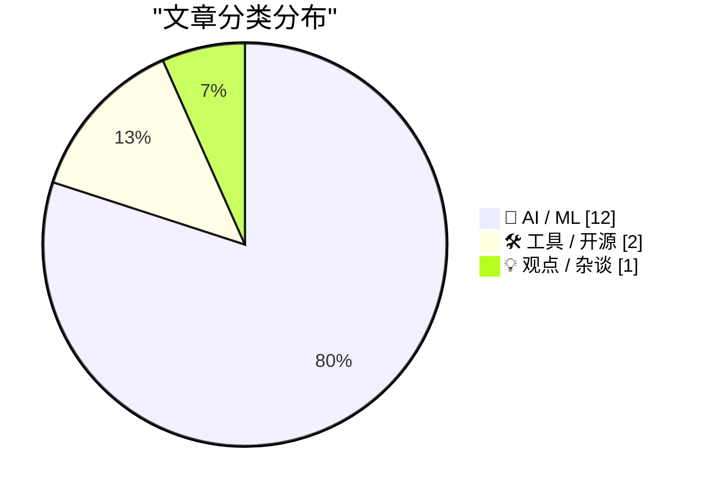
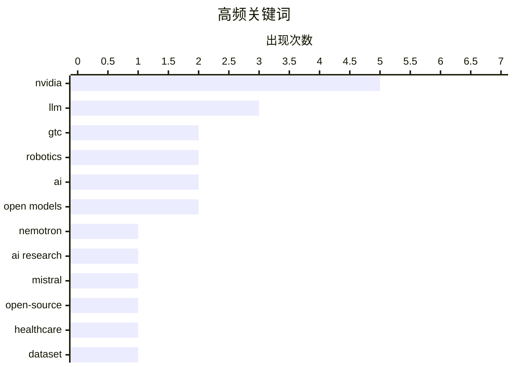

# 📰 AI 资讯每日精选 — 2026-03-17

> 汇聚 140+ 技术博客、X/Twitter、Hacker News、Reddit、Product Hunt、
> Lobste.rs、ClawFeed 日报及 GitHub Trending，经 AI 评分筛选。
>
> **本期内容**：🏆 今日必读 · 🌐 ClawFeed 日报 · 🔥 GitHub Trending · 📂 分类精选 · 🎨 设计与生成式 AI · 📊 数据概览

## 📝 今日看点

今日技术圈的核心焦点集中在AI基础设施的全面升级与开放协作的深化。英伟达引领硬件与平台创新，通过推出集成多种芯片的超级计算机方案和专用推理加速器，旨在将复杂的数据与部署难题转化为可规模化解决的算力挑战。同时，以Nemotron联盟和Mistral开源模型为代表，行业正加速推进前沿大模型的开放共享与协作开发。此外，AI应用正向机器人、医疗等垂直领域深入，其发展愈发依赖高质量专用数据集与仿真平台的建设。

---

## 🏆 今日必读

🥇 **GTC 2026：英伟达欲将机器人学的数据难题转化为算力难题**

[GTC 2026: Nvidia wants to swap robotics' data problem for a compute problem](https://the-decoder.com/gtc-2026-nvidia-wants-to-swap-robotics-data-problem-for-a-compute-problem/) — The Decoder · 3 小时前 · 🤖 AI / ML

> 英伟达在GTC 2026上大幅扩展其物理AI平台，旨在解决机器人领域对海量真实世界数据的依赖。其核心策略是通过强大的计算平台和仿真技术生成合成数据，从而将数据收集难题转化为可规模化解决的算力问题。从2027年开始，基于该平台的自动驾驶汽车将与Uber合作在洛杉矶上路，发那科和ABB的工业机器人将搭载英伟达“大脑”，新模型也将提升人形机器人的能力。这表明英伟达正通过提供端到端的计算解决方案，推动机器人开发范式从“数据驱动”转向“计算驱动”。

💡 **为什么值得读**: 本文揭示了英伟达在机器人领域颠覆性的战略转向，即用算力和合成数据替代传统数据收集，对从事AI和机器人研发的从业者理解未来技术路线具有关键启示。

🏷️ Nvidia, GTC, robotics, AI

🥈 **英伟达发起Nemotron联盟，联合全球领先AI实验室推进开放前沿模型**

[NVIDIA Launches Nemotron Coalition of Leading Global AI Labs to Advance Open Frontier Models](https://www.reddit.com/r/StableDiffusion/comments/1rvokxc/nvidia_launches_nemotron_coalition_of_leading/) — r/StableDiffusion · 1 小时前 · 🤖 AI / ML

> 英伟达宣布成立Nemotron联盟，这是一个由全球顶尖AI实验室组成的合作组织，旨在共同推进开放前沿大模型的发展。该联盟将聚焦于开发下一代开源大语言模型，共享研究、数据和计算资源以加速创新。其目标是构建一个强大、透明且可访问的开放模型生态系统，以应对封闭模型的竞争。此举标志着英伟达在推动开源AI基础模型发展方面迈出了战略性一步。

💡 **为什么值得读**: 了解这一顶级联盟的成立，有助于把握未来开源大模型的发展动向和行业合作趋势，对AI研究者和开发者至关重要。

🏷️ NVIDIA, Open Models, Nemotron, AI Research

🥉 **Mistral发布Small 4模型**

[Introducing Mistral Small 4](https://simonwillison.net/2026/Mar/16/mistral-small-4/#atom-everything) — simonwillison.net · 23 分钟前 · 🤖 AI / ML

> Mistral发布了名为Small 4的新模型，这是一个参数达1190亿（采用混合专家架构，活跃参数60亿）的Apache 2.0许可开源模型。该模型首次将Mistral旗舰模型的核心能力——Magistral的推理、Pixtral的多模态和Devstral的智能体编码——统一到一个单一、通用的模型中。尽管名为“Small”，但其规模和能力的整合代表了Mistral模型系列的一次重大升级，旨在提供一个功能全面且高效的基础模型。

💡 **为什么值得读**: 对于关注开源大模型进展的开发者而言，Mistral Small 4将三大核心能力合一的特性，使其成为一个极具竞争力和实用性的新选择。

🏷️ Mistral, LLM, open-source

4️⃣ **首个医疗机器人数据集与医疗机器人基础物理AI模型**

[The First Healthcare Robotics Dataset and Foundational Physical AI Models for Healthcare Robotics](https://huggingface.co/blog/nvidia/physical-ai-for-healthcare-robotics) — Hugging Face Blog · 2 小时前 · 🤖 AI / ML

> 文章介绍了首个专为医疗机器人设计的大规模数据集以及基于该数据集训练的基础物理AI模型。该数据集包含了丰富的医疗环境场景、机器人操作任务及对应的传感器数据，旨在解决医疗机器人领域高质量训练数据稀缺的核心瓶颈。基于此数据集训练的物理AI模型，能够更好地理解和模拟在复杂、敏感的医疗环境中的物理交互。这项工作为开发更安全、更可靠的医疗辅助机器人提供了至关重要的数据基础和模型起点。

💡 **为什么值得读**: 这是医疗机器人AI领域一项填补空白的基础性工作，其发布的数据集和模型将为该方向的研究与开发扫清关键障碍。

🏷️ robotics, healthcare, dataset, foundation model

5️⃣ **深入解析NVIDIA Groq 3 LPX：为Vera Rubin平台打造的低延迟推理加速器**

[Inside NVIDIA Groq 3 LPX: The Low-Latency Inference Accelerator for the NVIDIA Vera Rubin Platform](https://developer.nvidia.com/blog/inside-nvidia-groq-3-lpx-the-low-latency-inference-accelerator-for-the-nvidia-vera-rubin-platform/) — NVIDIA Technical Blog · 3 小时前 · 🛠 工具 / 开源

> NVIDIA Groq 3 LPX是一款专为Vera Rubin平台设计的机架级推理加速器，针对低延迟和大上下文需求进行了优化。它采用独特的张量流处理器架构，能够实现极低的单次推理延迟，尤其适合实时交互式AI应用。该加速器与Vera Rubin平台深度集成，旨在处理需要快速响应和超长上下文窗口的下一代AI工作负载。Groq 3 LPX的推出标志着英伟达在满足苛刻的实时AI推理需求方面提供了新的硬件解决方案。

💡 **为什么值得读**: 通过了解Groq 3 LPX的架构特性，可以洞悉英伟达如何从硬件层面攻克低延迟推理的挑战，这对开发实时AI应用具有重要参考价值。

🏷️ NVIDIA, inference accelerator, hardware

---

## 🌐 ClawFeed 日报精选

> 来源：[ClawFeed](https://clawfeed.kevinhe.io) — AI 驱动的多源新闻聚合

### 🔥 今日头条

**1. NVIDIA GTC 2026 盛大开幕 — AI 界的超级碗**
Jensen Huang 将在 San Jose SAP Center 发表 2 小时 keynote（SGT 凌晨 2-3 点），30,000 人到场，190 个国家参与。预计发布：Vera Rubin 架构新 GPU、Groq 推理芯片整合方案、NemoClaw 开源企业 AI Agent 平台、Arm 架构笔记本处理器。GTC Park 设有 Build-a-Claw 活动，参会者可现场部署 OpenClaw agent。Pregame 嘉宾阵容豪华：Perplexity / LangChain / Mistral / Dell / Palantir CEO 等齐聚。

**2. Morgan Stanley 发布重磅报告：2026 上半年 AI 将迎非线性跃升**
大摩警告市场"没有为 LLM 能力的非线性增长做好准备"，预计 4-6 月变得明显。GPT-5.4 在 GDPVal 基准已达 83%（超越 71% 人类专家水平），Scaling laws 依然成立。预计美国到 2028 年面临 9-18GW 电力缺口，$2.9T 数据中心建设支出。递归自我改进（AI 设计自身后继者）可能成为现实。
<https://fortune.com/2026/03/13/elon-musk-morgan-stanley-ai-leap-2026/>

**3. Yann LeCun 创办 AMI Labs 融资 $10.3 亿，估值 $35 亿**
前 Meta 首席 AI 科学家的巴黎公司，目标是超越 LLM 构建"世界模型"（world models），理解物理世界的因果推理。投资方包括 Bezos Expeditions、Cathay Innovation 等。LLM 之外的另一条路线获得重大资本背书。

**4. Replit 融资 $4 亿，估值 $9B — Vibe Coding 成为基础设施**
6 个月前估值 $3B，翻了 3 倍。同时发布 Agent 4：多任务并行，速度比前代快 10x，85% Fortune 500 已在用。创始人 Amjad Masad 首次跻身亿万富翁。Vibe coding 从趋势正式变成基础设施赛道。
<https://www.forbes.com/sites/richardnieva/2026/03/11/meet-the-9-billion-ai-company-reimagining-vibe-coding-replit-amjad-masad/>

**5. 四大 Frontier 模型同月混战 — 模型正在 Commoditize**
GPT-5.4（原生 Computer Use、1M context）、Gemini 3.1 Pro（ARC-AGI-2 77.1%）、Claude Opus 4.6（SWE-bench 75.6% #1）、GPT-5.3-Codex 一个月内全部发布。竞争正从模型层转向 workflow/runtime 层。

---

### 📰 精选 Top 10

1. **NVIDIA NemoClaw + Nemotron 3 Super** — 开源企业 AI Agent 平台 + 120B 参数混合 Mamba-Attention MoE 模型（12B 活跃参数），吞吐量比同级高 5x，向 Salesforce/Google/Adobe 等展示
   <https://www.wired.com/story/nvidia-planning-ai-agent-platform-launch-open-source/>

2. **NVIDIA × Groq $200 亿交易细节** — 非独占许可，聘用 Groq 关键员工含前 CEO Jonathan Ross（前 Google TPU 架构师）。构建分层推理栈：GPU 训练 + 复杂推理，Groq 低延迟推理
   <https://www.cnbc.com/2026/03/13/a-closer-look-at-nvidias-20-billion-bet-on-tech-for-a-new-ai-chip.html>

3. **LangChain 发布 Deep Agents** — 基于 LangGraph 的多步骤 agent runtime，内置 planning、filesystem context 管理、subagent spawning 和 context isolation。Harrison Chase 将在 GTC 登台
   <https://www.marktechpost.com/2026/03/15/langchain-releases-deep-agents/>

4. **Chrome DevTools 官方 MCP Server** — 用 AI agent 直接调试浏览器会话，HN 458 points 热议
   <https://developer.chrome.com/blog/chrome-devtools-mcp-debug-your-browser-session>

5. **NVIDIA × Thinking Machines Lab（Mira Murati）战略合作** — 部署至少 1GW Vera Rubin 系统用于前沿模型训练，NVIDIA 入股
   <https://blogs.nvidia.com/blog/nvidia-thinking-machines-lab/>

6. **Travis Kalanick 沉寂 8 年后发布 Atoms** — 专注工业机器人（食品/矿业/运输），收购自动驾驶公司 Pronto，定位"机器人底盘平台"
   <https://techcrunch.com/2026/03/13/travis-kalanick-launches-a-new-company-called-atoms-focused-on-robotics/>

7. **ExeVRM：8B 视频奖励模型碾压 GPT-5.2** — 用执行视频判断 agent 任务是否成功，84.7% 准确率，跨 Ubuntu/macOS/Windows/Android 全平台，Computer-use agent 评估方式正在改变
   <https://arxiv.org/abs/2603.10178>

8. **Glassworm 供应链攻击回归** — 用不可见 Unicode 字符在 151+ GitHub repos 和 72 个 VS Code 扩展中植入恶意代码，窃取 tokens 和凭证
   <https://www.aikido.dev/blog/glassworm-returns-unicode-attack-github-npm-vscode>

9. **Sebastian Raschka LLM Architecture Gallery** — 可视化对比主流 LLM 架构（GPT/Llama/Mistral/Qwen 等），HN 380+ points
   <https://sebastianraschka.com/llm-architecture-gallery/>

10. **7 种新兴 AI Agent 记忆架构** — TuringPost 深度分析 RL 训练的 agent 如何用 dual memory（全局摘要 + key-value Memory Bank）管理记忆
    <https://www.turingpost.com/p/agenticmemory>

---

### 📊 今日观察

**GTC 日就是 AI 界的春晚。** 今天所有信号都指向同一个方向：AI 竞争正从"谁的模型更强"转向"谁拥有 runtime 和 workflow"。NVIDIA 发布 NemoClaw（agent 平台）而非仅是新芯片；LangChain 推出 Deep Agents（agent runtime）；Replit 估值翻三倍靠的是 Agent 4 而非模型。四大 frontier 模型同月发布反而证明了模型层正在 commoditize。

Morgan Stanley 的警告值得认真对待：scaling laws 没死，4-6 月可能出现让市场意外的能力跳跃。但更深层的趋势是——当模型变成水电煤，真正的价值在管道和开关上。

今日的另一个暗线是 **硬件自主权之争**：NVIDIA 收 Groq、Tesla 建 Terafab、Yann LeCun 融资建非 LLM 路线——大玩家都在押注自己的计算基础设施，不愿受制于单一技术路线。

⚠️ **今日数据质量说明**：全天 6 期简报均因浏览器工具不可用而无法直接浏览 Twitter（Feed/Bookmarks/Following），内容全部来自 web 搜索交叉验证。覆盖面可能有遗漏。

---
*基于 6 期 4h 简报汇总 | 2026-03-16 22:00 SGT*

---

## 🔥 GitHub Trending

> 今日热门开源项目（全语言 + Python）

| # | 项目 | 描述 | ⭐ 总星 | 📈 今日 | 语言 |
|---|------|------|---------|---------|------|
| 1 | [666ghj/MiroFish](https://github.com/666ghj/MiroFish) | A Simple and Universal Swarm Intelligence Engine, Predict... | 29.9k | +3257 | Python |
| 2 | [obra/superpowers](https://github.com/obra/superpowers) | An agentic skills framework & software development method... | 88.5k | +3142 | Shell |
| 3 | [lightpanda-io/browser](https://github.com/lightpanda-io/browser) 🤖 | Lightpanda: the headless browser designed for AI and auto... | 20.2k | +2089 | Zig |
| 4 | [volcengine/OpenViking](https://github.com/volcengine/OpenViking) 🤖 | OpenViking is an open-source context database designed sp... | 14.1k | +2014 | Python |
| 5 | [abhigyanpatwari/GitNexus](https://github.com/abhigyanpatwari/GitNexus) 🤖 | GitNexus: The Zero-Server Code Intelligence Engine - GitN... | 15.6k | +1867 | TypeScript |
| 6 | [shareAI-lab/learn-claude-code](https://github.com/shareAI-lab/learn-claude-code) 🤖 | Bash is all you need - A nano Claude Code–like agent, bui... | 29.3k | +1542 | TypeScript |
| 7 | [langchain-ai/deepagents](https://github.com/langchain-ai/deepagents) 🤖 | Agent harness built with LangChain and LangGraph. Equippe... | 12.9k | +1238 | Python |
| 8 | [thedotmack/claude-mem](https://github.com/thedotmack/claude-mem) 🤖 | A Claude Code plugin that automatically captures everythi... | 36.8k | +1017 | TypeScript |
| 9 | [ZhuLinsen/daily_stock_analysis](https://github.com/ZhuLinsen/daily_stock_analysis) 🤖 | LLM驱动的 A/H/美股智能分析器：多数据源行情 + 实时新闻 + LLM决策仪表盘 + 多渠道推送，零成本定时... | 21.4k | +842 | Python |
| 10 | [p-e-w/heretic](https://github.com/p-e-w/heretic) | Fully automatic censorship removal for language models | 15.3k | +787 | Python |
| 11 | [Crosstalk-Solutions/project-nomad](https://github.com/Crosstalk-Solutions/project-nomad) 🤖 | Project N.O.M.A.D, is a self-contained, offline survival ... | 1.8k | +773 | TypeScript |
| 12 | [voidzero-dev/vite-plus](https://github.com/voidzero-dev/vite-plus) | Vite+ is the unified toolchain and entry point for web de... | 2.2k | +622 | Rust |
| 13 | [topoteretes/cognee](https://github.com/topoteretes/cognee) 🤖 | Knowledge Engine for AI Agent Memory in 6 lines of code | 14.2k | +501 | Python |
| 14 | [dimensionalOS/dimos](https://github.com/dimensionalOS/dimos) 🤖 | Dimensional is the agentic operating system for physical ... | 1.5k | +395 | Python |
| 15 | [TauricResearch/TradingAgents](https://github.com/TauricResearch/TradingAgents) 🤖 | TradingAgents: Multi-Agents LLM Financial Trading Framework | 32.4k | +205 | Python |

---

## 🤖 AI / ML

### 1. GTC 2026：英伟达欲将机器人学的数据难题转化为算力难题

[GTC 2026: Nvidia wants to swap robotics' data problem for a compute problem](https://the-decoder.com/gtc-2026-nvidia-wants-to-swap-robotics-data-problem-for-a-compute-problem/) — **The Decoder** · 3 小时前 · ⭐ 27/30

> 英伟达在GTC 2026上大幅扩展其物理AI平台，旨在解决机器人领域对海量真实世界数据的依赖。其核心策略是通过强大的计算平台和仿真技术生成合成数据，从而将数据收集难题转化为可规模化解决的算力问题。从2027年开始，基于该平台的自动驾驶汽车将与Uber合作在洛杉矶上路，发那科和ABB的工业机器人将搭载英伟达“大脑”，新模型也将提升人形机器人的能力。这表明英伟达正通过提供端到端的计算解决方案，推动机器人开发范式从“数据驱动”转向“计算驱动”。

🏷️ Nvidia, GTC, robotics, AI

---

### 2. 英伟达发起Nemotron联盟，联合全球领先AI实验室推进开放前沿模型

[NVIDIA Launches Nemotron Coalition of Leading Global AI Labs to Advance Open Frontier Models](https://www.reddit.com/r/StableDiffusion/comments/1rvokxc/nvidia_launches_nemotron_coalition_of_leading/) — **r/StableDiffusion** · 1 小时前 · ⭐ 27/30

> 英伟达宣布成立Nemotron联盟，这是一个由全球顶尖AI实验室组成的合作组织，旨在共同推进开放前沿大模型的发展。该联盟将聚焦于开发下一代开源大语言模型，共享研究、数据和计算资源以加速创新。其目标是构建一个强大、透明且可访问的开放模型生态系统，以应对封闭模型的竞争。此举标志着英伟达在推动开源AI基础模型发展方面迈出了战略性一步。

🏷️ NVIDIA, Open Models, Nemotron, AI Research

---

### 3. Mistral发布Small 4模型

[Introducing Mistral Small 4](https://simonwillison.net/2026/Mar/16/mistral-small-4/#atom-everything) — **simonwillison.net** · 23 分钟前 · ⭐ 26/30

> Mistral发布了名为Small 4的新模型，这是一个参数达1190亿（采用混合专家架构，活跃参数60亿）的Apache 2.0许可开源模型。该模型首次将Mistral旗舰模型的核心能力——Magistral的推理、Pixtral的多模态和Devstral的智能体编码——统一到一个单一、通用的模型中。尽管名为“Small”，但其规模和能力的整合代表了Mistral模型系列的一次重大升级，旨在提供一个功能全面且高效的基础模型。

🏷️ Mistral, LLM, open-source

---

### 4. 首个医疗机器人数据集与医疗机器人基础物理AI模型

[The First Healthcare Robotics Dataset and Foundational Physical AI Models for Healthcare Robotics](https://huggingface.co/blog/nvidia/physical-ai-for-healthcare-robotics) — **Hugging Face Blog** · 2 小时前 · ⭐ 26/30

> 文章介绍了首个专为医疗机器人设计的大规模数据集以及基于该数据集训练的基础物理AI模型。该数据集包含了丰富的医疗环境场景、机器人操作任务及对应的传感器数据，旨在解决医疗机器人领域高质量训练数据稀缺的核心瓶颈。基于此数据集训练的物理AI模型，能够更好地理解和模拟在复杂、敏感的医疗环境中的物理交互。这项工作为开发更安全、更可靠的医疗辅助机器人提供了至关重要的数据基础和模型起点。

🏷️ robotics, healthcare, dataset, foundation model

---

### 5. 我如何使用LLM编写软件

[How I write software with LLMs](https://www.stavros.io/posts/how-i-write-software-with-llms/) — **Hacker News Best** · 22 小时前 · ⭐ 26/30

> 作者详细分享了他将大型语言模型深度融入软件编写工作流的具体实践与方法论。核心观点是LLM应作为增强而非替代开发者的“副驾驶”，用于代码生成、解释、重构、调试和撰写文档等多个环节。文章提供了具体的提示词技巧、工具链配置（如结合CLI工具和编辑器插件）以及迭代式交互的最佳实践。作者的经验表明，通过精心设计的工作流，LLM能显著提升开发效率与代码质量，但关键在于开发者保持主导和控制权。

🏷️ LLM, software development, productivity

---

### 6. 介绍由NVIDIA BlueField-4驱动的CMX上下文内存存储平台，面向AI下一前沿

[Introducing NVIDIA BlueField-4-Powered CMX Context Memory Storage Platform for the Next Frontier of AI](https://developer.nvidia.com/blog/introducing-nvidia-bluefield-4-powered-inference-context-memory-storage-platform-for-the-next-frontier-of-ai/) — **NVIDIA Technical Blog** · 3 小时前 · ⭐ 25/30

> 面对智能体AI工作流将上下文窗口推向数百万令牌、模型规模不断扩大的挑战，英伟达推出了基于BlueField-4 DPU的CMX上下文内存存储平台。该平台是一个AI原生存储解决方案，旨在高效管理海量的推理上下文数据，解决传统存储系统在带宽和延迟上的瓶颈。它将高速存储与计算资源紧密耦合，实现上下文数据的快速加载和交换，以满足下一代大模型对超长上下文和持久化智能体的需求。CMX平台是英伟达为大规模、持续运行的AI智能体工作负载构建的基础设施关键一环。

🏷️ AI Infrastructure, Storage, NVIDIA BlueField

---

### 7. NVIDIA Dynamo 1.0如何为生产级多节点推理提供动力

[How NVIDIA Dynamo 1.0 Powers Multi-Node Inference at Production Scale](https://developer.nvidia.com/blog/nvidia-dynamo-1-production-ready/) — **NVIDIA Technical Blog** · 3 小时前 · ⭐ 25/30

> NVIDIA Dynamo 1.0是一个生产就绪的软件平台，专门用于大规模多节点推理任务的编排与管理。它解决了大型推理模型（尤其是推理模型）在分布式集群上运行时面临的资源调度、负载均衡和故障恢复等复杂性问题。Dynamo能够自动优化模型在多个GPU节点间的部署，确保高吞吐量和低延迟，并集成到现有的Kubernetes生态中。该平台的发布使得企业能够可靠地将庞大的AI模型部署到生产环境，并进行高效扩展。

🏷️ Inference, Multi-Node, NVIDIA Dynamo

---

### 8. 使用NVIDIA DGX Spark扩展自主AI智能体与工作负载

[Scaling Autonomous AI Agents and Workloads with NVIDIA DGX Spark](https://developer.nvidia.com/blog/scaling-autonomous-ai-agents-and-workloads-with-nvidia-dgx-spark/) — **NVIDIA Technical Blog** · 3 小时前 · ⭐ 25/30

> 文章介绍了如何利用NVIDIA DGX Spark平台来大规模扩展和运行自主AI智能体工作负载。自主AI智能体通常需要管理长时间运行、使用多通信通道并与外部工具交互的复杂任务，对计算资源的弹性和管理提出了更高要求。DGX Spark平台结合了DGX计算能力与Spark分布式处理框架的优势，为智能体提供了可扩展的任务编排、状态管理和并行执行环境。该方案使得开发人员能够像处理大数据作业一样，轻松地大规模部署和运行异构的AI智能体流水线。

🏷️ AI Agents, DGX, Workload Orchestration

---

### 9. NVIDIA Vera Rubin POD：七种芯片，五款机架级系统，一台AI超级计算机

[NVIDIA Vera Rubin POD: Seven Chips, Five Rack-Scale Systems, One AI Supercomputer](https://developer.nvidia.com/blog/nvidia-vera-rubin-pod-seven-chips-five-rack-scale-systems-one-ai-supercomputer/) — **NVIDIA Technical Blog** · 4 小时前 · ⭐ 25/30

> NVIDIA Vera Rubin POD是一个高度集成的AI超级计算机解决方案，它在一个统一架构内整合了七种 specialized芯片（包括GPU、CPU、DPU、网络芯片等）和五款机架级系统。其设计核心是优化从计算、网络到存储的整个数据流，以应对AI工作负载，尤其是基于令牌的推理和智能体交互所带来的指数级数据消耗增长。该POD提供了极致的计算密度和能效，旨在为企业和研究机构提供开箱即用的、用于训练和部署最先进AI模型的完整基础设施。Vera Rubin POD代表了英伟达将全栈硬件优化推向极致的系统级产品。

🏷️ AI Supercomputer, Token Consumption, Rubin POD

---

### 10. Mistral AI 与 NVIDIA 合作，加速开放前沿模型发展

[Mistral AI partners with NVIDIA to accelerate open frontier models](https://www.reddit.com/r/LocalLLaMA/comments/1rvlfvg/mistral_ai_partners_with_nvidia_to_accelerate/) — **r/LocalLLaMA** · 3 小时前 · ⭐ 25/30

> Mistral AI 宣布与 NVIDIA 建立战略合作伙伴关系，旨在加速其开放前沿模型的开发与部署。合作将利用 NVIDIA 的先进硬件和软件栈，包括最新的 GPU 和 CUDA 平台，以提升模型训练和推理效率。此举旨在巩固 Mistral 在开源大模型领域的领先地位，并挑战现有闭源模型的市场格局。双方的合作预示着开源 AI 模型将获得更强大的基础设施支持，加速其商业化进程。

🏷️ Mistral AI, NVIDIA, partnership, open models

---

### 11. 注意力即一切：Kimi 用注意力机制取代残差连接

[Attention is all you need: Kimi replaces residual connections with attention](https://www.reddit.com/r/singularity/comments/1rv4gao/attention_is_all_you_need_kimi_replaces_residual/) — **r/singularity** · 14 小时前 · ⭐ 25/30

> 月之暗面（Kimi 开发者）在其模型架构中提出了一项激进变革：用纯注意力机制（Attention）完全取代了 Transformer 中的经典残差连接（Residual Connections）。这一改动挑战了当前大模型架构的设计范式，旨在测试注意力机制是否足以单独完成信息传递和梯度流动的核心功能。如果被验证有效，该设计可能简化模型结构，并引发对 Transformer 基础组件的重新思考。它代表了在“注意力即一切”理念下，对模型最简必要组件的一次前沿探索。

🏷️ transformer, architecture, attention

---

### 12. NVIDIA GTC 主题演讲即将开始，两万人在 NHL 球场等候

[NVIDIA GTC keynote starting, 20K people waiting at NHL arena](https://www.reddit.com/r/singularity/comments/1rvhaua/nvidia_gtc_keynote_starting_20k_people_waiting_at/) — **r/singularity** · 5 小时前 · ⭐ 25/30

> NVIDIA 年度技术大会 GTC 的主题演讲在北美职业冰球联赛（NHL）场馆举行，现场有约两万人等待开场，凸显了 AI 热潮的空前盛况。这场演讲由 CEO 黄仁勋主持，预计将发布新一代 AI 芯片、软件及机器人等领域的重要进展。极高的现场参与度反映了产业界和开发者对 NVIDIA 在 AI 计算领域领导地位及未来技术走向的密切关注。GTC 已成为观测全球 AI 硬件与生态发展趋势的最关键风向标。

🏷️ NVIDIA, GTC, keynote, AI

---

## 🛠 工具 / 开源

### 13. 深入解析NVIDIA Groq 3 LPX：为Vera Rubin平台打造的低延迟推理加速器

[Inside NVIDIA Groq 3 LPX: The Low-Latency Inference Accelerator for the NVIDIA Vera Rubin Platform](https://developer.nvidia.com/blog/inside-nvidia-groq-3-lpx-the-low-latency-inference-accelerator-for-the-nvidia-vera-rubin-platform/) — **NVIDIA Technical Blog** · 3 小时前 · ⭐ 26/30

> NVIDIA Groq 3 LPX是一款专为Vera Rubin平台设计的机架级推理加速器，针对低延迟和大上下文需求进行了优化。它采用独特的张量流处理器架构，能够实现极低的单次推理延迟，尤其适合实时交互式AI应用。该加速器与Vera Rubin平台深度集成，旨在处理需要快速响应和超长上下文窗口的下一代AI工作负载。Groq 3 LPX的推出标志着英伟达在满足苛刻的实时AI推理需求方面提供了新的硬件解决方案。

🏷️ NVIDIA, inference accelerator, hardware

---

### 14. 在 Codex 中使用子智能体与自定义智能体

[Use subagents and custom agents in Codex](https://simonwillison.net/2026/Mar/16/codex-subagents/#atom-everything) — **simonwillison.net** · 1 小时前 · ⭐ 24/30

> OpenAI 的 AI 编程助手 Codex 正式全面开放了“子智能体”功能，该功能允许将复杂任务分解并由 specialized 的智能体协作完成。其设计类似于 Claude Code，默认提供了“探索者”、“工作者”和“默认”三种子智能体角色，分别用于规划、执行和通用任务。用户还可以创建自定义智能体，通过系统提示词定义其专长和行为，从而实现更灵活、可控的代码生成与问题解决工作流。这标志着 AI 编程助手从单一对话模式，向可编排、模块化的智能体协作系统演进。

🏷️ OpenAI, Codex, agents, development

---

## 💡 观点 / 杂谈

### 15. 编程的两个世界：为何对 LLM 观察相同的开发者会得出相反结论

[The two worlds of programming: why developers who make the same observations about LLMs come to opposite conclusions](https://www.baldurbjarnason.com/2026/the-two-worlds-of-programming/) — **Lobste.rs** · 8 小时前 · ⭐ 25/30

> 文章分析了开发者群体在面对大语言模型（LLM）时，因所处“编程世界”不同而产生根本性认知分歧的现象。一部分开发者来自“工具增强”世界，视 LLM 为提升现有工作流的强大辅助；另一部分则来自“范式转变”世界，认为 LLM 正在重新定义软件开发和问题解决的本质。这种世界观差异导致他们对 LLM 的潜力、风险和应用方式得出截然相反的结论。核心观点在于，关于 LLM 的许多争论并非源于事实差异，而是源于参与者未意识到的、深层次的认知框架冲突。

🏷️ LLM, programming, developer, opinion

---

## 🎨 Design & Generative AI

### 🖼️ 生成式图片

- **[在ComfyUI内轻松训练LTX LoRA](https://www.reddit.com/r/comfyui/comments/1rv9kol/ltx_23_easy_lora_training_inside_comfyui/)** — r/comfyui · 10 小时前
  > 介绍一个可在ComfyUI内分步训练LTX LoRA、自动恢复并生成预览视频的自定义工作流。

- **[修复Flux.2 Klein 9B模型的“塑料感”外观](https://www.reddit.com/r/comfyui/comments/1rv6juw/fixing_the_plastic_look_in_flux2_klein_9b_with/)** — r/comfyui · 12 小时前
  > 探讨如何使用Consistency LoRA解决Flux.2 Klein 9B模型生成图像中的“塑料”质感问题。

- **[结合Stable Diffusion与AI聊天构建角色概念](https://www.reddit.com/r/StableDiffusion/comments/1rvhqzi/how_are_people_using_stable_diffusion_with_ai/)** — r/StableDiffusion · 5 小时前
  > 探讨如何结合Stable Diffusion生成角色形象与AI聊天构建角色概念的混合工作流。

- **[Wan 2.2与LTX 2.3模型单次生成对比](https://www.reddit.com/r/comfyui/comments/1rvdate/wan_22_vs_ltx_23_one_shot_no_cherry_picking/)** — r/comfyui · 8 小时前
  > 展示Wan 2.2和LTX 2.3两个图像生成模型在相同单次提示下的输出效果对比。

- **[为ComfyUI创建的简易调色节点](https://www.reddit.com/r/comfyui/comments/1rvbaxq/i_created_a_simple_color_grading_node/)** — r/comfyui · 9 小时前
  > 发布一个用于ComfyUI的简单颜色分级自定义节点，是作者的首个GitHub仓库。

- **[PixlStash：专为ComfyUI打造的自托管图像管理器](https://www.reddit.com/r/comfyui/comments/1rvbt74/pixlstash_100b2_a_selfhosted_image_manager_built/)** — r/comfyui · 9 小时前
  > 介绍一个自托管的图像管理工具，专为管理和优化ComfyUI工作流中的图像资源而设计。

- **[一组提升ComfyUI工作流效率的实用节点](https://www.reddit.com/r/comfyui/comments/1ruxy3p/i_created_a_handful_of_helpful_nodes_for_comfyui/)** — r/comfyui · 21 小时前
  > 分享多个自制的ComfyUI辅助节点，其中“JLC Padded Image”节点对修复/扩展绘画工作流尤为有用。

- **[展示LTX LoRA处理多角色与风格的强大能力](https://www.reddit.com/r/StableDiffusion/comments/1rv40xc/showing_real_capability_of_ltx_loras_dispatch_ltx/)** — r/StableDiffusion · 15 小时前
  > 展示LTX 2.3 LoRA在单次生成中同时处理多个角色并保持风格一致性的实际效果。

- **[六大图像生成模型同提示同种子对比](https://www.reddit.com/r/StableDiffusion/comments/1rv7gwh/same_prompt_same_seed_6_models_chroma_vs_flux_dev/)** — r/StableDiffusion · 12 小时前
  > 在相同提示和种子的条件下，对比Chroma、Flux Dev、Qwen等六个主流图像生成模型的输出结果。

- **[无需训练LoRA，如何实现高度一致的人脸生成？](https://www.reddit.com/r/comfyui/comments/1rv7x34/best_workflow_for_consistent_face_generation_not/)** — r/comfyui · 11 小时前
  > 寻求在不依赖角色LoRA训练的情况下，跨姿势、服装和场景生成高度一致人脸图像的最佳工作流。

- **[新的频谱优化技术效果惊人？](https://www.reddit.com/r/StableDiffusion/comments/1rvh6xs/isnt_the_new_spectrum_optimization_crazy_good/)** — r/StableDiffusion · 5 小时前
  > 分享对一种名为“频谱优化”的新图像生成优化技术的初步测试体验和积极评价。

### 🎬 生成式视频

- **[ComfyUI-Goofer：从电影穿帮到AI视频的自动化流程](https://www.reddit.com/r/comfyui/comments/1rvk8i9/release_comfyuigoofer_v10_random_imdb_movie_goof/)** — r/comfyui · 4 小时前
  > 发布一个全自动工作流，将随机电影穿帮描述转为AI视频提示，生成LTX视频片段并配乐合成最终影片。

- **[结合LTX 2修复、姿态控制与图生视频的工作流](https://www.reddit.com/r/comfyui/comments/1rvpnal/ltx_2_inpainting_pose_ic_lora_i2v/)** — r/comfyui · 52 分钟前
  > 展示一个结合了LTX 2图像修复、姿态控制LoRA和图生视频技术的综合工作流。

- **[LTX 2.3图生视频蒸馏LoRA](https://www.reddit.com/r/comfyui/comments/1rvpfyx/ltx_23_i2v_distilled_lora/)** — r/comfyui · 1 小时前
  > 介绍一个针对LTX 2.3模型的图生视频蒸馏LoRA，用于提升视频生成的特定能力。

- **[5.7秒生成！LTX 2.3实时音视频联合生成](https://www.reddit.com/r/comfyui/comments/1rvnfag/ltx_23_but_at_57s_your_new_fav_model/)** — r/comfyui · 2 小时前
  > 介绍LTX 2.3模型在约5.7秒内实现实时联合音频-视频生成的新能力“OmniForcing”。

---

## 📊 数据概览

| 扫描源 | 抓取文章 | 时间范围 | 精选 |
|:---:|:---:|:---:|:---:|
| 118/140 | 5223 篇 → 217 篇 | 24h | **15 篇** |

### 分类分布



### 高频关键词



<details>
<summary>📈 纯文本关键词图（终端友好）</summary>

```
nvidia      │ ████████████████████ 5
llm         │ ████████████░░░░░░░░ 3
gtc         │ ████████░░░░░░░░░░░░ 2
robotics    │ ████████░░░░░░░░░░░░ 2
ai          │ ████████░░░░░░░░░░░░ 2
open models │ ████████░░░░░░░░░░░░ 2
nemotron    │ ████░░░░░░░░░░░░░░░░ 1
ai research │ ████░░░░░░░░░░░░░░░░ 1
mistral     │ ████░░░░░░░░░░░░░░░░ 1
open-source │ ████░░░░░░░░░░░░░░░░ 1
```

</details>

### 🏷️ 话题标签

**nvidia**(5) · **llm**(3) · **gtc**(2) · robotics(2) · ai(2) · open models(2) · nemotron(1) · ai research(1) · mistral(1) · open-source(1) · healthcare(1) · dataset(1) · foundation model(1) · inference accelerator(1) · hardware(1) · software development(1) · productivity(1) · ai infrastructure(1) · storage(1) · nvidia bluefield(1)

---

*生成于 2026-03-17 00:04 | 汇聚 140 个技术博客、X/Twitter、Hacker News、Reddit、Product Hunt、Lobste.rs、ClawFeed 日报及 GitHub Trending，经 AI 评分筛选出 Top 15 精华内容*
