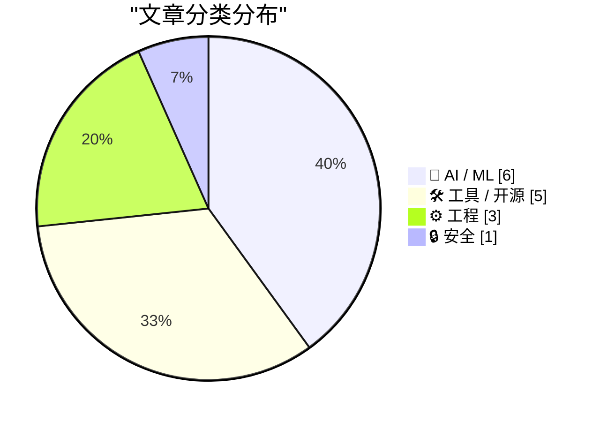
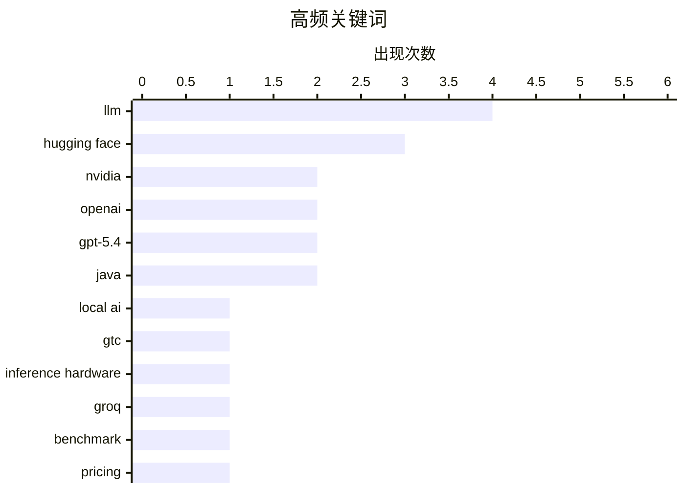

# 📰 AI 资讯每日精选 — 2026-03-18

> 汇聚 140+ 技术博客、X/Twitter、Hacker News、Reddit、Product Hunt、
> Lobste.rs、ClawFeed 日报及 GitHub Trending，经 AI 评分筛选。
>
> **本期内容**：🏆 今日必读 · 🌐 ClawFeed 日报 · 🔥 GitHub Trending · 📂 分类精选 · 🎨 设计与生成式 AI · 📊 数据概览

## 📝 今日看点

今日技术圈聚焦于AI模型的小型化与专用化竞赛。英伟达与OpenAI相继推出紧凑高效的本地部署模型，推动高性能AI向边缘和终端设备普及。同时，专用AI推理硬件与底层框架的升级，共同构成了下一代AI基础设施的核心趋势。

---

## 🏆 今日必读

🥇 **Nemotron 3 Nano 4B：用于高效本地AI的紧凑型混合模型**

[Nemotron 3 Nano 4B: A Compact Hybrid Model for Efficient Local AI](https://huggingface.co/blog/nvidia/nemotron-3-nano-4b) — Hugging Face Blog · 51 分钟前 · 🤖 AI / ML

> 英伟达发布了Nemotron 3 Nano 4B，一个专为本地部署设计的4B参数混合专家模型。该模型采用混合架构，结合了密集和MoE组件，在保持紧凑尺寸的同时提升了性能。它在多项基准测试中超越了同尺寸的Llama 3.2 3B和Qwen2.5 3B模型，并针对CPU和GPU推理进行了优化。这表明小型混合模型是平衡本地部署效率与性能的有效路径。

💡 **为什么值得读**: 为需要在资源受限环境下部署高效能小型模型的开发者，提供了来自英伟达的最新架构选择和性能基准。

🏷️ LLM, local AI, Hugging Face

🥈 **GTC 2026：英伟达首次通过Groq 3 LPX为其平台添加专用推理硬件**

[GTC 2026: With Groq 3 LPX, Nvidia adds dedicated inference hardware to its platform for the first time](https://the-decoder.com/gtc-2026-with-groq-3-lpx-nvidia-adds-dedicated-inference-hardware-to-its-platform-for-the-first-time/) — The Decoder · 9 小时前 · 🛠 工具 / 开源

> 英伟达在GTC 2026上为其Vera Rubin平台引入了首个专用AI推理芯片Groq 3 LPX。此次扩展还包括定制CPU机架、新的存储架构、推理操作系统、开放模型联盟以及代理安全软件。这标志着英伟达平台战略从以GPU为中心，转向整合专用推理硬件的异构计算系统。此举旨在为大规模AI推理工作负载提供更优化的端到端解决方案。

💡 **为什么值得读**: 揭示了英伟达应对推理市场、构建全栈AI平台的关键战略转变，对关注基础设施演进的从业者至关重要。

🏷️ NVIDIA, GTC, Inference Hardware, Groq

🥉 **GPT-5.4 mini与nano：以52美元描述76000张照片**

[GPT-5.4 mini and GPT-5.4 nano, which can describe 76,000 photos for $52](https://simonwillison.net/2026/Mar/17/mini-and-nano/#atom-everything) — simonwillison.net · 4 小时前 · 🤖 AI / ML

> OpenAI发布了两个新的紧凑模型GPT-5.4 mini和nano，专为编码助手、子代理和计算机控制等应用设计。GPT-5.4 nano在最大推理努力下性能超越了前代GPT-5 mini，而新的mini模型速度是前代的两倍。然而，新模型的价格相比前代大幅上涨，最高可达4倍。例如，使用GPT-5.4 nano处理76,000张照片的描述任务，成本约为52美元。

💡 **为什么值得读**: 通过具体的性能对比和成本案例，清晰展示了OpenAI小模型在能力提升与价格激增之间的新权衡。

🏷️ OpenAI, GPT-5.4, LLM, benchmark

4️⃣ **OpenAI推出GPT-5.4 mini和nano：能力更强、速度更快，但价格最高涨4倍**

[OpenAI ships GPT-5.4 mini and nano, faster and more capable but up to 4x pricier](https://the-decoder.com/openai-ships-gpt-5-4-mini-and-nano-faster-and-more-capable-but-up-to-4x-pricier/) — The Decoder · 4 小时前 · 🤖 AI / ML

> OpenAI新推出的GPT-5.4 mini和nano模型，在编码和代理任务上能力接近完整版模型，且速度显著提升。GPT-5.4 mini的性能几乎与完整版GPT-5.4持平，而nano版本在最大推理努力下也超越了旧版mini。但这两个新模型的定价策略激进，输入/输出tokens价格相比其替代的前代模型上涨了2到4倍。这反映了OpenAI在提升小模型性能的同时，大幅调整了其商业定价模式。

💡 **为什么值得读**: 直接点明了本次发布的核心矛盾——性能显著进步伴随价格大幅上涨，是评估是否采用新模型的关键决策信息。

🏷️ OpenAI, GPT-5.4, Pricing, Compact Models

5️⃣ **FFmpeg 8.1 发布**

[FFmpeg 8.1](https://ffmpeg.org/index.html#pr8.1) — Hacker News Best · 9 小时前 · 🛠 工具 / 开源

> 开源多媒体框架FFmpeg发布了8.1版本。此版本通常包含对编解码器、滤镜、格式支持的更新、错误修复及性能改进。具体更新日志需查阅官方发布说明，但历次主要版本升级都会对视频处理生态产生广泛影响。开发者需关注其向后兼容性和新特性，以决定升级时机。

💡 **为什么值得读**: FFmpeg是多媒体处理领域的基石工具，其主版本更新关乎无数应用与服务的兼容性与功能，值得相关开发者第一时间关注。

🏷️ FFmpeg, multimedia, open source

---

## 🌐 ClawFeed 日报精选

> 来源：[ClawFeed](https://clawfeed.kevinhe.io) — AI 驱动的多源新闻聚合

### 🔥 今日头条

### 1. NVIDIA GTC 2026 全面开幕 — Jensen Huang 发布新一代全栈 AI 平台
Jensen Huang 主题演讲发布一系列重磅产品：**Vera Rubin** 下一代 GPU/CPU 全栈平台（7 芯片 + 5 机架系统）、**NemoClaw** 企业级 AI Agent 平台（基于 OpenClaw）、**Groq 3 LPU**（收购 Groq 后首款芯片，Q3 出货）、**DLSS 5**、**Nemotron 3 Super** 开源 120B MoE 模型。Jensen 宣称 "Every single company in the world today has to have an OpenClaw strategy"，预计 Blackwell + Vera Rubin 到 2027 年产生 **$1T 订单**。还预告了下一代 **Feynman** 架构（含 Rosa CPU）。Disney 雪宝机器人惊喜登场。

### 2. Anthropic 起诉美国国防部 — AI 安全 vs 国家安全的历史性对决
五角大楼 3/6 将 Anthropic 列为"供应链风险"，Anthropic 已提起两项诉讼反击，称这是"史无前例的非法报复"。红线：不搞大规模监控美国人、不搞无人控制的自主武器。法律专家认为 Anthropic 胜算较大。同时 Anthropic 登上 **TIME 封面**，被评为"世界最具颠覆性的公司"，估值 **$380B**，Claude Code 年化收入 **$2.5B**。作为用户回馈，3/13-3/27 非高峰时段所有用户 usage 翻倍。

### 3. Meta 裁员 20% + $27B AI 豪赌 + 收购 Moltbook 打造 Agent Graph
Meta 考虑裁掉多达 15,000-16,000 名员工（约 20%），同时与 Nebius 签署 **$27B** AI 云计算协议，华尔街买单股价大涨。更重磅的是收购 **Moltbook**（AI Agent 社交网络），计划打造 "Agent Graph"——让 AI agent 代替广告投放，业务/消费者 agent 自主谈判，可能重塑 Meta **$1600 亿**广告业务。

### 4. 阿里发布 Qwen3.5 + 成立 Token Hub 业务集团
CEO Eddie Wu 亲自挂帅成立 "Token Hub" 整合 AI 业务线。同步发布 **Qwen3.5**：混合 MoE 架构，成本降 60%，速度提升 8 倍，100 万 token 上下文窗口，原生多模态，支持 200+ 语言。Bloomberg 报道基于 Qwen 的企业级 AI agent 本周可能发布，将整合淘宝和支付宝。

### 5. Yann LeCun 创办 AMI Labs — "世界模型"种子轮 $10.3 亿
估值 $35 亿，基于 JEPA 架构打造"世界模型"，Bezos/NVIDIA/Samsung 参投。LeCun 终于从学术界跳出来创业，这是对 LLM 路线最大的挑战者。

---

### 📰 精选 Top 10

| # | 内容 |
|---|------|
| 1 | **Mistral Small 4 发布** — 119B MoE 模型，首次统一推理+多模态+代码能力，Apache 2.0 开源 |
| 2 | **LangChain × NVIDIA** — 发布企业级 Agentic AI 平台 + Deep Agents 开源 runtime（planning/memory/context isolation） |
| 3 | **xAI 联创大逃亡** — Zihang Dai、Guodong Zhang 离职，仅剩 2 位联创；Musk 承认 "wasn't built right"，从 Cursor 挖人重建 |
| 4 | **Replit Series D $4 亿** — 估值 $90 亿（半年翻 3 倍），目标年底 $10B ARR |
| 5 | **Morgan Stanley 预警** — "市场没准备好 LLM 能力的非线性跃升"，预计 4-6 月将出现重大 AI 突破 |
| 6 | **腾讯秘密为微信构建 AI Agent** — 连接 14 亿用户和小程序生态，Q3 公测，点餐/订票/支付全部 agent 代劳 |
| 7 | **Karpathy 发布 AI Job Exposure Visualizer** — BLS 数据对每个美国职业打 AI 自动化风险分，软件开发 9/10，律师 8/10，Musk 转发"所有工作将变为可选" |
| 8 | **Google DeepMind Aletheia** — 数学研究 AI agent，自主解决了 4 个 Erdős 未解问题，从竞赛迈向真正的自主数学研究 |
| 9 | **OpenAI 收购 Promptfoo** — AI 安全公司（25%+ Fortune 500 在用），整合到企业 agent 平台 OpenAI Frontier |
| 10 | **Docker × NanoClaw** — 首个可在 Docker MicroVM Sandbox 中运行的 claw-based agent 平台，安全隔离方案 |

---

### 📊 今日观察

**Agent 时代正式到来。** 今天的新闻从各个维度确认了这一点：NVIDIA 把 OpenClaw 提升到公司战略级别（"Every company needs an OpenClaw strategy"）、Meta 用 Agent Graph 重塑广告业务、腾讯给微信装 AI Agent、阿里成立 Token Hub、LangChain 和 NVIDIA 联合发布企业级 agent 平台。不是某一家在做，而是所有巨头同时在做。

**AI 公司的政治化不可避免。** Anthropic 起诉五角大楼、被 TIME 评为最具颠覆性公司、与 PE 谈合资——AI 安全公司正在被迫选边站。这不再是技术问题，而是地缘政治问题。

**人才市场剧烈洗牌。** xAI 联创出走、LeCun 创办 AMI Labs、Meta 裁员 20% 同时砸 $27B 给 AI——AI 人才在流向最有前景的项目，而"传统"岗位正在被压缩。Karpathy 的 Job Exposure Visualizer 不是假设，是正在发生的事。

**Morgan Stanley 的预警值得认真对待。** 当华尔街大行开始说"市场没准备好"的时候，通常意味着他们自己已经准备好了。4-6 月的 AI 能力跳跃预期 + GTC 发布的硬件路线图，下半年可能非常精彩。

---

*基于 2026-03-17 共 6 期 4h 简报汇总（00:39 / 04:39 / 08:41 / 12:40 / 16:39 / 20:40 SGT）*
*⚠️ 本日因无浏览器工具，Twitter Feed/Bookmarks/Following 抽查均基于 web search 补充*

---

## 🔥 GitHub Trending

> 今日热门开源项目（全语言 + Python）

| # | 项目 | 描述 | ⭐ 总星 | 📈 今日 | 语言 |
|---|------|------|---------|---------|------|
| 1 | [obra/superpowers](https://github.com/obra/superpowers) | An agentic skills framework & software development method... | 92.2k | +3050 | Shell |
| 2 | [codecrafters-io/build-your-own-x](https://github.com/codecrafters-io/build-your-own-x) | Master programming by recreating your favorite technologi... | 479.7k | +2011 | Markdown |
| 3 | [volcengine/OpenViking](https://github.com/volcengine/OpenViking) 🤖 | OpenViking is an open-source context database designed sp... | 15.2k | +1421 | Python |
| 4 | [langchain-ai/deepagents](https://github.com/langchain-ai/deepagents) 🤖 | Agent harness built with LangChain and LangGraph. Equippe... | 14.1k | +1418 | Python |
| 5 | [abhigyanpatwari/GitNexus](https://github.com/abhigyanpatwari/GitNexus) 🤖 | GitNexus: The Zero-Server Code Intelligence Engine - GitN... | 16.7k | +1117 | TypeScript |
| 6 | [jarrodwatts/claude-hud](https://github.com/jarrodwatts/claude-hud) 🤖 | A Claude Code plugin that shows what's happening - contex... | 5.6k | +454 | JavaScript |
| 7 | [TauricResearch/TradingAgents](https://github.com/TauricResearch/TradingAgents) 🤖 | TradingAgents: Multi-Agents LLM Financial Trading Framework | 32.6k | +165 | Python |
| 8 | [resemble-ai/chatterbox](https://github.com/resemble-ai/chatterbox) 🤖 | SoTA open-source TTS | 23.6k | +156 | Python |
| 9 | [dimensionalOS/dimos](https://github.com/dimensionalOS/dimos) 🤖 | Dimensional is the agentic operating system for physical ... | 1.6k | +151 | Python |
| 10 | [MiroMindAI/MiroThinker](https://github.com/MiroMindAI/MiroThinker) 🤖 | MiroThinker is a deep research agent optimized for comple... | 7.0k | +147 | Python |
| 11 | [financial-datasets/mcp-server](https://github.com/financial-datasets/mcp-server) | An MCP server for interacting with the Financial Datasets... | 1.6k | +51 | Python |
| 12 | [cloudflare/workerd](https://github.com/cloudflare/workerd) | The JavaScript / Wasm runtime that powers Cloudflare Workers | 7.8k | +21 | C++ |

---

## 🤖 AI / ML

### 1. Nemotron 3 Nano 4B：用于高效本地AI的紧凑型混合模型

[Nemotron 3 Nano 4B: A Compact Hybrid Model for Efficient Local AI](https://huggingface.co/blog/nvidia/nemotron-3-nano-4b) — **Hugging Face Blog** · 51 分钟前 · ⭐ 27/30

> 英伟达发布了Nemotron 3 Nano 4B，一个专为本地部署设计的4B参数混合专家模型。该模型采用混合架构，结合了密集和MoE组件，在保持紧凑尺寸的同时提升了性能。它在多项基准测试中超越了同尺寸的Llama 3.2 3B和Qwen2.5 3B模型，并针对CPU和GPU推理进行了优化。这表明小型混合模型是平衡本地部署效率与性能的有效路径。

🏷️ LLM, local AI, Hugging Face

---

### 2. GPT-5.4 mini与nano：以52美元描述76000张照片

[GPT-5.4 mini and GPT-5.4 nano, which can describe 76,000 photos for $52](https://simonwillison.net/2026/Mar/17/mini-and-nano/#atom-everything) — **simonwillison.net** · 4 小时前 · ⭐ 26/30

> OpenAI发布了两个新的紧凑模型GPT-5.4 mini和nano，专为编码助手、子代理和计算机控制等应用设计。GPT-5.4 nano在最大推理努力下性能超越了前代GPT-5 mini，而新的mini模型速度是前代的两倍。然而，新模型的价格相比前代大幅上涨，最高可达4倍。例如，使用GPT-5.4 nano处理76,000张照片的描述任务，成本约为52美元。

🏷️ OpenAI, GPT-5.4, LLM, benchmark

---

### 3. OpenAI推出GPT-5.4 mini和nano：能力更强、速度更快，但价格最高涨4倍

[OpenAI ships GPT-5.4 mini and nano, faster and more capable but up to 4x pricier](https://the-decoder.com/openai-ships-gpt-5-4-mini-and-nano-faster-and-more-capable-but-up-to-4x-pricier/) — **The Decoder** · 4 小时前 · ⭐ 26/30

> OpenAI新推出的GPT-5.4 mini和nano模型，在编码和代理任务上能力接近完整版模型，且速度显著提升。GPT-5.4 mini的性能几乎与完整版GPT-5.4持平，而nano版本在最大推理努力下也超越了旧版mini。但这两个新模型的定价策略激进，输入/输出tokens价格相比其替代的前代模型上涨了2到4倍。这反映了OpenAI在提升小模型性能的同时，大幅调整了其商业定价模式。

🏷️ OpenAI, GPT-5.4, Pricing, Compact Models

---

### 4. [论文] Kimi团队提出注意力残差

[[R] Attention Residuals by Kimi Team](https://www.reddit.com/r/MachineLearning/comments/1rw1eag/r_attention_residuals_by_kimi_team/) — **r/MachineLearning** · 15 小时前 · ⭐ 26/30

> Kimi团队在arXiv上发布论文，针对现代大语言模型中标准残差连接（PreNorm）的缺陷提出了改进方案。标准残差连接以固定权重累加所有层输出，导致隐藏状态随网络深度无控制增长，稀释了每层的贡献。新方法“注意力残差”用软注意力权重替代固定累加，动态决定各层对最终表示的贡献。这有望更精细地控制信息流，缓解深度模型中的表征退化问题。

🏷️ LLM, attention, residual connections, architecture

---

### 5. 对6种模型架构进行层手术实验：发现50%深度处的“危险区域”

[I spent a weekend doing layer surgery on 6 different model architectures. There's a "danger zone" at 50% depth that kills every one of them.](https://www.reddit.com/r/LocalLLaMA/comments/1rvxmnh/i_spent_a_weekend_doing_layer_surgery_on_6/) — **r/LocalLLaMA** · 18 小时前 · ⭐ 26/30

> 一项实验研究对包括密集32B、混合9B、MoE 30B在内的6种不同模型架构进行了Transformer层的复制与移植手术。研究发现，在约50-56%的模型深度处存在一个通用的“危险区域”，在此处操作会导致所有测试模型失效。不同架构的最佳层复制深度各不相同，而跨模型层移植即使维度匹配也极难成功。实验还表明，约3B参数是维持模型基本功能的“最小可行模型”尺寸。所有实验均在本地Apple Silicon上通过MLX完成。

🏷️ model architecture, layer surgery, transformer, research

---

### 6. Holotron-12B – 高吞吐量计算机使用智能体

[Holotron-12B - High Throughput Computer Use Agent](https://huggingface.co/blog/Hcompany/holotron-12b) — **Hugging Face Blog** · 11 小时前 · ⭐ 25/30

> Holotron-12B是一个拥有120亿参数、专为高吞吐量计算机控制任务设计的AI智能体模型。它能够通过图形用户界面理解和操作计算机，执行复杂的多步骤任务。该模型在大量合成和真实的人机交互数据上进行了训练，旨在实现可靠且高效的自动化。Holotron-12B代表了向通用计算机使用智能体迈进的重要一步。

🏷️ AI Agent, Computer Use, Hugging Face

---

## 🛠 工具 / 开源

### 7. GTC 2026：英伟达首次通过Groq 3 LPX为其平台添加专用推理硬件

[GTC 2026: With Groq 3 LPX, Nvidia adds dedicated inference hardware to its platform for the first time](https://the-decoder.com/gtc-2026-with-groq-3-lpx-nvidia-adds-dedicated-inference-hardware-to-its-platform-for-the-first-time/) — **The Decoder** · 9 小时前 · ⭐ 27/30

> 英伟达在GTC 2026上为其Vera Rubin平台引入了首个专用AI推理芯片Groq 3 LPX。此次扩展还包括定制CPU机架、新的存储架构、推理操作系统、开放模型联盟以及代理安全软件。这标志着英伟达平台战略从以GPU为中心，转向整合专用推理硬件的异构计算系统。此举旨在为大规模AI推理工作负载提供更优化的端到端解决方案。

🏷️ NVIDIA, GTC, Inference Hardware, Groq

---

### 8. FFmpeg 8.1 发布

[FFmpeg 8.1](https://ffmpeg.org/index.html#pr8.1) — **Hacker News Best** · 9 小时前 · ⭐ 26/30

> 开源多媒体框架FFmpeg发布了8.1版本。此版本通常包含对编解码器、滤镜、格式支持的更新、错误修复及性能改进。具体更新日志需查阅官方发布说明，但历次主要版本升级都会对视频处理生态产生广泛影响。开发者需关注其向后兼容性和新特性，以决定升级时机。

🏷️ FFmpeg, multimedia, open source

---

### 9. [项目] mlx-tune – 使用MLX在Apple Silicon上微调LLM

[[P] mlx-tune – Fine-tune LLMs on Apple Silicon with MLX (SFT, DPO, GRPO, VLM)](https://www.reddit.com/r/MachineLearning/comments/1rw58ku/p_mlxtune_finetune_llms_on_apple_silicon_with_mlx/) — **r/MachineLearning** · 11 小时前 · ⭐ 26/30

> 开源工具mlx-tune发布，支持在Apple Silicon芯片上利用MLX框架对大语言模型进行微调。它集成了监督微调、DPO、GRPO和视觉语言模型微调等多种训练范式。该项目降低了在Mac本地环境进行LLM定制化训练的门槛，充分利用苹果硬件的计算能力。为研究者和开发者提供了一个高效、易用的本地微调解决方案。

🏷️ MLX, fine-tuning, Apple Silicon, LLM

---

### 10. Java 26 正式发布，为未来奠定坚实基础

[Java 26 is here, and with it a solid foundation for the future](https://www.reddit.com/r/programming/comments/1rwhbea/java_26_is_here_and_with_it_a_solid_foundation/) — **r/programming** · 4 小时前 · ⭐ 25/30

> Java 26作为新的长期支持版本，引入了多项关键更新以巩固其现代语言地位。核心变化包括将原本预览的字符串模板（String Templates）功能转为正式特性，并移除了长期存在的“孵化器模块”机制。此外，该版本继续推进Project Amber和Project Loom的成果集成，增强了开发体验和并发编程能力。这些更新标志着Java正朝着更简洁、更高效的方向稳步演进，为开发者构建下一代应用提供了更稳定和强大的平台。

🏷️ Java, release, future, ecosystem

---

### 11. Hugging Face发布一行命令工具：自动检测硬件、选择最佳量化模型并启动Llama.cpp服务器与Pi智能体

[Hugging Face just released a one-liner that uses 𝚕𝚕𝚖𝚏𝚒𝚝 to detect your hardware and pick the best model and quant, spins up a 𝚕𝚕a𝚖𝚊.𝚌𝚙𝚙 server, and launches Pi (the agent behind OpenClaw 🦞)](https://www.reddit.com/r/LocalLLaMA/comments/1rwgi8x/hugging_face_just_released_a_oneliner_that_uses/) — **r/LocalLLaMA** · 4 小时前 · ⭐ 25/30

> Hugging Face发布了一个极简的命令行工具，极大简化了在本地硬件上运行大型语言模型的流程。该工具利用`llmfit`自动检测用户的硬件配置（如GPU型号、内存），并据此选择最适合的模型及其量化版本。随后，它会自动启动一个`llama.cpp`服务器来托管所选模型，并同时启动Pi智能体（即OpenClaw项目背后的代理系统）。这相当于将模型选择、优化、部署和智能体启动等多个步骤压缩为一条命令，显著降低了本地运行AI模型的技术门槛。

🏷️ Hugging Face, llmfit, automation, deployment

---

## ⚙️ 工程

### 12. Java发布Project Valhalla中JEP 401（值对象）的早期访问版本3

[Java just released Early Access 3 for Project Valhalla's JEP 401 (Value Objects)!](https://www.reddit.com/r/programming/comments/1rw8i5u/java_just_released_early_access_3_for_project/) — **r/programming** · 9 小时前 · ⭐ 26/30

> Java项目Valhalla取得了重要进展，发布了JEP 401（值对象）的第三个早期访问构建版。Valhalla旨在通过引入值对象和专用泛型等特性，解决Java中对象内存开销和数据局部性等问题。值对象允许开发者定义类似原始类型的不可变、无标识的复合类型，从而显著提升性能并减少内存占用。这是Java语言向更高效数据表示演进的关键一步。

🏷️ Java, Project Valhalla, performance

---

### 13. 与NVIDIA共建AI网格：让智能无处不在

[Building the AI Grid with NVIDIA: Orchestrating Intelligence Everywhere](https://developer.nvidia.com/blog/building-the-ai-grid-with-nvidia-orchestrating-intelligence-everywhere/) — **NVIDIA Technical Blog** · 6 小时前 · ⭐ 25/30

> AI原生服务的普及暴露了基础设施的新瓶颈，即如何满足海量用户、智能体和设备对智能的并发访问需求。NVIDIA提出的“AI网格”是一个由硬件、软件和系统组成的统一计算架构，旨在将分散的计算资源（从数据中心到边缘设备）整合为可动态编排的智能网络。该架构通过NVIDIA NIM微服务、CUDA计算平台和网络技术，实现AI工作负载在云、数据中心和边缘之间的无缝调度与执行。其核心目标是构建一个可扩展、高性能的“AI工厂”，让智能像电网输送电力一样，按需、实时地输送到任何地方。

🏷️ AI Infrastructure, NVIDIA, Orchestration, AI Grid

---

### 14. 什么是“基础设施即代码”？

[What is Infrastructure from Code?](https://www.reddit.com/r/programming/comments/1rw8jij/what_is_infrastructure_from_code/) — **r/programming** · 9 小时前 · ⭐ 25/30

> “基础设施即代码”是一种新兴的云基础设施范式，旨在解决传统IaC（基础设施即代码）在开发体验和抽象层级上的不足。IfC允许开发者直接使用应用程序代码（如函数定义、类型注解）来声明其所需的基础设施资源，然后由IfC框架自动生成并配置对应的云服务（如数据库、消息队列）。这种方法将基础设施的抽象层级从资源层提升到了应用层，实现了开发意图与运维实现的直接映射。其目标是消除开发与运维之间的认知负担和配置鸿沟，让开发者能更专注于业务逻辑。

🏷️ Infrastructure from Code, DevOps, cloud

---

## 🔒 安全

### 15. Jepsen分布式系统分析报告：MariaDB Galera Cluster 12.1.2

[Jepsen: MariaDB Galera Cluster 12.1.2](https://www.reddit.com/r/programming/comments/1rwhfhr/jepsen_mariadb_galera_cluster_1212/) — **r/programming** · 4 小时前 · ⭐ 25/30

> 这是一份由Jepsen团队对MariaDB Galera Cluster 12.1.2进行的权威分布式一致性测试分析报告。测试发现，在特定网络分区和节点故障场景下，该集群会出现锁等待超时、事务回滚甚至死锁问题，导致线性一致性被破坏。报告详细阐述了在模拟网络中断时观察到的异常行为及其触发条件。结论指出，尽管Galera集群在某些方面有改进，但它仍然无法在部分故障情况下提供强一致性保证，用户需根据自身对一致性的要求谨慎评估使用风险。

🏷️ database, distributed systems, testing

---

## 🎨 Design & Generative AI

### 🖥️ 生成式 UI

- **[ComfyUI中AI“氛围编程”的Bug修复经验分享](https://www.reddit.com/r/comfyui/comments/1rw0umf/bug_fixing_lessons_learned_for_ai_vibe_coding_in/)** — r/comfyui · 15 小时前
  > 分享在使用Claude等AI助手进行ComfyUI“氛围编程”时避免和修复Bug的实用经验。

### 🖼️ 生成式图片

- **[Stable Diffusion模型测试工作流程指南](https://www.reddit.com/r/StableDiffusion/comments/1rw8kas/wrote_a_guide_on_the_workflow_i_used_to_test_the/)** — r/StableDiffusion · 9 小时前
  > 分享用于测试特定扩散模型并生成示例图片的工作流程。

- **[ComfyUI教程：FLUX.2 Klein 9B KV的速度与图像一致性](https://www.reddit.com/r/comfyui/comments/1rwappo/flux2_klein_9b_kv_speed_and_image_consistency_in/)** — r/comfyui · 8 小时前
  > 介绍在ComfyUI中使用FLUX.2 Klein 9B KV模型实现快速且一致的图像生成。

- **[DLSS 5“神经面孔”的角色一致性技术解析](https://www.reddit.com/r/StableDiffusion/comments/1rw1tet/dlss_5_neural_faces_seem_to_use_something_similar/)** — r/StableDiffusion · 14 小时前
  > 探讨DLSS 5的“神经面孔”功能如何利用类似角色LoRA训练的技术保持角色一致性。

- **[ComfyUI移动端前端v2.3.1发布，大幅提升兼容性](https://www.reddit.com/r/comfyui/comments/1rw0pkq/comfyui_mobile_frontend_v231_just_released/)** — r/comfyui · 15 小时前
  > ComfyUI移动端前端迎来重大更新，通过重构改善了与主前端的兼容性。

- **[Midjourney V8 alpha版本现已开放社区测试](https://www.reddit.com/r/midjourney/comments/1rwkcfu/v8_alpha_is_here/)** — r/midjourney · 2 小时前
  > Midjourney发布V8模型的早期alpha版本，供社区在特定网站进行测试。

- **[Windows上ComfyUI+ROCm故障排查：生成第二张图后停止](https://www.reddit.com/r/comfyui/comments/1rw17hd/comfyui_rocm_on_windows_generation_stops_after/)** — r/comfyui · 15 小时前
  > 探讨在Windows上使用ROCm运行ComfyUI时，生成第二张图像后停止并报错的根本原因。

- **[F16/z-image-turbo-sda：提升Z-Image Turbo多样性的Lokr模型](https://www.reddit.com/r/StableDiffusion/comments/1rvtbt9/f16zimageturbosda_a_lokr_that_improves_zimage/)** — r/StableDiffusion · 22 小时前
  > 介绍一个名为F16/z-image-turbo-sda的Lokr模型，旨在改善Z-Image Turbo的图像多样性。

- **[LTX 2.3技巧：手动Sigma值可被替换](https://www.reddit.com/r/StableDiffusion/comments/1rw8453/ltx_23_manual_sigmas_can_be_replaced/)** — r/StableDiffusion · 9 小时前
  > 分享一个关于LTX 2.3模型中可以替换手动设置的Sigma值的实用技巧。

- **[LTX 2.3空间升级器1.0与1.1版本对比](https://www.reddit.com/r/StableDiffusion/comments/1rw59ch/ltx_23_spatial_upscaler_10_vs_11/)** — r/StableDiffusion · 11 小时前
  > 对LTX 2.3模型中两个版本的空间升级器（1.0 vs 1.1）进行对比测试。

- **[寻求Stable Diffusion相关术语词典](https://www.reddit.com/r/StableDiffusion/comments/1rwhh70/is_there_a_dictionary_of_terms/)** — r/StableDiffusion · 4 小时前
  > 询问是否存在一个解释FP8、Safetensors、LoRA等Stable Diffusion社区常用技术术语的词汇表。

- **[FP16 Wan 2.2 与 完整版Dev 22B LTX 2.3 模型对比](https://www.reddit.com/r/comfyui/comments/1rwddr2/fp_16_wan_22_vs_full_dev_22b_ltx_23_this_took/)** — r/comfyui · 6 小时前
  > 对FP16精度的Wan 2.2模型与完整版22B参数的LTX 2.3模型进行耗时对比测试。

- **[用Z-Image Turbo创作的10种最佳写实风格（附ComfyUI工作流）](https://www.reddit.com/r/comfyui/comments/1rw8sqo/10_best_photorealistic_styles_you_can_create_with/)** — r/comfyui · 9 小时前
  > 展示使用Z-Image Turbo模型可以生成的十种最佳摄影写实风格，并提供对应的ComfyUI工作流程。

### 🌍 世界模型 / 3D

- **[ComfyUI模型推荐：备受喜爱的Nova 3DXL](https://www.reddit.com/r/StableDiffusion/comments/1rw9gjf/comfyui_model_nova_3dxl/)** — r/StableDiffusion · 8 小时前
  > 分享对Nova 3DXL这一3D生成模型的喜爱与使用体验。

### 🎬 生成式视频

- **[自制ComfyUI节点解决视频生成中的循环与光流难题](https://www.reddit.com/r/comfyui/comments/1rvz4e1/struggled_with_loops_temporal_feedback_and/)** — r/comfyui · 17 小时前
  > 为解决循环、时间反馈和光流节点问题，作者创建了自定义ComfyUI节点。

---

## 📊 数据概览

| 扫描源 | 抓取文章 | 时间范围 | 精选 |
|:---:|:---:|:---:|:---:|
| 119/140 | 5252 篇 → 223 篇 | 24h | **15 篇** |

### 分类分布



### 高频关键词



<details>
<summary>📈 纯文本关键词图（终端友好）</summary>

```
llm                │ ████████████████████ 4
hugging face       │ ███████████████░░░░░ 3
nvidia             │ ██████████░░░░░░░░░░ 2
openai             │ ██████████░░░░░░░░░░ 2
gpt-5.4            │ ██████████░░░░░░░░░░ 2
java               │ ██████████░░░░░░░░░░ 2
local ai           │ █████░░░░░░░░░░░░░░░ 1
gtc                │ █████░░░░░░░░░░░░░░░ 1
inference hardware │ █████░░░░░░░░░░░░░░░ 1
groq               │ █████░░░░░░░░░░░░░░░ 1
```

</details>

### 🏷️ 话题标签

**llm**(4) · **hugging face**(3) · **nvidia**(2) · openai(2) · gpt-5.4(2) · java(2) · local ai(1) · gtc(1) · inference hardware(1) · groq(1) · benchmark(1) · pricing(1) · compact models(1) · ffmpeg(1) · multimedia(1) · open source(1) · project valhalla(1) · performance(1) · attention(1) · residual connections(1)

---

*生成于 2026-03-18 00:08 | 汇聚 140 个技术博客、X/Twitter、Hacker News、Reddit、Product Hunt、Lobste.rs、ClawFeed 日报及 GitHub Trending，经 AI 评分筛选出 Top 15 精华内容*
