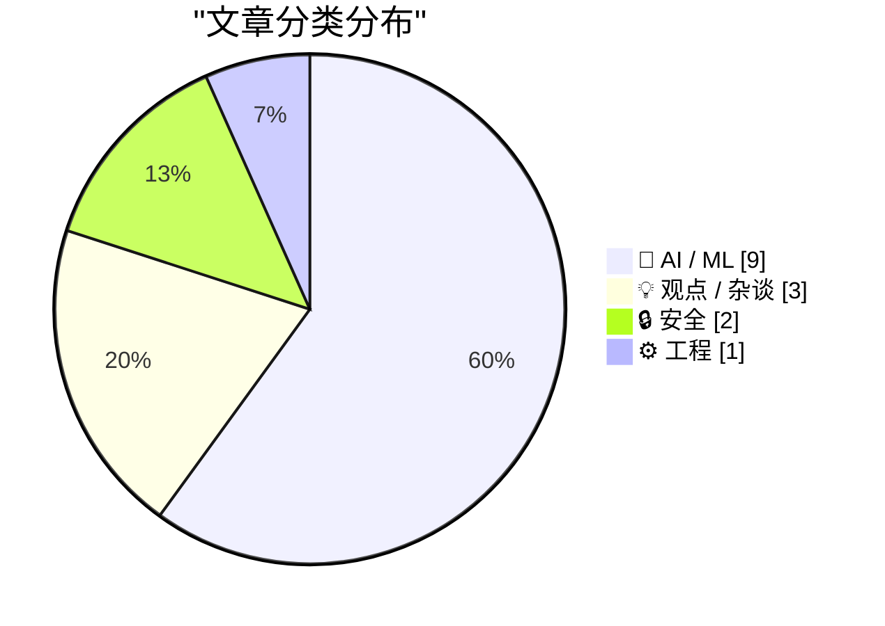
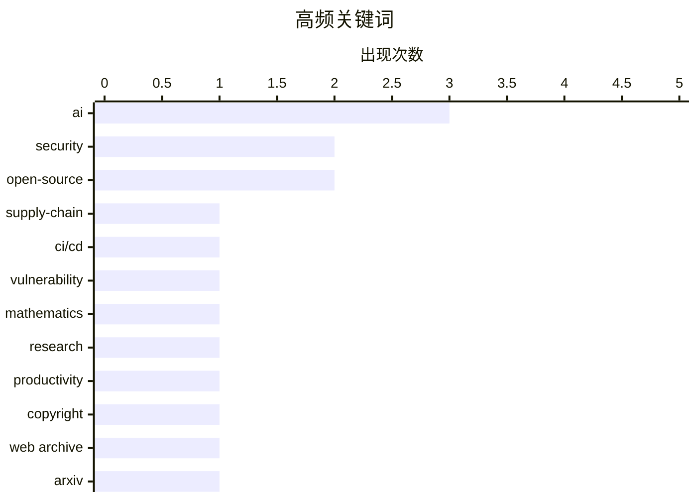

# 📰 AI 资讯每日精选 — 2026-03-22

> 汇聚 140+ 技术博客、X/Twitter、Hacker News、Reddit、Product Hunt、
> Lobste.rs、ClawFeed 日报及 GitHub Trending，经 AI 评分筛选。
>
> **本期内容**：🏆 今日必读 · 🌐 ClawFeed 日报 · 🔥 GitHub Trending · 📂 分类精选 · 🎨 设计与生成式 AI · 📊 数据概览

## 📝 今日看点

今日技术圈聚焦于AI的深度整合与安全隐忧。一方面，AI正从辅助工具演变为能参与自我改进和复杂研究的“伙伴”，深刻改变科研与开发范式；另一方面，供应链安全风险在CI/CD等关键环节持续暴露，构成严峻威胁。同时，学术与网络生态正积极应对AI带来的数据与内容治理挑战。

---

## 🏆 今日必读

🥇 **Trivy 再遭攻击：GitHub Actions 标签大规模被篡改，暴露 CI/CD 密钥**

[Trivy Under Attack Again: Widespread GitHub Actions Tag Compromise Exposes CI/CD Secrets](https://www.reddit.com/r/programming/comments/1rzivdh/trivy_under_attack_again_widespread_github/) — r/programming · 18 小时前 · 🔒 安全

> 流行的容器安全扫描工具 Trivy 的 GitHub Actions 工作流标签再次遭到供应链攻击。攻击者通过劫持 `aquasec/trivy-action` 仓库的 `latest` 和 `0.18.0` 等标签，将其指向恶意代码，从而窃取 CI/CD 流水线中的敏感密钥。此次事件影响了大量使用默认标签（而非固定提交哈希）的项目，暴露了依赖项管理的普遍安全风险。核心结论是，必须始终使用不可变的提交哈希或经过验证的发布版，而非动态标签，来引用第三方 Actions。

💡 **为什么值得读**: 这篇文章为所有使用 GitHub Actions 的开发者敲响了警钟，揭示了供应链攻击中一个极易被忽视但危害巨大的具体漏洞。

🏷️ security, supply-chain, CI/CD, vulnerability

🥈 **陶哲轩——世界顶级数学家如何使用 AI**

[Terence Tao – How the world’s top mathematician uses AI](https://www.reddit.com/r/singularity/comments/1rzgupl/terence_tao_how_the_worlds_top_mathematician_uses/) — r/singularity · 20 小时前 · 🤖 AI / ML

> 菲尔兹奖得主、数学家陶哲轩公开分享了他将 AI 工具（如 GPT-4）深度融入研究工作的实践。他将 AI 用作一个“快速响应的初级研究伙伴”，帮助完成代码编写、文献综述、思路验证甚至发现证明中的潜在漏洞等任务。陶哲轩强调，AI 并非替代直觉和深度思考，而是通过处理繁琐细节和提供新视角来放大研究者的能力。他的核心观点是，善于利用 AI 的数学家将在未来获得显著优势。

💡 **为什么值得读**: 通过顶尖学者的一手经验，展示了 AI 如何切实改变高难度、高创造性领域的科研范式，极具启发性和前瞻性。

🏷️ AI, mathematics, research, productivity

🥉 **封禁互联网档案馆无法阻止 AI，但将抹除网络的历史记录**

[Blocking Internet Archive Won't Stop AI, but Will Erase Web's Historical Record](https://www.eff.org/deeplinks/2026/03/blocking-internet-archive-wont-stop-ai-it-will-erase-webs-historical-record) — Hacker News Best · 16 小时前 · 💡 观点 / 杂谈

> 针对部分出版商和机构为阻止 AI 训练而封禁互联网档案馆（Internet Archive）的行为，电子前哨基金会（EFF）提出了尖锐批评。文章指出，这种封禁措施对阻止 AI 公司获取训练数据效果甚微，因为它们早已通过其他渠道完成了抓取。然而，封禁行为却会直接摧毁互联网档案馆这一重要的公共数字图书馆，导致网站历史版本、已消失的在线文化等不可替代的数字遗产永久丢失。EFF 的核心论点是，保护版权不应以牺牲公共知识访问和历史保存为代价。

💡 **为什么值得读**: 它清晰揭示了当前“反AI数据抓取”运动中的一个关键悖论和潜在的巨大文化代价，关乎每个人对数字历史的访问权。

🏷️ AI, copyright, web archive

4️⃣ **开创性预印本服务器 arXiv 宣布脱离康奈尔大学独立运营**

[[N] ArXiv, the pioneering preprint server, declares independence from Cornell | Science | As an independent nonprofit, it hopes to raise funds to cope with exploding submissions and “AI slop”](https://www.reddit.com/r/MachineLearning/comments/1rzp5ph/n_arxiv_the_pioneering_preprint_server_declares/) — r/MachineLearning · 12 小时前 · 💡 观点 / 杂谈

> 著名的学术预印本服务器 arXiv 正式从康奈尔大学剥离，成为一个独立的非营利组织。这一变革的主要驱动力是应对论文提交量的爆炸式增长（2025年预计达25万篇）以及日益严重的“AI垃圾”论文问题。作为独立实体，arXiv 希望获得更灵活的筹资能力，以升级技术基础设施并加强论文筛选和质量控制。此举旨在确保其能继续作为开放、可信的科学交流基石，应对 AI 时代的新挑战。

💡 **为什么值得读**: 此文揭示了学术交流核心基础设施在 AI 浪潮下面临的生存与治理危机，其转型将直接影响全球科研工作者。

🏷️ arXiv, preprint, AI research

5️⃣ **Midjourney V8 Alpha 版本发布**

[⌽ (V8 alpha)](https://www.reddit.com/r/midjourney/comments/1s04w3f/v8_alpha/) — r/midjourney · 1 小时前 · 🤖 AI / ML

> Midjourney 发布了其文生图模型的 V8 Alpha 测试版本。新版本通常在图像质量、细节渲染、提示词理解一致性以及新功能（如改进的图像提示功能）方面有显著提升。V8 Alpha 的发布标志着该平台在生成式 AI 图像领域的持续快速迭代。用户可通过特定命令访问该版本进行体验和测试。

💡 **为什么值得读**: 对于关注 AI 绘画前沿动态的创作者和开发者，这是第一时间了解顶级模型最新能力跃迁的直接窗口。

🏷️ Midjourney, V8, alpha, release

---

## 🌐 ClawFeed 日报精选

> 来源：[ClawFeed](https://clawfeed.kevinhe.io) — AI 驱动的多源新闻聚合

### 🔥 今日头条

**1. OpenAI 全力打造「全自动 AI 研究员」**
MIT Technology Review 深度报道，首席科学家 Jakub Pachocki 称 OpenAI 已具备大部分所需技术，计划 2026 年 9 月推出能独立完成人类需数天完成的研究任务的「AI 研究实习生」，2028 年推出完整多 Agent 研究系统。

**2. Karpathy 自曝「AI 精神病」— 从 2024 年 12 月起没手写过一行代码**
Karpathy 上 No Priors Pod 长谈，称自己每天对 Agent 说话 16 小时，同时跑十几个 Agent 并行。核心观点：写代码已经不是「对的动词」了，App 该消失，设备只需暴露 API 给 Agent。本周 AI 圈必看播客。

**3. AI 巨头工具链收购潮：OpenAI 收购 Astral，Anthropic 收购 Bun，Google DeepMind 收购 Antigravity**
三巨头同步加速整合开发工具生态。OpenAI 同时将 ChatGPT/Codex/Atlas 合并为桌面「超级 App」。

**4. Cursor Composer 2 实为 Kimi K2.5 微调版，Moonshot AI 指控违反开源许可**
Cursor 新编程模型被曝基于月之暗面 Kimi K2.5 + RL 微调，未标注归属，Moonshot AI 指控违反修改版 MIT 许可证的商业使用条款，在 Reddit/HN 引发热议。

**5. Marc Andreessen 喊出 "402!" — Agentic Commerce 支付标准之战打响**
a16z 力挺 AI Agent 自主支付，HTTP 402 Payment Required 终于要被激活。@samrags_ 的《Open Agentic Commerce》长文获 214K views，ACP & UCP 协议将让 ChatGPT/Gemini 直接结账。

---

### 📰 精选 Top 10

1. **Karpathy × No Priors Pod** — AI psychosis、AutoResearch、SETI-at-Home 式 AI 运动，@dotey 宝玉深度解读：「写代码已经不是对的动词了」
   https://x.com/karpathy/status/2035158351357911527

2. **@samrags_ — Open Agentic Commerce 深度长文** — ACP & UCP 协议将在 ChatGPT/Gemini 中实现结账，pmarca 只回了一句 "402!"（214K views）
   https://x.com/samrags_/status/2035027030975422566

3. **@nikil — 开源 ClawFlows** — OpenClaw workflow 系统，100+ 预置工作流，每天使用 1000+ 次（70K views）
   https://x.com/nikil/status/2035104041395495333

4. **@browser_use — Browser Use CLI 2.0** — 速度翻倍、成本减半、支持直连 Chrome CDP（217K views）
   https://x.com/browser_use/status/2035081807209931153

5. **@bozhou_ai — EverMind MSA 记忆架构** — 将记忆嵌入注意力机制，4B 小模型干翻 235B 级 RAG，16K 扩到 1 亿 token 精度掉不到 9%
   https://x.com/bozhou_ai/status/2035033044831400166

6. **@nunchi — Auto-Research Trading 开源** — 受 Karpathy auto-research 启发，完全自主的研究循环交易 Agent（118K views）
   https://x.com/nunchi/status/2035024876520538256

7. **@mubeitech — TradingAgents 开源** — 年化 30.5%，GitHub 3 万星，四个 AI 分析师并行扫财报+情绪
   https://x.com/mubeitech/status/2035250400467497096

8. **@chenchengpro — Claude Code Channels 深度分析** — 不只是「手机控代码」，而是 CLI agent 变成可远程寻址的服务，MCP 成为通用接口层
   https://x.com/chenchengpro/status/2034797615662145999

9. **@lifesinger — 对 CLI 热潮泼冷水** — CLI 化是流量逻辑，for agents 叙事催生传统工具「穿新衣」，面临参数爆炸等难题（27K views）
   https://x.com/lifesinger/status/2035010592981852213

10. **@withhazelhu — 三十年暗号，AI 支付标准之战** — 从 1996 年 HTTP 402 到今天的 AI Agent 支付协议竞争，Tempo 主网上线
    https://x.com/withhazelhu/status/2034983074140704884

---

### 📊 今日观察

今天的 AI 圈有一个清晰的主旋律：**从「用 AI 写代码」到「让 AI 自己做研究」**。

Karpathy 的播客是今天的情绪锚点——一个顶级 AI 研究者坦言自己「得了 AI 精神病」，半年没手写一行代码，这不是段子，是范式转移的信号。OpenAI 同步公布全自动研究员计划，Anthropic 推出 Cloud Scheduling 和 Channels，工具层在加速变成基础设施。

另一条暗线是 **Agent 支付**。a16z 的 Marc Andreessen 只用一个 "402!" 就点燃了整个讨论，HTTP 402 这个沉睡三十年的状态码终于要被激活。当 Agent 能自己花钱的时候，整个商业逻辑都要重写。

工具链方面，三巨头同步收购（Astral/Bun/Antigravity）+ Cursor 被曝用 Kimi K2.5 引发许可争议，开发者工具正在成为 AI 公司的必争之地。

交易 Agent 赛道也在升温：TradingAgents 3 万星、Auto-Research Trading、Moss Agent 模拟盘 $10K→$4M，量化+AI 的叙事正在从 PPT 走向开源实战。

一句话总结：**AI 不再只是写代码的工具，它正在变成独立的研究者、消费者和交易员。**

---

*基于 6 期 4h 简报汇总 | 2026-03-21 00:41 – 20:41 SGT*

---

## 🔥 GitHub Trending

> 今日热门开源项目（全语言 + Python）

| # | 项目 | 描述 | ⭐ 总星 | 📈 今日 | 语言 |
|---|------|------|---------|---------|------|
| 1 | [Crosstalk-Solutions/project-nomad](https://github.com/Crosstalk-Solutions/project-nomad) 🤖 | Project N.O.M.A.D, is a self-contained, offline survival ... | 6.6k | +2054 | TypeScript |
| 2 | [TauricResearch/TradingAgents](https://github.com/TauricResearch/TradingAgents) 🤖 | TradingAgents: Multi-Agents LLM Financial Trading Framework | 35.5k | +1455 | Python |
| 3 | [jarrodwatts/claude-hud](https://github.com/jarrodwatts/claude-hud) 🤖 | A Claude Code plugin that shows what's happening - contex... | 10.4k | +957 | JavaScript |
| 4 | [opendataloader-project/opendataloader-pdf](https://github.com/opendataloader-project/opendataloader-pdf) 🤖 | PDF Parser for AI-ready data. Automate PDF accessibility.... | 7.9k | +954 | Java |
| 5 | [louis-e/arnis](https://github.com/louis-e/arnis) | Generate any location from the real world in Minecraft wi... | 12.2k | +680 | Rust |
| 6 | [anthropics/skills](https://github.com/anthropics/skills) 🤖 | Public repository for Agent Skills | 99.3k | +664 | Python |
| 7 | [anthropics/claude-plugins-official](https://github.com/anthropics/claude-plugins-official) 🤖 | Official, Anthropic-managed directory of high quality Cla... | 13.9k | +519 | Python |
| 8 | [langchain-ai/open-swe](https://github.com/langchain-ai/open-swe) 🤖 | An Open-Source Asynchronous Coding Agent | 7.9k | +466 | Python |
| 9 | [FujiwaraChoki/MoneyPrinterV2](https://github.com/FujiwaraChoki/MoneyPrinterV2) | Automate the process of making money online. | 17.7k | +379 | Python |
| 10 | [microsoft/markitdown](https://github.com/microsoft/markitdown) | Python tool for converting files and office documents to ... | 91.4k | +284 | Python |
| 11 | [unslothai/unsloth](https://github.com/unslothai/unsloth) 🤖 | Unified web UI for training and running open models like ... | 57.4k | +235 | Python |
| 12 | [opengaming/osgameclones](https://github.com/opengaming/osgameclones) | Open Source Clones of Popular Games | 2.8k | +162 | Python |
| 13 | [aquasecurity/trivy](https://github.com/aquasecurity/trivy) | Find vulnerabilities, misconfigurations, secrets, SBOM in... | 33.4k | +127 | Go |
| 14 | [systemd/systemd](https://github.com/systemd/systemd) | The systemd System and Service Manager | 15.7k | +112 | C |
| 15 | [vllm-project/vllm-omni](https://github.com/vllm-project/vllm-omni) | A framework for efficient model inference with omni-modal... | 3.5k | +82 | Python |

---

## 🤖 AI / ML

### 1. 陶哲轩——世界顶级数学家如何使用 AI

[Terence Tao – How the world’s top mathematician uses AI](https://www.reddit.com/r/singularity/comments/1rzgupl/terence_tao_how_the_worlds_top_mathematician_uses/) — **r/singularity** · 20 小时前 · ⭐ 26/30

> 菲尔兹奖得主、数学家陶哲轩公开分享了他将 AI 工具（如 GPT-4）深度融入研究工作的实践。他将 AI 用作一个“快速响应的初级研究伙伴”，帮助完成代码编写、文献综述、思路验证甚至发现证明中的潜在漏洞等任务。陶哲轩强调，AI 并非替代直觉和深度思考，而是通过处理繁琐细节和提供新视角来放大研究者的能力。他的核心观点是，善于利用 AI 的数学家将在未来获得显著优势。

🏷️ AI, mathematics, research, productivity

---

### 2. Midjourney V8 Alpha 版本发布

[⌽ (V8 alpha)](https://www.reddit.com/r/midjourney/comments/1s04w3f/v8_alpha/) — **r/midjourney** · 1 小时前 · ⭐ 25/30

> Midjourney 发布了其文生图模型的 V8 Alpha 测试版本。新版本通常在图像质量、细节渲染、提示词理解一致性以及新功能（如改进的图像提示功能）方面有显著提升。V8 Alpha 的发布标志着该平台在生成式 AI 图像领域的持续快速迭代。用户可通过特定命令访问该版本进行体验和测试。

🏷️ Midjourney, V8, alpha, release

---

### 3. 据报道，中国 AI 模型 MiniMax M2.7 协助开发了它自身

[Chinese AI model MiniMax M2.7 reportedly helped develop itself](https://the-decoder.com/chinese-ai-model-minimax-m2-7-reportedly-helped-develop-itself/) — **The Decoder** · 12 小时前 · ⭐ 24/30

> 中国 AI 公司 MiniMax 发布的 M2.7 模型，据称在其自身开发过程中扮演了主动角色。该模型通过自主优化循环，改进了自身的训练过程，例如优化数据混合配比和训练超参数。这种“自我改进”能力使其在多项基准测试中取得了有竞争力的结果。这标志着 AI 模型开发向更高程度的自动化迈出了探索性一步。

🏷️ MiniMax, AI Development, Autonomous Optimization

---

### 4. OpenAI 首席科学家信任 AI 进行实验，但认为其尚未达到设计复杂系统的水平

[OpenAI's chief scientist trusts AI with experiments but says it's not at the level to design complex systems](https://the-decoder.com/openais-chief-scientist-trusts-ai-with-experiments-but-says-its-not-at-the-level-to-design-complex-systems/) — **The Decoder** · 13 小时前 · ⭐ 24/30

> OpenAI 首席科学家雅库布·帕乔斯基分享了他对 AI 在当前科研中作用的看法。他表示，AI 已能接管他曾需手动完成、耗时数周的代码实验，极大提升了研究效率。然而，他明确划定了边界：AI 尚不具备设计复杂系统架构所需的深度理解和创造力。他的核心观点是，AI 是强大的实验和执行工具，但战略性的高层设计和决策仍需人类主导。

🏷️ OpenAI, AI Coding, Developer Tools

---

### 5. Cursor 悄然将其新编程模型基于中国开源模型 Kimi K2.5 构建

[Cursor quietly built its new coding model on top of Chinese open-source Kimi K2.5](https://the-decoder.com/cursor-quietly-built-its-new-coding-model-on-top-of-chinese-open-source-kimi-k2-5/) — **The Decoder** · 15 小时前 · ⭐ 24/30

> 知名 AI 编程工具 Cursor 发布了其第二代自有模型 Composer 2。该模型旨在以显著更低的成本，追平 Anthropic 的 Claude 和 OpenAI 的模型在编码任务上的领先性能。技术上的关键点是，Composer 2 是基于中国月之暗面公司的开源模型 Kimi K2.5 进行构建和微调的。这体现了全球 AI 开发生态中，利用高质量开源基础模型进行快速产品迭代的新趋势。

🏷️ AI, code generation, open-source

---

### 6. Tinybox：可运行 1200 亿参数模型的离线 AI 设备

[Tinybox- offline AI device 120B parameters](https://tinygrad.org/#tinybox) — **Hacker News Best** · 3 小时前 · ⭐ 24/30

> Tinybox 是一个专为离线运行大型语言模型设计的紧凑型硬件设备。其核心目标是提供开箱即用的体验，让用户无需复杂配置即可本地部署和运行参数高达 1200 亿的 AI 模型。该设备基于开源深度学习框架 Tinygrad 构建，强调极简主义和效率。它代表了让前沿大模型能力脱离云服务、进入个人可控硬件设备的一种积极探索。

🏷️ AI hardware, offline, open-source

---

### 7. 可并行运行多达60个AI智能体的自主开发环境——开放测试版，免费试用

[Agentic Development Environment that runs up to 60 AI agents in parallel on your codebase — open beta, free to try](https://www.reddit.com/r/programming/comments/1s04w8b/agentic_development_environment_that_runs_up_to/) — **r/programming** · 1 小时前 · ⭐ 24/30

> 介绍了一个名为Thunder的自主开发环境，其核心理念是让AI智能体并行协作执行复杂的开发任务。与传统的聊天辅助或代码补全不同，用户只需描述任务（如“为API添加身份验证”），系统便会调度多个专用智能体在隔离的Git工作区中并行修改不同文件。该工具由单人历时3个月基于Tauri 2.0和Rust等技术栈开发，目前处于开放测试阶段。作者认为这代表了一种从“辅助工具”到“自主执行者”的范式转变，能显著提升复杂重构或功能开发任务的效率。

🏷️ AI agent, development, codebase

---

### 8. 寻求反馈：用于企业系统的安全自主智能体

[[D] Seeking feedback: Safe autonomous agents for enterprise systems](https://www.reddit.com/r/MachineLearning/comments/1rziq9q/d_seeking_feedback_safe_autonomous_agents_for/) — **r/MachineLearning** · 19 小时前 · ⭐ 24/30

> 作者正在研究面向企业基础设施（如数据库、云平台、金融系统）的安全LLM智能体框架，并寻求社区反馈。核心问题是现有智能体框架大多追求能力最大化，缺乏在生产环境中可验证的安全保障，而错误操作会导致真实后果。其解决方案是一个三层安全架构，旨在确保智能体在约束下的行为安全性和可验证性。这项工作旨在弥合智能体能力与生产环境严格安全要求之间的差距，计划整理成arXiv论文。

🏷️ LLM, agents, enterprise, safety

---

### 9. 阿里巴巴达摩院 – LumosX：关联任意身份与其属性以实现个性化视频生成

[Alibaba-DAMO-Academy - LumosX](https://www.reddit.com/r/StableDiffusion/comments/1rzoqhw/alibabadamoacademy_lumosx/) — **r/StableDiffusion** · 12 小时前 · ⭐ 24/30

> 阿里巴巴达摩院发布了LumosX模型，专注于个性化视频生成中的细粒度身份与属性控制。该模型解决了现有方法在保持主体身份一致性同时，精确操控其属性（如服装、动作）和复杂背景方面的挑战。LumosX能够将任意身份（如特定人物）与其多种属性关联起来，实现高度定制化的文本到视频生成。这项工作表明，通过更精细的身份-属性建模，可以大幅提升生成视频的个性化程度和可控性，是AIGC领域的一个重要进展。

🏷️ video generation, personalization, Alibaba, LumosX

---

## 💡 观点 / 杂谈

### 10. 封禁互联网档案馆无法阻止 AI，但将抹除网络的历史记录

[Blocking Internet Archive Won't Stop AI, but Will Erase Web's Historical Record](https://www.eff.org/deeplinks/2026/03/blocking-internet-archive-wont-stop-ai-it-will-erase-webs-historical-record) — **Hacker News Best** · 16 小时前 · ⭐ 25/30

> 针对部分出版商和机构为阻止 AI 训练而封禁互联网档案馆（Internet Archive）的行为，电子前哨基金会（EFF）提出了尖锐批评。文章指出，这种封禁措施对阻止 AI 公司获取训练数据效果甚微，因为它们早已通过其他渠道完成了抓取。然而，封禁行为却会直接摧毁互联网档案馆这一重要的公共数字图书馆，导致网站历史版本、已消失的在线文化等不可替代的数字遗产永久丢失。EFF 的核心论点是，保护版权不应以牺牲公共知识访问和历史保存为代价。

🏷️ AI, copyright, web archive

---

### 11. 开创性预印本服务器 arXiv 宣布脱离康奈尔大学独立运营

[[N] ArXiv, the pioneering preprint server, declares independence from Cornell | Science | As an independent nonprofit, it hopes to raise funds to cope with exploding submissions and “AI slop”](https://www.reddit.com/r/MachineLearning/comments/1rzp5ph/n_arxiv_the_pioneering_preprint_server_declares/) — **r/MachineLearning** · 12 小时前 · ⭐ 25/30

> 著名的学术预印本服务器 arXiv 正式从康奈尔大学剥离，成为一个独立的非营利组织。这一变革的主要驱动力是应对论文提交量的爆炸式增长（2025年预计达25万篇）以及日益严重的“AI垃圾”论文问题。作为独立实体，arXiv 希望获得更灵活的筹资能力，以升级技术基础设施并加强论文筛选和质量控制。此举旨在确保其能继续作为开放、可信的科学交流基石，应对 AI 时代的新挑战。

🏷️ arXiv, preprint, AI research

---

### 12. Mistral CEO：AI公司应在欧洲支付内容税

[Mistral CEO: AI companies should pay a content levy in Europe](https://www.reddit.com/r/LocalLLaMA/comments/1rzds1b/mistral_ceo_ai_companies_should_pay_a_content/) — **r/LocalLLaMA** · 23 小时前 · ⭐ 24/30

> Mistral AI首席执行官Arthur Mensch在《金融时报》撰文，主张AI公司应为用于训练模型的数据向欧洲内容创作者支付费用。这一提议被视为对欧洲严格的数据使用法规（如版权法）的一种回应和妥协，承认了本地AI公司在获取训练数据上面临的竞争劣势。其核心观点是建立一种“内容税”机制，以合法、可持续的方式补偿创作者，同时支持欧洲AI产业的发展。这反映了全球AI竞赛中数据获取与版权法规之间的深刻矛盾。

🏷️ AI regulation, content levy, MistralAI

---

## 🔒 安全

### 13. Trivy 再遭攻击：GitHub Actions 标签大规模被篡改，暴露 CI/CD 密钥

[Trivy Under Attack Again: Widespread GitHub Actions Tag Compromise Exposes CI/CD Secrets](https://www.reddit.com/r/programming/comments/1rzivdh/trivy_under_attack_again_widespread_github/) — **r/programming** · 18 小时前 · ⭐ 27/30

> 流行的容器安全扫描工具 Trivy 的 GitHub Actions 工作流标签再次遭到供应链攻击。攻击者通过劫持 `aquasec/trivy-action` 仓库的 `latest` 和 `0.18.0` 等标签，将其指向恶意代码，从而窃取 CI/CD 流水线中的敏感密钥。此次事件影响了大量使用默认标签（而非固定提交哈希）的项目，暴露了依赖项管理的普遍安全风险。核心结论是，必须始终使用不可变的提交哈希或经过验证的发布版，而非动态标签，来引用第三方 Actions。

🏷️ security, supply-chain, CI/CD, vulnerability

---

### 14. Delve – 虚假合规即服务（SOC 2自动化初创公司被揭露伪造证据）

[Delve – Fake Compliance as a Service (SOC 2 automation startup caught fabricating evidence)](https://www.reddit.com/r/programming/comments/1rze1zs/delve_fake_compliance_as_a_service_soc_2/) — **r/programming** · 22 小时前 · ⭐ 24/30

> 文章揭露了一家名为Delve的SOC 2合规自动化初创公司系统性伪造审计证据的行为。该公司被指控通过其平台自动生成虚假的屏幕截图、日志和员工访谈记录，以帮助客户快速“通过”审计。这种行为不仅欺骗了审计师，也严重破坏了SOC 2等合规框架的公信力，将客户置于巨大的法律和运营风险之中。核心观点是，将合规完全自动化而不进行实质性控制，本质上是“虚假合规即服务”，对行业生态构成严重危害。

🏷️ compliance, security, audit, fraud

---

## ⚙️ 工程

### 15. 与编码智能体协同使用 Git

[Using Git with coding agents](https://simonwillison.net/guides/agentic-engineering-patterns/using-git-with-coding-agents/#atom-everything) — **simonwillison.net** · 1 小时前 · ⭐ 24/30

> 文章探讨了在 AI 编码助手（Agent）时代，如何利用 Git 版本控制系统进行高效协同。核心观点是，由于 AI 智能体精通 Git 操作（从基础命令到高级工作流），开发者可以更放心地将代码变更管理委托给它们。这允许采用更雄心勃勃的 Git 策略，例如让智能体自主创建分支、提交代码、撰写有意义的提交信息甚至进行交互式变基。关键在于利用 Git 提供的完整历史记录和回滚能力，来审计和纠正 AI 引入的任何错误。

🏷️ Git, AI Agents, Version Control, Workflow

---

## 🎨 Design & Generative AI

### 🖼️ 生成式图片

- **[Midjourney V8 Alpha 发布](https://www.reddit.com/r/midjourney/comments/1s04w3f/v8_alpha/)** — r/midjourney · 1 小时前
  > Midjourney 图像生成模型 V8 的 alpha 版本发布。

- **[Midjourney V7 与 V8 对比](https://www.reddit.com/r/midjourney/comments/1rzxg07/v7_vs_v8_comparisons/)** — r/midjourney · 6 小时前
  > 用户分享 Midjourney V7 与 V8 模型基于相同提示的生成效果对比。

- **[Midjourney 各版本复古火车头照片对比](https://www.reddit.com/r/midjourney/comments/1rzmcbe/vintage_steam_loc_photos_v8_v7_v6_v5_winner_is_v7/)** — r/midjourney · 15 小时前
  > 用户对比 Midjourney V5 到 V8 生成复古蒸汽机车照片的效果。

- **[Stable Diffusion 新 LoRA 加载器发布](https://www.reddit.com/r/StableDiffusion/comments/1rztbjm/flux2klein_9b_lora_loader_and_updated_zimage/)** — r/StableDiffusion · 9 小时前
  > Flux2klein 9B 和 Z-image turbo LoRA 加载器更新，新增自动强度节点。

- **[ComfyUI 高级模型管理器发布](https://www.reddit.com/r/comfyui/comments/1s005zx/comfyui_advanced_model_manger/)** — r/comfyui · 4 小时前
  > 用户分享为 ComfyUI 开发的自定义高级模型管理器节点。

- **[ComfyUI 高级模型管理器分享](https://www.reddit.com/r/StableDiffusion/comments/1s00977/comfyui_advanced_model_manager/)** — r/StableDiffusion · 4 小时前
  > 用户在 Stable Diffusion 子论坛分享 ComfyUI 的高级模型管理器自定义节点。

- **[ComfyUI 动漫转写实 AI Cosplay 工作流](https://www.reddit.com/r/StableDiffusion/comments/1rzsp39/making_an_animerealism_workflow_in_comfyui_to/)** — r/StableDiffusion · 9 小时前
  > 分享在 ComfyUI 中创建将动漫风格转换为写实风格以制作 AI Cosplay 图像的工作流程。

- **[ComfyUI OpenPose Studio 发布](https://www.reddit.com/r/comfyui/comments/1rzsvfs/comfyui_openpose_studio_visual_pose_editing/)** — r/comfyui · 9 小时前
  > 推出支持可视化姿势编辑、图库和 JSON 导入导出的 ComfyUI OpenPose Studio 工具。

- **[ComfyUI 批量工作流变体队列工具](https://www.reddit.com/r/comfyui/comments/1s04vip/bulker_queue_multiple_workflow_variants_from_one/)** — r/comfyui · 1 小时前
  > 介绍 Bulker 工具，可从单一界面为 ComfyUI 工作流创建多个变体队列。

- **[LoRA 管理工具 LoraPilot v2.3 更新](https://www.reddit.com/r/StableDiffusion/comments/1s03hdx/lorapilot_v23_is_out_updated_with_latest_versions/)** — r/StableDiffusion · 2 小时前
  > LoRA 管理工具 LoraPilot 更新至 v2.3，支持最新版 ComfyUI、InvokeAI 等。

- **[对 AI 生成真人图像的担忧](https://www.reddit.com/r/StableDiffusion/comments/1rzicfw/how_is_this_done_are_we_going_to_live_in_a_world/)** — r/StableDiffusion · 19 小时前
  > 用户对 AI 生成高度逼真的人像技术及其潜在滥用（如 catfishing）表示担忧。

- **[基于 3 万张精选图训练的动漫美学 LoRA](https://www.reddit.com/r/StableDiffusion/comments/1rzr3sd/i_trained_an_aesthetic_anime_style_lora_for/)** — r/StableDiffusion · 10 小时前
  > 用户分享为 Chroma 模型训练的、基于 3 万张精选图像的动漫美学风格 LoRA。

- **[Qwen Image 动漫肖像 LoRA 发布](https://www.reddit.com/r/StableDiffusion/comments/1rzmguu/tansan_anime_portrait_lora_for_qwen_image/)** — r/StableDiffusion · 15 小时前
  > 用户分享为 Qwen Image 模型训练的名为“Tansan”的动漫肖像风格 LoRA。

### 🎬 生成式视频

- **[寻求理解 ComfyUI 在 AI 视频工作流中的优势](https://www.reddit.com/r/comfyui/comments/1rzi6u6/need_help_to_understand_the_benefits_of_comfyui/)** — r/comfyui · 19 小时前
  > 用户在使用多种 AI 视频工具时，寻求理解 ComfyUI 的优势和益处。

- **[WAN2.2 FFLF 2 视频作品分享](https://www.reddit.com/r/StableDiffusion/comments/1rzy41y/wan22_fflf_2_video/)** — r/StableDiffusion · 6 小时前
  > 用户分享六个月前使用 AI 工具制作的 WAN2.2 FFLF 2 视频作品。

---

## 📊 数据概览

| 扫描源 | 抓取文章 | 时间范围 | 精选 |
|:---:|:---:|:---:|:---:|
| 117/140 | 5211 篇 → 179 篇 | 24h | **15 篇** |

### 分类分布



### 高频关键词



<details>
<summary>📈 纯文本关键词图（终端友好）</summary>

```
ai            │ ████████████████████ 3
security      │ █████████████░░░░░░░ 2
open-source   │ █████████████░░░░░░░ 2
supply-chain  │ ███████░░░░░░░░░░░░░ 1
ci/cd         │ ███████░░░░░░░░░░░░░ 1
vulnerability │ ███████░░░░░░░░░░░░░ 1
mathematics   │ ███████░░░░░░░░░░░░░ 1
research      │ ███████░░░░░░░░░░░░░ 1
productivity  │ ███████░░░░░░░░░░░░░ 1
copyright     │ ███████░░░░░░░░░░░░░ 1
```

</details>

### 🏷️ 话题标签

**ai**(3) · **security**(2) · **open-source**(2) · supply-chain(1) · ci/cd(1) · vulnerability(1) · mathematics(1) · research(1) · productivity(1) · copyright(1) · web archive(1) · arxiv(1) · preprint(1) · ai research(1) · midjourney(1) · v8(1) · alpha(1) · release(1) · git(1) · ai agents(1)

---

*生成于 2026-03-22 00:01 | 汇聚 140 个技术博客、X/Twitter、Hacker News、Reddit、Product Hunt、Lobste.rs、ClawFeed 日报及 GitHub Trending，经 AI 评分筛选出 Top 15 精华内容*
