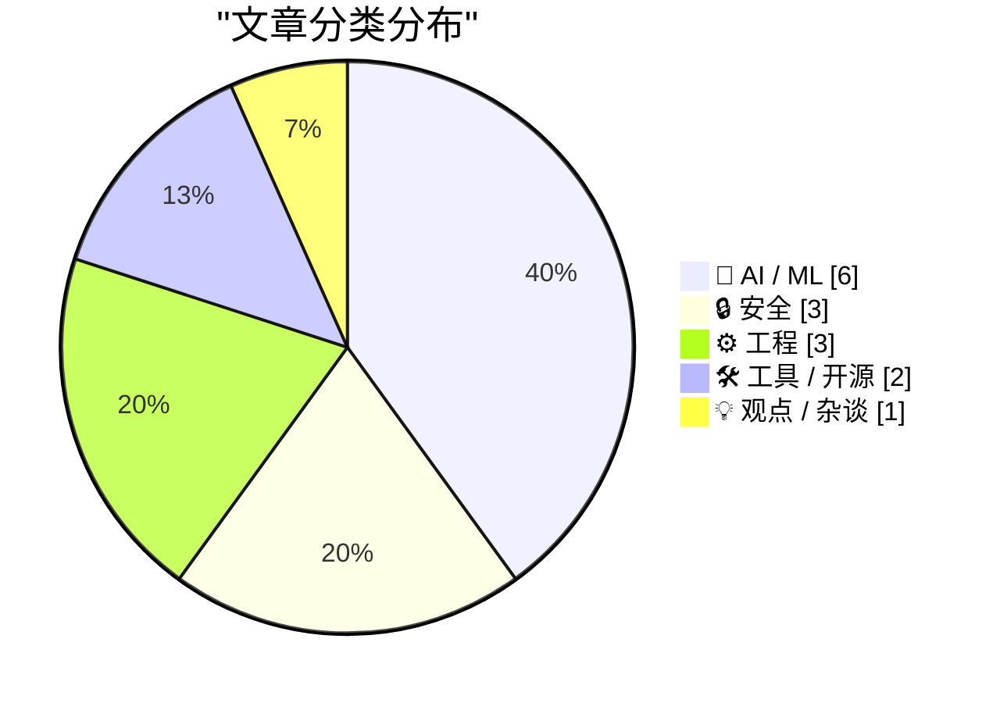
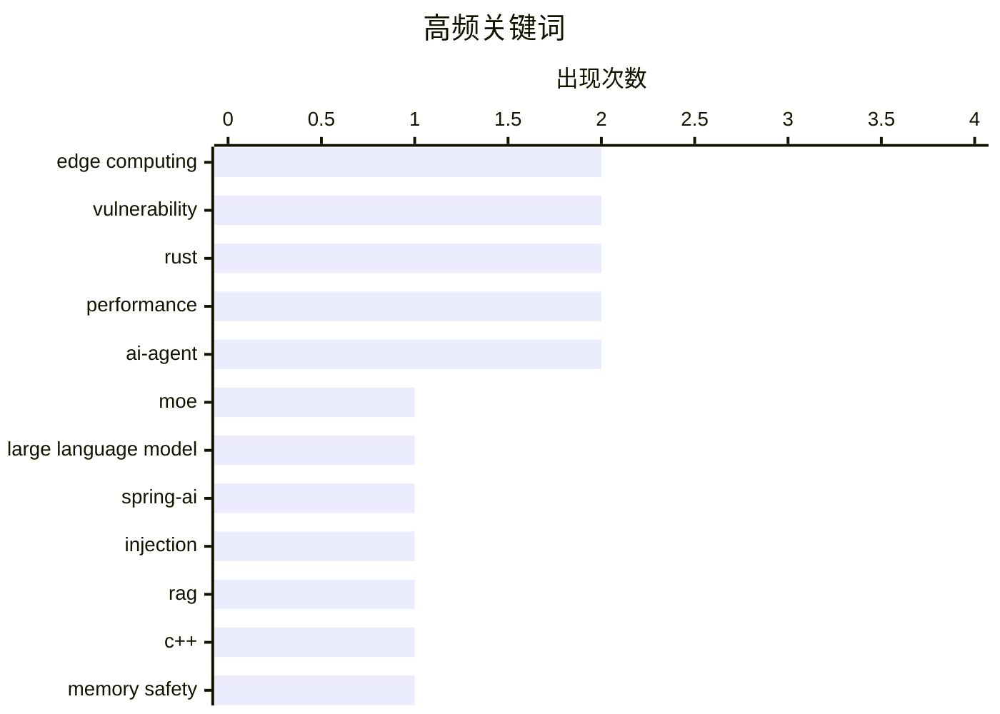

# 📰 AI 资讯每日精选 — 2026-03-23

> 汇聚 140+ 技术博客、X/Twitter、Hacker News、Reddit、Product Hunt、
> Lobste.rs、ClawFeed 日报及 GitHub Trending，经 AI 评分筛选。
>
> **本期内容**：🏆 今日必读 · 🌐 ClawFeed 日报 · 🔥 GitHub Trending · 📂 分类精选 · 🎨 设计与生成式 AI · 📊 数据概览

## 📝 今日看点

今日技术圈聚焦于AI模型部署的本地化与硬件效率革命，消费级设备运行超大模型成为可能。同时，内存安全与性能优化仍是系统工程的核心议题，Rust与C++的范式之争及底层工具链安全备受关注。此外，AI基础设施的安全漏洞与开源模型的持续演进，也提示着技术快速迭代中需兼顾安全与开放。

---

## 🏆 今日必读

🥇 **Flash-MoE：在笔记本电脑上运行3970亿参数模型**

[Flash-MoE: Running a 397B Parameter Model on a Laptop](https://github.com/danveloper/flash-moe) — Hacker News Best · 12 小时前 · 🤖 AI / ML

> Flash-MoE项目旨在解决在消费级硬件上运行超大规模混合专家模型的内存与计算瓶颈。其核心方案是通过优化的稀疏激活策略与高效的权重交换机制，将模型的活跃参数控制在可管理范围内。该技术使得在单台笔记本电脑上运行参数量高达3970亿的MoE模型成为可能，显著降低了超大模型的门槛。这为个人开发者和研究者进行大规模模型实验与微调提供了新的可行路径。

💡 **为什么值得读**: 该项目展示了如何通过工程优化突破硬件限制，让个人开发者也能触及前沿的千亿参数模型，对AI民主化具有实践意义。

🏷️ MoE, large language model, edge computing

🥈 **Spring AI向量存储过滤器注入漏洞：旧漏洞与新基础设施（JSONPath与SQL注入）**

[Spring AI vector store filter injection old bugs, new infrastructure (JSONPath + SQL injection in RAG access controls)](https://www.reddit.com/r/programming/comments/1s0soxq/spring_ai_vector_store_filter_injection_old_bugs/) — r/programming · 5 小时前 · 🔒 安全

> Spring AI的过滤器表达式转换层存在两个高危注入漏洞，威胁基于向量的检索增强生成系统的多租户访问控制安全。第一个是JSONPath注入，第二个是通过MariaDB触发的经典SQL注入，两者均可绕过用于RAG部署中数据隔离的元数据访问控制。针对SQL注入变种的公开漏洞扫描器已经存在，增加了实际风险。这些漏洞暴露了在将用户查询转换为后端查询语言时，输入验证和净化机制的缺失。

💡 **为什么值得读**: 该分析深入揭示了AI应用栈（Spring AI）中新兴但关键的安全风险，对任何部署RAG系统的开发者都是必须了解的安全课。

🏷️ Spring-AI, vulnerability, injection, RAG

🥉 **Rust vs C++：2026年的内存安全标准**

[Rust vs C++: The Memory Safety Standard in 2026](https://www.reddit.com/r/programming/comments/1s0q4rl/rust_vs_c_the_memory_safety_standard_in_2026/) — r/programming · 7 小时前 · ⚙️ 工程

> 文章核心对比了Rust和C++在内存安全范式上的根本差异与演进方向。C++提供直接的内存控制权，但将安全责任交给了开发者；而Rust通过其创新的所有权系统，在编译时提供保障，无需垃圾收集的运行时开销即可消除整类内存错误。Rust正成为推动系统编程向内存安全转变的中心语言，承诺并实现了与C++相媲美的性能。结论是，Rust的编译时安全保证使其在构建可靠、高性能系统方面更具前瞻性优势。

💡 **为什么值得读**: 清晰指出了内存安全已成为现代系统编程的核心议题，并阐明了Rust如何从语言设计层面解决这一根本挑战。

🏷️ Rust, C++, memory safety, programming languages

4️⃣ **[N] MIT 2026年流匹配与扩散模型课程**

[[N] MIT Flow Matching and Diffusion Lecture 2026](https://www.reddit.com/r/MachineLearning/comments/1s0qi41/n_mit_flow_matching_and_diffusion_lecture_2026/) — r/MachineLearning · 7 小时前 · 🤖 AI / ML

> MIT新发布的2026年课程全面涵盖了现代生成式AI（图像、视频、蛋白质生成）背后的流匹配与扩散模型技术栈。课程内容包含理论讲座、逐步推导、数学上自洽的讲义以及每个核心组件的动手编码练习。相比去年的版本，本次课程在内容深度和教学材料上均有显著改进。该课程旨在为学习者提供从理论到实践的全栈知识，是系统学习当前最主流生成模型技术的优质资源。

💡 **为什么值得读**: 由MIT权威发布，课程结构完整且注重实践，是快速、系统掌握前沿扩散模型技术的绝佳入门途径。

🏷️ diffusion models, education, MIT, generative AI

5️⃣ **本地化是AI的未来吗？**

[Is Local the Future of AI?](https://tombedor.dev/open-source-models/) — Lobste.rs · 1 小时前 · 🤖 AI / ML

> 文章探讨了AI模型部署范式从云端向本地设备转移的趋势与可能性。核心论点是，随着开源模型的性能不断提升和硬件效率的优化，在个人设备上运行高性能AI模型正变得日益可行。这种转变将带来更好的隐私保护、更低的延迟、更少的依赖和更低的运营成本。作者认为，开源模型和本地化计算的结合，可能重塑AI技术的应用和权力结构。

💡 **为什么值得读**: 提出了一个关于AI发展格局的关键性问题，并分析了技术趋势如何可能推动一场深刻的范式变革。

🏷️ AI, local inference, privacy, edge computing

---

## 🌐 ClawFeed 日报精选

> 来源：[ClawFeed](https://clawfeed.kevinhe.io) — AI 驱动的多源新闻聚合

### 🔥 今日头条

**1. 微信正式集成 OpenClaw — 14亿用户可直接在微信里跑 AI Agent**
腾讯官方发布 ClawBot 插件，iOS 微信更新至 8.0.70 即可使用，扫码即连。Reuters 报道称此举深化腾讯在 AI Agent 战场的布局。今日中文 Twitter 刷屏级事件（X Trending 3,199 posts）。社区反应极快：@wong2__ 已将官方库改造成通用 weixin-agent-sdk，@off_thetarget 正做 Claude Code + 微信连接工具。
https://x.com/Weixin_WeChat/status/2035537088314290236

**2. Jensen Huang GTC 主题演讲称 OpenClaw 为「下一个 ChatGPT」「新 Linux」**
将 OpenClaw 定位为 agentic computers 的操作系统，Nvidia 同时发布 NemoClaw 企业版。
https://economictimes.indiatimes.com/tech/technology/openclaw-is-the-next-chatgpt-nvidia-ceo-jensen-huang/articleshow/129692368.cms

**3. Tesla TERAFAB 项目发布 — Musk 宣布全球最大芯片制造工厂**
Tesla 联合 SpaceX 和 xAI 投资 $200 亿建造，选址 Austin，年产 1TW 算力，预计 2027 投产，目标 AI 芯片自给自足。

**4. Karpathy 上 No Priors 播客：12月起没手写过一行代码**
每天对着 Agent 说话 16 小时，同时开十几个并行跑，称之为「AI 精神病」；提出 AutoResearch 框架。傅盛受启发用 7 个 Agent 各司其职。
https://x.com/kloss_xyz/status/2035225568313233846

**5. OpenAI 全力构建全自动研究员 + 计划年底前员工翻倍至 8,000 人**
MIT Tech Review 深度报道，Pachocki 称 OpenAI 已具备所需大部分能力。FT 报道 OpenAI 激进扩招，AI 军备竞赛持续升温。

---

### 📰 精选 Top 10

1. **微信 ClawBot 技术拆解** — @cryptonerdcn 深度拆解 tencent-weixin/openclaw-weixin 1.0.2 包的架构，两行命令即可跑起来
   https://x.com/cryptonerdcn/status/2035685852555497771

2. **Supermemory 在 ASMR 基准上达 ~99%** — @DhravyaShah 宣布 Agent 记忆系统可能已被「解决」，462 赞 / 180K 浏览
   https://x.com/DhravyaShah/status/2035517012647272689

3. **字节跳动开源 DeerFlow 2.0** — 不是聊天机器人而是 Agent 调度中枢，发布即登 GitHub Trending 第一
   https://x.com/KKaWSB/status/2035524416088797223

4. **Browser Use CLI 2.0** — 速度翻倍成本减半，支持直接连接运行中的 Chrome（CDP 协议），5.4K likes / 7.9K bookmarks
   https://x.com/browser_use/status/2035081807209931153

5. **Cursor Composer 2 基于 Kimi K2.5 微调发布** — Moonshot AI 公开背书，引发开源生态 license 讨论
   https://x.com/Kimi_Moonshot/status/2035074972943831491

6. **Claude Code 支持定时云端任务** — 设 repo、schedule、prompt，无需本地运行，1M+ views
   https://x.com/noahzweben/status/2035122989533163971

7. **MagicSkills：npm for Agent Skills** — 北大开源，把散落的 SKILL.md 变成可安装、可组合的共享能力层
   https://x.com/axiaisacat/status/2035347878936273142

8. **OpenClaw 全自动视频工作流** — @EHuanglu 展示 OpenClaw 自动在 Seedance 2 上生成视频并导入 Premiere Pro 编辑，5.1K 赞 / 413K 浏览
   https://x.com/EHuanglu/status/2035286532857205088

9. **TradingAgents 开源** — 完整虚拟华尔街机构，4 个 AI 分析师扫财报+情绪，年化 30.5%，GitHub 3 万 Star
   https://x.com/mubeitech/status/2035250400467497096

10. **Dovey Wan 看好「Super Solo」形态** — 一人公司需要：魅力(human fluent) × 智力(AI fluent) × 执行力，点名 OpenClaw 创始人 Peter 为代表
    https://x.com/DoveyWanCN/status/2035569842682843221

---

### 📊 今日观察

**微信 × OpenClaw 是今天的绝对主线。** 腾讯官方将 ClawBot 插件内置到微信 8.0.70，这意味着 AI Agent 从极客玩具正式进入 14 亿人的日常通讯工具。社区反应速度惊人——官方发布几小时内就出现了通用 SDK、第三方客户端（Nexu）、Claude Code 连接器等衍生项目。这是 Agent 生态「从 Discord 到微信」的标志性拐点。

同时，Jensen Huang 在 GTC 上给 OpenClaw 冠名「下一个 ChatGPT」和「新 Linux」，加上 Nvidia 发布 NemoClaw 企业版，说明大厂已经把 agentic computing 视为下一个平台级机会。

技术层面两个值得注意的信号：Supermemory 在记忆基准上逼近 99%（Agent 长期记忆瓶颈可能被突破），以及 Karpathy 公开表示已完全不写代码、全靠多 Agent 并行——这不是实验室 demo，而是顶级工程师的实际工作方式转变。

一句话总结：**Agent 生态正在从「能用」快速进入「日用」阶段，微信接入是里程碑事件。**

---

*数据来源：6 期 ClawFeed 4h 简报（00:41 / 04:41 / 08:42 / 12:41 / 16:41 / 20:41 SGT），汇总去重整理*

---

## 🔥 GitHub Trending

> 今日热门开源项目（全语言 + Python）

| # | 项目 | 描述 | ⭐ 总星 | 📈 今日 | 语言 |
|---|------|------|---------|---------|------|
| 1 | [affaan-m/everything-claude-code](https://github.com/affaan-m/everything-claude-code) 🤖 | The agent harness performance optimization system. Skills... | 97.9k | +3735 | JavaScript |
| 2 | [Crosstalk-Solutions/project-nomad](https://github.com/Crosstalk-Solutions/project-nomad) 🤖 | Project N.O.M.A.D, is a self-contained, offline survival ... | 9.9k | +2294 | TypeScript |
| 3 | [FujiwaraChoki/MoneyPrinterV2](https://github.com/FujiwaraChoki/MoneyPrinterV2) | Automate the process of making money online. | 19.7k | +1772 | Python |
| 4 | [bytedance/deer-flow](https://github.com/bytedance/deer-flow) | An open-source SuperAgent harness that researches, codes,... | 35.2k | +1508 | Python |
| 5 | [TauricResearch/TradingAgents](https://github.com/TauricResearch/TradingAgents) 🤖 | TradingAgents: Multi-Agents LLM Financial Trading Framework | 37.1k | +1108 | Python |
| 6 | [vxcontrol/pentagi](https://github.com/vxcontrol/pentagi) 🤖 | Fully autonomous AI Agents system capable of performing c... | 11.9k | +1015 | Go |
| 7 | [jarrodwatts/claude-hud](https://github.com/jarrodwatts/claude-hud) 🤖 | A Claude Code plugin that shows what's happening - contex... | 11.1k | +832 | JavaScript |
| 8 | [louis-e/arnis](https://github.com/louis-e/arnis) | Generate any location from the real world in Minecraft wi... | 12.7k | +583 | Rust |
| 9 | [browser-use/browser-use](https://github.com/browser-use/browser-use) 🤖 | 🌐 Make websites accessible for AI agents. Automate tasks... | 82.5k | +405 | Python |
| 10 | [systemd/systemd](https://github.com/systemd/systemd) | The systemd System and Service Manager | 16.0k | +313 | C |
| 11 | [aquasecurity/trivy](https://github.com/aquasecurity/trivy) | Find vulnerabilities, misconfigurations, secrets, SBOM in... | 33.6k | +249 | Go |
| 12 | [jamwithai/production-agentic-rag-course](https://github.com/jamwithai/production-agentic-rag-course) 🤖 |  | 4.7k | +235 | Python |
| 13 | [teng-lin/notebooklm-py](https://github.com/teng-lin/notebooklm-py) 🤖 | Unofficial Python API and agentic skill for Google Notebo... | 7.0k | +230 | Python |
| 14 | [hsliuping/TradingAgents-CN](https://github.com/hsliuping/TradingAgents-CN) 🤖 | 基于多智能体LLM的中文金融交易框架 - TradingAgents中文增强版 | 19.7k | +215 | Python |
| 15 | [HKUDS/LightRAG](https://github.com/HKUDS/LightRAG) | [EMNLP2025] "LightRAG: Simple and Fast Retrieval-Augmente... | 30.0k | +203 | Python |

---

## 🤖 AI / ML

### 1. Flash-MoE：在笔记本电脑上运行3970亿参数模型

[Flash-MoE: Running a 397B Parameter Model on a Laptop](https://github.com/danveloper/flash-moe) — **Hacker News Best** · 12 小时前 · ⭐ 27/30

> Flash-MoE项目旨在解决在消费级硬件上运行超大规模混合专家模型的内存与计算瓶颈。其核心方案是通过优化的稀疏激活策略与高效的权重交换机制，将模型的活跃参数控制在可管理范围内。该技术使得在单台笔记本电脑上运行参数量高达3970亿的MoE模型成为可能，显著降低了超大模型的门槛。这为个人开发者和研究者进行大规模模型实验与微调提供了新的可行路径。

🏷️ MoE, large language model, edge computing

---

### 2. [N] MIT 2026年流匹配与扩散模型课程

[[N] MIT Flow Matching and Diffusion Lecture 2026](https://www.reddit.com/r/MachineLearning/comments/1s0qi41/n_mit_flow_matching_and_diffusion_lecture_2026/) — **r/MachineLearning** · 7 小时前 · ⭐ 26/30

> MIT新发布的2026年课程全面涵盖了现代生成式AI（图像、视频、蛋白质生成）背后的流匹配与扩散模型技术栈。课程内容包含理论讲座、逐步推导、数学上自洽的讲义以及每个核心组件的动手编码练习。相比去年的版本，本次课程在内容深度和教学材料上均有显著改进。该课程旨在为学习者提供从理论到实践的全栈知识，是系统学习当前最主流生成模型技术的优质资源。

🏷️ diffusion models, education, MIT, generative AI

---

### 3. 本地化是AI的未来吗？

[Is Local the Future of AI?](https://tombedor.dev/open-source-models/) — **Lobste.rs** · 1 小时前 · ⭐ 26/30

> 文章探讨了AI模型部署范式从云端向本地设备转移的趋势与可能性。核心论点是，随着开源模型的性能不断提升和硬件效率的优化，在个人设备上运行高性能AI模型正变得日益可行。这种转变将带来更好的隐私保护、更低的延迟、更少的依赖和更低的运营成本。作者认为，开源模型和本地化计算的结合，可能重塑AI技术的应用和权力结构。

🏷️ AI, local inference, privacy, edge computing

---

### 4. “正在开源新的Qwen和Wan模型。”

["open-sourcing new Qwen and Wan models."](https://www.reddit.com/r/StableDiffusion/comments/1s0ic9l/opensourcing_new_qwen_and_wan_models/) — **r/StableDiffusion** · 13 小时前 · ⭐ 25/30

> 社区讨论聚焦于通义千问（Qwen）和Wan系列模型可能即将开源新版本（如Wan2.5/2.6）的传闻。开源这些先进的AI模型将显著降低研究者和开发者获取、使用最前沿技术的门槛。如果成真，这将进一步推动开源AI生态的繁荣，并可能引发新一轮基于这些强大基座模型的应用创新和微调竞赛。

🏷️ Open Source, Qwen, Wan, Model Release

---

### 5. LangChain新课程：构建可靠的智能体

[💫 New LangChain Academy Course: Building Reliable Agents 💫 Shipping agents to production is hard. Traditional software is deterministic – when ...](https://x.com/LangChain/status/2035757438247334087) — **𝕏 @LangChain** · 7 小时前 · ⭐ 25/30

> 新推出的LangChain Academy课程专注于解决将基于大语言的智能体投入生产环境所面临的独特挑战。核心难点在于智能体依赖非确定性的大模型，并涉及多步推理、工具调用和真实用户流量，其复杂性和调试难度远超传统确定性软件。课程旨在教授一套系统的方法论，指导开发者将一个智能体从初次运行可靠地推进到生产部署阶段。目标是帮助开发者构建在面对不确定性和复杂交互时仍能保持鲁棒性的智能体系统。

🏷️ AI-agent, production, reliability, course

---

### 6. 如何使用 NVIDIA AI-Q 和 LangChain Deep Agents 构建企业级深度搜索智能体

[How to Build Deep Agents for Enterprise Search with NVIDIA AI-Q and LangChain Deep Agents: We recently introduced an enterprise agent platform built w...](https://x.com/LangChain/status/2035508759896707172) — **𝕏 @LangChain** · 23 小时前 · ⭐ 25/30

> 文章介绍了如何构建用于企业搜索的深度智能体平台。该平台结合了 NVIDIA AI-Q 蓝图与 LangChain Deep Agents，旨在支持可扩展、生产就绪的智能体开发。具体方案包括配置使用 Nemotron 和前沿大语言模型的浅层与深度研究智能体，并提供了监控智能体轨迹和性能的方法。最终目标是实现一个高效、可监控的企业级搜索解决方案。

🏷️ enterprise-search, NVIDIA, AI-agent, tutorial

---

## 🔒 安全

### 7. Spring AI向量存储过滤器注入漏洞：旧漏洞与新基础设施（JSONPath与SQL注入）

[Spring AI vector store filter injection old bugs, new infrastructure (JSONPath + SQL injection in RAG access controls)](https://www.reddit.com/r/programming/comments/1s0soxq/spring_ai_vector_store_filter_injection_old_bugs/) — **r/programming** · 5 小时前 · ⭐ 26/30

> Spring AI的过滤器表达式转换层存在两个高危注入漏洞，威胁基于向量的检索增强生成系统的多租户访问控制安全。第一个是JSONPath注入，第二个是通过MariaDB触发的经典SQL注入，两者均可绕过用于RAG部署中数据隔离的元数据访问控制。针对SQL注入变种的公开漏洞扫描器已经存在，增加了实际风险。这些漏洞暴露了在将用户查询转换为后端查询语言时，输入验证和净化机制的缺失。

🏷️ Spring-AI, vulnerability, injection, RAG

---

### 8. Cargo的安全公告

[Security advisory for Cargo](https://blog.rust-lang.org/2026/03/21/cve-2026-33056/) — **Lobste.rs** · 16 小时前 · ⭐ 25/30

> Rust官方博客发布了针对其包管理器Cargo的一个安全公告，对应CVE编号为CVE-2026-33056。安全公告意味着在Cargo工具链中发现了一个已被确认的安全漏洞，可能影响依赖它的Rust项目。通常此类公告会包含漏洞描述、影响范围和修复版本信息，建议用户尽快升级到已修复的Cargo版本。

🏷️ Rust, Cargo, security, vulnerability

---

### 9. Cloudflare 将 archive.today 标记为“C&C/僵尸网络”；1.1.1.2 解析服务已停止

[Cloudflare flags archive.today as "C&C/Botnet"; no longer resolves via 1.1.1.2](https://radar.cloudflare.com/domains/domain/archive.today) — **Hacker News Best** · 20 小时前 · ⭐ 24/30

> Cloudflare 的公共DNS解析服务 1.1.1.2 将知名网页存档网站 archive.today 的域名标记为“命令与控制服务器/僵尸网络”并停止解析。这一事件在Hacker News上引发高度关注，获得350点热度并产生256条评论，讨论焦点集中于该判定是否合理及其对互联网存档的影响。此事凸显了中心化基础设施服务商对网站可访问性的巨大权力。

🏷️ Cloudflare, DNS, web archiving, blocklist

---

## ⚙️ 工程

### 10. Rust vs C++：2026年的内存安全标准

[Rust vs C++: The Memory Safety Standard in 2026](https://www.reddit.com/r/programming/comments/1s0q4rl/rust_vs_c_the_memory_safety_standard_in_2026/) — **r/programming** · 7 小时前 · ⭐ 26/30

> 文章核心对比了Rust和C++在内存安全范式上的根本差异与演进方向。C++提供直接的内存控制权，但将安全责任交给了开发者；而Rust通过其创新的所有权系统，在编译时提供保障，无需垃圾收集的运行时开销即可消除整类内存错误。Rust正成为推动系统编程向内存安全转变的中心语言，承诺并实现了与C++相媲美的性能。结论是，Rust的编译时安全保证使其在构建可靠、高性能系统方面更具前瞻性优势。

🏷️ Rust, C++, memory safety, programming languages

---

### 11. 来看看保罗·艾伦的SIMD CSV解析器

[Let's see Paul Allen's SIMD CSV parser](https://www.reddit.com/r/programming/comments/1s0rldb/lets_see_paul_allens_simd_csv_parser/) — **r/programming** · 6 小时前 · ⭐ 25/30

> 文章介绍了一个高性能CSV解析器的实现，其核心优化在于充分利用现代CPU的单指令多数据流（SIMD）指令集。通过并行处理多个字符和智能的状态机设计，该解析器能够极大地加速CSV文件的读取与字段分割过程。与传统的逐字符解析方法相比，SIMD方案能带来数量级级别的性能提升。这展示了在看似简单的数据解析任务中，底层硬件优化所能带来的巨大潜力。

🏷️ SIMD, CSV, performance, parsing

---

### 12. JavaScript 代码膨胀的三大支柱

[The three pillars of JavaScript bloat](https://43081j.com/2026/03/three-pillars-of-javascript-bloat) — **Hacker News Best** · 21 小时前 · ⭐ 24/30

> 文章系统分析了导致现代Web应用中JavaScript代码体积过大的三个核心原因。作者没有使用“本文讨论了”这类开场，而是直接指出过度依赖框架、不必要的polyfill/转译以及低效的依赖管理是主要症结。通过具体的技术场景对比，文章揭示了这些做法如何共同导致页面性能下降。结论是开发者需要有意识地抵制这些导致膨胀的常见模式。

🏷️ JavaScript, web performance, bloat

---

## 🛠 工具 / 开源

### 13. lshaz：用于发现微架构延迟风险的静态分析工具

[lshaz: a static analysis tool for finding microarchitectural latency hazards](https://www.reddit.com/r/programming/comments/1s0o597/lshaz_a_static_analysis_tool_for_finding/) — **r/programming** · 8 小时前 · ⭐ 25/30

> lshaz是一个专注于识别代码中微架构层面性能瓶颈的静态分析工具。它通过分析程序的控制流和数据流，来检测可能导致CPU流水线停顿、缓存失效等延迟问题的代码模式（即“延迟风险”）。该工具能够帮助开发者在编写代码时，就提前规避那些影响现代CPU乱序执行和推测执行效率的潜在陷阱。使用lshaz可以提升对程序底层执行行为的理解，并编写出对CPU更友好的高性能代码。

🏷️ static-analysis, microarchitecture, performance, hazards

---

### 14. Project Nomad – 永不离线知识库

[Project Nomad – Knowledge That Never Goes Offline](https://www.projectnomad.us) — **Hacker News Best** · 11 小时前 · ⭐ 24/30

> Project Nomad 是一个旨在创建永久可访问、永不离线知识库的项目。它解决了网络内容可能消失或无法访问的问题，确保关键信息的长久保存。该项目在Hacker News上获得了336点热度，引发了87条评论，显示出社区对数字知识保存方案的强烈兴趣。其核心价值在于对抗数字内容的脆弱性。

🏷️ offline, knowledge base, personal archive

---

## 💡 观点 / 杂谈

### 15. 陶哲轩：AI将创意生成成本降至近零，但瓶颈转移至验证环节

[Terence Tao says AI drives idea generation cost to near zero but shifts the bottleneck to verification](https://the-decoder.com/terence-tao-says-ai-drives-idea-generation-cost-to-near-zero-but-shifts-the-bottleneck-to-verification/) — **The Decoder** · 14 小时前 · ⭐ 24/30

> 陶哲轩分析了AI对数学及其他领域工作模式的根本性改变。他指出，AI已将想法（创意）的生成成本降至几乎为零，但新的瓶颈在于对这些海量想法进行验证和筛选。他将此比作汽车对城市的影响，强调新技术需要新的基础设施来支撑，否则只会堵塞旧有体系。这一观点揭示了AI时代生产力提升背后的关键挑战。

🏷️ AI impact, idea generation, verification, Terence Tao

---

## 🎨 Design & Generative AI

### 🖼️ 生成式图片

- **[FeatherOps：在RDNA3上实现非原生fp8的快速矩阵乘法](https://www.reddit.com/r/StableDiffusion/comments/1s09otw/featherops_fast_fp8_matmul_on_rdna3_without/)** — r/StableDiffusion · 21 小时前
  > 介绍一种在无原生fp8支持的RDNA3 GPU上，通过fp8加速Stable Diffusion等AI图像生成中矩阵运算的方法。

- **[ID-LoRA与LTX-2.3在ComfyUI中的集成](https://www.reddit.com/r/StableDiffusion/comments/1s0dk2b/idlora_with_ltx23_and_comfyui_custom_node/)** — r/StableDiffusion · 18 小时前
  > 探讨如何将ID-LoRA（身份驱动上下文LoRA）与LTX-2.3模型结合，通过ComfyUI自定义节点进行身份保持的图像生成。

- **[使用Flux 2 Klein 9B与顶级LoRA进行高级换脸](https://www.reddit.com/r/StableDiffusion/comments/1s0czcc/advanced_face_swap_with_flux_2_klein_9b_the_best/)** — r/StableDiffusion · 18 小时前
  > 展示如何利用Flux 2 Klein 9B模型和优质换脸LoRA，在Stable Diffusion中实现高质量的人脸替换。

- **[Chroma LoRA训练：Base与HD版本哪个更保真？](https://www.reddit.com/r/StableDiffusion/comments/1s0yt3y/chroma_lora_training_which_repo_is_better_for/)** — r/StableDiffusion · 1 小时前
  > 讨论在追求最佳人物相似度时，应选择Chroma1-Base还是Chroma1-HD进行LoRA训练。

- **[Olm SplineMask：ComfyUI的矢量式精准遮罩工具](https://www.reddit.com/r/comfyui/comments/1s0japz/olm_splinemask_precision_masking_for_comfyui/)** — r/comfyui · 12 小时前
  > 介绍一款用于ComfyUI的、可创建矢量风格且可复用遮罩的精确遮罩节点。

- **[Midjourney V8 Alpha测试：高清与q4采样样张](https://www.reddit.com/r/midjourney/comments/1s06xgc/v8_alpha_hd_q4_samples/)** — r/midjourney · 23 小时前
  > 分享对Midjourney V8 Alpha版本进行测试，生成的高清及q4采样图像结果。

- **[SDXL真人LoRA训练难题：面部不似与纹身失真](https://www.reddit.com/r/StableDiffusion/comments/1s0vpki/sdxl_lora_trained_on_real_person_face_not_similar/)** — r/StableDiffusion · 4 小时前
  > 分享使用94张照片训练真人SDXL LoRA时，遇到面部相似度低和纹身渲染不正确的问题。

- **[ComfyUI最新版本：修复少，破坏性Bug多](https://www.reddit.com/r/comfyui/comments/1s095z3/latest_versions_of_comfy_add_more_breaking_bugs/)** — r/comfyui · 22 小时前
  > 抱怨ComfyUI最新版本更新引入了比修复更多的破坏性Bug，如图像/遮罩节点预览失效等。

- **[戏剧性暗光LoRA：为Klein 9b打造电影感](https://www.reddit.com/r/StableDiffusion/comments/1s0g37k/dramatic_dark_lighting_lora_klein_9b/)** — r/StableDiffusion · 15 小时前
  > 介绍一款专为Klein 9b模型设计的LoRA，用于生成具有电影感戏剧性暗光效果的图像。

- **[ComfyUI新手困惑：哪个节点能保存SDXL LoRA？](https://www.reddit.com/r/StableDiffusion/comments/1s0ys3g/so_trying_to_create_a_sdxl_lora_with_comfyui_what/)** — r/StableDiffusion · 1 小时前
  > 新手在ComfyUI中使用Train LoRA节点后，困惑于哪个节点能正确保存生成的SDXL LoRA文件。

- **[最新版ComfyUI LTX 2.3中如何修改生成步数？](https://www.reddit.com/r/StableDiffusion/comments/1s0rbn4/how_to_change_steps_in_latest_comfyui_ltx_23/)** — r/StableDiffusion · 6 小时前
  > 询问在更新到最新版ComfyUI LTX 2.3后，找不到修改默认生成步数（从8步改回20步）的设置位置。

- **[ComfyUI新手：如何创建并保持跨图像/视频的角色一致性？](https://www.reddit.com/r/comfyui/comments/1s0gpey/new_to_comfyui_how_do_i_create_a_character_and/)** — r/comfyui · 15 小时前
  > ComfyUI新用户寻求创建角色并使其在不同图像和视频中保持外观一致的方法。

- **[寻找ComfyUI最佳NSFW图像编辑模型](https://www.reddit.com/r/comfyui/comments/1s0e22a/what_is_the_best_nsfw_image_editing_model_for/)** — r/comfyui · 17 小时前
  > 寻求适用于ComfyUI的、具备NSFW功能的最佳无限制图像编辑模型（类似Nano Banana的替代品）。

### 🎬 生成式视频

- **[首次尝试：使用AIToolkit Wan 2.2 I2V训练人体运动LoRA](https://www.reddit.com/r/StableDiffusion/comments/1s0w9pj/my_first_human_motion_lora_training_with/)** — r/StableDiffusion · 3 小时前
  > 分享使用5段真实视频剪辑，在AIToolkit Wan 2.2图像到视频模型上训练人体运动LoRA的首次经验。

- **[壮丽景观：使用Wan 2.2文生视频工作流创作](https://www.reddit.com/r/StableDiffusion/comments/1s0v291/gorgeous_landscapes_wan_22_t2v/)** — r/StableDiffusion · 4 小时前
  > 展示通过ComfyUI的标准Wan 2.2文本到视频工作流生成的华丽风景视频。

---

## 📊 数据概览

| 扫描源 | 抓取文章 | 时间范围 | 精选 |
|:---:|:---:|:---:|:---:|
| 119/140 | 5236 篇 → 181 篇 | 24h | **15 篇** |

### 分类分布



### 高频关键词



<details>
<summary>📈 纯文本关键词图（终端友好）</summary>

```
edge computing       │ ████████████████████ 2
vulnerability        │ ████████████████████ 2
rust                 │ ████████████████████ 2
performance          │ ████████████████████ 2
ai-agent             │ ████████████████████ 2
moe                  │ ██████████░░░░░░░░░░ 1
large language model │ ██████████░░░░░░░░░░ 1
spring-ai            │ ██████████░░░░░░░░░░ 1
injection            │ ██████████░░░░░░░░░░ 1
rag                  │ ██████████░░░░░░░░░░ 1
```

</details>

### 🏷️ 话题标签

**edge computing**(2) · **vulnerability**(2) · **rust**(2) · performance(2) · ai-agent(2) · moe(1) · large language model(1) · spring-ai(1) · injection(1) · rag(1) · c++(1) · memory safety(1) · programming languages(1) · diffusion models(1) · education(1) · mit(1) · generative ai(1) · ai(1) · local inference(1) · privacy(1)

---

*生成于 2026-03-23 00:03 | 汇聚 140 个技术博客、X/Twitter、Hacker News、Reddit、Product Hunt、Lobste.rs、ClawFeed 日报及 GitHub Trending，经 AI 评分筛选出 Top 15 精华内容*
