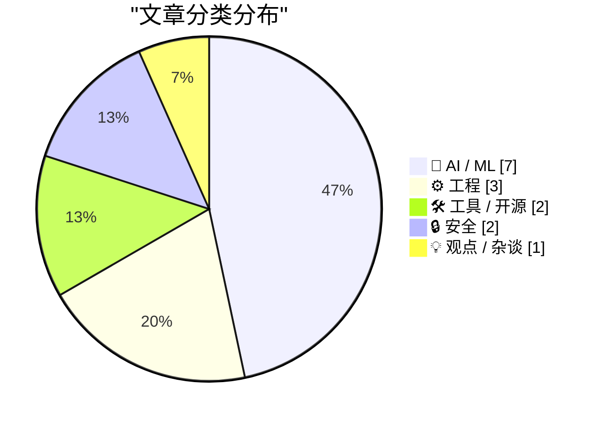
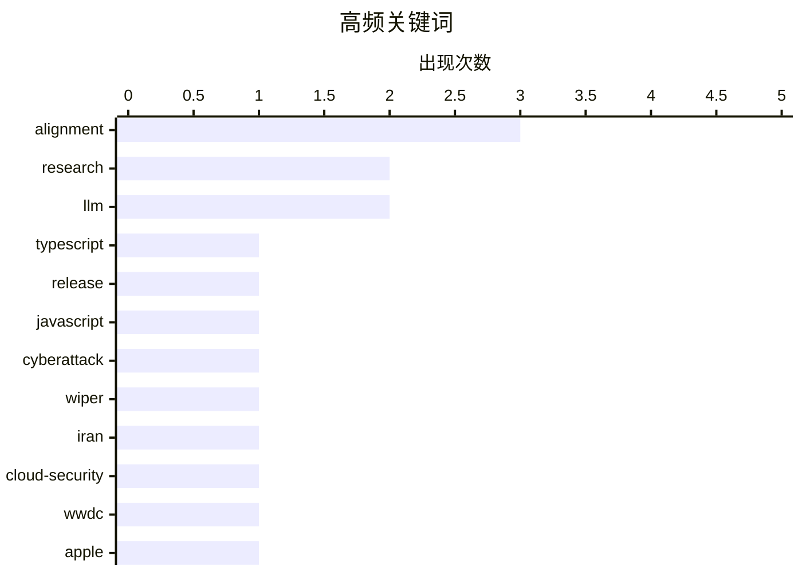

# 📰 AI 资讯每日精选 — 2026-03-24

> 汇聚 140+ 技术博客、X/Twitter、Hacker News、Reddit、Product Hunt、
> Lobste.rs、ClawFeed 日报及 GitHub Trending，经 AI 评分筛选。
>
> **本期内容**：🏆 今日必读 · 🌐 ClawFeed 日报 · 🔥 GitHub Trending · 📂 分类精选 · 🎨 设计与生成式 AI · 📊 数据概览

## 📝 今日看点

今日技术圈聚焦于AI能力的边界拓展与安全架构升级。大模型正加速向边缘设备渗透，手机本地运行千亿参数模型成为现实，同时其软件工程能力被持续量化评估。另一方面，随着AI进入生产核心，零信任安全架构和云原生推理部署成为保障其可靠运行的关键。此外，地缘冲突背景下的针对性网络攻击，凸显了基础设施安全的新挑战。

---

## 🏆 今日必读

🥇 **TypeScript 6.0 正式发布**

[Announcing TypeScript 6.0](https://www.reddit.com/r/programming/comments/1s1luym/announcing_typescript_60/) — r/programming · 7 小时前 · 🛠 工具 / 开源

> 微软正式发布了 TypeScript 6.0 版本。新版本引入了对 ECMAScript 装饰器标准的稳定支持，并新增了 `--isolatedDeclarations` 编译器标志以加速类型检查。此外，还改进了控制流分析，并优化了 `Promise` 和条件类型的推断。TypeScript 6.0 旨在提升开发体验、性能，并更好地与现代 JavaScript 标准对齐。

💡 **为什么值得读**: 了解 TypeScript 最新版本的核心特性与改进，对于使用或评估 TypeScript 的开发者至关重要。

🏷️ TypeScript, release, JavaScript

🥈 **‘CanisterWorm’蠕虫对伊朗发起数据擦除攻击**

[‘CanisterWorm’ Springs Wiper Attack Targeting Iran](https://krebsonsecurity.com/2026/03/canisterworm-springs-wiper-attack-targeting-iran/) — krebsonsecurity.com · 8 小时前 · 🔒 安全

> 一个以财务勒索为目的的黑客组织正试图介入伊朗冲突，发动了名为‘CanisterWorm’的蠕虫攻击。该蠕虫通过安全防护薄弱的云服务传播，并会擦除受感染系统中使用伊朗时区或将波斯语设为默认语言的数据。攻击结合了数据窃取、勒索和破坏性擦除，具有明确的针对性。这表明地缘政治冲突正催生出更复杂、更具破坏性的网络攻击手段。

💡 **为什么值得读**: 此事件揭示了地缘政治如何驱动新型混合网络威胁，对云安全和威胁情报领域具有重要警示意义。

🏷️ cyberattack, wiper, Iran, cloud-security

🥉 **苹果全球开发者大会（WWDC 2026）将于6月8日至12日举行**

[WWDC 2026: June 8–12](https://www.apple.com/newsroom/2026/03/apples-worldwide-developers-conference-returns-the-week-of-june-8/) — daringfireball.net · 5 小时前 · ⚙️ 工程

> 苹果公司宣布 WWDC 2026 将于 6 月 8 日至 12 日以线上形式举行。大会首日将进行主题演讲和平台国情咨文发布。整个会议周期将提供超过 100 个视频会议、互动小组实验室和预约咨询，开发者可通过这些渠道直接与苹果工程师和设计师交流。会议内容将通过苹果开发者应用、网站、YouTube 频道以及中国的 Bilibili 频道发布。

💡 **为什么值得读**: 这是了解苹果未来一年在 iOS、macOS 等平台最新技术与生态战略的年度最重要窗口。

🏷️ WWDC, Apple, developer-conference

4️⃣ **软件开发者招聘岗位自2025年中以来增长15%**

[Software dev job postings are up 15% since mid 2025](https://www.reddit.com/r/programming/comments/1s1e4il/software_dev_job_postings_are_up_15_since_mid_2025/) — r/programming · 12 小时前 · 💡 观点 / 杂谈

> 根据 Indeed 平台数据，软件开发职位发布量在 2025 年 5 月触底后，已连续增长 10 个月，目前较最低点高出约 15%。从 2026 年 1 月开始，增长势头尤为显著。这一趋势直接反驳了过去两年流行的‘AI正在消灭开发者岗位’的论调。数据表明，AI 可能正在创造新的开发需求，而非取代现有岗位。

💡 **为什么值得读**: 用实际就业市场数据挑战流行叙事，为开发者职业规划和行业判断提供了关键参考。

🏷️ job market, hiring, trends

5️⃣ **SWE-rebench 排行榜（2026年2月）：GPT-5.4、Qwen3.5、Gemini 3.1 Pro、Step-3.5-Flash 等模型表现**

[SWE-rebench Leaderboard (Feb 2026): GPT-5.4, Qwen3.5, Gemini 3.1 Pro, Step-3.5-Flash and More](https://www.reddit.com/r/LocalLLaMA/comments/1s1h4fo/swerebench_leaderboard_feb_2026_gpt54_qwen35/) — r/LocalLLaMA · 10 小时前 · 🤖 AI / ML

> 2026年2月的 SWE-rebench 排行榜评估了多个大语言模型在软件工程任务上的性能。参与评测的模型包括 GPT-5.4、Qwen3.5、Gemini 3.1 Pro 和 Step-3.5-Flash 等。该排行榜专注于代码生成、调试和解释等实际编程能力。结果为开发者选择适合编程辅助的 AI 工具提供了最新的性能基准参考。

💡 **为什么值得读**: 通过专注于软件工程任务的基准测试，帮助开发者直观比较不同主流 AI 编码助手的实际能力。

🏷️ benchmark, code-generation, leaderboard

---

## 🌐 ClawFeed 日报精选

> 来源：[ClawFeed](https://clawfeed.kevinhe.io) — AI 驱动的多源新闻聚合

### 🔥 今日头条

**1. 微信正式集成 OpenClaw — 14亿用户可直接在微信里跑 AI Agent**
腾讯官方发布 ClawBot 插件，iOS 微信更新至 8.0.70 即可使用，扫码即连。Reuters 报道称此举深化腾讯在 AI Agent 战场的布局。今日中文 Twitter 刷屏级事件（X Trending 3,199 posts）。社区反应极快：@wong2__ 已将官方库改造成通用 weixin-agent-sdk，@off_thetarget 正做 Claude Code + 微信连接工具。
https://x.com/Weixin_WeChat/status/2035537088314290236

**2. Jensen Huang GTC 主题演讲称 OpenClaw 为「下一个 ChatGPT」「新 Linux」**
将 OpenClaw 定位为 agentic computers 的操作系统，Nvidia 同时发布 NemoClaw 企业版。
https://economictimes.indiatimes.com/tech/technology/openclaw-is-the-next-chatgpt-nvidia-ceo-jensen-huang/articleshow/129692368.cms

**3. Tesla TERAFAB 项目发布 — Musk 宣布全球最大芯片制造工厂**
Tesla 联合 SpaceX 和 xAI 投资 $200 亿建造，选址 Austin，年产 1TW 算力，预计 2027 投产，目标 AI 芯片自给自足。

**4. Karpathy 上 No Priors 播客：12月起没手写过一行代码**
每天对着 Agent 说话 16 小时，同时开十几个并行跑，称之为「AI 精神病」；提出 AutoResearch 框架。傅盛受启发用 7 个 Agent 各司其职。
https://x.com/kloss_xyz/status/2035225568313233846

**5. OpenAI 全力构建全自动研究员 + 计划年底前员工翻倍至 8,000 人**
MIT Tech Review 深度报道，Pachocki 称 OpenAI 已具备所需大部分能力。FT 报道 OpenAI 激进扩招，AI 军备竞赛持续升温。

---

### 📰 精选 Top 10

1. **微信 ClawBot 技术拆解** — @cryptonerdcn 深度拆解 tencent-weixin/openclaw-weixin 1.0.2 包的架构，两行命令即可跑起来
   https://x.com/cryptonerdcn/status/2035685852555497771

2. **Supermemory 在 ASMR 基准上达 ~99%** — @DhravyaShah 宣布 Agent 记忆系统可能已被「解决」，462 赞 / 180K 浏览
   https://x.com/DhravyaShah/status/2035517012647272689

3. **字节跳动开源 DeerFlow 2.0** — 不是聊天机器人而是 Agent 调度中枢，发布即登 GitHub Trending 第一
   https://x.com/KKaWSB/status/2035524416088797223

4. **Browser Use CLI 2.0** — 速度翻倍成本减半，支持直接连接运行中的 Chrome（CDP 协议），5.4K likes / 7.9K bookmarks
   https://x.com/browser_use/status/2035081807209931153

5. **Cursor Composer 2 基于 Kimi K2.5 微调发布** — Moonshot AI 公开背书，引发开源生态 license 讨论
   https://x.com/Kimi_Moonshot/status/2035074972943831491

6. **Claude Code 支持定时云端任务** — 设 repo、schedule、prompt，无需本地运行，1M+ views
   https://x.com/noahzweben/status/2035122989533163971

7. **MagicSkills：npm for Agent Skills** — 北大开源，把散落的 SKILL.md 变成可安装、可组合的共享能力层
   https://x.com/axiaisacat/status/2035347878936273142

8. **OpenClaw 全自动视频工作流** — @EHuanglu 展示 OpenClaw 自动在 Seedance 2 上生成视频并导入 Premiere Pro 编辑，5.1K 赞 / 413K 浏览
   https://x.com/EHuanglu/status/2035286532857205088

9. **TradingAgents 开源** — 完整虚拟华尔街机构，4 个 AI 分析师扫财报+情绪，年化 30.5%，GitHub 3 万 Star
   https://x.com/mubeitech/status/2035250400467497096

10. **Dovey Wan 看好「Super Solo」形态** — 一人公司需要：魅力(human fluent) × 智力(AI fluent) × 执行力，点名 OpenClaw 创始人 Peter 为代表
    https://x.com/DoveyWanCN/status/2035569842682843221

---

### 📊 今日观察

**微信 × OpenClaw 是今天的绝对主线。** 腾讯官方将 ClawBot 插件内置到微信 8.0.70，这意味着 AI Agent 从极客玩具正式进入 14 亿人的日常通讯工具。社区反应速度惊人——官方发布几小时内就出现了通用 SDK、第三方客户端（Nexu）、Claude Code 连接器等衍生项目。这是 Agent 生态「从 Discord 到微信」的标志性拐点。

同时，Jensen Huang 在 GTC 上给 OpenClaw 冠名「下一个 ChatGPT」和「新 Linux」，加上 Nvidia 发布 NemoClaw 企业版，说明大厂已经把 agentic computing 视为下一个平台级机会。

技术层面两个值得注意的信号：Supermemory 在记忆基准上逼近 99%（Agent 长期记忆瓶颈可能被突破），以及 Karpathy 公开表示已完全不写代码、全靠多 Agent 并行——这不是实验室 demo，而是顶级工程师的实际工作方式转变。

一句话总结：**Agent 生态正在从「能用」快速进入「日用」阶段，微信接入是里程碑事件。**

---

*数据来源：6 期 ClawFeed 4h 简报（00:41 / 04:41 / 08:42 / 12:41 / 16:41 / 20:41 SGT），汇总去重整理*

---

## 🔥 GitHub Trending

> 今日热门开源项目（全语言 + Python）

| # | 项目 | 描述 | ⭐ 总星 | 📈 今日 | 语言 |
|---|------|------|---------|---------|------|
| 1 | [affaan-m/everything-claude-code](https://github.com/affaan-m/everything-claude-code) 🤖 | The agent harness performance optimization system. Skills... | 101.8k | +4453 | JavaScript |
| 2 | [Crosstalk-Solutions/project-nomad](https://github.com/Crosstalk-Solutions/project-nomad) 🤖 | Project N.O.M.A.D, is a self-contained, offline survival ... | 13.3k | +4148 | TypeScript |
| 3 | [bytedance/deer-flow](https://github.com/bytedance/deer-flow) | An open-source SuperAgent harness that researches, codes,... | 39.2k | +3569 | Python |
| 4 | [FujiwaraChoki/MoneyPrinterV2](https://github.com/FujiwaraChoki/MoneyPrinterV2) | Automate the process of making money online. | 22.8k | +2902 | Python |
| 5 | [TauricResearch/TradingAgents](https://github.com/TauricResearch/TradingAgents) 🤖 | TradingAgents: Multi-Agents LLM Financial Trading Framework | 39.2k | +2521 | Python |
| 6 | [github/spec-kit](https://github.com/github/spec-kit) | 💫 Toolkit to help you get started with Spec-Driven Devel... | 81.5k | +1550 | Python |
| 7 | [public-apis/public-apis](https://github.com/public-apis/public-apis) | A collective list of free APIs | 415.2k | +1352 | Python |
| 8 | [vxcontrol/pentagi](https://github.com/vxcontrol/pentagi) 🤖 | Fully autonomous AI Agents system capable of performing c... | 13.0k | +1307 | Go |
| 9 | [browser-use/browser-use](https://github.com/browser-use/browser-use) 🤖 | 🌐 Make websites accessible for AI agents. Automate tasks... | 83.6k | +1160 | Python |
| 10 | [harry0703/MoneyPrinterTurbo](https://github.com/harry0703/MoneyPrinterTurbo) 🤖 | 利用AI大模型，一键生成高清短视频 Generate short videos with one click us... | 51.9k | +1030 | Python |
| 11 | [NousResearch/hermes-agent](https://github.com/NousResearch/hermes-agent) 🤖 | The agent that grows with you | 11.5k | +874 | Python |
| 12 | [hsliuping/TradingAgents-CN](https://github.com/hsliuping/TradingAgents-CN) 🤖 | 基于多智能体LLM的中文金融交易框架 - TradingAgents中文增强版 | 20.3k | +672 | Python |
| 13 | [jingyaogong/minimind](https://github.com/jingyaogong/minimind) 🤖 | 🚀🚀 「大模型」2小时完全从0训练26M的小参数GPT！🌏 Train a 26M-parameter GP... | 42.5k | +478 | Python |
| 14 | [kepano/obsidian-skills](https://github.com/kepano/obsidian-skills) 🤖 | Agent skills for Obsidian. Teach your agent to use Markdo... | 16.3k | +453 | - |
| 15 | [hesreallyhim/awesome-claude-code](https://github.com/hesreallyhim/awesome-claude-code) 🤖 | A curated list of awesome skills, hooks, slash-commands, ... | 30.9k | +413 | Python |

---

## 🤖 AI / ML

### 1. SWE-rebench 排行榜（2026年2月）：GPT-5.4、Qwen3.5、Gemini 3.1 Pro、Step-3.5-Flash 等模型表现

[SWE-rebench Leaderboard (Feb 2026): GPT-5.4, Qwen3.5, Gemini 3.1 Pro, Step-3.5-Flash and More](https://www.reddit.com/r/LocalLLaMA/comments/1s1h4fo/swerebench_leaderboard_feb_2026_gpt54_qwen35/) — **r/LocalLLaMA** · 10 小时前 · ⭐ 26/30

> 2026年2月的 SWE-rebench 排行榜评估了多个大语言模型在软件工程任务上的性能。参与评测的模型包括 GPT-5.4、Qwen3.5、Gemini 3.1 Pro 和 Step-3.5-Flash 等。该排行榜专注于代码生成、调试和解释等实际编程能力。结果为开发者选择适合编程辅助的 AI 工具提供了最新的性能基准参考。

🏷️ benchmark, code-generation, leaderboard

---

### 2. Qwen、DeepSeek、GLM 和 Yi 内部政治审查机制解析：对9个模型的消融与行为研究

[How political censorship actually works inside Qwen, DeepSeek, GLM, and Yi: Ablation and behavioral results across 9 models](https://www.reddit.com/r/LocalLLaMA/comments/1s1lmuj/how_political_censorship_actually_works_inside/) — **r/LocalLLaMA** · 7 小时前 · ⭐ 26/30

> 一篇新论文通过消融实验研究了中文大语言模型内部的政治审查机制。研究发现，在 Qwen 系列模型中，从 Qwen2.5 到 Qwen3.5，直接拒绝回答的比例发生显著变化，而引导至特定叙事框架的倾向性则持续增强。研究通过干预模型内部的前馈网络层，成功降低了审查行为。这表明审查功能主要通过模型中特定的、可定位的组件实现，而非均匀分布。

🏷️ alignment, censorship, LLM-internals, research

---

### 3. iPhone 17 Pro 演示运行 4000 亿参数大语言模型

[iPhone 17 Pro Demonstrated Running a 400B LLM](https://twitter.com/anemll/status/2035901335984611412) — **Hacker News Best** · 9 小时前 · ⭐ 25/30

> 有演示表明 iPhone 17 Pro 能够本地运行一个参数量高达 4000 亿的大语言模型。这得益于苹果最新的神经引擎和芯片架构的显著升级。该演示凸显了边缘设备AI能力的飞跃，使得在移动端处理此前需要云端算力的复杂AI任务成为可能。这预示着未来移动应用将能集成更强大、更私密的本地AI功能。

🏷️ on-device AI, LLM, iPhone

---

### 4. 检测廉价，路由难学：为何基于拒绝的对齐评估会失败

[[R] Detection Is Cheap, Routing Is Learned: Why Refusal-Based Alignment Evaluation Fails (arXiv 2603.18280)](https://www.reddit.com/r/MachineLearning/comments/1s1j4tr/r_detection_is_cheap_routing_is_learned_why/) — **r/MachineLearning** · 9 小时前 · ⭐ 25/30

> 论文（arXiv:2603.18280）指出，当前主流的大语言模型对齐评估方法存在根本缺陷。这些方法主要测量概念检测（探测）和拒绝行为（基准测试），但真正的对齐机制依赖于在这两者之间习得的、脆弱的“路由”逻辑。研究以中文大模型的政治审查为例，证明这种路由机制是实验室特有的，且对基于拒绝的基准测试不可见。因此，仅靠检测和拒绝行为无法有效评估模型的内在安全对齐程度。

🏷️ alignment, evaluation, LLM, research

---

### 5. 7MB二值权重Mamba大语言模型——推理零浮点运算，可在浏览器中运行

[7MB binary-weight Mamba LLM — zero floating-point at inference, runs in browser](https://www.reddit.com/r/LocalLLaMA/comments/1s1iw91/7mb_binaryweight_mamba_llm_zero_floatingpoint_at/) — **r/LocalLLaMA** · 9 小时前 · ⭐ 25/30

> 该项目实现了一个仅7MB大小的二值权重Mamba架构大语言模型。其核心创新在于推理时完全无需浮点运算，所有计算均使用整数操作完成，极大降低了计算开销和内存占用。这使得模型能够直接在网页浏览器环境中高效运行，为在资源受限的边缘设备上部署轻量级LLM提供了新的技术路径。

🏷️ Mamba, efficiency, edge-ai

---

### 6. Minimax M2.7模型权重预计将在约两周后发布！

[Looks like Minimax M2.7 weights will be released in ~2 weeks!](https://www.reddit.com/r/LocalLLaMA/comments/1s1hl7t/looks_like_minimax_m27_weights_will_be_released/) — **r/LocalLLaMA** · 10 小时前 · ⭐ 25/30

> MiniMax公司的首席工程师已公开确认，其M2.7大语言模型的权重将以开放权重的形式发布，预计时间在两周左右。这一消息澄清了此前关于该模型是开源还是闭源的猜测。M2.7作为备受关注的中文大模型，其权重的开放将允许研究者和开发者自由使用、研究和微调。

🏷️ model-release, open-weight, Minimax

---

### 7. 我用3.5万个示例微调Qwen3.5-27B打造AI伴侣——经过2000次对话后，关于塑造人格什么才是关键

[I fine-tuned Qwen3.5-27B with 35k examples into an AI companion - after 2,000 conversations here’s what actually matters for personality](https://www.reddit.com/r/LocalLLaMA/comments/1s1j85l/i_finetuned_qwen3527b_with_35k_examples_into_an/) — **r/LocalLLaMA** · 9 小时前 · ⭐ 25/30

> 作者基于Qwen3.5-27B密集模型，使用3.5万个监督微调示例和4.6万对人工构建的DPO数据，训练了一个具有稳定人格的AI伴侣。关键发现是人格必须固化在模型权重中，而非仅靠系统提示词，这使其能抵御越狱压力保持角色。经过约2000次真实用户对话分析，发现模型容易陷入“治疗师模式”等默认行为，并识别出特定“拐杖短语”是影响对话自然度的主要问题。

🏷️ fine-tuning, Qwen, AI-companion, alignment

---

## ⚙️ 工程

### 8. 苹果全球开发者大会（WWDC 2026）将于6月8日至12日举行

[WWDC 2026: June 8–12](https://www.apple.com/newsroom/2026/03/apples-worldwide-developers-conference-returns-the-week-of-june-8/) — **daringfireball.net** · 5 小时前 · ⭐ 26/30

> 苹果公司宣布 WWDC 2026 将于 6 月 8 日至 12 日以线上形式举行。大会首日将进行主题演讲和平台国情咨文发布。整个会议周期将提供超过 100 个视频会议、互动小组实验室和预约咨询，开发者可通过这些渠道直接与苹果工程师和设计师交流。会议内容将通过苹果开发者应用、网站、YouTube 频道以及中国的 Bilibili 频道发布。

🏷️ WWDC, Apple, developer-conference

---

### 9. 在 Kubernetes 上部署解耦的 LLM 推理工作负载

[Deploying Disaggregated LLM Inference Workloads on Kubernetes](https://developer.nvidia.com/blog/deploying-disaggregated-llm-inference-workloads-on-kubernetes/) — **NVIDIA Technical Blog** · 17 小时前 · ⭐ 25/30

> 针对大型语言模型推理工作负载复杂度增加的问题，单一单体服务进程已面临瓶颈。NVIDIA 提出在 Kubernetes 上部署解耦的 LLM 推理架构。该方案将推理过程的关键阶段（如预填充和解码）拆分为独立的微服务，允许各自独立扩缩容。通过使用如 KServe 和 NVIDIA Triton 等工具，可以实现资源的高效利用和更低的推理延迟。

🏷️ LLM inference, Kubernetes, deployment

---

### 10. 当垃圾回收与手动内存管理共享同一对象时——React Native JSI 边界的内存所有权问题

[When a garbage collector and manual memory management share the same object — memory ownership at the React Native JSI boundary](https://www.reddit.com/r/programming/comments/1s18kyb/when_a_garbage_collector_and_manual_memory/) — **r/programming** · 18 小时前 · ⭐ 25/30

> 该文探讨了一个通用核心问题：当两种根本不同规则的内存管理系统需要协同管理同一块内存时会发生什么。具体以 React Native 的 JavaScript（Hermes GC）与 C++（手动管理/shared_ptr）通过 JSI 交互为例。JavaScript 的垃圾回收是非确定性的且安全，而 C++ 的 shared_ptr 是确定性的且完全信任程序员。文章深入分析了在 JSI HostObject 边界上，如何设计所有权模型来避免悬垂指针、内存泄漏和重复释放，提出了清晰的契约和模式。

🏷️ memory management, garbage collection, React Native

---

## 🛠 工具 / 开源

### 11. TypeScript 6.0 正式发布

[Announcing TypeScript 6.0](https://www.reddit.com/r/programming/comments/1s1luym/announcing_typescript_60/) — **r/programming** · 7 小时前 · ⭐ 27/30

> 微软正式发布了 TypeScript 6.0 版本。新版本引入了对 ECMAScript 装饰器标准的稳定支持，并新增了 `--isolatedDeclarations` 编译器标志以加速类型检查。此外，还改进了控制流分析，并优化了 `Promise` 和条件类型的推断。TypeScript 6.0 旨在提升开发体验、性能，并更好地与现代 JavaScript 标准对齐。

🏷️ TypeScript, release, JavaScript

---

### 12. “无服务器GPU”市场日趋拥挤——深度解析不同平台的实际差异

[[D] The "serverless GPU" market is getting crowded — a breakdown of how different platforms actually differ](https://www.reddit.com/r/MachineLearning/comments/1s1aw7u/d_the_serverless_gpu_market_is_getting_crowded_a/) — **r/MachineLearning** · 15 小时前 · ⭐ 25/30

> 当前“无服务器GPU”市场存在大量营销术语，导致概念混淆。该领域对“无服务器”的定义至少有四种不同模式，核心差异在于实际的弹性模型、计费方式和底层基础设施。例如，Vast.ai等平台采用不同的资源分配和定价策略。文章旨在提供一个清晰的框架，帮助用户穿透营销迷雾，理解各平台在技术实现和商业模式上的本质区别。

🏷️ GPU, serverless, cloud, comparison

---

## 🔒 安全

### 13. ‘CanisterWorm’蠕虫对伊朗发起数据擦除攻击

[‘CanisterWorm’ Springs Wiper Attack Targeting Iran](https://krebsonsecurity.com/2026/03/canisterworm-springs-wiper-attack-targeting-iran/) — **krebsonsecurity.com** · 8 小时前 · ⭐ 26/30

> 一个以财务勒索为目的的黑客组织正试图介入伊朗冲突，发动了名为‘CanisterWorm’的蠕虫攻击。该蠕虫通过安全防护薄弱的云服务传播，并会擦除受感染系统中使用伊朗时区或将波斯语设为默认语言的数据。攻击结合了数据窃取、勒索和破坏性擦除，具有明确的针对性。这表明地缘政治冲突正催生出更复杂、更具破坏性的网络攻击手段。

🏷️ cyberattack, wiper, Iran, cloud-security

---

### 14. 为机密AI工厂构建零信任架构

[Building a Zero-Trust Architecture for Confidential AI Factories](https://developer.nvidia.com/blog/building-a-zero-trust-architecture-for-confidential-ai-factories/) — **NVIDIA Technical Blog** · 12 小时前 · ⭐ 25/30

> 随着AI从实验转向生产，处理企业外部敏感数据的需求激增，这些数据通常存在于公有云之外。NVIDIA 提出为“机密AI工厂”构建零信任架构。该架构基于硬件安全区、全程加密和微隔离等技术，确保AI工作负载在训练和推理过程中的数据机密性与完整性。其核心目标是让AI能在不信任的基础设施上处理最敏感的数据。

🏷️ zero-trust, confidential AI, security

---

## 💡 观点 / 杂谈

### 15. 软件开发者招聘岗位自2025年中以来增长15%

[Software dev job postings are up 15% since mid 2025](https://www.reddit.com/r/programming/comments/1s1e4il/software_dev_job_postings_are_up_15_since_mid_2025/) — **r/programming** · 12 小时前 · ⭐ 26/30

> 根据 Indeed 平台数据，软件开发职位发布量在 2025 年 5 月触底后，已连续增长 10 个月，目前较最低点高出约 15%。从 2026 年 1 月开始，增长势头尤为显著。这一趋势直接反驳了过去两年流行的‘AI正在消灭开发者岗位’的论调。数据表明，AI 可能正在创造新的开发需求，而非取代现有岗位。

🏷️ job market, hiring, trends

---

## 🎨 Design & Generative AI

### 🖼️ 生成式图片

- **[Luma AI发布Uni-1模型，挑战谷歌与OpenAI的图像生成霸权](https://the-decoder.com/luma-ais-uni-1-could-be-the-first-real-challenger-to-googles-nano-banana-image-dominance/)** — The Decoder · 5 小时前
  > Luma AI推出Uni-1模型，通过单一架构结合图像理解与生成能力，并能在生成过程中对提示词进行推理。

- **[ComfyUI-Toolkit：Windows环境下的ComfyUI便捷管理与依赖维护脚本](https://www.reddit.com/r/StableDiffusion/comments/1s1c2zb/comfyuitoolkit_windows_scripts_for_clean_comfyui/)** — r/StableDiffusion · 14 小时前
  > 提供基于venv的脚本，用于简化ComfyUI的安装、版本切换和依赖管理，解决更新导致的依赖损坏问题。

- **[Midjourney v8评测：写实照片尚可，艺术风格识别与sref处理欠佳](https://www.reddit.com/r/midjourney/comments/1s1dcwr/v8_ok_for_photos_but_unfit_for_many_other_things/)** — r/midjourney · 13 小时前
  > 用户反馈Midjourney v8版本在处理艺术风格、sref引用时存在问题，并会添加多余边框，与v7版本对比明显。

- **[Midjourney v8在DnD微缩模型创作中细节出色但艺术性不足](https://www.reddit.com/r/midjourney/comments/1s1n3y4/v8_great_for_detailed_mini_but_less_artistic/)** — r/midjourney · 6 小时前
  > 用户认为v8版本在创建《龙与地下城》怪物微缩模型时细节丰富，但整体艺术表现力不如以往。

- **[CLI工具：自动查找并下载ComfyUI工作流中缺失的模型与LoRA](https://www.reddit.com/r/comfyui/comments/1s1e8qz/built_a_cli_tool_that_automatically_finds_and/)** — r/comfyui · 12 小时前
  > 开发命令行工具，自动识别并下载ComfyUI工作流中缺失的模型和LoRA文件，节省手动查找时间。

- **[社区求助：当前训练LTX 2.3版LoRA的最佳工具是什么？](https://www.reddit.com/r/StableDiffusion/comments/1s1tvcs/whats_the_best_tool_to_train_lora_for_ltx_23/)** — r/StableDiffusion · 2 小时前
  > 用户询问目前用于训练LTX 2.3模型LoRA的最稳定、效果最佳的工具和方案。

- **[疑问：在20GB显存上使用OneTrainer训练Qwen Image 2512的LoRA是否可行？](https://www.reddit.com/r/StableDiffusion/comments/1s1m9up/is_training_qwen_image_2512_lora_on_20gb_vram/)** — r/StableDiffusion · 7 小时前
  > 用户尝试在20GB VRAM的GPU上用OneTrainer训练Qwen Image 2512的LoRA时遭遇内存不足，质疑该配置的可行性。

- **[用户质疑：Midjourney在生成黑人形象时为何存在困难？](https://www.reddit.com/r/midjourney/comments/1s1kuy6/why_does_midjourney_have_a_problem_with_creating/)** — r/midjourney · 8 小时前
  > 用户指出Midjourney在提示词中包含“黑人”、“非裔美国人”等描述时，经常无法准确生成对应形象。

- **[自制ComfyUI节点：支持直接从Excel文件加载提示词](https://www.reddit.com/r/StableDiffusion/comments/1s1hj2c/built_a_comfyui_node_that_loads_prompts_straight/)** — r/StableDiffusion · 10 小时前
  > 开发者创建了一个ComfyUI自定义节点，允许用户直接从Excel表格中读取并导入提示词。

- **[ComfyUI问题：VL/LLM模型仅使用CPU而无法调用GPU](https://www.reddit.com/r/StableDiffusion/comments/1s1niej/comfyui_vlllm_models_not_using_gpu_stuck_on_cpu/)** — r/StableDiffusion · 6 小时前
  > 在Ubuntu系统上运行ComfyUI时，Searge LLM和QwenVL等节点无法利用GPU，仅停留在CPU运行。

- **[技术咨询：使用LTX 2.3时，如何正确将CFG值从1提升至7？](https://www.reddit.com/r/StableDiffusion/comments/1s1gjdi/with_ltx_23_to_increase_cfg_from_1_to_7_do_i_need/)** — r/StableDiffusion · 10 小时前
  > 用户询问在LTX 2.3模型中，提高CFG（分类器自由引导）尺度至7时，是否需要关闭蒸馏LoRA或调整步数。

- **[后续：关于使用Nano Banana等超分工具的实际目标与需求说明](https://www.reddit.com/r/StableDiffusion/comments/1s1wqpm/followup_i_previously_asked_about_upscalers_like/)** — r/StableDiffusion · 1 小时前
  > 用户此前咨询过超分工具，此贴进一步说明了其使用此类工具（如Nano Banana）希望达成的具体图像处理目标。

- **[分享：从Flux 1到Edit模型，现已开始学习训练LoRA的心路历程](https://www.reddit.com/r/StableDiffusion/comments/1s1trqk/training_lora/)** — r/StableDiffusion · 2 小时前
  > 用户分享其使用AI生成图像一年的经历，从Flux 1、ControlNet到Edit模型，现在开始尝试训练自己的LoRA。

- **[Save_It：功能增强的ComfyUI自定义图像保存节点](https://www.reddit.com/r/comfyui/comments/1s1fcmw/save_it_comfyui_save_node_with_perks/)** — r/comfyui · 11 小时前
  > 一款ComfyUI自定义保存节点，提供预览后手动确认保存的功能，比默认节点提供更多控制选项。

- **[求助：如何在LTX 2.3的ComfyUI工作流中正确添加LoRA？](https://www.reddit.com/r/StableDiffusion/comments/1s1n3us/adding_loras_to_ltx_23_comfy_wf/)** — r/StableDiffusion · 6 小时前
  > 用户尝试在LTX 2.3的ComfyUI工作流中添加LoRA时遇到问题，生成结果异常，寻求添加Power LoRA加载器的正确方法。

---

## 📊 数据概览

| 扫描源 | 抓取文章 | 时间范围 | 精选 |
|:---:|:---:|:---:|:---:|
| 119/140 | 5244 篇 → 200 篇 | 24h | **15 篇** |

### 分类分布



### 高频关键词



<details>
<summary>📈 纯文本关键词图（终端友好）</summary>

```
alignment      │ ████████████████████ 3
research       │ █████████████░░░░░░░ 2
llm            │ █████████████░░░░░░░ 2
typescript     │ ███████░░░░░░░░░░░░░ 1
release        │ ███████░░░░░░░░░░░░░ 1
javascript     │ ███████░░░░░░░░░░░░░ 1
cyberattack    │ ███████░░░░░░░░░░░░░ 1
wiper          │ ███████░░░░░░░░░░░░░ 1
iran           │ ███████░░░░░░░░░░░░░ 1
cloud-security │ ███████░░░░░░░░░░░░░ 1
```

</details>

### 🏷️ 话题标签

**alignment**(3) · **research**(2) · **llm**(2) · typescript(1) · release(1) · javascript(1) · cyberattack(1) · wiper(1) · iran(1) · cloud-security(1) · wwdc(1) · apple(1) · developer-conference(1) · job market(1) · hiring(1) · trends(1) · benchmark(1) · code-generation(1) · leaderboard(1) · censorship(1)

---

*生成于 2026-03-24 00:05 | 汇聚 140 个技术博客、X/Twitter、Hacker News、Reddit、Product Hunt、Lobste.rs、ClawFeed 日报及 GitHub Trending，经 AI 评分筛选出 Top 15 精华内容*
