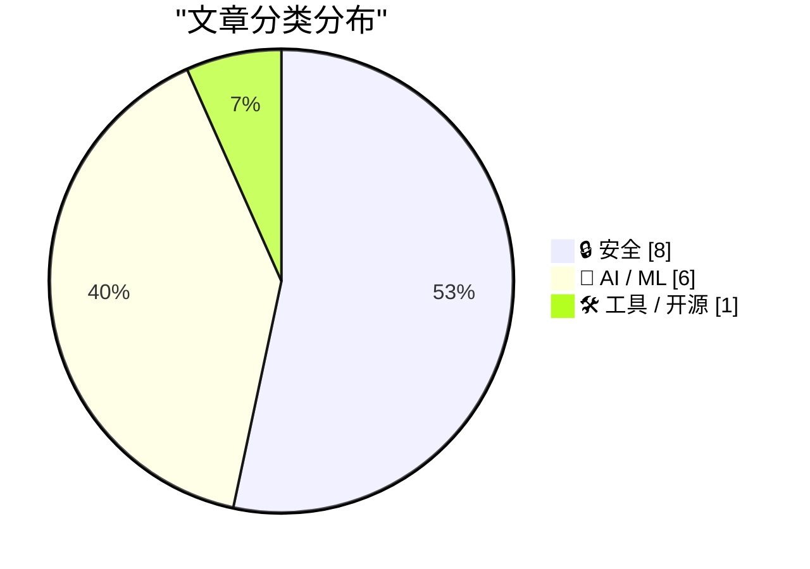
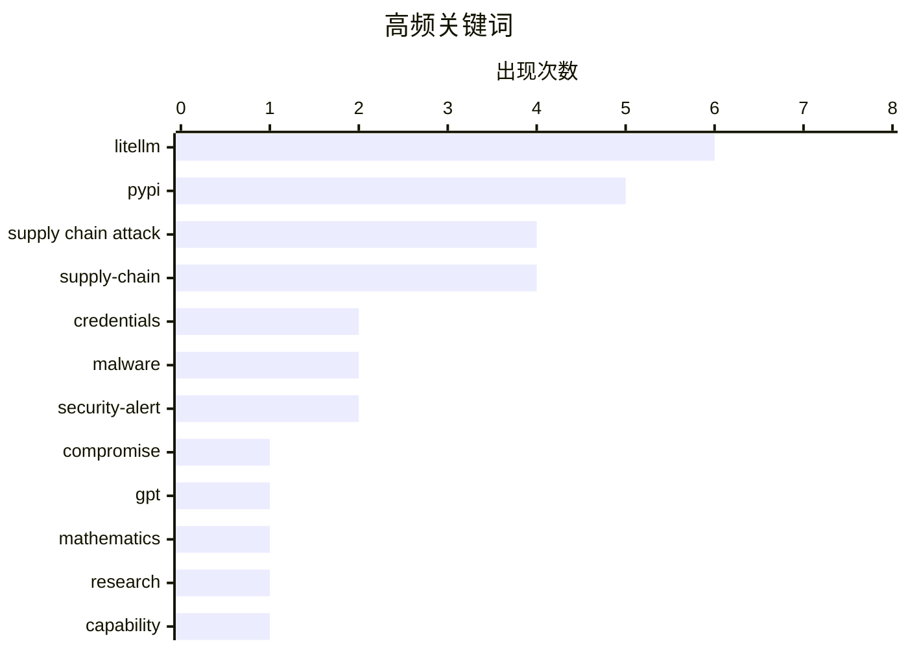

# 📰 AI 资讯每日精选 — 2026-03-25

> 汇聚 140+ 技术博客、X/Twitter、Hacker News、Reddit、Product Hunt、
> Lobste.rs、ClawFeed 日报及 GitHub Trending，经 AI 评分筛选。
>
> **本期内容**：🏆 今日必读 · 🌐 ClawFeed 日报 · 🔥 GitHub Trending · 📂 分类精选 · 🎨 设计与生成式 AI · 📊 数据概览

## 📝 今日看点

今日技术圈聚焦于两大核心动向。一方面，针对AI基础设施的供应链攻击成为重大安全威胁，以LiteLLM库遭恶意篡改并植入凭证窃取器为典型事件，凸显了AI工具链的安全脆弱性。另一方面，AI模型能力持续突破前沿，GPT-5.4 Pro在纯数学推理上取得进展，同时底层算力优化如FlashAttention-4也实现了性能的显著飞跃。

---

## 🏆 今日必读

🥇 **LiteLLM 1.82.7 和 1.82.8 在 PyPI 上被篡改，请勿更新！**

[Litellm 1.82.7 and 1.82.8 on PyPI are compromised, do not update!](https://www.reddit.com/r/LocalLLaMA/comments/1s2c1w4/litellm_1827_and_1828_on_pypi_are_compromised_do/) — r/LocalLLaMA · 11 小时前 · 🔒 安全

> 流行的开源 AI API 代理库 LiteLLM 在 PyPI 上发布的 1.82.7 和 1.82.8 版本遭到供应链攻击。攻击者在软件包中植入了恶意代码，能够窃取云凭证、SSH 密钥、K8s 密钥、环境变量等敏感信息。该攻击无需导入或运行代码，仅安装即可触发，影响范围可能涉及数千名用户。作者提供了详细的技术分析和事件复盘链接。

💡 **为什么值得读**: 此事件揭示了针对 AI 基础设施的新型供应链攻击模式，对依赖开源 AI 组件的开发者和企业是重要的安全警示。

🏷️ supply chain attack, PyPI, LiteLLM, compromise

🥈 **LiteLLM 1.82.8 中的恶意 litellm_init.pth 文件——凭证窃取器**

[Malicious litellm_init.pth in litellm 1.82.8 — credential stealer](https://simonwillison.net/2026/Mar/24/malicious-litellm/#atom-everything) — simonwillison.net · 8 小时前 · 🔒 安全

> LiteLLM v1.82.8 的 PyPI 包被植入了一个隐蔽的凭证窃取器。恶意代码以 base64 编码形式隐藏在 `litellm_init.pth` 文件中，其特殊性在于，用户只需安装该软件包（无需执行 `import litellm`）就会触发攻击。v1.82.7 版本同样存在漏洞，但恶意代码位于 `proxy/proxy` 目录下。这种利用 `.pth` 文件自动执行的方式，使得攻击门槛极低，危害性极大。

💡 **为什么值得读**: 文章深入剖析了此次供应链攻击中一个极其狡猾的技术细节（.pth 文件自动执行），是理解此类攻击机制的关键。

🏷️ supply-chain, PyPI, credentials

🥉 **LiteLLM 1.82.8 PyPI 包中的恶意 litellm_init.pth 文件——凭证窃取器 (GitHub Issue)**

[Malicious litellm_init.pth in litellm 1.82.8 PyPI package – credential stealer](https://github.com/BerriAI/litellm/issues/24512) — Hacker News Best · 11 小时前 · 🔒 安全

> 这是 LiteLLM 官方 GitHub 仓库中关于此次安全事件的 Issue 报告（#24512），是事件的一手信息来源。该 Issue 明确指出 v1.82.8 版本包含恶意 `litellm_init.pth` 文件，会窃取凭证。它在 Hacker News 上引发了广泛讨论，获得了 714 点热度，表明此事在技术社区影响重大。

💡 **为什么值得读**: 作为官方事件追踪入口，此链接提供了最直接、最权威的事件状态更新和社区讨论焦点。

🏷️ supply-chain, PyPI, malware, litellm

4️⃣ **Epoch 确认 GPT-5.4 Pro 解决了一个前沿数学开放性问题**

[Epoch confirms GPT5.4 Pro solved a frontier math open problem](https://epoch.ai/frontiermath/open-problems/ramsey-hypergraphs) — Hacker News Best · 22 小时前 · 🤖 AI / ML

> 研究机构 Epoch 发布报告，确认 OpenAI 的 GPT-5.4 Pro 模型解决了一个关于拉姆齐超图的前沿数学开放性问题。这一成就标志着 AI 在纯数学推理领域取得了突破性进展。该消息在 Hacker News 上引发了 566 条评论和 390 点热度，显示出社区对 AI 前沿能力的高度关注。

💡 **为什么值得读**: 此事件是 AI 在高级推理能力上里程碑式的进展，对于关注 AI 科学发现潜力和 AGI 发展路径的人具有重要参考价值。

🏷️ GPT, mathematics, research, capability

5️⃣ **恶意的 LiteLLM 1.82.8：凭证窃取与持久化后门**

[Malicious litellm 1.82.8: Credential Theft and Persistent Backdoor](https://www.reddit.com/r/programming/comments/1s2h4by/malicious_litellm_1828_credential_theft_and/) — r/programming · 8 小时前 · 🔒 安全

> 知名 Python 包 LiteLLM 遭入侵，其恶意版本能在不导入的情况下自动执行，窃取云凭证、SSH 密钥、K8s 密钥、加密货币钱包、环境变量等几乎所有敏感数据，并外泄至攻击者服务器。文章附带了完整的技术分析报告链接，详细拆解了攻击载荷、传播机制和数据外泄方式。NVIDIA AI 总监 Jim Fan 警告这代表了一类针对 AI 智能体的新型攻击。

💡 **为什么值得读**: 附带的第三方深度技术分析报告，提供了比新闻简讯更全面的攻击链剖析和影响评估。

🏷️ Supply Chain Attack, Python, Credentials, Backdoor

---

## 🌐 ClawFeed 日报精选

> 来源：[ClawFeed](https://clawfeed.kevinhe.io) — AI 驱动的多源新闻聚合

### 🔥 今日头条

1. **NYSE × Securitize 合作：传统金融拥抱链上证券** — 纽交所联手 Securitize 开发 24/7 代币化证券交易平台，Securitize 成为首个数字转账代理，股票和 ETF 可链上原生铸造交易。这是 TradFi 与 DeFi 融合的里程碑事件。

2. **OpenAI vs Anthropic 企业客户争夺战** — 两家向私募基金等企业客户开出更优条件互抢地盘，背后是各自 IPO 路径的铺垫。AI 行业竞争进入商业化深水区。

3. **Anthropic 发布 Claude Code 子代理 + MCP 高级模式** — 展示如何用子代理和 MCP 协议扩展真实代码库，Agent 开发范式持续进化。

4. **SaaS 之死？软件股蒸发 $1T，AI 市场逆势增长** — 2026年1月以来 SaaS 估值倍数从 18.5x 跌至 4.8x，AI 市场同期涨至 $539B，预计 2027 年出现死亡交叉。

### 📰 精选 Top 10

| # | 内容 | 来源 |
|---|------|------|
| 1 | NYSE × Securitize 代币化证券平台，24/7 链上交易 | @WuBlockchain |
| 2 | SaaS 估值崩塌 vs AI 市场暴涨，死亡交叉预测 | @indigox |
| 3 | Generative TUI — AI 驱动终端仪表盘，27 个组件实时渲染 | @turingou / @ctatedev |
| 4 | Claude Code 子代理 + MCP 高级模式发布 | Anthropic / winbuzzer |
| 5 | Auto-research agent 用 LongMemEval 构建 memory framework | @KingBootoshi |
| 6 | SlowMist Agent Security Skill：MCP 恶意模式检测 | @AISecHub |
| 7 | DeskClaw — 多 Agent 企业协同"赛博办公室" | @GitHub_Daily |
| 8 | Translate-polisher Skill：四步走翻译流程 | @RookieRicardoR |
| 9 | 微信 ClawBot 正式上线（iOS 8.0.70） | @Sea_Bitcoin |
| 10 | Context Hub (chub) — AI coding agent 间共享学习的开放 CLI | @AndrewYNg |

### 📊 今日观察

今天最突出的信号是 **TradFi 与链上基础设施的加速融合** — NYSE 与 Securitize 的合作不是概念验证，而是真正的产品落地，代币化证券从"有朝一日"变成"现在就做"。

AI 领域两条线并行：**基础设施层**（Claude Code 子代理、MCP、Agent Security）持续成熟，**商业层**（OpenAI vs Anthropic 企业争夺、SaaS 被 AI 替代）竞争白热化。SaaS 估值倍数腰斩的数据值得重点跟踪，这可能是 AI 重塑软件行业的早期量化信号。

社区层面，Agent 工具链（memory framework、security skill、translate skill）的涌现速度在加快，生态正在从"玩具"走向"工具"。

---
*基于 1 份 4h 简报生成 | 数据截至 2026-03-24 20:41 SGT*

---

## 🔥 GitHub Trending

> 今日热门开源项目（全语言 + Python）

| # | 项目 | 描述 | ⭐ 总星 | 📈 今日 | 语言 |
|---|------|------|---------|---------|------|
| 1 | [bytedance/deer-flow](https://github.com/bytedance/deer-flow) | An open-source SuperAgent harness that researches, codes,... | 43.1k | +4319 | Python |
| 2 | [FujiwaraChoki/MoneyPrinterV2](https://github.com/FujiwaraChoki/MoneyPrinterV2) | Automate the process of making money online. | 24.8k | +2937 | Python |
| 3 | [Crosstalk-Solutions/project-nomad](https://github.com/Crosstalk-Solutions/project-nomad) 🤖 | Project N.O.M.A.D, is a self-contained, offline survival ... | 15.3k | +2450 | TypeScript |
| 4 | [TauricResearch/TradingAgents](https://github.com/TauricResearch/TradingAgents) 🤖 | TradingAgents: Multi-Agents LLM Financial Trading Framework | 40.8k | +1746 | Python |
| 5 | [pascalorg/editor](https://github.com/pascalorg/editor) |  | 5.1k | +1513 | TypeScript |
| 6 | [ruvnet/ruflo](https://github.com/ruvnet/ruflo) 🤖 | 🌊 The leading agent orchestration platform for Claude. D... | 25.1k | +1397 | TypeScript |
| 7 | [NousResearch/hermes-agent](https://github.com/NousResearch/hermes-agent) 🤖 | The agent that grows with you | 12.5k | +1251 | Python |
| 8 | [ruvnet/RuView](https://github.com/ruvnet/RuView) | π RuView: WiFi DensePose turns commodity WiFi signals int... | 41.3k | +1020 | Rust |
| 9 | [hesreallyhim/awesome-claude-code](https://github.com/hesreallyhim/awesome-claude-code) 🤖 | A curated list of awesome skills, hooks, slash-commands, ... | 31.8k | +993 | Python |
| 10 | [browser-use/browser-use](https://github.com/browser-use/browser-use) 🤖 | 🌐 Make websites accessible for AI agents. Automate tasks... | 84.2k | +979 | Python |
| 11 | [jingyaogong/minimind](https://github.com/jingyaogong/minimind) 🤖 | 🚀🚀 「大模型」2小时完全从0训练26M的小参数GPT！🌏 Train a 26M-parameter GP... | 43.3k | +704 | Python |
| 12 | [harry0703/MoneyPrinterTurbo](https://github.com/harry0703/MoneyPrinterTurbo) 🤖 | 利用AI大模型，一键生成高清短视频 Generate short videos with one click us... | 52.6k | +695 | Python |
| 13 | [public-apis/public-apis](https://github.com/public-apis/public-apis) | A collective list of free APIs | 415.7k | +614 | Python |
| 14 | [hsliuping/TradingAgents-CN](https://github.com/hsliuping/TradingAgents-CN) 🤖 | 基于多智能体LLM的中文金融交易框架 - TradingAgents中文增强版 | 20.9k | +559 | Python |
| 15 | [github/spec-kit](https://github.com/github/spec-kit) | 💫 Toolkit to help you get started with Spec-Driven Devel... | 81.9k | +491 | Python |

---

## 🔒 安全

### 1. LiteLLM 1.82.7 和 1.82.8 在 PyPI 上被篡改，请勿更新！

[Litellm 1.82.7 and 1.82.8 on PyPI are compromised, do not update!](https://www.reddit.com/r/LocalLLaMA/comments/1s2c1w4/litellm_1827_and_1828_on_pypi_are_compromised_do/) — **r/LocalLLaMA** · 11 小时前 · ⭐ 28/30

> 流行的开源 AI API 代理库 LiteLLM 在 PyPI 上发布的 1.82.7 和 1.82.8 版本遭到供应链攻击。攻击者在软件包中植入了恶意代码，能够窃取云凭证、SSH 密钥、K8s 密钥、环境变量等敏感信息。该攻击无需导入或运行代码，仅安装即可触发，影响范围可能涉及数千名用户。作者提供了详细的技术分析和事件复盘链接。

🏷️ supply chain attack, PyPI, LiteLLM, compromise

---

### 2. LiteLLM 1.82.8 中的恶意 litellm_init.pth 文件——凭证窃取器

[Malicious litellm_init.pth in litellm 1.82.8 — credential stealer](https://simonwillison.net/2026/Mar/24/malicious-litellm/#atom-everything) — **simonwillison.net** · 8 小时前 · ⭐ 27/30

> LiteLLM v1.82.8 的 PyPI 包被植入了一个隐蔽的凭证窃取器。恶意代码以 base64 编码形式隐藏在 `litellm_init.pth` 文件中，其特殊性在于，用户只需安装该软件包（无需执行 `import litellm`）就会触发攻击。v1.82.7 版本同样存在漏洞，但恶意代码位于 `proxy/proxy` 目录下。这种利用 `.pth` 文件自动执行的方式，使得攻击门槛极低，危害性极大。

🏷️ supply-chain, PyPI, credentials

---

### 3. LiteLLM 1.82.8 PyPI 包中的恶意 litellm_init.pth 文件——凭证窃取器 (GitHub Issue)

[Malicious litellm_init.pth in litellm 1.82.8 PyPI package – credential stealer](https://github.com/BerriAI/litellm/issues/24512) — **Hacker News Best** · 11 小时前 · ⭐ 27/30

> 这是 LiteLLM 官方 GitHub 仓库中关于此次安全事件的 Issue 报告（#24512），是事件的一手信息来源。该 Issue 明确指出 v1.82.8 版本包含恶意 `litellm_init.pth` 文件，会窃取凭证。它在 Hacker News 上引发了广泛讨论，获得了 714 点热度，表明此事在技术社区影响重大。

🏷️ supply-chain, PyPI, malware, litellm

---

### 4. 恶意的 LiteLLM 1.82.8：凭证窃取与持久化后门

[Malicious litellm 1.82.8: Credential Theft and Persistent Backdoor](https://www.reddit.com/r/programming/comments/1s2h4by/malicious_litellm_1828_credential_theft_and/) — **r/programming** · 8 小时前 · ⭐ 27/30

> 知名 Python 包 LiteLLM 遭入侵，其恶意版本能在不导入的情况下自动执行，窃取云凭证、SSH 密钥、K8s 密钥、加密货币钱包、环境变量等几乎所有敏感数据，并外泄至攻击者服务器。文章附带了完整的技术分析报告链接，详细拆解了攻击载荷、传播机制和数据外泄方式。NVIDIA AI 总监 Jim Fan 警告这代表了一类针对 AI 智能体的新型攻击。

🏷️ Supply Chain Attack, Python, Credentials, Backdoor

---

### 5. [进行中] LiteLLM 遭入侵

[[Developing situation] LiteLLM compromised](https://www.reddit.com/r/LocalLLaMA/comments/1s2fch0/developing_situation_litellm_compromised/) — **r/LocalLLaMA** · 9 小时前 · ⭐ 27/30

> 此 Reddit 帖子标记了 LiteLLM 供应链攻击事件为一个“正在发展中的情况”，表明社区在第一时间发现并传播此安全警报。帖子内容以截图形式呈现了相关警告信息，是事件早期在 r/LocalLLaMA 社区传播的见证。它与其他相关帖子共同构成了事件在开发者社区中的发酵轨迹。

🏷️ supply chain attack, LiteLLM, security

---

### 6. 流行的 AI 代理 LiteLLM 遭黑客植入可通过 Kubernetes 集群传播的恶意软件

[Popular AI proxy LiteLLM got hacked with malware that spreads through Kubernetes clusters](https://the-decoder.com/popular-ai-proxy-litellm-got-hacked-with-malware-that-spreads-through-kubernetes-clusters/) — **The Decoder** · 4 小时前 · ⭐ 26/30

> 文章报道了 LiteLLM 遭供应链攻击的事件，并特别强调了恶意软件具备在 Kubernetes 集群中横向移动的能力。它指出，NVIDIA AI 总监 Jim Fan 将此事件视为针对 AI 智能体的新型攻击类别的代表。报道将此次攻击的影响范围从单机扩展到了云原生环境下的整个集群，提升了事件的严重性评估。

🏷️ LiteLLM, malware, supply chain attack, Kubernetes

---

### 7. 警告：PyPI上的Litellm 1.82.7和1.82.8版本已遭入侵

[Tell HN: Litellm 1.82.7 and 1.82.8 on PyPI are compromised](https://github.com/BerriAI/litellm/issues/24512) — **Hacker News Best** · 12 小时前 · ⭐ 26/30

> 开源项目Litellm在PyPI上的1.82.7和1.82.8版本被植入了恶意代码。攻击者在proxy_server.py文件中添加了base64编码的恶意负载，该负载会解码并运行另一个文件，导致用户设备资源耗尽，行为类似forkbomb。发现者Callum McMahon已上报此事并发布了详细分析。用户应立即避免安装或升级至这两个受感染的版本。

🏷️ supply-chain, PyPI, security-alert, litellm

---

### 8. Litellm 1.82.7和1.82.8在PyPI上遭入侵，请勿更新！

[Litellm 1.82.7 and 1.82.8 on PyPI are compromised, do not update!](https://www.reddit.com/r/programming/comments/1s2h8lt/litellm_1827_and_1828_on_pypi_are_compromised_do/) — **r/programming** · 8 小时前 · ⭐ 26/30

> Litellm项目确认其PyPI包的两个新版本（1.82.7和1.82.8）已被入侵，可能已影响数千名用户。事件发现者Callum McMahon撰写了详细的解释和事后分析报告。报告链接提供了关于此次入侵技术细节的深入说明。社区正在紧急处理，用户需立即停止使用受影响版本。

🏷️ supply-chain, PyPI, security-alert, litellm

---

## 🤖 AI / ML

### 9. Epoch 确认 GPT-5.4 Pro 解决了一个前沿数学开放性问题

[Epoch confirms GPT5.4 Pro solved a frontier math open problem](https://epoch.ai/frontiermath/open-problems/ramsey-hypergraphs) — **Hacker News Best** · 22 小时前 · ⭐ 27/30

> 研究机构 Epoch 发布报告，确认 OpenAI 的 GPT-5.4 Pro 模型解决了一个关于拉姆齐超图的前沿数学开放性问题。这一成就标志着 AI 在纯数学推理领域取得了突破性进展。该消息在 Hacker News 上引发了 566 条评论和 390 点热度，显示出社区对 AI 前沿能力的高度关注。

🏷️ GPT, mathematics, research, capability

---

### 10. FlashAttention-4：1613 TFLOPs/s，比 Triton 快 2.7 倍，用 Python 编写。这对推理意味着什么。

[FlashAttention-4: 1613 TFLOPs/s, 2.7x faster than Triton, written in Python. What it means for inference.](https://www.reddit.com/r/LocalLLaMA/comments/1s1yw23/flashattention4_1613_tflopss_27x_faster_than/) — **r/LocalLLaMA** · 23 小时前 · ⭐ 27/30

> FlashAttention-4 在 NVIDIA B200 上实现了 BF16 前向计算 1613 TFLOPs/s 的峰值性能，达到了 71% 的硬件利用率，使注意力计算速度接近矩阵乘法。其性能相比 Triton 实现快 2.1-2.7 倍，甚至比 cuDNN 9.13 快达 1.3 倍。vLLM 0.17.0 版本已集成 FA-4，将直接提升大模型推理服务的效率和成本。

🏷️ FlashAttention, inference, performance, optimization

---

### 11. 构建用于推理、多模态 RAG、语音和安全性的 NVIDIA Nemotron-3 智能体

[Building NVIDIA Nemotron 3 Agents for Reasoning, Multimodal RAG, Voice, and Safety](https://developer.nvidia.com/blog/building-nvidia-nemotron-3-agents-for-reasoning-multimodal-rag-voice-and-safety/) — **NVIDIA Technical Blog** · 8 小时前 · ⭐ 26/30

> NVIDIA 技术博客介绍了如何利用其 Nemotron-3 模型系列构建具备复杂能力的智能体系统。文章阐述了智能体 AI 的生态系统，其中 specialized models 协同工作，处理规划、推理、检索和安全护栏等任务。内容涵盖了多模态检索增强生成、语音交互以及安全防护等关键智能体能力的实现方案。

🏷️ AI agents, NVIDIA, multimodal, RAG

---

### 12. Anthropic工程博客新文：我们如何利用多智能体框架推动Claude在前端设计与长期自主软件工程中的能力

[New on the Anthropic Engineering Blog: How we use a multi-agent harness to push Claude further in frontend design and long-running autonomous software...](https://x.com/AnthropicAI/status/2036481033621623056) — **𝕏 @AnthropicAI** · 7 小时前 · ⭐ 26/30

> Anthropic介绍了其用于提升Claude模型在复杂任务上表现的多智能体框架。该框架将Claude应用于前端UI/UX设计和需要长期运行的自主软件工程项目。通过智能体间的协作与分工，旨在突破单一模型在持续性和复杂性任务上的局限。这代表了当前前沿的AI应用工程化探索方向。

🏷️ Claude, multi-agent, software engineering

---

### 13. 从零开始编写LLM，第32g部分——干预：权重绑定

[Writing an LLM from scratch, part 32g -- Interventions: weight tying](https://www.gilesthomas.com/2026/03/llm-from-scratch-32g-interventions-weight-tying) — **gilesthomas.com** · 4 小时前 · ⭐ 25/30

> 文章探讨了大型语言模型中的“权重绑定”技术，即让输入嵌入层和输出投影层共享权重。尽管这一技术能减少模型参数量，但根据Sebastian Raschka在《从零开始构建大语言模型》一书中的经验，它通常会降低模型性能。作者从直觉上解释了为何权重绑定在现代LLM中不被广泛采用。这反映了模型设计在参数效率与性能之间的权衡。

🏷️ LLM, from scratch, weight tying, model architecture

---

### 14. 那么，所有的AI应用都在哪里？

[So where are all the AI apps?](https://www.answer.ai/posts/2026-03-12-so-where-are-all-the-ai-apps.html) — **Hacker News Best** · 9 小时前 · ⭐ 25/30

> 文章直面当前AI浪潮中的一个核心矛盾：尽管基础模型能力突飞猛进，但真正成功的、面向大众的“杀手级”AI原生应用却寥寥无几。作者分析了可能的原因，包括技术栈不成熟、商业模式不清晰、用户习惯未养成等。文章试图探讨从强大的模型能力到繁荣的应用生态之间缺失的环节。结论指出，AI应用的黄金时代或许尚未到来，我们仍处于寻找正确范式的早期阶段。

🏷️ AI, applications, productivity

---

## 🛠 工具 / 开源

### 15. TypeScript 6.0 发布公告

[Announcing TypeScript 6.0](https://devblogs.microsoft.com/typescript/announcing-typescript-6-0/) — **Lobste.rs** · 14 小时前 · ⭐ 27/30

> 微软官方博客正式发布了 TypeScript 6.0。新版本通常包含重大的语言特性更新、性能改进和工具链增强。发布公告会详细列出所有新特性、破坏性变更和迁移指南，是 TypeScript 开发者升级版本的必读文档。

🏷️ TypeScript, release, programming-language

---

## 🎨 Design & Generative AI

### 🖥️ 生成式 UI

- **[本地桥接工具：在Unity中直接运行ComfyUI工作流，含背景移除与自动导入功能](https://www.reddit.com/r/comfyui/comments/1s2j3mm/i_built_a_local_bridge_to_run_comfyui_workflows/)** — r/comfyui · 7 小时前
  > 开发者构建了一个本地桥接工具，允许在Unity引擎内直接运行ComfyUI工作流，并集成背景移除和模型自动导入。

- **[ComfyUI节点管理器v2发布：全面重写，稳定性大幅提升](https://www.reddit.com/r/comfyui/comments/1s2keuw/update_comfyui_node_organizer_v2_rewrote_it_way/)** — r/comfyui · 6 小时前
  > ComfyUI节点管理器发布第二个版本，经过完全重写，显著提高了工具的稳定性和可靠性。

- **[新脚本发布：在After Effects中直接运行ComfyUI超分工作流（Seed VR2）](https://www.reddit.com/r/comfyui/comments/1s268hk/new_script_to_run_a_comfyui_upscaler_seed_vr2/)** — r/comfyui · 17 小时前
  > 开发者发布新脚本，允许用户在After Effects软件内直接运行基于Seed VR2模型的ComfyUI超分辨率工作流。

- **[风格管理器v6.0：基于React全面重写UI，新增收藏、冲突检测与全屏模式](https://www.reddit.com/r/StableDiffusion/comments/1s1ym6q/style_organizer_v60_full_ui_rewrite_with_react/)** — r/StableDiffusion · 23 小时前
  > 风格管理器发布6.0大版本，使用React重写用户界面，并新增了收藏夹、风格冲突检测和全屏模式等功能。

- **[ComfyUI节点管理器v2更新：重写提升稳定性，优化用户体验](https://www.reddit.com/r/StableDiffusion/comments/1s2kirx/update_comfyui_node_organizer_v2_rewrote_it_way/)** — r/StableDiffusion · 6 小时前
  > ComfyUI节点管理器发布v2版本更新，通过重写核心代码提升了稳定性，并包含多项生活质量改进。

### 🖼️ 生成式图片

- **[谷歌视频超分模型SparkVSR发布：数据集、训练代码开源，ComfyUI节点即将推出](https://www.reddit.com/r/StableDiffusion/comments/1s24imd/sparkvsr_google_video_upscaler_free_and_comfyui/)** — r/StableDiffusion · 19 小时前
  > 谷歌开源视频超分辨率模型SparkVSR的数据集和训练代码，并预告将推出ComfyUI工作流节点。

- **[Midjourney V8使用体验探讨：用户分享测试结果与生成技巧](https://www.reddit.com/r/midjourney/comments/1s21myf/anyone_figure_out_how_to_use_midjourney_v8_yet/)** — r/midjourney · 21 小时前
  > 用户讨论Midjourney V8版本的实际使用体验，分享测试结果并探讨如何通过排名和现有风格获得最佳生成效果。

- **[AI工具包现已支持LTX 2.3版本的LoRA模型训练](https://www.reddit.com/r/StableDiffusion/comments/1s2pa8g/ltx_23_lora_training_support_on_aitoolkit/)** — r/StableDiffusion · 3 小时前
  > AI工具包更新，新增了对LTX 2.3版本LoRA模型训练功能的支持。

- **[风格速查表更新：基于Superaguren工具进行功能增强与优化](https://www.reddit.com/r/StableDiffusion/comments/1s2rgyc/i_updated_superagurens_style_cheat_sheet/)** — r/StableDiffusion · 2 小时前
  > 用户对Superaguren的风格速查表工具进行了更新和功能增强，提供了更完善的风格参考。

- **[简易Flux.2工作流：克莱因光栅图转矢量图（含提示词保存功能）](https://www.reddit.com/r/comfyui/comments/1s21jx0/i_created_a_simple_flux2_klein_raster_to_vector/)** — r/comfyui · 21 小时前
  > 用户创建了一个简单的ComfyUI工作流，使用Flux.2模型将克莱因光栅图像转换为矢量图，并集成了提示词保存功能。

- **[SeedVR2超分模型对比测试：分享ComfyUI工作流与使用体验](https://www.reddit.com/r/comfyui/comments/1s295yc/tested_two_seedvr2_upscale_models_and_comfyui/)** — r/comfyui · 14 小时前
  > 用户对两个SeedVR2超分辨率模型进行了测试，并分享了对应的ComfyUI工作流配置。

- **[Seedance 2.0全能节点发布：专为ComfyUI设计的集成化工具](https://www.reddit.com/r/comfyui/comments/1s2eccz/seedance_20_omni_comfyui_node_now_available/)** — r/comfyui · 10 小时前
  > Seedance 2.0全能节点现已推出，为ComfyUI用户提供了一个功能集成的图像处理工具。

- **[数据可视化模型对比：Midjourney v7与v8版本生成效果展示](https://www.reddit.com/r/midjourney/comments/1s2h224/data_visualisation_mockup_v7_versus_v8/)** — r/midjourney · 8 小时前
  > 用户分享使用Midjourney v7和v8两个版本生成的数据可视化模型图，进行直观的效果对比。

### 🌍 世界模型 / 3D

- **[Yann LeCun提出LeWorldModel新研究，旨在解决像素预测世界模型中的JEPA崩溃问题](https://www.reddit.com/r/singularity/comments/1s2ezuf/yann_lecuns_new_leworldmodel_lewm_research/)** — r/singularity · 9 小时前
  > Yann LeCun团队发布LeWorldModel研究，针对基于像素预测的世界建模中联合嵌入预测架构的崩溃问题提出新方案。

### 🎬 生成式视频

- **[传闻OpenAI Sora视频生成模型已停止服务](https://www.reddit.com/r/singularity/comments/1s2pssb/sora_by_openai_discontinued/)** — r/singularity · 3 小时前
  > 网传OpenAI的Sora视频生成模型已停止服务，推测原因可能与开源替代方案的竞争有关。

---

## 📊 数据概览

| 扫描源 | 抓取文章 | 时间范围 | 精选 |
|:---:|:---:|:---:|:---:|
| 118/140 | 5233 篇 → 216 篇 | 24h | **15 篇** |

### 分类分布



### 高频关键词



<details>
<summary>📈 纯文本关键词图（终端友好）</summary>

```
litellm             │ ████████████████████ 6
pypi                │ █████████████████░░░ 5
supply chain attack │ █████████████░░░░░░░ 4
supply-chain        │ █████████████░░░░░░░ 4
credentials         │ ███████░░░░░░░░░░░░░ 2
malware             │ ███████░░░░░░░░░░░░░ 2
security-alert      │ ███████░░░░░░░░░░░░░ 2
compromise          │ ███░░░░░░░░░░░░░░░░░ 1
gpt                 │ ███░░░░░░░░░░░░░░░░░ 1
mathematics         │ ███░░░░░░░░░░░░░░░░░ 1
```

</details>

### 🏷️ 话题标签

**litellm**(6) · **pypi**(5) · **supply chain attack**(4) · supply-chain(4) · credentials(2) · malware(2) · security-alert(2) · compromise(1) · gpt(1) · mathematics(1) · research(1) · capability(1) · python(1) · backdoor(1) · security(1) · flashattention(1) · inference(1) · performance(1) · optimization(1) · typescript(1)

---

*生成于 2026-03-25 00:06 | 汇聚 140 个技术博客、X/Twitter、Hacker News、Reddit、Product Hunt、Lobste.rs、ClawFeed 日报及 GitHub Trending，经 AI 评分筛选出 Top 15 精华内容*
