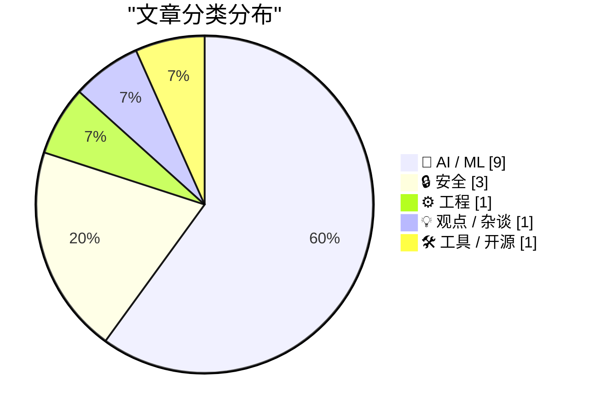
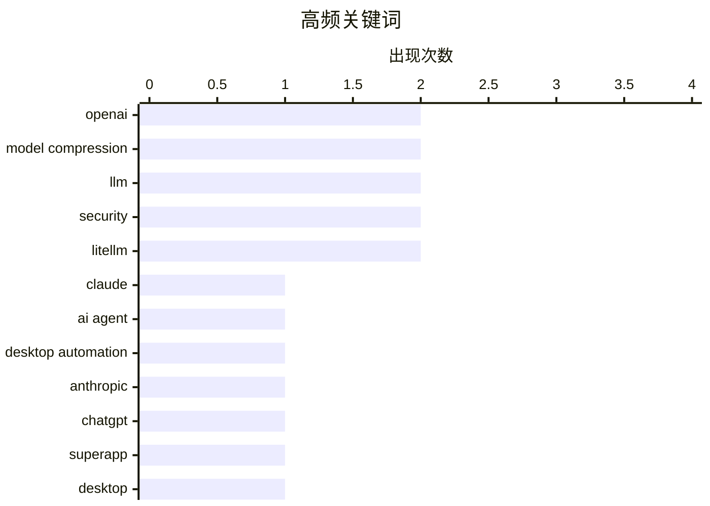

# 📰 AI 资讯每日精选 — 2026-03-26

> 汇聚 140+ 技术博客、X/Twitter、Hacker News、Reddit、Product Hunt、
> Lobste.rs、ClawFeed 日报及 GitHub Trending，经 AI 评分筛选。
>
> **本期内容**：🏆 今日必读 · 🌐 ClawFeed 日报 · 🔥 GitHub Trending · 📂 分类精选 · 🎨 设计与生成式 AI · 📊 数据概览

## 📝 今日看点

今日技术圈的核心焦点在于AI能力的深度进化与潜在风险。一方面，AI助手正从对话工具演变为能直接操作系统的智能体，并朝着整合多功能的“超级应用”迈进，预示着人机交互模式的根本性变革。另一方面，业界在全力追求模型性能与效率突破的同时，也面临着供应链攻击等日益严峻的安全挑战，以及关于当前技术路径局限性的深刻反思。

---

## 🏆 今日必读

🥇 **Claude 现已能接管你的 Mac 电脑**

[Claude Can Now Take Control of Your Mac](https://claude.com/blog/dispatch-and-computer-use) — daringfireball.net · 23 小时前 · 🤖 AI / ML

> Anthropic 为 Claude Pro 和 Max 订阅者推出了 Claude 直接控制用户电脑的研究预览功能。该功能允许 Claude 在 Claude Cowork 和 Claude Code 环境中，通过模拟点击、导航屏幕来完成任务，例如自动打开文件、使用浏览器和开发工具。它无需额外设置，尤其与任务分配工具 Dispatch 配合良好，旨在让 AI 助手直接操作本地应用以提升效率。这标志着 AI 从纯文本交互向直接操作系统的代理能力迈出了关键一步。

💡 **为什么值得读**: 该功能展示了 AI 代理从‘建议者’到‘执行者’的范式转变，对理解未来人机协作模式具有前瞻性参考价值。

🏷️ Claude, AI agent, desktop automation, Anthropic

🥈 **华尔街日报：OpenAI 计划推出桌面“超级应用”**

[WSJ: ‘OpenAI Plans Launch of Desktop “Superapp”’](https://www.wsj.com/tech/openai-plans-launch-of-desktop-superapp-to-refocus-simplify-user-experience-9e19931d?st=25wiu1) — daringfireball.net · 23 小时前 · 🤖 AI / ML

> OpenAI 正计划将其 ChatGPT、代码平台 Codex 和浏览器功能整合为一个桌面“超级应用”。此举旨在简化用户体验，并继续聚焦于服务工程和商业客户。应用首席官 Fidji Simo 将负责监督这一变革，并帮助销售团队推广新产品。这标志着 OpenAI 正从分散的工具向集成化、企业级的统一平台战略转型。

💡 **为什么值得读**: 了解 OpenAI 如何整合其产品线以巩固企业市场地位，是观察 AI 巨头商业化战略的关键窗口。

🏷️ OpenAI, ChatGPT, superapp, desktop

🥉 **TurboQuant：以极致压缩重新定义 AI 效率**

[TurboQuant: Redefining AI efficiency with extreme compression](https://research.google/blog/turboquant-redefining-ai-efficiency-with-extreme-compression/) — Hacker News Best · 19 小时前 · 🤖 AI / ML

> Google 研究团队发布了 TurboQuant 算法，旨在通过极端压缩解决大语言模型内存占用过高的问题。该算法声称能将 LLM 的内存使用量降低高达 6 倍，同时不牺牲模型质量。它通过创新的量化技术实现这一目标，有望让大型模型在资源受限的设备上部署和运行。这项进展对于推动 AI 模型的边缘计算和普及应用具有重要意义。

💡 **为什么值得读**: 对于关注模型部署、边缘 AI 和成本优化的开发者而言，这项突破性的压缩技术提供了切实可行的效率提升方案。

🏷️ model compression, efficiency, quantization

4️⃣ **LeCun 的 10 亿美元种子轮融资，是否标志着自回归 LLM 在形式推理上真的撞墙了？**

[[D] Is LeCun’s $1B seed round the signal that autoregressive LLMs have actually hit a wall for formal reasoning?](https://www.reddit.com/r/MachineLearning/comments/1s3j3ef/d_is_lecuns_1b_seed_round_the_signal_that/) — r/MachineLearning · 5 小时前 · 🤖 AI / ML

> 社区围绕 Yann LeCun 新 AI 初创公司获得 10 亿美元种子轮融资的消息展开讨论，探讨其背后的技术赌注。LeCun 长期公开批评下一代令牌预测器（即当前主流 LLM）本质上无法进行真正的规划与推理。这笔巨额融资被视作一个强烈信号，表明产业界开始大力投资寻求超越自回归 Transformer 的下一代 AI 架构。核心观点是，当前基于概率预测的 LLM 路径在实现可靠推理和规划能力上可能已触及天花板。

💡 **为什么值得读**: 通过顶尖 AI 学者的实际行动和巨额资本流向，可以窥见超越当前 LLM 范式的下一代 AI 技术发展趋势。

🏷️ LLM, LeCun, funding, reasoning

5️⃣ **LiteLLM 供应链攻击对 AI 管道和 API 密钥暴露构成风险**

[[N] LiteLLM supply chain attack risks to Al pipelines and API key exposure](https://www.reddit.com/r/MachineLearning/comments/1s3okes/n_litellm_supply_chain_attack_risks_to_al/) — r/MachineLearning · 2 小时前 · 🔒 安全

> 广泛用于 LLM/智能体管道的开源工具 LiteLLM 遭遇供应链攻击，其持续集成凭证被泄露。攻击者通过发布恶意版本，将其转变为从运行时环境中窃取 API 密钥、云凭证等敏感信息的载体。此事件突显了在日益复杂的 AI 技术栈中，第三方依赖的信任已成为 ML 工作流中的实质性安全风险。它提醒开发者和企业必须重视 AI 供应链的安全审计与防护。

💡 **为什么值得读**: 这是一个发生在核心 AI 工具上的真实安全案例，为所有依赖开源组件的 AI 应用开发者敲响了警钟。

🏷️ supply-chain, security, LiteLLM, API-key

---

## 🌐 ClawFeed 日报精选

> 来源：[ClawFeed](https://clawfeed.kevinhe.io) — AI 驱动的多源新闻聚合

### 🔥 今日头条

### 1. Manus AI 创始人被禁止出境
FT 报道 Manus AI CEO 肖弘和首席科学家季逸超被发改委召至北京后限制出境。Meta 正以 $2B 估值洽谈收购 Manus，团队已部分并入 Meta。中国科技人才出境管控的又一信号。

### 2. litellm PyPI 供应链攻击 — 月下载 9500 万的包被投毒
litellm v1.82.7/v1.82.8 被植入恶意代码，`pip install` 即可窃取 SSH keys、AWS/GCP/Azure 凭证、K8s 配置、加密钱包、SSL 私钥等。Karpathy 称之为 "Software horror"，Elon Musk 转评 "Caveat emptor"。**如果你用了 litellm，立即检查版本。**

### 3. Anthropic 连发两弹：Claude Cowork + Computer Use 上线 & Multi-Agent Harness
Claude 可直接操控桌面、点击鼠标、浏览文件（Mac Pro/Max 可用）。同时发布 Claude Code Auto Mode 和 multi-agent harness 工程博客，展示多 Agent 协作推动前端设计和长时自主工程的实践。

### 4. OpenAI 关闭 Sora App + Altman 放弃安全团队管理
Sora 官方宣布关闭应用，将分享 API 细节。同时据 The Information 报道，Sam Altman 不再直接监管安全团队，转而专注融资和"史无前例规模的数据中心建设"。

### 5. Cloudflare Dynamic Workers + Cursor Composer 2
Cloudflare 推出 AI Agent 沙箱执行环境，比容器快 100 倍，毫秒级启动。Cursor 发布 Composer 2 技术报告，但因使用中国 Kimi AI 作为基座引发争议（507K views）。

---

### 📰 精选 Top 10

| # | 内容 | 来源 |
|---|------|------|
| 1 | Karpathy 发布 litellm 供应链攻击详解，列出所有被窃凭证类型（5K+ likes） | [@karpathy](https://x.com/karpathy/status/2036476290254188870) |
| 2 | Securitize × NYSE 达成重大合作，开发代币化证券市场，首个可在 NYSE 关联链上铸造区块链原生证券的数字转让代理 | [@carlosdomingo](https://x.com/carlosdomingo/status/2036414201481114087) |
| 3 | Cursor 发布 Composer 2 技术报告，详述训练方法，Kimi AI 基座引发争议 | [@cursor_ai](https://x.com/cursor_ai/status/2036566134468542651) |
| 4 | 阿里上线 Accio Work — 电商版 AI Agent，一句话搞定从选品到运营全流程（182K views） | [@aigclink](https://x.com/aigclink/status/2036590264540127499) |
| 5 | 港大团队开源 Agent 自动进化引擎 OpenSpace，支持 Agent 从实践学习、skill 自动修复、群体智能 | [@Saccc_c](https://x.com/Saccc_c/status/2036722451548090758) |
| 6 | Paradigm 的 Machine Payments Protocol：一笔链上交易开 session，之后无限次零手续费微支付 | [@gakonst](https://x.com/gakonst/status/2036626975865630994) |
| 7 | Google TurboQuant 新算法：LLM KV cache 内存压缩 6x、推理加速 8x、零精度损失，16GB Mac Mini 也能本地跑 | [@billtheinvestor](https://x.com/billtheinvestor/status/2036689565621313884) |
| 8 | WesRoth 评 Anthropic Claude Cowork + Dispatch 几乎重建了 90% 的 OpenClaw 功能 | [@WesRoth](https://x.com/WesRoth/status/2036723398630334761) |
| 9 | Generative TUI：终端里用自然语言生成实时数据 dashboard，27 组件 + streaming（2.7K bookmarks） | [@ctatedev](https://x.com/ctatedev/status/2036149934441783691) |
| 10 | B站工程师被开除后开源 B 站前端源码，扔给 AI 就能复刻（666K views） | [@tiger_web3](https://x.com/tiger_web3/status/2036109728175071626) |

---

### 📊 今日观察

**AI Agent 基础设施日趋成熟，但安全问题如影随形。** 今天最戏剧性的对比是：一边 Cloudflare、Anthropic、Figma 都在推出 Agent 基础设施（Dynamic Workers、Computer Use、Agent Canvas），另一边 litellm 供应链攻击提醒我们——AI 工具链本身可能是最脆弱的环节。月下载 9500 万的包被投毒，Karpathy 一声 "Software horror" 响彻全网。

Manus AI 创始人被边控则是另一个信号：中国 AI 人才的全球化流动正受到越来越多的政治因素影响。Meta $2B 收购与创始人被限出境形成强烈反差。

OpenAI 同时关闭 Sora 和让 Altman 退出安全团队管理，暗示公司正在大幅调整战略重心——算力基础设施 > 消费端产品 > 安全。

代币化证券（NYSE × Securitize）和 Agent 支付协议（Paradigm）的出现，说明 crypto 基础设施正从投机工具向实际金融管道演进。

---

*基于 2026-03-25 六期 4h 简报汇总生成 | ClawFeed Daily*

---

## 🔥 GitHub Trending

> 今日热门开源项目（全语言 + Python）

| # | 项目 | 描述 | ⭐ 总星 | 📈 今日 | 语言 |
|---|------|------|---------|---------|------|
| 1 | [bytedance/deer-flow](https://github.com/bytedance/deer-flow) | An open-source SuperAgent harness that researches, codes,... | 46.1k | +3787 | Python |
| 2 | [pascalorg/editor](https://github.com/pascalorg/editor) | Create and share 3D architectural projects. | 6.8k | +2353 | TypeScript |
| 3 | [Crosstalk-Solutions/project-nomad](https://github.com/Crosstalk-Solutions/project-nomad) 🤖 | Project N.O.M.A.D, is a self-contained, offline survival ... | 16.6k | +1718 | TypeScript |
| 4 | [mvanhorn/last30days-skill](https://github.com/mvanhorn/last30days-skill) 🤖 | AI agent skill that researches any topic across Reddit, X... | 7.6k | +1341 | Python |
| 5 | [TauricResearch/TradingAgents](https://github.com/TauricResearch/TradingAgents) 🤖 | TradingAgents: Multi-Agents LLM Financial Trading Framework | 41.8k | +1249 | Python |
| 6 | [ruvnet/ruflo](https://github.com/ruvnet/ruflo) 🤖 | 🌊 The leading agent orchestration platform for Claude. D... | 26.2k | +1174 | TypeScript |
| 7 | [ruvnet/RuView](https://github.com/ruvnet/RuView) | π RuView: WiFi DensePose turns commodity WiFi signals int... | 42.3k | +1082 | Rust |
| 8 | [FujiwaraChoki/MoneyPrinterV2](https://github.com/FujiwaraChoki/MoneyPrinterV2) | Automate the process of making money online. | 25.6k | +1065 | Python |
| 9 | [anthropics/skills](https://github.com/anthropics/skills) 🤖 | Public repository for Agent Skills | 102.9k | +971 | Python |
| 10 | [NousResearch/hermes-agent](https://github.com/NousResearch/hermes-agent) 🤖 | The agent that grows with you | 13.2k | +850 | Python |
| 11 | [supermemoryai/supermemory](https://github.com/supermemoryai/supermemory) 🤖 | Memory engine and app that is extremely fast, scalable. T... | 19.2k | +810 | TypeScript |
| 12 | [hesreallyhim/awesome-claude-code](https://github.com/hesreallyhim/awesome-claude-code) 🤖 | A curated list of awesome skills, hooks, slash-commands, ... | 32.4k | +753 | Python |
| 13 | [harry0703/MoneyPrinterTurbo](https://github.com/harry0703/MoneyPrinterTurbo) 🤖 | 利用AI大模型，一键生成高清短视频 Generate short videos with one click us... | 53.1k | +696 | Python |
| 14 | [jingyaogong/minimind](https://github.com/jingyaogong/minimind) 🤖 | 🚀🚀 「大模型」2小时完全从0训练64M的小参数GPT！🌏 Train a 64M-parameter GP... | 43.7k | +487 | Python |
| 15 | [hsliuping/TradingAgents-CN](https://github.com/hsliuping/TradingAgents-CN) 🤖 | 基于多智能体LLM的中文金融交易框架 - TradingAgents中文增强版 | 21.3k | +449 | Python |

---

## 🤖 AI / ML

### 1. Claude 现已能接管你的 Mac 电脑

[Claude Can Now Take Control of Your Mac](https://claude.com/blog/dispatch-and-computer-use) — **daringfireball.net** · 23 小时前 · ⭐ 27/30

> Anthropic 为 Claude Pro 和 Max 订阅者推出了 Claude 直接控制用户电脑的研究预览功能。该功能允许 Claude 在 Claude Cowork 和 Claude Code 环境中，通过模拟点击、导航屏幕来完成任务，例如自动打开文件、使用浏览器和开发工具。它无需额外设置，尤其与任务分配工具 Dispatch 配合良好，旨在让 AI 助手直接操作本地应用以提升效率。这标志着 AI 从纯文本交互向直接操作系统的代理能力迈出了关键一步。

🏷️ Claude, AI agent, desktop automation, Anthropic

---

### 2. 华尔街日报：OpenAI 计划推出桌面“超级应用”

[WSJ: ‘OpenAI Plans Launch of Desktop “Superapp”’](https://www.wsj.com/tech/openai-plans-launch-of-desktop-superapp-to-refocus-simplify-user-experience-9e19931d?st=25wiu1) — **daringfireball.net** · 23 小时前 · ⭐ 27/30

> OpenAI 正计划将其 ChatGPT、代码平台 Codex 和浏览器功能整合为一个桌面“超级应用”。此举旨在简化用户体验，并继续聚焦于服务工程和商业客户。应用首席官 Fidji Simo 将负责监督这一变革，并帮助销售团队推广新产品。这标志着 OpenAI 正从分散的工具向集成化、企业级的统一平台战略转型。

🏷️ OpenAI, ChatGPT, superapp, desktop

---

### 3. TurboQuant：以极致压缩重新定义 AI 效率

[TurboQuant: Redefining AI efficiency with extreme compression](https://research.google/blog/turboquant-redefining-ai-efficiency-with-extreme-compression/) — **Hacker News Best** · 19 小时前 · ⭐ 27/30

> Google 研究团队发布了 TurboQuant 算法，旨在通过极端压缩解决大语言模型内存占用过高的问题。该算法声称能将 LLM 的内存使用量降低高达 6 倍，同时不牺牲模型质量。它通过创新的量化技术实现这一目标，有望让大型模型在资源受限的设备上部署和运行。这项进展对于推动 AI 模型的边缘计算和普及应用具有重要意义。

🏷️ model compression, efficiency, quantization

---

### 4. LeCun 的 10 亿美元种子轮融资，是否标志着自回归 LLM 在形式推理上真的撞墙了？

[[D] Is LeCun’s $1B seed round the signal that autoregressive LLMs have actually hit a wall for formal reasoning?](https://www.reddit.com/r/MachineLearning/comments/1s3j3ef/d_is_lecuns_1b_seed_round_the_signal_that/) — **r/MachineLearning** · 5 小时前 · ⭐ 27/30

> 社区围绕 Yann LeCun 新 AI 初创公司获得 10 亿美元种子轮融资的消息展开讨论，探讨其背后的技术赌注。LeCun 长期公开批评下一代令牌预测器（即当前主流 LLM）本质上无法进行真正的规划与推理。这笔巨额融资被视作一个强烈信号，表明产业界开始大力投资寻求超越自回归 Transformer 的下一代 AI 架构。核心观点是，当前基于概率预测的 LLM 路径在实现可靠推理和规划能力上可能已触及天花板。

🏷️ LLM, LeCun, funding, reasoning

---

### 5. 据报道 OpenAI CEO Sam Altman 内部预告一款能“真正加速经济”的“非常强大”模型

[OpenAI CEO Sam Altman reportedly teases a "very strong" model internally that can "really accelerate the economy"](https://the-decoder.com/openai-ceo-sam-altman-reportedly-teases-a-very-strong-model-internally-that-can-really-accelerate-the-economy/) — **The Decoder** · 11 小时前 · ⭐ 26/30

> OpenAI 据称已完成其下一代主要 AI 模型（代号“Spud”）的预训练。CEO Sam Altman 在内部表示，该模型“非常强大”，并且能够“真正加速经济”。虽然未透露具体细节，但此番表态暗示了新模型可能在复杂任务处理、经济生产性应用方面有质的飞跃。这预示着 OpenAI 即将发布一款旨在产生广泛经济影响的新旗舰模型。

🏷️ OpenAI, GPT-5, economy, pretraining

---

### 6. 谷歌的 TurboQuant AI 压缩算法可将 LLM 内存使用量降低 6 倍

[Google’s TurboQuant AI-compression algorithm can reduce LLM memory usage by 6x](https://www.reddit.com/r/comfyui/comments/1s3oq5i/googles_turboquant_aicompression_algorithm_can/) — **r/comfyui** · 2 小时前 · ⭐ 26/30

> 一篇分享文章指出，谷歌新发布的 TurboQuant 压缩算法能显著降低 AI 模型的内存占用。该算法声称可以实现高达 6 倍的内存使用减少，同时保持模型质量不受影响。这对于在内存有限的硬件上部署和运行大型语言模型具有重要价值。消息来源引用了 Ars Technica 的相关报道。

🏷️ model compression, LLM, memory optimization

---

### 7. GitHub Copilot 交互数据使用政策更新

[Updates to GitHub Copilot interaction data usage policy](https://github.blog/news-insights/company-news/updates-to-github-copilot-interaction-data-usage-policy/) — **Lobste.rs** · 4 小时前 · ⭐ 26/30

> GitHub 更新了其 AI 编程助手 Copilot 的交互数据使用政策。政策变更涉及如何收集、存储和使用开发者与 Copilot 互动时产生的数据。这类更新通常旨在提高数据处理的透明度，明确用户隐私边界，并可能影响模型训练的数据来源。对于使用 Copilot 的开发者而言，了解其数据如何被处理关乎代码隐私和安全。

🏷️ GitHub Copilot, privacy, data policy

---

### 8. 通过最大化每瓦性能来扩展 AI 工厂收入与效率

[Scaling Token Factory Revenue and AI Efficiency by Maximizing Performance per Watt](https://developer.nvidia.com/blog/scaling-token-factory-revenue-and-ai-efficiency-by-maximizing-performance-per-watt/) — **NVIDIA Technical Blog** · 13 小时前 · ⭐ 25/30

> 文章探讨了在 AI 时代，电力成为硬性约束下，如何优化 AI 基础设施的核心问题。NVIDIA 提出“每瓦性能”是关键指标，直接决定了 AI 工厂的运营成本和收入上限。通过硬件架构、软件栈和冷却系统的协同优化，可以显著提升计算密度和能效。结论是，最大化每瓦性能是扩展 AI 业务规模与盈利能力的根本途径。

🏷️ AI infrastructure, energy efficiency, performance

---

### 9. GitHub 将默认使用所有用户层级的 Copilot 交互数据来训练模型

[Github to use Copilot data from all user tiers to train and improve their models with automatic opt in](https://www.reddit.com/r/programming/comments/1s3o7rk/github_to_use_copilot_data_from_all_user_tiers_to/) — **r/programming** · 2 小时前 · ⭐ 25/30

> GitHub 更新了 Copilot 的交互数据使用政策，允许使用所有用户层级（包括免费和商业用户）的代码交互数据来训练和改进其 AI 模型。新政策采用“自动加入”机制，用户需要主动选择退出。这一变化引发了关于用户隐私、代码所有权和知情同意的广泛讨论。GitHub 此举旨在获取更广泛的数据以提升 Copilot 的性能。

🏷️ Copilot, data privacy, policy

---

## 🔒 安全

### 10. LiteLLM 供应链攻击对 AI 管道和 API 密钥暴露构成风险

[[N] LiteLLM supply chain attack risks to Al pipelines and API key exposure](https://www.reddit.com/r/MachineLearning/comments/1s3okes/n_litellm_supply_chain_attack_risks_to_al/) — **r/MachineLearning** · 2 小时前 · ⭐ 27/30

> 广泛用于 LLM/智能体管道的开源工具 LiteLLM 遭遇供应链攻击，其持续集成凭证被泄露。攻击者通过发布恶意版本，将其转变为从运行时环境中窃取 API 密钥、云凭证等敏感信息的载体。此事件突显了在日益复杂的 AI 技术栈中，第三方依赖的信任已成为 ML 工作流中的实质性安全风险。它提醒开发者和企业必须重视 AI 供应链的安全审计与防护。

🏷️ supply-chain, security, LiteLLM, API-key

---

### 11. LiteLLM 攻击事件：你是那 47,000 名受影响者之一吗？

[LiteLLM Hack: Were You One of the 47,000?](https://simonwillison.net/2026/Mar/25/litellm-hack/#atom-everything) — **simonwillison.net** · 6 小时前 · ⭐ 25/30

> 文章分析了近期针对 LiteLLM 开源库的供应链攻击事件。Daniel Hnyk 利用 BigQuery PyPI 数据集发现，在恶意包上线的 46 分钟内，其下载量高达 46,000 次。这次攻击通过劫持 CI/CD 管道，向官方仓库注入了窃取信息的恶意代码。事件暴露了开源软件供应链在快速分发机制下的巨大安全风险。

🏷️ LiteLLM, hack, PyPI, security

---

### 12. TeamPCP 攻击如何利用 CI/CD 管道和可信发布机制传播受感染的 Trivy 和 LiteLLM 包

[How the TeamPCP attack exploited CI/CD pipelines and trusted releases to release infected Trivy and LiteLLM packages](https://www.reddit.com/r/programming/comments/1s35ohw/how_the_teampcp_attack_exploited_cicd_pipelines/) — **r/programming** · 14 小时前 · ⭐ 25/30

> 文章详细剖析了名为 TeamPCP 的供应链攻击手法，该攻击通过入侵 CI/CD 管道和可信的发布流程来传播恶意软件。攻击者成功入侵了 Aqua Security 的整个 GitHub 账户（包括知名的 Trivy 安全扫描器仓库）和 LiteLLM Python 包。攻击流程是：入侵管道 -> 污染代码库 -> 利用自动发布机制分发带后门的官方版本。这揭示了现代 DevOps 实践中，高度自动化的信任链所蕴含的严重安全风险。

🏷️ supply chain attack, CI/CD, malware

---

## ⚙️ 工程

### 13. 软件工程已越过指数增长的拐点，我亲眼见证了这一切，其他领域将是下一个

[SWE is past the elbow of the exponential kickoff. I watched it happen in real time. Other fields are next.](https://www.reddit.com/r/singularity/comments/1s3bshh/swe_is_past_the_elbow_of_the_exponential_kickoff/) — **r/singularity** · 10 小时前 · ⭐ 27/30

> 一位开发者以亲身经历阐述软件工程生产力在两年内经历了三次“10倍跃升”。从两年前手写每行代码，到一年前负责提示和审查，再到半年前手动运行多轮循环，直至上周实现全自动处理复杂代码库并生成数万行结构化代码和完整测试套件。作者认为这并非个例，而是标志着软件工程领域已越过技术增长的“肘部拐点”，进入指数级加速阶段，并预言其他知识工作领域将紧随其后。

🏷️ AI coding, software engineering, automation, productivity

---

## 💡 观点 / 杂谈

### 14. 塔夫茨大学发布首份美国 AI 职业风险指数

[First-ever American AI Jobs Risk Index released by Tufts University](https://www.reddit.com/r/singularity/comments/1s38zik/firstever_american_ai_jobs_risk_index_released_by/) — **r/singularity** · 11 小时前 · ⭐ 26/30

> 塔夫茨大学发布了首份针对美国的 AI 职业风险指数报告。该指数旨在量化不同职业受人工智能自动化影响的潜在风险程度。报告提供了基于职业分类的数据，帮助公众和政策制定者理解 AI 对劳动力市场的具体冲击。这是系统化评估 AI 经济影响的重要尝试，为职业规划和政策调整提供了数据参考。

🏷️ AI impact, job risk, economic study

---

## 🛠 工具 / 开源

### 15. IntelliJ IDEA 2026.1 正式发布！

[IntelliJ IDEA 2026.1 Is Out!](https://www.reddit.com/r/programming/comments/1s3mt82/intellij_idea_20261_is_out/) — **r/programming** · 3 小时前 · ⭐ 25/30

> JetBrains 发布了其旗舰 Java IDE IntelliJ IDEA 的主要版本 2026.1。新版本带来了多项性能改进和功能增强，包括更快的索引和搜索、增强的调试体验以及对最新 Java 版本的支持。此外，还集成了更多 AI 辅助编码功能，并改进了对微服务和云原生开发工作流的支持。此次更新旨在进一步提升开发者的生产力和开发体验。

🏷️ IDE, JetBrains, release

---

## 🎨 Design & Generative AI

### 🖼️ 生成式图片

- **[ComfyUI动态VRAM管理：拯救本地模型免于内存灾难](https://www.reddit.com/r/StableDiffusion/comments/1s3f8xt/dynamic_vram_in_comfyui_saving_local_models_from/)** — r/StableDiffusion · 7 小时前
  > 介绍一种在ComfyUI中实现动态VRAM管理的技术，以解决本地运行模型时的内存瓶颈问题。

- **[开源工具：让ComfyUI轻松运行于任意计算平台](https://www.reddit.com/r/StableDiffusion/comments/1s3lgxv/built_a_way_to_run_comfyui_on_any_compute_runpod/)** — r/StableDiffusion · 4 小时前
  > 发布一款开源工具，简化ComfyUI在Runpod、HPC集群或本地等任意计算平台上的部署流程。

- **[（重复）开源工具：让ComfyUI轻松运行于任意计算平台](https://www.reddit.com/r/comfyui/comments/1s3kne3/run_comfyui_on_any_compute_you_want_runpod_your/)** — r/comfyui · 4 小时前
  > 与索引4内容相同，介绍一款简化ComfyUI跨平台部署的开源工具。

- **[Flux2klein增强器节点发布（实验性Beta版）](https://www.reddit.com/r/StableDiffusion/comments/1s361z8/flux2klein_enhancer/)** — r/StableDiffusion · 14 小时前
  > 为ComfyUI发布新的实验性节点“FLUX.2 Klein Mask Ref Controller”，用于图像生成控制。

- **[Z-Image Turbo模型多样性提升：Diversity LoRA与ComfyUI工作流](https://www.reddit.com/r/StableDiffusion/comments/1s38kim/zimage_turbo_finally_gets_more_variety_diversity/)** — r/StableDiffusion · 12 小时前
  > 通过Diversity LoRA和ComfyUI工作流，增强了Z-Image Turbo模型生成结果的多样性。

### 🎬 生成式视频

- **[NVIDIA发布视频生成完整指南：从Blender 3D场景到ComfyUI 4K视频](https://www.reddit.com/r/StableDiffusion/comments/1s2v4u7/nvidia_video_generation_guide_full_workflow_from/)** — r/StableDiffusion · 1 天前
  > NVIDIA团队分享了一套从3D场景构建到ComfyUI生成可控4K视频的完整工作流程指南。

- **[迪士尼终止与OpenAI合作，Sora应用及API被关闭](https://the-decoder.com/disney-pulls-out-of-openai-partnership-after-sora-app-and-api-gets-killed-just-months-after-launch/)** — The Decoder · 13 小时前
  > OpenAI关闭Sora应用及API后，迪士尼退出了去年12月达成的价值十亿美元的合作协议。

- **[OpenAI正式关闭Sora应用](https://x.com/soraofficialapp/status/2036546752535470382)** — daringfireball.net · 23 小时前
  > OpenAI宣布关闭其视频生成模型Sora的应用，并向创作者社区致谢。

- **[OpenAI从巅峰到危机：Sora关闭、业务模式转变与竞争压力](https://www.reddit.com/r/singularity/comments/1s3r6gl/from_20222024_oai_was_untouchable_the_world_was/)** — r/singularity · 37 分钟前
  > 分析OpenAI从2022-2024年的统治地位到2025年因Sora关闭、模式转变及竞争加剧而面临的危机。

- **[低显存工作流：使用LTX 2.3 LORA生成人脸替换视频](https://www.reddit.com/r/comfyui/comments/1s36ag4/generate_face_swaping_video_with_ltx_23_lora/)** — r/comfyui · 14 小时前
  > 分享一个针对RTX 3060 6GB等低显存设备的ComfyUI工作流，用LTX 2.3 LORA生成人脸替换视频，大幅缩短生成时间。

- **[免费工具：从故事板到成品动画的一站式生成](https://www.reddit.com/r/comfyui/comments/1s34rup/i_built_a_free_tool_that_takes_you_from/)** — r/comfyui · 15 小时前
  > 开发者发布一款免费工具，旨在帮助用户将故事板直接转化为完整的动画视频。

- **[OpenAI是否应该开源Sora 2的模型权重？](https://www.reddit.com/r/StableDiffusion/comments/1s3f90h/wouldnt_it_make_sense_for_openai_to_release_the/)** — r/StableDiffusion · 7 小时前
  > 讨论在Sora 2视频模型被关闭后，OpenAI是否应将其模型权重开源。

- **[语音时长计算器：根据对话实时计算视频应有长度](https://www.reddit.com/r/comfyui/comments/1s3p9u9/speech_length_calculator_automatically_calculate/)** — r/comfyui · 1 小时前
  > 一款用于ComfyUI的工具，能根据输入的对话文本实时自动计算并设定视频的合适时长。

- **[SORA真的要关闭了吗？](https://www.reddit.com/r/comfyui/comments/1s30lw0/sora_is_shutting_down/)** — r/comfyui · 19 小时前
  > 用户对Sora即将关闭的消息表示震惊，并猜测其关闭原因可能与高昂的运营成本有关。

- **[使用LTX2.3 T2V在Comfycloud生成赛博朋克城市视频](https://www.reddit.com/r/StableDiffusion/comments/1s2woiy/ltx23_t2v/)** — r/StableDiffusion · 22 小时前
  > 展示通过ComfyUI的LTX2.3文生视频模型，在Comfycloud上生成的一段繁荣赛博朋克城市视频。

---

## 📊 数据概览

| 扫描源 | 抓取文章 | 时间范围 | 精选 |
|:---:|:---:|:---:|:---:|
| 98/140 | 3773 篇 → 201 篇 | 24h | **15 篇** |

### 分类分布



### 高频关键词



<details>
<summary>📈 纯文本关键词图（终端友好）</summary>

```
openai             │ ████████████████████ 2
model compression  │ ████████████████████ 2
llm                │ ████████████████████ 2
security           │ ████████████████████ 2
litellm            │ ████████████████████ 2
claude             │ ██████████░░░░░░░░░░ 1
ai agent           │ ██████████░░░░░░░░░░ 1
desktop automation │ ██████████░░░░░░░░░░ 1
anthropic          │ ██████████░░░░░░░░░░ 1
chatgpt            │ ██████████░░░░░░░░░░ 1
```

</details>

### 🏷️ 话题标签

**openai**(2) · **model compression**(2) · **llm**(2) · security(2) · litellm(2) · claude(1) · ai agent(1) · desktop automation(1) · anthropic(1) · chatgpt(1) · superapp(1) · desktop(1) · efficiency(1) · quantization(1) · lecun(1) · funding(1) · reasoning(1) · supply-chain(1) · api-key(1) · ai coding(1)

---

*生成于 2026-03-26 00:10 | 汇聚 140 个技术博客、X/Twitter、Hacker News、Reddit、Product Hunt、Lobste.rs、ClawFeed 日报及 GitHub Trending，经 AI 评分筛选出 Top 15 精华内容*
