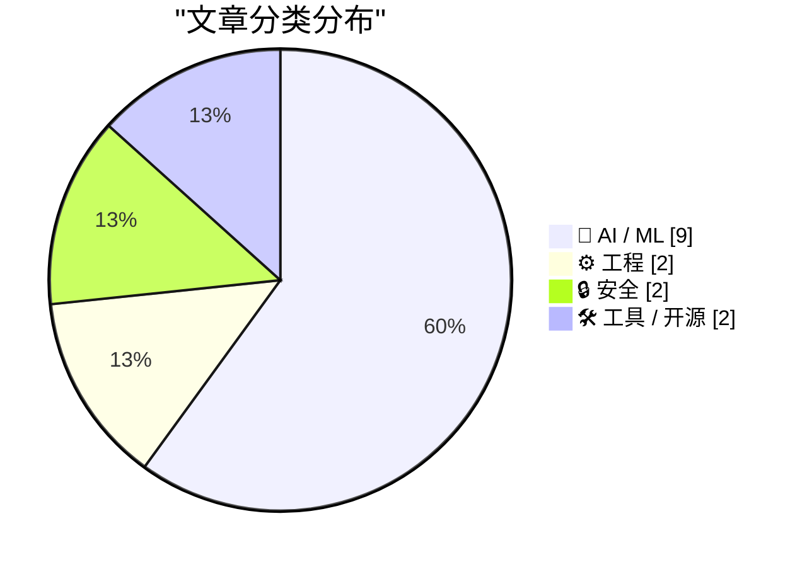
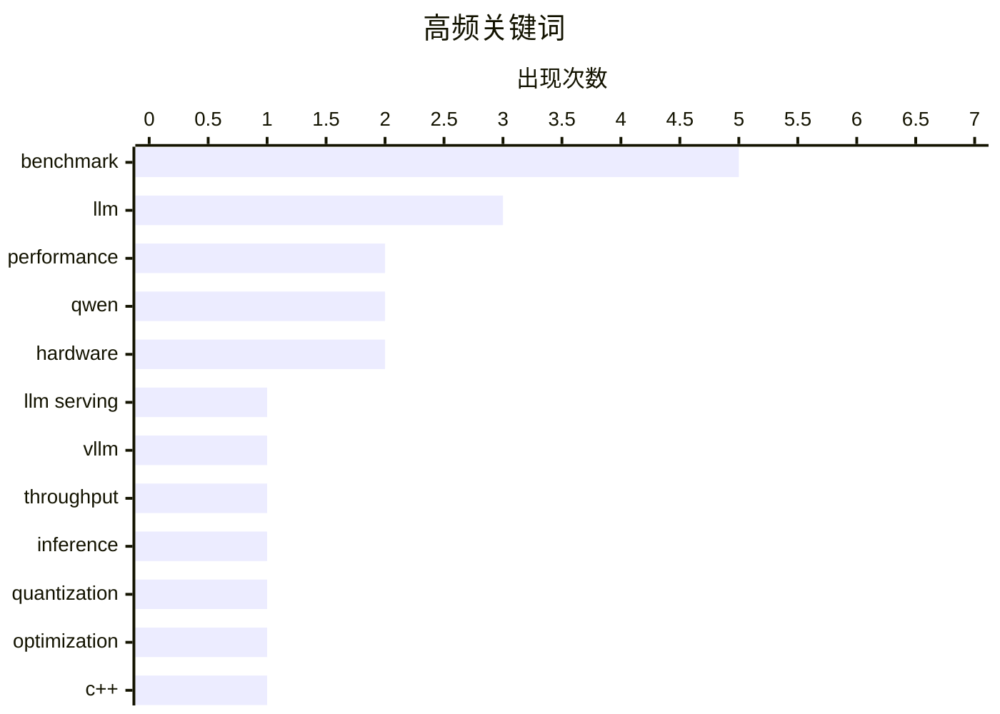

# 📰 AI 资讯每日精选 — 2026-03-27

> 汇聚 140+ 技术博客、X/Twitter、Hacker News、Reddit、Product Hunt、
> Lobste.rs、ClawFeed 日报及 GitHub Trending，经 AI 评分筛选。
>
> **本期内容**：🏆 今日必读 · 🌐 ClawFeed 日报 · 🔥 GitHub Trending · 📂 分类精选 · 🎨 设计与生成式 AI · 📊 数据概览

## 📝 今日看点

今日技术圈聚焦于AI基础设施的效能突破与生态演变。一方面，从千亿级参数模型在顶级GPU集群上实现百万级token吞吐，到量化技术与专用NPU卸载大幅提升能效比，硬件与软件的协同优化正不断刷新AI推理的性能边界。另一方面，开源模型搭配消费级硬件在特定任务上已能比肩商业巨头，同时行业对训练数据来源与用户隐私的争议也日益凸显，标志着AI技术正从实验室快速走向规模化应用与伦理规范的双重考验。

---

## 🏆 今日必读

🥇 **在 B200 GPU 集群上以每秒 110 万 token 的速度服务 Qwen 3.5 27B 模型：基准测试结果与发现**

[[D] - 1M tokens/second serving Qwen 3.5 27B on B200 GPUs, benchmark results and findings](https://www.reddit.com/r/MachineLearning/comments/1s4hxgu/d_1m_tokenssecond_serving_qwen_35_27b_on_b200/) — r/MachineLearning · 4 小时前 · 🤖 AI / ML

> 文章分享了使用 vLLM v0.18.0 在 96 块 B200 GPU 上部署 Qwen 3.5 27B（FP8精度）模型并实现 110 万 token/秒总吞吐量的过程。关键发现包括：对于 B200，数据并行（DP=8）比张量并行（TP=8）的吞吐量高出近 4 倍；启用多张量并行（MTP-1）对 GPU 利用率至关重要。在扩展到 12 个节点（96 块 GPU）时，仍保持了 96.5% 的扩展效率，且每个 token 的推理时间稳定在约 46 毫秒。这表明对于 27B 规模的模型，在 B200 上采用数据并行是更优策略，并能实现近乎线性的高效扩展。

💡 **为什么值得读**: 该实践为大规模部署中等规模大语言模型提供了极具参考价值的性能基准、配置经验和扩展性数据，对需要高吞吐推理的工程团队有直接指导意义。

🏷️ LLM serving, benchmark, vLLM, throughput

🥈 **单个集群实现每秒百万 token 处理：这究竟意味着什么**

[1 million tokens per second from a single cluster, what that actually means](https://www.reddit.com/r/singularity/comments/1s4ht5p/1_million_tokens_per_second_from_a_single_cluster/) — r/singularity · 4 小时前 · 🤖 AI / ML

> 文章阐释了使用 12 个节点共 96 块 B200 GPU，让 Qwen 3.5 27B 模型达到 1,103,941 token/秒处理速度的实际意义。这一速度意味着可以在数小时内处理完 5 万份保险保单文档，而非数周，并能支持 1.6 万并发用户，且每个 token 的延迟低于 50 毫秒。值得注意的是，此性能来自一个 270 亿参数的开源权重模型，且仅使用了标准 vLLM v0.18.0 框架，未使用定制内核。作者指出，随着 GDN 内核优化和预填充/解码分离等技术的引入，当前性能仅是起点，未来还有提升空间。

💡 **为什么值得读**: 文章将抽象的吞吐量数字转化为直观的业务场景（如文档处理效率），清晰地展示了当前开源模型与硬件组合所能达到的工业级服务能力边界。

🏷️ LLM, Inference, Performance, Qwen

🥉 **量化技术从零详解**

[Quantization from the ground up](https://simonwillison.net/2026/Mar/26/quantization-from-the-ground-up/#atom-everything) — simonwillison.net · 7 小时前 · 🤖 AI / ML

> 这是一篇由 Sam Rose 撰写的关于大语言模型量化技术的交互式详解文章。文章从基础开始，系统性地解释了量化是如何工作的，旨在让读者深入理解这一压缩模型、提升推理效率的关键技术。作者采用了丰富的可视化交互手段来辅助阐述复杂概念，被 Simon Willison 评价为“所见过的关于量化最好的视觉解释”。文章内容详实，被认为是作者迄今为止最好的技术文章之一。

💡 **为什么值得读**: 对于想透彻理解模型量化原理，而非仅仅调用库函数的开发者来说，这篇交互式长文提供了无与伦比的深度学习和直观体验。

🏷️ LLM, quantization, optimization

4️⃣ **回归基础：移动语义 - Ben Saks - CppCon 2025**

[Back to Basics: Move Semantics - Ben Saks - CppCon 2025](https://www.reddit.com/r/programming/comments/1s42690/back_to_basics_move_semantics_ben_saks_cppcon_2025/) — r/programming · 15 小时前 · ⚙️ 工程

> 这是 Ben Saks 在 CppCon 2025 大会上关于 C++ 移动语义的“回归基础”演讲。演讲深入探讨了 C++ 中移动语义的核心概念、工作原理及其最佳实践。内容旨在帮助开发者巩固对这一现代 C++ 关键特性的理解，避免常见误用。作为 CppCon 的“回归基础”系列之一，该演讲面向所有希望夯实 C++ 核心语言特性的开发者。

💡 **为什么值得读**: 来自顶级 C++ 会议的权威演讲，是系统化厘清和巩固移动语义这一复杂但核心概念的绝佳机会。

🏷️ C++, move semantics, CppCon, performance

5️⃣ **你的网站正在运行你从未见过的代码 - Scott Helme - NDC Security 2026 [视频]**

[Your Website Is Running Code You’ve Never Seen - Scott Helme - NDC Security 2026 [video]](https://www.reddit.com/r/programming/comments/1s3sbod/your_website_is_running_code_youve_never_seen/) — r/programming · 23 小时前 · 🔒 安全

> 这是安全研究员 Scott Helme 在 NDC Security 2026 上的演讲，揭示了现代网站中潜藏的安全风险：第三方资源可能引入未知代码。演讲探讨了供应链攻击、第三方脚本和依赖如何使网站执行开发者未审查或意图之外的代码。内容涉及实际案例和安全影响，旨在提高开发者对网站资源完整性和安全性的意识。

💡 **为什么值得读**: Scott Helme 是知名的安全专家，此演讲直面现代 Web 开发中日益严峻的供应链安全挑战，对每一位网站所有者和管理者都具有重要警示意义。

🏷️ web security, supply chain, third-party, vulnerability

---

## 🌐 ClawFeed 日报精选

> 来源：[ClawFeed](https://clawfeed.kevinhe.io) — AI 驱动的多源新闻聚合

### 🔥 今日头条

1. **OpenAI "Spud" 模型预训练完成** — Altman 内部备忘录称数周内将有"非常强的模型"，可"真正加速经济"。为释放算力 Sora 将被关闭，产品团队更名"AGI Deployment"。（来源：The Information / The Decoder）

2. **GPU/CPU 供应危机加剧** — Intel、AMD CPU 交货周期从 2 周飙至 6 个月，云端 GPU 供应几乎为零，消费级 GPU 短缺本质是优先级问题。（来源：Tom's Hardware / Seeking Alpha）

3. **Claude Code 达 $1B ARR + Anthropic 影子股溢价 16 倍** — Fast Company 2026 最具创新力 AI 公司榜单中提及 Claude Code 仅 6 个月达十亿美元年化收入；VCX 基金（持有 Anthropic/OpenAI/SpaceX 股份）在纽交所被炒到 16 倍溢价。

4. **Anthropic Claude 全面进化** — Claude Cowork 获得 Computer Use 能力 + Auto Mode；Claude 移动端集成 Figma/Canva/Amplitude 等工具，预告新功能 Orbit 将实现更深度设备控制。

5. **LiteLLM 供应链攻击** — 月下载量 9700 万的 Python 包被 TeamPCP 黑客组织投毒，pip install 即可窃取系统所有凭证（SSH 密钥、AWS、K8s secrets 等）。

---

### 📰 精选 Top 10

1. **@garrytan** (YC CEO) - "很多工程师以为 AI codegen 只能修小 bug，但我已经把 15k 行 AI 生成代码推到生产环境。这些工程师还活在 2025 年。"
   https://x.com/garrytan/status/2036669851318809013

2. **@cursor_ai** - 发布 Composer 2 技术报告公开训练方法，同时推出企业级自托管 AI coding agents。4.8K likes，开发者社区热度极高。
   https://x.com/cursor_ai/status/2036566134468542651

3. **@ericzakariasson** - 长文讨论如何为 AI Agent 设计 CLI：交互式 prompt 会卡住 agent，help page 缺示例也不行。160K 浏览，1K 赞。
   https://x.com/ericzakariasson/status/2036762680401223946

4. **@nash_su** - opencli-rs 发布 Rust 重写版，比原版快 12 倍、内存省 10 倍，仅 4.7MB，20 小时 500+ stars，已发布 OpenClaw Skill。
   https://x.com/nash_su/status/2036669180452466744

5. **@omarsar0** - 分享 Meta 关于 self-improving agents 论文，核心突破：改进机制本身也能自我进化。同日分享了 Claude Code 速查表。
   https://x.com/omarsar0/status/2036828723878793335

6. **@dhh** (Basecamp) - 全面支持 AI Agent 接入，发布全新 CLI + Skill + 扩展 API，"agent first, agent native"。
   https://x.com/dhh/status/2036860598785356219

7. **@aigclink** - Google TurboQuant：LLM KV cache 压缩至 3 bits，内存减 6x，H100 性能提升 8x，零精度损失，无需重训。
   https://x.com/aigclink/status/2036651972917616693

8. **@CocoAIxyz** - "Multi-Agent Is the Future. Single-Agent Is a Transition." 从 80 人/$700K 月支出缩减到 15 人/$100K 但产出更高。
   https://x.com/CocoAIxyz/status/2037080320235712766

9. **@chenreason** (对冲积鲸) - 用阿里 Accio Work（原定位跨境电商）搭出完整投研团队，展示"一人公司"模式。1.1K likes，1.4K bookmarks。
   https://x.com/chenreason/status/2036541685468135898

10. **@ctatedev** - Generative TUI：自然语言提问，终端实时渲染精美 dashboard，27 组件 + streaming。2.6K likes。
    https://x.com/ctatedev/status/2036149934441783691

---

### 📊 今日观察

今天的信息密度极高，几个趋势值得注意：

**AI Agent 生态爆发：** Basecamp 宣布 agent-first、Cursor 推自托管 coding agents、Claude 移动端接入工作工具、各种 CLI/Skill 项目（opencli-rs、web-access）涌现——AI Agent 从"可用"正式跨入"生产力标配"阶段。

**算力危机与模型竞赛并行：** GPU/CPU 供应链已经绷到极限（Intel/AMD 交期 6 个月、云端 GPU 几乎为零），但 OpenAI "Spud"、Google TurboQuant、Meta self-improving agents 等前沿研究丝毫没有放慢。TurboQuant 这种压缩技术可能成为算力瓶颈的关键缓解手段。

**一人公司范式正在被验证：** 从 @chenreason 用 Accio Work 搭投研团队，到 @CocoAIxyz 从 80 人压缩到 15 人产出更高，再到 YC CEO 亲自验证 AI 代码上生产——"AI 驱动的小团队"不再是概念，而是正在发生的现实。

**安全供应链警钟：** LiteLLM 投毒事件给所有用 AI 工具链的开发者敲了警钟——越核心的包越是攻击目标。

---

*生成时间：2026-03-26 22:00 SGT*
*数据来源：6 期 4h 简报 (00:41 - 20:41 SGT)*

---

## 🔥 GitHub Trending

> 今日热门开源项目（全语言 + Python）

| # | 项目 | 描述 | ⭐ 总星 | 📈 今日 | 语言 |
|---|------|------|---------|---------|------|
| 1 | [mvanhorn/last30days-skill](https://github.com/mvanhorn/last30days-skill) 🤖 | AI agent skill that researches any topic across Reddit, X... | 10.2k | +2685 | Python |
| 2 | [bytedance/deer-flow](https://github.com/bytedance/deer-flow) | An open-source long-horizon SuperAgent harness that resea... | 48.3k | +2394 | Python |
| 3 | [Vaibhavs10/insanely-fast-whisper](https://github.com/Vaibhavs10/insanely-fast-whisper) 🤖 |  | 11.2k | +1370 | Jupyter Notebook |
| 4 | [ruvnet/RuView](https://github.com/ruvnet/RuView) | π RuView: WiFi DensePose turns commodity WiFi signals int... | 43.1k | +1002 | Rust |
| 5 | [anthropics/skills](https://github.com/anthropics/skills) 🤖 | Public repository for Agent Skills | 103.8k | +883 | Python |
| 6 | [datawhalechina/hello-agents](https://github.com/datawhalechina/hello-agents) | 📚 《从零开始构建智能体》——从零开始的智能体原理与实践教程 | 31.2k | +613 | Python |
| 7 | [Yeachan-Heo/oh-my-claudecode](https://github.com/Yeachan-Heo/oh-my-claudecode) 🤖 | Teams-first Multi-agent orchestration for Claude Code | 12.6k | +598 | TypeScript |
| 8 | [datalab-to/chandra](https://github.com/datalab-to/chandra) | OCR model that handles complex tables, forms, handwriting... | 6.1k | +557 | Python |
| 9 | [usestrix/strix](https://github.com/usestrix/strix) 🤖 | Open-source AI hackers to find and fix your app’s vulnera... | 22.0k | +535 | Python |
| 10 | [agentscope-ai/agentscope](https://github.com/agentscope-ai/agentscope) 🤖 | Build and run agents you can see, understand and trust. | 20.4k | +437 | Python |
| 11 | [hsliuping/TradingAgents-CN](https://github.com/hsliuping/TradingAgents-CN) 🤖 | 基于多智能体LLM的中文金融交易框架 - TradingAgents中文增强版 | 21.7k | +425 | Python |
| 12 | [hesreallyhim/awesome-claude-code](https://github.com/hesreallyhim/awesome-claude-code) 🤖 | A curated list of awesome skills, hooks, slash-commands, ... | 32.8k | +353 | Python |
| 13 | [harry0703/MoneyPrinterTurbo](https://github.com/harry0703/MoneyPrinterTurbo) 🤖 | 利用AI大模型，一键生成高清短视频 Generate short videos with one click us... | 53.4k | +256 | Python |
| 14 | [p-e-w/heretic](https://github.com/p-e-w/heretic) | Fully automatic censorship removal for language models | 17.4k | +213 | Python |
| 15 | [virattt/dexter](https://github.com/virattt/dexter) 🤖 | An autonomous agent for deep financial research | 19.0k | +210 | TypeScript |

---

## 🤖 AI / ML

### 1. 在 B200 GPU 集群上以每秒 110 万 token 的速度服务 Qwen 3.5 27B 模型：基准测试结果与发现

[[D] - 1M tokens/second serving Qwen 3.5 27B on B200 GPUs, benchmark results and findings](https://www.reddit.com/r/MachineLearning/comments/1s4hxgu/d_1m_tokenssecond_serving_qwen_35_27b_on_b200/) — **r/MachineLearning** · 4 小时前 · ⭐ 27/30

> 文章分享了使用 vLLM v0.18.0 在 96 块 B200 GPU 上部署 Qwen 3.5 27B（FP8精度）模型并实现 110 万 token/秒总吞吐量的过程。关键发现包括：对于 B200，数据并行（DP=8）比张量并行（TP=8）的吞吐量高出近 4 倍；启用多张量并行（MTP-1）对 GPU 利用率至关重要。在扩展到 12 个节点（96 块 GPU）时，仍保持了 96.5% 的扩展效率，且每个 token 的推理时间稳定在约 46 毫秒。这表明对于 27B 规模的模型，在 B200 上采用数据并行是更优策略，并能实现近乎线性的高效扩展。

🏷️ LLM serving, benchmark, vLLM, throughput

---

### 2. 单个集群实现每秒百万 token 处理：这究竟意味着什么

[1 million tokens per second from a single cluster, what that actually means](https://www.reddit.com/r/singularity/comments/1s4ht5p/1_million_tokens_per_second_from_a_single_cluster/) — **r/singularity** · 4 小时前 · ⭐ 27/30

> 文章阐释了使用 12 个节点共 96 块 B200 GPU，让 Qwen 3.5 27B 模型达到 1,103,941 token/秒处理速度的实际意义。这一速度意味着可以在数小时内处理完 5 万份保险保单文档，而非数周，并能支持 1.6 万并发用户，且每个 token 的延迟低于 50 毫秒。值得注意的是，此性能来自一个 270 亿参数的开源权重模型，且仅使用了标准 vLLM v0.18.0 框架，未使用定制内核。作者指出，随着 GDN 内核优化和预填充/解码分离等技术的引入，当前性能仅是起点，未来还有提升空间。

🏷️ LLM, Inference, Performance, Qwen

---

### 3. 量化技术从零详解

[Quantization from the ground up](https://simonwillison.net/2026/Mar/26/quantization-from-the-ground-up/#atom-everything) — **simonwillison.net** · 7 小时前 · ⭐ 26/30

> 这是一篇由 Sam Rose 撰写的关于大语言模型量化技术的交互式详解文章。文章从基础开始，系统性地解释了量化是如何工作的，旨在让读者深入理解这一压缩模型、提升推理效率的关键技术。作者采用了丰富的可视化交互手段来辅助阐述复杂概念，被 Simon Willison 评价为“所见过的关于量化最好的视觉解释”。文章内容详实，被认为是作者迄今为止最好的技术文章之一。

🏷️ LLM, quantization, optimization

---

### 4. [研究] ARC 第三轮挑战发布与技术报告

[[R] ARC Round 3 - released + technical report](https://www.reddit.com/r/MachineLearning/comments/1s40a34/r_arc_round_3_released_technical_report/) — **r/MachineLearning** · 17 小时前 · ⭐ 26/30

> 文章介绍了抽象与推理挑战赛第三轮（ARC-3）的发布及相关技术报告。核心发现是，所有表现良好的模型，其训练数据中很可能都包含了类似 ARC 的数据，这是通过检查模型推理轨迹得出的结论。目前，所有前沿模型在 ARC-3 上的得分均低于 1%，表明在解决抽象推理任务上仍有巨大提升空间。报告还指出，由于效率不足，第一轮和第二轮的奖金尚未被领取。

🏷️ ARC Prize, AGI, benchmark, reasoning

---

### 5. 价值 500 美元的 GPU 配合开源 AI 系统，在编程基准测试中超越 Claude Sonnet

[$500 GPU outperforms Claude Sonnet on coding benchmarks using open-source AI system](https://github.com/itigges22/ATLAS) — **Lobste.rs** · 6 小时前 · ⭐ 26/30

> 一个名为 ATLAS 的开源 AI 系统，在搭配价值约 500 美元的消费级 GPU 时，于编程基准测试中表现超过了 Anthropic 的 Claude Sonnet 模型。这展示了开源模型与平价硬件组合在特定任务上可以达到甚至超越商业前沿模型性能的潜力。项目链接指向 GitHub 仓库，具体细节需查看项目文档和基准测试结果。

🏷️ GPU, LLM, benchmark, open-source

---

### 6. GitHub 将使用你的代码库交互数据来训练 AI 模型

[GitHub will use your repos to train AI models](https://www.reddit.com/r/programming/comments/1s45lme/github_will_use_your_repos_to_train_ai_models/) — **r/programming** · 12 小时前 · ⭐ 25/30

> GitHub 宣布自 4 月 24 日起，将默认使用用户与 GitHub Copilot 的交互数据来训练其 AI 模型。用户需要主动在设置中选择退出才能避免自己的交互数据被用于此目的。文章澄清，此政策主要针对“GitHub Copilot 交互数据”，而非直接使用所有代码仓库的全部内容进行训练。社区反应强烈，许多开发者提醒同行注意并提供了直接的退出操作链接。

🏷️ GitHub, Copilot, data privacy, opt-out

---

### 7. Mistral AI 将发布 Voxtral TTS：一个 30 亿参数的开源文本转语音模型，据称在人类偏好测试中超越 ElevenLabs Flash v2.5

[Mistral AI to release Voxtral TTS, a 3-billion-parameter text-to-speech model with open weights that the company says outperformed ElevenLabs Flash v2.5 in human preference tests. The model runs on about 3 GB of RAM, achieves 90-millisecond time-to-first-audio, supports nine languages.](https://www.reddit.com/r/LocalLLaMA/comments/1s46ylj/mistral_ai_to_release_voxtral_tts_a/) — **r/LocalLLaMA** · 11 小时前 · ⭐ 25/30

> Mistral AI 即将发布一款名为 Voxtral TTS 的开源文本转语音模型。该模型拥有 30 亿参数，权重开源，在人类偏好测试中表现优于商业模型 ElevenLabs Flash v2.5。其资源需求极低，仅需约 3GB 内存即可运行，并实现了 90 毫秒的首次音频生成延迟。此外，该模型支持多达九种语言。

🏷️ TTS, Mistral AI, open weights, release

---

### 8. 双 DGX Sparks 对比 Mac Studio M3 Ultra 512GB：本地运行 Qwen3.5 397B 的实战体验

[Dual DGX Sparks vs Mac Studio M3 Ultra 512GB: Running Qwen3.5 397B locally on both. Here's what I found.](https://www.reddit.com/r/LocalLLaMA/comments/1s4lmep/dual_dgx_sparks_vs_mac_studio_m3_ultra_512gb/) — **r/LocalLLaMA** · 1 小时前 · ⭐ 25/30

> 一位用户为替代每月 2000 美元的 Claude API 开销，投入约 1 万美元分别购置了双 DGX Sparks 和 Mac Studio M3 Ultra 512GB 来本地运行 Qwen3.5 397B A17B 模型。Mac Studio 通过 MLX 框架和 6 位量化，成功将 323GB 的模型载入其 512GB 统一内存中运行。文章对比了这两种截然不同的硬件方案在成本、部署难度和实际使用体验上的差异。

🏷️ Benchmark, Hardware, Cost Analysis, Qwen

---

### 9. Qwen3.5 系列模型在 Apple Silicon 与 AMD GPU 上的基准测试：ROCm 与 Vulkan 结果出人意料，上下文长度影响显著

[Benchmarked Qwen3.5 (35B MoE, 27B Dense, 122B MoE) across Apple Silicon and AMD GPUs — ROCm vs Vulkan results were surprising, and context size matters](https://www.reddit.com/r/LocalLLaMA/comments/1s4bggo/benchmarked_qwen35_35b_moe_27b_dense_122b_moe/) — **r/LocalLLaMA** · 8 小时前 · ⭐ 25/30

> 文章对 Qwen3.5 系列模型（包括 35B MoE、27B 密集和 122B MoE）在 Apple Silicon 和 AMD GPU 上的推理性能进行了全面基准测试。测试旨在为硬件选型提供真实工作负载下的参考，弥补了现有评测的不足。一个关键发现是，在 AMD GPU 上，Vulkan 后端的表现有时优于官方的 ROCm 后端，结果令人意外。测试还明确指出，上下文长度对推理速度有显著影响，是评估性能时必须考虑的因素。

🏷️ Benchmark, ROCm, Vulkan, Apple Silicon

---

## ⚙️ 工程

### 10. 回归基础：移动语义 - Ben Saks - CppCon 2025

[Back to Basics: Move Semantics - Ben Saks - CppCon 2025](https://www.reddit.com/r/programming/comments/1s42690/back_to_basics_move_semantics_ben_saks_cppcon_2025/) — **r/programming** · 15 小时前 · ⭐ 26/30

> 这是 Ben Saks 在 CppCon 2025 大会上关于 C++ 移动语义的“回归基础”演讲。演讲深入探讨了 C++ 中移动语义的核心概念、工作原理及其最佳实践。内容旨在帮助开发者巩固对这一现代 C++ 关键特性的理解，避免常见误用。作为 CppCon 的“回归基础”系列之一，该演讲面向所有希望夯实 C++ 核心语言特性的开发者。

🏷️ C++, move semantics, CppCon, performance

---

### 11. 将 LLM 矩阵乘法卸载到 AMD Ryzen AI MAX 385 的 XDNA2 NPU：实现 43.7 token/秒解码速度，每 token 能耗 0.947 焦耳

[Offloading LLM matrix multiplication to the AMD XDNA2 NPU on Ryzen AI MAX 385 : 43.7 t/s decode at 0.947 J/tok](https://www.reddit.com/r/LocalLLaMA/comments/1s4eb13/offloading_llm_matrix_multiplication_to_the_amd/) — **r/LocalLLaMA** · 6 小时前 · ⭐ 26/30

> 项目为 llama.cpp 构建了一个自定义后端，将 GEMM 操作直接调度到 AMD Ryzen AI MAX 385 处理器的 XDNA2 NPU 上运行，避免了集成显卡和共享内存争用。测试使用 Meta-Llama-3.1-8B-Instruct Q4_K_M 模型，在纯 NPU 后端上实现了 43.7 token/秒的解码速度，每 token 能耗仅为 0.947 焦耳，能效比显著。与使用集成显卡的后端相比，NPU 在能效上表现更优，为在边缘设备上高效运行大语言模型提供了新的硬件选择方案。

🏷️ llama.cpp, AMD NPU, inference optimization, energy efficiency

---

## 🔒 安全

### 12. 你的网站正在运行你从未见过的代码 - Scott Helme - NDC Security 2026 [视频]

[Your Website Is Running Code You’ve Never Seen - Scott Helme - NDC Security 2026 [video]](https://www.reddit.com/r/programming/comments/1s3sbod/your_website_is_running_code_youve_never_seen/) — **r/programming** · 23 小时前 · ⭐ 26/30

> 这是安全研究员 Scott Helme 在 NDC Security 2026 上的演讲，揭示了现代网站中潜藏的安全风险：第三方资源可能引入未知代码。演讲探讨了供应链攻击、第三方脚本和依赖如何使网站执行开发者未审查或意图之外的代码。内容涉及实际案例和安全影响，旨在提高开发者对网站资源完整性和安全性的意识。

🏷️ web security, supply chain, third-party, vulnerability

---

### 13. 不要信任软件，要验证它

[Don’t trust software, verify it](https://daniel.haxx.se/blog/2026/03/26/dont-trust-verify/) — **Lobste.rs** · 9 小时前 · ⭐ 25/30

> 文章的核心观点是，在软件安全领域，盲目的信任是危险的，必须通过可验证的手段来确保安全性。这通常意味着采用诸如代码审计、形式化验证、可重现构建等技术或流程。其思想源于计算机安全的基本原则，即任何组件都可能存在缺陷或恶意后门。作者呼吁开发者和用户转向一种“零信任”但可验证的软件供应链实践。

🏷️ software supply chain, verification, trust, security

---

## 🛠 工具 / 开源

### 14. [项目] minFLUX：FLUX.1 和 FLUX.2 的最小化教育实现（类似 minGPT，但是用于 FLUX）

[[Project] minFLUX: A minimal educational implementation of FLUX.1 and FLUX.2 (like minGPT but for FLUX)](https://www.reddit.com/r/StableDiffusion/comments/1s47l9v/project_minflux_a_minimal_educational/) — **r/StableDiffusion** · 10 小时前 · ⭐ 26/30

> 项目开源了 minFLUX，一个干净、仅依赖 PyTorch 和 NumPy 的 FLUX 扩散 Transformer 最小化教育实现。它包含了 FLUX.1 和 FLUX.2 的核心实现，代码与 HuggingFace Diffusers 库中的官方实现有逐行映射关系，便于学习。项目提供了完整的训练循环和推理循环，并包含了 RoPE、潜在空间处理等共享工具。其目标是像 minGPT 解释 Transformer 一样，帮助开发者从零开始理解 FLUX 系列模型的工作原理。

🏷️ FLUX, educational, PyTorch, implementation

---

### 15. Arm 成立 35 年来首次推出自研生产级处理器：一款高达 136 核、专为“智能体 AI 基础设施”设计的数据中心芯片

[for the first time in Arm's 35-year history, the company has shipped its own production processor rather than licensing IP to partners; an up-to 136-core data center processor; designed for what Arm calls "agentic AI infrastructure" for large-scale AI deployments](https://www.reddit.com/r/singularity/comments/1s4jxq0/for_the_first_time_in_arms_35year_history_the/) — **r/singularity** · 3 小时前 · ⭐ 25/30

> Arm 公司打破了其长达 35 年的 IP 授权商业模式，首次自主设计并推出了生产级处理器。这款新产品是一款数据中心处理器，核心数最高可达 136 核。其设计目标明确，旨在为大规模 AI 部署提供所谓的“智能体 AI 基础设施”。此举标志着 Arm 从知识产权提供商向芯片产品供应商的战略转变。

🏷️ Arm, Processor, AI Infrastructure, Hardware

---

## 🎨 Design & Generative AI

### 🖼️ 生成式图片

- **[开源minFLUX项目：极简教育版FLUX.1/FLUX.2实现](https://www.reddit.com/r/StableDiffusion/comments/1s47l9v/project_minflux_a_minimal_educational/)** — r/StableDiffusion · 10 小时前
  > 一个仅依赖PyTorch和NumPy的极简、干净的开源FLUX扩散变换器实现。

- **[8GB显存运行！纯ComfyUI的FLUX2电影级人像工作流](https://www.reddit.com/r/comfyui/comments/1s4meix/workflow_i_built_a_flux2_cinematic_portrait/)** — r/comfyui · 1 小时前
  > 一个无需自定义节点、零CFG、在8GB显存上实现高质量电影级FLUX2人像生成的ComfyUI工作流。

- **[Stability Matrix因可安装生成“露骨内容”的软件被Patreon撤资](https://www.reddit.com/r/comfyui/comments/1s45hlq/stability_matrix_was_defunded_on_patreon_for_its/)** — r/comfyui · 12 小时前
  > Stability Matrix因被指可便捷安装用于生成露骨图像的软件，而被Patreon平台撤资。

- **[五大模型训狗效果对比：Flux Klein、Z-Image、SDXL等](https://www.reddit.com/r/StableDiffusion/comments/1s4k6tj/i_trained_my_dog_on_5_models_comparison_here_flux/)** — r/StableDiffusion · 2 小时前
  > 对比了在Flux Klein、Z-Image、SDXL等五个不同图像生成模型上训练同一只狗的效果。

- **[新自定义节点：提示词管理库与LTX2增强版LoRA加载器](https://www.reddit.com/r/StableDiffusion/comments/1s3w4wf/made_a_couple_custom_nodes_prompt_stash/)** — r/StableDiffusion · 20 小时前
  > 发布了两个ComfyUI自定义节点，用于管理提示词和为LTX2模型提供增强的LoRA加载功能。

- **[告别依赖地狱：ComfyUI工作流依赖自动检查工具](https://www.reddit.com/r/comfyui/comments/1s47g0d/built_app_to_stop_missing_dependency_hell/)** — r/comfyui · 10 小时前
  > 开发了一个小工具，用于自动检查和解决分享ComfyUI工作流时遇到的依赖缺失问题。

- **[ZImage + SeedVR2工作流：实现商业级眼睛、皮肤与光泽](https://www.reddit.com/r/comfyui/comments/1s45ibb/zimage_seedvr2_comfyui_workflow_to_achieve/)** — r/comfyui · 12 小时前
  > 结合ZImage和SeedVR2的ComfyUI工作流，旨在生成具有商业级质感的眼睛、皮肤和光泽效果。

### 🎬 生成式视频

- **[寻找Sora的开源替代模型](https://www.reddit.com/r/comfyui/comments/1s4mdmq/opensource_model_alternatives_of_sora/)** — r/comfyui · 1 小时前
  > 讨论Sora视频生成模型的开源替代方案。

- **[迪士尼终止与OpenAI合作，撤回10亿美元Sora投资](https://variety.com/2026/digital/news/openai-shutting-down-sora-video-disney-1236698277/)** — daringfireball.net · 4 小时前
  > 迪士尼在Sora项目被砍后，结束了与OpenAI的合作并撤回了10亿美元的投资计划。

- **[探索LTX 2.3训练数据：制作黑洞科普视频](https://www.reddit.com/r/StableDiffusion/comments/1s46n2c/tried_to_find_out_whats_in_ltx_23_training_data/)** — r/StableDiffusion · 11 小时前
  > 通过分析LTX 2.3模型的文生视频训练数据，制作了一个关于黑洞的科普短片。

- **[LTX 2.3全分辨率文/图生视频工作流（无需缩放）](https://www.reddit.com/r/comfyui/comments/1s43prs/using_ltx_23_text_image_to_video_full_resolution/)** — r/comfyui · 13 小时前
  > 分享了一个无需缩放、支持全分辨率图像/文本生成视频的LTX 2.3工作流。

- **[LTX 2.3基础ID-LoRA工作流（带参考音频）](https://www.reddit.com/r/comfyui/comments/1s45cee/ltx_23_i2vt2v_basic_idlora_workflow_with/)** — r/comfyui · 12 小时前
  > 一个结合了参考音频的LTX 2.3基础图像/文本生成视频及身份LoRA工作流。

- **[实现Wan VACE中无缝动画的方法](https://www.reddit.com/r/comfyui/comments/1s4f1lv/i_figured_out_how_to_make_seamless_animations_in/)** — r/comfyui · 6 小时前
  > 分享了在Wan VACE视频生成工具中制作无缝循环动画的技巧。

- **[告别Sora：一位资深用户的感言](https://www.businessinsider.com/sora-openai-chatgpt-sam-altman-ai-shutting-down-farewell-why-2026-3)** — daringfireball.net · 6 小时前
  > 一位Sora的深度用户在其服务关闭后，发表了对这款“美丽又愚蠢”的AI视频工具的告别感言。

- **[Sora宣布关闭前的AI视频流量高峰](https://www.reddit.com/r/singularity/comments/1s4ad54/ai_video_traffic_before_sora_announced_the/)** — r/singularity · 8 小时前
  > 展示了在Sora宣布关闭服务之前，AI视频相关话题的流量激增情况。

---

## 📊 数据概览

| 扫描源 | 抓取文章 | 时间范围 | 精选 |
|:---:|:---:|:---:|:---:|
| 118/140 | 5229 篇 → 222 篇 | 24h | **15 篇** |

### 分类分布



### 高频关键词



<details>
<summary>📈 纯文本关键词图（终端友好）</summary>

```
benchmark    │ ████████████████████ 5
llm          │ ████████████░░░░░░░░ 3
performance  │ ████████░░░░░░░░░░░░ 2
qwen         │ ████████░░░░░░░░░░░░ 2
hardware     │ ████████░░░░░░░░░░░░ 2
llm serving  │ ████░░░░░░░░░░░░░░░░ 1
vllm         │ ████░░░░░░░░░░░░░░░░ 1
throughput   │ ████░░░░░░░░░░░░░░░░ 1
inference    │ ████░░░░░░░░░░░░░░░░ 1
quantization │ ████░░░░░░░░░░░░░░░░ 1
```

</details>

### 🏷️ 话题标签

**benchmark**(5) · **llm**(3) · **performance**(2) · qwen(2) · hardware(2) · llm serving(1) · vllm(1) · throughput(1) · inference(1) · quantization(1) · optimization(1) · c++(1) · move semantics(1) · cppcon(1) · web security(1) · supply chain(1) · third-party(1) · vulnerability(1) · arc prize(1) · agi(1)

---

*生成于 2026-03-27 00:09 | 汇聚 140 个技术博客、X/Twitter、Hacker News、Reddit、Product Hunt、Lobste.rs、ClawFeed 日报及 GitHub Trending，经 AI 评分筛选出 Top 15 精华内容*
