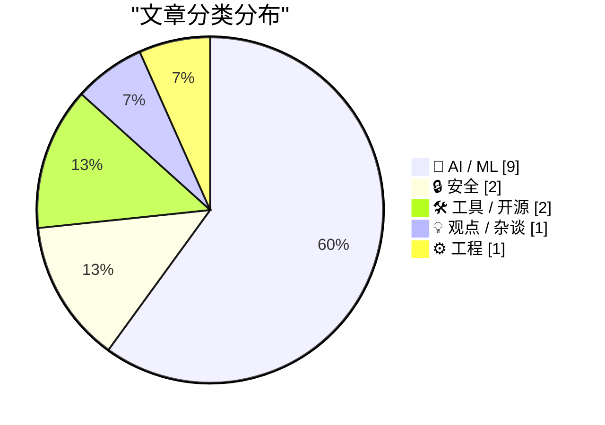
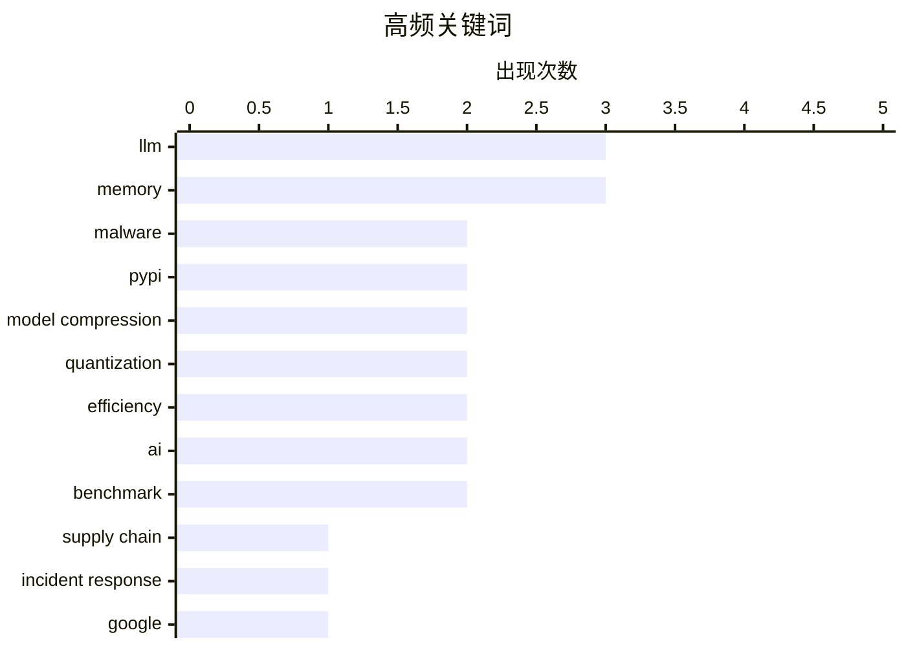

# 📰 AI 资讯每日精选 — 2026-03-28

> 汇聚 140+ 技术博客、X/Twitter、Hacker News、Reddit、Product Hunt、
> Lobste.rs、ClawFeed 日报及 GitHub Trending，经 AI 评分筛选。
>
> **本期内容**：🏆 今日必读 · 🌐 ClawFeed 日报 · 🔥 GitHub Trending · 📂 分类精选 · 🎨 设计与生成式 AI · 📊 数据概览

## 📝 今日看点

今日技术圈聚焦于两大核心议题：AI的深度渗透与安全风险的持续加剧。一方面，AI模型正朝着更高效率与更低部署成本迈进，同时其能力边界通过知识增强和快速工程化得以拓展。另一方面，软件供应链安全警报频发，针对开源生态的恶意投毒攻击呈现连续作案趋势，而科技巨头对用户数据的使用政策也引发广泛争议。此外，对AI技术本身的审视也在加强，包括基准测试的可靠性与AI在实际事件中被误读的角色。

---

## 🏆 今日必读

🥇 **我对 LiteLLM 恶意软件攻击的分秒级响应**

[My minute-by-minute response to the LiteLLM malware attack](https://simonwillison.net/2026/Mar/26/response-to-the-litellm-malware-attack/#atom-everything) — simonwillison.net · 1 天前 · 🔒 安全

> 文章记录了 Callum McMahon 发现并报告 PyPI 上 LiteLLM 包存在恶意代码的完整过程。攻击者在 `litellm/proxy.py` 中植入了窃取环境变量和 AWS 凭证的后门代码。作者利用 Claude 分析代码、确认漏洞，并最终通过 Claude 建议的 PyPI 安全联系地址成功上报。整个过程展示了如何结合 AI 工具快速响应和处置供应链安全事件。

💡 **为什么值得读**: 这是一份利用 AI 辅助进行应急响应的真实案例，为开发者处理开源供应链攻击提供了可操作的分步指南。

🏷️ malware, supply chain, PyPI, incident response

🥈 **TurboQuant：以极致压缩重新定义 AI 效率**

[TurboQuant: Redefining AI efficiency with extreme compression](https://www.reddit.com/r/programming/comments/1s52ded/turboquant_redefining_ai_efficiency_with_extreme/) — r/programming · 11 小时前 · 🤖 AI / ML

> 文章介绍了 Google 提出的 TurboQuant 模型压缩技术，旨在解决大语言模型部署中的内存和延迟瓶颈。该技术通过一种新的训练后量化方法，在保持模型精度的同时，将权重压缩至 2-3 比特，实现了极致的压缩率。与传统的 INT8 量化相比，TurboQuant 能在边缘设备上显著降低内存占用并提升推理速度。这项研究为在资源受限环境中高效部署大模型提供了新的技术路径。

💡 **为什么值得读**: 了解前沿的模型压缩技术，对于任何关注 AI 模型实际部署和优化性能的工程师都极具价值。

🏷️ model compression, quantization, efficiency, Google

🥉 **开放网络的终局**

[Endgame for the Open Web](https://anildash.com/2026/03/27/endgame-open-web/) — anildash.com · 1 天前 · 💡 观点 / 杂谈

> 文章探讨了在大型科技公司和封闭 AI 生态系统的冲击下，传统“开放网络”理念正面临生存危机。作者指出，由少数公司控制的私有平台和协议正在取代基于公开标准、人人可自由创建内容的开放 Web。这种转变将权力集中于少数实体，威胁到创新、互操作性和信息的自由流动。作者认为，我们可能正在见证过去几十年所定义的“开放互联网”时代的终结。

💡 **为什么值得读**: 本文对当前互联网权力结构变迁提出了尖锐而深刻的批判，有助于理解我们所处数字时代的核心矛盾。

🏷️ Open Web, AI, platforms, future

4️⃣ **若不在 4 月 24 日前选择退出，GitHub 将用你的私有仓库训练 AI**

[If you don't opt out by Apr 24 GitHub will train on your private repos](https://news.ycombinator.com/item?id=47548243) — Hacker News Best · 2 小时前 · 🛠 工具 / 开源

> GitHub 更新了 Copilot 的服务条款，默认将用户的所有代码（包括私有仓库）用于训练其 AI 模型。用户必须在 2026年4月24日前主动通过设置页面选择退出，否则将被视为同意。此举引发了社区广泛争议，认为默认“选择加入”的方式侵犯了开发者权益。该政策变化凸显了平台方与用户在数据所有权和AI训练伦理上的潜在冲突。

💡 **为什么值得读**: 此事关涉所有 GitHub 用户的代码资产权益，是了解 AI 时代数据政策变化和采取必要行动的关键信息。

🏷️ GitHub, Copilot, privacy, opt-out

5️⃣ **伊朗学校爆炸案归咎于 AI，但真相更令人担忧**

[AI got the blame for the Iran school bombing. The truth is more worrying](https://www.theguardian.com/news/2026/mar/26/ai-got-the-blame-for-the-iran-school-bombing-the-truth-is-far-more-worrying) — Hacker News Best · 7 小时前 · 🤖 AI / ML

> 文章调查了伊朗一起学校爆炸案最初被归咎于“AI无人机”的真相。调查发现，所谓“AI自主攻击”的说法并无确凿证据，实际可能涉及更复杂的地缘政治操作和人为失误。将事件简单归因于AI，反而掩盖了其中可能存在的人为指挥责任与技术滥用问题。事件表明，在军事冲突中，AI 可能成为推卸责任或进行信息战的便利借口。

💡 **为什么值得读**: 本文超越了技术恐惧的浅层讨论，深入剖析了AI叙事如何被用于掩盖更复杂的政治与伦理问题。

🏷️ AI ethics, accountability, warfare, misinformation

---

## 🌐 ClawFeed 日报精选

> 来源：[ClawFeed](https://clawfeed.kevinhe.io) — AI 驱动的多源新闻聚合

### 🔥 今日头条

1. **Anthropic Claude Mythos/Capybara 意外泄露**
   Fortune 独家：Anthropic 因 CMS 配置失误将未发布模型草稿暴露于公开存储。该模型（代号 Mythos/Capybara）在编程、学术推理、网络安全方面成绩大幅领先现有模型，"在网络安全能力上远超任何其他 AI 模型"，被描述为"能力阶跃式提升（step change）"。疑似 10T 参数级别、耗资 $100 亿训练，目前仅向早期客户测试。Anthropic 已承认其存在。

2. **Claude Code 双更新：Auto Mode + PR 自动修复**
   Anthropic 连放两个大更新：① auto mode — 无需手动审批每个文件写入和 bash 命令，AI 自判安全性；② auto-fix in cloud — 可自动跟踪 GitHub PR、修复 CI failures 和 review comments，编码 agent 体验大幅升级。

3. **Cursor Composer 2 底座是 Kimi K2.5**
   TechCrunch 确认：Cursor Composer 2 基于 Moonshot AI 开源模型 Kimi K2.5，Cursor 在此之上投入 75% 计算量做 continued pretraining + RL，并采用 real-time RL 方法，可每 5 小时 ship 一次改进版本。

4. **Google Gemini 3.1 Flash Live 发布**
   Demis Hassabis 亲自宣布，面向实时语音对话的新模型，延迟更低、对话更自然，支持下一代 voice-first agents，已在 Gemini App 和 Google AI Studio 上线。Ars Technica 称"可能让你更难分辨对面是不是机器人"。

5. **Manus 创始人被限制出境，Meta $20 亿收购被叫停**
   据报道，Manus 两位创始人被召至发改委开会并限制出境，Meta 20 亿美元收购计划被监管阻止，事件还连带影响了运行 30 年的中国红筹政策修改讨论。（957K views, 2.1K likes）

---

### 📰 精选 Top 10

1. **@Yuchenj_UW** — 详细整理 Anthropic Capybara 泄露信息：编程/学术推理/网安大幅超越 Claude Opus 4.6，疑似 10T 参数，耗资 $100 亿 _(2.4K likes / 326K views)_
   https://x.com/Yuchenj_UW/status/2037387996694200509

2. **@cursor_ai** — Composer 2 训练细节：real-time RL，每 5 小时迭代一次模型版本 _(1.3K likes / 281K views)_
   https://x.com/cursor_ai/status/2037205514975629493

3. **@ericzakariasson** — "Building CLIs for agents"：大多数 CLI 是为人设计的，agent 碰到交互式提示就卡死，呼吁重新设计 _(1.7K likes / 391K views)_
   https://x.com/ericzakariasson/status/2036762680401223946

4. **@arafatkatze** — 预判 Cline Kanban 多 agent 编排 UX 将在 6 个月内超越所有其他 agentic 体验；Cline 发布独立 app 支持 Claude 和 Codex _(2.1K likes / 524K views)_
   https://x.com/arafatkatze/status/2037188879422292467

5. **@rahulgs** — 清醒对比：快速变化的是推理/benchmark/token 价格；几乎不变的是人类行为习惯和工具偏好 _(2.5K likes / 215K views)_
   https://x.com/rahulgs/status/2036857870042411438

6. **@linwanwan823** — 爆料 Manus 创始人被限制出境 + Meta 收购被叫停全过程 _(957K views, 2.1K likes)_
   https://x.com/linwanwan823/status/2036737713618272690

7. **@a16zcrypto** — Vitalik vs Beff Jezos 完整辩论（97 分钟）：E/ACC vs D/ACC，AGI 该快还是该慢？
   https://x.com/a16zcrypto/status/2037191389386334726

8. **@ASvanevik** — 中国日均 token 调用量超 140 万亿次，2 年增长 1000 倍。"20 世纪看 GDP，21 世纪看 GDT（Gross Domestic Tokens）"
   https://x.com/ASvanevik/status/2037387253685866901

9. **@AstasiaMyers** — AI 编程 agent 正在瓦解开源 SaaS 商业模式：原来 build vs buy 的计算逻辑被 AI 摧毁
   https://x.com/AstasiaMyers/status/2037249069509456319

10. **@nash_su** — 论文分享：用文言文可绕过 Gemini-2.5-flash、Claude-3.7、GPT-4o、DeepSeek、Qwen3、Grok-3 所有主流模型安全防护 _(268 likes / 55K views)_
    https://x.com/nash_su/status/2037308477492896101

---

### 👀 今日推荐关注

- **@Will_Yang_** — OpenCow 开创者，AI First 任务驱动多智能体平台 builder，内容原创质量高，活跃
  https://x.com/Will_Yang_

- **@helloitsaustin** — Anthropic 增长营销，分享一手 Claude MCP 实战案例，有 building in public 内容（Twitter 侧边栏显示未关注）
  https://x.com/helloitsaustin

---

### 🧹 今日建议取关

- **@feibo03**（Cowboy BNB）— Parody account，内容主要是 gmgn 邀请链接推广 + BNB 交易，与 AI/tech 无关，纯噪音 _(出现于 3 期简报)_
  https://x.com/feibo03

- **@Soft6161**（软萌子）— 典型 crypto 互关营销号，bio 里堆了一堆看起来不存在的项目，以拉互动为主，质量低 _(出现于 3 期简报)_
  https://x.com/Soft6161

---

---

## 🔥 GitHub Trending

> 今日热门开源项目（全语言 + Python）

| # | 项目 | 描述 | ⭐ 总星 | 📈 今日 | 语言 |
|---|------|------|---------|---------|------|
| 1 | [mvanhorn/last30days-skill](https://github.com/mvanhorn/last30days-skill) 🤖 | AI agent skill that researches any topic across Reddit, X... | 12.6k | +2824 | Python |
| 2 | [obra/superpowers](https://github.com/obra/superpowers) | An agentic skills framework & software development method... | 118.5k | +2797 | Shell |
| 3 | [bytedance/deer-flow](https://github.com/bytedance/deer-flow) | An open-source long-horizon SuperAgent harness that resea... | 50.1k | +2126 | Python |
| 4 | [hacksider/Deep-Live-Cam](https://github.com/hacksider/Deep-Live-Cam) | real time face swap and one-click video deepfake with onl... | 83.0k | +1546 | Python |
| 5 | [Yeachan-Heo/oh-my-claudecode](https://github.com/Yeachan-Heo/oh-my-claudecode) 🤖 | Teams-first Multi-agent orchestration for Claude Code | 13.9k | +1402 | TypeScript |
| 6 | [Vaibhavs10/insanely-fast-whisper](https://github.com/Vaibhavs10/insanely-fast-whisper) 🤖 |  | 11.9k | +1075 | Jupyter Notebook |
| 7 | [datalab-to/chandra](https://github.com/datalab-to/chandra) | OCR model that handles complex tables, forms, handwriting... | 7.0k | +913 | Python |
| 8 | [agentscope-ai/agentscope](https://github.com/agentscope-ai/agentscope) 🤖 | Build and run agents you can see, understand and trust. | 21.2k | +911 | Python |
| 9 | [virattt/dexter](https://github.com/virattt/dexter) 🤖 | An autonomous agent for deep financial research | 19.7k | +673 | TypeScript |
| 10 | [twentyhq/twenty](https://github.com/twentyhq/twenty) | Building a modern alternative to Salesforce, powered by t... | 42.0k | +661 | TypeScript |
| 11 | [ZhuLinsen/daily_stock_analysis](https://github.com/ZhuLinsen/daily_stock_analysis) 🤖 | LLM驱动的 A/H/美股智能分析器：多数据源行情 + 实时新闻 + LLM决策仪表盘 + 多渠道推送，零成本定时... | 26.3k | +562 | Python |
| 12 | [onyx-dot-app/onyx](https://github.com/onyx-dot-app/onyx) 🤖 | Open Source AI Platform - AI Chat with advanced features ... | 19.1k | +512 | Python |
| 13 | [microsoft/VibeVoice](https://github.com/microsoft/VibeVoice) 🤖 | Open-Source Frontier Voice AI | 24.7k | +320 | Python |
| 14 | [alirezarezvani/claude-skills](https://github.com/alirezarezvani/claude-skills) 🤖 | +192 Claude Code skills & agent plugins for Claude Code, ... | 7.4k | +240 | Python |
| 15 | [FreeCAD/FreeCAD](https://github.com/FreeCAD/FreeCAD) | Official source code of FreeCAD, a free and opensource mu... | 29.6k | +173 | C++ |

---

## 🤖 AI / ML

### 1. TurboQuant：以极致压缩重新定义 AI 效率

[TurboQuant: Redefining AI efficiency with extreme compression](https://www.reddit.com/r/programming/comments/1s52ded/turboquant_redefining_ai_efficiency_with_extreme/) — **r/programming** · 11 小时前 · ⭐ 27/30

> 文章介绍了 Google 提出的 TurboQuant 模型压缩技术，旨在解决大语言模型部署中的内存和延迟瓶颈。该技术通过一种新的训练后量化方法，在保持模型精度的同时，将权重压缩至 2-3 比特，实现了极致的压缩率。与传统的 INT8 量化相比，TurboQuant 能在边缘设备上显著降低内存占用并提升推理速度。这项研究为在资源受限环境中高效部署大模型提供了新的技术路径。

🏷️ model compression, quantization, efficiency, Google

---

### 2. 伊朗学校爆炸案归咎于 AI，但真相更令人担忧

[AI got the blame for the Iran school bombing. The truth is more worrying](https://www.theguardian.com/news/2026/mar/26/ai-got-the-blame-for-the-iran-school-bombing-the-truth-is-far-more-worrying) — **Hacker News Best** · 7 小时前 · ⭐ 26/30

> 文章调查了伊朗一起学校爆炸案最初被归咎于“AI无人机”的真相。调查发现，所谓“AI自主攻击”的说法并无确凿证据，实际可能涉及更复杂的地缘政治操作和人为失误。将事件简单归因于AI，反而掩盖了其中可能存在的人为指挥责任与技术滥用问题。事件表明，在军事冲突中，AI 可能成为推卸责任或进行信息战的便利借口。

🏷️ AI ethics, accountability, warfare, misinformation

---

### 3. 我们用 AI 在一天内重写了 JSONata，每年节省 50 万美元

[We Rewrote JSONata with AI in a Day, Saved $500K/Year](https://simonwillison.net/2026/Mar/27/vine-porting-jsonata/#atom-everything) — **simonwillison.net** · 23 小时前 · ⭐ 25/30

> 一家公司利用 AI 辅助，在一天内将 JSONata（一种类似 jq 的 JSON 查询语言）从 JavaScript 移植到 Go，实现了性能大幅提升。新的 Go 版本显著降低了运营成本，预计每年可节省 50 万美元。这个过程被称为“氛围移植”，核心是借助 AI 理解代码的“意图”而非逐行翻译，快速生成可用的新实现。案例证明了 AI 在加速遗留系统现代化和成本优化方面的巨大潜力。

🏷️ AI, code generation, JSONata, cost saving

---

### 4. [D] 我们审计了 LoCoMo：6.4% 的答案键是错误的，评审器最高接受 63% 的故意错误答案

[[D] We audited LoCoMo: 6.4% of the answer key is wrong and the judge accepts up to 63% of intentionally wrong answers](https://www.reddit.com/r/MachineLearning/comments/1s54cvg/d_we_audited_locomo_64_of_the_answer_key_is_wrong/) — **r/MachineLearning** · 10 小时前 · ⭐ 25/30

> 对长上下文语言模型基准测试数据集 LoCoMo 的审计发现，其答案键存在 6.4% 的错误率。更严重的是，用于评分的 LLM 评审器（Judge）质量堪忧，最高可接受 63% 的故意提供的错误答案。作为替代方案的 LongMemEval-S 数据集，因其语料能完全放入现代模型的上下文窗口，更像是对上下文长度的测试而非真正的长程记忆测试。这些缺陷使得基于此类基准的模型排名和研究成果可信度存疑。

🏷️ benchmark, evaluation, LLM, audit

---

### 5. [R] 对照实验：让 LLM 智能体在自动超参数搜索期间访问 CS 论文，可将结果提升 3.2%

[[R] Controlled experiment: giving an LLM agent access to CS papers during automated hyperparameter search improves results by 3.2%](https://www.reddit.com/r/MachineLearning/comments/1s5jpgz/r_controlled_experiment_giving_an_llm_agent/) — **r/MachineLearning** · 58 分钟前 · ⭐ 25/30

> 一项对照实验研究了为执行自动超参数搜索的 LLM 智能体提供计算机科学论文作为背景知识的影响。实验表明，拥有论文访问权限的智能体，其搜索效果比没有权限的基线组提升了 3.2%。这证明外部领域知识能有效增强 AI 智能体在复杂优化任务中的决策能力。该研究为构建更高效、更智能的自动化机器学习流水线提供了新的思路。

🏷️ LLM, agent, hyperparameter, automation

---

### 6. GLM 5.1 发布了

[Glm 5.1 is out](https://www.reddit.com/r/LocalLLaMA/comments/1s51id3/glm_51_is_out/) — **r/LocalLLaMA** · 12 小时前 · ⭐ 25/30

> 智谱 AI 开源的大语言模型 GLM 系列发布了 5.1 版本。根据发布的性能对比图，GLM-5.1 在多项基准测试中表现优异，尤其在数学和代码能力上相比前代有显著提升。图中显示其与主流模型如 GPT-4o、Claude 3.5 Sonnet 和 Llama 3.1 进行了对比。新版本的发布为开源社区提供了一个更强大的中文优化和通用能力兼备的模型选择。

🏷️ GLM, LLM, release

---

### 7. GLM-5.1正式发布——编程能力与Claude Opus 4.5持平

[GLM-5.1 is live – coding ability on par with Claude Opus 4.5](https://www.reddit.com/r/LocalLLaMA/comments/1s55xox/glm51_is_live_coding_ability_on_par_with_claude/) — **r/LocalLLaMA** · 9 小时前 · ⭐ 25/30

> 文章介绍了智谱AI最新发布的旗舰模型GLM-5.1。该模型在编程能力上达到了与当前顶级模型Claude Opus 4.5相当的水平。作为GLM系列的最新版本，它代表了国产大模型在特定关键能力上的重要进展。GLM-5.1的发布为开发者和研究者提供了一个新的高性能模型选择。

🏷️ GLM-5.1, model release, benchmark, coding

---

### 8. 用于权重的TurboQuant：近乎最优的4位LLM量化，附带无损8位残差——实现3.2倍内存节省

[TurboQuant for weights: near‑optimal 4‑bit LLM quantization with lossless 8‑bit residual – 3.2× memory savings](https://www.reddit.com/r/LocalLLaMA/comments/1s51b5h/turboquant_for_weights_nearoptimal_4bit_llm/) — **r/LocalLLaMA** · 12 小时前 · ⭐ 25/30

> 文章提出了一种将TurboQuant算法从KV缓存量化适配到模型权重压缩的新方法。该方法提供了一个近乎无损的`nn.Linear`层替代方案，在Qwen3.5-0.8B模型和WikiText-103数据集上的基准测试中，实现了接近最优的失真控制。核心方案结合了4位主权重和8位无损残差，最终达成了3.2倍的内存节省。这项技术为在有限内存设备上部署大模型提供了有效的量化解决方案。

🏷️ TurboQuant, model compression, 4-bit, memory

---

### 9. 谷歌新AI算法将内存减少6倍，速度提升8倍

[Google's new AI algorithm reduces memory 6x and increases speed 8x](https://www.reddit.com/r/StableDiffusion/comments/1s582ux/googles_new_ai_algorithm_reduces_memory_6x_and/) — **r/StableDiffusion** · 8 小时前 · ⭐ 25/30

> 文章报道了谷歌发布的一项能显著提升AI模型推理效率的新算法。该算法通过优化计算和内存管理，实现了将内存占用降低至原来的1/6（即减少6倍），同时将推理速度提升至原来的8倍。这项突破性进展主要针对生成式AI和扩散模型等计算密集型任务。新算法有望大幅降低AI应用的计算成本和门槛。

🏷️ algorithm, efficiency, memory, speed

---

## 🔒 安全

### 10. 我对 LiteLLM 恶意软件攻击的分秒级响应

[My minute-by-minute response to the LiteLLM malware attack](https://simonwillison.net/2026/Mar/26/response-to-the-litellm-malware-attack/#atom-everything) — **simonwillison.net** · 1 天前 · ⭐ 28/30

> 文章记录了 Callum McMahon 发现并报告 PyPI 上 LiteLLM 包存在恶意代码的完整过程。攻击者在 `litellm/proxy.py` 中植入了窃取环境变量和 AWS 凭证的后门代码。作者利用 Claude 分析代码、确认漏洞，并最终通过 Claude 建议的 PyPI 安全联系地址成功上报。整个过程展示了如何结合 AI 工具快速响应和处置供应链安全事件。

🏷️ malware, supply chain, PyPI, incident response

---

### 11. TeamPCP 再次出击 - PyPI 上的 telnyx 4.87.1 和 4.87.2 版本是恶意的

[TeamPCP strikes again - telnyx 4.87.1 and 4.87.2 on PyPI are malicious](https://www.reddit.com/r/programming/comments/1s50g5t/teampcp_strikes_again_telnyx_4871_and_4872_on/) — **r/programming** · 13 小时前 · ⭐ 26/30

> 同一攻击者（TeamPCP）继 LiteLLM 投毒后，再次对 PyPI 上的 `telnyx` 包发起供应链攻击。恶意代码被注入 `telnyx/_client.py`，在导入时即触发，无需用户交互。攻击采用了新手段：将有效负载隐藏在 WAV 音频文件中，使用隐写术以绕过网络检测。在 Linux/macOS 上，它会窃取凭证并用 AES-256 和 RSA-4096 加密后外泄；Windows 系统上的行为暂未完全披露。

🏷️ PyPI, malware, supply-chain

---

## 🛠 工具 / 开源

### 12. 若不在 4 月 24 日前选择退出，GitHub 将用你的私有仓库训练 AI

[If you don't opt out by Apr 24 GitHub will train on your private repos](https://news.ycombinator.com/item?id=47548243) — **Hacker News Best** · 2 小时前 · ⭐ 26/30

> GitHub 更新了 Copilot 的服务条款，默认将用户的所有代码（包括私有仓库）用于训练其 AI 模型。用户必须在 2026年4月24日前主动通过设置页面选择退出，否则将被视为同意。此举引发了社区广泛争议，认为默认“选择加入”的方式侵犯了开发者权益。该政策变化凸显了平台方与用户在数据所有权和AI训练伦理上的潜在冲突。

🏷️ GitHub, Copilot, privacy, opt-out

---

### 13. 跳过90%的KV反量化工作 → 在32K上下文下解码速度提升22.8%（llama.cpp，TurboQuant）

[Skipping 90% of KV dequant work → +22.8% decode at 32K (llama.cpp, TurboQuant)](https://www.reddit.com/r/LocalLLaMA/comments/1s56g07/skipping_90_of_kv_dequant_work_228_decode_at_32k/) — **r/LocalLLaMA** · 9 小时前 · ⭐ 25/30

> 文章聚焦于在llama.cpp中实现TurboQuant KV缓存压缩时遇到的反量化性能瓶颈问题。在M5 Max芯片上处理32K长上下文时，反量化操作单独占用了约40%的解码时间。作者尝试了包括寄存器查找表、SIMD优化、融合内核和无分支数学在内的14种常规优化方法，均未能超越基线性能。最终通过跳过90%的KV反量化工作，成功将解码速度提升了22.8%。

🏷️ llama.cpp, KV cache, quantization, performance

---

## 💡 观点 / 杂谈

### 14. 开放网络的终局

[Endgame for the Open Web](https://anildash.com/2026/03/27/endgame-open-web/) — **anildash.com** · 1 天前 · ⭐ 26/30

> 文章探讨了在大型科技公司和封闭 AI 生态系统的冲击下，传统“开放网络”理念正面临生存危机。作者指出，由少数公司控制的私有平台和协议正在取代基于公开标准、人人可自由创建内容的开放 Web。这种转变将权力集中于少数实体，威胁到创新、互操作性和信息的自由流动。作者认为，我们可能正在见证过去几十年所定义的“开放互联网”时代的终结。

🏷️ Open Web, AI, platforms, future

---

## ⚙️ 工程

### 15. [研究] 两个环境变量解决Linux下PyTorch/glibc内存泄漏问题——零代码改动，零性能损失

[[R] Two env vars that fix PyTorch/glibc memory creep on Linux — zero code changes, zero performance cost](https://www.reddit.com/r/comfyui/comments/1s5h0v5/r_two_env_vars_that_fix_pytorchglibc_memory_creep/) — **r/comfyui** · 2 小时前 · ⭐ 25/30

> 文章针对Linux系统中运行ComfyUI等AI渲染管线时常见的PyTorch和glibc内存持续增长（内存泄漏）问题，提出了一个无需修改代码的解决方案。该问题在频繁切换模型（如SDXL、Flux、PixArt等）或长时间运行批量任务时尤为突出，容易导致内存耗尽（OOM）和进程崩溃。解决方案仅需设置两个特定的环境变量，即可有效阻止内存无限增长。此方法经过实践验证，能在不引入任何性能损失的前提下，从根本上解决内存泄漏问题。

🏷️ PyTorch, memory, optimization, Linux

---

## 🎨 Design & Generative AI

### 🖼️ 生成式图片

- **[ComfyUI稳定性问题更新](https://www.reddit.com/r/comfyui/comments/1s4pci7/an_update_on_stability_and_what_were_doing_about/)** — r/comfyui · 23 小时前
  > ComfyUI团队针对近期版本更新导致的稳定性问题和工作流故障发布致歉与修复说明。

- **[ComfyUI数据管理器：工作流内的电子表格](https://www.reddit.com/r/comfyui/comments/1s4yn9o/introducing_comfyui_data_manager_a_spreadsheet/)** — r/comfyui · 15 小时前
  > 推出ComfyUI Data Manager，一个可直接在工作流中使用的类电子表格数据管理工具。

- **[ComfyUI增强工具包：内置基础功能与子图支持](https://www.reddit.com/r/StableDiffusion/comments/1s5itd7/comfyui_enhancement_utils_base_features_that/)** — r/StableDiffusion · 1 小时前
  > 发布ComfyUI Enhancement Utils，提供本应内置的基础功能并支持完整的子图功能。

- **[ComfyUI暗房：精准胶片模拟](https://www.reddit.com/r/comfyui/comments/1s4xdfz/comfyuidarkroom/)** — r/comfyui · 16 小时前
  > 介绍一款在ComfyUI中实现高度精准胶片色彩模拟的工具“Darkroom”。

- **[基于近期更新的ComfyUI时间线](https://www.reddit.com/r/StableDiffusion/comments/1s4xrc0/comfyui_timeline_based_on_recent_updates/)** — r/StableDiffusion · 16 小时前
  > 分享一份根据ComfyUI近期更新整理的发展时间线。

- **[Flux Klien与SVRUpscale工作流成果展示](https://www.reddit.com/r/comfyui/comments/1s55220/flux_klien_svrupscale_workflow_results_sfw_woman/)** — r/comfyui · 9 小时前
  > 展示使用Flux Klien模型结合SVRUpscale工作流生成的SFW女性插画作品。

- **[Z-image：12GB与24GB显存下的LoKr训练测试](https://www.reddit.com/r/StableDiffusion/comments/1s4otg5/zimage_lokr_lora_training_tests_on_12gb_vs_24gb/)** — r/StableDiffusion · 23 小时前
  > 分享在12GB与24GB显存环境下进行LoKr（LoRA）模型训练的无标注测试对比。

- **[Spectrum for WAN更新：速度提升约1.56倍](https://www.reddit.com/r/StableDiffusion/comments/1s5d6uv/update_spectrum_for_wan_fixed_156x_speedup_in_my/)** — r/StableDiffusion · 5 小时前
  > 更新ComfyUI的Spectrum for WAN节点，修复兼容性并实现约1.56倍的速度提升。

- **[Flux2.Klein 9B LoRA训练参数分享](https://www.reddit.com/r/StableDiffusion/comments/1s4wr2k/flux2klein9b_lora_training_parameters/)** — r/StableDiffusion · 17 小时前
  > 分享针对Flux2.Klein 9B模型的LoRA训练参数设置与经验。

- **[Flux2Klein 9B LoRA模块映射解析](https://www.reddit.com/r/StableDiffusion/comments/1s5eqms/flux2klein_9b_lora_blocks_mapping/)** — r/StableDiffusion · 4 小时前
  > 解析Flux2Klein 9B模型中不同LoRA模块层对角色与风格控制的具体影响。

### 🌍 世界模型 / 3D

- **[Matrix-Game 3.0：实时交互式世界模型](https://www.reddit.com/r/StableDiffusion/comments/1s59uzh/matrixgame_30_realtime_interactive_world_models/)** — r/StableDiffusion · 7 小时前
  > 介绍Matrix-Game 3.0，一个能够实现实时交互的世界模型。

- **[在ComfyUI中将全景图转为3D高斯泼溅](https://www.reddit.com/r/comfyui/comments/1s5j6lg/turn_a_360_panorama_into_a_3d_gaussian_splat/)** — r/comfyui · 1 小时前
  > 介绍一种在ComfyUI中将360度全景图转换为3D高斯泼溅模型的方法。

- **[全景图转6自由度点云查看器](https://www.reddit.com/r/comfyui/comments/1s5bot0/panorama_to_6dof_point_cloud_viewer_for/)** — r/comfyui · 6 小时前
  > 介绍一个可将全景图转换为6自由度点云以实现场景位置一致查看的工具。

### 🎬 生成式视频

- **[在8GB笔记本上运行LTX 2.3唇形同步LoRA](https://www.reddit.com/r/StableDiffusion/comments/1s538qx/pushing_ltx_23_lipsync_lora_on_an_8gb_rtx_5060/)** — r/StableDiffusion · 11 小时前
  > 展示在8GB显存的RTX 5060笔记本上运行LTX 2.3唇形同步LoRA模型的2分钟视频集锦。

- **[GalaxyAce LoRA更新：现已支持LTX-2.3](https://www.reddit.com/r/comfyui/comments/1s5g11w/galaxyace_lora_update_now_supports_ltx23/)** — r/comfyui · 3 小时前
  > 宣布GalaxyAce LoRA模型更新，新增对LTX-2.3视频模型的支持。

---

## 📊 数据概览

| 扫描源 | 抓取文章 | 时间范围 | 精选 |
|:---:|:---:|:---:|:---:|
| 117/140 | 5225 篇 → 222 篇 | 24h | **15 篇** |

### 分类分布



### 高频关键词



<details>
<summary>📈 纯文本关键词图（终端友好）</summary>

```
llm               │ ████████████████████ 3
memory            │ ████████████████████ 3
malware           │ █████████████░░░░░░░ 2
pypi              │ █████████████░░░░░░░ 2
model compression │ █████████████░░░░░░░ 2
quantization      │ █████████████░░░░░░░ 2
efficiency        │ █████████████░░░░░░░ 2
ai                │ █████████████░░░░░░░ 2
benchmark         │ █████████████░░░░░░░ 2
supply chain      │ ███████░░░░░░░░░░░░░ 1
```

</details>

### 🏷️ 话题标签

**llm**(3) · **memory**(3) · **malware**(2) · pypi(2) · model compression(2) · quantization(2) · efficiency(2) · ai(2) · benchmark(2) · supply chain(1) · incident response(1) · google(1) · open web(1) · platforms(1) · future(1) · github(1) · copilot(1) · privacy(1) · opt-out(1) · ai ethics(1)

---

*生成于 2026-03-28 00:04 | 汇聚 140 个技术博客、X/Twitter、Hacker News、Reddit、Product Hunt、Lobste.rs、ClawFeed 日报及 GitHub Trending，经 AI 评分筛选出 Top 15 精华内容*
