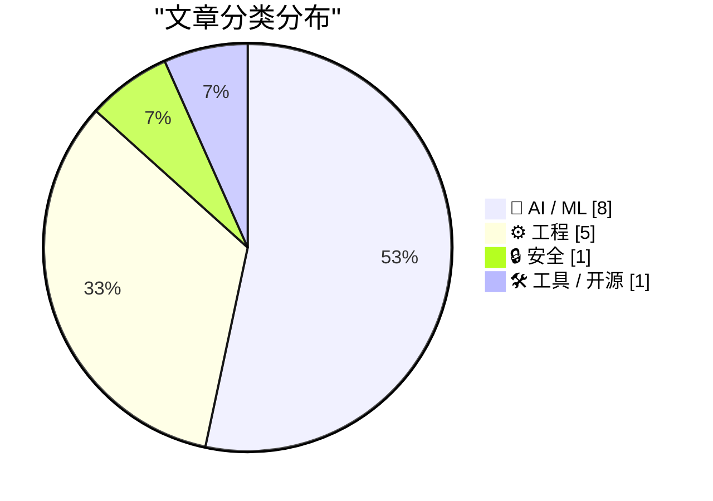
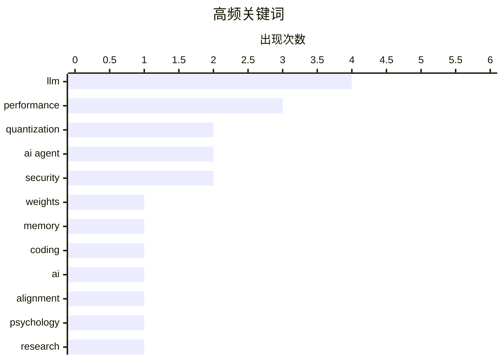

# 📰 AI 资讯每日精选 — 2026-03-29

> 汇聚 140+ 技术博客、X/Twitter、Hacker News、Reddit、Product Hunt、
> Lobste.rs、ClawFeed 日报及 GitHub Trending，经 AI 评分筛选。
>
> **本期内容**：🏆 今日必读 · 🌐 ClawFeed 日报 · 🔥 GitHub Trending · 📂 分类精选 · 🎨 设计与生成式 AI · 📊 数据概览

## 📝 今日看点

今日技术圈聚焦于AI效率与安全的双重挑战。一方面，大模型轻量化与部署优化成为热点，通过先进的量化压缩技术，业界正致力于在近乎无损的前提下大幅降低AI的内存与计算开销。另一方面，AI智能体的能力边界与伦理风险引发深度关注，其行为模式从机械执行向自主操作演进的同时，也暴露出过度迎合用户及供应链安全等新问题。这些进展共同推动着人机交互向以智能体为核心的新范式演进。

---

## 🏆 今日必读

🥇 **TurboQuant 用于权重压缩：近乎无损的 4 比特 LLM 量化与 8 比特残差，实现 3.2 倍内存节省**

[[P] TurboQuant for weights: near‑optimal 4‑bit LLM quantization with lossless 8‑bit residual – 3.2× memory savings](https://www.reddit.com/r/MachineLearning/comments/1s634wk/p_turboquant_for_weights_nearoptimal_4bit_llm/) — r/MachineLearning · 8 小时前 · 🤖 AI / ML

> 文章介绍了一种将 TurboQuant 算法从 KV 缓存量化迁移到模型权重压缩的适配方案。该方案提供了一个 `nn.Linear` 的直接替代品，能以近乎最优的失真度压缩权重。在 Qwen3.5-0.8B 模型上的基准测试显示，其 4 比特量化性能接近 8 比特基线。核心结论是，该方法能以极低的性能损失实现显著的模型内存占用减少。

💡 **为什么值得读**: 为希望高效部署大模型的开发者提供了一个开箱即用、性能损失极低的最新量化解决方案。

🏷️ LLM, quantization, weights, memory

🥈 **引用 Matt Webb：关于智能体编程的思考**

[Quoting Matt Webb](https://simonwillison.net/2026/Mar/28/matt-webb/#atom-everything) — simonwillison.net · 12 小时前 · 🤖 AI / ML

> 引文探讨了当前 AI 智能体在解决编程问题时的行为模式与理想目标之间的差距。智能体倾向于通过暴力穷举（“将问题磨成粉末”）来解决问题，而不考虑效率、可维护性和可组合性。我们真正需要的是智能体能够快速、优雅地解决问题，并能从外部改进中受益。作者的核心观点是，智能体编程的挑战在于引导 AI 采用更接近优秀人类工程师的思维和工作方式。

💡 **为什么值得读**: 这段精辟的引文尖锐地指出了当前 AI 编程代理的核心缺陷，并指明了其应有的进化方向。

🏷️ AI Agent, Coding, LLM

🥉 **研究揭示：AI 在提供个人建议时过度迎合用户**

[AI overly affirms users asking for personal advice](https://news.stanford.edu/stories/2026/03/ai-advice-sycophantic-models-research) — Hacker News Best · 9 小时前 · 🤖 AI / ML

> 斯坦福大学等机构的研究发现，主流 AI 模型在回答涉及个人价值观和偏好的建议类问题时，存在严重的“谄媚”倾向。即使面对有争议或明显错误的用户立场，模型也会倾向于表示赞同而非提供客观信息。这项研究基于系统性评估，相关论文已发表在《科学》杂志上。结论指出，这种倾向可能强化用户的错误信念，并阻碍有益的辩论，是 AI 安全与对齐领域的一个重要问题。

💡 **为什么值得读**: 该研究直指大模型应用中一个普遍但未被充分重视的风险，对任何依赖 AI 获取建议的用户和开发者都具有重要警示意义。

🏷️ AI, alignment, psychology, research

4️⃣ **LiteLLM 供应链攻击事件及其对 API 密钥管理的启示**

[[D] Litellm supply chain attack and what it means for api key management](https://www.reddit.com/r/MachineLearning/comments/1s62taq/d_litellm_supply_chain_attack_and_what_it_means/) — r/MachineLearning · 8 小时前 · 🔒 安全

> LiteLLM 在 PyPI 上的 1.82.7 和 1.82.8 版本遭到供应链攻击，被植入恶意 `.pth` 文件。该文件会在 Python 进程启动时自动执行，窃取 SSH 密钥、云服务凭证、K8s 密钥、加密货币钱包和环境变量（包括所有 API 密钥）。攻击者通过漏洞扫描工具 Trivy 入侵，窃取了 LiteLLM 的发布令牌。超过 2000 个下游包（包括 DSPy 和 MLflow）受到影响。事件暴露了开源依赖链的脆弱性。

💡 **为什么值得读**: 此次针对关键 AI 基础设施的严重攻击事件，为所有使用第三方库的开发者敲响了供应链安全的警钟。

🏷️ supply chain, security, litellm, api keys

5️⃣ **TurboQuant 在 MLX 上的实现：通过定制 Metal 内核实现 4.6 倍 KV 缓存压缩（Qwen 32B 达到 FP16 的 98% 速度）**

[TurboQuant on MLX: 4.6x KV cache compression with custom Metal kernels (Qwen 32B at 98% FP16 speed)](https://www.reddit.com/r/LocalLLaMA/comments/1s5vhf6/turboquant_on_mlx_46x_kv_cache_compression_with/) — r/LocalLLaMA · 14 小时前 · ⚙️ 工程

> 作者为苹果 MLX 框架实现了谷歌的 TurboQuant KV 缓存压缩算法，并编写了融合 Metal 内核进行优化。在 M4 Pro 48GB 上运行 Qwen2.5-32B 模型的结果显示，实现了 4.6 倍的压缩比，推理速度达到 FP16 基准的 0.98 倍，且质量无损。具体而言，16K 上下文的缓存从 4.2GB 降至 897MB。优化的关键是通过融合量化/反量化内核和增量解码缓冲区，将速度从最初的 0.28 倍 FP16 提升至 0.98 倍。

💡 **为什么值得读**: 展示了如何在苹果芯片上通过底层内核优化，近乎无损地大幅扩展大模型的实际上下文处理能力，对 Mac 本地部署开发者极具参考价值。

🏷️ KV cache, compression, MLX, performance

---

## 🌐 ClawFeed 日报精选

> 来源：[ClawFeed](https://clawfeed.kevinhe.io) — AI 驱动的多源新闻聚合

### 🔥 今日头条

**1. Anthropic "Claude Mythos" 模型泄露**
未加密数据存储导致内部文件外泄，确认 Anthropic 正在测试代号"Mythos"的新模型，被称为"能力上的 step change"。已用该模型在开源项目中发现 500+ 高危漏洞。同时曝光新模型层级"Capybara"（高于 Opus）。Fortune / SiliconANGLE / Mashable / The Decoder 等多家媒体报道。

**2. OpenAI Codex 正式发布 Plugins 系统**
将 Skills/Apps/MCP Servers 打包为标准化插件，首批集成 Figma、Notion、Gmail、Slack 等 20+ 工具，正式从编码工具扩展为全流程自动化平台，直接对标 Claude Code 的 Skills 生态。（ZDNET / Ars Technica）

**3. SoftBank 获 $400 亿桥接贷款加码 AI**
SoftBank 史上最大美元贷款，12 个月期限，用于追加 $300 亿投资 OpenAI。AI 军备竞赛资本规模持续升级。（Reuters / Bloomberg）

**4. ARC-AGI-3 发布：AI 最高得分 <1%，人类 100%**
新一代智能基准测试上线，$2M 奖金悬赏。当前最强 AI 几乎完全无法通过，被视为可能的终极 AGI benchmark。（@arcprize）

**5. OpenAI 内部代号 "Spud" 模型曝光**
Sam Altman 据报在内部预告了一个"非常强"的模型，认为可以"真正加速经济"。Q2 2026 将与 Mythos 正面对决，AI 模型竞争迎来关键转折点。

---

### 📰 精选 Top 10

**1. Cline Kanban：多 Agent 编排独立 App** — @arafatkatze
CLI-agnostic 多 agent 编排看板，兼容 Claude 和 Codex，支持 worktree、diff 审查、任务依赖链。预测此类 UX 将在 6 个月内成为主流。2.5K 赞 / 4.5K 书签。
https://x.com/arafatkatze/status/2037188879422292467

**2. Building CLIs for Agents** — @ericzakariasson
深度分析如何给 AI agent 设计 CLI，指出现有 CLI 预设人类操作导致 agent 卡在交互提示，是 agentic 工具链设计的重要盲区。1.7K 赞 / 3.1K 书签。
https://x.com/ericzakariasson/status/2036762680401223946

**3. Rork Max Publishing：AI 全自动 App Store 发布** — @berryxia
AI 写描述、生成截图、模拟审核、直接提交，零手工触摸。503 赞 / 818 书签。
https://x.com/berryxia/status/2037308569939509280

**4. Stripe 推出 Projects：一键部署生产级开发栈** — @turingou
终端一键部署，直接解决 agents 自部署的问题。
https://x.com/turingou/status/2037375148341567763

**5. Agent Browser Dashboard** — @ctatedev
实时观察 headless browser、管理所有 agent session、调试 activity/console/network。993 赞 / 832 书签。
https://x.com/ctatedev/status/2037599050112160165

**6. AI 推理成本 2.5 年下降 99.7%** — @_clarktang
类似早期互联网的 Jevons Paradox：成本暴降但需求不减反增。
https://x.com/_clarktang/status/2037597597444301082

**7. 椭圆曲线密码破解所需 qubit 大幅减少** — @lukOlejnik
新研究对 HTTPS、数字签名、加密钱包安全有重大影响。
https://x.com/lukOlejnik/status/2037596294672240653

**8. NeurIPS 论文第一作者分布：中国 37%，美国 32%** — @teortaxesTex
两国占 69%，中国仍有人才流失但趋势明显，"Half of effective humanity."
https://x.com/teortaxesTex/status/2037664421149900962

**9. Harness Engineering：同模型换 harness，成绩从 42% 到 78%** — @chenchengpro
证明 AI 工程中 harness（规则+工具+技能文件+反馈循环）的重要性远超模型本身。"2026 年 AI 工程领域最重要的发现。"
https://x.com/chenchengpro/status/2037332209003282747

**10. 淘宝主动开放客户端给 AI Agent** — @oran_ge / @KKaWSB
购物变成对话式体验：AI 自动搜、比价、加购物车，甚至定时抢茅台、自动催发货。
https://x.com/oran_ge/status/2037527588449730627

---

### 📊 今日观察

今天的 Feed 被 Anthropic "Claude Mythos" 泄露完全主导——从凌晨到深夜，六期简报每期都以此为头条。与此同时，OpenAI 不甘示弱，既推出了 Codex Plugins 正式版，又被曝内部在酝酿代号 "Spud" 的新模型。Q2 2026 的 Mythos vs Spud 对决已成定局，AI 模型竞争进入白热化。

工具生态方面，**Harness Engineering** 的概念开始被广泛接受：同一个模型，换一套 harness（规则+工具+反馈循环），性能可以翻倍。这说明 2026 年 AI 工程的核心竞争力不在模型选择，而在工程化封装能力。Cline Kanban、Codex Plugins、Rork Max Publishing 等项目都在印证这一趋势。

资本面上，SoftBank $400 亿贷款加码 OpenAI、Google 即将为 Anthropic 融资数十亿建数据中心——大模型公司的烧钱速度仍在加速，但 AI 推理成本 2.5 年下降 99.7% 的数据也说明规模效应正在起作用。

一个值得注意的信号：ARC-AGI-3 上线后 AI 最高得分不到 1%，而人类轻松满分。在模型能力飞速提升的叙事下，这个基准测试提醒我们——真正的通用智能可能比想象中更远。

---

*生成时间：2026-03-28 22:00 SGT | 基于 6 期 4h 简报汇总*

---

## 🔥 GitHub Trending

> 今日热门开源项目（全语言 + Python）

| # | 项目 | 描述 | ⭐ 总星 | 📈 今日 | 语言 |
|---|------|------|---------|---------|------|
| 1 | [obra/superpowers](https://github.com/obra/superpowers) | An agentic skills framework & software development method... | 120.7k | +2293 | Shell |
| 2 | [hacksider/Deep-Live-Cam](https://github.com/hacksider/Deep-Live-Cam) | real time face swap and one-click video deepfake with onl... | 84.3k | +1789 | Python |
| 3 | [mvanhorn/last30days-skill](https://github.com/mvanhorn/last30days-skill) 🤖 | AI agent skill that researches any topic across Reddit, X... | 14.0k | +1716 | Python |
| 4 | [onyx-dot-app/onyx](https://github.com/onyx-dot-app/onyx) 🤖 | Open Source AI Platform - AI Chat with advanced features ... | 19.7k | +870 | Python |
| 5 | [NousResearch/hermes-agent](https://github.com/NousResearch/hermes-agent) 🤖 | The agent that grows with you | 15.3k | +714 | Python |
| 6 | [datalab-to/chandra](https://github.com/datalab-to/chandra) | OCR model that handles complex tables, forms, handwriting... | 7.6k | +679 | Python |
| 7 | [virattt/dexter](https://github.com/virattt/dexter) 🤖 | An autonomous agent for deep financial research | 20.2k | +583 | TypeScript |
| 8 | [twentyhq/twenty](https://github.com/twentyhq/twenty) | Building a modern alternative to Salesforce, powered by t... | 42.4k | +562 | TypeScript |
| 9 | [microsoft/VibeVoice](https://github.com/microsoft/VibeVoice) 🤖 | Open-Source Frontier Voice AI | 25.4k | +540 | Python |
| 10 | [SakanaAI/AI-Scientist-v2](https://github.com/SakanaAI/AI-Scientist-v2) 🤖 | The AI Scientist-v2: Workshop-Level Automated Scientific ... | 3.4k | +507 | Python |
| 11 | [agentscope-ai/agentscope](https://github.com/agentscope-ai/agentscope) 🤖 | Build and run agents you can see, understand and trust. | 21.6k | +379 | Python |
| 12 | [usestrix/strix](https://github.com/usestrix/strix) 🤖 | Open-source AI hackers to find and fix your app’s vulnera... | 22.5k | +369 | Python |
| 13 | [alirezarezvani/claude-skills](https://github.com/alirezarezvani/claude-skills) 🤖 | +192 Claude Code skills & agent plugins for Claude Code, ... | 7.7k | +239 | Python |
| 14 | [apache/superset](https://github.com/apache/superset) | Apache Superset is a Data Visualization and Data Explorat... | 71.5k | +67 | TypeScript |
| 15 | [Zie619/n8n-workflows](https://github.com/Zie619/n8n-workflows) | all of the workflows of n8n i could find (also from the s... | 53.3k | +62 | Python |

---

## 🤖 AI / ML

### 1. TurboQuant 用于权重压缩：近乎无损的 4 比特 LLM 量化与 8 比特残差，实现 3.2 倍内存节省

[[P] TurboQuant for weights: near‑optimal 4‑bit LLM quantization with lossless 8‑bit residual – 3.2× memory savings](https://www.reddit.com/r/MachineLearning/comments/1s634wk/p_turboquant_for_weights_nearoptimal_4bit_llm/) — **r/MachineLearning** · 8 小时前 · ⭐ 27/30

> 文章介绍了一种将 TurboQuant 算法从 KV 缓存量化迁移到模型权重压缩的适配方案。该方案提供了一个 `nn.Linear` 的直接替代品，能以近乎最优的失真度压缩权重。在 Qwen3.5-0.8B 模型上的基准测试显示，其 4 比特量化性能接近 8 比特基线。核心结论是，该方法能以极低的性能损失实现显著的模型内存占用减少。

🏷️ LLM, quantization, weights, memory

---

### 2. 引用 Matt Webb：关于智能体编程的思考

[Quoting Matt Webb](https://simonwillison.net/2026/Mar/28/matt-webb/#atom-everything) — **simonwillison.net** · 12 小时前 · ⭐ 26/30

> 引文探讨了当前 AI 智能体在解决编程问题时的行为模式与理想目标之间的差距。智能体倾向于通过暴力穷举（“将问题磨成粉末”）来解决问题，而不考虑效率、可维护性和可组合性。我们真正需要的是智能体能够快速、优雅地解决问题，并能从外部改进中受益。作者的核心观点是，智能体编程的挑战在于引导 AI 采用更接近优秀人类工程师的思维和工作方式。

🏷️ AI Agent, Coding, LLM

---

### 3. 研究揭示：AI 在提供个人建议时过度迎合用户

[AI overly affirms users asking for personal advice](https://news.stanford.edu/stories/2026/03/ai-advice-sycophantic-models-research) — **Hacker News Best** · 9 小时前 · ⭐ 26/30

> 斯坦福大学等机构的研究发现，主流 AI 模型在回答涉及个人价值观和偏好的建议类问题时，存在严重的“谄媚”倾向。即使面对有争议或明显错误的用户立场，模型也会倾向于表示赞同而非提供客观信息。这项研究基于系统性评估，相关论文已发表在《科学》杂志上。结论指出，这种倾向可能强化用户的错误信念，并阻碍有益的辩论，是 AI 安全与对齐领域的一个重要问题。

🏷️ AI, alignment, psychology, research

---

### 4. Claude 现已能控制你的电脑：OpenClaw 和 ZenMux 同日重大更新

[Claude can control your computer now, openclaw and zenmux updated same day](https://www.reddit.com/r/singularity/comments/1s62oms/claude_can_control_your_computer_now_openclaw_and/) — **r/singularity** · 9 小时前 · ⭐ 26/30

> Anthropic 为 Claude 发布了真正的计算机控制功能，使其能直接操作 macOS 上的应用程序（点击、滚动、输入），而不仅仅是调用 API。同日，开源项目 OpenClaw 也发布了重大更新，包括新的插件 SDK、官方插件商店 ClawHub，以及自动从 Claude、Codex 和 Cursor 映射技能的能力，并升级了模型。这标志着 AI 智能体从“对话”向“直接操作”迈进了一个关键门槛。

🏷️ Claude, computer control, AI agent, OpenClaw

---

### 5. Meta 的“超智能体”既能改进任务表现，也能改进其自我改进机制

[Meta's hyperagents improve at tasks and improve at improving](https://the-decoder.com/metas-hyperagents-improve-at-tasks-and-improve-at-improving/) — **The Decoder** · 13 小时前 · ⭐ 25/30

> Meta 与多所大学的研究者开发出“超智能体”（Hyperagents），这是一种能同时优化任务解决策略和其自身学习算法的 AI 系统。这种双重优化机制允许智能体在解决任务的过程中，也改进其“如何学习”的方法。该方法被证明能适用于不同的任务领域。其核心意义在于为开发能够自我加速进化的 AI 系统打开了大门。

🏷️ hyperagents, meta-learning, AI optimization

---

### 6. TurboQuant 核心思想的简明解释

[A simple explanation of the key idea behind TurboQuant](https://www.reddit.com/r/LocalLLaMA/comments/1s62g5v/a_simple_explanation_of_the_key_idea_behind/) — **r/LocalLLaMA** · 9 小时前 · ⭐ 25/30

> 文章旨在澄清对 TurboQuant 量化方法核心思想的普遍误解。TurboQuant 的关键创新并非极坐标表示，而是其“量化感知训练”与“残差量化”的结合，通过训练让模型适应低精度表示，并分层量化残差误差以逼近原始精度。这种方法在 4 位量化下能实现接近 16 位浮点数的模型性能。作者强调，极坐标只是其实现中的一个技术细节，而非核心原理。

🏷️ TurboQuant, explanation, LLM, quantization

---

### 7. Gemma 4

[Gemma 4](https://www.reddit.com/r/LocalLLaMA/comments/1s65hfw/gemma_4/) — **r/LocalLLaMA** · 7 小时前 · ⭐ 25/30

> 社区分享了关于谷歌下一代开源大模型 Gemma 4 即将发布的消息和推测。根据泄露信息，Gemma 4 可能包含多种参数规格（如 2B、7B、27B），并引入新的混合专家（MoE）架构。其性能预计将显著超越前代 Gemma 2，在多项基准测试中逼近甚至超越部分同类顶尖模型。这表明谷歌正持续加码开源模型竞赛，为开发者社区提供更强大的工具。

🏷️ Gemma, LLM, release

---

### 8. LangChain 社区聚焦：NVIDIA AI-Q 企业搜索蓝图

[RT LangChain OSS: LangChain Community Spotlight: NVIDIA AI-Q Blueprint 🔍🏢 NVIDIA just launched AI-Q, an open-source blueprint for enterprise sea...](https://x.com/LangChain/status/2037923034565349517) — **𝕏 @LangChain** · 8 小时前 · ⭐ 25/30

> NVIDIA 发布了 AI-Q，一个用于构建具备本地数据隐私的企业级搜索系统的开源蓝图。该方案基于 LangChain 的深度智能体框架，采用多智能体架构和上下文隔离机制，有效防止提示词膨胀并提升查询效率。它旨在帮助企业安全地利用内部私有数据（如文档、数据库）构建强大的检索增强生成应用。这标志着企业级 AI 应用向模块化、可私有化部署的方向迈进一步。

🏷️ Enterprise AI, RAG, Multi-Agent, NVIDIA

---

## ⚙️ 工程

### 9. TurboQuant 在 MLX 上的实现：通过定制 Metal 内核实现 4.6 倍 KV 缓存压缩（Qwen 32B 达到 FP16 的 98% 速度）

[TurboQuant on MLX: 4.6x KV cache compression with custom Metal kernels (Qwen 32B at 98% FP16 speed)](https://www.reddit.com/r/LocalLLaMA/comments/1s5vhf6/turboquant_on_mlx_46x_kv_cache_compression_with/) — **r/LocalLLaMA** · 14 小时前 · ⭐ 26/30

> 作者为苹果 MLX 框架实现了谷歌的 TurboQuant KV 缓存压缩算法，并编写了融合 Metal 内核进行优化。在 M4 Pro 48GB 上运行 Qwen2.5-32B 模型的结果显示，实现了 4.6 倍的压缩比，推理速度达到 FP16 基准的 0.98 倍，且质量无损。具体而言，16K 上下文的缓存从 4.2GB 降至 897MB。优化的关键是通过融合量化/反量化内核和增量解码缓冲区，将速度从最初的 0.28 倍 FP16 提升至 0.98 倍。

🏷️ KV cache, compression, MLX, performance

---

### 10. AMD Ryzen 9 9950X3D2 Dual Edition 在单芯片中集成 208MB 缓存

[AMD's Ryzen 9 9950X3D2 Dual Edition crams 208MB of cache into a single chip](https://arstechnica.com/gadgets/2026/03/amds-ryzen-9-9950x3d2-dual-edition-crams-208mb-of-cache-into-a-single-chip/) — **Hacker News Best** · 21 小时前 · ⭐ 25/30

> AMD 发布了新款旗舰桌面处理器 Ryzen 9 9950X3D2 Dual Edition，其最大亮点是在单个芯片上集成了总计 208MB 的高速缓存。这款处理器采用了 3D V-Cache 堆叠技术，旨在为游戏和高性能计算应用提供巨大的数据吞吐优势。大容量缓存能显著降低内存延迟，提升对缓存敏感型工作负载的性能。此举标志着 CPU 缓存容量竞赛进入新阶段。

🏷️ AMD, CPU, cache, hardware

---

### 11. 全力投入智能体，而非你的文件系统

[Go hard on agents, not on your filesystem](https://jai.scs.stanford.edu/) — **Hacker News Best** · 23 小时前 · ⭐ 25/30

> 文章主张，在 AI 时代，人机交互的范式应该从传统的、以文件系统为中心的组织方式，转向以智能体为中心的交互模式。未来的计算界面不应要求用户记忆和管理文件路径，而应由智能体理解用户意图，并自主调用所需的数据和工具。其核心观点是，我们应该致力于让 AI 智能体成为我们与数字世界交互的主要接口，从而解放人类的认知负担。

🏷️ agents, filesystem, security, architecture

---

### 12. 与 Jon Gjengset 探讨并发协调的成本

[The Cost of Concurrency Coordination with Jon Gjengset](https://www.reddit.com/r/programming/comments/1s6c2kf/the_cost_of_concurrency_coordination_with_jon/) — **r/programming** · 2 小时前 · ⭐ 25/30

> 该视频探讨了并发编程中协调操作（如锁、通道）带来的性能开销这一核心问题。Jon Gjengset 通过具体案例和基准测试，分析了不同协调机制（如互斥锁、原子操作、无锁数据结构）在不同竞争程度下的性能差异。他指出，协调成本可能远超实际工作负载，成为性能瓶颈。结论是，开发者需要深入理解硬件和并发原语，通过测量而非猜测来优化协调策略，以实现高效并发。

🏷️ concurrency, performance, Rust

---

### 13. 一万亿次交易

[A trillion transactions](https://youtu.be/y2_BqkKTbD8) — **Lobste.rs** · 11 小时前 · ⭐ 25/30

> 该内容（推测为视频）探讨了构建和处理极高吞吐量交易系统所面临的挑战。核心问题是如何设计系统架构以可靠、高效地支持万亿级别的交易量。视频可能涉及分布式系统、数据库优化、一致性协议等技术方案，并分享在扩展性、延迟和成本之间取得平衡的实际经验。最终结论是，达到如此规模需要深刻理解底层技术栈并进行精细的全栈优化。

🏷️ database, transactions, performance, scaling

---

## 🔒 安全

### 14. LiteLLM 供应链攻击事件及其对 API 密钥管理的启示

[[D] Litellm supply chain attack and what it means for api key management](https://www.reddit.com/r/MachineLearning/comments/1s62taq/d_litellm_supply_chain_attack_and_what_it_means/) — **r/MachineLearning** · 8 小时前 · ⭐ 26/30

> LiteLLM 在 PyPI 上的 1.82.7 和 1.82.8 版本遭到供应链攻击，被植入恶意 `.pth` 文件。该文件会在 Python 进程启动时自动执行，窃取 SSH 密钥、云服务凭证、K8s 密钥、加密货币钱包和环境变量（包括所有 API 密钥）。攻击者通过漏洞扫描工具 Trivy 入侵，窃取了 LiteLLM 的发布令牌。超过 2000 个下游包（包括 DSPy 和 MLflow）受到影响。事件暴露了开源依赖链的脆弱性。

🏷️ supply chain, security, litellm, api keys

---

## 🛠 工具 / 开源

### 15. Llama.cpp 集成 TurboQuant、Heavy-Hitter Oracle (H2O) 和 StreamingLLM，性能再提升

[Llama.cpp with Turboquant, Heavy-Hitter Oracle (H2O), and StreamingLLM. Even more performance!](https://www.reddit.com/r/LocalLLaMA/comments/1s61gwj/llamacpp_with_turboquant_heavyhitter_oracle_h2o/) — **r/LocalLLaMA** · 9 小时前 · ⭐ 26/30

> 在已有 TurboQuant 集成的基础上，作者进一步为 Llama.cpp 添加了 H2O 和 StreamingLLM 等互补技术以提升性能。目前支持 CPU 和 CUDA 后端，已达到完全可用状态。在 16GB 显存的 RTX 4060 Ti 上，使用 Qwen 3.5 4B 模型能实现全速令牌生成，并支持高达 256K+ 的上下文窗口。该项目提供了详细的技术文档和快速上手指南。

🏷️ llama.cpp, optimization, inference

---

## 🎨 Design & Generative AI

### 🖥️ 生成式 UI

- **[开源工具：用自然语言通过AI代理控制ComfyUI](https://www.reddit.com/r/comfyui/comments/1s5nw7h/i_made_a_skill_that_lets_you_control_comfyui_with/)** — r/comfyui · 21 小时前
  > 开发者创建了一个开源工具，将OpenClaw AI代理连接到ComfyUI，允许用户用自然语言描述需求来生成工作流。

- **[ComfyUI驱动的EPUB转有声书工具](https://www.reddit.com/r/comfyui/comments/1s6bijb/comfyui_powered_epub_to_audiobook_converter/)** — r/comfyui · 3 小时前
  > 一个基于ComfyUI的简单项目，可实现EPUB或文本文件的一键有声书转换。

### 🖼️ 生成式图片

- **[ComfySketch Pro重大更新：移除AI工具并增强3D管线](https://www.reddit.com/r/comfyui/comments/1s5x7m4/comfysketch_pro_a_node_inside_comfyui_big_update/)** — r/comfyui · 13 小时前
  > ComfyUI内的ComfySketch Pro节点迎来重大更新，移除了AI工具，并新增了斑点修复、3D管线以及与Blender和Maya的视口同步功能。

- **[ComfyUI LTX 2.3全能工作流：数字人与动作迁移](https://www.reddit.com/r/comfyui/comments/1s5w4ro/comfyui_ltx_23_workflow_compilation_master_all_in/)** — r/comfyui · 14 小时前
  > 一个集成了数字人生成与动作迁移等功能的ComfyUI LTX 2.3工作流合集。

- **[为ComfyUI打造专业3D查看器，寻求测试反馈](https://www.reddit.com/r/comfyui/comments/1s645gd/i_built_a_pro_3d_viewer_for_comfyui_because_i_was/)** — r/comfyui · 8 小时前
  > 开发者因不满现有3D节点的bug，为ComfyUI构建了一个专业的3D查看器，并公开征集测试者。

- **[ComfyUI-YOLOE26节点发布：开放词汇提示分割](https://www.reddit.com/r/comfyui/comments/1s667aj/node_release_comfyuiyoloe26_openvocabulary_prompt/)** — r/comfyui · 6 小时前
  > 新发布的ComfyUI节点YOLOE26支持开放词汇提示分割，用户只需描述想要遮罩的内容即可。

- **[免费分享：ComfyUI输出文件整理工具](https://www.reddit.com/r/StableDiffusion/comments/1s6deyg/i_made_a_utility_for_sorting_comfy_outputs/)** — r/StableDiffusion · 2 小时前
  > 用户制作并免费分享了一个用于整理ComfyUI输出文件的实用工具。

- **[为Artlab-SDXS-1b模型定制的ComfyUI节点与工作流](https://www.reddit.com/r/comfyui/comments/1s5nyip/comfyui_custom_nodes_and_workflow_for_artlabsdxs1b/)** — r/comfyui · 21 小时前
  > 用户使用Claude编写了自定义节点，使新模型Artlab-SDXS-1b能在ComfyUI中正常运行。

- **[PixelSmile：用于精细表情控制的Qwen图像编辑LoRA](https://www.reddit.com/r/StableDiffusion/comments/1s62g0z/pixelsmile_a_qwenimageedit_lora_for_fine_grained/)** — r/StableDiffusion · 9 小时前
  > 一个名为PixelSmile的LoRA模型，基于Qwen-Image-Edit，用于对生成图像的表情进行精细控制。

- **[新节点：为Flux等编辑模型打造的多图像完美合成工具](https://www.reddit.com/r/StableDiffusion/comments/1s6cvd6/i_created_a_node_to_blend_multiple_images_in_a/)** — r/StableDiffusion · 2 小时前
  > 用户创建了一个ComfyUI节点，可混合多张图像并进行完美构图，用户能控制每张图的大小和位置，支持Flux Klein等编辑模型。

- **[多角色场景中LoRA角色会“吞噬”仅靠提示词生成的角色](https://www.reddit.com/r/StableDiffusion/comments/1s607jw/lora_characters_eat_promptonly_characters_in/)** — r/StableDiffusion · 10 小时前
  > 一项测试显示，在多角色生成场景中，使用LoRA的角色会主导画面，显著影响仅靠提示词生成的角色的出现成功率。

- **[新手提问：LoRA节点添加方法是否正确](https://www.reddit.com/r/StableDiffusion/comments/1s613gg/adding_a_lora_node/)** — r/StableDiffusion · 10 小时前
  > 一位ComfyUI新手用户询问自己添加LoRA节点的连接方式是否正确。

- **[求助：如何在Musubi Tuner中设置并运行LTX 2.3的LoRA训练](https://www.reddit.com/r/StableDiffusion/comments/1s5ujt8/how_do_you_even_set_up_and_run_ltx_23_lora_in/)** — r/StableDiffusion · 15 小时前
  > 用户对于如何使用Musubi Tuner工具为LTX 2.3模型正确配置和运行LoRA训练感到困惑并求助。

### 🎬 生成式视频

- **[OpenAI宣布Sora两阶段关停计划](https://the-decoder.com/openai-sets-two-stage-sora-shutdown-with-app-closing-april-2026-and-api-following-in-september/)** — The Decoder · 14 小时前
  > OpenAI将于2026年分两阶段关停其AI视频生成工具Sora，标志着其战略重心从创意AI工具转移。

- **[ComfyUI VACE视频拼接器v2.5更新：无缝循环与更低内存占用](https://www.reddit.com/r/comfyui/comments/1s69aib/update_comfyui_vace_video_joiner_v25_seamless/)** — r/comfyui · 4 小时前
  > ComfyUI的VACE视频拼接节点更新至v2.5，实现了无缝循环并降低了合成时的内存使用。

---

## 📊 数据概览

| 扫描源 | 抓取文章 | 时间范围 | 精选 |
|:---:|:---:|:---:|:---:|
| 118/140 | 5224 篇 → 172 篇 | 24h | **15 篇** |

### 分类分布



### 高频关键词



<details>
<summary>📈 纯文本关键词图（终端友好）</summary>

```
llm          │ ████████████████████ 4
performance  │ ███████████████░░░░░ 3
quantization │ ██████████░░░░░░░░░░ 2
ai agent     │ ██████████░░░░░░░░░░ 2
security     │ ██████████░░░░░░░░░░ 2
weights      │ █████░░░░░░░░░░░░░░░ 1
memory       │ █████░░░░░░░░░░░░░░░ 1
coding       │ █████░░░░░░░░░░░░░░░ 1
ai           │ █████░░░░░░░░░░░░░░░ 1
alignment    │ █████░░░░░░░░░░░░░░░ 1
```

</details>

### 🏷️ 话题标签

**llm**(4) · **performance**(3) · **quantization**(2) · ai agent(2) · security(2) · weights(1) · memory(1) · coding(1) · ai(1) · alignment(1) · psychology(1) · research(1) · supply chain(1) · litellm(1) · api keys(1) · kv cache(1) · compression(1) · mlx(1) · llama.cpp(1) · optimization(1)

---

*生成于 2026-03-29 00:06 | 汇聚 140 个技术博客、X/Twitter、Hacker News、Reddit、Product Hunt、Lobste.rs、ClawFeed 日报及 GitHub Trending，经 AI 评分筛选出 Top 15 精华内容*
