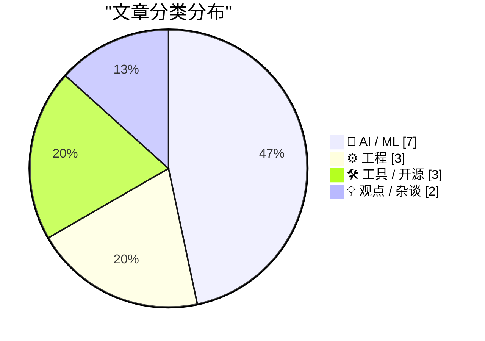
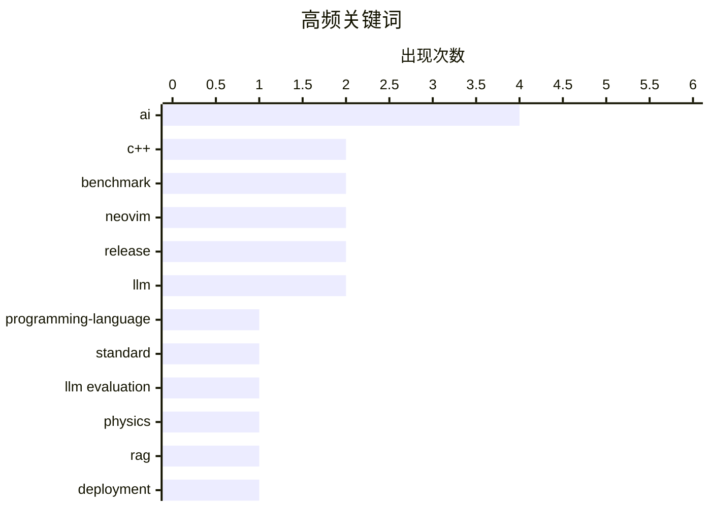

# 📰 AI 资讯每日精选 — 2026-03-30

> 汇聚 140+ 技术博客、X/Twitter、Hacker News、Reddit、Product Hunt、
> Lobste.rs、ClawFeed 日报及 GitHub Trending，经 AI 评分筛选。
>
> **本期内容**：🏆 今日必读 · 🌐 ClawFeed 日报 · 🔥 GitHub Trending · 📂 分类精选 · 🎨 设计与生成式 AI · 📊 数据概览

## 📝 今日看点

今日技术圈聚焦于AI应用的深化与风险并存。一方面，大模型的能力评估与优化成为热点，从构建物理基准测试到在严苛行业中部署RAG系统，显示出业界正致力于提升AI的可靠性与实用性。另一方面，AI伦理与安全警钟再次敲响，人脸识别技术的误用案例和对抗AI爬虫工具的出现，凸显了技术滥用与防御的新战场。同时，基础工具与语言持续演进，如Neovim发布重要更新和C++26标准定稿，为开发者提供了更强大的底层支持。

---

## 🏆 今日必读

🥇 **C++26 定稿！—— 2026年3月ISO C++标准会议（英国伦敦克罗伊登）参会报告**

[C++26 is done! — Trip report: March 2026 ISO C++ standards meeting (London Croydon, UK)](https://herbsutter.com/2026/03/29/c26-is-done-trip-report-march-2026-iso-c-standards-meeting-london-croydon-uk/) — Lobste.rs · 1 小时前 · ⚙️ 工程

> C++26 标准已在 2026 年 3 月的 ISO C++ 会议上完成并定稿。本次会议批准了多项新特性，标志着该版本正式进入发布流程。核心内容包括对现有提案的最终确认和整合。C++26 将成为 C++ 语言发展的下一个重要里程碑。

💡 **为什么值得读**: 对于关注 C++ 语言前沿发展的开发者，这是了解下一个官方标准核心内容和未来技术路线图的第一手权威报告。

🏷️ C++, programming-language, standard

🥈 **[研究] 我构建了一个能抓住大语言模型违反物理定律的基准测试**

[[R] I built a benchmark that catches LLMs breaking physics laws](https://www.reddit.com/r/MachineLearning/comments/1s6keh0/r_i_built_a_benchmark_that_catches_llms_breaking/) — r/MachineLearning · 20 小时前 · 🤖 AI / ML

> 针对大语言模型（LLM）在物理问题上经常自信地给出错误答案的现象，作者构建了一个对抗性基准测试。该测试覆盖了 28 个物理定律（如欧姆定律、牛顿定律），通过生成包含认知偏误陷阱（如锚定偏差、单位混淆）的问题来挑战模型。评估完全基于符号数学（SymPy + Pint）进行客观评分，避免了使用 LLM 作为评判者。结果表明，当前主流 LLM 在基础物理推理上存在系统性缺陷。

💡 **为什么值得读**: 它提供了一个客观、可复现的框架，揭示了 LLM 在科学推理上的根本性弱点，对评估和改进模型的逻辑一致性至关重要。

🏷️ LLM evaluation, physics, benchmark

🥉 **为受监管行业部署 RAG 机器人的经验教训**

[Lessons from deploying RAG bots for regulated industries](https://www.reddit.com/r/LocalLLaMA/comments/1s6oiuq/lessons_from_deploying_rag_bots_for_regulated/) — r/LocalLLaMA · 16 小时前 · 🤖 AI / ML

> 文章分享了在澳大利亚建筑、养老和采矿等受严格监管的行业部署 RAG（检索增强生成）AI 助手的实战经验。关键发现是，查询扩展（使用 Haiku 模型为每个查询生成 4 种不同表述）比单纯优化文本块大小对检索效果提升更大。在合规场景下，必须严格实施引用溯源和事实核查，因为“看似合理但错误”的回答风险极高。部署成功依赖于将 AI 输出无缝集成到现有工作流中，而非完全取代人工。

💡 **为什么值得读**: 这些来自真实、高要求生产环境的经验教训，为任何计划在企业或合规场景中落地 RAG 的团队提供了宝贵的避坑指南和优先级参考。

🏷️ RAG, deployment, compliance, lessons

4️⃣ **Neovim 0.12.0 发布**

[Neovim 0.12.0](https://github.com/neovim/neovim/releases/tag/v0.12.0) — Lobste.rs · 6 小时前 · 🛠 工具 / 开源

> Neovim 0.12.0 版本正式发布。此版本是继 0.11.0 之后的一个重要更新，包含多项新特性、性能改进和错误修复。具体更新内容需参考完整的发布说明。它标志着这款现代 Vim 分支的持续演进。

💡 **为什么值得读**: 对于 Neovim 用户和插件开发者来说，这是获取最新功能、了解 API 变化和确保兼容性的必读文档。

🏷️ Neovim, text editor, release

5️⃣ **Neovim 0.12.0**

[Neovim 0.12.0](https://github.com/neovim/neovim/releases/tag/v0.12.0) — Hacker News Best · 6 小时前 · 🛠 工具 / 开源

> Neovim 0.12.0 版本正式发布。此版本是继 0.11.0 之后的一个重要更新，包含多项新特性、性能改进和错误修复。具体更新内容需参考完整的发布说明。它标志着这款现代 Vim 分支的持续演进。

💡 **为什么值得读**: 对于 Neovim 用户和插件开发者来说，这是获取最新功能、了解 API 变化和确保兼容性的必读文档。

🏷️ Neovim, release, editor

---

## 🌐 ClawFeed 日报精选

> 来源：[ClawFeed](https://clawfeed.kevinhe.io) — AI 驱动的多源新闻聚合

### 🔥 今日头条

### 1. Anthropic Claude Mythos 泄露 — AI 能力跃迁
内部代号 "Capybara"，据传 10 万亿参数，位于 Opus 系列之上。测试分数 "dramatically higher"，具备超强推理和网络安全能力（已发现 500+ 高危开源漏洞）。泄露源于未加密的公开数据库配置错误。Anthropic 确认真实但因安全顾虑计划缓慢发布。同时还泄露了 Claude Operon（专为科研打造的独立模式）。
来源：Fortune / The Decoder / Mashable / Reddit

### 2. OpenAI 关停 Sora，字节 Seedance 2.0 接棒
OpenAI 视频生成工具 Sora 上线仅 15 个月宣布停服（App 4/26、API 9/24 下线），与 Disney 10 亿美元合作随之取消，战略转向编码和企业产品。同日 ByteDance Seedance 2.0 通过 CapCut 全球上线，被评为接近好莱坞质量，AI 视频生成赛道格局大变。
来源：BBC / CNN / TechCrunch

### 3. xAI 11 位联合创始人全部离职
最后一位 Ross Nordeen 本周离职，$250B 估值公司只剩 Elon 一人。包括 Adam 优化器作者 Jimmy Ba、DeepMind 首席工程师 Igor Babuschkin 等重量级人物。
来源：SemiAnalysis / TechCrunch

### 4. Google TurboQuant — LLM 推理内存瓶颈可能被解决
新压缩算法将 KV cache 压缩至 3-4 bits，无需重训练，16GB RAM 设备运行大模型不再是梦。被称为"现实版 Pied Piper"，引发内存芯片股分化。
来源：Google Research / Bloomberg

### 5. OpenAI Codex 插件系统 + Cline Kanban 发布
Codex 支持 Slack、Notion、Figma、Gmail 等 20+ 集成，从编码工具扩展为工作流自动化平台。同日 Cline Kanban 开源发布，支持多 Agent 并行编排（Claude Code、Codex 等），每任务独立 worktree + terminal。
来源：Ars Technica / ZDNET / cline.ghost.io

---

### 📰 精选 Top 10

1. **@_chenglou — 30 年来首个杂志式网页排版引擎** React 核心贡献者发布重大 UI 引擎，文字绕图流动、多栏分布、120 帧丝滑，被多位大佬转发
   https://x.com/_chenglou

2. **@emollick — "维多利亚时代 LLM"** 完全用 28,000+ 部 1837-1899 英国文献训练，效果与现代 LLM 角色扮演维多利亚人完全不同，有趣的研究方向
   https://x.com/emollick/status/2038084424810537215

3. **@arafatkatze — 预测 Cline Kanban 多 Agent 编排将成主流** 2.5K likes, 4.5K bookmarks, 640K views，称 6 个月内将超越所有其他 Agentic UX
   https://x.com/arafatkatze/status/2037188879422292467

4. **@tuturetom — 大厂争相开源 Agent 基础设施的底层逻辑** "不开源就不会被训练进基座模型，不会被 Agent 感知，不会被默认使用。不是要开源，是不得不"
   https://x.com/tuturetom/status/2037839265527177235

5. **@ericzakariasson — 为 Agent 构建 CLI 的设计原则** 1.7K likes, 471K views，当 Agent 用 CLI 时会卡在交互式提示或帮助页面，需要重新思考 CLI 设计
   https://x.com/ericzakariasson/status/2036762680401223946

6. **@omarsar0 — NVIDIA 研究：端到端 RL 训练 Agent 太贵** 提出更实用的 post-training 方案降低长程 agentic 任务成本
   https://x.com/omarsar0/status/2038015536253272145

7. **@berryxia — Rork Max Publishing App Store 全自动发布** AI 写描述、生成截图、模拟审核、直接提交，零触摸完成。509 likes, 821 bookmarks
   https://x.com/berryxia/status/2037308569939509280

8. **@xxx111god — Superpowers vs Compound Engineering 深度对比** CE 能把踩过的坑 compound 成所有 session 的经验，157 likes, 313 bookmarks
   https://x.com/xxx111god/status/2038093217782997144

9. **@berryxia — 体育数据 Polymarket 套利** 实时提取足球数据比直播快 8 秒，AI 自动下单，31K views
   https://x.com/berryxia/status/2038027543316664816

10. **@lifesinger — 图解 Manus vs OpenClaw vs Agentic AI** 分析为什么 Manus 像上一代产品、OpenClaw 为什么火
    https://x.com/lifesinger/status/2037933438188102022

---

### 📊 今日观察

今天是 AI 领域的"爆炸日"。Anthropic Claude Mythos 的意外泄露成为全网焦点，10 万亿参数的传闻让所有人重新审视 AI 能力上限。与此同时，OpenAI 关停 Sora 而字节 Seedance 2.0 同日上线，AI 视频赛道完成了一次戏剧性的权力交接。

Agent 生态继续高速发展：Cline Kanban 的发布标志着多 Agent 编排从概念走向可用产品，OpenAI Codex 插件系统则将编码工具升级为全面工作流平台。一个清晰的趋势是——**大厂被迫开源 Agent 基础设施**，因为不被训练进基座模型就等于不存在。

xAI 11/11 联合创始人全部离职是一个值得警惕的信号。Google TurboQuant 可能从根本上改变 LLM 推理的硬件门槛。BTC 恐惧贪婪指数跌至 9，连续 70 天恐惧，宏观情绪仍然悲观。

今日关键词：**泄露、退场、开源、编排、压缩**

---

*由 ClawFeed 自动生成 | 数据来源：6 期 4h 简报 (00:41 - 20:41 SGT)*

---

## 🔥 GitHub Trending

> 今日热门开源项目（全语言 + Python）

| # | 项目 | 描述 | ⭐ 总星 | 📈 今日 | 语言 |
|---|------|------|---------|---------|------|
| 1 | [obra/superpowers](https://github.com/obra/superpowers) | An agentic skills framework & software development method... | 122.8k | +2230 | Shell |
| 2 | [mvanhorn/last30days-skill](https://github.com/mvanhorn/last30days-skill) 🤖 | AI agent skill that researches any topic across Reddit, X... | 15.3k | +1308 | Python |
| 3 | [luongnv89/claude-howto](https://github.com/luongnv89/claude-howto) 🤖 | A visual, example-driven guide to Claude Code — from basi... | 6.5k | +1165 | Python |
| 4 | [hacksider/Deep-Live-Cam](https://github.com/hacksider/Deep-Live-Cam) | real time face swap and one-click video deepfake with onl... | 85.2k | +1132 | Python |
| 5 | [microsoft/VibeVoice](https://github.com/microsoft/VibeVoice) 🤖 | Open-Source Frontier Voice AI | 27.1k | +1056 | Python |
| 6 | [shareAI-lab/learn-claude-code](https://github.com/shareAI-lab/learn-claude-code) 🤖 | Bash is all you need - A nano claude code–like 「agent har... | 42.6k | +919 | TypeScript |
| 7 | [NousResearch/hermes-agent](https://github.com/NousResearch/hermes-agent) 🤖 | The agent that grows with you | 16.7k | +917 | Python |
| 8 | [SakanaAI/AI-Scientist-v2](https://github.com/SakanaAI/AI-Scientist-v2) 🤖 | The AI Scientist-v2: Workshop-Level Automated Scientific ... | 3.8k | +519 | Python |
| 9 | [agentscope-ai/agentscope](https://github.com/agentscope-ai/agentscope) 🤖 | Build and run agents you can see, understand and trust. | 22.0k | +515 | Python |
| 10 | [onyx-dot-app/onyx](https://github.com/onyx-dot-app/onyx) 🤖 | Open Source AI Platform - AI Chat with advanced features ... | 20.1k | +493 | Python |
| 11 | [twentyhq/twenty](https://github.com/twentyhq/twenty) | Building a modern alternative to Salesforce, powered by t... | 42.9k | +447 | TypeScript |
| 12 | [Z4nzu/hackingtool](https://github.com/Z4nzu/hackingtool) | ALL IN ONE Hacking Tool For Hackers | 56.2k | +377 | Python |
| 13 | [thedotmack/claude-mem](https://github.com/thedotmack/claude-mem) 🤖 | A Claude Code plugin that automatically captures everythi... | 42.6k | +373 | TypeScript |
| 14 | [alirezarezvani/claude-skills](https://github.com/alirezarezvani/claude-skills) 🤖 | +192 Claude Code skills & agent plugins for Claude Code, ... | 7.9k | +250 | Python |
| 15 | [moeru-ai/airi](https://github.com/moeru-ai/airi) 🤖 | 💖🧸 Self hosted, you-owned Grok Companion, a container o... | 36.3k | +224 | TypeScript |

---

## 🤖 AI / ML

### 1. [研究] 我构建了一个能抓住大语言模型违反物理定律的基准测试

[[R] I built a benchmark that catches LLMs breaking physics laws](https://www.reddit.com/r/MachineLearning/comments/1s6keh0/r_i_built_a_benchmark_that_catches_llms_breaking/) — **r/MachineLearning** · 20 小时前 · ⭐ 25/30

> 针对大语言模型（LLM）在物理问题上经常自信地给出错误答案的现象，作者构建了一个对抗性基准测试。该测试覆盖了 28 个物理定律（如欧姆定律、牛顿定律），通过生成包含认知偏误陷阱（如锚定偏差、单位混淆）的问题来挑战模型。评估完全基于符号数学（SymPy + Pint）进行客观评分，避免了使用 LLM 作为评判者。结果表明，当前主流 LLM 在基础物理推理上存在系统性缺陷。

🏷️ LLM evaluation, physics, benchmark

---

### 2. 为受监管行业部署 RAG 机器人的经验教训

[Lessons from deploying RAG bots for regulated industries](https://www.reddit.com/r/LocalLLaMA/comments/1s6oiuq/lessons_from_deploying_rag_bots_for_regulated/) — **r/LocalLLaMA** · 16 小时前 · ⭐ 25/30

> 文章分享了在澳大利亚建筑、养老和采矿等受严格监管的行业部署 RAG（检索增强生成）AI 助手的实战经验。关键发现是，查询扩展（使用 Haiku 模型为每个查询生成 4 种不同表述）比单纯优化文本块大小对检索效果提升更大。在合规场景下，必须严格实施引用溯源和事实核查，因为“看似合理但错误”的回答风险极高。部署成功依赖于将 AI 输出无缝集成到现有工作流中，而非完全取代人工。

🏷️ RAG, deployment, compliance, lessons

---

### 3. 警方使用 AI 人脸识别技术，错误逮捕田纳西州女子，指控其在北达科他州犯罪

[Police used AI facial recognition to wrongly arrest TN woman for crimes in ND](https://www.cnn.com/2026/03/29/us/angela-lipps-ai-facial-recognition) — **Hacker News Best** · 9 小时前 · ⭐ 24/30

> 美国一名田纳西州女子安吉拉·利普斯因 AI 人脸识别系统的错误匹配，被警方逮捕并指控其在北达科他州犯下罪行。此案揭示了执法部门使用人脸识别技术存在的严重风险，即系统可能产生虚假匹配，导致无辜者被拘捕。该事件引发了公众对 AI 监控技术准确性、偏见及缺乏监管的广泛担忧。

🏷️ AI, facial recognition, bias, law enforcement

---

### 4. MicroGPT：用 200 行纯 Python 代码从零构建 GPT

[MicroGPT: Build GPT From Scratch in 200 Lines of Pure Python](https://www.reddit.com/r/programming/comments/1s7a3x0/microgpt_build_gpt_from_scratch_in_200_lines_of/) — **r/programming** · 55 分钟前 · ⭐ 24/30

> MicroGPT 是一个极简教学项目，仅用约 200 行纯 Python 代码实现了 GPT（生成式预训练变换器）模型的核心架构。它包含了 Transformer 解码器、自注意力机制和前馈网络等关键组件。该项目旨在剥离复杂的工程细节，专注于展示 GPT 工作原理的本质。通过此代码，学习者可以直观理解语言模型如何生成文本。

🏷️ GPT, tutorial, Python

---

### 5. 首个BDH架构中赫布式快速权重写回机制的开源实现

[[R] First open-source implementation of Hebbian fast-weight write-back for the BDH architecture](https://www.reddit.com/r/MachineLearning/comments/1s6nxd4/r_first_opensource_implementation_of_hebbian/) — **r/MachineLearning** · 17 小时前 · ⭐ 24/30

> 论文arXiv:2509.26507提出的BDH架构包含一种在推理过程中更新模型权重的赫布式突触可塑性机制，但其官方代码仅计算协同激活乘积后便丢弃，关键的权重写回功能从未公开实现。作者填补了这一空白，实现了该机制。该模型在推理时利用稀疏激活码作为地址，重写自身的解码器权重，且同一标记无论位置如何都会产生相同的激活码。这是该核心功能的首个开源实现。

🏷️ neural networks, Hebbian learning, open source

---

### 6. 我为一种低资源语言从头训练了语言模型，并使其在Android设备上完全本地运行（无GPU，附演示）

[I trained a language model from scratch for a low-resource language and got it running fully on-device on Android (no GPU, demo)](https://www.reddit.com/r/LocalLLaMA/comments/1s74rc7/i_trained_a_language_model_from_scratch_for_a/) — **r/LocalLLaMA** · 4 小时前 · ⭐ 24/30

> 作者针对一种低资源语言，成功从头开始训练了一个语言模型。该模型最大的亮点是能够在Android设备上完全本地运行，且无需依赖GPU进行加速。项目包含了实际运行的演示，证明了在资源受限的移动端部署定制化语言模型的可行性。这项工作为保护和推广低资源语言提供了实用的技术路径。

🏷️ low-resource, on-device, Android, training

---

### 7. 斯坦福医学院主任：大语言模型是“超级猜测者”

[Stanford Chair of Medicine: LLMs Are Superhuman Guessers](https://www.reddit.com/r/singularity/comments/1s6p6iy/stanford_chair_of_medicine_llms_are_superhuman/) — **r/singularity** · 16 小时前 · ⭐ 24/30

> 一项由李飞飞等人参与的斯坦福研究发现，大语言模型在仅凭文本提示猜测图像内容以解答问题时，表现出了超越人类专家的能力。在需要图像解决但未实际给图的任务中，LLMs的平均表现比放射科医生高出10%。更令人惊讶的是，即使在模型发布（Qwen 2.5）7个月后才公开的数据集ReXVQA上，LLMs也能通过“猜测”取得良好成绩。斯坦福医学院主任据此称LLMs为“超级猜测者”。这项研究揭示了LLMs通过提示进行上下文推理和模式补全的强大潜力。

🏷️ LLM, medical AI, benchmark

---

## ⚙️ 工程

### 8. C++26 定稿！—— 2026年3月ISO C++标准会议（英国伦敦克罗伊登）参会报告

[C++26 is done! — Trip report: March 2026 ISO C++ standards meeting (London Croydon, UK)](https://herbsutter.com/2026/03/29/c26-is-done-trip-report-march-2026-iso-c-standards-meeting-london-croydon-uk/) — **Lobste.rs** · 1 小时前 · ⭐ 26/30

> C++26 标准已在 2026 年 3 月的 ISO C++ 会议上完成并定稿。本次会议批准了多项新特性，标志着该版本正式进入发布流程。核心内容包括对现有提案的最终确认和整合。C++26 将成为 C++ 语言发展的下一个重要里程碑。

🏷️ C++, programming-language, standard

---

### 9. Colossus 如何优化数据布局以提升性能

[How Colossus optimizes data placement for performance](https://www.reddit.com/r/programming/comments/1s6sq66/how_colossus_optimizes_data_placement_for/) — **r/programming** · 12 小时前 · ⭐ 24/30

> 文章深入解析了谷歌分布式文件系统 Colossus 如何通过智能数据布局来优化存储性能。Colossus 会将数据块（chunks）在物理磁盘上进行战略性分布，以最小化寻道时间并最大化吞吐量。系统考虑因素包括数据热度、访问模式以及底层硬件拓扑。这种优化使得 Colossus 能够为谷歌的各类服务（如 Bigtable、Spanner）提供高效、可靠的基础存储支持。

🏷️ Colossus, storage, performance, Google Cloud

---

### 10. 在 C++ 中使用反射演进翻译系统

[Evolving a Translation System with Reflection in C++](https://www.reddit.com/r/programming/comments/1s73bre/evolving_a_translation_system_with_reflection_in_c/) — **r/programming** · 5 小时前 · ⭐ 24/30

> 文章介绍了如何利用 C++ 的反射（Reflection）特性来构建和迭代一个灵活的翻译（序列化/反序列化）系统。通过反射，系统能够自动推断数据结构的类型信息，从而减少手写样板代码。作者展示了如何逐步演进设计，以支持更复杂的类型和自定义行为。这种方法提高了代码的维护性和扩展性。

🏷️ C++, reflection, compiler

---

## 🛠 工具 / 开源

### 11. Neovim 0.12.0 发布

[Neovim 0.12.0](https://github.com/neovim/neovim/releases/tag/v0.12.0) — **Lobste.rs** · 6 小时前 · ⭐ 25/30

> Neovim 0.12.0 版本正式发布。此版本是继 0.11.0 之后的一个重要更新，包含多项新特性、性能改进和错误修复。具体更新内容需参考完整的发布说明。它标志着这款现代 Vim 分支的持续演进。

🏷️ Neovim, text editor, release

---

### 12. Neovim 0.12.0

[Neovim 0.12.0](https://github.com/neovim/neovim/releases/tag/v0.12.0) — **Hacker News Best** · 6 小时前 · ⭐ 24/30

> Neovim 0.12.0 版本正式发布。此版本是继 0.11.0 之后的一个重要更新，包含多项新特性、性能改进和错误修复。具体更新内容需参考完整的发布说明。它标志着这款现代 Vim 分支的持续演进。

🏷️ Neovim, release, editor

---

### 13. Miasma：一个将 AI 网络爬虫困在无尽毒坑中的工具

[Miasma: A tool to trap AI web scrapers in an endless poison pit](https://github.com/austin-weeks/miasma) — **Hacker News Best** · 13 小时前 · ⭐ 24/30

> Miasma 是一个旨在干扰和误导 AI 网络爬虫的开源工具。其核心原理是通过生成大量无意义但看似合理的文本和链接，创建“毒坑”网页。当 AI 爬虫抓取这些页面时，会被引入一个无限循环或低质量信息网络中，从而污染其训练数据。该项目反映了部分开发者对未经同意抓取数据用于 AI 训练的反制态度。

🏷️ AI, web scraping, security, tool

---

## 💡 观点 / 杂谈

### 14. 一位平台工程师/SRE的AI热评

[AI Hot Takes From A Platform Engineer / SRE](https://alienchow.dev/post/ai_takeaways_mar_2026/) — **Lobste.rs** · 19 小时前 · ⭐ 24/30

> 文章来自一位平台工程师或站点可靠性工程师（SRE），分享了其在2026年3月对人工智能领域的观察与见解。内容预计聚焦于从基础设施和工程实践角度看待AI技术的部署、运维与影响。作为一线工程人员的“热评”，其观点可能涉及技术选型、系统可靠性、成本与效率等务实话题。这些见解源于实际生产环境经验，不同于纯粹的研究视角。

🏷️ AI, platform engineering, SRE, opinion

---

### 15. 在AI时代航行：LLMs时代的批判性思维

[Navigating AI: Critical Thinking in the Age of LLMs](https://mcuoneclipse.com/2025/12/31/navigating-ai-critical-thinking-in-the-age-of-llms/) — **Lobste.rs** · 5 小时前 · ⭐ 24/30

> 文章探讨在大型语言模型普及的时代，人们如何培养和应用批判性思维。核心议题是如何在与LLMs互动时保持独立思考、评估信息可信度并做出明智决策。作者可能讨论了LLMs存在的局限性，如幻觉、偏见以及过度依赖的风险。文章旨在提供一套思维框架或实用建议，帮助读者在利用AI工具的同时，不丧失人的判断主体性。在AI深度融入工作与生活的背景下，这种批判性思维是一项至关重要的能力。

🏷️ AI, LLM, critical-thinking

---

## 🎨 Design & Generative AI

### 🖼️ 生成式图片

- **[TinyLoRA论文验证：仅需13个参数即可微调模型行为](https://www.reddit.com/r/LocalLLaMA/comments/1s6z9f8/tinylora_shows_lora_training_works_at_13/)** — r/LocalLLaMA · 7 小时前
  > 一篇论文展示了仅用极少参数（LoRA）就能改变模型行为，并提供了在Qwen3.5上的复现实现。

- **[免费AI艺术工具包：面向开发者与艺术家的372种Stable Diffusion风格](https://www.reddit.com/r/StableDiffusion/comments/1s6ruz1/ai_arttools_pack_developer_artist_edition/)** — r/StableDiffusion · 13 小时前
  > 一个为开发者和艺术家提供的免费Stable Diffusion风格包，包含372种风格。

- **[Anima与SDXL对比：新一代动漫模型的技术探讨](https://www.reddit.com/r/StableDiffusion/comments/1s6o9wq/thoughts_on_anima_compared_to_sdxl_for_anime/)** — r/StableDiffusion · 17 小时前
  > 讨论Anima动漫模型与SDXL的对比，前者采用较新的AI功能及LLM文本编码器。

- **[LTX-2.3换脸LoRA发布：仅需8GB显存](https://www.reddit.com/r/comfyui/comments/1s78hrw/ltx23_head_swap_lora_8gb_vram/)** — r/comfyui · 2 小时前
  > 一个用于LTX 2.3模型的头部替换LoRA，声称仅需8GB VRAM即可运行。

- **[LTX 2.3 Galaxy Ace LoRA模型测试分享](https://www.reddit.com/r/comfyui/comments/1s74gbn/testing_ltx_23_galaxy_ace_lora/)** — r/comfyui · 4 小时前
  > 用户分享对LTX 2.3模型“Galaxy Ace”LoRA的测试结果。

- **[在ComfyUI中寻找ZImageTurbo节点](https://www.reddit.com/r/StableDiffusion/comments/1s6o0ey/zimageturbo_nodes/)** — r/StableDiffusion · 17 小时前
  > 用户询问在ComfyUI中何处可以找到Sebastian Kamph视频中提到的ZImageTurbo节点。

- **[寻求在ComfyUI中预览Flux Klein模型的方法](https://www.reddit.com/r/StableDiffusion/comments/1s72dtm/preview_with_flux_klein_models_in_comfyui/)** — r/StableDiffusion · 5 小时前
  > 用户询问是否可以在ComfyUI中预览Flux Klein模型，但未找到相关信息。

- **[寻找ComfyUI的草图局部重绘工作流或插件](https://www.reddit.com/r/comfyui/comments/1s76msm/does_anyone_know_of_a_good_inpaint_sketch/)** — r/comfyui · 3 小时前
  > 用户寻找ComfyUI中类似于A1111的“草图局部重绘”功能，而非普通的局部重绘。

- **[动态VRAM功能实测：是否真能小显存跑大模型？](https://www.reddit.com/r/comfyui/comments/1s6lvxb/a_question_regarding_dynamic_vram_does_it/)** — r/comfyui · 19 小时前
  > 用户询问并计划测试ComfyUI的动态VRAM功能，该功能声称能让小显存运行大模型（如LTX 2.3）。

- **[环境警告：运行需搭配CUDA 13.0的PyTorch](https://www.reddit.com/r/comfyui/comments/1s79ar6/warning_you_need_pytorch_with_cu130/)** — r/comfyui · 1 小时前
  > 一则关于运行某些ComfyUI工作流需要特定版本（CUDA 13.0）PyTorch的警告提示。

- **[Klein 9b编辑模式的另一个有趣应用案例](https://www.reddit.com/r/StableDiffusion/comments/1s6kjmv/another_interesting_application_of_klein_9b_edit/)** — r/StableDiffusion · 20 小时前
  > 展示了使用标准ComfyUI模板和Klein 9b fp16模型的编辑模式的另一个应用实例。

- **[LTX 2.3推理LoRA对比测试：面部表情生成效果](https://www.reddit.com/r/StableDiffusion/comments/1s6uthp/ltx_23_reasoning_vbvr_lora_comparison_on_facial/)** — r/StableDiffusion · 10 小时前
  > 对比测试LTX 2.3不同推理LoRA（如VBVR）在生成面部表情方面的效果。

- **[LTX 2.3推理LoRA测试续篇：“天堂困境”](https://www.reddit.com/r/StableDiffusion/comments/1s78n62/ltx_23_reasoning_lora_test_2_trouble_in_heaven/)** — r/StableDiffusion · 1 小时前
  > 上一篇LTX 2.3推理LoRA测试的后续内容，主题为“天堂困境”。

### 🌍 世界模型 / 3D

- **[4D场景重建：高斯泼溅技术的重大突破](https://www.reddit.com/r/singularity/comments/1s77wy0/gaussian_splat_for_4d_scene_reconstruction_this/)** — r/singularity · 2 小时前
  > Corridor Crew视频展示了用于4D场景重建的高斯泼溅技术，被誉为CGI以来的最大进展。

- **[Naver推出基于真实街景的“首尔世界模型”，杜绝AI虚构城市](https://the-decoder.com/navers-seoul-world-model-uses-actual-street-view-data-to-stop-ai-from-hallucinating-entire-cities/)** — The Decoder · 17 小时前
  > Naver利用超过百万张自有街景图像构建视频世界模型，能泛化到其他城市且无需微调。

---

## 📊 数据概览

| 扫描源 | 抓取文章 | 时间范围 | 精选 |
|:---:|:---:|:---:|:---:|
| 119/140 | 5249 篇 → 180 篇 | 24h | **15 篇** |

### 分类分布



### 高频关键词



<details>
<summary>📈 纯文本关键词图（终端友好）</summary>

```
ai                   │ ████████████████████ 4
c++                  │ ██████████░░░░░░░░░░ 2
benchmark            │ ██████████░░░░░░░░░░ 2
neovim               │ ██████████░░░░░░░░░░ 2
release              │ ██████████░░░░░░░░░░ 2
llm                  │ ██████████░░░░░░░░░░ 2
programming-language │ █████░░░░░░░░░░░░░░░ 1
standard             │ █████░░░░░░░░░░░░░░░ 1
llm evaluation       │ █████░░░░░░░░░░░░░░░ 1
physics              │ █████░░░░░░░░░░░░░░░ 1
```

</details>

### 🏷️ 话题标签

**ai**(4) · **c++**(2) · **benchmark**(2) · neovim(2) · release(2) · llm(2) · programming-language(1) · standard(1) · llm evaluation(1) · physics(1) · rag(1) · deployment(1) · compliance(1) · lessons(1) · text editor(1) · editor(1) · facial recognition(1) · bias(1) · law enforcement(1) · web scraping(1)

---

*生成于 2026-03-30 00:09 | 汇聚 140 个技术博客、X/Twitter、Hacker News、Reddit、Product Hunt、Lobste.rs、ClawFeed 日报及 GitHub Trending，经 AI 评分筛选出 Top 15 精华内容*
