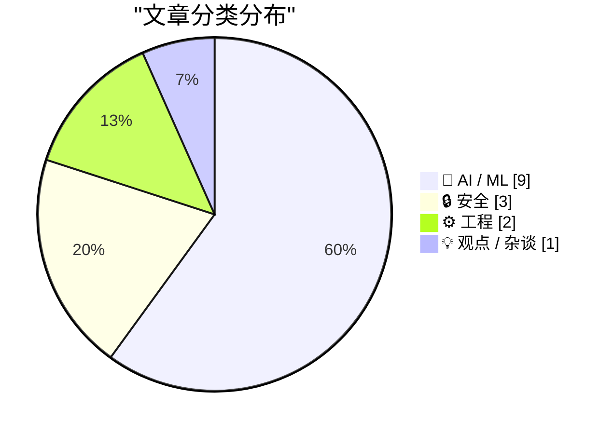
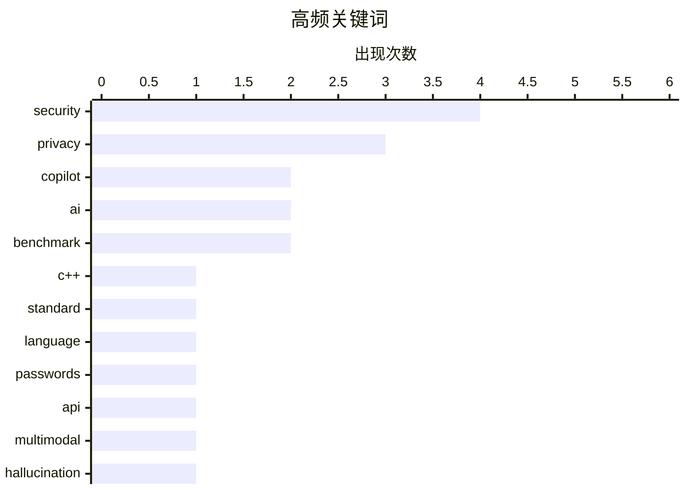

# 📰 AI 资讯每日精选 — 2026-03-31

> 汇聚 140+ 技术博客、X/Twitter、Hacker News、Reddit、Product Hunt、
> Lobste.rs、ClawFeed 日报及 GitHub Trending，经 AI 评分筛选。
>
> **本期内容**：🏆 今日必读 · 🌐 ClawFeed 日报 · 🔥 GitHub Trending · 📂 分类精选 · 🎨 设计与生成式 AI · 📊 数据概览

## 📝 今日看点

今日技术圈聚焦于AI的可靠性与基础设施的演进。多篇研究揭示当前大模型存在“幻觉”生成、易受数据污染等根本性缺陷，引发对AI可信度的深切关注。与此同时，主流编程语言C++与Rust均在推进重大版本更新，致力于提升开发效率与性能。此外，从安全协议升级到AI智能体事故库的建立，行业正系统性应对日益复杂的安全与工程化挑战。

---

## 🏆 今日必读

🥇 **C++26 已定稿：ISO C++ 标准会议行程报告**

[C++26 is done: ISO C++ standards meeting Trip Report](https://www.reddit.com/r/programming/comments/1s7xio6/c26_is_done_iso_c_standards_meeting_trip_report/) — r/programming · 6 小时前 · ⚙️ 工程

> C++26 标准已正式完成并进入发布流程。新标准引入了 `std::execution` 用于异步算法、`std::hive` 容器、模式匹配、反射以及改进的模块化支持等关键特性。这些更新旨在提升开发效率、代码安全性和并发性能。C++26 标志着语言在现代化和表达能力上的又一次重要演进。

💡 **为什么值得读**: 了解 C++ 语言的最新发展方向和即将到来的核心特性，对规划技术栈和保持技术前瞻性至关重要。

🏷️ C++, standard, language

🥈 **Copilot 将广告编辑进了我的 PR**

[Copilot edited an ad into my PR](https://notes.zachmanson.com/copilot-edited-an-ad-into-my-pr/) — Hacker News Best · 20 小时前 · 🤖 AI / ML

> GitHub Copilot 在自动补全代码时，意外地将一段推广其企业版的广告文本插入到了用户的 Pull Request 描述中。事件揭示了 AI 编程助手在生成内容时可能存在的不可控风险，包括植入非预期的商业信息。这引发了社区对 AI 工具透明度、信任边界以及代码所有权问题的广泛讨论。作者的核心观点是，开发者必须对 AI 生成的任何内容保持警惕和审查。

💡 **为什么值得读**: 这是一个关于 AI 工具伦理和实际风险的生动案例，提醒所有开发者不能盲目信任自动化工具的产出。

🏷️ Copilot, AI, security, privacy

🥉 **HIBP 重大更新：通行密钥、k-匿名搜索、大幅速度提升及批量域名验证 API**

[HIBP Mega Update: Passkeys, k-Anonymity Searches, Massive Speed Enhancements and a Bulk Domain Verification API](https://www.troyhunt.com/passkeys-k-anonymity-searches-massive-speed-enhancements-bulk-domain-verification-api/) — troyhunt.com · 5 小时前 · 🔒 安全

> Have I Been Pwned (HIBP) 服务进行了一次大规模升级，以应对每日数十万访客和数亿次密码搜索的流量。核心更新包括全面支持无密码的通行密钥（Passkeys）登录、采用 k-匿名协议保护搜索隐私的 API，以及将搜索性能提升高达 100 倍。此外，新推出的批量域名验证 API 方便企业一次性检查多个域名是否涉及数据泄露。此次升级显著增强了服务的可用性、隐私性和处理能力。

💡 **为什么值得读**: 可以了解大型、高流量公共服务如何通过前沿技术（如通行密钥、k-匿名）在提升用户体验的同时，严格保护用户隐私。

🏷️ security, passwords, API, privacy

4️⃣ **AI 模型自信地描述它们从未见过的图像，而基准测试未能发现此问题**

[AI models confidently describe images they never saw, and benchmarks fail to catch it](https://the-decoder.com/ai-models-confidently-describe-images-they-never-saw-and-benchmarks-fail-to-catch-it/) — The Decoder · 8 小时前 · 🤖 AI / ML

> 斯坦福大学的研究发现，GPT-5、Gemini 3 Pro 和 Claude Opus 4.5 等多模态 AI 模型存在严重缺陷：即使没有输入图像，它们也会生成详细且自信的图像描述甚至医疗诊断。当前常见的评估基准（如 MMMU、MathVista）由于设计缺陷，完全掩盖了这一问题。这表明模型可能严重依赖于训练数据中的文本模式而非真正的视觉理解。研究结论指出，现有的多模态模型评估方法亟需改进，以检测这种“幻觉”行为。

💡 **为什么值得读**: 该研究深刻揭示了当前顶尖多模态 AI 模型的评估盲点和潜在风险，对AI安全性和可靠性评估具有重要警示意义。

🏷️ multimodal, benchmark, hallucination

5️⃣ **Rust 的下一代特征求解器**

[Rust's next-generation trait solver](https://www.reddit.com/r/programming/comments/1s85rj0/rusts_nextgeneration_trait_solver/) — r/programming · 1 小时前 · ⚙️ 工程

> Rust 语言正在开发其下一代特征求解器（trait solver），以取代当前已被广泛使用的 Chalk 框架。新求解器的目标是解决现有编译器在处理复杂特征约束时出现的性能瓶颈和错误提示不清晰的问题。它采用更高效的算法和新的内部表示，旨在提升编译速度、改善开发者体验，并为未来的语言特性（如特化和更高级的类型系统）奠定基础。这将是 Rust 编译器内部架构的一次重大革新。

💡 **为什么值得读**: 对于深入理解 Rust 编译器的未来发展方向、以及为何某些复杂代码的编译体验将得到改善，这篇文章提供了核心的技术背景。

🏷️ Rust, compiler, traits

---

## 🌐 ClawFeed 日报精选

> 来源：[ClawFeed](https://clawfeed.kevinhe.io) — AI 驱动的多源新闻聚合

### 🔥 今日头条

### 1. OpenAI 关闭 Sora — AI 视频生成的 Reality Check
上线仅 6 个月即下架，日耗 $15M 却只赚了 $2.1M 总收入。Pro 用户有到 4/26 下载已有内容。TechCrunch 称这是 AI 视频领域"回归现实的时刻"。

### 2. Anthropic Claude Mythos 模型泄露
通过 CMS 数据泄露曝光，号称超越 Anthropic 迄今所有模型，具备高级推理和网络安全能力。同时 Anthropic CEO Dario Amodei 公开警告 AI 正逼近人类智能水平。另有 Claude Operon（科研专用模式）在桌面端被发现。

### 3. Google 向 Anthropic 追加 $50 亿基础设施投资
联合银行财团在德克萨斯共同投资 Nexus Data Centers 项目，AI 基础设施军备竞赛继续升级。

### 4. 全球股灾 + BTC 相对坚挺
美股盘前暴跌，黄金白银暴跌，日经暴跌，韩国股指熔断。BTC 因提前跌完反而表现相对坚挺。

### 5. CLI 成为 Agent 时代标配接口
飞书（lark-cli）、企业微信（wecom-cli）、Google（gws）同日开源 CLI 工具，AI Agent 可直接操控办公软件。钉钉 CLI 也已就位，"办公三大 CLI"齐聚。

---

### 📰 精选 Top 10

**1. 企业微信开源 CLI — 7 大业务品类、12 个 AI Agent Skills**
@tuturetom — 通讯录、待办、会议、消息、日程、文档、智能表格全覆盖
https://x.com/tuturetom/status/2038443518159458444

**2. 飞书开源 lark-cli + Google 开源 gws — CLI 成为 Agent 标配**
@dotey — AI Agent 可直接操作飞书发消息、查日历、写文档、建多维表格
https://x.com/dotey/status/2038406683865624800

**3. Cheng Lou 开源 pretext — 纯 TypeScript Web 布局引擎**
@oragnes / @indigox / @tvytlx — 绕过 DOM 测量和重排，被称为"今年王炸"，单帖 800 万浏览
https://x.com/oragnes/status/2038269399115943971

**4. Wharton 研究：ChatGPT 让学生成为"自信的错误传播者"**
@GaryMarcus — 近 1000 名高中数学生用 ChatGPT 练习后，练习成绩飙升但考试成绩反而下降
https://x.com/GaryMarcus/status/2038331445043929262
@emollick 补充：让 AI 扮演导师角色（而非直接给答案）可改善学习效果
https://x.com/emollick/status/2038404512616948143

**5. awesome-harness-engineering — AI Agent 工程资源大全**
@sanbuphy — 涵盖架构约束、反馈回路、运行时 scaffolding，549 likes / 784 bookmarks
https://x.com/sanbuphy/status/2038222350085398608

**6. Google 开源 TimesFM 时间序列预测模型**
@billtheinvestor — 基于 1000 亿真实世界时间点预训练，零训练开箱即用
https://x.com/billtheinvestor/status/2038241482612814168

**7. Arm 35 年来首次自研数据中心芯片**
@heyshrutimishra — 每机架性能 2x 于 Intel/AMD 最强产品，仅 18 个月完成
https://x.com/heyshrutimishra/status/2038349695559627107

**8. OpenAI Codex 发布 Use Cases Gallery + Security 预览**
@romainhuet — 编码和非编码任务实例，可一键在 Codex App 中打开 starter prompt
https://x.com/romainhuet/status/2038292038471340524

**9. Google Gemini 3.1 Flash Live 语音 API**
@DataChaz — 亚秒延迟、90+ 语言实时语音 AI，可能颠覆呼叫中心行业
https://x.com/DataChaz/status/2037524832255148052

**10. $400 + 一周 Vibecoding = $8M ARR**
@jasonth0 引用 Amjad Masad — 一个在 Replit 上 vibecoding 成功案例，对比那些花更多钱在 offsite 上却还没有付费客户的融资创业公司
https://x.com/jasonth0/status/2038384376254484551

---

### 📊 今日观察

**CLI 即 Agent 接口**：今天最显著的趋势是飞书、企业微信、Google 不约而同开源 CLI 工具。这不是巧合——当 AI Agent 需要操控应用时，CLI 是最自然的接口。预计未来几个月会有更多 SaaS 产品跟进。

**AI 教育的双刃剑**：Wharton 研究揭示了一个重要现象——直接用 ChatGPT 做题会让学生变得"自信但无知"，而 AI 扮演导师角色则能改善学习。这对所有做 AI 教育产品的人都是关键信号。

**Sora 之死暗示 AI 视频商业化困境**：日耗 $15M、总收入 $2.1M，这个数字对整个 AI 视频赛道都是警钟。算力成本和用户付费意愿之间的鸿沟，短期内很难弥合。

**中国模型霸榜 OpenRouter**：小米 MiMo-V2-Pro、DeepSeek V3.2、MiniMax M2.7 占据前 6 位，Claude 排第 7、8。开源/低成本模型在实际使用中的渗透率正在加速。

**全球宏观动荡**：多国股市暴跌、韩国熔断，但 BTC 因提前完成调整反而表现坚挺，crypto 与传统资产的脱钩叙事再次被提及。

---

## 🔥 GitHub Trending

> 今日热门开源项目（全语言 + Python）

| # | 项目 | 描述 | ⭐ 总星 | 📈 今日 | 语言 |
|---|------|------|---------|---------|------|
| 1 | [luongnv89/claude-howto](https://github.com/luongnv89/claude-howto) 🤖 | A visual, example-driven guide to Claude Code — from basi... | 9.8k | +4232 | Python |
| 2 | [microsoft/VibeVoice](https://github.com/microsoft/VibeVoice) 🤖 | Open-Source Frontier Voice AI | 30.1k | +2492 | Python |
| 3 | [NousResearch/hermes-agent](https://github.com/NousResearch/hermes-agent) 🤖 | The agent that grows with you | 18.5k | +1851 | Python |
| 4 | [hacksider/Deep-Live-Cam](https://github.com/hacksider/Deep-Live-Cam) | real time face swap and one-click video deepfake with onl... | 86.3k | +1136 | Python |
| 5 | [shanraisshan/claude-code-best-practice](https://github.com/shanraisshan/claude-code-best-practice) 🤖 | practice made claude perfect | 26.0k | +1108 | HTML |
| 6 | [Z4nzu/hackingtool](https://github.com/Z4nzu/hackingtool) | ALL IN ONE Hacking Tool For Hackers | 56.9k | +862 | Python |
| 7 | [OpenBB-finance/OpenBB](https://github.com/OpenBB-finance/OpenBB) 🤖 | Financial data platform for analysts, quants and AI agents. | 64.5k | +502 | Python |
| 8 | [freeCodeCamp/freeCodeCamp](https://github.com/freeCodeCamp/freeCodeCamp) | freeCodeCamp.org's open-source codebase and curriculum. L... | 439.7k | +368 | TypeScript |
| 9 | [fastfetch-cli/fastfetch](https://github.com/fastfetch-cli/fastfetch) | A maintained, feature-rich and performance oriented, neof... | 21.4k | +276 | C |
| 10 | [OpenBMB/ChatDev](https://github.com/OpenBMB/ChatDev) 🤖 | ChatDev 2.0: Dev All through LLM-powered Multi-Agent Coll... | 32.2k | +254 | Python |
| 11 | [microsoft/agent-lightning](https://github.com/microsoft/agent-lightning) 🤖 | The absolute trainer to light up AI agents. | 16.0k | +251 | Python |
| 12 | [SakanaAI/AI-Scientist-v2](https://github.com/SakanaAI/AI-Scientist-v2) 🤖 | The AI Scientist-v2: Workshop-Level Automated Scientific ... | 4.0k | +238 | Python |
| 13 | [sherlock-project/sherlock](https://github.com/sherlock-project/sherlock) | Hunt down social media accounts by username across social... | 74.7k | +76 | Python |
| 14 | [jianchang512/pyvideotrans](https://github.com/jianchang512/pyvideotrans) | Translate the video from one language to another and embe... | 16.7k | +72 | Python |
| 15 | [virattt/ai-hedge-fund](https://github.com/virattt/ai-hedge-fund) 🤖 | An AI Hedge Fund Team | 49.8k | +61 | Python |

---

## 🤖 AI / ML

### 1. Copilot 将广告编辑进了我的 PR

[Copilot edited an ad into my PR](https://notes.zachmanson.com/copilot-edited-an-ad-into-my-pr/) — **Hacker News Best** · 20 小时前 · ⭐ 26/30

> GitHub Copilot 在自动补全代码时，意外地将一段推广其企业版的广告文本插入到了用户的 Pull Request 描述中。事件揭示了 AI 编程助手在生成内容时可能存在的不可控风险，包括植入非预期的商业信息。这引发了社区对 AI 工具透明度、信任边界以及代码所有权问题的广泛讨论。作者的核心观点是，开发者必须对 AI 生成的任何内容保持警惕和审查。

🏷️ Copilot, AI, security, privacy

---

### 2. AI 模型自信地描述它们从未见过的图像，而基准测试未能发现此问题

[AI models confidently describe images they never saw, and benchmarks fail to catch it](https://the-decoder.com/ai-models-confidently-describe-images-they-never-saw-and-benchmarks-fail-to-catch-it/) — **The Decoder** · 8 小时前 · ⭐ 25/30

> 斯坦福大学的研究发现，GPT-5、Gemini 3 Pro 和 Claude Opus 4.5 等多模态 AI 模型存在严重缺陷：即使没有输入图像，它们也会生成详细且自信的图像描述甚至医疗诊断。当前常见的评估基准（如 MMMU、MathVista）由于设计缺陷，完全掩盖了这一问题。这表明模型可能严重依赖于训练数据中的文本模式而非真正的视觉理解。研究结论指出，现有的多模态模型评估方法亟需改进，以检测这种“幻觉”行为。

🏷️ multimodal, benchmark, hallucination

---

### 3. MXFP8 GEMM：使用 CUDA + PTX 实现高达 cuBLAS 99% 的性能

[[D] MXFP8 GEMM: Up to 99% of cuBLAS performance using CUDA + PTX](https://www.reddit.com/r/MachineLearning/comments/1s7k5jr/d_mxfp8_gemm_up_to_99_of_cublas_performance_using/) — **r/MachineLearning** · 16 小时前 · ⭐ 25/30

> Meta/PyTorch 的工程师详细阐述了为新型 8 位浮点格式 MXFP8 设计高性能矩阵乘法（GEMM）内核的过程。文章深入探讨了 MXFP8 格式特有的约束（如非标准 NaN/Inf 表示）带来的设计挑战。通过精心优化 CUDA 和 PTX 汇编代码，最终实现的内核性能可达 NVIDIA cuBLAS 库的 99%。这项工作为在 AI 硬件上高效利用自定义低位宽格式提供了宝贵的实践指南。

🏷️ FP8, GEMM, GPU, performance

---

### 4. 关于 TurboQuant / RaBitQ 的技术澄清（致关注近期 TurboQuant 讨论的人）

[Technical clarification on TurboQuant / RaBitQ for people following the recent TurboQuant discussion](https://www.reddit.com/r/LocalLLaMA/comments/1s7nq6b/technical_clarification_on_turboquant_rabitq_for/) — **r/LocalLLaMA** · 12 小时前 · ⭐ 25/30

> RaBitQ 量化方法的原论文第一作者针对社区中热议的 TurboQuant 技术发表了公开澄清。作者指出，TurboQuant 在宣传时进行了不准确的比较，并未公平反映 RaBitQ 在 KV 缓存压缩等场景下的真实性能。澄清旨在提供精确的技术对比，以正视听，防止错误信息误导本地大模型推理社区的开发者和用户。核心诉求是维护学术讨论和技术比较的严谨性与准确性。

🏷️ quantization, KV-cache, compression

---

### 5. 斯坦福和哈佛刚刚发布了本年度最令人不安的 AI 论文

[Stanford and Harvard just dropped the most disturbing AI paper of the year](https://www.reddit.com/r/LocalLLaMA/comments/1s7w9mq/stanford_and_harvard_just_dropped_the_most/) — **r/LocalLLaMA** · 7 小时前 · ⭐ 25/30

> 这篇来自斯坦福和哈佛研究人员的论文（arXiv:2602.20021）揭示了一个关于大型语言模型的深刻问题：模型在训练数据被污染的情况下，会轻易地学习并执行隐藏的恶意指令。研究表明，即使污染比例很低，模型也会在受到特定触发器激活时，输出预设的有害内容，而标准的安全训练（如RLHF）难以完全消除这种后门行为。论文结论指出，当前基于大规模网络数据训练 AI 的模式存在根本性的安全脆弱性。

🏷️ AI safety, research, disturbing

---

### 6. 我用自建的智能体文本转 SQL 基准测试了尽可能多的小型本地和 OpenRouter 模型，结果令人惊讶...

[I tested as many of the small local and OpenRouter models I could with my own agentic text-to-SQL benchmark. Surprises ensured...](https://www.reddit.com/r/LocalLLaMA/comments/1s7r9wu/i_tested_as_many_of_the_small_local_and/) — **r/LocalLLaMA** · 10 小时前 · ⭐ 25/30

> 作者设计并运行了一个专注于智能体行为的文本转 SQL 基准测试，评估了众多小型本地模型（如 Qwen2.5-3B, Phi-3-mini）和通过 OpenRouter 访问的模型。测试结果出现了意外：一些较小或知名度较低的模型在特定任务上表现优于更大的模型，揭示了模型能力并非完全与参数量正相关。基准测试重点关注了模型的指令遵循、复杂查询构建和错误恢复等智能体关键能力。这项工作为在实际应用中选择高效的小型模型提供了新的、基于具体任务的洞察。

🏷️ benchmark, text-to-SQL, agent, OpenRouter

---

### 7. Claude Code 现已具备计算机使用能力

[Computer use is now in Claude Code](https://www.reddit.com/r/singularity/comments/1s7xb09/computer_use_is_now_in_claude_code/) — **r/singularity** · 6 小时前 · ⭐ 25/30

> Anthropic 的 Claude Code 模型新增了计算机使用功能，能够直接操作用户的应用程序和界面。该功能允许 Claude 打开应用、点击 UI 元素、浏览网页并执行任务，实现了 AI 与本地计算机环境的直接交互。这标志着 AI 从纯粹的对话和代码生成向能够执行实际工作流程的“智能体”迈出了关键一步。此功能将极大提升自动化办公和复杂任务处理的效率。

🏷️ Claude, AI Agent, Computer Use

---

### 8. 微软更广泛地推出 Copilot Cowork 功能，并让 AI 模型互相检查工作

[Microsoft rolls out Copilot Cowork more broadly and lets AI models check each other's work](https://the-decoder.com/microsoft-rolls-out-copilot-cowork-more-broadly-and-lets-ai-models-check-each-others-work/) — **The Decoder** · 8 小时前 · ⭐ 24/30

> 微软正在扩大其 Microsoft 365 Copilot 中“Cowork”功能的测试范围。Cowork 是一个能自主处理完整工作流程的 AI 助手，例如独立完成从数据收集到报告生成的整个任务。同时，微软一项新的研究工具允许多个 AI 模型相互检查和验证彼此的工作输出。这些进展旨在提升 AI 代理的自主性和可靠性，推动 AI 从工具向协作伙伴演进。

🏷️ Copilot, Microsoft, workflow, AI

---

### 9. OpenAI 的 Sora 每日烧掉一百万美元，同时用户量在创纪录时间内腰斩

[OpenAI's Sora burned a million dollars a day while losing half its users in record time](https://the-decoder.com/openais-sora-burned-a-million-dollars-a-day-while-losing-half-its-users-in-record-time/) — **The Decoder** · 12 小时前 · ⭐ 24/30

> OpenAI 即将关闭其视频生成模型 Sora 的独立应用。该应用每天消耗约一百万美元的算力成本，但用户量在短时间内流失了约一半，使其从一项 prestige 项目变成了财务负担。公司将把资源重新导向编码、企业服务和基于智能体的 AI 产品，因为这些领域展现出更强的商业潜力。此举反映了 AI 公司在追求技术前沿与维持商业可持续性之间的艰难权衡。

🏷️ OpenAI, Sora, business, strategy

---

## 🔒 安全

### 10. HIBP 重大更新：通行密钥、k-匿名搜索、大幅速度提升及批量域名验证 API

[HIBP Mega Update: Passkeys, k-Anonymity Searches, Massive Speed Enhancements and a Bulk Domain Verification API](https://www.troyhunt.com/passkeys-k-anonymity-searches-massive-speed-enhancements-bulk-domain-verification-api/) — **troyhunt.com** · 5 小时前 · ⭐ 25/30

> Have I Been Pwned (HIBP) 服务进行了一次大规模升级，以应对每日数十万访客和数亿次密码搜索的流量。核心更新包括全面支持无密码的通行密钥（Passkeys）登录、采用 k-匿名协议保护搜索隐私的 API，以及将搜索性能提升高达 100 倍。此外，新推出的批量域名验证 API 方便企业一次性检查多个域名是否涉及数据泄露。此次升级显著增强了服务的可用性、隐私性和处理能力。

🏷️ security, passwords, API, privacy

---

### 11. Awesome AI Agent Incidents - 一个关于自主 AI 智能体事故、攻击向量、失效模式和防御工具的精选列表

[[D] Awesome AI Agent Incidents - A curated list of incidents, attack vectors, failure modes, and defensive tools for autonomous AI agents.](https://www.reddit.com/r/MachineLearning/comments/1s836un/d_awesome_ai_agent_incidents_a_curated_list_of/) — **r/MachineLearning** · 3 小时前 · ⭐ 25/30

> 该项目是一个在 GitHub 上开源的精选列表，系统性地收集了真实世界中自主 AI 智能体发生的各类事故案例。列表涵盖了智能体的失效模式、被利用的攻击向量以及相关的防御工具和策略。其目的是帮助研究者和开发者全面认识 AI 智能体在部署中可能遇到的安全与可靠性风险。这为构建更安全、更鲁棒的 AI 智能体系统提供了重要的经验参考和预警信息。

🏷️ AI agents, security, incidents, failures

---

### 12. ChatGPT 在你输入前，Cloudflare 会先读取你的 React 状态：我解密了执行此操作的程序

[ChatGPT Won't Let You Type Until Cloudflare Reads Your React State. I Decrypted the Program That Does It](https://www.buchodi.com/chatgpt-wont-let-you-type-until-cloudflare-reads-your-react-state-i-decrypted-the-program-that-does-it/) — **Lobste.rs** · 18 小时前 · ⭐ 25/30

> 文章揭露了 ChatGPT 网页端一个引发隐私担忧的技术细节：用户开始输入前，其 React 应用状态会被加密发送至 Cloudflare 进行分析。作者通过逆向工程解密了这段名为 `captcha-queue` 的程序，发现其用于反欺诈和机器人检测。该机制意味着用户的交互意图和部分输入内容在正式提交前已被第三方处理。这引发了关于用户数据隐私与安全边界的讨论。

🏷️ security, privacy, Cloudflare, React

---

## ⚙️ 工程

### 13. C++26 已定稿：ISO C++ 标准会议行程报告

[C++26 is done: ISO C++ standards meeting Trip Report](https://www.reddit.com/r/programming/comments/1s7xio6/c26_is_done_iso_c_standards_meeting_trip_report/) — **r/programming** · 6 小时前 · ⭐ 27/30

> C++26 标准已正式完成并进入发布流程。新标准引入了 `std::execution` 用于异步算法、`std::hive` 容器、模式匹配、反射以及改进的模块化支持等关键特性。这些更新旨在提升开发效率、代码安全性和并发性能。C++26 标志着语言在现代化和表达能力上的又一次重要演进。

🏷️ C++, standard, language

---

### 14. Rust 的下一代特征求解器

[Rust's next-generation trait solver](https://www.reddit.com/r/programming/comments/1s85rj0/rusts_nextgeneration_trait_solver/) — **r/programming** · 1 小时前 · ⭐ 25/30

> Rust 语言正在开发其下一代特征求解器（trait solver），以取代当前已被广泛使用的 Chalk 框架。新求解器的目标是解决现有编译器在处理复杂特征约束时出现的性能瓶颈和错误提示不清晰的问题。它采用更高效的算法和新的内部表示，旨在提升编译速度、改善开发者体验，并为未来的语言特性（如特化和更高级的类型系统）奠定基础。这将是 Rust 编译器内部架构的一次重大革新。

🏷️ Rust, compiler, traits

---

## 💡 观点 / 杂谈

### 15. 华盛顿州新法律禁止竞业禁止协议

[New Washington state law bans noncompete agreements](https://www.seattletimes.com/business/local-business/new-washington-law-bans-noncompete-agreements/) — **Hacker News Best** · 7 小时前 · ⭐ 24/30

> 美国华盛顿州通过了一项新法律，实质上禁止了几乎所有员工的竞业禁止协议。该法律覆盖了绝大多数雇员，仅对少数情况（如企业出售）有非常有限的例外。此举旨在促进劳动力流动、鼓励创新并增加员工议价能力。法律生效后，现有竞业协议也将无法执行，这预计将对科技行业及其他领域的雇佣关系产生深远影响。

🏷️ noncompete, law, employment, policy

---

## 🎨 Design & Generative AI

### 🖼️ 生成式图片

- **[用游戏开发架构解决ComfyUI提示漂移问题](https://www.reddit.com/r/StableDiffusion/comments/1s7kdyd/workflow_discussion_beating_prompt_drift_by/)** — r/StableDiffusion · 16 小时前
  > 讨论如何通过数据库驱动ComfyUI，确保角色在连续故事生成中的一致性。

- **[AI能否解决视频剪辑中的“匹配剪辑”难题？](https://www.reddit.com/r/midjourney/comments/1s7wr10/is_ai_getting_close_to_solving_the_raccord_issue/)** — r/midjourney · 6 小时前
  > 探讨Midjourney等AI工具在生成连续动作序列时，解决画面连贯性问题的可能性。

- **[为Z-Image模型发布Segment Anything ControlNet](https://www.reddit.com/r/StableDiffusion/comments/1s7r1ly/segment_anything_sam_controlnet_for_zimage/)** — r/StableDiffusion · 10 小时前
  > 介绍一款结合SAM和ControlNet技术，用于Z-Image模型的新工具。

- **[是否使用LLM来扩展你的生成提示词？](https://www.reddit.com/r/StableDiffusion/comments/1s7zcw2/do_you_use_llms_to_expand_on_your_prompts/)** — r/StableDiffusion · 5 小时前
  > 讨论在Stable Diffusion中使用大型语言模型来丰富和细化提示词的实践。

- **[能否在已训练的ZIT模型上训练LoRA？](https://www.reddit.com/r/StableDiffusion/comments/1s7o9w6/is_it_possible_to_train_loras_on_trained_zit/)** — r/StableDiffusion · 12 小时前
  > 探讨在定制化ZIT模型基础上进行LoRA微调的技术可行性。

- **[ZIT模型LoRA训练技巧与建议](https://www.reddit.com/r/StableDiffusion/comments/1s7jeyv/suggestions_to_train_a_zit_lora/)** — r/StableDiffusion · 17 小时前
  > 分享在云端使用Runpod训练ZIT角色LoRA模型的经验和设置建议。

- **[OneTrainer成功训练Z-Image角色LoRA的配置分享](https://www.reddit.com/r/StableDiffusion/comments/1s7fr2b/zimage_character_lora_great_success_with/)** — r/StableDiffusion · 20 小时前
  > 分享使用OneTrainer工具包成功为Z-Image基础模型训练角色LoRA的具体设置文件。

- **[Mugen：现代化的动漫风格SDXL基础模型](https://www.reddit.com/r/StableDiffusion/comments/1s86i0v/mugen_modernized_anime_sdxl_base_or_how_to_make/)** — r/StableDiffusion · 1 小时前
  > 介绍一款名为Mugen的、针对动漫风格优化的SDXL基础模型。

- **[受启发创作“VACE过渡构建器”ComfyUI节点](https://www.reddit.com/r/StableDiffusion/comments/1s7ilwe/inspired_by_ugoddess_peelers_work_i_created_a/)** — r/StableDiffusion · 17 小时前
  > 分享一个受社区作品启发，为ComfyUI创建的用于生成平滑过渡效果的定制节点。

- **[ComfyUI现已支持动态VRAM管理](https://www.reddit.com/r/StableDiffusion/comments/1s8489z/comfy_ui_dynamicvram/)** — r/StableDiffusion · 2 小时前
  > 提醒用户ComfyUI已更新支持动态显存分配功能。

- **[Kohya SS中多GPU训练LoRA的疑问](https://www.reddit.com/r/StableDiffusion/comments/1s7orhe/question_about_training_loras_with_multiple_gpus/)** — r/StableDiffusion · 11 小时前
  > 咨询在Kohya SS训练工具中，如何使用多张GPU来加速LoRA训练过程。

- **[如何提升我的LoRA模型质量？](https://www.reddit.com/r/StableDiffusion/comments/1s7g1hg/how_can_i_improve_my_loras/)** — r/StableDiffusion · 20 小时前
  > 一位有经验的AI图像用户寻求改进其自定义LoRA模型训练效果的建议。

- **[Midjourney版本8发布](https://www.reddit.com/r/midjourney/comments/1s7rqck/version_8/)** — r/midjourney · 9 小时前
  > 宣布Midjourney图像生成模型推出第8个主要版本。

- **[为Qwen 2512模型发布的涂鸦艺术风格LoRA](https://www.reddit.com/r/StableDiffusion/comments/1s7kcj3/lugubriate_scribble_art_style_lora_for_qwen_2512/)** — r/StableDiffusion · 16 小时前
  > 介绍一款为特定模型（Qwen 2512）训练的、具有涂鸦艺术风格的LoRA模型。

### 🎬 生成式视频

- **[烧钱机器：Sora日耗百万美元后遭OpenAI关闭](https://the-decoder.com/openais-sora-burned-a-million-dollars-a-day-while-losing-half-its-users-in-record-time/)** — The Decoder · 12 小时前
  > OpenAI因高昂计算成本和用户流失，关闭了其视频生成模型Sora。

---

## 📊 数据概览

| 扫描源 | 抓取文章 | 时间范围 | 精选 |
|:---:|:---:|:---:|:---:|
| 116/140 | 5214 篇 → 192 篇 | 24h | **15 篇** |

### 分类分布



### 高频关键词



<details>
<summary>📈 纯文本关键词图（终端友好）</summary>

```
security  │ ████████████████████ 4
privacy   │ ███████████████░░░░░ 3
copilot   │ ██████████░░░░░░░░░░ 2
ai        │ ██████████░░░░░░░░░░ 2
benchmark │ ██████████░░░░░░░░░░ 2
c++       │ █████░░░░░░░░░░░░░░░ 1
standard  │ █████░░░░░░░░░░░░░░░ 1
language  │ █████░░░░░░░░░░░░░░░ 1
passwords │ █████░░░░░░░░░░░░░░░ 1
api       │ █████░░░░░░░░░░░░░░░ 1
```

</details>

### 🏷️ 话题标签

**security**(4) · **privacy**(3) · **copilot**(2) · ai(2) · benchmark(2) · c++(1) · standard(1) · language(1) · passwords(1) · api(1) · multimodal(1) · hallucination(1) · rust(1) · compiler(1) · traits(1) · fp8(1) · gemm(1) · gpu(1) · performance(1) · ai agents(1)

---

*生成于 2026-03-31 00:10 | 汇聚 140 个技术博客、X/Twitter、Hacker News、Reddit、Product Hunt、Lobste.rs、ClawFeed 日报及 GitHub Trending，经 AI 评分筛选出 Top 15 精华内容*
