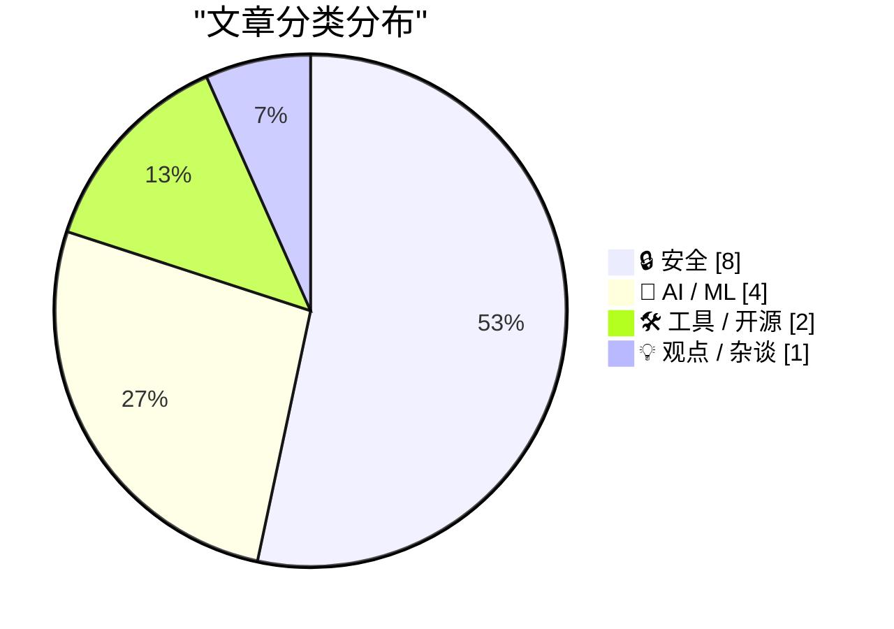
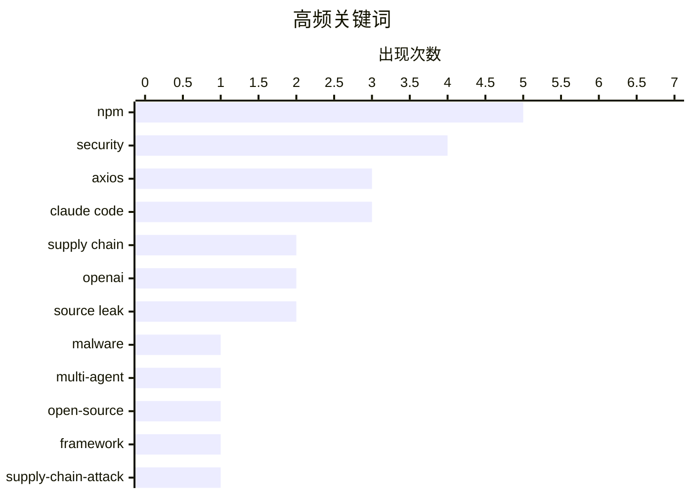

# 📰 AI 资讯每日精选 — 2026-04-01

> 汇聚 140+ 技术博客、X/Twitter、Hacker News、Reddit、Product Hunt、
> Lobste.rs、ClawFeed 日报及 GitHub Trending，经 AI 评分筛选。
>
> **本期内容**：🏆 今日必读 · 🌐 ClawFeed 日报 · 🔥 GitHub Trending · 📂 分类精选 · 🎨 设计与生成式 AI · 📊 数据概览

## 📝 今日看点

今日技术圈聚焦于两大核心议题：供应链安全与AI能力的边界拓展。开源生态安全警钟再次敲响，Axios等流行库遭到的针对性攻击暴露了软件供应链的脆弱环节。与此同时，AI领域竞争白热化，巨头融资与多模态模型创新并行，模型正从理解内容向执行复杂任务演进。

---

## 🏆 今日必读

🥇 **Axios 在 NPM 上被入侵——恶意版本投放远程访问木马**

[Axios compromised on NPM – Malicious versions drop remote access trojan](https://www.stepsecurity.io/blog/axios-compromised-on-npm-malicious-versions-drop-remote-access-trojan) — Hacker News Best · 21 小时前 · 🔒 安全

> 流行的 HTTP 客户端库 Axios 遭遇供应链攻击，其 NPM 包被植入恶意依赖。攻击者通过入侵维护者账户，在版本 1.14.1 和 0.30.4 中注入了名为 `plain-crypto-js` 的新依赖包，该包实为窃取凭证的恶意软件。此次攻击影响了每周下载量高达 1.01 亿次的广泛使用的库，暴露了开源依赖生态的严重安全风险。核心结论是，开发者必须立即检查并避免使用这两个被入侵的版本。

💡 **为什么值得读**: 该事件是近期影响范围最广的软件供应链攻击之一，为所有依赖开源包管理的开发者敲响了警钟。

🏷️ supply chain, NPM, malware, axios

🥈 **Claude Code 源码泄露——我将其多智能体编排系统提取成一个开源框架**

[Claude Code's source just leaked — I extracted its multi-agent orchestration system into an open-source framework that works with any LLM](https://www.reddit.com/r/LocalLLaMA/comments/1s8xj2e/claude_codes_source_just_leaked_i_extracted_its/) — r/LocalLLaMA · 4 小时前 · 🛠 工具 / 开源

> Claude Code 的完整源代码（超过 50 万行 TypeScript）通过 Source Maps 意外泄露。作者深入研究了其架构，重点提取并重新实现了其多智能体编排层的核心设计。这包括负责将目标分解为任务的协调器、团队系统、消息总线以及支持依赖解析的任务调度器。最终成果是一个能与任何大语言模型配合使用的开源框架。这表明，先进的闭源 AI 系统架构可以被逆向并开源化。

💡 **为什么值得读**: 通过剖析顶级 AI 编码助手的内部架构，为开发者构建自己的多智能体系统提供了宝贵的蓝图和现成工具。

🏷️ Claude Code, multi-agent, open-source, framework

🥉 **针对 Axios 的供应链攻击从 npm 拉取恶意依赖**

[Supply Chain Attack on Axios Pulls Malicious Dependency from npm](https://simonwillison.net/2026/Mar/31/supply-chain-attack-on-axios/#atom-everything) — simonwillison.net · 42 分钟前 · 🔒 安全

> 文章详细记录了针对 Axios 库的供应链攻击事件。攻击者通过入侵维护者账户，发布了包含恶意依赖 `plain-crypto-js` 的版本 1.14.1 和 0.30.4。这个新依赖是专门为此次攻击发布的恶意软件，旨在窃取用户凭证。该库每周下载量达 1.01 亿次，影响面极大。事件凸显了依赖包管理生态的脆弱性，以及维护者账户安全和发布流程完整性的至关重要。

💡 **为什么值得读**: 作为对同一重大安全事件的深度技术分析，提供了攻击手法的具体细节和背景信息。

🏷️ npm, supply-chain-attack, axios

4️⃣ **Qwen3.5-Omni 无师自通，学会了根据语音指令和视频编写代码**

[Qwen3.5-Omni learned to write code from spoken instructions and video without anyone training it to](https://the-decoder.com/qwen3-5-omni-learned-to-write-code-from-spoken-instructions-and-video-without-anyone-training-it-to/) — The Decoder · 11 小时前 · 🤖 AI / ML

> 阿里巴巴发布了通才多模态 AI 模型 Qwen3.5-Omni，它能处理文本、图像、音频和视频输入。该模型在音频任务上声称超越了 Gemini 3.1 Pro。最引人注目的是，它在训练过程中自发地（未经专门训练）获得了根据语音指令和视频输入编写代码的能力。这种能力的涌现展示了大型多模态模型在跨模态理解和代码生成方面令人意外的泛化潜力。

💡 **为什么值得读**: 展现了大模型超越预设训练目标的“涌现能力”，为多模态 AI 的自主学习和应用开辟了新想象。

🏷️ Qwen, multimodal, code generation, Alibaba

5️⃣ **npm 上的 axios 1.14.1 和 0.30.4 版本被入侵——通过被盗维护者账户进行依赖注入**

[axios 1.14.1 and 0.30.4 on npm are compromised - dependency injection via stolen maintainer account](https://www.reddit.com/r/programming/comments/1s8ct9i/axios_1141_and_0304_on_npm_are_compromised/) — r/programming · 20 小时前 · 🔒 安全

> Axios 的两个版本（1.14.1 和 0.30.4）因维护者账户被盗而发布。这些版本在 GitHub 上没有对应的标签，且缺失了版本 1.14.0 中存在的 SLSA 来源证明。发布者邮箱从与 CI 关联的地址切换为了一个 Proton Mail 账户，这是典型的账户被盗信号。攻击手法是通过被入侵的账户直接发布恶意包版本。社区迅速识别并警告了这些异常版本。

💡 **为什么值得读**: 从技术细节层面（如 SLSA 证明缺失、邮箱变更）揭示了如何识别和验证此类供应链攻击，具有实操指导价值。

🏷️ axios, supply-chain, npm, security

---

## 🌐 ClawFeed 日报精选

> 来源：[ClawFeed](https://clawfeed.kevinhe.io) — AI 驱动的多源新闻聚合

### 🔥 今日头条

### 1. Claude Code 源码泄露
Anthropic 发布 npm 包 v2.1.88 时未过滤 source map 文件，完整 TypeScript 源码被还原。GitHub 备份仓库 2 小时内飙到 9K+ stars。社区随即展开架构分析：REPL 启动、QueryEngine、工具注册、权限系统等。注意：泄露的是 CLI 客户端代码，不是大模型本身。

### 2. axios npm 供应链攻击（⚠️ 安全警告）
axios@1.14.1 和 @0.30.4 被投毒，植入远程访问木马（RAT），恶意依赖 plain-crypto-js@4.2.1，C2 服务器 sfrclak[.]com:8000。维护者账号遭劫持。**立即回滚到 axios@1.14.0！** AI 编码工具默认 `npm i axios` 不锁版本尤其危险。Devin 声称在公开前已为客户自动检测到攻击。

### 3. Anthropic "Mythos" 模型泄露
内部 ~3000 份文档意外通过 CMS 曝光，揭示下一代模型 Claude Mythos（内部代号 Capybara），推理和编码能力有"阶梯式跃升"，定位网络安全。Anthropic 向政府官员通报中，CrowdStrike 股价跌 7.5%。

### 4. ARC-AGI-3 发布：人类 100% vs AI 最高 0.37%
François Chollet 最新 AI 智能基准测试，135 个全新游戏环境，不给任何指令/规则/目标。顶级模型成绩：Gemini 3.1 Pro 0.37%，GPT 5.4 0.26%，Opus 4.6 0.25%，Grok 4.20 0.00%。证明当前 AI 在流体推理上仍远落后人类。

### 5. Google 将后量子密码学过渡截止日期提前至 2029
Google Research 论文发现量子计算机从暴露公钥逆推私钥的速度超出预期，50 万量子比特可在数分钟内破解 Bitcoin ECDSA 加密。@nic_carter 揭示的推文达 103 万浏览。

---

### 📰 精选 Top 10

1. **Claude Code 源码泄露首发** — @Fried_rice 首发，7M+ views，npm .map 文件包含完整源码映射
   https://x.com/Fried_rice/status/2038894956459290963

2. **axios 供应链攻击警告** — @evilcos 警告所有 Agents（含 OpenClaw）排查恶意版本
   https://x.com/evilcos/status/2038850989042831812

3. **OpenAI 发布 Codex Plugin for Claude Code** — 官方开源 codex-plugin-cc，在 Claude Code 中直接调用 Codex 做代码审查，跨公司协作里程碑。@reach_vb 详细介绍，896K views
   https://x.com/reach_vb/status/2038670509768839458

4. **Claude Code 架构深度分析** — @sanbuphy 拆解 REPL 启动、QueryEngine、工具注册、Slash 命令、权限系统、任务系统
   https://x.com/sanbuphy/status/2038912992457408838

5. **ARC-AGI-3 基准测试结果** — @heygurisingh 分享，1.1M views，AI 圈热议
   https://x.com/heygurisingh/status/2038266503993372774

6. **glm-ocr 开源：0.9B 参数击败 Gemini** — 中国团队开源文档 OCR 模型，可能替代昂贵 OCR API
   https://x.com/simplifyinAI/status/2038562686280061403

7. **Google 后量子密码学论文引爆加密圈** — @nic_carter 揭示 Google 提前截止日期原因，103 万浏览
   https://x.com/nic_carter/status/2038804571791761821

8. **Claude Code 15 个隐藏功能** — @dotey 翻译 Claude Code 创始人 @bcherny 的实操技巧：iOS 写代码、语音编程、5 分钟自动审查等，118K views
   https://x.com/dotey/status/2038481514732691940

9. **Vibecoding 翻车：$200 plan 23 天花 $27,000** — @adxtyahq 分享真实事故，15.9 万浏览
   https://x.com/adxtyahq/status/2038808139492151329

10. **Qwen3.5-Omni 发布** — 阿里通义千问原生全模态模型，支持文本/图像/音频/视频理解与实时交互
    https://x.com/Alibaba_Qwen/status/2038636335272194241

---

### 📊 今日观察

今天是安全事件密集的一天。axios 供应链攻击是真正需要立即行动的安全警告——AI 编码工具的默认行为（不锁版本）让这类攻击的杀伤半径成倍放大。Claude Code 源码泄露虽然轰动（7M views），但实际影响有限，泄露的是 CLI 客户端而非模型权重。Anthropic "Mythos" 泄露则预示着下一代模型竞争即将升级。

ARC-AGI-3 给 AI hype 泼了一盆冷水：最强模型不到 0.4% vs 人类 100%，说明"通用智能"离我们还很远。Google 后量子密码学论文则给 crypto 行业敲响了中长期警钟。

行业趋势上，OpenAI 主动把 Codex 插件送进 Claude Code 生态是今天最有意思的信号——竞争关系正在从零和博弈转向工具互操作。BTC 即将收出连续第 6 个月阴线，市场情绪仍然低迷。

—
*由 ClawFeed 自动生成 | 基于 6 份 4h 简报汇总*

---

## 🔥 GitHub Trending

> 今日热门开源项目（全语言 + Python）

| # | 项目 | 描述 | ⭐ 总星 | 📈 今日 | 语言 |
|---|------|------|---------|---------|------|
| 1 | [microsoft/VibeVoice](https://github.com/microsoft/VibeVoice) 🤖 | Open-Source Frontier Voice AI | 33.1k | +3863 | Python |
| 2 | [obra/superpowers](https://github.com/obra/superpowers) | An agentic skills framework & software development method... | 128.1k | +2620 | Shell |
| 3 | [shanraisshan/claude-code-best-practice](https://github.com/shanraisshan/claude-code-best-practice) 🤖 | practice made claude perfect | 28.5k | +2407 | HTML |
| 4 | [luongnv89/claude-howto](https://github.com/luongnv89/claude-howto) 🤖 | A visual, example-driven guide to Claude Code — from basi... | 12.9k | +2390 | Python |
| 5 | [NousResearch/hermes-agent](https://github.com/NousResearch/hermes-agent) 🤖 | The agent that grows with you | 20.3k | +1907 | Python |
| 6 | [Yeachan-Heo/oh-my-claudecode](https://github.com/Yeachan-Heo/oh-my-claudecode) 🤖 | Teams-first Multi-agent orchestration for Claude Code | 19.0k | +1126 | TypeScript |
| 7 | [jwasham/coding-interview-university](https://github.com/jwasham/coding-interview-university) | A complete computer science study plan to become a softwa... | 339.6k | +873 | - |
| 8 | [sherlock-project/sherlock](https://github.com/sherlock-project/sherlock) | Hunt down social media accounts by username across social... | 75.5k | +865 | Python |
| 9 | [hacksider/Deep-Live-Cam](https://github.com/hacksider/Deep-Live-Cam) | real time face swap and one-click video deepfake with onl... | 87.0k | +849 | Python |
| 10 | [OpenBB-finance/OpenBB](https://github.com/OpenBB-finance/OpenBB) 🤖 | Financial data platform for analysts, quants and AI agents. | 64.8k | +506 | Python |
| 11 | [google-research/timesfm](https://github.com/google-research/timesfm) | TimesFM (Time Series Foundation Model) is a pretrained ti... | 11.5k | +495 | Python |
| 12 | [PaddlePaddle/PaddleOCR](https://github.com/PaddlePaddle/PaddleOCR) 🤖 | Turn any PDF or image document into structured data for y... | 74.2k | +439 | Python |
| 13 | [ComposioHQ/awesome-claude-skills](https://github.com/ComposioHQ/awesome-claude-skills) 🤖 | A curated list of awesome Claude Skills, resources, and t... | 49.9k | +374 | Python |
| 14 | [vas3k/TaxHacker](https://github.com/vas3k/TaxHacker) 🤖 | Self-hosted AI accounting app. LLM analyzer for receipts,... | 3.7k | +318 | TypeScript |
| 15 | [Z4nzu/hackingtool](https://github.com/Z4nzu/hackingtool) | ALL IN ONE Hacking Tool For Hackers | 57.0k | +309 | Python |

---

## 🔒 安全

### 1. Axios 在 NPM 上被入侵——恶意版本投放远程访问木马

[Axios compromised on NPM – Malicious versions drop remote access trojan](https://www.stepsecurity.io/blog/axios-compromised-on-npm-malicious-versions-drop-remote-access-trojan) — **Hacker News Best** · 21 小时前 · ⭐ 27/30

> 流行的 HTTP 客户端库 Axios 遭遇供应链攻击，其 NPM 包被植入恶意依赖。攻击者通过入侵维护者账户，在版本 1.14.1 和 0.30.4 中注入了名为 `plain-crypto-js` 的新依赖包，该包实为窃取凭证的恶意软件。此次攻击影响了每周下载量高达 1.01 亿次的广泛使用的库，暴露了开源依赖生态的严重安全风险。核心结论是，开发者必须立即检查并避免使用这两个被入侵的版本。

🏷️ supply chain, NPM, malware, axios

---

### 2. 针对 Axios 的供应链攻击从 npm 拉取恶意依赖

[Supply Chain Attack on Axios Pulls Malicious Dependency from npm](https://simonwillison.net/2026/Mar/31/supply-chain-attack-on-axios/#atom-everything) — **simonwillison.net** · 42 分钟前 · ⭐ 26/30

> 文章详细记录了针对 Axios 库的供应链攻击事件。攻击者通过入侵维护者账户，发布了包含恶意依赖 `plain-crypto-js` 的版本 1.14.1 和 0.30.4。这个新依赖是专门为此次攻击发布的恶意软件，旨在窃取用户凭证。该库每周下载量达 1.01 亿次，影响面极大。事件凸显了依赖包管理生态的脆弱性，以及维护者账户安全和发布流程完整性的至关重要。

🏷️ npm, supply-chain-attack, axios

---

### 3. npm 上的 axios 1.14.1 和 0.30.4 版本被入侵——通过被盗维护者账户进行依赖注入

[axios 1.14.1 and 0.30.4 on npm are compromised - dependency injection via stolen maintainer account](https://www.reddit.com/r/programming/comments/1s8ct9i/axios_1141_and_0304_on_npm_are_compromised/) — **r/programming** · 20 小时前 · ⭐ 26/30

> Axios 的两个版本（1.14.1 和 0.30.4）因维护者账户被盗而发布。这些版本在 GitHub 上没有对应的标签，且缺失了版本 1.14.0 中存在的 SLSA 来源证明。发布者邮箱从与 CI 关联的地址切换为了一个 Proton Mail 账户，这是典型的账户被盗信号。攻击手法是通过被入侵的账户直接发布恶意包版本。社区迅速识别并警告了这些异常版本。

🏷️ axios, supply-chain, npm, security

---

### 4. “负责任地披露量子漏洞以保护加密货币”：谷歌将后量子密码迁移截止期修订至 2029 年的原因

["Safeguarding cryptocurrency by disclosing quantum vulnerabilities responsibly": the reason behind Google revising their post-quantum cryptography transition deadline to 2029](https://www.reddit.com/r/programming/comments/1s8laox/safeguarding_cryptocurrency_by_disclosing_quantum/) — **r/programming** · 12 小时前 · ⭐ 26/30

> 谷歌修订其向后量子密码学迁移的最后期限至 2029 年，背后核心原因与保护加密货币生态有关。谷歌研究团队通过负责任地披露量子计算对现有加密算法的威胁，旨在推动整个行业（尤其是区块链和加密货币）提前采取防御措施。此举是为了避免未来量子计算机实用化后，对基于非抗量子密码的加密货币资产造成灾难性打击。这体现了科技巨头在协调全球安全标准升级中的关键角色。

🏷️ post-quantum cryptography, quantum computing, security

---

### 5. [动态进展]：为何需谨慎授予本地 LLM 工具调用权限：OpenClaw 刚修补了一个严重的沙箱逃逸漏洞

[[Developing situation]: Why you need to be careful giving your local LLMs tool access: OpenClaw just patched a Critical sandbox escape](https://www.reddit.com/r/LocalLLaMA/comments/1s8md7v/developing_situation_why_you_need_to_be_careful/) — **r/LocalLLaMA** · 11 小时前 · ⭐ 26/30

> 本地运行的大语言模型在获得工具调用权限后存在严重安全风险。开源工具调用框架 OpenClaw 近期修补了一个关键（Critical）级别的沙箱逃逸漏洞。此类漏洞可能允许恶意或被操控的 LLM 突破执行环境限制，在主机上执行任意代码或访问敏感数据。事件表明，为 LLM 赋予工具能力时，其执行沙箱的完整性和隔离性是至关重要的防线。

🏷️ LLM, security, sandbox, vulnerability

---

### 6. npm 的默认设置很糟糕

[npm’s Defaults Are Bad](https://nesbitt.io/2026/03/31/npms-defaults-are-bad.html) — **nesbitt.io** · 14 小时前 · ⭐ 25/30

> 文章直指 npm 客户端的默认设置是导致 JavaScript 生态系统供应链安全问题反复出现的根本原因之一。作者认为，当前默认的安装、信任和发布策略过于宽松，为恶意包的传播和账户劫持提供了便利。这些设计缺陷使得开发者在不经意间就容易引入风险。核心观点是，必须改变 npm 的默认安全假设和配置，才能从系统层面减少此类攻击。

🏷️ npm, security, supply chain

---

### 7. Claude Code源代码泄露事件：虚假工具、挫折正则表达式与隐身模式

[The Claude Code Source Leak: fake tools, frustration regexes, undercover mode](https://alex000kim.com/posts/2026-03-31-claude-code-source-leak/) — **Hacker News Best** · 11 小时前 · ⭐ 25/30

> 一篇深度分析文章揭示了从Claude Code泄露的源代码中发现的多个内部细节。代码中包含了用于“伪造”工具调用结果的模拟函数、检测用户“挫折感”的正则表达式模式，以及一个可能用于数据收集的“隐身模式”。这些发现引发了关于AI助手透明度、用户体验操控及数据隐私的严重担忧。文章基于泄露的源代码进行了技术剖析，提供了内部视角。

🏷️ Claude Code, source leak, reverse engineering

---

### 8. Claude Code源代码通过NPM注册表中的map文件遭泄露

[Claude Code's source code has been leaked via a map file in their NPM registry](https://twitter.com/Fried_rice/status/2038894956459290963) — **Hacker News Best** · 15 小时前 · ⭐ 25/30

> Claude Code的完整源代码因其NPM包中意外包含的source map文件而遭泄露，此事最初由推特用户披露。该事件在Hacker News上引发了爆炸性讨论，获得了惊人的1863票和912条评论，成为热门话题。泄露的源代码被公开分析，并链接到更详细的技术分析文章。这被认为是一次重大的安全事故，暴露了AI公司在发布流程中的严重疏忽。

🏷️ source leak, NPM, Claude Code

---

## 🤖 AI / ML

### 9. Qwen3.5-Omni 无师自通，学会了根据语音指令和视频编写代码

[Qwen3.5-Omni learned to write code from spoken instructions and video without anyone training it to](https://the-decoder.com/qwen3-5-omni-learned-to-write-code-from-spoken-instructions-and-video-without-anyone-training-it-to/) — **The Decoder** · 11 小时前 · ⭐ 26/30

> 阿里巴巴发布了通才多模态 AI 模型 Qwen3.5-Omni，它能处理文本、图像、音频和视频输入。该模型在音频任务上声称超越了 Gemini 3.1 Pro。最引人注目的是，它在训练过程中自发地（未经专门训练）获得了根据语音指令和视频输入编写代码的能力。这种能力的涌现展示了大型多模态模型在跨模态理解和代码生成方面令人意外的泛化潜力。

🏷️ Qwen, multimodal, code generation, Alibaba

---

### 10. OpenAI 融资 1220 亿美元以加速 AI 下一阶段发展

[OpenAI raises $122 billion to accelerate the next phase of AI](https://www.reddit.com/r/singularity/comments/1s90e4e/openai_raises_122_billion_to_accelerate_the_next/) — **r/singularity** · 2 小时前 · ⭐ 26/30

> OpenAI 完成了高达 1220 亿美元的新一轮融资。这笔巨额资金将用于加速人工智能技术下一阶段的研究与开发。融资规模远超以往，预示着 AI 军备竞赛进入白热化，资源向头部公司高度集中。此举可能深刻影响未来全球 AI 技术格局、产品竞争和监管走向。

🏷️ OpenAI, funding, AI development

---

### 11. Granite 4.0 3B Vision：面向企业文档的紧凑型多模态智能模型

[Granite 4.0 3B Vision: Compact Multimodal Intelligence for Enterprise Documents](https://huggingface.co/blog/ibm-granite/granite-4-vision) — **Hugging Face Blog** · 9 小时前 · ⭐ 25/30

> IBM 与 Hugging Face 合作发布了 Granite 4.0 3B Vision，这是一个专为企业文档处理设计的紧凑型多模态模型。该模型仅拥有 30 亿参数，却在理解文档布局、提取文本信息、回答基于文档的问题等任务上表现出色。其小巧的体积使其易于在本地或边缘部署，同时保持了处理复杂文档（如报告、表格、图表）的强大多模态能力。这为需要处理敏感数据且资源受限的企业提供了高效的 AI 解决方案。

🏷️ multimodal AI, vision model, enterprise

---

### 12. 微软声明：Copilot仅用于娱乐目的

[Microsoft: Copilot is for entertainment purposes only](https://www.microsoft.com/en-us/microsoft-copilot/for-individuals/termsofuse) — **Hacker News Best** · 9 小时前 · ⭐ 25/30

> 微软在其Copilot（面向个人用户）的服务条款中明确声明，该服务“仅用于娱乐目的”。此条款引发了Hacker News社区的广泛讨论，获得了441票和163条评论。社区讨论的焦点在于，这一法律声明与微软将Copilot作为生产力工具进行市场宣传之间存在明显矛盾。这暴露了AI服务提供商在法律责任与功能宣传之间的谨慎立场。

🏷️ Microsoft, Copilot, liability, AI ethics

---

## 🛠 工具 / 开源

### 13. Claude Code 源码泄露——我将其多智能体编排系统提取成一个开源框架

[Claude Code's source just leaked — I extracted its multi-agent orchestration system into an open-source framework that works with any LLM](https://www.reddit.com/r/LocalLLaMA/comments/1s8xj2e/claude_codes_source_just_leaked_i_extracted_its/) — **r/LocalLLaMA** · 4 小时前 · ⭐ 27/30

> Claude Code 的完整源代码（超过 50 万行 TypeScript）通过 Source Maps 意外泄露。作者深入研究了其架构，重点提取并重新实现了其多智能体编排层的核心设计。这包括负责将目标分解为任务的协调器、团队系统、消息总线以及支持依赖解析的任务调度器。最终成果是一个能与任何大语言模型配合使用的开源框架。这表明，先进的闭源 AI 系统架构可以被逆向并开源化。

🏷️ Claude Code, multi-agent, open-source, framework

---

### 14. OpenAI发布Codex插件，可直接在Anthropic的Claude Code中运行

[OpenAI launches a Codex plugin that runs inside Anthropic's Claude Code](https://the-decoder.com/openai-launches-a-codex-plugin-that-runs-inside-anthropics-claude-code/) — **The Decoder** · 12 小时前 · ⭐ 25/30

> OpenAI发布了一款新插件，将其AI编程助手Codex直接嵌入到竞争对手Anthropic的Claude Code环境中。这一举措意味着开发者可以在Claude Code的界面内直接调用Codex的代码生成与补全能力。它反映了AI工具生态正在从封闭走向开放与互操作。此举可能改变AI编程助手市场的竞争格局，为用户提供更集成的开发体验。

🏷️ OpenAI, Codex, Claude, AI coding

---

## 💡 观点 / 杂谈

### 15. 前沿雷达 #2：为何AI生产力在基准测试与财务报表之间流失

[Frontier Radar #2: Why AI productivity gets lost between benchmarks and the balance sheet](https://the-decoder.com/frontier-radar-2-why-ai-productivity-gets-lost-between-benchmarks-and-the-balance-sheet/) — **The Decoder** · 7 小时前 · ⭐ 25/30

> 生成式AI在许多任务上确实带来了可衡量的时间节省，但任务完成速度的提升与可衡量的经济效益之间存在鸿沟。验证开销、有限的衡量指标以及组织惯性，是阻碍基准测试收益转化为更广泛生产力提升的主要原因。这些因素共同导致AI在实验室环境中的优异表现，难以直接体现在企业整体的资产负债表上。文章的核心观点是，AI生产力的真正实现，需要超越技术指标，解决组织与流程层面的适配问题。

🏷️ AI productivity, benchmarks, economics, adoption

---

## 🎨 Design & Generative AI

### 🖼️ 生成式图片

- **[开源工具实现16GB GPU运行全精度模型](https://www.reddit.com/r/StableDiffusion/comments/1s8cjb9/opensource_tool_for_running_fullprecision_models/)** — r/StableDiffusion · 20 小时前
  > 一款开源工具通过压缩GPU内存分页技术，让16GB显存显卡能运行FP16全精度模型。

- **[ComfyUI节点加速低显存模型加载](https://www.reddit.com/r/comfyui/comments/1s8clcg/built_a_comfyui_node_that_speeds_up_lowvram_model/)** — r/comfyui · 20 小时前
  > 开发者构建ComfyUI节点，通过INT8压缩传输模型权重，实现在16GB显存上运行更大模型。

- **[在ComfyUI内集成Qwen3.5作为AI助手](https://www.reddit.com/r/StableDiffusion/comments/1s8jhyj/use_qwen35_as_an_ai_assistant_captioner_or_image/)** — r/StableDiffusion · 13 小时前
  > 将Qwen3.5模型集成到ComfyUI中，充当AI助手、图片标注员或图像分析器。

- **[2026年3月ComfyUI更新汇总](https://www.reddit.com/r/comfyui/comments/1s8v1ul/comfyui_releases_you_missed_march_2026/)** — r/comfyui · 6 小时前
  > 回顾2026年3月ComfyUI的重要更新，包括动态VRAM管理等核心性能改进。

- **[Anima Preview 2简易工作流与技巧](https://www.reddit.com/r/StableDiffusion/comments/1s8uqyo/anima_preview_2_simple_gen_inpaint_workflows_tips/)** — r/StableDiffusion · 6 小时前
  > 分享Anima Preview 2的简单生成与修复工作流，以及相关使用技巧和信息。

- **[在ComfyUI内运行去审查版Qwen3VL 30B模型](https://www.reddit.com/r/comfyui/comments/1s8bj5c/getting_qwen3vl_uncensored_abliterated_30b_llms/)** — r/comfyui · 21 小时前
  > 实现在16GB显存的ComfyUI环境中运行去审查版的30B参数Qwen3VL大语言模型。

- **[动漫角色单图分层分解技术](https://www.reddit.com/r/comfyui/comments/1s8w9kk/seethrough_singleimage_layer_decomposition_for/)** — r/comfyui · 5 小时前
  > 介绍一种针对动漫角色的单张图像分层分解技术。

- **[免费工具：基于NB2生成与分割镜头变体](https://www.reddit.com/r/comfyui/comments/1s8j8p2/free_made_a_tool_to_generate_and_split_shot/)** — r/comfyui · 14 小时前
  > 开发者发布免费工具，利用NB2模型生成并分割不同的镜头变体。

- **[如何向ComfyUI传递外部输入？](https://www.reddit.com/r/comfyui/comments/1s8ickw/how_do_i_pass_external_inputs_into_comfyui_from/)** — r/comfyui · 14 小时前
  > 用户询问如何将外部输入（如图像/视频任务）传递到ComfyUI，以构建代理市场。

- **[动态VRAM对16GB显存的影响](https://www.reddit.com/r/StableDiffusion/comments/1s8heok/dynamicvram_comfy_how_does_it_affect_16_gb_vram/)** — r/StableDiffusion · 15 小时前
  > 探讨ComfyUI动态VRAM功能对最常见的16GB显存使用场景的实际影响。

- **[Style Grid会适配ComfyUI吗？](https://www.reddit.com/r/StableDiffusion/comments/1s8quzb/style_grid_for_comfyui_would_you_actually_use_it/)** — r/StableDiffusion · 8 小时前
  > 开发者解释Style Grid目前不兼容ComfyUI的原因，因其基于A1111/Forge的扩展系统构建。

### 🎬 生成式视频

- **[谷歌Veo 3.1 Lite大幅降低视频生成成本](https://the-decoder.com/googles-veo-3-1-lite-cuts-video-generation-costs-by-more-than-half/)** — The Decoder · 6 小时前
  > 谷歌发布Veo 3.1 Lite模型，将AI视频生成成本削减超一半，同时保持生成速度。

- **[KlingTeam推出ShotStream多镜头视频生成](https://www.reddit.com/r/StableDiffusion/comments/1s94axs/klingteam_shotstream/)** — r/StableDiffusion · 20 分钟前
  > ShotStream采用新型因果多镜头架构，实现交互式叙事的多镜头流式视频生成。

- **[谷歌正式推出Veo 3.1 Lite模型](https://www.reddit.com/r/singularity/comments/1s8swqq/google_introduced_veo_31_lite/)** — r/singularity · 7 小时前
  > 谷歌发布其轻量级AI视频生成模型Veo 3.1 Lite。

- **[Wan 2.2角色LoRA训练参数探讨](https://www.reddit.com/r/StableDiffusion/comments/1s92cs5/wan_22_character_lora_train_settings/)** — r/StableDiffusion · 1 小时前
  > 用户寻求在显存有限条件下，为文生视频模型训练角色LoRA的参数设置建议。

---

## 📊 数据概览

| 扫描源 | 抓取文章 | 时间范围 | 精选 |
|:---:|:---:|:---:|:---:|
| 117/140 | 5227 篇 → 229 篇 | 24h | **15 篇** |

### 分类分布



### 高频关键词



<details>
<summary>📈 纯文本关键词图（终端友好）</summary>

```
npm          │ ████████████████████ 5
security     │ ████████████████░░░░ 4
axios        │ ████████████░░░░░░░░ 3
claude code  │ ████████████░░░░░░░░ 3
supply chain │ ████████░░░░░░░░░░░░ 2
openai       │ ████████░░░░░░░░░░░░ 2
source leak  │ ████████░░░░░░░░░░░░ 2
malware      │ ████░░░░░░░░░░░░░░░░ 1
multi-agent  │ ████░░░░░░░░░░░░░░░░ 1
open-source  │ ████░░░░░░░░░░░░░░░░ 1
```

</details>

### 🏷️ 话题标签

**npm**(5) · **security**(4) · **axios**(3) · claude code(3) · supply chain(2) · openai(2) · source leak(2) · malware(1) · multi-agent(1) · open-source(1) · framework(1) · supply-chain-attack(1) · qwen(1) · multimodal(1) · code generation(1) · alibaba(1) · supply-chain(1) · post-quantum cryptography(1) · quantum computing(1) · llm(1)

---

*生成于 2026-04-01 00:11 | 汇聚 140 个技术博客、X/Twitter、Hacker News、Reddit、Product Hunt、Lobste.rs、ClawFeed 日报及 GitHub Trending，经 AI 评分筛选出 Top 15 精华内容*
