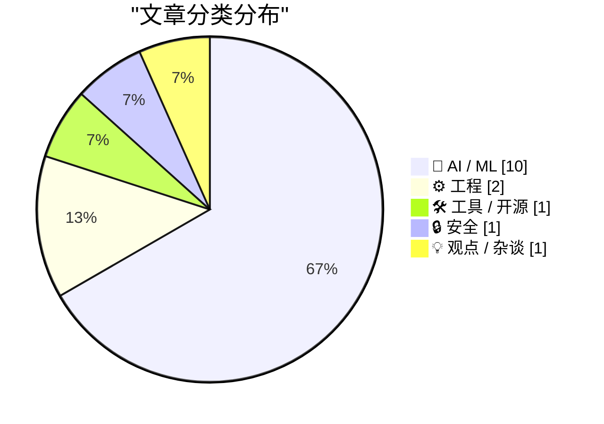
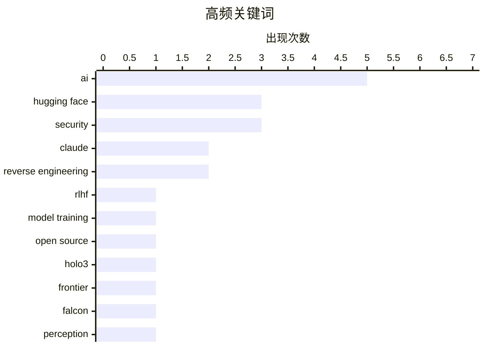

# 📰 AI 资讯每日精选 — 2026-04-02

> 汇聚 140+ 技术博客、X/Twitter、Hacker News、Reddit、Product Hunt、
> Lobste.rs、ClawFeed 日报及 GitHub Trending，经 AI 评分筛选。
>
> **本期内容**：🏆 今日必读 · 🌐 ClawFeed 日报 · 🔥 GitHub Trending · 📂 分类精选 · 🎨 设计与生成式 AI · 📊 数据概览

## 📝 今日看点

今日技术圈聚焦于AI能力的深度拓展与安全边界的激烈碰撞。一方面，大模型训练与多模态应用持续突破，从强化学习工具集的完善到视觉理解模型的演进，推动AI向更复杂任务迈进。另一方面，AI双刃剑效应凸显，从代码泄露引发的安全风险到被用于自动化生成高危漏洞利用程序，警示技术滥用带来的严峻挑战。与此同时，基础设施层正寻求变革，以应对微服务架构等现代工程实践带来的持久痛点。

---

## 🏆 今日必读

🥇 **Hugging Face 发布 TRL v1.0：集成75+种方法，支持SFT、DPO、GRPO及异步RL，用于开源模型后训练**

[Hugging Face released TRL v1.0, 75+ methods, SFT, DPO, GRPO, async RL to post-train open-source. 6 years from first commit to V1 🤯](https://www.reddit.com/r/LocalLLaMA/comments/1s9y9rn/hugging_face_released_trl_v10_75_methods_sft_dpo/) — r/LocalLLaMA · 2 小时前 · 🛠 工具 / 开源

> Hugging Face 正式发布了其强化学习训练库 TRL 的 1.0 版本。该版本集成了超过 75 种训练方法，核心功能包括监督微调（SFT）、直接偏好优化（DPO）、组相对策略优化（GRPO）以及异步强化学习。它旨在为开源大语言模型提供一套完整、高效的后训练工具链。这个版本标志着该项目从首次提交到稳定版历经了6年的发展。

💡 **为什么值得读**: 对于任何希望使用前沿RLHF技术微调或对齐开源大模型的开发者和研究者来说，TRL v1.0是一个必须了解的一站式工具库。

🏷️ Hugging Face, RLHF, model training, open source

🥈 **Holo3：突破计算机使用边界**

[Holo3: Breaking the Computer Use Frontier](https://huggingface.co/blog/Hcompany/holo3) — Hugging Face Blog · 7 小时前 · 🤖 AI / ML

> 文章介绍了Holo3项目，这是一个旨在突破人机交互现有范式的前沿探索。其核心是创建一个能够理解并执行复杂计算机操作指令的智能体，例如“帮我订一张最便宜的机票”。该方案可能结合了多模态感知、工具使用和长程任务规划能力。最终目标是让AI能够像人类一样自主、流畅地使用计算机完成开放世界任务。

💡 **为什么值得读**: 这篇文章揭示了AI智能体在通用计算机操作领域的最新进展，是理解下一代人机协作和自动化办公的关键窗口。

🏷️ Hugging Face, AI, Holo3, frontier

🥉 **猎鹰感知**

[Falcon Perception](https://huggingface.co/blog/tiiuae/falcon-perception) — Hugging Face Blog · 16 小时前 · 🤖 AI / ML

> 文章介绍了由TII（阿联酋技术创新研究所）开发的“Falcon Perception”多模态模型。该模型专注于视觉感知与理解任务，可能是Falcon系列大语言模型在视觉领域的扩展。它旨在处理图像输入，并生成关于图像内容的描述、分析或回答相关问题。这标志着TII在构建全能多模态AI系统上的重要布局。

💡 **为什么值得读**: 了解Falcon这一重要开源模型家族在视觉能力上的最新突破，对于关注多模态AI发展的从业者极具参考价值。

🏷️ Hugging Face, Falcon, perception, AI

4️⃣ **Anthropic泄露的AI编程工具在GitHub上被分叉超8000次，尽管大规模下架**

[Anthropic's leaked AI coding tool has been cloned over 8,000 times on GitHub despite mass takedowns](https://the-decoder.com/anthropics-leaked-ai-coding-tool-has-been-cloned-over-8000-times-on-github-despite-mass-takedowns/) — The Decoder · 5 小时前 · 🤖 AI / ML

> Anthropic不慎泄露了其AI编程工具Claude Code的源代码。尽管公司随后进行了大规模的下架删除（DMCA）行动，但泄露的影响已经难以控制。数据显示，该源代码在GitHub上已被克隆（fork）超过8000次，形成了广泛的传播。这表明一次核心代码的泄露可能对公司的技术壁垒和商业机密造成重大且持久的损害。

💡 **为什么值得读**: 该事件以具体数据揭示了顶级AI公司代码泄露后的真实传播规模与应对困境，是对企业技术安全的一次重要警示。

🏷️ Anthropic, Claude Code, leak, GitHub

5️⃣ **OpenAI正式确认巨额融资轮与ChatGPT超级应用**

[OpenAI officially confirms mega-funding round and ChatGPT super app](https://the-decoder.com/openai-officially-confirms-mega-funding-round-and-chatgpt-super-app/) — The Decoder · 15 小时前 · 🤖 AI / ML

> OpenAI完成了估值高达8520亿美元的1220亿美元融资轮，这是AI领域史上最大规模的融资之一。公司同时正式发布了“ChatGPT超级应用”，整合了其各项AI服务。此举明确标志着OpenAI的战略重心正向企业级市场进行强硬转向，旨在提供一体化的企业AI解决方案。

💡 **为什么值得读**: 通过了解OpenAI创纪录的融资和明确的“超级应用”企业战略，可以把握全球AI领头羊的未来商业动向和市场竞争格局。

🏷️ OpenAI, Funding, Enterprise AI

---

## 🌐 ClawFeed 日报精选

> 来源：[ClawFeed](https://clawfeed.kevinhe.io) — AI 驱动的多源新闻聚合

### 🔥 今日头条

### 1. Claude Code 源码泄漏 — Anthropic 最大安全事故
Anthropic 发布到 npm 的 Claude Code 包意外包含 60MB source-map 文件，暴露近 2000 个 TypeScript 文件、512K+ 行代码。安全研究者 Chaofan Shou (@shoucccc) 首先发现。社区迅速逆向出 44 个隐藏 feature flags、20 个未发布功能、完整 system prompt。claw-code 开源复刻项目不到 24 小时 GitHub 突破 5 万 Star。最敏感的是 harness 后端架构完整泄漏，对 Anthropic 企业客户和联邦合同构成严重冲击。更有人搞出 cc-gateway 反追踪工具，揭示 Anthropic 通过 640+ 遥测事件 + 40 维度指纹检测用户。VentureBeat / Ars Technica / Forbes / NDTV 等主流媒体均已报道。

### 2. OpenAI 完成 $1220 亿融资，估值 $8520 亿
创下 AI 公司史上最大单轮融资纪录，月收入已达 $20 亿。计划打造整合 ChatGPT + Codex + 浏览的「Superapp」。（来源：Yahoo Finance / TechCrunch / Bloomberg）

### 3. Google 量子计算论文震动加密圈
Google Quantum AI 发表论文称破解 256-bit ECC 加密所需资源缩减 20 倍，仅需 ~500K 物理量子比特（约 1,200 逻辑量子比特）即可在数分钟内破解 secp256k1。6.7M BTC 地址面临潜在量子威胁。Google 已将后量子密码学过渡期限提前至 2029。Blockstream 已在 Liquid 上用 Simplicity 脚本实现量子抗性签名。

### 4. Anthropic 宣布 Claude 永远不加广告
官方声明认为广告激励与真正有用的 AI 助手不兼容。同时与澳大利亚政府签署 AI 安全协议，共享 Economic Index 数据。

### 5. Qwen3.5-Omni 发布 — 全模态大模型
支持文本/图像/音频/视频输入，113 种语言语音识别，可处理 10 小时+ 音频。

---

### 📰 精选 Top 10

1. **@idoubicc** - 分析 Claude Code 源码后写了 open-agent-sdk 替代 claude-agent-sdk，本质是把 Claude Code 的壳做成开放 SDK。1.5K 赞，2.2K 书签，233K 浏览，爆款
https://x.com/idoubicc/status/2039006326882546141

2. **@aigclink** - Claude Code 泄漏后 cc-gateway 反封号工具：Anthropic 640+ 遥测事件 + 40 维度指纹每 5 秒上报，cc-gateway 在出网前重写所有身份指纹。915 赞，99K 浏览
https://x.com/aigclink/status/2039163692873650600

3. **@kmad** - Shopify 用 DSPy 把 AI 年成本从 $550 万砍到 $7.3 万！拆解业务逻辑 → DSPy 建模意图 → 优化小模型。266K 浏览
https://x.com/kmad/status/2038659241238503716

4. **@YukerX** - 深度解读 Claude Code 源码架构：为什么它比别人好用？从 source-map 逆向分析核心设计。210K 浏览，1.2K 赞
https://x.com/YukerX/status/2038959908968919297

5. **@Scobleizer** - 转推「The Only Moats That Matter」—— 在 AI 能构建任何软件的世界里，什么才是真正的护城河？489K 浏览，3.6K 书签
https://x.com/Scobleizer/status/2038780837643333717

6. **@rohanpaul_ai** - Wharton 研究揭示「Cognitive Surrender（认知投降）」：「AI 写、人 review」模式正在失效，人脑在审查 AI 输出时会放弃思考
https://x.com/rohanpaul_ai/status/2039037165079089160

7. **@ZHO_ZHO_ZHO** - 斯坦福研究：多模态模型存在「mirage reasoning」，模型根本没看图却能生成详细图像描述和推理，医学 benchmark 上照样拿高分
https://x.com/ZHO_ZHO_ZHO/status/2039171454466695277

8. **@lopp** - 解读 Google 和 Oratomic 两篇量子计算论文：500K qubit 几分钟破 ECC（20 倍缩减），26K qubit 几天破 ECC。对加密货币安全影响深远
https://x.com/lopp/status/2038942633897152588

9. **@DoveyWanCN** - Claude Code 泄漏最大风险：harness 架构暴露，Anthropic 企业客户和联邦合同 GG。「祝福梭哈 Anthropic 老股的朋友们」
https://x.com/DoveyWanCN/status/2038997433586425956

10. **@colinwu** - 加密行业大变局：ICO 和发币项目彻底死了，身边几乎没人炒币都在炒股，币圈没人创业都在转 AI。101K 浏览
https://x.com/colinwu/status/2038827231930405112

---

### 📊 今日观察

今天被一个事件完全主导：**Claude Code 源码泄漏**。从凌晨到晚间，六期简报中每一期的头条都是这个事件，热度从「发现泄漏」→「社区逆向分析」→「开源复刻项目爆发」→「反追踪工具出现」→「企业影响分析」持续升级。claw-code 开源项目 24 小时破 5 万 Star 创下 GitHub 历史记录，cc-gateway 反追踪工具的出现则说明 Anthropic 的安全信任危机已经从「代码泄漏」升级到「监控行为被反噬」。

与此同时，**量子计算威胁加密货币**成为第二大叙事线，Google 论文将破解门槛大幅降低，2029 后量子密码学过渡 deadline 让这个话题从「遥远的理论」变成了「需要行动的现实」。

OpenAI 的 $1220 亿融资和 Superapp 野心在任何其他日子都是绝对头条，但今天被 Anthropic 的灾难性泄漏抢了风头——某种意义上，这一天完美展现了 AI 竞赛中「攻守之势异也」的戏剧性。

愚人节噪音不少（X 改回 Twitter、ETH 源码泄漏恶搞），但真正的新闻比段子更离谱。

---

*基于 6 期 4h 简报汇总 | 2026-04-01 00:41 - 20:41 SGT*

---

## 🔥 GitHub Trending

> 今日热门开源项目（全语言 + Python）

| # | 项目 | 描述 | ⭐ 总星 | 📈 今日 | 语言 |
|---|------|------|---------|---------|------|
| 1 | [anthropics/claude-code](https://github.com/anthropics/claude-code) 🤖 | Claude Code is an agentic coding tool that lives in your ... | 100.5k | +10087 | Shell |
| 2 | [luongnv89/claude-howto](https://github.com/luongnv89/claude-howto) 🤖 | A visual, example-driven guide to Claude Code — from basi... | 15.5k | +3336 | Python |
| 3 | [openai/codex](https://github.com/openai/codex) 🤖 | Lightweight coding agent that runs in your terminal | 71.7k | +2345 | Rust |
| 4 | [microsoft/VibeVoice](https://github.com/microsoft/VibeVoice) 🤖 | Open-Source Frontier Voice AI | 34.4k | +1704 | Python |
| 5 | [NousResearch/hermes-agent](https://github.com/NousResearch/hermes-agent) 🤖 | The agent that grows with you | 21.6k | +1577 | Python |
| 6 | [sherlock-project/sherlock](https://github.com/sherlock-project/sherlock) | Hunt down social media accounts by username across social... | 76.4k | +798 | Python |
| 7 | [PaddlePaddle/PaddleOCR](https://github.com/PaddlePaddle/PaddleOCR) 🤖 | Turn any PDF or image document into structured data for y... | 74.6k | +768 | Python |
| 8 | [f/prompts.chat](https://github.com/f/prompts.chat) | f.k.a. Awesome ChatGPT Prompts. Share, discover, and coll... | 156.0k | +442 | HTML |
| 9 | [google-research/timesfm](https://github.com/google-research/timesfm) | TimesFM (Time Series Foundation Model) is a pretrained ti... | 12.1k | +358 | Python |
| 10 | [OpenBMB/ChatDev](https://github.com/OpenBMB/ChatDev) 🤖 | ChatDev 2.0: Dev All through LLM-powered Multi-Agent Coll... | 32.5k | +282 | Python |
| 11 | [sansan0/TrendRadar](https://github.com/sansan0/TrendRadar) 🤖 | ⭐AI-driven public opinion & trend monitor with multi-plat... | 50.5k | +259 | Python |
| 12 | [yusufkaraaslan/Skill_Seekers](https://github.com/yusufkaraaslan/Skill_Seekers) 🤖 | Convert documentation websites, GitHub repositories, and ... | 11.9k | +236 | Python |
| 13 | [axios/axios](https://github.com/axios/axios) | Promise based HTTP client for the browser and node.js | 108.9k | +148 | JavaScript |
| 14 | [Huanshere/VideoLingo](https://github.com/Huanshere/VideoLingo) 🤖 | Netflix-level subtitle cutting, translation, alignment, a... | 16.4k | +90 | Python |
| 15 | [allenai/OLMo-core](https://github.com/allenai/OLMo-core) | PyTorch building blocks for the OLMo ecosystem | 1.1k | +66 | Python |

---

## 🤖 AI / ML

### 1. Holo3：突破计算机使用边界

[Holo3: Breaking the Computer Use Frontier](https://huggingface.co/blog/Hcompany/holo3) — **Hugging Face Blog** · 7 小时前 · ⭐ 26/30

> 文章介绍了Holo3项目，这是一个旨在突破人机交互现有范式的前沿探索。其核心是创建一个能够理解并执行复杂计算机操作指令的智能体，例如“帮我订一张最便宜的机票”。该方案可能结合了多模态感知、工具使用和长程任务规划能力。最终目标是让AI能够像人类一样自主、流畅地使用计算机完成开放世界任务。

🏷️ Hugging Face, AI, Holo3, frontier

---

### 2. 猎鹰感知

[Falcon Perception](https://huggingface.co/blog/tiiuae/falcon-perception) — **Hugging Face Blog** · 16 小时前 · ⭐ 26/30

> 文章介绍了由TII（阿联酋技术创新研究所）开发的“Falcon Perception”多模态模型。该模型专注于视觉感知与理解任务，可能是Falcon系列大语言模型在视觉领域的扩展。它旨在处理图像输入，并生成关于图像内容的描述、分析或回答相关问题。这标志着TII在构建全能多模态AI系统上的重要布局。

🏷️ Hugging Face, Falcon, perception, AI

---

### 3. Anthropic泄露的AI编程工具在GitHub上被分叉超8000次，尽管大规模下架

[Anthropic's leaked AI coding tool has been cloned over 8,000 times on GitHub despite mass takedowns](https://the-decoder.com/anthropics-leaked-ai-coding-tool-has-been-cloned-over-8000-times-on-github-despite-mass-takedowns/) — **The Decoder** · 5 小时前 · ⭐ 26/30

> Anthropic不慎泄露了其AI编程工具Claude Code的源代码。尽管公司随后进行了大规模的下架删除（DMCA）行动，但泄露的影响已经难以控制。数据显示，该源代码在GitHub上已被克隆（fork）超过8000次，形成了广泛的传播。这表明一次核心代码的泄露可能对公司的技术壁垒和商业机密造成重大且持久的损害。

🏷️ Anthropic, Claude Code, leak, GitHub

---

### 4. OpenAI正式确认巨额融资轮与ChatGPT超级应用

[OpenAI officially confirms mega-funding round and ChatGPT super app](https://the-decoder.com/openai-officially-confirms-mega-funding-round-and-chatgpt-super-app/) — **The Decoder** · 15 小时前 · ⭐ 26/30

> OpenAI完成了估值高达8520亿美元的1220亿美元融资轮，这是AI领域史上最大规模的融资之一。公司同时正式发布了“ChatGPT超级应用”，整合了其各项AI服务。此举明确标志着OpenAI的战略重心正向企业级市场进行强硬转向，旨在提供一体化的企业AI解决方案。

🏷️ OpenAI, Funding, Enterprise AI

---

### 5. 什么是cch？逆向工程Claude Code的请求签名

[What's cch? Reverse Engineering Claude Code's Request Signing](https://www.reddit.com/r/programming/comments/1s98wuw/whats_cch_reverse_engineering_claude_codes/) — **r/programming** · 20 小时前 · ⭐ 25/30

> 文章深入解析了Anthropic的Claude Code API中一个名为“cch”的关键请求头。作者通过逆向工程发现，该头信息是用于请求签名和防篡改的安全机制。尽管作者最初尝试负责任地披露此发现，但未获Anthropic回应。随着该头部信息引起广泛关注，作者决定公开其逆向工程细节，揭示了Claude Code后端API的部分安全实现逻辑。

🏷️ Claude, reverse engineering, security

---

### 6. 2026年3月你可能错过的AI新闻

[AI News You Missed - March 2026](https://www.reddit.com/r/StableDiffusion/comments/1s96uot/ai_news_you_missed_march_2026/) — **r/StableDiffusion** · 22 小时前 · ⭐ 25/30

> 这是一份2026年3月的AI领域动态汇总，涵盖了除ComfyUI外的主要新发布。重点包括：NVIDIA发布了拥有880亿参数、注重推理速度的gpt-oss-puzzle-88B模型；出现了未经审查的Nemotron-Cascade-2-30B模型；以及Hugging Face发布了集成75+种方法的TRL v1.0训练库。摘要还提及了其他在图像生成、代码模型、语音AI等方面的进展，为读者提供了一个快速的月度技术全景扫描。

🏷️ LLM, AI News, Model Release

---

### 7. Neuralink 让渐冻症患者重新开口说话

[Neuralink enabling people with ALS to speak again.](https://www.reddit.com/r/singularity/comments/1s97at4/neuralink_enabling_people_with_als_to_speak_again/) — **r/singularity** · 22 小时前 · ⭐ 25/30

> Neuralink 的脑机接口技术正在帮助因肌萎缩侧索硬化症（ALS）而丧失语言能力的患者恢复交流能力。该技术通过植入式设备读取大脑神经信号，并将其转换为文本或合成语音输出。这一进展标志着脑机接口在医疗康复领域，特别是神经退行性疾病治疗方面取得了实质性突破。它为完全丧失运动能力的患者提供了一种与外界沟通的新途径。

🏷️ Neuralink, BCI, medical, ALS

---

### 8. Copilot 究竟是什么？

[What is Copilot exactly?](https://idiallo.com/blog/what-is-copilot-exactly?src=feed) — **idiallo.com** · 12 小时前 · ⭐ 24/30

> 文章探讨了开发者对 GitHub Copilot 这类 AI 编程助手从抵触到接纳的态度转变过程。作者最初因不适应其代码建议模式而排斥使用，但在观察到一位高效能的“10倍速工程师”同事高度依赖该工具后，决定摒弃偏见重新尝试。通过全面拥抱工具，作者发现了 Copilot 在提升编码效率、提供代码片段和减少上下文切换方面的实际价值。核心观点是，有效使用 AI 编程助手需要改变个人工作流而非简单复制传统编程习惯。

🏷️ Copilot, AI, productivity, developer tools

---

### 9. 谷歌 DeepMind 研究揭示可轻易劫持自主 AI 代理的六大“陷阱”

[Google Deepmind study exposes six "traps" that can easily hijack autonomous AI agents in the wild](https://the-decoder.com/google-deepmind-study-exposes-six-traps-that-can-easily-hijack-autonomous-ai-agents-in-the-wild/) — **The Decoder** · 6 小时前 · ⭐ 24/30

> 研究系统性地揭示了自主 AI 代理在真实网络环境中面临的六大安全威胁。这些威胁包括通过恶意网站、文档和 API 对代理进行操纵、欺骗和劫持。谷歌 DeepMind 团队首次对这些攻击方式进行了分类编目，指出代理赖以运行的环境本身可能被武器化。结论是，在设计能够自主浏览网页、处理邮件和执行交易的 AI 代理时，必须将这些环境攻击向量纳入核心安全考量。

🏷️ AI Agents, Security, Adversarial

---

### 10. Claude Code 源码揭秘：视觉指南

[Claude Code Unpacked : A visual guide](https://ccunpacked.dev/) — **Hacker News Best** · 18 小时前 · ⭐ 24/30

> 该网站提供了对 Anthropic 公司 Claude Code 模型疑似泄露源码的可视化分析指南。此事源于在其 NPM 注册表中发现的 map 文件可能导致了源代码泄露，相关话题在 Hacker News 上引发了巨大讨论（其中一个帖子获得 1023 点积分和 956 条评论）。指南旨在帮助开发者理解泄露代码的结构与内容。这一事件引发了关于 AI 模型透明度、知识产权和开源安全的广泛争议。

🏷️ Claude, AI, reverse engineering

---

## ⚙️ 工程

### 11. EmDash——一个解决插件安全问题的WordPress精神续作

[EmDash – a spiritual successor to WordPress that solves plugin security](https://blog.cloudflare.com/emdash-wordpress/) — **Hacker News Best** · 7 小时前 · ⭐ 25/30

> Cloudflare推出了一款名为EmDash的新产品，旨在成为WordPress的精神继承者，同时解决其最核心的插件安全问题。EmDash通过采用新的架构，将插件运行在安全的沙箱环境中，从而隔离了插件漏洞对主站点的威胁。其目标是保留WordPress的易用性和生态丰富性，但从根本上提升安全性。这为饱受安全困扰的CMS用户提供了一个有潜力的替代选择。

🏷️ WordPress, Security, CMS, Cloudflare

---

### 12. 微服务之痛可以避免，但传统数据库无能为力

[The pain of microservices can be avoided, but not with traditional databases](https://www.reddit.com/r/programming/comments/1s9sacp/the_pain_of_microservices_can_be_avoided_but_not/) — **r/programming** · 6 小时前 · ⭐ 25/30

> 文章指出，微服务架构带来的数据一致性、复杂事务和运维痛苦是普遍挑战。作者认为，这些问题的根源在于试图用为单体应用设计的传统关系型数据库来支撑微服务。解决方案并非回归单体，而是采用专为分布式系统设计的新型数据库或数据平台（如作者公司产品）。这类系统能原生提供强一致性、分布式事务和弹性伸缩能力，从而真正释放微服务的优势。

🏷️ microservices, databases, architecture

---

## 🛠 工具 / 开源

### 13. Hugging Face 发布 TRL v1.0：集成75+种方法，支持SFT、DPO、GRPO及异步RL，用于开源模型后训练

[Hugging Face released TRL v1.0, 75+ methods, SFT, DPO, GRPO, async RL to post-train open-source. 6 years from first commit to V1 🤯](https://www.reddit.com/r/LocalLLaMA/comments/1s9y9rn/hugging_face_released_trl_v10_75_methods_sft_dpo/) — **r/LocalLLaMA** · 2 小时前 · ⭐ 27/30

> Hugging Face 正式发布了其强化学习训练库 TRL 的 1.0 版本。该版本集成了超过 75 种训练方法，核心功能包括监督微调（SFT）、直接偏好优化（DPO）、组相对策略优化（GRPO）以及异步强化学习。它旨在为开源大语言模型提供一套完整、高效的后训练工具链。这个版本标志着该项目从首次提交到稳定版历经了6年的发展。

🏷️ Hugging Face, RLHF, model training, open source

---

## 🔒 安全

### 14. Claude编写了一个完整的FreeBSD远程内核RCE漏洞利用程序，可获取root shell

[Claude wrote a full FreeBSD remote kernel RCE with root shell](https://github.com/califio/publications/blob/main/MADBugs/CVE-2026-4747/write-up.md) — **Hacker News Best** · 18 小时前 · ⭐ 26/30

> 一份技术报告显示，研究人员利用Claude AI成功生成了一个针对FreeBSD操作系统内核漏洞（CVE-2026-4747）的完整远程代码执行（RCE）漏洞利用程序。该利用程序能够绕过系统安全机制，最终稳定地获取到目标系统的root权限shell。这证明了当前先进的大语言模型已具备辅助甚至自动化完成复杂漏洞利用开发的能力。此案例引发了关于AI在网络安全领域双重用途的深刻担忧。

🏷️ AI, exploit, FreeBSD, RCE

---

## 💡 观点 / 杂谈

### 15. 我放弃了。守旧派赢了

[I quit. The clankers won](https://dbushell.com/2026/04/01/i-quit-the-clankers-won/) — **Hacker News Best** · 15 小时前 · ⭐ 24/30

> 这是一篇发布于 2026 年 4 月 1 日的文章，标题暗示了作者在某种技术或理念斗争中的挫败感。“Clankers”可能喻指坚持陈旧技术或反对变革的保守势力。文章在 Hacker News 上获得了 364 点积分和 430 条评论，表明其话题引发了技术社区的广泛共鸣与讨论。其核心内容可能涉及 Web 开发、技术演进或开源文化中的理念冲突。

🏷️ web development, JavaScript, fatigue

---

## 🎨 Design & Generative AI

### 🖥️ 生成式 UI

- **[Mistral AI 的 Voxtral TTS 模型推出 ComfyUI 节点](https://www.reddit.com/r/comfyui/comments/1s9a72g/mistralai_voxtral4btts2603_comfyui_node/)** — r/comfyui · 19 小时前
  > Mistral AI 的 Voxtral-4B-TTS 语音合成模型现已提供 ComfyUI 节点，集成到工作流中。

- **[一键自动化：为 InfiniTalk 音频生成视频的 ComfyUI 节点](https://www.reddit.com/r/comfyui/comments/1s9zcha/i_claude_code_built_a_single_comfyui_node_that/)** — r/comfyui · 1 小时前
  > 作者通过 Claude 编码，创建了一个能自动处理任意长度音频的 ComfyUI 节点，简化了 InfiniTalk 视频生成流程。

- **[LangChain 将举办生成式 UI 主题之夜活动](https://x.com/LangChain/status/2039415358160097408)** — 𝕏 @LangChain · 5 小时前
  > LangChain 宣布举办线上活动，聚焦生成式 UI 和其 Deep Agent SDK 的流式处理应用。

- **[ComfyUI 为何持续隐藏节点？](https://www.reddit.com/r/comfyui/comments/1s9atss/why_do_you_keep_hiding_nodes/)** — r/comfyui · 19 小时前
  > 用户批评 ComfyUI 最近的更新方向倾向于隐藏重要节点，使其界面更像一个追求简单点击出结果的黑盒产品。

- **[如何屏蔽未连接节点的缺失模型错误？](https://www.reddit.com/r/comfyui/comments/1s9qct1/how_to_mute_missing_models_errors_for/)** — r/comfyui · 7 小时前
  > 用户寻求方法，以禁用 ComfyUI 最新版本中对未连接节点缺失模型报错的功能。

### 🖼️ 生成式图片

- **[在 ComfyUI 中进行 Pixaroma 节点实验](https://www.reddit.com/r/comfyui/comments/1s9n5lb/i_went_full_mad_scientist_in_comfyui_pixaroma/)** — r/comfyui · 9 小时前
  > 一篇关于在 ComfyUI 中深入探索和使用 Pixaroma 节点进行图像生成的教程或实验记录。

- **[Simple Captioner 更新：新增 Qwen 3.5 模型支持](https://www.reddit.com/r/comfyui/comments/1s9l6az/simple_captioner_update_1021_qwen_35_4b_and_9b/)** — r/comfyui · 10 小时前
  > ComfyUI 的 Simple Captioner 节点更新，新增了对 Qwen 3.5 4B 和 9B 模型的支持。

- **[ZIMAGE TURBO 图生图工作流优化](https://www.reddit.com/r/StableDiffusion/comments/1s96i3m/zimage_turbo_i2i_daemon/)** — r/StableDiffusion · 22 小时前
  > 作者分享了一个简化的 Z Image Turbo 工作流，旨在提升图像细节而不使流程过于复杂。

- **[ComfyUI 中利用 Seedance 2 工作流实现人脸一致性](https://www.reddit.com/r/comfyui/comments/1s9m19p/comfyui_face_consistency_with_seedance_2_workflow/)** — r/comfyui · 9 小时前
  > 探讨在 ComfyUI 中使用 Seedance 2 工作流时，解决其遮挡人脸问题并保持人脸一致性的方法。

- **[Z-Image Base 与 Turbo 模型该如何选择？](https://www.reddit.com/r/StableDiffusion/comments/1s9j13d/zimage_base_worth_it_vs_turbo/)** — r/StableDiffusion · 11 小时前
  > 用户询问在艺术创作和作为 Qwen Edit 的优化器时，Z-Image Base 模型是否仍比 Turbo 版本更有价值。

- **[图像质量下降，是我的操作有问题吗？](https://www.reddit.com/r/midjourney/comments/1s9i9b0/quality_of_images_have_decreased_am_i_doing/)** — r/midjourney · 12 小时前
  > Midjourney 新用户发现生成的图像质量有所下降，寻求可能的原因和解决方案。

- **[恢复 Civitai 旧版基础模型筛选样式的小脚本](https://www.reddit.com/r/StableDiffusion/comments/1s9diem/tiny_userscript_that_restores_the_old_chipstyle/)** — r/StableDiffusion · 16 小时前
  > 用户分享了一个小脚本，用于恢复 Civitai 网站上旧有的芯片式基础模型筛选器界面。

### 🌍 世界模型 / 3D

- **[Yedp Action Director v9.3 更新：路径追踪、高斯泼溅与场景保存](https://www.reddit.com/r/comfyui/comments/1s9cmwg/yedp_action_director_v93_update_path_tracing/)** — r/comfyui · 17 小时前
  > ComfyUI 插件更新，新增路径追踪渲染、高斯泼溅技术支持和场景保存功能。

### 🎬 生成式视频

- **[使用 AI 工具为我的网络漫画制作“动漫预告片”](https://www.reddit.com/r/StableDiffusion/comments/1s978c1/i_made_an_anime_trailer_for_my_webcomic_for_april/)** — r/StableDiffusion · 22 小时前
  > 作者利用 Wan/WAI/Noob 等 AI 视频生成工具，为其网络漫画创作了一个愚人节动漫风格预告片。

- **[LTX-2.3 图生视频模型的人物变形问题求助](https://www.reddit.com/r/StableDiffusion/comments/1s9ngnu/ltx23_imagetovideo_deformed_human_bodies_complete/)** — r/StableDiffusion · 8 小时前
  > 用户在使用 LTX-2.3 进行图生视频时遇到人物身体变形和角色特征丢失的问题，寻求解决方案。

---

## 📊 数据概览

| 扫描源 | 抓取文章 | 时间范围 | 精选 |
|:---:|:---:|:---:|:---:|
| 118/140 | 5239 篇 → 213 篇 | 24h | **15 篇** |

### 分类分布



### 高频关键词



<details>
<summary>📈 纯文本关键词图（终端友好）</summary>

```
ai                  │ ████████████████████ 5
hugging face        │ ████████████░░░░░░░░ 3
security            │ ████████████░░░░░░░░ 3
claude              │ ████████░░░░░░░░░░░░ 2
reverse engineering │ ████████░░░░░░░░░░░░ 2
rlhf                │ ████░░░░░░░░░░░░░░░░ 1
model training      │ ████░░░░░░░░░░░░░░░░ 1
open source         │ ████░░░░░░░░░░░░░░░░ 1
holo3               │ ████░░░░░░░░░░░░░░░░ 1
frontier            │ ████░░░░░░░░░░░░░░░░ 1
```

</details>

### 🏷️ 话题标签

**ai**(5) · **hugging face**(3) · **security**(3) · claude(2) · reverse engineering(2) · rlhf(1) · model training(1) · open source(1) · holo3(1) · frontier(1) · falcon(1) · perception(1) · anthropic(1) · claude code(1) · leak(1) · github(1) · openai(1) · funding(1) · enterprise ai(1) · exploit(1)

---

*生成于 2026-04-02 00:07 | 汇聚 140 个技术博客、X/Twitter、Hacker News、Reddit、Product Hunt、Lobste.rs、ClawFeed 日报及 GitHub Trending，经 AI 评分筛选出 Top 15 精华内容*
