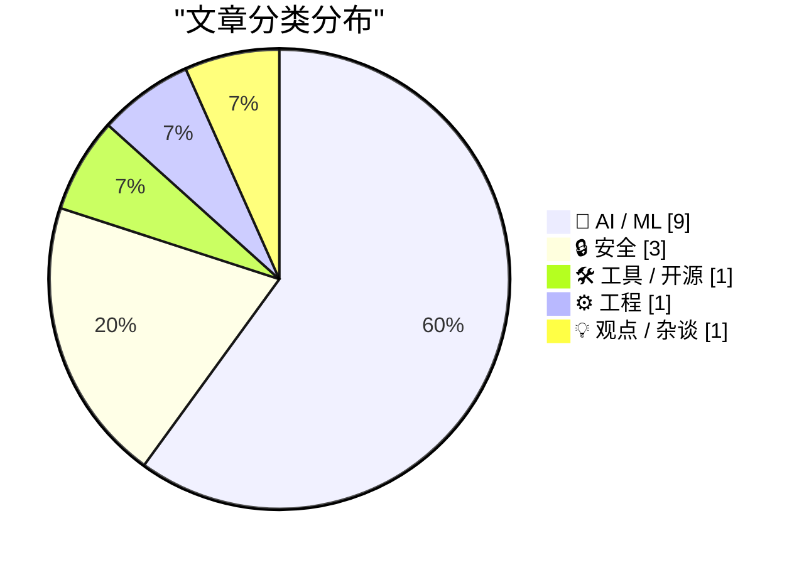
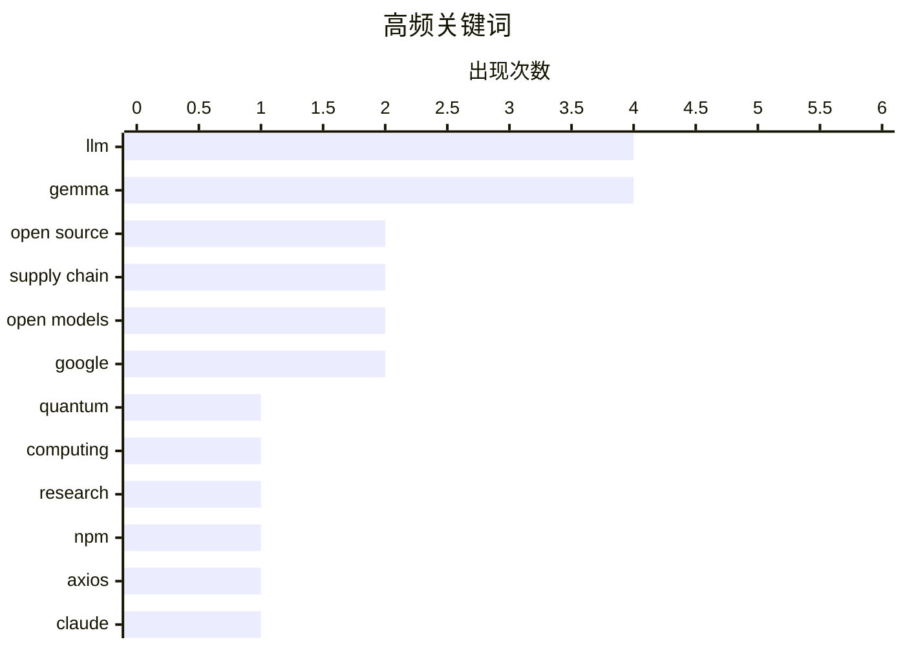

# 📰 AI 资讯每日精选 — 2026-04-03

> 汇聚 140+ 技术博客、X/Twitter、Hacker News、Reddit、Product Hunt、
> Lobste.rs、ClawFeed 日报及 GitHub Trending，经 AI 评分筛选。
>
> **本期内容**：🏆 今日必读 · 🌐 ClawFeed 日报 · 🔥 GitHub Trending · 📂 分类精选 · 🎨 设计与生成式 AI · 📊 数据概览

## 📝 今日看点

今日技术圈聚焦于AI开源生态的蓬勃发展与安全风险的严峻挑战。一方面，以谷歌Gemma 4系列为代表的强大开源模型正加速普及，推动AI能力向多模态和智能体方向演进，降低了前沿技术的使用门槛。另一方面，Axios等流行开源库遭供应链攻击的事件，再次尖锐警示过度依赖第三方组件所带来的系统性安全危机。与此同时，量子计算等基础领域取得严肃突破，预示着下一代计算范式正在稳步前进。

---

## 🏆 今日必读

🥇 **量子计算的重大进展：这些并非愚人节玩笑**

[Quantum computing bombshells that are not April Fools](https://scottaaronson.blog/?p=9665) — Hacker News Best · 23 小时前 · 🤖 AI / ML

> 文章汇总了近期量子计算领域真实且意义重大的突破性进展。这些进展可能包括量子霸权实验的验证、纠错码的突破或逻辑量子比特数量的显著提升。作者旨在澄清这些是严肃的科学成果，而非网络上的虚假信息或愚人节噱头。这反映了量子计算正从理论加速走向工程实践的关键阶段。

💡 **为什么值得读**: 通过权威专家视角，快速厘清量子计算领域最前沿、最真实的突破，避免被噪音信息误导。

🏷️ quantum, computing, research

🥈 **Gemma 4：参数字节比最高效、能力最强的开源模型**

[Gemma 4: Byte for byte, the most capable open models](https://simonwillison.net/2026/Apr/2/gemma-4/#atom-everything) — simonwillison.net · 5 小时前 · 🤖 AI / ML

> Google DeepMind发布了Gemma 4系列四个新的、具备视觉能力的开源大语言模型，参数规模分别为2B、4B、31B以及一个26B-A4B的混合专家模型，均采用Apache 2.0许可。其核心突破在于实现了“前所未有的单位参数智能水平”，即在更小的模型尺寸下提供更强的能力。这进一步证明，开发高效、实用的小型模型是当前最热门的研究方向之一。

💡 **为什么值得读**: 了解谷歌在高效小型开源模型上的最新成果，把握模型轻量化与性能平衡的前沿趋势。

🏷️ LLM, open source, Gemma

🥉 **流行NPM包Axios因维护者被攻击而遭供应链劫持**

[Axios, Super Popular NPM Package, Was Compromised in Attack on the Module’s Maintainer](https://www.stepsecurity.io/blog/axios-compromised-on-npm-malicious-versions-drop-remote-access-trojan) — daringfireball.net · 5 小时前 · 🔒 安全

> 广受欢迎的NPM包Axios的两个版本（1.14.1和0.30.4）被恶意劫持，攻击者通过入侵维护者账户实现。恶意代码并未直接植入axios包内，而是注入了一个名为plain-crypto-js@4.2.1的虚假依赖包。该恶意包的唯一目的是在安装后执行脚本，部署一个跨平台的远程访问木马，并与活跃的命令控制服务器通信。

💡 **为什么值得读**: 这是一个经典的供应链攻击案例，揭示了即使依赖包本身代码干净，其发布流程和依赖链仍是关键安全弱点。

🏷️ npm, supply chain, axios

4️⃣ **多元视角：Claude源代码泄露是件大好事**

[Pluralistic: It's extremely good that Claude's source-code leaked (02 Apr 2026)](https://pluralistic.net/2026/04/02/limited-monopoly/) — pluralistic.net · 13 小时前 · 🤖 AI / ML

> 文章核心观点是，Anthropic的AI助手Claude的源代码泄露对公众利大于弊。作者认为，这有助于打破大型科技公司在AI领域的“有限垄断”，促进透明度和公众审查。源代码的公开可以让外界更清楚地了解模型的潜在偏见、安全机制和训练数据边界。结论是，这种泄露推动了AI技术的民主化，符合公共利益。

💡 **为什么值得读**: 提供了一个反直觉的、支持AI开源与透明的激进视角，挑战了关于知识产权保密的传统商业逻辑。

🏷️ Claude, AI, source code, leak

5️⃣ **谷歌发布Gemma 4开源模型系列**

[Google releases Gemma 4 open models](https://deepmind.google/models/gemma/gemma-4/) — Hacker News Best · 7 小时前 · 🤖 AI / ML

> Google DeepMind正式发布了Gemma 4系列开源大语言模型。该系列包含2B、4B、31B参数规模的模型以及一个26B-A4B的混合专家模型，全部具备视觉理解能力并采用Apache 2.0许可证。模型强调在单位参数下实现更高的智能水平，代表了当前小型化、高效化模型研究的前沿。发布在Hacker News上引发了超过1000点热度和300多条评论，显示其受关注程度极高。

💡 **为什么值得读**: 作为官方发布源，提供最权威的模型规格信息和发布背景，是了解Gemma 4技术细节的第一手资料。

🏷️ Gemma, open models, release, Google

---

## 🌐 ClawFeed 日报精选

> 来源：[ClawFeed](https://clawfeed.kevinhe.io) — AI 驱动的多源新闻聚合

### 🔥 今日头条

### 1. Drift Protocol 遭 $2.8 亿黑客攻击
Solana 最大 DEX 之一 Drift Protocol 被盗约 $2.8 亿，包括 1.5 亿 JLP 和 6040 万 USDC，黑客已将部分资产转移至以太坊。存取款暂停，DRIFT 代币一小时暴跌 17%。项目联创曾上福布斯 U30。有观点认为可能是内部操作。
— Bloomberg / @_FORAB / @MoonDevOnYT

### 2. Anthropic Claude Code 源码泄露持续发酵
因 npm 包未剥离 source map，Anthropic 泄露 ~50 万行 Claude Code 源码（1906 个 TS 文件、44 个隐藏 feature flags），暴露 harness 架构和内部代号 "KAIROS"（计划中的 always-on 主动式 Agent）。开源社区一天内用 Rust 重建为 "Claw Code"，GitHub 斩获 139K 星。Anthropic 回应"人为失误，非安全漏洞"，但企业客户和联邦合同信任受重创。同时宣布 Claude 永不加广告。
— CNET / Axios / Fortune / Guardian / @DoveyWanCN / @billtheinvestor

### 3. OpenAI 二级市场股份遇冷，投资者转向 Anthropic
Bloomberg 报道约 6 家机构投资者试图出售约 $6 亿 OpenAI 股份但找不到买家，与此同时 Anthropic 股份需求创新高。
— Bloomberg

### 4. Qwen 3.6 Plus 发布，评测逼近 Claude Opus 4.6
阿里最新旗舰模型，1M context window，免费预览中。社区评测接近 Opus 4.6 水平。
— @kimmonismus / @ChujieZheng

### 5. Mercor AI 遭供应链攻击
Lapsus$ 通过 LiteLLM PyPI 包投毒攻入 AI 招聘独角兽 Mercor，声称窃取 4TB 数据，含大型实验室训练数据。
— TechCrunch

---

### 📰 精选 Top 10

1. **@VitalikButerin** - 发文分享「自主/本地/隐私/安全」LLM 方案（2026年4月版），主张 AI 不该自由访问个人数据，本地优先 + 沙盒 + 人机双确认
   https://x.com/VitalikButerin/status/2039581012469186771

2. **@idoubicc** - 用 Claude Code 分析源码后写了 open-agent-sdk（TS 重写版），一天涨 1.7k star，复刻核心功能移除 CLI 依赖，同步发布 Go 版本（300K views）
   https://x.com/idoubicc/status/2039006326882546141

3. **@0xJeff** - Agentic Payments 现状：x402 协议占 99.9%+ 交易量，单笔均值 30 天涨 21 倍至 $34.5，日均交易额从 $156K 飙到 $1.9M
   https://x.com/0xJeff/status/2039215210431656425

4. **@wquguru** - 出了两本开源书深度对比 Claude Code 和 Codex 的 Harness 工程实践，含源码解析（harness-books.agentway.dev）
   https://x.com/wquguru/status/2039519918291611656

5. **@zstmfhy** - GUI 给人用、CLI 给 AI 用成行业共识，飞书/企微/钉钉/即梦纷纷开放 CLI，AI Agent 的「动手能力」直接拉满（35K views）
   https://x.com/zstmfhy/status/2039334492360581425

6. **@jiayuan_jy** - 开源 Multica：AI-native 团队的 Agent+人协作平台，解决多人多 Agent 间 context 交换问题（33K views）
   https://x.com/jiayuan_jy/status/2039598198663336235

7. **@AYi_AInotes** - 红杉 Sequoia 定调：Services is the new software，AI Agent 正在吃掉超 $1T 服务市场
   https://x.com/AYi_AInotes/status/2039399089117512047

8. **@unbrowse** - 与 NUS 合作发论文 "Internal APIs Are All You Need"，agent 直接调内部 API 比 Playwright 快 3.6x
   https://x.com/unbrowse/status/2039675133443617268

9. **@kimmonismus** - Qwen 3.6 Plus 评测接近 Opus 4.6，喊话 Anthropic 该出 Opus 4.7 了（82K views）
   https://x.com/kimmonismus/status/2039596865511907619

10. **@shao__meng** - 分享 @clairevo 在 Lenny's Newsletter 发的 OpenClaw 完全指南，基于两个月实操用 9 个智能体搭建虚拟团队（21K views）
    https://x.com/shao__meng/status/2039331523833249841

---

### 📊 今日观察

今天信息流被两大事件主导：**Anthropic 源码泄露**和 **Drift 被盗 $2.8 亿**。

源码泄露事件的深远影响正在显现——开源社区不到 24 小时就用 Rust 重建了 "Claw Code"（139K GitHub 星），@idoubicc 的 open-agent-sdk 也突破 300K views。这说明 AI 基础设施的护城河不在代码本身，而在数据飞轮和算力壁垒。Anthropic 宣布"永不加广告"更像是危机公关下的信任重建。

AI Agent 生态继续爆发：红杉定调"Services is the new software"，CLI 成为 AI 的新接口，Multica/ColaOS 等 Agent 协作平台密集涌现。Agentic Payments（x402 协议）交易额 30 天涨 12 倍，链上 Agent 经济开始有实质数据支撑。

Qwen 3.6 Plus 逼近 Opus 4.6 水平是中国 AI 追赶的又一个里程碑，免费预览策略也在施压定价。

市场方面，BTC Q1 跌 22%（2018 以来最差），Trump 讲话后进一步跌至 $67K，但日本 Metaplanet 逆势买入 5075 BTC（$3.38 亿），成全球第三大 BTC 持仓上市公司。OpenAI 二级市场遇冷、投资者转向 Anthropic 是值得持续关注的信号。

—
*由 ClawFeed 自动生成 | 基于 6 期 4h 简报汇总*

---

## 🔥 GitHub Trending

> 今日热门开源项目（全语言 + Python）

| # | 项目 | 描述 | ⭐ 总星 | 📈 今日 | 语言 |
|---|------|------|---------|---------|------|
| 1 | [Yeachan-Heo/oh-my-codex](https://github.com/Yeachan-Heo/oh-my-codex) 🤖 | OmX - Oh My codeX: Your codex is not alone. Add hooks, ag... | 11.6k | +2867 | TypeScript |
| 2 | [siddharthvaddem/openscreen](https://github.com/siddharthvaddem/openscreen) | Create stunning demos for free. Open-source, no subscript... | 15.8k | +2573 | TypeScript |
| 3 | [google-research/timesfm](https://github.com/google-research/timesfm) | TimesFM (Time Series Foundation Model) is a pretrained ti... | 13.4k | +1176 | Python |
| 4 | [sherlock-project/sherlock](https://github.com/sherlock-project/sherlock) | Hunt down social media accounts by username across social... | 77.2k | +827 | Python |
| 5 | [roboflow/supervision](https://github.com/roboflow/supervision) 🤖 | We write your reusable computer vision tools. 💜 | 37.4k | +535 | Python |
| 6 | [asgeirtj/system_prompts_leaks](https://github.com/asgeirtj/system_prompts_leaks) 🤖 | Extracted system prompts from ChatGPT (GPT-5.4, GPT-5.3, ... | 36.3k | +306 | - |
| 7 | [yusufkaraaslan/Skill_Seekers](https://github.com/yusufkaraaslan/Skill_Seekers) 🤖 | Convert documentation websites, GitHub repositories, and ... | 12.1k | +264 | Python |
| 8 | [zai-org/GLM-OCR](https://github.com/zai-org/GLM-OCR) | GLM-OCR: Accurate × Fast × Comprehensive | 5.2k | +237 | Python |
| 9 | [MervinPraison/PraisonAI](https://github.com/MervinPraison/PraisonAI) 🤖 | PraisonAI 🦞 - Your 24/7 AI employee team. Automate and s... | 6.3k | +107 | Python |
| 10 | [Alishahryar1/free-claude-code](https://github.com/Alishahryar1/free-claude-code) 🤖 | Use claude-code for free in the terminal, VSCode extensio... | 1.4k | +57 | Python |

---

## 🤖 AI / ML

### 1. 量子计算的重大进展：这些并非愚人节玩笑

[Quantum computing bombshells that are not April Fools](https://scottaaronson.blog/?p=9665) — **Hacker News Best** · 23 小时前 · ⭐ 28/30

> 文章汇总了近期量子计算领域真实且意义重大的突破性进展。这些进展可能包括量子霸权实验的验证、纠错码的突破或逻辑量子比特数量的显著提升。作者旨在澄清这些是严肃的科学成果，而非网络上的虚假信息或愚人节噱头。这反映了量子计算正从理论加速走向工程实践的关键阶段。

🏷️ quantum, computing, research

---

### 2. Gemma 4：参数字节比最高效、能力最强的开源模型

[Gemma 4: Byte for byte, the most capable open models](https://simonwillison.net/2026/Apr/2/gemma-4/#atom-everything) — **simonwillison.net** · 5 小时前 · ⭐ 27/30

> Google DeepMind发布了Gemma 4系列四个新的、具备视觉能力的开源大语言模型，参数规模分别为2B、4B、31B以及一个26B-A4B的混合专家模型，均采用Apache 2.0许可。其核心突破在于实现了“前所未有的单位参数智能水平”，即在更小的模型尺寸下提供更强的能力。这进一步证明，开发高效、实用的小型模型是当前最热门的研究方向之一。

🏷️ LLM, open source, Gemma

---

### 3. 多元视角：Claude源代码泄露是件大好事

[Pluralistic: It's extremely good that Claude's source-code leaked (02 Apr 2026)](https://pluralistic.net/2026/04/02/limited-monopoly/) — **pluralistic.net** · 13 小时前 · ⭐ 27/30

> 文章核心观点是，Anthropic的AI助手Claude的源代码泄露对公众利大于弊。作者认为，这有助于打破大型科技公司在AI领域的“有限垄断”，促进透明度和公众审查。源代码的公开可以让外界更清楚地了解模型的潜在偏见、安全机制和训练数据边界。结论是，这种泄露推动了AI技术的民主化，符合公共利益。

🏷️ Claude, AI, source code, leak

---

### 4. 谷歌发布Gemma 4开源模型系列

[Google releases Gemma 4 open models](https://deepmind.google/models/gemma/gemma-4/) — **Hacker News Best** · 7 小时前 · ⭐ 27/30

> Google DeepMind正式发布了Gemma 4系列开源大语言模型。该系列包含2B、4B、31B参数规模的模型以及一个26B-A4B的混合专家模型，全部具备视觉理解能力并采用Apache 2.0许可证。模型强调在单位参数下实现更高的智能水平，代表了当前小型化、高效化模型研究的前沿。发布在Hacker News上引发了超过1000点热度和300多条评论，显示其受关注程度极高。

🏷️ Gemma, open models, release, Google

---

### 5. Qwen3.6-Plus：迈向现实世界智能体

[Qwen3.6-Plus: Towards real world agents](https://qwen.ai/blog?id=qwen3.6) — **Hacker News Best** · 9 小时前 · ⭐ 27/30

> 通义千问团队发布了Qwen3.6-Plus模型，其核心目标是推动大语言模型向能够解决实际问题的“智能体”方向发展。该模型在复杂任务规划、工具使用和与环境交互方面进行了重点优化。它旨在突破传统对话模型的局限，执行更接近人类工作流的、多步骤的实操任务。

🏷️ Qwen, LLM, AI agents

---

### 6. 斯坦福CS 25 Transformer课程（向所有人开放 | 明日开课）

[Stanford CS 25 Transformers Course (OPEN TO ALL | Starts Tomorrow)](https://www.reddit.com/r/MachineLearning/comments/1sa3cf0/stanford_cs_25_transformers_course_open_to_all/) — **r/MachineLearning** · 22 小时前 · ⭐ 27/30

> 斯坦福大学著名的CS 25（Transformers）课程新一期即将开课，并且完全向公众免费开放。该课程深度聚焦Transformer架构这一现代AI的核心基石，内容涵盖从基础原理到前沿研究的各个方面。课程通常提供在线视频、讲义和作业，是系统学习Transformer技术的顶级教育资源。

🏷️ Transformers, course, Stanford

---

### 7. 谷歌Gemma 4首次以Apache 2.0许可协议发布

[Google's Gemma 4 is now available with Apache 2.0 licensing for the first time](https://the-decoder.com/googles-gemma-4-is-now-available-with-apache-2-0-licensing-for-the-first-time/) — **The Decoder** · 6 小时前 · ⭐ 26/30

> 谷歌发布了其迄今为止能力最强的开源模型系列Gemma 4。新发布的四个模型首次采用了完全开放的Apache 2.0许可证，这意味着开发者拥有更自由的商业使用和分发权利。这些模型设计轻量，能够从智能手机到工作站等多种设备上运行。此举旨在通过更宽松的许可协议，进一步降低开发者和企业使用先进AI模型的门槛。

🏷️ Gemma, open-source, LLM, Google

---

### 8. Gemma 4：按字节计算，最强大的开源模型

[Gemma 4: Byte for byte, the most capable open models](https://deepmind.google/blog/gemma-4-byte-for-byte-the-most-capable-open-models/) — **Google DeepMind Blog** · 8 小时前 · ⭐ 26/30

> 谷歌DeepMind发布了迄今为止最智能的开源模型Gemma 4。该系列模型专为高级推理和智能体工作流而构建，在同等参数规模下实现了最佳性能。模型支持从文本到图像、视频的多模态理解，并具备动态分辨率处理能力。其目标是成为开发者在构建复杂AI应用时，在性能与开放性之间的最佳选择。

🏷️ Gemma, open models, reasoning, agents

---

### 9. [项目] Gemma 4在NVIDIA B200和AMD MI355X上运行，吞吐量比vLLM on Blackwell高15%

[[P] Gemma 4 running on NVIDIA B200 and AMD MI355X from the same inference stack, 15% throughput gain over vLLM on Blackwell](https://www.reddit.com/r/MachineLearning/comments/1saot07/p_gemma_4_running_on_nvidia_b200_and_amd_mi355x/) — **r/MachineLearning** · 6 小时前 · ⭐ 26/30

> 社区在Gemma 4发布当天，成功在统一的MAX推理栈上部署了其31B密集模型和26B MoE模型。测试覆盖了NVIDIA B200和AMD MI355X两种不同的硬件平台。在NVIDIA B200上，该推理栈实现了比vLLM on Blackwell高15%的吞吐量增益。这证明了Gemma 4模型及其配套推理工具在跨硬件性能和部署效率上的优势。

🏷️ Gemma 4, Inference, Benchmark, vLLM

---

## 🔒 安全

### 10. 流行NPM包Axios因维护者被攻击而遭供应链劫持

[Axios, Super Popular NPM Package, Was Compromised in Attack on the Module’s Maintainer](https://www.stepsecurity.io/blog/axios-compromised-on-npm-malicious-versions-drop-remote-access-trojan) — **daringfireball.net** · 5 小时前 · ⭐ 27/30

> 广受欢迎的NPM包Axios的两个版本（1.14.1和0.30.4）被恶意劫持，攻击者通过入侵维护者账户实现。恶意代码并未直接植入axios包内，而是注入了一个名为plain-crypto-js@4.2.1的虚假依赖包。该恶意包的唯一目的是在安装后执行脚本，部署一个跨平台的远程访问木马，并与活跃的命令控制服务器通信。

🏷️ npm, supply chain, axios

---

### 11. 你添加的每一个依赖，都是一个等待发生的供应链攻击

[Every dependency you add is a supply chain attack waiting to happen](https://benhoyt.com/writings/dependencies/) — **Lobste.rs** · 12 小时前 · ⭐ 27/30

> 文章的核心论点是，现代软件开发中过度依赖第三方库会引入巨大的安全风险。每一个外部依赖都扩大了软件的攻击面，其维护者、发布流程或依赖树中的任何一环被攻破，都可能导致你的项目被植入恶意代码。作者呼吁开发者应审慎评估每个依赖的必要性，并建立严格的供应链安全审查机制。

🏷️ Supply Chain, Security, Dependencies

---

### 12. LinkedIn正在扫描你的浏览器扩展程序

[LinkedIn is searching your browser extensions](https://browsergate.eu/) — **Hacker News Best** · 11 小时前 · ⭐ 26/30

> 有报道指出，LinkedIn网站正在主动扫描访问用户的浏览器扩展程序。这一行为引发了关于用户隐私和数据安全的广泛担忧。在Hacker News的相关讨论中，该话题获得了超过1500个赞和673条评论，显示出极高的社区关注度。技术社区主要质疑其必要性、透明性以及可能存在的安全风险。

🏷️ privacy, browser, tracking

---

## 🛠 工具 / 开源

### 13. AMD的Lemonade：一个快速、开源的本地LLM服务器，利用GPU和NPU

[Lemonade by AMD: a fast and open source local LLM server using GPU and NPU](https://lemonade-server.ai) — **Hacker News Best** · 13 小时前 · ⭐ 27/30

> AMD推出了一款名为Lemonade的开源本地大语言模型服务器。其最大特点是能够同时利用GPU和NPU（神经处理单元）来加速推理，旨在提供高性能的本地模型服务体验。该项目完全开源，为开发者在AMD硬件平台上部署和优化LLM提供了新的工具选择。

🏷️ LLM, server, GPU, open source

---

## ⚙️ 工程

### 14. 事故复盘：2026年1月服务中断事件

[Incident postmortem: January 2026 service disruptions](https://www.reddit.com/r/programming/comments/1sauknr/incident_postmortem_january_2026_service/) — **r/programming** · 2 小时前 · ⭐ 27/30

> 这是一份关于2026年1月发生的重大服务中断事件的详细事后分析报告。报告会系统性地梳理事故的时间线、根本原因、影响范围以及恢复过程。其核心价值在于公开总结从故障中吸取的教训，并阐述为防止类似事件再次发生所采取的改进措施。

🏷️ postmortem, incident, reliability

---

## 💡 观点 / 杂谈

### 15. OpenAI总裁谈AGI："我认为我们离得很近，未来几年内必然实现"

[OpenAI president on AGI: • "I'd say I'm basically like 70, 80% there. So I think we're quite close." • "I think it's extremely clear that we are going to have AGI within the next couple years."](https://www.reddit.com/r/singularity/comments/1saf7m8/openai_president_on_agi_id_say_im_basically_like/) — **r/singularity** · 12 小时前 · ⭐ 26/30

> OpenAI总裁Sam Altman公开表达了对实现通用人工智能（AGI）的乐观预期。他个人认为AGI的研发进度已完成约70-80%，距离目标“相当接近”。Altman断言，AGI在“未来几年内”出现是“极其明确”的。这一表态再次引发了关于AGI时间表和其社会影响的激烈讨论。

🏷️ AGI, OpenAI, prediction, timeline

---

## 🎨 Design & Generative AI

### 🖥️ 生成式 UI

- **[[进行中] ComfyUI Omnivoice语音克隆节点](https://www.reddit.com/r/StableDiffusion/comments/1sapll4/wip_working_comfyui_omnivoice/)** — r/StableDiffusion · 5 小时前
  > 正在开发中的ComfyUI Omnivoice节点，具备良好的语音克隆能力，仅需3秒样本但需转录文本。

### 🖼️ 生成式图片

- **[LTX桌面版1.0.3发布：16GB显存即可运行](https://www.reddit.com/r/StableDiffusion/comments/1sajk80/ltx_desktop_103_is_live_now_runs_on_16_gb_vram/)** — r/StableDiffusion · 9 小时前
  > LTX桌面版通过集成模型层流式传输，大幅降低峰值显存占用，现可在16GB显存的机器上运行。

- **[我的首个ComfyUI自定义节点：采样器迭代器与文本叠加](https://www.reddit.com/r/comfyui/comments/1sahwyw/my_first_nodes_for_comfyui_samplerscheduler/)** — r/comfyui · 10 小时前
  > 作者分享了为ComfyUI开发的第一个自定义节点集，包括采样器/调度器迭代器和文本叠加节点。

- **[LoRA画廊加载器——ComfyUI自定义节点更新](https://www.reddit.com/r/StableDiffusion/comments/1sa6gqg/lora_gallery_loader_comfyui_custom_node/)** — r/StableDiffusion · 20 小时前
  > ComfyUI自定义节点更新，提供更好的LoRA可视化浏览和管理功能，并新增触发词搜索栏。

- **[ACE-Step 1.5 XL模型将于两日内发布](https://www.reddit.com/r/StableDiffusion/comments/1sai4q2/acestep_15_xl_will_be_released_in_the_next_two/)** — r/StableDiffusion · 10 小时前
  > ACE-Step 1.5 XL图像生成模型即将在两天内发布。

- **[回归AI绘图圈：Flux与SD3之争后，谁主沉浮？](https://www.reddit.com/r/StableDiffusion/comments/1sakrxz/i_was_around_for_the_flux_killing_sd3_era_i_left/)** — r/StableDiffusion · 8 小时前
  > 作者回顾离开期间AI图像生成领域的变化，探讨Flux、SD3、ComfyUI等工具的实际影响力与市场格局。

- **[在ComfyUI+RunPod上批量进行强力风格迁移](https://www.reddit.com/r/comfyui/comments/1saw5fu/aggressive_style_transfer_in_batch_on_comfyui/)** — r/comfyui · 1 小时前
  > 用户寻求在RunPod上使用ComfyUI对约90张图像进行强力（非柔和）风格迁移的成熟工作流。

- **[LoRA在GGUF模型上负载更重是正常现象吗？](https://www.reddit.com/r/comfyui/comments/1saej1l/is_it_normal_that_loras_are_much_heavier_with/)** — r/comfyui · 12 小时前
  > 用户询问使用GGUF格式模型时，加载LoRA导致推理时间从35秒增至50秒是否正常，并寻求优化方案。

- **[风格迁移技术探讨：2024年4月最佳方案是什么？](https://www.reddit.com/r/comfyui/comments/1sago22/style_transfer/)** — r/comfyui · 11 小时前
  > 用户咨询截至2024年4月，在ComfyUI中进行图像风格迁移的最佳方案或节点选择。

### 🎬 生成式视频

- **[开源工具一键集成ML任务，含Wan 2.1文生视频](https://www.reddit.com/r/StableDiffusion/comments/1saswah/open_source_tool_that_packages_ml_tasks_into/)** — r/StableDiffusion · 3 小时前
  > Transformer Lab团队推出开源平台，提供预置任务实现一键式ML工作流，包括模型下载和Wan 2.1文生视频等。

- **[LTX 2.3在4090上2分26秒生成20秒竖屏POV视频](https://www.reddit.com/r/StableDiffusion/comments/1sadsws/ltx_23_20_second_vertical_pov_video_generated_in/)** — r/StableDiffusion · 13 小时前
  > 使用LTX 2.3在RTX 4090上快速生成了包含对话、角色表演和氛围音的20秒咖啡馆竖屏POV视频。

- **[新动态显存功能助力在5070Ti上一次性生成40秒视频](https://www.reddit.com/r/comfyui/comments/1saun8q/with_the_new_dynamic_vram_you_can_even_make_40/)** — r/comfyui · 2 小时前
  > 借助新的动态显存功能，在RTX 5070Ti和32GB内存上可一次性生成768x1280分辨率的40秒视频。

- **[通用模型 | GEN-1发布](https://www.reddit.com/r/singularity/comments/1sai9i8/generalist_introducing_gen1/)** — r/singularity · 10 小时前
  > 介绍通用视频生成模型GEN-1的发布。

- **[《幸存AI》——完全使用本地AI模型制作的短片](https://www.reddit.com/r/StableDiffusion/comments/1sa2q1o/surviving_ai_short_film_made_only_using_local_ai/)** — r/StableDiffusion · 23 小时前
  > 一部完全使用本地AI模型（如Stable Diffusion）生成的短片。

- **[LTX 2.3桌面工具更新，支持LoRA与多帧插入](https://www.reddit.com/r/comfyui/comments/1sacrrg/the_ltx_23_desktop_tool_has_been_updated_now/)** — r/comfyui · 14 小时前
  > LTX 2.3桌面视频生成工具迎来更新，新增对LoRA模型和多帧插入功能的支持。

---

## 📊 数据概览

| 扫描源 | 抓取文章 | 时间范围 | 精选 |
|:---:|:---:|:---:|:---:|
| 116/140 | 5280 篇 → 236 篇 | 24h | **15 篇** |

### 分类分布



### 高频关键词



<details>
<summary>📈 纯文本关键词图（终端友好）</summary>

```
llm          │ ████████████████████ 4
gemma        │ ████████████████████ 4
open source  │ ██████████░░░░░░░░░░ 2
supply chain │ ██████████░░░░░░░░░░ 2
open models  │ ██████████░░░░░░░░░░ 2
google       │ ██████████░░░░░░░░░░ 2
quantum      │ █████░░░░░░░░░░░░░░░ 1
computing    │ █████░░░░░░░░░░░░░░░ 1
research     │ █████░░░░░░░░░░░░░░░ 1
npm          │ █████░░░░░░░░░░░░░░░ 1
```

</details>

### 🏷️ 话题标签

**llm**(4) · **gemma**(4) · **open source**(2) · supply chain(2) · open models(2) · google(2) · quantum(1) · computing(1) · research(1) · npm(1) · axios(1) · claude(1) · ai(1) · source code(1) · leak(1) · release(1) · qwen(1) · ai agents(1) · server(1) · gpu(1)

---

*生成于 2026-04-03 00:09 | 汇聚 140 个技术博客、X/Twitter、Hacker News、Reddit、Product Hunt、Lobste.rs、ClawFeed 日报及 GitHub Trending，经 AI 评分筛选出 Top 15 精华内容*
