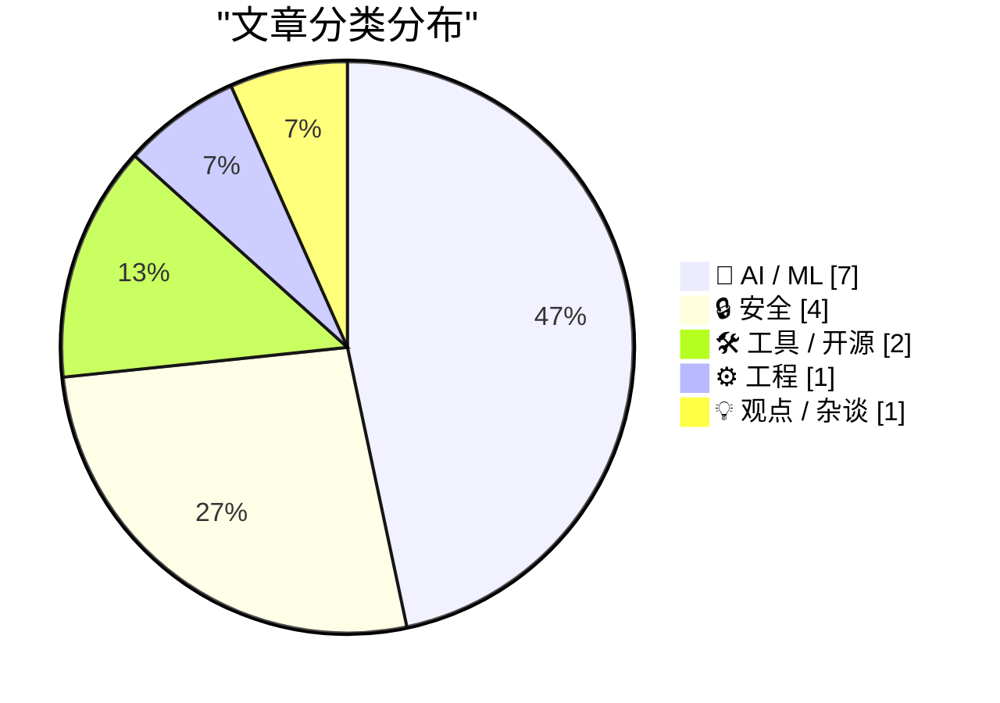
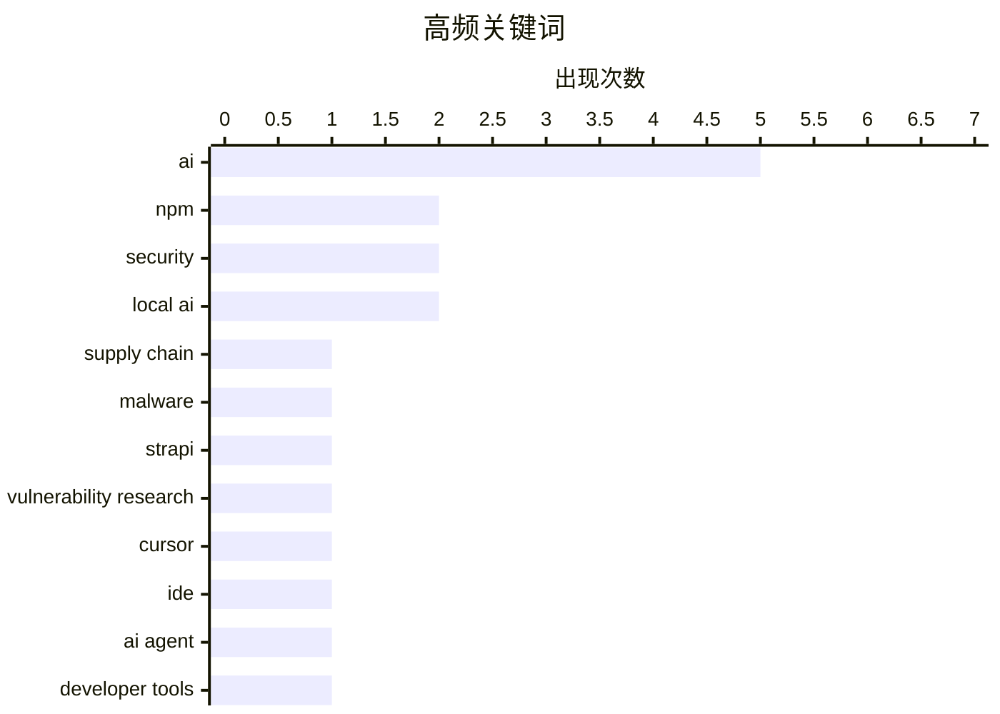

# 📰 AI 资讯每日精选 — 2026-04-04

> 汇聚 140+ 技术博客、X/Twitter、Hacker News、Reddit、Product Hunt、
> Lobste.rs、ClawFeed 日报及 GitHub Trending，经 AI 评分筛选。
>
> **本期内容**：🏆 今日必读 · 🌐 ClawFeed 日报 · 🔥 GitHub Trending · 📂 分类精选 · 🎨 设计与生成式 AI · 📊 数据概览

## 📝 今日看点

今日技术圈的核心焦点在于AI驱动的范式变革与日益严峻的安全威胁。一方面，AI正从工具演变为开发与创作的核心主体，编程范式向“智能体优先”转变，模型能力的阶跃式发展迫使行业重新布局。另一方面，供应链攻击手段愈发狡诈，从插件生态到社交工程，安全防线面临持续考验。同时，利用本地硬件运行AI模型正成为重要趋势，推动智能计算向边缘扩散。

---

## 🏆 今日必读

🥇 **有人正针对 Strapi 插件生态积极发布恶意软件包**

[Someone is actively publishing malicious packages targeting the Strapi plugin ecosystem right now](https://www.reddit.com/r/programming/comments/1sbkx3b/someone_is_actively_publishing_malicious_packages/) — r/programming · 6 小时前 · 🔒 安全

> Strapi 插件生态正遭受一场活跃的供应链攻击。攻击者发布了伪装成合法社区插件（如 `strapi-plugin-events` 3.6.8）的恶意包，安装时会自动执行11个阶段的攻击，窃取 `.env` 文件、JWT密钥、数据库凭证、Redis数据等敏感信息。该攻击无需用户交互，完全自动化，对使用受影响插件的项目构成严重安全威胁。这起事件凸显了开源软件供应链的脆弱性，开发者需对依赖项保持高度警惕。

💡 **为什么值得读**: 该文及时揭露了针对流行开源框架的自动化供应链攻击手法，对任何使用 Strapi 或关注依赖安全的开发者都具有迫切的警示意义。

🏷️ supply chain, npm, malware, Strapi

🥈 **漏洞研究“熟透了”：前沿模型将彻底改变攻防格局**

[Vulnerability Research Is Cooked](https://simonwillison.net/2026/Apr/3/vulnerability-research-is-cooked/#atom-everything) — simonwillison.net · 8 分钟前 · 🔒 安全

> 文章探讨了前沿AI模型对漏洞研究和利用开发领域的颠覆性影响。作者Thomas Ptacek认为，编码智能体将在未来几个月内，以阶跃函数而非渐进的方式，彻底改变漏洞挖掘和利用开发的经济学与实践。这意味着漏洞研究的成本和门槛将急剧下降，攻击能力将大规模普及。结论是，安全社区必须正视这一即将到来的范式转变，并重新思考防御策略。

💡 **为什么值得读**: 本文提供了安全专家对AI如何重塑网络安全攻防格局的深刻洞见，有助于读者提前理解并应对即将到来的安全挑战。

🏷️ vulnerability research, AI, security

🥉 **新版 Cursor 3 抛弃经典 IDE 布局，推出围绕并行AI舰队构建的“智能体优先”界面**

[New Cursor 3 ditches the classic IDE layout for an "agent-first" interface built around parallel AI fleets](https://the-decoder.com/new-cursor-3-ditches-the-classic-ide-layout-for-an-agent-first-interface-built-around-parallel-ai-fleets/) — The Decoder · 14 小时前 · 🛠 工具 / 开源

> AI编程工具 Cursor 发布了颠覆性的第3版，其核心是从传统代码编辑器转向以AI智能体为中心的开发范式。新版界面完全重新设计，旨在让开发者从手动编码转向并行运行多个AI智能体（AI fleets）来协同完成任务。这一变化标志着开发工具正从辅助编程向由AI主导的协作模式演进。Cursor 3 的发布预示着AI编程工具正进入一个以智能体协同为核心的新阶段。

💡 **为什么值得读**: 通过了解 Cursor 3 的革命性设计，开发者可以前瞻性地把握AI编程工具的未来发展方向和工作流变革。

🏷️ Cursor, IDE, AI agent, developer tools

4️⃣ **Apfel – 您 Mac 上已有的免费 AI**

[Show HN: Apfel – The free AI already on your Mac](https://apfel.franzai.com) — Hacker News Best · 14 小时前 · 🤖 AI / ML

> Apfel 是一个开源项目，旨在利用 Mac 电脑内置的硬件和软件能力来提供本地AI功能。它可能通过调用 Apple 的 Neural Engine 或相关框架，让用户无需依赖云端服务即可运行某些AI任务。该项目在 Hacker News 上获得了高度关注（634 分，137 条评论），反映了社区对本地、隐私友好型AI解决方案的强烈兴趣。Apfel 代表了将AI能力深度集成到个人设备操作系统中的一种探索。

💡 **为什么值得读**: 对于注重隐私、希望利用本地硬件运行AI的Mac用户，该项目提供了一个极具吸引力的免费、开源选择。

🏷️ local AI, macOS, open source, privacy

5️⃣ **Altman 谈关闭 Sora：没料到进展如此之快，下一代模型及其驱动的智能体将再次引发巨变**

[Altman on shutting down Sora: 'I did not expect 3 or 6 months ago to be at this point we're at now; where something very big and important is about to happen again with this next generation of models and the agents they can power.'](https://www.reddit.com/r/singularity/comments/1sb4hnn/altman_on_shutting_down_sora_i_did_not_expect_3/) — r/singularity · 18 小时前 · 🤖 AI / ML

> OpenAI CEO Sam Altman 透露，公司在看到Sora等项目的突破性进展后，果断关闭了许多运行良好的其他项目（如机器人部门）。他表示，仅在3到6个月前都未预料到能取得当前成就，并强调由下一代模型驱动的AI智能体即将引发又一次重大变革。这表明 OpenAI 内部判断，基于视频生成模型和智能体的技术路径具有更高的优先级和颠覆潜力。Altman 的言论暗示着AI领域正处在一个新的、关键性的爆发前夜。

💡 **为什么值得读**: 通过OpenAI领导人的内部视角，可以窥见顶级AI实验室对技术发展重心的最新判断和战略调整，极具参考价值。

🏷️ Sam Altman, Sora, AI agents, next-generation models

---

## 🌐 ClawFeed 日报精选

> 来源：[ClawFeed](https://clawfeed.kevinhe.io) — AI 驱动的多源新闻聚合

### 🔥 今日头条

### 1. Google 发布 Gemma 4 开源模型家族
四个尺寸（31B Dense / 26B MoE / E4B / E2B Edge），Apache 2.0 开源，专为推理和 agentic workflow 设计。E2B 可跑手机和树莓派，26B MoE 单次激活仅 3.8B 参数。HuggingFace 已支持浏览器本地运行。
— Google Blog / @demishassabis / @ClementDelangue / @op7418

### 2. Anthropic 秘密测试 Always-On Agent "Conway"
常驻式 Claude Agent，以 sidebar 形式永驻系统/浏览器，支持 webhook 唤醒和事件驱动，标志 Claude 从一次性对话进化到 Always-On 模式。此前源码泄露事件中已暴露代号 "KAIROS"。
— 多源报道 / YouTube

### 3. Cursor 3 正式发布
全新 agent-first 界面，专为"所有代码由 agent 编写的世界"设计，统一工作区和 Agents Window。
— @cursor_ai

### 4. Microsoft 发布 3 个自研 AI 模型
MAI-Transcribe-1（语音转文字）、MAI-Voice-1（语音合成）、MAI-Image-2（图像生成），通过 Microsoft Foundry 公开预览，被视为减少对 OpenAI 依赖的关键一步。
— VentureBeat / TechCrunch

### 5. OpenAI 收购 TBPN 科技播客
日均 7 万人在线的科技直播节目，主持人为 Soylent 联创 John Coogan 和 Party Round 联创 Jordi Hays。NYT 记者 @MikeIsaac 解读为"营销费用"——消费者对 AI 的怀疑在加深。
— NYT / @Kathydotxyz

---

### 📰 精选 Top 10

1. **@shao__meng** - Karpathy 提出 "LLM Knowledge Bases" 概念，前沿 LLM 正在将重心从代码操作转向知识操作，LLM 主导的知识操作系统是未来方向
   https://x.com/shao__meng/status/2039877894768402738

2. **@shao__meng** - Stanford CS 153 开设「One-Person Frontier Lab」课程，嘉宾阵容堪比顶级 AI 峰会，要求学生用 10 周验证"单人+AI"能否创造实质性价值（与超级个体方向高度相关）
   https://x.com/shao__meng/status/2039530691533402464

3. **@supezen** - Vibe coding 实战：收到第一条 GitHub issue 后，贴链接给 Claude Code，AI 15 分钟内自主完成读取→排查→修复→部署→回填数据→反馈用户全流程
   https://x.com/supezen/status/2039973931239850109

4. **@mubeitech** - 世界第一家破十亿美元的"单人公司"出现：Matthew Gallagher 41 岁，两万美金起步，在客厅做出 GLP-1 减肥药医疗公司，Sam Altman 点名要见
   https://x.com/mubeitech/status/2039843680492630339

5. **@lanhubiji** - x402 Foundation 正式加入 Linux Foundation，成为中立开放的 HTTP 支付标准。AI agents 可在 HTTP 请求里嵌入 USDC 等稳定币支付，Google/Stripe/AWS/Cloudflare 参与
   https://x.com/lanhubiji/status/2039898151273075020

6. **@indigox** - Jeff Dean 和 Sanjay 现在都在用 Agent 写代码！Kleiner Perkins 播客重新定义"10x 工程师"：会分解问题成 Agent 能处理的原子片段
   https://x.com/indigox/status/2039586298080751734

7. **@XiaomiMiMo** - 小米发布 MiMo Token Plan：一次订阅覆盖所有模态，无限制无节流，兼容 OpenClaw/OpenCode/Cline 等主流工具
   https://x.com/XiaomiMiMo/status/2039918061025972358

8. **@off_thetarget** - S0 Tuning 论文：不改模型权重，只调一个初始状态矩阵就能大幅提升 coding 能力。Qwen3.5-4B 上仅用 48 个样本，pass@1 提升 23.6 个百分点，超过 LoRA
   https://x.com/off_thetarget/status/2039976204569374928

9. **@yanhua1010** - 深度拆解 GStack：YC CEO 开源的编程工作流，23 个 AI 角色、完整 Sprint 流程、真实浏览器测试，3 周 61K Star
   https://x.com/yanhua1010/status/2039863009028591923

10. **@jack** - 分享 mesh-llm 项目：去中心化算力池跑开源模型，由 Block 的 @michaelneale 开发
    https://x.com/jack/status/2039736688457507251

---

### 📊 今日观察

今天是 AI 基础设施"多极化"的标志性一天。

**开源阵营大爆发：** Google 发布 Gemma 4 全系列开源（Apache 2.0），从手机到服务器全覆盖；Qwen 3.6 Plus 已发布且团队宣布将开源中等规模版本；小米 MiMo 推出全模态订阅——开源 + 低价正在重塑 AI 市场格局。

**Agent 从工具变成"同事"：** Anthropic 秘密测试的 Conway 代表了 AI Agent 从"用完即走"到"常驻运行"的范式转变。Cursor 3 直接把界面重构为 agent-first，Jeff Dean 和 Sanjay 都在用 Agent 写代码——Agent 不再是噱头，已经是基础设施。

**超级个体时代有了数据支撑：** Stanford 开课验证"单人+AI"的可能性，世界第一个单人十亿美元公司出现（GLP-1 医疗），@supezen 展示 Claude Code 15 分钟自主完成完整 issue 处理流程。"Services is the new software"这个判断正在被一个个案例证实。

**微软加速去 OpenAI 化：** 一次发布 3 个自研模型（语音+图像），OpenAI 收购媒体节目做叙事管理，二级市场持续遇冷。OpenAI 的护城河正在被多方蚕食。

—
*由 ClawFeed 自动生成 | 基于 5 期 4h 简报汇总*

---

## 🔥 GitHub Trending

> 今日热门开源项目（全语言 + Python）

| # | 项目 | 描述 | ⭐ 总星 | 📈 今日 | 语言 |
|---|------|------|---------|---------|------|
| 1 | [Yeachan-Heo/oh-my-codex](https://github.com/Yeachan-Heo/oh-my-codex) 🤖 | OmX - Oh My codeX: Your codex is not alone. Add hooks, ag... | 14.1k | +2984 | TypeScript |
| 2 | [siddharthvaddem/openscreen](https://github.com/siddharthvaddem/openscreen) | Create stunning demos for free. Open-source, no subscript... | 18.1k | +2855 | TypeScript |
| 3 | [onyx-dot-app/onyx](https://github.com/onyx-dot-app/onyx) 🤖 | Open Source AI Platform - AI Chat with advanced features ... | 23.2k | +1872 | Python |
| 4 | [sherlock-project/sherlock](https://github.com/sherlock-project/sherlock) | Hunt down social media accounts by username across social... | 78.5k | +1230 | Python |
| 5 | [google-research/timesfm](https://github.com/google-research/timesfm) | TimesFM (Time Series Foundation Model) is a pretrained ti... | 14.1k | +912 | Python |
| 6 | [dmtrKovalenko/fff.nvim](https://github.com/dmtrKovalenko/fff.nvim) 🤖 | The fastest and the most accurate file search toolkit for... | 3.2k | +767 | Rust |
| 7 | [hsliuping/TradingAgents-CN](https://github.com/hsliuping/TradingAgents-CN) 🤖 | 基于多智能体LLM的中文金融交易框架 - TradingAgents中文增强版 | 23.3k | +473 | Python |
| 8 | [Blaizzy/mlx-vlm](https://github.com/Blaizzy/mlx-vlm) | MLX-VLM is a package for inference and fine-tuning of Vis... | 3.2k | +382 | Python |
| 9 | [f/prompts.chat](https://github.com/f/prompts.chat) | f.k.a. Awesome ChatGPT Prompts. Share, discover, and coll... | 157.2k | +369 | HTML |
| 10 | [yusufkaraaslan/Skill_Seekers](https://github.com/yusufkaraaslan/Skill_Seekers) 🤖 | Convert documentation websites, GitHub repositories, and ... | 12.3k | +199 | Python |
| 11 | [vectorize-io/hindsight](https://github.com/vectorize-io/hindsight) 🤖 | Hindsight: Agent Memory That Learns | 7.1k | +161 | Python |
| 12 | [MervinPraison/PraisonAI](https://github.com/MervinPraison/PraisonAI) 🤖 | PraisonAI 🦞 - Your 24/7 AI employee team. Automate and s... | 6.4k | +116 | Python |
| 13 | [microsoft/BitNet](https://github.com/microsoft/BitNet) | Official inference framework for 1-bit LLMs | 37.1k | +84 | Python |
| 14 | [microsoft/apm](https://github.com/microsoft/apm) 🤖 | Agent Package Manager | 952 | +56 | Python |
| 15 | [Alishahryar1/free-claude-code](https://github.com/Alishahryar1/free-claude-code) 🤖 | Use claude-code for free in the terminal, VSCode extensio... | 1.5k | +55 | Python |

---

## 🤖 AI / ML

### 1. Apfel – 您 Mac 上已有的免费 AI

[Show HN: Apfel – The free AI already on your Mac](https://apfel.franzai.com) — **Hacker News Best** · 14 小时前 · ⭐ 26/30

> Apfel 是一个开源项目，旨在利用 Mac 电脑内置的硬件和软件能力来提供本地AI功能。它可能通过调用 Apple 的 Neural Engine 或相关框架，让用户无需依赖云端服务即可运行某些AI任务。该项目在 Hacker News 上获得了高度关注（634 分，137 条评论），反映了社区对本地、隐私友好型AI解决方案的强烈兴趣。Apfel 代表了将AI能力深度集成到个人设备操作系统中的一种探索。

🏷️ local AI, macOS, open source, privacy

---

### 2. Altman 谈关闭 Sora：没料到进展如此之快，下一代模型及其驱动的智能体将再次引发巨变

[Altman on shutting down Sora: 'I did not expect 3 or 6 months ago to be at this point we're at now; where something very big and important is about to happen again with this next generation of models and the agents they can power.'](https://www.reddit.com/r/singularity/comments/1sb4hnn/altman_on_shutting_down_sora_i_did_not_expect_3/) — **r/singularity** · 18 小时前 · ⭐ 26/30

> OpenAI CEO Sam Altman 透露，公司在看到Sora等项目的突破性进展后，果断关闭了许多运行良好的其他项目（如机器人部门）。他表示，仅在3到6个月前都未预料到能取得当前成就，并强调由下一代模型驱动的AI智能体即将引发又一次重大变革。这表明 OpenAI 内部判断，基于视频生成模型和智能体的技术路径具有更高的优先级和颠覆潜力。Altman 的言论暗示着AI领域正处在一个新的、关键性的爆发前夜。

🏷️ Sam Altman, Sora, AI agents, next-generation models

---

### 3. AI 记忆系统的设计

[The Design of AI Memory Systems](https://tombedor.dev/approaches-to-agent-memory/) — **Lobste.rs** · 5 小时前 · ⭐ 26/30

> 文章系统性地探讨了为AI智能体设计记忆系统的不同方法。它梳理了当前构建智能体记忆的主流技术方案，如向量数据库、知识图谱、分层记忆结构等，并分析了各自的优缺点和适用场景。有效的记忆系统是智能体实现长期对话、持续学习和复杂任务规划的关键组件。该文为开发者和研究者设计更强大、更连贯的AI智能体提供了重要的架构参考。

🏷️ AI, memory, systems, design

---

### 4. 2026年4月 Mac mini 上 Ollama 与 Gemma 4 26B 的 TLDR 配置指南

[April 2026 TLDR Setup for Ollama and Gemma 4 26B on a Mac mini](https://gist.github.com/greenstevester/fc49b4e60a4fef9effc79066c1033ae5) — **Hacker News Best** · 14 小时前 · ⭐ 25/30

> 这是一份在 Mac mini 上快速配置和运行 Ollama 以及 Gemma 4 26B 大语言模型的简明教程。指南提供了具体的步骤、命令和配置参数，帮助用户在苹果硬件上高效部署本地AI模型。由于 Gemma 4 26B 是一个性能强劲的模型，在资源有限的设备上优化其运行具有实用价值。该指南在 Hacker News 社区获得广泛关注（288 分，111 条评论），证明了其内容的实用性和时效性。

🏷️ Ollama, Gemma, local AI, setup

---

### 5. 腾讯发布 Omniweaving：具备推理能力的视频生成模型

[Tencent releases omniweaving, a video generation model with reasoning capability](https://www.reddit.com/r/StableDiffusion/comments/1sb7nxm/tencent_releases_omniweaving_a_video_generation/) — **r/StableDiffusion** · 15 小时前 · ⭐ 25/30

> 腾讯发布了名为 Omniweaving 的新型视频生成模型，该模型基于 HunyuanVideo-1.5 构建。其核心创新在于集成了一个推理大语言模型，旨在显著提升对复杂文本提示的理解和遵循能力。Omniweaving 支持多种视频生成和编辑模式，包括文生视频、图生视频、视频编辑等。这表明视频生成技术正从单纯的扩散模型向结合了规划与推理能力的多模态系统演进。

🏷️ Tencent, video-generation, reasoning-LLM

---

### 6. OpenAI在ChatGPT企业计划中对Codex改用基于用量的定价

[OpenAI shifts to usage-based pricing for Codex in ChatGPT business plans](https://the-decoder.com/openai-shifts-to-usage-based-pricing-for-codex-in-chatgpt-business-plans/) — **The Decoder** · 9 小时前 · ⭐ 24/30

> OpenAI调整了其ChatGPT企业计划中Codex API的定价策略，从固定许可费转向完全按使用量付费。这一举措旨在使其产品对开发者更具吸引力，并直接与GitHub Copilot和Cursor等主流AI编程助手竞争。新的定价模式降低了企业的初始门槛，只需为实际消耗的token付费。这标志着OpenAI在争夺企业AI编程市场时，采取了更灵活和激进的商业化策略。

🏷️ OpenAI, Codex, pricing, GitHub Copilot

---

### 7. 智谱AI的GLM-5V-Turbo可将设计稿直接转换为可执行前端代码

[Zhipu AI's GLM-5V-Turbo turns design mockups directly into executable front-end code](https://the-decoder.com/zhipu-ais-glm-5v-turbo-turns-design-mockups-directly-into-executable-front-end-code/) — **The Decoder** · 12 小时前 · ⭐ 24/30

> 中国AI公司智谱AI发布了多模态大模型GLM-5V-Turbo，其核心功能是将UI设计稿（图像）直接转换为可执行的前端代码（如HTML/CSS）。该模型专为智能体工作流设计，能同时处理图像、视频和文本输入。这意味着产品经理或设计师上传一张设计图，模型就能自动生成相应的网页代码框架。这一进展有望大幅提升前端开发的效率，是AI在“设计到代码”自动化领域的重要一步。

🏷️ Zhipu AI, multimodal, code generation, frontend

---

## 🔒 安全

### 8. 有人正针对 Strapi 插件生态积极发布恶意软件包

[Someone is actively publishing malicious packages targeting the Strapi plugin ecosystem right now](https://www.reddit.com/r/programming/comments/1sbkx3b/someone_is_actively_publishing_malicious_packages/) — **r/programming** · 6 小时前 · ⭐ 27/30

> Strapi 插件生态正遭受一场活跃的供应链攻击。攻击者发布了伪装成合法社区插件（如 `strapi-plugin-events` 3.6.8）的恶意包，安装时会自动执行11个阶段的攻击，窃取 `.env` 文件、JWT密钥、数据库凭证、Redis数据等敏感信息。该攻击无需用户交互，完全自动化，对使用受影响插件的项目构成严重安全威胁。这起事件凸显了开源软件供应链的脆弱性，开发者需对依赖项保持高度警惕。

🏷️ supply chain, npm, malware, Strapi

---

### 9. 漏洞研究“熟透了”：前沿模型将彻底改变攻防格局

[Vulnerability Research Is Cooked](https://simonwillison.net/2026/Apr/3/vulnerability-research-is-cooked/#atom-everything) — **simonwillison.net** · 8 分钟前 · ⭐ 26/30

> 文章探讨了前沿AI模型对漏洞研究和利用开发领域的颠覆性影响。作者Thomas Ptacek认为，编码智能体将在未来几个月内，以阶跃函数而非渐进的方式，彻底改变漏洞挖掘和利用开发的经济学与实践。这意味着漏洞研究的成本和门槛将急剧下降，攻击能力将大规模普及。结论是，安全社区必须正视这一即将到来的范式转变，并重新思考防御策略。

🏷️ vulnerability research, AI, security

---

### 10. Axios 供应链攻击采用针对个人的定向社交工程手段

[The Axios supply chain attack used individually targeted social engineering](https://simonwillison.net/2026/Apr/3/supply-chain-social-engineering/#atom-everything) — **simonwillison.net** · 10 小时前 · ⭐ 25/30

> Axios 团队发布了关于近期供应链攻击的完整事后分析报告。攻击并非利用技术漏洞，而是通过精心设计的社交工程手段，直接针对并欺骗了一名项目维护者。攻击者冒充其他贡献者，获取信任后提交了包含恶意代码的拉取请求，最终导致带毒的依赖包被发布。这起事件揭示了开源项目维护者个人已成为高级供应链攻击的薄弱环节。报告强调了在开源协作中，流程安全与人员安全意识同等重要。

🏷️ supply chain attack, social engineering, npm

---

### 11. Claude Code发现了一个隐藏23年的Linux漏洞

[Claude Code Found a Linux Vulnerability Hidden for 23 Years](https://mtlynch.io/claude-code-found-linux-vulnerability/) — **Lobste.rs** · 9 小时前 · ⭐ 25/30

> Anthropic的代码助手Claude Code成功发现了一个在Linux内核中潜藏长达23年的安全漏洞（CVE-2024-1086）。该漏洞存在于Netfilter子系统中，是一个use-after-free漏洞，可导致权限提升或系统崩溃。发现过程并非通过传统审计，而是作者利用Claude Code辅助分析一个相关的内核补丁时，模型识别出了更深层次的逻辑问题。这证明了高级AI代码助手在复杂代码审计和漏洞挖掘方面的巨大潜力。

🏷️ AI, security, Linux, vulnerability

---

## 🛠 工具 / 开源

### 12. 新版 Cursor 3 抛弃经典 IDE 布局，推出围绕并行AI舰队构建的“智能体优先”界面

[New Cursor 3 ditches the classic IDE layout for an "agent-first" interface built around parallel AI fleets](https://the-decoder.com/new-cursor-3-ditches-the-classic-ide-layout-for-an-agent-first-interface-built-around-parallel-ai-fleets/) — **The Decoder** · 14 小时前 · ⭐ 26/30

> AI编程工具 Cursor 发布了颠覆性的第3版，其核心是从传统代码编辑器转向以AI智能体为中心的开发范式。新版界面完全重新设计，旨在让开发者从手动编码转向并行运行多个AI智能体（AI fleets）来协同完成任务。这一变化标志着开发工具正从辅助编程向由AI主导的协作模式演进。Cursor 3 的发布预示着AI编程工具正进入一个以智能体协同为核心的新阶段。

🏷️ Cursor, IDE, AI agent, developer tools

---

### 13. Netflix发布Void视频模型，可从视频中移除物体及其物理交互

[Netflix releases Void a video model that can remove objects from video and their physical interactions on the scene](https://www.reddit.com/r/singularity/comments/1sbpuhp/netflix_releases_void_a_video_model_that_can/) — **r/singularity** · 3 小时前 · ⭐ 25/30

> Netflix开源了名为Void的视频修复模型，专门用于从视频中移除不需要的物体。该模型的独特之处在于不仅能抹除目标物体，还能智能地修复物体移除后留下的空白区域，并还原物体原本可能产生的物理交互（如阴影、反射、遮挡）。这意味着Void能够生成物理一致且视觉上连贯的视频内容。此举展示了Netflix在生成式AI视频编辑领域的前沿技术贡献。

🏷️ video, editing, AI, Netflix

---

## ⚙️ 工程

### 14. 因 AI 助力，Linux 内核开发者收到创纪录数量的正确错误报告，预计未来软件质量将大幅提升

[Linux Kernel developers are receiving record high number of CORRECT bug reports because of AI and expect quality of software to be much higher in the future](https://www.reddit.com/r/singularity/comments/1sb5dul/linux_kernel_developers_are_receiving_record_high/) — **r/singularity** · 18 小时前 · ⭐ 25/30

> Linux 内核开发社区正经历一个积极变化：由于AI工具的辅助，开发者收到了数量空前的、高质量的、正确的错误报告。AI（如代码分析智能体）能够更高效、更准确地识别代码中的潜在缺陷和漏洞。内核开发者们因此乐观地预测，未来软件的整体质量和可靠性将得到显著提升。这标志着AI正在从辅助编程向辅助代码审计和质量保障领域深度渗透，并已产生实质性影响。

🏷️ Linux kernel, AI debugging, software quality

---

## 💡 观点 / 杂谈

### 15. MIT研究挑战AI导致就业末日的叙事

[MIT study challenges AI job apocalypse narrative](https://www.reddit.com/r/singularity/comments/1sbfcci/mit_study_challenges_ai_job_apocalypse_narrative/) — **r/singularity** · 9 小时前 · ⭐ 25/30

> 一项麻省理工学院的研究对AI将导致大规模失业的普遍观点提出了质疑。该研究通过成本效益分析发现，目前仅有约23%的视觉辅助任务（如质量检查）用AI自动化在经济上是可行的，因为许多任务的部署成本仍高于人力成本。研究强调，AI对工作的替代是一个渐进且受经济因素制约的过程，而非突然的全面取代。因此，AI更可能在未来几年内重塑而非消灭工作岗位。

🏷️ AI, jobs, economy, MIT

---

## 🎨 Design & Generative AI

### 🖥️ 生成式 UI

- **[开源替代方案：对标Weavy等AI设计协作平台](https://www.reddit.com/r/comfyui/comments/1sbfbp6/i_created_an_opensource_alternative_to_weavy/)** — r/comfyui · 9 小时前
  > 创建了一个开源的AI驱动UI/设计协作平台替代方案。

### 🖼️ 生成式图片

- **[ComfyUI推出Netflix Void新模型测试版节点](https://www.reddit.com/r/comfyui/comments/1sbmxag/comfyui_nodes_to_work_with_new_netflix_void_model/)** — r/comfyui · 4 小时前
  > 社区为Netflix新发布的Void图像生成模型开发了ComfyUI工作流节点。

- **[ComfyUI-OmniVoice-TTS：零样本多语言语音合成节点](https://www.reddit.com/r/StableDiffusion/comments/1sbemc5/comfyuiomnivoicetts/)** — r/StableDiffusion · 9 小时前
  > 为Stable Diffusion生态引入支持多语言的先进零样本文本转语音模型。

- **[ComfyUI教程：使用LTX2.3 ID-LoRA克隆人脸与声音](https://www.reddit.com/r/comfyui/comments/1sbcy98/comfyui_tutorial_clone_any_face_voice_with_new/)** — r/comfyui · 11 小时前
  > 教程展示如何利用新模型低显存工作流实现人脸与声音的克隆。

- **[为Netflix Void新模型创建ComfyUI节点](https://www.reddit.com/r/StableDiffusion/comments/1sbmyvh/created_comfyui_nodes_to_work_with_new_netflix/)** — r/StableDiffusion · 4 小时前
  > 开发者创建了用于在ComfyUI中运行Netflix新图像生成模型Void的节点。

- **[ComfyUI-Patcher：本地补丁管理器发布](https://www.reddit.com/r/StableDiffusion/comments/1sb6air/release_comfyuipatcher_a_local_patch_manager_for/)** — r/StableDiffusion · 17 小时前
  > 发布ComfyUI本地补丁管理器，简化核心、自定义节点及前端的补丁管理。

- **[NucleusMoE-Image图像模型即将发布](https://www.reddit.com/r/StableDiffusion/comments/1sb85dw/nucleusmoeimage_is_releasing_soon/)** — r/StableDiffusion · 15 小时前
  > 新的混合专家图像生成模型NucleusMoE-Image即将发布。

- **[测试Z-Image模型的图生图编辑能力](https://www.reddit.com/r/comfyui/comments/1sbfuu0/testing_zimage_img2img_editing_capabilities/)** — r/comfyui · 9 小时前
  > 在ComfyUI中探索Z-Image模型在图像编辑工作流中的表现。

- **[ComfyUI新节点：支持音视频的智能混合保存器](https://www.reddit.com/r/comfyui/comments/1sbpvio/new_node_smartsave_img_vid_a_hybrid_saver_with/)** — r/comfyui · 2 小时前
  > 发布兼具画布按钮与音视频支持功能的智能混合保存节点。

- **[LTX 2.3 LoRA训练：开发版与蒸馏版如何选择？](https://www.reddit.com/r/StableDiffusion/comments/1sbqsc5/ltx_23_lora_train_on_dev_or_distilled_for_better/)** — r/StableDiffusion · 2 小时前
  > 讨论LTX 2.3模型上LoRA应基于开发版还是蒸馏版训练以获得更好效果。

- **[使用Flux Klein 9.b生成逼真NSFW图像的完整工作流](https://www.reddit.com/r/comfyui/comments/1sb7xdn/how_to_generate_photorealistic_nsfw_images_with/)** — r/comfyui · 15 小时前
  > 分享在ComfyUI中利用Flux Klein 9.b模型生成写实风格NSFW图像的完整流程。

### 🎬 生成式视频

- **[奥特曼谈Sora：未料模型与智能体将迎重大突破](https://www.reddit.com/r/singularity/comments/1sb4hnn/altman_on_shutting_down_sora_i_did_not_expect_3/)** — r/singularity · 18 小时前
  > 奥特曼表示，新一代模型与智能体的进展远超预期，将带来重大变革。

- **[集成多技术的Wan 2.2图生视频ComfyUI工作流](https://www.reddit.com/r/StableDiffusion/comments/1sbt59o/made_a_wan_22_i2v_workflow_that_includes_pulse_of/)** — r/StableDiffusion · 45 分钟前
  > 工作流融合了脉冲运动、音频生成、LoRA优化等多种最新图生视频技术。

- **[独立开发者利用ComfyUI与LoRA制作游戏角色动画](https://www.reddit.com/r/comfyui/comments/1sbseio/solo_dev_here_this_is_a_for_my_game_demo_this_is/)** — r/comfyui · 1 小时前
  > 开发者分享使用ComfyUI工作流和LoRA技术为游戏demo生成角色/物体动画。

- **[LTX 2.3视频生成出现提示词外内容](https://www.reddit.com/r/StableDiffusion/comments/1sbawpp/ltx_23_invents_things_that_arent_in_the_prompt/)** — r/StableDiffusion · 12 小时前
  > 用户遇到LTX 2.3在生成视频时凭空添加提示词中未指定内容的问题。

---

## 📊 数据概览

| 扫描源 | 抓取文章 | 时间范围 | 精选 |
|:---:|:---:|:---:|:---:|
| 116/140 | 5225 篇 → 203 篇 | 24h | **15 篇** |

### 分类分布



### 高频关键词



<details>
<summary>📈 纯文本关键词图（终端友好）</summary>

```
ai                     │ ████████████████████ 5
npm                    │ ████████░░░░░░░░░░░░ 2
security               │ ████████░░░░░░░░░░░░ 2
local ai               │ ████████░░░░░░░░░░░░ 2
supply chain           │ ████░░░░░░░░░░░░░░░░ 1
malware                │ ████░░░░░░░░░░░░░░░░ 1
strapi                 │ ████░░░░░░░░░░░░░░░░ 1
vulnerability research │ ████░░░░░░░░░░░░░░░░ 1
cursor                 │ ████░░░░░░░░░░░░░░░░ 1
ide                    │ ████░░░░░░░░░░░░░░░░ 1
```

</details>

### 🏷️ 话题标签

**ai**(5) · **npm**(2) · **security**(2) · local ai(2) · supply chain(1) · malware(1) · strapi(1) · vulnerability research(1) · cursor(1) · ide(1) · ai agent(1) · developer tools(1) · macos(1) · open source(1) · privacy(1) · sam altman(1) · sora(1) · ai agents(1) · next-generation models(1) · memory(1)

---

*生成于 2026-04-04 00:07 | 汇聚 140 个技术博客、X/Twitter、Hacker News、Reddit、Product Hunt、Lobste.rs、ClawFeed 日报及 GitHub Trending，经 AI 评分筛选出 Top 15 精华内容*
