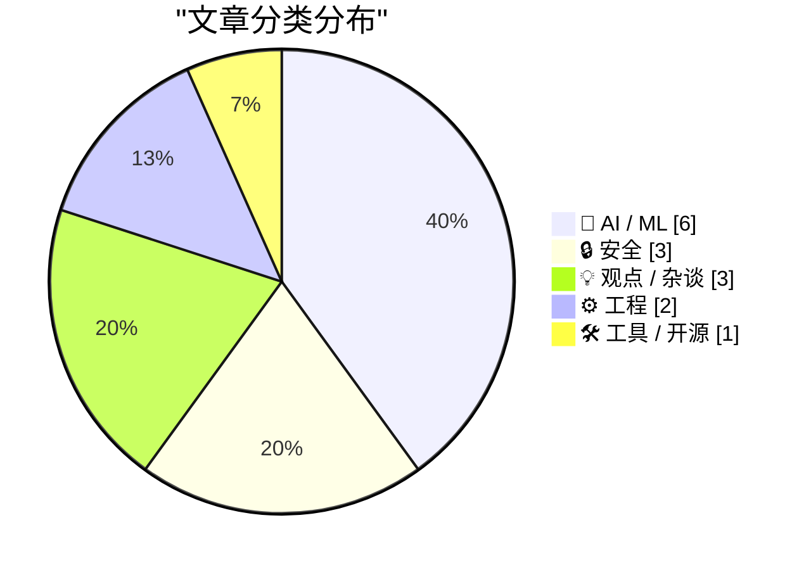
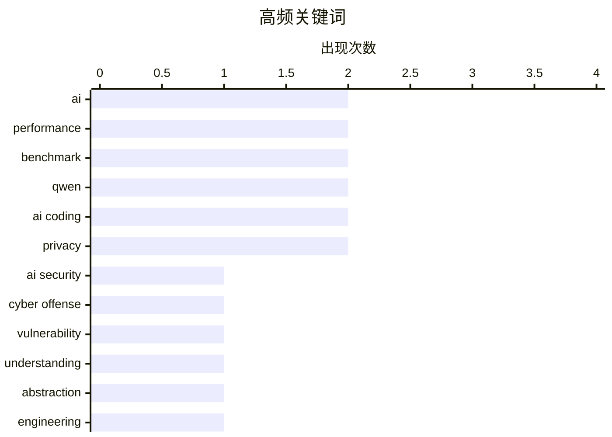

# 📰 AI 资讯每日精选 — 2026-04-06

> 汇聚 140+ 技术博客、X/Twitter、Hacker News、Reddit、Product Hunt、
> Lobste.rs、ClawFeed 日报及 GitHub Trending，经 AI 评分筛选。
>
> **本期内容**：🏆 今日必读 · 🌐 ClawFeed 日报 · 🔥 GitHub Trending · 📂 分类精选 · 🎨 设计与生成式 AI · 📊 数据概览

## 📝 今日看点

今日技术圈聚焦于AI能力的爆发与伴随的隐忧。一方面，AI模型的网络攻击能力正以惊人的速度进化，同时其性能也在持续突破，引发行业格局与市场震动。另一方面，对AI等先进工具的深度依赖，正导致开发者面临“黑箱化”风险，可能侵蚀底层掌控力。此外，基础设施的深层更新，如Linux内核升级，正对关键应用性能产生难以预料的重大影响，警示着技术栈复杂性的挑战。

---

## 🏆 今日必读

🥇 **安全研究人员发现：AI的进攻性网络能力每六个月翻一番**

[AI offensive cyber capabilities are doubling every six months, safety researchers find](https://the-decoder.com/ai-offensive-cyber-capabilities-are-doubling-every-six-months-safety-researchers-find/) — The Decoder · 15 小时前 · 🔒 安全

> AI模型利用安全漏洞的能力正在飞速提升。一项新研究表明，自2024年以来，其进攻性网络能力每5.7个月就翻一番。像Opus 4.6和GPT-5.3 Codex这样的模型，现在能解决人类专家需要约3小时才能完成的任务。这种指数级增长对网络安全构成了前所未有的挑战。

💡 **为什么值得读**: 该研究量化了AI网络攻击能力的指数级增长趋势，为理解当前网络安全威胁的演变速度和紧迫性提供了关键数据。

🏷️ AI security, cyber offense, vulnerability

🥈 **真正的威胁是舒适地滑向不理解自己在做什么的状态**

[The threat is comfortable drift toward not understanding what you're doing](https://ergosphere.blog/posts/the-machines-are-fine/) — Hacker News Best · 14 小时前 · 💡 观点 / 杂谈

> 文章核心批判了开发者对工具和系统日益加深的“黑箱”依赖。作者认为，最大的危险并非机器本身，而是人们因工具便利而逐渐丧失对底层原理的理解和掌控。这种“舒适性漂移”导致调试、优化和创新的能力退化。结论是，保持对技术栈的深度理解是抵御技术债和系统性风险的根本。

💡 **为什么值得读**: 文章尖锐地指出了现代软件开发中一个普遍但被忽视的认知风险，能引发开发者对自身技术掌控力的深刻反思。

🏷️ AI, Understanding, Abstraction, Engineering

🥉 **AWS工程师报告：Linux 7.0导致PostgreSQL性能减半，修复可能不易**

[AWS engineer reports PostgreSQL perf halved by Linux 7.0, fix may not be easy](https://www.phoronix.com/news/Linux-7.0-AWS-PostgreSQL-Drop) — Hacker News Best · 23 小时前 · ⚙️ 工程

> AWS工程师发现，升级到Linux内核7.0后，PostgreSQL的数据库性能下降了约50%。性能下降与内核调度器或内存管理的变化有关，问题根因复杂。社区讨论指出，此类底层变更对关键业务数据库的影响巨大，且回退或修复可能面临挑战。

💡 **为什么值得读**: 此案例揭示了操作系统内核重大版本升级可能对上层关键应用产生的灾难性性能影响，对系统运维和升级规划有重要警示作用。

🏷️ PostgreSQL, Linux kernel, performance, AWS

4️⃣ **2025年计算机科学领域的最大突破**

[Biggest Breakthroughs in Computer Science: 2025](https://www.reddit.com/r/programming/comments/1sd8kvs/biggest_breakthroughs_in_computer_science_2025/) — r/programming · 7 小时前 · 💡 观点 / 杂谈

> 该内容总结了2025年计算机科学领域公认的几项重大进展。突破可能涉及算法、体系结构、形式化验证或人工智能基础理论等方面。这些进展预计将对未来十年的技术发展产生深远影响。

💡 **为什么值得读**: 为希望快速把握计算机科学前沿动态的研究者和开发者提供了一份年度重要进展的精选汇总。

🏷️ computer science, breakthroughs, 2025

5️⃣ **因一篇论文，内存芯片市场在48小时内损失数百亿美元——而本社区10分钟就能看懂问题所在**

[[D] The memory chip market lost tens of billions over a paper this community would have understood in 10 minutes](https://www.reddit.com/r/MachineLearning/comments/1sdb7ne/d_the_memory_chip_market_lost_tens_of_billions/) — r/MachineLearning · 5 小时前 · 🤖 AI / ML

> TurboQuant论文的发布引发了内存芯片市场的恐慌性抛售，市值蒸发数百亿美元。该论文提出用极坐标量化将KV缓存压缩至每值3比特（原为16比特）。但市场误将仅用于推理内存的KV缓存压缩，等同于能大幅减少整个AI训练所需的内存（包括激活值、梯度和优化器状态）。实际上，训练内存瓶颈并未因此解决。

💡 **为什么值得读**: 这是一个金融市场因误读专业技术细节而产生剧烈波动的经典案例，凸显了在AI时代准确理解技术范畴的重要性。

🏷️ quantization, KV cache, market impact

---

## 🌐 ClawFeed 日报精选

> 来源：[ClawFeed](https://clawfeed.kevinhe.io) — AI 驱动的多源新闻聚合

### 🔥 今日头条

### 1. Anthropic 切断 Claude 订阅对第三方工具的支持
4月4日 12pm PT 起正式生效，Claude Pro/Max 订阅额度不再覆盖 OpenClaw、第三方 harness 等工具的用量，需额外购买用量包或自带 API key。这是 Anthropic 向闭环生态收紧的关键动作，HN / VentureBeat / Business Insider 同步报道，Twitter 引发大量讨论——有人算账称原来 $200/月让 AI 做事，现在可能要花上千美元 API 费用。

### 2. Google 发布 Gemma 4 开源模型
Apache 2.0 许可，四个尺寸（31B Dense / 26B MoE / E4B / E2B），256K 上下文，原生多模态+音频输入，号称"byte for byte 最强开源模型"。31B 在 Arena 开源排名美国 #1，与 Kimi K2.5 / GLM-5 并列顶级。llama.cpp / Ollama / vLLM / LM Studio 均已 Day-0 支持，400M+ 下载的 Gemma 生态持续壮大。

### 3. x402 Foundation 正式成立
Coinbase、Cloudflare、Stripe 联合在 Linux Foundation 下推出 AI 原生支付开放标准，Google、Visa、AWS 也加入支持阵营。这是 agentic web 支付基础设施走向开放标准化的关键里程碑——AI agent 未来如何自主支付终于有了正式协调机制。

### 4. OpenAI 收购 TBPN 播客
AI 巨头首次收购媒体公司。TBPN 日均 7 万同时在线、曾采访 Zuckerberg / Nadella / Altman，Sam Altman 称其"最喜欢的科技节目"。外界解读：OpenAI 在主动掌控 AI 叙事话语权，Fidji Simo 主导决策。

### 5. Anthropic 约 4 亿美元收购 Coefficient Bio
不到 10 人的计算生物学团队（Genentech 出身），Dario 意在让 Claude 参与药物研发。Anthropic 同期还在推进 IPO 计划（Axios 报道）。结合 Claude 的情感概念研究（mechanistic interpretability 新进展），Anthropic 今天几乎是全方位刷屏。

---

### 📰 精选 Top 10

1. **@karpathy — LLM 构建个人知识库**（9.1M 浏览，今日最大爆款）
   不是 RAG，而是让 LLM 做知识库唯一维护者——采集、编译、输出、linting、自我修复全自动化。被至少 3 个大号二次解读引用。
   https://x.com/karpathy/status/2039805659525644595

2. **@kevingu — AutoAgent 开源自优化 Agent 库**（2.2M 浏览）
   "教练+选手"双角色，SpreadsheetBench 96.5% #1，TerminalBench GPT-5 #1，跑 24 小时超越所有人工调优方案。
   https://x.com/kevingu/status/2039843234760073341

3. **@flowstated — Cursor 新增 Design Mode**（648K 浏览）
   ⇧+⌘+D 激活，点击编辑、拖拽画框、⌥+click 加入 chat，vibe coding 又进化了。
   https://x.com/flowstated/status/2039804673406935085

4. **@AYi_AInotes — Claude Code Hooks 全解析**
   8 个自动钩子覆盖格式化、阻挡危险命令、自动测试，把 CLAUDE.md 从"80% 建议"升级成"100% 确定性守门员"。
   https://x.com/AYi_AInotes/status/2040238450373435857

5. **@0xLogicrw — OpenHarness：Python 重写 Claude Code 核心**
   HKU 团队把 51.2 万行压缩到 1.17 万行（44 倍），MIT 许可证开源。
   https://x.com/0xLogicrw/status/2039967740140867994

6. **@dotey — Mintlify 虚拟文件系统 ChromaFs 工程实践**
   AI 以为在用 grep/cat/ls，实际是数据库查询，文档助手启动时间从 46 秒大幅降低。Agent 通用接口正在收敛。
   https://x.com/dotey/status/2040157640442229153

7. **@yangyi — Google Stitch 发布 DESIGN.md**（493 likes）
   一个 Markdown 文件教会 AI Coding Agent 整套设计系统，40+ 预构建文件从真实产品提取，不需要 Figma 或 JSON。
   https://x.com/yangyi/status/2040272305277079728

8. **@programmer (erik.eth) — x402 Foundation 成立公告**
   《Agentic Commerce Deserves an Open Standard》，详解 Coinbase/Cloudflare/Stripe 联合推动 AI agent 原生支付标准的背景。
   https://x.com/programmer/status/2040130000000000000

9. **@lanhubiji / @qinbafrank — Medvi：2 人公司年收入 $18 亿**
   GLP-1 远程医疗，2024年9月以 $2 万启动，创始人兄弟二人全职，靠 AI 跑通了超级个体的天花板。AI 时代一人公司边界在哪？
   https://x.com/lanhubiji/status/2040066832514863265

10. **@0xSero — Vercel agent-browser CLI**
    让 Agent 控制浏览器和 Electron 应用（Discord/VSCode/Slack），token 消耗极低，1.7K 赞。
    https://x.com/0xSero/status/2040067262124601358

---

### 📊 今日观察

今天是 AI 生态格局重塑的一天，主轴有三：

**① Anthropic 生态收紧，开发者工具层洗牌开始。** 断联第三方工具订阅 + Claude 全面接入 Microsoft 365，同一天发生，释放的信号很清晰：Anthropic 在向企业侧和官方生态集中流量。对开发者来说，依赖 Claude 订阅的工作流成本要重新算账。

**② 开源与 Agent 工具链加速成熟。** Gemma 4 开源登顶、AutoAgent 自优化框架、OpenHarness 44倍代码压缩、Claude Code Hooks 生产化——这批工具在同一天密集出现，预示 "agent infra" 开发者层正在快速进入可用状态。

**③ AI 原生经济基础设施开始集结。** x402 Foundation（AI 支付标准）+ Infini 稳定币收款 + Bare Metal Banking（Neobank 获 OCC 批准）+ SoFi/SBI 接入 Solana——链上和链下在支付层的融合在本周密集发生，这条线值得持续关注。

超级个体/一人公司叙事（Medvi $18亿年收入）继续发酵，AI Agent 如何独立持有资产的安全问题也开始进入严肃讨论（@ashtonchen83 的"认知漂移"框架）。

---

*生成时间：2026-04-04 22:00 SGT | 来源：7 期 4h 简报*

---

## 🔥 GitHub Trending

> 今日热门开源项目（全语言 + Python）

| # | 项目 | 描述 | ⭐ 总星 | 📈 今日 | 语言 |
|---|------|------|---------|---------|------|
| 1 | [siddharthvaddem/openscreen](https://github.com/siddharthvaddem/openscreen) | Create stunning demos for free. Open-source, no subscript... | 22.5k | +2749 | TypeScript |
| 2 | [NousResearch/hermes-agent](https://github.com/NousResearch/hermes-agent) 🤖 | The agent that grows with you | 26.3k | +1251 | Python |
| 3 | [onyx-dot-app/onyx](https://github.com/onyx-dot-app/onyx) 🤖 | Open Source AI Platform - AI Chat with advanced features ... | 25.0k | +998 | Python |
| 4 | [block/goose](https://github.com/block/goose) 🤖 | an open source, extensible AI agent that goes beyond code... | 37.0k | +882 | Rust |
| 5 | [Blaizzy/mlx-vlm](https://github.com/Blaizzy/mlx-vlm) | MLX-VLM is a package for inference and fine-tuning of Vis... | 3.9k | +416 | Python |
| 6 | [google-ai-edge/gallery](https://github.com/google-ai-edge/gallery) 🤖 | A gallery that showcases on-device ML/GenAI use cases and... | 16.9k | +389 | Kotlin |
| 7 | [badlogic/pi-mono](https://github.com/badlogic/pi-mono) 🤖 | AI agent toolkit: coding agent CLI, unified LLM API, TUI ... | 31.9k | +355 | TypeScript |
| 8 | [freeCodeCamp/freeCodeCamp](https://github.com/freeCodeCamp/freeCodeCamp) | freeCodeCamp.org's open-source codebase and curriculum. L... | 441.5k | +335 | TypeScript |
| 9 | [telegramdesktop/tdesktop](https://github.com/telegramdesktop/tdesktop) | Telegram Desktop messaging app | 31.1k | +287 | C++ |
| 10 | [microsoft/agent-framework](https://github.com/microsoft/agent-framework) 🤖 | A framework for building, orchestrating and deploying AI ... | 8.9k | +278 | Python |
| 11 | [google-ai-edge/LiteRT-LM](https://github.com/google-ai-edge/LiteRT-LM) 🤖 |  | 1.5k | +124 | C++ |
| 12 | [HKUDS/RAG-Anything](https://github.com/HKUDS/RAG-Anything) 🤖 | "RAG-Anything: All-in-One RAG Framework" | 15.2k | +99 | Python |
| 13 | [dmtrKovalenko/fff.nvim](https://github.com/dmtrKovalenko/fff.nvim) 🤖 | The fastest and the most accurate file search toolkit for... | 3.7k | +76 | Rust |
| 14 | [google-deepmind/gemma](https://github.com/google-deepmind/gemma) 🤖 | Gemma open-weight LLM library, from Google DeepMind | 4.4k | +50 | Python |
| 15 | [atilaahmettaner/tradingview-mcp](https://github.com/atilaahmettaner/tradingview-mcp) 🤖 | Advanced TradingView MCP Server for AI-powered market ana... | 673 | +39 | Python |

---

## 🤖 AI / ML

### 1. 因一篇论文，内存芯片市场在48小时内损失数百亿美元——而本社区10分钟就能看懂问题所在

[[D] The memory chip market lost tens of billions over a paper this community would have understood in 10 minutes](https://www.reddit.com/r/MachineLearning/comments/1sdb7ne/d_the_memory_chip_market_lost_tens_of_billions/) — **r/MachineLearning** · 5 小时前 · ⭐ 25/30

> TurboQuant论文的发布引发了内存芯片市场的恐慌性抛售，市值蒸发数百亿美元。该论文提出用极坐标量化将KV缓存压缩至每值3比特（原为16比特）。但市场误将仅用于推理内存的KV缓存压缩，等同于能大幅减少整个AI训练所需的内存（包括激活值、梯度和优化器状态）。实际上，训练内存瓶颈并未因此解决。

🏷️ quantization, KV cache, market impact

---

### 2. Gemma 4轻松击败了我们排行榜上除Opus 4.6和GPT-5.2外的所有模型。310亿参数，每次运行0.20美元

[Gemma 4 just casually destroyed every model on our leaderboard except Opus 4.6 and GPT-5.2. 31B params, $0.20/run](https://www.reddit.com/r/LocalLLaMA/comments/1sdcotc/gemma_4_just_casually_destroyed_every_model_on/) — **r/LocalLLaMA** · 4 小时前 · ⭐ 25/30

> Gemma 4（31B参数）在本地LLM社区的基准测试中表现卓越。其性能仅次于顶尖的闭源模型Claude Opus 4.6和GPT-5.2，但超越了其他所有参与评测的模型。该模型以每次运行仅0.20美元的低成本，提供了极高的性能性价比。

🏷️ Gemma 4, benchmark, open model

---

### 3. Gemma 4 31B vs Gemma 4 26B-A4B vs Qwen 3.5 27B —— 由Claude Opus 4.6作为裁判的30题盲测

[Gemma 4 31B vs Gemma 4 26B-A4B vs Qwen 3.5 27B — 30-question blind eval with Claude Opus 4.6 as judge](https://www.reddit.com/r/LocalLLaMA/comments/1scwos6/gemma_4_31b_vs_gemma_4_26ba4b_vs_qwen_35_27b/) — **r/LocalLLaMA** · 17 小时前 · ⭐ 25/30

> 进行了一次三款中型开源模型（Gemma 4两个版本和Qwen 3.5）的盲测对比，共30个问题涵盖代码、推理等5个类别。使用Claude Opus 4.6作为裁判进行自动化评估。测试旨在提供原始结果并公开方法论，以接受社区检验和讨论。

🏷️ benchmark, evaluation, Gemma, Qwen

---

### 4. 编码智能体的构成组件

[Components of A Coding Agent](https://magazine.sebastianraschka.com/p/components-of-a-coding-agent) — **Lobste.rs** · 7 小时前 · ⭐ 25/30

> 文章系统性地剖析了构建一个高效AI编码助手（智能体）所需的核心组件。它超越了简单的代码补全，涵盖了任务规划、代码生成、工具调用、自我验证与迭代等关键模块。作者阐述了这些组件如何协同工作，以完成复杂的软件开发任务。

🏷️ AI coding, agent architecture, components

---

### 5. ClickHouse中的智能体化编码实践

[Agentic coding at Clickhouse](https://clickhouse.com/blog/agentic-coding) — **Lobste.rs** · 2 小时前 · ⭐ 25/30

> 文章分享了数据库公司ClickHouse在实际生产环境中应用AI编码智能体的经验。它详细介绍了如何将智能体工作流集成到其开发流程中，以解决具体的工程问题。内容可能包括工具链设置、提示工程、验证流程以及带来的效率提升和挑战。

🏷️ AI coding, ClickHouse, agentic workflow

---

### 6. 阿里通义千问团队用新算法让AI模型“思考”得更深入

[Alibaba's Qwen team makes AI models think deeper with new algorithm](https://the-decoder.com/alibabas-qwen-team-makes-ai-models-think-deeper-with-new-algorithm/) — **The Decoder** · 17 小时前 · ⭐ 24/30

> 阿里通义千问团队提出了一种新的强化学习算法，旨在解决当前推理模型因对每个输出token给予相同奖励而遇到的瓶颈。该算法的核心创新在于，根据每个推理步骤对后续结果的影响程度来动态分配权重，而非平均奖励。这种方法使模型的“思维链”长度得以翻倍，从而提升了复杂推理任务的性能。这表明，精细化奖励机制是解锁大模型更深层次推理能力的关键。

🏷️ AI, Reasoning, Reinforcement Learning, Qwen

---

## 🔒 安全

### 7. 安全研究人员发现：AI的进攻性网络能力每六个月翻一番

[AI offensive cyber capabilities are doubling every six months, safety researchers find](https://the-decoder.com/ai-offensive-cyber-capabilities-are-doubling-every-six-months-safety-researchers-find/) — **The Decoder** · 15 小时前 · ⭐ 25/30

> AI模型利用安全漏洞的能力正在飞速提升。一项新研究表明，自2024年以来，其进攻性网络能力每5.7个月就翻一番。像Opus 4.6和GPT-5.3 Codex这样的模型，现在能解决人类专家需要约3小时才能完成的任务。这种指数级增长对网络安全构成了前所未有的挑战。

🏷️ AI security, cyber offense, vulnerability

---

### 8. 集体诉讼称Perplexity的‘无痕模式’是个‘骗局’

[Class Action Lawsuit Says Perplexity’s ‘Incognito Mode’ Is a ‘Sham’](https://arstechnica.com/tech-policy/2026/04/perplexitys-incognito-mode-is-a-sham-lawsuit-says/) — **daringfireball.net** · 23 小时前 · ⭐ 24/30

> 一项集体诉讼指控AI搜索公司Perplexity的“无痕模式”存在虚假宣传。诉讼通过开发者工具发现，即使用户启用该模式，初始提示和后续点击的追问仍会被发送到服务器。非订阅用户的对话甚至可通过特定URL被第三方（如Meta、Google）访问。诉状还称，聊天记录会被分享给个人可识别的员工。

🏷️ privacy, lawsuit, Perplexity

---

### 9. BrowserStack内部人员正在泄露用户邮箱地址

[Someone at BrowserStack is leaking users' email addresses](https://shkspr.mobi/blog/2026/04/someone-at-browserstack-is-leaking-users-email-address/) — **Hacker News Best** · 10 小时前 · ⭐ 24/30

> 一篇博客文章披露，云端测试平台BrowserStack存在内部人员泄露用户邮箱地址的安全事件。泄露方式是通过在密码重置邮件中，将目标用户的邮箱地址直接填入“抄送”（CC）而非“密送”（BCC）字段，导致大量用户邮箱被公开曝光。该事件在Hacker News上引发热议，获得358点支持与97条评论，凸显了用户对SaaS平台内部数据管控和基本安全实践的严重担忧。这暴露了即使是大公司，也可能因低级操作失误而导致严重的用户数据泄露。

🏷️ Data Leak, Privacy, BrowserStack

---

## 💡 观点 / 杂谈

### 10. 真正的威胁是舒适地滑向不理解自己在做什么的状态

[The threat is comfortable drift toward not understanding what you're doing](https://ergosphere.blog/posts/the-machines-are-fine/) — **Hacker News Best** · 14 小时前 · ⭐ 25/30

> 文章核心批判了开发者对工具和系统日益加深的“黑箱”依赖。作者认为，最大的危险并非机器本身，而是人们因工具便利而逐渐丧失对底层原理的理解和掌控。这种“舒适性漂移”导致调试、优化和创新的能力退化。结论是，保持对技术栈的深度理解是抵御技术债和系统性风险的根本。

🏷️ AI, Understanding, Abstraction, Engineering

---

### 11. 2025年计算机科学领域的最大突破

[Biggest Breakthroughs in Computer Science: 2025](https://www.reddit.com/r/programming/comments/1sd8kvs/biggest_breakthroughs_in_computer_science_2025/) — **r/programming** · 7 小时前 · ⭐ 25/30

> 该内容总结了2025年计算机科学领域公认的几项重大进展。突破可能涉及算法、体系结构、形式化验证或人工智能基础理论等方面。这些进展预计将对未来十年的技术发展产生深远影响。

🏷️ computer science, breakthroughs, 2025

---

### 12. 研究揭示开发者对“AI垃圾”的挫败感，将其映射为软件开发中的“公地悲剧”

[Study maps developer frustration over "AI slop" as a "tragedy of the commons" in software development](https://the-decoder.com/study-maps-developer-frustration-over-ai-slop-as-a-tragedy-of-the-commons-in-software-development/) — **The Decoder** · 13 小时前 · ⭐ 24/30

> 一项定性研究探讨了开发者如何看待并抵制软件开发中由AI生成的低质量内容（即“AI垃圾”）。批评者将这种现象描述为一种“公地悲剧”，即个人为追求生产效率而使用AI，其代价却由代码审查者和整个开源社区承担。研究发现，低质量的AI生成代码增加了审查负担，并可能损害代码库的长期健康。核心结论是，不加批判地使用AI生成代码可能对软件项目的集体质量构成系统性风险。

🏷️ AI slop, software quality, developer experience

---

## ⚙️ 工程

### 13. AWS工程师报告：Linux 7.0导致PostgreSQL性能减半，修复可能不易

[AWS engineer reports PostgreSQL perf halved by Linux 7.0, fix may not be easy](https://www.phoronix.com/news/Linux-7.0-AWS-PostgreSQL-Drop) — **Hacker News Best** · 23 小时前 · ⭐ 25/30

> AWS工程师发现，升级到Linux内核7.0后，PostgreSQL的数据库性能下降了约50%。性能下降与内核调度器或内存管理的变化有关，问题根因复杂。社区讨论指出，此类底层变更对关键业务数据库的影响巨大，且回退或修复可能面临挑战。

🏷️ PostgreSQL, Linux kernel, performance, AWS

---

### 14. 使用瑞士风格哈希表实现ES|QL聚合性能2-3倍提升

[Faster ES|QL aggregations (2–3×) using Swiss-style hash tables](https://www.reddit.com/r/programming/comments/1sddp2g/faster_esql_aggregations_23_using_swissstyle_hash/) — **r/programming** · 3 小时前 · ⭐ 24/30

> Elasticsearch Labs博客介绍了如何通过采用“瑞士风格”哈希表来显著提升ES|QL查询语言的聚合操作性能。这种哈希表通过优化内存布局和缓存效率，专门为聚合这类数据密集型操作设计。在实际测试中，该优化使得常见聚合查询的速度提升了2到3倍。这项改进已融入Elasticsearch的ES|QL引擎，直接惠及所有用户。这表明，针对特定查询模式定制底层数据结构，仍是获得巨大性能收益的有效手段。

🏷️ Elasticsearch, ES|QL, hash table, performance

---

## 🛠 工具 / 开源

### 15. Caveman：能用少量token搞定，何必用许多？

[Caveman: Why use many token when few token do trick](https://github.com/JuliusBrussee/caveman) — **Hacker News Best** · 15 小时前 · ⭐ 24/30

> Caveman是一个旨在极致优化大语言模型（LLM）提示（Prompt）的开源项目，其哲学是“少即是多”。它通过系统化的方法压缩和精简提示词，以减少token消耗、降低API成本并提升模型响应速度。该项目在Hacker News上获得极高关注（664点，303条评论），反映了开发者社区对LLM使用成本效率和性能优化的强烈需求。其核心价值在于提供了一套实践框架，帮助用户以更低的成本获得更精准的模型输出。

🏷️ LLM, Tokenization, Compression

---

## 🎨 Design & Generative AI

### 🖥️ 生成式 UI

- **[ComfyUI自定义节点生存指南：AI编程助手常见错误模式汇编](https://www.reddit.com/r/comfyui/comments/1sdflvn/comfyui_custom_node_survival_guide_60_sections_of/)** — r/comfyui · 2 小时前
  > 汇总了60个AI编程助手在开发ComfyUI自定义节点时可能忽略的错误模式，供开发者参考和QA使用。

- **[AI助手如何彻底改变我与ComfyUI的交互方式](https://www.reddit.com/r/comfyui/comments/1scpgiv/maybe_im_late_to_the_party_but_claude_and/)** — r/comfyui · 23 小时前
  > 分享使用Claude、Gemini/ChatGPT等AI助手来辅助完成ComfyUI中图像处理和复杂工作流调整的经验。

- **[为ComfyUI修补QwenVL-Mod以支持Qwen3.5模型](https://www.reddit.com/r/comfyui/comments/1sd83zi/got_fed_up_with_no_working_qwen35_node_so_i/)** — r/comfyui · 7 小时前
  > 因官方节点未更新，开发者自行修改QwenVL-Mod节点，使其能够支持Qwen3.5模型用于自动提示词生成。

- **[像电影制片一样组织你的AI生成内容（开源节点）](https://www.reddit.com/r/comfyui/comments/1sdhj83/organize_your_generations_like_a_real_film/)** — r/comfyui · 1 小时前
  > 提出并可能提供开源节点解决方案，以解决AI图像/视频生成项目中文件管理和组织混乱的问题，借鉴电影生产管理方式。

### 🖼️ 生成式图片

- **[ComfyUI优化：使用Triton+INT8加速Z-Image模型并节省显存](https://www.reddit.com/r/StableDiffusion/comments/1sczw2o/comfyui_accelerate_zimage_s3dit_by_2030_save_35gb/)** — r/StableDiffusion · 14 小时前
  > 介绍通过Triton和INT8量化技术，在ComfyUI中加速S3-DiT图像生成模型并显著节省VRAM的方法。

- **[ComfyUI资源管理器迎来重大更新](https://www.reddit.com/r/StableDiffusion/comments/1sdcqgu/the_comfyui_assets_manager_just_got_a_massive/)** — r/StableDiffusion · 4 小时前
  > ComfyUI的Assets Manager工具根据用户反馈进行了大规模功能更新和改进。

- **[利用个人墨绘训练LoRA并制作短片的全过程分享](https://www.reddit.com/r/StableDiffusion/comments/1scpm0a/i_trained_two_custom_loras_on_73_of_my_own_ink/)** — r/StableDiffusion · 23 小时前
  > 作者分享如何使用73张个人墨水画训练两个定制LoRA模型，并最终用其制作出一部短片的完整流程。

- **[[自定义节点] 通过Triton+INT8加速Z-Image模型性能](https://www.reddit.com/r/comfyui/comments/1scztx4/custom_node_accelerate_zimage_s3dit_by_2030_save/)** — r/comfyui · 14 小时前
  > 发布一个ComfyUI自定义节点，利用Triton和INT8技术优化Z-Image (S3-DiT)模型的运行速度与显存占用。

- **[当下最受欢迎的AI图像生成模型推荐汇总](https://www.reddit.com/r/StableDiffusion/comments/1scuftr/what_are_the_best_models_everyone_is_using_right/)** — r/StableDiffusion · 19 小时前
  > 征集并讨论当前在写实、动漫、艺术等不同领域表现最佳的Stable Diffusion模型。

- **[OmniWeaving功能已移植至ComfyUI](https://www.reddit.com/r/StableDiffusion/comments/1sct35i/omniweaving_for_comfyui/)** — r/StableDiffusion · 20 小时前
  > 开发者将HY-OmniWeaving功能非官方地移植到了ComfyUI平台，并确认其可用性。

- **[使用Flux 2 Klein LoRA将虚幻引擎画面转为《Arcane》风格](https://www.reddit.com/r/StableDiffusion/comments/1sdai66/turning_unreal_engine_into_arcanevalorant_style/)** — r/StableDiffusion · 6 小时前
  > 展示如何利用Flux 2 klein LoRA模型，将Unreal Engine渲染的画面转换为《Arcane》或《Valorant》风格的艺术效果。

- **[BS-VTON：用于FLUX.2 Klein 9B的人像服装转移LoRA](https://www.reddit.com/r/StableDiffusion/comments/1sdf527/bsvton_persontoperson_outfit_transfer_lora_for/)** — r/StableDiffusion · 3 小时前
  > 介绍一个专为FLUX.2 Klein 9B模型设计的LoRA，用于实现人物之间的服装转移（虚拟试穿）。

- **[为Windows构建连接ComfyUI的本地资源管理器](https://www.reddit.com/r/StableDiffusion/comments/1sdgaot/i_built_a_local_asset_manager_for_windows_that/)** — r/StableDiffusion · 2 小时前
  > 介绍一款为Windows系统开发的、能够与ComfyUI连接并管理本地生成资源的工具。

- **[分享一个自制的实用ComfyUI节点：Load Image+](https://www.reddit.com/r/StableDiffusion/comments/1sdcks2/created_a_load_image_node_i_thought_some_might/)** — r/StableDiffusion · 4 小时前
  > 开发者创建并分享了一个功能增强版的“加载图像”节点，旨在为ComfyUI用户提供更多便利。

### 🎬 生成式视频

- **[开源模型也能实现电影级真实感视频：Z-Image-Turbo与LTX 2.3工作流](https://www.reddit.com/r/StableDiffusion/comments/1sdc1f1/it_is_still_possible_to_achieve_more_natural/)** — r/StableDiffusion · 5 小时前
  > 探讨如何使用Z-Image-Turbo和LTX 2.3等开源模型及基础工作流，制作出媲美专有模型的自然电影感视频。

---

## 📊 数据概览

| 扫描源 | 抓取文章 | 时间范围 | 精选 |
|:---:|:---:|:---:|:---:|
| 117/140 | 5205 篇 → 180 篇 | 24h | **15 篇** |

### 分类分布



### 高频关键词



<details>
<summary>📈 纯文本关键词图（终端友好）</summary>

```
ai            │ ████████████████████ 2
performance   │ ████████████████████ 2
benchmark     │ ████████████████████ 2
qwen          │ ████████████████████ 2
ai coding     │ ████████████████████ 2
privacy       │ ████████████████████ 2
ai security   │ ██████████░░░░░░░░░░ 1
cyber offense │ ██████████░░░░░░░░░░ 1
vulnerability │ ██████████░░░░░░░░░░ 1
understanding │ ██████████░░░░░░░░░░ 1
```

</details>

### 🏷️ 话题标签

**ai**(2) · **performance**(2) · **benchmark**(2) · qwen(2) · ai coding(2) · privacy(2) · ai security(1) · cyber offense(1) · vulnerability(1) · understanding(1) · abstraction(1) · engineering(1) · postgresql(1) · linux kernel(1) · aws(1) · computer science(1) · breakthroughs(1) · 2025(1) · quantization(1) · kv cache(1)

---

*生成于 2026-04-06 00:08 | 汇聚 140 个技术博客、X/Twitter、Hacker News、Reddit、Product Hunt、Lobste.rs、ClawFeed 日报及 GitHub Trending，经 AI 评分筛选出 Top 15 精华内容*
