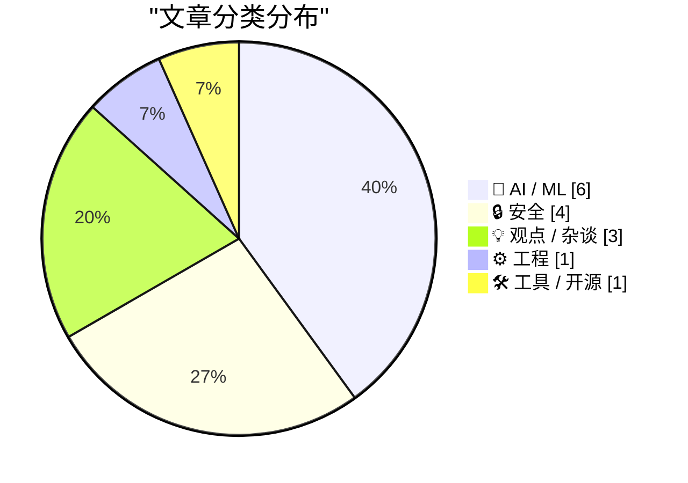
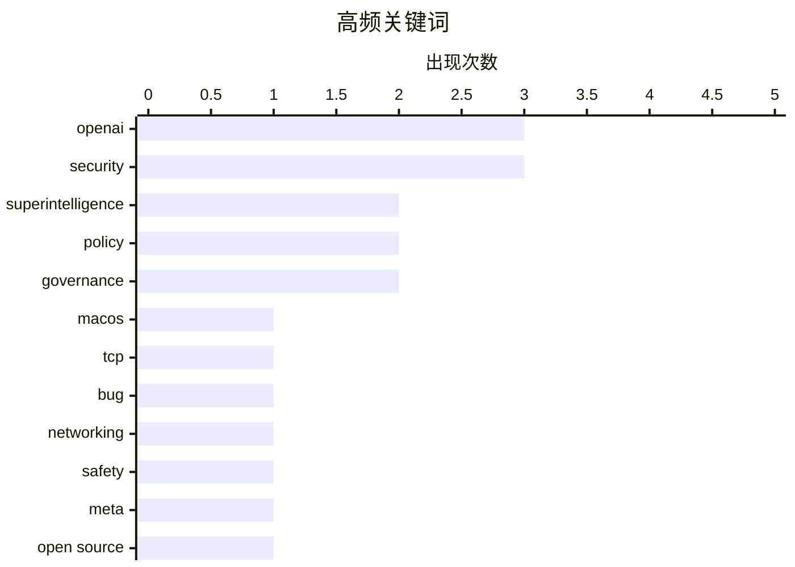

# 📰 AI 资讯每日精选 — 2026-04-07

> 汇聚 140+ 技术博客、X/Twitter、Hacker News、Reddit、Product Hunt、
> Lobste.rs、ClawFeed 日报及 GitHub Trending，经 AI 评分筛选。
>
> **本期内容**：🏆 今日必读 · 🌐 ClawFeed 日报 · 🔥 GitHub Trending · 📂 分类精选 · 🎨 设计与生成式 AI · 📊 数据概览

## 📝 今日看点

今日技术圈聚焦于AI巨头的前瞻布局与内部动荡。OpenAI接连发布超级智能社会经济蓝图，倡导公共财富基金与四天工作制，引发对AI重塑生产关系的广泛讨论；与此同时，其管理层被曝因CEO的反复无常导致安全人才持续流失，揭示了光鲜愿景背后的治理挑战。另一方面，技术基础领域暗藏危机，macOS被曝出潜伏49天的致命网络漏洞，而量子计算威胁的紧迫性则被专家修正为仍需数十年，提醒业界在追逐前沿时仍需夯实安全根基。

---

## 🏆 今日必读

🥇 **OpenAI发布超级智能过渡蓝图：公共财富基金与四天工作制**

[OpenAI just dropped their blueprint for the Superintelligence Transition: "Public Wealth Funds", 4-Day Workweeks](https://www.reddit.com/r/singularity/comments/1se6obs/openai_just_dropped_their_blueprint_for_the/) — r/singularity · 5 小时前 · 💡 观点 / 杂谈

> OpenAI发布了一份名为《智能时代的产业政策》的政策文件，为超级智能时代的社会经济转型提出具体方案。核心建议包括设立公共财富基金，将AI创造的部分财富进行再分配，以缓解不平等。文件还提议推行四天工作周，并对高收入者征收更高的资本利得税。其核心观点是，政府必须主动规划，以确保AI带来的巨大生产力提升能惠及全社会，而非加剧贫富分化。

💡 **为什么值得读**: 这份蓝图直接描绘了AI巨头对未来社会形态的构想，对理解技术发展如何重塑经济与工作模式具有前瞻性参考价值。

🏷️ OpenAI, superintelligence, policy, governance

🥈 **我们在macOS TCP网络中发现了一颗定时炸弹——它会在整整49天后引爆**

[We Found a Ticking Time Bomb in macOS TCP Networking — It Detonates After Exactly 49 Days](https://photon.codes/blog/we-found-a-ticking-time-bomb-in-macos-tcp-networking) — Lobste.rs · 3 小时前 · ⚙️ 工程

> 研究人员在macOS的TCP网络协议栈中发现了一个严重的计时器溢出漏洞。该漏洞源于一个32位毫秒计时器在连续运行49.7天（2^32毫秒）后会发生回绕，导致网络连接中断或系统崩溃。此问题影响所有使用BSD网络栈的macOS版本，对需要长期运行服务器或网络服务的设备构成严重威胁。结论是，这是一个深植于操作系统内核的设计缺陷，重启是唯一的临时缓解措施。

💡 **为什么值得读**: 该漏洞影响广泛且触发条件明确，对macOS服务器管理员和开发者至关重要，揭示了系统级网络栈的潜在风险。

🏷️ macOS, TCP, bug, networking

🥉 **OpenAI安全人才流失终获解释，原因竟是萨姆·奥特曼的“感觉不对”**

[OpenAI's safety brain drain finally gets an explanation and it's just Sam Altman's vibes](https://the-decoder.com/openais-safety-brain-drain-finally-gets-an-explanation-and-its-just-sam-altmans-vibes/) — The Decoder · 6 小时前 · 🤖 AI / ML

> 一篇基于超过100次访谈的《纽约客》深度报道，揭示了OpenAI内部安全团队持续流失的原因。报道指出，CEO萨姆·奥特曼的管理风格和反复无常的承诺是主因，有研究员直言离开是因为“感觉（vibes）不对”。这解释了包括“超级对齐”团队负责人伊利亚·苏茨克沃在内的一系列高层安全研究人员离职事件。文章核心观点是，奥特曼对安全问题的态度摇摆，与其对商业化和技术进步的追求存在内在冲突，动摇了安全团队的信心。

💡 **为什么值得读**: 本文通过内部视角，揭示了这家领先AI公司光鲜外表下的文化与管理危机，是理解其战略矛盾的关键。

🏷️ OpenAI, safety, governance

4️⃣ **更少工作，同等报酬：OpenAI描绘超级智能重塑下的世界愿景**

[Less work, equal pay: OpenAI lays out its vision for a world reshaped by superintelligence](https://the-decoder.com/less-work-equal-pay-openai-lays-out-its-vision-for-a-world-reshaped-by-superintelligence/) — The Decoder · 7 小时前 · 🤖 AI / ML

> OpenAI在一份新政策文件中，为政府如何应对超级智能时代规划了社会经济蓝图。具体提案包括设立公共财富基金来分配AI创造的经济收益，推行四天工作周以适应生产力飞跃，以及对高收入者提高资本利得税。其核心论点是，AI驱动的生产力爆炸性增长必须通过制度设计实现广泛共享。最终结论是，为避免严重的社会动荡，政策制定者必须提前主动规划，确保转型平稳公正。

💡 **为什么值得读**: 这份愿景直接来自AI革命的中心参与者，为思考技术奇点后的社会与经济结构提供了具体的政策讨论起点。

🏷️ OpenAI, superintelligence, policy

5️⃣ **Meta将开源其下一代AI模型版本**

[Meta to open source versions of its next AI models](https://www.reddit.com/r/LocalLLaMA/comments/1se65ul/meta_to_open_source_versions_of_its_next_ai_models/) — r/LocalLLaMA · 6 小时前 · 🤖 AI / ML

> Meta公司计划继续其开源策略，即将发布的下一个主要AI模型也将有开源版本。此举延续了其通过Llama系列模型推动开源AI生态发展的路线。开源模型将允许研究者和开发者自由使用、修改和分发，与OpenAI、Google等公司的闭源策略形成鲜明对比。这进一步巩固了Meta在开源大模型领域的领导地位，并可能加速整个行业的创新与应用落地。

💡 **为什么值得读**: 了解Meta的开源战略对于把握未来AI技术民主化进程和行业竞争格局至关重要。

🏷️ Meta, open source, AI models

---

## 🌐 ClawFeed 日报精选

> 来源：[ClawFeed](https://clawfeed.kevinhe.io) — AI 驱动的多源新闻聚合

### 🔥 今日头条

### 1. Anthropic 切断 Claude 订阅对第三方工具的支持
4月4日 12pm PT 起正式生效，Claude Pro/Max 订阅额度不再覆盖 OpenClaw、第三方 harness 等工具的用量，需额外购买用量包或自带 API key。这是 Anthropic 向闭环生态收紧的关键动作，HN / VentureBeat / Business Insider 同步报道，Twitter 引发大量讨论——有人算账称原来 $200/月让 AI 做事，现在可能要花上千美元 API 费用。

### 2. Google 发布 Gemma 4 开源模型
Apache 2.0 许可，四个尺寸（31B Dense / 26B MoE / E4B / E2B），256K 上下文，原生多模态+音频输入，号称"byte for byte 最强开源模型"。31B 在 Arena 开源排名美国 #1，与 Kimi K2.5 / GLM-5 并列顶级。llama.cpp / Ollama / vLLM / LM Studio 均已 Day-0 支持，400M+ 下载的 Gemma 生态持续壮大。

### 3. x402 Foundation 正式成立
Coinbase、Cloudflare、Stripe 联合在 Linux Foundation 下推出 AI 原生支付开放标准，Google、Visa、AWS 也加入支持阵营。这是 agentic web 支付基础设施走向开放标准化的关键里程碑——AI agent 未来如何自主支付终于有了正式协调机制。

### 4. OpenAI 收购 TBPN 播客
AI 巨头首次收购媒体公司。TBPN 日均 7 万同时在线、曾采访 Zuckerberg / Nadella / Altman，Sam Altman 称其"最喜欢的科技节目"。外界解读：OpenAI 在主动掌控 AI 叙事话语权，Fidji Simo 主导决策。

### 5. Anthropic 约 4 亿美元收购 Coefficient Bio
不到 10 人的计算生物学团队（Genentech 出身），Dario 意在让 Claude 参与药物研发。Anthropic 同期还在推进 IPO 计划（Axios 报道）。结合 Claude 的情感概念研究（mechanistic interpretability 新进展），Anthropic 今天几乎是全方位刷屏。

---

### 📰 精选 Top 10

1. **@karpathy — LLM 构建个人知识库**（9.1M 浏览，今日最大爆款）
   不是 RAG，而是让 LLM 做知识库唯一维护者——采集、编译、输出、linting、自我修复全自动化。被至少 3 个大号二次解读引用。
   https://x.com/karpathy/status/2039805659525644595

2. **@kevingu — AutoAgent 开源自优化 Agent 库**（2.2M 浏览）
   "教练+选手"双角色，SpreadsheetBench 96.5% #1，TerminalBench GPT-5 #1，跑 24 小时超越所有人工调优方案。
   https://x.com/kevingu/status/2039843234760073341

3. **@flowstated — Cursor 新增 Design Mode**（648K 浏览）
   ⇧+⌘+D 激活，点击编辑、拖拽画框、⌥+click 加入 chat，vibe coding 又进化了。
   https://x.com/flowstated/status/2039804673406935085

4. **@AYi_AInotes — Claude Code Hooks 全解析**
   8 个自动钩子覆盖格式化、阻挡危险命令、自动测试，把 CLAUDE.md 从"80% 建议"升级成"100% 确定性守门员"。
   https://x.com/AYi_AInotes/status/2040238450373435857

5. **@0xLogicrw — OpenHarness：Python 重写 Claude Code 核心**
   HKU 团队把 51.2 万行压缩到 1.17 万行（44 倍），MIT 许可证开源。
   https://x.com/0xLogicrw/status/2039967740140867994

6. **@dotey — Mintlify 虚拟文件系统 ChromaFs 工程实践**
   AI 以为在用 grep/cat/ls，实际是数据库查询，文档助手启动时间从 46 秒大幅降低。Agent 通用接口正在收敛。
   https://x.com/dotey/status/2040157640442229153

7. **@yangyi — Google Stitch 发布 DESIGN.md**（493 likes）
   一个 Markdown 文件教会 AI Coding Agent 整套设计系统，40+ 预构建文件从真实产品提取，不需要 Figma 或 JSON。
   https://x.com/yangyi/status/2040272305277079728

8. **@programmer (erik.eth) — x402 Foundation 成立公告**
   《Agentic Commerce Deserves an Open Standard》，详解 Coinbase/Cloudflare/Stripe 联合推动 AI agent 原生支付标准的背景。
   https://x.com/programmer/status/2040130000000000000

9. **@lanhubiji / @qinbafrank — Medvi：2 人公司年收入 $18 亿**
   GLP-1 远程医疗，2024年9月以 $2 万启动，创始人兄弟二人全职，靠 AI 跑通了超级个体的天花板。AI 时代一人公司边界在哪？
   https://x.com/lanhubiji/status/2040066832514863265

10. **@0xSero — Vercel agent-browser CLI**
    让 Agent 控制浏览器和 Electron 应用（Discord/VSCode/Slack），token 消耗极低，1.7K 赞。
    https://x.com/0xSero/status/2040067262124601358

---

### 📊 今日观察

今天是 AI 生态格局重塑的一天，主轴有三：

**① Anthropic 生态收紧，开发者工具层洗牌开始。** 断联第三方工具订阅 + Claude 全面接入 Microsoft 365，同一天发生，释放的信号很清晰：Anthropic 在向企业侧和官方生态集中流量。对开发者来说，依赖 Claude 订阅的工作流成本要重新算账。

**② 开源与 Agent 工具链加速成熟。** Gemma 4 开源登顶、AutoAgent 自优化框架、OpenHarness 44倍代码压缩、Claude Code Hooks 生产化——这批工具在同一天密集出现，预示 "agent infra" 开发者层正在快速进入可用状态。

**③ AI 原生经济基础设施开始集结。** x402 Foundation（AI 支付标准）+ Infini 稳定币收款 + Bare Metal Banking（Neobank 获 OCC 批准）+ SoFi/SBI 接入 Solana——链上和链下在支付层的融合在本周密集发生，这条线值得持续关注。

超级个体/一人公司叙事（Medvi $18亿年收入）继续发酵，AI Agent 如何独立持有资产的安全问题也开始进入严肃讨论（@ashtonchen83 的"认知漂移"框架）。

---

*生成时间：2026-04-04 22:00 SGT | 来源：7 期 4h 简报*

---

## 🔥 GitHub Trending

> 今日热门开源项目（全语言 + Python）

| # | 项目 | 描述 | ⭐ 总星 | 📈 今日 | 语言 |
|---|------|------|---------|---------|------|
| 1 | [siddharthvaddem/openscreen](https://github.com/siddharthvaddem/openscreen) | Create stunning demos for free. Open-source, no subscript... | 23.9k | +1838 | TypeScript |
| 2 | [NousResearch/hermes-agent](https://github.com/NousResearch/hermes-agent) 🤖 | The agent that grows with you | 28.0k | +1574 | Python |
| 3 | [block/goose](https://github.com/block/goose) 🤖 | an open source, extensible AI agent that goes beyond code... | 38.1k | +1523 | Rust |
| 4 | [google-ai-edge/gallery](https://github.com/google-ai-edge/gallery) 🤖 | A gallery that showcases on-device ML/GenAI use cases and... | 17.8k | +1107 | Kotlin |
| 5 | [abhigyanpatwari/GitNexus](https://github.com/abhigyanpatwari/GitNexus) 🤖 | GitNexus: The Zero-Server Code Intelligence Engine - GitN... | 23.4k | +857 | TypeScript |
| 6 | [KeygraphHQ/shannon](https://github.com/KeygraphHQ/shannon) 🤖 | Shannon Lite is an autonomous, white-box AI pentester for... | 36.5k | +733 | TypeScript |
| 7 | [onyx-dot-app/onyx](https://github.com/onyx-dot-app/onyx) 🤖 | Open Source AI Platform - AI Chat with advanced features ... | 25.5k | +639 | Python |
| 8 | [google-ai-edge/LiteRT-LM](https://github.com/google-ai-edge/LiteRT-LM) 🤖 |  | 2.0k | +483 | C++ |
| 9 | [kepano/obsidian-skills](https://github.com/kepano/obsidian-skills) 🤖 | Agent skills for Obsidian. Teach your agent to use Markdo... | 20.5k | +429 | - |
| 10 | [tobi/qmd](https://github.com/tobi/qmd) | mini cli search engine for your docs, knowledge bases, me... | 18.7k | +394 | TypeScript |
| 11 | [NVIDIA/personaplex](https://github.com/NVIDIA/personaplex) | PersonaPlex code. | 7.3k | +295 | Python |
| 12 | [Blaizzy/mlx-vlm](https://github.com/Blaizzy/mlx-vlm) | MLX-VLM is a package for inference and fine-tuning of Vis... | 4.1k | +277 | Python |
| 13 | [ggml-org/llama.cpp](https://github.com/ggml-org/llama.cpp) 🤖 | LLM inference in C/C++ | 102.0k | +267 | C++ |
| 14 | [ollama/ollama](https://github.com/ollama/ollama) 🤖 | Get up and running with Kimi-K2.5, GLM-5, MiniMax, DeepSe... | 167.7k | +196 | Go |
| 15 | [donnemartin/system-design-primer](https://github.com/donnemartin/system-design-primer) | Learn how to design large-scale systems. Prep for the sys... | 341.7k | +175 | Python |

---

## 🤖 AI / ML

### 1. OpenAI安全人才流失终获解释，原因竟是萨姆·奥特曼的“感觉不对”

[OpenAI's safety brain drain finally gets an explanation and it's just Sam Altman's vibes](https://the-decoder.com/openais-safety-brain-drain-finally-gets-an-explanation-and-its-just-sam-altmans-vibes/) — **The Decoder** · 6 小时前 · ⭐ 26/30

> 一篇基于超过100次访谈的《纽约客》深度报道，揭示了OpenAI内部安全团队持续流失的原因。报道指出，CEO萨姆·奥特曼的管理风格和反复无常的承诺是主因，有研究员直言离开是因为“感觉（vibes）不对”。这解释了包括“超级对齐”团队负责人伊利亚·苏茨克沃在内的一系列高层安全研究人员离职事件。文章核心观点是，奥特曼对安全问题的态度摇摆，与其对商业化和技术进步的追求存在内在冲突，动摇了安全团队的信心。

🏷️ OpenAI, safety, governance

---

### 2. 更少工作，同等报酬：OpenAI描绘超级智能重塑下的世界愿景

[Less work, equal pay: OpenAI lays out its vision for a world reshaped by superintelligence](https://the-decoder.com/less-work-equal-pay-openai-lays-out-its-vision-for-a-world-reshaped-by-superintelligence/) — **The Decoder** · 7 小时前 · ⭐ 26/30

> OpenAI在一份新政策文件中，为政府如何应对超级智能时代规划了社会经济蓝图。具体提案包括设立公共财富基金来分配AI创造的经济收益，推行四天工作周以适应生产力飞跃，以及对高收入者提高资本利得税。其核心论点是，AI驱动的生产力爆炸性增长必须通过制度设计实现广泛共享。最终结论是，为避免严重的社会动荡，政策制定者必须提前主动规划，确保转型平稳公正。

🏷️ OpenAI, superintelligence, policy

---

### 3. Meta将开源其下一代AI模型版本

[Meta to open source versions of its next AI models](https://www.reddit.com/r/LocalLLaMA/comments/1se65ul/meta_to_open_source_versions_of_its_next_ai_models/) — **r/LocalLLaMA** · 6 小时前 · ⭐ 26/30

> Meta公司计划继续其开源策略，即将发布的下一个主要AI模型也将有开源版本。此举延续了其通过Llama系列模型推动开源AI生态发展的路线。开源模型将允许研究者和开发者自由使用、修改和分发，与OpenAI、Google等公司的闭源策略形成鲜明对比。这进一步巩固了Meta在开源大模型领域的领导地位，并可能加速整个行业的创新与应用落地。

🏷️ Meta, open source, AI models

---

### 4. AI突破性进展：能耗降低100倍，同时提升准确性

[AI breakthrough cuts energy use by 100x while boosting accuracy](https://www.reddit.com/r/singularity/comments/1sdxdn6/ai_breakthrough_cuts_energy_use_by_100x_while/) — **r/singularity** · 11 小时前 · ⭐ 26/30

> 一项新的AI研究取得了能效上的重大突破，在特定任务上将能耗降低至原来的1/100（即100倍能效提升）。关键在于一种新颖的算法或硬件协同设计方法，它不仅大幅降低了计算开销，还同时提高了模型的准确率。这项进展对于在边缘设备部署大型AI模型、减少数据中心巨大能耗具有革命性意义。它证明高性能与高能效可以兼得，为AI的可持续发展扫清了一个主要障碍。

🏷️ AI efficiency, energy, research

---

### 5. 展示项目：我构建了一个微型LLM来揭秘语言模型的工作原理

[Show HN: I built a tiny LLM to demystify how language models work](https://github.com/arman-bd/guppylm) — **Hacker News Best** · 23 小时前 · ⭐ 25/30

> 作者构建了一个仅含约900万参数（9M）的微型语言模型GuppyLM，旨在以最简方式揭示大语言模型的核心机制。该项目采用标准的Transformer架构，使用约6万段合成对话进行训练，核心PyTorch代码仅130行左右。模型可在免费Colab的T4 GPU上约5分钟内完成训练，并能展现出有趣的对话个性（例如认为生命的意义是食物）。这个项目证明，理解LLM无需巨量资源，其本质可以通过一个极简、可读的实现来把握。

🏷️ LLM, Transformer, Education, PyTorch

---

### 6. Google AI Edge Gallery

[Google AI Edge Gallery](https://simonwillison.net/2026/Apr/6/google-ai-edge-gallery/#atom-everything) — **simonwillison.net** · 18 小时前 · ⭐ 24/30

> Google AI Edge Gallery

🏷️ Gemma, Edge AI, On-device

---

## 🔒 安全

### 7. 一位密码学工程师对量子计算时间线的看法

[A cryptography engineer's perspective on quantum computing timelines](https://words.filippo.io/crqc-timeline/) — **Hacker News Best** · 8 小时前 · ⭐ 25/30

> 文章从密码学工程实践的角度，分析了量子计算机对现有加密体系构成实际威胁的现实时间线。作者指出，建造一台能够破解（例如）RSA-2048加密的实用容错量子计算机仍需数十年，而非某些激进预测的几年。当前更紧迫的威胁是“先存储后解密”攻击，即对手现在截获密文，等待未来量子计算机问世后再解密。因此结论是，密码学迁移（转向后量子密码学）有充足时间，但必须开始规划，无需恐慌。

🏷️ quantum computing, cryptography, security

---

### 8. BrowserStack Local正在泄露私钥

[BrowserStack local leaking private key](https://infosec.exchange/@badkeys/116359377342260172) — **Lobste.rs** · 4 小时前 · ⭐ 25/30

> 安全研究人员披露，跨浏览器测试平台BrowserStack的本地代理工具“BrowserStack Local”存在严重安全漏洞。该工具在本地计算机上运行时，会以不安全的方式处理或存储敏感的私钥信息，可能导致私钥泄露。攻击者利用此漏洞可以访问受这些私钥保护的服务器或服务。目前，使用该工具进行测试的开发者和企业面临实际风险，应立即检查并采取缓解措施。

🏷️ security, vulnerability, testing

---

### 9. Germany Doxes “UNKN,” Head of RU Ransomware Gangs REvil, GandCrab

[Germany Doxes “UNKN,” Head of RU Ransomware Gangs REvil, GandCrab](https://krebsonsecurity.com/2026/04/germany-doxes-unkn-head-of-ru-ransomware-gangs-revil-gandcrab/) — **krebsonsecurity.com** · 22 小时前 · ⭐ 24/30

> Germany Doxes “UNKN,” Head of RU Ransomware Gangs REvil, GandCrab

🏷️ ransomware, cybercrime, arrest

---

### 10. Anthropic Accidentally Leaked the Entire Claude Code CLI Source Code

[Anthropic Accidentally Leaked the Entire Claude Code CLI Source Code](https://arstechnica.com/ai/2026/03/entire-claude-code-cli-source-code-leaks-thanks-to-exposed-map-file/) — **daringfireball.net** · 5 小时前 · ⭐ 24/30

> Anthropic Accidentally Leaked the Entire Claude Code CLI Source Code

🏷️ Anthropic, source leak, security

---

## 💡 观点 / 杂谈

### 11. OpenAI发布超级智能过渡蓝图：公共财富基金与四天工作制

[OpenAI just dropped their blueprint for the Superintelligence Transition: "Public Wealth Funds", 4-Day Workweeks](https://www.reddit.com/r/singularity/comments/1se6obs/openai_just_dropped_their_blueprint_for_the/) — **r/singularity** · 5 小时前 · ⭐ 27/30

> OpenAI发布了一份名为《智能时代的产业政策》的政策文件，为超级智能时代的社会经济转型提出具体方案。核心建议包括设立公共财富基金，将AI创造的部分财富进行再分配，以缓解不平等。文件还提议推行四天工作周，并对高收入者征收更高的资本利得税。其核心观点是，政府必须主动规划，以确保AI带来的巨大生产力提升能惠及全社会，而非加剧贫富分化。

🏷️ OpenAI, superintelligence, policy, governance

---

### 12. AI Did It in 12 Minutes. It Took Me 10 Hours to Fix It

[AI Did It in 12 Minutes. It Took Me 10 Hours to Fix It](https://idiallo.com/blog/it-took-me-10-hours-to-fix-ai-code?src=feed) — **idiallo.com** · 11 小时前 · ⭐ 24/30

> AI Did It in 12 Minutes. It Took Me 10 Hours to Fix It

🏷️ AI coding, best practices, developer experience

---

### 13. Pluralistic: Your boss wants to use surveillance data to cut your wages (06 Apr 2026)

[Pluralistic: Your boss wants to use surveillance data to cut your wages (06 Apr 2026)](https://pluralistic.net/2026/04/06/empiricism-washing/) — **pluralistic.net** · 15 小时前 · ⭐ 24/30

> Pluralistic: Your boss wants to use surveillance data to cut your wages (06 Apr 2026)

🏷️ surveillance, labor rights, tech ethics

---

## ⚙️ 工程

### 14. 我们在macOS TCP网络中发现了一颗定时炸弹——它会在整整49天后引爆

[We Found a Ticking Time Bomb in macOS TCP Networking — It Detonates After Exactly 49 Days](https://photon.codes/blog/we-found-a-ticking-time-bomb-in-macos-tcp-networking) — **Lobste.rs** · 3 小时前 · ⭐ 27/30

> 研究人员在macOS的TCP网络协议栈中发现了一个严重的计时器溢出漏洞。该漏洞源于一个32位毫秒计时器在连续运行49.7天（2^32毫秒）后会发生回绕，导致网络连接中断或系统崩溃。此问题影响所有使用BSD网络栈的macOS版本，对需要长期运行服务器或网络服务的设备构成严重威胁。结论是，这是一个深植于操作系统内核的设计缺陷，重启是唯一的临时缓解措施。

🏷️ macOS, TCP, bug, networking

---

## 🛠 工具 / 开源

### 15. 从小于1mm²的芯片实现362 Gbps速率：剑桥大学发布堪称疯狂的LiFi论文

[362 Gbps from a chip smaller than 1mm². Cambridge just dropped a LiFi paper that's kind of insane](https://www.reddit.com/r/singularity/comments/1sdk7wr/362_gbps_from_a_chip_smaller_than_1mm²_cambridge/) — **r/singularity** · 23 小时前 · ⭐ 25/30

> 剑桥大学Harald Haas团队在先进光子学领域取得突破，研发出一款芯片级LiFi（光保真）发射器。该器件在面积小于1平方毫米（845×810 µm）的芯片上集成了5×5共25个可独立寻址的940nm VCSEL激光器阵列。实验实现了高达362 Gbps的单通道数据传输速率，创造了新的纪录。这项技术为下一代超高速、高密度短距离无线通信（如芯片间、设备内连接）开辟了全新道路，标志着LiFi向微型化、集成化迈出关键一步。

🏷️ LiFi, Cambridge, wireless, chip

---

## 🎨 Design & Generative AI

### 🖼️ 生成式图片

- **[FLUX.2模型在ComfyUI中运行良好](https://www.reddit.com/r/StableDiffusion/comments/1sdyjcr/flux2_dev_full_not_klein_works_really_well_in/)** — r/StableDiffusion · 10 小时前
  > FLUX.2图像生成模型现已能在ComfyUI中有效运行。

- **[一键提取ComfyUI图像/视频的提示词与工作流](https://www.reddit.com/r/comfyui/comments/1sdvlyq/rightclick_any_comfyui_imagevideo_extract_prompt/)** — r/comfyui · 13 小时前
  > 新工具允许用户从ComfyUI生成的图像或视频中快速提取元数据。

- **[使用--fast参数加速ComfyUI生成速度](https://www.reddit.com/r/StableDiffusion/comments/1sdv4nz/just_a_reminder_if_you_want_comfyui_to_generate/)** — r/StableDiffusion · 13 小时前
  > 通过在启动参数中添加`--fast`，可提升ComfyUI约20-25%的生成速度。

- **[Hires Fix Ultra：一体化放大与色彩校正方案](https://www.reddit.com/r/comfyui/comments/1se3u97/hires_fix_ultra_allinone_upscaling_with_color/)** — r/comfyui · 7 小时前
  > 发布了一个集成了色彩校正功能的一体化图像放大节点。

- **[为Windows和ComfyUI打造的本地资源管理器](https://www.reddit.com/r/comfyui/comments/1sdw3lf/i_built_a_local_asset_manager_for_windows_that/)** — r/comfyui · 12 小时前
  > 发布了一款连接ComfyUI的Windows本地资产管理工具。

- **[发布ComfyUI自适应色彩修复节点](https://www.reddit.com/r/comfyui/comments/1sdlook/i_have_released_the/)** — r/comfyui · 22 小时前
  > 发布了一个用于修复分块放大中色彩不一致问题的自定义节点。

- **[无需LoRA实现Flux2Klein精确风格保留](https://www.reddit.com/r/StableDiffusion/comments/1se5a5z/flux2klein_exact_preservation_no_lora_needed/)** — r/StableDiffusion · 6 小时前
  > 介绍了一种无需使用LoRA即可在Flux模型中精确保留Klein风格的方法。

- **[为Qwen 2512模型发布90年代漫画风LoRA](https://www.reddit.com/r/comfyui/comments/1sdn8zf/psionix_1990s_comicbook_art_style_lora_for_qwen/)** — r/comfyui · 21 小时前
  > 发布了一个为Qwen 2512模型训练的90年代漫画艺术风格LoRA。

- **[使用Qwen模型与自定义LoRA追求极致真实感](https://www.reddit.com/r/StableDiffusion/comments/1see6zl/used_qwen_and_my_own_lora_i_cant_make_it_anymore/)** — r/StableDiffusion · 1 小时前
  > 用户分享使用Qwen模型和自训练LoRA生成的超写实图像并寻求改进建议。

- **[OneTrainer训练的ZIB LoRA出现异常行为](https://www.reddit.com/r/StableDiffusion/comments/1sdzwc6/weird_behaivour_of_zib_loras_trained_on_onetrainer/)** — r/StableDiffusion · 10 小时前
  > 讨论使用OneTrainer训练的ZIB LoRA表现出的奇怪行为。

### 🎬 生成式视频

- **[图像转视频与关键帧提示指南](https://www.reddit.com/r/comfyui/comments/1se9lz6/guide_to_prompting_and_keyframing_i2v_and_first/)** — r/comfyui · 4 小时前
  > 一份关于在ComfyUI中进行图像到视频转换及关键帧提示的指南。

- **[发布轻量级视频外绘工作流](https://www.reddit.com/r/comfyui/comments/1seef3j/release_video_outpainting_easy_lightweight/)** — r/comfyui · 1 小时前
  > 发布了一个简单轻量的视频画面扩展（外绘）工作流程。

- **[视频配音工作流：意大利语转英语并保留原声](https://www.reddit.com/r/StableDiffusion/comments/1sdsmnb/video_dubbing_workflow_how_to_translate_italian/)** — r/StableDiffusion · 16 小时前
  > 寻求在ComfyUI中将意大利语视频配音成英语并保留原声者音色的工作流程。

- **[Wan 2.2模型在动漫视频生成中的色彩异常](https://www.reddit.com/r/StableDiffusion/comments/1sdzt08/wan_22_based_model_with_weird_saturation_hue/)** — r/StableDiffusion · 10 小时前
  > 讨论Wan 2.2基础模型在生成动漫视频时出现的奇怪饱和度与色调变化问题。

- **[使用Wan 2.2模型将Pee Wee Herman替换为约翰·韦恩](https://www.reddit.com/r/StableDiffusion/comments/1sdzn1e/replacing_pee_wee_herman_with_john_wayne_wan_22/)** — r/StableDiffusion · 10 小时前
  > 展示使用Wan 2.2模型将视频中的人物Pee Wee Herman替换为约翰·韦恩。

---

## 📊 数据概览

| 扫描源 | 抓取文章 | 时间范围 | 精选 |
|:---:|:---:|:---:|:---:|
| 111/140 | 4724 篇 → 210 篇 | 24h | **15 篇** |

### 分类分布



### 高频关键词



<details>
<summary>📈 纯文本关键词图（终端友好）</summary>

```
openai            │ ████████████████████ 3
security          │ ████████████████████ 3
superintelligence │ █████████████░░░░░░░ 2
policy            │ █████████████░░░░░░░ 2
governance        │ █████████████░░░░░░░ 2
macos             │ ███████░░░░░░░░░░░░░ 1
tcp               │ ███████░░░░░░░░░░░░░ 1
bug               │ ███████░░░░░░░░░░░░░ 1
networking        │ ███████░░░░░░░░░░░░░ 1
safety            │ ███████░░░░░░░░░░░░░ 1
```

</details>

### 🏷️ 话题标签

**openai**(3) · **security**(3) · **superintelligence**(2) · policy(2) · governance(2) · macos(1) · tcp(1) · bug(1) · networking(1) · safety(1) · meta(1) · open source(1) · ai models(1) · ai efficiency(1) · energy(1) · research(1) · quantum computing(1) · cryptography(1) · llm(1) · transformer(1)

---

*生成于 2026-04-07 00:10 | 汇聚 140 个技术博客、X/Twitter、Hacker News、Reddit、Product Hunt、Lobste.rs、ClawFeed 日报及 GitHub Trending，经 AI 评分筛选出 Top 15 精华内容*
