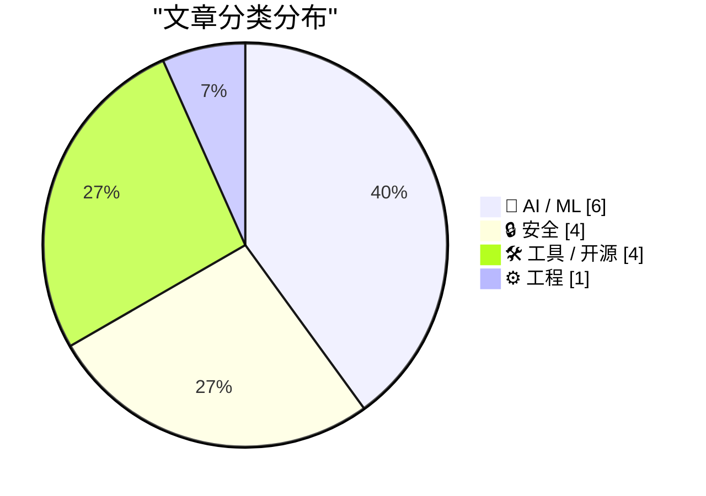
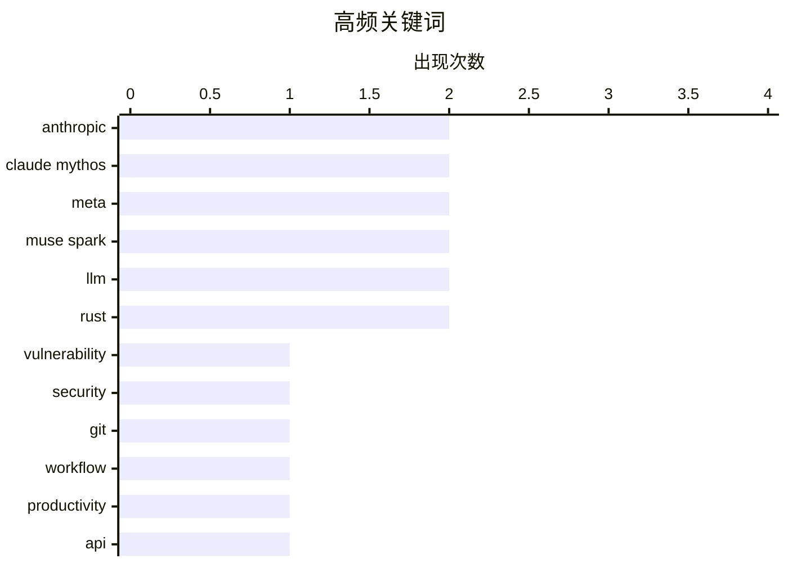

# 📰 AI 资讯每日精选 — 2026-04-09

> 汇聚 140+ 技术博客、X/Twitter、Hacker News、Reddit、Product Hunt、
> Lobste.rs、ClawFeed 日报及 GitHub Trending，经 AI 评分筛选。
>
> **本期内容**：🏆 今日必读 · 🌐 ClawFeed 日报 · 🔥 GitHub Trending · 📂 分类精选 · 🎨 设计与生成式 AI · 📊 数据概览

## 📝 今日看点

今日技术圈聚焦于AI能力的双刃剑效应与工具链的智能化演进。一方面，AI模型在安全与伦理边界引发深度关切，Claude Mythos等模型因能力“过于危险”被限制发布，同时AI滥用正催生新型安全威胁。另一方面，AI技术本身正朝着神经符号结合与物理模拟集成等更复杂、更专业的方向发展，以提升可靠性与应用深度。此外，从代码分析到项目理解，智能化、自动化的开发者工具正成为提升效率的关键趋势。

---

## 🏆 今日必读

🥇 **Anthropic 的新 Claude Mythos 模型在发现和利用漏洞方面过于强大，因此不向公众发布**

[Anthropic’s New Claude Mythos Is So Good at Finding and Exploiting Vulnerabilities That They’re Not Releasing It to the Public](https://red.anthropic.com/2026/mythos-preview/) — daringfireball.net · 8 小时前 · 🔒 安全

> Anthropic 发布了新的通用语言模型 Claude Mythos Preview，其在计算机安全任务上表现出惊人的能力。该模型在发现和利用软件漏洞方面极为高效，以至于公司决定不向公众开放。为此，Anthropic 启动了“玻璃翼项目”，旨在利用 Mythos Preview 来帮助保护全球最关键软件的安全，并推动行业采用新的实践以应对未来的网络攻击。此举标志着 AI 安全能力已发展到需要主动进行风险管控的新阶段。

💡 **为什么值得读**: 这篇文章揭示了当前最前沿的 AI 模型在网络安全攻防领域的真实能力边界，以及由此引发的、业界必须面对的新型伦理与安全挑战。

🏷️ Anthropic, Claude Mythos, vulnerability, security

🥈 **在阅读任何代码前我运行的 Git 命令**

[Git commands I run before reading any code](https://piechowski.io/post/git-commands-before-reading-code/) — Hacker News Best · 15 小时前 · 🛠 工具 / 开源

> 文章分享了一套在深入阅读陌生代码库之前，用于快速理解项目结构和历史的 Git 命令工作流。核心命令包括 `git log --oneline --graph --all` 可视化提交历史，`git shortlog -s -n` 查看核心贡献者，以及 `git diff --stat` 等命令来概览近期变更。这套方法能帮助开发者快速建立对项目规模、活跃度、协作模式和近期工作重点的宏观认知。掌握这些命令可以显著提升代码审查和项目上手的效率。

💡 **为什么值得读**: 这套经过社区验证的 Git 工作流极具实操性，能立即应用于日常开发，是提升工程师效率的必备技巧。

🏷️ Git, workflow, productivity

🥉 **Meta 的新模型是 Muse Spark，其 meta.ai 聊天机器人配备了一些有趣工具**

[Meta's new model is Muse Spark, and meta.ai chat has some interesting tools](https://simonwillison.net/2026/Apr/8/muse-spark/#atom-everything) — simonwillison.net · 1 小时前 · 🤖 AI / ML

> Meta 发布了自 Llama 4 约一年后的首个新模型 Muse Spark。与以往不同，Muse Spark 采用托管服务形式而非开源权重，目前 API 处于“面向选定用户的私有预览”阶段。用户可通过 meta.ai 网站（需 Facebook 或 Instagram 登录）进行体验。Meta 官方基准测试显示其性能具有竞争力，这标志着 Meta 在模型发布策略上向更封闭的“前沿模型”竞争模式转变。

💡 **为什么值得读**: 通过此文可快速了解 Meta 在 AI 模型竞赛中最新战略转向——从开源引领者转向闭源前沿模型的竞争。

🏷️ Meta, Muse Spark, LLM, API

4️⃣ **机器学习承诺将变得极其怪异**

[ML promises to be profoundly weird](https://aphyr.com/posts/411-the-future-of-everything-is-lies-i-guess) — Hacker News Best · 11 小时前 · 🤖 AI / ML

> 文章深刻探讨了当前以大语言模型为代表的机器学习系统所固有的“幻觉”问题，并指出这并非一个可被简单修复的技术缺陷。作者认为，这种系统性生成“谎言”或虚构内容的能力，是模型基于统计模式生成文本这一核心机制的必然产物。随着模型能力增强，其输出的说服力和表面连贯性也会同步提升，使得辨别真伪变得更加困难。这预示着由 AI 驱动的信息环境将变得“ profoundly weird”（极其怪异），我们需要重新思考信任、知识和沟通的基础。

💡 **为什么值得读**: 这篇文章超越了技术优化的常规讨论，从哲学和社会学层面尖锐地指出了 AI 时代人类将长期面临的认知根本性挑战。

🏷️ ML, ethics, philosophy

5️⃣ **为 LLM 配备用于代码分析的形式化推理引擎**

[Giving LLMs a Formal Reasoning Engine for Code Analysis](https://yogthos.net/posts/2026-04-08-neurosymbolic-mcp.html) — Lobste.rs · 2 小时前 · 🤖 AI / ML

> 文章探讨了通过模型上下文协议，将形式化推理引擎与大型语言模型结合，以提升代码分析的准确性和可靠性。这种神经符号方法让 LLM 能够调用外部工具（如定理证明器或符号执行引擎）来验证其关于代码行为的推理。这可以弥补 LLM 在逻辑一致性和精确性上的不足，特别是在处理复杂程序验证或安全漏洞分析时。该方案为构建更可靠、可解释的 AI 辅助编程工具提供了有前景的方向。

💡 **为什么值得读**: 它展示了一种切实可行的技术路径，将 LLM 的灵活性与传统形式化方法的严谨性相结合，是解决 AI 编程“幻觉”问题的前沿实践。

🏷️ LLM, reasoning, code-analysis, formal-methods

---

## 🌐 ClawFeed 日报精选

> 来源：[ClawFeed](https://clawfeed.kevinhe.io) — AI 驱动的多源新闻聚合

### 🔥 今日头条

1. **Anthropic Project Glasswing / Claude Mythos Preview 成为全天最强主线**
   Anthropic 推出面向防御型网络安全测试的 Project Glasswing，并向少数合作伙伴开放 Claude Mythos Preview。市场讨论焦点已经从“模型更强”转向“AI 找漏洞能力已进入关键基础设施级别”。

2. **AI Security 正在从模型能力叙事升级为国家级基础设施叙事**
   Reuters、NYT、TechCrunch 等媒体持续跟进，CrowdStrike、Palo Alto Networks、Google、Nvidia 等名字频繁出现，说明“AI for cyber”已从 demo 走向更严肃的产业协作。

3. **Agent OS / Personal OpenClaw 叙事继续升温**
   今天多条高质量 feed 都围绕 OpenClaw、Hermes Agent、Tasklet、OpenFang、cloud agent OS 展开。大家讨论的重点已经不是聊天，而是 schedule、memory、tools、overnight monitoring、云端执行这些“真正能干活的 agent 系统能力”。

4. **垂直 Agent 继续深入具体工作流**
   视频编辑 agent（Mosaic）、AI agents CRM（momo）、AI 运维/可观测性 agent、TradingView MCP、Vibe-Trading 等案例说明，agent 正在从通用助手走向行业化、岗位化、流程化。

5. **Harness / Memory / Knowledge System 仍是 builder 圈高频关键词**
   从 Harness Engineering、MemPalace、LLM Wiki、Field Theory CLI 到“第二大脑”工作流，今天 builder 圈持续在讨论如何把模型能力变成可积累、可检索、可复用的系统能力。

### 📊 今日观察

今天最明显的变化是，AI 圈讨论重心在从“模型又升级了”转向“模型能否嵌进真实系统并持续执行”。一边是 Anthropic 用 Mythos/Glasswing 把 AI 安全拉到更严肃的产业级叙事，另一边是 builder 圈继续往 agent OS、agent CRM、agent observability、agent quant、memory system 这些具体工作流深挖。换句话说，今天不是单点爆款日，而是“agent 基础设施化”被再次确认的一天。

---

## 🔥 GitHub Trending

> 今日热门开源项目（全语言 + Python）

| # | 项目 | 描述 | ⭐ 总星 | 📈 今日 | 语言 |
|---|------|------|---------|---------|------|
| 1 | [NousResearch/hermes-agent](https://github.com/NousResearch/hermes-agent) 🤖 | The agent that grows with you | 37.3k | +5794 | Python |
| 2 | [obra/superpowers](https://github.com/obra/superpowers) | An agentic skills framework & software development method... | 141.5k | +2028 | Shell |
| 3 | [HKUDS/DeepTutor](https://github.com/HKUDS/DeepTutor) 🤖 | "DeepTutor: Agent-Native Personalized Learning Assistant" | 13.6k | +1306 | Python |
| 4 | [abhigyanpatwari/GitNexus](https://github.com/abhigyanpatwari/GitNexus) 🤖 | GitNexus: The Zero-Server Code Intelligence Engine - GitN... | 25.3k | +980 | TypeScript |
| 5 | [google-ai-edge/gallery](https://github.com/google-ai-edge/gallery) 🤖 | A gallery that showcases on-device ML/GenAI use cases and... | 19.5k | +853 | Kotlin |
| 6 | [forrestchang/andrej-karpathy-skills](https://github.com/forrestchang/andrej-karpathy-skills) |  | 9.0k | +702 | - |
| 7 | [TheCraigHewitt/seomachine](https://github.com/TheCraigHewitt/seomachine) 🤖 | A specialized Claude Code workspace for creating long-for... | 4.6k | +649 | Python |
| 8 | [NVIDIA/personaplex](https://github.com/NVIDIA/personaplex) | PersonaPlex code. | 8.4k | +586 | Python |
| 9 | [elebumm/RedditVideoMakerBot](https://github.com/elebumm/RedditVideoMakerBot) | Create Reddit Videos with just✨ one command ✨ | 10.5k | +555 | Python |
| 10 | [google-ai-edge/LiteRT-LM](https://github.com/google-ai-edge/LiteRT-LM) 🤖 |  | 3.0k | +501 | C++ |
| 11 | [atilaahmettaner/tradingview-mcp](https://github.com/atilaahmettaner/tradingview-mcp) 🤖 | Advanced TradingView MCP Server for AI-powered market ana... | 1.3k | +447 | Python |
| 12 | [microsoft/BitNet](https://github.com/microsoft/BitNet) | Official inference framework for 1-bit LLMs | 37.9k | +388 | Python |
| 13 | [HKUDS/AI-Trader](https://github.com/HKUDS/AI-Trader) 🤖 | "AI-Trader: 100% Fully-Automated Agent-Native Trading" | 12.7k | +294 | Python |
| 14 | [unslothai/unsloth](https://github.com/unslothai/unsloth) 🤖 | Unsloth Studio is a web UI for training and running open ... | 60.3k | +267 | Python |
| 15 | [virattt/ai-hedge-fund](https://github.com/virattt/ai-hedge-fund) 🤖 | An AI Hedge Fund Team | 50.7k | +151 | Python |

---

## 🤖 AI / ML

### 1. Meta 的新模型是 Muse Spark，其 meta.ai 聊天机器人配备了一些有趣工具

[Meta's new model is Muse Spark, and meta.ai chat has some interesting tools](https://simonwillison.net/2026/Apr/8/muse-spark/#atom-everything) — **simonwillison.net** · 1 小时前 · ⭐ 26/30

> Meta 发布了自 Llama 4 约一年后的首个新模型 Muse Spark。与以往不同，Muse Spark 采用托管服务形式而非开源权重，目前 API 处于“面向选定用户的私有预览”阶段。用户可通过 meta.ai 网站（需 Facebook 或 Instagram 登录）进行体验。Meta 官方基准测试显示其性能具有竞争力，这标志着 Meta 在模型发布策略上向更封闭的“前沿模型”竞争模式转变。

🏷️ Meta, Muse Spark, LLM, API

---

### 2. 机器学习承诺将变得极其怪异

[ML promises to be profoundly weird](https://aphyr.com/posts/411-the-future-of-everything-is-lies-i-guess) — **Hacker News Best** · 11 小时前 · ⭐ 26/30

> 文章深刻探讨了当前以大语言模型为代表的机器学习系统所固有的“幻觉”问题，并指出这并非一个可被简单修复的技术缺陷。作者认为，这种系统性生成“谎言”或虚构内容的能力，是模型基于统计模式生成文本这一核心机制的必然产物。随着模型能力增强，其输出的说服力和表面连贯性也会同步提升，使得辨别真伪变得更加困难。这预示着由 AI 驱动的信息环境将变得“ profoundly weird”（极其怪异），我们需要重新思考信任、知识和沟通的基础。

🏷️ ML, ethics, philosophy

---

### 3. 为 LLM 配备用于代码分析的形式化推理引擎

[Giving LLMs a Formal Reasoning Engine for Code Analysis](https://yogthos.net/posts/2026-04-08-neurosymbolic-mcp.html) — **Lobste.rs** · 2 小时前 · ⭐ 26/30

> 文章探讨了通过模型上下文协议，将形式化推理引擎与大型语言模型结合，以提升代码分析的准确性和可靠性。这种神经符号方法让 LLM 能够调用外部工具（如定理证明器或符号执行引擎）来验证其关于代码行为的推理。这可以弥补 LLM 在逻辑一致性和精确性上的不足，特别是在处理复杂程序验证或安全漏洞分析时。该方案为构建更可靠、可解释的 AI 辅助编程工具提供了有前景的方向。

🏷️ LLM, reasoning, code-analysis, formal-methods

---

### 4. Meta 的 Muse Spark 是其首个前沿模型，也是首个未开源权重的模型

[Meta's Muse Spark is its first frontier model and its first without open weights](https://the-decoder.com/metas-muse-spark-is-its-first-frontier-model-and-its-first-without-open-weights/) — **The Decoder** · 6 小时前 · ⭐ 25/30

> Meta 超级智能实验室推出了 Muse Spark，这是该团队的首个“前沿模型”，也是 Meta 首个不开放权重的模型。独立测试表明，其性能正在缩小与 OpenAI、Anthropic 和 Google 的差距。这一发布标志着 Meta 的 AI 战略发生关键转变，从开源模型的倡导者转变为闭源前沿模型的直接竞争者。行业竞争并未停歇，其他公司也在快速推进。

🏷️ Meta, Frontier Model, Closed Weights, Muse Spark

---

### 5. 从 GPT-2 到 Claude Mythos：那些被认定为“过于危险而不能发布”的 AI 模型卷土重来

[From GPT-2 to Claude Mythos: The return of AI models deemed 'too dangerous to release'](https://the-decoder.com/from-gpt-2-to-claude-mythos-the-return-of-ai-models-deemed-too-dangerous-to-release/) — **The Decoder** · 11 小时前 · ⭐ 25/30

> 七年前，OpenAI 以“过于危险”为由未完全发布 GPT-2，当时业界多持怀疑态度。如今，Anthropic 以类似理由不公开其 Claude Mythos Preview 模型，但这次有了实质性证据：该模型发现了操作系统和浏览器中的数千个漏洞，其发现速度之快已超出人工审核能力。这表明当前顶尖 AI 的网络安全攻击能力已达到新的危险阈值。文章比较了两次事件的异同，指出行业如今必须更严肃地对待模型安全发布的伦理问题。

🏷️ AI Safety, Model Release, Claude Mythos, Vulnerabilities

---

### 6. 上周生成式图像与视频进展周报

[Last week in Generative Image & Video](https://www.reddit.com/r/comfyui/comments/1sfj9uk/last_week_in_generative_image_video/) — **r/comfyui** · 19 小时前 · ⭐ 25/30

> 这是一份关于 Stable Diffusion 和 ComfyUI 生态在上周进展的汇总周报。内容涵盖了新发布的模型（如 SD3.5 和 Flux 模型）、工作流节点、社区工具以及重要的技术讨论。报告重点介绍了能够提升图像质量、控制精度或工作流效率的具体工具和技巧。其核心价值在于为生成式 AI 实践者提供了一个快速了解社区动态、发现有用新工具的技术资讯聚合。

🏷️ Newsletter, AI Art, Video, Roundup

---

## 🔒 安全

### 7. Anthropic 的新 Claude Mythos 模型在发现和利用漏洞方面过于强大，因此不向公众发布

[Anthropic’s New Claude Mythos Is So Good at Finding and Exploiting Vulnerabilities That They’re Not Releasing It to the Public](https://red.anthropic.com/2026/mythos-preview/) — **daringfireball.net** · 8 小时前 · ⭐ 27/30

> Anthropic 发布了新的通用语言模型 Claude Mythos Preview，其在计算机安全任务上表现出惊人的能力。该模型在发现和利用软件漏洞方面极为高效，以至于公司决定不向公众开放。为此，Anthropic 启动了“玻璃翼项目”，旨在利用 Mythos Preview 来帮助保护全球最关键软件的安全，并推动行业采用新的实践以应对未来的网络攻击。此举标志着 AI 安全能力已发展到需要主动进行风险管控的新阶段。

🏷️ Anthropic, Claude Mythos, vulnerability, security

---

### 8. 脱衣机器人、深度伪造和自动化存档：AI 如何在 Telegram 上助长货币化的虐待生态系统

[Nudifying bots, deepfakes, and automated archives: how AI powers a monetized abuse ecosystem on Telegram](https://the-decoder.com/nudifying-bots-deepfakes-and-automated-archives-how-ai-powers-a-monetized-abuse-ecosystem-on-telegram/) — **The Decoder** · 8 小时前 · ⭐ 25/30

> 基于对意大利和西班牙 280 万条 Telegram 消息的分析，文章揭示了 AI 工具如何推动一个围绕非自愿亲密图像的货币化生态系统。该生态系统包括利用“脱衣”AI 机器人生成伪造裸照、制作深度伪造视频，以及建立自动化的“档案”频道来交易和传播这些内容。这些活动已形成完整的产业链，对受害者造成持续伤害。分析表明，AI 技术正在显著降低此类恶意行为的门槛和成本。

🏷️ AI Abuse, Deepfakes, Telegram, Non-consensual Imagery

---

### 9. VeraCrypt 项目更新

[Veracrypt project update](https://sourceforge.net/p/veracrypt/discussion/general/thread/9620d7a4b3/) — **Hacker News Best** · 16 小时前 · ⭐ 25/30

> VeraCrypt 是 TrueCrypt 的知名开源继承者，专注于提供全磁盘加密。项目在 SourceForge 的讨论区发布了更新，通常涉及新版本发布、安全修复、功能更新或开发路线图。此类更新会吸引大量关注，因为 VeraCrypt 被广泛用于保护敏感数据的安全。社区讨论非常活跃，反映了用户对这款关键安全工具持续改进的期待和参与。

🏷️ VeraCrypt, encryption, community

---

### 10. [arXiv] 工业界 REST API 模糊测试：必要特性与开放性问题

[[arXiv] Fuzzing REST APIs in Industry: Necessary Features and Open Problems](https://www.reddit.com/r/programming/comments/1sfm5e0/arxiv_fuzzing_rest_apis_in_industry_necessary/) — **r/programming** · 16 小时前 · ⭐ 25/30

> 这是一篇关于在工业环境中对 REST API 进行模糊测试的技术性学术报告。报告基于大众汽车引入开源 REST API 模糊测试工具的实际经验，总结了工业级 API 模糊测试必须具备的关键特性，如状态管理、认证处理和对复杂数据模式的支持。文章同时指出了当前工具在可扩展性、结果分析和与 CI/CD 流水线集成方面面临的开放性问题。结论是，有效的工业级 API 模糊测试需要超越传统随机测试，具备对应用状态和业务逻辑的深度理解。

🏷️ fuzzing, REST API, security testing, industry

---

## 🛠 工具 / 开源

### 11. 在阅读任何代码前我运行的 Git 命令

[Git commands I run before reading any code](https://piechowski.io/post/git-commands-before-reading-code/) — **Hacker News Best** · 15 小时前 · ⭐ 27/30

> 文章分享了一套在深入阅读陌生代码库之前，用于快速理解项目结构和历史的 Git 命令工作流。核心命令包括 `git log --oneline --graph --all` 可视化提交历史，`git shortlog -s -n` 查看核心贡献者，以及 `git diff --stat` 等命令来概览近期变更。这套方法能帮助开发者快速建立对项目规模、活跃度、协作模式和近期工作重点的宏观认知。掌握这些命令可以显著提升代码审查和项目上手的效率。

🏷️ Git, workflow, productivity

---

### 12. 使用 NVIDIA Omniverse 库将物理 AI 能力集成到现有应用中

[Integrate Physical AI Capabilities into Existing Apps with NVIDIA Omniverse Libraries](https://developer.nvidia.com/blog/integrate-physical-ai-capabilities-into-existing-apps-with-nvidia-omniverse-libraries/) — **NVIDIA Technical Blog** · 8 小时前 · ⭐ 25/30

> 物理 AI 指能在物理模拟环境中感知、推理和行动的 AI 系统，它正在改变机器人及自动化系统的设计和验证方式。NVIDIA Omniverse 库提供了一套工具，允许开发者将高保真物理模拟和 AI 能力集成到现有的应用程序和工作流中。这些库包括用于物理模拟的 Nucleus、Kit 和 PhysX，能够帮助团队在虚拟环境中训练、测试和部署 AI 智能体。这可以加速开发周期，降低成本，并提高在现实世界中部署的可靠性。

🏷️ NVIDIA Omniverse, Physical AI, Simulation, Robotics

---

### 13. 为 TypeScript 构建 Rust 运行时

[Building a Rust runtime for Typescript](https://www.reddit.com/r/programming/comments/1sfuoj2/building_a_rust_runtime_for_typescript/) — **r/programming** · 9 小时前 · ⭐ 25/30

> 文章探讨了使用 Rust 为 TypeScript 构建高性能运行时的技术方案。核心方案是创建一个名为 Encore 的 Rust 运行时，它通过编译时类型检查和 Rust 的零成本抽象来提升后端服务的性能与可靠性。该运行时旨在解决 Node.js 在并发和资源效率上的瓶颈，同时保持 TypeScript 的开发体验。最终，作者认为 Rust 与 TypeScript 的结合为构建高效、类型安全的云服务提供了新的可能性。

🏷️ Rust, TypeScript, runtime, performance

---

### 14. 深度解析 Turso：那个“用 Rust 重写的 SQLite”

[Deep dive into Turso, the "SQLite rewrite in Rust"](https://www.reddit.com/r/programming/comments/1sfxc3r/deep_dive_into_turso_the_sqlite_rewrite_in_rust/) — **r/programming** · 7 小时前 · ⭐ 25/30

> 文章对 Turso 进行了技术深潜，这是一个基于 libSQL（SQLite 的分支）并用 Rust 构建的边缘数据库。Turso 的核心创新在于将 SQLite 的轻量级单机引擎，通过 Rust 重写和扩展，转变为一个全球分布式、低延迟的数据库服务。它解决了原生 SQLite 在多写并发和分布式部署上的局限性，同时保持了极简的部署模型和 SQL 兼容性。作者认为，Turso 代表了将经典单机数据库现代化、以适应云原生和边缘计算需求的一个成功范例。

🏷️ Rust, SQLite, database, Turso

---

## ⚙️ 工程

### 15. Anthropic 工程博客：如何构建托管智能体服务

[New on the Engineering Blog: Building Managed Agents—our hosted service for long-running agents—meant solving an old problem in computing: how to de...](https://x.com/AnthropicAI/status/2041929199976640948) — **𝕏 @AnthropicAI** · 6 小时前 · ⭐ 25/30

> 文章介绍了 Anthropic 构建其托管智能体服务（Managed Agents）所解决的核心系统设计挑战。关键问题是如何设计一个能够安全、可靠地运行“尚未被构思出来的程序”（即用户未来定义的各种智能体）的通用平台。解决方案涉及资源隔离、状态持久化、外部工具调用以及故障恢复等机制，以确保未知代码的长期稳定运行。Anthropic 的核心观点是，构建此类平台需要在前瞻性的抽象设计与严格的运行时约束之间取得平衡。

🏷️ managed agents, system design, Anthropic

---

## 🎨 Design & Generative AI

### 🖥️ 生成式 UI

- **[构建类ChatGPT的ComfyUI简化界面](https://www.reddit.com/r/comfyui/comments/1sfmov7/i_am_building_a_ui_that_completely_hides_comfyui/)** — r/comfyui · 15 小时前
  > 开发一个隐藏ComfyUI节点复杂性的独立应用，用户只需输入文本即可生成图像。

### 🖼️ 生成式图片

- **[ComfyUI节点执行顺序与内存管理工具](https://www.reddit.com/r/comfyui/comments/1sfu6i9/ive_made_a_comfyui_node_to_control_the_execution/)** — r/comfyui · 9 小时前
  > 介绍一个用于控制ComfyUI节点执行顺序并释放内存的自定义节点，以加速工作流。

- **[16GB显存的LTX LoRA训练方案](https://www.reddit.com/r/StableDiffusion/comments/1sfw8tk/comfyui_ltx_lora_trainer_for_16gb_vram/)** — r/StableDiffusion · 8 小时前
  > 分享在16GB VRAM限制下训练ComfyUI LTX LoRA模型的方法。

- **[Claude AI审查ComfyUI“LongVideo”节点](https://www.reddit.com/r/StableDiffusion/comments/1sfy7s5/had_claude_review_a_popular_comfyui_node_by/)** — r/StableDiffusion · 7 小时前
  > 使用Claude AI分析一个流行的ComfyUI视频节点，发现其存在数据写入但未被读取的问题。

- **[开源AI艺术竞赛获奖作品公布](https://www.reddit.com/r/StableDiffusion/comments/1sg4hp4/here_are_the_winners_of_our_open_source_ai_art/)** — r/StableDiffusion · 3 小时前
  > 公布一场开源AI艺术比赛的获奖者，并感谢所有参与者和投票者。

- **[ComfyUI自定义节点开发入门教程](https://www.reddit.com/r/comfyui/comments/1sfvn9e/vibe_code_your_first_comfyui_custom_node_step_by/)** — r/comfyui · 8 小时前
  > 提供一步步创建第一个ComfyUI自定义节点的详细教程。

- **[寻找最佳图像超分与细节增强方法](https://www.reddit.com/r/comfyui/comments/1sfoask/your_fav_upscale_plus_add_detail_method/)** — r/comfyui · 14 小时前
  > 征集在ComfyUI中提升图像分辨率和添加细节的有效工作流程。

- **[Midjourney生成写实人像的眼睛技巧](https://www.reddit.com/r/midjourney/comments/1sfsij7/how_to_get_midjourney_to_depict_realistic_eyes/)** — r/midjourney · 10 小时前
  > 探讨如何让Midjourney在生成超写实人像时描绘出逼真的眼睛。

- **[Midjourney图像质量下降原因分析](https://www.reddit.com/r/midjourney/comments/1sg14tq/can_anyone_explain_the_detriment_in_quality_here/)** — r/midjourney · 5 小时前
  > 询问Midjourney生成图像质量下降的可能原因。

- **[为德国民谣金属风格创建ACE Step 1.5 LoRA](https://www.reddit.com/r/StableDiffusion/comments/1sfods7/ace_step_15_lora_for_german_folk_metal/)** — r/StableDiffusion · 14 小时前
  > 分享首次尝试为ACE Step 1.5模型创建德国民谣金属风格LoRA的经历。

### 🎬 生成式视频

- **[实现专业级AI图生视频的视角与运镜技巧](https://www.reddit.com/r/comfyui/comments/1sg3xrj/how_to_achieve_professional_ai_imagetovideo/)** — r/comfyui · 4 小时前
  > 探讨如何在AI图生视频中实现一致的拍摄角度和专业的摄像机运动效果。

- **[动漫转半写实风格的视频LoRA模型](https://www.reddit.com/r/StableDiffusion/comments/1sfpyh7/anime2halfreal_ltx23/)** — r/StableDiffusion · 12 小时前
  > 介绍一个专为视频到视频转换设计的实验性LoRA模型，可将动漫风格转为半写实风格。

- **[LTX2.3 LoRA模型训练的挑战与体验](https://www.reddit.com/r/StableDiffusion/comments/1sfl5lu/anyone_had_a_good_experience_training_a_ltx23/)** — r/StableDiffusion · 17 小时前
  > 讨论使用musubi tuner训练LTX2.3视频LoRA模型效果不佳的个人经历。

- **[在ComfyUI中实现LTX 2.3的唇语同步视频](https://www.reddit.com/r/StableDiffusion/comments/1sfqiqq/question_how_to_achieve_lipsynced_vid2vid_with/)** — r/StableDiffusion · 12 小时前
  > 寻求在ComfyUI中使用LTX 2.3将静音视频转换为口型与音频同步的视频的方法。

- **[Midjourney V8运动功能初体验](https://www.reddit.com/r/midjourney/comments/1sfowsi/trying_out_v8_motion/)** — r/midjourney · 13 小时前
  > 测试Midjourney V8版本从图像生成循环视频的运动功能，认为效果尚未成熟。

---

## 📊 数据概览

| 扫描源 | 抓取文章 | 时间范围 | 精选 |
|:---:|:---:|:---:|:---:|
| 110/140 | 4598 篇 → 209 篇 | 24h | **15 篇** |

### 分类分布



### 高频关键词



<details>
<summary>📈 纯文本关键词图（终端友好）</summary>

```
anthropic     │ ████████████████████ 2
claude mythos │ ████████████████████ 2
meta          │ ████████████████████ 2
muse spark    │ ████████████████████ 2
llm           │ ████████████████████ 2
rust          │ ████████████████████ 2
vulnerability │ ██████████░░░░░░░░░░ 1
security      │ ██████████░░░░░░░░░░ 1
git           │ ██████████░░░░░░░░░░ 1
workflow      │ ██████████░░░░░░░░░░ 1
```

</details>

### 🏷️ 话题标签

**anthropic**(2) · **claude mythos**(2) · **meta**(2) · muse spark(2) · llm(2) · rust(2) · vulnerability(1) · security(1) · git(1) · workflow(1) · productivity(1) · api(1) · ml(1) · ethics(1) · philosophy(1) · reasoning(1) · code-analysis(1) · formal-methods(1) · frontier model(1) · closed weights(1)

---

*生成于 2026-04-09 00:09 | 汇聚 140 个技术博客、X/Twitter、Hacker News、Reddit、Product Hunt、Lobste.rs、ClawFeed 日报及 GitHub Trending，经 AI 评分筛选出 Top 15 精华内容*
