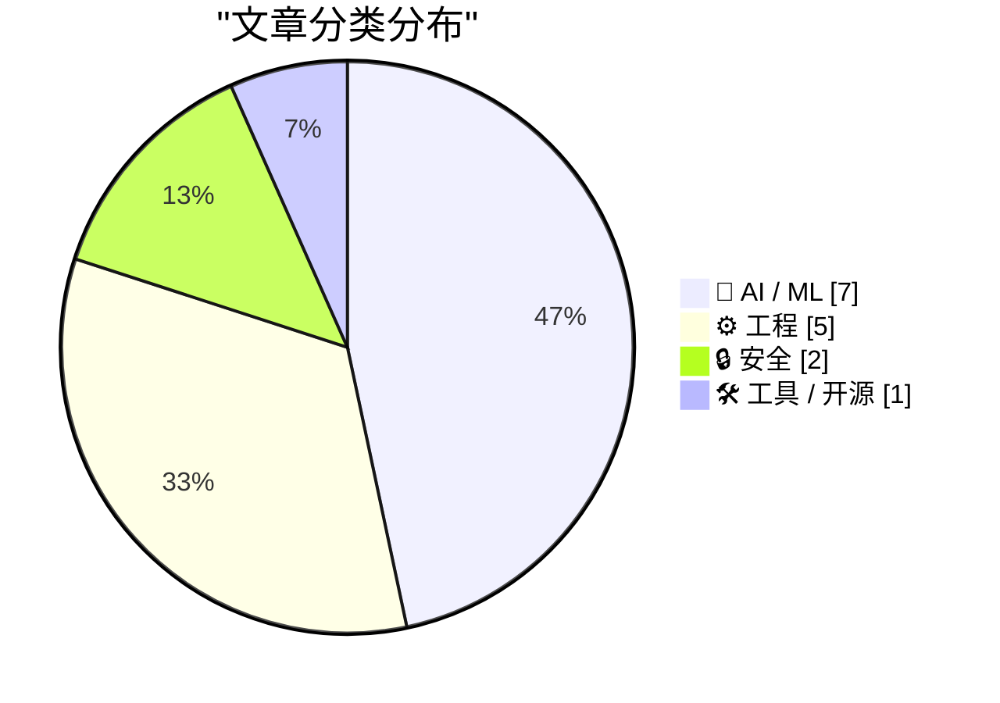
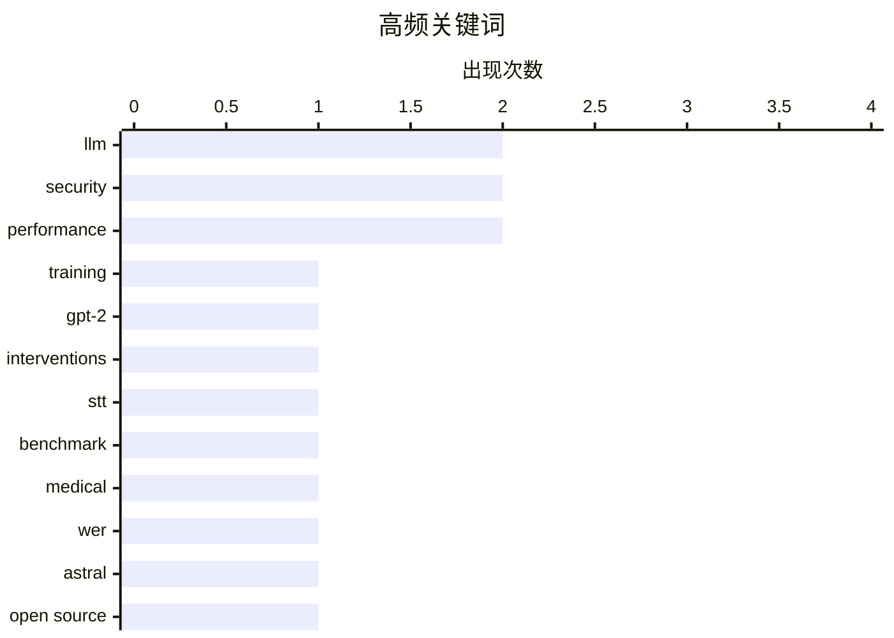

# 📰 AI 资讯每日精选 — 2026-04-10

> 汇聚 140+ 技术博客、X/Twitter、Hacker News、Reddit、Product Hunt、
> Lobste.rs、ClawFeed 日报及 GitHub Trending，经 AI 评分筛选。
>
> **本期内容**：🏆 今日必读 · 🌐 ClawFeed 日报 · 🔥 GitHub Trending · 📂 分类精选 · 🎨 设计与生成式 AI · 📊 数据概览

## 📝 今日看点

今日技术圈聚焦于AI能力的深度进化与安全边界的双重挑战。一方面，AI模型正朝着更强大、更专用的方向发展，从开源大模型的训练优化到医疗等垂直领域的精准评测，再到移动设备端的本地化部署，技术民主化与实用化趋势明显。另一方面，从开源安全实践到沙箱逃逸漏洞，再到AI模型本身带来的潜在风险，整个行业对安全问题的关注提升到了前所未有的高度。此外，对经典工程实践（如环境变量配置）的反思，也体现了技术界在追求创新同时，正着手夯实基础设施。

---

## 🏆 今日必读

🥇 **从零开始构建LLM，第32j部分——干预措施：尝试在云端训练一个更好的模型**

[Writing an LLM from scratch, part 32j -- Interventions: trying to train a better model in the cloud](https://www.gilesthomas.com/2026/04/llm-from-scratch-32j-interventions-trying-to-train-a-better-model-in-the-cloud) — gilesthomas.com · 4 小时前 · 🤖 AI / ML

> 作者基于Sebastian Raschka的书籍，在本地RTX 3090上从头训练了一个1.63亿参数的GPT-2风格模型。自二月初以来，作者尝试了多种干预措施，旨在提升这个基础模型的性能。原始模型的损失值为3.944，后续的干预实验旨在降低这一损失。文章的核心是分享在云端进行模型优化训练的具体尝试和过程。

💡 **为什么值得读**: 对于想深入了解小型LLM模型调优、从理论到实践具体步骤的开发者，这篇文章提供了宝贵的实战经验。

🏷️ LLM, training, GPT-2, interventions

🥈 **我用新的医学WER指标对42个STT模型进行了医学音频基准测试——排行榜完全洗牌**

[I benchmarked 42 STT models on medical audio with a new Medical WER metric — the leaderboard completely reshuffled](https://www.reddit.com/r/LocalLLaMA/comments/1sgtrgc/i_benchmarked_42_stt_models_on_medical_audio_with/) — r/LocalLLaMA · 8 小时前 · 🤖 AI / ML

> 文章对42个语音转文本（STT）模型在医学音频领域的表现进行了全面基准测试。测试引入了一个新的“医学词错误率”（Medical WER）指标，该指标更专注于医学术语的识别准确性。使用新指标后，模型的性能排行榜发生了彻底变化，揭示了通用WER指标在专业领域的局限性。这表明为特定领域设计专用评估指标至关重要。

💡 **为什么值得读**: 如果你在医疗、法律等专业领域应用STT技术，这篇文章揭示了通用评估指标的陷阱并提供了关键的选型参考。

🏷️ STT, benchmark, medical, WER

🥉 **Astral公司的开源安全实践**

[Open source security at Astral](https://astral.sh/blog/open-source-security-at-astral) — Hacker News Best · 20 小时前 · 🔒 安全

> 文章详细阐述了Astral公司（知名开源项目Ruff和UV的创建者）如何构建和实施其开源安全策略。内容涵盖了他们如何管理依赖项漏洞、进行安全审计、处理漏洞披露流程以及确保其工具链的安全。Astral将安全视为开发生命周期的核心部分，而不仅仅是事后补救。这为其他开源项目维护者和公司提供了系统性的安全实践框架。

💡 **为什么值得读**: 对于维护关键开源项目或关心软件供应链安全的企业和开发者，这是一份极具参考价值的实战指南。

🏷️ Astral, security, open source, Ruff

4️⃣ **环境变量是一个遗留的烂摊子：让我们深入探究**

[Environment variables are a legacy mess: Let's dive deep into them](https://www.reddit.com/r/programming/comments/1sgpy96/environment_variables_are_a_legacy_mess_lets_dive/) — r/programming · 10 小时前 · ⚙️ 工程

> 文章批判性地审视了环境变量这一广泛使用的配置机制，指出其存在诸多设计缺陷和历史遗留问题。问题包括缺乏结构化和类型安全、作用域不清晰、在不同操作系统和Shell中的行为不一致，以及难以调试和测试。作者认为，尽管环境变量简单易用，但其混乱的特性使其在现代应用开发中成为维护的负担。文章呼吁开发者认识到这些缺陷，并考虑更现代的替代方案。

💡 **为什么值得读**: 这篇文章能帮助你从根本上理解环境变量的痛点，促使你反思和优化自己项目的配置管理策略。

🏷️ environment variables, configuration, security, best practices

5️⃣ **我们刚刚在Off Grid中发布了Gemma 4支持🔥——开源移动应用，设备端推理，零云端依赖。安卓已上线，iOS即将推出。**

[We just shipped Gemma 4 support in Off Grid 🔥- open-source mobile app, on-device inference, zero cloud. Android live, iOS coming soon.](https://www.reddit.com/r/LocalLLaMA/comments/1sglu08/we_just_shipped_gemma_4_support_in_off_grid/) — r/LocalLLaMA · 13 小时前 · 🛠 工具 / 开源

> Off Grid是一款开源、离线优先的AI移动应用，现已支持在手机端本地运行Gemma 4模型（E2B和E4B边缘变体）。其核心特点是完全在手机NPU/CPU上运行，无需服务器、Python环境或笔记本电脑。该应用利用了Gemma 4的128K上下文窗口，支持处理长文档和代码，并集成了原生视觉和Whisper语音转文本功能。这标志着在移动设备上实现强大、全功能本地AI体验的显著进步。

💡 **为什么值得读**: 对于渴望在移动设备上体验完全离线、长上下文、多模态大模型能力的用户和开发者，这是一个令人兴奋的实践项目。

🏷️ mobile, on-device, Gemma, open-source

---

## 🌐 ClawFeed 日报精选

> 来源：[ClawFeed](https://clawfeed.kevinhe.io) — AI 驱动的多源新闻聚合

### 🔥 今日头条

1. **Anthropic 的 Claude Managed Agents 成为今天 AI 圈绝对主线**  
   从 public beta 到大量中文/英文拆解，核心不是又一个模型功能，而是把长时运行 agent 的托管 runtime、权限、安全、状态管理和部署基础设施打包产品化。讨论焦点已经从“模型有多强”转向“生产级 agent 怎么稳定上线”。

2. **Agent 竞争点正在从模型能力转向 harness engineering 和 infra**  
   今天大量 feed 都在重复同一个判断, 真正拉开差距的不是底层模型本身，而是工具接入、权限边界、多 agent 编排、可观测性、长任务稳定性和 deployment infra。

3. **企业 AI 采用已经明显越过纯试点阶段**  
   a16z 分享的数据指出，约 29% Fortune 500、约 19%-20% Global 2000 已经是头部 AI 创业公司的付费客户。这给“企业还只是看看”的叙事降了温，也强化了 agent 产品化的现实需求。

4. **Google 和 OpenAI 也在继续补工作流层能力**  
   Google 给 Gemini App 加 notebooks 并和 NotebookLM 打通，OpenAI 继续扩展 Projects / Custom Actions，说明大厂都在把 AI 从单轮对话推向“项目工作台 + 工作流执行”。

5. **AI 商业化和 agent 开源复刻同时提速**  
   一边是 OpenAI 广告业务年化收入爬升到 1 亿美元级别，另一边是 Cabinet、Multica 等 Claude Managed Agents 的开源/类开源复刻迅速冒头，市场已经开始围绕 agent infra 抢位。

---

## 🔥 GitHub Trending

> 今日热门开源项目（全语言 + Python）

| # | 项目 | 描述 | ⭐ 总星 | 📈 今日 | 语言 |
|---|------|------|---------|---------|------|
| 1 | [NousResearch/hermes-agent](https://github.com/NousResearch/hermes-agent) 🤖 | The agent that grows with you | 44.2k | +6485 | Python |
| 2 | [obra/superpowers](https://github.com/obra/superpowers) | An agentic skills framework & software development method... | 143.7k | +2299 | Shell |
| 3 | [forrestchang/andrej-karpathy-skills](https://github.com/forrestchang/andrej-karpathy-skills) 🤖 | A single CLAUDE.md file to improve Claude Code behavior, ... | 10.4k | +1364 | - |
| 4 | [HKUDS/DeepTutor](https://github.com/HKUDS/DeepTutor) 🤖 | "DeepTutor: Agent-Native Personalized Learning Assistant" | 14.8k | +1310 | Python |
| 5 | [opendataloader-project/opendataloader-pdf](https://github.com/opendataloader-project/opendataloader-pdf) 🤖 | PDF Parser for AI-ready data. Automate PDF accessibility.... | 13.7k | +1124 | Java |
| 6 | [TheCraigHewitt/seomachine](https://github.com/TheCraigHewitt/seomachine) 🤖 | A specialized Claude Code workspace for creating long-for... | 5.2k | +725 | Python |
| 7 | [OpenBMB/VoxCPM](https://github.com/OpenBMB/VoxCPM) | VoxCPM2: Tokenizer-Free TTS for Multilingual Speech Gener... | 7.6k | +496 | Python |
| 8 | [virattt/ai-hedge-fund](https://github.com/virattt/ai-hedge-fund) 🤖 | An AI Hedge Fund Team | 51.0k | +428 | Python |
| 9 | [521xueweihan/HelloGitHub](https://github.com/521xueweihan/HelloGitHub) | 分享 GitHub 上有趣、入门级的开源项目。Share interesting, entry-level ope... | 149.9k | +267 | Python |
| 10 | [shiyu-coder/Kronos](https://github.com/shiyu-coder/Kronos) | Kronos: A Foundation Model for the Language of Financial ... | 12.2k | +245 | Python |
| 11 | [open-webui/open-webui](https://github.com/open-webui/open-webui) 🤖 | User-friendly AI Interface (Supports Ollama, OpenAI API, ... | 131.0k | +220 | Python |
| 12 | [microsoft/BitNet](https://github.com/microsoft/BitNet) | Official inference framework for 1-bit LLMs | 38.0k | +214 | Python |
| 13 | [atilaahmettaner/tradingview-mcp](https://github.com/atilaahmettaner/tradingview-mcp) 🤖 | Real-time crypto & stock screening, advanced technical in... | 1.5k | +201 | Python |
| 14 | [YishenTu/claudian](https://github.com/YishenTu/claudian) 🤖 | An Obsidian plugin that embeds Claude Code as an AI colla... | 6.8k | +200 | TypeScript |
| 15 | [coleam00/Archon](https://github.com/coleam00/Archon) 🤖 | The first open-source harness builder for AI coding. Make... | 14.4k | +185 | TypeScript |

---

## 🤖 AI / ML

### 1. 从零开始构建LLM，第32j部分——干预措施：尝试在云端训练一个更好的模型

[Writing an LLM from scratch, part 32j -- Interventions: trying to train a better model in the cloud](https://www.gilesthomas.com/2026/04/llm-from-scratch-32j-interventions-trying-to-train-a-better-model-in-the-cloud) — **gilesthomas.com** · 4 小时前 · ⭐ 26/30

> 作者基于Sebastian Raschka的书籍，在本地RTX 3090上从头训练了一个1.63亿参数的GPT-2风格模型。自二月初以来，作者尝试了多种干预措施，旨在提升这个基础模型的性能。原始模型的损失值为3.944，后续的干预实验旨在降低这一损失。文章的核心是分享在云端进行模型优化训练的具体尝试和过程。

🏷️ LLM, training, GPT-2, interventions

---

### 2. 我用新的医学WER指标对42个STT模型进行了医学音频基准测试——排行榜完全洗牌

[I benchmarked 42 STT models on medical audio with a new Medical WER metric — the leaderboard completely reshuffled](https://www.reddit.com/r/LocalLLaMA/comments/1sgtrgc/i_benchmarked_42_stt_models_on_medical_audio_with/) — **r/LocalLLaMA** · 8 小时前 · ⭐ 26/30

> 文章对42个语音转文本（STT）模型在医学音频领域的表现进行了全面基准测试。测试引入了一个新的“医学词错误率”（Medical WER）指标，该指标更专注于医学术语的识别准确性。使用新指标后，模型的性能排行榜发生了彻底变化，揭示了通用WER指标在专业领域的局限性。这表明为特定领域设计专用评估指标至关重要。

🏷️ STT, benchmark, medical, WER

---

### 3. OpenAI因网络安全风险计划分阶段推出新模型

[OpenAI plans staggered rollout of new model over cybersecurity risk](https://www.reddit.com/r/singularity/comments/1sgky1r/openai_plans_staggered_rollout_of_new_model_over/) — **r/singularity** · 14 小时前 · ⭐ 25/30

> OpenAI出于对潜在网络安全风险的担忧，决定对其即将发布的新AI模型采用分阶段、逐步推出的部署策略。此举旨在谨慎控制新模型的访问权限和影响范围，以便在全面开放前监测和缓解可能被恶意利用的风险。这反映了AI公司，尤其是行业领导者，在推进模型能力的同时，对安全性和社会责任日益增长的重视。分阶段推出成为一种新的风险管控标准操作。

🏷️ OpenAI, model rollout, cybersecurity

---

### 4. 新斯坦福研究揭示何时值得为AI智能体团队投入算力

[New Stanford study reveals when teaming up AI agents is worth the compute](https://the-decoder.com/new-stanford-study-reveals-when-teaming-up-ai-agents-is-worth-the-compute/) — **The Decoder** · 10 小时前 · ⭐ 24/30

> 一项斯坦福大学的研究对多智能体AI系统的价值进行了量化分析。研究发现，多智能体系统表现出的优势，很大程度上源于它们消耗了更多的计算资源，而非架构本身固有的优越性。然而，研究也指出了重要的例外情况：在需要多样化策略或复杂协调的任务中，多智能体系统即使均摊算力，也能展现出超越单智能体的效率。结论是，是否采用多智能体方案需根据具体任务类型和算力成本进行权衡。

🏷️ Multi-Agent, Compute Efficiency, Research

---

### 5. 智谱AI的GLM-5.1能够在数百次迭代中重新思考其编码策略

[Zhipu AI's GLM-5.1 can rethink its own coding strategy across hundreds of iterations](https://the-decoder.com/zhipu-ais-glm-5-1-can-rethink-its-own-coding-strategy-across-hundreds-of-iterations/) — **The Decoder** · 13 小时前 · ⭐ 24/30

> 智谱AI发布了采用MIT许可证的新模型GLM-5.1。该模型在解决编码任务时，具备独特的“重新思考”能力，能够通过数百次迭代来自我反思和优化其解题策略。这种迭代式自我改进机制，使其在代码生成和调试等任务上可能表现出更强的鲁棒性和准确性。GLM-5.1的开源许可也降低了研究和商业使用的门槛。

🏷️ GLM, Code Generation, Iterative Refinement

---

### 6. Anthropic推出用于自主AI智能体的托管基础设施

[Anthropic launches managed infrastructure for autonomous AI agents](https://the-decoder.com/anthropic-launches-managed-infrastructure-for-autonomous-ai-agents/) — **The Decoder** · 14 小时前 · ⭐ 24/30

> Anthropic发布了名为“Claude托管智能体”的新平台，为开发者提供构建和运行自主AI智能体的托管服务。该平台允许开发者创建能够执行复杂、多步骤任务的AI智能体，并处理工具调用、内存管理和错误处理等底层复杂性。Notion和Rakuten等早期采用者已开始使用该系统。此举标志着Anthropic正从提供基础模型API转向提供更完整的、面向生产环境的智能体解决方案。

🏷️ Autonomous Agents, Infrastructure, Anthropic

---

### 7. Claude混淆了发言者身份，这不可接受

[Claude mixes up who said what](https://dwyer.co.za/static/claude-mixes-up-who-said-what-and-thats-not-ok.html) — **Hacker News Best** · 14 小时前 · ⭐ 24/30

> 文章揭示了Anthropic的Claude模型在对话中一个严重的可靠性问题：它会错误地归因或混淆不同发言者（例如用户与AI）所说的话。这种混淆在涉及多轮、多角色对话的场景下尤为突出，可能导致事实性错误和信任危机。作者认为，对于一款旨在成为可靠助手的AI来说，这种基本能力的缺失是不可接受的。核心观点是，AI在追求复杂功能前，必须首先保证在基础对话任务上的绝对准确性。

🏷️ Claude, LLM, hallucination, evaluation

---

## ⚙️ 工程

### 8. 环境变量是一个遗留的烂摊子：让我们深入探究

[Environment variables are a legacy mess: Let's dive deep into them](https://www.reddit.com/r/programming/comments/1sgpy96/environment_variables_are_a_legacy_mess_lets_dive/) — **r/programming** · 10 小时前 · ⭐ 25/30

> 文章批判性地审视了环境变量这一广泛使用的配置机制，指出其存在诸多设计缺陷和历史遗留问题。问题包括缺乏结构化和类型安全、作用域不清晰、在不同操作系统和Shell中的行为不一致，以及难以调试和测试。作者认为，尽管环境变量简单易用，但其混乱的特性使其在现代应用开发中成为维护的负担。文章呼吁开发者认识到这些缺陷，并考虑更现代的替代方案。

🏷️ environment variables, configuration, security, best practices

---

### 9. SQLAlchemy 2实战 - 第4章 - 多对多关系

[SQLAlchemy 2 In Practice - Chapter 4 - Many-To-Many Relationships](https://blog.miguelgrinberg.com/post/sqlalchemy-2-in-practice---chapter-4---many-to-many-relationships) — **miguelgrinberg.com** · 9 小时前 · ⭐ 24/30

> 这是《SQLAlchemy 2实战》书籍的第四章，专注于讲解SQLAlchemy ORM中的“多对多”关系映射。本章详细阐述了如何在数据库中使用关联表来建模多对多关系，并在Python代码中通过SQLAlchemy的`relationship()`和相关配置来实现。内容会涵盖定义、查询以及操作这种复杂关系的最佳实践和常见模式。掌握多对多关系是构建复杂数据模型的关键一步。

🏷️ SQLAlchemy, ORM, database, Python

---

### 10. NASA如何打造Artemis II的容错计算机

[How NASA Built Artemis II’s Fault-Tolerant Computer](https://www.reddit.com/r/programming/comments/1sgnbec/how_nasa_built_artemis_iis_faulttolerant_computer/) — **r/programming** · 12 小时前 · ⭐ 24/30

> 文章深入解析了NASA为Artemis II载人绕月任务开发的先进容错计算机系统。该系统采用三重冗余设计，包含三个完全独立的计算通道，通过“投票”机制实时比较输出，以屏蔽单点故障。它能在不中断关键任务的情况下，检测、隔离并恢复故障硬件。这套系统的目标是实现“故障可操作”能力，确保宇航员安全并完成使命。结论是，通过硬件冗余与智能软件管理的结合，NASA为深空探索建立了新的可靠性标准。

🏷️ NASA, fault-tolerant, systems, reliability

---

### 11. AWS Lambda的‘死亡之吻’

[The AWS Lambda 'Kiss of Death'](https://www.reddit.com/r/programming/comments/1sgzwez/the_aws_lambda_kiss_of_death/) — **r/programming** · 4 小时前 · ⭐ 24/30

> 文章剖析了AWS Lambda函数中一种被称为“死亡之吻”的特定性能反模式。当Lambda函数被配置为从Amazon S3读取大型文件时，如果使用默认的流式读取方式且未正确管理缓冲区，会导致函数执行时间异常延长和内存消耗飙升。这种模式会触发Lambda平台的强制终止，造成任务失败和高额成本。作者通过对比实验指出，采用整体读取或优化缓冲策略可以完全避免此问题。核心结论是，在Serverless架构中，对数据流的细微处理不当可能引发灾难性后果。

🏷️ AWS Lambda, serverless, performance, scaling

---

### 12. 一个方法占用了71%的CPU，这是火焰图

[One Method Was Using 71% of CPU. Here's the Flame Graph.](https://www.reddit.com/r/programming/comments/1sh4li2/one_method_was_using_71_of_cpu_heres_the_flame/) — **r/programming** · 1 小时前 · ⭐ 24/30

> 作者通过火焰图性能分析工具，定位到一个Java应用程序中单个方法消耗了高达71%的CPU时间。问题根源在于一个进行字符串相似度比较的方法被频繁调用，且算法复杂度为O(n²)，在数据量增大时性能急剧恶化。文章详细展示了如何从火焰图中识别“宽平顶”作为热点方法，并逐步推理出性能瓶颈的上下文和调用链。通过优化算法（如引入缓存或使用更高效的比较库），最终将CPU使用率大幅降低。这证实了火焰图是定位性能瓶颈的利器，而算法优化是解决根本问题的关键。

🏷️ profiling, performance, flame-graph, optimization

---

## 🔒 安全

### 13. Astral公司的开源安全实践

[Open source security at Astral](https://astral.sh/blog/open-source-security-at-astral) — **Hacker News Best** · 20 小时前 · ⭐ 25/30

> 文章详细阐述了Astral公司（知名开源项目Ruff和UV的创建者）如何构建和实施其开源安全策略。内容涵盖了他们如何管理依赖项漏洞、进行安全审计、处理漏洞披露流程以及确保其工具链的安全。Astral将安全视为开发生命周期的核心部分，而不仅仅是事后补救。这为其他开源项目维护者和公司提供了系统性的安全实践框架。

🏷️ Astral, security, open source, Ruff

---

### 14. Flatpak：完全的沙箱逃逸漏洞

[Flatpak: Complete Sandbox Escape](https://github.com/flatpak/flatpak/security/advisories/GHSA-cc2q-qc34-jprg) — **Lobste.rs** · 21 小时前 · ⭐ 25/30

> Flatpak项目在其GitHub安全公告中披露了一个严重的漏洞（GHSA-cc2q-qc34-jprg）。该漏洞被定性为“完全的沙箱逃逸”，意味着攻击者有可能突破Flatpak应用程序的隔离沙箱，访问或控制主机系统。此类漏洞威胁极大，因为它破坏了Flatpak作为安全应用容器解决方案的核心承诺。用户需立即关注并应用相关修复补丁。

🏷️ Flatpak, sandbox escape, vulnerability, Linux

---

## 🛠 工具 / 开源

### 15. 我们刚刚在Off Grid中发布了Gemma 4支持🔥——开源移动应用，设备端推理，零云端依赖。安卓已上线，iOS即将推出。

[We just shipped Gemma 4 support in Off Grid 🔥- open-source mobile app, on-device inference, zero cloud. Android live, iOS coming soon.](https://www.reddit.com/r/LocalLLaMA/comments/1sglu08/we_just_shipped_gemma_4_support_in_off_grid/) — **r/LocalLLaMA** · 13 小时前 · ⭐ 25/30

> Off Grid是一款开源、离线优先的AI移动应用，现已支持在手机端本地运行Gemma 4模型（E2B和E4B边缘变体）。其核心特点是完全在手机NPU/CPU上运行，无需服务器、Python环境或笔记本电脑。该应用利用了Gemma 4的128K上下文窗口，支持处理长文档和代码，并集成了原生视觉和Whisper语音转文本功能。这标志着在移动设备上实现强大、全功能本地AI体验的显著进步。

🏷️ mobile, on-device, Gemma, open-source

---

## 🎨 Design & Generative AI

### 🖼️ 生成式图片

- **[ComfyUI 可视化查看器：告别缩放，一览工作流全貌](https://www.reddit.com/r/comfyui/comments/1sgk810/tired_of_zooming_into_your_workflows_check_out/)** — r/comfyui · 15 小时前
  > 介绍一款用于 ComfyUI 的可视化查看器工具，旨在解决复杂工作流中需要频繁缩放和滚动查看的问题。

- **[ComfyUI 节点自动连接工具：无需滚动，一键链接](https://www.reddit.com/r/StableDiffusion/comments/1sgzyv3/comfyuiconnectthedots_connect_compatible_nodes/)** — r/StableDiffusion · 4 小时前
  > 一款 ComfyUI 扩展，可自动连接图中兼容的节点，无需用户手动滚动和拖拽连线。

- **[Anima Preview 3 发布：号称超越 Illustrious 与 Pony 的动漫模型](https://www.reddit.com/r/StableDiffusion/comments/1sgfjbs/anima_preview_3_is_out_and_its_better_than/)** — r/StableDiffusion · 19 小时前
  > 介绍新发布的 Anima Preview 3 动漫风格扩散模型，据称在质量上超越了 Illustrious 和 Pony 等知名模型。

- **[Qwen 2512 模型评测：提示理解优秀，速度堪比 Anima](https://www.reddit.com/r/StableDiffusion/comments/1sgnfv0/qwen_2512_is_so_underrated_prompt_understanding/)** — r/StableDiffusion · 12 小时前
  > 用户分享对 Qwen 2512 图像生成模型的体验，认为其提示理解能力出色，生成速度与 Anima 模型相当。

- **[ACE-Step 1.5 XL Turbo 模型发布 BF16 版本，显存占用减半](https://www.reddit.com/r/StableDiffusion/comments/1sgiqg7/acestep_15_xl_turbo_bf16_version_converted_from/)** — r/StableDiffusion · 16 小时前
  > ACE-Step 1.5 XL Turbo 模型发布了 BF16 精度版本，文件大小和显存占用大幅降低，质量保持不变。

- **[新模型必备扩展指南：Qwen/Klein/Zimage 需要哪些节点？](https://www.reddit.com/r/StableDiffusion/comments/1sh2fa2/what_are_the_most_important_extensionsnodes_for/)** — r/StableDiffusion · 3 小时前
  > 用户询问对于 Qwen、Klein、Zimage 等新一代图像生成模型，有哪些类似 SDXL 时代的关键扩展或节点是必备的。

- **[图生图编辑中如何保持人脸一致性？LoRA 之外的技巧](https://www.reddit.com/r/StableDiffusion/comments/1sgvzed/outside_of_training_a_lora_what_do_people_do_to/)** — r/StableDiffusion · 6 小时前
  > 讨论在使用 Klein 和 Qwen 模型进行图生图编辑时，除了训练 LoRA 外，还有哪些方法可以保持原图中人脸的相似度。

- **[Lumachrome (Illustrious) 模型：专注于高质量动漫插图](https://www.reddit.com/r/StableDiffusion/comments/1sgg02j/lumachrome_illustrious/)** — r/StableDiffusion · 19 小时前
  > 介绍 Lumachrome (Illustrious) 模型，其特点是生成干净、高质量的动漫风格插图。

- **[ComfyUI 新手求助：Trellis 2 工作流使用问题](https://www.reddit.com/r/StableDiffusion/comments/1sgg156/troubles_with_trellis_2_comfyui/)** — r/StableDiffusion · 19 小时前
  > AI 生成新手在尝试使用 Trellis 2 ComfyUI 工作流时遇到困难，向社区寻求帮助。

- **[LTX-2.3 ID LoRA 安装问题：缺少 LTXVReferenceAudio 节点包](https://www.reddit.com/r/comfyui/comments/1sgikzg/ltx23_id_lora_missing_node_pack_ltxvreferenceaudio/)** — r/comfyui · 16 小时前
  > 用户在安装使用 LTX-2.3 ID LoRA 时，遇到缺少 LTXVReferenceAudio 节点包的问题。

### 🌍 世界模型 / 3D

- **[寻求低多边形 3D 模型纹理生成方案，替代 Stable Projectorz](https://www.reddit.com/r/StableDiffusion/comments/1sh525n/i_want_to_texture_many_ultra_low_poly_3d_models/)** — r/StableDiffusion · 1 小时前
  > 用户希望为多个低多边形 3D 模型生成纹理，询问是否有比 Stable Projectorz 更好的工具或 ComfyUI 工作流。

### 🎬 生成式视频

- **[Seedance 2.0 ComfyUI 工作流：实现无限长度视频生成](https://www.reddit.com/r/comfyui/comments/1sgr51u/infinite_length_seedance_20_comfyui_workflow/)** — r/comfyui · 9 小时前
  > 介绍支持通过扩展 API 生成无限长度视频的 Seedance 2.0 ComfyUI 工作流。

- **[ComfyUI 图生视频工作流中角色身份一致性难题](https://www.reddit.com/r/StableDiffusion/comments/1sgsy95/issues_with_identity_shift_in_comfyui_i2v/)** — r/StableDiffusion · 8 小时前
  > 用户在 ComfyUI 中使用图生视频工作流时遇到角色身份一致性保持不佳的问题，寻求解决方案。

- **[ComfyUI 新工具：视频帧提取器发布](https://www.reddit.com/r/comfyui/comments/1sgvl0f/new_comfyui_video_frame_extractor/)** — r/comfyui · 7 小时前
  > 宣布发布一款新的 ComfyUI 自定义节点，用于从视频中提取帧。

- **[Wan 2.2 图生视频速度优化：寻求最佳设置](https://www.reddit.com/r/comfyui/comments/1sgml3q/best_settings_for_fast_wan_22_video/)** — r/comfyui · 13 小时前
  > 用户在使用 Wan 2.2 进行图生视频时遇到生成速度慢的问题，寻求在保持流畅度的前提下优化生成速度的设置建议。

---

## 📊 数据概览

| 扫描源 | 抓取文章 | 时间范围 | 精选 |
|:---:|:---:|:---:|:---:|
| 108/140 | 4660 篇 → 209 篇 | 24h | **15 篇** |

### 分类分布



### 高频关键词



<details>
<summary>📈 纯文本关键词图（终端友好）</summary>

```
llm           │ ████████████████████ 2
security      │ ████████████████████ 2
performance   │ ████████████████████ 2
training      │ ██████████░░░░░░░░░░ 1
gpt-2         │ ██████████░░░░░░░░░░ 1
interventions │ ██████████░░░░░░░░░░ 1
stt           │ ██████████░░░░░░░░░░ 1
benchmark     │ ██████████░░░░░░░░░░ 1
medical       │ ██████████░░░░░░░░░░ 1
wer           │ ██████████░░░░░░░░░░ 1
```

</details>

### 🏷️ 话题标签

**llm**(2) · **security**(2) · **performance**(2) · training(1) · gpt-2(1) · interventions(1) · stt(1) · benchmark(1) · medical(1) · wer(1) · astral(1) · open source(1) · ruff(1) · environment variables(1) · configuration(1) · best practices(1) · mobile(1) · on-device(1) · gemma(1) · open-source(1)

---

*生成于 2026-04-10 00:12 | 汇聚 140 个技术博客、X/Twitter、Hacker News、Reddit、Product Hunt、Lobste.rs、ClawFeed 日报及 GitHub Trending，经 AI 评分筛选出 Top 15 精华内容*
