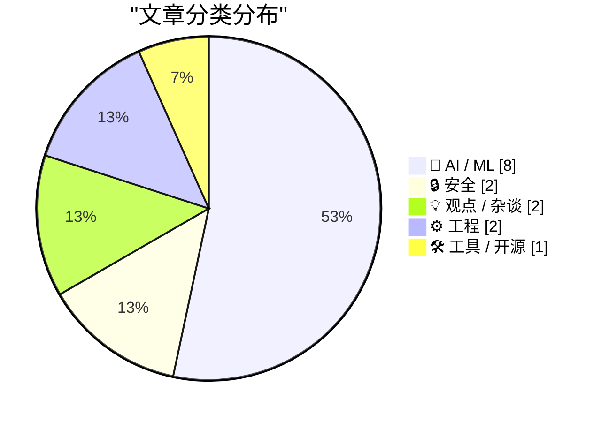
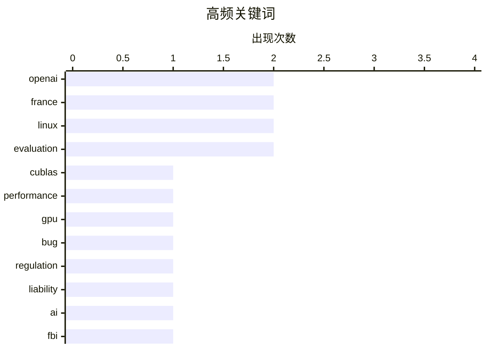

# 📰 AI 资讯每日精选 — 2026-04-11

> 汇聚 140+ 技术博客、X/Twitter、Hacker News、Reddit、Product Hunt、
> Lobste.rs、ClawFeed 日报及 GitHub Trending，经 AI 评分筛选。
>
> **本期内容**：🏆 今日必读 · 🌐 ClawFeed 日报 · 🔥 GitHub Trending · 📂 分类精选 · 🎨 设计与生成式 AI · 📊 数据概览

## 📝 今日看点

今日技术圈聚焦于人工智能的深度博弈与数字主权的战略转移。一方面，AI领域在追求极致性能与法律豁免权上并行，从硬件性能缺陷到立法游说，凸显行业在高速扩张中的内外部挑战。另一方面，以法国政府为代表，全球正掀起一股从操作系统层面摆脱单一技术依赖、强化数字主权的实质性浪潮。同时，安全与隐私的攻防持续升级，从执法机构的数据恢复技术到针对多模态AI的新型攻击手段，表明技术边界正被不断重新定义。

---

## 🏆 今日必读

🥇 **RTX 5090 上 cuBLAS 存在 60% 矩阵乘法性能缺陷**

[[D] 60% MatMul Performance Bug in cuBLAS on RTX 5090 [D]](https://www.reddit.com/r/MachineLearning/comments/1shtv0r/d_60_matmul_performance_bug_in_cublas_on_rtx_5090/) — r/MachineLearning · 6 小时前 · 🤖 AI / ML

> NVIDIA cuBLAS 库在 RTX 系列消费级 GPU 上存在严重的性能缺陷，导致批量 FP32 矩阵乘法运算效率低下。该问题影响从 256×256 到 8192×8192×8 的多种工作负载，在 RTX 5090 上仅能利用约 40% 的可用算力，且所有非专业版 RTX GPU 都可能受影响。测试基于最新的 CUDA 13.2.51、cuBLAS 13.3.0 和驱动 595.58.03，而旧版本性能更差。作者通过编写一个简单高效的自定义内核进行对比测试，证实了 cuBLAS 的调度问题。

💡 **为什么值得读**: 对于依赖 CUDA 进行高性能计算的开发者，此缺陷直接影响模型训练和推理效率，了解详情有助于规避性能损失或寻找替代方案。

🏷️ cuBLAS, performance, GPU, bug

🥈 **OpenAI 支持伊利诺伊州法案，旨在限制 AI 实验室的侵权责任**

[OpenAI backs Illinois bill that would limit when AI labs can be held liable](https://www.wired.com/story/openai-backs-bill-exempt-ai-firms-model-harm-lawsuits/) — Hacker News Best · 11 小时前 · 🤖 AI / ML

> OpenAI 公开支持美国伊利诺伊州一项旨在为 AI 公司提供责任豁免的法案。该法案将限制用户因 AI 模型输出内容而起诉开发公司的能力，为 AI 实验室设置了法律保护盾。此举引发了关于技术创新与用户权益保护之间平衡的广泛争议。支持者认为这是促进 AI 发展的必要措施，而批评者则担忧这会削弱企业对模型危害应负的责任。

💡 **为什么值得读**: 此事件揭示了 AI 巨头如何通过游说影响立法，是理解未来 AI 监管环境和企业法律责任演变的关键案例。

🏷️ OpenAI, regulation, liability, AI

🥉 **FBI 利用 iPhone 通知数据恢复已删除的 Signal 消息**

[FBI used iPhone notification data to retrieve deleted Signal messages](https://9to5mac.com/2026/04/09/fbi-used-iphone-notification-data-to-retrieve-deleted-signal-messages/) — Hacker News Best · 12 小时前 · 🔒 安全

> FBI 通过提取 iPhone 的通知数据，成功恢复了设备上已删除的 Signal 加密通讯应用消息。这项技术利用了 iOS 系统将通知内容（包括消息预览）暂存在本地数据库的机制，即使消息在应用内被删除，通知日志仍可能留存。该案例暴露了端到端加密应用在操作系统层面可能存在的隐私泄漏点。执法机构的这一取证方法引发了对数字隐私与安全边界的重新审视。

💡 **为什么值得读**: 它揭示了即使使用 Signal 这类强加密应用，用户数据仍可能通过系统侧信道泄露，对关注隐私安全的所有人具有重要警示意义。

🏷️ FBI, iPhone, Signal, privacy

4️⃣ **法国启动政府 Linux 桌面计划，开始退出 Windows**

[France Launches Government Linux Desktop Plan as Windows Exit Begins](https://www.numerique.gouv.fr/sinformer/espace-presse/souverainete-numerique-reduction-dependances-extra-europeennes/) — Hacker News Best · 13 小时前 · 💡 观点 / 杂谈

> 法国政府正式启动一项用 Linux 桌面系统替代 Windows 的计划，旨在减少对欧洲以外技术的依赖，提升数字主权。此举是法国更广泛的“数字主权与减少非欧洲依赖”战略的一部分，标志着其政府 IT 基础设施去美国化的重要一步。迁移计划将涉及大量政府机构和公务员，预计将对全球开源生态和欧洲科技政策产生示范效应。

💡 **为什么值得读**: 这是主要经济体在关键信息基础设施中推动技术替代和供应链自主的标杆性事件，对科技地缘政治和开源软件发展影响深远。

🏷️ France, Linux, government, desktop

5️⃣ **使用模型检查器复现 AWS 中断的竞态条件**

[Reproducing the AWS Outage Race Condition with a Model Checker](https://www.reddit.com/r/programming/comments/1shmtl3/reproducing_the_aws_outage_race_condition_with_a/) — r/programming · 10 小时前 · ⚙️ 工程

> 一篇技术文章详细介绍了如何使用形式化方法中的模型检查器，来复现和分析导致一次重大 AWS 服务中断的根本原因——一个复杂的竞态条件。作者通过构建系统模型，并利用 TLA+ 或类似工具进行穷举状态搜索，精确地重现了生产环境中极难捕捉的并发缺陷。这项工作展示了形式化方法在诊断和理解复杂分布式系统故障中的实用价值。该方法为预防类似大规模中断提供了新的工程实践思路。

💡 **为什么值得读**: 对于分布式系统工程师和可靠性专家，此文提供了一个将高深的形式化方法应用于实际故障分析的绝佳范例，极具启发性。

🏷️ AWS, concurrency, model-checking, outage

---

## 🌐 ClawFeed 日报精选

> 来源：[ClawFeed](https://clawfeed.kevinhe.io) — AI 驱动的多源新闻聚合

### 🔥 今日头条

1. **Anthropic 的 Claude Managed Agents 持续霸榜，agent infra 正式进入主舞台**  
   从 public beta 到中文圈密集拆解，再到 Monitor tool、开源替代 Multica，今天最强主线已经不是“模型更强一点”，而是“谁能把长时运行 agent 的 runtime、调度、权限和监控产品化”。

2. **Shopify AI Toolkit 是今天最强的 agent 商业落地信号之一**  
   Shopify 直接把 Claude Code、Codex、Cursor、VS Code 等 agent 工作流接进店铺管理，说明 agent 已经不只停留在写代码，而是开始进入真实业务后台和运营场景。

3. **安全成为 agent 落地最不能回避的变量**  
   Anthropic 推出 Project Glasswing，用更强模型协助关键漏洞防御；同时《Your Agent Is Mine》一类研究指出第三方 LLM router 可能注入恶意 tool call、窃取凭证，agent 生态一边加速，一边暴露更真实的攻击面。

4. **大模型竞争正在升级为“模型 + 算力/infra + 企业交付”三线作战**  
   OpenAI 向投资人强调算力优势，Google 持续高频更新 AI 能力，Anthropic 则把 agent runtime 往前推，竞争焦点已经越来越像平台战，而不是单点能力战。

5. **Agent 叙事继续从聊天工具转向长期执行的软件形态**  
   从 levie 对后台 24/7 agents 的判断，到 Shopify、Perplexity Computer、Gooseworks、Trading Arena 这些案例，市场越来越明确地押注“AI 直接替你持续干活”。

---

## 🔥 GitHub Trending

> 今日热门开源项目（全语言 + Python）

| # | 项目 | 描述 | ⭐ 总星 | 📈 今日 | 语言 |
|---|------|------|---------|---------|------|
| 1 | [NousResearch/hermes-agent](https://github.com/NousResearch/hermes-agent) 🤖 | The agent that grows with you | 51.8k | +7671 | Python |
| 2 | [microsoft/markitdown](https://github.com/microsoft/markitdown) | Python tool for converting files and office documents to ... | 99.6k | +2352 | Python |
| 3 | [obra/superpowers](https://github.com/obra/superpowers) | An agentic skills framework & software development method... | 145.7k | +2150 | Shell |
| 4 | [multica-ai/multica](https://github.com/multica-ai/multica) 🤖 | The open-source managed agents platform. Turn coding agen... | 6.0k | +1506 | TypeScript |
| 5 | [forrestchang/andrej-karpathy-skills](https://github.com/forrestchang/andrej-karpathy-skills) 🤖 | A single CLAUDE.md file to improve Claude Code behavior, ... | 11.7k | +1450 | - |
| 6 | [HKUDS/DeepTutor](https://github.com/HKUDS/DeepTutor) 🤖 | "DeepTutor: Agent-Native Personalized Learning Assistant" | 15.9k | +1424 | Python |
| 7 | [opendataloader-project/opendataloader-pdf](https://github.com/opendataloader-project/opendataloader-pdf) 🤖 | PDF Parser for AI-ready data. Automate PDF accessibility.... | 14.8k | +1306 | Java |
| 8 | [shanraisshan/claude-code-best-practice](https://github.com/shanraisshan/claude-code-best-practice) 🤖 | practice made claude perfect | 35.7k | +1251 | HTML |
| 9 | [OpenBMB/VoxCPM](https://github.com/OpenBMB/VoxCPM) | VoxCPM2: Tokenizer-Free TTS for Multilingual Speech Gener... | 8.8k | +953 | Python |
| 10 | [coleam00/Archon](https://github.com/coleam00/Archon) 🤖 | The first open-source harness builder for AI coding. Make... | 15.6k | +756 | TypeScript |
| 11 | [shiyu-coder/Kronos](https://github.com/shiyu-coder/Kronos) | Kronos: A Foundation Model for the Language of Financial ... | 12.7k | +601 | Python |
| 12 | [666ghj/MiroFish](https://github.com/666ghj/MiroFish) | A Simple and Universal Swarm Intelligence Engine, Predict... | 53.2k | +561 | Python |
| 13 | [D4Vinci/Scrapling](https://github.com/D4Vinci/Scrapling) | 🕷️ An adaptive Web Scraping framework that handles every... | 35.8k | +511 | Python |
| 14 | [rowboatlabs/rowboat](https://github.com/rowboatlabs/rowboat) 🤖 | Open-source AI coworker, with memory | 11.7k | +507 | TypeScript |
| 15 | [521xueweihan/HelloGitHub](https://github.com/521xueweihan/HelloGitHub) | 分享 GitHub 上有趣、入门级的开源项目。Share interesting, entry-level ope... | 150.2k | +308 | Python |

---

## 🤖 AI / ML

### 1. RTX 5090 上 cuBLAS 存在 60% 矩阵乘法性能缺陷

[[D] 60% MatMul Performance Bug in cuBLAS on RTX 5090 [D]](https://www.reddit.com/r/MachineLearning/comments/1shtv0r/d_60_matmul_performance_bug_in_cublas_on_rtx_5090/) — **r/MachineLearning** · 6 小时前 · ⭐ 27/30

> NVIDIA cuBLAS 库在 RTX 系列消费级 GPU 上存在严重的性能缺陷，导致批量 FP32 矩阵乘法运算效率低下。该问题影响从 256×256 到 8192×8192×8 的多种工作负载，在 RTX 5090 上仅能利用约 40% 的可用算力，且所有非专业版 RTX GPU 都可能受影响。测试基于最新的 CUDA 13.2.51、cuBLAS 13.3.0 和驱动 595.58.03，而旧版本性能更差。作者通过编写一个简单高效的自定义内核进行对比测试，证实了 cuBLAS 的调度问题。

🏷️ cuBLAS, performance, GPU, bug

---

### 2. OpenAI 支持伊利诺伊州法案，旨在限制 AI 实验室的侵权责任

[OpenAI backs Illinois bill that would limit when AI labs can be held liable](https://www.wired.com/story/openai-backs-bill-exempt-ai-firms-model-harm-lawsuits/) — **Hacker News Best** · 11 小时前 · ⭐ 26/30

> OpenAI 公开支持美国伊利诺伊州一项旨在为 AI 公司提供责任豁免的法案。该法案将限制用户因 AI 模型输出内容而起诉开发公司的能力，为 AI 实验室设置了法律保护盾。此举引发了关于技术创新与用户权益保护之间平衡的广泛争议。支持者认为这是促进 AI 发展的必要措施，而批评者则担忧这会削弱企业对模型危害应负的责任。

🏷️ OpenAI, regulation, liability, AI

---

### 3. DeepMind CEO 哈萨比斯称 AGI 的影响将如十次工业革命压缩在十年内

[Deepmind CEO Hassabis says AGI will hit like ten industrial revolutions compressed into a single decade](https://the-decoder.com/deepmind-ceo-hassabis-says-agi-will-hit-like-ten-industrial-revolutions-compressed-into-a-single-decade/) — **The Decoder** · 5 小时前 · ⭐ 25/30

> DeepMind 联合创始人兼 CEO Demis Hassabis 对通用人工智能（AGI）的到来时间与影响规模做出了惊人预测。他认为 AGI 可能在五年内实现，其冲击力相当于十次工业革命的总和，而所有这些变化将被压缩在短短十年内发生。同时，他警告当前 AI 领域存在过度炒作，但未来十年的长期影响仍被严重低估。哈萨比斯的观点凸显了 AI 领域领导者对技术奇点临近的紧迫感与风险意识并存的心态。

🏷️ AGI, DeepMind, prediction

---

### 4. [模型发布] 训练一个 90 亿参数模型成为智能体化的数据分析师（基于 Qwen3.5-9B + LoRA）

[[Model Release] I trained a 9B model to be agentic Data Analyst (Qwen3.5-9B + LoRA). Base model failed 100%, this LoRA completes 89% of workflows without human intervention.](https://www.reddit.com/r/LocalLLaMA/comments/1shlk5v/model_release_i_trained_a_9b_model_to_be_agentic/) — **r/LocalLLaMA** · 11 小时前 · ⭐ 25/30

> 研究者成功训练了一个专精于数据分析任务的智能体模型。该模型基于 Qwen3.5-9B 基础模型，通过 LoRA 微调技术实现，使模型具备了执行复杂数据分析工作流的能力。关键成果是：未经微调的基础模型在测试中 100% 失败，而加入此 LoRA 后，模型能自主完成 89% 的数据分析工作流程，无需人工干预。这项工作展示了通过针对性微调，让小规模模型在特定领域达到高度自主性的潜力。

🏷️ fine-tuning, LoRA, agent, data-analysis

---

### 5. 对8个模型进行764次调用测试：细节过多会扼杀小模型，填充词是承重结构，格式偏好是种迷思

[764 calls across 8 models: too much detail kills small models, filler words are load-bearing, and format preference is a myth](https://www.reddit.com/r/LocalLLaMA/comments/1si110t/764_calls_across_8_models_too_much_detail_kills/) — **r/LocalLLaMA** · 1 小时前 · ⭐ 25/30

> 一项针对本地小模型与前沿API模型的提示工程有效性测试，涉及8个模型共572次调用。核心发现是，过于详细的提示会损害小模型的性能，这与对大模型的通用建议相反。其次，诸如“让我们一步步思考”之类的填充词对模型输出结构至关重要，并非冗余。最后，模型对XML或Markdown等特定格式并无稳定偏好，其表现更多取决于任务本身。结论是，针对小模型的提示策略需要与大模型区别对待，精简和结构化比堆砌细节更有效。

🏷️ prompting, evaluation, small models

---

### 6. 我们能在不进行干预扫描前，就预测出哪个层对改变模型的下一个词答案最重要 | 研究论文

[We Can Predict Which Layer Will Matter Most for Changing a Model's Next-Token Answer Before Running Any Intervention Sweep | Research Paper](https://www.reddit.com/r/singularity/comments/1shsnbn/we_can_predict_which_layer_will_matter_most_for/) — **r/singularity** · 7 小时前 · ⭐ 25/30

> 一篇研究论文提出了一种新方法，用于预测Transformer模型中哪个层对改变其下一个词的预测结果影响最大。该方法的核心是分析模型内部的前向传播激活模式，无需进行耗时的逐层干预实验。通过这种方法，研究人员可以提前定位对特定输出最具影响力的网络层，从而极大地提高模型可解释性和针对性编辑的效率。这为高效地进行模型微调、知识编辑或对抗性攻击提供了理论工具。

🏷️ LLM, interpretability, research

---

### 7. LangChain：如何让智能体持续改进？一个从追踪开始的系统

[What does it actually take to make agents better over time? A system that starts with a trace. You capture traces of agent behavior, enrich them with ...](https://x.com/LangChain/status/2042671456979685803) — **𝕏 @LangChain** · 5 小时前 · ⭐ 25/30

> LangChain阐述了构建能够持续改进的AI智能体系统的核心方法论。该系统始于对智能体行为轨迹的全面追踪和记录。随后，通过自动评估和人工反馈对这些轨迹进行丰富和标注，以精确识别失败模式及其根本原因。基于这些洞察，开发团队可以进行有针对性的修改，并在部署前严格验证改进效果。最终，这形成了一个将轨迹转化为评估、数据集和可重复改进闭环的完整工作流。

🏷️ AI-agent, evaluation, feedback, improvement

---

### 8. ChatGPT语音模式使用的是更弱的模型

[ChatGPT voice mode is a weaker model](https://simonwillison.net/2026/Apr/10/voice-mode-is-weaker/#atom-everything) — **simonwillison.net** · 8 小时前 · ⭐ 24/30

> OpenAI的ChatGPT语音模式实际运行在一个更老旧、能力更弱的模型版本上，而非最新的模型。当被问及知识截止日期时，语音模式会回答是2024年4月，这表明它基于GPT-4o时代的模型。这一事实对许多用户而言并不明显，他们可能误以为与之对话的是最先进的AI。这种认知差距源于AI不同交互模式（文本、语音）背后技术栈更新的不同步。

🏷️ ChatGPT, voice, model, OpenAI

---

## 🔒 安全

### 9. FBI 利用 iPhone 通知数据恢复已删除的 Signal 消息

[FBI used iPhone notification data to retrieve deleted Signal messages](https://9to5mac.com/2026/04/09/fbi-used-iphone-notification-data-to-retrieve-deleted-signal-messages/) — **Hacker News Best** · 12 小时前 · ⭐ 26/30

> FBI 通过提取 iPhone 的通知数据，成功恢复了设备上已删除的 Signal 加密通讯应用消息。这项技术利用了 iOS 系统将通知内容（包括消息预览）暂存在本地数据库的机制，即使消息在应用内被删除，通知日志仍可能留存。该案例暴露了端到端加密应用在操作系统层面可能存在的隐私泄漏点。执法机构的这一取证方法引发了对数字隐私与安全边界的重新审视。

🏷️ FBI, iPhone, Signal, privacy

---

### 10. 开源 23,759 个跨模态提示注入攻击载荷——涵盖文本、图像、文档和音频

[Open-sourcing 23,759 cross-modal prompt injection payloads - splitting attacks across text, image, document, and audio](https://www.reddit.com/r/LocalLLaMA/comments/1shkwn3/opensourcing_23759_crossmodal_prompt_injection/) — **r/LocalLLaMA** · 11 小时前 · ⭐ 25/30

> 安全研究人员公开了一个包含 23,759 个样本的大型跨模态提示注入攻击数据集。这些攻击载荷专门设计用于针对多模态大语言模型，将恶意指令拆分并隐藏在不同的输入模态中，如文本、图像、文档和音频，以绕过单模态检测。数据集的发布旨在帮助社区更好地理解和防御这类新兴的、更复杂的提示注入攻击。这项工作凸显了随着模型支持多模态输入，其攻击面正在显著扩大，安全挑战日益严峻。

🏷️ prompt injection, dataset, multimodal

---

## 💡 观点 / 杂谈

### 11. 法国启动政府 Linux 桌面计划，开始退出 Windows

[France Launches Government Linux Desktop Plan as Windows Exit Begins](https://www.numerique.gouv.fr/sinformer/espace-presse/souverainete-numerique-reduction-dependances-extra-europeennes/) — **Hacker News Best** · 13 小时前 · ⭐ 26/30

> 法国政府正式启动一项用 Linux 桌面系统替代 Windows 的计划，旨在减少对欧洲以外技术的依赖，提升数字主权。此举是法国更广泛的“数字主权与减少非欧洲依赖”战略的一部分，标志着其政府 IT 基础设施去美国化的重要一步。迁移计划将涉及大量政府机构和公务员，预计将对全球开源生态和欧洲科技政策产生示范效应。

🏷️ France, Linux, government, desktop

---

### 12. 法国为减少对美国技术的依赖，将弃用 Windows 转向 Linux

[France to ditch Windows for Linux to reduce reliance on US tech](https://techcrunch.com/2026/04/10/france-to-ditch-windows-for-linux-to-reduce-reliance-on-us-tech/) — **Hacker News Best** · 8 小时前 · ⭐ 25/30

> 法国政府宣布将逐步弃用 Windows 操作系统，在全政府范围内迁移至 Linux 桌面环境，核心目标是降低对美国科技巨头的依赖。该决定是法国推动数字主权战略的具体行动，涉及成千上万的政府电脑。此举不仅关乎软件替换，更被视为欧洲寻求技术自主、摆脱非欧洲技术束缚的标志性举措。迁移过程预计将面临兼容性、培训和生态适应的挑战。

🏷️ France, Linux, Windows, sovereignty

---

## ⚙️ 工程

### 13. 使用模型检查器复现 AWS 中断的竞态条件

[Reproducing the AWS Outage Race Condition with a Model Checker](https://www.reddit.com/r/programming/comments/1shmtl3/reproducing_the_aws_outage_race_condition_with_a/) — **r/programming** · 10 小时前 · ⭐ 26/30

> 一篇技术文章详细介绍了如何使用形式化方法中的模型检查器，来复现和分析导致一次重大 AWS 服务中断的根本原因——一个复杂的竞态条件。作者通过构建系统模型，并利用 TLA+ 或类似工具进行穷举状态搜索，精确地重现了生产环境中极难捕捉的并发缺陷。这项工作展示了形式化方法在诊断和理解复杂分布式系统故障中的实用价值。该方法为预防类似大规模中断提供了新的工程实践思路。

🏷️ AWS, concurrency, model-checking, outage

---

### 14. Stripe的选择性测试执行：为5000万行Ruby单体仓库打造快速CI

[Selective Test Execution at Stripe: Fast CI for a 50M-line Ruby monorepo](https://stripe.dev/blog/selective-test-execution-at-stripe-fast-ci-for-a-50m-line-ruby-monorepo) — **Lobste.rs** · 9 小时前 · ⭐ 25/30

> Stripe分享了其如何为拥有超过5000万行Ruby代码的巨型单体仓库构建快速持续集成（CI）系统的工程实践。核心方案是“选择性测试执行”，该系统通过静态分析和依赖图，精准识别每次代码变更所真正影响的测试子集，而非运行全部测试。这套系统将CI运行时间从数小时缩短到分钟级别，同时保持了极高的测试可靠性。其成功关键在于构建了精细的代码依赖关系图谱，并实现了测试影响的精确追踪。

🏷️ CI, testing, monorepo, Ruby

---

## 🛠 工具 / 开源

### 15. 微软暂停多个知名开源项目的开发者账户

[Microsoft suspends dev accounts for high-profile open source projects](https://www.bleepingcomputer.com/news/microsoft/microsoft-suspends-dev-accounts-for-high-profile-open-source-projects/) — **Hacker News Best** · 12 小时前 · ⭐ 25/30

> 微软突然暂停了多个知名开源项目在 GitHub 或相关平台的开发者账户，受影响的项目包括 `curl`、`Amp` 等。暂停原因疑似与自动化的安全策略或验证流程触发有关，导致项目维护者无法进行关键操作。事件引发了开源社区对大型商业平台掌控关键基础设施所带来风险的担忧，以及对自动化审核机制透明度和可靠性的质疑。微软随后回应正在调查并恢复误封的账户。

🏷️ Microsoft, open source, developer, account

---

## 🎨 Design & Generative AI

### 🖥️ 生成式 UI

- **[训练9B模型成为自主数据分析师：从0%到89%工作流自动化](https://www.reddit.com/r/LocalLLaMA/comments/1shlk5v/model_release_i_trained_a_9b_model_to_be_agentic/)** — r/LocalLLaMA · 11 小时前
  > 通过LoRA微调Qwen3.5-9B模型，使其能自主完成近九成数据分析工作流。

- **[动态工作流构建器：自动识别自定义节点并选择最佳流程](https://www.reddit.com/r/comfyui/comments/1shr6m3/built_a_dynamic_workflow_builder_that_autodetects/)** — r/comfyui · 7 小时前
  > 为ComfyUI桌面应用开发的智能工作流构建器，可自动检测并整合自定义节点。

- **[Overtli LLM Studio Suite v1.0：一站式AI生成工具集](https://www.reddit.com/r/comfyui/comments/1sh9yz7/overtli_llm_studio_suite_v10_showcase/)** — r/comfyui · 21 小时前
  > 为ComfyUI推出的节点套件，集成Pollinations、LM Studio等多平台AI生成能力。

### 🖼️ 生成式图片

- **[JoyAI图像编辑工具正式支持ComfyUI](https://www.reddit.com/r/StableDiffusion/comments/1show8s/joyaiimageedit_now_has_comfyui_support/)** — r/StableDiffusion · 9 小时前
  > 具备出色空间感知能力的图像编辑模型JoyAI现已集成至ComfyUI平台。

- **[VoxCPM TTS模型与LoRA训练功能登陆ComfyUI](https://www.reddit.com/r/StableDiffusion/comments/1shfwcg/voxcpm_tts_model_lora_training_abilities_right_in/)** — r/StableDiffusion · 16 小时前
  > 在ComfyUI中直接使用高质量的VoxCPM语音合成模型并进行LoRA训练。

- **[Ace Step 1.5 XL自动化工作流：从随机标签到歌曲生成与评分](https://www.reddit.com/r/StableDiffusion/comments/1shzm63/ace_step_15_xl_comfyui_automation_workflow/)** — r/StableDiffusion · 2 小时前
  > 一套完整的ComfyUI自动化流程，利用Qwen生成标签并创作、分析歌曲。

- **[高级图像修复与编辑工作流：Klein与Qwen模型实战](https://www.reddit.com/r/StableDiffusion/comments/1shus70/advanced_inpaintedit_kleinqwen_workflows/)** — r/StableDiffusion · 5 小时前
  > 分享专为Klein和Qwen模型优化的高级图像修复与编辑工作流程。

- **[使用AI-Toolkit训练一致性人脸Z-Image基础LoRA](https://www.reddit.com/r/comfyui/comments/1shkc0w/trained_a_consistency_face_zimage_base_lora_with/)** — r/comfyui · 12 小时前
  > 通过AI-Toolkit成功训练出用于生成一致性人脸的Z-Image基础LoRA模型。

- **[Qwen图像编辑2511模型实现1800万像素级修复](https://www.reddit.com/r/comfyui/comments/1shmx6z/qwen_image_edit_2511_inpaint_with_18mp_image/)** — r/comfyui · 10 小时前
  > 基于ComfyUI的下一代图像修复工作流，支持超高分辨率图像处理。

- **[实验证实：混合精度推理可实现无损质量与高效生成](https://www.reddit.com/r/comfyui/comments/1shx9c9/i_tested_what_happens_when_you_use_a_tiny_25bit/)** — r/comfyui · 4 小时前
  > 测试显示，在图像生成初期使用极小模型，后期切换至完整模型，输出质量完全相同。

- **[ControlNet与LoRA技术原理对比详解](https://www.reddit.com/r/StableDiffusion/comments/1shse0k/controlnet_vs_lora/)** — r/StableDiffusion · 7 小时前
  > 探讨ControlNet和LoRA在影响底层模型数据及标准工作流方面的核心差异。

- **[破解Z-Image Turbo人像塑料感之谜：400次生成后的发现](https://www.reddit.com/r/StableDiffusion/comments/1shpbbb/after_400_zimage_turbo_gens_i_finally_figured_out/)** — r/StableDiffusion · 8 小时前
  > 经过大量测试，最终找到了导致Z-Image Turbo生成人像显得不自然的关键原因。

- **[InstantID与ControlNet结合使用时的常见错误排查](https://www.reddit.com/r/comfyui/comments/1shnc6x/instantid_controlnet/)** — r/comfyui · 10 小时前
  > 讨论在ComfyUI中结合使用InstantID和ControlNet时遇到的属性错误及其解决方案。

### 🎬 生成式视频

- **[LTX 2.3发布：支持图像、音频、视频的多模态ControlNet](https://www.reddit.com/r/StableDiffusion/comments/1shxv8n/ltx_23_image_audio_video_controlnet_iclora_to/)** — r/StableDiffusion · 3 小时前
  > 新版本LTX引入IC-LoRA技术，实现对生成视频的多重控制。

- **[澄清：HappyHorse视频模型来自阿里巴巴ATH，非其他知名产品](https://www.reddit.com/r/StableDiffusion/comments/1shfzip/happyhorse_is_from_alibaba_ath_not_grok_veo_32/)** — r/StableDiffusion · 16 小时前
  > 确认HappyHorse视频生成模型的真实来源为阿里巴巴ATH团队。

---

## 📊 数据概览

| 扫描源 | 抓取文章 | 时间范围 | 精选 |
|:---:|:---:|:---:|:---:|
| 108/140 | 4658 篇 → 181 篇 | 24h | **15 篇** |

### 分类分布



### 高频关键词



<details>
<summary>📈 纯文本关键词图（终端友好）</summary>

```
openai      │ ████████████████████ 2
france      │ ████████████████████ 2
linux       │ ████████████████████ 2
evaluation  │ ████████████████████ 2
cublas      │ ██████████░░░░░░░░░░ 1
performance │ ██████████░░░░░░░░░░ 1
gpu         │ ██████████░░░░░░░░░░ 1
bug         │ ██████████░░░░░░░░░░ 1
regulation  │ ██████████░░░░░░░░░░ 1
liability   │ ██████████░░░░░░░░░░ 1
```

</details>

### 🏷️ 话题标签

**openai**(2) · **france**(2) · **linux**(2) · evaluation(2) · cublas(1) · performance(1) · gpu(1) · bug(1) · regulation(1) · liability(1) · ai(1) · fbi(1) · iphone(1) · signal(1) · privacy(1) · government(1) · desktop(1) · aws(1) · concurrency(1) · model-checking(1)

---

*生成于 2026-04-11 00:09 | 汇聚 140 个技术博客、X/Twitter、Hacker News、Reddit、Product Hunt、Lobste.rs、ClawFeed 日报及 GitHub Trending，经 AI 评分筛选出 Top 15 精华内容*
