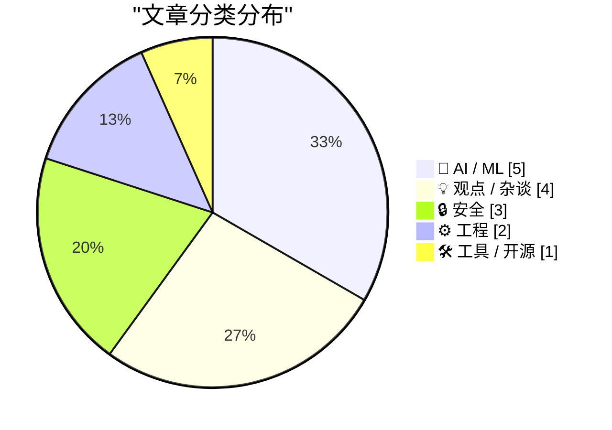
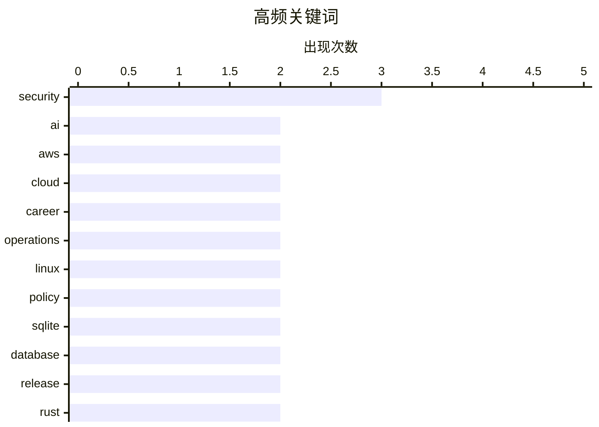

# 📰 AI 资讯每日精选 — 2026-04-12

> 汇聚 140+ 技术博客、X/Twitter、Hacker News、Reddit、Product Hunt、
> Lobste.rs、ClawFeed 日报及 GitHub Trending，经 AI 评分筛选。
>
> **本期内容**：🏆 今日必读 · 🌐 ClawFeed 日报 · 🔥 GitHub Trending · 📂 分类精选 · 🎨 设计与生成式 AI · 📊 数据概览

## 📝 今日看点

今日技术圈聚焦于AI的深度实践与安全主权两大核心趋势。一方面，AI正从概念走向关键基础设施，无论是用于发现安全漏洞、生成实时视频还是辅助编程，其应用正变得更为务实且深入工作流。另一方面，从内存安全编程语言Rust的引入到国家层面转向开源系统，技术供应链的安全与自主可控成为全球性战略焦点。

---

## 🏆 今日必读

🥇 **Mythos之后：AI网络安全与不平坦的前沿**

[Small models also found the vulnerabilities that Mythos found](https://aisle.com/blog/ai-cybersecurity-after-mythos-the-jagged-frontier) — Hacker News Best · 7 小时前 · 🤖 AI / ML

> 文章探讨了AI在网络安全漏洞发现领域的应用现状与“不平坦前沿”现象。研究发现，不仅像Mythos这样的专用大模型能发现漏洞，经过适当微调的小型开源模型（如Llama 3.1 8B）同样有效，其表现甚至能超越GPT-4o。这挑战了“只有最大、最专有模型才能胜任复杂安全任务”的假设，揭示了模型能力存在不连续跃升的“不平坦”特性。核心结论是，在网络安全等专业领域，精心设计的微调和小型化模型可以成为强大且可审计的替代方案，降低对闭源大模型的依赖。

💡 **为什么值得读**: 本文通过实证研究颠覆了“模型越大越好”的刻板印象，为寻求高效、可控AI安全解决方案的团队提供了关键洞见和可行路径。

🏷️ AI, cybersecurity, vulnerability

🥈 **在AWS上20年：运维从未“不关我事”**

[20 years on AWS and never not my job](https://www.daemonology.net/blog/2026-04-11-20-years-on-AWS-and-never-not-my-job.html) — Hacker News Best · 18 小时前 · 💡 观点 / 杂谈

> 作者基于20年使用AWS的经验，反思了云计算如何改变了运维工程师的角色与责任。核心论点是，云服务（如AWS）的抽象和自动化并未让运维工作消失或变得简单，而是将其从硬件维护转变为对更复杂、黑盒化的云服务本身的管理、集成和故障排除。工程师仍需深入理解分布式系统原理，并且因为依赖的云服务层数增多，故障排查的链条更长、更复杂。最终结论是，云时代下“运维从未不关你事”，责任只是发生了转移而非减轻，对工程师的抽象思维和系统调试能力要求更高。

💡 **为什么值得读**: 这篇文章为所有云原生开发者提供了至关重要的现实视角，揭示了在便利性背后，工程师需要承担的更深层次的责任与必备技能。

🏷️ AWS, cloud, career, operations

🥉 **将 Rust 引入 Pixel 基带处理器**

[20 Years on AWS and Never Not My Job](https://www.reddit.com/r/programming/comments/1sipvi3/20_years_on_aws_and_never_not_my_job/) — r/programming · 6 小时前 · 💡 观点 / 杂谈

> Google 宣布在其 Pixel 手机的基带处理器（负责蜂窝网络通信的关键固件）中引入 Rust 编程语言。此举旨在利用 Rust 的内存安全特性，从根本上消除内存损坏漏洞，从而提升基带这一高危攻击面的安全性。项目面临硬件资源受限、与现有 C 代码交互、以及满足严格实时性要求等挑战。这是将内存安全语言推向最底层、最核心嵌入式系统的一次重要实践。

💡 **为什么值得读**: 展示了 Rust 在极端资源受限和安全至上的嵌入式场景（如基带）中落地的真实案例与工程挑战，是软硬件安全融合的前沿参考。

🏷️ AWS, cloud, career, operations

4️⃣ **“实时AI视频生成”是真正的技术类别还是营销术语？**

[Is "live AI video generation" a meaningful technical category or just a marketing term? [R]](https://www.reddit.com/r/MachineLearning/comments/1siqg5d/is_live_ai_video_generation_a_meaningful/) — r/MachineLearning · 5 小时前 · 🤖 AI / ML

> 文章从技术角度辨析了“实时AI视频生成”这一概念的真实性与模糊性。真正的实时视频推理要求模型能持续响应实时输入流并生成或转换帧，这与单纯的“快速视频生成”在架构、延迟约束等所有方面都截然不同。然而，当前大多数市场宣传和厂商定位混淆了这两者，将高帧率的预生成或快速批处理包装成“实时”。作者认为，这造成了技术讨论的混乱，并可能误导开发者对实际工程挑战的评估。

💡 **为什么值得读**: 阅读此文能帮助开发者拨开营销迷雾，准确理解实时视频AI面临的核心技术挑战，避免在技术选型上误入歧途。

🏷️ AI, video generation, real-time

5️⃣ **将AI用于实际工作6个月：什么令人惊叹，什么言过其实，什么悄然危险**

[6 Months Using AI for Actual Work: What's Incredible, What's Overhyped, and What's Quietly Dangerous](https://www.reddit.com/r/singularity/comments/1si5vd3/6_months_using_ai_for_actual_work_whats/) — r/singularity · 22 小时前 · 💡 观点 / 杂谈

> 作者分享了为期6个月、在所有工作流程中全面使用AI工具的一手经验报告。AI在克服“空白页恐惧”、快速生成初稿（如邮件、代码、文档）以及研究合成（例如用Claude Opus 4.6分析10篇文章）方面表现惊人。然而，AI在复杂逻辑推理、需要深度领域知识的任务以及创造性突破方面被过度炒作，其输出常看似合理实则错误。最危险的在于对AI生成的“草稿”产生心理依赖，导致批判性思维和深度工作能力悄然退化。核心观点是：AI是强大的杠杆，但必须作为受严格监督的副驾驶，而非自动驾驶。

💡 **为什么值得读**: 这篇基于长期深度使用的实践报告，提供了超越短期测试的深刻洞察，对任何希望高效且安全地整合AI到工作流中的人极具参考价值。

🏷️ AI adoption, workflow, productivity

---

## 🌐 ClawFeed 日报精选

> 来源：[ClawFeed](https://clawfeed.kevinhe.io) — AI 驱动的多源新闻聚合

### 🔥 今日头条

1. **Garry Tan 开源 GBrain，agent memory infra 成为今天最强传播主线之一**  
   这套系统主打 10,000+ Markdown、人物档案、日历和笔记的统一 recall，让 agent 拥有更稳定的长期记忆。它不只是一个小工具，更像是在回答“耐用 agent 的记忆层该怎么做”。

2. **Claude Code 的 /ultraplan 把“先规划、再执行”正式产品化**  
   先在 Web 端生成 implementation plan、人工编辑后再决定云端或终端执行，说明 agent 工作流开始从“直接干”走向更可审阅、更适合团队协作的 planning-first 模式。

3. **Agent 安全风险继续升温，《Your Agent Is Mine》成为今天最值得盯的安全议题**  
   核心警告是第三方 LLM router 可能被投毒、注入恶意 tool call，进一步劫持 agent 主机、窃取凭证甚至盗取钱包。agent 越能干活，安全问题就越不能当边角料。

4. **Hermes Agent 接入个人微信，agent 正在更深地进入中文真实使用场景**  
   不只是 demo，而是开始打通私聊、群聊、图片、视频、文件、语音这些日常通信入口，说明 agent 产品化正在往更高频、更生活化的界面走。

5. **AI 竞争继续上探到算力与供应链层，Anthropic 芯片传闻和 OpenAI 供应链事件都是信号**  
   一边是 Anthropic 被曝评估自研 AI 芯片，一边是 OpenAI 披露 macOS app 签名 workflow 曾拉到恶意 Axios 库，说明头部玩家的战场已经不只在模型层，也在 infra 和供应链安全层。

---

## 🔥 GitHub Trending

> 今日热门开源项目（全语言 + Python）

| # | 项目 | 描述 | ⭐ 总星 | 📈 今日 | 语言 |
|---|------|------|---------|---------|------|
| 1 | [NousResearch/hermes-agent](https://github.com/NousResearch/hermes-agent) 🤖 | The agent that grows with you | 58.7k | +6438 | Python |
| 2 | [microsoft/markitdown](https://github.com/microsoft/markitdown) | Python tool for converting files and office documents to ... | 102.1k | +3086 | Python |
| 3 | [alexpate/awesome-design-systems](https://github.com/alexpate/awesome-design-systems) | 💅🏻 ⚒ A collection of awesome design systems | 22.3k | +2050 | - |
| 4 | [multica-ai/multica](https://github.com/multica-ai/multica) 🤖 | The open-source managed agents platform. Turn coding agen... | 7.9k | +1948 | TypeScript |
| 5 | [obra/superpowers](https://github.com/obra/superpowers) | An agentic skills framework & software development method... | 147.1k | +1591 | Shell |
| 6 | [shanraisshan/claude-code-best-practice](https://github.com/shanraisshan/claude-code-best-practice) 🤖 | practice made claude perfect | 37.0k | +1475 | HTML |
| 7 | [coleam00/Archon](https://github.com/coleam00/Archon) 🤖 | The first open-source harness builder for AI coding. Make... | 16.5k | +1346 | TypeScript |
| 8 | [OpenBMB/VoxCPM](https://github.com/OpenBMB/VoxCPM) | VoxCPM2: Tokenizer-Free TTS for Multilingual Speech Gener... | 9.9k | +1084 | Python |
| 9 | [forrestchang/andrej-karpathy-skills](https://github.com/forrestchang/andrej-karpathy-skills) 🤖 | A single CLAUDE.md file to improve Claude Code behavior, ... | 13.5k | +1066 | - |
| 10 | [HKUDS/DeepTutor](https://github.com/HKUDS/DeepTutor) 🤖 | "DeepTutor: Agent-Native Personalized Learning Assistant" | 16.7k | +837 | Python |
| 11 | [opendataloader-project/opendataloader-pdf](https://github.com/opendataloader-project/opendataloader-pdf) 🤖 | PDF Parser for AI-ready data. Automate PDF accessibility.... | 15.6k | +775 | Java |
| 12 | [shiyu-coder/Kronos](https://github.com/shiyu-coder/Kronos) | Kronos: A Foundation Model for the Language of Financial ... | 14.2k | +595 | Python |
| 13 | [aloshdenny/reverse-SynthID](https://github.com/aloshdenny/reverse-SynthID) 🤖 | reverse engineering Gemini's SynthID detection | 2.1k | +552 | Python |
| 14 | [D4Vinci/Scrapling](https://github.com/D4Vinci/Scrapling) | 🕷️ An adaptive Web Scraping framework that handles every... | 36.2k | +417 | Python |
| 15 | [TapXWorld/ChinaTextbook](https://github.com/TapXWorld/ChinaTextbook) | 所有小初高、大学PDF教材。 | 67.8k | +361 | Roff |

---

## 🤖 AI / ML

### 1. Mythos之后：AI网络安全与不平坦的前沿

[Small models also found the vulnerabilities that Mythos found](https://aisle.com/blog/ai-cybersecurity-after-mythos-the-jagged-frontier) — **Hacker News Best** · 7 小时前 · ⭐ 26/30

> 文章探讨了AI在网络安全漏洞发现领域的应用现状与“不平坦前沿”现象。研究发现，不仅像Mythos这样的专用大模型能发现漏洞，经过适当微调的小型开源模型（如Llama 3.1 8B）同样有效，其表现甚至能超越GPT-4o。这挑战了“只有最大、最专有模型才能胜任复杂安全任务”的假设，揭示了模型能力存在不连续跃升的“不平坦”特性。核心结论是，在网络安全等专业领域，精心设计的微调和小型化模型可以成为强大且可审计的替代方案，降低对闭源大模型的依赖。

🏷️ AI, cybersecurity, vulnerability

---

### 2. “实时AI视频生成”是真正的技术类别还是营销术语？

[Is "live AI video generation" a meaningful technical category or just a marketing term? [R]](https://www.reddit.com/r/MachineLearning/comments/1siqg5d/is_live_ai_video_generation_a_meaningful/) — **r/MachineLearning** · 5 小时前 · ⭐ 26/30

> 文章从技术角度辨析了“实时AI视频生成”这一概念的真实性与模糊性。真正的实时视频推理要求模型能持续响应实时输入流并生成或转换帧，这与单纯的“快速视频生成”在架构、延迟约束等所有方面都截然不同。然而，当前大多数市场宣传和厂商定位混淆了这两者，将高帧率的预生成或快速批处理包装成“实时”。作者认为，这造成了技术讨论的混乱，并可能误导开发者对实际工程挑战的评估。

🏷️ AI, video generation, real-time

---

### 3. Linux内核AI编码助手政策

[Linux Kernel AI Coding Assistants Policy](https://github.com/torvalds/linux/blob/master/Documentation/process/coding-assistants.rst) — **Lobste.rs** · 14 小时前 · ⭐ 26/30

> Linux内核项目正式发布了关于使用AI编码助手（如GitHub Copilot、ChatGPT）的政策文件。政策明确允许开发者使用这些工具，但强调开发者本人必须完全理解、审核并最终对所有提交的代码负责。使用AI生成的代码必须像其他代码一样遵守内核的许可协议（GPLv2），开发者需确保没有引入非许可代码。该政策的核心目的是在利用现代工具提升效率的同时，坚守内核开发在代码质量、法律合规性和开发者责任方面的核心原则。

🏷️ Linux, AI-assistant, policy, security

---

### 4. PyTorch中的FlashAttention（FA1-FA4）——专注于算法差异的教学实现

[FlashAttention (FA1–FA4) in PyTorch - educational implementations focused on algorithmic differences [P]](https://www.reddit.com/r/MachineLearning/comments/1sim6y1/flashattention_fa1fa4_in_pytorch_educational/) — **r/MachineLearning** · 8 小时前 · ⭐ 25/30

> 该项目提供了FlashAttention第1至第4版（FA1-FA4）在纯PyTorch中的教学实现。其主要目标是让开发者通过代码更轻松地理解各版本之间的算法演进和设计思想，例如FA1的经典分块计算、FA2引入的向前/向后传递优化、FA3的稀疏注意力处理以及FA4的进一步硬件适配改进。这些实现并非追求极致性能的优化内核，也非对官方版本的硬件级复现，而是剥离硬件细节，突出核心算法逻辑。这有助于研究者和学习者深入掌握注意力机制优化的关键路径。

🏷️ FlashAttention, PyTorch, optimization, education

---

### 5. Neuralink帮助非语言ALS患者通过思想和AI克隆语音再次说话

[Neuralink enables nonverbal ALS patient to speak again with thoughts and AI-cloned voice](https://www.reddit.com/r/singularity/comments/1siiz7j/neuralink_enables_nonverbal_als_patient_to_speak/) — **r/singularity** · 10 小时前 · ⭐ 25/30

> Neuralink公司宣布其脑机接口技术取得一项突破性应用：一位因肌萎缩侧索硬化症（ALS）而失去说话能力的患者，通过植入的N1芯片，能够仅凭思维控制虚拟光标进行打字交流。更进一步的，系统利用该患者患病前的声音样本，通过AI语音克隆技术合成了接近其原声的语音，实现了“用思想说话”。这项进展展示了脑机接口与AI技术在恢复严重神经疾病患者沟通能力方面的巨大潜力，将人机交互推向了新的高度。

🏷️ Neuralink, BCI, medical AI

---

## 💡 观点 / 杂谈

### 6. 在AWS上20年：运维从未“不关我事”

[20 years on AWS and never not my job](https://www.daemonology.net/blog/2026-04-11-20-years-on-AWS-and-never-not-my-job.html) — **Hacker News Best** · 18 小时前 · ⭐ 26/30

> 作者基于20年使用AWS的经验，反思了云计算如何改变了运维工程师的角色与责任。核心论点是，云服务（如AWS）的抽象和自动化并未让运维工作消失或变得简单，而是将其从硬件维护转变为对更复杂、黑盒化的云服务本身的管理、集成和故障排除。工程师仍需深入理解分布式系统原理，并且因为依赖的云服务层数增多，故障排查的链条更长、更复杂。最终结论是，云时代下“运维从未不关你事”，责任只是发生了转移而非减轻，对工程师的抽象思维和系统调试能力要求更高。

🏷️ AWS, cloud, career, operations

---

### 7. 将 Rust 引入 Pixel 基带处理器

[20 Years on AWS and Never Not My Job](https://www.reddit.com/r/programming/comments/1sipvi3/20_years_on_aws_and_never_not_my_job/) — **r/programming** · 6 小时前 · ⭐ 26/30

> Google 宣布在其 Pixel 手机的基带处理器（负责蜂窝网络通信的关键固件）中引入 Rust 编程语言。此举旨在利用 Rust 的内存安全特性，从根本上消除内存损坏漏洞，从而提升基带这一高危攻击面的安全性。项目面临硬件资源受限、与现有 C 代码交互、以及满足严格实时性要求等挑战。这是将内存安全语言推向最底层、最核心嵌入式系统的一次重要实践。

🏷️ AWS, cloud, career, operations

---

### 8. 将AI用于实际工作6个月：什么令人惊叹，什么言过其实，什么悄然危险

[6 Months Using AI for Actual Work: What's Incredible, What's Overhyped, and What's Quietly Dangerous](https://www.reddit.com/r/singularity/comments/1si5vd3/6_months_using_ai_for_actual_work_whats/) — **r/singularity** · 22 小时前 · ⭐ 26/30

> 作者分享了为期6个月、在所有工作流程中全面使用AI工具的一手经验报告。AI在克服“空白页恐惧”、快速生成初稿（如邮件、代码、文档）以及研究合成（例如用Claude Opus 4.6分析10篇文章）方面表现惊人。然而，AI在复杂逻辑推理、需要深度领域知识的任务以及创造性突破方面被过度炒作，其输出常看似合理实则错误。最危险的在于对AI生成的“草稿”产生心理依赖，导致批判性思维和深度工作能力悄然退化。核心观点是：AI是强大的杠杆，但必须作为受严格监督的副驾驶，而非自动驾驶。

🏷️ AI adoption, workflow, productivity

---

### 9. South Korea introduces universal basic mobile data access

[South Korea introduces universal basic mobile data access](https://www.theregister.com/2026/04/10/south_korea_data_access_universal/) — **Hacker News Best** · 10 小时前 · ⭐ 24/30

> Article URL: https://www.theregister.com/2026/04/10/south_korea_data_access_universal/
Comments URL: https://news.ycombinator.com/item?id=47730407
Points: 283
# Comments: 80

🏷️ policy, mobile, data

---

## 🔒 安全

### 10. 法国政府弃用Windows转向Linux，称美国技术构成战略风险

[France's government is ditching Windows for Linux, says US tech a strategic risk](https://www.xda-developers.com/frances-government-ditching-windows-for-linux/) — **Hacker News Best** · 15 小时前 · ⭐ 25/30

> 法国政府宣布将逐步在其行政部门中弃用微软Windows系统，转而采用基于Linux的开源解决方案。此举主要出于数字主权和战略安全的考虑，旨在减少对非欧盟技术供应商（特别是美国公司）的依赖，避免潜在的外部法规（如CLOUD法案）带来的数据风险。迁移计划将分阶段进行，预计涉及数十万台政府电脑，并可能基于Ubuntu或Debian等发行版构建定制系统。这标志着欧盟国家在追求技术自主方面迈出了实质性的一步。

🏷️ Linux, government, security

---

### 11. Windows Defender is being used to hack Windows

[Windows Defender is being used to hack Windows](https://hackingpassion.com/bluehammer-windows-defender-zero-day/) — **Lobste.rs** · 13 小时前 · ⭐ 25/30

> <p><a href="https://lobste.rs/s/hihcnv/windows_defender_is_being_used_hack">Comments</a></p>

🏷️ Windows, Defender, exploit, malware

---

### 12. How Rust is susceptible to supply chain attacks and what we can do to mitigate the inevitable

[How Rust is susceptible to supply chain attacks and what we can do to mitigate the inevitable](https://kerkour.com/rust-supply-chain-nightmare) — **Lobste.rs** · 17 小时前 · ⭐ 25/30

> <p><a href="https://lobste.rs/s/1areqp/how_rust_is_susceptible_supply_chain">Comments</a></p>

🏷️ Rust, supply-chain, mitigation, Cargo

---

## ⚙️ 工程

### 13. SQLite 3.53.0 发布

[SQLite 3.53.0](https://simonwillison.net/2026/Apr/11/sqlite/#atom-everything) — **simonwillison.net** · 4 小时前 · ⭐ 25/30

> SQLite 3.53.0 是一个重要版本，包含了大量用户界面和内部的改进。最显著的更新是 `ALTER TABLE` 命令现在支持添加和移除 `NOT NULL` 及 `CHECK` 约束，这简化了之前需要复杂操作才能完成的表结构修改。JSONB 已成为默认的二进制JSON格式，提供更快的处理速度。此外，版本还引入了新的 `sqlite3_error_offset()` API，能更精确地定位SQL语句中的语法错误位置，并包含多项查询优化器和虚拟表方面的增强。

🏷️ SQLite, database, release

---

### 14. Bringing Rust to the Pixel Baseband

[Bringing Rust to the Pixel Baseband](https://security.googleblog.com/2026/04/bringing-rust-to-pixel-baseband.html) — **Lobste.rs** · 5 小时前 · ⭐ 25/30

> <p><a href="https://lobste.rs/s/wbdjkp/bringing_rust_pixel_baseband">Comments</a></p>

🏷️ Rust, embedded, security

---

## 🛠 工具 / 开源

### 15. SQLite 3.53.0

[SQLite 3.53.0](https://sqlite.org/releaselog/3_53_0.html) — **Lobste.rs** · 12 小时前 · ⭐ 24/30

> <p><a href="https://lobste.rs/s/sqsb24/sqlite_3_53_0">Comments</a></p>

🏷️ SQLite, database, release

---

## 🎨 Design & Generative AI

### 🖼️ 生成式图片

- **[打造本地浏览器，终结ComfyUI输出混乱](https://www.reddit.com/r/comfyui/comments/1sistxe/built_a_local_browser_to_organize_my_comfyui/)** — r/comfyui · 4 小时前
  > 一款用于管理和搜索ComfyUI生成图像（支持按提示词、模型等筛选）的本地工具。

- **[开源离线图像生成与提示词编辑器](https://www.reddit.com/r/comfyui/comments/1sirx2w/open_source_image_creator_and_prompt_editor_all/)** — r/comfyui · 5 小时前
  > 介绍一款完全离线运行的开源图像生成及提示词编辑工具。

- **[ComfyUI新节点：处理与可视化边界框](https://www.reddit.com/r/StableDiffusion/comments/1sidcv5/new_nodes_to_handlevisualize_bboxes/)** — r/StableDiffusion · 15 小时前
  > 发布用于处理和可视化人脸/姿态检测等边界框的ComfyUI自定义节点。

- **[从ComfyUI迁移至纯Python脚本的探讨](https://www.reddit.com/r/comfyui/comments/1siy5gz/moving_from_comfyui_to_fully_native_python_best/)** — r/comfyui · 48 分钟前
  > 讨论如何将ComfyUI工作流重写为纯Python脚本以实现多GPU服务器优化。

- **[分享我的ComfyUI创意节点套件](https://www.reddit.com/r/StableDiffusion/comments/1siu2zd/sharing_my_creative_node_suite_for_comfyui/)** — r/StableDiffusion · 3 小时前
  > 开发者分享其个人创建的一系列旨在简化ComfyUI使用的自定义节点集合。

- **[Midjourney V7下的建筑创作](https://www.reddit.com/r/midjourney/comments/1sixyrg/architecture_with_midjourney_v7/)** — r/midjourney · 56 分钟前
  > 展示使用Midjourney V7生成的建筑主题图像作品。

- **[MusicMaker：基于Ace 1.5的歌曲创作应用](https://www.reddit.com/r/comfyui/comments/1si9842/musicmaker_is_an_app_mode_to_make_songs_based_on/)** — r/comfyui · 19 小时前
  > 一款基于Ace 1.5模型、以应用模式运行的音乐生成工具。

- **[ComfyUI图像传送带：顺序拖放队列节点](https://www.reddit.com/r/StableDiffusion/comments/1sibmrf/release_comfyui_image_conveyor_sequential/)** — r/StableDiffusion · 17 小时前
  > 发布一个支持顺序拖放排队的图像处理节点，用于ComfyUI工作流。

- **[如何将ComfyUI工作流转为Python脚本？](https://www.reddit.com/r/StableDiffusion/comments/1siy8ty/comfyui_workflow_to_fully_python_script/)** — r/StableDiffusion · 44 分钟前
  > 寻求将ComfyUI工作流重写为纯Python脚本以实现多GPU优化的最佳方法。

- **[解决ComfyUI浏览器页面导致GPU异常问题](https://www.reddit.com/r/comfyui/comments/1siblqy/comfyui_browser_page_causing_gpu_blapping_solution/)** — r/comfyui · 17 小时前
  > 分享解决ComfyUI浏览器界面引起GPU资源异常波动（“blapping”）的方案。

- **[Qwen Inpaint图像输出节点连接问题](https://www.reddit.com/r/comfyui/comments/1siobj7/qwen_inpaint_image_output/)** — r/comfyui · 7 小时前
  > 用户求助关于ComfyUI中Qwen Inpaint节点输出无法连接到保存图像节点的问题。

### 🎬 生成式视频

- **[LTXAdd：为视频添加音频并延长时长](https://www.reddit.com/r/comfyui/comments/1si7hs6/ltxadd_v2v_add_audio_and_extend_any_video_ltx23/)** — r/comfyui · 21 小时前
  > 介绍LTX 2.3版本中能为任何视频添加音频并扩展时长的视频到视频工具。

- **[用LTX 2.3过渡LoRA打造动态视频](https://www.reddit.com/r/comfyui/comments/1sids4o/create_more_dynamic_video_with_ltx_23_transition/)** — r/comfyui · 15 小时前
  > 展示如何使用LTX 2.3的过渡LoRA来创建更具动态感的视频效果。

- **[LTX2.3对比WAN2.2：使用体验探讨](https://www.reddit.com/r/comfyui/comments/1sik9h1/after_a_month_how_is_ltx23_now_compared_to_wan22/)** — r/comfyui · 9 小时前
  > 社区讨论LTX2.3与WAN2.2的视频生成模型在面部一致性等方面的使用体验对比。

- **[ComfyUI批量混合节点：逐帧融合图像](https://www.reddit.com/r/comfyui/comments/1si9jc5/comfyui_batch_blend_a_custom_node_that_blends_two/)** — r/comfyui · 19 小时前
  > 介绍一个能将两个图像批次进行逐帧混合的ComfyUI自定义节点。

---

## 📊 数据概览

| 扫描源 | 抓取文章 | 时间范围 | 精选 |
|:---:|:---:|:---:|:---:|
| 110/140 | 4703 篇 → 168 篇 | 24h | **15 篇** |

### 分类分布



### 高频关键词



<details>
<summary>📈 纯文本关键词图（终端友好）</summary>

```
security   │ ████████████████████ 3
ai         │ █████████████░░░░░░░ 2
aws        │ █████████████░░░░░░░ 2
cloud      │ █████████████░░░░░░░ 2
career     │ █████████████░░░░░░░ 2
operations │ █████████████░░░░░░░ 2
linux      │ █████████████░░░░░░░ 2
policy     │ █████████████░░░░░░░ 2
sqlite     │ █████████████░░░░░░░ 2
database   │ █████████████░░░░░░░ 2
```

</details>

### 🏷️ 话题标签

**security**(3) · **ai**(2) · **aws**(2) · cloud(2) · career(2) · operations(2) · linux(2) · policy(2) · sqlite(2) · database(2) · release(2) · rust(2) · cybersecurity(1) · vulnerability(1) · video generation(1) · real-time(1) · ai adoption(1) · workflow(1) · productivity(1) · ai-assistant(1)

---

*生成于 2026-04-12 00:10 | 汇聚 140 个技术博客、X/Twitter、Hacker News、Reddit、Product Hunt、Lobste.rs、ClawFeed 日报及 GitHub Trending，经 AI 评分筛选出 Top 15 精华内容*
