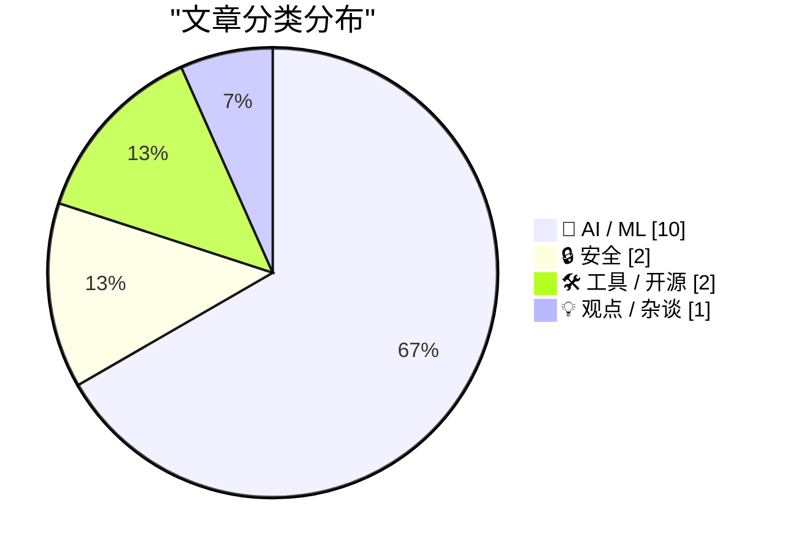
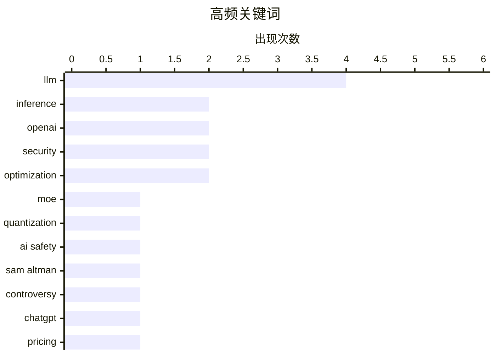

# 📰 AI 资讯每日精选 — 2026-04-13

> 汇聚 140+ 技术博客、X/Twitter、Hacker News、Reddit、Product Hunt、
> Lobste.rs、ClawFeed 日报及 GitHub Trending，经 AI 评分筛选。
>
> **本期内容**：🏆 今日必读 · 🌐 ClawFeed 日报 · 🔥 GitHub Trending · 📂 分类精选 · 🎨 设计与生成式 AI · 📊 数据概览

## 📝 今日看点

今日技术圈聚焦于AI发展的现实挑战与潜在冲突。一方面，前沿研究正极力突破硬件限制，试图在消费级设备上运行超大规模模型；另一方面，AI的快速商业化引发了公众的焦虑与安全担忧，甚至出现极端对抗事件。同时，业界开始深入反思AI能力的本质，对“世界模型”的定义和智能体在真实场景中的有效性提出了更严格的批判。

---

## 🏆 今日必读

🥇 **构建 LazyMoE：通过惰性专家加载 + TurboQuant 在 8GB 内存且无 GPU 的电脑上运行 120B 大模型**

[Built LazyMoE — run 120B LLMs on 8GB RAM with no GPU using lazy expert loading + TurboQuant](https://www.reddit.com/r/LocalLLaMA/comments/1sjoo9z/built_lazymoe_run_120b_llms_on_8gb_ram_with_no/) — r/LocalLLaMA · 4 小时前 · 🤖 AI / ML

> 文章探讨了如何在硬件资源严重不足的情况下运行超大规模语言模型。作者结合了惰性混合专家模型加载、TurboQuant KV 缓存压缩和 SSD 流式传输三种技术，成功在仅配备 Intel UHD 620 集成显卡和 8GB 内存的笔记本电脑上运行了 1200 亿参数的模型。该系统实现了在极端资源限制下的模型推理，突破了常规硬件对模型规模的限制。核心成果是验证了通过软件优化和混合技术，可以显著降低大模型部署的硬件门槛。

💡 **为什么值得读**: 该方案为资源有限的开发者和研究者提供了在消费级硬件上体验和测试超大规模模型的全新思路和具体实现路径。

🏷️ LLM, MoE, quantization, inference

🥈 **向 Sam Altman 家投掷燃烧弹的男子可能出于对 AI 灭绝人类的恐惧**

[Man who firebombed Sam Altman's home was likely driven by AI extinction fears](https://the-decoder.com/man-who-firebombed-sam-altmans-home-was-likely-driven-by-ai-extinction-fears/) — The Decoder · 9 小时前 · 🤖 AI / ML

> 报道了一起针对 OpenAI CEO Sam Altman 的袭击事件。一名男子在深夜向 Sam Altman 位于旧金山的住所投掷了燃烧弹。嫌疑人被发现是“PauseAI” Discord 服务器的成员，并在网上发表过关于人工智能将导致人类灭绝的言论。事件将极端行为与对 AI 风险的极端担忧直接联系起来。这表明关于 AI 安全与风险的公共讨论可能正催生现实世界的暴力冲突。

💡 **为什么值得读**: 此事件揭示了 AI 技术引发的社会焦虑已从线上言论演变为线下暴力，是理解当前 AI 伦理与安全争议现实影响的关键案例。

🏷️ AI safety, OpenAI, Sam Altman, controversy

🥉 **OpenAI 员工试图解释新版 ChatGPT Pro 套餐的使用限制**

[OpenAI employee tries to explain usage limits of the new ChatGPT Pro plans](https://the-decoder.com/openai-employee-tries-to-explain-usage-limits-of-the-new-chatgpt-pro-plans/) — The Decoder · 10 小时前 · 🤖 AI / ML

> 文章聚焦于 OpenAI 新推出的 ChatGPT 付费套餐（包括一个 100 美元档位）中模糊不清的使用限制问题。由于定价页面标签混乱，用户对实际能使用的消息数量或 tokens 数感到困惑。一位 OpenAI 员工在社区中尝试澄清这些限制，解释了不同套餐层级对应的具体配额。这反映了 AI 服务在商业化过程中，定价和资源说明透明化面临的挑战。

💡 **为什么值得读**: 对于考虑订阅 ChatGPT Plus 或 Pro 服务的用户，此文有助于厘清真实的成本与收益，避免因信息不透明而产生消费误解。

🏷️ OpenAI, ChatGPT, pricing, API

4️⃣ **没人欠你软件供应链安全**

[No one owes you supply-chain security](https://www.reddit.com/r/programming/comments/1sjh53k/no_one_owes_you_supplychain_security/) — r/programming · 8 小时前 · 🔒 安全

> 文章批判了开源软件生态中用户对安全性的不切实际期望。核心论点是，软件供应链安全并非免费赠品，用户不能理所当然地要求开源维护者提供企业级的安全保障。作者指出，许多安全问题源于用户自身对依赖项的盲目信任和缺乏验证。真正的安全需要用户主动投入资源进行审计、锁定版本和监控。结论是，安全责任应由整个供应链的参与者共同承担，而非单方面推给维护者。

💡 **为什么值得读**: 这篇文章尖锐地指出了当前开源软件使用中的责任错位问题，促使开发者和管理者反思自身在供应链安全中的角色与行动。

🏷️ supply chain, security, open source

5️⃣ **研究者界定何为“世界模型”，文本到视频生成器并不符合**

[Researchers define what counts as a world model and text-to-video generators do not](https://the-decoder.com/researchers-define-what-counts-as-a-world-model-and-text-to-video-generators-do-not/) — The Decoder · 12 小时前 · 🤖 AI / ML

> 一个国际研究团队试图通过 OpenWorldLib 项目为碎片化的“世界模型”研究领域建立统一标准。他们明确给出了世界模型的定义，旨在区分真正能理解和推理物理世界的系统与仅仅是生成逼真内容的模型。根据此定义，像 Sora 这样的文本到视频生成模型被明确排除在世界模型范畴之外，因为它们缺乏对世界运作机制的内在理解和因果推理能力。这项工作的目的是推动 AI 向更具理解力和泛化能力的方向发展。

💡 **为什么值得读**: 阅读此文可以清晰理解当前 AI 学界对“世界模型”这一热门概念的核心争议与严格定义，避免概念滥用。

🏷️ world model, AI research, Sora, definition

---

## 🌐 ClawFeed 日报精选

> 来源：[ClawFeed](https://clawfeed.kevinhe.io) — AI 驱动的多源新闻聚合

### 🔥 今日头条

1. **Garry Tan 开源 GBrain，agent memory infra 成为今天最强传播主线之一**  
   这套系统主打 10,000+ Markdown、人物档案、日历和笔记的统一 recall，让 agent 拥有更稳定的长期记忆。它不只是一个小工具，更像是在回答“耐用 agent 的记忆层该怎么做”。

2. **Claude Code 的 /ultraplan 把“先规划、再执行”正式产品化**  
   先在 Web 端生成 implementation plan、人工编辑后再决定云端或终端执行，说明 agent 工作流开始从“直接干”走向更可审阅、更适合团队协作的 planning-first 模式。

3. **Agent 安全风险继续升温，《Your Agent Is Mine》成为今天最值得盯的安全议题**  
   核心警告是第三方 LLM router 可能被投毒、注入恶意 tool call，进一步劫持 agent 主机、窃取凭证甚至盗取钱包。agent 越能干活，安全问题就越不能当边角料。

4. **Hermes Agent 接入个人微信，agent 正在更深地进入中文真实使用场景**  
   不只是 demo，而是开始打通私聊、群聊、图片、视频、文件、语音这些日常通信入口，说明 agent 产品化正在往更高频、更生活化的界面走。

5. **AI 竞争继续上探到算力与供应链层，Anthropic 芯片传闻和 OpenAI 供应链事件都是信号**  
   一边是 Anthropic 被曝评估自研 AI 芯片，一边是 OpenAI 披露 macOS app 签名 workflow 曾拉到恶意 Axios 库，说明头部玩家的战场已经不只在模型层，也在 infra 和供应链安全层。

---

## 🔥 GitHub Trending

> 今日热门开源项目（全语言 + Python）

| # | 项目 | 描述 | ⭐ 总星 | 📈 今日 | 语言 |
|---|------|------|---------|---------|------|
| 1 | [NousResearch/hermes-agent](https://github.com/NousResearch/hermes-agent) 🤖 | The agent that grows with you | 66.1k | +7454 | Python |
| 2 | [microsoft/markitdown](https://github.com/microsoft/markitdown) | Python tool for converting files and office documents to ... | 104.6k | +2513 | Python |
| 3 | [forrestchang/andrej-karpathy-skills](https://github.com/forrestchang/andrej-karpathy-skills) 🤖 | A single CLAUDE.md file to improve Claude Code behavior, ... | 16.7k | +2369 | - |
| 4 | [shiyu-coder/Kronos](https://github.com/shiyu-coder/Kronos) | Kronos: A Foundation Model for the Language of Financial ... | 15.7k | +1985 | Python |
| 5 | [multica-ai/multica](https://github.com/multica-ai/multica) 🤖 | The open-source managed agents platform. Turn coding agen... | 9.3k | +1609 | TypeScript |
| 6 | [shanraisshan/claude-code-best-practice](https://github.com/shanraisshan/claude-code-best-practice) 🤖 | practice made claude perfect | 38.9k | +1548 | HTML |
| 7 | [OpenBMB/VoxCPM](https://github.com/OpenBMB/VoxCPM) | VoxCPM2: Tokenizer-Free TTS for Multilingual Speech Gener... | 11.3k | +1278 | Python |
| 8 | [thedotmack/claude-mem](https://github.com/thedotmack/claude-mem) 🤖 | A Claude Code plugin that automatically captures everythi... | 49.9k | +753 | TypeScript |
| 9 | [HKUDS/DeepTutor](https://github.com/HKUDS/DeepTutor) 🤖 | "DeepTutor: Agent-Native Personalized Learning Assistant" | 17.2k | +670 | Python |
| 10 | [virattt/ai-hedge-fund](https://github.com/virattt/ai-hedge-fund) 🤖 | An AI Hedge Fund Team | 52.2k | +663 | Python |
| 11 | [coleam00/Archon](https://github.com/coleam00/Archon) 🤖 | The first open-source harness builder for AI coding. Make... | 17.0k | +612 | TypeScript |
| 12 | [snarktank/ralph](https://github.com/snarktank/ralph) 🤖 | Ralph is an autonomous AI agent loop that runs repeatedly... | 15.9k | +463 | TypeScript |
| 13 | [TapXWorld/ChinaTextbook](https://github.com/TapXWorld/ChinaTextbook) | 所有小初高、大学PDF教材。 | 68.2k | +454 | Roff |
| 14 | [521xueweihan/HelloGitHub](https://github.com/521xueweihan/HelloGitHub) | 分享 GitHub 上有趣、入门级的开源项目。Share interesting, entry-level ope... | 150.6k | +266 | Python |
| 15 | [ahujasid/blender-mcp](https://github.com/ahujasid/blender-mcp) |  | 19.1k | +215 | Python |

---

## 🤖 AI / ML

### 1. 构建 LazyMoE：通过惰性专家加载 + TurboQuant 在 8GB 内存且无 GPU 的电脑上运行 120B 大模型

[Built LazyMoE — run 120B LLMs on 8GB RAM with no GPU using lazy expert loading + TurboQuant](https://www.reddit.com/r/LocalLLaMA/comments/1sjoo9z/built_lazymoe_run_120b_llms_on_8gb_ram_with_no/) — **r/LocalLLaMA** · 4 小时前 · ⭐ 26/30

> 文章探讨了如何在硬件资源严重不足的情况下运行超大规模语言模型。作者结合了惰性混合专家模型加载、TurboQuant KV 缓存压缩和 SSD 流式传输三种技术，成功在仅配备 Intel UHD 620 集成显卡和 8GB 内存的笔记本电脑上运行了 1200 亿参数的模型。该系统实现了在极端资源限制下的模型推理，突破了常规硬件对模型规模的限制。核心成果是验证了通过软件优化和混合技术，可以显著降低大模型部署的硬件门槛。

🏷️ LLM, MoE, quantization, inference

---

### 2. 向 Sam Altman 家投掷燃烧弹的男子可能出于对 AI 灭绝人类的恐惧

[Man who firebombed Sam Altman's home was likely driven by AI extinction fears](https://the-decoder.com/man-who-firebombed-sam-altmans-home-was-likely-driven-by-ai-extinction-fears/) — **The Decoder** · 9 小时前 · ⭐ 25/30

> 报道了一起针对 OpenAI CEO Sam Altman 的袭击事件。一名男子在深夜向 Sam Altman 位于旧金山的住所投掷了燃烧弹。嫌疑人被发现是“PauseAI” Discord 服务器的成员，并在网上发表过关于人工智能将导致人类灭绝的言论。事件将极端行为与对 AI 风险的极端担忧直接联系起来。这表明关于 AI 安全与风险的公共讨论可能正催生现实世界的暴力冲突。

🏷️ AI safety, OpenAI, Sam Altman, controversy

---

### 3. OpenAI 员工试图解释新版 ChatGPT Pro 套餐的使用限制

[OpenAI employee tries to explain usage limits of the new ChatGPT Pro plans](https://the-decoder.com/openai-employee-tries-to-explain-usage-limits-of-the-new-chatgpt-pro-plans/) — **The Decoder** · 10 小时前 · ⭐ 25/30

> 文章聚焦于 OpenAI 新推出的 ChatGPT 付费套餐（包括一个 100 美元档位）中模糊不清的使用限制问题。由于定价页面标签混乱，用户对实际能使用的消息数量或 tokens 数感到困惑。一位 OpenAI 员工在社区中尝试澄清这些限制，解释了不同套餐层级对应的具体配额。这反映了 AI 服务在商业化过程中，定价和资源说明透明化面临的挑战。

🏷️ OpenAI, ChatGPT, pricing, API

---

### 4. 研究者界定何为“世界模型”，文本到视频生成器并不符合

[Researchers define what counts as a world model and text-to-video generators do not](https://the-decoder.com/researchers-define-what-counts-as-a-world-model-and-text-to-video-generators-do-not/) — **The Decoder** · 12 小时前 · ⭐ 24/30

> 一个国际研究团队试图通过 OpenWorldLib 项目为碎片化的“世界模型”研究领域建立统一标准。他们明确给出了世界模型的定义，旨在区分真正能理解和推理物理世界的系统与仅仅是生成逼真内容的模型。根据此定义，像 Sora 这样的文本到视频生成模型被明确排除在世界模型范畴之外，因为它们缺乏对世界运作机制的内在理解和因果推理能力。这项工作的目的是推动 AI 向更具理解力和泛化能力的方向发展。

🏷️ world model, AI research, Sora, definition

---

### 5. 研究发现：智能体技能在基准测试中表现优异，但在真实条件下崩溃

[Agent skills look great in benchmarks but fall apart under realistic conditions, researchers find](https://the-decoder.com/agent-skills-look-great-in-benchmarks-but-fall-apart-under-realistic-conditions-researchers-find/) — **The Decoder** · 13 小时前 · ⭐ 24/30

> 一项研究对 AI 智能体赖以调用专业知识的“技能”模块进行了大规模现实检验。研究测试了 34,000 个真实世界技能，发现这些在基准测试中表现良好的增强功能，在现实条件下几乎没什么帮助。更弱的基础模型在加载技能后，性能反而比不使用技能时更差。这表明当前基于模块化指令集的技能增强方法，其泛化性和鲁棒性存在严重问题。研究结论对依赖技能库构建通用智能体的路径提出了质疑。

🏷️ AI Agents, Benchmark, Evaluation

---

### 6. Gary Marcus 谈 Claude 代码泄露事件

[Gary Marcus on the Claude Code leak [D]](https://www.reddit.com/r/MachineLearning/comments/1sjb0qi/gary_marcus_on_the_claude_code_leak_d/) — **r/MachineLearning** · 13 小时前 · ⭐ 24/30

> 针对 Anthropic 公司 Claude 模型部分代码的泄露，AI 批评家 Gary Marcus 发表了他的分析。他指出，泄露的代码内核构建方式直接源于经典的符号人工智能。例如，它主要是一个包含 486 个分支点和 12 层嵌套的大型 IF-THEN 条件语句，运行在一个确定性的符号循环中。Marcus 认为，这种架构正是 AI 先驱如约翰·麦卡锡、马文·明斯基和赫伯特·西蒙等人会立刻认出的经典 AI 范式。他的观点暗示了当前最先进的 AI 模型底层可能仍依赖于传统的、可解释的符号逻辑系统。

🏷️ Claude, symbolic AI, leak

---

### 7. 大语言模型反向学习，且缩放假说存在上限

[LLMs learn backwards, and the scaling hypothesis is bounded. [D]](https://www.reddit.com/r/MachineLearning/comments/1sj888x/llms_learn_backwards_and_the_scaling_hypothesis/) — **r/MachineLearning** · 16 小时前 · ⭐ 24/30

> 一篇博客文章提出了对大语言模型学习机制和“缩放定律”的挑战性观点。作者认为，LLMs 的学习过程本质上是“反向的”，即先学习复杂的表面模式，再反向推导出简单的底层规则。更重要的是，文章论证了单纯依靠增加数据和模型规模的“缩放假说”存在内在边界，无法无限地提升模型的理解和推理能力。这意味着当前以规模扩张为主导的 AI 发展路径可能即将触及天花板。结论指出，需要新的范式突破才能实现真正的通用人工智能。

🏷️ LLM, scaling, learning theory, backwards

---

### 8. 推测解码与E2B草稿模型结合，显著提升Gemma 4 31B推理速度（平均+29%，代码任务+50%）

[Speculative Decoding works great for Gemma 4 31B with E2B draft (+29% avg, +50% on code)](https://www.reddit.com/r/LocalLLaMA/comments/1sjct6a/speculative_decoding_works_great_for_gemma_4_31b/) — **r/LocalLLaMA** · 12 小时前 · ⭐ 24/30

> 推测解码技术通过使用一个更小、更快的“草稿模型”预先生成多个token，再由主模型快速验证，能有效提升大语言模型的推理速度。测试表明，将Gemma 4 31B作为主模型，配合E2B模型作为草稿模型，可以实现平均29%的推理加速，在代码生成类任务上加速效果更是高达50%。这种方法无需改变主模型权重，是一种高效的推理优化手段。结论是推测解码与合适的草稿模型结合，能在大模型上取得显著的端到端性能提升。

🏷️ speculative decoding, inference, optimization

---

### 9. Meta发布新论文《神经计算机》：探索AI能否像计算机一样运行

[Meta released new paper : Neural Computers](https://www.reddit.com/r/LocalLLaMA/comments/1sj782l/meta_released_new_paper_neural_computers/) — **r/LocalLLaMA** · 17 小时前 · ⭐ 24/30

> Meta的研究团队在论文《神经计算机》中探讨了一个核心问题：人工智能能否像通用计算机一样执行任务。他们尝试训练一个视频模型来模拟终端和桌面的操作界面，并生成了相应的模拟画面，取得了不错的结果。这项研究旨在探索神经网络学习并再现计算机系统基本行为与状态转换的潜力。这标志着AI研究正朝着让模型理解并模拟复杂、结构化系统（如操作系统）的方向迈进。

🏷️ Meta, Neural Computers, Research

---

### 10. 为何大模型在基准测试中表现惊艳，却在数据查找等日常任务中令人失望？

[Does anyone get amazed by LLM performance on benchmarks but incredibly disappointed by its performance on mundane tasks, specifically those involving data lookup?](https://www.reddit.com/r/singularity/comments/1sjt12q/does_anyone_get_amazed_by_llm_performance_on/) — **r/singularity** · 1 小时前 · ⭐ 24/30

> 文章指出了一个普遍存在的矛盾现象：大语言模型在结构化基准测试（如医学问答）上表现卓越，但在涉及数据查找、信息检索的日常 mundane 任务中却经常出错。作者以“查找处理交通罚单的本地律师”或“从给定数据中提取特定信息”为例，说明模型倾向于编造或给出随机答案，而非执行精确查找。问题的核心在于，当前LLM的本质是下一个token的生成器，而非具备精确记忆和检索功能的数据库。这揭示了模型在“知识回忆”与“信息精确操作”能力上的根本性短板。

🏷️ LLM, benchmarks, practical application

---

## 🔒 安全

### 11. 没人欠你软件供应链安全

[No one owes you supply-chain security](https://www.reddit.com/r/programming/comments/1sjh53k/no_one_owes_you_supplychain_security/) — **r/programming** · 8 小时前 · ⭐ 25/30

> 文章批判了开源软件生态中用户对安全性的不切实际期望。核心论点是，软件供应链安全并非免费赠品，用户不能理所当然地要求开源维护者提供企业级的安全保障。作者指出，许多安全问题源于用户自身对依赖项的盲目信任和缺乏验证。真正的安全需要用户主动投入资源进行审计、锁定版本和监控。结论是，安全责任应由整个供应链的参与者共同承担，而非单方面推给维护者。

🏷️ supply chain, security, open source

---

### 12. 花钱请谷歌来攻击 macOS 用户？

[Paying Google to Hack macOS Users?](https://www.reddit.com/r/programming/comments/1sjejjk/paying_google_to_hack_macos_users/) — **r/programming** · 10 小时前 · ⭐ 24/30

> 文章揭露并分析了一类可能存在的安全威胁：通过向谷歌等广告平台付费，针对特定 macOS 用户群体投放恶意广告或进行精准攻击。作者探讨了广告平台强大的定向投放能力如何可能被攻击者滥用，以绕过传统安全防护，直接接触高价值目标。这种攻击方式利用了商业平台的合法功能来实现非法目的，对依赖 macOS 且可能成为目标的企业和个人构成了新的安全挑战。

🏷️ macOS, vulnerability, exploit

---

## 🛠 工具 / 开源

### 13. KIV：在RTX 4070（12GB显存）上实现100万token上下文窗口，无需重新训练，即插即用的HuggingFace缓存替代方案

[KIV: 1M token context window on a RTX 4070 (12GB VRAM), no retraining, drop-in HuggingFace cache replacement - Works with any model that uses DynamicCache [P]](https://www.reddit.com/r/MachineLearning/comments/1sjkmwz/kiv_1m_token_context_window_on_a_rtx_4070_12gb/) — **r/MachineLearning** · 6 小时前 · ⭐ 24/30

> KIV是一种中间件层，通过分层检索系统替代了HuggingFace transformers中的标准KV缓存。其核心方案是将近期token的K/V精确保存在显存中，将旧的K/V移至系统内存，并利用K向量作为搜索索引，在每次解码步骤中仅检索约256个最相关的V条目。在配备12GB显存的RTX 4070上，使用4位量化的Gemma 4 E2B模型，该方法成功实现了100万token的上下文窗口。这为资源有限的设备运行超长上下文模型提供了一种无需重新训练、即插即用的高效解决方案。

🏷️ KV cache, long context, optimization, HuggingFace

---

### 14. 在cargo-crev中引入LLM代码审查

[LLM Reviews in cargo-crev](https://dpc.pw/posts/llm-reviews-in-cargo-crev/) — **Lobste.rs** · 5 小时前 · ⭐ 24/30

> 文章介绍了在Rust生态的代码审计工具cargo-crev中集成大语言模型进行自动化代码审查的探索。cargo-crev本身是一个用于建立可传递信任链的代码审查工具，而新功能旨在利用LLM来分析代码更改并提供初步审查意见。这代表了将AI辅助工具深度集成到专业开发者工作流（如依赖审计和代码审查）中的一种实践。其目标是结合人类专家的判断和AI的规模处理能力，提高开源软件供应链的安全性和代码质量。

🏷️ Rust, LLM, Code Review, Security

---

## 💡 观点 / 杂谈

### 15. AI 将遭遇暴力抵抗，且不会带来任何好结果

[AI Will Be Met with Violence, and Nothing Good Will Come of It](https://www.thealgorithmicbridge.com/p/ai-will-be-met-with-violence-and) — **Hacker News Best** · 14 小时前 · ⭐ 24/30

> 文章提出了一个关于 AI 发展未来的严峻预言。核心论点是，AI 的快速和不受控发展将不可避免地引发强烈的社会反弹，甚至暴力冲突。作者认为，由于 AI 对就业、社会结构和人类自主性的冲击，公众的恐惧和愤怒将转化为对抗行动。这种暴力抵抗不会阻止 AI 进程，但会使得整个过渡过程更加混乱和痛苦。最终观点是，我们正在走向一个因 AI 而分裂和动荡的未来，而非和谐的技术乌托邦。

🏷️ AI ethics, society, regulation, future

---

## 🎨 Design & Generative AI

### 🖼️ 生成式图片

- **[开源ComfyUI自定义节点自动化测试套件](https://www.reddit.com/r/comfyui/comments/1sj5ckt/vibecoding_comfyui_custom_nodes_with/)** — r/comfyui · 19 小时前
  > 一个用于ComfyUI自定义节点包的自动化回归测试套件，可快速检测多种常见错误。

- **[LTX-2.3图像外绘LoRA模型发布](https://www.reddit.com/r/StableDiffusion/comments/1sj0yhn/ltx23_ltx2322bicloraoutpaint/)** — r/StableDiffusion · 22 小时前
  > 在Hugging Face上发布了LTX-2.3-22b模型的图像外绘（Outpaint）LoRA。

- **[开源图像工作流能否达到NanoBanana Pro级别输出？](https://www.reddit.com/r/comfyui/comments/1sj6vh9/are_opensource_locallyhosted_image_workflows_able/)** — r/comfyui · 17 小时前
  > 用户询问本地开源图像工作流能否复现商业模型NanoBanana Pro的图像质量。

- **[Z-Image Turbo加速版模型发布](https://www.reddit.com/r/StableDiffusion/comments/1sjsp13/zimage_turbo_checkpoint_deedeemegadoodo_edition/)** — r/StableDiffusion · 1 小时前
  > 发布了名为“Z-Image Turbo”的加速版图像生成模型。

- **[Greg Rutkowski风格Anima模型LoRA发布](https://www.reddit.com/r/StableDiffusion/comments/1sjk7dc/greg_rutkowski_anima_lora_from_circlestone_labs/)** — r/StableDiffusion · 7 小时前
  > 发布了基于Anima模型的Greg Rutkowski艺术风格LoRA。

- **[ComfyUI子图功能带来全新乐趣](https://www.reddit.com/r/StableDiffusion/comments/1sjs2bq/havent_had_more_fun_than_today_with_subgraphs/)** — r/StableDiffusion · 2 小时前
  > 用户分享使用ComfyUI子图（Subgraphs）功能带来的高效和愉悦体验。

- **[ComfyUI Photopea-Tab自定义节点：双向复制粘贴与界面优化](https://www.reddit.com/r/comfyui/comments/1sjlq7g/photopeatab_customnode_bidirectional_copyandpaste/)** — r/comfyui · 6 小时前
  > 一个ComfyUI自定义节点，集成了Photopea并提供了双向复制粘贴、隐藏广告等界面增强功能。

- **[为ZiT模型发布的动漫肖像LoRA](https://www.reddit.com/r/StableDiffusion/comments/1sj77bh/tansan_anime_portrait_lora_for_zit/)** — r/StableDiffusion · 17 小时前
  > 发布了适用于ZiT（Z-Image Turbo）模型的动漫肖像风格LoRA。

- **[《杀戮尖塔2》风格Flux模型LoRA发布](https://www.reddit.com/r/StableDiffusion/comments/1sjahk9/slay_the_spire_2_flux2_klein_9b_style_loras/)** — r/StableDiffusion · 14 小时前
  > 发布了受游戏《杀戮尖塔2》艺术风格启发的Flux.2模型LoRA。

- **[在Anima模型上使用OstrisAI工具包训练LoRA的困惑](https://www.reddit.com/r/StableDiffusion/comments/1sj0llg/ostrisaitoolkit_lora_anima_model/)** — r/StableDiffusion · 22 小时前
  > 用户分享在使用OstrisAI工具包为Anima v3模型训练LoRA时遇到的困难。

- **[SDXL LoRA训练的神秘科学](https://www.reddit.com/r/StableDiffusion/comments/1sjhf1d/the_mysterious_science_of_lora_training_sdxl/)** — r/StableDiffusion · 8 小时前
  > 用户探讨在SDXL上训练高质量角色LoRA所面临的挑战与困惑。

- **[为ComfyUI选择RTX 50系笔记本还是远程桌面？](https://www.reddit.com/r/StableDiffusion/comments/1sj82mf/rtx_50805090_laptop_for_comfyui_vs_remote_desktop/)** — r/StableDiffusion · 16 小时前
  > 视频编辑兼数字游民寻求建议：为本地运行ComfyUI选择RTX 5080/5090笔记本还是远程桌面方案。

### 🌍 世界模型 / 3D

- **[研究团队定义世界模型，Sora等文生视频模型被排除在外](https://the-decoder.com/researchers-define-what-counts-as-a-world-model-and-text-to-video-generators-do-not/)** — The Decoder · 12 小时前
  > OpenWorldLib项目旨在厘清世界模型研究范畴，明确将Sora等文生视频模型排除在其定义之外。

### 🎬 生成式视频

- **[社区发布新版LTX-2.3视频生成LoRA](https://www.reddit.com/r/comfyui/comments/1sjd4cs/community_members_from_china_have_released_a_new/)** — r/comfyui · 11 小时前
  > 中国社区成员发布了基于LTX-2.3的改进版视频生成LoRA模型。

- **[如何为LTX-2.3使用360/180度视频LoRA](https://www.reddit.com/r/comfyui/comments/1sj0wuv/how_to_use_my_360180_degree_video_lora_for_ltx23/)** — r/comfyui · 22 小时前
  > 教程：如何将自定义的360/180度视频LoRA应用于LTX-2.3视频生成模型。

---

## 📊 数据概览

| 扫描源 | 抓取文章 | 时间范围 | 精选 |
|:---:|:---:|:---:|:---:|
| 113/140 | 4769 篇 → 183 篇 | 24h | **15 篇** |

### 分类分布



### 高频关键词



<details>
<summary>📈 纯文本关键词图（终端友好）</summary>

```
llm          │ ████████████████████ 4
inference    │ ██████████░░░░░░░░░░ 2
openai       │ ██████████░░░░░░░░░░ 2
security     │ ██████████░░░░░░░░░░ 2
optimization │ ██████████░░░░░░░░░░ 2
moe          │ █████░░░░░░░░░░░░░░░ 1
quantization │ █████░░░░░░░░░░░░░░░ 1
ai safety    │ █████░░░░░░░░░░░░░░░ 1
sam altman   │ █████░░░░░░░░░░░░░░░ 1
controversy  │ █████░░░░░░░░░░░░░░░ 1
```

</details>

### 🏷️ 话题标签

**llm**(4) · **inference**(2) · **openai**(2) · security(2) · optimization(2) · moe(1) · quantization(1) · ai safety(1) · sam altman(1) · controversy(1) · chatgpt(1) · pricing(1) · api(1) · supply chain(1) · open source(1) · world model(1) · ai research(1) · sora(1) · definition(1) · ai agents(1)

---

*生成于 2026-04-13 00:11 | 汇聚 140 个技术博客、X/Twitter、Hacker News、Reddit、Product Hunt、Lobste.rs、ClawFeed 日报及 GitHub Trending，经 AI 评分筛选出 Top 15 精华内容*
