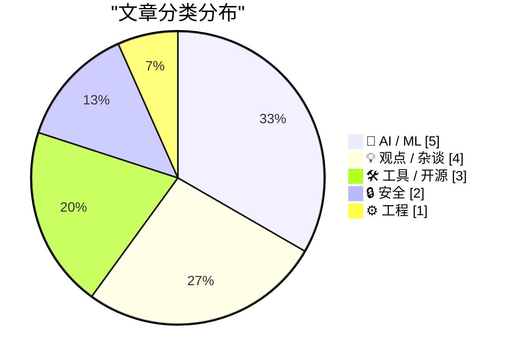
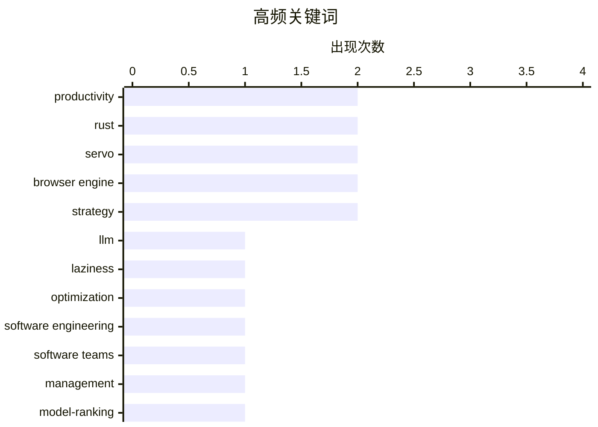

# 📰 AI 资讯每日精选 — 2026-04-14

> 汇聚 140+ 技术博客、X/Twitter、Hacker News、Reddit、Product Hunt、
> Lobste.rs、ClawFeed 日报及 GitHub Trending，经 AI 评分筛选。
>
> **本期内容**：🏆 今日必读 · 🌐 ClawFeed 日报 · 🔥 GitHub Trending · 📂 分类精选 · 🎨 设计与生成式 AI · 📊 数据概览

## 📝 今日看点

今日技术圈聚焦于AI发展的深层挑战与行业动态。一方面，大模型在狂热演进中暴露出根本性缺陷，如缺乏效率优化意识并引发算力短缺危机；另一方面，行业内部对AI工具的采用仍处于早期分化阶段，同时供应链安全威胁为开源生态敲响警钟。这些趋势共同描绘出一个在高速增长中面临效能、普及与安全多重考验的技术图景。

---

## 🏆 今日必读

🥇 **引用 Bryan Cantrill：懒惰美德的缺失**

[Quoting Bryan Cantrill](https://simonwillison.net/2026/Apr/13/bryan-cantrill/#atom-everything) — simonwillison.net · 22 小时前 · 💡 观点 / 杂谈

> 文章核心探讨了大型语言模型（LLM）因缺乏“懒惰”这一人类美德而引发的根本问题。LLM 没有工作成本概念，不会为自身或他人的未来时间进行优化，反而倾向于不断堆叠垃圾层。其结果是，LLM 会让系统变得更大而非更好，追求虚荣指标，却牺牲了真正重要的东西。作者的核心观点是，若不加以约束，LLM 的这种特性将导致系统设计走向臃肿和低效。

💡 **为什么值得读**: 这篇文章从一个深刻的人文视角切入，揭示了当前 AI 系统设计中的一个根本性缺陷，对开发者理解 LLM 的潜在危害和设计原则具有警示意义。

🏷️ LLM, laziness, optimization, software engineering

🥈 **软件团队的经济学：为何大多数工程组织在盲目飞行**

[The economics of software teams: Why most engineering orgs are flying blind](https://www.viktorcessan.com/the-economics-of-software-teams/) — Hacker News Best · 19 小时前 · ⚙️ 工程

> 文章分析了软件工程组织普遍缺乏有效衡量和管理的现状。核心论点是，传统指标（如代码行数、故事点）无法反映真实价值产出，导致管理者如同“盲目飞行”。作者提出应借鉴经济学原理，关注“产出”（如功能、修复）而非“投入”（如工时），并建立连接工程活动与业务成果的度量体系。结论是，工程组织必须转向以价值为中心的管理模式，才能实现高效和可持续的发展。

💡 **为什么值得读**: 为技术管理者提供了跳出传统度量陷阱的框架性思考，将工程管理与经济学原理结合，极具实践指导价值。

🏷️ software teams, management, productivity

🥉 **最佳本地 LLM - 2026年4月**

[Best Local LLMs - Apr 2026](https://www.reddit.com/r/LocalLLaMA/comments/1sknx6n/best_local_llms_apr_2026/) — r/LocalLLaMA · 4 小时前 · 🤖 AI / ML

> 这是 Reddit 社区 r/LocalLLaMA 发布的月度最佳本地大语言模型汇总讨论帖。帖子提及了近期发布的重要模型系列，包括备受期待的 Qwen3.5、Gemma4，以及声称达到 SOTA 性能的 GLM-5.1 和可作为 Minimax 替代品的 Minimax-M2.7。此外，还提到了真正可用的 1-bit 量化模型 PrismML Bonsai。该帖旨在收集社区成员对当前最佳本地运行 LLM 的推荐和讨论。

💡 **为什么值得读**: 是获取当前（2026年4月）开源和本地部署 LLM 前沿动态及社区真实评价的一手信息源。

🏷️ model-ranking, benchmark, community

4️⃣ **MIT 科技评论：用图表展示 AI 现状**

[MIT Tech Review: current state of AI in charts](https://www.reddit.com/r/singularity/comments/1ski084/mit_tech_review_current_state_of_ai_in_charts/) — r/singularity · 7 小时前 · 🤖 AI / ML

> 文章引用了《MIT 科技评论》通过一系列图表呈现的人工智能领域当前发展状态。这些图表可能涵盖了模型性能、算力消耗、研究趋势、产业应用或投资数据等关键维度。其目的是以可视化方式，清晰、直观地概括 AI 技术发展的核心事实与宏观趋势。读者可以通过这些图表快速把握 AI 领域的整体进展与关键挑战。

💡 **为什么值得读**: 通过权威媒体的数据可视化内容，能帮助读者在短时间内系统性地了解 AI 领域的宏观图景和关键指标。

🏷️ AI trends, data visualization, industry report

5️⃣ **引用 Steve Yegge：谷歌的 AI 采用现状**

[Quoting Steve Yegge](https://simonwillison.net/2026/Apr/13/steve-yegge/#atom-everything) — simonwillison.net · 4 小时前 · 💡 观点 / 杂谈

> Steve Yegge 指出，谷歌工程团队的 AI 工具采用情况与整个行业相似。具体表现为：20% 是能熟练使用智能体（Agent）的高级用户，20% 完全拒绝使用，而 60% 的大多数人仍停留在使用 Cursor 或类似聊天工具的阶段。同时，行业已经历超过 18 个月的招聘冻结，在此期间 AI 工具的生产力提升并未转化为人员需求的减少。这表明 AI 对工程生产力的实际影响复杂，尚未导致组织结构的根本性变革。

💡 **为什么值得读**: 通过业内资深人士的观察，揭示了 AI 工具在顶级科技公司内部真实、分化的采纳情况，打破了技术全面普及的迷思。

🏷️ AI adoption, engineering culture, productivity

---

## 🌐 ClawFeed 日报精选

> 来源：[ClawFeed](https://clawfeed.kevinhe.io) — AI 驱动的多源新闻聚合

### 🔥 今日头条

1. **Garry Tan 开源 GBrain，agent memory infra 成为今天最强传播主线之一**  
   这套系统主打 10,000+ Markdown、人物档案、日历和笔记的统一 recall，让 agent 拥有更稳定的长期记忆。它不只是一个小工具，更像是在回答“耐用 agent 的记忆层该怎么做”。

2. **Claude Code 的 /ultraplan 把“先规划、再执行”正式产品化**  
   先在 Web 端生成 implementation plan、人工编辑后再决定云端或终端执行，说明 agent 工作流开始从“直接干”走向更可审阅、更适合团队协作的 planning-first 模式。

3. **Agent 安全风险继续升温，《Your Agent Is Mine》成为今天最值得盯的安全议题**  
   核心警告是第三方 LLM router 可能被投毒、注入恶意 tool call，进一步劫持 agent 主机、窃取凭证甚至盗取钱包。agent 越能干活，安全问题就越不能当边角料。

4. **Hermes Agent 接入个人微信，agent 正在更深地进入中文真实使用场景**  
   不只是 demo，而是开始打通私聊、群聊、图片、视频、文件、语音这些日常通信入口，说明 agent 产品化正在往更高频、更生活化的界面走。

5. **AI 竞争继续上探到算力与供应链层，Anthropic 芯片传闻和 OpenAI 供应链事件都是信号**  
   一边是 Anthropic 被曝评估自研 AI 芯片，一边是 OpenAI 披露 macOS app 签名 workflow 曾拉到恶意 Axios 库，说明头部玩家的战场已经不只在模型层，也在 infra 和供应链安全层。

---

## 🔥 GitHub Trending

> 今日热门开源项目（全语言 + Python）

| # | 项目 | 描述 | ⭐ 总星 | 📈 今日 | 语言 |
|---|------|------|---------|---------|------|
| 1 | [NousResearch/hermes-agent](https://github.com/NousResearch/hermes-agent) 🤖 | The agent that grows with you | 77.1k | +11289 | Python |
| 2 | [forrestchang/andrej-karpathy-skills](https://github.com/forrestchang/andrej-karpathy-skills) 🤖 | A single CLAUDE.md file to improve Claude Code behavior, ... | 25.2k | +5733 | - |
| 3 | [thedotmack/claude-mem](https://github.com/thedotmack/claude-mem) 🤖 | A Claude Code plugin that automatically captures everythi... | 53.3k | +3175 | TypeScript |
| 4 | [microsoft/markitdown](https://github.com/microsoft/markitdown) | Python tool for converting files and office documents to ... | 107.0k | +2808 | Python |
| 5 | [shanraisshan/claude-code-best-practice](https://github.com/shanraisshan/claude-code-best-practice) 🤖 | practice made claude perfect | 41.8k | +2461 | HTML |
| 6 | [multica-ai/multica](https://github.com/multica-ai/multica) 🤖 | The open-source managed agents platform. Turn coding agen... | 11.1k | +1715 | TypeScript |
| 7 | [shiyu-coder/Kronos](https://github.com/shiyu-coder/Kronos) | Kronos: A Foundation Model for the Language of Financial ... | 17.0k | +1554 | Python |
| 8 | [OpenBMB/VoxCPM](https://github.com/OpenBMB/VoxCPM) | VoxCPM2: Tokenizer-Free TTS for Multilingual Speech Gener... | 12.3k | +1178 | Python |
| 9 | [anthropics/claude-cookbooks](https://github.com/anthropics/claude-cookbooks) 🤖 | A collection of notebooks/recipes showcasing some fun and... | 39.5k | +1012 | Jupyter Notebook |
| 10 | [virattt/ai-hedge-fund](https://github.com/virattt/ai-hedge-fund) 🤖 | An AI Hedge Fund Team | 53.0k | +783 | Python |
| 11 | [TapXWorld/ChinaTextbook](https://github.com/TapXWorld/ChinaTextbook) | 所有小初高、大学PDF教材。 | 68.9k | +703 | Roff |
| 12 | [snarktank/ralph](https://github.com/snarktank/ralph) 🤖 | Ralph is an autonomous AI agent loop that runs repeatedly... | 16.5k | +691 | TypeScript |
| 13 | [coleam00/Archon](https://github.com/coleam00/Archon) 🤖 | The first open-source harness builder for AI coding. Make... | 17.6k | +677 | TypeScript |
| 14 | [gsd-build/get-shit-done](https://github.com/gsd-build/get-shit-done) 🤖 | A light-weight and powerful meta-prompting, context engin... | 52.1k | +655 | JavaScript |
| 15 | [jamiepine/voicebox](https://github.com/jamiepine/voicebox) | The open-source voice synthesis studio | 16.3k | +512 | TypeScript |

---

## 🤖 AI / ML

### 1. 最佳本地 LLM - 2026年4月

[Best Local LLMs - Apr 2026](https://www.reddit.com/r/LocalLLaMA/comments/1sknx6n/best_local_llms_apr_2026/) — **r/LocalLLaMA** · 4 小时前 · ⭐ 25/30

> 这是 Reddit 社区 r/LocalLLaMA 发布的月度最佳本地大语言模型汇总讨论帖。帖子提及了近期发布的重要模型系列，包括备受期待的 Qwen3.5、Gemma4，以及声称达到 SOTA 性能的 GLM-5.1 和可作为 Minimax 替代品的 Minimax-M2.7。此外，还提到了真正可用的 1-bit 量化模型 PrismML Bonsai。该帖旨在收集社区成员对当前最佳本地运行 LLM 的推荐和讨论。

🏷️ model-ranking, benchmark, community

---

### 2. MIT 科技评论：用图表展示 AI 现状

[MIT Tech Review: current state of AI in charts](https://www.reddit.com/r/singularity/comments/1ski084/mit_tech_review_current_state_of_ai_in_charts/) — **r/singularity** · 7 小时前 · ⭐ 25/30

> 文章引用了《MIT 科技评论》通过一系列图表呈现的人工智能领域当前发展状态。这些图表可能涵盖了模型性能、算力消耗、研究趋势、产业应用或投资数据等关键维度。其目的是以可视化方式，清晰、直观地概括 AI 技术发展的核心事实与宏观趋势。读者可以通过这些图表快速把握 AI 领域的整体进展与关键挑战。

🏷️ AI trends, data visualization, industry report

---

### 3. OpenAI 泄露备忘录称新“Spud”模型将使其所有产品“显著提升”

[OpenAI's leaked memo says new "Spud" model will make all its products "significantly better"](https://the-decoder.com/openais-leaked-memo-says-new-spud-model-will-make-all-its-products-significantly-better/) — **The Decoder** · 6 小时前 · ⭐ 24/30

> 根据泄露的 OpenAI 内部备忘录，该公司为企业业务制定了五项战略重点。其中最引人注目的是一个代号为“Spud”的新模型，据称将使其所有产品得到“显著”改善。其他重点包括打造 AI 智能体平台，以及直指竞争对手 Anthropic 夸大其营收达 80 亿美元。这份备忘录揭示了 OpenAI 在激烈市场竞争中的产品路线图和竞争策略。

🏷️ OpenAI, Strategy, Leak

---

### 4. AI 行业算力告急：服务中断、配额限制与 GPU 价格上涨

[The AI industry is running out of compute, with outages, rationing, and rising GPU prices](https://the-decoder.com/the-ai-industry-is-running-out-of-compute-with-outages-rationing-and-rising-gpu-prices/) — **The Decoder** · 11 小时前 · ⭐ 24/30

> AI 智能体需求的激增正与有限的算力供应发生碰撞，导致行业出现算力短缺危机。具体表现包括：Anthropic 服务遭遇中断，OpenAI 宣布停止 Sora 视频生成模型的访问，以及市场数据显示 GPU 价格已飙升近 50%。这场算力危机正在影响主要 AI 公司的服务稳定性和产品策略，并推高了行业运行成本。

🏷️ Compute, GPU, Infrastructure

---

### 5. [AMA预告] Max Welling（VAEs、GNNs、AI4Science 与 CuspAI）

[[N] AMA Announcement: Max Welling (VAEs, GNNs, AI4Science & CuspAI)](https://www.reddit.com/r/MachineLearning/comments/1skil2g/n_ama_announcement_max_welling_vaes_gnns/) — **r/MachineLearning** · 7 小时前 · ⭐ 24/30

> 著名机器学习研究者 Max Welling 将于4月15日在中欧夏令时17:00-18:30（美国东部时间11:00-12:30）在 Reddit 的 r/MachineLearning 板块进行在线问答（AMA）。Max Welling 是变分自编码器（VAEs）、图神经网络（GNNs）等领域的奠基性贡献者，其职业生涯横跨学术界、大科技公司和创业领域，近期专注于AI4Science（科学人工智能）并联合创立了 CuspAI 公司。此次AMA为社区提供了直接向这位多产学者提问的机会，话题可涵盖其经典研究工作、对当前AI趋势的看法以及在新公司CuspAI探索的方向。这是一个与顶尖AI科学家进行深度交流的宝贵窗口。

🏷️ AMA, Max-Welling, AI-research

---

## 💡 观点 / 杂谈

### 6. 引用 Bryan Cantrill：懒惰美德的缺失

[Quoting Bryan Cantrill](https://simonwillison.net/2026/Apr/13/bryan-cantrill/#atom-everything) — **simonwillison.net** · 22 小时前 · ⭐ 25/30

> 文章核心探讨了大型语言模型（LLM）因缺乏“懒惰”这一人类美德而引发的根本问题。LLM 没有工作成本概念，不会为自身或他人的未来时间进行优化，反而倾向于不断堆叠垃圾层。其结果是，LLM 会让系统变得更大而非更好，追求虚荣指标，却牺牲了真正重要的东西。作者的核心观点是，若不加以约束，LLM 的这种特性将导致系统设计走向臃肿和低效。

🏷️ LLM, laziness, optimization, software engineering

---

### 7. 引用 Steve Yegge：谷歌的 AI 采用现状

[Quoting Steve Yegge](https://simonwillison.net/2026/Apr/13/steve-yegge/#atom-everything) — **simonwillison.net** · 4 小时前 · ⭐ 24/30

> Steve Yegge 指出，谷歌工程团队的 AI 工具采用情况与整个行业相似。具体表现为：20% 是能熟练使用智能体（Agent）的高级用户，20% 完全拒绝使用，而 60% 的大多数人仍停留在使用 Cursor 或类似聊天工具的阶段。同时，行业已经历超过 18 个月的招聘冻结，在此期间 AI 工具的生产力提升并未转化为人员需求的减少。这表明 AI 对工程生产力的实际影响复杂，尚未导致组织结构的根本性变革。

🏷️ AI adoption, engineering culture, productivity

---

### 8. 一切未来的基石皆是谎言？论安全

[The Future of Everything Is Lies, I Guess: Safety](https://aphyr.com/posts/417-the-future-of-everything-is-lies-i-guess-safety) — **Hacker News Best** · 8 小时前 · ⭐ 24/30

> 文章批判了当前科技行业，特别是人工智能领域，以“安全”为名进行内容审查和系统控制的趋势。作者指出，这种“安全”实践常常演变为对信息流动的武断限制，其决策过程不透明且标准模糊。通过具体案例，文章揭示了安全措施如何可能被用于掩盖错误、维护商业利益或推行特定意识形态。最终，作者认为这种将“安全”置于透明度和用户代理之上的范式，本质上是构建在谎言之上的控制体系，损害了技术的开放与可信根基。

🏷️ AI safety, ethics, regulation

---

### 9. 苹果的意外护城河：“AI 落后者”何以可能最终胜出

[Apple's accidental moat: How the "AI Loser" may end up winning](https://adlrocha.substack.com/p/adlrocha-how-the-ai-loser-may-end) — **Hacker News Best** · 22 小时前 · ⭐ 24/30

> 文章分析了苹果在生成式AI竞赛中看似落后的背景下，可能凭借其独特的硬件-软件-芯片整合优势构筑强大竞争力。核心论点是，苹果通过其统一的生态系统（iPhone、Mac、Vision Pro等）、自研芯片（如M系列）对能效的极致控制，以及端侧隐私保护的用户信任，创造了一个难以被云中心化AI模型复制的“体验护城河”。作者预测，未来AI的决胜点可能并非仅在于模型规模，而在于与设备深度集成、低延迟、高隐私的个性化智能体验，这正是苹果的潜在优势所在。结论认为，苹果可能正在定义一条不同于当前“大模型军备竞赛”的AI成功路径。

🏷️ Apple, AI, strategy, ecosystem

---

## 🛠 工具 / 开源

### 10. 探索新的 `servo` crate

[Exploring the new `servo` crate](https://simonwillison.net/2026/Apr/13/servo-crate-exploration/#atom-everything) — **simonwillison.net** · 10 小时前 · ⭐ 24/30

> 文章记录了作者对 Servo 团队新发布的 `servo` crate（版本 0.1.0）的探索过程。该 crate 将 Servo 浏览器引擎打包为可嵌入的 Rust 库。作者使用 Claude Code 工具，通过提问和迭代的方式，快速生成了使用该库构建一个简单 headless 浏览器并截图的基础示例代码。这项探索展示了如何利用 AI 编程助手快速上手和理解一个全新的、复杂的底层库。

🏷️ Rust, Servo, browser engine, crate

---

### 11. GitHub 堆叠式拉取请求（Stacked PRs）

[GitHub Stacked PRs](https://github.github.com/gh-stack/) — **Hacker News Best** · 4 小时前 · ⭐ 24/30

> GitHub 正式推出了名为“Stacked PRs”（堆叠式拉取请求）的新功能。该功能旨在优化将大型功能或重构拆分为一系列小型、相互依赖的 PR 的工作流程。它允许开发者清晰地管理 PR 之间的依赖链，方便进行代码审查和迭代。这是对 Git 工作流，特别是基于 Trunk-Based Development 中常用模式的重要工具化支持。

🏷️ GitHub, Pull Requests, Workflow

---

### 12. Servo 渲染引擎现已发布在 crates.io

[Servo is now available on crates.io](https://servo.org/blog/2026/04/13/servo-0.1.0-release/) — **Hacker News Best** · 13 小时前 · ⭐ 24/30

> Mozilla 研发的下一代浏览器引擎 Servo 发布了其 0.1.0 版本，并正式上架 Rust 的官方包仓库 crates.io。此次发布标志着 Servo 从一个研究项目转向为可供社区使用的模块化库，其核心组件（如 CSS 解析、布局引擎）可作为独立 crate 被集成到其他 Rust 项目中。0.1.0 版本提供了基础的渲染能力，为开发者探索浏览器技术、嵌入式渲染或特定图形应用提供了新的高性能选择。此举旨在通过 Rust 生态加速 Servo 技术的采用和创新，推动 Web 渲染引擎的多元化发展。

🏷️ Servo, Rust, browser engine

---

## 🔒 安全

### 13. 有人收购了 30 个 WordPress 插件并在其中全部植入后门

[Someone Bought 30 WordPress Plugins and Planted a Backdoor in All of Them](https://anchor.host/someone-bought-30-wordpress-plugins-and-planted-a-backdoor-in-all-of-them/) — **Hacker News Best** · 7 小时前 · ⭐ 24/30

> 安全事件披露，有人收购了 30 个不同的 WordPress 插件，并在所有插件中植入了恶意后门代码。这种“供应链攻击”方式使得大量使用这些插件的网站面临严重安全风险。攻击者通过合法购买插件获取控制权，然后插入隐蔽的后门，这暴露了开源插件生态系统中所有权变更带来的安全监管漏洞。网站管理员需立即检查并更新受影响的插件。

🏷️ WordPress, backdoor, supply-chain

---

### 14. 今年疯狂的网络安全事件时间线

[This year’s insane timeline of hacks](https://ringmast4r.substack.com/p/we-may-be-living-through-the-most) — **Hacker News Best** · 10 小时前 · ⭐ 24/30

> 文章系统梳理了本年度发生的一系列重大网络安全攻击事件，揭示了攻击的规模、复杂性和破坏性均达到前所未有的水平。时间线涵盖了针对关键基础设施、大型科技公司、政府机构及开源软件供应链的多个高影响案例，例如某云服务商的大规模数据泄露和某广泛使用日志库的严重漏洞被利用。这些事件表明，攻击者正采用更先进的自动化工具和协作方式，而防御体系普遍存在响应滞后的问题。结论指出，我们可能正经历着网络安全史上最密集的危机时期，整个数字生态的韧性面临严峻考验。

🏷️ cybersecurity, timeline, vulnerabilities

---

## ⚙️ 工程

### 15. 软件团队的经济学：为何大多数工程组织在盲目飞行

[The economics of software teams: Why most engineering orgs are flying blind](https://www.viktorcessan.com/the-economics-of-software-teams/) — **Hacker News Best** · 19 小时前 · ⭐ 25/30

> 文章分析了软件工程组织普遍缺乏有效衡量和管理的现状。核心论点是，传统指标（如代码行数、故事点）无法反映真实价值产出，导致管理者如同“盲目飞行”。作者提出应借鉴经济学原理，关注“产出”（如功能、修复）而非“投入”（如工时），并建立连接工程活动与业务成果的度量体系。结论是，工程组织必须转向以价值为中心的管理模式，才能实现高效和可持续的发展。

🏷️ software teams, management, productivity

---

## 🎨 Design & Generative AI

### 🖥️ 生成式 UI

- **[Luma AI应用上线语音输入功能](https://x.com/LumaLabsAI/status/2043828634658713684)** — 𝕏 @LumaLabsAI · 2 小时前
  > Luma AI为其智能体应用新增语音听写功能，用户可通过语音直接输入指令。

### 🖼️ 生成式图片

- **[Distilled v1.1模型更新发布](https://www.reddit.com/r/StableDiffusion/comments/1skds12/update_distilled_v11_is_live/)** — r/StableDiffusion · 10 小时前
  > 基于LTX-2.3的Distilled模型升级至v1.1，改进了音频质量和视觉效果。

- **[LTX 2.3平台上的增强型IC LoRA高清优化工作流](https://www.reddit.com/r/comfyui/comments/1sk2rpu/i_made_an_enhanced_ic_lora_workflow_on_ltx_23/)** — r/comfyui · 18 小时前
  > 用户分享了针对LTX 2.3的IC LoRA工作流，可实现高分辨率放大和光照优化。

- **[Gemma4模型集成至ComfyUI](https://www.reddit.com/r/comfyui/comments/1skj7ix/gemma4_comfyui/)** — r/comfyui · 6 小时前
  > Gemma4文本编码器模型现已集成到ComfyUI图像生成工具中。

- **[IC-LoRA-Detailer：专为后处理设计的工具](https://www.reddit.com/r/StableDiffusion/comments/1sjxoz6/icloradetailer_its_for_postprocessing_not_just/)** — r/StableDiffusion · 23 小时前
  > IC-LoRA-Detailer是一个用于LTX2.3图像后处理而非渲染的工具。

- **[LTX蒸馏LoRA 1.1与1.0版本效果对比](https://www.reddit.com/r/StableDiffusion/comments/1skjtz0/ltx_distilled_lora_11_vs_10_comparison/)** — r/StableDiffusion · 6 小时前
  > 对比LTX蒸馏LoRA模型1.1版与1.0版的生成效果。

- **[LTX2.3（蒸馏版）更新参数以优化结果](https://www.reddit.com/r/StableDiffusion/comments/1sk8vhq/ltx23_distilled_updated_sigmas_for_better_results/)** — r/StableDiffusion · 13 小时前
  > LTX2.3（蒸馏版）更新了sigma参数，旨在获得更好的生成效果。

- **[分享多款图像修复与填充工作流](https://www.reddit.com/r/StableDiffusion/comments/1ska9uv/inpaint_workflows_for_zimage_qwen_and_flux_fill/)** — r/StableDiffusion · 12 小时前
  > 用户分享了针对z-image、qwen和flux模型的图像修复（inpaint）与填充工作流合集。

- **[开源图片管理服务器PixlStash 1.0.0发布](https://www.reddit.com/r/comfyui/comments/1skdqjr/pixlstash_100_is_now_out/)** — r/comfyui · 10 小时前
  > PixlStash 1.0.0发布，这是一个本地托管、开源的照片管理服务器，用于组织和标记图片。

- **[ComfyUI PNG元数据节点工具发布](https://www.reddit.com/r/StableDiffusion/comments/1skjx54/comfyui_png_metadata_nodes/)** — r/StableDiffusion · 6 小时前
  > 为解决大量PNG图片管理问题，开发者发布了一款用于读取和处理PNG元数据的ComfyUI节点工具。

- **[ComfyUI新增带点击保存的节点与缓存文本编码器](https://www.reddit.com/r/StableDiffusion/comments/1skn8te/comfyui_saveimage_node_with_save_on_button_click/)** — r/StableDiffusion · 4 小时前
  > ComfyUI新增支持按钮点击保存的SaveImage节点以及带缓存的CLIP文本编码器节点。

- **[ComfyUI新功能：场景风格融合与改进的会话管理](https://www.reddit.com/r/comfyui/comments/1sklcrk/a_feature_blending_scene_and_style_and_more/)** — r/comfyui · 5 小时前
  > ComfyUI更新引入了场景与风格融合功能、会话管理以及更好的用户界面。

### 🎬 生成式视频

- **[谷歌为Ultra订阅者免费提供Veo 3.1 Lite视频生成功能](https://the-decoder.com/google-now-offers-ultra-subscribers-video-generation-with-veo-3-1-lite-at-no-extra-credit-cost/)** — The Decoder · 8 小时前
  > 谷歌向Ultra订阅用户推出不消耗额外积分的Veo 3.1 Lite视频生成服务。

- **[WAN 2.2 Lightx2v速度LoRA新版本发布](https://www.reddit.com/r/StableDiffusion/comments/1skkotf/new_wan_22_lightx2v_speed_lora_260412/)** — r/StableDiffusion · 6 小时前
  > 新发布的WAN 2.2 Lightx2v速度LoRA模型，基于官方完整模型缩放和提取。

- **[在ComfyUI中测试LTX 2.3的IC LoRA舞蹈视频工作流](https://www.reddit.com/r/comfyui/comments/1sk6dcd/testing_ic_lora_workflow_on_ltx_23_in_comfyui_ai/)** — r/comfyui · 15 小时前
  > 用户在ComfyUI中测试基于LTX 2.3和IC LoRA工作流生成AI舞蹈视频。

---

## 📊 数据概览

| 扫描源 | 抓取文章 | 时间范围 | 精选 |
|:---:|:---:|:---:|:---:|
| 112/140 | 4750 篇 → 202 篇 | 24h | **15 篇** |

### 分类分布



### 高频关键词



<details>
<summary>📈 纯文本关键词图（终端友好）</summary>

```
productivity         │ ████████████████████ 2
rust                 │ ████████████████████ 2
servo                │ ████████████████████ 2
browser engine       │ ████████████████████ 2
strategy             │ ████████████████████ 2
llm                  │ ██████████░░░░░░░░░░ 1
laziness             │ ██████████░░░░░░░░░░ 1
optimization         │ ██████████░░░░░░░░░░ 1
software engineering │ ██████████░░░░░░░░░░ 1
software teams       │ ██████████░░░░░░░░░░ 1
```

</details>

### 🏷️ 话题标签

**productivity**(2) · **rust**(2) · **servo**(2) · browser engine(2) · strategy(2) · llm(1) · laziness(1) · optimization(1) · software engineering(1) · software teams(1) · management(1) · model-ranking(1) · benchmark(1) · community(1) · ai trends(1) · data visualization(1) · industry report(1) · ai adoption(1) · engineering culture(1) · crate(1)

---

*生成于 2026-04-14 01:16 | 汇聚 140 个技术博客、X/Twitter、Hacker News、Reddit、Product Hunt、Lobste.rs、ClawFeed 日报及 GitHub Trending，经 AI 评分筛选出 Top 15 精华内容*
