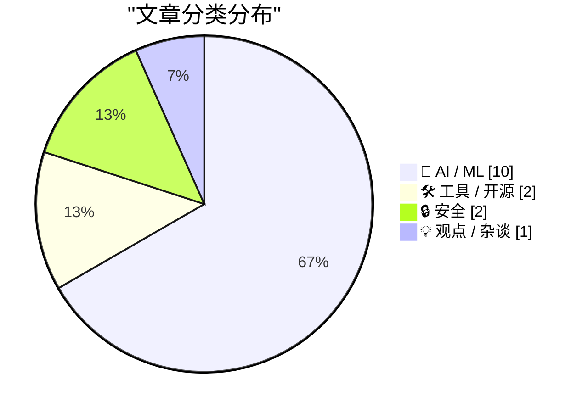
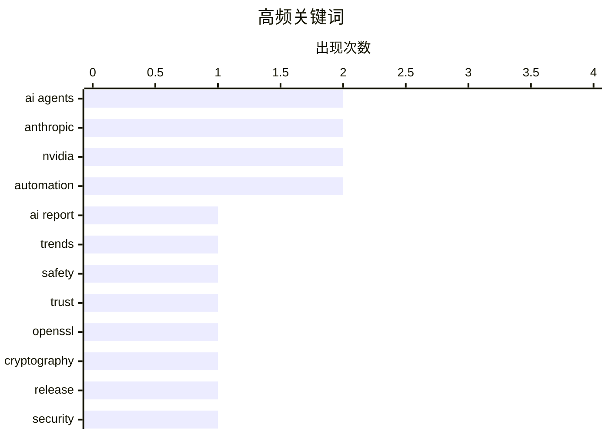

# 📰 AI 资讯每日精选 — 2026-04-15

> 汇聚 140+ 技术博客、X/Twitter、Hacker News、Reddit、Product Hunt、
> Lobste.rs、ClawFeed 日报及 GitHub Trending，经 AI 评分筛选。
>
> **本期内容**：🏆 今日必读 · 🌐 ClawFeed 日报 · 🔥 GitHub Trending · 📂 分类精选 · 🎨 设计与生成式 AI · 📊 数据概览

## 📝 今日看点

今日技术圈聚焦于AI能力的突破与伴生的安全挑战。一方面，AI在芯片设计、科研自动化等领域的应用效率取得惊人提升，智能体正从实验室走向真实复杂任务。另一方面，AI驱动的网络攻击能力显现，与激增的模型漏洞和系统安全补丁共同敲响了警钟。技术进步与安全防御的竞赛正进入关键阶段。

---

## 🏆 今日必读

🥇 **斯坦福《AI指数报告2026》：快速进步、日益增长的安全担忧与下滑的公众信任**

[Stanford's AI Index 2026 shows rapid progress, growing safety concerns, and declining public trust](https://the-decoder.com/stanfords-ai-index-2026-shows-rapid-progress-growing-safety-concerns-and-declining-public-trust/) — The Decoder · 15 小时前 · 🤖 AI / ML

> 斯坦福HAI发布的《AI指数报告2026》揭示了AI领域的最新动态与矛盾。报告显示AI模型性能取得重大飞跃，中美在AI能力上的差距正在缩小，但模型安全问题和漏洞数量也同步激增。与此同时，公众对AI的信任度持续下降，形成了技术进步与社会接受度之间的显著鸿沟。报告的核心结论是，AI技术正以前所未有的速度发展，但安全与信任危机已成为其广泛应用的重大障碍。

💡 **为什么值得读**: 这份权威报告是把握全球AI发展趋势、理解技术进展与社会影响之间张力的年度必读材料。

🏷️ AI Report, Trends, Safety, Trust

🥈 **OpenSSL 4.0.0 发布**

[Release OpenSSL 4.0.0](https://github.com/openssl/openssl/releases/tag/openssl-4.0.0) — Lobste.rs · 5 小时前 · 🛠 工具 / 开源

> OpenSSL项目发布了其4.0.0大版本。作为广泛使用的加密工具库，此次主版本更新通常意味着包含重大的新特性、API变更或架构改进。用户需要关注升级指南，因为大版本更新可能涉及向后不兼容的更改。对于依赖OpenSSL的系统和开发者而言，评估并规划升级至新版本是必要的。

💡 **为什么值得读**: 对于任何使用TLS/SSL加密的开发者或系统管理员，了解OpenSSL这一核心基础库的重大更新至关重要。

🏷️ OpenSSL, cryptography, release

🥉 **2026年4月补丁星期二**

[Patch Tuesday, April 2026 Edition](https://krebsonsecurity.com/2026/04/patch-tuesday-april-2026-edition/) — krebsonsecurity.com · 3 小时前 · 🔒 安全

> 微软在2026年4月的“补丁星期二”一次性修复了Windows系统及相关软件中的167个安全漏洞，数量惊人。其中包含一个已被利用的SharePoint Server零日漏洞和一个已公开的Windows Defender漏洞（代号“BlueHammer”）。此外，谷歌Chrome修复了其2026年的第四个零日漏洞，Adobe Reader也发布了修复远程代码执行漏洞的紧急更新。此次更新涉及多个广泛使用的核心软件，安全风险极高。

💡 **为什么值得读**: 本次修复漏洞数量多、影响范围广，且包含多个已被利用的高危漏洞，是所有Windows和常用软件用户必须立即行动的紧急安全警报。

🏷️ security, patches, vulnerabilities, Windows

4️⃣ **Claude Mythos可端到端自主攻破弱防御企业网络**

[Claude Mythos can autonomously compromise weakly defended enterprise networks end-to-end](https://the-decoder.com/claude-mythos-can-autonomously-compromise-weakly-defended-enterprise-networks-end-to-end/) — The Decoder · 7 小时前 · 🔒 安全

> 英国AI安全研究所测试了Anthropic的Claude Mythos Preview模型的网络攻击能力。测试中，该AI模型首次实现了对企业网络的端到端全自动攻击模拟。然而，这一突破性结果附有重要前提：它主要针对的是防御薄弱（“弱防御”）的网络环境。这表明前沿AI已具备自动化网络攻击的潜在能力，但当前其有效性高度依赖于目标系统的安全状况。

💡 **为什么值得读**: 这是首个公开证实AI能完成全自动网络攻击的案例，为理解AI的“双刃剑”属性和制定AI安全政策提供了关键实证。

🏷️ AI security, cyber attack, autonomous

5️⃣ **内省扩散语言模型**

[Introspective Diffusion Language Models](https://introspective-diffusion.github.io/) — Hacker News Best · 17 小时前 · 🤖 AI / ML

> Introspective Diffusion是一种新型语言模型架构，它结合了扩散模型和语言模型的原理。该模型旨在通过“内省”过程来生成或处理文本，可能涉及迭代去噪或内部反馈机制以提升输出质量。其目标是解决传统自回归模型在一致性、可控性或创造性方面的某些局限。具体技术细节需参考项目页面，但其核心思想是通过扩散过程赋予语言模型不同的生成范式。

💡 **为什么值得读**: 该研究提出了一种可能突破当前自回归范式局限的新颖语言模型架构，对AI研究者具有重要的启发意义。

🏷️ LLM, diffusion, reasoning

---

## 🌐 ClawFeed 日报精选

> 来源：[ClawFeed](https://clawfeed.kevinhe.io) — AI 驱动的多源新闻聚合

📋 ClawFeed 日报 | 2026-04-14

🔥 今日头条

1. Anthropic Claude Mythos 与 AI 安全监管持续升温
   - Reuters、Axios、英国 AI Security Institute 多个信号汇合，说明 Anthropic 新模型 Mythos 不只是产品发布，而是已经进入政策、安全、攻防能力评估的核心议程。
   - 这意味着 frontier model 的发布节奏会越来越受政府沟通、网络安全叙事和风险审查影响。

2. 企业 AI 明显从 chat 时代切向 agent 时代
   - Aaron Levie、Andrew Ng 等人的判断高度一致，核心不是“聊天更聪明了”，而是企业开始把 AI 接进真实工作流。
   - 新瓶颈正在从“能不能生成代码”转向“要做什么、怎么定义任务、怎么把 agent 接进系统”。

3. AI software factory / cloud coding agents 基础设施开始公开化
   - Vercel 开源 open-agents.dev，Anthropic 持续解释 managed agents 设计，Cursor、OpenAI、Google 也都在强化 agent 化入口。
   - 市场正在从单点模型能力竞争，转向 agent 基础设施、编排、权限、memory、执行环境之争。

4. 多 agent、harness engineering、memory 系统继续升温
   - Multica 两周 10K GitHub stars，Cline Kanban、Harness Engineering、OpenFang、memory/wiki 型 second brain 讨论持续升温。
   - 说明大家已经默认“模型本身不够”，真正拉开差距的是外层系统设计。

5. Stablecoin 与 AI 创业叙事开始交叉外溢
   - Garry Tan 明确表示 YC 可以直接用 stablecoin 投资，另一方面 stablecoin 在跨境支付降本场景中的真实价值也被反复提起。
   - 这条线虽然不是今天主轴，但很可能成为 AI 创业基础设施之外的下一层金融配套。

📰 精选 Top 10

1. @rauchg
   - 开源 open-agents.dev，试图把企业 cloud coding agents / AI software factory 基础设施做成公共参考实现。
   - https://x.com/rauchg/status/2043869656931529034

2. @levie
   - 明确判断企业 AI 正从 chat era 切到 agent era，这几乎是今天最清晰的产业共识之一。
   - https://x.com/levie/status/2043426157367095397

3. @AndrewYNg
   - 提醒大家 AI agent 会让写代码更快，但真正稀缺的会变成“决定做什么”，点到了产品定义的新瓶颈。
   - https://x.com/AndrewYNg/status/2043742105852621052

4. @AISecurityInst
   - 指出 Claude Mythos Preview 已经能端到端跑通 AISI cyber range，前沿模型的真实攻防能力正在进入更严肃讨论。
   - https://x.com/AISecurityInst/status/2043683577594794183

5. @anorth_chen
   - 分享 AI-First 团队实践后每天可合并 20 个 PR，属于少见的中文一线执行案例。
   - https://x.com/anorth_chen/status/2043694726764003817

6. @garrytan
   - 先是强调 memory/skills/brain 应该是 markdown + git repo，又进一步说 YC 可直接用 stablecoin 投资，观点都很有方向感。
   - https://x.com/garrytan/status/2043198780800197025
   - https://x.com/garrytan/status/2043852096244457572

7. @sydneyrunkle
   - deepagents 新增 filesystem permissions，用声明式 allow/deny 约束 agent 读写共享资源，属于很实用的团队级 agent 基础能力。
   - https://x.com/sydneyrunkle/status/2043770291579486410

8. @jiayuan_jy
   - Multica 两周拿到 10K GitHub stars，侧面印证多 agent / 编排工具依然是热赛道。
   - https://x.com/jiayuan_jy/status/2043638416529858764

9. @GoogleAI
   - 持续把“从草图到可运行软件”“Notebook/研究工作流”这些 agentic product surface 做成标准能力，产品化推进很明显。
   - https://x.com/GoogleAI/status/2043765855314706899
   - https://x.com/GoogleAI/status/2042671003570983299

10. @AnthropicAI
    - 解释 Managed Agents 的 brain/hands 解耦设计，说明长时任务 agent 的系统架构正逐渐清晰。
    - https://x.com/AnthropicAI/status/2041929199976640948

👀 推荐关注汇总

- @anorth_chen
  - 中文 AI builder，持续输出 AI-First 团队工作流和工程实践，和 Kevin 当前关注方向高度匹配。
- @intuitiveml
  - CreaoAI 联创，前 Meta GenAI/LLaMA，适合跟踪一线 AI-First 组织实践。
- @c7five
  - Kraken CSO，补足 AI × security / 实战安全视角。
- @Steve_Yegge
  - 老牌工程作者，对 Google 内部 AI 渗透率和工程文化的观察有独特价值。
- @ben_burtenshaw
  - 持续输出 RL for agents、benchmarks、agent training，适合跟踪 agent 训练侧。
- @JiaZhihao
  - AI systems 学术一线，适合补系统研究和会议信号。
- @Jingyuan_521
  - 中文区里少见持续讨论 one-person company、agent 协作和个人工作流升级的人。
- @lmstudio
  - 本地模型生态重要入口，接入 OpenClaw 后相关动态更值得盯。

🧹 建议取关汇总

- @HeXiaobo
  - 多次抽查均显示接近僵尸号，内容停在多年以前。
- @0xJasonBateman
  - 活跃度低，内容与 AI / tech / crypto 主线关联弱。
- @Soft6161
  - 近期广告和推广味明显，信噪比偏低。
- @QuantumSwap
  - 长期荒废，停留在早年空投/喊单语境，已经脱节。
- @feibo03
  - 低信息密度 meme / 情绪化喊单偏多。
- @UCSanDiego
  - 本身不是坏账号，但和 Kevin 当前想看的 builder / AI / crypto 主线相关性较弱。

📊 今日观察

今天最明显的主线，是 AI 行业正在从“模型更强”转向“agent 怎么真正接管工作流”。一边是 Anthropic Mythos 把安全、政策、攻防能力推到台前，另一边是 Vercel、Anthropic、Cursor、Google、OpenAI 都在补 agent 基础设施、产品入口和执行系统。与此同时，多 agent、memory、权限控制、harness engineering 这些原本偏工程细节的话题，已经逐渐变成真正决定落地效果的核心变量。简单说，今天的增量不在 demo，而在系统。

附注
- 今日中午和晚间有多轮 4h 简报因 X 登录态异常切到 fallback 模式，因此日报对“推荐关注/建议取关”更偏重凌晨到傍晚已完成核验的结果。---

## 🔥 GitHub Trending

> 今日热门开源项目（全语言 + Python）

| # | 项目 | 描述 | ⭐ 总星 | 📈 今日 | 语言 |
|---|------|------|---------|---------|------|
| 1 | [forrestchang/andrej-karpathy-skills](https://github.com/forrestchang/andrej-karpathy-skills) 🤖 | A single CLAUDE.md file to improve Claude Code behavior, ... | 33.9k | +9263 | - |
| 2 | [NousResearch/hermes-agent](https://github.com/NousResearch/hermes-agent) 🤖 | The agent that grows with you | 84.4k | +8301 | Python |
| 3 | [thedotmack/claude-mem](https://github.com/thedotmack/claude-mem) 🤖 | A Claude Code plugin that automatically captures everythi... | 55.8k | +2997 | TypeScript |
| 4 | [shanraisshan/claude-code-best-practice](https://github.com/shanraisshan/claude-code-best-practice) 🤖 | from vibe coding to agentic engineering - practice makes ... | 43.8k | +2583 | HTML |
| 5 | [obra/superpowers](https://github.com/obra/superpowers) | An agentic skills framework & software development method... | 152.3k | +1919 | Shell |
| 6 | [microsoft/markitdown](https://github.com/microsoft/markitdown) | Python tool for converting files and office documents to ... | 108.5k | +1675 | Python |
| 7 | [jamiepine/voicebox](https://github.com/jamiepine/voicebox) | The open-source voice synthesis studio | 17.3k | +1162 | TypeScript |
| 8 | [virattt/ai-hedge-fund](https://github.com/virattt/ai-hedge-fund) 🤖 | An AI Hedge Fund Team | 54.1k | +1007 | Python |
| 9 | [shiyu-coder/Kronos](https://github.com/shiyu-coder/Kronos) | Kronos: A Foundation Model for the Language of Financial ... | 17.8k | +963 | Python |
| 10 | [anthropics/claude-cookbooks](https://github.com/anthropics/claude-cookbooks) 🤖 | A collection of notebooks/recipes showcasing some fun and... | 40.3k | +931 | Jupyter Notebook |
| 11 | [pascalorg/editor](https://github.com/pascalorg/editor) | Create and share 3D architectural projects. | 11.6k | +820 | TypeScript |
| 12 | [chrislgarry/Apollo-11](https://github.com/chrislgarry/Apollo-11) | Original Apollo 11 Guidance Computer (AGC) source code fo... | 66.4k | +472 | Assembly |
| 13 | [alirezarezvani/claude-skills](https://github.com/alirezarezvani/claude-skills) 🤖 | 232+ Claude Code skills & agent plugins for Claude Code, ... | 11.1k | +195 | Python |
| 14 | [vllm-project/vllm](https://github.com/vllm-project/vllm) | A high-throughput and memory-efficient inference and serv... | 76.6k | +162 | Python |
| 15 | [Tracer-Cloud/opensre](https://github.com/Tracer-Cloud/opensre) 🤖 | Build your own AI SRE agents. The open source toolkit for... | 735 | +137 | Python |

---

## 🤖 AI / ML

### 1. 斯坦福《AI指数报告2026》：快速进步、日益增长的安全担忧与下滑的公众信任

[Stanford's AI Index 2026 shows rapid progress, growing safety concerns, and declining public trust](https://the-decoder.com/stanfords-ai-index-2026-shows-rapid-progress-growing-safety-concerns-and-declining-public-trust/) — **The Decoder** · 15 小时前 · ⭐ 27/30

> 斯坦福HAI发布的《AI指数报告2026》揭示了AI领域的最新动态与矛盾。报告显示AI模型性能取得重大飞跃，中美在AI能力上的差距正在缩小，但模型安全问题和漏洞数量也同步激增。与此同时，公众对AI的信任度持续下降，形成了技术进步与社会接受度之间的显著鸿沟。报告的核心结论是，AI技术正以前所未有的速度发展，但安全与信任危机已成为其广泛应用的重大障碍。

🏷️ AI Report, Trends, Safety, Trust

---

### 2. 内省扩散语言模型

[Introspective Diffusion Language Models](https://introspective-diffusion.github.io/) — **Hacker News Best** · 17 小时前 · ⭐ 26/30

> Introspective Diffusion是一种新型语言模型架构，它结合了扩散模型和语言模型的原理。该模型旨在通过“内省”过程来生成或处理文本，可能涉及迭代去噪或内部反馈机制以提升输出质量。其目标是解决传统自回归模型在一致性、可控性或创造性方面的某些局限。具体技术细节需参考项目页面，但其核心思想是通过扩散过程赋予语言模型不同的生成范式。

🏷️ LLM, diffusion, reasoning

---

### 3. ClawBench：AI智能体能在真实网站上完成日常在线任务吗？153项任务，144个真实网站，最佳模型成功率仅33.3%

[ClawBench: Can AI Agents Complete Everyday Online Tasks? 153 tasks, 144 live websites, best model at 33.3% [R]](https://www.reddit.com/r/MachineLearning/comments/1slf7pg/clawbench_can_ai_agents_complete_everyday_online/) — **r/MachineLearning** · 7 小时前 · ⭐ 26/30

> ClawBench是一个评估AI浏览器智能体在真实世界网站执行日常任务能力的新基准。它包含153个实际任务，覆盖144个实时运行的生产环境网站，而非模拟环境。关键发现是，当前最佳模型（Claude Sonnet 4.6）的成功率仅为33.3%，智谱AI的GLM-5紧随其后。这揭示了当前AI智能体在复杂、动态的真实网络环境中完成多步骤任务的巨大挑战。

🏷️ AI agents, benchmark, web automation

---

### 4. Anthropic拟最早本周发布Claude Opus 4.7及新款AI设计工具

[Anthropic is set to release Claude Opus 4.7 and a new AI design tool as early as this week](https://www.reddit.com/r/singularity/comments/1slh72j/anthropic_is_set_to_release_claude_opus_47_and_a/) — **r/singularity** · 6 小时前 · ⭐ 26/30

> 据The Information独家报道，AI公司Anthropic计划最早于本周发布其旗舰模型Claude Opus的4.7版本。此次发布可能还包括一款新的AI设计工具，暗示Anthropic正将其模型能力扩展到更广泛的应用领域。新模型的发布将加剧与OpenAI等竞争对手在尖端模型能力上的竞争。这反映了AI行业快速迭代和产品化的趋势。

🏷️ Anthropic, Claude, model release, AI tool

---

### 5. 英伟达称AI将需10个月、8名工程师的GPU设计任务缩短至一夜完成，但距AI无人工设计芯片仍“很远”

[Nvidia says AI cuts 10-month, 8-engineer GPU design task to overnight job - company is still 'a long way' from AI designing chips without human input](https://www.reddit.com/r/singularity/comments/1sl5r0x/nvidia_says_ai_cuts_10month_8engineer_gpu_design/) — **r/singularity** · 13 小时前 · ⭐ 26/30

> 英伟达透露，其内部AI工具已将原本需要8名工程师耗时10个月的GPU设计任务，大幅缩短至一个晚上即可完成。这展示了AI在加速复杂芯片设计流程方面的巨大潜力。然而，公司同时强调，目前距离AI完全独立、无需人类输入地设计芯片还有很长的路要走。AI当前的角色是作为强大的辅助工具，提升人类工程师的效率，而非取代他们。

🏷️ NVIDIA, chip design, automation, EDA

---

### 6. Anthropic自主AI智能体在“弱到强监督”研究上超越人类研究员

[Anthropic's Autonomous AI Agents Outperform Human Researchers on Weak-to-Strong Supervision](https://www.reddit.com/r/singularity/comments/1sll400/anthropics_autonomous_ai_agents_outperform_human/) — **r/singularity** · 4 小时前 · ⭐ 26/30

> Anthropic的研究团队构建了能够自主提出想法、运行实验并迭代的AI智能体，用于解决“弱到强监督”这一开放研究问题。实验结果表明，这些自主AI智能体的表现超过了人类研究员。这意味着自动化此类研究过程已经具备实用性。这项进展指向了AI不仅作为研究工具，更能作为自主研究者参与科学发现的未来。

🏷️ Anthropic, AI agents, research, automation

---

### 7. 为网络安全新时代提供可信访问

[Trusted access for the next era of cyber defense](https://simonwillison.net/2026/Apr/14/trusted-access-openai/#atom-everything) — **simonwillison.net** · 3 小时前 · ⭐ 25/30

> OpenAI宣布推出专门针对网络安全防御用例进行微调的新模型GPT-5.4-Cyber，以应对日益复杂的网络威胁。此举被视为OpenAI对Anthropic Claude Mythos（展示出网络攻击能力）的回应，旨在将尖端AI能力导向防御性用途。该模型旨在为安全专业人员提供“可信访问”，帮助进行威胁狩猎、漏洞分析和安全代码审查等任务。这标志着主要AI厂商开始积极布局并塑造AI在网络安全领域的伦理与应用方向。

🏷️ AI, cybersecurity, GPT, model

---

### 8. “我不知道！”：使用 HALO-Loss 教神经网络学会弃权

["I don't know!": Teaching neural networks to abstain with the HALO-Loss. [R]](https://www.reddit.com/r/MachineLearning/comments/1skzuhd/i_dont_know_teaching_neural_networks_to_abstain/) — **r/MachineLearning** · 19 小时前 · ⭐ 25/30

> 文章探讨了如何让神经网络在不确定时主动输出“我不知道”（弃权），而非强行给出可能错误的预测。其核心是提出了 HALO-Loss（Harmonized Abstention Learning Objective），一种新的损失函数，它通过惩罚模型在低置信度样本上的错误，同时奖励其正确弃权，来联合优化分类准确性和弃权决策。这种方法旨在提高模型在开放世界或存在分布外数据场景下的安全性和可靠性。作者的核心观点是，让模型学会“知之为知之，不知为不知”是构建可信赖 AI 系统的关键一步。

🏷️ neural networks, HALO-Loss, uncertainty

---

### 9. 腾讯混元 HY-World 2.0 或于 4 月 15 日发布——腾讯开源的 multimodal 3D 世界生成模型

[Tencent HY-World 2.0 appears to be dropping on April 15 — open-source multimodal 3D world generation from Tencent Hunyuan](https://www.reddit.com/r/comfyui/comments/1sllhho/tencent_hyworld_20_appears_to_be_dropping_on/) — **r/comfyui** · 4 小时前 · ⭐ 25/30

> 文章预告了腾讯混元（Hunyuan）团队即将开源的多模态 3D 世界生成模型 HY-World 2.0。该模型能够根据文本、图像等多模态输入，生成连贯、高质量的三维虚拟世界。作为开源项目，它将降低 3D 内容创作的门槛，可能应用于游戏开发、虚拟现实、影视制作等领域。其发布标志着大厂在 3D AIGC（人工智能生成内容）开源生态上的重要布局。

🏷️ Tencent, multimodal, 3D generation, open-source

---

### 10. 英伟达推出 Ising：全球首个旨在加速实用量子计算机发展的开源 AI 模型

[NVIDIA introduces Ising, the world’s first open AI models to accelerate the path to useful quantum computers.](https://www.reddit.com/r/singularity/comments/1slbrm4/nvidia_introduces_ising_the_worlds_first_open_ai/) — **r/singularity** · 9 小时前 · ⭐ 25/30

> 英伟达发布了名为 Ising 的全球首个开源 AI 模型系列，其目标是加速实用量子计算机的开发进程。这些模型专门用于模拟和优化量子系统，特别是解决伊辛模型（Ising Model）等经典量子计算问题，帮助研究人员在经典硬件上更高效地设计和测试量子算法。通过开源这些模型，英伟达旨在降低量子计算的研究门槛，推动整个领域的发展。此举将 AI 工具深度应用于量子计算这一前沿领域，是跨学科融合的重要一步。

🏷️ NVIDIA, quantum computing, AI models, simulation

---

## 🛠 工具 / 开源

### 11. OpenSSL 4.0.0 发布

[Release OpenSSL 4.0.0](https://github.com/openssl/openssl/releases/tag/openssl-4.0.0) — **Lobste.rs** · 5 小时前 · ⭐ 27/30

> OpenSSL项目发布了其4.0.0大版本。作为广泛使用的加密工具库，此次主版本更新通常意味着包含重大的新特性、API变更或架构改进。用户需要关注升级指南，因为大版本更新可能涉及向后不兼容的更改。对于依赖OpenSSL的系统和开发者而言，评估并规划升级至新版本是必要的。

🏷️ OpenSSL, cryptography, release

---

### 12. jj —— Jujutsu 的命令行工具

[jj – the CLI for Jujutsu](https://steveklabnik.github.io/jujutsu-tutorial/introduction/what-is-jj-and-why-should-i-care.html) — **Hacker News Best** · 14 小时前 · ⭐ 25/30

> 文章介绍了 jj，一个旨在替代或补充 Git 的版本控制系统。其核心设计理念是“变更集（changeset）优先”，所有操作（包括提交、合并、撤销）都围绕变更集进行，而非 Git 的提交快照。jj 提供了强大的自动冲突解决、无分支的灵活工作流，以及类似 `jj log` 和 `jj rebase` 等直观命令。作者认为，jj 通过更符合开发者直觉的抽象，能显著简化复杂的版本控制操作，提升开发效率。

🏷️ VCS, Git, CLI

---

## 🔒 安全

### 13. 2026年4月补丁星期二

[Patch Tuesday, April 2026 Edition](https://krebsonsecurity.com/2026/04/patch-tuesday-april-2026-edition/) — **krebsonsecurity.com** · 3 小时前 · ⭐ 26/30

> 微软在2026年4月的“补丁星期二”一次性修复了Windows系统及相关软件中的167个安全漏洞，数量惊人。其中包含一个已被利用的SharePoint Server零日漏洞和一个已公开的Windows Defender漏洞（代号“BlueHammer”）。此外，谷歌Chrome修复了其2026年的第四个零日漏洞，Adobe Reader也发布了修复远程代码执行漏洞的紧急更新。此次更新涉及多个广泛使用的核心软件，安全风险极高。

🏷️ security, patches, vulnerabilities, Windows

---

### 14. Claude Mythos可端到端自主攻破弱防御企业网络

[Claude Mythos can autonomously compromise weakly defended enterprise networks end-to-end](https://the-decoder.com/claude-mythos-can-autonomously-compromise-weakly-defended-enterprise-networks-end-to-end/) — **The Decoder** · 7 小时前 · ⭐ 26/30

> 英国AI安全研究所测试了Anthropic的Claude Mythos Preview模型的网络攻击能力。测试中，该AI模型首次实现了对企业网络的端到端全自动攻击模拟。然而，这一突破性结果附有重要前提：它主要针对的是防御薄弱（“弱防御”）的网络环境。这表明前沿AI已具备自动化网络攻击的潜在能力，但当前其有效性高度依赖于目标系统的安全状况。

🏷️ AI security, cyber attack, autonomous

---

## 💡 观点 / 杂谈

### 15. 斯坦福报告揭示 AI 圈内人与公众认知的鸿沟正在扩大

[Stanford report highlights growing disconnect between AI insiders and everyone else](https://www.reddit.com/r/singularity/comments/1sl3mtw/stanford_report_highlights_growing_disconnect/) — **r/singularity** · 15 小时前 · ⭐ 25/30

> 文章基于斯坦福大学的《2024年人工智能指数报告》，指出 AI 领域专家（圈内人）与普通公众在 AI 技术影响认知上存在显著且日益扩大的分歧。报告数据显示，专家更关注 AI 带来的具体技术挑战和机遇，而公众则普遍对 AI 的长期社会影响、就业冲击和伦理风险感到担忧。这种认知脱节可能导致政策制定失焦和公众信任危机。结论认为，弥合这一认知鸿沟对于 AI 技术的健康发展和社会接受至关重要。

🏷️ AI ethics, public perception, industry report

---

## 🎨 Design & Generative AI

### 🖼️ 生成式图片

- **[Midjourney V8.1 Alpha 版本发布](https://www.reddit.com/r/midjourney/comments/1slml6j/v81_alpha_is_out/)** — r/midjourney · 3 小时前
  > Midjourney 宣布推出 V8.1 Alpha 版本，作为 V8.0 的迭代更新。

- **[免费全能 FLUX.2 Klein 9B ComfyUI 工作流发布](https://www.reddit.com/r/comfyui/comments/1slhjhk/i_built_a_free_90node_allinone_flux2_klein_9b/)** — r/comfyui · 6 小时前
  > 一个集成了换脸、修复、自动遮罩等六项功能的 ComfyUI 工作流，仅需 8GB 显存。

- **[Ostris AI 工具包支持基于 ERNIE-Image 训练 LoRA](https://www.reddit.com/r/StableDiffusion/comments/1slivar/ostris_ai_toolkit_has_day_zero_support_for/)** — r/StableDiffusion · 5 小时前
  > Ostris AI 工具包宣布即日支持在百度 ERNIE-Image 模型上训练 LoRA。

- **[ComfyUI-EnumCombo：动态工作流实用节点](https://www.reddit.com/r/comfyui/comments/1sku3uv/comfyuienumcombo_useful_for_dynamic_workflows/)** — r/comfyui · 1 天前
  > 一个用于 ComfyUI 的节点，旨在增强工作流的动态性。

- **[使用 Midjourney V8.1 创作的怪诞作品](https://www.reddit.com/r/midjourney/comments/1slnui7/bricolage_grotesquerie_iii_81_prompt_in_the/)** — r/midjourney · 2 小时前
  > 一幅使用 Midjourney V8.1 模型生成的怪诞风格艺术作品。

- **[简化 UniRig 在 ComfyUI 上的安装过程](https://www.reddit.com/r/comfyui/comments/1slopb8/i_made_unirig_installation_easy_on_comfyui/)** — r/comfyui · 2 小时前
  > 发布了一个简化工具，使 UniRig 在 ComfyUI 中的安装配置变得简单快捷。

- **[Danbooru 数据集过滤器：本地快速搜索工具](https://www.reddit.com/r/StableDiffusion/comments/1sl8cqi/danbooru_dataset_filter_fast_local_metadatabased/)** — r/StableDiffusion · 12 小时前
  > 一个能对超过 1000 万张图片进行本地元数据快速搜索的工具，用于辅助 LoRA 或模型训练。

- **[新工具将于 5 月 1 日发布](https://www.reddit.com/r/comfyui/comments/1slinfg/release_date_may_1_why_i_did_not_make_this_tool/)** — r/comfyui · 5 小时前
  > 一则关于某 ComfyUI 相关工具将于 5 月 1 日发布的预告。

- **[教程：如何串联多个 Z-image 类 ControlNet](https://www.reddit.com/r/StableDiffusion/comments/1skuby1/til_you_can_chain_combine_multiple_zimage/)** — r/StableDiffusion · 23 小时前
  > 一篇面向初学者的指南，介绍如何组合使用多个 Z-image 类型的 ControlNet。

- **[Luma Labs 推出 AI 专业证件照服务](https://x.com/LumaLabsAI/status/2044152872879980670)** — 𝕏 @LumaLabsAI · 4 小时前
  > Luma Labs 提供无需摄影棚和预约的 AI 生成专业证件照服务。

### 🌍 世界模型 / 3D

- **[Waypoint-1.5：开源游戏世界模型](https://www.reddit.com/r/StableDiffusion/comments/1skyag5/waypoint15_new_open_source_world_model_trained_on/)** — r/StableDiffusion · 20 小时前
  > 基于 FPS 游戏训练的开源世界模型，可在消费级 GPU 上实现 60fps 运行。

- **[Luma Labs 推出多平台、多格式 3D 内容适配](https://x.com/LumaLabsAI/status/2044182485848994216)** — 𝕏 @LumaLabsAI · 2 小时前
  > Luma Labs 宣传其工具能轻松将 3D 内容适配到任何平台、格式和画幅比例。

### 🎬 生成式视频

- **[IC LoRAs 为 LTX2 视频控制带来新可能](https://www.reddit.com/r/StableDiffusion/comments/1slltk5/ic_loras_for_ltx2_have_so_much_potential_you_can/)** — r/StableDiffusion · 4 小时前
  > 利用 IC LoRAs 可在低配硬件上训练出先进的视频控制能力。

- **[Monde Noveau：AI 手翻书风格动画与 LoRA 发布](https://www.reddit.com/r/StableDiffusion/comments/1slccsw/monde_noveau_ai_flipbook_style_animation_lora/)** — r/StableDiffusion · 9 小时前
  > 发布了一种 AI 手翻书风格动画及其对应的 LoRA 模型。

- **[CivitAI 或将再次清理 LoRA，此次针对 I2V 模型](https://www.reddit.com/r/StableDiffusion/comments/1slecup/another_lora_purge_might_come_to_civitai_this/)** — r/StableDiffusion · 8 小时前
  > 有消息称 CivitAI 可能即将开始新一轮 LoRA 清理，主要针对图生视频（I2V）类模型。

---

## 📊 数据概览

| 扫描源 | 抓取文章 | 时间范围 | 精选 |
|:---:|:---:|:---:|:---:|
| 113/140 | 4779 篇 → 224 篇 | 24h | **15 篇** |

### 分类分布



### 高频关键词



<details>
<summary>📈 纯文本关键词图（终端友好）</summary>

```
ai agents    │ ████████████████████ 2
anthropic    │ ████████████████████ 2
nvidia       │ ████████████████████ 2
automation   │ ████████████████████ 2
ai report    │ ██████████░░░░░░░░░░ 1
trends       │ ██████████░░░░░░░░░░ 1
safety       │ ██████████░░░░░░░░░░ 1
trust        │ ██████████░░░░░░░░░░ 1
openssl      │ ██████████░░░░░░░░░░ 1
cryptography │ ██████████░░░░░░░░░░ 1
```

</details>

### 🏷️ 话题标签

**ai agents**(2) · **anthropic**(2) · **nvidia**(2) · automation(2) · ai report(1) · trends(1) · safety(1) · trust(1) · openssl(1) · cryptography(1) · release(1) · security(1) · patches(1) · vulnerabilities(1) · windows(1) · ai security(1) · cyber attack(1) · autonomous(1) · llm(1) · diffusion(1)

---

*生成于 2026-04-15 01:16 | 汇聚 140 个技术博客、X/Twitter、Hacker News、Reddit、Product Hunt、Lobste.rs、ClawFeed 日报及 GitHub Trending，经 AI 评分筛选出 Top 15 精华内容*
