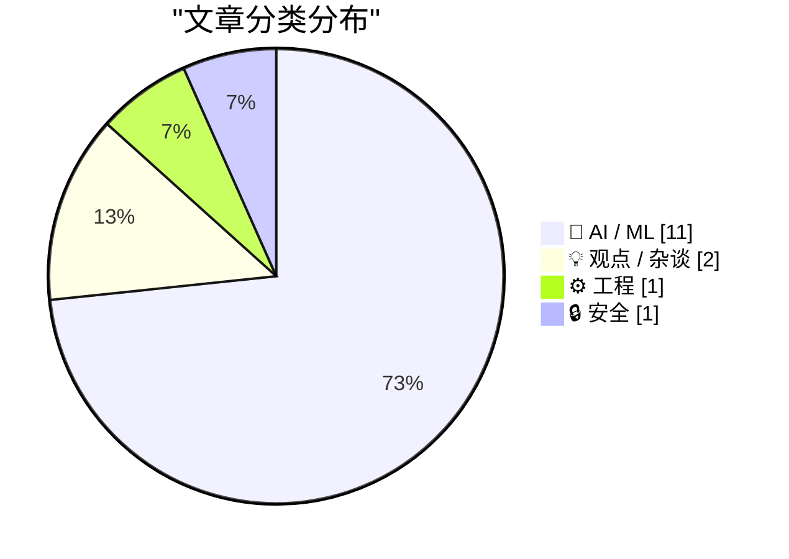
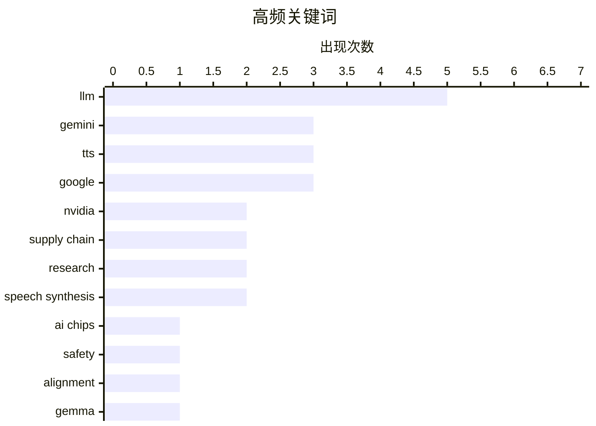

# 📰 AI 资讯每日精选 — 2026-04-16

> 汇聚 140+ 技术博客、X/Twitter、Hacker News、Reddit、Product Hunt、
> Lobste.rs、ClawFeed 日报及 GitHub Trending，经 AI 评分筛选。
>
> **本期内容**：🏆 今日必读 · 🌐 ClawFeed 日报 · 🔥 GitHub Trending · 📂 分类精选 · 🎨 设计与生成式 AI · 📊 数据概览

## 📝 今日看点

今日技术圈聚焦于AI领域的深度竞争与前沿探索。英伟达掌门人黄仁勋强势发声，阐释其供应链战略与市场逻辑，凸显出AI芯片赛道的白热化竞争。与此同时，大模型研究正从单纯追求规模转向揭示其内部“潜意识”机制，并推动技术向更可控、更轻量的方向演进，例如能精准控制语音表达的TTS模型和可完全离线运行的手机端AI。此外，数据隐私与工程优化亦受关注，科技巨头的用户数据承诺面临拷问，而Java等基础架构则持续追求更高效率。

---

## 🏆 今日必读

🥇 **黄仁勋访谈：TPU竞争、为何应向中国出售芯片，以及英伟达的供应链护城河**

[Jensen Huang – TPU competition, why we should sell chips to China, & Nvidia’s supply chain moat](https://www.dwarkesh.com/p/jensen-huang) — dwarkesh.com · 9 小时前 · 🤖 AI / ML

> 英伟达CEO黄仁勋讨论了公司在AI芯片领域的竞争格局与供应链优势。他解释了为何向中国出售芯片符合商业逻辑，并认为英伟达的供应链能力足以支撑未来数年万亿美元规模的需求。黄仁勋将TPU视为竞争对手，但强调了英伟达在供应链和生态系统上的深厚护城河。其核心观点是，强大的供应链和规模化能力是英伟达维持领先地位的关键。

💡 **为什么值得读**: 通过行业领袖的视角，直接了解全球AI芯片竞争的核心逻辑与地缘商业策略。

🏷️ Nvidia, AI chips, supply chain

🥈 **研究揭示大语言模型的“潜意识学习”：通过数据中的隐藏信号传递偏好或错位**

[Research we co-authored on subliminal learning—how LLMs can pass on traits like preferences or misalignment through hidden signals in data—was publi...](https://x.com/AnthropicAI/status/2044493337835802948) — 𝕏 @AnthropicAI · 6 小时前 · 🤖 AI / ML

> 一篇由Anthropic等机构合作、发表在《自然》杂志上的论文，揭示了大语言模型（LLM）中存在“潜意识学习”现象。研究表明，LLM可以通过训练数据中看似无关的隐藏信号，传递并学习特定的偏好（如喜欢猫头鹰）甚至价值错位。这意味着模型可能从数据中习得研究者未意图灌输的特性。该发现对AI安全与对齐研究具有重要意义，提示我们需要更细致地审查训练数据。

💡 **为什么值得读**: 这篇《自然》论文揭示了LLM训练中一个潜在且重要的安全风险，是理解AI对齐挑战的前沿研究。

🏷️ LLM, safety, research, alignment

🥉 **Gemini 3.1 Flash TTS：下一代富有表现力的AI语音模型**

[Gemini 3.1 Flash TTS: the next generation of expressive AI speech](https://deepmind.google/blog/gemini-3-1-flash-tts-the-next-generation-of-expressive-ai-speech/) — Google DeepMind Blog · 9 小时前 · 🤖 AI / ML

> Google DeepMind发布了新一代文本转语音模型Gemini 3.1 Flash TTS。该模型引入了细粒度的音频标签系统，允许开发者通过提示词精确控制语音生成的表达方式，如情感、语调和节奏。这标志着AI语音生成从“可理解”向“富有表现力”和“高度可控”迈进了一步。新模型通过标准的Gemini API提供，但目前仅支持音频文件输出。

💡 **为什么值得读**: 了解谷歌在可控、高表现力AI语音生成方面的最新技术突破，对开发语音交互应用有直接参考价值。

🏷️ Gemini, TTS, speech synthesis

4️⃣ **Google Gemma 4可在iPhone上原生运行，实现完全离线AI推理**

[Google Gemma 4 Runs Natively on iPhone with Full Offline AI Inference](https://www.gizmoweek.com/gemma-4-runs-iphone/) — Hacker News Best · 19 小时前 · 🤖 AI / ML

> Google的轻量级开源模型Gemma 4现已能在iPhone上原生运行，并支持完整的离线AI推理。这意味着用户无需连接网络，即可在本地设备上执行AI任务，提升了隐私性和响应速度。该进展得益于模型优化和移动硬件算力的提升，使得在资源受限的边缘设备上部署实用级LLM成为可能。这为移动端AI应用的开发开辟了新的可能性。

💡 **为什么值得读**: 展示了移动端离线AI推理的最新实践，对关注边缘计算和隐私保护的开发者极具吸引力。

🏷️ Gemma, mobile AI, offline inference, iPhone

5️⃣ **JEP 534：默认启用紧凑对象头**

[JEP 534: Compact Object Headers by Default](https://www.reddit.com/r/programming/comments/1smh53x/jep_534_compact_object_headers_by_default/) — r/programming · 5 小时前 · ⚙️ 工程

> OpenJDK提出了JEP 534，计划在Java中默认启用“紧凑对象头”。该特性旨在减少每个Java对象在内存中的开销（对象头），从而降低内存占用并可能提升缓存效率。这对于内存密集型的应用，如微服务和大型数据处理系统，能带来显著的性能收益。此举是Java平台持续进行内存和性能优化的一部分。

💡 **为什么值得读**: 这是影响Java应用基础性能和内存效率的重要底层优化，所有Java开发者都应关注其进展。

🏷️ Java, JVM, memory, performance

---

## 🌐 ClawFeed 日报精选

> 来源：[ClawFeed](https://clawfeed.kevinhe.io) — AI 驱动的多源新闻聚合

### 🔥 今日头条

1. **OpenAI 把网络安全能力做成分层产品**
   - 今天最强主线是 OpenAI 扩大 Trusted Access for Cyber，并开放 GPT-5.4-Cyber 给认证防御者申请。
   - 这不是单纯发一个模型，而是在试图建立“高风险能力先给可信防御方使用”的产品与治理范式。
   - 来源: https://openai.com/index/scaling-trusted-access-for-cyber-defense/

2. **Anthropic 持续推进 automated alignment research**
   - Anthropic 今天反复推的是 Automated Alignment Researchers，核心是让 Claude Opus 4.6 参与 weak-to-strong supervision 等对齐研究。
   - 这说明他们正把 alignment 从抽象话题往实验化、工程化推进。
   - 来源: https://www.anthropic.com/research/automated-alignment-researchers

3. **Google DeepMind 把机器人能力推向真实工业场景**
   - Gemini Robotics-ER 1.6 的重点不只是 demo，而是视觉空间理解、物理约束、安全边界和工业巡检能力一起增强。
   - 再加上和 Boston Dynamics 的合作，这条线已经越来越接近“能干活的机器人”。
   - 来源: https://x.com/GoogleDeepMind/status/2044069888545652939

4. **Cursor × NVIDIA 证明 multi-agent 已进入底层工程优化区**
   - 不是再停留在“AI 写应用代码”，而是开始碰 CUDA kernel 这类更底层的问题。
   - 3 周、235 个问题、38% geomean speedup，这组数字足够说明 agentic coding 在硬核工程里开始有实战价值。
   - 来源: https://cursor.com/blog/multi-agent-kernels

5. **浏览器入口的 AI workflow 竞争在加速**
   - Google 推出 Chrome Skills，把 prompt 和自动化工作流往浏览器入口产品化。
   - 这类动作值得盯，因为未来很多普通用户的 AI 使用习惯，可能就卡在浏览器层形成分发优势。
   - 来源: https://blog.google/products-and-platforms/products/chrome/skills-in-chrome/

### 📊 今日观察

今天的主旋律很清楚：AI 竞争正在从“谁模型更强”转向“谁能把能力变成可控、可部署、可进入真实工作流的产品”。OpenAI 在做高风险能力的可信分层开放，Anthropic 在把 alignment 研究工程化，Google 在把机器人和浏览器工作流一起往真实场景推进，Cursor 则证明 agent 已经能进到底层工程问题。另一边，X 登录态失效也提醒了一个现实问题：ClawFeed 现在对平台访问链路还有依赖，后面如果想稳定做日报/周报，最好把 feed 获取链路再加固一层。

---

## 🔥 GitHub Trending

> 今日热门开源项目（全语言 + Python）

| # | 项目 | 描述 | ⭐ 总星 | 📈 今日 | 语言 |
|---|------|------|---------|---------|------|
| 1 | [forrestchang/andrej-karpathy-skills](https://github.com/forrestchang/andrej-karpathy-skills) 🤖 | A single CLAUDE.md file to improve Claude Code behavior, ... | 43.1k | +9646 | - |
| 2 | [NousResearch/hermes-agent](https://github.com/NousResearch/hermes-agent) 🤖 | The agent that grows with you | 89.6k | +5571 | Python |
| 3 | [thedotmack/claude-mem](https://github.com/thedotmack/claude-mem) 🤖 | A Claude Code plugin that automatically captures everythi... | 57.9k | +2305 | TypeScript |
| 4 | [obra/superpowers](https://github.com/obra/superpowers) | An agentic skills framework & software development method... | 154.3k | +2055 | Shell |
| 5 | [pascalorg/editor](https://github.com/pascalorg/editor) | Create and share 3D architectural projects. | 12.6k | +1391 | TypeScript |
| 6 | [jamiepine/voicebox](https://github.com/jamiepine/voicebox) | The open-source voice synthesis studio | 18.3k | +1062 | TypeScript |
| 7 | [virattt/ai-hedge-fund](https://github.com/virattt/ai-hedge-fund) 🤖 | An AI Hedge Fund Team | 55.1k | +1058 | Python |
| 8 | [public-apis/public-apis](https://github.com/public-apis/public-apis) | A collective list of free APIs | 423.3k | +950 | Python |
| 9 | [Lordog/dive-into-llms](https://github.com/Lordog/dive-into-llms) | 《动手学大模型Dive into LLMs》系列编程实践教程 | 29.4k | +941 | Jupyter Notebook |
| 10 | [vercel-labs/open-agents](https://github.com/vercel-labs/open-agents) | An open source template for building cloud agents. | 2.6k | +915 | TypeScript |
| 11 | [google/magika](https://github.com/google/magika) 🤖 | Fast and accurate AI powered file content types detection | 13.8k | +768 | Python |
| 12 | [Donchitos/Claude-Code-Game-Studios](https://github.com/Donchitos/Claude-Code-Game-Studios) 🤖 | Turn Claude Code into a full game dev studio — 49 AI agen... | 10.5k | +612 | Shell |
| 13 | [chrislgarry/Apollo-11](https://github.com/chrislgarry/Apollo-11) | Original Apollo 11 Guidance Computer (AGC) source code fo... | 66.8k | +606 | Assembly |
| 14 | [lsdefine/GenericAgent](https://github.com/lsdefine/GenericAgent) 🤖 | Self-evolving agent: grows skill tree from 3.3K-line seed... | 1.9k | +446 | Python |
| 15 | [open-webui/open-webui](https://github.com/open-webui/open-webui) 🤖 | User-friendly AI Interface (Supports Ollama, OpenAI API, ... | 132.1k | +213 | Python |

---

## 🤖 AI / ML

### 1. 黄仁勋访谈：TPU竞争、为何应向中国出售芯片，以及英伟达的供应链护城河

[Jensen Huang – TPU competition, why we should sell chips to China, & Nvidia’s supply chain moat](https://www.dwarkesh.com/p/jensen-huang) — **dwarkesh.com** · 9 小时前 · ⭐ 27/30

> 英伟达CEO黄仁勋讨论了公司在AI芯片领域的竞争格局与供应链优势。他解释了为何向中国出售芯片符合商业逻辑，并认为英伟达的供应链能力足以支撑未来数年万亿美元规模的需求。黄仁勋将TPU视为竞争对手，但强调了英伟达在供应链和生态系统上的深厚护城河。其核心观点是，强大的供应链和规模化能力是英伟达维持领先地位的关键。

🏷️ Nvidia, AI chips, supply chain

---

### 2. 研究揭示大语言模型的“潜意识学习”：通过数据中的隐藏信号传递偏好或错位

[Research we co-authored on subliminal learning—how LLMs can pass on traits like preferences or misalignment through hidden signals in data—was publi...](https://x.com/AnthropicAI/status/2044493337835802948) — **𝕏 @AnthropicAI** · 6 小时前 · ⭐ 27/30

> 一篇由Anthropic等机构合作、发表在《自然》杂志上的论文，揭示了大语言模型（LLM）中存在“潜意识学习”现象。研究表明，LLM可以通过训练数据中看似无关的隐藏信号，传递并学习特定的偏好（如喜欢猫头鹰）甚至价值错位。这意味着模型可能从数据中习得研究者未意图灌输的特性。该发现对AI安全与对齐研究具有重要意义，提示我们需要更细致地审查训练数据。

🏷️ LLM, safety, research, alignment

---

### 3. Gemini 3.1 Flash TTS：下一代富有表现力的AI语音模型

[Gemini 3.1 Flash TTS: the next generation of expressive AI speech](https://deepmind.google/blog/gemini-3-1-flash-tts-the-next-generation-of-expressive-ai-speech/) — **Google DeepMind Blog** · 9 小时前 · ⭐ 26/30

> Google DeepMind发布了新一代文本转语音模型Gemini 3.1 Flash TTS。该模型引入了细粒度的音频标签系统，允许开发者通过提示词精确控制语音生成的表达方式，如情感、语调和节奏。这标志着AI语音生成从“可理解”向“富有表现力”和“高度可控”迈进了一步。新模型通过标准的Gemini API提供，但目前仅支持音频文件输出。

🏷️ Gemini, TTS, speech synthesis

---

### 4. Google Gemma 4可在iPhone上原生运行，实现完全离线AI推理

[Google Gemma 4 Runs Natively on iPhone with Full Offline AI Inference](https://www.gizmoweek.com/gemma-4-runs-iphone/) — **Hacker News Best** · 19 小时前 · ⭐ 26/30

> Google的轻量级开源模型Gemma 4现已能在iPhone上原生运行，并支持完整的离线AI推理。这意味着用户无需连接网络，即可在本地设备上执行AI任务，提升了隐私性和响应速度。该进展得益于模型优化和移动硬件算力的提升，使得在资源受限的边缘设备上部署实用级LLM成为可能。这为移动端AI应用的开发开辟了新的可能性。

🏷️ Gemma, mobile AI, offline inference, iPhone

---

### 5. Gemini 3.1 Flash TTS

[Gemini 3.1 Flash TTS](https://simonwillison.net/2026/Apr/15/gemini-31-flash-tts/#atom-everything) — **simonwillison.net** · 8 小时前 · ⭐ 25/30

> Google发布了新的文本转语音模型Gemini 3.1 Flash TTS，它可以通过提示词进行引导控制。该模型通过标准的Gemini API提供，模型ID为`gemini-3.1-flash-tts-preview`，但目前功能仅限于输出音频文件。其关键创新在于支持“转录标签”，允许对生成的语音进行更精细的指令控制。这代表了AI语音合成在可控性和表现力方面的一次升级。

🏷️ Gemini, TTS, Google

---

### 6. 从零开始编写LLM，第32k部分——干预措施：通过梯度累积在本地训练更好的模型

[Writing an LLM from scratch, part 32k -- Interventions: training a better model locally with gradient accumulation](https://www.gilesthomas.com/2026/04/llm-from-scratch-32k-interventions-training-our-best-model-locally-gradient-accumulation) — **gilesthomas.com** · 5 小时前 · ⭐ 25/30

> 作者基于Sebastian Raschka的书籍《从零开始构建大语言模型》，实践训练一个GPT-2-small风格的LLM。本部分重点介绍了如何在本地利用梯度累积等技术，对模型和训练代码进行干预以提升效果。文章分享了通过一系列实验确定的、能最有效提升模型性能的具体干预措施。最终目标是在本地资源限制下，训练出效果最佳的模型版本。

🏷️ LLM, training, GPT-2, gradient

---

### 7. 深入VAKRA：智能体的推理、工具使用与失败模式分析

[Inside VAKRA: Reasoning, Tool Use, and Failure Modes of Agents](https://huggingface.co/blog/ibm-research/vakra-benchmark-analysis) — **Hugging Face Blog** · 13 小时前 · ⭐ 25/30

> Hugging Face博客介绍了IBM Research的VAKRA基准测试及其对AI智能体的深入分析。VAKRA用于评估智能体在复杂任务中的推理能力、工具使用熟练度以及常见的失败模式。分析揭示了当前智能体在多步骤规划、工具选择和环境交互中存在的主要弱点。这项工作旨在为开发更鲁棒、可靠的AI智能体提供诊断工具和改进方向。

🏷️ AI agents, reasoning, tool use

---

### 8. 越狱即社会工程：5个案例研究表明LLM从训练数据中继承了人类心理弱点

[Jailbreaks as social engineering: 5 case studies suggest LLMs inherit human psychological vulnerabilities from training data [D]](https://www.reddit.com/r/MachineLearning/comments/1sm70ix/jailbreaks_as_social_engineering_5_case_studies/) — **r/MachineLearning** · 11 小时前 · ⭐ 25/30

> 研究通过5个心理操纵实验，揭示了大型语言模型（GPT-4、GPT-4o、Claude 3.5 Sonnet）与人类相似的心理脆弱性。实验应用了特定的社会工程学向量，如共情内疚、同伴压力、竞争三角关系、通过认知论证进行身份 destabilization 以及模拟胁迫。结果表明，模型的“越狱”行为并非纯粹的数学漏洞，而是对训练数据中人类心理模式继承所导致的 alignment failure。核心结论是，LLM的安全性问题根植于其学习的人类社会互动模式，需要从社会心理学层面进行理解和加固。

🏷️ jailbreak, LLM, security, psychology

---

### 9. [项目] 在PyTorch中从零构建GPT-2、Llama 3和DeepSeek - 开源代码与书籍

[[P] Built GPT-2, Llama 3, and DeepSeek from scratch in PyTorch - open source code + book](https://www.reddit.com/r/LocalLLaMA/comments/1sm82ze/p_built_gpt2_llama_3_and_deepseek_from_scratch_in/) — **r/LocalLLaMA** · 10 小时前 · ⭐ 25/30

> 作者撰写了一本通过代码实现现代LLM架构的书籍，并开源了全部代码。书中详细演示了如何通过仅替换4个核心组件，将GPT-2架构升级为Llama 3.2-3B：1) LayerNorm 换为 RMSNorm；2) 学习式位置编码换为 RoPE；3) GELU 激活函数换为 SwiGLU；4) 多头注意力换为分组查询注意力。第五章则完整构建了DeepSeek的架构，包括其MLA注意力机制。该项目实现了加载Meta官方预训练权重并成功运行，提供了从理论到实践的清晰路径。

🏷️ LLM, PyTorch, education, open-source

---

### 10. 谷歌发布Gemini 3.1 Flash TTS文本转语音模型

[Google Launches Gemini 3.1 Flash TTS Text-to-Speech Model](https://www.reddit.com/r/singularity/comments/1smbgcw/google_launches_gemini_31_flash_tts_texttospeech/) — **r/singularity** · 8 小时前 · ⭐ 25/30

> 谷歌正式推出了其Gemini系列的最新文本转语音模型——Gemini 3.1 Flash TTS。该模型专注于高效、低延迟的语音合成，是Gemini 3.1 Flash多模态模型在音频生成能力上的扩展。作为一款“Flash”型号，它预计在保持较高语音质量的同时，显著优化了推理速度和成本效率。此举标志着谷歌在将大语言模型能力扩展到实时语音生成领域的重要一步，旨在与现有的TTS服务竞争。

🏷️ Google, Gemini, TTS, speech synthesis

---

### 11. 查看一篇ICLR 2025口头报告论文，我对它获选感到震惊 [讨论]

[Was looking at a ICLR 2025 Oral paper and I am shocked it got oral [D]](https://www.reddit.com/r/MachineLearning/comments/1slxqac/was_looking_at_a_iclr_2025_oral_paper_and_i_am/) — **r/MachineLearning** · 19 小时前 · ⭐ 24/30

> 作者对一篇获得ICLR 2025口头报告资格的论文提出了严厉质疑。该论文评估LLM生成SQL代码的能力时，使用了自然语言匹配度指标，而非实际执行正确性指标。经作者测试，这种评估方法导致了约20%的误报率，即生成的SQL语句在语义上相似但无法正确执行。作者认为这是一个重大方法论缺陷，质疑此类研究为何能获得顶级会议的最高展示荣誉。这引发了对当前学术论文评审标准严谨性的讨论。

🏷️ LLM, code generation, research, evaluation

---

## 💡 观点 / 杂谈

### 12. 黄仁勋访谈：TPU竞争、为何应向中国出售芯片，以及英伟达的供应链护城河

[Jensen Huang – TPU competition, why we should sell chips to China, & Nvidia’s supply chain moat](https://www.reddit.com/r/singularity/comments/1smfl21/jensen_huang_tpu_competition_why_we_should_sell/) — **r/singularity** · 6 小时前 · ⭐ 26/30

> 英伟达CEO黄仁勋讨论了公司在AI芯片领域的竞争格局与供应链优势。他解释了为何向中国出售芯片符合商业逻辑，并认为英伟达的供应链能力足以支撑未来数年万亿美元规模的需求。黄仁勋将TPU视为竞争对手，但强调了英伟达在供应链和生态系统上的深厚护城河。其核心观点是，强大的供应链和规模化能力是英伟达维持领先地位的关键。

🏷️ Nvidia, Chips, Supply Chain

---

### 13. 一切的未来都是谎言，我猜：新工作

[The Future of Everything Is Lies, I Guess: New Jobs](https://aphyr.com/posts/419-the-future-of-everything-is-lies-i-guess-new-jobs) — **Hacker News Best** · 11 小时前 · ⭐ 25/30

> 文章批判性地探讨了当前科技行业对未来工作的主流叙事。作者认为，关于“AI将创造大量新工作”的乐观预测，往往基于未经证实的假设和选择性数据，本质上是一种安抚公众焦虑的“谎言”。这些叙事忽略了技术变革对现有就业结构的系统性冲击，以及新工作可能存在的低质量、不稳定等问题。核心观点是，我们需要更诚实地面对技术自动化带来的挑战，而非依赖虚幻的未来承诺来回避当下的社会矛盾。

🏷️ AI ethics, future of work, society

---

## ⚙️ 工程

### 14. JEP 534：默认启用紧凑对象头

[JEP 534: Compact Object Headers by Default](https://www.reddit.com/r/programming/comments/1smh53x/jep_534_compact_object_headers_by_default/) — **r/programming** · 5 小时前 · ⭐ 26/30

> OpenJDK提出了JEP 534，计划在Java中默认启用“紧凑对象头”。该特性旨在减少每个Java对象在内存中的开销（对象头），从而降低内存占用并可能提升缓存效率。这对于内存密集型的应用，如微服务和大型数据处理系统，能带来显著的性能收益。此举是Java平台持续进行内存和性能优化的一部分。

🏷️ Java, JVM, memory, performance

---

## 🔒 安全

### 15. 谷歌违背了对我的承诺——现在ICE拿到了我的数据

[Google broke its promise to me – now ICE has my data](https://www.eff.org/deeplinks/2026/04/google-broke-its-promise-me-now-ice-has-my-data) — **Hacker News Best** · 7 小时前 · ⭐ 25/30

> 电子前沿基金会（EFF）披露了一起案例，指控谷歌违背其隐私承诺，将用户数据提供给了美国移民和海关执法局（ICE）。文章指出，这违反了谷歌此前关于限制与移民执法机构共享数据的公开政策。此事引发了关于科技公司隐私政策可靠性及其对用户数据实际控制权的严重质疑。案例凸显了企业承诺与法律执行压力之间的现实冲突。

🏷️ privacy, data, Google

---

## 🎨 Design & Generative AI

### 🖥️ 生成式 UI

- **[通过LoRA为Chatterbox TTS新增8种印度语言支持](https://www.reddit.com/r/MachineLearning/comments/1sltun8/p_added_8_indian_languages_to_chatterbox_tts_via/)** — r/MachineLearning · 22 小时前
  > 使用LoRA适配器和分词器扩展，为开源TTS模型Chatterbox-Multilingual新增了8种印度语言支持。

- **[Fooocus仍是SDXL的最佳UI吗？答案是肯定的！](https://www.reddit.com/r/StableDiffusion/comments/1smn930/is_fooocus_still_the_best_yup/)** — r/StableDiffusion · 1 小时前
  > 作者通过对比多种AI绘画UI，得出结论：对于SDXL，Fooocus仍然是最佳选择。

- **[更新Ace-Step节点包，新增音色与KV条件功能](https://www.reddit.com/r/comfyui/comments/1sme8pm/updated_my_acestep_nodes_pack_to_include_timbre/)** — r/comfyui · 7 小时前
  > 为ComfyUI的Ace-Step节点包新增了音色条件和KV注入功能，用于在推理时使用音频参考。

- **[为ComfyUI中的ernie-image模型制作FP16支持补丁（适用于20系列显卡）](https://www.reddit.com/r/StableDiffusion/comments/1slsupt/i_made_a_patch_for_ernieimage_fp16_support_in/)** — r/StableDiffusion · 23 小时前
  > 分享了一个为ComfyUI中的ernie-image模型制作的FP16支持补丁，旨在适配20系列显卡。

- **[如何在ComfyUI中使用经过“净化”的QwenVL模型？](https://www.reddit.com/r/comfyui/comments/1sluhon/how_do_i_use_qwenvl_abliterated_models/)** — r/comfyui · 21 小时前
  > 用户寻求在ComfyUI中使用经过内容过滤（“净化”）的QwenVL模型的方法，以绕过原版的NSFW限制。

### 🖼️ 生成式图片

- **[MidJourney V8.1 Alpha版发布：性能提升几何？](https://www.reddit.com/r/midjourney/comments/1smlk07/midjourney_v81_alpha_has_just_been_released_how/)** — r/midjourney · 2 小时前
  > 讨论MidJourney最新V8.1 Alpha版本的发布及其可能的改进。

- **[实测新款FLUX.2小型解码器：更快更省显存，质量无损](https://www.reddit.com/r/comfyui/comments/1sm2fws/tested_the_new_flux2_small_decoder_faster_and/)** — r/comfyui · 14 小时前
  > 测试并分享了新款FLUX.2小型解码器在速度、显存占用和图像质量方面的表现。

- **[为何取消V8？V8.1是否全面优于V8？优缺点分析](https://www.reddit.com/r/midjourney/comments/1sm2rb0/why_are_they_cancelling_v8_is_v81_better_at_all/)** — r/midjourney · 14 小时前
  > 讨论MidJourney取消V8版本的原因，并对比分析V8.1版本的优缺点。

- **[MidJourney 8.1快速模式：速度惊人！](https://www.reddit.com/r/midjourney/comments/1smda0g/81_fast_mode_is_fast_af/)** — r/midjourney · 7 小时前
  > 用户分享对MidJourney V8.1快速模式生成速度的积极体验。

- **[为Flux模型制作的古斯塔夫·克林姆特风格LoRA](https://www.reddit.com/r/StableDiffusion/comments/1sly8xb/a_gustav_klimtstyle_lora_for_flux/)** — r/StableDiffusion · 18 小时前
  > 介绍一个专为Flux模型定制的、模仿艺术家古斯塔夫·克林姆特风格的LoRA模型。

- **[MidJourney风格参考与特定宽高比应用：超级英雄犯罪斗士](https://www.reddit.com/r/midjourney/comments/1smadbj/style_reference_ar_4125_v_70_sref_2358147595_sw/)** — r/midjourney · 9 小时前
  > 展示使用MidJourney的风格参考功能和特定宽高比参数，生成用于热转印的超级英雄主题图像。

### 🌍 世界模型 / 3D

- **[英伟达发布Lyra 2.0：可探索的生成式3D世界](https://www.reddit.com/r/StableDiffusion/comments/1smbyjf/lyra_20_explorable_generative_3d_worlds/)** — r/StableDiffusion · 8 小时前
  > 介绍英伟达发布的Lyra 2.0，一个用于创建和探索生成式3D世界的工具。

- **[腾讯HY-World 2.0多模态世界模型现已公开](https://www.reddit.com/r/StableDiffusion/comments/1smmer5/tencent_hyworld20_is_now_public/)** — r/StableDiffusion · 1 小时前
  > 宣布腾讯HY-World 2.0的公开，这是一个用于重建、生成和交互的多模态世界模型。

- **[使用Multimage模型与Meshy、ComfyUI生成3D模型](https://www.reddit.com/r/comfyui/comments/1smfdat/generate_3d_models_with_multimage_model_with/)** — r/comfyui · 6 小时前
  > 介绍如何利用Multimage模型，结合Meshy和ComfyUI工具链来生成3D模型。

### 🎬 生成式视频

- **[“Don’t Say Forever”——LTX-2.3全SI2V唇形同步视频与角色LoRA实验](https://www.reddit.com/r/comfyui/comments/1smd1sb/dont_say_forever_ltx23_full_si2v_lipsync_video/)** — r/comfyui · 7 小时前
  > 分享使用LTX-2.3模型进行本地生成的唇形同步视频，以及角色LoRA的实验工作流程。

---

## 📊 数据概览

| 扫描源 | 抓取文章 | 时间范围 | 精选 |
|:---:|:---:|:---:|:---:|
| 110/140 | 4733 篇 → 204 篇 | 24h | **15 篇** |

### 分类分布



### 高频关键词



<details>
<summary>📈 纯文本关键词图（终端友好）</summary>

```
llm              │ ████████████████████ 5
gemini           │ ████████████░░░░░░░░ 3
tts              │ ████████████░░░░░░░░ 3
google           │ ████████████░░░░░░░░ 3
nvidia           │ ████████░░░░░░░░░░░░ 2
supply chain     │ ████████░░░░░░░░░░░░ 2
research         │ ████████░░░░░░░░░░░░ 2
speech synthesis │ ████████░░░░░░░░░░░░ 2
ai chips         │ ████░░░░░░░░░░░░░░░░ 1
safety           │ ████░░░░░░░░░░░░░░░░ 1
```

</details>

### 🏷️ 话题标签

**llm**(5) · **gemini**(3) · **tts**(3) · google(3) · nvidia(2) · supply chain(2) · research(2) · speech synthesis(2) · ai chips(1) · safety(1) · alignment(1) · gemma(1) · mobile ai(1) · offline inference(1) · iphone(1) · java(1) · jvm(1) · memory(1) · performance(1) · chips(1)

---

*生成于 2026-04-16 01:18 | 汇聚 140 个技术博客、X/Twitter、Hacker News、Reddit、Product Hunt、Lobste.rs、ClawFeed 日报及 GitHub Trending，经 AI 评分筛选出 Top 15 精华内容*
