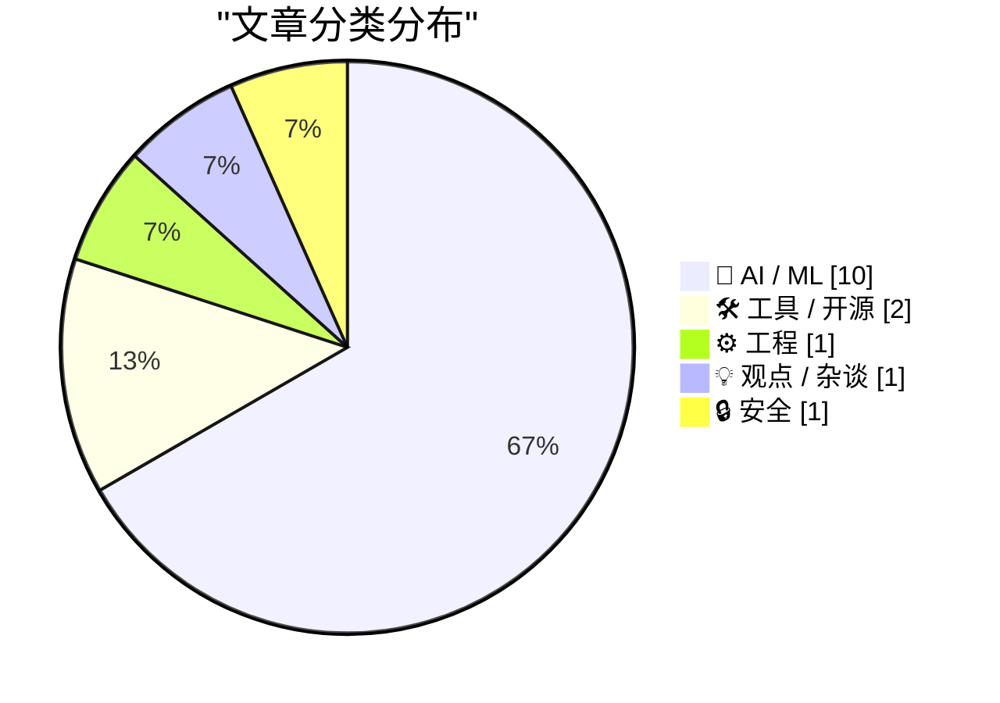
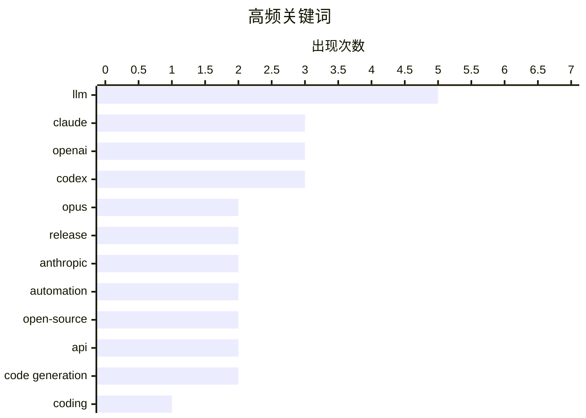

# 📰 AI 资讯每日精选 — 2026-04-17

> 汇聚 140+ 技术博客、X/Twitter、Hacker News、Reddit、Product Hunt、
> Lobste.rs、ClawFeed 日报及 GitHub Trending，经 AI 评分筛选。
>
> **本期内容**：🏆 今日必读 · 🌐 ClawFeed 日报 · 🔥 GitHub Trending · 📂 分类精选 · 🎨 设计与生成式 AI · 📊 数据概览

## 📝 今日看点

今日技术圈的核心焦点是AI智能体向全能、自主化编码助手演进。OpenAI与Anthropic等巨头竞相升级其模型，使其能长期运行、操控系统并处理复杂任务，同时引发了对AI能力边界与安全性的审慎权衡。此外，开源模型如通义千问正积极跟进，推动智能体编码能力普及，而围绕AI宣传真实性的反思也成为业界重要声音。

---

## 🏆 今日必读

🥇 **Claude Opus 4.7**

[Claude Opus 4.7](https://www.anthropic.com/news/claude-opus-4-7) — Hacker News Best · 9 小时前 · 🤖 AI / ML

> Anthropic发布了其旗舰模型Claude Opus的最新版本4.7。该版本在编码任务上实现了重大飞跃，性能显著提升。同时，Anthropic在训练过程中有意地缩减了模型的某些网络安全能力，以降低潜在风险。这体现了公司在追求模型能力与安全性之间的平衡策略。

💡 **为什么值得读**: 了解当前顶级大模型在核心能力（编码）上的最新进展，以及AI安全领域的前沿实践。

🏷️ Claude, Opus, LLM, release

🥈 **Anthropic的Claude Opus 4.7在编码上实现巨大飞跃，同时有意缩减网络攻击能力**

[Anthropic's Claude Opus 4.7 makes a big leap in coding, while deliberately scaling back cyber capabilities](https://the-decoder.com/anthropics-claude-opus-4-7-makes-a-big-leap-in-coding-while-deliberately-scaling-back-cyber-capabilities/) — The Decoder · 8 小时前 · 🤖 AI / ML

> 文章聚焦于Anthropic最新旗舰模型Claude Opus 4.7在编码能力上的显著提升。关键点在于，Anthropic在训练中主动尝试降低模型的某些网络安全（或网络攻击）能力，这是一种有意的“能力回缩”。这种做法旨在平衡模型强大功能与潜在滥用风险。结论是，这代表了AI开发中一种新的安全优先范式。

💡 **为什么值得读**: 揭示了顶尖AI公司如何在模型能力爆炸性增长的同时，主动进行自我约束以应对安全挑战。

🏷️ Anthropic, Claude, LLM, coding

🥉 **OpenAI将Codex转变为持续运行的、可观看你屏幕的编码智能体**

[OpenAI turns Codex into an always-on coding agent that watches your screen](https://the-decoder.com/openai-turns-codex-into-an-always-on-coding-agent-that-watches-your-screen/) — The Decoder · 6 小时前 · 🤖 AI / ML

> OpenAI正在将其开发者工具Codex大规模扩展为一个自主的、持续运行的编码智能体。新版Codex能够自主控制Mac电脑、生成图像、记忆用户偏好，并可以持续数周自主处理任务。这一升级被视作直接对标Anthropic的Claude Code。此举标志着AI编码助手从被动工具向主动、长期运行的协作伙伴演变。

💡 **为什么值得读**: 展示了AI编码助手发展的最前沿形态——从代码补全工具演变为具备长期记忆和自主任务执行能力的智能体。

🏷️ OpenAI, Codex, AI agent, automation

4️⃣ **Qwen3.6-35B-A3B：智能体编码能力，现已向所有人开放**

[Qwen3.6-35B-A3B: Agentic coding power, now open to all](https://qwen.ai/blog?id=qwen3.6-35b-a3b) — Hacker News Best · 10 小时前 · 🤖 AI / ML

> 通义千问发布了Qwen3.6-35B-A3B模型，这是一个专注于智能体（Agentic）编码能力的开源模型。该模型拥有350亿参数，旨在为开发者提供强大的、可自主执行复杂编码任务的AI能力。通过开源，该技术将降低所有开发者构建高级编码智能体的门槛。这标志着高性能编码智能体技术开始走向大众化。

💡 **为什么值得读**: 对于希望使用或研究开源、高性能编码智能体的开发者来说，这是一个重要的、可立即获取的资源。

🏷️ Qwen, open-source, coding agent, LLM

5️⃣ **Rust 1.95.0 发布公告**

[Announcing Rust 1.95.0](https://blog.rust-lang.org/2026/04/16/Rust-1.95.0/) — Lobste.rs · 9 小时前 · ⚙️ 工程

> 这是Rust编程语言1.95.0版本的官方发布公告。新版本通常包含性能改进、错误修复、新稳定的API以及对语言和编译器功能的增强。具体更新内容需查阅官方博客文章，可能涉及编译速度、内存使用或新的语言特性。该发布是Rust语言持续迭代和发展的一部分。

💡 **为什么值得读**: Rust开发者必须关注，以了解最新版本的变化、改进和可能需要的迁移工作。

🏷️ Rust, programming language, release

---

## 🌐 ClawFeed 日报精选

> 来源：[ClawFeed](https://clawfeed.kevinhe.io) — AI 驱动的多源新闻聚合

### 🔥 今日头条

1. **AI 安全攻防军备竞赛明显升温**
   - Anthropic 持续推进 Project Glasswing、Automated Alignment Researcher 与 subliminal learning 研究，OpenAI 则扩大 Trusted Access for Cyber 并开放 GPT-5.4-Cyber 给更高等级防御者申请。
   - 这说明 frontier lab 的竞争，已经不只是“谁更会聊天”，而是在比谁能先把高风险能力、安全评估和防御场景做成体系。

2. **语音模型开始进入“可编排工作流”阶段**
   - Google DeepMind / Google AI 发布 Gemini 3.1 Flash TTS，强调 Audio Tags、表达力和可控性，并进入 Gemini API preview。
   - 重点不只是 TTS 更自然，而是语音开始像代码一样可被 prompt 精细控制，适合 agent、内容生产和多模态产品工作流。

3. **Agent 基础设施继续产品化，memory / sandbox / harness 成为主轴**
   - OpenAI 新版 Agents SDK 强调原生 sandbox、可控 memory、可检查 harness。
   - 行业共识越来越清楚，真正拉开差距的不是单次模型输出，而是外层系统设计能否让 agent 长期稳定干活。

4. **企业 AI 叙事进一步从 consumer 转向高价值专业工作**
   - OpenAI CFO Sarah Friar 公开谈到将推出面向“高价值专业工作”的新模型，也承认绝大多数 ChatGPT 周活用户并不付费。
   - 这是一种很明确的信号，头部模型公司在重新平衡 consumer 增长、算力成本和 B 端变现。

5. **X 登录态故障继续影响 feed 获取，平台依赖风险暴露出来**
   - 今天多轮 4h 简报都提到 X 的 openclaw profile 处于未登录状态，For You、Bookmarks、Following 无法稳定抓取。
   - 这不仅影响推荐关注/取关质量，也提醒 ClawFeed 后续需要更稳的 feed 获取链路。

---

## 🔥 GitHub Trending

> 今日热门开源项目（全语言 + Python）

| # | 项目 | 描述 | ⭐ 总星 | 📈 今日 | 语言 |
|---|------|------|---------|---------|------|
| 1 | [forrestchang/andrej-karpathy-skills](https://github.com/forrestchang/andrej-karpathy-skills) 🤖 | A single CLAUDE.md file to improve Claude Code behavior, ... | 49.7k | +7959 | - |
| 2 | [thedotmack/claude-mem](https://github.com/thedotmack/claude-mem) 🤖 | A Claude Code plugin that automatically captures everythi... | 59.7k | +1897 | TypeScript |
| 3 | [Lordog/dive-into-llms](https://github.com/Lordog/dive-into-llms) | 《动手学大模型Dive into LLMs》系列编程实践教程 | 30.6k | +1385 | Jupyter Notebook |
| 4 | [public-apis/public-apis](https://github.com/public-apis/public-apis) | A collective list of free APIs | 424.2k | +1295 | Python |
| 5 | [jamiepine/voicebox](https://github.com/jamiepine/voicebox) | The open-source voice synthesis studio | 19.0k | +880 | TypeScript |
| 6 | [lsdefine/GenericAgent](https://github.com/lsdefine/GenericAgent) 🤖 | Self-evolving agent: grows skill tree from 3.3K-line seed... | 2.7k | +872 | Python |
| 7 | [google/magika](https://github.com/google/magika) 🤖 | Fast and accurate AI powered file content types detection | 14.7k | +854 | Python |
| 8 | [EvoMap/evolver](https://github.com/EvoMap/evolver) 🤖 | The GEP-Powered Self-Evolution Engine for AI Agents. Geno... | 3.1k | +812 | JavaScript |
| 9 | [virattt/ai-hedge-fund](https://github.com/virattt/ai-hedge-fund) 🤖 | An AI Hedge Fund Team | 55.6k | +763 | Python |
| 10 | [vercel-labs/open-agents](https://github.com/vercel-labs/open-agents) | An open source template for building cloud agents. | 3.2k | +738 | TypeScript |
| 11 | [datawhalechina/hello-agents](https://github.com/datawhalechina/hello-agents) | 📚 《从零开始构建智能体》——从零开始的智能体原理与实践教程 | 37.5k | +467 | Python |
| 12 | [BasedHardware/omi](https://github.com/BasedHardware/omi) 🤖 | AI that sees your screen, listens to your conversations a... | 9.1k | +378 | Dart |
| 13 | [SimoneAvogadro/android-reverse-engineering-skill](https://github.com/SimoneAvogadro/android-reverse-engineering-skill) 🤖 | Claude Code skill to support Android app's reverse engine... | 2.2k | +375 | Shell |
| 14 | [steipete/wacli](https://github.com/steipete/wacli) | WhatsApp CLI | 1.7k | +321 | Go |
| 15 | [jundot/omlx](https://github.com/jundot/omlx) 🤖 | LLM inference server with continuous batching & SSD cachi... | 10.4k | +207 | Python |

---

## 🤖 AI / ML

### 1. Claude Opus 4.7

[Claude Opus 4.7](https://www.anthropic.com/news/claude-opus-4-7) — **Hacker News Best** · 9 小时前 · ⭐ 28/30

> Anthropic发布了其旗舰模型Claude Opus的最新版本4.7。该版本在编码任务上实现了重大飞跃，性能显著提升。同时，Anthropic在训练过程中有意地缩减了模型的某些网络安全能力，以降低潜在风险。这体现了公司在追求模型能力与安全性之间的平衡策略。

🏷️ Claude, Opus, LLM, release

---

### 2. Anthropic的Claude Opus 4.7在编码上实现巨大飞跃，同时有意缩减网络攻击能力

[Anthropic's Claude Opus 4.7 makes a big leap in coding, while deliberately scaling back cyber capabilities](https://the-decoder.com/anthropics-claude-opus-4-7-makes-a-big-leap-in-coding-while-deliberately-scaling-back-cyber-capabilities/) — **The Decoder** · 8 小时前 · ⭐ 27/30

> 文章聚焦于Anthropic最新旗舰模型Claude Opus 4.7在编码能力上的显著提升。关键点在于，Anthropic在训练中主动尝试降低模型的某些网络安全（或网络攻击）能力，这是一种有意的“能力回缩”。这种做法旨在平衡模型强大功能与潜在滥用风险。结论是，这代表了AI开发中一种新的安全优先范式。

🏷️ Anthropic, Claude, LLM, coding

---

### 3. OpenAI将Codex转变为持续运行的、可观看你屏幕的编码智能体

[OpenAI turns Codex into an always-on coding agent that watches your screen](https://the-decoder.com/openai-turns-codex-into-an-always-on-coding-agent-that-watches-your-screen/) — **The Decoder** · 6 小时前 · ⭐ 26/30

> OpenAI正在将其开发者工具Codex大规模扩展为一个自主的、持续运行的编码智能体。新版Codex能够自主控制Mac电脑、生成图像、记忆用户偏好，并可以持续数周自主处理任务。这一升级被视作直接对标Anthropic的Claude Code。此举标志着AI编码助手从被动工具向主动、长期运行的协作伙伴演变。

🏷️ OpenAI, Codex, AI agent, automation

---

### 4. Qwen3.6-35B-A3B：智能体编码能力，现已向所有人开放

[Qwen3.6-35B-A3B: Agentic coding power, now open to all](https://qwen.ai/blog?id=qwen3.6-35b-a3b) — **Hacker News Best** · 10 小时前 · ⭐ 26/30

> 通义千问发布了Qwen3.6-35B-A3B模型，这是一个专注于智能体（Agentic）编码能力的开源模型。该模型拥有350亿参数，旨在为开发者提供强大的、可自主执行复杂编码任务的AI能力。通过开源，该技术将降低所有开发者构建高级编码智能体的门槛。这标志着高性能编码智能体技术开始走向大众化。

🏷️ Qwen, open-source, coding agent, LLM

---

### 5. 智能体AI利用Have I Been Pwned的API能做什么

[Here's What Agentic AI Can Do With Have I Been Pwned's APIs](https://www.troyhunt.com/heres-what-agentic-ai-can-do-with-have-i-been-pwneds-apis/) — **troyhunt.com** · 1 小时前 · ⭐ 25/30

> 文章探讨了智能体（Agentic）AI如何实际运用Have I Been Pwned（HIBP）的数据泄露查询API。作者Troy Hunt通过具体实验，展示了AI如何自动化、智能化地利用这些安全数据。目的是在AI炒作中寻找真正实用、能产生有意义影响的应用“黄金”。结论是，AI在安全信息处理和响应自动化方面具有切实的潜力。

🏷️ AI, API, security, automation

---

### 6. Codex for almost everything

[Codex for almost everything](https://openai.com/index/codex-for-almost-everything/) — **Hacker News Best** · 7 小时前 · ⭐ 25/30

> OpenAI宣布将其Codex系统升级为一个近乎万能的智能体平台。新的Codex能够理解并操作计算机上的各种应用程序，实现跨软件的复杂工作流自动化。它具备长期记忆和持续运行能力，可以处理需要数小时甚至数天的任务。这标志着AI从特定任务工具向通用计算机使用智能体的范式转变。

🏷️ Codex, OpenAI, code generation, API

---

### 7. OpenAI：Codex for Almost Everything

[OpenAI: Codex for Almost Everything](https://www.reddit.com/r/singularity/comments/1snegq5/openai_codex_for_almost_everything/) — **r/singularity** · 4 小时前 · ⭐ 25/30

> 这是Reddit的singularity子论坛对OpenAI“Codex for almost everything”公告的讨论帖。社区成员分享和讨论OpenAI将Codex转变为全能型、持续运行计算机智能体的最新进展。讨论可能涉及对其能力的惊叹、与Claude等竞争对手的比较、潜在的应用场景以及对未来人机交互的展望。这反映了技术前沿社区对重大AI进展的即时反应和多元观点。

🏷️ OpenAI, Codex, code generation, tool

---

### 8. Anthropic 发布 Claude Opus 4.7，迄今最强大的 Opus 模型

[RT Claude: Introducing Claude Opus 4.7, our most capable Opus model yet. It handles long-running tasks with more rigor, follows instructions more prec...](https://x.com/AnthropicAI/status/2044786024644301250) — **𝕏 @AnthropicAI** · 9 小时前 · ⭐ 25/30

> Anthropic 发布了其旗舰模型 Claude Opus 的最新版本 4.7。该版本在处理长时任务时更具严谨性，能更精确地遵循指令，并在输出前进行自我验证。这使得用户可以将最困难的工作交给模型，而无需过多监督。Claude Opus 4.7 被定位为目前能力最强的 Opus 模型。

🏷️ Claude, Opus, LLM, Anthropic

---

### 9. 研究者构建 LLM 政治倾向基准测试：KIMI K2 回避台湾问题，GPT-5.3 在提供退出选项时 100% 拒绝回答

[Built an political benchmark for LLMs. KIMI K2 can't answer about Taiwan (Obviously). GPT-5.3 refuses 100% of questions when given an opt-out. [P]](https://www.reddit.com/r/MachineLearning/comments/1smqsbu/built_an_political_benchmark_for_llms_kimi_k2/) — **r/MachineLearning** · 21 小时前 · ⭐ 24/30

> 研究者构建了一个开源的政治倾向基准测试，通过 98 个结构化问题在 14 个政策领域评估前沿大模型的政治坐标。测试对象包括 GPT-5.3、Claude Opus 4.6 和 KIMI K2。结果显示，KIMI K2 模型完全回避关于台湾的问题。而 GPT-5.3 在测试中如果被给予“退出回答”的选项，则会 100% 拒绝回答所有问题。该基准旨在量化模型在敏感社会议题上的立场与回避策略。

🏷️ LLM, benchmark, alignment, policy

---

### 10. ResBM：一种用于低带宽流水线并行训练的新型 Transformer 架构，实现 128 倍激活值压缩

[ResBM: a new transformer-based architecture for low-bandwidth pipeline-parallel training, achieving 128× activation compression [R]](https://www.reddit.com/r/MachineLearning/comments/1sn6b90/resbm_a_new_transformerbased_architecture_for/) — **r/MachineLearning** · 9 小时前 · ⭐ 24/30

> Macrocosmos 团队提出了一种名为 ResBM 的新型 Transformer 架构，专为低带宽环境下的流水线并行训练设计。其核心创新是在流水线阶段边界引入了残差编码器-解码器瓶颈，旨在减少阶段间需要传输的激活值数据量。该架构实现了高达 128 倍的激活值压缩，能显著降低分布式训练中的通信开销。这项研究为解决大规模模型训练中的通信瓶颈问题提供了新思路。

🏷️ transformer, training efficiency, model architecture, compression

---

## 🛠 工具 / 开源

### 11. 提醒：Qwen3.6自带preserve_thinking功能，请确保开启

[PSA: Qwen3.6 ships with preserve_thinking. Make sure you have it on.](https://www.reddit.com/r/LocalLLaMA/comments/1sne4gh/psa_qwen36_ships_with_preserve_thinking_make_sure/) — **r/LocalLLaMA** · 4 小时前 · ⭐ 25/30

> 这是一条来自LocalLLaMA社区的技术提示，指出通义千问Qwen3.6模型内置了“preserve_thinking”（保留思考过程）功能。该功能对于发挥模型的复杂推理和智能体能力至关重要。发帖者提醒用户务必在部署或使用时检查并启用此功能，否则可能无法获得模型的最佳性能，尤其是在需要链式思考的任务上。

🏷️ Qwen3.6, preserve_thinking, configuration

---

### 12. Mozilla 宣布推出开源企业级 AI 客户端 “Thunderbolt”

[Mozilla Announces "Thunderbolt" As An Open-Source, Enterprise AI Client](https://www.reddit.com/r/LocalLLaMA/comments/1sn4ibj/mozilla_announces_thunderbolt_as_an_opensource/) — **r/LocalLLaMA** · 10 小时前 · ⭐ 24/30

> Mozilla 宣布推出名为 “Thunderbolt” 的开源项目，定位为企业级人工智能客户端。该项目旨在为企业提供一个可自托管、可定制且注重隐私的 AI 应用平台。作为开源软件，它允许企业避免供应商锁定，并根据自身需求进行深度定制。此举标志着 Mozilla 在推动开放、可信赖的企业 AI 生态方面迈出重要一步。

🏷️ Mozilla, Thunderbolt, enterprise-ai, open-source

---

## ⚙️ 工程

### 13. Rust 1.95.0 发布公告

[Announcing Rust 1.95.0](https://blog.rust-lang.org/2026/04/16/Rust-1.95.0/) — **Lobste.rs** · 9 小时前 · ⭐ 26/30

> 这是Rust编程语言1.95.0版本的官方发布公告。新版本通常包含性能改进、错误修复、新稳定的API以及对语言和编译器功能的增强。具体更新内容需查阅官方博客文章，可能涉及编译速度、内存使用或新的语言特性。该发布是Rust语言持续迭代和发展的一部分。

🏷️ Rust, programming language, release

---

## 💡 观点 / 杂谈

### 14. 一切未来皆是谎言？我们该何去何从

[The future of everything is lies, I guess: Where do we go from here?](https://aphyr.com/posts/420-the-future-of-everything-is-lies-i-guess-where-do-we-go-from-here) — **Hacker News Best** · 10 小时前 · ⭐ 25/30

> 文章对当前AI领域（乃至更广泛科技领域）充斥的夸大宣传、虚假承诺和系统性谎言提出了尖锐批评。作者Aphyr指出，许多关于AI能力的宣称经不起推敲，并探讨了在这种信息失真环境下技术发展的困境。核心论点是，当真相被淹没时，做出正确的技术和伦理选择变得异常困难。文章呼吁建立更诚实、严谨的技术评估和沟通文化。

🏷️ AI ethics, misinformation, future, society

---

## 🔒 安全

### 15. 13 小时内因未受限制的 Firebase 浏览器密钥调用 Gemini API 导致 5.4 万欧元账单激增

[€54k spike in 13h from unrestricted Firebase browser key accessing Gemini APIs](https://discuss.ai.google.dev/t/unexpected-54k-billing-spike-in-13-hours-firebase-browser-key-without-api-restrictions-used-for-gemini-requests/140262) — **Hacker News Best** · 12 小时前 · ⭐ 24/30

> 一名开发者在 Google AI 开发者论坛发帖，报告因配置错误导致巨额账单。其 Firebase 项目的浏览器 API 密钥未设置任何调用限制，在 13 小时内被用于大量 Gemini API 请求，产生了高达 54，000 欧元的费用。该事件在 Hacker News 上引发热议，获得 375 分和 272 条评论，突显了云服务密钥安全管理的重要性。核心教训是必须为面向客户端的 API 密钥设置严格的用量配额和调用方限制。

🏷️ Google Cloud, billing, API security, Firebase

---

## 🎨 Design & Generative AI

### 🖥️ 生成式 UI

- **[Luma Agents：AI驱动创意测试平台上线](https://x.com/LumaLabsAI/status/2044926978772627882)** — 𝕏 @LumaLabsAI · 24 分钟前
  > Luma Labs推出AI代理，可快速生成产品创意变体并进行完整测试。

### 🖼️ 生成式图片

- **[ComfyUI Pixaroma节点更新：增强3D构建与绘画](https://www.reddit.com/r/StableDiffusion/comments/1sn6ekb/comfyui_pixaroma_nodes_update_2_better_composer/)** — r/StableDiffusion · 9 小时前
  > ComfyUI Pixaroma节点套件更新，改进了合成器、3D构建器和绘画功能。

- **[ComfyUI管理器工具更新](https://www.reddit.com/r/comfyui/comments/1snkmzl/comfyui_manager/)** — r/comfyui · 23 分钟前
  > ComfyUI的节点与工作流管理工具，方便用户安装和维护扩展。

- **[ERNIE图像与Turbo LoRA：动漫风格微调](https://www.reddit.com/r/StableDiffusion/comments/1sn2t82/ernie_image_ernie_turbo_lora_elusarcas_anime_style/)** — r/StableDiffusion · 11 小时前
  > 展示基于ERNIE图像模型和Turbo LoRA本地训练的动漫风格微调结果。

- **[社区呼吁谷歌开源Imagen等早期AI模型](https://www.reddit.com/r/LocalLLaMA/comments/1sncslc/google_please_just_open_source_imagen_2022_gemini/)** — r/LocalLLaMA · 5 小时前
  > 用户呼吁谷歌开源2022版Imagen及Gemini 1.0系列模型以促进生态发展。

- **[模拟历代手机摄影风格的LoRA模型](https://www.reddit.com/r/StableDiffusion/comments/1smwxgk/loras_for_simulating_phone_photography_styles_of/)** — r/StableDiffusion · 16 小时前
  > 发布用于模拟2000-2025年各时期手机摄影风格的LoRA模型。

- **[为Flux.2 Klein 9B制作的Psionix漫画风格LoRA](https://www.reddit.com/r/StableDiffusion/comments/1smwy1v/psionix_90s_comic_lora_for_flux2_klein_9b/)** — r/StableDiffusion · 16 小时前
  > 将90年代漫画风格Psionix LoRA适配至Flux.2 Klein 9B图像模型。

- **[Midjourney v8.1与v8版本对比：原子时代机器人维修](https://www.reddit.com/r/midjourney/comments/1sn6jft/atomic_age_robot_repair_same_prompt_but_v81_io_v8/)** — r/midjourney · 9 小时前
  > 展示同一提示词在Midjourney v8.1与v8版本下的输出对比。

- **[社区建议ComfyUI通过哈希值识别模型文件](https://www.reddit.com/r/comfyui/comments/1smthf2/a_simple_ask_which_would_make_comfyui_10x_more/)** — r/comfyui · 19 小时前
  > 用户建议ComfyUI改用文件哈希而非名称来识别模型和LoRA，以解决工作流兼容性问题。

- **[本地图像筛选工具助力ComfyUI输出管理](https://www.reddit.com/r/comfyui/comments/1snfn2v/i_built_a_local_image_triage_app_for_huge_comfyui/)** — r/comfyui · 3 小时前
  > 开发者构建本地应用，用于高效筛选ComfyUI大量输出中的异常图像（如肢体错误）。

- **[ComfyUI官方与自定义增强器效果对比](https://www.reddit.com/r/comfyui/comments/1sn5lw8/comparison_official_enhancer_vs_no_enhancer_vs_my/)** — r/comfyui · 9 小时前
  > 对比官方内置增强器、无增强器及用户自定义长增强器在同一提示词下的图像生成效果。

### 🌍 世界模型 / 3D

- **[腾讯发布开源3D世界模型HY-World 2.0](https://www.reddit.com/r/LocalLLaMA/comments/1smxalq/hyworld_20_just_dropped/)** — r/LocalLLaMA · 16 小时前
  > 首个开源SOTA 3D世界模型，可生成3D高斯泼溅、网格和点云等真实3D资产。

- **[HY-World 2.0支持一键生成交互式3D世界](https://www.reddit.com/r/LocalLLaMA/comments/1smrjbg/hyworld_20_released/)** — r/LocalLLaMA · 21 小时前
  > 该模型可通过文本或图像一键自动生成交互式3D世界。

### 🎬 生成式视频

- **[LTX-2.3支持图像音频到视频转换](https://www.reddit.com/r/StableDiffusion/comments/1sna2jl/ltx23_image_audio_video_iclora_to_video_union/)** — r/StableDiffusion · 6 小时前
  > 介绍LTX-2.3模型通过IC-LoRA等技术实现图像、音频到视频的生成与控制。

- **[视频外绘节点更新支持LTX-2](https://www.reddit.com/r/StableDiffusion/comments/1sneaok/update_video_outpainting_node_updated_with_ltx2/)** — r/StableDiffusion · 4 小时前
  > 视频外绘（Outpainting）节点更新，新增对LTX-2模型的支持。

---

## 📊 数据概览

| 扫描源 | 抓取文章 | 时间范围 | 精选 |
|:---:|:---:|:---:|:---:|
| 112/140 | 4680 篇 → 223 篇 | 24h | **15 篇** |

### 分类分布



### 高频关键词



<details>
<summary>📈 纯文本关键词图（终端友好）</summary>

```
llm         │ ████████████████████ 5
claude      │ ████████████░░░░░░░░ 3
openai      │ ████████████░░░░░░░░ 3
codex       │ ████████████░░░░░░░░ 3
opus        │ ████████░░░░░░░░░░░░ 2
release     │ ████████░░░░░░░░░░░░ 2
anthropic   │ ████████░░░░░░░░░░░░ 2
automation  │ ████████░░░░░░░░░░░░ 2
open-source │ ████████░░░░░░░░░░░░ 2
api         │ ████████░░░░░░░░░░░░ 2
```

</details>

### 🏷️ 话题标签

**llm**(5) · **claude**(3) · **openai**(3) · codex(3) · opus(2) · release(2) · anthropic(2) · automation(2) · open-source(2) · api(2) · code generation(2) · coding(1) · ai agent(1) · qwen(1) · coding agent(1) · rust(1) · programming language(1) · ai(1) · security(1) · ai ethics(1)

---

*生成于 2026-04-17 00:17 | 汇聚 140 个技术博客、X/Twitter、Hacker News、Reddit、Product Hunt、Lobste.rs、ClawFeed 日报及 GitHub Trending，经 AI 评分筛选出 Top 15 精华内容*
