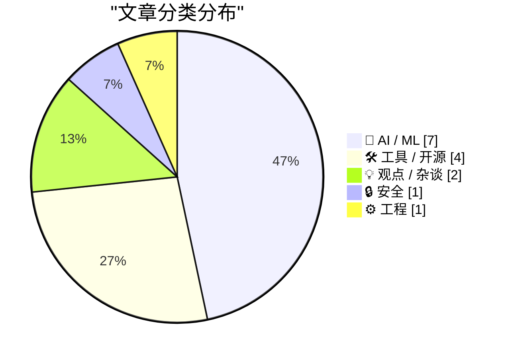
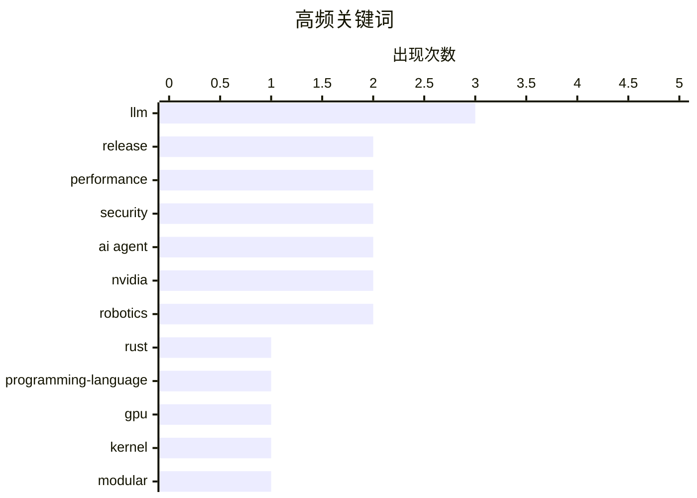

# 📰 AI 资讯每日精选 — 2026-04-18

> 汇聚 140+ 技术博客、X/Twitter、Hacker News、Reddit、Product Hunt、
> Lobste.rs、ClawFeed 日报及 GitHub Trending，经 AI 评分筛选。
>
> **本期内容**：🏆 今日必读 · 🌐 ClawFeed 日报 · 🔥 GitHub Trending · 📂 分类精选 · 🎨 设计与生成式 AI · 📊 数据概览

## 📝 今日看点

今日技术圈聚焦于AI智能体的实战化与底层工具革新。AI智能体正从概念走向大规模生产应用，在代码生成、机器人控制等领域展现出强大执行力。同时，从GPU编程抽象到版本管理工具，底层开发工具正朝着更高效、更安全的方向演进。此外，重大安全漏洞的披露与浏览器信息获取模式的潜在变革，也引发了广泛关注。

---

## 🏆 今日必读

🥇 **Rust 1.95.0**

[Rust 1.95.0](https://www.reddit.com/r/programming/comments/1so54le/rust_1950/) — r/programming · 8 小时前 · 🛠 工具 / 开源

> Rust 1.95.0 版本正式发布。该版本引入了对 Cargo 构建脚本中 `cfg` 表达式的稳定支持，允许更精细的条件编译。同时，标准库中的 `std::os::unix::fs::DirEntryExt::ino` 方法现已稳定，可用于获取 Unix 系统上的 inode 号。此外，编译器性能得到持续改进，并修复了多项错误。

💡 **为什么值得读**: 对于 Rust 开发者而言，了解每个稳定版本的新特性和改进是保持技术栈现代性的关键。

🏷️ Rust, programming-language, release

🥈 **Modular: TileTensor 第一部分 - 更安全、更高效的 GPU 内核**

[Modular: TileTensor Part 1 - Safer, More Efficient GPU Kernels](https://www.reddit.com/r/programming/comments/1sodwyd/modular_tiletensor_part_1_safer_more_efficient/) — r/programming · 2 小时前 · 🛠 工具 / 开源

> 文章介绍了 Modular 公司提出的 TileTensor 抽象，旨在解决 GPU 内核编程中内存访问模式复杂和易出错的问题。TileTensor 将数据视为可组合的“瓦片”，允许编译器自动推导出高效的内存访问和同步模式，从而提升内核安全性与性能。这种方法减少了手动优化的工作量，并降低了因内存访问错误导致的漏洞风险。

💡 **为什么值得读**: 为高性能计算和 AI 框架开发者提供了一种提升 GPU 内核开发效率和可靠性的新思路。

🏷️ GPU, kernel, performance, Modular

🥉 **Discord 媒体代理中的 HTTP 反同步攻击：窥视整个平台**

[HTTP desync in Discord's media proxy: Spying on a whole platform](https://tmctmt.com/posts/http-desync-in-discord/) — Lobste.rs · 12 小时前 · 🔒 安全

> 安全研究员披露了 Discord 媒体代理服务器中存在的一个 HTTP 请求走私（HTTP Desync）漏洞。攻击者可以利用此漏洞，将恶意请求“走私”到其他用户的连接中，从而窃取用户的认证令牌等敏感信息。该漏洞源于代理服务器对 HTTP 请求头解析不一致，影响了 Discord 的整个媒体处理基础设施。此案例再次凸显了复杂代理链中 HTTP 协议处理的危险性。

💡 **为什么值得读**: 这是一个影响范围极广的真实世界 HTTP 协议层安全漏洞剖析，对后端和安全工程师具有极高的警示和参考价值。

🏷️ HTTP desync, security, vulnerability

4️⃣ **LLM 如何在训练过程中变得更连贯**

[How an LLM becomes more coherent as we train it](https://www.gilesthomas.com/2026/04/how-an-llm-becomes-more-coherent-over-training) — gilesthomas.com · 45 分钟前 · 🤖 AI / ML

> 文章通过训练一个拥有 1.63 亿参数的 GPT-2-small 风格模型，直观展示了大型语言模型在训练过程中输出文本连贯性的演变。模型在约 32 亿 tokens 的数据上训练，其输出从最初的随机字符，逐渐发展为有意义的单词、简单的语法结构，最终能生成连贯的段落。这一过程揭示了模型如何逐步从数据中学习并内化语言结构和语义。

💡 **为什么值得读**: 通过具体的训练日志和生成样本，生动揭示了 LLM 能力涌现的微观过程，有助于理解其工作原理。

🏷️ LLM, training, coherence

5️⃣ **使用 NVIDIA Dynamo 进行智能体推理的全栈优化**

[Full-Stack Optimizations for Agentic Inference with NVIDIA Dynamo](https://developer.nvidia.com/blog/full-stack-optimizations-for-agentic-inference-with-nvidia-dynamo/) — NVIDIA Technical Blog · 1 小时前 · 🤖 AI / ML

> 文章探讨了如何为编码智能体等 AI 智能体应用进行全栈推理优化。以 Stripe（每周生成 1300+ PR）和 Ramp（30% 的合并 PR 来自智能体）为例，说明智能体已开始大规模编写生产代码。NVIDIA Dynamo 通过整合模型优化、推理运行时和硬件加速，显著提升了智能体任务的吞吐量和延迟。全栈优化是释放智能体在生产环境中潜力的关键。

💡 **为什么值得读**: 为正在部署或考虑部署 AI 编码智能体的团队提供了来自行业领先者的性能优化实战指南。

🏷️ AI Agent, Inference, Optimization, NVIDIA

---

## 🌐 ClawFeed 日报精选

> 来源：[ClawFeed](https://clawfeed.kevinhe.io) — AI 驱动的多源新闻聚合

### 🔥 今日头条

1. **OpenAI 把 Codex 从 coding tool 推向全工作流 agent 平台**
   今天最强主线就是 OpenAI 连续强化 Codex，新增 computer use、浏览器、image generation、memory、SSH devbox、并行 agents 和更多插件，目标已经不是“帮你写代码”，而是抢开发者与知识工作者的工作台入口。

2. **GPT-Rosalind 发布，frontier model 开始更明确切入生命科学**
   OpenAI 同步推出面向生命科学研究的 GPT-Rosalind，直接把能力包装到药物发现、基因组学、实验规划和转化医学流程，说明高价值垂直场景会越来越成为大模型产品化主战场。

3. **Claude Opus 4.7 刷新 agent 竞争强度**
   Anthropic 今天在社媒侧最强的产品信号是 Claude Opus 4.7，重点强调更稳的长任务执行、指令跟随和交付前自检。市场关注点继续从“聊天更像人”转向“能不能稳定干完复杂任务”。

4. **AI 安全和 cyber defense 持续升温**
   OpenAI 扩大 Trusted Access for Cyber，并开放更高信任级别团队申请 GPT-5.4-Cyber。Anthropic 则继续推进 Project Glasswing，把 Claude 往关键软件安全和基础设施防护场景里打，安全赛道已经明显进入平台级竞争。

5. **多模态 agent 和 world model 继续冒头**
   Google DeepMind 把 Gemini Robotics 接到 Spot 上，HeyGen 开源 HyperFrames，腾讯 HY-World-2.0 也被持续讨论。除了 coding agent，视频编辑、机器人执行、3D world generation 都在变成新一轮 agent 入口。

---

## 🔥 GitHub Trending

> 今日热门开源项目（全语言 + Python）

| # | 项目 | 描述 | ⭐ 总星 | 📈 今日 | 语言 |
|---|------|------|---------|---------|------|
| 1 | [obra/superpowers](https://github.com/obra/superpowers) | An agentic skills framework & software development method... | 157.7k | +1713 | Shell |
| 2 | [google/magika](https://github.com/google/magika) 🤖 | Fast and accurate AI powered file content types detection | 15.4k | +956 | Python |
| 3 | [Lordog/dive-into-llms](https://github.com/Lordog/dive-into-llms) | 《动手学大模型Dive into LLMs》系列编程实践教程 | 31.5k | +944 | Jupyter Notebook |
| 4 | [lsdefine/GenericAgent](https://github.com/lsdefine/GenericAgent) 🤖 | Self-evolving agent: grows skill tree from 3.3K-line seed... | 3.6k | +845 | Python |
| 5 | [BasedHardware/omi](https://github.com/BasedHardware/omi) 🤖 | AI that sees your screen, listens to your conversations a... | 9.8k | +824 | Dart |
| 6 | [jamiepine/voicebox](https://github.com/jamiepine/voicebox) | The open-source voice synthesis studio | 19.8k | +797 | TypeScript |
| 7 | [EvoMap/evolver](https://github.com/EvoMap/evolver) 🤖 | The GEP-Powered Self-Evolution Engine for AI Agents. Geno... | 4.2k | +737 | JavaScript |
| 8 | [anthropics/skills](https://github.com/anthropics/skills) 🤖 | Public repository for Agent Skills | 119.6k | +701 | Python |
| 9 | [openai/openai-agents-python](https://github.com/openai/openai-agents-python) 🤖 | A lightweight, powerful framework for multi-agent workflows | 21.8k | +625 | Python |
| 10 | [SimoneAvogadro/android-reverse-engineering-skill](https://github.com/SimoneAvogadro/android-reverse-engineering-skill) 🤖 | Claude Code skill to support Android app's reverse engine... | 2.7k | +538 | Shell |
| 11 | [topoteretes/cognee](https://github.com/topoteretes/cognee) 🤖 | Knowledge Engine for AI Agent Memory in 6 lines of code | 16.2k | +476 | Python |
| 12 | [public-apis/public-apis](https://github.com/public-apis/public-apis) | A collective list of free APIs | 424.5k | +402 | Python |
| 13 | [Donchitos/Claude-Code-Game-Studios](https://github.com/Donchitos/Claude-Code-Game-Studios) 🤖 | Turn Claude Code into a full game dev studio — 49 AI agen... | 11.8k | +311 | Shell |
| 14 | [z-lab/dflash](https://github.com/z-lab/dflash) 🤖 | DFlash: Block Diffusion for Flash Speculative Decoding | 1.8k | +287 | Python |
| 15 | [Shubhamsaboo/awesome-llm-apps](https://github.com/Shubhamsaboo/awesome-llm-apps) 🤖 | 100+ AI Agent & RAG apps you can actually run — clone, cu... | 106.1k | +258 | Python |

---

## 🤖 AI / ML

### 1. LLM 如何在训练过程中变得更连贯

[How an LLM becomes more coherent as we train it](https://www.gilesthomas.com/2026/04/how-an-llm-becomes-more-coherent-over-training) — **gilesthomas.com** · 45 分钟前 · ⭐ 25/30

> 文章通过训练一个拥有 1.63 亿参数的 GPT-2-small 风格模型，直观展示了大型语言模型在训练过程中输出文本连贯性的演变。模型在约 32 亿 tokens 的数据上训练，其输出从最初的随机字符，逐渐发展为有意义的单词、简单的语法结构，最终能生成连贯的段落。这一过程揭示了模型如何逐步从数据中学习并内化语言结构和语义。

🏷️ LLM, training, coherence

---

### 2. 使用 NVIDIA Dynamo 进行智能体推理的全栈优化

[Full-Stack Optimizations for Agentic Inference with NVIDIA Dynamo](https://developer.nvidia.com/blog/full-stack-optimizations-for-agentic-inference-with-nvidia-dynamo/) — **NVIDIA Technical Blog** · 1 小时前 · ⭐ 25/30

> 文章探讨了如何为编码智能体等 AI 智能体应用进行全栈推理优化。以 Stripe（每周生成 1300+ PR）和 Ramp（30% 的合并 PR 来自智能体）为例，说明智能体已开始大规模编写生产代码。NVIDIA Dynamo 通过整合模型优化、推理运行时和硬件加速，显著提升了智能体任务的吞吐量和延迟。全栈优化是释放智能体在生产环境中潜力的关键。

🏷️ AI Agent, Inference, Optimization, NVIDIA

---

### 3. 使用 OpenClaw 和 NVIDIA NemoClaw 构建更安全、常驻本地的 AI 智能体

[Build a More Secure, Always-On Local AI Agent with OpenClaw and NVIDIA NemoClaw](https://developer.nvidia.com/blog/build-a-secure-always-on-local-ai-agent-with-nvidia-nemoclaw-and-openclaw/) — **NVIDIA Technical Blog** · 5 小时前 · ⭐ 25/30

> 文章介绍了如何构建能够长期运行、执行多步骤工作流（如读取文件、调用 API）的自主 AI 智能体。NVIDIA 的 NemoClaw 框架与开源的 OpenClaw 工具包结合，使开发者能在本地或私有云中部署此类智能体，确保数据安全和隐私。该方案提供了工具链来管理智能体的工具调用、记忆和任务规划。

🏷️ AI Agent, Security, Local AI, NVIDIA

---

### 4. 谷歌 DeepMind 的 Gemini Robotics-ER 1.6 为机器人提供了更敏锐的规划和感知大脑

[Google Deepmind's Gemini Robotics-ER 1.6 gives robots a sharper brain for planning and perception](https://the-decoder.com/google-deepminds-gemini-robotics-er-1-6-gives-robots-a-sharper-brain-for-planning-and-perception/) — **The Decoder** · 5 小时前 · ⭐ 24/30

> 谷歌 DeepMind 发布了 Gemini Robotics-ER 1.6，这是一个专为机器人设计的增强版视觉-语言-动作模型。新版本显著提升了机器人的任务规划能力和环境感知精度，特别擅长读取测量仪器（如刻度表、显示屏）的数值。这使得机器人能更准确地理解指令并执行需要精密观察的操作。

🏷️ Robotics, Gemini, Planning, Perception

---

### 5. 阿里开源模型Qwen3.6在智能体编码基准测试中领先谷歌Gemma 4

[Alibaba's open model Qwen3.6 leads Google's Gemma 4 across agentic coding benchmarks](https://the-decoder.com/alibabas-open-model-qwen3-6-leads-googles-gemma-4-across-agentic-coding-benchmarks/) — **The Decoder** · 6 小时前 · ⭐ 24/30

> 阿里新开源模型Qwen3.6-35B-A3B在编码和推理基准测试中超越了谷歌更大的Gemma 4-31B。该模型采用激活参数稀疏化技术，每次推理仅激活350亿参数中的30亿。这一表现使其在智能体编码任务上全面领先。结果表明，通过高效的架构设计，较小激活参数量的模型也能在特定任务上超越规模更大的竞争对手。

🏷️ Qwen, Open Source, Benchmark, Coding

---

### 6. Physical Intelligence展示具备类LLM泛化能力的机器人模型，缺陷并存

[Physical Intelligence shows robot model with LLM-like generalization, flaws included](https://the-decoder.com/physical-intelligence-shows-robot-model-with-llm-like-generalization-flaws-included/) — **The Decoder** · 12 小时前 · ⭐ 24/30

> 美国初创公司Physical Intelligence发布了机器人基础模型π0.7，旨在像大语言模型重组文本片段一样，重组训练中学到的技能。研究人员将此描述为机器人领域“组合泛化”的早期迹象。该模型能够将已学习的技能模块进行新组合以应对新任务。然而，与LLM类似，这种泛化能力目前仍不完善，存在一定的错误和局限性。

🏷️ Robotics, Foundation Model, Generalization, LLM

---

### 7. Qwen3.6。就是它了。

[Qwen3.6. This is it.](https://www.reddit.com/r/LocalLLaMA/comments/1so1533/qwen36_this_is_it/) — **r/LocalLLaMA** · 10 小时前 · ⭐ 24/30

> 社区用户对阿里最新开源的Qwen3.6模型系列给予了高度评价，认为其性能表现达到了新的标杆。该帖子附带了模型在多项基准测试中的性能图表，展示了其在推理、编码和多语言任务上的竞争力。用户讨论聚焦于其出色的性价比和易于本地部署的特性。Qwen3.6被社区视为当前最值得关注和尝试的开源模型之一。

🏷️ Qwen3.6, release, announcement

---

## 🛠 工具 / 开源

### 8. Rust 1.95.0

[Rust 1.95.0](https://www.reddit.com/r/programming/comments/1so54le/rust_1950/) — **r/programming** · 8 小时前 · ⭐ 26/30

> Rust 1.95.0 版本正式发布。该版本引入了对 Cargo 构建脚本中 `cfg` 表达式的稳定支持，允许更精细的条件编译。同时，标准库中的 `std::os::unix::fs::DirEntryExt::ino` 方法现已稳定，可用于获取 Unix 系统上的 inode 号。此外，编译器性能得到持续改进，并修复了多项错误。

🏷️ Rust, programming-language, release

---

### 9. Modular: TileTensor 第一部分 - 更安全、更高效的 GPU 内核

[Modular: TileTensor Part 1 - Safer, More Efficient GPU Kernels](https://www.reddit.com/r/programming/comments/1sodwyd/modular_tiletensor_part_1_safer_more_efficient/) — **r/programming** · 2 小时前 · ⭐ 26/30

> 文章介绍了 Modular 公司提出的 TileTensor 抽象，旨在解决 GPU 内核编程中内存访问模式复杂和易出错的问题。TileTensor 将数据视为可组合的“瓦片”，允许编译器自动推导出高效的内存访问和同步模式，从而提升内核安全性与性能。这种方法减少了手动优化的工作量，并降低了因内存访问错误导致的漏洞风险。

🏷️ GPU, kernel, performance, Modular

---

### 10. Git 中跟踪和分组工作树变更的新方法

[New way track and group working tree changes in Git](https://www.reddit.com/r/programming/comments/1sofjd0/new_way_track_and_group_working_tree_changes_in/) — **r/programming** · 1 小时前 · ⭐ 25/30

> 文章提出了一种全新的 Git 变更存储架构，旨在改进对工作树中复杂变更的跟踪和合并。与传统上将变更存储为补丁（patch）的方式不同，新架构为每个逻辑变更存储三个快照：原始文件状态、编辑后的文件状态、以及仅包含所选变更的版本。这种方法结合约束条件，旨在实现更智能、更少冲突的合并操作。

🏷️ Git, version control, VCS

---

### 11. [指南] 应要求详解我的 FLUX.2 Klein 9B 一体化工作流中的每个管线

[[Guide] Complete walkthrough for every pipeline in my FLUX.2 Klein 9B All-in-One workflow, by request from the comments](https://www.reddit.com/r/comfyui/comments/1so8383/guide_complete_walkthrough_for_every_pipeline_in/) — **r/comfyui** · 6 小时前 · ⭐ 25/30

> 这是一份针对 ComfyUI 中一个复杂的 FLUX.2 Klein 9B 图像生成工作流的详细指南。该工作流已升级至 v2.1 版本，包含 122 个节点和 19 个功能组。指南逐步讲解了每个管线组（如 ControlNet 预处理器、高清修复、提示词处理等）的设置、技巧和测试中发现的经验。新增功能包括 LineArt、HED、Tile 等 ControlNet 预处理器。

🏷️ ComfyUI, Tutorial, FLUX, Workflow

---

## 💡 观点 / 杂谈

### 12. 谷歌找到新方法，让你再也无需直接访问网站

[Google finds new ways to keep you from ever visiting a website directly again](https://the-decoder.com/google-finds-new-ways-to-keep-you-from-ever-visiting-a-website-directly-again/) — **The Decoder** · 5 小时前 · ⭐ 24/30

> 谷歌正将“AI 模式”更深地集成到 Chrome 浏览器中。未来，网站内容将直接在 AI 生成的回答旁边打开，传统意义上的“访问网页”行为将变得不再必要。这一变化旨在提升信息获取效率，但也会进一步削弱用户与原始网站的直接互动，可能对网络生态、流量统计和内容提供商产生深远影响。

🏷️ Google, Chrome, AI Search, Web

---

### 13. ChatGPT市场份额流失，Claude月度增长爆发

[ChatGPT bleeds market share as Claude posts explosive monthly growth](https://the-decoder.com/chatgpt-bleeds-market-share-as-claude-posts-explosive-monthly-growth/) — **The Decoder** · 6 小时前 · ⭐ 24/30

> ChatGPT市场份额正快速流失，而Anthropic的Claude单月市场份额翻倍，超越了DeepSeek和Grok。谷歌Gemma目前占据了全部AI流量的四分之一，对ChatGPT构成最大竞争压力。尽管ChatGPT仍保持领先地位，但其市场主导地位正受到多方挑战。大模型市场竞争加剧，用户选择日趋多元化。

🏷️ Market Share, ChatGPT, Claude, LLM

---

## 🔒 安全

### 14. Discord 媒体代理中的 HTTP 反同步攻击：窥视整个平台

[HTTP desync in Discord's media proxy: Spying on a whole platform](https://tmctmt.com/posts/http-desync-in-discord/) — **Lobste.rs** · 12 小时前 · ⭐ 26/30

> 安全研究员披露了 Discord 媒体代理服务器中存在的一个 HTTP 请求走私（HTTP Desync）漏洞。攻击者可以利用此漏洞，将恶意请求“走私”到其他用户的连接中，从而窃取用户的认证令牌等敏感信息。该漏洞源于代理服务器对 HTTP 请求头解析不一致，影响了 Discord 的整个媒体处理基础设施。此案例再次凸显了复杂代理链中 HTTP 协议处理的危险性。

🏷️ HTTP desync, security, vulnerability

---

## ⚙️ 工程

### 15. 我们部署了一个“小修复”……然后它搞垮了生产环境

[We deployed a “small fix”… and it took down production](https://www.reddit.com/r/programming/comments/1snv58e/we_deployed_a_small_fix_and_it_took_down/) — **r/programming** · 15 小时前 · ⭐ 24/30

> 一次看似无害的后端更改——仅在查询中添加`.populate("orders")`——导致生产环境崩溃。API延迟从120ms飙升至5秒，CPU使用率达到95%，请求开始超时。根本原因是经典的N+1查询问题：在约2000名用户规模下，每个请求意外触发了2000多次数据库查询。本地测试正常与生产环境灾难的对比，凸显了负载测试和查询优化的重要性。

🏷️ production, performance, database

---

## 🎨 Design & Generative AI

### 🖥️ 生成式 UI

- **[Anima风格探索器：免费ComfyUI风格工具与开源客户端](https://www.reddit.com/r/comfyui/comments/1sog0ww/resource_anima_style_explorer_a_free_web_tool_for/)** — r/comfyui · 1 小时前
  > 发布免费的ComfyUI风格探索网页工具及开源的MooshieUI桌面客户端。

### 🖼️ 生成式图片

- **[FLUX.2 Klein 9B 全能工作流完整指南](https://www.reddit.com/r/comfyui/comments/1so8383/guide_complete_walkthrough_for_every_pipeline_in/)** — r/comfyui · 6 小时前
  > 详细拆解FLUX.2 Klein 9B模型在ComfyUI中的全流程工作流设置与技巧。

- **[ComfyUI新节点：非递归ControlNet加速多模型工作流](https://www.reddit.com/r/StableDiffusion/comments/1sobckg/i_have_been_developing_a_new_nonrecursive/)** — r/StableDiffusion · 4 小时前
  > 推出Orchestrator节点，通过非递归方法加速多个ControlNet模型的执行。

- **[ControlNet工作流简化：新增Orchestrator高级节点](https://www.reddit.com/r/comfyui/comments/1so9ofl/i_extended_my_new_nonrecursive_controlnet_method/)** — r/comfyui · 5 小时前
  > 扩展非递归ControlNet方法，新增节点以简化多ControlNet模型工作流。

- **[为ComfyUI工作流新增分块VAE与DiT支持以降低显存](https://www.reddit.com/r/StableDiffusion/comments/1snst77/added_tiled_vae_support_to_facedetailer_and_tiled/)** — r/StableDiffusion · 17 小时前
  > 通过为FaceDetailer和SeedVR2添加分块处理支持，减少重型工作流的显存峰值占用。

- **[在ComfyUI中测试ERNIE-Image模型](https://www.reddit.com/r/comfyui/comments/1so2ro7/testing_ernieimage_in_comfyui/)** — r/comfyui · 9 小时前
  > 跟随教程在ComfyUI中测试百度ERNIE-Image模型的集成效果。

- **[ERNIE-Image在ComfyUI中的实战工作流与画质测试](https://www.reddit.com/r/comfyui/comments/1snzwmw/ernieimage_in_comfyui_realworld_workflow_image/)** — r/comfyui · 11 小时前
  > 测试ERNIE-Image模型在ComfyUI中的实际工作流并评估其图像质量。

- **[从ERNIE Image Turbo中提取LoRA模型](https://www.reddit.com/r/StableDiffusion/comments/1so42k8/i_have_extracted_the_lora_from_ernie_image_turbo/)** — r/StableDiffusion · 8 小时前
  > 成功从强大的ERNIE Image Turbo模型中提取出LoRA组件。

- **[Midjourney从旗舰产品变得几乎无法使用](https://www.reddit.com/r/midjourney/comments/1so1hxp/midjourney_was_a_flagship_now_it_is_virtually/)** — r/midjourney · 10 小时前
  > 用户吐槽Midjourney质量下滑，对比Ideogram等工具后认为其已变得难以使用。

### 🌍 世界模型 / 3D

- **[ComfyUI-HY-World2：3D世界生成集成发布](https://www.reddit.com/r/comfyui/comments/1snst5p/comfyuihyworld2/)** — r/comfyui · 17 小时前
  > 发布将HY-World 3D世界生成功能集成到ComfyUI中的工具。

- **[quickymesh：从文本或图像生成概念艺术与3D模型](https://www.reddit.com/r/comfyui/comments/1so3g8j/quickymesh_create_concept_art_and_3d_models_from/)** — r/comfyui · 9 小时前
  > 介绍quickymesh工具，它能够根据文本或图像输入生成概念艺术和3D模型。

### 🎬 生成式视频

- **[ComfyUI内置DWPose时空编辑器，修复动画抖动](https://www.reddit.com/r/comfyui/comments/1snx27e/i_built_a_full_dwpose_temporal_editor_retargeter/)** — r/comfyui · 13 小时前
  > 在ComfyUI内构建完整的DWPose时空编辑与重定向工具，旨在修复WanAnimate的抖动问题。

- **[ComfyUI内置DWPose编辑器修复动画抖动（团队版）](https://www.reddit.com/r/StableDiffusion/comments/1snyxuy/weve_built_a_full_dwpose_temporal_editor/)** — r/StableDiffusion · 12 小时前
  > 团队开发了ComfyUI内的DWPose时空编辑与重定向工具，用于修复WanAnimate抖动。

- **[一周内使用LTX 2.3制作的完整电影短片](https://www.reddit.com/r/StableDiffusion/comments/1so8o8g/i_made_an_entire_cinematic_shortfilm_using_ltx_23/)** — r/StableDiffusion · 6 小时前
  > 分享使用LTX 2.3在一周内制作完整电影短片《The Felt Fox》的经验与成果。

- **[LTXV 2.3 终极全能主节点发布](https://www.reddit.com/r/comfyui/comments/1so5idv/ltxv_23_ultimate_allinone_master_node/)** — r/comfyui · 8 小时前
  > 非专业开发者分享为ComfyUI创建的LTXV 2.3版本全能主节点。

---

## 📊 数据概览

| 扫描源 | 抓取文章 | 时间范围 | 精选 |
|:---:|:---:|:---:|:---:|
| 111/140 | 4736 篇 → 209 篇 | 24h | **15 篇** |

### 分类分布



### 高频关键词



<details>
<summary>📈 纯文本关键词图（终端友好）</summary>

```
llm                  │ ████████████████████ 3
release              │ █████████████░░░░░░░ 2
performance          │ █████████████░░░░░░░ 2
security             │ █████████████░░░░░░░ 2
ai agent             │ █████████████░░░░░░░ 2
nvidia               │ █████████████░░░░░░░ 2
robotics             │ █████████████░░░░░░░ 2
rust                 │ ███████░░░░░░░░░░░░░ 1
programming-language │ ███████░░░░░░░░░░░░░ 1
gpu                  │ ███████░░░░░░░░░░░░░ 1
```

</details>

### 🏷️ 话题标签

**llm**(3) · **release**(2) · **performance**(2) · security(2) · ai agent(2) · nvidia(2) · robotics(2) · rust(1) · programming-language(1) · gpu(1) · kernel(1) · modular(1) · http desync(1) · vulnerability(1) · training(1) · coherence(1) · inference(1) · optimization(1) · local ai(1) · git(1)

---

*生成于 2026-04-18 00:15 | 汇聚 140 个技术博客、X/Twitter、Hacker News、Reddit、Product Hunt、Lobste.rs、ClawFeed 日报及 GitHub Trending，经 AI 评分筛选出 Top 15 精华内容*
