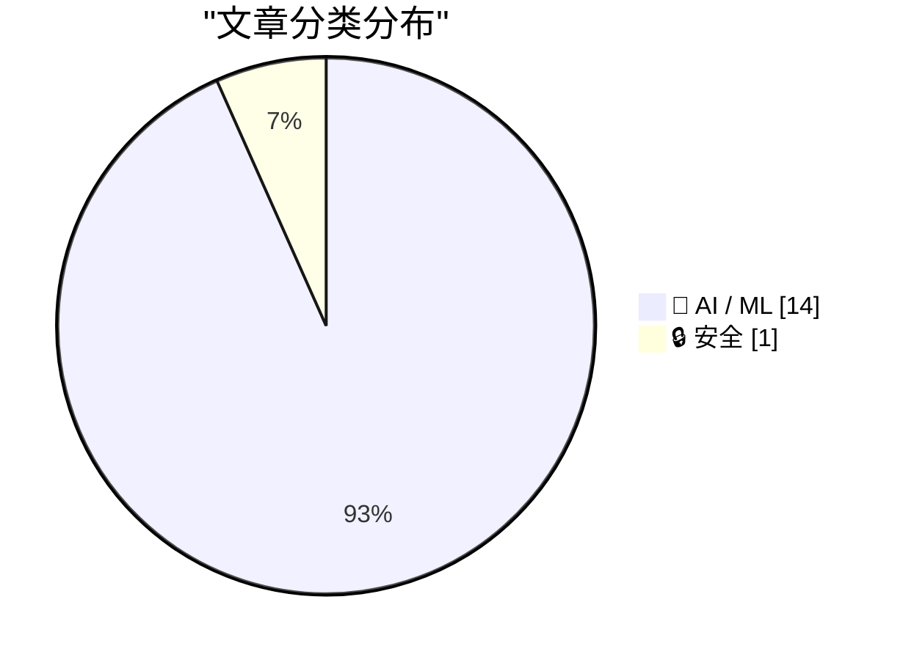
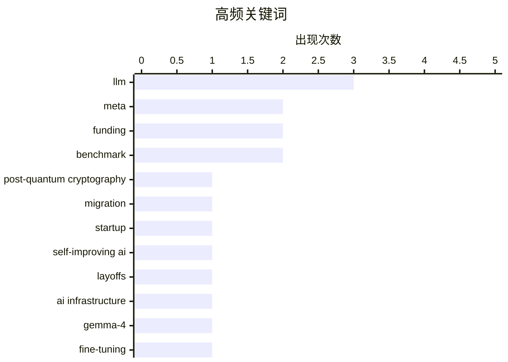

# 📰 AI 资讯每日精选 — 2026-04-19

> 汇聚 140+ 技术博客、X/Twitter、Hacker News、Reddit、Product Hunt、
> Lobste.rs、ClawFeed 日报及 GitHub Trending，经 AI 评分筛选。
>
> **本期内容**：🏆 今日必读 · 🌐 ClawFeed 日报 · 🔥 GitHub Trending · 📂 分类精选 · 🎨 设计与生成式 AI · 📊 数据概览

## 📝 今日看点

今日技术圈的核心焦点仍被人工智能的狂飙与阵痛所主导。一方面，巨头与初创公司正以惊人资源投入军备竞赛，Meta甚至不惜以大规模裁员换取算力，而新兴独角兽则以天价估值涌现。另一方面，行业在狂热扩张中暴露出技术伦理与实用化挑战，从模型部署的具体技术障碍到AI作为“答案机器”对人类能力的潜在削弱，引发深刻反思。与此同时，面对未来的量子计算威胁，科技巨头已启动密码学基础设施的前瞻性迁移，为下一场安全革命未雨绸缪。

---

## 🏆 今日必读

🥇 **Meta的后量子密码迁移：框架、经验与启示**

[Post-Quantum Cryptography Migration at Meta: Framework, Lessons, and Takeaways](https://www.reddit.com/r/programming/comments/1soqmzq/postquantum_cryptography_migration_at_meta/) — r/programming · 16 小时前 · 🔒 安全

> 文章分享了Meta将其庞大基础设施迁移到后量子密码学的实践经验与系统框架。Meta采用了混合方案，将传统算法（如X25519）与后量子算法（如ML-KEM）结合使用，以应对量子计算机的威胁。迁移过程涉及识别关键资产、评估密码学依赖、实施混合协议以及大规模的测试与部署。核心结论是，后量子迁移是一个复杂的系统工程，需要尽早规划、采用分层防御策略，并建立跨团队的协作框架。

💡 **为什么值得读**: 对于任何面临量子计算安全威胁的大型企业或技术团队，Meta提供的这套经过实战检验的迁移框架和具体技术选型具有极高的参考价值。

🏷️ post-quantum cryptography, migration, Meta

🥈 **自改进AI初创公司Recursive Superintelligence成立仅四个月融资5亿美元**

[Self-improving AI startup Recursive Superintelligence pulls in $500 million just four months after founding](https://the-decoder.com/self-improving-ai-startup-recursive-superintelligence-pulls-in-500-million-just-four-months-after-founding/) — The Decoder · 14 小时前 · 🤖 AI / ML

> 一家成立仅四个月的AI初创公司Recursive Superintelligence以40亿美元估值融资至少5亿美元。该公司由前Google DeepMind和OpenAI的研究人员创立，目标是开发能够自我改进的AI系统。巨额融资和豪华团队背景表明，资本市场对实现“递归超级智能”这一前沿方向抱有极高期望和信心。

💡 **为什么值得读**: 这则新闻揭示了AI领域最前沿的“自我改进AI”赛道正获得巨额资本押注，是观察行业风向和顶级人才流向的重要信号。

🏷️ startup, funding, self-improving AI

🥉 **据报道扎克伯格以裁员换算力，Meta拟裁减10%员工以资助AI基础设施**

[Zuckerberg reportedly trades headcount for compute as Meta readies to cut 10 percent of its workforce to fund AI infrastructure](https://the-decoder.com/zuckerberg-reportedly-trades-headcount-for-compute-as-meta-readies-to-cut-10-percent-of-its-workforce-to-fund-ai-infrastructure/) — The Decoder · 16 小时前 · 🤖 AI / ML

> Meta计划于5月20日裁员约8000人，并在今年晚些时候进行第二轮裁员，总计可能裁减超过20%的员工。此次大规模裁员旨在抵消公司在AI基础设施上的巨额投入。这表明Meta正将资源从人力大规模转向算力，以在激烈的AI军备竞赛中保持竞争力。

💡 **为什么值得读**: 它清晰地展示了科技巨头在AI竞赛中的残酷资源再分配逻辑，即“用员工换GPU”，对行业从业者和观察者具有警示意义。

🏷️ Meta, layoffs, AI infrastructure

4️⃣ **微调与部署Gemma-4的挑战与考验 [P]**

[Trials and tribulations fine-tuning & deploying Gemma-4 [P]](https://www.reddit.com/r/MachineLearning/comments/1spc33w/trials_and_tribulations_finetuning_deploying/) — r/MachineLearning · 1 小时前 · 🤖 AI / ML

> 文章记录了团队在微调和部署Gemma-4模型时遇到的一系列具体技术挑战。主要问题包括PEFT库无法识别Gemma-4自定义的`ClippableLinear`层导致LoRA附着失败，以及使用vLLM部署时因新架构导致的兼容性问题。团队通过手动解包层结构、修改库代码等方式解决了这些问题。这些经验为其他开发者处理类似的新模型部署提供了宝贵的实战参考。

💡 **为什么值得读**: 对于计划使用Gemma-4进行微调或部署的工程师而言，文中详述的“坑”和解决方案能节省大量排查时间，极具实操价值。

🏷️ Gemma-4, fine-tuning, deployment

5️⃣ **Anthropic的Claude Mythos发布建立在错误信息之上**

[Anthropic's Claude Mythos Launch Is Built on Misinformation](https://www.artificialintelligencemadesimple.com/p/anthropics-claude-mythos-launch-is) — Lobste.rs · 8 小时前 · 🤖 AI / ML

> 文章指控Anthropic公司为其Claude Mythos模型的发布活动散布了误导性信息。具体指控内容需阅读原文获取细节，但核心观点是质疑该次营销宣传的真实性与诚信度。这引发了关于AI公司如何负责任地进行技术宣传和公众沟通的讨论。

💡 **为什么值得读**: 它促使读者批判性地审视AI公司的宣传话术，对于理解行业营销策略与技术现实之间的差距至关重要。

🏷️ LLM, ethics, misinformation

---

## 🌐 ClawFeed 日报精选

> 来源：[ClawFeed](https://clawfeed.kevinhe.io) — AI 驱动的多源新闻聚合

### 🔥 今日头条

1. **OpenAI 把 Codex 从 coding tool 推向全工作流 agent 平台**
   今天最强主线就是 OpenAI 连续强化 Codex，新增 computer use、浏览器、image generation、memory、SSH devbox、并行 agents 和更多插件，目标已经不是“帮你写代码”，而是抢开发者与知识工作者的工作台入口。

2. **GPT-Rosalind 发布，frontier model 开始更明确切入生命科学**
   OpenAI 同步推出面向生命科学研究的 GPT-Rosalind，直接把能力包装到药物发现、基因组学、实验规划和转化医学流程，说明高价值垂直场景会越来越成为大模型产品化主战场。

3. **Claude Opus 4.7 刷新 agent 竞争强度**
   Anthropic 今天在社媒侧最强的产品信号是 Claude Opus 4.7，重点强调更稳的长任务执行、指令跟随和交付前自检。市场关注点继续从“聊天更像人”转向“能不能稳定干完复杂任务”。

4. **AI 安全和 cyber defense 持续升温**
   OpenAI 扩大 Trusted Access for Cyber，并开放更高信任级别团队申请 GPT-5.4-Cyber。Anthropic 则继续推进 Project Glasswing，把 Claude 往关键软件安全和基础设施防护场景里打，安全赛道已经明显进入平台级竞争。

5. **多模态 agent 和 world model 继续冒头**
   Google DeepMind 把 Gemini Robotics 接到 Spot 上，HeyGen 开源 HyperFrames，腾讯 HY-World-2.0 也被持续讨论。除了 coding agent，视频编辑、机器人执行、3D world generation 都在变成新一轮 agent 入口。

---

## 🔥 GitHub Trending

> 今日热门开源项目（全语言 + Python）

| # | 项目 | 描述 | ⭐ 总星 | 📈 今日 | 语言 |
|---|------|------|---------|---------|------|
| 1 | [EvoMap/evolver](https://github.com/EvoMap/evolver) 🤖 | The GEP-Powered Self-Evolution Engine for AI Agents. Geno... | 5.0k | +1131 | JavaScript |
| 2 | [lsdefine/GenericAgent](https://github.com/lsdefine/GenericAgent) 🤖 | Self-evolving agent: grows skill tree from 3.3K-line seed... | 4.2k | +776 | Python |
| 3 | [BasedHardware/omi](https://github.com/BasedHardware/omi) 🤖 | AI that sees your screen, listens to your conversations a... | 10.4k | +609 | Dart |
| 4 | [Lordog/dive-into-llms](https://github.com/Lordog/dive-into-llms) | 《动手学大模型Dive into LLMs》系列编程实践教程 | 32.0k | +547 | Jupyter Notebook |
| 5 | [google/magika](https://github.com/google/magika) 🤖 | Fast and accurate AI powered file content types detection | 15.9k | +545 | Python |
| 6 | [openai/openai-agents-python](https://github.com/openai/openai-agents-python) 🤖 | A lightweight, powerful framework for multi-agent workflows | 22.3k | +470 | Python |
| 7 | [Tracer-Cloud/opensre](https://github.com/Tracer-Cloud/opensre) 🤖 | Build your own AI SRE agents. The open source toolkit for... | 1.7k | +460 | Python |
| 8 | [thunderbird/thunderbolt](https://github.com/thunderbird/thunderbolt) 🤖 | AI You Control: Choose your models. Own your data. Elimin... | 1.5k | +447 | TypeScript |
| 9 | [SimoneAvogadro/android-reverse-engineering-skill](https://github.com/SimoneAvogadro/android-reverse-engineering-skill) 🤖 | Claude Code skill to support Android app's reverse engine... | 3.1k | +403 | Shell |
| 10 | [rustdesk/rustdesk](https://github.com/rustdesk/rustdesk) | An open-source remote desktop application designed for se... | 112.1k | +393 | Rust |
| 11 | [Shubhamsaboo/awesome-llm-apps](https://github.com/Shubhamsaboo/awesome-llm-apps) 🤖 | 100+ AI Agent & RAG apps you can actually run — clone, cu... | 106.3k | +180 | Python |
| 12 | [tractorjuice/arc-kit](https://github.com/tractorjuice/arc-kit) | Enterprise Architecture Governance & Vendor Procurement T... | 726 | +135 | HTML |
| 13 | [github/awesome-copilot](https://github.com/github/awesome-copilot) 🤖 | Community-contributed instructions, agents, skills, and c... | 30.3k | +115 | Python |
| 14 | [unslothai/unsloth](https://github.com/unslothai/unsloth) 🤖 | Unsloth Studio is a web UI for training and running open ... | 62.1k | +114 | Python |
| 15 | [nv-tlabs/lyra](https://github.com/nv-tlabs/lyra) 🤖 | Project Lyra: Open Generative 3D World Models | 1.5k | +66 | Python |

---

## 🤖 AI / ML

### 1. 自改进AI初创公司Recursive Superintelligence成立仅四个月融资5亿美元

[Self-improving AI startup Recursive Superintelligence pulls in $500 million just four months after founding](https://the-decoder.com/self-improving-ai-startup-recursive-superintelligence-pulls-in-500-million-just-four-months-after-founding/) — **The Decoder** · 14 小时前 · ⭐ 25/30

> 一家成立仅四个月的AI初创公司Recursive Superintelligence以40亿美元估值融资至少5亿美元。该公司由前Google DeepMind和OpenAI的研究人员创立，目标是开发能够自我改进的AI系统。巨额融资和豪华团队背景表明，资本市场对实现“递归超级智能”这一前沿方向抱有极高期望和信心。

🏷️ startup, funding, self-improving AI

---

### 2. 据报道扎克伯格以裁员换算力，Meta拟裁减10%员工以资助AI基础设施

[Zuckerberg reportedly trades headcount for compute as Meta readies to cut 10 percent of its workforce to fund AI infrastructure](https://the-decoder.com/zuckerberg-reportedly-trades-headcount-for-compute-as-meta-readies-to-cut-10-percent-of-its-workforce-to-fund-ai-infrastructure/) — **The Decoder** · 16 小时前 · ⭐ 25/30

> Meta计划于5月20日裁员约8000人，并在今年晚些时候进行第二轮裁员，总计可能裁减超过20%的员工。此次大规模裁员旨在抵消公司在AI基础设施上的巨额投入。这表明Meta正将资源从人力大规模转向算力，以在激烈的AI军备竞赛中保持竞争力。

🏷️ Meta, layoffs, AI infrastructure

---

### 3. 微调与部署Gemma-4的挑战与考验 [P]

[Trials and tribulations fine-tuning & deploying Gemma-4 [P]](https://www.reddit.com/r/MachineLearning/comments/1spc33w/trials_and_tribulations_finetuning_deploying/) — **r/MachineLearning** · 1 小时前 · ⭐ 25/30

> 文章记录了团队在微调和部署Gemma-4模型时遇到的一系列具体技术挑战。主要问题包括PEFT库无法识别Gemma-4自定义的`ClippableLinear`层导致LoRA附着失败，以及使用vLLM部署时因新架构导致的兼容性问题。团队通过手动解包层结构、修改库代码等方式解决了这些问题。这些经验为其他开发者处理类似的新模型部署提供了宝贵的实战参考。

🏷️ Gemma-4, fine-tuning, deployment

---

### 4. Anthropic的Claude Mythos发布建立在错误信息之上

[Anthropic's Claude Mythos Launch Is Built on Misinformation](https://www.artificialintelligencemadesimple.com/p/anthropics-claude-mythos-launch-is) — **Lobste.rs** · 8 小时前 · ⭐ 25/30

> 文章指控Anthropic公司为其Claude Mythos模型的发布活动散布了误导性信息。具体指控内容需阅读原文获取细节，但核心观点是质疑该次营销宣传的真实性与诚信度。这引发了关于AI公司如何负责任地进行技术宣传和公众沟通的讨论。

🏷️ LLM, ethics, misinformation

---

### 5. 作为Git时间线的Claude系统提示词

[Claude system prompts as a git timeline](https://simonwillison.net/2026/Apr/18/extract-system-prompts/#atom-everything) — **simonwillison.net** · 11 小时前 · ⭐ 24/30

> Simon Willison将Anthropic官方发布的Claude各模型系统提示词文档，转换成了一个按版本管理的Git仓库。他使用Claude Code将单一的Markdown文档拆分为每个模型独立的文件，并保留了完整的历史修改记录。这个项目使得追踪Claude系统提示词的演变过程变得透明和可审计。它为研究AI模型行为如何被系统提示词塑造和改变提供了宝贵的数据集。

🏷️ Claude, system prompt, LLM, transparency

---

### 6. Salesforce CEO Marc Benioff称API是AI智能体的新UI

[Salesforce CEO Marc Benioff says APIs are the new UI for AI agents](https://the-decoder.com/salesforce-ceo-marc-benioff-says-apis-are-the-new-ui-for-ai-agents/) — **The Decoder** · 11 小时前 · ⭐ 24/30

> Salesforce CEO Marc Benioff提出，在AI智能体时代，API正在取代传统的图形用户界面成为新的交互范式。为此，Salesforce推出了“Headless 360”，将其整个平台向AI智能体开放，使API成为主要界面。这一实践与OpenAI CEO Sam Altman关于AI将导致界面根本性变革的预言相呼应。

🏷️ AI agents, APIs, Salesforce

---

### 7. 新研究发现，仅将AI作为答案机器使用十分钟即可显著削弱解决问题的能力

[Just ten minutes of using AI as an answer machine can measurably erode problem-solving skills, new study finds](https://the-decoder.com/just-ten-minutes-of-using-ai-as-an-answer-machine-can-measurably-erode-problem-solving-skills-new-study-finds/) — **The Decoder** · 11 小时前 · ⭐ 24/30

> 一项由美国和英国研究人员进行的新研究发现，仅使用AI助手10到15分钟来获取答案，就足以可测量地削弱使用者后续在不借助AI时的解决问题能力和坚持性。研究揭示了将AI纯粹作为“答案机器”的短期使用，可能对用户的认知能力和学习毅力产生即时负面影响。这警示我们需要更谨慎地设计人机协作模式。

🏷️ AI assistant, problem-solving, study

---

### 8. Anthropic CEO Amodei宣称AI扩展“彩虹尽头无止境”

[Anthropic CEO Amodei declares "there is no end to the rainbow" for AI scaling](https://the-decoder.com/anthropic-ceo-amodei-declares-there-is-no-end-to-the-rainbow-for-ai-scaling/) — **The Decoder** · 13 小时前 · ⭐ 24/30

> Anthropic的CEO Dario Amodei认为，AI的能力扩展没有可见的上限（“彩虹尽头无止境”）。他呼吁行业不要淡化AI可能导致失业的风险，而是应该努力创造足够大的积极效益来抵消这种破坏。这一观点代表了AI领域顶尖领导者对技术发展极限和经济社会影响的激进乐观判断。

🏷️ AI scaling, Anthropic, jobs

---

### 9. 据报道DeepSeek首次寻求外部融资，估值100亿美元

[Deepseek reportedly seeks outside funding for the first time at $10 billion valuation](https://the-decoder.com/deepseek-reportedly-seeks-outside-funding-for-the-first-time-at-10-billion-valuation/) — **The Decoder** · 15 小时前 · ⭐ 24/30

> 中国AI明星初创公司DeepSeek据报道首次放弃独立运营，正在寻求外部融资，目标估值高达100亿美元，计划募集至少3亿美元。这一转变源于模型发布延迟、核心研究人员被竞争对手挖角以及资金雄厚的科技巨头带来的巨大压力。此举标志着中国AI初创生态竞争进入白热化阶段。

🏷️ Deepseek, funding, valuation

---

### 10. 零样本世界模型是发展高效的学习者 [R]

[Zero-shot World Models Are Developmentally Efficient Learners [R]](https://www.reddit.com/r/MachineLearning/comments/1soj65c/zeroshot_world_models_are_developmentally/) — **r/MachineLearning** · 23 小时前 · ⭐ 24/30

> 文章探讨了当前顶尖AI系统需要远超人类的数据量才能学习，而人类婴儿则能通过少量互动高效地构建世界模型。研究提出，零样本世界模型（Zero-shot World Models）通过利用预训练的基础模型作为先验知识，能够像人类一样进行发展式高效学习。这种模型在Atari等复杂环境中，仅需极少的环境交互（远少于传统强化学习），就能学习到有效的策略和世界模型。核心观点是，将强大的基础模型作为先验，是实现类似人类发展效率的AI学习的关键路径。

🏷️ world models, zero-shot, AI research

---

### 11. RTX 5070 Ti + 9800X3D 以79 t/s运行Qwen3.6-35B-A3B，128K上下文，--n-cpu-moe标志是关键

[RTX 5070 Ti + 9800X3D running Qwen3.6-35B-A3B at 79 t/s with 128K context, the --n-cpu-moe flag is the most important part.](https://www.reddit.com/r/LocalLLaMA/comments/1sor55y/rtx_5070_ti_9800x3d_running_qwen3635ba3b_at_79_ts/) — **r/LocalLLaMA** · 16 小时前 · ⭐ 24/30

> 作者分享了在消费级硬件（RTX 5070 Ti + AMD 9800X3D）上高效运行大型混合专家模型Qwen3.6-35B-A3B的经验。通过使用llama.cpp并启用`--n-cpu-moe`标志，成功将模型的专家层卸载到CPU，实现了每秒79个token的生成速度，并支持128K长上下文。整个过程（包括配置、启动、基准测试和调优）均由Claude Opus 4.7自主完成，展示了AI辅助系统优化的潜力。结论是，`--n-cpu-moe`是此类混合专家模型在有限VRAM硬件上实现高性能运行的最关键参数。

🏷️ Qwen, llama.cpp, benchmark, consumer hardware

---

### 12. Qwen 3.6 对比其他6个模型，在M3 Ultra上的5个智能体框架测试

[Qwen 3.6 vs 6 other models across 5 agent frameworks on M3 Ultra](https://www.reddit.com/r/LocalLLaMA/comments/1sojag2/qwen_36_vs_6_other_models_across_5_agent/) — **r/LocalLLaMA** · 23 小时前 · ⭐ 24/30

> 文章在苹果M3 Ultra（256GB统一内存）上，对Qwen 3.6 35B等7个模型在Hermes Agent、PydanticAI等5个主流智能体框架中的兼容性和性能进行了全面基准测试。测试生成了一个完整的兼容性矩阵，揭示了不同模型与框架组合的实际运行情况。结果显示，Qwen 3.6 35B作为新模型，在多个框架中表现出良好的兼容性。这项测试为开发者在苹果芯片上选择和部署大模型智能体提供了宝贵的实践参考数据。

🏷️ agent framework, benchmark, Apple Silicon, model evaluation

---

### 13. 预填充即服务：下一代模型的KV缓存可能跨数据中心

[Prefill-as-a-Service: KVCache of Next-Generation Models Could Go Cross-Datacenter](https://www.reddit.com/r/LocalLLaMA/comments/1sp216x/prefillasaservice_kvcache_of_nextgeneration/) — **r/LocalLLaMA** · 7 小时前 · ⭐ 24/30

> 文章提出了“预填充即服务”（Prefill-as-a-Service, PaS）的概念，以应对下一代大语言模型（如百万上下文）KV缓存对显存的巨大挑战。其核心方案是将计算密集的“预填充”阶段与内存密集的“解码”阶段解耦，并将解码所需的KV缓存分布式存储在跨数据中心的廉价内存或SSD中。这种架构允许用户为预填充和解码分别付费，并利用地理上分散的资源。这被视为解决未来超长上下文模型部署中内存瓶颈的一种潜在范式转变。

🏷️ KVCache, prefill, system architecture

---

### 14. 谷歌DeepMind高级科学家Alexander Lerchner挑战大语言模型可实现意识的观点（即使100年内也不行），称其为‘抽象谬误’

[Google DeepMind's Senior Scientist Alexander Lerchner challenges the idea that large language models can ever achieve consciousness(not even in 100years), calling it the 'Abstraction Fallacy.'](https://www.reddit.com/r/singularity/comments/1sotz9t/google_deepminds_senior_scientist_alexander/) — **r/singularity** · 13 小时前 · ⭐ 24/30

> 谷歌DeepMind的高级科学家Alexander Lerchner从根本上质疑了大语言模型（LLMs）能够获得意识的可能性。他认为，即使再给100年时间，仅基于当前统计学习范式的LLMs也无法产生意识。Lerchner将那种认为“更复杂、更强大的LLMs最终会产生意识”的论点称为“抽象谬误”，指出意识并非抽象计算能力的自然涌现，而可能依赖于生物有机体与物理世界具体互动的特定实现方式。他的观点为当前关于AI意识的乐观讨论提供了一个重要的、基于神经科学和哲学的反方视角。

🏷️ LLM, consciousness, philosophy

---

## 🔒 安全

### 15. Meta的后量子密码迁移：框架、经验与启示

[Post-Quantum Cryptography Migration at Meta: Framework, Lessons, and Takeaways](https://www.reddit.com/r/programming/comments/1soqmzq/postquantum_cryptography_migration_at_meta/) — **r/programming** · 16 小时前 · ⭐ 27/30

> 文章分享了Meta将其庞大基础设施迁移到后量子密码学的实践经验与系统框架。Meta采用了混合方案，将传统算法（如X25519）与后量子算法（如ML-KEM）结合使用，以应对量子计算机的威胁。迁移过程涉及识别关键资产、评估密码学依赖、实施混合协议以及大规模的测试与部署。核心结论是，后量子迁移是一个复杂的系统工程，需要尽早规划、采用分层防御策略，并建立跨团队的协作框架。

🏷️ post-quantum cryptography, migration, Meta

---

## 🎨 Design & Generative AI

### 🖥️ 生成式 UI

- **[Comfy Canvas v1.0发布：可视化AI工作流画布](https://www.reddit.com/r/comfyui/comments/1soqoz6/comfy_canvas_v10/)** — r/comfyui · 16 小时前
  > Comfy Canvas v1.0正式在GitHub开源，为ComfyUI提供可视化工作流画布界面。

- **[ComfyUI子图验证问题解决方案：GraphConstantFolder](https://www.reddit.com/r/comfyui/comments/1sp91uo/if_youre_having_issues_with_subgraph_validation/)** — r/comfyui · 3 小时前
  > 推荐使用ComfyUI-GraphConstantFolder作为解决ComfyUI子图验证问题的可行变通方案。

### 🖼️ 生成式图片

- **[嵌入式工程专用AI图像模型：micro-kiki-v3发布](https://www.reddit.com/r/LocalLLaMA/comments/1solmgf/new_model_microkikiv3_qwen3535ba3b_35_domain/)** — r/LocalLLaMA · 21 小时前
  > 一个基于Qwen3.5-35B-A3B，融合了35个领域LoRA、路由器和记忆功能的嵌入式工程图像生成模型。

- **[Flux.2 Klein 9B LCS一致性LoRA：色彩稳定与编辑能力兼得](https://www.reddit.com/r/comfyui/comments/1soxuni/flux2_klein_9b_lcs_consistency_lora_20260415/)** — r/comfyui · 10 小时前
  > 一款针对Flux.2 Klein 9B模型的LoRA，旨在提供最大色彩稳定性同时不牺牲图像编辑能力。

- **[EditAnything IC-LoRA - LTX-2.3：全能图像编辑工具](https://www.reddit.com/r/comfyui/comments/1sp03ud/editanything_iclora_ltx23/)** — r/comfyui · 9 小时前
  > 基于LTX-2.3的IC-LoRA模型，用于实现“编辑任何东西”的图像处理功能。

- **[Midjourney v8.1：超凡脱俗的图像生成新版本](https://www.reddit.com/r/midjourney/comments/1sopdyp/midjourney_v81_is_out_of_this_world/)** — r/midjourney · 18 小时前
  > Midjourney发布v8.1版本，其图像生成能力被形容为“超乎想象”。

- **[Midjourney V8.1：令人惊叹的升级](https://www.reddit.com/r/midjourney/comments/1sp4m4y/v81_is_somethinng/)** — r/midjourney · 6 小时前
  > 用户分享对Midjourney V8.1新版本图像生成能力的强烈赞叹。

- **[基于LTX-2.3的音频模型图像输出展示](https://www.reddit.com/r/StableDiffusion/comments/1soptsf/ltx23_based_audio_model_outputs/)** — r/StableDiffusion · 17 小时前
  > 展示了使用LTX-2.3基础音频模型生成图像（如反派阴险笑声主题）的输出示例。

- **[硬件升级纠结：是否该入手RTX 5080？](https://www.reddit.com/r/comfyui/comments/1sotxpd/somebody_convince_me_out_of_getting_a_5080/)** — r/comfyui · 13 小时前
  > 用户就当前使用RTX 3080 10GB的瓶颈，讨论是否升级到RTX 5080以提升AI图像生成性能。

- **[在ComfyUI中使用Musubi训练Z-image LoRA的尝试](https://www.reddit.com/r/comfyui/comments/1spdd2l/anyone_tried_training_a_zimage_lora_turbo_or_not/)** — r/comfyui · 15 分钟前
  > 用户寻求在ComfyUI同一环境中使用Musubi训练Z-image（Turbo或非Turbo）LoRA模型的建议与链接。

- **[厌倦了ComfyUI中的付费模板](https://www.reddit.com/r/StableDiffusion/comments/1spao5u/tired_of_paid_templates_in_comfyui/)** — r/StableDiffusion · 2 小时前
  > 用户表达对ComfyUI社区中付费工作流模板泛滥现象的不满与疲惫。

- **[新手求助：如何训练LoRA模型？](https://www.reddit.com/r/comfyui/comments/1sokt1d/how_do_i_train_a_lora_model/)** — r/comfyui · 21 小时前
  > 初学者寻求在ComfyUI中设置工作流以训练特定风格图像生成LoRA模型的详细指导。

- **[ComfyUI批量加载图像功能失效的替代方案](https://www.reddit.com/r/comfyui/comments/1sp7x4y/my_load_batch_image_stopped_working_what_other/)** — r/comfyui · 4 小时前
  > 用户询问在ComfyUI中“加载批次图像”节点失效后，按顺序处理文件夹内图像的替代方法。

### 🌍 世界模型 / 3D

- **[在iPad上本地运行的微型世界模型游戏](https://www.reddit.com/r/LocalLLaMA/comments/1sp91nn/i_made_a_tiny_world_model_game_that_runs_locally/)** — r/LocalLLaMA · 3 小时前
  > 开发者创建了一款可在iPad上本地运行、基于世界模型的小型游戏。

### 🎬 生成式视频

- **[ComfyUI视频工作流管道：八大流程详解](https://www.reddit.com/r/comfyui/comments/1sp0vo7/video_workflow_pipeline_8_workflows/)** — r/comfyui · 8 小时前
  > 分享了一套包含8种工作流程的ComfyUI视频生成与处理管道。

---

## 📊 数据概览

| 扫描源 | 抓取文章 | 时间范围 | 精选 |
|:---:|:---:|:---:|:---:|
| 112/140 | 4729 篇 → 168 篇 | 24h | **15 篇** |

### 分类分布



### 高频关键词



<details>
<summary>📈 纯文本关键词图（终端友好）</summary>

```
llm                       │ ████████████████████ 3
meta                      │ █████████████░░░░░░░ 2
funding                   │ █████████████░░░░░░░ 2
benchmark                 │ █████████████░░░░░░░ 2
post-quantum cryptography │ ███████░░░░░░░░░░░░░ 1
migration                 │ ███████░░░░░░░░░░░░░ 1
startup                   │ ███████░░░░░░░░░░░░░ 1
self-improving ai         │ ███████░░░░░░░░░░░░░ 1
layoffs                   │ ███████░░░░░░░░░░░░░ 1
ai infrastructure         │ ███████░░░░░░░░░░░░░ 1
```

</details>

### 🏷️ 话题标签

**llm**(3) · **meta**(2) · **funding**(2) · benchmark(2) · post-quantum cryptography(1) · migration(1) · startup(1) · self-improving ai(1) · layoffs(1) · ai infrastructure(1) · gemma-4(1) · fine-tuning(1) · deployment(1) · ethics(1) · misinformation(1) · claude(1) · system prompt(1) · transparency(1) · ai agents(1) · apis(1)

---

*生成于 2026-04-19 00:10 | 汇聚 140 个技术博客、X/Twitter、Hacker News、Reddit、Product Hunt、Lobste.rs、ClawFeed 日报及 GitHub Trending，经 AI 评分筛选出 Top 15 精华内容*
